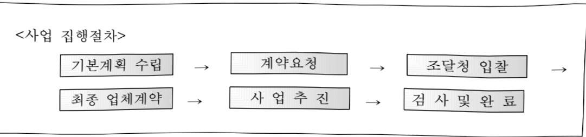

# 전산운영경비(정보화)

**해당 페이지**: PDF 21 ~ 30 쪽 해당

**부처**: 감사원
**분야**: 일반·지방행정
**회계유형**: 일반회계
**2026 확정예산**: 10300.0 백만원
**전년대비 증감률**: -36.1%
**AI 도메인**: 보안/사이버, 통신/네트워크

---

<table border=1 style='margin: auto; word-wrap: break-word;'><tr><td style='text-align: center; word-wrap: break-word;'>사 업 명</td></tr><tr><td style='text-align: center; word-wrap: break-word;'>(6) 전산운영경비(정보화) (1134-309)</td></tr></table>

☐ 사업 코드 정보

<table border=1 style='margin: auto; word-wrap: break-word;'><tr><td style='text-align: center; word-wrap: break-word;'>구분</td><td style='text-align: center; word-wrap: break-word;'>회계</td><td style='text-align: center; word-wrap: break-word;'>소관</td><td style='text-align: center; word-wrap: break-word;'>실국(기관)</td><td style='text-align: center; word-wrap: break-word;'>계정</td><td style='text-align: center; word-wrap: break-word;'>분야</td><td style='text-align: center; word-wrap: break-word;'>부문</td></tr><tr><td style='text-align: center; word-wrap: break-word;'>코드</td><td rowspan="2">일반회계</td><td rowspan="2">감사원</td><td rowspan="2">디지털감사국/적극행정공공감사지원관</td><td rowspan="2"></td><td style='text-align: center; word-wrap: break-word;'>010</td><td style='text-align: center; word-wrap: break-word;'>016</td></tr><tr><td style='text-align: center; word-wrap: break-word;'>명칭</td><td style='text-align: center; word-wrap: break-word;'>일반·지방행정</td><td style='text-align: center; word-wrap: break-word;'>일반행정</td></tr></table>

<table border=1 style='margin: auto; word-wrap: break-word;'><tr><td style='text-align: center; word-wrap: break-word;'>구분</td><td style='text-align: center; word-wrap: break-word;'>프로그램</td><td style='text-align: center; word-wrap: break-word;'>단위사업</td><td style='text-align: center; word-wrap: break-word;'>세부사업</td></tr><tr><td style='text-align: center; word-wrap: break-word;'>코드</td><td style='text-align: center; word-wrap: break-word;'>1100</td><td style='text-align: center; word-wrap: break-word;'>1134</td><td style='text-align: center; word-wrap: break-word;'>309</td></tr><tr><td style='text-align: center; word-wrap: break-word;'>명칭</td><td style='text-align: center; word-wrap: break-word;'>감사활동 및 행정지원</td><td style='text-align: center; word-wrap: break-word;'>전산운영경비</td><td style='text-align: center; word-wrap: break-word;'>전산운영경비(정보화)</td></tr></table>

□ 사업 성격

<table border=1 style='margin: auto; word-wrap: break-word;'><tr><td rowspan="2">신규</td><td rowspan="2">계속</td><td rowspan="2">완료</td><td rowspan="2">예비타당성 실시여부</td><td rowspan="2">총사업비 관리대상</td><td rowspan="2">총액계상 예산사업</td><td style='text-align: center; word-wrap: break-word;'>사업소관 변경정보</td></tr><tr><td style='text-align: center; word-wrap: break-word;'>2026예산 시 소관</td></tr><tr><td style='text-align: center; word-wrap: break-word;'></td><td style='text-align: center; word-wrap: break-word;'>○</td><td style='text-align: center; word-wrap: break-word;'></td><td style='text-align: center; word-wrap: break-word;'></td><td style='text-align: center; word-wrap: break-word;'></td><td style='text-align: center; word-wrap: break-word;'></td><td style='text-align: center; word-wrap: break-word;'></td></tr></table>

□ 사업 지원 형태 및 지원율

<table border=1 style='margin: auto; word-wrap: break-word;'><tr><td style='text-align: center; word-wrap: break-word;'>직접</td><td style='text-align: center; word-wrap: break-word;'>출자</td><td style='text-align: center; word-wrap: break-word;'>출연</td><td style='text-align: center; word-wrap: break-word;'>보조</td><td style='text-align: center; word-wrap: break-word;'>융자</td><td style='text-align: center; word-wrap: break-word;'>국고보조율(%)</td><td style='text-align: center; word-wrap: break-word;'>융자율(%)</td></tr><tr><td style='text-align: center; word-wrap: break-word;'>○</td><td style='text-align: center; word-wrap: break-word;'></td><td style='text-align: center; word-wrap: break-word;'></td><td style='text-align: center; word-wrap: break-word;'></td><td style='text-align: center; word-wrap: break-word;'></td><td style='text-align: center; word-wrap: break-word;'></td><td style='text-align: center; word-wrap: break-word;'></td></tr></table>

## □ 사업 담당자

<table border=1 style='margin: auto; word-wrap: break-word;'><tr><td style='text-align: center; word-wrap: break-word;'>사업명</td><td colspan="2">구분</td></tr><tr><td rowspan="2">감사자료분석시스템구축·운영</td><td style='text-align: center; word-wrap: break-word;'>소관부서</td><td style='text-align: center; word-wrap: break-word;'>디지털감사국</td></tr><tr><td style='text-align: center; word-wrap: break-word;'>사업시행주체</td><td style='text-align: center; word-wrap: break-word;'>감사원</td></tr><tr><td rowspan="2">OASYS구축·운영</td><td style='text-align: center; word-wrap: break-word;'>소관부서</td><td style='text-align: center; word-wrap: break-word;'>디지털감사국</td></tr><tr><td style='text-align: center; word-wrap: break-word;'>사업시행주체</td><td style='text-align: center; word-wrap: break-word;'>감사원</td></tr><tr><td rowspan="2">공공감사정보시스템구축·운영</td><td style='text-align: center; word-wrap: break-word;'>소관부서</td><td style='text-align: center; word-wrap: break-word;'>적극행정공공감사지원관</td></tr><tr><td style='text-align: center; word-wrap: break-word;'>사업시행주체</td><td style='text-align: center; word-wrap: break-word;'>감사원</td></tr><tr><td rowspan="2">사이버보안센터구축·운영</td><td style='text-align: center; word-wrap: break-word;'>소관부서</td><td style='text-align: center; word-wrap: break-word;'>디지털감사국</td></tr><tr><td style='text-align: center; word-wrap: break-word;'>사업시행주체</td><td style='text-align: center; word-wrap: break-word;'>감사원</td></tr></table>

---

### 가.예산 총괄표

(단위: 백만원, %)

<table border=1 style='margin: auto; word-wrap: break-word;'><tr><td rowspan="2">사업명</td><td rowspan="2">2024년 결산</td><td colspan="2">2025년 예산</td><td colspan="2">2026년</td><td rowspan="2">중감(B-A)</td><td rowspan="2">(B-A)/A</td></tr><tr><td style='text-align: center; word-wrap: break-word;'>본예산</td><td style='text-align: center; word-wrap: break-word;'>추경(A)</td><td style='text-align: center; word-wrap: break-word;'>요구안</td><td style='text-align: center; word-wrap: break-word;'>본예산(B)</td></tr><tr><td style='text-align: center; word-wrap: break-word;'>전산운영경비(정보화)</td><td style='text-align: center; word-wrap: break-word;'>12,508</td><td style='text-align: center; word-wrap: break-word;'>16,111</td><td style='text-align: center; word-wrap: break-word;'>16,111</td><td style='text-align: center; word-wrap: break-word;'>14,762</td><td style='text-align: center; word-wrap: break-word;'>10,300</td><td style='text-align: center; word-wrap: break-word;'>△5,811</td><td style='text-align: center; word-wrap: break-word;'>△36.1</td></tr></table>

□ 기능별(내역사업별) 예산 내역

(단위:백만원)

<table border=1 style='margin: auto; word-wrap: break-word;'><tr><td rowspan="2"></td><td colspan="5">2024</td><td colspan="5">2025</td><td rowspan="2">2026예산</td></tr><tr><td style='text-align: center; word-wrap: break-word;'>예산액(추정)</td><td style='text-align: center; word-wrap: break-word;'>예산현액</td><td style='text-align: center; word-wrap: break-word;'>집행액</td><td style='text-align: center; word-wrap: break-word;'>이월액</td><td style='text-align: center; word-wrap: break-word;'>불용액</td><td style='text-align: center; word-wrap: break-word;'>예산액(추정)</td><td style='text-align: center; word-wrap: break-word;'>예산현액</td><td style='text-align: center; word-wrap: break-word;'>집행액</td><td style='text-align: center; word-wrap: break-word;'>이월액</td><td style='text-align: center; word-wrap: break-word;'>불용액</td></tr><tr><td style='text-align: center; word-wrap: break-word;'>○ 기능별 분류(합계)</td><td style='text-align: center; word-wrap: break-word;'>15,865</td><td style='text-align: center; word-wrap: break-word;'>15,897</td><td style='text-align: center; word-wrap: break-word;'>12,508</td><td style='text-align: center; word-wrap: break-word;'>2,424</td><td style='text-align: center; word-wrap: break-word;'>965</td><td style='text-align: center; word-wrap: break-word;'>16,111</td><td style='text-align: center; word-wrap: break-word;'>18,535</td><td style='text-align: center; word-wrap: break-word;'>13,596</td><td style='text-align: center; word-wrap: break-word;'>3,594</td><td style='text-align: center; word-wrap: break-word;'>1,345</td><td style='text-align: center; word-wrap: break-word;'>10,300</td></tr><tr><td style='text-align: center; word-wrap: break-word;'>· 감사자료분석시스템 구축· 운영</td><td style='text-align: center; word-wrap: break-word;'>1,811</td><td style='text-align: center; word-wrap: break-word;'>1,811</td><td style='text-align: center; word-wrap: break-word;'>1,764</td><td style='text-align: center; word-wrap: break-word;'>-</td><td style='text-align: center; word-wrap: break-word;'>47</td><td style='text-align: center; word-wrap: break-word;'>1,781</td><td style='text-align: center; word-wrap: break-word;'>1,722</td><td style='text-align: center; word-wrap: break-word;'>1,699</td><td style='text-align: center; word-wrap: break-word;'>-</td><td style='text-align: center; word-wrap: break-word;'>23</td><td style='text-align: center; word-wrap: break-word;'>2,086</td></tr><tr><td style='text-align: center; word-wrap: break-word;'>· OASYS 구축· 운영</td><td style='text-align: center; word-wrap: break-word;'>12,822</td><td style='text-align: center; word-wrap: break-word;'>12,799</td><td style='text-align: center; word-wrap: break-word;'>9,481</td><td style='text-align: center; word-wrap: break-word;'>2,424</td><td style='text-align: center; word-wrap: break-word;'>894</td><td style='text-align: center; word-wrap: break-word;'>12,854</td><td style='text-align: center; word-wrap: break-word;'>15,337</td><td style='text-align: center; word-wrap: break-word;'>10,429</td><td style='text-align: center; word-wrap: break-word;'>3,594</td><td style='text-align: center; word-wrap: break-word;'>1,314</td><td style='text-align: center; word-wrap: break-word;'>6,504</td></tr><tr><td style='text-align: center; word-wrap: break-word;'>· 공공감사정보시스템 구축· 운영</td><td style='text-align: center; word-wrap: break-word;'>296</td><td style='text-align: center; word-wrap: break-word;'>351</td><td style='text-align: center; word-wrap: break-word;'>334</td><td style='text-align: center; word-wrap: break-word;'>-</td><td style='text-align: center; word-wrap: break-word;'>17</td><td style='text-align: center; word-wrap: break-word;'>540</td><td style='text-align: center; word-wrap: break-word;'>540</td><td style='text-align: center; word-wrap: break-word;'>536</td><td style='text-align: center; word-wrap: break-word;'>-</td><td style='text-align: center; word-wrap: break-word;'>4</td><td style='text-align: center; word-wrap: break-word;'>647</td></tr><tr><td style='text-align: center; word-wrap: break-word;'>· 사이버보안센터 구축운영</td><td style='text-align: center; word-wrap: break-word;'>936</td><td style='text-align: center; word-wrap: break-word;'>936</td><td style='text-align: center; word-wrap: break-word;'>929</td><td style='text-align: center; word-wrap: break-word;'>-</td><td style='text-align: center; word-wrap: break-word;'>7</td><td style='text-align: center; word-wrap: break-word;'>936</td><td style='text-align: center; word-wrap: break-word;'>936</td><td style='text-align: center; word-wrap: break-word;'>932</td><td style='text-align: center; word-wrap: break-word;'>-</td><td style='text-align: center; word-wrap: break-word;'>4</td><td style='text-align: center; word-wrap: break-word;'>1,063</td></tr></table>

※ '25년 집행액 등은 가결산 금액임

※ 동일 세부사업 및 동일 세목의 내역사업 간 조정 내역

-관리용역비 59백만원(감사자료분석시스템 구축·운영 △59백만원 → OASYS 구축·운영 +59백만원)

### 나.사업설명자료

## 1 ) 사업목적·내용

각종 전산시스템을 구축·개선하여 방대한 감사자료 등 데이터를 보다 효율적으로 관리하고, 자체감사기구와의 감사 관련 지식 등 공유를 도모하며 각종 사이버위협에 효과적으로 대응

(감사자료분석시스템 구축·운영) 전산화된 감사자료를 수집·분석·활용하고, 데이터

기반의 체계적·과학적 감사를 지원하여 감사 효율성 및 성과 제고를 위해 구축한 감사

---

자료분석시스템의 안정적 운영, '17년에 도입하여 노후화된 감사자료분석시스템의 제구축 및 클라우드 전환 등을 위해 정보화전략계획(ISP) 수립

(OASYS 구축·운영) 변화된 감사환경에 대응하기 위해 업무포털시스템인 OASYS (전자감사관리시스템, 실적관리시스템, 성과관리시스템, 홈페이지 등으로 구성)을 사용자 중심으로 고도화하고, 2025년 구축 완료한 5G 네트워크와 VDI(데스크탑 가상화) 등의 인프라를 안정적으로 운영하는 한편 감사업무용 PC 등 사무용 전산기기를 최적의 가동상태로 유지하는 등 업무 효율화를 도모

(공공감사정보시스템 구축·운영) [공공감사에 관한 법률](10년 제정)에 따라 구축한 공공감사정보시스템의 안정적 운영으로 감사원과 자체감사기구 간 감사 관련 지식과 경험을 공유하는 한편, 중복감사 방지 등 자체감사체계의 효율화 도모

(사이버보안센터 구축·운영) |국가사이버안전관리규정| 제10조의2 등에 따라 감사원 내부

자료 등을 대상으로 하는 주요 사이버위험에 대응하기 위해 사이버보안센터 구축·운영

## 2 ) 사업개요

## □ 사업근거 및 추진 경위

○ 사업근거

## 1 ) 감사자료분석시스템 · OASYS

-「전자정부법」

• 제16조(전자정부서비스 이용촉진을 위한 행정기관등의 책무) ① 행정기관등의 장은 국민의 복지향상 및 편익증진, 국민생활의 안전보장, 창업 및 공장설립 등 기업활동의 촉진 등을 위한 전자정부서비스를 개발하여 제공하고 이를 지속적으로 보완 · 발전시키기 위한 대책을 마련하여야 한다.

② 행정기관등의 장은 전자정부서비스 이용자가 손쉽게 전자정부서비스에 접근하여 안전하고 편리하게 활용할 수 있도록 하여야 하며, 제공되는 전자정부서비스는 최신의 것이 되도록 하여야 한다.

-「감사원법」

제25조(계산서 등의 제출) ① 감사원의 회계검사 및 직무감찰을 받는 자는

감사원규칙으로 정하는 바에 따라 계산서·증거서류·조서 및 그 밖의 자료를

---

감사원에 제출(정보통신망 이용촉진 및 정보보호 등에 관한 법률에 따른 정보통신망을 이용한 제출을 포함한다. 이하 같다)하여야 한다.

· 제26조(서면감사·실지감사) 감사원은 제25조에 따라 제출된 서류에 의하여 상시서면감사를 하는 외에 필요한 경우에는 직원을 현지에 파견하여 실지감사를 할 수 있다.

-「클라우드컴퓨팅 발전 및 이용자 보호에 관한 법률」

• 제12조(국가기관등의 클라우드컴퓨팅 도입 촉진) ① 국가기관등은 클라우드컴퓨팅을 도입하도록 노력하여야 한다.

- [감사원 운영 기본계획](14년)

：「IT기반 감사체계」 구축의 일환으로 감사자료 수집·분석체계 고도화 추진

## 2 ) 공공감사정보시스템

-「공공감사에 관한 법률」

· 제36조(감사정보시스템) ① 감사원은 감사 관련 지식과 경험을 공유하고 중복감사방지 등 중앙행정기관등의 자체감사체계 효율화를 위하여 감사정보시스템을 구축·운영할 수 있다.

② 감사기구의 장은 감사계획, 감사결과, 이행결과 등 대통령령으로 정하는 감사활동정보를 감사정보시스템에 입력 · 관리하여야 하고, 감사원은 그 정보의 공동활용방안을 마련하여야 한다.

-「공공감사에 관한 법률 시행령」

· 제20조(감사정보시스템의 구축·운영 등) ① 감사원은 법 제36조제1항에 따른 감사정보시스템(이하 “정보시스템”이라 한다)을 구축하는 경우 자체감사기구에서 정보시스템을 이용할 수 있도록 표준 프로그램을 개발하여 보급하여야 한다.

## 3 ) 사이버보안센터

-「국가사이버안전관리규정」

· 제10조의2(보안관제센터의 설치·운영) ① 중앙행정기관의 장, 지방자치단체의 장 및 공공기관의 장은 사이버공격 정보를 탐지·분석하여 즉시 대응 조치를 할 수 있는 기구(이하 "보안관제센터"라 한다)를 설치·운영하여야 한다. 다만, 보안관제센터를 설치·운영하지 못하는 경우에는 다른 중앙행정기관(국가정보원을 포함한다)의 장, 지방자치단체의 장 및 관계 공공기관의 장이 설치·운영하는 보안관제센터에 그 업무를 위탁할 수 있다.

---

## ○추진경위

## 1 ) 감사자료분석시스템

- '15. 11. ~ '16. 7. : 감사자료분석시스템 구축(1단계)

- '16. 6. ~ '17. 4. : 감사자료분석시스템 구축(2단계)

- '17. 5. ~ '17. 12. : 감사자료분석시스템 구축(3단계)

- '18. 10. ~ '19. 6. : 감사자료분석시스템 기능개선(4단계)

- '19. 8. ~ '20. 1. : 국가종합전자조달시스템 연계 등 기능개선(5단계-1차)

- '20. 3. ~ '20. 8. : 데이터분석기능 고도화 등 기능개선(5단계-2차)

- '20. 7. ~ '20. 11. : 범부처연구비통합관리시스템 연계 등 기능개선(6단계)

## 2 ) OASYS

- '04. 9. ~ '06. 8. : e-감사시스템 구축(1~2단계)

- '13. 12. ~ '14. 12. : OASYS(차세대 e-감사시스템)구축 (1~2단계)

- '16. 6. ~ '17. 4. : 전자감사관리시스템 구축

- '17. 5. ~ '17. 12. : 전자감사관리시스템 기능개선

- '17. 10. ~ '18. 2. : 전자의사진행 전용망 구축

- '19. 12. ~ '20. 5. : 실적평가시스템 구축

- '20. 5. ~ '20. 10. : 전자성과관리시스템 구축

- '21. 5. ~ '21. 8. : 전자감사관리시스템 개인정보 영향평가

- '22. 12. ~ '23. 4. : 차세대 OASYS 구축을 위한 정보화전략계획(ISP) 수립

- '23. 7.

: 차세대 OASYS 구축 기본계획 수립

- '24. 4.

: 차세대 OASYS 1단계 구축 사업추진계획 수립

- '24. 8. ~ '25. 5. : 차세대 OASYS 1단계 구축

- '25. 3.

: 차세대 OASYS 2단계 구축 사업추진계획 수립

- '25. 8. ~ : 차세대 OASYS 2단계 구축 진행 중

## 3 ) 공공감사정보시스템

- '11. 7. ~ '13. 5. : 공공감사정보시스템 구축(1~2단계)

- '20. 7. ~ '20. 10. : 공공감사정보시스템 재구축을 위한 정보화전략계획(ISP) 수립

- '22. 12. ~ '23. 12. : 차세대 공공감사정보시스템 구축

4) 사이버보안센터 ※ 계속사업 : 매년 운영·유지관리

- '20. 1. ~ '20. 6. : 사이버보안센터 구축

---

## □ 주요내용

① 사업규모

- 최근 5년 간 투입된 사업비

(단위:백만원)

<table border=1 style='margin: auto; word-wrap: break-word;'><tr><td style='text-align: center; word-wrap: break-word;'>$ \underline{\text{南도}} $</td><td style='text-align: center; word-wrap: break-word;'>2022</td><td style='text-align: center; word-wrap: break-word;'>2023</td><td style='text-align: center; word-wrap: break-word;'>2024</td><td style='text-align: center; word-wrap: break-word;'>2025</td><td style='text-align: center; word-wrap: break-word;'>2026</td></tr><tr><td style='text-align: center; word-wrap: break-word;'>$ \underline{\text{사업비}} $</td><td style='text-align: center; word-wrap: break-word;'>9,096</td><td style='text-align: center; word-wrap: break-word;'>7,505</td><td style='text-align: center; word-wrap: break-word;'>15,865</td><td style='text-align: center; word-wrap: break-word;'>16,111</td><td style='text-align: center; word-wrap: break-word;'>10,300</td></tr></table>

② 사업추진체계

- 사업시행방법 : 직접수행

- 사업시행주체 : 감사원

- 사업 수혜자 : 해당 없음

- 보조, 융자, 출연, 출자 등의 경우 보조.융자 등 지원 비율 및 법적근거 : 해당 없음

## 3 ) 2026년도 예산 산출 근거

○ 전산운영경비

- (요구) 감사원에서 운영 중인 정보시스템(감사자료분석시스템, OASYS, 공공감사정보시스템, 사이버보안센터)의 구축 및 안정적인 운영을 위한 예산 반영

- (산출) 감사자료분석시스템 구축·운영 2,086백만원, OASYS 구축·운영 6,504백만원

공공감사정보시스템 구축·운영 647백만원, 사이버보안센터 구축·운영 1,063백만원

## 4 ) 사업효과

☐ 사업영향, 산출물 성과지표 등

① 2022~2026년도 성과계획서 상 성과지표 및 최근 5년간 성과 달성도

<22~23년도 성과계획서 상 성과지표>

<table border=1 style='margin: auto; word-wrap: break-word;'><tr><td style='text-align: center; word-wrap: break-word;'>성과지표</td><td style='text-align: center; word-wrap: break-word;'>가중치</td><td style='text-align: center; word-wrap: break-word;'>구분</td><td style='text-align: center; word-wrap: break-word;'>&#x27;19</td><td style='text-align: center; word-wrap: break-word;'>&#x27;20</td><td style='text-align: center; word-wrap: break-word;'>&#x27;21</td><td style='text-align: center; word-wrap: break-word;'>&#x27;22</td><td style='text-align: center; word-wrap: break-word;'>&#x27;23</td><td style='text-align: center; word-wrap: break-word;'>&#x27;23목표치산출근거</td><td style='text-align: center; word-wrap: break-word;'>측정산식또는 측정방법</td><td style='text-align: center; word-wrap: break-word;'>자료수집 방법/출처</td></tr><tr><td rowspan="2">①감사활동의경제적성과(억원)</td><td rowspan="2">0.4</td><td style='text-align: center; word-wrap: break-word;'>목표</td><td style='text-align: center; word-wrap: break-word;'>신규</td><td style='text-align: center; word-wrap: break-word;'>신규</td><td style='text-align: center; word-wrap: break-word;'>29,786</td><td style='text-align: center; word-wrap: break-word;'>31,500</td><td style='text-align: center; word-wrap: break-word;'>32,000</td><td rowspan="2">최근 양적 위주의 지적을 지양하고 적극 행정 면책 활성화를 위해 노력하는 점을 감안, &#x27;21년도 목표치</td><td rowspan="2">변상판정, 추징·회수·보전, 환급·추급 금액 및 기대효과 금액</td><td rowspan="2">감사활동 실적</td></tr><tr><td style='text-align: center; word-wrap: break-word;'>실적</td><td style='text-align: center; word-wrap: break-word;'>26,389</td><td style='text-align: center; word-wrap: break-word;'>22,044</td><td style='text-align: center; word-wrap: break-word;'>21,018</td><td style='text-align: center; word-wrap: break-word;'>33,903</td><td style='text-align: center; word-wrap: break-word;'>23,401</td></tr></table>

---

<table border=1 style='margin: auto; word-wrap: break-word;'><tr><td rowspan="2">②공직기강 확립 지수(점)</td><td rowspan="2">0.4</td><td style='text-align: center; word-wrap: break-word;'>목표</td><td style='text-align: center; word-wrap: break-word;'>신규</td><td style='text-align: center; word-wrap: break-word;'>신규</td><td style='text-align: center; word-wrap: break-word;'>639</td><td style='text-align: center; word-wrap: break-word;'>650</td><td style='text-align: center; word-wrap: break-word;'>750</td><td rowspan="2">에서 점차 상승하도록 설정</td><td rowspan="2">∑(신분상·형사상 조처인원수×기증치)</td><td rowspan="2">감사활동 실적</td></tr><tr><td style='text-align: center; word-wrap: break-word;'>실적</td><td style='text-align: center; word-wrap: break-word;'>1,503</td><td style='text-align: center; word-wrap: break-word;'>592</td><td style='text-align: center; word-wrap: break-word;'>977</td><td style='text-align: center; word-wrap: break-word;'>892</td><td style='text-align: center; word-wrap: break-word;'>1,473</td></tr><tr><td rowspan="2">③적극행정 만족도 점수(점)</td><td rowspan="2">0.2</td><td style='text-align: center; word-wrap: break-word;'>목표</td><td style='text-align: center; word-wrap: break-word;'>신규</td><td style='text-align: center; word-wrap: break-word;'>신규</td><td style='text-align: center; word-wrap: break-word;'>50</td><td style='text-align: center; word-wrap: break-word;'>55</td><td style='text-align: center; word-wrap: break-word;'>57</td><td rowspan="2">2021년 최초 도입된 신규 지표임을 감안하여 매년 2점씩 상승하도록 설정, 향후 과거 추세치를 반영하여 상향 설정</td><td rowspan="2">사전컨설팅 및 적극행정면책 만족도 점수의 평균</td><td rowspan="2">설문조사</td></tr><tr><td style='text-align: center; word-wrap: break-word;'>실적</td><td style='text-align: center; word-wrap: break-word;'>신규</td><td style='text-align: center; word-wrap: break-word;'>신규</td><td style='text-align: center; word-wrap: break-word;'>63</td><td style='text-align: center; word-wrap: break-word;'>63.3</td><td style='text-align: center; word-wrap: break-word;'>71.81</td></tr></table>

*성과계획서 작성지침 개정에 따라 성과계획서 작성 단위가 프로그램별로 변경되어 '22년부터 성과지표가 변경됨

<24~26년도 성과계획서 상 성과지표>

<table border=1 style='margin: auto; word-wrap: break-word;'><tr><td rowspan="2">성과지표</td><td rowspan="2">가중치</td><td colspan="10">실적 및 목표치</td><td rowspan="2">&#x27;26목표치산출근거</td><td rowspan="2">측정산식또는 측정방법</td><td rowspan="2">자료수집방법/출처</td></tr><tr><td style='text-align: center; word-wrap: break-word;'>구분</td><td style='text-align: center; word-wrap: break-word;'>&#x27;20</td><td style='text-align: center; word-wrap: break-word;'>&#x27;21</td><td style='text-align: center; word-wrap: break-word;'>&#x27;22</td><td style='text-align: center; word-wrap: break-word;'>&#x27;23</td><td style='text-align: center; word-wrap: break-word;'>&#x27;24</td><td style='text-align: center; word-wrap: break-word;'>&#x27;25</td><td style='text-align: center; word-wrap: break-word;'>&#x27;26</td><td style='text-align: center; word-wrap: break-word;'>&#x27;27</td><td style='text-align: center; word-wrap: break-word;'>&#x27;28</td></tr><tr><td rowspan="2">①감사활동의경제적성과(억원)</td><td rowspan="2">0.5</td><td style='text-align: center; word-wrap: break-word;'>목표</td><td style='text-align: center; word-wrap: break-word;'>신규</td><td style='text-align: center; word-wrap: break-word;'>29,786</td><td style='text-align: center; word-wrap: break-word;'>31,500</td><td style='text-align: center; word-wrap: break-word;'>32,000</td><td style='text-align: center; word-wrap: break-word;'>32,500</td><td style='text-align: center; word-wrap: break-word;'>30,000</td><td style='text-align: center; word-wrap: break-word;'>30,000</td><td style='text-align: center; word-wrap: break-word;'>30,500</td><td style='text-align: center; word-wrap: break-word;'>31,000</td><td rowspan="2">국회감사요구 등국민제안감사의중가 등을 고려하여 전년도 목표와 동일하게 설정</td><td rowspan="2">변상판정,추징·회수·보전,환급·추급 금액 및 기대효과 금액</td><td rowspan="2">감사활동실적</td></tr><tr><td style='text-align: center; word-wrap: break-word;'>실적</td><td style='text-align: center; word-wrap: break-word;'>22,044</td><td style='text-align: center; word-wrap: break-word;'>21,018</td><td style='text-align: center; word-wrap: break-word;'>33,904</td><td style='text-align: center; word-wrap: break-word;'>23,402</td><td style='text-align: center; word-wrap: break-word;'>19,556</td><td style='text-align: center; word-wrap: break-word;'>-</td><td style='text-align: center; word-wrap: break-word;'>-</td><td style='text-align: center; word-wrap: break-word;'>-</td><td style='text-align: center; word-wrap: break-word;'>-</td></tr><tr><td rowspan="2">②공직비리적발실적(점)</td><td rowspan="2">0.5</td><td style='text-align: center; word-wrap: break-word;'>목표</td><td style='text-align: center; word-wrap: break-word;'>신규</td><td style='text-align: center; word-wrap: break-word;'>639</td><td style='text-align: center; word-wrap: break-word;'>650</td><td style='text-align: center; word-wrap: break-word;'>750</td><td style='text-align: center; word-wrap: break-word;'>850</td><td style='text-align: center; word-wrap: break-word;'>1,000</td><td style='text-align: center; word-wrap: break-word;'>1,050</td><td style='text-align: center; word-wrap: break-word;'>1,100</td><td style='text-align: center; word-wrap: break-word;'>1,150</td><td rowspan="2">국회 문제 제기에 따라 직급별·조치 유형별 구분단계를 단순화하여 배정하는 방식으로 개선</td><td rowspan="2">∑(신분상·형사상조치인원수×가중치)</td><td rowspan="2">감사활동실적</td></tr><tr><td style='text-align: center; word-wrap: break-word;'>실적</td><td style='text-align: center; word-wrap: break-word;'>592</td><td style='text-align: center; word-wrap: break-word;'>977</td><td style='text-align: center; word-wrap: break-word;'>892</td><td style='text-align: center; word-wrap: break-word;'>1,449</td><td style='text-align: center; word-wrap: break-word;'>1,105</td><td style='text-align: center; word-wrap: break-word;'>-</td><td style='text-align: center; word-wrap: break-word;'>-</td><td style='text-align: center; word-wrap: break-word;'>-</td><td style='text-align: center; word-wrap: break-word;'>-</td></tr></table>

* 2024년도 성과계획서 수립 시 프로그램이 1개인 부처는 2개 성과지표만 적용하도록 하여 2024회계연도부터 “적극행정 만족도” 지표 폐지

② 성과지표 이외의 연도별 사업추진 경과 및 실적

<table border=1 style='margin: auto; word-wrap: break-word;'><tr><td style='text-align: center; word-wrap: break-word;'>2022</td><td style='text-align: center; word-wrap: break-word;'>- 차세대 공공감사정보시스템 구축 추진</td></tr><tr><td style='text-align: center; word-wrap: break-word;'>2023</td><td style='text-align: center; word-wrap: break-word;'>- 차세대 OASYS 구축을 위한 정보화전략계획(ISP) 수립 - 차세대 OASYS 구축사업 추진 기본계획 수립 - 차세대 공공감사정보시스템 구축</td></tr><tr><td style='text-align: center; word-wrap: break-word;'>2024</td><td style='text-align: center; word-wrap: break-word;'>- 차세대 OASYS 구축(1단계) 추진</td></tr><tr><td style='text-align: center; word-wrap: break-word;'>2025</td><td style='text-align: center; word-wrap: break-word;'>- 차세대 OASYS 구축(2단계) 추진</td></tr></table>

---

## ③ 향후(2026년도 이후) 기대효과

(감사자료분석시스템) IT기반 감사체계 구축을 통해 감사업무의 효율성을 제고하고,

감사 대상기관의 수감부담 완화를 도모하는 '감사자료 분석시스템' 운영

- 회계.재정자료 등 반복적으로 요구하는 주요 감사자료를 정보통신망을 통해 주기적

으로 수집하고 통합 관리 및 공동 활용하여 수감기관의 자료제출을 최소화

(OASYS) VDI 도입으로 출장지 등에서 업무시스템에 접근함으로써 업무 효율성을 강화하고 감사과정에서 수집한 대량의 개인정보 등 내부자료 유출을 방지하는 등 내부자료에 대한 보안을 강화, 네트워크 대역폭 고도화로 감사 정보의 대용량화, 온라인 및 비대면 업무량 증가에 효과적으로 대응

- 비정형 자료(문서형태) 분석·활용 기능을 마련, 그간 축적된 감사보고서 등을 감사기획,

보고서 검색·작성 등에 활용함으로써 업무 효율성을 제고하고, 맞춤형 포털 및 최신

메신저 등 직원들이 체감할 수 있는 다양한 편의기능을 강화

- OASYS의 안정적인 운용 및 감사업무용 PC 등 사무용 전산기기를 최적의 가동

상태로 유지하여 업무 효율성 제고

(공공감사정보시스템) 감사원과 자체감사기구 간 감사지식·경험을 공유하고,

공공감사체계의 효율성을 제고하기 위해 자체감사기구 감사 현장의 수요자 활용

중심으로「공공감사정보시스템」을 운영하여 자체감사기구 이용자 시스템 활용도

몇만족도제고

(사이버보안센터) 사이버위험 관제 및 탐지 능력 향상과 사이버 침해사고 발생 시

즉각적인 분석, 대응으로 피해 범위 최소화

5) 타당성조사 및 예비타당성조사 시행여부 및 결과 요지 : 해당 없음

6) 총사업비 대상사업 여부 및 내역 : 해당 없음

---

## 7 ) 사업 집행절차

8) 최근 3년간 동 사업에 대한 주요 외부지적사항 및 평가, 문제점 및 대책

1) 국회(예결위, 상임위, 예정처, 국정감사 포함) 지적

□ 용역계약의 연말 체결에 따른 이월액 과다 재발 방지 필요(법사위·예결위 '22 결산심사)

○ 국회심의 내역과 다르게 ISP 사업범위를 확대하지 않도록 하고, 사업계획을 면밀히 수립하여 용역계약을 조기에 체결함으로써 과도하게 예산을 이월하는 사례가 재발하지 않도록 할 것

사전준비 소홀에 따른 사업지연 재발 방지 필요(예결위 '22 결산심사)

○ 공공감사정보시스템 재구축 사업 수행 시 사전준비 소홀에 따른 사업지연 문제가 발생하지 않도록 주의할 것

□ 사용 목적과 부합하는 예산 편성 필요(법사위·예결위 '23 결산심사)

○ 증거분석 프로그램 등 소프트웨어(SW) 갱신비용을 잘못된 비목으로 편성해 전액 불용 처리하였는데, 향후 예산 편성과 집행 시 지침을 준수하고 사용 목적에 부합하는 예산 항목을 올바르게 편성할 것

□ OASYS 구축·운영 사업 지연에 따른 후속 일정 체계적 관리 필요(법사위 '24 결산심사)

○ 정보시스템 구축 등 다년도 사업의 추진 일정을 충분히 검토하여 일정 지연으로 인한 예산 이월이 최소화되도록 하고, 이월된 후속 일정에 차질이 생기지 않도록 체계적으로 관리할 것

---

### 다. 최근 4년간 결산내역

## 1 ) 결산표

☐ 부처 결산내역

(단위: 백만원, %)

<table border=1 style='margin: auto; word-wrap: break-word;'><tr><td rowspan="2">闰도</td><td colspan="3">예산액</td><td rowspan="2">예산현액(A)</td><td rowspan="2">집행액(B)</td><td rowspan="2">집행률(B/A)</td><td rowspan="2">다음연도이월액</td><td rowspan="2">불용액</td></tr><tr><td style='text-align: center; word-wrap: break-word;'>본예산</td><td style='text-align: center; word-wrap: break-word;'>추경중감액</td><td style='text-align: center; word-wrap: break-word;'>추경</td></tr><tr><td style='text-align: center; word-wrap: break-word;'>2022</td><td style='text-align: center; word-wrap: break-word;'>9,096</td><td style='text-align: center; word-wrap: break-word;'>-</td><td style='text-align: center; word-wrap: break-word;'>9,096</td><td style='text-align: center; word-wrap: break-word;'>9,443</td><td style='text-align: center; word-wrap: break-word;'>7,567</td><td style='text-align: center; word-wrap: break-word;'>80.1</td><td style='text-align: center; word-wrap: break-word;'>1,480</td><td style='text-align: center; word-wrap: break-word;'>396</td></tr><tr><td style='text-align: center; word-wrap: break-word;'>2023</td><td style='text-align: center; word-wrap: break-word;'>7,505</td><td style='text-align: center; word-wrap: break-word;'>-</td><td style='text-align: center; word-wrap: break-word;'>7,505</td><td style='text-align: center; word-wrap: break-word;'>8,985</td><td style='text-align: center; word-wrap: break-word;'>8,757</td><td style='text-align: center; word-wrap: break-word;'>97.5</td><td style='text-align: center; word-wrap: break-word;'>55</td><td style='text-align: center; word-wrap: break-word;'>173</td></tr><tr><td style='text-align: center; word-wrap: break-word;'>2024</td><td style='text-align: center; word-wrap: break-word;'>15,865</td><td style='text-align: center; word-wrap: break-word;'>-</td><td style='text-align: center; word-wrap: break-word;'>15,865</td><td style='text-align: center; word-wrap: break-word;'>15,897</td><td style='text-align: center; word-wrap: break-word;'>12,508</td><td style='text-align: center; word-wrap: break-word;'>78.7</td><td style='text-align: center; word-wrap: break-word;'>2,424</td><td style='text-align: center; word-wrap: break-word;'>965</td></tr><tr><td style='text-align: center; word-wrap: break-word;'>2025</td><td style='text-align: center; word-wrap: break-word;'>16,111</td><td style='text-align: center; word-wrap: break-word;'>-</td><td style='text-align: center; word-wrap: break-word;'>16,111</td><td style='text-align: center; word-wrap: break-word;'>18,535</td><td style='text-align: center; word-wrap: break-word;'>13,596</td><td style='text-align: center; word-wrap: break-word;'>73.4</td><td style='text-align: center; word-wrap: break-word;'>3,594</td><td style='text-align: center; word-wrap: break-word;'>1,345</td></tr></table>

※ '25년 집행액 등은 가결산 금액임

## 2 ) 주요 결산사항

□ 2022년~2025년 주요 결산사항

<table border=1 style='margin: auto; word-wrap: break-word;'><tr><td style='text-align: center; word-wrap: break-word;'>2022</td><td style='text-align: center; word-wrap: break-word;'>○ 이월 사유: ‘차세대 OASYS 구축 및 전산센터 구축을 위한 ISP 용역’, ‘공공 감사정보시스템 재구축 사업’ 계약기간 미도래 사유로 1,480백만원 사고이월 ○ 불용 사유: 낙찰차액 및 예산절감 등에 따른 집행잔액 발생</td></tr><tr><td style='text-align: center; word-wrap: break-word;'>2023</td><td style='text-align: center; word-wrap: break-word;'>○ 이월 사유: ‘공공감사정보시스템 재구축 사업’ 계약기간 미도래로 55백만원 사고이월 ○ 불용 사유: 낙찰차액 및 예산절감 등에 따른 집행잔액</td></tr><tr><td style='text-align: center; word-wrap: break-word;'>2024</td><td style='text-align: center; word-wrap: break-word;'>○ 이월 사유: ‘차세대 OASYS 구축을 위한 감사원 네트워크 고도화 및 정보 보안 인프라 구축사업’ 등의 계약기간 미도래로 2,424백만원 사고이월 ○ 불용 사유: 자산취득비 등 낙찰차액 발생</td></tr><tr><td style='text-align: center; word-wrap: break-word;'>2025</td><td style='text-align: center; word-wrap: break-word;'>○ 이월 사유: ‘차세대 OASYS 구축 사업’ 등의 계약기간 미도래로 3,594백만원 사고이월 ○ 불용 사유: 자산취득비 등 낙찰차액 발생</td></tr></table>

□ 2025년 이·전용 등 세부내역 : 해당 없음

---

### 원본 PDF 크롭 이미지

