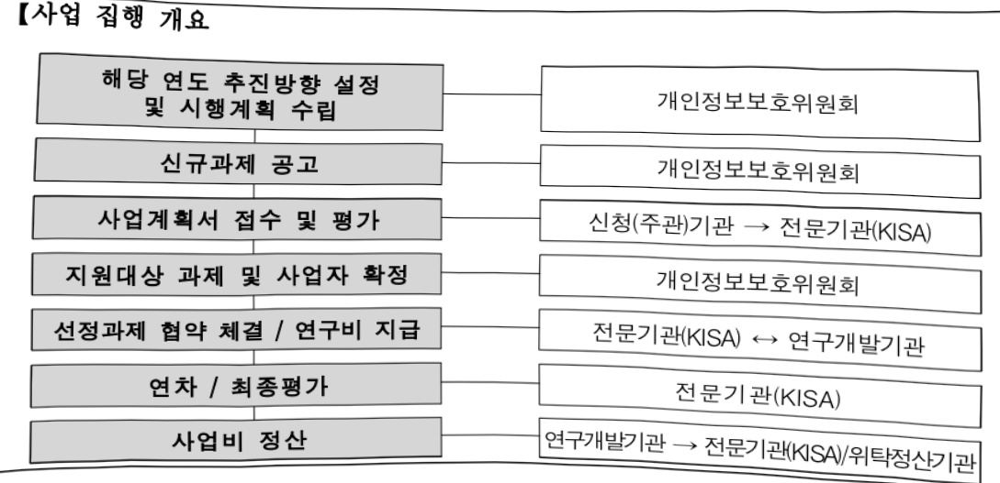

# 개인정보 안전활용 선도기술 개발(R&D)

**해당 페이지**: PDF 31 ~ 37 쪽 해당

**부처**: 개인정보보호위원회
**분야**: 일반·지방행정
**회계유형**: 일반회계
**2026 확정예산**: 6138.0 백만원
**전년대비 증감률**: None%
**AI 도메인**: 데이터

---

### 가.예산 총괄표

(단위: 백만원, %)

<table border=1 style='margin: auto; word-wrap: break-word;'><tr><td rowspan="2">사업명</td><td rowspan="2">2024년 결산</td><td colspan="2">2025년 예산</td><td colspan="2">2026년 예산</td><td rowspan="2">중감(B-A)</td><td rowspan="2">(B-A)/A</td></tr><tr><td style='text-align: center; word-wrap: break-word;'>본예산</td><td style='text-align: center; word-wrap: break-word;'>추경(A)</td><td style='text-align: center; word-wrap: break-word;'>요구안</td><td style='text-align: center; word-wrap: break-word;'>본예산(B)</td></tr><tr><td style='text-align: center; word-wrap: break-word;'>개인정보 안전활용 선도기술 개발(R&amp;D)</td><td style='text-align: center; word-wrap: break-word;'>-</td><td style='text-align: center; word-wrap: break-word;'>-</td><td style='text-align: center; word-wrap: break-word;'>-</td><td style='text-align: center; word-wrap: break-word;'>6,138</td><td style='text-align: center; word-wrap: break-word;'>6,138</td><td style='text-align: center; word-wrap: break-word;'>6,138</td><td style='text-align: center; word-wrap: break-word;'>순증</td></tr></table>

□ 기능별(내역사업별) 예산 내역

(단위:백만원)

<table border=1 style='margin: auto; word-wrap: break-word;'><tr><td rowspan="3"></td><td colspan="5">2024</td><td colspan="7">2025</td><td rowspan="3">2026예산</td></tr><tr><td rowspan="2">예산액(추정)</td><td rowspan="2">예산현액</td><td rowspan="2">집행액[실집행액]</td><td rowspan="2">이월액</td><td rowspan="2">불용액</td><td rowspan="2">본예산</td><td rowspan="2">예산현액</td><td rowspan="2">집행액[실집행액]</td><td colspan="2">전년도 이월액제외</td><td rowspan="2">이월액</td><td rowspan="2">불용액</td></tr><tr><td style='text-align: center; word-wrap: break-word;'>예산현액</td><td style='text-align: center; word-wrap: break-word;'>집행액[실집행액]</td></tr><tr><td style='text-align: center; word-wrap: break-word;'>○ 기능별 분류(합계)</td><td style='text-align: center; word-wrap: break-word;'>-</td><td style='text-align: center; word-wrap: break-word;'>-</td><td style='text-align: center; word-wrap: break-word;'>-</td><td style='text-align: center; word-wrap: break-word;'>-</td><td style='text-align: center; word-wrap: break-word;'>-</td><td style='text-align: center; word-wrap: break-word;'>-</td><td style='text-align: center; word-wrap: break-word;'>-</td><td style='text-align: center; word-wrap: break-word;'>-</td><td style='text-align: center; word-wrap: break-word;'>-</td><td style='text-align: center; word-wrap: break-word;'>-</td><td style='text-align: center; word-wrap: break-word;'>-</td><td style='text-align: center; word-wrap: break-word;'>-</td><td style='text-align: center; word-wrap: break-word;'>6,138</td></tr><tr><td rowspan="3">· 원본데이터안전활용 기술· AI프라이버시리스크대응기술 개발· 기평비</td><td style='text-align: center; word-wrap: break-word;'>-</td><td style='text-align: center; word-wrap: break-word;'>-</td><td style='text-align: center; word-wrap: break-word;'>-</td><td style='text-align: center; word-wrap: break-word;'>-</td><td style='text-align: center; word-wrap: break-word;'>-</td><td style='text-align: center; word-wrap: break-word;'>-</td><td style='text-align: center; word-wrap: break-word;'>-</td><td style='text-align: center; word-wrap: break-word;'>-</td><td style='text-align: center; word-wrap: break-word;'>-</td><td style='text-align: center; word-wrap: break-word;'>-</td><td style='text-align: center; word-wrap: break-word;'>-</td><td style='text-align: center; word-wrap: break-word;'>-</td><td style='text-align: center; word-wrap: break-word;'>4,560</td></tr><tr><td style='text-align: center; word-wrap: break-word;'>-</td><td style='text-align: center; word-wrap: break-word;'>-</td><td style='text-align: center; word-wrap: break-word;'>-</td><td style='text-align: center; word-wrap: break-word;'>-</td><td style='text-align: center; word-wrap: break-word;'>-</td><td style='text-align: center; word-wrap: break-word;'>-</td><td style='text-align: center; word-wrap: break-word;'>-</td><td style='text-align: center; word-wrap: break-word;'>-</td><td style='text-align: center; word-wrap: break-word;'>-</td><td style='text-align: center; word-wrap: break-word;'>-</td><td style='text-align: center; word-wrap: break-word;'>-</td><td style='text-align: center; word-wrap: break-word;'>-</td><td style='text-align: center; word-wrap: break-word;'>1,344</td></tr><tr><td style='text-align: center; word-wrap: break-word;'>-</td><td style='text-align: center; word-wrap: break-word;'>-</td><td style='text-align: center; word-wrap: break-word;'>-</td><td style='text-align: center; word-wrap: break-word;'>-</td><td style='text-align: center; word-wrap: break-word;'>-</td><td style='text-align: center; word-wrap: break-word;'>-</td><td style='text-align: center; word-wrap: break-word;'>-</td><td style='text-align: center; word-wrap: break-word;'>-</td><td style='text-align: center; word-wrap: break-word;'>-</td><td style='text-align: center; word-wrap: break-word;'>-</td><td style='text-align: center; word-wrap: break-word;'>-</td><td style='text-align: center; word-wrap: break-word;'>-</td><td style='text-align: center; word-wrap: break-word;'>234</td></tr></table>

---

### 나. 사업설명자료

## 1 ) 사업목적·내용

- 개인정보 안전활용 기술을 통해 개인정보 유·노출 사고를 예방하고 신뢰받는 데이터 활용 생태계 구축

- (원본데이터 안전 활용 기술) 합성데이터 생성·검증 기술, 가명·익명처리 기술, 딥페이크 대응 생체정보 무단도용 방지 기술 등 안전한 원본데이터 활용 기술 개발

- (AI 프라이버시 리스크 대응 기술 개발) 생성/추론형 AI 등 고도화된 AI 모델 대상

통용 가능한 프라이버시 리스크 대응 기술 개발

## 2 ) 사업개요

## □ 사업근거 및 추진경위

① 법령상 근거 및 조항 적시

- 개인정보 보호법 제7조의8(보호위원회의 소관 사무)

제7조의8(보호위원회의 소관 사무) 보호위원회는 다음 각 호의 소관 사무를 수행한다.

7. 개인정보 보호에 관한 기술개발의 지원·보급, 기술의 표준화 및 전문인력의 양성에 관한 사항

## ② 추진경위

- 「개인정보 보호·활용 기술 R&D 로드맵('22-26)」 수립('21.11.)

- 개인정보보호위원회 R&D 사업 추진('22.~)

* 개인정보보호 강화기술 연구개발('22.~'25.), 개인정보 기술표준 개발지원('23.~'25.), 신뢰기반의 AI 개인정보 보호 · 활용 기술개발('25~'27)

- 개인정보위-KISA-개인정보 기술포럼「초거대 AI 시대, 개인정보 보호·활용 정책과 기술 방향」민·관 합동 세미나('23.5)

-「개인정보보호 기본계획(24-26)」 발표(23.6)

-「인공지능(AI) 시대 안전한 개인정보 활용 정책 방향」발표('23.8)

- 비정형 데이터 포함 가명정보 처리 가이드라인 개정(24.2.)

- 「합성데이터 생성 참조모델」 발표('24.5), 「합성데이터 생성 · 활용 안내서」 발간('24.12)

- AI 프라이버시 리스크 관리 모델 발간(24.12.)

---

## □ 주요내용

① 사업규모

- 총사업비 : 해당없음

- 사업기간 : 2026년 ~ 2028년(3년)

- 최근 5년 간 투입된 사업비

<table border=1 style='margin: auto; word-wrap: break-word;'><tr><td style='text-align: center; word-wrap: break-word;'>연도</td><td style='text-align: center; word-wrap: break-word;'>2022</td><td style='text-align: center; word-wrap: break-word;'>2023</td><td style='text-align: center; word-wrap: break-word;'>2024</td><td style='text-align: center; word-wrap: break-word;'>2025</td><td style='text-align: center; word-wrap: break-word;'>2026</td></tr><tr><td style='text-align: center; word-wrap: break-word;'>사업비</td><td style='text-align: center; word-wrap: break-word;'>-</td><td style='text-align: center; word-wrap: break-word;'>-</td><td style='text-align: center; word-wrap: break-word;'>-</td><td style='text-align: center; word-wrap: break-word;'>-</td><td style='text-align: center; word-wrap: break-word;'>6,138</td></tr></table>

- 기타 : 해당없음

② 사업추진체계

- 사업시행방법 : 출연

- 사업시행주체 : 개인정보보호위원회, 한국인터넷진흥원

- 사업 수혜자 : 정보주체(국민), 개인정보 보호·활용 기술 분야 기업·사업자 등

- 보조, 융자, 출연, 출자 등의 경우 보조·융자 등 지원 비율 및 법적근거

<table border=1 style='margin: auto; word-wrap: break-word;'><tr><td style='text-align: center; word-wrap: break-word;'>내역사업명</td><td style='text-align: center; word-wrap: break-word;'>구분</td><td style='text-align: center; word-wrap: break-word;'>피보조·피출연 등 기관명</td><td style='text-align: center; word-wrap: break-word;'>지원 금액 (2026예산)</td><td style='text-align: center; word-wrap: break-word;'>지원 비율(%)</td><td style='text-align: center; word-wrap: break-word;'>보조율 법적근거 (해당 조항)</td></tr><tr><td style='text-align: center; word-wrap: break-word;'>원본데이터 안전 활용 기술</td><td style='text-align: center; word-wrap: break-word;'>출연</td><td style='text-align: center; word-wrap: break-word;'>한국인터넷 진흥원</td><td style='text-align: center; word-wrap: break-word;'>4,560</td><td style='text-align: center; word-wrap: break-word;'>100</td><td style='text-align: center; word-wrap: break-word;'>「국가연구개발혁신법」 제22조(전문기관의 지정 등) 제2항 제2호</td></tr><tr><td style='text-align: center; word-wrap: break-word;'>AI 프라이버시리스크 대응 기술 개발</td><td style='text-align: center; word-wrap: break-word;'>출연</td><td style='text-align: center; word-wrap: break-word;'>한국인터넷 진흥원</td><td style='text-align: center; word-wrap: break-word;'>1,344</td><td style='text-align: center; word-wrap: break-word;'>100</td><td style='text-align: center; word-wrap: break-word;'>「국가연구개발혁신법」 제22조(전문기관의 지정 등) 제2항 제2호</td></tr><tr><td style='text-align: center; word-wrap: break-word;'>기평비</td><td style='text-align: center; word-wrap: break-word;'>출연</td><td style='text-align: center; word-wrap: break-word;'>한국인터넷 진흥원</td><td style='text-align: center; word-wrap: break-word;'>234</td><td style='text-align: center; word-wrap: break-word;'>100</td><td style='text-align: center; word-wrap: break-word;'>「국가연구개발혁신법」 제22조(전문기관의 지정 등) 제2항 제2호</td></tr></table>

---

□원본데이터안전활용기술개발

:(25)0→(26)4,560백만원,순증

- (요구) 합성데이터 생성·검증 기술, 가명·익명처리 기술, 딥페이크 대응 생체정보

  무단 도용 방지 기술 등 안전한 원본데이터 활용 기술 개발을 위한 예산 요구

- (산출) 4,560백만원

  ·1개 과제(신규) × 1,920백만원 × 9/12개월 = 1,440백만원

  ·3개 과제(신규) × 1,387백만원 × 9/12개월 = 3,120백만원

<table border=1 style='margin: auto; word-wrap: break-word;'><tr><td colspan="2">&#x27;25년 예산</td><td colspan="2">&#x27;26년 예산안</td></tr><tr><td style='text-align: center; word-wrap: break-word;'>예산</td><td style='text-align: center; word-wrap: break-word;'>산출내역</td><td style='text-align: center; word-wrap: break-word;'>예산</td><td style='text-align: center; word-wrap: break-word;'>산출내역</td></tr><tr><td style='text-align: center; word-wrap: break-word;'>-</td><td style='text-align: center; word-wrap: break-word;'>-</td><td colspan="2">○ 연구개발활동비등(360-05): 4,560,000원</td></tr><tr><td style='text-align: center; word-wrap: break-word;'></td><td style='text-align: center; word-wrap: break-word;'></td><td colspan="2">가. 원본데이터 안전활용 기술개발 (4,560,000원)</td></tr><tr><td style='text-align: center; word-wrap: break-word;'></td><td style='text-align: center; word-wrap: break-word;'></td><td colspan="2">· 신규과제 1개 × 1,920,000전원 × 9/12개월 = 1,440,000전원
· 신규과제 3개 × 1,387,000전원 × 9/12개월 = 3,120,000전원</td></tr></table>

## AI 프라이버시 리스크 대응기술 개발

:(25)0→(26)1,344백만원,순증

- (요구) 생성/추론형 AI 등 고도화된 AI 모델 대상 통용 가능한 프라이버시리스크 대응 기술 개발을 위한 예산 요구

- (산출) 2개 과제(신규) × 896백만원 × 9/12개월 = 1,344백만원

<table border=1 style='margin: auto; word-wrap: break-word;'><tr><td colspan="2">&#x27;25년 예산</td><td colspan="2">&#x27;26년 예산안</td></tr><tr><td style='text-align: center; word-wrap: break-word;'>예산</td><td style='text-align: center; word-wrap: break-word;'>산출내역</td><td style='text-align: center; word-wrap: break-word;'>예산</td><td style='text-align: center; word-wrap: break-word;'>산출내역</td></tr><tr><td style='text-align: center; word-wrap: break-word;'></td><td style='text-align: center; word-wrap: break-word;'>-</td><td style='text-align: center; word-wrap: break-word;'>1,344,000</td><td style='text-align: center; word-wrap: break-word;'>☐ 연구개발활동비등(360-05): 1,344,000천원</td></tr><tr><td style='text-align: center; word-wrap: break-word;'></td><td style='text-align: center; word-wrap: break-word;'></td><td colspan="2">가. AI프라이버시 리스크 대응기술 개발 (1,344,000천원)
• 신규과제 2개 × 896,000천원 × 9/12개월 = 1,344,000천원</td></tr></table>

기평비

:(25)0→(26)234백만원,순증

- (요구) 세부사업의 기획, 평가 및 성과 관리 등을 위해 소요되는 기평비 요구

- (산출) 1개 × 234백만원 × 12/12개월 = 234백만원

<table border=1 style='margin: auto; word-wrap: break-word;'><tr><td rowspan="5">예산</td><td colspan="2">25년 예산</td><td colspan="2">&#x27;26년 예산안</td></tr><tr><td style='text-align: center; word-wrap: break-word;'>산출내역</td><td style='text-align: center; word-wrap: break-word;'>예산</td><td colspan="2">산출내역</td></tr><tr><td rowspan="3"></td><td rowspan="3">234,000</td><td colspan="2">○ 연구개발기획평가관리비(360-06): 234,000전원</td></tr><tr><td colspan="2">가. 기평비 (234,000전원)</td></tr><tr><td colspan="2">• 1개 × 234,000전원 × 12/12개월 = 234,000전원</td></tr></table>

---

## 4 ) 사업효과

☐ 사업영향, 산출물 성과지표 등

① '22~'26년도 성과계획서 상 성과지표 및 최근 5년간 성과 달성도

<table border=1 style='margin: auto; word-wrap: break-word;'><tr><td style='text-align: center; word-wrap: break-word;'>성과지표</td><td style='text-align: center; word-wrap: break-word;'>구분</td><td style='text-align: center; word-wrap: break-word;'>&#x27;22</td><td style='text-align: center; word-wrap: break-word;'>&#x27;23</td><td style='text-align: center; word-wrap: break-word;'>&#x27;24</td><td style='text-align: center; word-wrap: break-word;'>&#x27;25</td><td style='text-align: center; word-wrap: break-word;'>&#x27;26</td><td style='text-align: center; word-wrap: break-word;'>&#x27;26목표치산출근거</td><td style='text-align: center; word-wrap: break-word;'>측정산식(또는 측정방법)</td><td style='text-align: center; word-wrap: break-word;'>자료수집방법(또는 자료출처)</td></tr><tr><td rowspan="3">가명정보지원플랫폼서비스이용건수(건)</td><td style='text-align: center; word-wrap: break-word;'>목표</td><td style='text-align: center; word-wrap: break-word;'>신규</td><td style='text-align: center; word-wrap: break-word;'>신규</td><td style='text-align: center; word-wrap: break-word;'>신규</td><td style='text-align: center; word-wrap: break-word;'>2,043</td><td style='text-align: center; word-wrap: break-word;'>2,247</td><td rowspan="3">ㅇ 데이터 활용 수요 증가 등 정책 환경 변화를 반영하여 &#x27;25년 목표치에서 10% 상향한 도전적인 목표치인 2,247건으로 설정</td><td rowspan="3">가명정보지원플랫폼 내각 서비스 이용건수의 합계</td><td rowspan="3">가명정보지원플랫폼에서 각 서비스 이용건수 확인</td></tr><tr><td style='text-align: center; word-wrap: break-word;'>실적</td><td style='text-align: center; word-wrap: break-word;'>신규</td><td style='text-align: center; word-wrap: break-word;'>신규</td><td style='text-align: center; word-wrap: break-word;'>신규</td><td style='text-align: center; word-wrap: break-word;'>-</td><td style='text-align: center; word-wrap: break-word;'>-</td></tr><tr><td style='text-align: center; word-wrap: break-word;'>달성도</td><td style='text-align: center; word-wrap: break-word;'>신규</td><td style='text-align: center; word-wrap: break-word;'>신규</td><td style='text-align: center; word-wrap: break-word;'>신규</td><td style='text-align: center; word-wrap: break-word;'>-</td><td style='text-align: center; word-wrap: break-word;'>-</td></tr></table>

② 성과지표 이외의 연도별 사업추진 경과 및 실적 : 해당사항 없음

③ 향후('26년도 이후) 기대효과

- 원본데이터 재식별 위험 감소, 개인정보 기술 산업 분야 창출 및 경제 효과 증대,

개인정보 분야 산업 활성화 기반 마련

- AGI 환경에서의 프라이버시 리스크 경감 및 개인정보 유출 방지를 통해 정보

주체 권리 보호 강화 및 국민 신뢰 확보

5) 타당성조사 및 예비타당성조사 시행여부 및 결과 요지 : 해당사항 없음

6) 총사업비 대상사업 여부 및 내역 : 해당사항 없음

7) 사업 집행절차

【사업 집행 개요

연구개발기관→전문기관(KISA)/위탁정산기관

---

## 【사업 집행 세부 절차】

<원본데이터 안전활용 기술개발>

<table border=1 style='margin: auto; word-wrap: break-word;'><tr><td style='text-align: center; word-wrap: break-word;'>부처</td><td style='text-align: center; word-wrap: break-word;'></td><td style='text-align: center; word-wrap: break-word;'>피출연·피보조기관</td><td style='text-align: center; word-wrap: break-word;'></td><td style='text-align: center; word-wrap: break-word;'>간접보조사업자·사업수행자</td></tr><tr><td style='text-align: center; word-wrap: break-word;'>개인정보보호위원회(4,560백만원)</td><td style='text-align: center; word-wrap: break-word;'>=&gt;(4,560백만원)</td><td style='text-align: center; word-wrap: break-word;'>한국인터넷진흥원(-)</td><td style='text-align: center; word-wrap: break-word;'>=&gt;(4,560백만원)</td><td style='text-align: center; word-wrap: break-word;'>4개 과제별 연구개발기관</td></tr></table>

<AI프라이버시 리스크 대응기술 개발>

<table border=1 style='margin: auto; word-wrap: break-word;'><tr><td style='text-align: center; word-wrap: break-word;'>부처</td><td style='text-align: center; word-wrap: break-word;'></td><td style='text-align: center; word-wrap: break-word;'>피출연·피보조기관</td><td style='text-align: center; word-wrap: break-word;'></td><td style='text-align: center; word-wrap: break-word;'>간접보조사업자·사업수행자</td></tr><tr><td style='text-align: center; word-wrap: break-word;'>개인정보보호위원회(1,344백만원)</td><td style='text-align: center; word-wrap: break-word;'>=&gt;(1,344백만원)</td><td style='text-align: center; word-wrap: break-word;'>한국인터넷진흥원(-)</td><td style='text-align: center; word-wrap: break-word;'>=&gt;(1,344백만원)</td><td style='text-align: center; word-wrap: break-word;'>2개 과제별 연구개발기관</td></tr></table>

## <기평비>

<table border=1 style='margin: auto; word-wrap: break-word;'><tr><td style='text-align: center; word-wrap: break-word;'>부처</td><td style='text-align: center; word-wrap: break-word;'></td><td style='text-align: center; word-wrap: break-word;'>피출연·피보조기관</td><td style='text-align: center; word-wrap: break-word;'></td><td style='text-align: center; word-wrap: break-word;'>간접보조사업자·사업수행자</td></tr><tr><td style='text-align: center; word-wrap: break-word;'>개인정보보호위원회(234백만원)</td><td style='text-align: center; word-wrap: break-word;'>=&gt;(234백만원)</td><td style='text-align: center; word-wrap: break-word;'>한국인터넷진흥원(234백만원)</td><td style='text-align: center; word-wrap: break-word;'>=&gt;(-)</td><td style='text-align: center; word-wrap: break-word;'>-</td></tr></table>

## 8 ) 각종 평가

<table border=1 style='margin: auto; word-wrap: break-word;'><tr><td style='text-align: center; word-wrap: break-word;'>1) 국회(예결위, 상임위, 예정처, 국정감사 포함) 지적 : 해당사항 없음</td></tr><tr><td style='text-align: center; word-wrap: break-word;'>2) 감사원 감사 또는 국무총리실 지적 : 해당사항 없음</td></tr><tr><td style='text-align: center; word-wrap: break-word;'>3) 자체평가·감사 : 해당사항 없음</td></tr></table>

### 다. 최근 4년간 결산내역 : 해당없음

---

<table border=1 style='margin: auto; word-wrap: break-word;'><tr><td style='text-align: center; word-wrap: break-word;'>사 업 명</td></tr><tr><td style='text-align: center; word-wrap: break-word;'>(9) 신뢰기반의 AI 개인정보 보호·활용 기술개발(R&amp;D) (1033-305)</td></tr></table>

□ 사업 코드 정보

<table border=1 style='margin: auto; word-wrap: break-word;'><tr><td style='text-align: center; word-wrap: break-word;'>구분</td><td style='text-align: center; word-wrap: break-word;'>회계</td><td style='text-align: center; word-wrap: break-word;'>소관</td><td style='text-align: center; word-wrap: break-word;'>실국(기관)</td><td style='text-align: center; word-wrap: break-word;'>계정</td><td style='text-align: center; word-wrap: break-word;'>분야</td><td style='text-align: center; word-wrap: break-word;'>부문</td></tr><tr><td style='text-align: center; word-wrap: break-word;'>코드</td><td rowspan="2">일반회계</td><td rowspan="2">개인정보 보호위원회</td><td rowspan="2">개인정보 보호위원회</td><td rowspan="2">-</td><td style='text-align: center; word-wrap: break-word;'>010</td><td style='text-align: center; word-wrap: break-word;'>015</td></tr><tr><td style='text-align: center; word-wrap: break-word;'>명칭</td><td style='text-align: center; word-wrap: break-word;'>일반·지방행정</td><td style='text-align: center; word-wrap: break-word;'>정부자원관리</td></tr></table>

<table border=1 style='margin: auto; word-wrap: break-word;'><tr><td style='text-align: center; word-wrap: break-word;'>구분</td><td style='text-align: center; word-wrap: break-word;'>프로그램</td><td style='text-align: center; word-wrap: break-word;'>단위사업</td><td style='text-align: center; word-wrap: break-word;'>세부사업</td></tr><tr><td style='text-align: center; word-wrap: break-word;'>코드</td><td style='text-align: center; word-wrap: break-word;'>1000</td><td style='text-align: center; word-wrap: break-word;'>1033</td><td style='text-align: center; word-wrap: break-word;'>305</td></tr><tr><td style='text-align: center; word-wrap: break-word;'>명칭</td><td style='text-align: center; word-wrap: break-word;'>개인정보보호 기반 데이터 활용 선도</td><td style='text-align: center; word-wrap: break-word;'>개인정보보호연구</td><td style='text-align: center; word-wrap: break-word;'>신뢰기반의 AI 개인정보 보호·활용 기술개발(R&amp;D)</td></tr></table>

☐ 사업 성격

<table border=1 style='margin: auto; word-wrap: break-word;'><tr><td rowspan="2">신규</td><td rowspan="2">계속</td><td rowspan="2">완료</td><td style='text-align: center; word-wrap: break-word;'>예비타당성</td><td style='text-align: center; word-wrap: break-word;'>총사업비</td><td style='text-align: center; word-wrap: break-word;'>총액계상</td><td style='text-align: center; word-wrap: break-word;'>사업소관 변경정보</td></tr><tr><td style='text-align: center; word-wrap: break-word;'>실시여부</td><td style='text-align: center; word-wrap: break-word;'>관리대상</td><td style='text-align: center; word-wrap: break-word;'>예산사업</td><td style='text-align: center; word-wrap: break-word;'>2025예산 시 소관</td></tr><tr><td style='text-align: center; word-wrap: break-word;'></td><td style='text-align: center; word-wrap: break-word;'>○</td><td style='text-align: center; word-wrap: break-word;'></td><td style='text-align: center; word-wrap: break-word;'></td><td style='text-align: center; word-wrap: break-word;'></td><td style='text-align: center; word-wrap: break-word;'></td><td style='text-align: center; word-wrap: break-word;'></td></tr></table>

□ 사업 지원 형태 및 지원율

<table border=1 style='margin: auto; word-wrap: break-word;'><tr><td style='text-align: center; word-wrap: break-word;'>직접</td><td style='text-align: center; word-wrap: break-word;'>출자</td><td style='text-align: center; word-wrap: break-word;'>출연</td><td style='text-align: center; word-wrap: break-word;'>보조</td><td style='text-align: center; word-wrap: break-word;'>융자</td><td style='text-align: center; word-wrap: break-word;'>국고보조율(%)</td><td style='text-align: center; word-wrap: break-word;'>융자율(%)</td></tr><tr><td style='text-align: center; word-wrap: break-word;'></td><td style='text-align: center; word-wrap: break-word;'></td><td style='text-align: center; word-wrap: break-word;'>0</td><td style='text-align: center; word-wrap: break-word;'></td><td style='text-align: center; word-wrap: break-word;'></td><td style='text-align: center; word-wrap: break-word;'></td><td style='text-align: center; word-wrap: break-word;'></td></tr></table>

□ 사업 소관부처 및 시행주체

<table border=1 style='margin: auto; word-wrap: break-word;'><tr><td style='text-align: center; word-wrap: break-word;'>사업명</td><td colspan="2">구분</td></tr><tr><td rowspan="2">AI 대응 개인정보보호 강화기술 개발</td><td style='text-align: center; word-wrap: break-word;'>소관부처</td><td style='text-align: center; word-wrap: break-word;'>개인정보정책국 신기술개인정보과</td></tr><tr><td style='text-align: center; word-wrap: break-word;'>사업시행주체</td><td style='text-align: center; word-wrap: break-word;'>한국인터넷진흥원</td></tr><tr><td rowspan="2">기평비</td><td style='text-align: center; word-wrap: break-word;'>소관부처</td><td style='text-align: center; word-wrap: break-word;'>개인정보정책국 신기술개인정보과</td></tr><tr><td style='text-align: center; word-wrap: break-word;'>사업시행주체</td><td style='text-align: center; word-wrap: break-word;'>한국인터넷진흥원</td></tr></table>

---

### 원본 PDF 크롭 이미지

