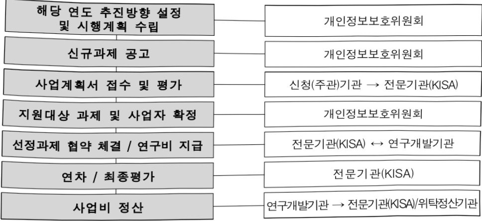

# 신뢰기반의 AI 개인정보 보호·활용 기술개발(R&D)

**해당 페이지**: PDF 38 ~ 45 쪽 해당

**부처**: 개인정보보호위원회
**분야**: 일반·지방행정
**회계유형**: 일반회계
**2026 확정예산**: 2660.0 백만원
**전년대비 증감률**: 77.3%
**AI 도메인**: 보안/사이버, 교육/인재

---

### 가. 예산 총괄표

(단위: 백만원, %)

<table border=1 style='margin: auto; word-wrap: break-word;'><tr><td rowspan="2">사업명</td><td rowspan="2">2024년 결산</td><td colspan="2">2025년 예산</td><td colspan="2">2026년 예산</td><td rowspan="2">증감(B-A)</td><td rowspan="2">(B-A)/A</td></tr><tr><td style='text-align: center; word-wrap: break-word;'>본예산</td><td style='text-align: center; word-wrap: break-word;'>추경(A)</td><td style='text-align: center; word-wrap: break-word;'>요구안</td><td style='text-align: center; word-wrap: break-word;'>본예산(B)</td></tr><tr><td style='text-align: center; word-wrap: break-word;'>신뢰기반의 AI 개인정보 보호·활용 기술개발(R&amp;D)</td><td style='text-align: center; word-wrap: break-word;'>-</td><td style='text-align: center; word-wrap: break-word;'>1,500</td><td style='text-align: center; word-wrap: break-word;'>1,500</td><td style='text-align: center; word-wrap: break-word;'>2,660</td><td style='text-align: center; word-wrap: break-word;'>2,660</td><td style='text-align: center; word-wrap: break-word;'>1,160</td><td style='text-align: center; word-wrap: break-word;'>77.3</td></tr></table>

□ 기능별(내역사업별) 예산 내역

(단위:백만원)

<table border=1 style='margin: auto; word-wrap: break-word;'><tr><td rowspan="3"></td><td colspan="5">2024</td><td colspan="7">2025</td><td rowspan="3">2026예산</td></tr><tr><td rowspan="2">예산액(추정)</td><td rowspan="2">예산현액</td><td rowspan="2">집행액[실집행액]</td><td rowspan="2">이월액</td><td rowspan="2">불용액</td><td rowspan="2">본예산</td><td rowspan="2">예산현액</td><td rowspan="2">집행액[실집행액]</td><td colspan="2">전년도 이월액제외</td><td rowspan="2">이월액</td><td rowspan="2">불용액</td></tr><tr><td style='text-align: center; word-wrap: break-word;'>예산현액</td><td style='text-align: center; word-wrap: break-word;'>집행액[실집행액]</td></tr><tr><td style='text-align: center; word-wrap: break-word;'>○ 기능별 분류(합계)</td><td style='text-align: center; word-wrap: break-word;'>-</td><td style='text-align: center; word-wrap: break-word;'>-</td><td style='text-align: center; word-wrap: break-word;'>-</td><td style='text-align: center; word-wrap: break-word;'>-</td><td style='text-align: center; word-wrap: break-word;'>-</td><td style='text-align: center; word-wrap: break-word;'>1,500</td><td style='text-align: center; word-wrap: break-word;'>1,500</td><td style='text-align: center; word-wrap: break-word;'>1,500[1,496]</td><td style='text-align: center; word-wrap: break-word;'>1,500</td><td style='text-align: center; word-wrap: break-word;'>1,500[1,496]</td><td style='text-align: center; word-wrap: break-word;'>-</td><td style='text-align: center; word-wrap: break-word;'>-</td><td style='text-align: center; word-wrap: break-word;'>2,660</td></tr><tr><td rowspan="2">· AI 대응 개인정보보호 강화기술 개발·기평비</td><td style='text-align: center; word-wrap: break-word;'>-</td><td style='text-align: center; word-wrap: break-word;'>-</td><td style='text-align: center; word-wrap: break-word;'>-</td><td style='text-align: center; word-wrap: break-word;'>-</td><td style='text-align: center; word-wrap: break-word;'>-</td><td style='text-align: center; word-wrap: break-word;'>1,440</td><td style='text-align: center; word-wrap: break-word;'>1,440</td><td style='text-align: center; word-wrap: break-word;'>1,440[1,440]</td><td style='text-align: center; word-wrap: break-word;'>1,440</td><td style='text-align: center; word-wrap: break-word;'>1,440[1,440]</td><td style='text-align: center; word-wrap: break-word;'>-</td><td style='text-align: center; word-wrap: break-word;'>-</td><td style='text-align: center; word-wrap: break-word;'>2,560</td></tr><tr><td style='text-align: center; word-wrap: break-word;'>-</td><td style='text-align: center; word-wrap: break-word;'>-</td><td style='text-align: center; word-wrap: break-word;'>-</td><td style='text-align: center; word-wrap: break-word;'>-</td><td style='text-align: center; word-wrap: break-word;'>-</td><td style='text-align: center; word-wrap: break-word;'>60</td><td style='text-align: center; word-wrap: break-word;'>60</td><td style='text-align: center; word-wrap: break-word;'>60[56]</td><td style='text-align: center; word-wrap: break-word;'>60</td><td style='text-align: center; word-wrap: break-word;'>60[56]</td><td style='text-align: center; word-wrap: break-word;'>-</td><td style='text-align: center; word-wrap: break-word;'>-</td><td style='text-align: center; word-wrap: break-word;'>100</td></tr></table>

---

### 나. 사업설명자료

## 1 ) 사업목적·내용

- AI에 대응한 개인정보 특화 기술개발을 통해 개인정보 침해 예방 등 안전 활용을 지원하여 신뢰 기반의 AI 산업 육성

- (AI 대응 개인정보보호 강화기술 개발) AI 학습·서비스 제공 및 활용 등 AI 전 단계에서의 안전한 개인정보 활용 지원, 정보주체의 실질적 권리 보장을 위한 프라이버시 수준 진단 등 다양한 AI 대응 개인정보보호 강화 기술개발

## 2 ) 사업개요

## □ 사업근거 및 추진경위

① 법령상 근거 및 조항 적시

- 개인정보 보호법 제7조의8(보호위원회의 소관 사무)

제7조의8(보호위원회의 소관 사무) 보호위원회는 다음 각 호의 소관 사무를 수행한다.

7. 개인정보 보호에 관한 기술개발의 지원·보급, 기술의 표준화 및 전문인력의 양성에 관한 사항

## ② 추진경위

- 「개인정보 보호·활용 기술 R&D 로드맵(22-26)」 수립(21.11.)

- 개인정보위-KISA-개인정보 기술포럼「초거대 AI 시대, 개인정보 보호·활용 정책과 기술 방향」민·관 합동 세미나('23.5.)

-「개인정보보호 기본계획(24-26)」 발표(23.6.)

-「인공지능(AI) 시대 안전한 개인정보 활용 정책 방향」발표('23.8.)

- 개인정보보호 전문가(산·학·연) 대상 수요조사 및 신규과제 수요 발굴, AI에 대응한 개인정보보호 기술개발 기획(~'24.2.)

- 산·학·연 전문가가 참여한 개인정보 보호·활용 기술개발 사전 기획위원회 등을 통해 기술개발 수요 도출 및 과제 발굴('24.2.~3.)

- 기술개발 과제 공모('25.1.) 및 수행('25.4.~)

---

□ 주요내용

① 사업규모

- 총사업비 : 해당없음

- 사업기간 : 2025년 ~ 2027년(3년)

- 최근 5년 간 투입된 사업비

<table border=1 style='margin: auto; word-wrap: break-word;'><tr><td style='text-align: center; word-wrap: break-word;'>연도</td><td style='text-align: center; word-wrap: break-word;'>2022</td><td style='text-align: center; word-wrap: break-word;'>2023</td><td style='text-align: center; word-wrap: break-word;'>2024</td><td style='text-align: center; word-wrap: break-word;'>2025</td><td style='text-align: center; word-wrap: break-word;'>2026</td></tr><tr><td style='text-align: center; word-wrap: break-word;'>사업비</td><td style='text-align: center; word-wrap: break-word;'>-</td><td style='text-align: center; word-wrap: break-word;'>-</td><td style='text-align: center; word-wrap: break-word;'>-</td><td style='text-align: center; word-wrap: break-word;'>1,500</td><td style='text-align: center; word-wrap: break-word;'>2,660</td></tr></table>

- 기타 : 해당사항 없음

② 사업추진체계

- 사업시행방법 : 출연

- 사업시행주체 : 개인정보보호위원회, 한국인터넷진흥원

- 사업 수혜자 : 정보주체(국민), 개인정보 보호·활용 기술 분야 기업·사업자 등

- 보조, 융자, 출연, 출자 등의 경우 보조·융자 등 지원 비율 및 법적근거

<table border=1 style='margin: auto; word-wrap: break-word;'><tr><td style='text-align: center; word-wrap: break-word;'>내역사업명</td><td style='text-align: center; word-wrap: break-word;'>구분</td><td style='text-align: center; word-wrap: break-word;'>피보조·피출연 등 기관명</td><td style='text-align: center; word-wrap: break-word;'>지원 금액 (2026예산)</td><td style='text-align: center; word-wrap: break-word;'>지원 비율(%)</td><td style='text-align: center; word-wrap: break-word;'>보조율 법적근거 (해당 조항)</td></tr><tr><td style='text-align: center; word-wrap: break-word;'>AI 대응 개인정보 보호강화 기술 개발</td><td style='text-align: center; word-wrap: break-word;'>출연</td><td style='text-align: center; word-wrap: break-word;'>한국인터넷 진흥원</td><td style='text-align: center; word-wrap: break-word;'>2,560</td><td style='text-align: center; word-wrap: break-word;'>100</td><td style='text-align: center; word-wrap: break-word;'>「국가연구개발혁신법」 제22조(전문기관의 지정 등) 제2항 제2호</td></tr><tr><td style='text-align: center; word-wrap: break-word;'>기평비</td><td style='text-align: center; word-wrap: break-word;'>출연</td><td style='text-align: center; word-wrap: break-word;'>한국인터넷 진흥원</td><td style='text-align: center; word-wrap: break-word;'>100</td><td style='text-align: center; word-wrap: break-word;'>100</td><td style='text-align: center; word-wrap: break-word;'>「국가연구개발혁신법」 제22조(전문기관의 지정 등) 제2항 제2호</td></tr></table>

---

AI 대응 개인정보보호 강화기술 개발

:(25)1,440백만원→(26)2,560백만원(+1,120백만원,+77.8%)

- (요구) 인공지능 기술로 인한 개인정보 침해예방 등 AI 환경에서의 프라이버시 보호 기술개발을 위한 신규 예산 요구

- (산출) 2개 과제(계속) × 1,280백만원 × 12/12개월 = 2,560백만원

<table border=1 style='margin: auto; word-wrap: break-word;'><tr><td colspan="2">&#x27;25년 예산</td><td colspan="2">&#x27;26년 예산</td></tr><tr><td style='text-align: center; word-wrap: break-word;'>예산</td><td style='text-align: center; word-wrap: break-word;'>산출내역</td><td style='text-align: center; word-wrap: break-word;'>예산</td><td style='text-align: center; word-wrap: break-word;'>산출내역</td></tr><tr><td style='text-align: center; word-wrap: break-word;'>1,440,000</td><td style='text-align: center; word-wrap: break-word;'>연구개발활동비등(360-05): 1,440,000전원</td><td style='text-align: center; word-wrap: break-word;'>2,560,000</td><td style='text-align: center; word-wrap: break-word;'>연구개발활동비등(360-05): 2,560,000전원</td></tr><tr><td colspan="2">가. AI 대응 개인정보보호 강화기술 개발 (1,440,000전원)</td><td colspan="2">가. AI 대응 개인정보보호 강화기술 개발 (2,560,000전원)</td></tr><tr><td colspan="2">· 신규과제 2개 × 960,000전원 × 9/12개월 = 1,440,000전원</td><td colspan="2">· 계속과제 2개 × 1,280,000전원 × 12/12개월 = 2,560,000전원</td></tr></table>

기평비

:(25)60백만원→(26)100백만원(+40백만원,+66.7%)

- (요구) 세부사업의 기획, 평가 및 성과 관리 등을 위해 소요되는 기평비 요구

- (산출) 1개 × 100백만원 × 12/12개월 = 100백만원

<table border=1 style='margin: auto; word-wrap: break-word;'><tr><td colspan="2">25년 예산</td><td colspan="2">26년 예산</td></tr><tr><td style='text-align: center; word-wrap: break-word;'>예산</td><td style='text-align: center; word-wrap: break-word;'>산출내역</td><td style='text-align: center; word-wrap: break-word;'>예산</td><td style='text-align: center; word-wrap: break-word;'>산출내역</td></tr><tr><td style='text-align: center; word-wrap: break-word;'>60,000</td><td style='text-align: center; word-wrap: break-word;'>연구개발기획평가관리비(360-06): 60,000천원</td><td style='text-align: center; word-wrap: break-word;'>100,000</td><td style='text-align: center; word-wrap: break-word;'>연구개발기획평가관리비(360-06): 100,000천원</td></tr><tr><td colspan="2">가 기명비(60,000천원)</td><td colspan="2">가 기명비(100,000천원)</td></tr><tr><td colspan="2">· 1개 × 60,000천원 × 12/12개월 = 60,000천원</td><td colspan="2">· 1개 × 100,000천원 × 12/12개월 = 100,000천원</td></tr></table>

## 4 ) 사업효과

□ 사업영향, 산출물 성과지표 등

① '22~'26년도 성과계획서 상 성과지표 및 최근 5년간 성과 달성도

<table border=1 style='margin: auto; word-wrap: break-word;'><tr><td style='text-align: center; word-wrap: break-word;'>성과지표</td><td style='text-align: center; word-wrap: break-word;'>구분</td><td style='text-align: center; word-wrap: break-word;'>&#x27;22</td><td style='text-align: center; word-wrap: break-word;'>&#x27;23</td><td style='text-align: center; word-wrap: break-word;'>&#x27;24</td><td style='text-align: center; word-wrap: break-word;'>&#x27;25</td><td style='text-align: center; word-wrap: break-word;'>&#x27;26</td><td style='text-align: center; word-wrap: break-word;'>&#x27;26목표치산출근거</td><td style='text-align: center; word-wrap: break-word;'>측정산식(또는 측정방법)</td><td style='text-align: center; word-wrap: break-word;'>자료수집방법(또는 자료출처)</td></tr><tr><td rowspan="3">가명정보지원플랫폼서비스 이용전수(전)</td><td style='text-align: center; word-wrap: break-word;'>목표</td><td style='text-align: center; word-wrap: break-word;'>신규</td><td style='text-align: center; word-wrap: break-word;'>신규</td><td style='text-align: center; word-wrap: break-word;'>신규</td><td style='text-align: center; word-wrap: break-word;'>2,043</td><td style='text-align: center; word-wrap: break-word;'>2,247</td><td rowspan="3">ㅇ 데이터 활용 수요 증가 등 정책 환경 변화를 반영하여 &#x27;25년 목표치에서 10% 성명한 도전적인 목표치인 2247건으로 설정</td><td rowspan="3">가명정보지원플랫폼 내 각 서비스 이용전수의 합계</td><td rowspan="3">가명정보지원플랫폼에서 각 서비스 이용전수 확인</td></tr><tr><td style='text-align: center; word-wrap: break-word;'>실적</td><td style='text-align: center; word-wrap: break-word;'>신규</td><td style='text-align: center; word-wrap: break-word;'>신규</td><td style='text-align: center; word-wrap: break-word;'>신규</td><td style='text-align: center; word-wrap: break-word;'>-</td><td style='text-align: center; word-wrap: break-word;'>-</td></tr><tr><td style='text-align: center; word-wrap: break-word;'>달성도</td><td style='text-align: center; word-wrap: break-word;'>신규</td><td style='text-align: center; word-wrap: break-word;'>신규</td><td style='text-align: center; word-wrap: break-word;'>신규</td><td style='text-align: center; word-wrap: break-word;'>-</td><td style='text-align: center; word-wrap: break-word;'>-</td></tr></table>

---

② 성과지표 이외의 연도별 사업추진 경과 및 실적

<table border=1 style='margin: auto; word-wrap: break-word;'><tr><td style='text-align: center; word-wrap: break-word;'>2022</td><td style='text-align: center; word-wrap: break-word;'>-</td></tr><tr><td style='text-align: center; word-wrap: break-word;'>2023</td><td style='text-align: center; word-wrap: break-word;'>-</td></tr><tr><td style='text-align: center; word-wrap: break-word;'>2024</td><td style='text-align: center; word-wrap: break-word;'>-</td></tr><tr><td style='text-align: center; word-wrap: break-word;'>2025</td><td style='text-align: center; word-wrap: break-word;'>o &#x27;25년도 R&amp;D 사업 공모(1월) 및 협약 체결(4월)o &#x27;25년도 R&amp;D 사업 정부출연금 지급(5월)o &#x27;25년도 R&amp;D 수행 연구개발기관대상 현장컨설팅 및 상시점검(7월)o &#x27;25년도 R&amp;D 사업 단계평가(11월)</td></tr></table>

③ 향후(26년도 이후) 기대효과

- 신뢰 기반의 한국형 AI 육성 지원을 통해 AI 관련 개인정보 기술 선도 및 글로벌 시장에서의 경쟁력 강화

- AI 관련 개인정보 기술개발을 통해 실질적으로 개인정보 보호·활용 정책을 지원하여 국민이 신뢰하고 개인정보가 안전한 AI 시대 구현 가능

5) 타당성조사 및 예비타당성조사 시행여부 및 결과 요지 : 해당사항 없음

6) 총사업비 대상사업 여부 및 내역 : 해당사항 없음

## 7 ) 사업 집행절차

【사업 집행 개요】

---

## 【사업 집행 세부 절차】

<AI 대응 개인정보보호 강화기술 개발>

<table border=1 style='margin: auto; word-wrap: break-word;'><tr><td style='text-align: center; word-wrap: break-word;'>부처</td><td style='text-align: center; word-wrap: break-word;'></td><td style='text-align: center; word-wrap: break-word;'>피출연·피보조기관</td><td style='text-align: center; word-wrap: break-word;'></td><td style='text-align: center; word-wrap: break-word;'>간접보조사업자·사업수행자</td></tr><tr><td style='text-align: center; word-wrap: break-word;'>개인정보보호위원회(2,560백만원)</td><td style='text-align: center; word-wrap: break-word;'>=&gt;(2,560백만원)</td><td style='text-align: center; word-wrap: break-word;'>한국인터넷진흥원(-)</td><td style='text-align: center; word-wrap: break-word;'>=&gt;(2,560백만원)</td><td style='text-align: center; word-wrap: break-word;'>2개 과제별 연구개발기관</td></tr></table>

<기평비>

<table border=1 style='margin: auto; word-wrap: break-word;'><tr><td style='text-align: center; word-wrap: break-word;'>부처</td><td style='text-align: center; word-wrap: break-word;'></td><td style='text-align: center; word-wrap: break-word;'>피출연·피보조기관</td><td style='text-align: center; word-wrap: break-word;'></td><td style='text-align: center; word-wrap: break-word;'>간접보조사업자·사업수행자</td></tr><tr><td style='text-align: center; word-wrap: break-word;'>개인정보보호위원회(100백만원)</td><td style='text-align: center; word-wrap: break-word;'>=&gt;(100백만원)</td><td style='text-align: center; word-wrap: break-word;'>한국인터넷진흥원(100백만원)</td><td style='text-align: center; word-wrap: break-word;'>=&gt;(-)</td><td style='text-align: center; word-wrap: break-word;'>-</td></tr></table>

## 8 ) 각종 평가

1) 국회(예결위, 상임위, 예정처, 국정감사 포함) 지적

<table border=1 style='margin: auto; word-wrap: break-word;'><tr><td style='text-align: center; word-wrap: break-word;'>구분</td><td style='text-align: center; word-wrap: break-word;'>세부내용</td></tr><tr><td style='text-align: center; word-wrap: break-word;'>예결위 (&#x27;26년 예산)</td><td style='text-align: center; word-wrap: break-word;'>○ (지적사항) 1차년도 사업 예산 대비 연간 과제 단가를 증액 편성한 것에 상응하여 추가되는 과업내용을 구체적으로 명시하고 과제 관리 철저 필요○ (조치계획) 과제단가 상승에 따라 추후 추가적 과업 명시 및 성과목표 조정 등 연구개발기관과 재협약을 체결하고, 철저히 과제관리 수행할 예정</td></tr><tr><td colspan="2">2) 감사원 감사 또는 국무총리실 지적 : 해당사항 없음3) 자체평가·감사 : 해당사항 없음</td></tr></table>

---

### 다. 최근 4년간 결산내역

## 1 ) 결산표

☐ 부처 결산내역

(단위: 백만원, %)

<table border=1 style='margin: auto; word-wrap: break-word;'><tr><td rowspan="2">연도</td><td colspan="3">예산액</td><td rowspan="2">전년도이월액</td><td rowspan="2">이·전용등</td><td rowspan="2">예비비</td><td rowspan="2">예산현액(B)</td><td rowspan="2">집행액(C)</td><td rowspan="2">집행률(C/A)</td><td rowspan="2">집행률(C/B)</td><td rowspan="2">다음연도이월액</td><td rowspan="2">불용액</td></tr><tr><td style='text-align: center; word-wrap: break-word;'>본예산</td><td style='text-align: center; word-wrap: break-word;'>추경중감액</td><td style='text-align: center; word-wrap: break-word;'>추경(A)</td></tr><tr><td style='text-align: center; word-wrap: break-word;'>2022</td><td style='text-align: center; word-wrap: break-word;'>-</td><td style='text-align: center; word-wrap: break-word;'>-</td><td style='text-align: center; word-wrap: break-word;'>-</td><td style='text-align: center; word-wrap: break-word;'>-</td><td style='text-align: center; word-wrap: break-word;'>-</td><td style='text-align: center; word-wrap: break-word;'>-</td><td style='text-align: center; word-wrap: break-word;'>-</td><td style='text-align: center; word-wrap: break-word;'>-</td><td style='text-align: center; word-wrap: break-word;'>-</td><td style='text-align: center; word-wrap: break-word;'>-</td><td style='text-align: center; word-wrap: break-word;'>-</td><td style='text-align: center; word-wrap: break-word;'>-</td></tr><tr><td style='text-align: center; word-wrap: break-word;'>2023</td><td style='text-align: center; word-wrap: break-word;'>-</td><td style='text-align: center; word-wrap: break-word;'>-</td><td style='text-align: center; word-wrap: break-word;'>-</td><td style='text-align: center; word-wrap: break-word;'>-</td><td style='text-align: center; word-wrap: break-word;'>-</td><td style='text-align: center; word-wrap: break-word;'>-</td><td style='text-align: center; word-wrap: break-word;'>-</td><td style='text-align: center; word-wrap: break-word;'>-</td><td style='text-align: center; word-wrap: break-word;'>-</td><td style='text-align: center; word-wrap: break-word;'>-</td><td style='text-align: center; word-wrap: break-word;'>-</td><td style='text-align: center; word-wrap: break-word;'>-</td></tr><tr><td style='text-align: center; word-wrap: break-word;'>2024</td><td style='text-align: center; word-wrap: break-word;'>-</td><td style='text-align: center; word-wrap: break-word;'>-</td><td style='text-align: center; word-wrap: break-word;'>-</td><td style='text-align: center; word-wrap: break-word;'>-</td><td style='text-align: center; word-wrap: break-word;'>-</td><td style='text-align: center; word-wrap: break-word;'>-</td><td style='text-align: center; word-wrap: break-word;'>-</td><td style='text-align: center; word-wrap: break-word;'>-</td><td style='text-align: center; word-wrap: break-word;'>-</td><td style='text-align: center; word-wrap: break-word;'>-</td><td style='text-align: center; word-wrap: break-word;'>-</td><td style='text-align: center; word-wrap: break-word;'>-</td></tr><tr><td style='text-align: center; word-wrap: break-word;'>2025</td><td style='text-align: center; word-wrap: break-word;'>1,500</td><td style='text-align: center; word-wrap: break-word;'>-</td><td style='text-align: center; word-wrap: break-word;'>1,500</td><td style='text-align: center; word-wrap: break-word;'>-</td><td style='text-align: center; word-wrap: break-word;'>-</td><td style='text-align: center; word-wrap: break-word;'>-</td><td style='text-align: center; word-wrap: break-word;'>1,500</td><td style='text-align: center; word-wrap: break-word;'>1,500</td><td style='text-align: center; word-wrap: break-word;'>100</td><td style='text-align: center; word-wrap: break-word;'>100</td><td style='text-align: center; word-wrap: break-word;'>-</td><td style='text-align: center; word-wrap: break-word;'>-</td></tr></table>

## 2 ) 주요 결산사항

2022~2025년 결산 주요사항 : 해당사항 없음

□ 2025년 이·전용 등 세부내역 : 해당사항 없음

---

<table border=1 style='margin: auto; word-wrap: break-word;'><tr><td style='text-align: center; word-wrap: break-word;'>사 업 명</td></tr><tr><td style='text-align: center; word-wrap: break-word;'>(6) 안전한 데이터 활용 지원 (1032-302)</td></tr></table>

□ 사업 코드 정보

<table border=1 style='margin: auto; word-wrap: break-word;'><tr><td style='text-align: center; word-wrap: break-word;'>구분</td><td style='text-align: center; word-wrap: break-word;'>회계</td><td style='text-align: center; word-wrap: break-word;'>소관</td><td style='text-align: center; word-wrap: break-word;'>실국(기관)</td><td style='text-align: center; word-wrap: break-word;'>계정</td><td style='text-align: center; word-wrap: break-word;'>분야</td><td style='text-align: center; word-wrap: break-word;'>부문</td></tr><tr><td style='text-align: center; word-wrap: break-word;'>코드</td><td rowspan="2">일반회계</td><td rowspan="2">개인정보보호위원회</td><td rowspan="2">개인정보보호위원회</td><td rowspan="2">-</td><td style='text-align: center; word-wrap: break-word;'>010</td><td style='text-align: center; word-wrap: break-word;'>015</td></tr><tr><td style='text-align: center; word-wrap: break-word;'>명칭</td><td style='text-align: center; word-wrap: break-word;'>일반·지방행정</td><td style='text-align: center; word-wrap: break-word;'>정부자원관리</td></tr></table>

<table border=1 style='margin: auto; word-wrap: break-word;'><tr><td style='text-align: center; word-wrap: break-word;'>구분</td><td style='text-align: center; word-wrap: break-word;'>프로그램</td><td style='text-align: center; word-wrap: break-word;'>단위사업</td><td style='text-align: center; word-wrap: break-word;'>세부사업</td></tr><tr><td style='text-align: center; word-wrap: break-word;'>코드</td><td style='text-align: center; word-wrap: break-word;'>1000</td><td style='text-align: center; word-wrap: break-word;'>1032</td><td style='text-align: center; word-wrap: break-word;'>302</td></tr><tr><td style='text-align: center; word-wrap: break-word;'>명칭</td><td style='text-align: center; word-wrap: break-word;'>개인정보보호 기반 데이터 활용 선도</td><td style='text-align: center; word-wrap: break-word;'>개인정보활용지원</td><td style='text-align: center; word-wrap: break-word;'>안전한 데이터 활용 지원</td></tr></table>

□ 사업 성격

<table border=1 style='margin: auto; word-wrap: break-word;'><tr><td style='text-align: center; word-wrap: break-word;'>신규</td><td style='text-align: center; word-wrap: break-word;'>계속</td><td style='text-align: center; word-wrap: break-word;'>완료</td><td style='text-align: center; word-wrap: break-word;'>예비타당성 실시여부</td><td style='text-align: center; word-wrap: break-word;'>총사업비 관리대상</td><td style='text-align: center; word-wrap: break-word;'>총액계상 예산사업</td><td style='text-align: center; word-wrap: break-word;'>사업소관 변경정보</td></tr><tr><td style='text-align: center; word-wrap: break-word;'></td><td style='text-align: center; word-wrap: break-word;'>○</td><td style='text-align: center; word-wrap: break-word;'></td><td style='text-align: center; word-wrap: break-word;'></td><td style='text-align: center; word-wrap: break-word;'></td><td style='text-align: center; word-wrap: break-word;'></td><td style='text-align: center; word-wrap: break-word;'></td></tr></table>

□ 사업 지원 형태 및 지원을

<table border=1 style='margin: auto; word-wrap: break-word;'><tr><td style='text-align: center; word-wrap: break-word;'>직접</td><td style='text-align: center; word-wrap: break-word;'>출자</td><td style='text-align: center; word-wrap: break-word;'>출연</td><td style='text-align: center; word-wrap: break-word;'>보조</td><td style='text-align: center; word-wrap: break-word;'>융자</td><td style='text-align: center; word-wrap: break-word;'>국고보조율(%)</td><td style='text-align: center; word-wrap: break-word;'>융자율(%)</td></tr><tr><td style='text-align: center; word-wrap: break-word;'></td><td style='text-align: center; word-wrap: break-word;'></td><td style='text-align: center; word-wrap: break-word;'>○</td><td style='text-align: center; word-wrap: break-word;'></td><td style='text-align: center; word-wrap: break-word;'></td><td style='text-align: center; word-wrap: break-word;'></td><td style='text-align: center; word-wrap: break-word;'></td></tr></table>

## □ 사업 소관부처 및 시행주체

<table border=1 style='margin: auto; word-wrap: break-word;'><tr><td style='text-align: center; word-wrap: break-word;'>사업명</td><td colspan="2">구분</td></tr><tr><td rowspan="2">가명정보제도운영</td><td style='text-align: center; word-wrap: break-word;'>소관부처</td><td style='text-align: center; word-wrap: break-word;'>개인정보정책국데이터안전정책과</td></tr><tr><td style='text-align: center; word-wrap: break-word;'>사업시행주체</td><td style='text-align: center; word-wrap: break-word;'>한국인터넷진흥원</td></tr><tr><td rowspan="2">가명정보활용 지원인프라 운영</td><td style='text-align: center; word-wrap: break-word;'>소관부처</td><td style='text-align: center; word-wrap: break-word;'>개인정보정책국데이터안전정책과</td></tr><tr><td style='text-align: center; word-wrap: break-word;'>사업시행주체</td><td style='text-align: center; word-wrap: break-word;'>한국인터넷진흥원</td></tr><tr><td rowspan="2">가명정보활용지원시스템 운영</td><td style='text-align: center; word-wrap: break-word;'>소관부처</td><td style='text-align: center; word-wrap: break-word;'>개인정보정책국데이터안전정책과</td></tr><tr><td style='text-align: center; word-wrap: break-word;'>사업시행주체</td><td style='text-align: center; word-wrap: break-word;'>한국인터넷진흥원</td></tr></table>

---

### 원본 PDF 크롭 이미지

