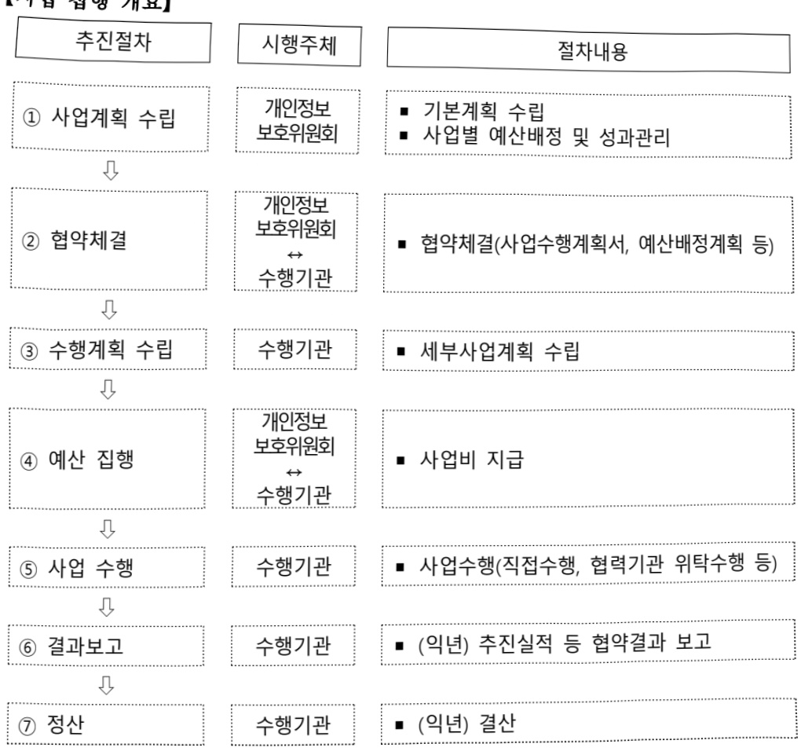

# 안전한 데이터 활용 지원

**해당 페이지**: PDF 46 ~ 58 쪽 해당

**부처**: 개인정보보호위원회
**분야**: 일반·지방행정
**회계유형**: 일반회계
**2026 확정예산**: 6456.0 백만원
**전년대비 증감률**: 81.1%
**AI 도메인**: 데이터

---

<table border=1 style='margin: auto; word-wrap: break-word;'><tr><td style='text-align: center; word-wrap: break-word;'>사 업 명</td></tr><tr><td style='text-align: center; word-wrap: break-word;'>(6) 안전한 데이터 활용 지원 (1032-302)</td></tr></table>

□ 사업 코드 정보

<table border=1 style='margin: auto; word-wrap: break-word;'><tr><td style='text-align: center; word-wrap: break-word;'>구분</td><td style='text-align: center; word-wrap: break-word;'>회계</td><td style='text-align: center; word-wrap: break-word;'>소관</td><td style='text-align: center; word-wrap: break-word;'>실국(기관)</td><td style='text-align: center; word-wrap: break-word;'>계정</td><td style='text-align: center; word-wrap: break-word;'>분야</td><td style='text-align: center; word-wrap: break-word;'>부문</td></tr><tr><td style='text-align: center; word-wrap: break-word;'>코드</td><td rowspan="2">일반회계</td><td rowspan="2">개인정보보호위원회</td><td rowspan="2">개인정보보호위원회</td><td rowspan="2">-</td><td style='text-align: center; word-wrap: break-word;'>010</td><td style='text-align: center; word-wrap: break-word;'>015</td></tr><tr><td style='text-align: center; word-wrap: break-word;'>명칭</td><td style='text-align: center; word-wrap: break-word;'>일반·지방행정</td><td style='text-align: center; word-wrap: break-word;'>정부자원관리</td></tr></table>

<table border=1 style='margin: auto; word-wrap: break-word;'><tr><td style='text-align: center; word-wrap: break-word;'>구분</td><td style='text-align: center; word-wrap: break-word;'>프로그램</td><td style='text-align: center; word-wrap: break-word;'>단위사업</td><td style='text-align: center; word-wrap: break-word;'>세부사업</td></tr><tr><td style='text-align: center; word-wrap: break-word;'>코드</td><td style='text-align: center; word-wrap: break-word;'>1000</td><td style='text-align: center; word-wrap: break-word;'>1032</td><td style='text-align: center; word-wrap: break-word;'>302</td></tr><tr><td style='text-align: center; word-wrap: break-word;'>명칭</td><td style='text-align: center; word-wrap: break-word;'>개인정보보호 기반 데이터 활용 선도</td><td style='text-align: center; word-wrap: break-word;'>개인정보활용지원</td><td style='text-align: center; word-wrap: break-word;'>안전한 데이터 활용 지원</td></tr></table>

□ 사업 성격

<table border=1 style='margin: auto; word-wrap: break-word;'><tr><td style='text-align: center; word-wrap: break-word;'>신규</td><td style='text-align: center; word-wrap: break-word;'>계속</td><td style='text-align: center; word-wrap: break-word;'>완료</td><td style='text-align: center; word-wrap: break-word;'>예비타당성 실시여부</td><td style='text-align: center; word-wrap: break-word;'>총사업비 관리대상</td><td style='text-align: center; word-wrap: break-word;'>총액계상 예산사업</td><td style='text-align: center; word-wrap: break-word;'>사업소관 변경정보</td></tr><tr><td style='text-align: center; word-wrap: break-word;'></td><td style='text-align: center; word-wrap: break-word;'>○</td><td style='text-align: center; word-wrap: break-word;'></td><td style='text-align: center; word-wrap: break-word;'></td><td style='text-align: center; word-wrap: break-word;'></td><td style='text-align: center; word-wrap: break-word;'></td><td style='text-align: center; word-wrap: break-word;'></td></tr></table>

□ 사업 지원 형태 및 지원을

<table border=1 style='margin: auto; word-wrap: break-word;'><tr><td style='text-align: center; word-wrap: break-word;'>직접</td><td style='text-align: center; word-wrap: break-word;'>출자</td><td style='text-align: center; word-wrap: break-word;'>출연</td><td style='text-align: center; word-wrap: break-word;'>보조</td><td style='text-align: center; word-wrap: break-word;'>융자</td><td style='text-align: center; word-wrap: break-word;'>국고보조율(%)</td><td style='text-align: center; word-wrap: break-word;'>융자율(%)</td></tr><tr><td style='text-align: center; word-wrap: break-word;'></td><td style='text-align: center; word-wrap: break-word;'></td><td style='text-align: center; word-wrap: break-word;'>○</td><td style='text-align: center; word-wrap: break-word;'></td><td style='text-align: center; word-wrap: break-word;'></td><td style='text-align: center; word-wrap: break-word;'></td><td style='text-align: center; word-wrap: break-word;'></td></tr></table>

## □ 사업 소관부처 및 시행주체

<table border=1 style='margin: auto; word-wrap: break-word;'><tr><td style='text-align: center; word-wrap: break-word;'>사업명</td><td colspan="2">구분</td></tr><tr><td rowspan="2">가명정보제도운영</td><td style='text-align: center; word-wrap: break-word;'>소관부처</td><td style='text-align: center; word-wrap: break-word;'>개인정보정책국데이터안전정책과</td></tr><tr><td style='text-align: center; word-wrap: break-word;'>사업시행주체</td><td style='text-align: center; word-wrap: break-word;'>한국인터넷진흥원</td></tr><tr><td rowspan="2">가명정보활용 지원인프라 운영</td><td style='text-align: center; word-wrap: break-word;'>소관부처</td><td style='text-align: center; word-wrap: break-word;'>개인정보정책국데이터안전정책과</td></tr><tr><td style='text-align: center; word-wrap: break-word;'>사업시행주체</td><td style='text-align: center; word-wrap: break-word;'>한국인터넷진흥원</td></tr><tr><td rowspan="2">가명정보활용지원시스템 운영</td><td style='text-align: center; word-wrap: break-word;'>소관부처</td><td style='text-align: center; word-wrap: break-word;'>개인정보정책국데이터안전정책과</td></tr><tr><td style='text-align: center; word-wrap: break-word;'>사업시행주체</td><td style='text-align: center; word-wrap: break-word;'>한국인터넷진흥원</td></tr></table>

---

### 가. 예산 총괄표

(단위:백만원,%)

<table border=1 style='margin: auto; word-wrap: break-word;'><tr><td rowspan="2">사업명</td><td rowspan="2">2024년 결산</td><td colspan="2">2025년 예산</td><td colspan="2">2026년 예산</td><td rowspan="2">증감 (B-A)</td><td rowspan="2">(B-A)/A</td></tr><tr><td style='text-align: center; word-wrap: break-word;'>본예산</td><td style='text-align: center; word-wrap: break-word;'>추경(A)</td><td style='text-align: center; word-wrap: break-word;'>요구안</td><td style='text-align: center; word-wrap: break-word;'>본예산(B)</td></tr><tr><td style='text-align: center; word-wrap: break-word;'>안전한 데이터 활용 지원</td><td style='text-align: center; word-wrap: break-word;'>3,328</td><td style='text-align: center; word-wrap: break-word;'>3,564</td><td style='text-align: center; word-wrap: break-word;'>3,564</td><td style='text-align: center; word-wrap: break-word;'>6,456</td><td style='text-align: center; word-wrap: break-word;'>6,456</td><td style='text-align: center; word-wrap: break-word;'>2,892</td><td style='text-align: center; word-wrap: break-word;'>81.1</td></tr></table>

□ 기능별(내역사업별) 예산 내역

(단위:백만원)

<table border=1 style='margin: auto; word-wrap: break-word;'><tr><td rowspan="3"></td><td colspan="5">2024</td><td colspan="7">2025</td><td rowspan="3">2026예산</td></tr><tr><td rowspan="2">예산액(추경)</td><td rowspan="2">예산현액</td><td rowspan="2">집행액[실집행액]</td><td rowspan="2">이월액</td><td rowspan="2">불용액</td><td rowspan="2">본예산</td><td rowspan="2">예산현액</td><td rowspan="2">집행액[실집행액]</td><td colspan="2">전년도 이월액계의</td><td rowspan="2">이월액</td><td rowspan="2">불용액</td></tr><tr><td style='text-align: center; word-wrap: break-word;'>예산현액</td><td style='text-align: center; word-wrap: break-word;'>집행액[실집행액]</td></tr><tr><td style='text-align: center; word-wrap: break-word;'>○ 기능별 분류(합계)</td><td style='text-align: center; word-wrap: break-word;'>3,328</td><td style='text-align: center; word-wrap: break-word;'>3,328</td><td style='text-align: center; word-wrap: break-word;'>3,328[3,205]</td><td style='text-align: center; word-wrap: break-word;'>-</td><td style='text-align: center; word-wrap: break-word;'>-</td><td style='text-align: center; word-wrap: break-word;'>3,564</td><td style='text-align: center; word-wrap: break-word;'>3,564</td><td style='text-align: center; word-wrap: break-word;'>3,564[3,471]</td><td style='text-align: center; word-wrap: break-word;'>3,564</td><td style='text-align: center; word-wrap: break-word;'>3,564[3,471]</td><td style='text-align: center; word-wrap: break-word;'>-</td><td style='text-align: center; word-wrap: break-word;'>-</td><td style='text-align: center; word-wrap: break-word;'>6,456</td></tr><tr><td style='text-align: center; word-wrap: break-word;'>· 가명정보 제도운영</td><td style='text-align: center; word-wrap: break-word;'>314</td><td style='text-align: center; word-wrap: break-word;'>314</td><td style='text-align: center; word-wrap: break-word;'>314[304]</td><td style='text-align: center; word-wrap: break-word;'>-</td><td style='text-align: center; word-wrap: break-word;'>-</td><td style='text-align: center; word-wrap: break-word;'>314</td><td style='text-align: center; word-wrap: break-word;'>314</td><td style='text-align: center; word-wrap: break-word;'>314[298]</td><td style='text-align: center; word-wrap: break-word;'>314</td><td style='text-align: center; word-wrap: break-word;'>314[298]</td><td style='text-align: center; word-wrap: break-word;'>-</td><td style='text-align: center; word-wrap: break-word;'>-</td><td style='text-align: center; word-wrap: break-word;'>314</td></tr><tr><td style='text-align: center; word-wrap: break-word;'>· 가명정보 활용 지원인프라 운영</td><td style='text-align: center; word-wrap: break-word;'>2,614</td><td style='text-align: center; word-wrap: break-word;'>2,614</td><td style='text-align: center; word-wrap: break-word;'>2,614[2,520]</td><td style='text-align: center; word-wrap: break-word;'>-</td><td style='text-align: center; word-wrap: break-word;'>-</td><td style='text-align: center; word-wrap: break-word;'>2,214</td><td style='text-align: center; word-wrap: break-word;'>2,214</td><td style='text-align: center; word-wrap: break-word;'>2,214[2,172]</td><td style='text-align: center; word-wrap: break-word;'>2,214</td><td style='text-align: center; word-wrap: break-word;'>2,214[2,172]</td><td style='text-align: center; word-wrap: break-word;'>-</td><td style='text-align: center; word-wrap: break-word;'>-</td><td style='text-align: center; word-wrap: break-word;'>5,742</td></tr><tr><td style='text-align: center; word-wrap: break-word;'>· 가명정보 활용지원시스템 운영</td><td style='text-align: center; word-wrap: break-word;'>400</td><td style='text-align: center; word-wrap: break-word;'>400</td><td style='text-align: center; word-wrap: break-word;'>400[381]</td><td style='text-align: center; word-wrap: break-word;'>-</td><td style='text-align: center; word-wrap: break-word;'>-</td><td style='text-align: center; word-wrap: break-word;'>1,036</td><td style='text-align: center; word-wrap: break-word;'>1,036</td><td style='text-align: center; word-wrap: break-word;'>1,036[1,001]</td><td style='text-align: center; word-wrap: break-word;'>1,036</td><td style='text-align: center; word-wrap: break-word;'>1,036[1,001]</td><td style='text-align: center; word-wrap: break-word;'>-</td><td style='text-align: center; word-wrap: break-word;'>-</td><td style='text-align: center; word-wrap: break-word;'>400</td></tr></table>

---

### 나. 사업설명자료

## 1 ) 사업목적·내용

- (가명정보 제도 운영) 안정적 제도 운영을 위한 모니터링, 가명정보 결합전문기관 관리·감독, 제도·기술 표준 선점을 위한 연구 등

- (가명정보 활용 지원 인프라 운영) 가명정보 처리 지원 및 안전성 검증, 전문인력 공급 지원, 개인정보가 포함된 데이터 분석을 위한 시설·분석도구 지원 등

- (가명정보 활용 지원 시스템 운영) 온라인 채널로서 각종 정보(제도, 기술, 국제동향, 사례, 법령해석 등) 제공, 가명처리 소프트웨어 지원 등

## 2 ) 사업개요

## □ 사업근거 및 추진경위

① 법령상 근거

- 개인정보보호법 제28조의2(가명정보의 처리 등)

제28조의2(가명정보의 처리 등) ① 개인정보처리자는 통계작성, 과학적 연구, 공익적 기록보존 등을 위하여 정보주체의 동의 없이 가명정보를 처리할 수 있다.

② 개인정보처리자는 제1항에 따라 가명정보를 제3자에게 제공하는 경우에는 특정 개인을 알아보기 위하여 사용될 수 있는 정보를 포함해서는 아니 된다.

## - 개인정보보호법 제28조의3(가명정보의 결합 제한)

제28조의3(가명정보의 결합 제한) ① 제28조의2에도 불구하고 통계작성, 과학적 연구, 공익적 기록 보존 등을 위한 서로 다른 개인정보처리자 간의 가명정보의 결합은 보호위원회 또는 관계 중앙 행정기관의 장이 지정하는 전문기관이 수행한다.

② 결합을 수행한 기관 외부로 결합된 정보를 반출하려는 개인정보처리자는 가명정보 또는 제58조의2에 해당하는 정보로 처리한 뒤 전문기관의 장의 승인을 받아야 한다.

③ 제1항에 따른 결합 절차와 방법, 전문기관의 지정과 지정 취소 기준·절차, 관리·감독, 제2항에 따른 반출 및 승인 기준·절차 등 필요한 사항은 대통령령으로 정한다.

## - 개인정보보호법 제28조의4(가명정보에 대한 안전조치의무 등)

제28조의4(가명정보에 대한 안전조치의무 등) ① 개인정보처리자는 가명정보를 처리하는 경우에는 원래의 상태로 복원하기 위한 추가 정보를 별도로 분리하여 보관·관리하는 등 해당 정보가 분실·도난·유출·위조·변조 또는 훼손되지 않도록 대통령령으로 정하는 바에 따라 안전성 확보에 필요한 기술적·관리적 및 물리적 조치를 하여야 한다.

② 개인정보처리자는 가명정보를 처리하고자 하는 경우에는 가명정보의 처리 목적, 제3자 제공 시 제공받는 자 등 가명정보의 처리 내용을 관리하기 위하여 대통령령으로 정하는 사항에 대한 관련 기록을 작성하여 보관하여야 한다.

---

- 개인정보보호법 제28조의5(가명정보 처리 시 금지의무 등)

제28조의5(가명정보 처리 시 금지의무 등) ① 누구든지 특정 개인을 알아보기 위한 목적으로 가명정보를 처리해서는 아니 된다.

② 개인정보처리자는 가명정보를 처리하는 과정에서 특정 개인을 알아볼 수 있는 정보가 생성된 경우에는 즉시 해당 정보의 처리를 중지하고, 지체 없이 회수·파기하여야 한다.

② 추진경위

- '20.02. 개인정보보호체계 일원화, 빅데이터 분석·이용의 법적근거 마련

- '20.08. 데이터3법 개정에 따른 통합 개인정보보호위원회 출범

* ① 「개인정보보호법」，② 「정보통신망 이용촉진 및 정보보호 등에 관한 법률」，③ 「공공공

③「신용정보의 이용 및 보호에 관한 법률」

- '20.09. 가명정보 처리 가이드라인 재정

- '20.11. 개인정보 가명처리 테스트베드 운영(기존 비식별 테스트베드 개선)

- '21.04. 제2차 데이터특위 안건 가명정보 활용 촉진 대책

* ① 과제1: 가명정보 결합 종합지원시스템 확대, ② 과제4: 가명처리 및 결합 바우처 지원사업 확대,

③ 과제8: 가명처리 신기술을 이용한 안전활용 촉진

- '21.07. 강원 가명정보 활용지원센터 개소 및

가명처리 지원센터 기능확대(실습지원 → 실습 + 실무 지원)

- '21.10. 가명정보의 결합 및 반출 등에 관한 고시 개정

- '22.01. 가명정보결합지원시스템 구축

- '22.04. 가명정보 처리 가이드라인 개정

- '22.08. 부산 가명정보 활용 지원센터 개소

- '23.01. 가명정보활용종합지원플랫폼 구축

- '23.01. 가명정보의 결합 및 반출 등에 관한 고시 개정

- '23.07. 가명정보 활용 확대방안 발표(부처합동)

- '23.07. 인천 가명정보 활용지원센터 구축

- '23.11. 대전 가명정보 활용지원센터 구축

- '24.01. 가명정보 지원 플랫폼 구축(결합지원 시스템과 활용지원 플랫폼 통합 구축)

- '24.03. 통계청 개인정보 이노베이션 존 개소

- '24.07. 대구 가명정보 활용지원센터 구축

- '24.07. 국립암센터 개인정보 이노베이션 존 개소

- '24.11. 전북 가명정보 활용지원센터 개소

- '24.12. 한국사회보장정보원·더존비즈온 개인정보 이노베이션 존 개소

- '25.09. AI시대 가명정보 제도·운영 혁신방안' 발표

- '25.11. 가명정보 비조치 의견서 제도 도입

---

□ 주요내용

① 사업규모

- 총사업비 : 해당없음

- 사업기간 : 2020년 ~ 계속

- 최근 5년 간 투입된 사업비

<table border=1 style='margin: auto; word-wrap: break-word;'><tr><td style='text-align: center; word-wrap: break-word;'>연도</td><td style='text-align: center; word-wrap: break-word;'>2022</td><td style='text-align: center; word-wrap: break-word;'>2023</td><td style='text-align: center; word-wrap: break-word;'>2024</td><td style='text-align: center; word-wrap: break-word;'>2025</td><td style='text-align: center; word-wrap: break-word;'>2026</td></tr><tr><td style='text-align: center; word-wrap: break-word;'>사업비</td><td style='text-align: center; word-wrap: break-word;'>4,929</td><td style='text-align: center; word-wrap: break-word;'>4,992</td><td style='text-align: center; word-wrap: break-word;'>3,328</td><td style='text-align: center; word-wrap: break-word;'>3,564</td><td style='text-align: center; word-wrap: break-word;'>6,456</td></tr></table>

- 기타 : 해당없음

② 사업추진체계

- 사업시행방법 : 출연

- 사업시행주체 : 개인정보보호위원회, 한국인터넷진흥원

- 사업 수혜자 : 국민

- 보조, 융자, 출연, 출자 등의 경우 보조·융자 등 지원 비율 및 법적근거

<table border=1 style='margin: auto; word-wrap: break-word;'><tr><td style='text-align: center; word-wrap: break-word;'>내역사업명</td><td style='text-align: center; word-wrap: break-word;'>구분</td><td style='text-align: center; word-wrap: break-word;'>피보조·피출연 등 기관명</td><td style='text-align: center; word-wrap: break-word;'>지원 금액 (2026예산)</td><td style='text-align: center; word-wrap: break-word;'>지원 비율(%)</td><td style='text-align: center; word-wrap: break-word;'>보조율 법적근거 (해당 조항)</td></tr><tr><td style='text-align: center; word-wrap: break-word;'>가명정보제도운영</td><td style='text-align: center; word-wrap: break-word;'>출연</td><td style='text-align: center; word-wrap: break-word;'>한국인터넷 진흥원</td><td style='text-align: center; word-wrap: break-word;'>314</td><td style='text-align: center; word-wrap: break-word;'>100</td><td style='text-align: center; word-wrap: break-word;'>개인정보보호법 제68조 (권한의 위임·위탁) 제3항</td></tr><tr><td style='text-align: center; word-wrap: break-word;'>가명정보 활용지원 인프라 운영</td><td style='text-align: center; word-wrap: break-word;'>출연</td><td style='text-align: center; word-wrap: break-word;'>한국인터넷 진흥원</td><td style='text-align: center; word-wrap: break-word;'>5,742</td><td style='text-align: center; word-wrap: break-word;'>100</td><td style='text-align: center; word-wrap: break-word;'>개인정보보호법 제68조 (권한의 위임·위탁) 제3항</td></tr><tr><td style='text-align: center; word-wrap: break-word;'>가명정보 활용지원 시스템 운영</td><td style='text-align: center; word-wrap: break-word;'>출연</td><td style='text-align: center; word-wrap: break-word;'>한국인터넷 진흥원</td><td style='text-align: center; word-wrap: break-word;'>400</td><td style='text-align: center; word-wrap: break-word;'>100</td><td style='text-align: center; word-wrap: break-word;'>개인정보보호법 제68조 (권한의 위임·위탁) 제3항</td></tr></table>

---

## 3 ) '26년도 예산 산출 근거

가명정보 제도운영 :('25)314백만원→('26)314백만원(전년동)

○ 가명정보 제도 활성화 : (25) 314백만원 → (26) 314백만원(전년동)

- (요구) 가명정보 활용 실태 모니터링, 결합전문기관 점검·운영, 제도개선 연구 등을 위한 예산 요구

- (산출) 가명정보 활용 실태 모니터링 109백만원, 가명정보 제도개선 205백만원

(단위 : 천 원)

<table border=1 style='margin: auto; word-wrap: break-word;'><tr><td colspan="2">&#x27;25년 예산</td><td colspan="2">&#x27;26년 예산</td></tr><tr><td style='text-align: center; word-wrap: break-word;'>예산</td><td style='text-align: center; word-wrap: break-word;'>산출내역</td><td style='text-align: center; word-wrap: break-word;'>예산</td><td style='text-align: center; word-wrap: break-word;'>산출내역</td></tr><tr><td rowspan="3">314,000</td><td style='text-align: center; word-wrap: break-word;'>○ 사업출연금(350-02): 314,000천원</td><td rowspan="2">314,000</td><td style='text-align: center; word-wrap: break-word;'>○ 사업출연금(350-02): 314,000천원</td></tr><tr><td style='text-align: center; word-wrap: break-word;'>가. 가명정보 실태 모니터링: 109,000천원 = 1식 × 109,000천원</td><td style='text-align: center; word-wrap: break-word;'>가. 가명정보 실태 모니터링: 109,000천원 = 1식 × 109,000천원</td></tr><tr><td style='text-align: center; word-wrap: break-word;'>나. 가명정보 제도개선: 205,000천원 • 결합전문기관 점검: 81,000천원 = 2,400천원 × 22개 기관(관리감독) + 9,600천원 × 3개 기관(재지정) • 제도개선: 99,000천원 = 60,000천원(연구 운영) + 39,000천원(전문가 회의 등) • 국제표준화: 25,000천원 = 2회 × 7,500천원(국제회의 참석) + 5회 × 2,000천원(전문가 회의)</td><td style='text-align: center; word-wrap: break-word;'>나. 가명정보 제도개선: 205,000천원 • 결합전문기관 점검: 81,000천원 = 2,400천원 × 22개 기관(관리감독) + 9,600천원 × 3개 기관(재지정) • 제도개선: 99,000천원 = 60,000천원(연구 운영) + 39,000천원(전문가 회의 등) • 국제표준화: 25,000천원 = 2회 × 7,500천원(국제회의 참석) + 5회 × 2,000천원(전문가 회의)</td><td style='text-align: center; word-wrap: break-word;'>나. 가명정보 제도개선: 205,000천원 • 결합전문기관 점검: 81,000천원 = 2,400천원 × 22개 기관(관리감독) + 9,600천원 × 3개 기관(재지정) • 제도개선: 99,000천원 = 60,000천원(연구 운영) + 39,000천원(전문가 회의 등) • 국제표준화: 25,000천원 = 2회 × 7,500천원(국제회의 참석) + 5회 × 2,000천원(전문가 회의)</td></tr></table>

## □가명정보활용지원인프라운영

:(25)2,214백만원→(26)5,742백만원(+3,528백만원,+159.3%)

o 가명정보 활용 지원 체계 운영

:(25) 377백만원 → (26) 1,313백만원(+936백만원, +248.3%)

- (요구) 가명정보 활용 컨설팅, 전문가 풀 운영 및 가명정보 제공 전 과정을 지원하기 위한 가명정보 원스톱 지원체계 운영을 위한 예산 요구

- (산출) 가명정보 컨설팅 운영 300백만원, 가명정보 전문가 풀 운영 77백만원, 가명정보 원스톱 지원체계 운영 936백만원

(단위 : 천 원)

<table border=1 style='margin: auto; word-wrap: break-word;'><tr><td colspan="2">&#x27;25년 예산</td><td colspan="2">&#x27;26년 예산</td></tr><tr><td style='text-align: center; word-wrap: break-word;'>예산</td><td style='text-align: center; word-wrap: break-word;'>산출내역</td><td style='text-align: center; word-wrap: break-word;'>예산</td><td style='text-align: center; word-wrap: break-word;'>산출내역</td></tr><tr><td rowspan="5">377,000</td><td style='text-align: center; word-wrap: break-word;'>☐ 사업출연금(350-02): 377,000천원</td><td style='text-align: center; word-wrap: break-word;'>1,313,000</td><td style='text-align: center; word-wrap: break-word;'>☐ 사업출연금(350-02): 1,313,000천원</td></tr><tr><td colspan="2">가. 가명정보 컨설팅 운영: 300,000천원 = 12,500천원 × 24개사</td><td style='text-align: center; word-wrap: break-word;'>가. 가명정보 컨설팅 운영: 300,000천원 = 12,500천원 × 24개사</td></tr><tr><td colspan="2">나. 가명정보 전문가 풀 운영: 77,000천원</td><td style='text-align: center; word-wrap: break-word;'>나. 가명정보 전문가 풀 운영: 77,000천원</td></tr><tr><td colspan="2">• 운영비: 25,000천원 = 12개월 × 2,080천원
• 역량강화: 16,000천원 = 1회 × 16,000천원
• 심사지원: 36,000천원 = 30회 × 1,200천원</td><td style='text-align: center; word-wrap: break-word;'>• 운영비: 25,000천원 = 12개월 × 2,080천원
• 역량강화: 16,000천원 = 1회 × 16,000천원
• 심사지원: 36,000천원 = 30회 × 1,200천원</td></tr><tr><td colspan="2"></td><td style='text-align: center; word-wrap: break-word;'>다. 가명정보 원스톱 지원체계 운영: 936,000천원
• 가명처리: 524,500천원 = 5명 × 8,742천원 × 12월
• 적정성평가: 411,500천원 = 4명 × 8,573천원 × 12월</td></tr></table>

---

## 가명정보 활용 지원센터 운영

:(25) 1,027백만원 → (26) 727백만원(△300백만원, △29.2%)

- (요구) 가명정보 활용 지원센터 운영 및 관련 유지보수, 주요 지원기능(가명처리, 컨설팅, 교육·실습, 인식제고, 인프라 제공 등)을 수행하는 필요한 운영예산 요구

- (산출) 서울 가명정보 활용지원센터 운영 및 유지관리 427백만원,

지역 가명정보 활용지원센터 운영지원 300백만원

(단위 : 천 원)

<table border=1 style='margin: auto; word-wrap: break-word;'><tr><td colspan="2">25년 예산</td><td colspan="2">26년 예산</td></tr><tr><td style='text-align: center; word-wrap: break-word;'>예산</td><td style='text-align: center; word-wrap: break-word;'>산출내역</td><td style='text-align: center; word-wrap: break-word;'>예산</td><td style='text-align: center; word-wrap: break-word;'>산출내역</td></tr><tr><td style='text-align: center; word-wrap: break-word;'>1,027,000</td><td style='text-align: center; word-wrap: break-word;'>○ 사업출연금(350-02): 1,027,000천원</td><td style='text-align: center; word-wrap: break-word;'>727,000</td><td style='text-align: center; word-wrap: break-word;'>○ 사업출연금(350-02): 727,000천원</td></tr><tr><td style='text-align: center; word-wrap: break-word;'>가. 서울 가명정보 활용 지원센터 운영 및 유지관리: 427,000천원  = 1개소 × 427,000천원</td><td style='text-align: center; word-wrap: break-word;'></td><td colspan="2">가 서울 가명정보 활용 지원센터 운영 및 유지관리: 427,000천원  = 1개소 × 427,000천원</td></tr><tr><td style='text-align: center; word-wrap: break-word;'>나. 지역 가명정보 활용 지원센터 운영지원: 600,000천원  = 3개소 × 200,000천원</td><td style='text-align: center; word-wrap: break-word;'></td><td colspan="2">나 지역 가명정보 활용 지원센터 운영지원: 300,000천원  = 3개소 × 100,000천원</td></tr></table>

## 0 개인정보 이노베이션 존 운영 및 구축

:(25) 810백만원 → (26) 3,702백만원(2,892백만원, 357.0%)

- (요구) 보안성이 확보된 환경에서 보다 자유로운 개인정보 분석·활용이 가능한 '개인정보 이노베이션 존' 구축·운영

- (산출) 개인정보 이노베이션 존 구축·운영 지원 810백만원,

개인정보 이노베이션 존 연계허브 구축 등 2,892백만원

(단위 : 천 원)

<table border=1 style='margin: auto; word-wrap: break-word;'><tr><td colspan="2">&#x27;25년 예산</td><td colspan="2">&#x27;26년 예산</td></tr><tr><td style='text-align: center; word-wrap: break-word;'>예산</td><td style='text-align: center; word-wrap: break-word;'>산출내역</td><td style='text-align: center; word-wrap: break-word;'>예산</td><td style='text-align: center; word-wrap: break-word;'>산출내역</td></tr><tr><td style='text-align: center; word-wrap: break-word;'>810,000</td><td style='text-align: center; word-wrap: break-word;'>○ 사업출연금(350-02) : 810,000천원</td><td style='text-align: center; word-wrap: break-word;'>3,702,000</td><td style='text-align: center; word-wrap: break-word;'>○ 사업출연금(350-02) : 3,702,000천원</td></tr><tr><td style='text-align: center; word-wrap: break-word;'></td><td style='text-align: center; word-wrap: break-word;'>가. 개인정보 이노베이션 존 구축·운영 지원 : 810,000천원 = 370,000천원(구축지원) + 440,000천원(운영지원)</td><td style='text-align: center; word-wrap: break-word;'></td><td style='text-align: center; word-wrap: break-word;'>가. 개인정보 이노베이션 존 구축·운영 지원 : 810,000천원</td></tr><tr><td style='text-align: center; word-wrap: break-word;'></td><td style='text-align: center; word-wrap: break-word;'>• 개인정보 이노베이션 존 신규 구축 및 운영 : 370,000천원 = 1개 기관 × 370,000천원</td><td style='text-align: center; word-wrap: break-word;'></td><td style='text-align: center; word-wrap: break-word;'>• 개인정보 이노베이션 존 신규 구축 및 운영 : 370,000천원 = 1개 기관 × 370,000천원</td></tr><tr><td style='text-align: center; word-wrap: break-word;'></td><td style='text-align: center; word-wrap: break-word;'>• 개인정보 이노베이션 존 운영 지원 : 440,000천원 = 2개 기관 × 220,000천원</td><td style='text-align: center; word-wrap: break-word;'></td><td style='text-align: center; word-wrap: break-word;'>• 개인정보 이노베이션 존 운영 지원 : 440,000천원 = 2개 기관 × 220,000천원</td></tr><tr><td style='text-align: center; word-wrap: break-word;'></td><td style='text-align: center; word-wrap: break-word;'>※ 개인정보 이노베이션 존 시설 운영, 운영심사 등 지원</td><td style='text-align: center; word-wrap: break-word;'></td><td style='text-align: center; word-wrap: break-word;'>※ 개인정보 이노베이션 존 시설 운영, 운영심사 등 지원</td></tr><tr><td style='text-align: center; word-wrap: break-word;'></td><td style='text-align: center; word-wrap: break-word;'></td><td style='text-align: center; word-wrap: break-word;'></td><td style='text-align: center; word-wrap: break-word;'>나. 개인정보 이노베이션 존 연계 허브 구축 등 : 2,892,000천원</td></tr><tr><td style='text-align: center; word-wrap: break-word;'></td><td style='text-align: center; word-wrap: break-word;'></td><td style='text-align: center; word-wrap: break-word;'></td><td style='text-align: center; word-wrap: break-word;'>• 연계 허브 구축 : 2,288,000천원 = 1씩 × 2,288,000천원</td></tr><tr><td style='text-align: center; word-wrap: break-word;'></td><td style='text-align: center; word-wrap: break-word;'></td><td style='text-align: center; word-wrap: break-word;'></td><td style='text-align: center; word-wrap: break-word;'>• 클라우드 전환 지원 : 604,000천원 = 2개 기관 × 302,000천원</td></tr></table>

---

가명정보 활용 지원 시스템 운영

:(25)1,036백만원→(26)400백만원(△636백만원,△61.4%)

0 가명정보 지원 플랫폼 운영

:(25) 1,036백만원 → (26) 400백만원(△636백만원, △61.4%)

- (요구) 가명정보 지원 플랫폼의 안정적 운영 및 유지보수를 위한 예산 요구

- (산출) 가명정보 지원 플랫폼 장비 유지보수 및 관리 400백만원

(단위 : 천 원)

<table border=1 style='margin: auto; word-wrap: break-word;'><tr><td colspan="2">25년 예산</td><td colspan="2">26년 예산</td></tr><tr><td style='text-align: center; word-wrap: break-word;'>예산</td><td style='text-align: center; word-wrap: break-word;'>산출내역</td><td style='text-align: center; word-wrap: break-word;'>예산</td><td style='text-align: center; word-wrap: break-word;'>산출내역</td></tr><tr><td style='text-align: center; word-wrap: break-word;'>1,036,000</td><td style='text-align: center; word-wrap: break-word;'>○ 사업출연금(350-02): 1,036,000천원</td><td style='text-align: center; word-wrap: break-word;'>400,000</td><td style='text-align: center; word-wrap: break-word;'>○ 사업출연금(350-02): 400,000천원</td></tr><tr><td style='text-align: center; word-wrap: break-word;'></td><td style='text-align: center; word-wrap: break-word;'>가. 가명정보지원플랫폼 운영 및 유지보수: 400,000천원
  · 시스템 유지보수: 280,000천원
  ※ 22년 도입된 HW/SW 장비가 무상에서 유상으로 전환
  · 민간 IDC 임자료: 120,000천원</td><td colspan="2">가. 가명정보지원플랫폼 운영 및 유지보수: 400,000천원
  · 시스템 유지보수: 220,000천원 = 12개월 x 18,300천원
  · 민간 IDC 임자료: 180,000천원 = 12개월 x 15,000천원
※ 비정형데이터 가명처리 지원을 위한 최선 증대로 IDC 임자비용 상승</td></tr><tr><td style='text-align: center; word-wrap: break-word;'></td><td style='text-align: center; word-wrap: break-word;'>나 가명정보지원플랫폼 기능 고도화: 636,000천원
  · 비정형데이터 가명처리 기능 개발: 348,000천원
  · 비정형데이터 가명처리 장비 등 도입: 288,000천원</td><td style='text-align: center; word-wrap: break-word;'></td><td style='text-align: center; word-wrap: break-word;'></td></tr></table>

---

## 4 ) 사업효과

☐ 사업영향, 산출물 성과지표 등

1 '22~26년도 성과계획서 상 성과지표 및 최근 5년간 성과 달성도

<table border=1 style='margin: auto; word-wrap: break-word;'><tr><td style='text-align: center; word-wrap: break-word;'>성과지표</td><td style='text-align: center; word-wrap: break-word;'>구분</td><td style='text-align: center; word-wrap: break-word;'>&#x27;22</td><td style='text-align: center; word-wrap: break-word;'>&#x27;23</td><td style='text-align: center; word-wrap: break-word;'>&#x27;24</td><td style='text-align: center; word-wrap: break-word;'>&#x27;25</td><td style='text-align: center; word-wrap: break-word;'>&#x27;26</td><td style='text-align: center; word-wrap: break-word;'>&#x27;26목표치산출근거</td><td style='text-align: center; word-wrap: break-word;'>측정산식(또는 측정방법)</td><td style='text-align: center; word-wrap: break-word;'>자료수집방법(또는 자료출처)</td></tr><tr><td rowspan="3">가명정보지원플랫폼서비스이용건수(건)</td><td style='text-align: center; word-wrap: break-word;'>목표</td><td style='text-align: center; word-wrap: break-word;'>신규</td><td style='text-align: center; word-wrap: break-word;'>신규</td><td style='text-align: center; word-wrap: break-word;'>신규</td><td style='text-align: center; word-wrap: break-word;'>2,043</td><td style='text-align: center; word-wrap: break-word;'>2,247</td><td rowspan="3">ㅇ 데이터 활용 수요 증가 등 정책 환경 변화를 반영하여 &#x27;25년 목표치에서 10% 상향한 도전적인 목표치인 2247건으로 설정</td><td rowspan="3">가명정보지원플랫폼에서 각 서비스 이용건수의 합계</td><td rowspan="3">가명정보지원플랫폼에서 각 서비스 이용건수 확인</td></tr><tr><td style='text-align: center; word-wrap: break-word;'>실적</td><td style='text-align: center; word-wrap: break-word;'>신규</td><td style='text-align: center; word-wrap: break-word;'>신규</td><td style='text-align: center; word-wrap: break-word;'>신규</td><td style='text-align: center; word-wrap: break-word;'>-</td><td style='text-align: center; word-wrap: break-word;'>-</td></tr><tr><td style='text-align: center; word-wrap: break-word;'>달성도</td><td style='text-align: center; word-wrap: break-word;'>신규</td><td style='text-align: center; word-wrap: break-word;'>신규</td><td style='text-align: center; word-wrap: break-word;'>신규</td><td style='text-align: center; word-wrap: break-word;'>-</td><td style='text-align: center; word-wrap: break-word;'>-</td></tr></table>

② 성과지표 이외의 연도별 사업추진 경과 및 실적

<table border=1 style='margin: auto; word-wrap: break-word;'><tr><td style='text-align: center; word-wrap: break-word;'>2021</td><td style='text-align: center; word-wrap: break-word;'>o 가명정보 관련 개인정보 보호법 개정 후속조치 지원o 가명처리 테스트베드를 가명처리 지원센터로 기능 확장 및 운영o 가명정보 전설팅 운영 및 전문가 풀 구성o 가명처리 가이드라인 재정o 강원 가명정보활용지원센터 구축o 가명정보 결합지원시스템 구축</td></tr><tr><td style='text-align: center; word-wrap: break-word;'>2022</td><td style='text-align: center; word-wrap: break-word;'>o 가명처리 가이드라인 개정o 가명정보 전설팅 운영 및 전문가 풀 운영o 부산 가명정보활용지원센터 구축 추진(~8월)o 가명정보 활용종합지원플랫폼 구축(~12월)</td></tr><tr><td style='text-align: center; word-wrap: break-word;'>2023</td><td style='text-align: center; word-wrap: break-word;'>o 가명정보의 결합 및 반출 등에 관한 고시 재 개정(1월)o 가명정보 활용 확대방안 발표(기재부 포함 비경제부처 합동, 7.21.)o 인천가명정보활용지원센터 구축 추진(~7월)o 대전 가명정보활용지원센터 구축 추진(~11월)o 가명정보 결합지원시스템 가명정보 활용지원플랫폼으로 통합(~12월)</td></tr><tr><td style='text-align: center; word-wrap: break-word;'>2024</td><td style='text-align: center; word-wrap: break-word;'>o 가명정보 처리 가이드라인 개정(2월)o 통계청 개인정보 안심구역 구축 추진(~3월)o 제2기 가명정보 전문가 풀 모집(~7월)·운영(~12월)o 대구 가명정보 활용지원센터 구축(~7월)o 국립암센터 개인정보 안심구역 개소(~7월)o 가명정보 지원 플랫폼 운영(~12월)o 한국사회보장정보원, 더존비즈온 개인정보 안심구역 개소(12월)</td></tr><tr><td style='text-align: center; word-wrap: break-word;'>2025</td><td style='text-align: center; word-wrap: break-word;'>o「가명정보 활용 지원센터 발전방안」 발표(4월)</td></tr></table>

---

③ 향후('26년도 이후) 기대효과

- 안전한 개인정보 활용기반·지원체계 구축을 통해 인력·기술이 부족한 기업에 제도적·

기술적 지원을 제공하여 가명처리, 데이터분석 등 안전한 데이터 활용 유도

5) 타당성조사 및 예비타당성조사 시행여부 및 결과 요지 : 해당사항 없음

6) 총사업비 대상사업 여부 및 내역 : 해당사항 없음

## 7 ) 사업 집행절차

---

## 【사업 집행 세부 절차】

## <가명정보 제도 운영>

<table border=1 style='margin: auto; word-wrap: break-word;'><tr><td style='text-align: center; word-wrap: break-word;'>부처</td><td style='text-align: center; word-wrap: break-word;'></td><td style='text-align: center; word-wrap: break-word;'>피출연·피보조기관</td><td style='text-align: center; word-wrap: break-word;'></td><td style='text-align: center; word-wrap: break-word;'>간접보조사업자·사업수행자</td></tr><tr><td style='text-align: center; word-wrap: break-word;'>개인정보보호위원회(314백만원)</td><td style='text-align: center; word-wrap: break-word;'>=&gt;(314백만원)</td><td style='text-align: center; word-wrap: break-word;'>한국인터넷진흥원(314백만원)</td><td style='text-align: center; word-wrap: break-word;'>=&gt;(-)</td><td style='text-align: center; word-wrap: break-word;'>-</td></tr></table>

## <가명정보 활용 지원 인프라 운영>

<table border=1 style='margin: auto; word-wrap: break-word;'><tr><td style='text-align: center; word-wrap: break-word;'>부처</td><td style='text-align: center; word-wrap: break-word;'></td><td style='text-align: center; word-wrap: break-word;'>피출연·피보조기관</td><td style='text-align: center; word-wrap: break-word;'></td><td style='text-align: center; word-wrap: break-word;'>간접보조사업자·사업수행자</td></tr><tr><td rowspan="3">개인정보보호위원회(5,742백만원)</td><td rowspan="3">=&gt;(5,742백만원)</td><td rowspan="3">한국인터넷진흥원(5,742백만원)</td><td style='text-align: center; word-wrap: break-word;'>=&gt;(300백만원)</td><td style='text-align: center; word-wrap: break-word;'>강원테크노파크,부산테크노파크대전정보문화산업진흥원</td></tr><tr><td style='text-align: center; word-wrap: break-word;'>=&gt;(936백만원)</td><td style='text-align: center; word-wrap: break-word;'>원스톱 서비스운영기관</td></tr><tr><td style='text-align: center; word-wrap: break-word;'>=&gt;(1,414백만원)</td><td style='text-align: center; word-wrap: break-word;'>국립암센터,한국도로공사,광주테크노파크 등</td></tr></table>

## <가명정보 활용 지원 시스템 운영>

<table border=1 style='margin: auto; word-wrap: break-word;'><tr><td style='text-align: center; word-wrap: break-word;'>부처</td><td style='text-align: center; word-wrap: break-word;'></td><td style='text-align: center; word-wrap: break-word;'>피출연·피보조기관</td><td style='text-align: center; word-wrap: break-word;'></td><td style='text-align: center; word-wrap: break-word;'>간접보조사업자·사업수행자</td></tr><tr><td style='text-align: center; word-wrap: break-word;'>개인정보보호위원회(400백만원)</td><td style='text-align: center; word-wrap: break-word;'>=&gt;(400백만원)</td><td style='text-align: center; word-wrap: break-word;'>한국인터넷진흥원(400백만원)</td><td style='text-align: center; word-wrap: break-word;'>=&gt;(-)</td><td style='text-align: center; word-wrap: break-word;'>-</td></tr></table>

---

## 8 ) 각종 평가

1) 국회(예결위, 상임위, 예정처, 국정감사 포함) 지적

<table border=1 style='margin: auto; word-wrap: break-word;'><tr><td style='text-align: center; word-wrap: break-word;'>구분</td><td style='text-align: center; word-wrap: break-word;'>세부내용</td></tr><tr><td style='text-align: center; word-wrap: break-word;'>예결위 (‘24년도 예산’)</td><td style='text-align: center; word-wrap: break-word;'>o (지적사항) 개인정보 안심구역 지정기관의 성격 및 활용도에 따른 재정 지원 필요성을 검토하여 공적 기관 중심 지원 필요o (조치결과) 개인정보 안심구역 기관 지정 공모 시 국비지원이 필요한 공적기관(국비지원형)과 자체 구축이 가능한 기관(자체구축형)으로 구분하였으며, 국비(구축비·인건비 등)는 공적기관에만 지원</td></tr><tr><td style='text-align: center; word-wrap: break-word;'>예결위 (‘24년도 예산’)</td><td style='text-align: center; word-wrap: break-word;'>o (지적사항) 가명정보 활용종합지원 플랫폼 활용도 제고 방안 마련 필요o (조치결과) 가명정보 지원 플랫폼 서비스 개시 이후 홍보, 설명회 및 기능 개선 등 활용도 제고를 위한 다각적인 노력 추진</td></tr><tr><td style='text-align: center; word-wrap: break-word;'>정무위 (‘23년도 결산’)</td><td style='text-align: center; word-wrap: break-word;'>o (지적사항) 가명정보 결합전문기관 지정 활성화 필요o (조치결과) 결합전문기관 지정제도에 대해 홍보하고 관계부처와 함께 결합전문기관을 지속적으로 지정할 계획</td></tr><tr><td style='text-align: center; word-wrap: break-word;'>정무위 (‘25년도 예산’)</td><td style='text-align: center; word-wrap: break-word;'>o (지적사항) 서울 가명처리 지원센터, 지역 가명정보 활용 지원센터 전반에 대해 사업 효율성 제고 방안 마련o (조치결과) 가명정보 활용 지원센터 운영성과 평가 지표 개선, 국비 차등 지원 범위 확대 등을 통해 지원센터 운영실적 제고 노력</td></tr><tr><td style='text-align: center; word-wrap: break-word;'>예결위·예정처 (‘24년도 결산’)</td><td style='text-align: center; word-wrap: break-word;'>o (지적사항) 가명정보 활용 지원센터 운영 성과가 동일한 경우, 동일한 국비 지원이 될 수 있도록 재정당국과 협의 필요o (조치결과) 국비 지원이 없는 지원센터의 안정적 운영을 위해 운영비를 지원하고 국비를 합리적으로 배분할 수 있도록 재정당국과 지속 협의 계획</td></tr></table>

2) 감사원 감사 또는 국무총리실 지적 : 해당사항 없음

3) 자체평가·감사 : 해당사항 없음

---

### 다.최근 4년간 결산내역

## 1 ) 결산표

☐ 부처 결산내역

(단위: 백만원, %)

<table border=1 style='margin: auto; word-wrap: break-word;'><tr><td rowspan="2">연도</td><td colspan="3">예산액</td><td rowspan="2">전년도 이월액</td><td rowspan="2">이·전용 등</td><td rowspan="2">예비비</td><td rowspan="2">예산 현액(B)</td><td rowspan="2">집행액(C)</td><td rowspan="2">집행률(C/A)</td><td rowspan="2">집행률(C/B)</td><td rowspan="2">다음연도 이월액</td><td rowspan="2">불용액</td></tr><tr><td colspan="2">본예산 중감액</td><td style='text-align: center; word-wrap: break-word;'>추경(A)</td></tr><tr><td style='text-align: center; word-wrap: break-word;'>2022</td><td style='text-align: center; word-wrap: break-word;'>4,929</td><td style='text-align: center; word-wrap: break-word;'>-</td><td style='text-align: center; word-wrap: break-word;'>4,929</td><td style='text-align: center; word-wrap: break-word;'>-</td><td style='text-align: center; word-wrap: break-word;'>-</td><td style='text-align: center; word-wrap: break-word;'>-</td><td style='text-align: center; word-wrap: break-word;'>4,929</td><td style='text-align: center; word-wrap: break-word;'>4,929</td><td style='text-align: center; word-wrap: break-word;'>100.0</td><td style='text-align: center; word-wrap: break-word;'>100.0</td><td style='text-align: center; word-wrap: break-word;'>-</td><td style='text-align: center; word-wrap: break-word;'>-</td></tr><tr><td style='text-align: center; word-wrap: break-word;'>2023</td><td style='text-align: center; word-wrap: break-word;'>4,992</td><td style='text-align: center; word-wrap: break-word;'>-</td><td style='text-align: center; word-wrap: break-word;'>4,992</td><td style='text-align: center; word-wrap: break-word;'>-</td><td style='text-align: center; word-wrap: break-word;'>-</td><td style='text-align: center; word-wrap: break-word;'>-</td><td style='text-align: center; word-wrap: break-word;'>4,992</td><td style='text-align: center; word-wrap: break-word;'>4,992</td><td style='text-align: center; word-wrap: break-word;'>100.0</td><td style='text-align: center; word-wrap: break-word;'>100.0</td><td style='text-align: center; word-wrap: break-word;'>-</td><td style='text-align: center; word-wrap: break-word;'>-</td></tr><tr><td style='text-align: center; word-wrap: break-word;'>2024</td><td style='text-align: center; word-wrap: break-word;'>3,328</td><td style='text-align: center; word-wrap: break-word;'>-</td><td style='text-align: center; word-wrap: break-word;'>3,328</td><td style='text-align: center; word-wrap: break-word;'>-</td><td style='text-align: center; word-wrap: break-word;'>-</td><td style='text-align: center; word-wrap: break-word;'>-</td><td style='text-align: center; word-wrap: break-word;'>3,328</td><td style='text-align: center; word-wrap: break-word;'>3,328</td><td style='text-align: center; word-wrap: break-word;'>100.0</td><td style='text-align: center; word-wrap: break-word;'>100.0</td><td style='text-align: center; word-wrap: break-word;'>-</td><td style='text-align: center; word-wrap: break-word;'>-</td></tr><tr><td style='text-align: center; word-wrap: break-word;'>2025</td><td style='text-align: center; word-wrap: break-word;'>3,564</td><td style='text-align: center; word-wrap: break-word;'>-</td><td style='text-align: center; word-wrap: break-word;'>3,564</td><td style='text-align: center; word-wrap: break-word;'>-</td><td style='text-align: center; word-wrap: break-word;'>-</td><td style='text-align: center; word-wrap: break-word;'>-</td><td style='text-align: center; word-wrap: break-word;'>3,564</td><td style='text-align: center; word-wrap: break-word;'>3,564</td><td style='text-align: center; word-wrap: break-word;'>100.0</td><td style='text-align: center; word-wrap: break-word;'>100.0</td><td style='text-align: center; word-wrap: break-word;'>-</td><td style='text-align: center; word-wrap: break-word;'>-</td></tr></table>

## 2 ) 주요 결산사항

□ 2022년~2025년 결산사항

<table border=1 style='margin: auto; word-wrap: break-word;'><tr><td style='text-align: center; word-wrap: break-word;'>2022</td><td style='text-align: center; word-wrap: break-word;'>- 해당없음</td></tr><tr><td style='text-align: center; word-wrap: break-word;'>2023</td><td style='text-align: center; word-wrap: break-word;'>- 해당없음</td></tr><tr><td style='text-align: center; word-wrap: break-word;'>2024</td><td style='text-align: center; word-wrap: break-word;'>- 해당없음</td></tr><tr><td style='text-align: center; word-wrap: break-word;'>2025</td><td style='text-align: center; word-wrap: break-word;'>- 해당없음</td></tr></table>

□ 2025년 이 · 전용 등 세부내역 : 해당사항 없음

---

### 원본 PDF 크롭 이미지

