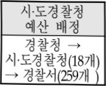
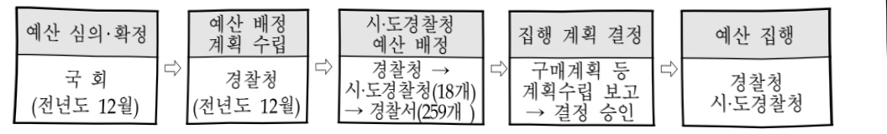

# 112시스템운영(정보화)

**해당 페이지**: PDF 59 ~ 64 쪽 해당

**부처**: 경찰청
**분야**: 공공질서 및 안전
**회계유형**: 일반회계
**2026 확정예산**: 21372.0 백만원
**전년대비 증감률**: 32.0%
**AI 도메인**: 법률/치안

---

□ 내역사업별 예산 내역

(단위:백만원)

<table border=1 style='margin: auto; word-wrap: break-word;'><tr><td rowspan="3"></td><td colspan="5">2024</td><td colspan="7">2025(2025.11월말)</td><td rowspan="3">2026예산</td></tr><tr><td rowspan="2">예산액(추정)</td><td rowspan="2">예산현액</td><td rowspan="2">집행액[집행액]</td><td rowspan="2">이윌액</td><td rowspan="2">불용액</td><td rowspan="2">본예산</td><td rowspan="2">예산현액</td><td rowspan="2">집행액[집행액]</td><td colspan="2">전년도 이월액제외</td><td rowspan="2">이월예상액</td><td rowspan="2">불용예상액</td></tr><tr><td style='text-align: center; word-wrap: break-word;'>예산현액</td><td style='text-align: center; word-wrap: break-word;'>집행액[집행액]</td></tr><tr><td style='text-align: center; word-wrap: break-word;'>○ 112시스템운영</td><td style='text-align: center; word-wrap: break-word;'>19,521</td><td style='text-align: center; word-wrap: break-word;'>20,569</td><td style='text-align: center; word-wrap: break-word;'>19,471</td><td style='text-align: center; word-wrap: break-word;'>-</td><td style='text-align: center; word-wrap: break-word;'>1,098</td><td style='text-align: center; word-wrap: break-word;'>16,186</td><td style='text-align: center; word-wrap: break-word;'>16,186</td><td style='text-align: center; word-wrap: break-word;'>13,504</td><td style='text-align: center; word-wrap: break-word;'>16,186</td><td style='text-align: center; word-wrap: break-word;'>13,504</td><td style='text-align: center; word-wrap: break-word;'>-</td><td style='text-align: center; word-wrap: break-word;'>-</td><td style='text-align: center; word-wrap: break-word;'>21,372</td></tr><tr><td style='text-align: center; word-wrap: break-word;'>· 112시스템유지관리</td><td style='text-align: center; word-wrap: break-word;'>5,546</td><td style='text-align: center; word-wrap: break-word;'>5,546</td><td style='text-align: center; word-wrap: break-word;'>5,355</td><td style='text-align: center; word-wrap: break-word;'>-</td><td style='text-align: center; word-wrap: break-word;'>191</td><td style='text-align: center; word-wrap: break-word;'>6,096</td><td style='text-align: center; word-wrap: break-word;'>6,096</td><td style='text-align: center; word-wrap: break-word;'>5,043</td><td style='text-align: center; word-wrap: break-word;'>6,096</td><td style='text-align: center; word-wrap: break-word;'>5,043</td><td style='text-align: center; word-wrap: break-word;'>-</td><td style='text-align: center; word-wrap: break-word;'>-</td><td style='text-align: center; word-wrap: break-word;'>6,768</td></tr><tr><td style='text-align: center; word-wrap: break-word;'>· 112시스템지능화</td><td style='text-align: center; word-wrap: break-word;'>-</td><td style='text-align: center; word-wrap: break-word;'>1,048</td><td style='text-align: center; word-wrap: break-word;'>1,048</td><td style='text-align: center; word-wrap: break-word;'>-</td><td style='text-align: center; word-wrap: break-word;'>-</td><td style='text-align: center; word-wrap: break-word;'>-</td><td style='text-align: center; word-wrap: break-word;'>-</td><td style='text-align: center; word-wrap: break-word;'>-</td><td style='text-align: center; word-wrap: break-word;'>-</td><td style='text-align: center; word-wrap: break-word;'>-</td><td style='text-align: center; word-wrap: break-word;'>-</td><td style='text-align: center; word-wrap: break-word;'>-</td><td style='text-align: center; word-wrap: break-word;'>-</td></tr><tr><td style='text-align: center; word-wrap: break-word;'>· 112시스템기능개선</td><td style='text-align: center; word-wrap: break-word;'>5,966</td><td style='text-align: center; word-wrap: break-word;'>5,966</td><td style='text-align: center; word-wrap: break-word;'>5,948</td><td style='text-align: center; word-wrap: break-word;'>-</td><td style='text-align: center; word-wrap: break-word;'>18</td><td style='text-align: center; word-wrap: break-word;'>3,075</td><td style='text-align: center; word-wrap: break-word;'>3,075</td><td style='text-align: center; word-wrap: break-word;'>2,145</td><td style='text-align: center; word-wrap: break-word;'>3,075</td><td style='text-align: center; word-wrap: break-word;'>2,145</td><td style='text-align: center; word-wrap: break-word;'>-</td><td style='text-align: center; word-wrap: break-word;'>-</td><td style='text-align: center; word-wrap: break-word;'>1,936</td></tr><tr><td style='text-align: center; word-wrap: break-word;'>· 순찰차낼 영상관제시스템 구축</td><td style='text-align: center; word-wrap: break-word;'>8,009</td><td style='text-align: center; word-wrap: break-word;'>8,009</td><td style='text-align: center; word-wrap: break-word;'>7,120</td><td style='text-align: center; word-wrap: break-word;'>-</td><td style='text-align: center; word-wrap: break-word;'>889</td><td style='text-align: center; word-wrap: break-word;'>7,015</td><td style='text-align: center; word-wrap: break-word;'>7,015</td><td style='text-align: center; word-wrap: break-word;'>6,316</td><td style='text-align: center; word-wrap: break-word;'>7,015</td><td style='text-align: center; word-wrap: break-word;'>6,316</td><td style='text-align: center; word-wrap: break-word;'>-</td><td style='text-align: center; word-wrap: break-word;'>-</td><td style='text-align: center; word-wrap: break-word;'>5,812</td></tr><tr><td style='text-align: center; word-wrap: break-word;'>· 차세대112시스템</td><td style='text-align: center; word-wrap: break-word;'>-</td><td style='text-align: center; word-wrap: break-word;'>-</td><td style='text-align: center; word-wrap: break-word;'>-</td><td style='text-align: center; word-wrap: break-word;'>-</td><td style='text-align: center; word-wrap: break-word;'>-</td><td style='text-align: center; word-wrap: break-word;'>-</td><td style='text-align: center; word-wrap: break-word;'>-</td><td style='text-align: center; word-wrap: break-word;'>-</td><td style='text-align: center; word-wrap: break-word;'>-</td><td style='text-align: center; word-wrap: break-word;'>-</td><td style='text-align: center; word-wrap: break-word;'>-</td><td style='text-align: center; word-wrap: break-word;'>-</td><td style='text-align: center; word-wrap: break-word;'>456</td></tr><tr><td style='text-align: center; word-wrap: break-word;'>· 112지원시스템</td><td style='text-align: center; word-wrap: break-word;'>-</td><td style='text-align: center; word-wrap: break-word;'>-</td><td style='text-align: center; word-wrap: break-word;'>-</td><td style='text-align: center; word-wrap: break-word;'>-</td><td style='text-align: center; word-wrap: break-word;'>-</td><td style='text-align: center; word-wrap: break-word;'>-</td><td style='text-align: center; word-wrap: break-word;'>-</td><td style='text-align: center; word-wrap: break-word;'>-</td><td style='text-align: center; word-wrap: break-word;'>-</td><td style='text-align: center; word-wrap: break-word;'>-</td><td style='text-align: center; word-wrap: break-word;'>-</td><td style='text-align: center; word-wrap: break-word;'>-</td><td style='text-align: center; word-wrap: break-word;'>6,400</td></tr></table>

### 나. 사업설명자료

## 1 ) 사업목적·내용

112시스템운영

- (112시스템유지관리) 112시스템은 24시간 365일 구동되는 경찰 주요 시스템으로 안정적인 무중단 서비스 제공을 위한 시스템 유지보수 및 장애 발생 시, 신속한 복구를 위한 체계적 대응 필수

- (112시스템 개선) 112신고 접수·지령을 위해 사용중인 112워크스테이션이 내용연수가

경과 함에 따라 안정적인 시스템 운영을 위해 장비교체 및 요구조자의 신속한 위치

과악을 위한 정밀탐색시스템 도입

- (순찰차캠 영상관제 시스템 구축) 실시간 장애대응을 위해 24시간 콜센터 운영, 단말기

거치대·케이블 등에 장애시 신속한 출장 수리 및 복구 등 유지보수

- (112지원시스템) 최신 IT 환경변화에 맞춘 효율적인 지역경찰 업무지원을 위해 'AI 기반 과학적 예방 활동' 지원 체계 마련, '모바일 앱' 구축, 노후 시스템 개선 등을 통한 지역경찰 업무시스템 고도화

---

## 2 ) 사업개요

## □ 사업근거 및 추진경위

① 법령상 근거 및 조항 적시

- 경찰법 및 경찰관직무집행법

- 경찰청과 그 소속기관 직제(대통령령 제34823호)

② 추진경위

- '57. 7. 112비상통화기 설치 / '12. 5. 112종합상황실 직제 신설

- '19. 2. 치안상황관리관실 신설 / '20. 1. 시도청 위기관리 사무 이관

- '21. 1. 자치경찰제 시행에 따른 지역경찰 사무 이관

- '23. 2. 위기관리계 경비국으로 재이관

- '24. 2. 경찰청 범죄예방대응국 신설(치안상황·지역경찰운영·지역경찰역량)

## □ 주요내용

① 사업규모

- 총사업비(해당되는 경우에만 기재) : 해당없음

- 사업기간 : 계속

- 최근 5년 간 투입된 사업비(예산액기준, 추경편성한 연도에는 추경포함)

<table border=1 style='margin: auto; word-wrap: break-word;'><tr><td style='text-align: center; word-wrap: break-word;'>闰五</td><td style='text-align: center; word-wrap: break-word;'>2022</td><td style='text-align: center; word-wrap: break-word;'>2023</td><td style='text-align: center; word-wrap: break-word;'>2024</td><td style='text-align: center; word-wrap: break-word;'>2025</td><td style='text-align: center; word-wrap: break-word;'>2026</td></tr><tr><td style='text-align: center; word-wrap: break-word;'>사업비</td><td style='text-align: center; word-wrap: break-word;'>25,092</td><td style='text-align: center; word-wrap: break-word;'>22,613</td><td style='text-align: center; word-wrap: break-word;'>19,521</td><td style='text-align: center; word-wrap: break-word;'>16,186</td><td style='text-align: center; word-wrap: break-word;'>21,372</td></tr></table>

② 사업추진체계

- 사업시행방법 : 직접수행

- 사업시행주체 : 경찰청

- 사업 수혜자 : 국민

- 보조, 융자, 출연, 출자 등의 경우 보조·융자 등 지원 비율 및 법적근거 : 해당없음

---

## 3 ) 2026년도 예산 산출 근거

□ 112시스템운영(정보화)('25) 16,186백만원 → ('26) 20,916백만원

○ 112시스템유지관리 (25) 6,096백만원 → (26) 6,768백만원

○ 112시스템 기능개선 ('25) 3,075백만원 → ('26) 1,936백만원

○ 순찰차캠 영상관제시스템 구축 (25) 7,015백만원 → (26) 5,812백만원

○ 차세대 112시스템(ISP) ('25) 0 → ('26) 456백만원

○ 112지원시스템 (25) 0 → (26) 6,400백만원

## 4 ) 사업효과

□ 사업영향, 산출물 성과지표 등

① 2022~2026년도 성과계획서 상 성과지표 및 최근 5년간 성과 달성도

<table border=1 style='margin: auto; word-wrap: break-word;'><tr><td style='text-align: center; word-wrap: break-word;'>성과지표</td><td style='text-align: center; word-wrap: break-word;'>구분</td><td style='text-align: center; word-wrap: break-word;'>2022</td><td style='text-align: center; word-wrap: break-word;'>2023</td><td style='text-align: center; word-wrap: break-word;'>2024</td><td style='text-align: center; word-wrap: break-word;'>2025</td><td style='text-align: center; word-wrap: break-word;'>2026</td><td style='text-align: center; word-wrap: break-word;'>2026 목표치산출근거</td><td style='text-align: center; word-wrap: break-word;'>측정산식(또는 측정방법)</td><td style='text-align: center; word-wrap: break-word;'>자료수집방법(또는 자료출처)</td></tr><tr><td rowspan="3">112긴급신고(단위:초)</td><td style='text-align: center; word-wrap: break-word;'>목표</td><td style='text-align: center; word-wrap: break-word;'>351</td><td style='text-align: center; word-wrap: break-word;'>349</td><td style='text-align: center; word-wrap: break-word;'>347</td><td style='text-align: center; word-wrap: break-word;'>343</td><td style='text-align: center; word-wrap: break-word;'>340</td><td rowspan="3">&#x27;22년~&#x27;24년 평균 목표치(2초)보다 200% 높게 설정 4초 단축한 343초로, &#x27;26년 목표치는 이보다 3초 단축한 340초로 설정</td><td rowspan="3">(∑ Code0,1 신고 현장대응시간) ÷ Code0,1 신고 접수건수</td><td rowspan="3">112시스템 산출</td></tr><tr><td style='text-align: center; word-wrap: break-word;'>실적</td><td style='text-align: center; word-wrap: break-word;'>351</td><td style='text-align: center; word-wrap: break-word;'>349</td><td style='text-align: center; word-wrap: break-word;'>347</td><td style='text-align: center; word-wrap: break-word;'>-</td><td style='text-align: center; word-wrap: break-word;'>-</td></tr><tr><td style='text-align: center; word-wrap: break-word;'>달성도</td><td style='text-align: center; word-wrap: break-word;'>100</td><td style='text-align: center; word-wrap: break-word;'>100</td><td style='text-align: center; word-wrap: break-word;'>100</td><td style='text-align: center; word-wrap: break-word;'>-</td><td style='text-align: center; word-wrap: break-word;'>-</td></tr></table>

② 성과지표 이외의 연도별 사업추진 경과 및 실적

<table border=1 style='margin: auto; word-wrap: break-word;'><tr><td style='text-align: center; word-wrap: break-word;'>2022</td><td style='text-align: center; word-wrap: break-word;'>112시스템 지능화, 112시스템 개선 및 유지보수 순찰차 캠 구축(77개 몰)</td></tr><tr><td style='text-align: center; word-wrap: break-word;'>2023</td><td style='text-align: center; word-wrap: break-word;'>112시스템 지능화, 112시스템 개선 및 유지보수 순찰차 캠 구축(87 몰)</td></tr><tr><td style='text-align: center; word-wrap: break-word;'>2024</td><td style='text-align: center; word-wrap: break-word;'>112시스템 고도화, 112시스템 개선 및 유지보수 순찰차 캠 구축(41 몰)</td></tr><tr><td style='text-align: center; word-wrap: break-word;'>2025</td><td style='text-align: center; word-wrap: break-word;'>112시스템 고도화, 112시스템 개선 및 유지보수 순찰차 캠 저장지스템 구축</td></tr></table>

③향후(2026년도 이후)기대효과

- 위지정밀탐색 도입으로 112신고자의 위치를 신속하게 파악하여 국민의 생명·신체 및 재산보호에 기여하고, 순찰차캠 영상녹화시스템 구축을 통해 투명하고 공정한 현장 대응 시스템 구축

- 최신 IT기기를 차량용 단말기로 개발, 112신고처리에 필요한 다양한 정보제공으로 현장 경찰관의 대응 능력 향상

---

5)타당성조사 및 예비타당성조사 시행여부 및 결과 요지:해당없음

6) 총사업비 대상사업 여부 및 내역 : 해당없음

## 7 ) 사업 집행절차

---

### 다. 최근 4년간 결산내역

## 1 ) 결산표

☐ 부처 결산내역

(단위: 백만원, %)

<table border=1 style='margin: auto; word-wrap: break-word;'><tr><td rowspan="2">연도</td><td colspan="3">예산액</td><td rowspan="2">전년도 이월액</td><td rowspan="2">이-전용 등</td><td rowspan="2">예비비</td><td rowspan="2">예산 현액(B)</td><td rowspan="2">집행액(C)</td><td rowspan="2">집행률(C/A)</td><td rowspan="2">집행률(C/B)</td><td rowspan="2">다음연도 이월액</td><td rowspan="2">불용액</td></tr><tr><td style='text-align: center; word-wrap: break-word;'>본예산</td><td style='text-align: center; word-wrap: break-word;'>추경 중감액</td><td style='text-align: center; word-wrap: break-word;'>추경(A)</td></tr><tr><td style='text-align: center; word-wrap: break-word;'>2022</td><td style='text-align: center; word-wrap: break-word;'>25,092</td><td style='text-align: center; word-wrap: break-word;'>-</td><td style='text-align: center; word-wrap: break-word;'>25,092</td><td style='text-align: center; word-wrap: break-word;'>-</td><td style='text-align: center; word-wrap: break-word;'>312</td><td style='text-align: center; word-wrap: break-word;'>-</td><td style='text-align: center; word-wrap: break-word;'>25,092</td><td style='text-align: center; word-wrap: break-word;'>22,722</td><td style='text-align: center; word-wrap: break-word;'>90.6</td><td style='text-align: center; word-wrap: break-word;'>90.6</td><td style='text-align: center; word-wrap: break-word;'>2,139</td><td style='text-align: center; word-wrap: break-word;'>231</td></tr><tr><td style='text-align: center; word-wrap: break-word;'>2023</td><td style='text-align: center; word-wrap: break-word;'>22,613</td><td style='text-align: center; word-wrap: break-word;'>-</td><td style='text-align: center; word-wrap: break-word;'>22,613</td><td style='text-align: center; word-wrap: break-word;'>2,139</td><td style='text-align: center; word-wrap: break-word;'>245</td><td style='text-align: center; word-wrap: break-word;'>-</td><td style='text-align: center; word-wrap: break-word;'>24,752</td><td style='text-align: center; word-wrap: break-word;'>22,290</td><td style='text-align: center; word-wrap: break-word;'>101</td><td style='text-align: center; word-wrap: break-word;'>92.6</td><td style='text-align: center; word-wrap: break-word;'>1,048</td><td style='text-align: center; word-wrap: break-word;'>1,414</td></tr><tr><td style='text-align: center; word-wrap: break-word;'>2024</td><td style='text-align: center; word-wrap: break-word;'>19,521</td><td style='text-align: center; word-wrap: break-word;'>-</td><td style='text-align: center; word-wrap: break-word;'>19,521</td><td style='text-align: center; word-wrap: break-word;'>1,048</td><td style='text-align: center; word-wrap: break-word;'>-</td><td style='text-align: center; word-wrap: break-word;'>-</td><td style='text-align: center; word-wrap: break-word;'>20,569</td><td style='text-align: center; word-wrap: break-word;'>19,471</td><td style='text-align: center; word-wrap: break-word;'>99.7</td><td style='text-align: center; word-wrap: break-word;'>94.7</td><td style='text-align: center; word-wrap: break-word;'>-</td><td style='text-align: center; word-wrap: break-word;'>1,098</td></tr><tr><td style='text-align: center; word-wrap: break-word;'>2025</td><td style='text-align: center; word-wrap: break-word;'>16,186</td><td style='text-align: center; word-wrap: break-word;'>-</td><td style='text-align: center; word-wrap: break-word;'>16,186</td><td style='text-align: center; word-wrap: break-word;'>-</td><td style='text-align: center; word-wrap: break-word;'>-</td><td style='text-align: center; word-wrap: break-word;'>-</td><td style='text-align: center; word-wrap: break-word;'>16,186</td><td style='text-align: center; word-wrap: break-word;'>13,504</td><td style='text-align: center; word-wrap: break-word;'>83.4</td><td style='text-align: center; word-wrap: break-word;'>83.4</td><td style='text-align: center; word-wrap: break-word;'>-</td><td style='text-align: center; word-wrap: break-word;'>-</td></tr></table>

## 2 ) 주요 결산사항

2022~2025년 결산 주요 지적사항 및 시정요구사항

<table border=1 style='margin: auto; word-wrap: break-word;'><tr><td style='text-align: center; word-wrap: break-word;'>2022</td><td style='text-align: center; word-wrap: break-word;'>&lt;이월&gt; 112지능화 사업 지연에 따른 2,139백만원 이월 / &#x27;23.2.1.字 집행완료
※조달청 일반경쟁 유찰(3회)에 따른 재공고로 계약 일정 지연, &#x27;23.2.1.字 집행완료
&lt;불용&gt; 사업별 낙찰차액, 집행잔액 등 231백만원 불용</td></tr><tr><td style='text-align: center; word-wrap: break-word;'>2023</td><td style='text-align: center; word-wrap: break-word;'>&lt;이월&gt; 112지능화 사업 지연에 따른 1,048백만원 이월 / &#x27;24.3.29.字 집행완료
&lt;불용&gt; 사업별 낙찰차액, 집행잔액 등 1,414백만원 불용</td></tr><tr><td style='text-align: center; word-wrap: break-word;'>2024</td><td style='text-align: center; word-wrap: break-word;'>&lt;불용&gt; 사업별 낙찰차액, 집행잔액 등 1,098백만원 불용</td></tr><tr><td style='text-align: center; word-wrap: break-word;'>2025</td><td style='text-align: center; word-wrap: break-word;'></td></tr></table>

---

<table border=1 style='margin: auto; word-wrap: break-word;'><tr><td style='text-align: center; word-wrap: break-word;'>사 업 명</td></tr><tr><td style='text-align: center; word-wrap: break-word;'>경찰정보화기반고도화(정보화) (4234-511)</td></tr></table>

## □ 사업 코드 정보

<table border=1 style='margin: auto; word-wrap: break-word;'><tr><td style='text-align: center; word-wrap: break-word;'>구분</td><td style='text-align: center; word-wrap: break-word;'>회계</td><td style='text-align: center; word-wrap: break-word;'>소관</td><td style='text-align: center; word-wrap: break-word;'>실국(기관)</td><td style='text-align: center; word-wrap: break-word;'>계정</td><td style='text-align: center; word-wrap: break-word;'>분야</td><td style='text-align: center; word-wrap: break-word;'>부문</td></tr><tr><td style='text-align: center; word-wrap: break-word;'>코드</td><td rowspan="2">일반회계</td><td rowspan="2">경찰청</td><td rowspan="2">미래치안정책국</td><td rowspan="2">00</td><td style='text-align: center; word-wrap: break-word;'>020</td><td style='text-align: center; word-wrap: break-word;'>023</td></tr><tr><td style='text-align: center; word-wrap: break-word;'>명칭</td><td style='text-align: center; word-wrap: break-word;'>공공질서및안전</td><td style='text-align: center; word-wrap: break-word;'>경찰</td></tr></table>

<table border=1 style='margin: auto; word-wrap: break-word;'><tr><td style='text-align: center; word-wrap: break-word;'>구분</td><td style='text-align: center; word-wrap: break-word;'>프로그램</td><td style='text-align: center; word-wrap: break-word;'>단위사업</td><td style='text-align: center; word-wrap: break-word;'>세부사업</td></tr><tr><td style='text-align: center; word-wrap: break-word;'>코드</td><td style='text-align: center; word-wrap: break-word;'>4200</td><td style='text-align: center; word-wrap: break-word;'>4234</td><td style='text-align: center; word-wrap: break-word;'>511</td></tr><tr><td style='text-align: center; word-wrap: break-word;'>명칭</td><td style='text-align: center; word-wrap: break-word;'>치안인프라구축</td><td style='text-align: center; word-wrap: break-word;'>경찰정보화기반고도화(정보화)</td><td style='text-align: center; word-wrap: break-word;'>경찰정보화기반고도화(정보화)</td></tr></table>

## ☐ 사업 성격

<table border=1 style='margin: auto; word-wrap: break-word;'><tr><td rowspan="2">신규</td><td rowspan="2">계속</td><td rowspan="2">완료</td><td rowspan="2">예비타당성 실시여부</td><td rowspan="2">총사업비 관리대상</td><td rowspan="2">총액계상 예산사업</td><td style='text-align: center; word-wrap: break-word;'>사업소관 변경정보</td></tr><tr><td style='text-align: center; word-wrap: break-word;'>2025예산 시 소관</td></tr><tr><td style='text-align: center; word-wrap: break-word;'></td><td style='text-align: center; word-wrap: break-word;'>○</td><td style='text-align: center; word-wrap: break-word;'></td><td style='text-align: center; word-wrap: break-word;'></td><td style='text-align: center; word-wrap: break-word;'></td><td style='text-align: center; word-wrap: break-word;'></td><td style='text-align: center; word-wrap: break-word;'></td></tr></table>

□ 사업 지원 형태 및 지원을 (최소한 한 개는 반드시 선택하시오. 해당사항에 ○ 표시)

<table border=1 style='margin: auto; word-wrap: break-word;'><tr><td style='text-align: center; word-wrap: break-word;'>직접</td><td style='text-align: center; word-wrap: break-word;'>출자</td><td style='text-align: center; word-wrap: break-word;'>출연</td><td style='text-align: center; word-wrap: break-word;'>보조</td><td style='text-align: center; word-wrap: break-word;'>융자</td><td style='text-align: center; word-wrap: break-word;'>국고보조율(%)</td><td style='text-align: center; word-wrap: break-word;'>융자율(%)</td></tr><tr><td style='text-align: center; word-wrap: break-word;'>○</td><td style='text-align: center; word-wrap: break-word;'></td><td style='text-align: center; word-wrap: break-word;'></td><td style='text-align: center; word-wrap: break-word;'></td><td style='text-align: center; word-wrap: break-word;'></td><td style='text-align: center; word-wrap: break-word;'></td><td style='text-align: center; word-wrap: break-word;'></td></tr></table>

## □ 사업 담당자

<table border=1 style='margin: auto; word-wrap: break-word;'><tr><td style='text-align: center; word-wrap: break-word;'>사업명</td><td colspan="2">구분</td></tr><tr><td rowspan="2">경찰정보화기반고도화(정보화)</td><td style='text-align: center; word-wrap: break-word;'>소관부처</td><td style='text-align: center; word-wrap: break-word;'>미래치안정책국</td></tr><tr><td style='text-align: center; word-wrap: break-word;'>사업시행주체</td><td style='text-align: center; word-wrap: break-word;'>정보화기반과</td></tr></table>

---

### 원본 PDF 크롭 이미지

