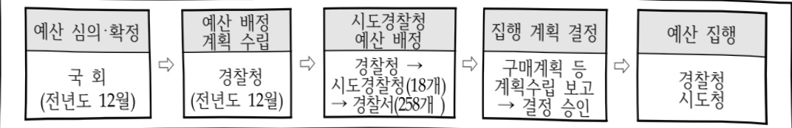

# 경찰정보화기반고도화(정보화)

**해당 페이지**: PDF 65 ~ 72 쪽 해당

**부처**: 경찰청
**분야**: 공공질서 및 안전
**회계유형**: 일반회계
**2026 확정예산**: 78334.0 백만원
**전년대비 증감률**: 1.7%
**AI 도메인**: 행정/전자정부

---

### 가. 예산 총괄표

(단위:백만원,%)

<table border=1 style='margin: auto; word-wrap: break-word;'><tr><td rowspan="2">사업명</td><td rowspan="2">2024년 결산</td><td colspan="2">2025년 예산</td><td colspan="2">2026년</td><td rowspan="2">증감 (B-A)</td><td rowspan="2">(B-A)/A</td></tr><tr><td style='text-align: center; word-wrap: break-word;'>본예산(A)</td><td style='text-align: center; word-wrap: break-word;'>추경</td><td style='text-align: center; word-wrap: break-word;'>요구</td><td style='text-align: center; word-wrap: break-word;'>조정(B)</td></tr><tr><td style='text-align: center; word-wrap: break-word;'>경찰정보화기반고도화 (정보화)</td><td style='text-align: center; word-wrap: break-word;'>62,509</td><td style='text-align: center; word-wrap: break-word;'>77,006</td><td style='text-align: center; word-wrap: break-word;'>77,006</td><td style='text-align: center; word-wrap: break-word;'>78,334</td><td style='text-align: center; word-wrap: break-word;'>78,334</td><td style='text-align: center; word-wrap: break-word;'>1,328</td><td style='text-align: center; word-wrap: break-word;'>1.7</td></tr></table>

□ 내역사업별 예산 내역

(단위:백만원)

<table border=1 style='margin: auto; word-wrap: break-word;'><tr><td rowspan="3"></td><td colspan="5">2024</td><td colspan="8">2025(25.11월말)</td><td rowspan="3">2026예산</td></tr><tr><td rowspan="2">예산액(추정)</td><td rowspan="2">예산현액</td><td rowspan="2">집행액[삼액]</td><td rowspan="2">이월액</td><td rowspan="2">불용액</td><td colspan="2">예산액</td><td rowspan="2">예산현액</td><td rowspan="2">집행액[삼액]</td><td colspan="2">전년도 이월액제외</td><td rowspan="2">이월예산액</td><td rowspan="2">불용예산액</td></tr><tr><td style='text-align: center; word-wrap: break-word;'>본예산</td><td style='text-align: center; word-wrap: break-word;'>수정</td><td style='text-align: center; word-wrap: break-word;'>예산현액</td><td style='text-align: center; word-wrap: break-word;'>집행액[삼액]</td></tr><tr><td style='text-align: center; word-wrap: break-word;'>ㅇ기능별 분류(함께)</td><td style='text-align: center; word-wrap: break-word;'>63,374</td><td style='text-align: center; word-wrap: break-word;'>63,374</td><td style='text-align: center; word-wrap: break-word;'>62,509</td><td style='text-align: center; word-wrap: break-word;'>57</td><td style='text-align: center; word-wrap: break-word;'>808</td><td style='text-align: center; word-wrap: break-word;'>77,006</td><td style='text-align: center; word-wrap: break-word;'>77,006</td><td style='text-align: center; word-wrap: break-word;'>77,063</td><td style='text-align: center; word-wrap: break-word;'>66,088</td><td style='text-align: center; word-wrap: break-word;'>77,006</td><td style='text-align: center; word-wrap: break-word;'>66,031</td><td style='text-align: center; word-wrap: break-word;'>-</td><td style='text-align: center; word-wrap: break-word;'>-</td><td style='text-align: center; word-wrap: break-word;'>78,334</td></tr><tr><td style='text-align: center; word-wrap: break-word;'>·통합유지관리 운영</td><td style='text-align: center; word-wrap: break-word;'>9,816</td><td style='text-align: center; word-wrap: break-word;'>9,816</td><td style='text-align: center; word-wrap: break-word;'>9,815</td><td style='text-align: center; word-wrap: break-word;'>-</td><td style='text-align: center; word-wrap: break-word;'>1</td><td style='text-align: center; word-wrap: break-word;'>11,967</td><td style='text-align: center; word-wrap: break-word;'>11,967</td><td style='text-align: center; word-wrap: break-word;'>11,967</td><td style='text-align: center; word-wrap: break-word;'>9,897</td><td style='text-align: center; word-wrap: break-word;'>11,967</td><td style='text-align: center; word-wrap: break-word;'>9,897</td><td style='text-align: center; word-wrap: break-word;'>-</td><td style='text-align: center; word-wrap: break-word;'>-</td><td style='text-align: center; word-wrap: break-word;'>14,503</td></tr><tr><td style='text-align: center; word-wrap: break-word;'>·보안관제센터 운영</td><td style='text-align: center; word-wrap: break-word;'>2,439</td><td style='text-align: center; word-wrap: break-word;'>2,439</td><td style='text-align: center; word-wrap: break-word;'>2,439</td><td style='text-align: center; word-wrap: break-word;'>-</td><td style='text-align: center; word-wrap: break-word;'>-</td><td style='text-align: center; word-wrap: break-word;'>2,213</td><td style='text-align: center; word-wrap: break-word;'>2,213</td><td style='text-align: center; word-wrap: break-word;'>2,213</td><td style='text-align: center; word-wrap: break-word;'>2,208</td><td style='text-align: center; word-wrap: break-word;'>2,213</td><td style='text-align: center; word-wrap: break-word;'>2,208</td><td style='text-align: center; word-wrap: break-word;'>-</td><td style='text-align: center; word-wrap: break-word;'>-</td><td style='text-align: center; word-wrap: break-word;'>5,006</td></tr><tr><td style='text-align: center; word-wrap: break-word;'>·전국 전산정비 운영</td><td style='text-align: center; word-wrap: break-word;'>30,352</td><td style='text-align: center; word-wrap: break-word;'>30,352</td><td style='text-align: center; word-wrap: break-word;'>29,848</td><td style='text-align: center; word-wrap: break-word;'>-</td><td style='text-align: center; word-wrap: break-word;'>504</td><td style='text-align: center; word-wrap: break-word;'>32,988</td><td style='text-align: center; word-wrap: break-word;'>32,988</td><td style='text-align: center; word-wrap: break-word;'>32,988</td><td style='text-align: center; word-wrap: break-word;'>31,404</td><td style='text-align: center; word-wrap: break-word;'>32,988</td><td style='text-align: center; word-wrap: break-word;'>31,404</td><td style='text-align: center; word-wrap: break-word;'>-</td><td style='text-align: center; word-wrap: break-word;'>-</td><td style='text-align: center; word-wrap: break-word;'>34,318</td></tr><tr><td style='text-align: center; word-wrap: break-word;'>·소프트웨어 정품화</td><td style='text-align: center; word-wrap: break-word;'>2,739</td><td style='text-align: center; word-wrap: break-word;'>2,739</td><td style='text-align: center; word-wrap: break-word;'>2,739</td><td style='text-align: center; word-wrap: break-word;'>-</td><td style='text-align: center; word-wrap: break-word;'>-</td><td style='text-align: center; word-wrap: break-word;'>2,739</td><td style='text-align: center; word-wrap: break-word;'>2,739</td><td style='text-align: center; word-wrap: break-word;'>2,739</td><td style='text-align: center; word-wrap: break-word;'>2,739</td><td style='text-align: center; word-wrap: break-word;'>2,739</td><td style='text-align: center; word-wrap: break-word;'>2,739</td><td style='text-align: center; word-wrap: break-word;'>-</td><td style='text-align: center; word-wrap: break-word;'>-</td><td style='text-align: center; word-wrap: break-word;'>2,844</td></tr><tr><td style='text-align: center; word-wrap: break-word;'>·공공요금 등 카타운영</td><td style='text-align: center; word-wrap: break-word;'>13,694</td><td style='text-align: center; word-wrap: break-word;'>13,694</td><td style='text-align: center; word-wrap: break-word;'>13,618</td><td style='text-align: center; word-wrap: break-word;'>-</td><td style='text-align: center; word-wrap: break-word;'>76</td><td style='text-align: center; word-wrap: break-word;'>13,695</td><td style='text-align: center; word-wrap: break-word;'>13,695</td><td style='text-align: center; word-wrap: break-word;'>13,695</td><td style='text-align: center; word-wrap: break-word;'>12,955</td><td style='text-align: center; word-wrap: break-word;'>13,695</td><td style='text-align: center; word-wrap: break-word;'>12,955</td><td style='text-align: center; word-wrap: break-word;'>-</td><td style='text-align: center; word-wrap: break-word;'>-</td><td style='text-align: center; word-wrap: break-word;'>13,695</td></tr><tr><td style='text-align: center; word-wrap: break-word;'>·기타정보시스템 운영</td><td style='text-align: center; word-wrap: break-word;'>1,462</td><td style='text-align: center; word-wrap: break-word;'>1,462</td><td style='text-align: center; word-wrap: break-word;'>1,312</td><td style='text-align: center; word-wrap: break-word;'>57</td><td style='text-align: center; word-wrap: break-word;'>93</td><td style='text-align: center; word-wrap: break-word;'>-</td><td style='text-align: center; word-wrap: break-word;'>-</td><td style='text-align: center; word-wrap: break-word;'>57</td><td style='text-align: center; word-wrap: break-word;'>57</td><td style='text-align: center; word-wrap: break-word;'>-</td><td style='text-align: center; word-wrap: break-word;'>-</td><td style='text-align: center; word-wrap: break-word;'>-</td><td style='text-align: center; word-wrap: break-word;'>-</td><td style='text-align: center; word-wrap: break-word;'>-</td></tr><tr><td style='text-align: center; word-wrap: break-word;'>·시스템 구축 및 개선</td><td style='text-align: center; word-wrap: break-word;'>2,872</td><td style='text-align: center; word-wrap: break-word;'>2,872</td><td style='text-align: center; word-wrap: break-word;'>2,738</td><td style='text-align: center; word-wrap: break-word;'>-</td><td style='text-align: center; word-wrap: break-word;'>134</td><td style='text-align: center; word-wrap: break-word;'>13,404</td><td style='text-align: center; word-wrap: break-word;'>13,404</td><td style='text-align: center; word-wrap: break-word;'>13,404</td><td style='text-align: center; word-wrap: break-word;'>6,828</td><td style='text-align: center; word-wrap: break-word;'>13,404</td><td style='text-align: center; word-wrap: break-word;'>6,828</td><td style='text-align: center; word-wrap: break-word;'>-</td><td style='text-align: center; word-wrap: break-word;'>-</td><td style='text-align: center; word-wrap: break-word;'>7,968</td></tr></table>

---

### 나. 사업설명자료

## 1 ) 사업목적·내용

① (경찰정보시스템 통합유지관리 운영)

개별 관리하던 정보시스템의 유지관리사업을 하나로 통합하여 체계화된 절차와 방법을 통해 중복과 불일치를 제거하여 시스템 안정성 및 효율성 향상

② (경찰 사이버보안관제센터 운영)

·급증하는 사이버 위협에 대응하기 위해 성능이 개선된 최신 정보보호시스템으로 고도화 및

바이러스 감염방지 등 안전한 경찰전산망을 관리하기 위한 백신 소프트웨어 구매

③ (전국 경찰관서 각종 전산장비 운영)

· 전국 경찰관서의 내용연수 경과한 사무용 전산장비(PC, 프린터, 노트북 등)를 적기에 교체하여 장비 고장으로 발생하는 업무능률 저하 최소화 및 정보화 인프라 구축

④ (MS 라이선스 등 소프트웨어 정품화)

· 전국 경찰관서 업무용 PC 등 MS·Adobe·한컴오피스 관련 라이선스 분쟁 예방 및

정품 소프트웨어 라이선스 구매

⑤(공공요금 등 기타 운영비)

·경찰정보통신망의안정적인서비스제공을위한전국경찰관서(본청,시도청,경찰서,

지구대·파출소)를 연결하고 있는 경찰 정보통신망의 전용회선 비용

⑥ (경찰 정보시스템 및 구축 및 개선)

·변화하는 업무 환경에 신속히 대응할 수 있도록 신규 시스템 구축·ISP 사업·노후 시스템

고도화를 통해 시스템 이용자 편의 증대 및 업무 효율성 제고

## 2 ) 사업개요

## ☐ 사업근거 및 추진경위

① 법령상 근거

- 전자정부법 제3조(행정기관등 및 공무원 등의 책무) ① 행정기관등의 장은 전자정부 구현을 촉진하고 국민의 삶의 질을 향상시킬 수 있도록 이 법을 운영하고 관련 제도를 개선하여야 하며, 정보통신망의 연계 및 행정정보의 공동이용 등에 적극 협력하여야 한다.

② 공무원 및 공공기관의 소속 직원은 담당업무의 전자적 처리에 필요한 정보기술 활

---

용능력을 갖추어야 하며, 담당업무를 전자적으로 처리할 때 해당 기관의 편의보다 국민의 편의을 우선적으로 고려하여야 한다.

- 지능정보화 기본법 제14조(공공지능정보화의 추진) ① 국가기관등은 공공서비스의 지능정보화를 도모하고 국민 편의 증진 등을 위하여 행정, 보건, 사회복지, 교육, 문화, 환경, 교통, 물류, 과학기술, 재난안전, 치안, 국방, 에너지 등 소관 업무에 대한 지능정보화(이하 “공공지능정보화”라 한다)를 추진하여야 한다.

② 국가기관등은 공공지능정보화를 효율적으로 추진하기 위하여 필요한 방안을 마련하여야 한다.

- 국가사이버안전관리규정 제4조(사이버안전 확보의 책무) ① 중앙행정기관의 장은 소관 정보통신망에 대하여 안정성을 확보할 책임이 있으며 이를 위하여 사이버안전업무를 전담하는 전문인력을 확보하는 등 필요한 조치를 강구하여야 한다.

## ② 추진경위

- 정보화기술을 활용하여 치안행정 효율성을 제고하고, 국민들에게 양질의 치안서비스를 제공하기 위해 경찰업무와 관련된 각종 정보시스템을 구축·운영하기 위하여 '96년 경찰종합정보체제 구축을 시작으로 경찰정보화기반 고도화를 추진

## □ 주요내용

① 사업규모

- 총사업비(해당되는 경우에만 기재) : 해당없음

- 사업기간 : 계속

- 최근 5년 간 투입된 사업비(예산액기준, 추경편성한 연도에는 추경포함)

<table border=1 style='margin: auto; word-wrap: break-word;'><tr><td style='text-align: center; word-wrap: break-word;'>$ \underline{\text{所}} $</td><td style='text-align: center; word-wrap: break-word;'>2022</td><td style='text-align: center; word-wrap: break-word;'>2023</td><td style='text-align: center; word-wrap: break-word;'>2024</td><td style='text-align: center; word-wrap: break-word;'>2025</td><td style='text-align: center; word-wrap: break-word;'>2026</td></tr><tr><td style='text-align: center; word-wrap: break-word;'>$ \underline{\text{人}} $</td><td style='text-align: center; word-wrap: break-word;'>65,912</td><td style='text-align: center; word-wrap: break-word;'>62,726</td><td style='text-align: center; word-wrap: break-word;'>63,374</td><td style='text-align: center; word-wrap: break-word;'>77,006</td><td style='text-align: center; word-wrap: break-word;'>78,334</td></tr></table>

② 사업추진체계

- 사업시행방법 : 직접수행

- 사업시행주체 : 경찰청

- 사업 수혜자 : 내부직원, 대국민

---

① 경찰 정보시스템 통합유지관리 운영 : ('25) 11,967 → ('26) 14,503 백만원(+2,536 백만원)
② 경찰 사이버보안관제센터 운영 : ('25) 2,213 → ('26) 5,006 백만원(+2,793 백만원)
1. 정보보호시스템 고도화 : ('25) 587 → ('26) 380 백만원(△207 백만원)
2. 통합백신 소프트웨어 라이선스 구입 : ('25) 1,416 → ('26) 1,416 백만원(전년동)
3. 내 PC지키미 고도화 : 210 백만원(전년동)
4. 첨단 정보보호 체계 구축 : ('25) 0 → ('26) 2,200 백만원(순증)
5. 첨단기술 보안관제시스템 구축 : ('25) 0 → ('26) 800 백만원(순증)
③ 전국 경찰관서 전산장비 운영 : ('25) 32,988 → ('26) 34,318 백만원(1,330 백만원)
1. 전국 경찰관서 노후 PC 등 교체 : ('25) 24,708 → ('26) 24,620 백만원(△88 백만원)
2. 전국 경찰관서 PC, 프린터 등 유지보수 : 85,160 백만원 × 5% = 4,258 백만원(전년동)
3. 신설관서 전산장비(PC 등) 보급 등 지원 : ('25) 1,320 → ('26) 1,195 백만원(△125 백만원)
4. 전국 경찰관서 노후 네트워크 장비 교체 : ('25) 1,576 → ('26) 1,900 백만원(+324 백만원)
5. 전국 경찰관서 네트워크 장비 유지보수 : 10,680 백만원 × 6% = 641 백만원(전년동)
6. 전국 시·도 경찰청 인프라 지원 : 485 백만원(전년동)
7. 논리적망전환장치 노후서버 교체 및 관리서버 이증화 : ('25) 0 → ('26) 924 백만원(순증)
8. 노후 통합망연계시스템 교체 : ('25) 0 → ('26) 295 백만원(순증)
④ MS 라이선스 등 소프트웨어 정품화 : ('25) 2,739 → ('26) 2,844 백만원(+105 백만원)
1. MS GAS 연간 사용권 : 1,805 백만원
2. 한컴오피스 연간 라이선스 구입 795 백만원
3. Photoshop 등 Adobe社 SW 연간 라이선스 244 백만원
⑤ 공공요금 등 기타운영비 : ('25) 13,695 → ('26) 13,695 백만원(전년동)
1. 정보통신망 연간 회선료 : 13,400 백만원
2. 전국 경찰관서 소모품 구입 : 265 백만원
3. 국내여비 : 8 백만원
4. 경찰 정보화 전문역량 강화 10 백만원

---

5. 개인정보 관리체계 강화 12백만원

⑥ 경찰 정보시스템 구축 및 개선 : (25) 13,404 → (26) 7,968 백만원 (△5,436 백만원)

1. 비밀관리시스템 노후장비 교체 : (25) 2,354 → (26) 426백만원(△1,928백만원)

2. 경찰청 빅데이터 플랫폼 운영·분석 활용 : (25) 660 → (26) 652백만원(△8백만원)

3. 경찰민원24 홈서비스 구축 : (25) 8,465 → (26) 1,288백만원(△7,177백만원)

4. 온나라 2.0 전환 : (25) 50 → (26) 2,197백만원(+2,147백만원)

5. 경찰청 모바일오피스 iOS용 VMI환경 구축 : (25) 0 → (26) 2,342백만원(순증)

6. 업무자동화(RPA) 구축 : (25) 0 → (26) 83백만원(순증)

7. 경찰청 AI 통합플랫폼 구축 ISP : 519백만원(순증)

8. 차세대 실종아동등 통합 지원 플랫폼 구축 ISP : 461백만원(순증)

9. 1등급 정보시스템 장애 예방 : (25) 1,433 → (26) 0(순감)

10. 경찰헬기 항공업무시스템 이관 및 개선 : (25) 192 → (26) 0(순감)

11. 경찰정보시스템 통폐합 ISP : (25) 200 → (26) 0(순감)

12. 과학치안스테이션 구축 ISP : (25) 50 → (26) 0(순감)

## 4 ) 사업효과

□ 사업영향, 산출물 성과지표 등

① 2022~2026년도 성과계획서 상 성과지표 및 최근 5년간 성과 달성도

<table border=1 style='margin: auto; word-wrap: break-word;'><tr><td style='text-align: center; word-wrap: break-word;'>성과지표</td><td style='text-align: center; word-wrap: break-word;'>구분</td><td style='text-align: center; word-wrap: break-word;'>2022</td><td style='text-align: center; word-wrap: break-word;'>2023</td><td style='text-align: center; word-wrap: break-word;'>2024</td><td style='text-align: center; word-wrap: break-word;'>2025</td><td style='text-align: center; word-wrap: break-word;'>2026</td><td style='text-align: center; word-wrap: break-word;'>2026 목표치산출근거</td><td style='text-align: center; word-wrap: break-word;'>측정산식(또는 측정방법)</td><td style='text-align: center; word-wrap: break-word;'>자료수집방법(또는 자료출처)</td></tr><tr><td style='text-align: center; word-wrap: break-word;'>정보화업무</td><td rowspan="2">목표</td><td style='text-align: center; word-wrap: break-word;'>89.8</td><td style='text-align: center; word-wrap: break-word;'>90.4</td><td style='text-align: center; word-wrap: break-word;'>88.9</td><td style='text-align: center; word-wrap: break-word;'>87.8</td><td style='text-align: center; word-wrap: break-word;'>85.3</td><td style='text-align: center; word-wrap: break-word;'>최근 3년간</td><td style='text-align: center; word-wrap: break-word;'>(플랫폼만족도 x 0.5)</td><td style='text-align: center; word-wrap: break-word;'>정보화업무서비스 만족도(정보화)(점)</td></tr><tr><td rowspan="2">서비스만족도</td><td style='text-align: center; word-wrap: break-word;'>87.5</td><td style='text-align: center; word-wrap: break-word;'>84.7</td><td style='text-align: center; word-wrap: break-word;'>83.4</td><td style='text-align: center; word-wrap: break-word;'>(87.8)</td><td style='text-align: center; word-wrap: break-word;'></td><td style='text-align: center; word-wrap: break-word;'>실적 평균치인</td><td style='text-align: center; word-wrap: break-word;'>+(온라인족도 x 0.3)</td><td style='text-align: center; word-wrap: break-word;'>서비스 만족도설문조사 결과</td></tr><tr><td style='text-align: center; word-wrap: break-word;'>달성도</td><td style='text-align: center; word-wrap: break-word;'>97.4</td><td style='text-align: center; word-wrap: break-word;'>93.7</td><td style='text-align: center; word-wrap: break-word;'>93.8</td><td style='text-align: center; word-wrap: break-word;'></td><td style='text-align: center; word-wrap: break-word;'></td><td style='text-align: center; word-wrap: break-word;'>85.3점을 목표로 설정</td><td style='text-align: center; word-wrap: break-word;'>+(e사람만족도 x 0.2)</td><td style='text-align: center; word-wrap: break-word;'>설문조사 결과</td></tr></table>

② 성과지표 이외의 연도별 사업추진 경과 및 실적

<table border=1 style='margin: auto; word-wrap: break-word;'><tr><td style='text-align: center; word-wrap: break-word;'>2022</td><td style='text-align: center; word-wrap: break-word;'>- ‘경찰청 빅데이터 플랫폼’ 3차 구축 완료- 외부에서도 업무가 가능한 모바일 오피스 언택트 근무환경 1단계 구축- 노후 사무용 PC, 노트북, 모니터, 프린터 등 55,400대 적기 교체- 온라인조회 자료검색 시스템 노후 데이터베이스를 최신 버전으로 교체</td></tr><tr><td style='text-align: center; word-wrap: break-word;'>2023</td><td style='text-align: center; word-wrap: break-word;'>- 모바일오피스 2단계 구축으로 폴넷, 영상회의등 현장에서 업무처리 가능- 비밀관리시스템 등 노후 시스템을 고도화 함으로 안정적인 서비스 제공- 여의도 벗꽂축제 △부산 불꽃축제 등 대규모 인파가 몰리는 행사 유동</td></tr></table>

---

<table border=1 style='margin: auto; word-wrap: break-word;'><tr><td style='text-align: center; word-wrap: break-word;'></td><td style='text-align: center; word-wrap: break-word;'>인구 과거 데이터 분석, 행사 시점의 유동인구 분포 예측으로 혼잡 대응 및 사고 예방을 위한 경비대책 수립에 기여</td></tr><tr><td style='text-align: center; word-wrap: break-word;'>2024</td><td style='text-align: center; word-wrap: break-word;'>- 모바일오피스 구축 완료로 치안 현장에서 경찰 행정업무 처리 가능 - △CPO 범죄예방분석 모델 △기동순찰대 배치 장소 선정 모델 △AI기반 정보공개청구 자동 비식별화 프로그램 등 표준분석모델 개발로 현장직원들이 쉽게 업무에 활용 가능하도록 분석서비스 제공 - “경찰민원 24홈서비스” 구축을 위한 정보화전략계획 수립</td></tr><tr><td style='text-align: center; word-wrap: break-word;'>2025</td><td style='text-align: center; word-wrap: break-word;'>- 1등급 정보시스템 노후장비 교체, 장비 이중화, 모니터링 고도화, 복수인증수단을 통해 장애에 대해 선제적 대응 및 안정적인 시스템 운영 - △법령(5,441건) △관례(87,163건) △매뉴얼(1189건) 등 법무지식 정보에 특화된 생성형 AI 모델 개발로 현장 대응력 강화와 정보 활용성 향상 - “경찰민원 24홈서비스” 구축으로 모든 경찰 민원을 24시간 365일 온라인으로 신청·처리가 가능</td></tr></table>

## ③향후(2026년도 이후)기대효과

-경찰 업무 효율성과 편의성 개선을 위해 AI를 활용한 지능형 업무시스템 도입

- 첨단 정보보호 체계구축 및 첨단기술 보안관제 시스템 도입으로 해킹 등 외부 위협

차단, 내부 자료 유출 방지 등 사이버 보안관리 강화

- 온나라 2.0 전환으로 윈도우10 기술지원 종료에 따른 보안취약점 해소 및 웹표준 중심의 문서작성 환경 구현

5) 타당성조사 및 예비타당성조사 시행여부 및 결과 요지 : 해당없음

6) 총사업비 대상사업 여부 및 내역 : 해당없음

## 7 ) 사업 집행절차

---

### 다. 최근 4년간 결산내역

## 1 ) 결산표

☐ 부처 결산내역

(단위:백만원,%)

<table border=1 style='margin: auto; word-wrap: break-word;'><tr><td rowspan="2">연도</td><td colspan="3">예산액</td><td rowspan="2">전년도 이월액</td><td rowspan="2">이·전용 등</td><td rowspan="2">예비비</td><td rowspan="2">예산 현액(B)</td><td rowspan="2">집행액(C)</td><td rowspan="2">집행률(C/A)</td><td rowspan="2">집행률(C/B)</td><td rowspan="2">다음연도 이월액</td><td rowspan="2">불용액</td></tr><tr><td style='text-align: center; word-wrap: break-word;'>본예산 중감액</td><td style='text-align: center; word-wrap: break-word;'>추경</td><td style='text-align: center; word-wrap: break-word;'>추경(A)</td></tr><tr><td style='text-align: center; word-wrap: break-word;'>2022</td><td style='text-align: center; word-wrap: break-word;'>65,932</td><td style='text-align: center; word-wrap: break-word;'>△20</td><td style='text-align: center; word-wrap: break-word;'>65,912</td><td style='text-align: center; word-wrap: break-word;'></td><td style='text-align: center; word-wrap: break-word;'></td><td style='text-align: center; word-wrap: break-word;'></td><td style='text-align: center; word-wrap: break-word;'>65,912</td><td style='text-align: center; word-wrap: break-word;'>64,635</td><td style='text-align: center; word-wrap: break-word;'>98.1</td><td style='text-align: center; word-wrap: break-word;'>98.1</td><td style='text-align: center; word-wrap: break-word;'>361</td><td style='text-align: center; word-wrap: break-word;'>916</td></tr><tr><td style='text-align: center; word-wrap: break-word;'>2023</td><td style='text-align: center; word-wrap: break-word;'>62,726</td><td style='text-align: center; word-wrap: break-word;'></td><td style='text-align: center; word-wrap: break-word;'>62,726</td><td style='text-align: center; word-wrap: break-word;'>361</td><td style='text-align: center; word-wrap: break-word;'></td><td style='text-align: center; word-wrap: break-word;'></td><td style='text-align: center; word-wrap: break-word;'>63,087</td><td style='text-align: center; word-wrap: break-word;'>62,384</td><td style='text-align: center; word-wrap: break-word;'>99.5</td><td style='text-align: center; word-wrap: break-word;'>98.9</td><td style='text-align: center; word-wrap: break-word;'></td><td style='text-align: center; word-wrap: break-word;'>703</td></tr><tr><td style='text-align: center; word-wrap: break-word;'>2024</td><td style='text-align: center; word-wrap: break-word;'>63,374</td><td style='text-align: center; word-wrap: break-word;'></td><td style='text-align: center; word-wrap: break-word;'>63,374</td><td style='text-align: center; word-wrap: break-word;'></td><td style='text-align: center; word-wrap: break-word;'></td><td style='text-align: center; word-wrap: break-word;'></td><td style='text-align: center; word-wrap: break-word;'>63,374</td><td style='text-align: center; word-wrap: break-word;'>62,509</td><td style='text-align: center; word-wrap: break-word;'>98.6</td><td style='text-align: center; word-wrap: break-word;'>98.6</td><td style='text-align: center; word-wrap: break-word;'>57</td><td style='text-align: center; word-wrap: break-word;'>808</td></tr><tr><td style='text-align: center; word-wrap: break-word;'>2025</td><td style='text-align: center; word-wrap: break-word;'>77,006</td><td style='text-align: center; word-wrap: break-word;'></td><td style='text-align: center; word-wrap: break-word;'>77,006</td><td style='text-align: center; word-wrap: break-word;'>57</td><td style='text-align: center; word-wrap: break-word;'></td><td style='text-align: center; word-wrap: break-word;'></td><td style='text-align: center; word-wrap: break-word;'>77,063</td><td style='text-align: center; word-wrap: break-word;'>66,088</td><td style='text-align: center; word-wrap: break-word;'>85.8</td><td style='text-align: center; word-wrap: break-word;'>85.8</td><td style='text-align: center; word-wrap: break-word;'></td><td style='text-align: center; word-wrap: break-word;'></td></tr></table>

## 2 ) 주요 결산사항

☐ 2022~2025년 결산사항

<table border=1 style='margin: auto; word-wrap: break-word;'><tr><td style='text-align: center; word-wrap: break-word;'>2022</td><td style='text-align: center; word-wrap: break-word;'>- (불용) 집행잔액 및 낙찰차액
- (이월) 유찰 및 재입찰, 단일응찰에 따른 가격협상 결렬 등으로 계약지연</td></tr><tr><td style='text-align: center; word-wrap: break-word;'>2023</td><td style='text-align: center; word-wrap: break-word;'>- (불용) 집행잔액 및 낙찰차액
- (이월) 해당없음</td></tr><tr><td style='text-align: center; word-wrap: break-word;'>2024</td><td style='text-align: center; word-wrap: break-word;'>- (불용) 집행잔액 및 낙찰차액
- (이월) 선행사업인 국정자원 통합(HW구축)사업 지연에 따라 “장비포털 AP이관 사업” 계약지연</td></tr><tr><td style='text-align: center; word-wrap: break-word;'>2025</td><td style='text-align: center; word-wrap: break-word;'>- (불용) 집행잔액 및 낙찰차액
- (이월) 해당없음</td></tr></table>

□ 2025년 계획변경 세부내역 : 해당없음

---

<table border=1 style='margin: auto; word-wrap: break-word;'><tr><td style='text-align: center; word-wrap: break-word;'>사 업 명</td></tr><tr><td style='text-align: center; word-wrap: break-word;'>과학기술기반군중밀 집관리기술개발(R&amp;D) (4431-720)</td></tr></table>

## □ 사업 코드 정보

<table border=1 style='margin: auto; word-wrap: break-word;'><tr><td style='text-align: center; word-wrap: break-word;'>구분</td><td style='text-align: center; word-wrap: break-word;'>회계</td><td style='text-align: center; word-wrap: break-word;'>소관</td><td style='text-align: center; word-wrap: break-word;'>실국(기관)</td><td style='text-align: center; word-wrap: break-word;'>계정</td><td style='text-align: center; word-wrap: break-word;'>분야</td><td style='text-align: center; word-wrap: break-word;'>부문</td></tr><tr><td style='text-align: center; word-wrap: break-word;'>코드</td><td rowspan="2">일반회계</td><td rowspan="2">경찰청</td><td rowspan="2">미래치안정책국</td><td rowspan="2"></td><td style='text-align: center; word-wrap: break-word;'>020</td><td style='text-align: center; word-wrap: break-word;'>023</td></tr><tr><td style='text-align: center; word-wrap: break-word;'>명칭</td><td style='text-align: center; word-wrap: break-word;'>공공질서및안전</td><td style='text-align: center; word-wrap: break-word;'>경찰</td></tr></table>

<table border=1 style='margin: auto; word-wrap: break-word;'><tr><td style='text-align: center; word-wrap: break-word;'>구분</td><td style='text-align: center; word-wrap: break-word;'>프로그램</td><td style='text-align: center; word-wrap: break-word;'>단위사업</td><td style='text-align: center; word-wrap: break-word;'>세부사업</td></tr><tr><td style='text-align: center; word-wrap: break-word;'>코드</td><td style='text-align: center; word-wrap: break-word;'>4400</td><td style='text-align: center; word-wrap: break-word;'>4431</td><td style='text-align: center; word-wrap: break-word;'>720</td></tr><tr><td style='text-align: center; word-wrap: break-word;'>명칭</td><td style='text-align: center; word-wrap: break-word;'>과학치안활성화</td><td style='text-align: center; word-wrap: break-word;'>정책연구개발(R&amp;D)</td><td style='text-align: center; word-wrap: break-word;'>과학기술기반군중 밀집관리기술개발(R&amp;D)</td></tr></table>

☐ 사업 성격

<table border=1 style='margin: auto; word-wrap: break-word;'><tr><td rowspan="2">신규</td><td rowspan="2">계속</td><td rowspan="2">완료</td><td rowspan="2">예비타당성 실시여부</td><td rowspan="2">총사업비 관리대상</td><td rowspan="2">총액계상 예산사업</td><td style='text-align: center; word-wrap: break-word;'>사업소관 변경정보</td></tr><tr><td style='text-align: center; word-wrap: break-word;'>2025예산 시 소관</td></tr><tr><td style='text-align: center; word-wrap: break-word;'></td><td style='text-align: center; word-wrap: break-word;'>○</td><td style='text-align: center; word-wrap: break-word;'></td><td style='text-align: center; word-wrap: break-word;'></td><td style='text-align: center; word-wrap: break-word;'></td><td style='text-align: center; word-wrap: break-word;'></td><td style='text-align: center; word-wrap: break-word;'></td></tr></table>

□ 사업 지원 형태 및 지원율

<table border=1 style='margin: auto; word-wrap: break-word;'><tr><td style='text-align: center; word-wrap: break-word;'>직접</td><td style='text-align: center; word-wrap: break-word;'>출자</td><td style='text-align: center; word-wrap: break-word;'>출연</td><td style='text-align: center; word-wrap: break-word;'>보조</td><td style='text-align: center; word-wrap: break-word;'>융자</td><td style='text-align: center; word-wrap: break-word;'>국고보조율(%)</td><td style='text-align: center; word-wrap: break-word;'>융자율(%)</td></tr><tr><td style='text-align: center; word-wrap: break-word;'></td><td style='text-align: center; word-wrap: break-word;'></td><td style='text-align: center; word-wrap: break-word;'>○</td><td style='text-align: center; word-wrap: break-word;'></td><td style='text-align: center; word-wrap: break-word;'></td><td style='text-align: center; word-wrap: break-word;'></td><td style='text-align: center; word-wrap: break-word;'></td></tr></table>

## □ 사업 담당자

<table border=1 style='margin: auto; word-wrap: break-word;'><tr><td style='text-align: center; word-wrap: break-word;'>사업명</td><td colspan="2">구분</td></tr><tr><td rowspan="2"></td><td style='text-align: center; word-wrap: break-word;'>소관부처</td><td style='text-align: center; word-wrap: break-word;'>마래치안정채국</td></tr><tr><td style='text-align: center; word-wrap: break-word;'>사업시행주체</td><td style='text-align: center; word-wrap: break-word;'>과학기술개발진흥과</td></tr></table>

---

### 원본 PDF 크롭 이미지

