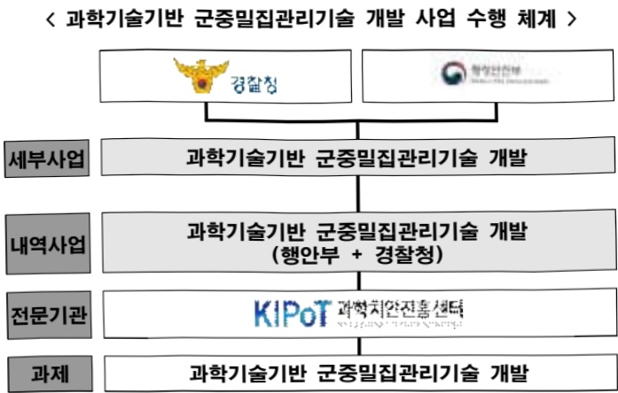

# 과학기술 기반 군중밀집 관리 기술 개발(R&D)

**해당 페이지**: PDF 73 ~ 78 쪽 해당

**부처**: 경찰청
**분야**: 공공질서 및 안전
**회계유형**: 일반회계
**2026 확정예산**: 1976.0 백만원
**전년대비 증감률**: None%
**AI 도메인**: 국방/안보

---

<table border=1 style='margin: auto; word-wrap: break-word;'><tr><td style='text-align: center; word-wrap: break-word;'>사 업 명</td></tr><tr><td style='text-align: center; word-wrap: break-word;'>과학기술기반군중밀 집관리기술개발(R&amp;D) (4431-720)</td></tr></table>

## □ 사업 코드 정보

<table border=1 style='margin: auto; word-wrap: break-word;'><tr><td style='text-align: center; word-wrap: break-word;'>구분</td><td style='text-align: center; word-wrap: break-word;'>회계</td><td style='text-align: center; word-wrap: break-word;'>소관</td><td style='text-align: center; word-wrap: break-word;'>실국(기관)</td><td style='text-align: center; word-wrap: break-word;'>계정</td><td style='text-align: center; word-wrap: break-word;'>분야</td><td style='text-align: center; word-wrap: break-word;'>부문</td></tr><tr><td style='text-align: center; word-wrap: break-word;'>코드</td><td rowspan="2">일반회계</td><td rowspan="2">경찰청</td><td rowspan="2">미래치안정책국</td><td rowspan="2"></td><td style='text-align: center; word-wrap: break-word;'>020</td><td style='text-align: center; word-wrap: break-word;'>023</td></tr><tr><td style='text-align: center; word-wrap: break-word;'>명칭</td><td style='text-align: center; word-wrap: break-word;'>공공질서및안전</td><td style='text-align: center; word-wrap: break-word;'>경찰</td></tr></table>

<table border=1 style='margin: auto; word-wrap: break-word;'><tr><td style='text-align: center; word-wrap: break-word;'>구분</td><td style='text-align: center; word-wrap: break-word;'>프로그램</td><td style='text-align: center; word-wrap: break-word;'>단위사업</td><td style='text-align: center; word-wrap: break-word;'>세부사업</td></tr><tr><td style='text-align: center; word-wrap: break-word;'>코드</td><td style='text-align: center; word-wrap: break-word;'>4400</td><td style='text-align: center; word-wrap: break-word;'>4431</td><td style='text-align: center; word-wrap: break-word;'>720</td></tr><tr><td style='text-align: center; word-wrap: break-word;'>명칭</td><td style='text-align: center; word-wrap: break-word;'>과학치안활성화</td><td style='text-align: center; word-wrap: break-word;'>정책연구개발(R&amp;D)</td><td style='text-align: center; word-wrap: break-word;'>과학기술기반군중 밀집관리기술개발(R&amp;D)</td></tr></table>

☐ 사업 성격

<table border=1 style='margin: auto; word-wrap: break-word;'><tr><td rowspan="2">신규</td><td rowspan="2">계속</td><td rowspan="2">완료</td><td rowspan="2">예비타당성 실시여부</td><td rowspan="2">총사업비 관리대상</td><td rowspan="2">총액계상 예산사업</td><td style='text-align: center; word-wrap: break-word;'>사업소관 변경정보</td></tr><tr><td style='text-align: center; word-wrap: break-word;'>2025예산 시 소관</td></tr><tr><td style='text-align: center; word-wrap: break-word;'></td><td style='text-align: center; word-wrap: break-word;'>○</td><td style='text-align: center; word-wrap: break-word;'></td><td style='text-align: center; word-wrap: break-word;'></td><td style='text-align: center; word-wrap: break-word;'></td><td style='text-align: center; word-wrap: break-word;'></td><td style='text-align: center; word-wrap: break-word;'></td></tr></table>

□ 사업 지원 형태 및 지원율

<table border=1 style='margin: auto; word-wrap: break-word;'><tr><td style='text-align: center; word-wrap: break-word;'>직접</td><td style='text-align: center; word-wrap: break-word;'>출자</td><td style='text-align: center; word-wrap: break-word;'>출연</td><td style='text-align: center; word-wrap: break-word;'>보조</td><td style='text-align: center; word-wrap: break-word;'>융자</td><td style='text-align: center; word-wrap: break-word;'>국고보조율(%)</td><td style='text-align: center; word-wrap: break-word;'>융자율(%)</td></tr><tr><td style='text-align: center; word-wrap: break-word;'></td><td style='text-align: center; word-wrap: break-word;'></td><td style='text-align: center; word-wrap: break-word;'>○</td><td style='text-align: center; word-wrap: break-word;'></td><td style='text-align: center; word-wrap: break-word;'></td><td style='text-align: center; word-wrap: break-word;'></td><td style='text-align: center; word-wrap: break-word;'></td></tr></table>

## □ 사업 담당자

<table border=1 style='margin: auto; word-wrap: break-word;'><tr><td style='text-align: center; word-wrap: break-word;'>사업명</td><td colspan="2">구분</td></tr><tr><td rowspan="2"></td><td style='text-align: center; word-wrap: break-word;'>소관부처</td><td style='text-align: center; word-wrap: break-word;'>마래치안정채국</td></tr><tr><td style='text-align: center; word-wrap: break-word;'>사업시행주체</td><td style='text-align: center; word-wrap: break-word;'>과학기술개발진흥과</td></tr></table>

---

### 가.예산 총괄표

(단위:백만원,%)

<table border=1 style='margin: auto; word-wrap: break-word;'><tr><td rowspan="2">사업명</td><td rowspan="2">2024년 결산</td><td rowspan="2">2025년 예산 본예산(A)</td><td colspan="2">2026년</td><td rowspan="2">증감(B-A)</td><td rowspan="2">(B-A)/A</td></tr><tr><td style='text-align: center; word-wrap: break-word;'>요구</td><td style='text-align: center; word-wrap: break-word;'>조정(B)</td></tr><tr><td style='text-align: center; word-wrap: break-word;'>과학기술기반군중 밀집관리기술개발(R&amp;D)</td><td style='text-align: center; word-wrap: break-word;'>1,092</td><td style='text-align: center; word-wrap: break-word;'>1,976</td><td style='text-align: center; word-wrap: break-word;'>1,976</td><td style='text-align: center; word-wrap: break-word;'>1,976</td><td style='text-align: center; word-wrap: break-word;'>-</td><td style='text-align: center; word-wrap: break-word;'>-</td></tr></table>

## ☐ 내역사업별 예산 내역

(단위:백만원)

<table border=1 style='margin: auto; word-wrap: break-word;'><tr><td rowspan="3"></td><td colspan="5">2024</td><td colspan="7">2025(25.11월말)</td><td rowspan="3">2026예산</td></tr><tr><td rowspan="2">예산액(추정)</td><td rowspan="2">예산현액</td><td rowspan="2">집행액[설정액]</td><td rowspan="2">이월액</td><td rowspan="2">불용액</td><td rowspan="2">본예산</td><td rowspan="2">예산현액</td><td rowspan="2">집행액[설정액]</td><td colspan="2">전년도이월액제외</td><td rowspan="2">이월예산액</td><td rowspan="2">불용예산액</td></tr><tr><td style='text-align: center; word-wrap: break-word;'>예산현액</td><td style='text-align: center; word-wrap: break-word;'>집행액[설정액]</td></tr><tr><td style='text-align: center; word-wrap: break-word;'>ㅇ기능별 분류(합계)</td><td style='text-align: center; word-wrap: break-word;'>1,092</td><td style='text-align: center; word-wrap: break-word;'>1,092</td><td style='text-align: center; word-wrap: break-word;'>1,092[1,092]</td><td style='text-align: center; word-wrap: break-word;'>-</td><td style='text-align: center; word-wrap: break-word;'>-</td><td style='text-align: center; word-wrap: break-word;'>1,976</td><td style='text-align: center; word-wrap: break-word;'>1,976[1,976]</td><td style='text-align: center; word-wrap: break-word;'>1,976[1,976]</td><td style='text-align: center; word-wrap: break-word;'>1,976[1,976]</td><td style='text-align: center; word-wrap: break-word;'>1,976[1,976]</td><td style='text-align: center; word-wrap: break-word;'>-</td><td style='text-align: center; word-wrap: break-word;'>-</td><td style='text-align: center; word-wrap: break-word;'>1,976</td></tr><tr><td style='text-align: center; word-wrap: break-word;'>·과학기술기반 군중밀짐 관리 기술 개발</td><td style='text-align: center; word-wrap: break-word;'>1,050</td><td style='text-align: center; word-wrap: break-word;'>1,050</td><td style='text-align: center; word-wrap: break-word;'>1,050[1,050]</td><td style='text-align: center; word-wrap: break-word;'>-</td><td style='text-align: center; word-wrap: break-word;'>-</td><td style='text-align: center; word-wrap: break-word;'>1,900</td><td style='text-align: center; word-wrap: break-word;'>1,900[1,900]</td><td style='text-align: center; word-wrap: break-word;'>1,900[1,900]</td><td style='text-align: center; word-wrap: break-word;'>1,900[1,900]</td><td style='text-align: center; word-wrap: break-word;'>-</td><td style='text-align: center; word-wrap: break-word;'>-</td><td style='text-align: center; word-wrap: break-word;'>1,900</td><td style='text-align: center; word-wrap: break-word;'>-</td></tr><tr><td style='text-align: center; word-wrap: break-word;'>·기획평가관리비</td><td style='text-align: center; word-wrap: break-word;'>42</td><td style='text-align: center; word-wrap: break-word;'>42</td><td style='text-align: center; word-wrap: break-word;'>42[42]</td><td style='text-align: center; word-wrap: break-word;'>-</td><td style='text-align: center; word-wrap: break-word;'>-</td><td style='text-align: center; word-wrap: break-word;'>76</td><td style='text-align: center; word-wrap: break-word;'>76[76]</td><td style='text-align: center; word-wrap: break-word;'>76[76]</td><td style='text-align: center; word-wrap: break-word;'>76[76]</td><td style='text-align: center; word-wrap: break-word;'>-</td><td style='text-align: center; word-wrap: break-word;'>-</td><td style='text-align: center; word-wrap: break-word;'>76</td><td style='text-align: center; word-wrap: break-word;'>-</td></tr></table>

### 나.사업설명자료

## 1 ) 사업목적·내용

- (①내먹: 과학기술 기반 군중밀집 관리 기술 개발) 군중 분석 및 관리 기술 개발을 통해

밀집도를 계산·예측하고 이를 기반으로 현장 상황 분석과 경찰력 지원까지 연계 가능

한 종합솔루션 개발

- (②내역: 기획평가관리비) 원활한 사업 추진을 위한 기획, 평가, 관리 등 소요 비용

## 2 ) 사업개요

## □ 사업근거 및 추진경위

① 법령상 근거 및 조항 적시

-국가경찰과 자치경찰의 조직 및 운영에 관한 법률 제33조(치안에 필요한 연구개발의 지원 등)

- 재난 및 안전관리 기본법 제71조(재난 및 안전관리에 필요한 과학기술의 진흥 등)

---

- 과학기술기본법 제16조의6(과학기술을 활용한 사회문제 해결)

- 국정과제 국민안전을 위한 법질서 확립 및 민생치안 역량 강화(예방중심 치안활동 강화), 국민안전 보장을 위한 재난안전관리체계 확립

## ② 추진경위

- '22. 11. : 경찰청 인파관리 대책 수립 TF를 통해 신규 R&D 사업 기획·추진

- (2023년) 행정안전부와 함께 사업을 추진하고자 사전 회의 개최, 사전 기획

- (2024년) 신규 과제 주관연구기관 선정 및 협약 체결

- (2025년) 2024년도 연구 수행 내용 컨설팅

## □ 주요내용

① 사업규모

- 사업기간 : (당초) '24~'27 → (변경) '24~'26 / 신속한 현장 적용을 위해 단축

※ 사업비 100.36억(국고 경찰청 50.44억 + 행안부 49.92억)

- 최근 5년 간 투입된 사업비(예산액기준, 추경편성한 연도에는 추경포함)

<table border=1 style='margin: auto; word-wrap: break-word;'><tr><td style='text-align: center; word-wrap: break-word;'>$ \underline{\text{角}} $</td><td style='text-align: center; word-wrap: break-word;'>2022</td><td style='text-align: center; word-wrap: break-word;'>2023</td><td style='text-align: center; word-wrap: break-word;'>2024</td><td style='text-align: center; word-wrap: break-word;'>2025</td><td style='text-align: center; word-wrap: break-word;'>2026</td></tr><tr><td style='text-align: center; word-wrap: break-word;'>$ \underline{\text{人}} $</td><td style='text-align: center; word-wrap: break-word;'>-</td><td style='text-align: center; word-wrap: break-word;'>-</td><td style='text-align: center; word-wrap: break-word;'>1,092</td><td style='text-align: center; word-wrap: break-word;'>1,976</td><td style='text-align: center; word-wrap: break-word;'>1,976</td></tr></table>

## ② 사업추진체계

-사업시행방법:출연

- 사업시행주체 : 과학치안진흥센터

※ 다부처 사업 - 경찰청(주), 행안부

- 사업 수혜자 : 국민, 현장 경찰관, 지자체, 대학, 출연연, 기업 등

- 보조, 융자, 출연, 출자 등의 경우 보조·융자 등 지원 비율 및 법적근거

<table border=1 style='margin: auto; word-wrap: break-word;'><tr><td style='text-align: center; word-wrap: break-word;'>내역사업명</td><td style='text-align: center; word-wrap: break-word;'>구분</td><td style='text-align: center; word-wrap: break-word;'>피보조·피출연 등 기관명</td><td style='text-align: center; word-wrap: break-word;'>지원 금액 (2026예산)</td><td style='text-align: center; word-wrap: break-word;'>지원 비율(%)</td><td style='text-align: center; word-wrap: break-word;'>보조율 법적근거 (해당 조항)</td></tr><tr><td style='text-align: center; word-wrap: break-word;'>과학기술 기반 군중밀집 관리 기술 개발</td><td rowspan="2">출연</td><td rowspan="2">과학치안 진흥센터</td><td style='text-align: center; word-wrap: break-word;'>1,900</td><td style='text-align: center; word-wrap: break-word;'>100</td><td rowspan="2">- 국가경찰과 자치경찰의 조직 및 운영에 관한 법률 제33조 - 재난 및 안전관리 기본법 제71조</td></tr><tr><td style='text-align: center; word-wrap: break-word;'>기획평가 관리비</td><td style='text-align: center; word-wrap: break-word;'>76</td><td style='text-align: center; word-wrap: break-word;'>100</td></tr></table>

---

① 과학기술 기반 군중밀집 관리 기술 개발 : (25) 1,900 → (26) 1,900 백만원(전년동)

1. 과학기술 기반 군중밀집 관리 기술 개발 : 1,900 → 1,900백만원(전년동)

② 기획평가관리비 : (25) 76 → (26) 76백만원(전년동)

1. 기획평가관리비 : 76 → 76백만원(전년동)

## 4 ) 사업효과

☐ 사업영향, 산출물 성과지표 등

1 '22~'26년도 성과계획서 상 성과지표 및 최근 5년간 성과 달성도

<table border=1 style='margin: auto; word-wrap: break-word;'><tr><td style='text-align: center; word-wrap: break-word;'>성과지표</td><td style='text-align: center; word-wrap: break-word;'>구분</td><td style='text-align: center; word-wrap: break-word;'>&#x27;24</td><td style='text-align: center; word-wrap: break-word;'>&#x27;25</td><td style='text-align: center; word-wrap: break-word;'>&#x27;26</td><td style='text-align: center; word-wrap: break-word;'>&#x27;25목표치산출근거</td><td style='text-align: center; word-wrap: break-word;'>측정산식(또는 측정방법)</td><td style='text-align: center; word-wrap: break-word;'>자료수집방법(또는 자료출처)</td></tr><tr><td rowspan="3">혼잡위험도 정보분석 기술 정확도(단위: %)</td><td style='text-align: center; word-wrap: break-word;'>목표</td><td style='text-align: center; word-wrap: break-word;'>신규</td><td style='text-align: center; word-wrap: break-word;'>60</td><td style='text-align: center; word-wrap: break-word;'>90</td><td rowspan="3">최종목표 90% 달성을 위한 점진적 목표 상향</td><td rowspan="3">단위면적 당 혼잡위험도 지표와 실제 위험도 지표 비교 측정</td><td rowspan="3">연차보고서, 공인시험 등</td></tr><tr><td style='text-align: center; word-wrap: break-word;'>실적</td><td style='text-align: center; word-wrap: break-word;'>-</td><td style='text-align: center; word-wrap: break-word;'>-</td><td style='text-align: center; word-wrap: break-word;'>-</td></tr><tr><td style='text-align: center; word-wrap: break-word;'>달성도</td><td style='text-align: center; word-wrap: break-word;'>-</td><td style='text-align: center; word-wrap: break-word;'>-</td><td style='text-align: center; word-wrap: break-word;'>-</td></tr><tr><td rowspan="3">혼잡위험 정보의 실시간성 효율화 지수(단위: %)</td><td style='text-align: center; word-wrap: break-word;'>목표</td><td style='text-align: center; word-wrap: break-word;'>신규</td><td style='text-align: center; word-wrap: break-word;'>50</td><td style='text-align: center; word-wrap: break-word;'>83.3</td><td rowspan="3">혼잡위험 정보 실시간성 5분 달성을 위한 점진적 목표 상향</td><td rowspan="3">사용자가 혼잡위험도 정보 계산 요구시 결과 산출 시간 측정</td><td rowspan="3">연차보고서, 공인시험 등</td></tr><tr><td style='text-align: center; word-wrap: break-word;'>실적</td><td style='text-align: center; word-wrap: break-word;'>-</td><td style='text-align: center; word-wrap: break-word;'>-</td><td style='text-align: center; word-wrap: break-word;'>-</td></tr><tr><td style='text-align: center; word-wrap: break-word;'>달성도</td><td style='text-align: center; word-wrap: break-word;'>-</td><td style='text-align: center; word-wrap: break-word;'>-</td><td style='text-align: center; word-wrap: break-word;'>-</td></tr><tr><td rowspan="3">혼잡위험 정보의 예측 시간 확보(단위: 분)</td><td style='text-align: center; word-wrap: break-word;'>목표</td><td style='text-align: center; word-wrap: break-word;'>신규</td><td style='text-align: center; word-wrap: break-word;'>60</td><td style='text-align: center; word-wrap: break-word;'>120</td><td rowspan="3">밀집 위험 대응 인력 및 장비 배치에 필요한 최대 소요 시간인 120분을 기준으로 점진적 목표 상향</td><td rowspan="3">예측 정확도가 80% 이상인 예측 시간 측정</td><td rowspan="3">연차보고서, 공인시험 등</td></tr><tr><td style='text-align: center; word-wrap: break-word;'>실적</td><td style='text-align: center; word-wrap: break-word;'>-</td><td style='text-align: center; word-wrap: break-word;'>-</td><td style='text-align: center; word-wrap: break-word;'>-</td></tr><tr><td style='text-align: center; word-wrap: break-word;'>달성도</td><td style='text-align: center; word-wrap: break-word;'>-</td><td style='text-align: center; word-wrap: break-word;'>-</td><td style='text-align: center; word-wrap: break-word;'>-</td></tr></table>

※ 상기 지표는 전략계획서 수립(성과목표·지표 상위점) 결과에 따라, 변경사항 반영 예정

② 성과지표 이외의 연도별 사업추진 경과 및 실적

<table border=1 style='margin: auto; word-wrap: break-word;'><tr><td style='text-align: center; word-wrap: break-word;'>2025</td><td style='text-align: center; word-wrap: break-word;'>- 멀티모달 데이터 융합 기반 군중 밀집도/위험도 판단·예측 기술 확보를 위한 기술개발 - 지자체(용산구청) 테스트베드 구축</td></tr></table>

③ 향후('26년도 이후) 기대효과

°멀티모달 데이터 활용, 밀집 현장의 혼잡위협도를 실시간으로(5분 이내) 예측하고

(최소 120분 이상, 한시간 평균 정확도 90% 이상) 밀집도 분석이 가능한 인과 관리용

---

지능형 치안 대응 통합 시스템 구축을 통한

○ 군중 밀집도 관리에 대한 과학적·객관적 관담 근거 및 지표를 기반 과학적

의사결정 체계 지원, 최적의 치안 대응 전략 수립 등 활용

※ 용산구청 등 주요 군중밀집 지역 내 테스트베드 구축 및 운영

5) 타당성조사 및 예비타당성조사 시행여부 및 결과 요지 : 해당사항 없음

6) 총사업비 대상사업 여부 및 내역 : 해당사항 없음

## 7 ) 사업 집행절차

①과학기술 기반 군중밀집 관리 기술 개발

<table border=1 style='margin: auto; word-wrap: break-word;'><tr><td style='text-align: center; word-wrap: break-word;'>부처</td><td style='text-align: center; word-wrap: break-word;'></td><td style='text-align: center; word-wrap: break-word;'>피출연·피보조기관</td><td style='text-align: center; word-wrap: break-word;'></td><td style='text-align: center; word-wrap: break-word;'>간접보조사업자·사업수행자</td></tr><tr><td style='text-align: center; word-wrap: break-word;'>경찰청(1,900백만원)</td><td style='text-align: center; word-wrap: break-word;'>=&gt;(1,900백만원)</td><td style='text-align: center; word-wrap: break-word;'>과학치안진흥센터(-)</td><td style='text-align: center; word-wrap: break-word;'>=&gt;(1,900백만원)</td><td style='text-align: center; word-wrap: break-word;'>한국과학기술연구원 등 8개기관</td></tr></table>

② 기획평가관리비

<table border=1 style='margin: auto; word-wrap: break-word;'><tr><td style='text-align: center; word-wrap: break-word;'>부처</td><td style='text-align: center; word-wrap: break-word;'></td><td style='text-align: center; word-wrap: break-word;'>피출연·피보조기관</td><td style='text-align: center; word-wrap: break-word;'></td><td style='text-align: center; word-wrap: break-word;'>간접보조사업자·사업수행자</td></tr><tr><td style='text-align: center; word-wrap: break-word;'>경찰청(76백만원)</td><td style='text-align: center; word-wrap: break-word;'>=&gt;(76백만원)</td><td style='text-align: center; word-wrap: break-word;'>과학치안진흥센터(76백만원)</td><td style='text-align: center; word-wrap: break-word;'>=&gt;(-)</td><td style='text-align: center; word-wrap: break-word;'>-</td></tr></table>

---

### 다. 최근 4년간 결산내역

## 1 ) 결산표

☐ 부처 결산내역

(단위: 백만원, %)

<table border=1 style='margin: auto; word-wrap: break-word;'><tr><td rowspan="2">闰五</td><td colspan="3">예산액</td><td rowspan="2">전년도 이월액</td><td rowspan="2">이·전용 등</td><td rowspan="2">예비비</td><td rowspan="2">예산 현액(B)</td><td rowspan="2">집행액(C)</td><td rowspan="2">집행률(C/A)</td><td rowspan="2">집행률(C/B)</td><td rowspan="2">다음연도 이월액</td><td rowspan="2">불용액</td></tr><tr><td style='text-align: center; word-wrap: break-word;'>본예산</td><td style='text-align: center; word-wrap: break-word;'>추경증감액</td><td style='text-align: center; word-wrap: break-word;'>추경(A)</td></tr><tr><td style='text-align: center; word-wrap: break-word;'>2022</td><td style='text-align: center; word-wrap: break-word;'>-</td><td style='text-align: center; word-wrap: break-word;'>-</td><td style='text-align: center; word-wrap: break-word;'>-</td><td style='text-align: center; word-wrap: break-word;'>-</td><td style='text-align: center; word-wrap: break-word;'>-</td><td style='text-align: center; word-wrap: break-word;'>-</td><td style='text-align: center; word-wrap: break-word;'>-</td><td style='text-align: center; word-wrap: break-word;'>-</td><td style='text-align: center; word-wrap: break-word;'>-</td><td style='text-align: center; word-wrap: break-word;'>-</td><td style='text-align: center; word-wrap: break-word;'>-</td><td style='text-align: center; word-wrap: break-word;'>-</td></tr><tr><td style='text-align: center; word-wrap: break-word;'>2023</td><td style='text-align: center; word-wrap: break-word;'>-</td><td style='text-align: center; word-wrap: break-word;'>-</td><td style='text-align: center; word-wrap: break-word;'>-</td><td style='text-align: center; word-wrap: break-word;'>-</td><td style='text-align: center; word-wrap: break-word;'>-</td><td style='text-align: center; word-wrap: break-word;'>-</td><td style='text-align: center; word-wrap: break-word;'>-</td><td style='text-align: center; word-wrap: break-word;'>-</td><td style='text-align: center; word-wrap: break-word;'>-</td><td style='text-align: center; word-wrap: break-word;'>-</td><td style='text-align: center; word-wrap: break-word;'>-</td><td style='text-align: center; word-wrap: break-word;'>-</td></tr><tr><td style='text-align: center; word-wrap: break-word;'>2024</td><td style='text-align: center; word-wrap: break-word;'>1,092</td><td style='text-align: center; word-wrap: break-word;'>-</td><td style='text-align: center; word-wrap: break-word;'>1,092</td><td style='text-align: center; word-wrap: break-word;'>-</td><td style='text-align: center; word-wrap: break-word;'>-</td><td style='text-align: center; word-wrap: break-word;'>-</td><td style='text-align: center; word-wrap: break-word;'>1,092</td><td style='text-align: center; word-wrap: break-word;'>1,092</td><td style='text-align: center; word-wrap: break-word;'>100</td><td style='text-align: center; word-wrap: break-word;'>100</td><td style='text-align: center; word-wrap: break-word;'>-</td><td style='text-align: center; word-wrap: break-word;'>-</td></tr><tr><td style='text-align: center; word-wrap: break-word;'>2025</td><td style='text-align: center; word-wrap: break-word;'>1,976</td><td style='text-align: center; word-wrap: break-word;'>-</td><td style='text-align: center; word-wrap: break-word;'>1,976</td><td style='text-align: center; word-wrap: break-word;'>-</td><td style='text-align: center; word-wrap: break-word;'>-</td><td style='text-align: center; word-wrap: break-word;'>-</td><td style='text-align: center; word-wrap: break-word;'>1,976</td><td style='text-align: center; word-wrap: break-word;'>1,976</td><td style='text-align: center; word-wrap: break-word;'>100</td><td style='text-align: center; word-wrap: break-word;'>100</td><td style='text-align: center; word-wrap: break-word;'>-</td><td style='text-align: center; word-wrap: break-word;'>-</td></tr></table>

□출연·보조사업 등 실집행내역

(단위: 백만원, %)

<table border=1 style='margin: auto; word-wrap: break-word;'><tr><td rowspan="2">구분</td><td colspan="3">부처</td><td colspan="7">사업시행주체(피출연·피보조 기관 등)</td></tr><tr><td colspan="2">예산액</td><td style='text-align: center; word-wrap: break-word;'>집행액</td><td style='text-align: center; word-wrap: break-word;'>교부액</td><td style='text-align: center; word-wrap: break-word;'>전년도 이월액</td><td style='text-align: center; word-wrap: break-word;'>교부 현액</td><td style='text-align: center; word-wrap: break-word;'>집행액 (B)</td><td style='text-align: center; word-wrap: break-word;'>이월액</td><td style='text-align: center; word-wrap: break-word;'>불용액</td><td style='text-align: center; word-wrap: break-word;'>실집행률 (B/A)</td></tr><tr><td style='text-align: center; word-wrap: break-word;'>2022</td><td style='text-align: center; word-wrap: break-word;'>-</td><td style='text-align: center; word-wrap: break-word;'>-</td><td style='text-align: center; word-wrap: break-word;'>-</td><td style='text-align: center; word-wrap: break-word;'>-</td><td style='text-align: center; word-wrap: break-word;'>-</td><td style='text-align: center; word-wrap: break-word;'>-</td><td style='text-align: center; word-wrap: break-word;'>-</td><td style='text-align: center; word-wrap: break-word;'>-</td><td style='text-align: center; word-wrap: break-word;'>-</td><td style='text-align: center; word-wrap: break-word;'>-</td></tr><tr><td style='text-align: center; word-wrap: break-word;'>2023</td><td style='text-align: center; word-wrap: break-word;'>-</td><td style='text-align: center; word-wrap: break-word;'>-</td><td style='text-align: center; word-wrap: break-word;'>-</td><td style='text-align: center; word-wrap: break-word;'>-</td><td style='text-align: center; word-wrap: break-word;'>-</td><td style='text-align: center; word-wrap: break-word;'>-</td><td style='text-align: center; word-wrap: break-word;'>-</td><td style='text-align: center; word-wrap: break-word;'>-</td><td style='text-align: center; word-wrap: break-word;'>-</td><td style='text-align: center; word-wrap: break-word;'>-</td></tr><tr><td style='text-align: center; word-wrap: break-word;'>2024</td><td style='text-align: center; word-wrap: break-word;'>1,092</td><td style='text-align: center; word-wrap: break-word;'>1,092</td><td style='text-align: center; word-wrap: break-word;'>1,092</td><td style='text-align: center; word-wrap: break-word;'>1,092</td><td style='text-align: center; word-wrap: break-word;'>-</td><td style='text-align: center; word-wrap: break-word;'>1,092</td><td style='text-align: center; word-wrap: break-word;'>1,092</td><td style='text-align: center; word-wrap: break-word;'>-</td><td style='text-align: center; word-wrap: break-word;'>-</td><td style='text-align: center; word-wrap: break-word;'>100</td></tr><tr><td style='text-align: center; word-wrap: break-word;'>2025.11월 기준</td><td style='text-align: center; word-wrap: break-word;'>1,976</td><td style='text-align: center; word-wrap: break-word;'>1,976</td><td style='text-align: center; word-wrap: break-word;'>1,976</td><td style='text-align: center; word-wrap: break-word;'>1,976</td><td style='text-align: center; word-wrap: break-word;'>-</td><td style='text-align: center; word-wrap: break-word;'>1,976</td><td style='text-align: center; word-wrap: break-word;'>1,976</td><td style='text-align: center; word-wrap: break-word;'>-</td><td style='text-align: center; word-wrap: break-word;'>-</td><td style='text-align: center; word-wrap: break-word;'>100</td></tr></table>

## 2 ) 주요 결산사항

☐ 2022년~2025년 결산사항

<table border=1 style='margin: auto; word-wrap: break-word;'><tr><td style='text-align: center; word-wrap: break-word;'>2022</td><td style='text-align: center; word-wrap: break-word;'>-</td></tr><tr><td style='text-align: center; word-wrap: break-word;'>2023</td><td style='text-align: center; word-wrap: break-word;'>-</td></tr><tr><td style='text-align: center; word-wrap: break-word;'>2024</td><td style='text-align: center; word-wrap: break-word;'>- 출연금 전액 집행</td></tr><tr><td style='text-align: center; word-wrap: break-word;'>2025</td><td style='text-align: center; word-wrap: break-word;'>- 출연금 전액 집행</td></tr></table>

□ 2025년 이·전용 등 세부내역 : 해당없음

□ 2025년 예비비 배정 세부내역 : 해당없음

---

### 원본 PDF 크롭 이미지

