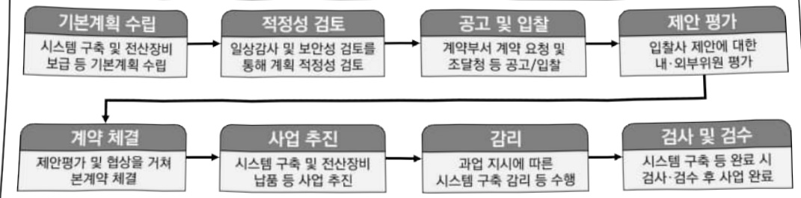

# 과학수사시스템구축(정보화)

**해당 페이지**: PDF 79 ~ 84 쪽 해당

**부처**: 경찰청
**분야**: 공공질서 및 안전
**회계유형**: 일반회계
**2026 확정예산**: 4126.0 백만원
**전년대비 증감률**: -48.4%
**AI 도메인**: 법률/치안

---

### 가.예산 총괄표

(단위:백만원,%)

<table border=1 style='margin: auto; word-wrap: break-word;'><tr><td rowspan="2">사업명</td><td rowspan="2">2024년 결산</td><td colspan="2">2025년 예산</td><td colspan="2">2026년</td><td rowspan="2">증감 (B-A)</td><td rowspan="2">(B-A)/A</td></tr><tr><td style='text-align: center; word-wrap: break-word;'>본예산(A)</td><td style='text-align: center; word-wrap: break-word;'>추경</td><td style='text-align: center; word-wrap: break-word;'>요구</td><td style='text-align: center; word-wrap: break-word;'>조정(B)</td></tr><tr><td style='text-align: center; word-wrap: break-word;'>과학수사시스템구축</td><td style='text-align: center; word-wrap: break-word;'>10,353</td><td style='text-align: center; word-wrap: break-word;'>7,990</td><td style='text-align: center; word-wrap: break-word;'>7,990</td><td style='text-align: center; word-wrap: break-word;'>4,126</td><td style='text-align: center; word-wrap: break-word;'>4,126</td><td style='text-align: center; word-wrap: break-word;'>△3,864</td><td style='text-align: center; word-wrap: break-word;'>△48.4</td></tr></table>

☐ 내역사업별 예산 내역

(단위:백만원)

<table border=1 style='margin: auto; word-wrap: break-word;'><tr><td rowspan="3"></td><td colspan="5">2024</td><td colspan="7">2025(2025.11월말)</td><td rowspan="3">2026예산</td></tr><tr><td rowspan="2">예산액(추경)</td><td rowspan="2">예산현액</td><td rowspan="2">집행액[실행액]</td><td rowspan="2">이월액</td><td rowspan="2">불용액</td><td rowspan="2">본예산</td><td rowspan="2">예산현액</td><td rowspan="2">집행액[실행액]</td><td colspan="2">전년도이월액제외</td><td rowspan="2">이월예상액</td><td rowspan="2">불용예상액</td></tr><tr><td style='text-align: center; word-wrap: break-word;'>예산현액</td><td style='text-align: center; word-wrap: break-word;'>집행액[실행액]</td></tr><tr><td style='text-align: center; word-wrap: break-word;'>ㅇ 기능별 분류(합계)</td><td style='text-align: center; word-wrap: break-word;'>10,407</td><td style='text-align: center; word-wrap: break-word;'>10,407</td><td style='text-align: center; word-wrap: break-word;'>10,353</td><td style='text-align: center; word-wrap: break-word;'>-</td><td style='text-align: center; word-wrap: break-word;'>54</td><td style='text-align: center; word-wrap: break-word;'>7,990</td><td style='text-align: center; word-wrap: break-word;'>7,990</td><td style='text-align: center; word-wrap: break-word;'>6,468</td><td style='text-align: center; word-wrap: break-word;'>7,990</td><td style='text-align: center; word-wrap: break-word;'>6,468</td><td style='text-align: center; word-wrap: break-word;'>-</td><td style='text-align: center; word-wrap: break-word;'>40</td><td style='text-align: center; word-wrap: break-word;'>4,126</td></tr><tr><td style='text-align: center; word-wrap: break-word;'>·차세대 과학수사 플랫폼 구축</td><td style='text-align: center; word-wrap: break-word;'>3,196</td><td style='text-align: center; word-wrap: break-word;'>3,196</td><td style='text-align: center; word-wrap: break-word;'>3,189</td><td style='text-align: center; word-wrap: break-word;'>-</td><td style='text-align: center; word-wrap: break-word;'>7</td><td style='text-align: center; word-wrap: break-word;'>-</td><td style='text-align: center; word-wrap: break-word;'>-</td><td style='text-align: center; word-wrap: break-word;'>-</td><td style='text-align: center; word-wrap: break-word;'>-</td><td style='text-align: center; word-wrap: break-word;'>-</td><td style='text-align: center; word-wrap: break-word;'>-</td><td style='text-align: center; word-wrap: break-word;'>-</td><td style='text-align: center; word-wrap: break-word;'>-</td></tr><tr><td style='text-align: center; word-wrap: break-word;'>·전자수사자료표 라이브스캐너</td><td style='text-align: center; word-wrap: break-word;'>326</td><td style='text-align: center; word-wrap: break-word;'>326</td><td style='text-align: center; word-wrap: break-word;'>312</td><td style='text-align: center; word-wrap: break-word;'>-</td><td style='text-align: center; word-wrap: break-word;'>14</td><td style='text-align: center; word-wrap: break-word;'>326</td><td style='text-align: center; word-wrap: break-word;'>326</td><td style='text-align: center; word-wrap: break-word;'>286</td><td style='text-align: center; word-wrap: break-word;'>326</td><td style='text-align: center; word-wrap: break-word;'>286</td><td style='text-align: center; word-wrap: break-word;'>-</td><td style='text-align: center; word-wrap: break-word;'>40</td><td style='text-align: center; word-wrap: break-word;'>326</td></tr><tr><td style='text-align: center; word-wrap: break-word;'>·지문 및 전과기록 관리시스템 재구축</td><td style='text-align: center; word-wrap: break-word;'>6,885</td><td style='text-align: center; word-wrap: break-word;'>6,885</td><td style='text-align: center; word-wrap: break-word;'>6,852</td><td style='text-align: center; word-wrap: break-word;'>-</td><td style='text-align: center; word-wrap: break-word;'>33</td><td style='text-align: center; word-wrap: break-word;'>7,664</td><td style='text-align: center; word-wrap: break-word;'>7,664</td><td style='text-align: center; word-wrap: break-word;'>6,182</td><td style='text-align: center; word-wrap: break-word;'>7,664</td><td style='text-align: center; word-wrap: break-word;'>6,182</td><td style='text-align: center; word-wrap: break-word;'>-</td><td style='text-align: center; word-wrap: break-word;'>-</td><td style='text-align: center; word-wrap: break-word;'>2,338</td></tr><tr><td style='text-align: center; word-wrap: break-word;'>·현장증거물 수집 자동화시스템 구축</td><td style='text-align: center; word-wrap: break-word;'>-</td><td style='text-align: center; word-wrap: break-word;'>-</td><td style='text-align: center; word-wrap: break-word;'>-</td><td style='text-align: center; word-wrap: break-word;'>-</td><td style='text-align: center; word-wrap: break-word;'>-</td><td style='text-align: center; word-wrap: break-word;'>-</td><td style='text-align: center; word-wrap: break-word;'>-</td><td style='text-align: center; word-wrap: break-word;'>-</td><td style='text-align: center; word-wrap: break-word;'>-</td><td style='text-align: center; word-wrap: break-word;'>-</td><td style='text-align: center; word-wrap: break-word;'>-</td><td style='text-align: center; word-wrap: break-word;'>-</td><td style='text-align: center; word-wrap: break-word;'>1,462</td></tr></table>

### 나.사업설명자료

## 1 ) 사업목적·내용

- 지능화·다변화된 범죄에 효과적으로 대응하기 위하여 다양한 수사자료 관리·분석 시스템

운영을 통해 일선 수사경찰의 신속·정확한 현장 수사 지원

- IT·BT 기반의 지능형 과학수사 시스템 구축 및 고도화를 통해 신원확인 정보 관리 및 효과적인 범인 검거 등 과학수사 지원 능력 강화 필요

- (지문 및 전과기록 관리시스템 재구축) 기초적인 수사 및 신원·범죄경력 확인의 근간이 되는「지문 및 전과기록 관리시스템」을 관련 업무와 함께 통합·재편하여 인프라 노후 화로 인한 위협 요소를 제거하는 한편, 자료 정확성 및 시스템 효율성 제고

- (전산장비운영지원) 일선 수사부서에서 전자수사자료표 작성 시 지문 채취에 필요한 십지

라이브스캐너의 노후 교체 및 신설 수사부서 보급을 통한 수사 효율성 제고

- (현장중거물 수집 자동화시스템 구축) 대형재난·안전사고에서 사고 원인 규명 및 희생자 신원확인을 위한 증거물 수집·분류·입력 등을 자동화한 시스템 구축을 통해 재난·사고

---

현장에서 신속하게 회생자의 신원을 확인하기 위한 증거 수집 지원

## 2 ) 사업개요

## □ 사업근거 및 추진경위

① 법령상 근거

- 「형사소송법」 제307조(증거재판주의) ① 사실의 인정은 증거에 의하여야 한다.

- 「형의 실효 등에 관한 법률」 제5조의2(수사자료표의 관리 등) ② 경찰청장은 수사자료표를 범죄경력자료와 수사경력자료로 구분하여 전산입력한 후 관리하여야 한다.

- 그 외「검사와 사법경찰관의 상호협력과 일반적 수사준칙에 관한 규정」, 「경찰수사규칙」, 「범죄수사규칙」, 「과학수사 기본규칙」 등

② 추진경위

- '48. 11. 4. 경무국 감식과(법의학·이화학·지문계)를 시작으로 객관적 증거에 기반한 유죄필벌(有罪必罰) 사회 구현을 위해 과학수사 역량 강화를 추진

- 최근 범죄의 지능화로 수사단서 확보에 난항, 일선 수사 경찰의 신속·정확한 범죄 수사에 필요한 과학수사 시스템 구축 및 고도화를 통한 수사 지원체계 구축

□ 주요내용

① 사업규모

- 총사업비 : 해당 없음

- 사업기간 : 계속

- 최근 5년 간 투입된 사업비(예산액기준, 추경편성한 연도에는 추경포함)

<table border=1 style='margin: auto; word-wrap: break-word;'><tr><td style='text-align: center; word-wrap: break-word;'>$ \underline{\text{所}} $</td><td style='text-align: center; word-wrap: break-word;'>2022</td><td style='text-align: center; word-wrap: break-word;'>2023</td><td style='text-align: center; word-wrap: break-word;'>2024</td><td style='text-align: center; word-wrap: break-word;'>2025</td><td style='text-align: center; word-wrap: break-word;'>2026</td></tr><tr><td style='text-align: center; word-wrap: break-word;'>$ \underline{\text{사업비}} $</td><td style='text-align: center; word-wrap: break-word;'>2,399</td><td style='text-align: center; word-wrap: break-word;'>1,920</td><td style='text-align: center; word-wrap: break-word;'>10,407</td><td style='text-align: center; word-wrap: break-word;'>7,990</td><td style='text-align: center; word-wrap: break-word;'>4,126</td></tr></table>

-기타:해당 없음

② 사업추진체계

- 사업시행방법 : 직접수행

- 사업시행주체 : 경찰청 형사국 과학수사심의관 (촬영 과학수사관리관)

- 사업 수혜자 : 순 국민

- 보조, 융자, 출연, 출자 등의 경우 보조·융자 등 지원 비율 및 법적근거 : 해당 없음

---

3) 2026년도 예산 산출 근거

<table border=1 style='margin: auto; word-wrap: break-word;'><tr><td style='text-align: center; word-wrap: break-word;'>① 전자수사자료표시스템 : (&#x27;25) 326 → (&#x27;26) 326백만원, 전년동</td></tr><tr><td style='text-align: center; word-wrap: break-word;'>② 지문 및 전과기록 관리시스템 재구축 : (&#x27;25) 7,664 → (&#x27;26) 2,338백만원, △5,326백만원</td></tr><tr><td style='text-align: center; word-wrap: break-word;'>③ 현장중거물 수집 자동화시스템 구축 : (&#x27;25) 0 → (&#x27;26) 1,462백만원, 순증</td></tr></table>

## 4 ) 사업효과

□ 사업영향, 산출물 성과지표 등

① 2022~2026년도 성과계획서 상 성과지표 및 최근 5년간 성과 달성도

<table border=1 style='margin: auto; word-wrap: break-word;'><tr><td style='text-align: center; word-wrap: break-word;'>성과지표</td><td style='text-align: center; word-wrap: break-word;'>구분</td><td style='text-align: center; word-wrap: break-word;'>2022</td><td style='text-align: center; word-wrap: break-word;'>2023</td><td style='text-align: center; word-wrap: break-word;'>2024</td><td style='text-align: center; word-wrap: break-word;'>2025</td><td style='text-align: center; word-wrap: break-word;'>2026</td><td style='text-align: center; word-wrap: break-word;'>2026 목표치산출근거</td><td style='text-align: center; word-wrap: break-word;'>측정산식(또는 측정방법)</td><td style='text-align: center; word-wrap: break-word;'>자료수집방법(또는 자료출처)</td></tr><tr><td rowspan="3">시스템개선요구사항반영률(정보화)(단위: %)</td><td style='text-align: center; word-wrap: break-word;'>목표</td><td style='text-align: center; word-wrap: break-word;'>73.7</td><td style='text-align: center; word-wrap: break-word;'>74.8</td><td style='text-align: center; word-wrap: break-word;'>76.1</td><td style='text-align: center; word-wrap: break-word;'>76.9</td><td style='text-align: center; word-wrap: break-word;'>77.6</td><td rowspan="3">최근 4년 평균 목표치 75.4%에 3%를 상향한 77.6%로 설정</td><td rowspan="3">(시스템 반영 건수 / 시스템 개선 요구사항 총 건수) × 100(%)</td><td rowspan="3">기능개선계시판운영 공문 접수 등</td></tr><tr><td style='text-align: center; word-wrap: break-word;'>실적</td><td style='text-align: center; word-wrap: break-word;'>73.9</td><td style='text-align: center; word-wrap: break-word;'>75.6</td><td style='text-align: center; word-wrap: break-word;'>76.7</td><td style='text-align: center; word-wrap: break-word;'>-</td><td style='text-align: center; word-wrap: break-word;'>-</td></tr><tr><td style='text-align: center; word-wrap: break-word;'>달성도</td><td style='text-align: center; word-wrap: break-word;'>100.3</td><td style='text-align: center; word-wrap: break-word;'>101</td><td style='text-align: center; word-wrap: break-word;'>100.8</td><td style='text-align: center; word-wrap: break-word;'>-</td><td style='text-align: center; word-wrap: break-word;'>-</td></tr></table>

② 성과지표 이외의 연도별 사업추진 경과 및 실적

<table border=1 style='margin: auto; word-wrap: break-word;'><tr><td style='text-align: center; word-wrap: break-word;'>2022</td><td style='text-align: center; word-wrap: break-word;'>(차세대 과학수사 플랫폼) 과학수사를 통해 축적된 데이터를 기반으로 빅데이터·AI 등 최신 기술을 적용, 유사사건·수사단서 자동추출 등 가능한 차세대 과학수사 플랫폼 구축 ➔ 지문·DNA 감정 결과, 현장감식보고서 등 데이터를 KICS 사건변호 중심으로 연계·통합하고 현장감식 활동 성과를 전산화하여 유효증거 채취율을 체계적으로 관리</td></tr><tr><td style='text-align: center; word-wrap: break-word;'>2023</td><td style='text-align: center; word-wrap: break-word;'>(차세대 과학수사 플랫폼) 인공지능(AI) 등 최신 IT 기술을 패턴과 학수사 시스템에 적용하여 과학수사 데이터 통합·융합 분석을 통해 수사·감식의 효율성·신뢰성을 높이기 위한 데이터 기반 수사지원 시스템 구축</td></tr><tr><td style='text-align: center; word-wrap: break-word;'>2024</td><td style='text-align: center; word-wrap: break-word;'>(차세대 과학수사 플랫폼) 과학수사 데이터(현장감식결과, 감정결과 등)에 최신 IT 기술을 적용, 공공데이터와 통합·분석하여 유사사건 자동 추출 및 사건데이터, CCTV 등 공공데이터 뿐만 아니라 사용자 보유 데이터도 지도상에서 한눈에 구현, 사용자 맞춤형 분석 기능 제공(지문 및 전과기록 관리시스템) 지문 감정 수요 증가에 대응하기 위해 초고속 데이터 분산 처리 시스템을 도입하여 1:6억건 지문 검색 1건당 소요시간을 20분(1,800초) → 30초 이내로 단축, 지문을 통한 신원확인 업무 신속성 향상 및 업무 효율성 제고 ➔ 또한, 업데이트가 중단된 지문 알고리즘을 최신 알고리즘으로 도입하고 지문 분류 성능을 AI 재학습을 통해 개선함으로써 기존 80% 정확도를 90%까지 향상</td></tr><tr><td style='text-align: center; word-wrap: break-word;'>2025</td><td style='text-align: center; word-wrap: break-word;'>(지문 및 전과기록 관리시스템) 법원·검찰·경찰 간 시스템 차이에서 기인한 범죄경력 ‘불일치자료’ 발생 방지 및 신뢰성 향상을 위해 오류자료 자동 탐지 알고리즘 개발·반영 ➔ 또한, 범죄경력회보서 발급을 위해 민원인이 제출하는 신분증·신청서·인허가증 등 서류를 전산화 보관함으로써 경찰서 종합조회처리실 페이피리스(Paper-less) 환경 구축</td></tr></table>

---

## ③ 향후(2026년도 이후) 기대효과

- 범죄의 지능화, 신종 범죄의 출현 등 범죄 양상을 사전에 종합적으로 분석함으로써 선제적인 대응을 할 수 있는 IT·BT 기반의 지능형 범죄대응 시스템 구축을 통해 신속한 범죄 해결을 지원하고 범죄의 경향성을 예측하는 역량을 강화

- 새로운 범죄 양상에 대응하기 위해 첨단 과학기술을 수사에 접목하는 치안의 과학화로

과학수사 시스템의 첨단화를 통한 안전한 사회 조성에 기여

## 5 ) 타당성조사 및 예비타당성조사 시행여부 및 결과 요지 : 해당 없음

6) 총사업비 대상사업 여부 및 내역 : 해당 없음

## 7 ) 사업 집행절차

---

### 다. 최근 4년간 결산내역

## 1 ) 결산표

☐ 부처 결산내역

(단위:백만원,%)

<table border=1 style='margin: auto; word-wrap: break-word;'><tr><td rowspan="2">연도</td><td colspan="3">예산액</td><td rowspan="2">전년도 이월액</td><td rowspan="2">이·전용 등</td><td rowspan="2">예비비</td><td rowspan="2">예산 현액(B)</td><td rowspan="2">집행액(C)</td><td rowspan="2">집행률(C/A)</td><td rowspan="2">집행률(C/B)</td><td rowspan="2">다음연도 이월액</td><td rowspan="2">불용액</td></tr><tr><td style='text-align: center; word-wrap: break-word;'>본예산 중감액</td><td style='text-align: center; word-wrap: break-word;'>추경</td><td style='text-align: center; word-wrap: break-word;'>추경(A)</td></tr><tr><td style='text-align: center; word-wrap: break-word;'>2022</td><td style='text-align: center; word-wrap: break-word;'>2,399</td><td style='text-align: center; word-wrap: break-word;'>-</td><td style='text-align: center; word-wrap: break-word;'>2,399</td><td style='text-align: center; word-wrap: break-word;'>-</td><td style='text-align: center; word-wrap: break-word;'>-</td><td style='text-align: center; word-wrap: break-word;'>-</td><td style='text-align: center; word-wrap: break-word;'>2,399</td><td style='text-align: center; word-wrap: break-word;'>2,347</td><td style='text-align: center; word-wrap: break-word;'>97.8</td><td style='text-align: center; word-wrap: break-word;'>97.8</td><td style='text-align: center; word-wrap: break-word;'>-</td><td style='text-align: center; word-wrap: break-word;'>52</td></tr><tr><td style='text-align: center; word-wrap: break-word;'>2023</td><td style='text-align: center; word-wrap: break-word;'>1,920</td><td style='text-align: center; word-wrap: break-word;'>-</td><td style='text-align: center; word-wrap: break-word;'>1,920</td><td style='text-align: center; word-wrap: break-word;'>-</td><td style='text-align: center; word-wrap: break-word;'>-</td><td style='text-align: center; word-wrap: break-word;'>-</td><td style='text-align: center; word-wrap: break-word;'>1,920</td><td style='text-align: center; word-wrap: break-word;'>1,865</td><td style='text-align: center; word-wrap: break-word;'>97.1</td><td style='text-align: center; word-wrap: break-word;'>97.1</td><td style='text-align: center; word-wrap: break-word;'>-</td><td style='text-align: center; word-wrap: break-word;'>55</td></tr><tr><td style='text-align: center; word-wrap: break-word;'>2024</td><td style='text-align: center; word-wrap: break-word;'>10,407</td><td style='text-align: center; word-wrap: break-word;'>-</td><td style='text-align: center; word-wrap: break-word;'>10,407</td><td style='text-align: center; word-wrap: break-word;'>-</td><td style='text-align: center; word-wrap: break-word;'>-</td><td style='text-align: center; word-wrap: break-word;'>-</td><td style='text-align: center; word-wrap: break-word;'>10,407</td><td style='text-align: center; word-wrap: break-word;'>10,353</td><td style='text-align: center; word-wrap: break-word;'>99.5</td><td style='text-align: center; word-wrap: break-word;'>99.5</td><td style='text-align: center; word-wrap: break-word;'>-</td><td style='text-align: center; word-wrap: break-word;'>54</td></tr><tr><td style='text-align: center; word-wrap: break-word;'>2025</td><td style='text-align: center; word-wrap: break-word;'>7,990</td><td style='text-align: center; word-wrap: break-word;'>-</td><td style='text-align: center; word-wrap: break-word;'>7,990</td><td style='text-align: center; word-wrap: break-word;'>-</td><td style='text-align: center; word-wrap: break-word;'>-</td><td style='text-align: center; word-wrap: break-word;'>-</td><td style='text-align: center; word-wrap: break-word;'>7,990</td><td style='text-align: center; word-wrap: break-word;'>6,468</td><td style='text-align: center; word-wrap: break-word;'>81.0</td><td style='text-align: center; word-wrap: break-word;'>81.0</td><td style='text-align: center; word-wrap: break-word;'>-</td><td style='text-align: center; word-wrap: break-word;'>-</td></tr></table>

□ 출연·보조사업 등 실집행내역 : 해당 없음

## 2 ) 주요 결산사항

2022~2025년 결산 주요 지적사항 및 시정요구사항 : 해당 없음

2025년 이·전용 등 세부내역 : 해당 없음

2025년 예비비 배정 세부내역 : 해당 없음

---

<table border=1 style='margin: auto; word-wrap: break-word;'><tr><td style='text-align: center; word-wrap: break-word;'>사 업 명</td></tr><tr><td style='text-align: center; word-wrap: break-word;'>과학적 범죄 수사 고도화 기술 개발 (R&amp;D) (4431-631)</td></tr></table>

## □ 사업 코드 정보

<table border=1 style='margin: auto; word-wrap: break-word;'><tr><td style='text-align: center; word-wrap: break-word;'>구분</td><td style='text-align: center; word-wrap: break-word;'>회계</td><td style='text-align: center; word-wrap: break-word;'>소관</td><td style='text-align: center; word-wrap: break-word;'>실국(기관)</td><td style='text-align: center; word-wrap: break-word;'>계정</td><td style='text-align: center; word-wrap: break-word;'>분야</td><td style='text-align: center; word-wrap: break-word;'>부문</td></tr><tr><td style='text-align: center; word-wrap: break-word;'>코드</td><td rowspan="2">일반회계</td><td rowspan="2">경찰청</td><td rowspan="2">형사국</td><td rowspan="2"></td><td style='text-align: center; word-wrap: break-word;'>020</td><td style='text-align: center; word-wrap: break-word;'>023</td></tr><tr><td style='text-align: center; word-wrap: break-word;'>명칭</td><td style='text-align: center; word-wrap: break-word;'>공공질서및안전</td><td style='text-align: center; word-wrap: break-word;'>경찰</td></tr></table>

<table border=1 style='margin: auto; word-wrap: break-word;'><tr><td style='text-align: center; word-wrap: break-word;'>구분</td><td style='text-align: center; word-wrap: break-word;'>프로그램</td><td style='text-align: center; word-wrap: break-word;'>단위사업</td><td style='text-align: center; word-wrap: break-word;'>세부사업</td></tr><tr><td style='text-align: center; word-wrap: break-word;'>코드</td><td style='text-align: center; word-wrap: break-word;'>4400</td><td style='text-align: center; word-wrap: break-word;'>4431</td><td style='text-align: center; word-wrap: break-word;'>631</td></tr><tr><td style='text-align: center; word-wrap: break-word;'>명칭</td><td style='text-align: center; word-wrap: break-word;'>과학치안활성화</td><td style='text-align: center; word-wrap: break-word;'>정책연구개발(R&amp;D)</td><td style='text-align: center; word-wrap: break-word;'>과학적범죄수사고도화 기술개발(R&amp;D)</td></tr></table>

## ☐ 사업 성격

<table border=1 style='margin: auto; word-wrap: break-word;'><tr><td rowspan="2">신규</td><td rowspan="2">계속</td><td rowspan="2">완료</td><td rowspan="2">예비타당성 실시여부</td><td rowspan="2">총사업비 관리대상</td><td rowspan="2">총액계상 예산사업</td><td style='text-align: center; word-wrap: break-word;'>사업소관 변경정보</td></tr><tr><td style='text-align: center; word-wrap: break-word;'>2025예산 시 소관</td></tr><tr><td style='text-align: center; word-wrap: break-word;'></td><td style='text-align: center; word-wrap: break-word;'>○</td><td style='text-align: center; word-wrap: break-word;'></td><td style='text-align: center; word-wrap: break-word;'></td><td style='text-align: center; word-wrap: break-word;'></td><td style='text-align: center; word-wrap: break-word;'></td><td style='text-align: center; word-wrap: break-word;'></td></tr></table>

## □ 사업 지원 형태 및 지원율

<table border=1 style='margin: auto; word-wrap: break-word;'><tr><td style='text-align: center; word-wrap: break-word;'>직접</td><td style='text-align: center; word-wrap: break-word;'>출자</td><td style='text-align: center; word-wrap: break-word;'>출연</td><td style='text-align: center; word-wrap: break-word;'>보조</td><td style='text-align: center; word-wrap: break-word;'>융자</td><td style='text-align: center; word-wrap: break-word;'>국고보조율(%)</td><td style='text-align: center; word-wrap: break-word;'>융자율(%)</td></tr><tr><td style='text-align: center; word-wrap: break-word;'></td><td style='text-align: center; word-wrap: break-word;'></td><td style='text-align: center; word-wrap: break-word;'>○</td><td style='text-align: center; word-wrap: break-word;'></td><td style='text-align: center; word-wrap: break-word;'></td><td style='text-align: center; word-wrap: break-word;'></td><td style='text-align: center; word-wrap: break-word;'></td></tr></table>

## □ 사업 담당자

<table border=1 style='margin: auto; word-wrap: break-word;'><tr><td style='text-align: center; word-wrap: break-word;'>사업명</td><td colspan="2">구분</td></tr><tr><td rowspan="2"></td><td style='text-align: center; word-wrap: break-word;'>소관부처</td><td style='text-align: center; word-wrap: break-word;'>마래치안정채국</td></tr><tr><td style='text-align: center; word-wrap: break-word;'>사업시행주체</td><td style='text-align: center; word-wrap: break-word;'>과학기술개발진흥과</td></tr></table>

---

### 원본 PDF 크롭 이미지

