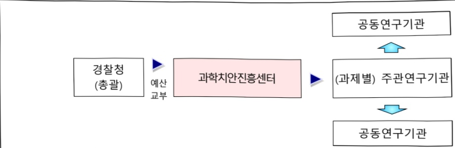

# 과학적 범죄수사 고도화 기술 개발(R&D)

**해당 페이지**: PDF 85 ~ 93 쪽 해당

**부처**: 경찰청
**분야**: 공공질서 및 안전
**회계유형**: 일반회계
**2026 확정예산**: -1461.0 백만원
**전년대비 증감률**: None%
**AI 도메인**: 법률/치안

---

<table border=1 style='margin: auto; word-wrap: break-word;'><tr><td style='text-align: center; word-wrap: break-word;'>사 업 명</td></tr><tr><td style='text-align: center; word-wrap: break-word;'>과학적 범죄 수사 고도화 기술 개발 (R&amp;D) (4431-631)</td></tr></table>

## □ 사업 코드 정보

<table border=1 style='margin: auto; word-wrap: break-word;'><tr><td style='text-align: center; word-wrap: break-word;'>구분</td><td style='text-align: center; word-wrap: break-word;'>회계</td><td style='text-align: center; word-wrap: break-word;'>소관</td><td style='text-align: center; word-wrap: break-word;'>실국(기관)</td><td style='text-align: center; word-wrap: break-word;'>계정</td><td style='text-align: center; word-wrap: break-word;'>분야</td><td style='text-align: center; word-wrap: break-word;'>부문</td></tr><tr><td style='text-align: center; word-wrap: break-word;'>코드</td><td rowspan="2">일반회계</td><td rowspan="2">경찰청</td><td rowspan="2">형사국</td><td rowspan="2"></td><td style='text-align: center; word-wrap: break-word;'>020</td><td style='text-align: center; word-wrap: break-word;'>023</td></tr><tr><td style='text-align: center; word-wrap: break-word;'>명칭</td><td style='text-align: center; word-wrap: break-word;'>공공질서및안전</td><td style='text-align: center; word-wrap: break-word;'>경찰</td></tr></table>

<table border=1 style='margin: auto; word-wrap: break-word;'><tr><td style='text-align: center; word-wrap: break-word;'>구분</td><td style='text-align: center; word-wrap: break-word;'>프로그램</td><td style='text-align: center; word-wrap: break-word;'>단위사업</td><td style='text-align: center; word-wrap: break-word;'>세부사업</td></tr><tr><td style='text-align: center; word-wrap: break-word;'>코드</td><td style='text-align: center; word-wrap: break-word;'>4400</td><td style='text-align: center; word-wrap: break-word;'>4431</td><td style='text-align: center; word-wrap: break-word;'>631</td></tr><tr><td style='text-align: center; word-wrap: break-word;'>명칭</td><td style='text-align: center; word-wrap: break-word;'>과학치안활성화</td><td style='text-align: center; word-wrap: break-word;'>정책연구개발(R&amp;D)</td><td style='text-align: center; word-wrap: break-word;'>과학적범죄수사고도화 기술개발(R&amp;D)</td></tr></table>

## ☐ 사업 성격

<table border=1 style='margin: auto; word-wrap: break-word;'><tr><td rowspan="2">신규</td><td rowspan="2">계속</td><td rowspan="2">완료</td><td rowspan="2">예비타당성 실시여부</td><td rowspan="2">총사업비 관리대상</td><td rowspan="2">총액계상 예산사업</td><td style='text-align: center; word-wrap: break-word;'>사업소관 변경정보</td></tr><tr><td style='text-align: center; word-wrap: break-word;'>2025예산 시 소관</td></tr><tr><td style='text-align: center; word-wrap: break-word;'></td><td style='text-align: center; word-wrap: break-word;'>○</td><td style='text-align: center; word-wrap: break-word;'></td><td style='text-align: center; word-wrap: break-word;'></td><td style='text-align: center; word-wrap: break-word;'></td><td style='text-align: center; word-wrap: break-word;'></td><td style='text-align: center; word-wrap: break-word;'></td></tr></table>

## □ 사업 지원 형태 및 지원율

<table border=1 style='margin: auto; word-wrap: break-word;'><tr><td style='text-align: center; word-wrap: break-word;'>직접</td><td style='text-align: center; word-wrap: break-word;'>출자</td><td style='text-align: center; word-wrap: break-word;'>출연</td><td style='text-align: center; word-wrap: break-word;'>보조</td><td style='text-align: center; word-wrap: break-word;'>융자</td><td style='text-align: center; word-wrap: break-word;'>국고보조율(%)</td><td style='text-align: center; word-wrap: break-word;'>융자율(%)</td></tr><tr><td style='text-align: center; word-wrap: break-word;'></td><td style='text-align: center; word-wrap: break-word;'></td><td style='text-align: center; word-wrap: break-word;'>○</td><td style='text-align: center; word-wrap: break-word;'></td><td style='text-align: center; word-wrap: break-word;'></td><td style='text-align: center; word-wrap: break-word;'></td><td style='text-align: center; word-wrap: break-word;'></td></tr></table>

## □ 사업 담당자

<table border=1 style='margin: auto; word-wrap: break-word;'><tr><td style='text-align: center; word-wrap: break-word;'>사업명</td><td colspan="2">구분</td></tr><tr><td rowspan="2"></td><td style='text-align: center; word-wrap: break-word;'>소관부처</td><td style='text-align: center; word-wrap: break-word;'>마래치안정채국</td></tr><tr><td style='text-align: center; word-wrap: break-word;'>사업시행주체</td><td style='text-align: center; word-wrap: break-word;'>과학기술개발진흥과</td></tr></table>

---

### 가.예산 총괄표

(단위: 백만원, %)

<table border=1 style='margin: auto; word-wrap: break-word;'><tr><td rowspan="2">사업명</td><td rowspan="2">2024년 결산</td><td rowspan="2">2025년 예산 본예산(A)</td><td colspan="2">2026년</td><td rowspan="2">증감 (B-A)</td><td rowspan="2">(B-A)/A</td></tr><tr><td style='text-align: center; word-wrap: break-word;'>요구</td><td style='text-align: center; word-wrap: break-word;'>조정(B)</td></tr><tr><td style='text-align: center; word-wrap: break-word;'>과학적범죄수사 고도화기술개발 (R&amp;D)</td><td style='text-align: center; word-wrap: break-word;'>7,476</td><td style='text-align: center; word-wrap: break-word;'>4,529</td><td style='text-align: center; word-wrap: break-word;'>3,068</td><td style='text-align: center; word-wrap: break-word;'>3,068</td><td style='text-align: center; word-wrap: break-word;'>△1,461</td><td style='text-align: center; word-wrap: break-word;'>△32.3</td></tr></table>

☐ 내역사업별 예산 내역

(단위:백만원)

<table border=1 style='margin: auto; word-wrap: break-word;'><tr><td rowspan="3"></td><td colspan="5">2024</td><td colspan="7">2025(25.11월말)</td><td rowspan="3">2026예산</td></tr><tr><td rowspan="2">예산의(추경)</td><td rowspan="2">예산현액</td><td rowspan="2">집행액[삼행액]</td><td rowspan="2">이윌액</td><td rowspan="2">불용액</td><td rowspan="2">본예산</td><td rowspan="2">예산현액</td><td rowspan="2">집행액[삼행액]</td><td colspan="2">전년도 이월액제외</td><td rowspan="2">이월예상액</td><td rowspan="2">불용예상액</td></tr><tr><td style='text-align: center; word-wrap: break-word;'>예산현액</td><td style='text-align: center; word-wrap: break-word;'>집행액[삼행액]</td></tr><tr><td style='text-align: center; word-wrap: break-word;'>ㅇ기능별 분류(합계)</td><td style='text-align: center; word-wrap: break-word;'>7,476</td><td style='text-align: center; word-wrap: break-word;'>7,476</td><td style='text-align: center; word-wrap: break-word;'>7,476[7,476]</td><td style='text-align: center; word-wrap: break-word;'>-</td><td style='text-align: center; word-wrap: break-word;'>-</td><td style='text-align: center; word-wrap: break-word;'>4,529</td><td style='text-align: center; word-wrap: break-word;'>4,529[4,529]</td><td style='text-align: center; word-wrap: break-word;'>4,529[4,529]</td><td style='text-align: center; word-wrap: break-word;'>4,529[4,529]</td><td style='text-align: center; word-wrap: break-word;'>4,529[4,529]</td><td style='text-align: center; word-wrap: break-word;'>-</td><td style='text-align: center; word-wrap: break-word;'>-</td><td style='text-align: center; word-wrap: break-word;'>3,068</td></tr><tr><td style='text-align: center; word-wrap: break-word;'>·법곤충 감정기법데이터 구축</td><td style='text-align: center; word-wrap: break-word;'>1,050</td><td style='text-align: center; word-wrap: break-word;'>1,050</td><td style='text-align: center; word-wrap: break-word;'>1,050[1,050]</td><td style='text-align: center; word-wrap: break-word;'>-</td><td style='text-align: center; word-wrap: break-word;'>-</td><td style='text-align: center; word-wrap: break-word;'>1,400</td><td style='text-align: center; word-wrap: break-word;'>1,400[1,400]</td><td style='text-align: center; word-wrap: break-word;'>1,400[1,400]</td><td style='text-align: center; word-wrap: break-word;'>1,400[1,400]</td><td style='text-align: center; word-wrap: break-word;'>1,400[1,400]</td><td style='text-align: center; word-wrap: break-word;'>-</td><td style='text-align: center; word-wrap: break-word;'>-</td><td style='text-align: center; word-wrap: break-word;'>1,150</td></tr><tr><td style='text-align: center; word-wrap: break-word;'>·인공지능 기반위해기체 고속분석 플랫폼 구축</td><td style='text-align: center; word-wrap: break-word;'>300</td><td style='text-align: center; word-wrap: break-word;'>300</td><td style='text-align: center; word-wrap: break-word;'>300[300]</td><td style='text-align: center; word-wrap: break-word;'>-</td><td style='text-align: center; word-wrap: break-word;'>-</td><td style='text-align: center; word-wrap: break-word;'>1,800</td><td style='text-align: center; word-wrap: break-word;'>1,800[1,800]</td><td style='text-align: center; word-wrap: break-word;'>1,800[1,800]</td><td style='text-align: center; word-wrap: break-word;'>1,800[1,800]</td><td style='text-align: center; word-wrap: break-word;'>1,800[1,800]</td><td style='text-align: center; word-wrap: break-word;'>-</td><td style='text-align: center; word-wrap: break-word;'>-</td><td style='text-align: center; word-wrap: break-word;'>1,800</td></tr><tr><td style='text-align: center; word-wrap: break-word;'>·기획평가관리비</td><td style='text-align: center; word-wrap: break-word;'>288</td><td style='text-align: center; word-wrap: break-word;'>288</td><td style='text-align: center; word-wrap: break-word;'>288[288]</td><td style='text-align: center; word-wrap: break-word;'>-</td><td style='text-align: center; word-wrap: break-word;'>-</td><td style='text-align: center; word-wrap: break-word;'>174</td><td style='text-align: center; word-wrap: break-word;'>174[174]</td><td style='text-align: center; word-wrap: break-word;'>174[174]</td><td style='text-align: center; word-wrap: break-word;'>174[174]</td><td style='text-align: center; word-wrap: break-word;'>174[174]</td><td style='text-align: center; word-wrap: break-word;'>-</td><td style='text-align: center; word-wrap: break-word;'>-</td><td style='text-align: center; word-wrap: break-word;'>118</td></tr><tr><td style='text-align: center; word-wrap: break-word;'>·융복합 지능형DNA 감식 기술개발</td><td style='text-align: center; word-wrap: break-word;'>1,425</td><td style='text-align: center; word-wrap: break-word;'>1,425</td><td style='text-align: center; word-wrap: break-word;'>1,425[1,425]</td><td style='text-align: center; word-wrap: break-word;'>-</td><td style='text-align: center; word-wrap: break-word;'>-</td><td style='text-align: center; word-wrap: break-word;'>1,155</td><td style='text-align: center; word-wrap: break-word;'>1,155[1,155]</td><td style='text-align: center; word-wrap: break-word;'>1,155[1,155]</td><td style='text-align: center; word-wrap: break-word;'>1,155[1,155]</td><td style='text-align: center; word-wrap: break-word;'>1,155[1,155]</td><td style='text-align: center; word-wrap: break-word;'>-</td><td style='text-align: center; word-wrap: break-word;'>-</td><td style='text-align: center; word-wrap: break-word;'>-</td></tr><tr><td style='text-align: center; word-wrap: break-word;'>·이동통신 악용보이스피싱 대응기술 개발</td><td style='text-align: center; word-wrap: break-word;'>1,900</td><td style='text-align: center; word-wrap: break-word;'>1,900</td><td style='text-align: center; word-wrap: break-word;'>1,900[1,900]</td><td style='text-align: center; word-wrap: break-word;'>-</td><td style='text-align: center; word-wrap: break-word;'>-</td><td style='text-align: center; word-wrap: break-word;'>-（종료）</td><td style='text-align: center; word-wrap: break-word;'>-</td><td style='text-align: center; word-wrap: break-word;'>-</td><td style='text-align: center; word-wrap: break-word;'>-</td><td style='text-align: center; word-wrap: break-word;'>-</td><td style='text-align: center; word-wrap: break-word;'>-</td><td style='text-align: center; word-wrap: break-word;'>-</td><td style='text-align: center; word-wrap: break-word;'>-</td></tr><tr><td style='text-align: center; word-wrap: break-word;'>·AI 기반 범죄수사 지원</td><td style='text-align: center; word-wrap: break-word;'>2,513</td><td style='text-align: center; word-wrap: break-word;'>2,513</td><td style='text-align: center; word-wrap: break-word;'>2,513[2,513]</td><td style='text-align: center; word-wrap: break-word;'>-</td><td style='text-align: center; word-wrap: break-word;'>-</td><td style='text-align: center; word-wrap: break-word;'>-（종료）</td><td style='text-align: center; word-wrap: break-word;'>-</td><td style='text-align: center; word-wrap: break-word;'>-</td><td style='text-align: center; word-wrap: break-word;'>-</td><td style='text-align: center; word-wrap: break-word;'>-</td><td style='text-align: center; word-wrap: break-word;'>-</td><td style='text-align: center; word-wrap: break-word;'>-</td><td style='text-align: center; word-wrap: break-word;'>-</td></tr></table>

### 나. 사업설명자료

## 1 ) 사업목적·내용

- (과학적범죄수사고도화기술개발) 과학기술을 활용한 경찰의 과학수사 기법 개발로 (과학)

수사 역량 강화로 용의자 조기 검거 기여 등 신속한 초기 수사 대응 지원

- (①내역: 법균층 감정기법 데이터 구축) 시식성 파리 등 10종에 대한 법균층 감정기법 데이터 구축을 위한 연구를 통해 사후 경과시간 추정 등 과학수사 현장에 활용

- (②내역: 인공지능 기반 위해기체 고속 분석 플랫폼 구축) 기존의 기체 분석 기법 적용

---

영역을 화재에서 마약이나 독극물, 시체 등으로 확대하여 다양한 범죄에 응용될 수 있도록 함으로써 범죄 현장에서의 신속하고 정확한 초동수사 지원

- (③내역: 기획평가관리비) 원활한 사업 추진을 위한 기획, 평가, 관리 등 소요 비용

## 2 ) 사업개요

□ 사업근거 및 추진경위

① 법령상 근거 및 조항 적시

- 국가경찰과 자치경찰의 조직 및 운영에 관한 법률 제3조(치안에 필요한 연구개발의 지원 등)

- 국정과제 국민안전을 위한 법질서 확립 및 민생치안 역량 강화(치안 AI 혁신 신종범죄 대응역량 강화), 경찰의 중립성 확보 및 민주적 통제 강화(경찰 수사의 책임성·전문성 강화)

② 추진경위

- (2020년) 과학적 범죄수사 고도화 기술개발 사전 기획연구 실시

- (2021년) 신규 내역사업(4개) 착수

① 융복합 지능형 DNA 감식 기술('21~'25)

② 이동통신 악용 보이스피싱 대응기술('21~24)

③ AI 기반 범죄수사 지원('21~'24)

④ 사업관리비('21~'23)

- (2022년) 신규 내역사업(1개) 착수 / ① 법곤충 감정기법 데이터 구축('22~26)

- (2023년) 내역사업 종료(1개) / ① 사업관리비

※ 연구관리전문기관 변경에 따른 종료: '20~'23년 치안정책연구소, '24년 이후

(재)과학치안진흥센터

- (2024년) 신규 내역사업(1개) 착수('24. 9.) 및 내역사업 종료(2개)

① (신규) 인공지능 기반 위해기체 고속 분석 플랫폼 구축('24~'28)

② (종료) 이동통신 악용 보이스피싱 대응기술('21~'24)

③ (종료) AI 기반 범죄수사 지원('21~'24)

- (2025년) 내역사업 종료(1개) 예정

① (중료) 융복합 지능형 DNA 감식 기술('21~'25)

## □ 주요내용

① 사업규모

- 사업기간 : '21~'28 / 사업비 365.93억(국고 365.93억원)

- 최근 5년 간 투입된 사업비(예산액기준, 추경편성한 연도에는 추경포함)

<table border=1 style='margin: auto; word-wrap: break-word;'><tr><td style='text-align: center; word-wrap: break-word;'>$ \underline{\text{연도}} $</td><td style='text-align: center; word-wrap: break-word;'>2022</td><td style='text-align: center; word-wrap: break-word;'>2023</td><td style='text-align: center; word-wrap: break-word;'>2024</td><td style='text-align: center; word-wrap: break-word;'>2025</td><td style='text-align: center; word-wrap: break-word;'>2026</td></tr><tr><td style='text-align: center; word-wrap: break-word;'>$ \underline{\text{사업비}} $</td><td style='text-align: center; word-wrap: break-word;'>6,661</td><td style='text-align: center; word-wrap: break-word;'>8,081</td><td style='text-align: center; word-wrap: break-word;'>7,476</td><td style='text-align: center; word-wrap: break-word;'>4,529</td><td style='text-align: center; word-wrap: break-word;'>3,068</td></tr></table>

---

## ② 사업추진체계

- 사업시행방법 : 출연

- 사업시행주체 : 과학치안진흥센터

- 사업 수혜자 : 국민, 현장 경찰관, 대학, 출연연, 기업 등

- 보조, 융자, 출연, 출자 등의 경우 보조·융자 등 지원 비율 및 법적근거

<table border=1 style='margin: auto; word-wrap: break-word;'><tr><td style='text-align: center; word-wrap: break-word;'>내역사업명</td><td style='text-align: center; word-wrap: break-word;'>구분</td><td style='text-align: center; word-wrap: break-word;'>피보조·피출연 등 기관명</td><td style='text-align: center; word-wrap: break-word;'>지원 금액 (2025예산)</td><td style='text-align: center; word-wrap: break-word;'>지원 비율(%)</td><td style='text-align: center; word-wrap: break-word;'>보조율 법적근거 (해당 조항)</td></tr><tr><td style='text-align: center; word-wrap: break-word;'>법균층 감정기법 데이터 구축</td><td rowspan="3">출연</td><td rowspan="3">과학치안 진흥센터</td><td style='text-align: center; word-wrap: break-word;'>1,400</td><td style='text-align: center; word-wrap: break-word;'>100</td><td rowspan="3">국가경찰과 자치경찰의 조직 및 운영에 관한 법률 제33조</td></tr><tr><td style='text-align: center; word-wrap: break-word;'>인공지능 기반 위해기체 고속분석 플랫폼 구축</td><td style='text-align: center; word-wrap: break-word;'>1,800</td><td style='text-align: center; word-wrap: break-word;'>100</td></tr><tr><td style='text-align: center; word-wrap: break-word;'>기획평가 관리비</td><td style='text-align: center; word-wrap: break-word;'>174</td><td style='text-align: center; word-wrap: break-word;'>100</td></tr></table>

## 3 ) 2026년도 예산 산출 근거

## ① 법곤층 감정기법 데이터 구축 : (25) 1,400 → (26) 1,150백만원 (△ 250)

1. 법의곤충학적 기초자료 수집 및 첨단감식 기법화, 사후 경과시간 추정 프로그램 고도화 : 1,240 → 990백만원(△250)

2. 전국적 사체 곤충상 조사 : 160 → 160백만원(전년동)

## ② 인공지능 기반 위해기체 고속분석 플랫폼 구축 : (25) 1,800 → (26) 1,800 백만원(전년동)

1. 독성물질 등 확장된 기체분석 기법연구 및 현장적용: 750 → 810백만원(+60)

2. 화재·재난현장의 기체분석을 위한 DB구축 및 AI 고속 분석 플랫폼 개발 : 1,050 → 990백만원(△60)

③ 기획평가관리비 : (25) 174 → (26) 118 백만원(△ 56)

1. 기획평가관리비 : 174 → 118백만원(△56)

## ④ 융복합 지능형 DNA 감식기술 : (25) 1,155 → (26) 0백만원(순감)

1. 유전학을 활용한 신원확인 고도화 체계 구축 : 275 → 0백만원(순감)

2. 후성유전학을 활용한 용의자 특성 예측 기술 개발 : 550 → 0백만원(순감)

3. 융복합 첨단기술을 활용한 DNA 감식기술 고도화 : 330 → 0백만원(순감)

---

## 4 ) 사업효과

☐ 사업영향, 산출물 성과지표 등

1 '22~'26년도 성과계획서 상 성과지표 및 최근 5년간 성과 달성도

<table border=1 style='margin: auto; word-wrap: break-word;'><tr><td style='text-align: center; word-wrap: break-word;'>성과지표</td><td style='text-align: center; word-wrap: break-word;'>구분</td><td style='text-align: center; word-wrap: break-word;'>&#x27;22</td><td style='text-align: center; word-wrap: break-word;'>&#x27;23</td><td style='text-align: center; word-wrap: break-word;'>&#x27;24</td><td style='text-align: center; word-wrap: break-word;'>&#x27;25</td><td style='text-align: center; word-wrap: break-word;'>&#x27;26</td><td style='text-align: center; word-wrap: break-word;'>&#x27;26목표치산출근거</td><td style='text-align: center; word-wrap: break-word;'>측정산식(또는 측정방법)</td><td style='text-align: center; word-wrap: break-word;'>자료수집방법(또는 자료출처)</td></tr><tr><td rowspan="3">현장용DNA 진단 키트 개발 개수 (단위: 개 )</td><td style='text-align: center; word-wrap: break-word;'>목표</td><td style='text-align: center; word-wrap: break-word;'>2</td><td style='text-align: center; word-wrap: break-word;'>1</td><td style='text-align: center; word-wrap: break-word;'>1</td><td style='text-align: center; word-wrap: break-word;'>1</td><td style='text-align: center; word-wrap: break-word;'>-</td><td rowspan="3">연구기간 5년 동안 범죄현장에서 유효한 DNA진단키트 총 5종 개발을 목표로 하고, 2차년도 2개 이후 매년 1개의 유효성이 확보된 키트개발을 목표로 함</td><td rowspan="3">양성 및 음성 표준검체 수 산정 후, 해당 표준시험법에 따라 실험하고 양성 및 음성 결과를 판정하여 유효성(민감도 및 특이도)을 측정</td><td rowspan="3">진단키트별 유효성 성능평가 결과 보고서</td></tr><tr><td style='text-align: center; word-wrap: break-word;'>실적</td><td style='text-align: center; word-wrap: break-word;'>2</td><td style='text-align: center; word-wrap: break-word;'>3</td><td style='text-align: center; word-wrap: break-word;'>1</td><td style='text-align: center; word-wrap: break-word;'>-</td><td style='text-align: center; word-wrap: break-word;'>-</td></tr><tr><td style='text-align: center; word-wrap: break-word;'>달성도</td><td style='text-align: center; word-wrap: break-word;'>100</td><td style='text-align: center; word-wrap: break-word;'>300</td><td style='text-align: center; word-wrap: break-word;'>100</td><td style='text-align: center; word-wrap: break-word;'>-</td><td style='text-align: center; word-wrap: break-word;'>-</td></tr><tr><td rowspan="3">특허 질적가치 (단위: 점 )</td><td style='text-align: center; word-wrap: break-word;'>목표</td><td style='text-align: center; word-wrap: break-word;'>-</td><td style='text-align: center; word-wrap: break-word;'>3.8</td><td style='text-align: center; word-wrap: break-word;'>3.9</td><td style='text-align: center; word-wrap: break-word;'>4.0</td><td style='text-align: center; word-wrap: break-word;'>-</td><td rowspan="3">본 사업과 유사한 공공기술개발 사업 유형의 특허등급 점수 달성 평균치를 참고하여 목표치를 4점으로 설정</td><td rowspan="3">(∑등록 특허당 특허평 가등급 점수배 점)/ (등록특허 건수)</td><td rowspan="3">‘한국발명진흥회(SM ART)’ 또는 ‘특허정 보원(K-PEG)’에서 제공하는 ‘평가보고서’</td></tr><tr><td style='text-align: center; word-wrap: break-word;'>실적</td><td style='text-align: center; word-wrap: break-word;'>-</td><td style='text-align: center; word-wrap: break-word;'>4</td><td style='text-align: center; word-wrap: break-word;'>4</td><td style='text-align: center; word-wrap: break-word;'>-</td><td style='text-align: center; word-wrap: break-word;'>-</td></tr><tr><td style='text-align: center; word-wrap: break-word;'>달성도</td><td style='text-align: center; word-wrap: break-word;'>-</td><td style='text-align: center; word-wrap: break-word;'>100</td><td style='text-align: center; word-wrap: break-word;'>100</td><td style='text-align: center; word-wrap: break-word;'>-</td><td style='text-align: center; word-wrap: break-word;'>-</td></tr><tr><td rowspan="3">3G 이동통신 중계장치 신호탐지거리 (단위: m )</td><td style='text-align: center; word-wrap: break-word;'>목표</td><td style='text-align: center; word-wrap: break-word;'>75</td><td style='text-align: center; word-wrap: break-word;'>-</td><td style='text-align: center; word-wrap: break-word;'>-</td><td style='text-align: center; word-wrap: break-word;'>-</td><td style='text-align: center; word-wrap: break-word;'>-</td><td rowspan="3">-</td><td rowspan="3">시험용 단말 (신호발생기) 출력 0dBm, 야외 송수신 가시거리 확보조건(LOS: Line of Sight) 하에서 목표치에 따른 탐지 성공률 측정</td><td rowspan="3">자체평가서를 포함한 연구개발결과 보고서</td></tr><tr><td style='text-align: center; word-wrap: break-word;'>실적</td><td style='text-align: center; word-wrap: break-word;'>80</td><td style='text-align: center; word-wrap: break-word;'>-</td><td style='text-align: center; word-wrap: break-word;'>-</td><td style='text-align: center; word-wrap: break-word;'>-</td><td style='text-align: center; word-wrap: break-word;'>-</td></tr><tr><td style='text-align: center; word-wrap: break-word;'>달성도</td><td style='text-align: center; word-wrap: break-word;'>106</td><td style='text-align: center; word-wrap: break-word;'>-</td><td style='text-align: center; word-wrap: break-word;'>-</td><td style='text-align: center; word-wrap: break-word;'>-</td><td style='text-align: center; word-wrap: break-word;'>-</td></tr><tr><td rowspan="3">4G/5G 실내 불법 콜중계기 위치추적 오차범위 (단위: m )</td><td style='text-align: center; word-wrap: break-word;'>목표</td><td style='text-align: center; word-wrap: break-word;'>40</td><td style='text-align: center; word-wrap: break-word;'>30</td><td style='text-align: center; word-wrap: break-word;'>15</td><td style='text-align: center; word-wrap: break-word;'>-</td><td style='text-align: center; word-wrap: break-word;'>-</td><td rowspan="3">기존 사고/재난 요구조자 위치 탐지에 사용되는 기지국기반 위치특정 범위(50m)보다 낮은 오차범위를 목표로 설정</td><td rowspan="3">(측정방법)불법 콜중계기가 접속한 기지국 정보와 RNIT(기지국 단말간 무선망에서의 식별자)가 주어지고 불법콜중계기</td><td rowspan="3">공인 시험성 적서를 포함한 연구결과보고서</td></tr><tr><td style='text-align: center; word-wrap: break-word;'>실적</td><td style='text-align: center; word-wrap: break-word;'>40</td><td style='text-align: center; word-wrap: break-word;'>30</td><td style='text-align: center; word-wrap: break-word;'>≤15m</td><td style='text-align: center; word-wrap: break-word;'>-</td><td style='text-align: center; word-wrap: break-word;'>-</td></tr><tr><td style='text-align: center; word-wrap: break-word;'>달성도</td><td style='text-align: center; word-wrap: break-word;'>100</td><td style='text-align: center; word-wrap: break-word;'>100</td><td style='text-align: center; word-wrap: break-word;'>100</td><td style='text-align: center; word-wrap: break-word;'>-</td><td style='text-align: center; word-wrap: break-word;'>-</td></tr></table>

---

<table border=1 style='margin: auto; word-wrap: break-word;'><tr><td style='text-align: center; word-wrap: break-word;'>성과지표</td><td style='text-align: center; word-wrap: break-word;'>구분</td><td style='text-align: center; word-wrap: break-word;'>&#x27;22</td><td style='text-align: center; word-wrap: break-word;'>&#x27;23</td><td style='text-align: center; word-wrap: break-word;'>&#x27;24</td><td style='text-align: center; word-wrap: break-word;'>&#x27;25</td><td style='text-align: center; word-wrap: break-word;'>&#x27;26</td><td style='text-align: center; word-wrap: break-word;'>&#x27;26목표치산출근거</td><td style='text-align: center; word-wrap: break-word;'>측정산식(또는 측정방법)</td><td style='text-align: center; word-wrap: break-word;'>자료수집방법(또는 자료출처)</td></tr><tr><td style='text-align: center; word-wrap: break-word;'></td><td style='text-align: center; word-wrap: break-word;'></td><td style='text-align: center; word-wrap: break-word;'></td><td style='text-align: center; word-wrap: break-word;'></td><td style='text-align: center; word-wrap: break-word;'></td><td style='text-align: center; word-wrap: break-word;'></td><td style='text-align: center; word-wrap: break-word;'></td><td style='text-align: center; word-wrap: break-word;'></td><td style='text-align: center; word-wrap: break-word;'>가통화중인상황에서추적기술로특정한최종적인위치와실제불법클중계기위치간의오차측정(측정시기)매년도연차보고시점(12월)</td><td style='text-align: center; word-wrap: break-word;'></td></tr><tr><td rowspan="3">시식성 곤충성장속도데이터 구축종 개수(단위: 종)</td><td style='text-align: center; word-wrap: break-word;'>목표</td><td style='text-align: center; word-wrap: break-word;'></td><td style='text-align: center; word-wrap: break-word;'>2</td><td style='text-align: center; word-wrap: break-word;'>4</td><td style='text-align: center; word-wrap: break-word;'>데이터축적</td><td style='text-align: center; word-wrap: break-word;'>4</td><td rowspan="3">연구기간 6년동안 주요 시식성곤충 10종에 대한데이터 확보를위하여 &#x27;25년은&#x27;26년 목표 4종에 대한 데이터 축적진행</td><td rowspan="3">연차별성장속도데이터 확보유무를연구진및 관련전문가가 평가</td><td rowspan="3">성장속도데이터 확보유무를평가(측정)한결과가포함된연구결과보고서</td></tr><tr><td style='text-align: center; word-wrap: break-word;'>실적</td><td style='text-align: center; word-wrap: break-word;'>-</td><td style='text-align: center; word-wrap: break-word;'>2</td><td style='text-align: center; word-wrap: break-word;'>4</td><td style='text-align: center; word-wrap: break-word;'>-</td><td style='text-align: center; word-wrap: break-word;'>-</td></tr><tr><td style='text-align: center; word-wrap: break-word;'>달성도</td><td style='text-align: center; word-wrap: break-word;'>-</td><td style='text-align: center; word-wrap: break-word;'>100</td><td style='text-align: center; word-wrap: break-word;'>100</td><td style='text-align: center; word-wrap: break-word;'>-</td><td style='text-align: center; word-wrap: break-word;'>-</td></tr><tr><td rowspan="3">수사보고서범죄 속성 추출정확도(단위: %)</td><td style='text-align: center; word-wrap: break-word;'>목표</td><td style='text-align: center; word-wrap: break-word;'>70</td><td style='text-align: center; word-wrap: break-word;'>80</td><td style='text-align: center; word-wrap: break-word;'>90</td><td style='text-align: center; word-wrap: break-word;'>-</td><td style='text-align: center; word-wrap: break-word;'>-</td><td rowspan="3">-</td><td rowspan="3">적용 범죄유형별사건논증 모델별정답셋(Ground Truth)을 구성/알고리즘이 추출한논증모델별 분류결과를 재현율과정확도의조화평균값인F1Score를 측정</td><td rowspan="3">연구결과 보고서</td></tr><tr><td style='text-align: center; word-wrap: break-word;'>실적</td><td style='text-align: center; word-wrap: break-word;'>70</td><td style='text-align: center; word-wrap: break-word;'>80</td><td style='text-align: center; word-wrap: break-word;'>90</td><td style='text-align: center; word-wrap: break-word;'>-</td><td style='text-align: center; word-wrap: break-word;'>-</td></tr><tr><td style='text-align: center; word-wrap: break-word;'>달성도</td><td style='text-align: center; word-wrap: break-word;'>100</td><td style='text-align: center; word-wrap: break-word;'>100</td><td style='text-align: center; word-wrap: break-word;'>100</td><td style='text-align: center; word-wrap: break-word;'>-</td><td style='text-align: center; word-wrap: break-word;'>-</td></tr></table>

② 성과지표 이외의 연도별 사업추진 경과 및 실적

<table border=1 style='margin: auto; word-wrap: break-word;'><tr><td style='text-align: center; word-wrap: break-word;'>2021</td><td style='text-align: center; word-wrap: break-word;'>- 출원 2건, SCIE 1건, KCI 1건</td></tr><tr><td style='text-align: center; word-wrap: break-word;'>2022</td><td style='text-align: center; word-wrap: break-word;'>- 출원 11건, SCIE 5건, KCI 2건, 프로그램 개발 1건, 시작품 4건</td></tr><tr><td style='text-align: center; word-wrap: break-word;'>2023</td><td style='text-align: center; word-wrap: break-word;'>- 출원 12건, SCIE 10건, KCI 16건, 시작품 1건</td></tr><tr><td style='text-align: center; word-wrap: break-word;'>2024</td><td style='text-align: center; word-wrap: break-word;'>- 출원 2건, SCIE 6건, 시제품 제작 2건</td></tr><tr><td style='text-align: center; word-wrap: break-word;'>2025</td><td style='text-align: center; word-wrap: break-word;'>- 등록 1건, 시식성 곤충 기초데이터 구축 및 감정보조 프로그램 개발 등</td></tr></table>

---

③향후('26년도 이후) 기대효과

ㅇ 법곤충 감정기법 데이터 구축

- 시식성 파리 9종과 딱정벌레 1종 등 주요 종의 성장 속도 및 전국적 시식성 곤충의 생태적 특성 연구 등을 통해 법곤충 DB를 확대

- 이를 통해 다양한 조건에서의 현장 온도 추정 알고리즘 최적화, 파리 구더기 예측

알고리즘 및 법곤충 활용 사후경과시간 추정 프로그램 고도화

0 인공지능 기반 위해기체 고속분석 플랫폼 구축

- 주로 화재 현장 내 국한되어 있는 현재 기체 분석법을 농약 등 다양한 독성물질로

확대하여 범죄 사건 및 변사사건 수사에 응용하고 현장에서의 신속하고 정확한

초동수사 지원 가능

## 5 ) 타당성조사 및 예비타당성조사 시행여부 및 결과 요지 : 해당사항 없음

6) 총사업비 대상사업 여부 및 내역 : 해당사항 없음

## 7 ) 사업 집행절차

① 법곤충 감정기법 데이터 구축

<table border=1 style='margin: auto; word-wrap: break-word;'><tr><td style='text-align: center; word-wrap: break-word;'>부처</td><td style='text-align: center; word-wrap: break-word;'></td><td style='text-align: center; word-wrap: break-word;'>피출연·피보조기관</td><td style='text-align: center; word-wrap: break-word;'></td><td style='text-align: center; word-wrap: break-word;'>간접보조사업자·사업수행자</td></tr><tr><td style='text-align: center; word-wrap: break-word;'>경찰청(1,150백만원)</td><td style='text-align: center; word-wrap: break-word;'>=&gt;(1,150백만원)</td><td style='text-align: center; word-wrap: break-word;'>과학치안 진흥센터(-)</td><td style='text-align: center; word-wrap: break-word;'>=&gt;(1,150만원)</td><td style='text-align: center; word-wrap: break-word;'>고려대, 고신대 등 3개 기관</td></tr></table>

---

② 인공지능 기반 위해기체 고속 분석 플랫폼 구축

<table border=1 style='margin: auto; word-wrap: break-word;'><tr><td style='text-align: center; word-wrap: break-word;'>부처</td><td style='text-align: center; word-wrap: break-word;'></td><td style='text-align: center; word-wrap: break-word;'>피출연·피보조기관</td><td style='text-align: center; word-wrap: break-word;'></td><td style='text-align: center; word-wrap: break-word;'>간접보조사업자·사업수행자</td></tr><tr><td style='text-align: center; word-wrap: break-word;'>경찰청(1,800백만원)</td><td style='text-align: center; word-wrap: break-word;'>=&gt;(1,800백만원)</td><td style='text-align: center; word-wrap: break-word;'>과학치안진흥센터(-)</td><td style='text-align: center; word-wrap: break-word;'>=&gt;(1,800만원)</td><td style='text-align: center; word-wrap: break-word;'>경찰대, 중앙대 등 8개 기관</td></tr></table>

③ 기획평가관리비

<table border=1 style='margin: auto; word-wrap: break-word;'><tr><td style='text-align: center; word-wrap: break-word;'>부처</td><td style='text-align: center; word-wrap: break-word;'></td><td style='text-align: center; word-wrap: break-word;'>피출연·피보조기관</td><td style='text-align: center; word-wrap: break-word;'></td><td style='text-align: center; word-wrap: break-word;'>간접보조사업자·사업수행자</td></tr><tr><td style='text-align: center; word-wrap: break-word;'>경찰청(118백만원)</td><td style='text-align: center; word-wrap: break-word;'>=&gt;(118백만원)</td><td style='text-align: center; word-wrap: break-word;'>과학치안진흥센터(118백만원)</td><td style='text-align: center; word-wrap: break-word;'>=&gt;(-)</td><td style='text-align: center; word-wrap: break-word;'>-</td></tr></table>

### 다. 최근 4년간 결산내역

## 1 ) 결산표

☐ 부처 결산내역

(단위: 백만원, %)

<table border=1 style='margin: auto; word-wrap: break-word;'><tr><td rowspan="2">연도</td><td colspan="3">예산액</td><td rowspan="2">전년도 이월액</td><td rowspan="2">이·전용 등</td><td rowspan="2">예비비</td><td rowspan="2">예산 현액(B)</td><td rowspan="2">집행액(C)</td><td rowspan="2">집행률(C/A)</td><td rowspan="2">집행률(C/B)</td><td rowspan="2">디음연도 이월액</td><td rowspan="2">불용액</td></tr><tr><td style='text-align: center; word-wrap: break-word;'>본예산</td><td style='text-align: center; word-wrap: break-word;'>추경 중감액</td><td style='text-align: center; word-wrap: break-word;'>추경(A)</td></tr><tr><td style='text-align: center; word-wrap: break-word;'>2022</td><td style='text-align: center; word-wrap: break-word;'>6,661</td><td style='text-align: center; word-wrap: break-word;'>-</td><td style='text-align: center; word-wrap: break-word;'>6,661</td><td style='text-align: center; word-wrap: break-word;'>-</td><td style='text-align: center; word-wrap: break-word;'>-</td><td style='text-align: center; word-wrap: break-word;'>-</td><td style='text-align: center; word-wrap: break-word;'>6,661</td><td style='text-align: center; word-wrap: break-word;'>6,653</td><td style='text-align: center; word-wrap: break-word;'>99.9</td><td style='text-align: center; word-wrap: break-word;'>99.9</td><td style='text-align: center; word-wrap: break-word;'>-</td><td style='text-align: center; word-wrap: break-word;'>8</td></tr><tr><td style='text-align: center; word-wrap: break-word;'>2023</td><td style='text-align: center; word-wrap: break-word;'>8,081</td><td style='text-align: center; word-wrap: break-word;'>-</td><td style='text-align: center; word-wrap: break-word;'>8,081</td><td style='text-align: center; word-wrap: break-word;'>-</td><td style='text-align: center; word-wrap: break-word;'>-</td><td style='text-align: center; word-wrap: break-word;'>-</td><td style='text-align: center; word-wrap: break-word;'>8,081</td><td style='text-align: center; word-wrap: break-word;'>8,080.8</td><td style='text-align: center; word-wrap: break-word;'>99.9</td><td style='text-align: center; word-wrap: break-word;'>99.9</td><td style='text-align: center; word-wrap: break-word;'>-</td><td style='text-align: center; word-wrap: break-word;'>0.2</td></tr><tr><td style='text-align: center; word-wrap: break-word;'>2024</td><td style='text-align: center; word-wrap: break-word;'>7,476</td><td style='text-align: center; word-wrap: break-word;'>-</td><td style='text-align: center; word-wrap: break-word;'>7,476</td><td style='text-align: center; word-wrap: break-word;'>-</td><td style='text-align: center; word-wrap: break-word;'>-</td><td style='text-align: center; word-wrap: break-word;'>-</td><td style='text-align: center; word-wrap: break-word;'>7,476</td><td style='text-align: center; word-wrap: break-word;'>7,476</td><td style='text-align: center; word-wrap: break-word;'>100</td><td style='text-align: center; word-wrap: break-word;'>100</td><td style='text-align: center; word-wrap: break-word;'>-</td><td style='text-align: center; word-wrap: break-word;'>-</td></tr><tr><td style='text-align: center; word-wrap: break-word;'>2025</td><td style='text-align: center; word-wrap: break-word;'>4,529</td><td style='text-align: center; word-wrap: break-word;'>-</td><td style='text-align: center; word-wrap: break-word;'>4,529</td><td style='text-align: center; word-wrap: break-word;'>-</td><td style='text-align: center; word-wrap: break-word;'>-</td><td style='text-align: center; word-wrap: break-word;'>-</td><td style='text-align: center; word-wrap: break-word;'>4,529</td><td style='text-align: center; word-wrap: break-word;'>4,529</td><td style='text-align: center; word-wrap: break-word;'>100</td><td style='text-align: center; word-wrap: break-word;'>100</td><td style='text-align: center; word-wrap: break-word;'>-</td><td style='text-align: center; word-wrap: break-word;'>-</td></tr></table>

□출연·보조사업 등 실집행내역

(단위: 백만원, %)

<table border=1 style='margin: auto; word-wrap: break-word;'><tr><td rowspan="3">구분</td><td colspan="3">부처</td><td colspan="7">사업시행주체(피출연·피보조 기관 등)</td></tr><tr><td colspan="2">예산액</td><td rowspan="2">집행액</td><td rowspan="2">교부액</td><td rowspan="2">전년도 이월액</td><td rowspan="2">교부 현액</td><td rowspan="2">집행액 (B)</td><td rowspan="2">이월액</td><td rowspan="2">불용액</td><td rowspan="2">실집행률 (B/A)</td></tr><tr><td style='text-align: center; word-wrap: break-word;'>본예산</td><td style='text-align: center; word-wrap: break-word;'>추경(A)</td></tr><tr><td style='text-align: center; word-wrap: break-word;'>2022</td><td style='text-align: center; word-wrap: break-word;'>6,661</td><td style='text-align: center; word-wrap: break-word;'>6,661</td><td style='text-align: center; word-wrap: break-word;'>6,661</td><td style='text-align: center; word-wrap: break-word;'>6,661</td><td style='text-align: center; word-wrap: break-word;'>-</td><td style='text-align: center; word-wrap: break-word;'>-</td><td style='text-align: center; word-wrap: break-word;'>6,653</td><td style='text-align: center; word-wrap: break-word;'>-</td><td style='text-align: center; word-wrap: break-word;'>8</td><td style='text-align: center; word-wrap: break-word;'>99.9</td></tr><tr><td style='text-align: center; word-wrap: break-word;'>2023</td><td style='text-align: center; word-wrap: break-word;'>8,081</td><td style='text-align: center; word-wrap: break-word;'>8,081</td><td style='text-align: center; word-wrap: break-word;'>8,080.8</td><td style='text-align: center; word-wrap: break-word;'>8,081</td><td style='text-align: center; word-wrap: break-word;'>-</td><td style='text-align: center; word-wrap: break-word;'>-</td><td style='text-align: center; word-wrap: break-word;'>8,080.8</td><td style='text-align: center; word-wrap: break-word;'>-</td><td style='text-align: center; word-wrap: break-word;'>0.2</td><td style='text-align: center; word-wrap: break-word;'>99.9</td></tr><tr><td style='text-align: center; word-wrap: break-word;'>2024</td><td style='text-align: center; word-wrap: break-word;'>7,476</td><td style='text-align: center; word-wrap: break-word;'>7,476</td><td style='text-align: center; word-wrap: break-word;'>7,476</td><td style='text-align: center; word-wrap: break-word;'>7,476</td><td style='text-align: center; word-wrap: break-word;'>-</td><td style='text-align: center; word-wrap: break-word;'>-</td><td style='text-align: center; word-wrap: break-word;'>7,476</td><td style='text-align: center; word-wrap: break-word;'>-</td><td style='text-align: center; word-wrap: break-word;'>-</td><td style='text-align: center; word-wrap: break-word;'>100</td></tr><tr><td style='text-align: center; word-wrap: break-word;'>2025.11월 기준</td><td style='text-align: center; word-wrap: break-word;'>4,529</td><td style='text-align: center; word-wrap: break-word;'>4,529</td><td style='text-align: center; word-wrap: break-word;'>4,529</td><td style='text-align: center; word-wrap: break-word;'>4,529</td><td style='text-align: center; word-wrap: break-word;'>-</td><td style='text-align: center; word-wrap: break-word;'>-</td><td style='text-align: center; word-wrap: break-word;'>4,529</td><td style='text-align: center; word-wrap: break-word;'>-</td><td style='text-align: center; word-wrap: break-word;'>-</td><td style='text-align: center; word-wrap: break-word;'>100</td></tr></table>

---

## 2 ) 주요 결산사항

□2022년~2025년 결산사항

<table border=1 style='margin: auto; word-wrap: break-word;'><tr><td style='text-align: center; word-wrap: break-word;'>2022</td><td style='text-align: center; word-wrap: break-word;'>- 직접 관리비용(사업관리비) 61백만원 중 8백만원 불용</td></tr><tr><td style='text-align: center; word-wrap: break-word;'>2023</td><td style='text-align: center; word-wrap: break-word;'>- 직접 관리비용(사업관리비) 134백만원 중 0.2백만원 불용</td></tr><tr><td style='text-align: center; word-wrap: break-word;'>2024</td><td style='text-align: center; word-wrap: break-word;'>- 출연금 예산 전액 집행</td></tr><tr><td style='text-align: center; word-wrap: break-word;'>2025</td><td style='text-align: center; word-wrap: break-word;'>- 출연금 예산 전액 집행</td></tr></table>

□2025년 이·전용 등 세부내역 : 해당없음

□2025년 예비비 배정 세부내역 : 해당없음

---

### 원본 PDF 크롭 이미지

