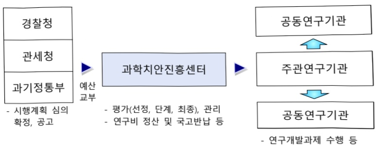

# 불법 마약류 대응을 위한 현장기술 개발(R&D)

**해당 페이지**: PDF 94 ~ 103 쪽 해당

**부처**: 경찰청
**분야**: 공공질서 및 안전
**회계유형**: 일반회계
**2026 확정예산**: 3432.0 백만원
**전년대비 증감률**: None%
**AI 도메인**: 법률/치안

---

### 가.예산 총괄표

(단위:백만원,%)

<table border=1 style='margin: auto; word-wrap: break-word;'><tr><td rowspan="2">사업명</td><td rowspan="2">2024년 결산</td><td rowspan="2">2025년 예산 본예산(A)</td><td colspan="2">2026년</td><td rowspan="2">증감 (B-A)</td><td rowspan="2">(B-A)/A</td></tr><tr><td style='text-align: center; word-wrap: break-word;'>요구</td><td style='text-align: center; word-wrap: break-word;'>조정(B)</td></tr><tr><td style='text-align: center; word-wrap: break-word;'>불법마약류대응을 위한 환장기술개발 (R&amp;D)</td><td style='text-align: center; word-wrap: break-word;'>500</td><td style='text-align: center; word-wrap: break-word;'>1,500</td><td style='text-align: center; word-wrap: break-word;'>4,932</td><td style='text-align: center; word-wrap: break-word;'>4,932</td><td style='text-align: center; word-wrap: break-word;'>3,432</td><td style='text-align: center; word-wrap: break-word;'>222.8</td></tr></table>

☐ 내역사업별 예산 내역

(단위:백만원)

<table border=1 style='margin: auto; word-wrap: break-word;'><tr><td rowspan="3"></td><td colspan="5">2024</td><td colspan="7">2025(25.11월말)</td><td rowspan="3">2026예산</td></tr><tr><td rowspan="2">예산액(추경)</td><td rowspan="2">예산현액</td><td rowspan="2">집행액[삼절혜]</td><td rowspan="2">이월액</td><td rowspan="2">불용액</td><td rowspan="2">본예산</td><td rowspan="2">예산현액</td><td rowspan="2">집행액[삼절혜]</td><td colspan="2">전년도 이월액제외</td><td rowspan="2">이월예상액</td><td rowspan="2">불용예상액</td></tr><tr><td style='text-align: center; word-wrap: break-word;'>예산현액</td><td style='text-align: center; word-wrap: break-word;'>집행액[삼절혜]</td></tr><tr><td style='text-align: center; word-wrap: break-word;'>ㅇ 기능별 분류(합계)</td><td style='text-align: center; word-wrap: break-word;'>500</td><td style='text-align: center; word-wrap: break-word;'>500</td><td style='text-align: center; word-wrap: break-word;'>500[500]</td><td style='text-align: center; word-wrap: break-word;'>-</td><td style='text-align: center; word-wrap: break-word;'>-</td><td style='text-align: center; word-wrap: break-word;'>1,500</td><td style='text-align: center; word-wrap: break-word;'>1,500</td><td style='text-align: center; word-wrap: break-word;'>1,500[1,500]</td><td style='text-align: center; word-wrap: break-word;'>1,500</td><td style='text-align: center; word-wrap: break-word;'>1,500[1,500]</td><td style='text-align: center; word-wrap: break-word;'>-</td><td style='text-align: center; word-wrap: break-word;'>-</td><td style='text-align: center; word-wrap: break-word;'>4,932</td></tr><tr><td rowspan="4">·불법 마약류대응을 위한현장 기술 개발·다크웹 및 가상자산 거래추적연계 마약수사통합시스템 개발·다중어레이 복합센서 기반 마약 탐지 및 은닉위치 추론AI시스템·기획평가관리비</td><td style='text-align: center; word-wrap: break-word;'>480</td><td style='text-align: center; word-wrap: break-word;'>480</td><td style='text-align: center; word-wrap: break-word;'>480[480]</td><td style='text-align: center; word-wrap: break-word;'>-</td><td style='text-align: center; word-wrap: break-word;'>-</td><td style='text-align: center; word-wrap: break-word;'>1,442</td><td style='text-align: center; word-wrap: break-word;'>1,442</td><td style='text-align: center; word-wrap: break-word;'>1,442[1,442]</td><td style='text-align: center; word-wrap: break-word;'>1,442</td><td style='text-align: center; word-wrap: break-word;'>1,442[1,442]</td><td style='text-align: center; word-wrap: break-word;'>-</td><td style='text-align: center; word-wrap: break-word;'>-</td><td style='text-align: center; word-wrap: break-word;'>1,442</td></tr><tr><td style='text-align: center; word-wrap: break-word;'>-</td><td style='text-align: center; word-wrap: break-word;'>-</td><td style='text-align: center; word-wrap: break-word;'>-</td><td style='text-align: center; word-wrap: break-word;'>-</td><td style='text-align: center; word-wrap: break-word;'>-</td><td style='text-align: center; word-wrap: break-word;'>-</td><td style='text-align: center; word-wrap: break-word;'>-</td><td style='text-align: center; word-wrap: break-word;'>-</td><td style='text-align: center; word-wrap: break-word;'>-</td><td style='text-align: center; word-wrap: break-word;'>-</td><td style='text-align: center; word-wrap: break-word;'>-</td><td style='text-align: center; word-wrap: break-word;'>-</td><td style='text-align: center; word-wrap: break-word;'>1,800</td></tr><tr><td style='text-align: center; word-wrap: break-word;'>-</td><td style='text-align: center; word-wrap: break-word;'>-</td><td style='text-align: center; word-wrap: break-word;'>-</td><td style='text-align: center; word-wrap: break-word;'>-</td><td style='text-align: center; word-wrap: break-word;'>-</td><td style='text-align: center; word-wrap: break-word;'>-</td><td style='text-align: center; word-wrap: break-word;'>-</td><td style='text-align: center; word-wrap: break-word;'>-</td><td style='text-align: center; word-wrap: break-word;'>-</td><td style='text-align: center; word-wrap: break-word;'>-</td><td style='text-align: center; word-wrap: break-word;'>-</td><td style='text-align: center; word-wrap: break-word;'>-</td><td style='text-align: center; word-wrap: break-word;'>1,500</td></tr><tr><td style='text-align: center; word-wrap: break-word;'>20</td><td style='text-align: center; word-wrap: break-word;'>20</td><td style='text-align: center; word-wrap: break-word;'>20[20]</td><td style='text-align: center; word-wrap: break-word;'>-</td><td style='text-align: center; word-wrap: break-word;'>-</td><td style='text-align: center; word-wrap: break-word;'>58</td><td style='text-align: center; word-wrap: break-word;'>58</td><td style='text-align: center; word-wrap: break-word;'>58[58]</td><td style='text-align: center; word-wrap: break-word;'>58</td><td style='text-align: center; word-wrap: break-word;'>58[58]</td><td style='text-align: center; word-wrap: break-word;'>-</td><td style='text-align: center; word-wrap: break-word;'>-</td><td style='text-align: center; word-wrap: break-word;'>190</td></tr></table>

### 나.사업설명자료

## 1 ) 사업목적·내용

- (불법마약류대응을위한현장기술개발) 불법마약류 대응을 위해 첨단 과학기술을 접목하여

치안·관세 현장에서 활용 가능한 불법 마약류 탐지·검사 기술 고도화 방안 마련

- (①내역: 불법마약류대응을위한현장기술개발) 치안·관세 현장에서 실제 활용가능한

불법마약류 탐지 라만분광시스템 및 간질액 기반 간이검사 마이크로니들패치 개발

---

- (②내역: 다크웹 및 가상자산 거래추적 연계 마약수사통합시스템 개발) 다크웹 내에서의 마약 유통조직 특정 및 가상자산 거래추적이 가능하고 소셜미디어에서의 마약광고 모니터링이 가능한 마약 수사 통합시스템 개발

- (③내역: 다중어레이 복합센서 기반 마약탐지 및 은닉위치 추론 AI시스템) 마약범죄 수사현장(압수수색, 거래 의심현장 등)에서 마약 은닉장소 추적 및 집중 수색, 마약류 증거 수집 등에 활용할 수 있는 전자코 포함 멀티모달 AI 복합센서 탑재 통합시스템 개발

- (④내역: 기획평가관리비) 원활한 사업 추진을 위한 기획, 평가, 곽리 등 소요 비용

## 2 ) 사업개요

## 사업근거 및 추진경위

① 법령상 근거 및 조항 적시

- 국가경찰과 자치경찰의 조직 및 운영에 관한 법률 제33조(치안에 필요한 연구개발의 지원 등)

- 마약류 관리에 관한 법률 제2조의2(국가 등의 책임)

- 관세법 제322조의2(연구개발사업의 추진)

- 국정과제 국민안전을 위한 법질서 확립 및 민생치안 역량 강화(마약류 중독 차단·재활 및 예방 강화 등을 통한 대응체계 확립, 예방중심 치안활동 강화, 치안 AI 혁신 신종범죄 대응역량 강화), 경찰의 중립성 확보 및 민주적 통제 강화(경찰 수사의 책임성·전문성 강화)

② 추진경위

- (2022년) 마약 관련 R&D 추진 현황 분석 및 연구개발과제 아이템 발굴

- (2023년) 마약 관계 부처와 R&D 수요 및 신규사업 참여 의사 타진 후 경찰청·관세청 신규사업 사전기획 착수

- (2024년) 신규 과제 주관연구기관 선정 및 협약 체결

## □ 주요내용

① 사업규모

- 사업기간 : (당초) '24~'26 → (변경) '24~'29 / 신규 내역사업 편성에 따른 연장

- 사업비 270.78억(국고 270.78억)

- 최근 5년 간 투입된 사업비(예산액기준, 추경편성한 연도에는 추경포함)

<table border=1 style='margin: auto; word-wrap: break-word;'><tr><td style='text-align: center; word-wrap: break-word;'>$ \underline{\text{笹}} $</td><td style='text-align: center; word-wrap: break-word;'>2022</td><td style='text-align: center; word-wrap: break-word;'>2023</td><td style='text-align: center; word-wrap: break-word;'>2024</td><td style='text-align: center; word-wrap: break-word;'>2025</td><td style='text-align: center; word-wrap: break-word;'>2026</td></tr><tr><td style='text-align: center; word-wrap: break-word;'>$ \underline{\text{사업비}} $</td><td style='text-align: center; word-wrap: break-word;'>-</td><td style='text-align: center; word-wrap: break-word;'>-</td><td style='text-align: center; word-wrap: break-word;'>500</td><td style='text-align: center; word-wrap: break-word;'>1,500</td><td style='text-align: center; word-wrap: break-word;'>4,932</td></tr></table>

② 사업추진체계

---

- 사업시행방법 : 출연

- 사업시행주체 : 과학치안진흥센터

※ 다부처 사업 - 경찰청(주), 관세청, 과기정통부

· 내역 1 (불법마약류 대응을 위한 현장기술 개발) 경찰청·관세청 1:1 매칭

· 내역 2 (다크웹 및 가상자산 거래추적 연계 마약수사통합시스템 개발) 경찰청·과기정통부 1:1 매칭

· 내역 3 (다중어레이 복합센서 기반 마약탐지 및 은닉위치 추론 AI시스템) 경찰청 단독

- 사업 수혜자 : 국민, 현장 경찰관, 대학, 출연연, 기업 등

- 보조, 융자, 출연, 출자 등의 경우 보조·융자 등 지원 비율 및 법적근거

<table border=1 style='margin: auto; word-wrap: break-word;'><tr><td style='text-align: center; word-wrap: break-word;'>내역사업명</td><td style='text-align: center; word-wrap: break-word;'>구분</td><td style='text-align: center; word-wrap: break-word;'>피보조·피출연 등 기관명</td><td style='text-align: center; word-wrap: break-word;'>지원 금액 (2026예산)</td><td style='text-align: center; word-wrap: break-word;'>지원 비율(%)</td><td style='text-align: center; word-wrap: break-word;'>보조율 법적근거 (해당 조항)</td></tr><tr><td style='text-align: center; word-wrap: break-word;'>불법 마약류 대응을 위한 현장기술 개발</td><td rowspan="4">출연</td><td rowspan="4">과학치안 진흥센터</td><td style='text-align: center; word-wrap: break-word;'>1,442</td><td style='text-align: center; word-wrap: break-word;'>100</td><td rowspan="4">- 국가경찰과 자치경찰의 조직 및 운영에 관한 법률 제33조 - 관세법 제322조의2</td></tr><tr><td style='text-align: center; word-wrap: break-word;'>다크웹 및 가상자산 거래추적 연계 마약수사 통합시스템 개발</td><td style='text-align: center; word-wrap: break-word;'>1,800</td><td style='text-align: center; word-wrap: break-word;'>100</td></tr><tr><td style='text-align: center; word-wrap: break-word;'>다중어례이 복합센서 기반 마약탐지 및 은닉위치 추론 AI시스템</td><td style='text-align: center; word-wrap: break-word;'>1,500</td><td style='text-align: center; word-wrap: break-word;'>100</td></tr><tr><td style='text-align: center; word-wrap: break-word;'>기획평가 관리비</td><td style='text-align: center; word-wrap: break-word;'>190</td><td style='text-align: center; word-wrap: break-word;'>100</td></tr></table>

3) 2026년도 예산 산출 근거

① 불법 마약류 대응을 위한 현장기술 개발 : (25) 1,442 → (26) 1,442백만원(전년동)

1. 불법 마약류 대응을 위한 현장기술 개발 : 1,442 → 1,442백만원(전년동)

② 다크웹 및 가상자산 거래추적 연계 마약수사통합시스템 개발 : (25) 0 → (26) 1,800백만원(순증)

1. 다크웹 및 가상자산 거래추적 연계 마약수사통합시스템 개발 : 0 → 1,800백만원(순증)

③ 다중어레이 복합센서 기반 마약탐지 및 은닉위치 추론 AI시스템 : (25) 0 → (26) 1,500백만원(순증)

1. 다중어레이 복합센서 기반 마약탐지 및 은닉위치 추론 AI시스템 : 0 → 1,500 백만원(순증)

④ 기획평가관리비 : (25) 58 → (26) 190백만원(+132)

1. 기획평가관리비 : 58 → 190백만원(+132)

---

<table border=1 style='margin: auto; word-wrap: break-word;'><tr><td style='text-align: center; word-wrap: break-word;'>성과지표</td><td style='text-align: center; word-wrap: break-word;'>구분</td><td style='text-align: center; word-wrap: break-word;'>&#x27;24</td><td style='text-align: center; word-wrap: break-word;'>&#x27;25</td><td style='text-align: center; word-wrap: break-word;'>&#x27;26</td><td style='text-align: center; word-wrap: break-word;'>&#x27;26목표치산출근거</td><td style='text-align: center; word-wrap: break-word;'>측정산식(또는 측정방법)</td><td style='text-align: center; word-wrap: break-word;'>자료수집방법(또는 자료출처)</td></tr><tr><td rowspan="3">불법 마약류닭지·검사시스템 시제품개발성과(단위: 건)</td><td style='text-align: center; word-wrap: break-word;'>목표</td><td style='text-align: center; word-wrap: break-word;'>신규</td><td style='text-align: center; word-wrap: break-word;'>1</td><td style='text-align: center; word-wrap: break-word;'>1</td><td rowspan="3">&#x27;26년까지 총 2건의 붙법 마약류닭지·검사 시스템 연차별 시제품 개발 건수 목표치 설정</td><td rowspan="3">∑(붙법 마약류닭지·검사 시스템 시제품 개발 건수)</td><td rowspan="3">시제품 개발 보고서</td></tr><tr><td style='text-align: center; word-wrap: break-word;'>실적</td><td style='text-align: center; word-wrap: break-word;'>-</td><td style='text-align: center; word-wrap: break-word;'>-</td><td style='text-align: center; word-wrap: break-word;'>-</td></tr><tr><td style='text-align: center; word-wrap: break-word;'>달성도</td><td style='text-align: center; word-wrap: break-word;'>-</td><td style='text-align: center; word-wrap: break-word;'>-</td><td style='text-align: center; word-wrap: break-word;'>-</td></tr><tr><td rowspan="2">불법 마약류닭지 시스템 닭지율(단위: %)</td><td style='text-align: center; word-wrap: break-word;'>목표</td><td style='text-align: center; word-wrap: break-word;'>신규</td><td style='text-align: center; word-wrap: break-word;'>60</td><td style='text-align: center; word-wrap: break-word;'>85</td><td rowspan="2">본 사업의 RFP에 제시된 라만분광시스템의 성능 수준 등을 고려하여, 85%의 최종 목표치를 설정</td><td rowspan="2">닭지율(%) = 정닭류닭지·검사시스템 - (과닭류×0.5) + (미닭류×0.5)</td><td rowspan="2">연구개발 데이터</td></tr><tr><td style='text-align: center; word-wrap: break-word;'>실적</td><td style='text-align: center; word-wrap: break-word;'>-</td><td style='text-align: center; word-wrap: break-word;'>-</td><td style='text-align: center; word-wrap: break-word;'>-</td></tr><tr><td style='text-align: center; word-wrap: break-word;'>불법 마약류대응 현장 맞춤형 기술 활용 건수(단위: 건)</td><td style='text-align: center; word-wrap: break-word;'>달성도</td><td style='text-align: center; word-wrap: break-word;'>-</td><td style='text-align: center; word-wrap: break-word;'>-</td><td style='text-align: center; word-wrap: break-word;'>-</td><td style='text-align: center; word-wrap: break-word;'>실증 예상기간 및 현장에서의 장비 활용 수준 등을 고려하여 80건의 활용 목표치를 설정</td><td style='text-align: center; word-wrap: break-word;'>∑(붙법 마약류 대응 치안·관세 현장 맞춤형 기술 실증기관의 시스템 활용 건수)</td><td style='text-align: center; word-wrap: break-word;'>연구개발 데이터</td></tr><tr><td rowspan="3">불법 마약류대응 현장 맞춤형 기술 만족도 평가(단위: 점)</td><td style='text-align: center; word-wrap: break-word;'>목표</td><td style='text-align: center; word-wrap: break-word;'>신규</td><td style='text-align: center; word-wrap: break-word;'>60</td><td style='text-align: center; word-wrap: break-word;'>75</td><td rowspan="3">개발기술 실사용자 등과의 피드백을 통해 2026년까지 만족도 75점의 목표치를 설정하고 연차별 점진적 향상치 설정</td><td rowspan="3">연구개발 솔루션을 사용해본 수요자 대상 기술 만족도 실문조사(100점 만점) 전체 평균값</td><td rowspan="3">만족도 조사 결과보고서</td></tr><tr><td style='text-align: center; word-wrap: break-word;'>실적</td><td style='text-align: center; word-wrap: break-word;'>-</td><td style='text-align: center; word-wrap: break-word;'>-</td><td style='text-align: center; word-wrap: break-word;'>-</td></tr><tr><td style='text-align: center; word-wrap: break-word;'>달성도</td><td style='text-align: center; word-wrap: break-word;'>-</td><td style='text-align: center; word-wrap: break-word;'>-</td><td style='text-align: center; word-wrap: break-word;'>-</td></tr><tr><td rowspan="2">마약 다크웹 접속 닭지 정확도(%)</td><td style='text-align: center; word-wrap: break-word;'>목표</td><td style='text-align: center; word-wrap: break-word;'>-</td><td style='text-align: center; word-wrap: break-word;'>-</td><td style='text-align: center; word-wrap: break-word;'>신규</td><td rowspan="2">최신 다크웹 비익명화 관련 논문의 Tor 패컷 추적 재현율(89.6%)을 2차년도 목표치로 설정하고, 3차년도에는 3% 상향된 수치로 설정함</td><td rowspan="2">Tor 네트워크를 통해 다크웹에 접속한 건 중 평균딴트 분석을 했을 때 마약 다크웹이라고 예측한 건수 대비 실제 마약 다크웹이었을 때의 정확도를 측정</td><td rowspan="2">공인인증기관 성적서 발급</td></tr><tr><td style='text-align: center; word-wrap: break-word;'>실적</td><td style='text-align: center; word-wrap: break-word;'>-</td><td style='text-align: center; word-wrap: break-word;'>-</td><td style='text-align: center; word-wrap: break-word;'>-</td></tr><tr><td rowspan="3">가상자산 추적 정확도(%)</td><td style='text-align: center; word-wrap: break-word;'>달성도</td><td style='text-align: center; word-wrap: break-word;'>-</td><td style='text-align: center; word-wrap: break-word;'>-</td><td style='text-align: center; word-wrap: break-word;'>신규</td><td rowspan="3">최신 가상자산 추적 관련 논문의 최고 재현율(84.7%)을 2차년도 목표치로 설정하고, 3차년도에는 3% 상향된 수치로 설정함</td><td rowspan="3">비정상 패턴을 가진 트랜젤션 중 팀블럼/믹싱 등을 통해 성공적으로 트랜젤션을 추적한 재현율 측정</td><td rowspan="3">공인인증기관 성적서 발급</td></tr><tr><td style='text-align: center; word-wrap: break-word;'>실적</td><td style='text-align: center; word-wrap: break-word;'>-</td><td style='text-align: center; word-wrap: break-word;'>-</td><td style='text-align: center; word-wrap: break-word;'>-</td></tr><tr><td style='text-align: center; word-wrap: break-word;'>달성도</td><td style='text-align: center; word-wrap: break-word;'>-</td><td style='text-align: center; word-wrap: break-word;'>-</td><td style='text-align: center; word-wrap: break-word;'>-</td></tr><tr><td rowspan="3">마약광고 닭지 정확도(%)</td><td style='text-align: center; word-wrap: break-word;'>목표</td><td style='text-align: center; word-wrap: break-word;'>-</td><td style='text-align: center; word-wrap: break-word;'>-</td><td style='text-align: center; word-wrap: break-word;'>신규</td><td rowspan="3">소설미디어 상의 마약 광고 닭지 관련 논문의 최고 정확도 (96%)를 2차년도 목표치로 설정하고, 3차년도에는 이를 2% 초과하는 98%로 설정함</td><td rowspan="3">마약광고로 닭지한 마약광고 중 실제 마약광고였을 때의 정확도를 측정</td><td rowspan="3">공인인증기관 성적서 발급</td></tr><tr><td style='text-align: center; word-wrap: break-word;'>실적</td><td style='text-align: center; word-wrap: break-word;'>-</td><td style='text-align: center; word-wrap: break-word;'>-</td><td style='text-align: center; word-wrap: break-word;'>-</td></tr><tr><td style='text-align: center; word-wrap: break-word;'>달성도</td><td style='text-align: center; word-wrap: break-word;'>-</td><td style='text-align: center; word-wrap: break-word;'>-</td><td style='text-align: center; word-wrap: break-word;'>-</td></tr></table>

4) 사업효과

□ 사업영향, 산출물 성과지표 등

① '22~,26년도 성과계획서 상 성과지표 및 최근 5년간 성과 달성도

---

<table border=1 style='margin: auto; word-wrap: break-word;'><tr><td style='text-align: center; word-wrap: break-word;'>성과지표</td><td style='text-align: center; word-wrap: break-word;'>구분</td><td style='text-align: center; word-wrap: break-word;'>&#x27;24</td><td style='text-align: center; word-wrap: break-word;'>&#x27;25</td><td style='text-align: center; word-wrap: break-word;'>&#x27;26</td><td style='text-align: center; word-wrap: break-word;'>&#x27;26목표치산출근거</td><td style='text-align: center; word-wrap: break-word;'>측정산식(또는 측정방법)</td><td style='text-align: center; word-wrap: break-word;'>자료수집방법(또는 자료출처)</td></tr><tr><td rowspan="3">다크웹 마약범죄 사이트DB(진)</td><td style='text-align: center; word-wrap: break-word;'>목표</td><td style='text-align: center; word-wrap: break-word;'>-</td><td style='text-align: center; word-wrap: break-word;'>-</td><td style='text-align: center; word-wrap: break-word;'>140</td><td rowspan="3">선행사업에서 수집한 다크웹 마약 범죄 사이트 도메인 수를 기준으로 약 30% 상향 설정</td><td rowspan="3">마약 관련 텍스트, 이미지, 동영상을 포함하는 다크웹 도메인 수를 누적</td><td rowspan="3">연구개발데이터</td></tr><tr><td style='text-align: center; word-wrap: break-word;'>실적</td><td style='text-align: center; word-wrap: break-word;'>-</td><td style='text-align: center; word-wrap: break-word;'>-</td><td style='text-align: center; word-wrap: break-word;'>-</td></tr><tr><td style='text-align: center; word-wrap: break-word;'>달성도</td><td style='text-align: center; word-wrap: break-word;'>-</td><td style='text-align: center; word-wrap: break-word;'>-</td><td style='text-align: center; word-wrap: break-word;'>-</td></tr><tr><td rowspan="3">다크웹 마약범죄 연루 가상자산 지갑 DB(진)</td><td style='text-align: center; word-wrap: break-word;'>목표</td><td style='text-align: center; word-wrap: break-word;'>-</td><td style='text-align: center; word-wrap: break-word;'>-</td><td style='text-align: center; word-wrap: break-word;'>80</td><td rowspan="3">상기 &#x27;다크웹 마약 범죄 사이트 DB&#x27; 지표를 기준으로 다크웹의 가상자산 기반 거래율을 약 60%로 가정하여 설정</td><td rowspan="3">마약 다크웹에서 가상자산 지갑 주소를 추출하고, 매년 추출된 지갑 주소를 누적</td><td rowspan="3">연구개발데이터</td></tr><tr><td style='text-align: center; word-wrap: break-word;'>실적</td><td style='text-align: center; word-wrap: break-word;'>-</td><td style='text-align: center; word-wrap: break-word;'>-</td><td style='text-align: center; word-wrap: break-word;'>-</td></tr><tr><td style='text-align: center; word-wrap: break-word;'>달성도</td><td style='text-align: center; word-wrap: break-word;'>-</td><td style='text-align: center; word-wrap: break-word;'>-</td><td style='text-align: center; word-wrap: break-word;'>-</td></tr><tr><td rowspan="3">소설미디어 마약 광고 게시물 DB(진)</td><td style='text-align: center; word-wrap: break-word;'>목표</td><td style='text-align: center; word-wrap: break-word;'>-</td><td style='text-align: center; word-wrap: break-word;'>-</td><td style='text-align: center; word-wrap: break-word;'>16,000</td><td rowspan="3">선행연구에서 수집한 소설미디어 X 상의 마약 범죄 트렁을 기준으로 약 30% 상향하여 설정</td><td rowspan="3">마약 관련 텍스트, 이미지, 동영상을 포함하는 소설미디어 게시물을 식별하고, 매년 누적하여 산정</td><td rowspan="3">연구개발데이터</td></tr><tr><td style='text-align: center; word-wrap: break-word;'>실적</td><td style='text-align: center; word-wrap: break-word;'>-</td><td style='text-align: center; word-wrap: break-word;'>-</td><td style='text-align: center; word-wrap: break-word;'>-</td></tr><tr><td style='text-align: center; word-wrap: break-word;'>달성도</td><td style='text-align: center; word-wrap: break-word;'>-</td><td style='text-align: center; word-wrap: break-word;'>-</td><td style='text-align: center; word-wrap: break-word;'>-</td></tr><tr><td rowspan="3">마약 범죄 연루 텔레그램 채널 DB(진)</td><td style='text-align: center; word-wrap: break-word;'>목표</td><td style='text-align: center; word-wrap: break-word;'>-</td><td style='text-align: center; word-wrap: break-word;'>-</td><td style='text-align: center; word-wrap: break-word;'>20</td><td rowspan="3">2024년 9월, 뉴욕타임스(NYT)에게재된 기사 내용을 근거로 1차년도 지표로 설정하고, 약 30% 상향하여 설정</td><td rowspan="3">다크웹, 소설미디어에서 식별된 마약 거래 텔레그램 채널 수, 텔레그램에서 자체적으로 식별한 마약 거래 채널 수를 매년 누적하여 산정</td><td rowspan="3">연구개발데이터</td></tr><tr><td style='text-align: center; word-wrap: break-word;'>실적</td><td style='text-align: center; word-wrap: break-word;'>-</td><td style='text-align: center; word-wrap: break-word;'>-</td><td style='text-align: center; word-wrap: break-word;'>-</td></tr><tr><td style='text-align: center; word-wrap: break-word;'>달성도</td><td style='text-align: center; word-wrap: break-word;'>-</td><td style='text-align: center; word-wrap: break-word;'>-</td><td style='text-align: center; word-wrap: break-word;'>-</td></tr><tr><td rowspan="3">기술수요자 의견 반영수(진)</td><td style='text-align: center; word-wrap: break-word;'>목표</td><td style='text-align: center; word-wrap: break-word;'>-</td><td style='text-align: center; word-wrap: break-word;'>-</td><td style='text-align: center; word-wrap: break-word;'>신규</td><td rowspan="3">기술 수요자인 수사관의 개선 의견을 반영하는 것은 기술의 실효성과 현장 적용성을 높이는 데 필요하므로 1, 2차년도에는 적극적인 의견 수렴을 위해 10건의 의견을 반영하고, 3차년도에는 5건의 의견을 반영</td><td rowspan="3">기술수요자 대상 자문, 인터뷰 수행</td><td rowspan="3">만족도 설문조사 결과보고서</td></tr><tr><td style='text-align: center; word-wrap: break-word;'>실적</td><td style='text-align: center; word-wrap: break-word;'>-</td><td style='text-align: center; word-wrap: break-word;'>-</td><td style='text-align: center; word-wrap: break-word;'>-</td></tr><tr><td style='text-align: center; word-wrap: break-word;'>달성도</td><td style='text-align: center; word-wrap: break-word;'>-</td><td style='text-align: center; word-wrap: break-word;'>-</td><td style='text-align: center; word-wrap: break-word;'>-</td></tr><tr><td rowspan="3">기술수요자 만족도(점)</td><td style='text-align: center; word-wrap: break-word;'>목표</td><td style='text-align: center; word-wrap: break-word;'>-</td><td style='text-align: center; word-wrap: break-word;'>-</td><td style='text-align: center; word-wrap: break-word;'>신규</td><td rowspan="3">기술수요자의 만족도 조사를 수행하여 지속적·선순환적 피드백을 통해 개발 기술이 치안 현장에서 효율적으로 활용될 수 있도록 90% 이상의 만족도 획득</td><td rowspan="3">기술 수요자 대상 동사업의 기술 및 성과물에 대해 만족 여부 설문조사</td><td rowspan="3">만족도 설문조사 결과보고서</td></tr><tr><td style='text-align: center; word-wrap: break-word;'>실적</td><td style='text-align: center; word-wrap: break-word;'>-</td><td style='text-align: center; word-wrap: break-word;'>-</td><td style='text-align: center; word-wrap: break-word;'>-</td></tr><tr><td style='text-align: center; word-wrap: break-word;'>달성도</td><td style='text-align: center; word-wrap: break-word;'>-</td><td style='text-align: center; word-wrap: break-word;'>-</td><td style='text-align: center; word-wrap: break-word;'>-</td></tr><tr><td style='text-align: center; word-wrap: break-word;'>기술시연 건수(진)</td><td style='text-align: center; word-wrap: break-word;'>목표</td><td style='text-align: center; word-wrap: break-word;'>-</td><td style='text-align: center; word-wrap: break-word;'>-</td><td style='text-align: center; word-wrap: break-word;'>신규</td><td style='text-align: center; word-wrap: break-word;'>기술수요자인 수사관의 개선의견을 반영하는 것은</td><td style='text-align: center; word-wrap: break-word;'>각 차년도마다 시연 개최 횟수 산정</td><td style='text-align: center; word-wrap: break-word;'>기술시연보고서</td></tr></table>

---

※ 상기 지표는 전략계획서 수립(성과목표·지표 상위점검) 결과에 따라, 변경사항 반영 예정

<table border=1 style='margin: auto; word-wrap: break-word;'><tr><td style='text-align: center; word-wrap: break-word;'>성과지표</td><td style='text-align: center; word-wrap: break-word;'>구분</td><td style='text-align: center; word-wrap: break-word;'>&#x27;24</td><td style='text-align: center; word-wrap: break-word;'>&#x27;25</td><td style='text-align: center; word-wrap: break-word;'>&#x27;26</td><td style='text-align: center; word-wrap: break-word;'>&#x27;26목표치산출근거</td><td style='text-align: center; word-wrap: break-word;'>측정산식(또는 측정방법)</td><td style='text-align: center; word-wrap: break-word;'>자료수집방법(또는 자료출처)</td></tr><tr><td rowspan="2"></td><td style='text-align: center; word-wrap: break-word;'>실적</td><td style='text-align: center; word-wrap: break-word;'>-</td><td style='text-align: center; word-wrap: break-word;'>-</td><td style='text-align: center; word-wrap: break-word;'>-</td><td rowspan="2">기술의 실효성과 현장 적용성을 높이는 데 필요하므로 2 3차년도에 각 1건 이상의 기술시연 실시</td><td rowspan="2"></td><td rowspan="2"></td></tr><tr><td style='text-align: center; word-wrap: break-word;'>달성도</td><td style='text-align: center; word-wrap: break-word;'>-</td><td style='text-align: center; word-wrap: break-word;'>-</td><td style='text-align: center; word-wrap: break-word;'>-</td></tr><tr><td rowspan="3">현장적용건수(건)</td><td style='text-align: center; word-wrap: break-word;'>목표</td><td style='text-align: center; word-wrap: break-word;'>-</td><td style='text-align: center; word-wrap: break-word;'>-</td><td style='text-align: center; word-wrap: break-word;'>신규</td><td rowspan="3">마약 다크램 접속탑지, 가상자산 추적, 마약 광고탑지 등 최소 3가지 이상의 기술 또는 시제품에 대한 실증, 배포 필요</td><td rowspan="3">기술 또는 시제품의 실증 건수, 세계품의 현장 배포 건수를 매년 누적하여 산정</td><td rowspan="3">실증보고서</td></tr><tr><td style='text-align: center; word-wrap: break-word;'>실적</td><td style='text-align: center; word-wrap: break-word;'>-</td><td style='text-align: center; word-wrap: break-word;'>-</td><td style='text-align: center; word-wrap: break-word;'>-</td></tr><tr><td style='text-align: center; word-wrap: break-word;'>달성도</td><td style='text-align: center; word-wrap: break-word;'>-</td><td style='text-align: center; word-wrap: break-word;'>-</td><td style='text-align: center; word-wrap: break-word;'>-</td></tr><tr><td rowspan="3">논문 표준화된영향력 지수(mrnIF)</td><td style='text-align: center; word-wrap: break-word;'>목표</td><td style='text-align: center; word-wrap: break-word;'>-</td><td style='text-align: center; word-wrap: break-word;'>-</td><td style='text-align: center; word-wrap: break-word;'>신규</td><td rowspan="3">2021년 패기정통부 주요 R&amp;D 사업 mrnIF 평균(69.57)을 기준으로 매년 mrnIF 지수 70 이상 논문을 개제하도록 목표치 수립</td><td rowspan="3">성과 조사분석평가</td><td rowspan="3">지수 데이터</td></tr><tr><td style='text-align: center; word-wrap: break-word;'>실적</td><td style='text-align: center; word-wrap: break-word;'>-</td><td style='text-align: center; word-wrap: break-word;'>-</td><td style='text-align: center; word-wrap: break-word;'>-</td></tr><tr><td style='text-align: center; word-wrap: break-word;'>달성도</td><td style='text-align: center; word-wrap: break-word;'>-</td><td style='text-align: center; word-wrap: break-word;'>-</td><td style='text-align: center; word-wrap: break-word;'>-</td></tr><tr><td rowspan="3">치안과학 특허(K-PEG 지수)</td><td style='text-align: center; word-wrap: break-word;'>목표</td><td style='text-align: center; word-wrap: break-word;'>-</td><td style='text-align: center; word-wrap: break-word;'>-</td><td style='text-align: center; word-wrap: break-word;'>신규</td><td rowspan="3">2021년 패기정통부 주요 R&amp;D 사업 K-PEG 지수 평균인 BI 등급 이상의 특허를 출원·등록하도록 목표치 수립</td><td rowspan="3">한국특허정보원에서 제공하는 K-PEG 평가 방식을 활용하여 공식 기관을 통해 평가</td><td rowspan="3">공인인증서</td></tr><tr><td style='text-align: center; word-wrap: break-word;'>실적</td><td style='text-align: center; word-wrap: break-word;'>-</td><td style='text-align: center; word-wrap: break-word;'>-</td><td style='text-align: center; word-wrap: break-word;'>-</td></tr><tr><td style='text-align: center; word-wrap: break-word;'>달성도</td><td style='text-align: center; word-wrap: break-word;'>-</td><td style='text-align: center; word-wrap: break-word;'>-</td><td style='text-align: center; word-wrap: break-word;'>-</td></tr><tr><td rowspan="3">은닉마약위치추천모델정확성(%)</td><td style='text-align: center; word-wrap: break-word;'>목표</td><td style='text-align: center; word-wrap: break-word;'>-</td><td style='text-align: center; word-wrap: break-word;'>-</td><td style='text-align: center; word-wrap: break-word;'>신규</td><td rowspan="3">-</td><td rowspan="3">사전 설정된 시나리오를 기반으로 검증 실시하며, 실제 시도한 횟수 대비 설정한 은닉 위치를 찾아내는 정확도 측정</td><td rowspan="3">공인인증기관 성적서 발급</td></tr><tr><td style='text-align: center; word-wrap: break-word;'>실적</td><td style='text-align: center; word-wrap: break-word;'>-</td><td style='text-align: center; word-wrap: break-word;'>-</td><td style='text-align: center; word-wrap: break-word;'>-</td></tr><tr><td style='text-align: center; word-wrap: break-word;'>달성도</td><td style='text-align: center; word-wrap: break-word;'>-</td><td style='text-align: center; word-wrap: break-word;'>-</td><td style='text-align: center; word-wrap: break-word;'>-</td></tr><tr><td rowspan="3">탑지대상마약류(종)</td><td style='text-align: center; word-wrap: break-word;'>목표</td><td style='text-align: center; word-wrap: break-word;'>-</td><td style='text-align: center; word-wrap: break-word;'>-</td><td style='text-align: center; word-wrap: break-word;'>신규</td><td rowspan="3">-</td><td rowspan="3">개발한 복합센서를 활용한 탑지대상 마약류(또는 유사물질) 기반의 실험실 인증</td><td rowspan="3">연구개발 데이터</td></tr><tr><td style='text-align: center; word-wrap: break-word;'>실적</td><td style='text-align: center; word-wrap: break-word;'>-</td><td style='text-align: center; word-wrap: break-word;'>-</td><td style='text-align: center; word-wrap: break-word;'>-</td></tr><tr><td style='text-align: center; word-wrap: break-word;'>달성도</td><td style='text-align: center; word-wrap: break-word;'>-</td><td style='text-align: center; word-wrap: break-word;'>-</td><td style='text-align: center; word-wrap: break-word;'>-</td></tr><tr><td rowspan="3">마약센서 탑지성능(%)</td><td style='text-align: center; word-wrap: break-word;'>목표</td><td style='text-align: center; word-wrap: break-word;'>-</td><td style='text-align: center; word-wrap: break-word;'>-</td><td style='text-align: center; word-wrap: break-word;'>신규</td><td rowspan="3">-</td><td rowspan="3">개발한 복합센서를 활용한 탑지대상 마약류(또는 유사물질) 기반의 실험실 인증 현장인증 실시</td><td rowspan="3">공인인증기관 성적서 발급</td></tr><tr><td style='text-align: center; word-wrap: break-word;'>실적</td><td style='text-align: center; word-wrap: break-word;'>-</td><td style='text-align: center; word-wrap: break-word;'>-</td><td style='text-align: center; word-wrap: break-word;'>-</td></tr><tr><td style='text-align: center; word-wrap: break-word;'>달성도</td><td style='text-align: center; word-wrap: break-word;'>-</td><td style='text-align: center; word-wrap: break-word;'>-</td><td style='text-align: center; word-wrap: break-word;'>-</td></tr><tr><td rowspan="3">위치추천 모델DB(만개)</td><td style='text-align: center; word-wrap: break-word;'>목표</td><td style='text-align: center; word-wrap: break-word;'>-</td><td style='text-align: center; word-wrap: break-word;'>-</td><td style='text-align: center; word-wrap: break-word;'>1 이상</td><td rowspan="3">-</td><td rowspan="3">실험실 인증</td><td rowspan="3">연구개발 데이터</td></tr><tr><td style='text-align: center; word-wrap: break-word;'>실적</td><td style='text-align: center; word-wrap: break-word;'>-</td><td style='text-align: center; word-wrap: break-word;'>-</td><td style='text-align: center; word-wrap: break-word;'>-</td></tr><tr><td style='text-align: center; word-wrap: break-word;'>달성도</td><td style='text-align: center; word-wrap: break-word;'>-</td><td style='text-align: center; word-wrap: break-word;'>-</td><td style='text-align: center; word-wrap: break-word;'>-</td></tr><tr><td rowspan="3">통합시스템의사용자 만족도(점)</td><td style='text-align: center; word-wrap: break-word;'>목표</td><td style='text-align: center; word-wrap: break-word;'>-</td><td style='text-align: center; word-wrap: break-word;'>-</td><td style='text-align: center; word-wrap: break-word;'>신규</td><td rowspan="3">-</td><td rowspan="3">수요자 기반 만족도 조사 설문 실시</td><td rowspan="3">만족도 설문조사 결과보고서</td></tr><tr><td style='text-align: center; word-wrap: break-word;'>실적</td><td style='text-align: center; word-wrap: break-word;'>-</td><td style='text-align: center; word-wrap: break-word;'>-</td><td style='text-align: center; word-wrap: break-word;'>-</td></tr><tr><td style='text-align: center; word-wrap: break-word;'>달성도</td><td style='text-align: center; word-wrap: break-word;'>-</td><td style='text-align: center; word-wrap: break-word;'>-</td><td style='text-align: center; word-wrap: break-word;'>-</td></tr></table>

---

② 성과지표 이외의 연도별 사업추진 경과 및 실적

<table border=1 style='margin: auto; word-wrap: break-word;'><tr><td style='text-align: center; word-wrap: break-word;'>2024</td><td style='text-align: center; word-wrap: break-word;'>- 불법 마약류 대응을 위한 현장기술 개발사업 신규과제 선정 및 착수 - 불법 마약류 대응 기술 개발을 위한 치안·관세현장(서울경찰청 마약범죄수사대, 부산세관 신항청사) 방문 회의 개최 등 다부처(경찰청·관세청) 협업 추진 - SCI(E) 1건, 학술발표 1건</td></tr><tr><td style='text-align: center; word-wrap: break-word;'>2025</td><td style='text-align: center; word-wrap: break-word;'>- 불법 마약류 대응을 위한 현장기술 개발사업 연차전설팅 추진 - 불법 마약류 대응 기술 개발을 위한 다부처 협의체(경찰청·관세청) 운영 - 마약류 라만분광신호 DB 라이브러리 구축, 휴대용 라만분광기 및 간질액 기반 현장 간이검사 폐치 프로토타입 개발 등 추진 중</td></tr></table>

③ 향후('26년도 이후) 기대효과

○ 불법 마약류 유통과 광범위한 확산으로 사회 불안 요소로 작용한 지금 국가적 차원의

우수 마약 탐지/수사 기기·기법 개발을 통해 불법 마약의 확산과 이로 인해 유발되는

범죄 발생을 예방함으로써 국민 안전에 기여할 것으로 기대됨

* 또한, 마약류 라만분광신호 DB 및 마약류 라이브러리, 신종 마약류 예측·혼합물 분류 알고리즘 개발 등을 통해 신종/혼합 마약류도 식별 가능

5) 타당성조사 및 예비타당성조사 시행여부 및 결과 요지: 해당사항 없음

6) 총사업비 대상사업 여부 및 내역 : 해당사항 없음

7) 사업 집행절차

① 불법 마약류 대응을 위한 현장기술 개발

<table border=1 style='margin: auto; word-wrap: break-word;'><tr><td style='text-align: center; word-wrap: break-word;'>부처</td><td style='text-align: center; word-wrap: break-word;'></td><td style='text-align: center; word-wrap: break-word;'>피출연·피보조기관</td><td style='text-align: center; word-wrap: break-word;'></td><td style='text-align: center; word-wrap: break-word;'>간접보조사업자·사업수행자</td></tr><tr><td style='text-align: center; word-wrap: break-word;'>경찰청(1,442백만원)</td><td style='text-align: center; word-wrap: break-word;'>=&gt;(1,442백만원)</td><td style='text-align: center; word-wrap: break-word;'>과학치안진흥센터(-)</td><td style='text-align: center; word-wrap: break-word;'>=&gt;(1,442백만원)</td><td style='text-align: center; word-wrap: break-word;'>성균관대학교 등 5개 기관</td></tr></table>

---

② 다크웹 및 가상자산 거래추적 연계 마약수사통합시스템 개발

<table border=1 style='margin: auto; word-wrap: break-word;'><tr><td style='text-align: center; word-wrap: break-word;'>부처</td><td style='text-align: center; word-wrap: break-word;'></td><td style='text-align: center; word-wrap: break-word;'>피출연·피보조기관</td><td style='text-align: center; word-wrap: break-word;'></td><td style='text-align: center; word-wrap: break-word;'>간접보조사업자·사업수행자</td></tr><tr><td style='text-align: center; word-wrap: break-word;'>경찰청(1,800백만원)</td><td style='text-align: center; word-wrap: break-word;'>=&gt;(1,800백만원)</td><td style='text-align: center; word-wrap: break-word;'>과학치안진흥센터(-)</td><td style='text-align: center; word-wrap: break-word;'>=&gt;(1,800백만원)</td><td style='text-align: center; word-wrap: break-word;'>미정(&#x27;26년 선정)</td></tr></table>

③ 다중어레이 복합센서 기반 마약탐지 및 은닉위치 추론 AI시스템

<table border=1 style='margin: auto; word-wrap: break-word;'><tr><td style='text-align: center; word-wrap: break-word;'>부처</td><td style='text-align: center; word-wrap: break-word;'></td><td style='text-align: center; word-wrap: break-word;'>피출연·피보조기관</td><td style='text-align: center; word-wrap: break-word;'></td><td style='text-align: center; word-wrap: break-word;'>간접보조사업자·사업수행자</td></tr><tr><td style='text-align: center; word-wrap: break-word;'>경찰청(1,500백만원)</td><td style='text-align: center; word-wrap: break-word;'>=&gt;(1,500백만원)</td><td style='text-align: center; word-wrap: break-word;'>과학치안진흥센터(-)</td><td style='text-align: center; word-wrap: break-word;'>=&gt;(1,500백만원)</td><td style='text-align: center; word-wrap: break-word;'>미정(&#x27;26년 선정)</td></tr></table>

④ 기획평가관리비

<table border=1 style='margin: auto; word-wrap: break-word;'><tr><td style='text-align: center; word-wrap: break-word;'>부처</td><td style='text-align: center; word-wrap: break-word;'></td><td style='text-align: center; word-wrap: break-word;'>피출연·피보조기관</td><td style='text-align: center; word-wrap: break-word;'></td><td style='text-align: center; word-wrap: break-word;'>간접보조사업자·사업수행자</td></tr><tr><td style='text-align: center; word-wrap: break-word;'>경찰청(190백만원)</td><td style='text-align: center; word-wrap: break-word;'>=&gt;(190백만원)</td><td style='text-align: center; word-wrap: break-word;'>과학치안진흥센터(190백만원)</td><td style='text-align: center; word-wrap: break-word;'>=&gt;(-)</td><td style='text-align: center; word-wrap: break-word;'>-</td></tr></table>

---

### 다. 최근 4년간 결산내역

## 1 ) 결산표

☐ 부처 결산내역

(단위:백만원,%)

<table border=1 style='margin: auto; word-wrap: break-word;'><tr><td rowspan="2">闰도</td><td colspan="3">예산액</td><td rowspan="2">전년도 이월액</td><td rowspan="2">이-전용 등</td><td rowspan="2">예비비</td><td rowspan="2">예산 현액(B)</td><td rowspan="2">집행액(C)</td><td rowspan="2">집행률(C/A)</td><td rowspan="2">집행률(C/B)</td><td rowspan="2">다음연도 이월액</td><td rowspan="2">불용액</td></tr><tr><td style='text-align: center; word-wrap: break-word;'>본예산</td><td style='text-align: center; word-wrap: break-word;'>추경증감액</td><td style='text-align: center; word-wrap: break-word;'>추경(A)</td></tr><tr><td style='text-align: center; word-wrap: break-word;'>2022</td><td style='text-align: center; word-wrap: break-word;'>-</td><td style='text-align: center; word-wrap: break-word;'>-</td><td style='text-align: center; word-wrap: break-word;'>-</td><td style='text-align: center; word-wrap: break-word;'>-</td><td style='text-align: center; word-wrap: break-word;'>-</td><td style='text-align: center; word-wrap: break-word;'>-</td><td style='text-align: center; word-wrap: break-word;'>-</td><td style='text-align: center; word-wrap: break-word;'>-</td><td style='text-align: center; word-wrap: break-word;'>-</td><td style='text-align: center; word-wrap: break-word;'>-</td><td style='text-align: center; word-wrap: break-word;'>-</td><td style='text-align: center; word-wrap: break-word;'>-</td></tr><tr><td style='text-align: center; word-wrap: break-word;'>2023</td><td style='text-align: center; word-wrap: break-word;'>-</td><td style='text-align: center; word-wrap: break-word;'>-</td><td style='text-align: center; word-wrap: break-word;'>-</td><td style='text-align: center; word-wrap: break-word;'>-</td><td style='text-align: center; word-wrap: break-word;'>-</td><td style='text-align: center; word-wrap: break-word;'>-</td><td style='text-align: center; word-wrap: break-word;'>-</td><td style='text-align: center; word-wrap: break-word;'>-</td><td style='text-align: center; word-wrap: break-word;'>-</td><td style='text-align: center; word-wrap: break-word;'>-</td><td style='text-align: center; word-wrap: break-word;'>-</td><td style='text-align: center; word-wrap: break-word;'>-</td></tr><tr><td style='text-align: center; word-wrap: break-word;'>2024</td><td style='text-align: center; word-wrap: break-word;'>500</td><td style='text-align: center; word-wrap: break-word;'>-</td><td style='text-align: center; word-wrap: break-word;'>500</td><td style='text-align: center; word-wrap: break-word;'>-</td><td style='text-align: center; word-wrap: break-word;'>-</td><td style='text-align: center; word-wrap: break-word;'>-</td><td style='text-align: center; word-wrap: break-word;'>500</td><td style='text-align: center; word-wrap: break-word;'>500</td><td style='text-align: center; word-wrap: break-word;'>100</td><td style='text-align: center; word-wrap: break-word;'>100</td><td style='text-align: center; word-wrap: break-word;'>-</td><td style='text-align: center; word-wrap: break-word;'>-</td></tr><tr><td style='text-align: center; word-wrap: break-word;'>2025</td><td style='text-align: center; word-wrap: break-word;'>1,500</td><td style='text-align: center; word-wrap: break-word;'>-</td><td style='text-align: center; word-wrap: break-word;'>1,500</td><td style='text-align: center; word-wrap: break-word;'>-</td><td style='text-align: center; word-wrap: break-word;'>-</td><td style='text-align: center; word-wrap: break-word;'>-</td><td style='text-align: center; word-wrap: break-word;'>1,500</td><td style='text-align: center; word-wrap: break-word;'>1,500</td><td style='text-align: center; word-wrap: break-word;'>100</td><td style='text-align: center; word-wrap: break-word;'>100</td><td style='text-align: center; word-wrap: break-word;'>-</td><td style='text-align: center; word-wrap: break-word;'>-</td></tr></table>

□출연·보조사업 등 실집행내역

(단위: 백만원, %)

<table border=1 style='margin: auto; word-wrap: break-word;'><tr><td rowspan="3">구분</td><td colspan="3">부처</td><td colspan="6">사업시행주체(피출연·피보조 기관 등)</td></tr><tr><td colspan="2">예산액</td><td rowspan="2">집행액</td><td rowspan="2">교부액</td><td rowspan="2">전년도 이월액</td><td rowspan="2">교부 현액</td><td rowspan="2">집행액 (B)</td><td rowspan="2">이월액</td><td rowspan="2">불용액 (B/A)</td></tr><tr><td style='text-align: center; word-wrap: break-word;'>본예산</td><td style='text-align: center; word-wrap: break-word;'>추경(A)</td></tr><tr><td style='text-align: center; word-wrap: break-word;'>2022</td><td style='text-align: center; word-wrap: break-word;'>-</td><td style='text-align: center; word-wrap: break-word;'>-</td><td style='text-align: center; word-wrap: break-word;'>-</td><td style='text-align: center; word-wrap: break-word;'>-</td><td style='text-align: center; word-wrap: break-word;'>-</td><td style='text-align: center; word-wrap: break-word;'>-</td><td style='text-align: center; word-wrap: break-word;'>-</td><td style='text-align: center; word-wrap: break-word;'>-</td><td style='text-align: center; word-wrap: break-word;'>-</td></tr><tr><td style='text-align: center; word-wrap: break-word;'>2023</td><td style='text-align: center; word-wrap: break-word;'>-</td><td style='text-align: center; word-wrap: break-word;'>-</td><td style='text-align: center; word-wrap: break-word;'>-</td><td style='text-align: center; word-wrap: break-word;'>-</td><td style='text-align: center; word-wrap: break-word;'>-</td><td style='text-align: center; word-wrap: break-word;'>-</td><td style='text-align: center; word-wrap: break-word;'>-</td><td style='text-align: center; word-wrap: break-word;'>-</td><td style='text-align: center; word-wrap: break-word;'>-</td></tr><tr><td style='text-align: center; word-wrap: break-word;'>2024</td><td style='text-align: center; word-wrap: break-word;'>500</td><td style='text-align: center; word-wrap: break-word;'>500</td><td style='text-align: center; word-wrap: break-word;'>500</td><td style='text-align: center; word-wrap: break-word;'>500</td><td style='text-align: center; word-wrap: break-word;'>-</td><td style='text-align: center; word-wrap: break-word;'>500</td><td style='text-align: center; word-wrap: break-word;'>500</td><td style='text-align: center; word-wrap: break-word;'>-</td><td style='text-align: center; word-wrap: break-word;'>-</td></tr><tr><td style='text-align: center; word-wrap: break-word;'>2025.11월 기준</td><td style='text-align: center; word-wrap: break-word;'>1,500</td><td style='text-align: center; word-wrap: break-word;'>1,500</td><td style='text-align: center; word-wrap: break-word;'>1,500</td><td style='text-align: center; word-wrap: break-word;'>1,500</td><td style='text-align: center; word-wrap: break-word;'>-</td><td style='text-align: center; word-wrap: break-word;'>1,500</td><td style='text-align: center; word-wrap: break-word;'>1,500</td><td style='text-align: center; word-wrap: break-word;'>-</td><td style='text-align: center; word-wrap: break-word;'>-</td></tr></table>

## 2 ) 주요 결산사항

☐ 2022년~2025년 결산사항

<table border=1 style='margin: auto; word-wrap: break-word;'><tr><td style='text-align: center; word-wrap: break-word;'>2022</td><td style='text-align: center; word-wrap: break-word;'>-</td></tr><tr><td style='text-align: center; word-wrap: break-word;'>2023</td><td style='text-align: center; word-wrap: break-word;'>-</td></tr><tr><td style='text-align: center; word-wrap: break-word;'>2024</td><td style='text-align: center; word-wrap: break-word;'>- 출연금 전액 집행</td></tr><tr><td style='text-align: center; word-wrap: break-word;'>2025</td><td style='text-align: center; word-wrap: break-word;'>- 출연금 전액 집행</td></tr></table>

□ 2025년 이·전용 등 세부내역 : 해당사항 없음

□ 2025년 예비비 배정 세부내역 : 해당사항 없음

---

<table border=1 style='margin: auto; word-wrap: break-word;'><tr><td style='text-align: center; word-wrap: break-word;'>사 업 명</td></tr><tr><td style='text-align: center; word-wrap: break-word;'>사이버범죄수사단서통합분석및추론시스템개발(R&amp;D) (4431-726)</td></tr></table>

## ☐ 사업 코드 정보

<table border=1 style='margin: auto; word-wrap: break-word;'><tr><td style='text-align: center; word-wrap: break-word;'>구분</td><td style='text-align: center; word-wrap: break-word;'>회계</td><td style='text-align: center; word-wrap: break-word;'>소관</td><td style='text-align: center; word-wrap: break-word;'>실국(기관)</td><td style='text-align: center; word-wrap: break-word;'>계정</td><td style='text-align: center; word-wrap: break-word;'>분야</td><td style='text-align: center; word-wrap: break-word;'>부문</td></tr><tr><td style='text-align: center; word-wrap: break-word;'>코드</td><td rowspan="2">일반회계</td><td rowspan="2">경찰청</td><td rowspan="2">미래치안정책국</td><td rowspan="2"></td><td style='text-align: center; word-wrap: break-word;'>020</td><td style='text-align: center; word-wrap: break-word;'>023</td></tr><tr><td style='text-align: center; word-wrap: break-word;'>명칭</td><td style='text-align: center; word-wrap: break-word;'>공공질서및안전</td><td style='text-align: center; word-wrap: break-word;'>경찰</td></tr></table>

<table border=1 style='margin: auto; word-wrap: break-word;'><tr><td style='text-align: center; word-wrap: break-word;'>구분</td><td style='text-align: center; word-wrap: break-word;'>프로그램</td><td style='text-align: center; word-wrap: break-word;'>단위사업</td><td style='text-align: center; word-wrap: break-word;'>세부사업</td></tr><tr><td style='text-align: center; word-wrap: break-word;'>코드</td><td style='text-align: center; word-wrap: break-word;'>4400</td><td style='text-align: center; word-wrap: break-word;'>4431</td><td style='text-align: center; word-wrap: break-word;'>726</td></tr><tr><td style='text-align: center; word-wrap: break-word;'>명칭</td><td style='text-align: center; word-wrap: break-word;'>과학치안활성화</td><td style='text-align: center; word-wrap: break-word;'>정책연구개발(R&amp;D)</td><td style='text-align: center; word-wrap: break-word;'>사이버범죄수사단서통합분석 및추론시스템개발(R&amp;D)</td></tr></table>

## ☐ 사업 성격

<table border=1 style='margin: auto; word-wrap: break-word;'><tr><td rowspan="2">신규</td><td rowspan="2">계속</td><td rowspan="2">완료</td><td rowspan="2">예비타당성 실시여부</td><td rowspan="2">총사업비 관리대상</td><td rowspan="2">총액계상 예산사업</td><td style='text-align: center; word-wrap: break-word;'>사업소관 변경정보</td></tr><tr><td style='text-align: center; word-wrap: break-word;'>2025예산 시 소관</td></tr><tr><td style='text-align: center; word-wrap: break-word;'></td><td style='text-align: center; word-wrap: break-word;'>○</td><td style='text-align: center; word-wrap: break-word;'></td><td style='text-align: center; word-wrap: break-word;'></td><td style='text-align: center; word-wrap: break-word;'></td><td style='text-align: center; word-wrap: break-word;'></td><td style='text-align: center; word-wrap: break-word;'></td></tr></table>

## □ 사업 지원 형태 및 지원율

<table border=1 style='margin: auto; word-wrap: break-word;'><tr><td style='text-align: center; word-wrap: break-word;'>직접</td><td style='text-align: center; word-wrap: break-word;'>출자</td><td style='text-align: center; word-wrap: break-word;'>출연</td><td style='text-align: center; word-wrap: break-word;'>보조</td><td style='text-align: center; word-wrap: break-word;'>융자</td><td style='text-align: center; word-wrap: break-word;'>국고보조율(%)</td><td style='text-align: center; word-wrap: break-word;'>융자율(%)</td></tr><tr><td style='text-align: center; word-wrap: break-word;'></td><td style='text-align: center; word-wrap: break-word;'></td><td style='text-align: center; word-wrap: break-word;'>○</td><td style='text-align: center; word-wrap: break-word;'></td><td style='text-align: center; word-wrap: break-word;'></td><td style='text-align: center; word-wrap: break-word;'></td><td style='text-align: center; word-wrap: break-word;'></td></tr></table>

## □ 사업 담당자

<table border=1 style='margin: auto; word-wrap: break-word;'><tr><td style='text-align: center; word-wrap: break-word;'>사업명</td><td colspan="2">구분</td></tr><tr><td rowspan="2"></td><td style='text-align: center; word-wrap: break-word;'>소관부처</td><td style='text-align: center; word-wrap: break-word;'>마래치안정책국</td></tr><tr><td style='text-align: center; word-wrap: break-word;'>사업시행주체</td><td style='text-align: center; word-wrap: break-word;'>과학기술개발진흥과</td></tr></table>

---

### 원본 PDF 크롭 이미지

