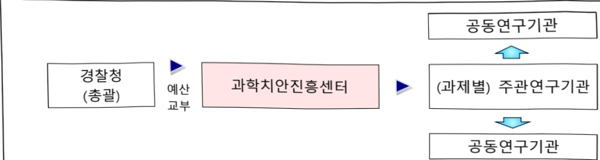

# 사이버수사 지원기술 개발(R&D)

**해당 페이지**: PDF 110 ~ 117 쪽 해당

**부처**: 경찰청
**분야**: 공공질서 및 안전
**회계유형**: 일반회계
**2026 확정예산**: 3432.0 백만원
**전년대비 증감률**: None%
**AI 도메인**: 보안/사이버

---

### 가.예산 총괄표

(단위:백만원,%)

<table border=1 style='margin: auto; word-wrap: break-word;'><tr><td style='text-align: center; word-wrap: break-word;'>사업명</td><td style='text-align: center; word-wrap: break-word;'>2024년 결산</td><td style='text-align: center; word-wrap: break-word;'>2025년 예산 본예산(A)</td><td colspan="2">2026년</td><td style='text-align: center; word-wrap: break-word;'>중감 (B-A)</td><td style='text-align: center; word-wrap: break-word;'>(B-A)/A</td></tr><tr><td style='text-align: center; word-wrap: break-word;'>사이버수사 지원기술개발 (R&amp;D)</td><td style='text-align: center; word-wrap: break-word;'>1,897</td><td style='text-align: center; word-wrap: break-word;'>5,304</td><td style='text-align: center; word-wrap: break-word;'>8,736</td><td style='text-align: center; word-wrap: break-word;'>8,736</td><td style='text-align: center; word-wrap: break-word;'>3,432</td><td style='text-align: center; word-wrap: break-word;'>64.7</td></tr></table>

□ 내역사업별 예산 내역

(단위:백만원)

<table border=1 style='margin: auto; word-wrap: break-word;'><tr><td rowspan="3"></td><td colspan="5">2024</td><td colspan="7">2025(25.11월말)</td><td rowspan="3">2026예산</td></tr><tr><td rowspan="2">예산액(추경)</td><td rowspan="2">예산현액</td><td rowspan="2">집행액[실정해]</td><td rowspan="2">이월액</td><td rowspan="2">불용액</td><td rowspan="2">분예산</td><td rowspan="2">예산현액</td><td rowspan="2">집행액[실정해]</td><td colspan="2">전년도 이월액제외</td><td rowspan="2">이월예상액</td><td rowspan="2">불용예상액</td></tr><tr><td style='text-align: center; word-wrap: break-word;'>예산현액</td><td style='text-align: center; word-wrap: break-word;'>집행액[실정해]</td></tr><tr><td style='text-align: center; word-wrap: break-word;'>ㅇ 기능별 분류(합계)</td><td style='text-align: center; word-wrap: break-word;'>1,897</td><td style='text-align: center; word-wrap: break-word;'>1,897</td><td style='text-align: center; word-wrap: break-word;'>1,897[1,897]</td><td style='text-align: center; word-wrap: break-word;'>-</td><td style='text-align: center; word-wrap: break-word;'>-</td><td style='text-align: center; word-wrap: break-word;'>5,304</td><td style='text-align: center; word-wrap: break-word;'>5,304[5,304]</td><td style='text-align: center; word-wrap: break-word;'>5,304[5,304]</td><td style='text-align: center; word-wrap: break-word;'>5,304[5,304]</td><td style='text-align: center; word-wrap: break-word;'>5,304[5,304]</td><td style='text-align: center; word-wrap: break-word;'>-</td><td style='text-align: center; word-wrap: break-word;'>-</td><td style='text-align: center; word-wrap: break-word;'>8,736</td></tr><tr><td rowspan="4">·디지털성범죄대응 위장수사지원용 가상인물생성 및 관리기술 개발·허위조작 콘텐츠진위여부 관별시스템 개발·로컬환경 인공지능모델 대상 포렌식기술 개발·기획평가관리비</td><td style='text-align: center; word-wrap: break-word;'>1,824</td><td style='text-align: center; word-wrap: break-word;'>1,824</td><td style='text-align: center; word-wrap: break-word;'>1,824[1,824]</td><td style='text-align: center; word-wrap: break-word;'>-</td><td style='text-align: center; word-wrap: break-word;'>-</td><td style='text-align: center; word-wrap: break-word;'>2,400</td><td style='text-align: center; word-wrap: break-word;'>2,400[2,400]</td><td style='text-align: center; word-wrap: break-word;'>2,400[2,400]</td><td style='text-align: center; word-wrap: break-word;'>2,400[2,400]</td><td style='text-align: center; word-wrap: break-word;'>-</td><td style='text-align: center; word-wrap: break-word;'>-</td><td style='text-align: center; word-wrap: break-word;'>2,800</td><td style='text-align: center; word-wrap: break-word;'></td></tr><tr><td style='text-align: center; word-wrap: break-word;'>-</td><td style='text-align: center; word-wrap: break-word;'>-</td><td style='text-align: center; word-wrap: break-word;'>-</td><td style='text-align: center; word-wrap: break-word;'>-</td><td style='text-align: center; word-wrap: break-word;'>-</td><td style='text-align: center; word-wrap: break-word;'>2,700</td><td style='text-align: center; word-wrap: break-word;'>2,700[2,700]</td><td style='text-align: center; word-wrap: break-word;'>2,700[2,700]</td><td style='text-align: center; word-wrap: break-word;'>2,700[2,700]</td><td style='text-align: center; word-wrap: break-word;'>-</td><td style='text-align: center; word-wrap: break-word;'>-</td><td style='text-align: center; word-wrap: break-word;'>3,600</td><td style='text-align: center; word-wrap: break-word;'></td></tr><tr><td style='text-align: center; word-wrap: break-word;'>-</td><td style='text-align: center; word-wrap: break-word;'>-</td><td style='text-align: center; word-wrap: break-word;'>-</td><td style='text-align: center; word-wrap: break-word;'>-</td><td style='text-align: center; word-wrap: break-word;'>-</td><td style='text-align: center; word-wrap: break-word;'>-</td><td style='text-align: center; word-wrap: break-word;'>-</td><td style='text-align: center; word-wrap: break-word;'>-</td><td style='text-align: center; word-wrap: break-word;'>-</td><td style='text-align: center; word-wrap: break-word;'>-</td><td style='text-align: center; word-wrap: break-word;'>-</td><td style='text-align: center; word-wrap: break-word;'>2,000</td><td style='text-align: center; word-wrap: break-word;'></td></tr><tr><td style='text-align: center; word-wrap: break-word;'>73</td><td style='text-align: center; word-wrap: break-word;'>73</td><td style='text-align: center; word-wrap: break-word;'>73[73]</td><td style='text-align: center; word-wrap: break-word;'>-</td><td style='text-align: center; word-wrap: break-word;'>-</td><td style='text-align: center; word-wrap: break-word;'>204</td><td style='text-align: center; word-wrap: break-word;'>204[204]</td><td style='text-align: center; word-wrap: break-word;'>204[204]</td><td style='text-align: center; word-wrap: break-word;'>204[204]</td><td style='text-align: center; word-wrap: break-word;'>-</td><td style='text-align: center; word-wrap: break-word;'>-</td><td style='text-align: center; word-wrap: break-word;'>336</td><td style='text-align: center; word-wrap: break-word;'></td></tr></table>

### 나.사업설명자료

## 1 ) 사업목적·내용

- (사이버수사지원기술개발) 사이버 공간에서의 용의자 추적과 검거를 용이하게 하여 범죄

피해를 최소화하고 국민의 치안서비스 만족도 향상 도모

- (①내역: 디지털성범죄 대응 위장수사 지원용 가상인물 생성 및 관리기술 개발) 법적으로 아동·청소년 대상 위장수사가 허용됨에 따라 디지털성범죄 피해 예방 및 용의자 검거를 위해 가상인물을 생성하여 수사 현장에 투입하고 이를 관리하는 기술 개발

-(②내역:허위조작 콘텐츠 진위여부 판별 시스템 개발) 딥페이크·딥보이스·가짜뉴스 등 콘텐츠 조작 기술에 대응, 멀티모달 형태의 탐지 알고리즘 개발로 진위여부 및 원천 게시물을 추적하고 이를 종합적으로 탐지할 수 있는 통합관리시스템을 구현

- (③내역: 로컬환경 인공지능 모델 대상 포렌식 기술개발) 로컬환경 인공지능 모델에 대한

---

포렌식분석을 체계적으로 수행하기 위한 표준방법론과 이를 지원하는 솔루션 개발

-(④내역: 기획평가관리비) 원활한 사업 추진을 위한 기획, 평가, 관리 등 소요 비용

## 2 ) 사업개요

## □ 사업근거 및 추진경위

① 법령상 근거 및 조항 적시

- 아동·청소년의 성보호에 관한 법률 제25조의2(이동·청소년대상 디지털 성범죄의 수사 특례)

- 국가경찰과 자치경찰의 조직 및 운영에 관한 법률 제3조(치안에 필요한 연구개발의 지원 등)

- 국정과제 국민안전을 위한 법질서 확립 및 민생치안 역량 강화(예방중심 치안활동 강화, 치안 AI 혁신 신종범죄 대응역량 강화), 경찰의 중립성 확보 및 민주적 통제 강화(경찰 수사의 책임성·전문성 강화)

## ② 추진경위

- (2021년) 경찰청 순 국관·시도청 대상 기술수요조사 실시, 아동·청소년의 성보호에 관한 법률 개정에 따른 기술 개발 수요 확인 후 사업 기획 실시

- (2022년) 신규사업 편성 확정

- (2023년) 신규 내역사업 주관연구기관 선정 및 협약 체결

①디지털성범죄 대응 위장수사 지원용 가상인물 생성 및 관리기술 개발

- (2024년) 신규 내역사업 정부안 편성

① 허위조작 콘텐츠 진위여부 판별 시스템 개발

- (2025년) 신규 내역사업 정부안 편성

① 로컬환경 인공지능 모델 대상 포렌식 기술개발

## □ 주요내용

① 사업규모

- 사업기간 : (당초) '23~'26 → (변경) '23~'29 / 신규 내역사업 편성에 따른 연장

※ 사업비 290.43억(국고 290.43억)

- 최근 5년 간 투입된 사업비(예산액기준, 추경편성한 연도에는 추경포함)

<table border=1 style='margin: auto; word-wrap: break-word;'><tr><td style='text-align: center; word-wrap: break-word;'>$ \underline{\text{연도}} $</td><td style='text-align: center; word-wrap: break-word;'>2022</td><td style='text-align: center; word-wrap: break-word;'>2023</td><td style='text-align: center; word-wrap: break-word;'>2024</td><td style='text-align: center; word-wrap: break-word;'>2025</td><td style='text-align: center; word-wrap: break-word;'>2026</td></tr><tr><td style='text-align: center; word-wrap: break-word;'>$ \underline{\text{사업비}} $</td><td style='text-align: center; word-wrap: break-word;'>-</td><td style='text-align: center; word-wrap: break-word;'>1,872</td><td style='text-align: center; word-wrap: break-word;'>1,897</td><td style='text-align: center; word-wrap: break-word;'>5,304</td><td style='text-align: center; word-wrap: break-word;'>8,736</td></tr></table>

② 사업추진체계

- 사업시행방법 : 출연

- 사업시행주체 : 과학치안진홍센터 / 경찰청(공통)

- 사업 수혜자 : 국민, 현장 경찰관, 대학, 출연연, 기업 등

---

- 보조, 융자, 출연, 출자 등의 경우 보조·융자 등 지원 비율 및 법적근거

<table border=1 style='margin: auto; word-wrap: break-word;'><tr><td style='text-align: center; word-wrap: break-word;'>내역사업명</td><td style='text-align: center; word-wrap: break-word;'>구분</td><td style='text-align: center; word-wrap: break-word;'>피보조·피출연 등 기관명</td><td style='text-align: center; word-wrap: break-word;'>지원 금액 (2026예산)</td><td style='text-align: center; word-wrap: break-word;'>지원 비율(%)</td><td style='text-align: center; word-wrap: break-word;'>보조율 법적근거 (해당 조항)</td></tr><tr><td style='text-align: center; word-wrap: break-word;'>디지털성범죄 대응 위장수사 지원용 가상인물 생성 및 관리기술 개발</td><td rowspan="4">출연</td><td rowspan="4">과학치안 진흥센터</td><td style='text-align: center; word-wrap: break-word;'>2,800</td><td style='text-align: center; word-wrap: break-word;'>100</td><td rowspan="4">국가경찰과 자치경찰의 조직 및 운영에 관한 법률 제33조</td></tr><tr><td style='text-align: center; word-wrap: break-word;'>허위조작 콘텐츠 진위여부 관련 시스템 개발</td><td style='text-align: center; word-wrap: break-word;'>3,600</td><td style='text-align: center; word-wrap: break-word;'>100</td></tr><tr><td style='text-align: center; word-wrap: break-word;'>로컬환경 인공지능 모델 대상 포렌식 기술개발</td><td style='text-align: center; word-wrap: break-word;'>2,000</td><td style='text-align: center; word-wrap: break-word;'>100</td></tr><tr><td style='text-align: center; word-wrap: break-word;'>기획평가 관리비</td><td style='text-align: center; word-wrap: break-word;'>336</td><td style='text-align: center; word-wrap: break-word;'>100</td></tr></table>

3) 2026년도 예산 산출 근거

① 디지털성범죄 대응 위장수사 지원용 가상인물 생성 및 관리기술 개발

:(25)2,400→(26)2,800백만원(+400)

1. 가상인물 생성을 위한 데이터 구축 : 300 → 200백만원(△100)

2. 가상인물 생성(이미지·영상·음성·SNS) 기술개발 : 1,978 → 2,478백만원(+500)

3. 가상인물 통합관리 플랫폼 개발 : 122 → 122백만원(전년동)

② 허위조작 콘텐츠 진위여부 판별시스템 개발 : ('25) 2,400 → ('26) 3,600 백만원(+900)

1. 허위조작 콘텐츠 진위여부 판별시스템 개발 : 2,700 → 3,600백만원(+900)

③ 로컬환경 인공지능 모델 대상 포렌식 기술개발

:(25)0→(26)2,000백만원(순증)

1. 온프레미스 인공지능 모델 대상 포렌식 기술 개발 : 0 → 1,200백만원(순증)

2. 온디바이스 인공지능 모델 대상 포렌식 기술 개발 : 0 → 800백만원(순증)

④ 기획평가관리비 : (25) 204 → (26) 336백만원(+132)

1. 기획평가관리비 : 204 → 336백만원(+132)

---

## 4 ) 사업효과

☐ 사업영향, 산출물 성과지표 등

① '22~'26년도 성과계획서 상 성과지표 및 최근 5년간 성과 달성도

※ 신규 내역사업(로컬환경 인공지능 모델 대상 포렌식)은 '26년도 신규사업으로 기획보고서 상 목표지표 작성

<table border=1 style='margin: auto; word-wrap: break-word;'><tr><td style='text-align: center; word-wrap: break-word;'>성과지표</td><td style='text-align: center; word-wrap: break-word;'>구분</td><td style='text-align: center; word-wrap: break-word;'>&#x27;22</td><td style='text-align: center; word-wrap: break-word;'>&#x27;23</td><td style='text-align: center; word-wrap: break-word;'>&#x27;24</td><td style='text-align: center; word-wrap: break-word;'>&#x27;25</td><td style='text-align: center; word-wrap: break-word;'>&#x27;26</td><td style='text-align: center; word-wrap: break-word;'>&#x27;27</td><td style='text-align: center; word-wrap: break-word;'>&#x27;26목표치산출근거</td><td style='text-align: center; word-wrap: break-word;'>측정산식(또는 측정방법)</td><td style='text-align: center; word-wrap: break-word;'>자료수집방법(또는 자료출처)</td></tr><tr><td rowspan="3">치안현장만족도(단위:점)</td><td style='text-align: center; word-wrap: break-word;'>목표</td><td style='text-align: center; word-wrap: break-word;'>-</td><td style='text-align: center; word-wrap: break-word;'>-</td><td style='text-align: center; word-wrap: break-word;'>50</td><td style='text-align: center; word-wrap: break-word;'>66.7</td><td style='text-align: center; word-wrap: break-word;'>83.3</td><td style='text-align: center; word-wrap: break-word;'></td><td rowspan="3">프로토타입운용·개선이 1회이상 진행된시점으로,조금만족(66.7점)목표</td><td rowspan="3">18개 시도청사이버성폭력수사팀대상 만족도 조사의 평균값</td><td rowspan="3">연차보고서,설문조사 결과</td></tr><tr><td style='text-align: center; word-wrap: break-word;'>실적</td><td style='text-align: center; word-wrap: break-word;'>-</td><td style='text-align: center; word-wrap: break-word;'>-</td><td style='text-align: center; word-wrap: break-word;'>53.8</td><td style='text-align: center; word-wrap: break-word;'></td><td style='text-align: center; word-wrap: break-word;'></td><td style='text-align: center; word-wrap: break-word;'></td></tr><tr><td style='text-align: center; word-wrap: break-word;'>달성도</td><td style='text-align: center; word-wrap: break-word;'>-</td><td style='text-align: center; word-wrap: break-word;'>-</td><td style='text-align: center; word-wrap: break-word;'>100</td><td style='text-align: center; word-wrap: break-word;'></td><td style='text-align: center; word-wrap: break-word;'></td><td style='text-align: center; word-wrap: break-word;'></td></tr><tr><td rowspan="3">한국형가상인물성능 향상상대 비율(단위:%)</td><td style='text-align: center; word-wrap: break-word;'>목표</td><td style='text-align: center; word-wrap: break-word;'>-</td><td style='text-align: center; word-wrap: break-word;'>5</td><td style='text-align: center; word-wrap: break-word;'>10</td><td style='text-align: center; word-wrap: break-word;'>15</td><td style='text-align: center; word-wrap: break-word;'>20</td><td style='text-align: center; word-wrap: break-word;'></td><td rowspan="3">전년보다 5% 향상</td><td rowspan="3">(시중모델FID·개발모델FID)/시중모델FID×100#FID(Frechet inception distance):목표데이터와 생성된데이터 간의 거리로,수치가 낮을수록유사도가 높음</td><td rowspan="3">연차보고서</td></tr><tr><td style='text-align: center; word-wrap: break-word;'>실적</td><td style='text-align: center; word-wrap: break-word;'>-</td><td style='text-align: center; word-wrap: break-word;'>38.71</td><td style='text-align: center; word-wrap: break-word;'>27.7</td><td style='text-align: center; word-wrap: break-word;'></td><td style='text-align: center; word-wrap: break-word;'></td><td style='text-align: center; word-wrap: break-word;'></td></tr><tr><td style='text-align: center; word-wrap: break-word;'>달성도</td><td style='text-align: center; word-wrap: break-word;'>-</td><td style='text-align: center; word-wrap: break-word;'>100</td><td style='text-align: center; word-wrap: break-word;'>100</td><td style='text-align: center; word-wrap: break-word;'></td><td style='text-align: center; word-wrap: break-word;'></td><td style='text-align: center; word-wrap: break-word;'></td></tr><tr><td rowspan="3">실시간음성변환지역시간(단위:ms)</td><td style='text-align: center; word-wrap: break-word;'>목표</td><td style='text-align: center; word-wrap: break-word;'>-</td><td style='text-align: center; word-wrap: break-word;'>2,000</td><td style='text-align: center; word-wrap: break-word;'>500</td><td style='text-align: center; word-wrap: break-word;'>350</td><td style='text-align: center; word-wrap: break-word;'>200</td><td style='text-align: center; word-wrap: break-word;'></td><td rowspan="3">Resemble AI사의공개된 목표치인500ms 달성 후,점차 단축하여 일반사용자가 불편함을느끼지 않는지연속도 200ms 최종 달성 목표</td><td rowspan="3">평균 음성 변환소요 시간(5회 측정)</td><td rowspan="3">연차보고서</td></tr><tr><td style='text-align: center; word-wrap: break-word;'>실적</td><td style='text-align: center; word-wrap: break-word;'>-</td><td style='text-align: center; word-wrap: break-word;'>1,917</td><td style='text-align: center; word-wrap: break-word;'>341.3</td><td style='text-align: center; word-wrap: break-word;'></td><td style='text-align: center; word-wrap: break-word;'></td><td style='text-align: center; word-wrap: break-word;'></td></tr><tr><td style='text-align: center; word-wrap: break-word;'>달성도</td><td style='text-align: center; word-wrap: break-word;'>-</td><td style='text-align: center; word-wrap: break-word;'>100</td><td style='text-align: center; word-wrap: break-word;'>100</td><td style='text-align: center; word-wrap: break-word;'></td><td style='text-align: center; word-wrap: break-word;'></td><td style='text-align: center; word-wrap: break-word;'></td></tr><tr><td rowspan="3">탐지시스템정확도</td><td style='text-align: center; word-wrap: break-word;'>목표</td><td style='text-align: center; word-wrap: break-word;'>-</td><td style='text-align: center; word-wrap: break-word;'>-</td><td style='text-align: center; word-wrap: break-word;'>-</td><td style='text-align: center; word-wrap: break-word;'>80</td><td style='text-align: center; word-wrap: break-word;'>82</td><td rowspan="3">85</td><td rowspan="3">&#x27;25년 신규사업으로,일반적으로 우수한정확도라 관단하는80%를 1차년도 목표로 설정, 과제종료시점통합시스템의 종합탐지 정확도 세계최고수준 목표</td><td rowspan="3">(담폐이크 탑지정확도+담보이스탑지정확도+가채뉴스탑지 정확도)/3</td><td rowspan="3">연차보고서,공인인증기관성적서</td></tr><tr><td style='text-align: center; word-wrap: break-word;'>실적</td><td style='text-align: center; word-wrap: break-word;'>-</td><td style='text-align: center; word-wrap: break-word;'>-</td><td style='text-align: center; word-wrap: break-word;'>-</td><td style='text-align: center; word-wrap: break-word;'></td><td style='text-align: center; word-wrap: break-word;'></td></tr><tr><td style='text-align: center; word-wrap: break-word;'>달성도</td><td style='text-align: center; word-wrap: break-word;'>-</td><td style='text-align: center; word-wrap: break-word;'>-</td><td style='text-align: center; word-wrap: break-word;'>-</td><td style='text-align: center; word-wrap: break-word;'></td><td style='text-align: center; word-wrap: break-word;'></td></tr><tr><td rowspan="3">표준화된영향력지수(mrnIF)</td><td style='text-align: center; word-wrap: break-word;'>목표</td><td style='text-align: center; word-wrap: break-word;'>-</td><td style='text-align: center; word-wrap: break-word;'>-</td><td style='text-align: center; word-wrap: break-word;'>-</td><td style='text-align: center; word-wrap: break-word;'>69.7</td><td style='text-align: center; word-wrap: break-word;'>71.7</td><td rowspan="3"></td><td rowspan="3">&#x27;23년 IT분야mmIF를 기준으로,매년 2.89% 상향된목표치 설정</td><td rowspan="3">SCIE 논문의 mrnIF합계 / 발표된 SCI 논문 수</td><td rowspan="9">연차보고서,NTIS</td></tr><tr><td style='text-align: center; word-wrap: break-word;'>실적</td><td style='text-align: center; word-wrap: break-word;'>-</td><td style='text-align: center; word-wrap: break-word;'>-</td><td style='text-align: center; word-wrap: break-word;'>-</td><td style='text-align: center; word-wrap: break-word;'></td><td style='text-align: center; word-wrap: break-word;'></td></tr><tr><td style='text-align: center; word-wrap: break-word;'>달성도</td><td style='text-align: center; word-wrap: break-word;'>-</td><td style='text-align: center; word-wrap: break-word;'>-</td><td style='text-align: center; word-wrap: break-word;'>-</td><td style='text-align: center; word-wrap: break-word;'></td><td style='text-align: center; word-wrap: break-word;'></td></tr><tr><td rowspan="3">모델 변조탑지율(%)</td><td style='text-align: center; word-wrap: break-word;'>목표</td><td style='text-align: center; word-wrap: break-word;'>-</td><td style='text-align: center; word-wrap: break-word;'>-</td><td style='text-align: center; word-wrap: break-word;'>-</td><td style='text-align: center; word-wrap: break-word;'>-</td><td style='text-align: center; word-wrap: break-word;'>신규</td><td rowspan="3">&#x27;26년 신규</td><td rowspan="3">공격자가 모델 변조 후 탑지 시스템이 변조 여부를 얼마나 정확하게관벌하는지 평가함</td><td rowspan="3">공인인증기관성적서 발급</td></tr><tr><td style='text-align: center; word-wrap: break-word;'>실적</td><td style='text-align: center; word-wrap: break-word;'>-</td><td style='text-align: center; word-wrap: break-word;'>-</td><td style='text-align: center; word-wrap: break-word;'>-</td><td style='text-align: center; word-wrap: break-word;'>-</td><td style='text-align: center; word-wrap: break-word;'>-</td></tr><tr><td style='text-align: center; word-wrap: break-word;'>달성도</td><td style='text-align: center; word-wrap: break-word;'>-</td><td style='text-align: center; word-wrap: break-word;'>-</td><td style='text-align: center; word-wrap: break-word;'>-</td><td style='text-align: center; word-wrap: break-word;'>-</td><td style='text-align: center; word-wrap: break-word;'>-</td></tr><tr><td rowspan="3">모델 해석가능성(%)</td><td style='text-align: center; word-wrap: break-word;'>목표</td><td style='text-align: center; word-wrap: break-word;'>-</td><td style='text-align: center; word-wrap: break-word;'>-</td><td style='text-align: center; word-wrap: break-word;'>-</td><td style='text-align: center; word-wrap: break-word;'>-</td><td style='text-align: center; word-wrap: break-word;'>신규</td><td rowspan="3">&#x27;26년 신규</td><td rowspan="3">인공지능 모델의 내부 가중치 및결정 경로를 분석해 특정 입력이 모델의 예측에 미치는 영향을 분석하는 기법을 사용함</td><td rowspan="3">공인인증기관성적서 발급</td></tr><tr><td style='text-align: center; word-wrap: break-word;'>실적</td><td style='text-align: center; word-wrap: break-word;'>-</td><td style='text-align: center; word-wrap: break-word;'>-</td><td style='text-align: center; word-wrap: break-word;'>-</td><td style='text-align: center; word-wrap: break-word;'>-</td><td style='text-align: center; word-wrap: break-word;'>-</td></tr><tr><td style='text-align: center; word-wrap: break-word;'>달성도</td><td style='text-align: center; word-wrap: break-word;'>-</td><td style='text-align: center; word-wrap: break-word;'>-</td><td style='text-align: center; word-wrap: break-word;'>-</td><td style='text-align: center; word-wrap: break-word;'>-</td><td style='text-align: center; word-wrap: break-word;'>-</td></tr></table>

② 성과지표 이외의 연도별 사업추진 경과 및 실적

<table border=1 style='margin: auto; word-wrap: break-word;'><tr><td style='text-align: center; word-wrap: break-word;'>2023</td><td style='text-align: center; word-wrap: break-word;'>- 디지털성범죄 대응 위장수사 지원용 가상인물 생성 및 관리기술 개발 신규 1개 과제 선정 및 협약(&#x27;24년 4월)</td></tr><tr><td style='text-align: center; word-wrap: break-word;'>2024</td><td style='text-align: center; word-wrap: break-word;'>- 위장수사 지원용 가상인물 통합관리플랫폼 1차 프로토타입 개발 - 디지털성범죄 대응 위장수사 지원용 가상인물 생성 및 관리기술 개발 과제 단계평가 예정(&#x27;24년 11월)</td></tr><tr><td style='text-align: center; word-wrap: break-word;'>2025</td><td style='text-align: center; word-wrap: break-word;'>- 허위조작콘텐츠 진위여부 판별시스템 개발 신규 1개 과제 선정 및 협약(&#x27;25년 4월)</td></tr></table>

---

③향후('26년도 이후) 기대효과

☐ 적극적이고 안정적인 위장 수사를 지원하여 잠재적 피해 예방 및 수사 장기화 방지

○ 수사관의 노동력을 기반으로 대응하던 기존의 방식을 보조해 전국 사이버범죄 수사

인력(약 8천명) 조력 및 관련 비용 절감 기대

○ 선거 과정, 정책 논의 등에서 거짓 정보에 의한 사회적 혼란 예방 및 거짓 정보에 기반한

불필요한 사회적 갈등 및 오해를 감소시켜 공공 미디어의 신뢰성 회복에 기여

○ 인공지능 모델을 포렌식할 수 있는 솔루션을 통해서 인공지능을 조작하고 악용한

새로운 범죄에 대한 경찰의 수사 역량 증강

5) 타당성조사 및 예비타당성조사 시행여부 및 결과 요지 : 해당사항 없음

6) 총사업비 대상사업 여부 및 내역 : 해당사항 없음

## 7 ) 사업 집행절차

①디지털성범죄 대응 위장수사 지원용 가상인물 생성 및 관리기술 개발

<table border=1 style='margin: auto; word-wrap: break-word;'><tr><td style='text-align: center; word-wrap: break-word;'>부처</td><td style='text-align: center; word-wrap: break-word;'></td><td style='text-align: center; word-wrap: break-word;'>피출연·피보조기관</td><td style='text-align: center; word-wrap: break-word;'></td><td style='text-align: center; word-wrap: break-word;'>간접보조사업자·사업수행자</td></tr><tr><td style='text-align: center; word-wrap: break-word;'>경찰청(2,800백만원)</td><td style='text-align: center; word-wrap: break-word;'>=&gt;(2,800백만원)</td><td style='text-align: center; word-wrap: break-word;'>과학치안 진흥센터(-)</td><td style='text-align: center; word-wrap: break-word;'>=&gt;(2,800백만원)</td><td style='text-align: center; word-wrap: break-word;'>CNAI 등 3개 기관</td></tr></table>

②허위조작 콘텐츠 진위여부 판별시스템 개발

<table border=1 style='margin: auto; word-wrap: break-word;'><tr><td style='text-align: center; word-wrap: break-word;'>부처</td><td style='text-align: center; word-wrap: break-word;'></td><td style='text-align: center; word-wrap: break-word;'>피출연·피보조기관</td><td style='text-align: center; word-wrap: break-word;'></td><td style='text-align: center; word-wrap: break-word;'>간접보조사업자·사업수행자</td></tr><tr><td style='text-align: center; word-wrap: break-word;'>경찰청(3,600백만원)</td><td style='text-align: center; word-wrap: break-word;'>=&gt;(3,600백만원)</td><td style='text-align: center; word-wrap: break-word;'>과학치안진흥센터(-)</td><td style='text-align: center; word-wrap: break-word;'>=&gt;(3,600백만원)</td><td style='text-align: center; word-wrap: break-word;'>미정</td></tr></table>

---

## ③로컬환경 인공지능 모델 대상 포렌식 기술개발

<table border=1 style='margin: auto; word-wrap: break-word;'><tr><td style='text-align: center; word-wrap: break-word;'>부처</td><td style='text-align: center; word-wrap: break-word;'></td><td style='text-align: center; word-wrap: break-word;'>피출연·피보조기관</td><td style='text-align: center; word-wrap: break-word;'></td><td style='text-align: center; word-wrap: break-word;'>간접보조사업자·사업수행자</td></tr><tr><td style='text-align: center; word-wrap: break-word;'>경찰청(2,000백만원)</td><td style='text-align: center; word-wrap: break-word;'>=&gt;(2,000백만원)</td><td style='text-align: center; word-wrap: break-word;'>과학치안진흥센터(-)</td><td style='text-align: center; word-wrap: break-word;'>=&gt;(2,000백만원)</td><td style='text-align: center; word-wrap: break-word;'>미정</td></tr></table>

④ 기획평가관리비

<table border=1 style='margin: auto; word-wrap: break-word;'><tr><td style='text-align: center; word-wrap: break-word;'>부처</td><td style='text-align: center; word-wrap: break-word;'></td><td style='text-align: center; word-wrap: break-word;'>피출연·피보조기관</td><td style='text-align: center; word-wrap: break-word;'></td><td style='text-align: center; word-wrap: break-word;'>간접보조사업자·사업수행자</td></tr><tr><td style='text-align: center; word-wrap: break-word;'>경찰청(336백만원)</td><td style='text-align: center; word-wrap: break-word;'>=&gt;(336백만원)</td><td style='text-align: center; word-wrap: break-word;'>과학치안진흥센터(336백만원)</td><td style='text-align: center; word-wrap: break-word;'>=&gt;(-)</td><td style='text-align: center; word-wrap: break-word;'>-</td></tr></table>

---

### 다. 최근 4년간 결산내역

## 1 ) 결산표

☐ 부처 결산내역

(단위:백만원,%)

<table border=1 style='margin: auto; word-wrap: break-word;'><tr><td style='text-align: center; word-wrap: break-word;'>単</td><td style='text-align: center; word-wrap: break-word;'>倉</td><td style='text-align: center; word-wrap: break-word;'>倉</td><td style='text-align: center; word-wrap: break-word;'>倉</td></tr></table>

□출연·보조사업 등 실집행내역

(단위: 백만원, %)

<table border=1 style='margin: auto; word-wrap: break-word;'><tr><td rowspan="3">구분</td><td colspan="3">부처</td><td colspan="7">사업시행주체(피출연·피보조 기관 등)</td></tr><tr><td colspan="2">예산액</td><td rowspan="2">집행액</td><td rowspan="2">교부액</td><td rowspan="2">전년도 이월액</td><td rowspan="2">교부 현액</td><td rowspan="2">집행액 (B)</td><td rowspan="2">이월액</td><td rowspan="2">불용액</td><td rowspan="2">실집행률 (B/A)</td></tr><tr><td style='text-align: center; word-wrap: break-word;'>본예산</td><td style='text-align: center; word-wrap: break-word;'>추경(A)</td></tr><tr><td style='text-align: center; word-wrap: break-word;'>2022</td><td style='text-align: center; word-wrap: break-word;'>-</td><td style='text-align: center; word-wrap: break-word;'>-</td><td style='text-align: center; word-wrap: break-word;'>-</td><td style='text-align: center; word-wrap: break-word;'>-</td><td style='text-align: center; word-wrap: break-word;'>-</td><td style='text-align: center; word-wrap: break-word;'>-</td><td style='text-align: center; word-wrap: break-word;'>-</td><td style='text-align: center; word-wrap: break-word;'>-</td><td style='text-align: center; word-wrap: break-word;'>-</td><td style='text-align: center; word-wrap: break-word;'>-</td></tr><tr><td style='text-align: center; word-wrap: break-word;'>2023</td><td style='text-align: center; word-wrap: break-word;'>1,872</td><td style='text-align: center; word-wrap: break-word;'>1,872</td><td style='text-align: center; word-wrap: break-word;'>1,872</td><td style='text-align: center; word-wrap: break-word;'>1,872</td><td style='text-align: center; word-wrap: break-word;'>-</td><td style='text-align: center; word-wrap: break-word;'>1,872</td><td style='text-align: center; word-wrap: break-word;'>1,872</td><td style='text-align: center; word-wrap: break-word;'>-</td><td style='text-align: center; word-wrap: break-word;'>-</td><td style='text-align: center; word-wrap: break-word;'>100</td></tr><tr><td style='text-align: center; word-wrap: break-word;'>2024</td><td style='text-align: center; word-wrap: break-word;'>1,897</td><td style='text-align: center; word-wrap: break-word;'>1,897</td><td style='text-align: center; word-wrap: break-word;'>1,897</td><td style='text-align: center; word-wrap: break-word;'>1,897</td><td style='text-align: center; word-wrap: break-word;'>-</td><td style='text-align: center; word-wrap: break-word;'>1,897</td><td style='text-align: center; word-wrap: break-word;'>1,897</td><td style='text-align: center; word-wrap: break-word;'>-</td><td style='text-align: center; word-wrap: break-word;'>-</td><td style='text-align: center; word-wrap: break-word;'>100</td></tr><tr><td style='text-align: center; word-wrap: break-word;'>2025.11월 기준</td><td style='text-align: center; word-wrap: break-word;'>5,304</td><td style='text-align: center; word-wrap: break-word;'>5,304</td><td style='text-align: center; word-wrap: break-word;'>5,304</td><td style='text-align: center; word-wrap: break-word;'>5,304</td><td style='text-align: center; word-wrap: break-word;'>-</td><td style='text-align: center; word-wrap: break-word;'>5,304</td><td style='text-align: center; word-wrap: break-word;'>5,304</td><td style='text-align: center; word-wrap: break-word;'>-</td><td style='text-align: center; word-wrap: break-word;'>-</td><td style='text-align: center; word-wrap: break-word;'>100</td></tr></table>

## 2 ) 주요 결산사항

☐ 2022년~2025년 결산사항

<table border=1 style='margin: auto; word-wrap: break-word;'><tr><td style='text-align: center; word-wrap: break-word;'>2022</td><td style='text-align: center; word-wrap: break-word;'>- 해당없음</td></tr><tr><td style='text-align: center; word-wrap: break-word;'>2023</td><td style='text-align: center; word-wrap: break-word;'>- 출연금 예산 전액 집행</td></tr><tr><td style='text-align: center; word-wrap: break-word;'>2024</td><td style='text-align: center; word-wrap: break-word;'>- 출연금 예산 전액 집행</td></tr><tr><td style='text-align: center; word-wrap: break-word;'>2025</td><td style='text-align: center; word-wrap: break-word;'>- 출연금 예산 전액 집행</td></tr></table>

□2025년 이·전용 등 세부내역 : 해당없음

□ 2025년 예비비 배정 세부내역 : 해당없음

---

<table border=1 style='margin: auto; word-wrap: break-word;'><tr><td style='text-align: center; word-wrap: break-word;'>사 업 명</td></tr><tr><td style='text-align: center; word-wrap: break-word;'>차세대지능형순찰플랫폼개발(R&amp;D) (4431-724)</td></tr></table>

## □ 사업 코드 정보

<table border=1 style='margin: auto; word-wrap: break-word;'><tr><td style='text-align: center; word-wrap: break-word;'>구분</td><td style='text-align: center; word-wrap: break-word;'>회계</td><td style='text-align: center; word-wrap: break-word;'>소관</td><td style='text-align: center; word-wrap: break-word;'>실국(기관)</td><td style='text-align: center; word-wrap: break-word;'>계정</td><td style='text-align: center; word-wrap: break-word;'>분야</td><td style='text-align: center; word-wrap: break-word;'>부문</td></tr><tr><td style='text-align: center; word-wrap: break-word;'>코드</td><td rowspan="2">일반회계</td><td rowspan="2">경찰청</td><td rowspan="2">미래치안정책국</td><td rowspan="2"></td><td style='text-align: center; word-wrap: break-word;'>020</td><td style='text-align: center; word-wrap: break-word;'>023</td></tr><tr><td style='text-align: center; word-wrap: break-word;'>명칭</td><td style='text-align: center; word-wrap: break-word;'>공공질서및안전</td><td style='text-align: center; word-wrap: break-word;'>경찰</td></tr></table>

<table border=1 style='margin: auto; word-wrap: break-word;'><tr><td style='text-align: center; word-wrap: break-word;'>구분</td><td style='text-align: center; word-wrap: break-word;'>프로그램</td><td style='text-align: center; word-wrap: break-word;'>단위사업</td><td style='text-align: center; word-wrap: break-word;'>세부사업</td></tr><tr><td style='text-align: center; word-wrap: break-word;'>코드</td><td style='text-align: center; word-wrap: break-word;'>4400</td><td style='text-align: center; word-wrap: break-word;'>4431</td><td style='text-align: center; word-wrap: break-word;'>724</td></tr><tr><td style='text-align: center; word-wrap: break-word;'>명칭</td><td style='text-align: center; word-wrap: break-word;'>과학치안활성화</td><td style='text-align: center; word-wrap: break-word;'>정책연구개발(R&amp;D)</td><td style='text-align: center; word-wrap: break-word;'>차세대지능형순찰플랫폼개발(R&amp;D)</td></tr></table>

## □ 사업 성격

<table border=1 style='margin: auto; word-wrap: break-word;'><tr><td rowspan="2">신규</td><td rowspan="2">계속</td><td rowspan="2">완료</td><td rowspan="2">예비타당성 실시여부</td><td rowspan="2">총사업비 관리대상</td><td rowspan="2">총액계상 예산사업</td><td style='text-align: center; word-wrap: break-word;'>사업소관 변경정보</td></tr><tr><td style='text-align: center; word-wrap: break-word;'>2025예산 시 소관</td></tr><tr><td style='text-align: center; word-wrap: break-word;'></td><td style='text-align: center; word-wrap: break-word;'>○</td><td style='text-align: center; word-wrap: break-word;'></td><td style='text-align: center; word-wrap: break-word;'></td><td style='text-align: center; word-wrap: break-word;'></td><td style='text-align: center; word-wrap: break-word;'></td><td style='text-align: center; word-wrap: break-word;'></td></tr></table>

## □ 사업 지원 형태 및 지원을

<table border=1 style='margin: auto; word-wrap: break-word;'><tr><td style='text-align: center; word-wrap: break-word;'>직접</td><td style='text-align: center; word-wrap: break-word;'>출자</td><td style='text-align: center; word-wrap: break-word;'>출연</td><td style='text-align: center; word-wrap: break-word;'>보조</td><td style='text-align: center; word-wrap: break-word;'>융자</td><td style='text-align: center; word-wrap: break-word;'>국고보조율(%)</td><td style='text-align: center; word-wrap: break-word;'>융자율(%)</td></tr><tr><td style='text-align: center; word-wrap: break-word;'></td><td style='text-align: center; word-wrap: break-word;'></td><td style='text-align: center; word-wrap: break-word;'>○</td><td style='text-align: center; word-wrap: break-word;'></td><td style='text-align: center; word-wrap: break-word;'></td><td style='text-align: center; word-wrap: break-word;'></td><td style='text-align: center; word-wrap: break-word;'></td></tr></table>

## ☐ 사업 담당자

<table border=1 style='margin: auto; word-wrap: break-word;'><tr><td style='text-align: center; word-wrap: break-word;'>사업명</td><td colspan="2">구분</td></tr><tr><td rowspan="2"></td><td style='text-align: center; word-wrap: break-word;'>소관부처</td><td style='text-align: center; word-wrap: break-word;'>마래치안정책국</td></tr><tr><td style='text-align: center; word-wrap: break-word;'>사업시행주체</td><td style='text-align: center; word-wrap: break-word;'>과학기술개발진흥과</td></tr></table>

---

### 원본 PDF 크롭 이미지

