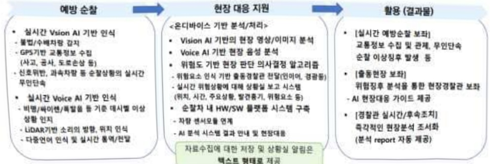
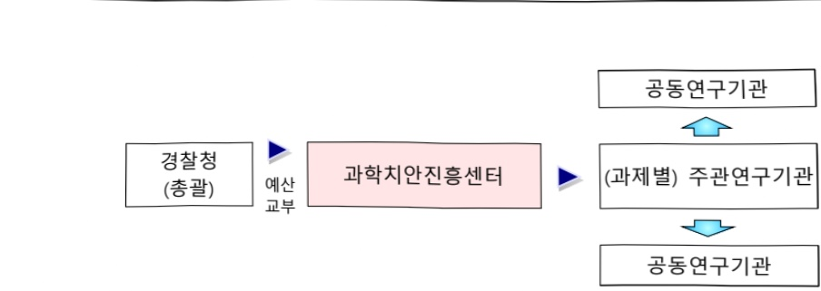

# 차세대지능형순찰플랫폼개발(R&D)

**해당 페이지**: PDF 118 ~ 124 쪽 해당

**부처**: 경찰청
**분야**: 공공질서 및 안전
**회계유형**: 일반회계
**2026 확정예산**: 2773.0 백만원
**전년대비 증감률**: None%
**AI 도메인**: 법률/치안

---

### 가.예산 총괄표

(단위:백만원,%)

<table border=1 style='margin: auto; word-wrap: break-word;'><tr><td rowspan="2">사업명</td><td rowspan="2">2024년 결산</td><td rowspan="2">2025년 예산 본예산(A)</td><td colspan="2">2026년</td><td rowspan="2">증감 (B-A)</td><td rowspan="2">(B-A)/A</td></tr><tr><td style='text-align: center; word-wrap: break-word;'>요구</td><td style='text-align: center; word-wrap: break-word;'>조정(B)</td></tr><tr><td style='text-align: center; word-wrap: break-word;'>차세대지능형순찰 플랫폼개발 (R&amp;D)</td><td style='text-align: center; word-wrap: break-word;'>-</td><td style='text-align: center; word-wrap: break-word;'>692</td><td style='text-align: center; word-wrap: break-word;'>3,465</td><td style='text-align: center; word-wrap: break-word;'>3,465</td><td style='text-align: center; word-wrap: break-word;'>2,773</td><td style='text-align: center; word-wrap: break-word;'>400.7</td></tr></table>

□ 내역사업별 예산 내역

(단위:백만원)

<table border=1 style='margin: auto; word-wrap: break-word;'><tr><td rowspan="3"></td><td colspan="5">2024</td><td colspan="7">2025(25.11월말)</td><td rowspan="3">2026예산</td></tr><tr><td rowspan="2">예산액(추경)</td><td rowspan="2">예산현액</td><td rowspan="2">집행액[실행액]</td><td rowspan="2">이월액</td><td rowspan="2">불용액</td><td rowspan="2">본예산</td><td rowspan="2">예산현액</td><td rowspan="2">집행액[실행액]</td><td colspan="2">전년도 이월액제외</td><td rowspan="2">이월예상액</td><td rowspan="2">불용예상액</td></tr><tr><td style='text-align: center; word-wrap: break-word;'>예산현액</td><td style='text-align: center; word-wrap: break-word;'>집행액[실행액]</td></tr><tr><td style='text-align: center; word-wrap: break-word;'>ㅇ 기능별 분류(합계)</td><td style='text-align: center; word-wrap: break-word;'>-</td><td style='text-align: center; word-wrap: break-word;'>-</td><td style='text-align: center; word-wrap: break-word;'>-</td><td style='text-align: center; word-wrap: break-word;'>-</td><td style='text-align: center; word-wrap: break-word;'>-</td><td style='text-align: center; word-wrap: break-word;'>692</td><td style='text-align: center; word-wrap: break-word;'>692</td><td style='text-align: center; word-wrap: break-word;'>692[692]</td><td style='text-align: center; word-wrap: break-word;'>692</td><td style='text-align: center; word-wrap: break-word;'>692[692]</td><td style='text-align: center; word-wrap: break-word;'>-</td><td style='text-align: center; word-wrap: break-word;'>-</td><td style='text-align: center; word-wrap: break-word;'>3,465</td></tr><tr><td style='text-align: center; word-wrap: break-word;'>·차세대지능형순찰플랫폼(음직이는 지구대)</td><td style='text-align: center; word-wrap: break-word;'>-</td><td style='text-align: center; word-wrap: break-word;'>-</td><td style='text-align: center; word-wrap: break-word;'>-</td><td style='text-align: center; word-wrap: break-word;'>-</td><td style='text-align: center; word-wrap: break-word;'>-</td><td style='text-align: center; word-wrap: break-word;'>666</td><td style='text-align: center; word-wrap: break-word;'>666</td><td style='text-align: center; word-wrap: break-word;'>666[666]</td><td style='text-align: center; word-wrap: break-word;'>666</td><td style='text-align: center; word-wrap: break-word;'>666[666]</td><td style='text-align: center; word-wrap: break-word;'>-</td><td style='text-align: center; word-wrap: break-word;'>-</td><td style='text-align: center; word-wrap: break-word;'>3,332</td></tr><tr><td style='text-align: center; word-wrap: break-word;'>·기획평가관리비</td><td style='text-align: center; word-wrap: break-word;'>-</td><td style='text-align: center; word-wrap: break-word;'>-</td><td style='text-align: center; word-wrap: break-word;'>-</td><td style='text-align: center; word-wrap: break-word;'>-</td><td style='text-align: center; word-wrap: break-word;'>-</td><td style='text-align: center; word-wrap: break-word;'>26</td><td style='text-align: center; word-wrap: break-word;'>26</td><td style='text-align: center; word-wrap: break-word;'>26[26]</td><td style='text-align: center; word-wrap: break-word;'>26</td><td style='text-align: center; word-wrap: break-word;'>26[26]</td><td style='text-align: center; word-wrap: break-word;'>-</td><td style='text-align: center; word-wrap: break-word;'>-</td><td style='text-align: center; word-wrap: break-word;'>133</td></tr></table>

---

### 나. 사업설명자료

## 1 ) 사업목적·내용

- (①내역: 차세대 지능형 순찰 플랫폼 개발) AI 기반, 순찰 상황에서 객체나 상황을 능동적으로 인지하고 위험도 등을 종합 판단하는 이동형 솔루션(Tool) 개발을 통해 경찰의 순찰 활동을 비롯한 치안 현장 대응을 지원

※ (성과물) 상황인지 및 의사결정 지원 알고리즘, 보이스/비전 AI 기반 센서모듈 등

- (②내역: 기획평가관리비) 원활한 사업 추진을 위한 기획, 평가, 관리 등 소요 비용

## 2 ) 사업개요

□ 사업근거 및 추진경위

① 법령상 근거 및 조항 적시

- 국가경찰과 자치경찰의 조직 및 운영에 관한 법률 제33조(치안에 필요한 연구개발의 지원 등)

① 경찰청장은 치안에 필요한 연구·실험·조사·기술개발(이하 “연구개발사업”이라 한다) 및 전문

인력 양성 등 치안분야의 과학기술진흥을 위한 시책을 마련하여 추진하여야 한다.

② 경찰청장은 연구개발사업을 효율적으로 추진하기 위하여 다음 각 호의 어느 하나에 해당하는 기관 또는 단체 등과 협약을 맺어 연구개발사업을 실시하게 할 수 있다.

③ 경찰청장은 제2항 각 호의 기관 또는 단체 등에 대하여 연구개발사업을 실시하는 데 필요한 경비의 전부 또는 일부를 출연하거나 보조할 수 있다.

④ 제2항에 따른 연구개발사업의 실시와 제3항에 따른 출연금의 지급·사용 및 관리 등에 필요한 사항은 대통령령으로 정한다.

## - 과학기술기본법 제16조의6(과학기술을 활용한 사회문제 해결)

① 정부는 과학기술을 활용한 삶의 질 향상, 경제적·사회적 현안 및 범지구적 문제 등의 해결을 위하여 필요한 시책을 세우고 추진하여야 한다.

② 제1항에 따른 시책을 세우고 추진하는 데 필요한 사항은 대통령령으로 정한다.

- 국정과제 국민안전을 위한 법질서 확립 및 민생치안 역량 강화(예방중심 치안활동 강화, 치

---

안 AI 혁신 신종범죄 대응역량 강화), 경찰의 중립성 확보 및 민주적 통제 강화(경찰 수사의 책임성·전문성 강화)

② 추진경위

- '23. 8. : 다부처 공동 기획 연구(사회문제해결 분야) 참여 협의 및 사전기획 착수(경찰청, 산업부)

- '24. 2. : 다부처 공동기획위원회 주관 최종평가 단계에서 미선정(사회문제해결 분야 3위 / 2위까지 선정), 이에 따른 산업부 불참 의사로 경찰청 단독으로 사업을 추진하기로 하고 사업 재기획

- '24. 8. : 정부안 편성

- '25. 4. : 신규과제 선정 공고

- '25. 7. : 협약 및 착수보고회

## □ 주요내용

① 사업규모

- 사업기간 : '25~'29 / 사업비 133.97억(국고 133.97억)

- 최근 5년 간 투입된 사업비(예산액기준, 추경편성한 연도에는 추경포함)

<table border=1 style='margin: auto; word-wrap: break-word;'><tr><td style='text-align: center; word-wrap: break-word;'>연도</td><td style='text-align: center; word-wrap: break-word;'>2022</td><td style='text-align: center; word-wrap: break-word;'>2023</td><td style='text-align: center; word-wrap: break-word;'>2024</td><td style='text-align: center; word-wrap: break-word;'>2025</td><td style='text-align: center; word-wrap: break-word;'>2026</td></tr><tr><td style='text-align: center; word-wrap: break-word;'>사업비</td><td style='text-align: center; word-wrap: break-word;'>-</td><td style='text-align: center; word-wrap: break-word;'>-</td><td style='text-align: center; word-wrap: break-word;'>-</td><td style='text-align: center; word-wrap: break-word;'>692</td><td style='text-align: center; word-wrap: break-word;'>3,465</td></tr></table>

② 사업추진체계

- 사업시행방법 : 출연

- 사업시행주체 : 과학치안진흥센터 / 경찰청(공통)

- 사업 수혜자 : 국민, 현장 경찰관, 대학, 출연연, 기업 등

- 보조, 융자, 출연, 출자 등의 경우 보조·융자 등 지원 비율 및 법적근거

<table border=1 style='margin: auto; word-wrap: break-word;'><tr><td style='text-align: center; word-wrap: break-word;'>내역사업명</td><td style='text-align: center; word-wrap: break-word;'>구분</td><td style='text-align: center; word-wrap: break-word;'>피보조·피출연 등 기관명</td><td style='text-align: center; word-wrap: break-word;'>지원 금액 (2026예산)</td><td style='text-align: center; word-wrap: break-word;'>지원 비율(%)</td><td style='text-align: center; word-wrap: break-word;'>보조율 법적근거 (해당 조항)</td></tr><tr><td style='text-align: center; word-wrap: break-word;'>차세대 지능형 순찰 플랫폼</td><td rowspan="2">출연</td><td rowspan="2">과학치안 진흥센터</td><td style='text-align: center; word-wrap: break-word;'>3,332</td><td style='text-align: center; word-wrap: break-word;'>100%</td><td rowspan="2">국가경찰과 자치경찰의 조직 및 운영에 관한 법률 제33조</td></tr><tr><td style='text-align: center; word-wrap: break-word;'>기획평가 관리비</td><td style='text-align: center; word-wrap: break-word;'>133</td><td style='text-align: center; word-wrap: break-word;'>100%</td></tr></table>

---

3)2026년도 예산 산출 근거

<table border=1 style='margin: auto; word-wrap: break-word;'><tr><td style='text-align: center; word-wrap: break-word;'>① 차세대 지능형 순찰 플랫폼 개발 : (&#x27;25) 666 → (&#x27;26) 3,332백만원(+2,666)</td></tr><tr><td style='text-align: center; word-wrap: break-word;'>1. 차세대 지능형 순찰 플랫폼 개발 : 666 → 3,332백만원(+2,666)</td></tr><tr><td style='text-align: center; word-wrap: break-word;'>② 기획평가관리비 : (&#x27;25) 26 → (&#x27;26) 133백만원(+107)</td></tr><tr><td style='text-align: center; word-wrap: break-word;'>1. 기획평가관리비 : 26 → 133백만원(+107)</td></tr></table>

① 차세대 지능형 순찰 플랫폼 개발 : (25) 666 → (26) 3,332백만원(+2,666)

1. 차세대 지능형 순찰 플랫폼 개발 : 666 → 3,332백만원(+2,666)

② 기획평가관리비 : (25) 26 → (26) 133백만원(+107)

1. 기획평가관리비 : 26 → 133백만원(+107)

## 4 ) 사업효과

□ 사업영향, 산출물 성과지표 등

① '22~'26년도 성과계획서 상 성과지표 및 최근 5년간 성과 달성도

※ '26년도 신규사업으로 기획보고서 상 목표지표를 작성

<table border=1 style='margin: auto; word-wrap: break-word;'><tr><td style='text-align: center; word-wrap: break-word;'>성과지표</td><td style='text-align: center; word-wrap: break-word;'>구분</td><td style='text-align: center; word-wrap: break-word;'>&#x27;22</td><td style='text-align: center; word-wrap: break-word;'>&#x27;23</td><td style='text-align: center; word-wrap: break-word;'>&#x27;24</td><td style='text-align: center; word-wrap: break-word;'>&#x27;25</td><td style='text-align: center; word-wrap: break-word;'>&#x27;26</td><td style='text-align: center; word-wrap: break-word;'>&#x27;26목표치산출근거</td><td style='text-align: center; word-wrap: break-word;'>측정산식(또는 측정방법)</td><td style='text-align: center; word-wrap: break-word;'>자료수집방법(또는 자료출처)</td></tr><tr><td rowspan="3">시작품개발건수(단위: 건)</td><td style='text-align: center; word-wrap: break-word;'>목표</td><td style='text-align: center; word-wrap: break-word;'>-</td><td style='text-align: center; word-wrap: break-word;'>-</td><td style='text-align: center; word-wrap: break-word;'>-</td><td style='text-align: center; word-wrap: break-word;'>1</td><td style='text-align: center; word-wrap: break-word;'>1</td><td rowspan="3">현장운용, 실증을 위한 개발 건수</td><td rowspan="3">AI센서, 모듈, SW·시스템, 시작품 등 개발 건수</td><td rowspan="3">연구성과 보고서</td></tr><tr><td style='text-align: center; word-wrap: break-word;'>실적</td><td style='text-align: center; word-wrap: break-word;'>-</td><td style='text-align: center; word-wrap: break-word;'>-</td><td style='text-align: center; word-wrap: break-word;'>-</td><td style='text-align: center; word-wrap: break-word;'>-</td><td style='text-align: center; word-wrap: break-word;'>-</td></tr><tr><td style='text-align: center; word-wrap: break-word;'>달성도</td><td style='text-align: center; word-wrap: break-word;'>-</td><td style='text-align: center; word-wrap: break-word;'>-</td><td style='text-align: center; word-wrap: break-word;'>-</td><td style='text-align: center; word-wrap: break-word;'>-</td><td style='text-align: center; word-wrap: break-word;'>-</td></tr><tr><td rowspan="3">수요자의건수(단위: 건)</td><td style='text-align: center; word-wrap: break-word;'>목표</td><td style='text-align: center; word-wrap: break-word;'>-</td><td style='text-align: center; word-wrap: break-word;'>-</td><td style='text-align: center; word-wrap: break-word;'>-</td><td style='text-align: center; word-wrap: break-word;'>5</td><td style='text-align: center; word-wrap: break-word;'>2</td><td rowspan="3">구현 서비스 구체화 등을 위한 건수</td><td rowspan="3">수요조사 반영 건수</td><td rowspan="3">설문조사</td></tr><tr><td style='text-align: center; word-wrap: break-word;'>실적</td><td style='text-align: center; word-wrap: break-word;'>-</td><td style='text-align: center; word-wrap: break-word;'>-</td><td style='text-align: center; word-wrap: break-word;'>-</td><td style='text-align: center; word-wrap: break-word;'>-</td><td style='text-align: center; word-wrap: break-word;'>-</td></tr><tr><td style='text-align: center; word-wrap: break-word;'>달성도</td><td style='text-align: center; word-wrap: break-word;'>-</td><td style='text-align: center; word-wrap: break-word;'>-</td><td style='text-align: center; word-wrap: break-word;'>-</td><td style='text-align: center; word-wrap: break-word;'>-</td><td style='text-align: center; word-wrap: break-word;'>-</td></tr><tr><td rowspan="3">현장적용 및정책반영 건수(단위: 건)</td><td style='text-align: center; word-wrap: break-word;'>목표</td><td style='text-align: center; word-wrap: break-word;'>-</td><td style='text-align: center; word-wrap: break-word;'>-</td><td style='text-align: center; word-wrap: break-word;'>-</td><td style='text-align: center; word-wrap: break-word;'>신규</td><td style='text-align: center; word-wrap: break-word;'>2</td><td rowspan="3">신규지표임을 감안하여 1차년도 목표치 미산정</td><td rowspan="3">개발된 솔루션의 해외, 지역구, 경찰청 등 반영 건수</td><td rowspan="3">연구성과 보고서</td></tr><tr><td style='text-align: center; word-wrap: break-word;'>실적</td><td style='text-align: center; word-wrap: break-word;'>-</td><td style='text-align: center; word-wrap: break-word;'>-</td><td style='text-align: center; word-wrap: break-word;'>-</td><td style='text-align: center; word-wrap: break-word;'>-</td><td style='text-align: center; word-wrap: break-word;'>-</td></tr><tr><td style='text-align: center; word-wrap: break-word;'>달성도</td><td style='text-align: center; word-wrap: break-word;'>-</td><td style='text-align: center; word-wrap: break-word;'>-</td><td style='text-align: center; word-wrap: break-word;'>-</td><td style='text-align: center; word-wrap: break-word;'>-</td><td style='text-align: center; word-wrap: break-word;'>-</td></tr><tr><td rowspan="3">객체인식 정확도(단위: %)</td><td style='text-align: center; word-wrap: break-word;'>목표</td><td style='text-align: center; word-wrap: break-word;'>-</td><td style='text-align: center; word-wrap: break-word;'>-</td><td style='text-align: center; word-wrap: break-word;'>-</td><td style='text-align: center; word-wrap: break-word;'>신규</td><td style='text-align: center; word-wrap: break-word;'>70</td><td rowspan="3">신규지표임을 감안하여 1차년도 목표치 미산정</td><td rowspan="3">측정산식: \Sigma 객체 인식건수 / 객체 샘플수 *100</td><td rowspan="3">정확도 측정 연구성과 보고서</td></tr><tr><td style='text-align: center; word-wrap: break-word;'>실적</td><td style='text-align: center; word-wrap: break-word;'>-</td><td style='text-align: center; word-wrap: break-word;'>-</td><td style='text-align: center; word-wrap: break-word;'>-</td><td style='text-align: center; word-wrap: break-word;'>-</td><td style='text-align: center; word-wrap: break-word;'>-</td></tr><tr><td style='text-align: center; word-wrap: break-word;'>달성도</td><td style='text-align: center; word-wrap: break-word;'>-</td><td style='text-align: center; word-wrap: break-word;'>-</td><td style='text-align: center; word-wrap: break-word;'>-</td><td style='text-align: center; word-wrap: break-word;'>-</td><td style='text-align: center; word-wrap: break-word;'>-</td></tr><tr><td rowspan="3">멀티모달 기반상황판단 정확도(단위: %)</td><td style='text-align: center; word-wrap: break-word;'>목표</td><td style='text-align: center; word-wrap: break-word;'>-</td><td style='text-align: center; word-wrap: break-word;'>-</td><td style='text-align: center; word-wrap: break-word;'>-</td><td style='text-align: center; word-wrap: break-word;'>신규</td><td style='text-align: center; word-wrap: break-word;'>60</td><td rowspan="3">신규지표임을 감안하여 1차년도 목표치 미산정</td><td rowspan="3">측정산식: \Sigma 상황판단 정확도 / 시나리오 샘플 수*100</td><td rowspan="3">테스트 결과 연구성과 보고서</td></tr><tr><td style='text-align: center; word-wrap: break-word;'>실적</td><td style='text-align: center; word-wrap: break-word;'>-</td><td style='text-align: center; word-wrap: break-word;'>-</td><td style='text-align: center; word-wrap: break-word;'>-</td><td style='text-align: center; word-wrap: break-word;'>-</td><td style='text-align: center; word-wrap: break-word;'>-</td></tr><tr><td style='text-align: center; word-wrap: break-word;'>달성도</td><td style='text-align: center; word-wrap: break-word;'>-</td><td style='text-align: center; word-wrap: break-word;'>-</td><td style='text-align: center; word-wrap: break-word;'>-</td><td style='text-align: center; word-wrap: break-word;'>-</td><td style='text-align: center; word-wrap: break-word;'>-</td></tr></table>

---

② 성과지표 이외의 연도별 사업추진 경과 및 실적: 해당사항 없음

③향후('26년도 이후) 기대효과

- 본 사업을 통해 인공지능이 경찰의 예방순찰과 현장 대응에 활용되어 범죄 예방은 물론 현장 경찰관의 의사결정을 실시간으로 도와 보다 높은 치안 서비스를 제공하는 데 기여할 것으로 보임

- 이동형 솔루션을 순찰차에 탑재하여 운영이 가능한 사용화 수준의 통합 시스템으로 거듭 나

현장 업무의 효율성이 높아지면 그에 따라 부수적으로 순찰 인력 보강 및 치안 서비스

불균형이 해소될 수 있는 효과가 발생할 것으로 기대됨

5) 타당성조사 및 예비타당성조사 시행여부 및 결과 요지: 해당사항 없음

6) 총사업비 대상사업 여부 및 내역 : 해당사항 없음

## 7 ) 사업 집행절차

① 차세대 지능형 순찰 플랫폼 개발

<table border=1 style='margin: auto; word-wrap: break-word;'><tr><td style='text-align: center; word-wrap: break-word;'>부처</td><td style='text-align: center; word-wrap: break-word;'></td><td style='text-align: center; word-wrap: break-word;'>피출연·피보조기관</td><td style='text-align: center; word-wrap: break-word;'></td><td style='text-align: center; word-wrap: break-word;'>간접보조사업자·사업수행자</td></tr><tr><td style='text-align: center; word-wrap: break-word;'>경찰청(3,332백만원)</td><td style='text-align: center; word-wrap: break-word;'>=&gt;(3,332백만원)</td><td style='text-align: center; word-wrap: break-word;'>과학치안진흥센터(-)</td><td style='text-align: center; word-wrap: break-word;'>=&gt;(3,332백만원)</td><td style='text-align: center; word-wrap: break-word;'>한국과학기술연구원 등 5개 기관</td></tr></table>

② 기획평가관리비

<table border=1 style='margin: auto; word-wrap: break-word;'><tr><td style='text-align: center; word-wrap: break-word;'>부처</td><td style='text-align: center; word-wrap: break-word;'></td><td style='text-align: center; word-wrap: break-word;'>피출연·피보조기관</td><td style='text-align: center; word-wrap: break-word;'></td><td style='text-align: center; word-wrap: break-word;'>간접보조사업자·사업수행자</td></tr><tr><td style='text-align: center; word-wrap: break-word;'>경찰청(133백만원)</td><td style='text-align: center; word-wrap: break-word;'>=&gt;(133백만원)</td><td style='text-align: center; word-wrap: break-word;'>과학치안진흥센터(133백만원)</td><td style='text-align: center; word-wrap: break-word;'>=&gt;(-)</td><td style='text-align: center; word-wrap: break-word;'>-</td></tr></table>

---

### 다. 최근 4년간 결산내역

## 1 ) 결산표

☐ 부처 결산내역

(단위:백만원,%)

<table border=1 style='margin: auto; word-wrap: break-word;'><tr><td rowspan="2">闰도</td><td colspan="3">예산액</td><td rowspan="2">전년도 이월액</td><td rowspan="2">이-전용 등</td><td rowspan="2">예비비</td><td rowspan="2">예산 현액(B)</td><td rowspan="2">집행액(C)</td><td rowspan="2">집행률(C/A)</td><td rowspan="2">집행률(C/B)</td><td rowspan="2">다음런도 이월액</td><td rowspan="2">불용액</td></tr><tr><td style='text-align: center; word-wrap: break-word;'>본예산</td><td style='text-align: center; word-wrap: break-word;'>추경 중감액</td><td style='text-align: center; word-wrap: break-word;'>추경(A)</td></tr><tr><td style='text-align: center; word-wrap: break-word;'>2022</td><td style='text-align: center; word-wrap: break-word;'>-</td><td style='text-align: center; word-wrap: break-word;'>-</td><td style='text-align: center; word-wrap: break-word;'>-</td><td style='text-align: center; word-wrap: break-word;'>-</td><td style='text-align: center; word-wrap: break-word;'>-</td><td style='text-align: center; word-wrap: break-word;'>-</td><td style='text-align: center; word-wrap: break-word;'>-</td><td style='text-align: center; word-wrap: break-word;'>-</td><td style='text-align: center; word-wrap: break-word;'>-</td><td style='text-align: center; word-wrap: break-word;'>-</td><td style='text-align: center; word-wrap: break-word;'>-</td><td style='text-align: center; word-wrap: break-word;'>-</td></tr><tr><td style='text-align: center; word-wrap: break-word;'>2023</td><td style='text-align: center; word-wrap: break-word;'>-</td><td style='text-align: center; word-wrap: break-word;'>-</td><td style='text-align: center; word-wrap: break-word;'>-</td><td style='text-align: center; word-wrap: break-word;'>-</td><td style='text-align: center; word-wrap: break-word;'>-</td><td style='text-align: center; word-wrap: break-word;'>-</td><td style='text-align: center; word-wrap: break-word;'>-</td><td style='text-align: center; word-wrap: break-word;'>-</td><td style='text-align: center; word-wrap: break-word;'>-</td><td style='text-align: center; word-wrap: break-word;'>-</td><td style='text-align: center; word-wrap: break-word;'>-</td><td style='text-align: center; word-wrap: break-word;'>-</td></tr><tr><td style='text-align: center; word-wrap: break-word;'>2024</td><td style='text-align: center; word-wrap: break-word;'>-</td><td style='text-align: center; word-wrap: break-word;'>-</td><td style='text-align: center; word-wrap: break-word;'>-</td><td style='text-align: center; word-wrap: break-word;'>-</td><td style='text-align: center; word-wrap: break-word;'>-</td><td style='text-align: center; word-wrap: break-word;'>-</td><td style='text-align: center; word-wrap: break-word;'>-</td><td style='text-align: center; word-wrap: break-word;'>-</td><td style='text-align: center; word-wrap: break-word;'>-</td><td style='text-align: center; word-wrap: break-word;'>-</td><td style='text-align: center; word-wrap: break-word;'>-</td><td style='text-align: center; word-wrap: break-word;'>-</td></tr><tr><td style='text-align: center; word-wrap: break-word;'>2025</td><td style='text-align: center; word-wrap: break-word;'>692</td><td style='text-align: center; word-wrap: break-word;'>-</td><td style='text-align: center; word-wrap: break-word;'>692</td><td style='text-align: center; word-wrap: break-word;'>-</td><td style='text-align: center; word-wrap: break-word;'>-</td><td style='text-align: center; word-wrap: break-word;'>-</td><td style='text-align: center; word-wrap: break-word;'>692</td><td style='text-align: center; word-wrap: break-word;'>692</td><td style='text-align: center; word-wrap: break-word;'>100</td><td style='text-align: center; word-wrap: break-word;'>100</td><td style='text-align: center; word-wrap: break-word;'>-</td><td style='text-align: center; word-wrap: break-word;'>-</td></tr></table>

□출연·보조사업 등 실집행내역

(단위: 백만원, %)

<table border=1 style='margin: auto; word-wrap: break-word;'><tr><td rowspan="3">구분</td><td colspan="3">부처</td><td colspan="7">사업시행주체(피출연·피보조 기관 등)</td></tr><tr><td colspan="2">예산액</td><td rowspan="2">집행액</td><td rowspan="2">교부액</td><td rowspan="2">전년도 이월액</td><td rowspan="2">교부 현액</td><td rowspan="2">집행액 (B)</td><td rowspan="2">이월액</td><td rowspan="2">불용액</td><td rowspan="2">실집행률 (B/A)</td></tr><tr><td style='text-align: center; word-wrap: break-word;'>본예산</td><td style='text-align: center; word-wrap: break-word;'>추경(A)</td></tr><tr><td style='text-align: center; word-wrap: break-word;'>2022</td><td style='text-align: center; word-wrap: break-word;'>-</td><td style='text-align: center; word-wrap: break-word;'>-</td><td style='text-align: center; word-wrap: break-word;'>-</td><td style='text-align: center; word-wrap: break-word;'>-</td><td style='text-align: center; word-wrap: break-word;'>-</td><td style='text-align: center; word-wrap: break-word;'>-</td><td style='text-align: center; word-wrap: break-word;'>-</td><td style='text-align: center; word-wrap: break-word;'>-</td><td style='text-align: center; word-wrap: break-word;'>-</td><td style='text-align: center; word-wrap: break-word;'>-</td></tr><tr><td style='text-align: center; word-wrap: break-word;'>2023</td><td style='text-align: center; word-wrap: break-word;'>-</td><td style='text-align: center; word-wrap: break-word;'>-</td><td style='text-align: center; word-wrap: break-word;'>-</td><td style='text-align: center; word-wrap: break-word;'>-</td><td style='text-align: center; word-wrap: break-word;'>-</td><td style='text-align: center; word-wrap: break-word;'>-</td><td style='text-align: center; word-wrap: break-word;'>-</td><td style='text-align: center; word-wrap: break-word;'>-</td><td style='text-align: center; word-wrap: break-word;'>-</td><td style='text-align: center; word-wrap: break-word;'>-</td></tr><tr><td style='text-align: center; word-wrap: break-word;'>2024</td><td style='text-align: center; word-wrap: break-word;'>-</td><td style='text-align: center; word-wrap: break-word;'>-</td><td style='text-align: center; word-wrap: break-word;'>-</td><td style='text-align: center; word-wrap: break-word;'>-</td><td style='text-align: center; word-wrap: break-word;'>-</td><td style='text-align: center; word-wrap: break-word;'>-</td><td style='text-align: center; word-wrap: break-word;'>-</td><td style='text-align: center; word-wrap: break-word;'>-</td><td style='text-align: center; word-wrap: break-word;'>-</td><td style='text-align: center; word-wrap: break-word;'>-</td></tr><tr><td style='text-align: center; word-wrap: break-word;'>2025.11월 기준</td><td style='text-align: center; word-wrap: break-word;'>692</td><td style='text-align: center; word-wrap: break-word;'>692</td><td style='text-align: center; word-wrap: break-word;'>692</td><td style='text-align: center; word-wrap: break-word;'>692</td><td style='text-align: center; word-wrap: break-word;'>-</td><td style='text-align: center; word-wrap: break-word;'>692</td><td style='text-align: center; word-wrap: break-word;'>692</td><td style='text-align: center; word-wrap: break-word;'>-</td><td style='text-align: center; word-wrap: break-word;'>-</td><td style='text-align: center; word-wrap: break-word;'>100</td></tr></table>

## 2 ) 주요 결산사항

☐ 2022년~2025년 결산사항

<table border=1 style='margin: auto; word-wrap: break-word;'><tr><td style='text-align: center; word-wrap: break-word;'>2022</td><td style='text-align: center; word-wrap: break-word;'>-</td></tr><tr><td style='text-align: center; word-wrap: break-word;'>2023</td><td style='text-align: center; word-wrap: break-word;'>-</td></tr><tr><td style='text-align: center; word-wrap: break-word;'>2024</td><td style='text-align: center; word-wrap: break-word;'>-</td></tr><tr><td style='text-align: center; word-wrap: break-word;'>2025</td><td style='text-align: center; word-wrap: break-word;'>- 출연금 전액 집행</td></tr></table>

□2025년 이·전용 등 세부내역 : 해당없음

□ 2025년 예비비 배정 세부내역 : 해당없음

---

<table border=1 style='margin: auto; word-wrap: break-word;'><tr><td style='text-align: center; word-wrap: break-word;'>사 업 명</td></tr><tr><td style='text-align: center; word-wrap: break-word;'>치안데이터활용기술개발(R&amp;D) (4431-730)</td></tr></table>

## □ 사업 코드 정보

<table border=1 style='margin: auto; word-wrap: break-word;'><tr><td style='text-align: center; word-wrap: break-word;'>구분</td><td style='text-align: center; word-wrap: break-word;'>회계</td><td style='text-align: center; word-wrap: break-word;'>소관</td><td style='text-align: center; word-wrap: break-word;'>실국(기관)</td><td style='text-align: center; word-wrap: break-word;'>계정</td><td style='text-align: center; word-wrap: break-word;'>분야</td><td style='text-align: center; word-wrap: break-word;'>부문</td></tr><tr><td style='text-align: center; word-wrap: break-word;'>코드</td><td rowspan="2">일반회계</td><td rowspan="2">경찰청</td><td rowspan="2">미래치안정책국</td><td rowspan="2"></td><td style='text-align: center; word-wrap: break-word;'>020</td><td style='text-align: center; word-wrap: break-word;'>023</td></tr><tr><td style='text-align: center; word-wrap: break-word;'>명칭</td><td style='text-align: center; word-wrap: break-word;'>공공질서및안전</td><td style='text-align: center; word-wrap: break-word;'>경찰</td></tr></table>

<table border=1 style='margin: auto; word-wrap: break-word;'><tr><td style='text-align: center; word-wrap: break-word;'>구분</td><td style='text-align: center; word-wrap: break-word;'>프로그램</td><td style='text-align: center; word-wrap: break-word;'>단위사업</td><td style='text-align: center; word-wrap: break-word;'>세부사업</td></tr><tr><td style='text-align: center; word-wrap: break-word;'>코드</td><td style='text-align: center; word-wrap: break-word;'>4400</td><td style='text-align: center; word-wrap: break-word;'>4431</td><td style='text-align: center; word-wrap: break-word;'>730</td></tr><tr><td style='text-align: center; word-wrap: break-word;'>명칭</td><td style='text-align: center; word-wrap: break-word;'>과학치안활성화</td><td style='text-align: center; word-wrap: break-word;'>정책연구개발(R&amp;D)</td><td style='text-align: center; word-wrap: break-word;'>치안데이터활용기술개발(R&amp;D)</td></tr></table>

## ☐ 사업 성격

<table border=1 style='margin: auto; word-wrap: break-word;'><tr><td rowspan="2">신규</td><td rowspan="2">계속</td><td rowspan="2">완료</td><td rowspan="2">예비타당성 실시여부</td><td rowspan="2">총사업비 관리대상</td><td rowspan="2">총액계상 예산사업</td><td style='text-align: center; word-wrap: break-word;'>사업소관 변경정보</td></tr><tr><td style='text-align: center; word-wrap: break-word;'>2025예산 시 소관</td></tr><tr><td style='text-align: center; word-wrap: break-word;'>○</td><td style='text-align: center; word-wrap: break-word;'></td><td style='text-align: center; word-wrap: break-word;'></td><td style='text-align: center; word-wrap: break-word;'></td><td style='text-align: center; word-wrap: break-word;'></td><td style='text-align: center; word-wrap: break-word;'></td><td style='text-align: center; word-wrap: break-word;'></td></tr></table>

## □ 사업 지원 형태 및 지원을

<table border=1 style='margin: auto; word-wrap: break-word;'><tr><td style='text-align: center; word-wrap: break-word;'>직접</td><td style='text-align: center; word-wrap: break-word;'>출자</td><td style='text-align: center; word-wrap: break-word;'>출연</td><td style='text-align: center; word-wrap: break-word;'>보조</td><td style='text-align: center; word-wrap: break-word;'>융자</td><td style='text-align: center; word-wrap: break-word;'>국고보조율(%)</td><td style='text-align: center; word-wrap: break-word;'>융자율(%)</td></tr><tr><td style='text-align: center; word-wrap: break-word;'></td><td style='text-align: center; word-wrap: break-word;'></td><td style='text-align: center; word-wrap: break-word;'>○</td><td style='text-align: center; word-wrap: break-word;'></td><td style='text-align: center; word-wrap: break-word;'></td><td style='text-align: center; word-wrap: break-word;'></td><td style='text-align: center; word-wrap: break-word;'></td></tr></table>

## □ 사업 담당자

<table border=1 style='margin: auto; word-wrap: break-word;'><tr><td style='text-align: center; word-wrap: break-word;'>사업명</td><td colspan="2">구분</td></tr><tr><td rowspan="2"></td><td style='text-align: center; word-wrap: break-word;'>소관부처</td><td style='text-align: center; word-wrap: break-word;'>마래치안정책국</td></tr><tr><td style='text-align: center; word-wrap: break-word;'>사업시행주체</td><td style='text-align: center; word-wrap: break-word;'>과학기술개발진흥과</td></tr></table>

---

### 원본 PDF 크롭 이미지

