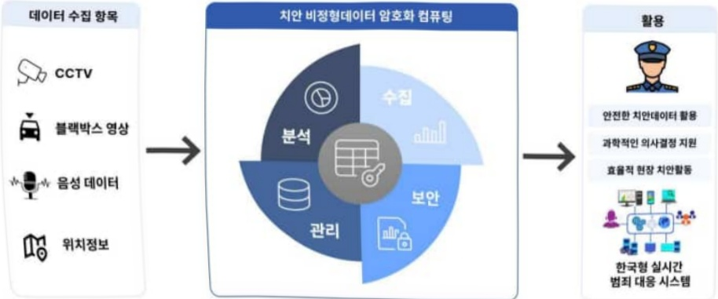
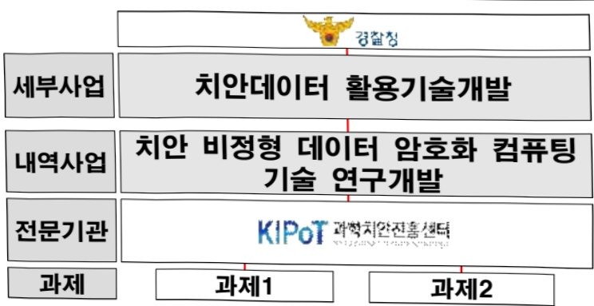

# 치안데이터활용기술개발(R&D)

**해당 페이지**: PDF 125 ~ 131 쪽 해당

**부처**: 경찰청
**분야**: 공공질서 및 안전
**회계유형**: 일반회계
**2026 확정예산**: 1560.0 백만원
**전년대비 증감률**: None%
**AI 도메인**: 법률/치안

---

### 가.예산 총괄표

(단위:백만원,%)

<table border=1 style='margin: auto; word-wrap: break-word;'><tr><td rowspan="2">사업명</td><td rowspan="2">2024년 결산</td><td rowspan="2">2025년 예산 본예산(A)</td><td colspan="2">2026년</td><td rowspan="2">중감 (B-A)</td><td rowspan="2">(B-A)/A</td></tr><tr><td style='text-align: center; word-wrap: break-word;'>요구</td><td style='text-align: center; word-wrap: break-word;'>조정(B)</td></tr><tr><td style='text-align: center; word-wrap: break-word;'>치안데이터 활용기술개발 (R&amp;D)</td><td style='text-align: center; word-wrap: break-word;'>-</td><td style='text-align: center; word-wrap: break-word;'>-</td><td style='text-align: center; word-wrap: break-word;'>3,120</td><td style='text-align: center; word-wrap: break-word;'>1,560</td><td style='text-align: center; word-wrap: break-word;'>1,560</td><td style='text-align: center; word-wrap: break-word;'>순증</td></tr></table>

□ 내역사업별 예산 내역

(단위:백만원)

<table border=1 style='margin: auto; word-wrap: break-word;'><tr><td rowspan="3"></td><td colspan="5">2024</td><td colspan="7">2025(25.11월말)</td><td rowspan="3">2026예산</td></tr><tr><td rowspan="2">예산액(추정)</td><td rowspan="2">예산현액</td><td rowspan="2">집행액[설정해]</td><td rowspan="2">이월액</td><td rowspan="2">불용액</td><td rowspan="2">분예산</td><td rowspan="2">예산현액</td><td rowspan="2">집행액[설정해]</td><td colspan="2">전년도이월액제외</td><td rowspan="2">이월예상액</td><td rowspan="2">불용예상액</td></tr><tr><td style='text-align: center; word-wrap: break-word;'>예산현액</td><td style='text-align: center; word-wrap: break-word;'>집행액[설정해]</td></tr><tr><td style='text-align: center; word-wrap: break-word;'>ㅇ 기능별 분류(합계)</td><td style='text-align: center; word-wrap: break-word;'>-</td><td style='text-align: center; word-wrap: break-word;'>-</td><td style='text-align: center; word-wrap: break-word;'>-</td><td style='text-align: center; word-wrap: break-word;'>-</td><td style='text-align: center; word-wrap: break-word;'>-</td><td style='text-align: center; word-wrap: break-word;'>-</td><td style='text-align: center; word-wrap: break-word;'>-</td><td style='text-align: center; word-wrap: break-word;'>-</td><td style='text-align: center; word-wrap: break-word;'>-</td><td style='text-align: center; word-wrap: break-word;'>-</td><td style='text-align: center; word-wrap: break-word;'>-</td><td style='text-align: center; word-wrap: break-word;'>-</td><td style='text-align: center; word-wrap: break-word;'>1,560</td></tr><tr><td style='text-align: center; word-wrap: break-word;'>· 치안비정형데이터암호화컴퓨팅 기술개발</td><td style='text-align: center; word-wrap: break-word;'>-</td><td style='text-align: center; word-wrap: break-word;'>-</td><td style='text-align: center; word-wrap: break-word;'>-</td><td style='text-align: center; word-wrap: break-word;'>-</td><td style='text-align: center; word-wrap: break-word;'>-</td><td style='text-align: center; word-wrap: break-word;'>-</td><td style='text-align: center; word-wrap: break-word;'>-</td><td style='text-align: center; word-wrap: break-word;'>-</td><td style='text-align: center; word-wrap: break-word;'>-</td><td style='text-align: center; word-wrap: break-word;'>-</td><td style='text-align: center; word-wrap: break-word;'>-</td><td style='text-align: center; word-wrap: break-word;'>-</td><td style='text-align: center; word-wrap: break-word;'>1,500</td></tr><tr><td style='text-align: center; word-wrap: break-word;'>· 기획평가관리비</td><td style='text-align: center; word-wrap: break-word;'>-</td><td style='text-align: center; word-wrap: break-word;'>-</td><td style='text-align: center; word-wrap: break-word;'>-</td><td style='text-align: center; word-wrap: break-word;'>-</td><td style='text-align: center; word-wrap: break-word;'>-</td><td style='text-align: center; word-wrap: break-word;'>-</td><td style='text-align: center; word-wrap: break-word;'>-</td><td style='text-align: center; word-wrap: break-word;'>-</td><td style='text-align: center; word-wrap: break-word;'>-</td><td style='text-align: center; word-wrap: break-word;'>-</td><td style='text-align: center; word-wrap: break-word;'>-</td><td style='text-align: center; word-wrap: break-word;'>-</td><td style='text-align: center; word-wrap: break-word;'>60</td></tr></table>

---

### 나.사업설명자료

## 1 ) 사업목적·내용

- (①내역: 치안 비정형 데이터 암호화 컴퓨팅 기술개발) 암호화 컴퓨팅 알고리즘 및 데이터 처리기술과 암호화 컴퓨팅 AI 알고리즘을 개발하고 검증

1) 암호화 컴퓨팅 알고리즘 및 데이터 처리 기술 개발

2) 암호화 데이터 친화적 AI 알고리즘 개발 및 검증

< 치안 비정형 데이터 암호화 컴퓨팅 >

- (②내역: 기획평가관리비) 원활한 사업 추진을 위한 기획, 평가, 관리 등 소요 비용

## 2 ) 사업개요

□ 사업근거 및 추진경위

① 법령상 근거 및 조항 적시

- 국가경찰과 자치경찰의 조직 및 운영에 관한 법률 제3조(치안에 필요한 연구개발의 지원 등)

- 과학기술기본법 제16조의6(과학기술을 활용한 사회문제 해결)

- 지능정보화 기본법 제60조(안전성 보호조치)

- 국정과제 국민안전을 위한 법질서 확립 및 민생치안 역량 강화(예방중심 치안활동 강화,

치안 AI 혁신 신종범죄 대응역량 강화)

## ② 추진경위

- 경찰청 순 국관·산학연 대상 기술수요조사 실시('24. 3. ~ '24. 4.)

- 치안 비정형 데이터 암호화 컴퓨팅 기술 개발사업 기획연구('24.7. ~ '25.3.)

- 25~29 중기사업계획('25.1.)

---

## □ 주요내용

① 사업규모

- 사업기간 : '26~'29 / 사업비 168.38억(국고 156억 + 민간 12.38억)

- 최근 5년 간 투입된 사업비(예산액기준, 추경편성화 연도에는 추경포함)

<table border=1 style='margin: auto; word-wrap: break-word;'><tr><td style='text-align: center; word-wrap: break-word;'>연도</td><td style='text-align: center; word-wrap: break-word;'>2022</td><td style='text-align: center; word-wrap: break-word;'>2023</td><td style='text-align: center; word-wrap: break-word;'>2024</td><td style='text-align: center; word-wrap: break-word;'>2025</td><td style='text-align: center; word-wrap: break-word;'>2026</td></tr><tr><td style='text-align: center; word-wrap: break-word;'>사업비</td><td style='text-align: center; word-wrap: break-word;'>-</td><td style='text-align: center; word-wrap: break-word;'>-</td><td style='text-align: center; word-wrap: break-word;'>-</td><td style='text-align: center; word-wrap: break-word;'>-</td><td style='text-align: center; word-wrap: break-word;'>1,560</td></tr></table>

② 사업추진체계

- 사업시행방법 : 출연

- 사업시행주체 : 과학치안진흥센터

- 사업 수혜자 : 국민, 현장 경찰관, 대학, 출연연, 기업 등

- 보조, 융자, 출연, 출자 등의 경우 보조·융자 등 지원 비율 및 법적근거

<table border=1 style='margin: auto; word-wrap: break-word;'><tr><td style='text-align: center; word-wrap: break-word;'>내역사업명</td><td style='text-align: center; word-wrap: break-word;'>구분</td><td style='text-align: center; word-wrap: break-word;'>피보조·피출연 등 기관명</td><td style='text-align: center; word-wrap: break-word;'>지원 금액 (2026예산)</td><td style='text-align: center; word-wrap: break-word;'>지원 비율(%)</td><td style='text-align: center; word-wrap: break-word;'>보조율 법적근거 (해당 조항)</td></tr><tr><td style='text-align: center; word-wrap: break-word;'>치안비정형 데이터암호화 컴퓨팅기술 개발</td><td rowspan="2">출연</td><td rowspan="2">과학치안 진흥센터</td><td style='text-align: center; word-wrap: break-word;'>1,500</td><td style='text-align: center; word-wrap: break-word;'>100</td><td rowspan="2">- 국가경찰과 자치경찰의 조직 및 운영에 관한 법률 제33조</td></tr><tr><td style='text-align: center; word-wrap: break-word;'>기획평가 관리비</td><td style='text-align: center; word-wrap: break-word;'>60</td><td style='text-align: center; word-wrap: break-word;'>100</td></tr></table>

## 3 ) 2026년도 예산 산출 근거

① 치안 데이터 활용 기술 개발 : (25) 0 → (26) 1,500 백만원(순증)

1. 암호화 컴퓨팅 알고리즘 및 데이터 처리기술 개발 : 0 → 900백만원(순증)

2. 암호화 데이터 친화적 AI 알고리즘 개발 및 검증 : 0 → 600백만원(순증)

② 기획평가관리비 : (25) 0 → (26) 60백만원(순증)

1. 기획평가관리비 : 0 → 60백만원(순증)

---

## 4 ) 사업효과

□ 사업영향, 산출물 성과지표 등

1 '22~26년도 성과계획서 상 성과지표 및 최근 5년간 성과 달성도

※ '26년도 신규사업으로 기획보고서 상 목표지표를 작성

<table border=1 style='margin: auto; word-wrap: break-word;'><tr><td style='text-align: center; word-wrap: break-word;'>성과지표</td><td style='text-align: center; word-wrap: break-word;'>구분</td><td style='text-align: center; word-wrap: break-word;'>&#x27;22</td><td style='text-align: center; word-wrap: break-word;'>&#x27;23</td><td style='text-align: center; word-wrap: break-word;'>&#x27;24</td><td style='text-align: center; word-wrap: break-word;'>&#x27;25</td><td style='text-align: center; word-wrap: break-word;'>&#x27;26</td><td style='text-align: center; word-wrap: break-word;'>&#x27;26목표치산출근거</td><td style='text-align: center; word-wrap: break-word;'>측정산식(또는 측정방법)</td><td style='text-align: center; word-wrap: break-word;'>자료수집방법(또는 자료출처)</td></tr><tr><td rowspan="3">비정형 데이터암/복호화 속도(단위: 초)</td><td style='text-align: center; word-wrap: break-word;'>목표</td><td style='text-align: center; word-wrap: break-word;'>-</td><td style='text-align: center; word-wrap: break-word;'>-</td><td style='text-align: center; word-wrap: break-word;'>-</td><td style='text-align: center; word-wrap: break-word;'>-</td><td style='text-align: center; word-wrap: break-word;'>신규</td><td rowspan="3">&#x27;26년 신규사업</td><td rowspan="3">암호화 컴퓨팅 검증용 환경에서 테스트하고 성능 데이터를 수집하여 평가를 진행함</td><td rowspan="3">인증시험기관 시험성적서</td></tr><tr><td style='text-align: center; word-wrap: break-word;'>실적</td><td style='text-align: center; word-wrap: break-word;'>-</td><td style='text-align: center; word-wrap: break-word;'>-</td><td style='text-align: center; word-wrap: break-word;'>-</td><td style='text-align: center; word-wrap: break-word;'>-</td><td style='text-align: center; word-wrap: break-word;'>-</td></tr><tr><td style='text-align: center; word-wrap: break-word;'>달성도</td><td style='text-align: center; word-wrap: break-word;'>-</td><td style='text-align: center; word-wrap: break-word;'>-</td><td style='text-align: center; word-wrap: break-word;'>-</td><td style='text-align: center; word-wrap: break-word;'>-</td><td style='text-align: center; word-wrap: break-word;'>-</td></tr><tr><td rowspan="3">기존 암호화 데이터 전환 무결성(단위: %)</td><td style='text-align: center; word-wrap: break-word;'>목표</td><td style='text-align: center; word-wrap: break-word;'>-</td><td style='text-align: center; word-wrap: break-word;'>-</td><td style='text-align: center; word-wrap: break-word;'>-</td><td style='text-align: center; word-wrap: break-word;'>-</td><td style='text-align: center; word-wrap: break-word;'>신규</td><td rowspan="3">&#x27;26년 신규사업</td><td rowspan="3">암호화 컴퓨팅 검증용 환경에서 테스트하고 성능 데이터를 수집하여 평가를 진행함</td><td rowspan="3">인증시험기관 시험성적서</td></tr><tr><td style='text-align: center; word-wrap: break-word;'>실적</td><td style='text-align: center; word-wrap: break-word;'>-</td><td style='text-align: center; word-wrap: break-word;'>-</td><td style='text-align: center; word-wrap: break-word;'>-</td><td style='text-align: center; word-wrap: break-word;'>-</td><td style='text-align: center; word-wrap: break-word;'>-</td></tr><tr><td style='text-align: center; word-wrap: break-word;'>달성도</td><td style='text-align: center; word-wrap: break-word;'>-</td><td style='text-align: center; word-wrap: break-word;'>-</td><td style='text-align: center; word-wrap: break-word;'>-</td><td style='text-align: center; word-wrap: break-word;'>-</td><td style='text-align: center; word-wrap: break-word;'>-</td></tr><tr><td rowspan="3">암호화된 객체인식 모델 속도(단위: 초)</td><td style='text-align: center; word-wrap: break-word;'>목표</td><td style='text-align: center; word-wrap: break-word;'>-</td><td style='text-align: center; word-wrap: break-word;'>-</td><td style='text-align: center; word-wrap: break-word;'>-</td><td style='text-align: center; word-wrap: break-word;'>-</td><td style='text-align: center; word-wrap: break-word;'>신규</td><td rowspan="3">&#x27;26년 신규사업</td><td rowspan="3">암호화 컴퓨팅 검증용 환경에서 테스트하고 성능 데이터를 수집하여 평가를 진행함</td><td rowspan="3">인증시험기관 시험성적서</td></tr><tr><td style='text-align: center; word-wrap: break-word;'>실적</td><td style='text-align: center; word-wrap: break-word;'>-</td><td style='text-align: center; word-wrap: break-word;'>-</td><td style='text-align: center; word-wrap: break-word;'>-</td><td style='text-align: center; word-wrap: break-word;'>-</td><td style='text-align: center; word-wrap: break-word;'>-</td></tr><tr><td style='text-align: center; word-wrap: break-word;'>달성도</td><td style='text-align: center; word-wrap: break-word;'>-</td><td style='text-align: center; word-wrap: break-word;'>-</td><td style='text-align: center; word-wrap: break-word;'>-</td><td style='text-align: center; word-wrap: break-word;'>-</td><td style='text-align: center; word-wrap: break-word;'>-</td></tr><tr><td rowspan="3">암호화된 객체인식 모델 정확도(단위: %)</td><td style='text-align: center; word-wrap: break-word;'>목표</td><td style='text-align: center; word-wrap: break-word;'>-</td><td style='text-align: center; word-wrap: break-word;'>-</td><td style='text-align: center; word-wrap: break-word;'></td><td style='text-align: center; word-wrap: break-word;'></td><td style='text-align: center; word-wrap: break-word;'>신규</td><td rowspan="3">&#x27;26년 신규사업</td><td rowspan="3">암호화 컴퓨팅 검증용 환경에서 테스트하고 성능 데이터를 수집하여 평가를 진행함</td><td rowspan="3">인증시험기관 시험성적서</td></tr><tr><td style='text-align: center; word-wrap: break-word;'>실적</td><td style='text-align: center; word-wrap: break-word;'>-</td><td style='text-align: center; word-wrap: break-word;'>-</td><td style='text-align: center; word-wrap: break-word;'>-</td><td style='text-align: center; word-wrap: break-word;'>-</td><td style='text-align: center; word-wrap: break-word;'>-</td></tr><tr><td style='text-align: center; word-wrap: break-word;'>달성도</td><td style='text-align: center; word-wrap: break-word;'>-</td><td style='text-align: center; word-wrap: break-word;'>-</td><td style='text-align: center; word-wrap: break-word;'>-</td><td style='text-align: center; word-wrap: break-word;'>-</td><td style='text-align: center; word-wrap: break-word;'>-</td></tr><tr><td rowspan="3">암호화된 음성 인식 오류율(단위: %)</td><td style='text-align: center; word-wrap: break-word;'>목표</td><td style='text-align: center; word-wrap: break-word;'>-</td><td style='text-align: center; word-wrap: break-word;'>-</td><td style='text-align: center; word-wrap: break-word;'>-</td><td style='text-align: center; word-wrap: break-word;'>-</td><td style='text-align: center; word-wrap: break-word;'>신규</td><td rowspan="3">&#x27;26년 신규사업</td><td rowspan="3">암호화 컴퓨팅 검증용 환경에서 테스트하고 성능 데이터를 수집하여 평가를 진행함</td><td rowspan="3">인증시험기관 시험성적서</td></tr><tr><td style='text-align: center; word-wrap: break-word;'>실적</td><td style='text-align: center; word-wrap: break-word;'>-</td><td style='text-align: center; word-wrap: break-word;'>-</td><td style='text-align: center; word-wrap: break-word;'>-</td><td style='text-align: center; word-wrap: break-word;'>-</td><td style='text-align: center; word-wrap: break-word;'>-</td></tr><tr><td style='text-align: center; word-wrap: break-word;'>달성도</td><td style='text-align: center; word-wrap: break-word;'>-</td><td style='text-align: center; word-wrap: break-word;'>-</td><td style='text-align: center; word-wrap: break-word;'>-</td><td style='text-align: center; word-wrap: break-word;'>-</td><td style='text-align: center; word-wrap: break-word;'>-</td></tr><tr><td rowspan="3">암호화된 자연어 처리 모델 정확도(단위: %)</td><td style='text-align: center; word-wrap: break-word;'>목표</td><td style='text-align: center; word-wrap: break-word;'>-</td><td style='text-align: center; word-wrap: break-word;'>-</td><td style='text-align: center; word-wrap: break-word;'>-</td><td style='text-align: center; word-wrap: break-word;'>-</td><td style='text-align: center; word-wrap: break-word;'>신규</td><td rowspan="3">&#x27;26년 신규사업</td><td rowspan="3">암호화 컴퓨팅 검증용 환경에서 테스트하고 성능 데이터를 수집하여 평가를 진행함</td><td rowspan="3">인증시험기관 시험성적서</td></tr><tr><td style='text-align: center; word-wrap: break-word;'>실적</td><td style='text-align: center; word-wrap: break-word;'>-</td><td style='text-align: center; word-wrap: break-word;'>-</td><td style='text-align: center; word-wrap: break-word;'>-</td><td style='text-align: center; word-wrap: break-word;'>-</td><td style='text-align: center; word-wrap: break-word;'>-</td></tr><tr><td style='text-align: center; word-wrap: break-word;'>달성도</td><td style='text-align: center; word-wrap: break-word;'>-</td><td style='text-align: center; word-wrap: break-word;'>-</td><td style='text-align: center; word-wrap: break-word;'>-</td><td style='text-align: center; word-wrap: break-word;'>-</td><td style='text-align: center; word-wrap: break-word;'>-</td></tr></table>

② 성과지표 이외의 연도별 사업추진 경과 및 실적: 해당사항 없음

③ 향후(26년도 이후) 기대효과

- 본 사업을 통해서 최참단 암호화 컴퓨팅 기술을 통한 개인정보 보호 강화 및 한국형 실시간 범죄 대응 시스템 기반 기술개발을 통한 치안 확보

- (사업 주요 성과물) 암호화알고리즘 5종, 암호화 데이터 DBMS 1식, 암호화 데이터

친화적 AI 알고리즘 3종 등 확보

---

<table border=1 style='margin: auto; word-wrap: break-word;'><tr><td style='text-align: center; word-wrap: break-word;'>내역사업명</td><td style='text-align: center; word-wrap: break-word;'>과제</td><td style='text-align: center; word-wrap: break-word;'>최종 성과물</td></tr><tr><td rowspan="2">치안 비정형 데이터 암호화 컴퓨팅 기술 연구개발</td><td style='text-align: center; word-wrap: break-word;'>암호화 컴퓨팅 알고리즘 및 데이터 처리 기술 개발</td><td style='text-align: center; word-wrap: break-word;'>○ 암호화 알고리즘 5종 - 기존 암호화데이터의 암호화 전환 알고리즘 1종 - 영상데이터 암호화 알고리즘 1종 - 음성데이터 암호화 알고리즘 1종 - 텍스트데이터 암호화 알고리즘 1종 - 비정형데이터 벡터 전환 임베딩 알고리즘 1종 ○ 암호화 데이터 DBMS 1식</td></tr><tr><td style='text-align: center; word-wrap: break-word;'>암호화 데이터 친화적 AI 알고리즘 개발 및 검증</td><td style='text-align: center; word-wrap: break-word;'>○ 암호화 데이터 친화적 AI 알고리즘 3종 - 암호화된 영상데이터 친화적 AI 알고리즘 1종 - 암호화된 음성데이터 친화적 AI 알고리즘 1종 - 암호화된 텍스트데이터 친화적 AI 알고리즘 1종 ○ 검증 결과보고서 1식</td></tr></table>

5) 타당성조사 및 예비타당성조사 시행여부 및 결과 요지: 해당사항 없음

6) 총사업비 대상사업 여부 및 내역 : 해당사항 없음

7) 사업 집행절차

① 치안 비정형 데이터 암호화 컴퓨팅 기술개발

<table border=1 style='margin: auto; word-wrap: break-word;'><tr><td style='text-align: center; word-wrap: break-word;'>부처</td><td style='text-align: center; word-wrap: break-word;'></td><td style='text-align: center; word-wrap: break-word;'>피출연·피보조기관</td><td style='text-align: center; word-wrap: break-word;'></td><td style='text-align: center; word-wrap: break-word;'>간접보조사업자·사업수행자</td></tr><tr><td style='text-align: center; word-wrap: break-word;'>경찰청(1,500백만원)</td><td style='text-align: center; word-wrap: break-word;'>=&gt;(1,500백만원)</td><td style='text-align: center; word-wrap: break-word;'>과학치안 진흥센터(-)</td><td style='text-align: center; word-wrap: break-word;'>=&gt;(1,500백만원)</td><td style='text-align: center; word-wrap: break-word;'>미정(&#x27;26년 선정)</td></tr></table>

② 기획평가관리비

<table border=1 style='margin: auto; word-wrap: break-word;'><tr><td style='text-align: center; word-wrap: break-word;'>부처</td><td style='text-align: center; word-wrap: break-word;'></td><td style='text-align: center; word-wrap: break-word;'>피출연·피보조기관</td><td style='text-align: center; word-wrap: break-word;'></td><td style='text-align: center; word-wrap: break-word;'>간접보조사업자·사업수행자</td></tr><tr><td style='text-align: center; word-wrap: break-word;'>경찰청(60백만원)</td><td style='text-align: center; word-wrap: break-word;'>=&gt;(60백만원)</td><td style='text-align: center; word-wrap: break-word;'>과학치안진흥센터(60백만원)</td><td style='text-align: center; word-wrap: break-word;'>=&gt;(-)</td><td style='text-align: center; word-wrap: break-word;'>-</td></tr></table>

---

### 다.최근 4년간 결산내역

## 1 ) 결산표

☐ 부처 결산내역 : 해당사항 없음

□출연·보조사업 등 실집행내역 : 해당사항 없음

## 2 ) 주요 결산사항

2022년~2025년 결산사항 : 해당사항 없음

2025년 이·전용 등 세부내역 : 해당사항 없음

2025년 예비비 배정 세부내역 : 해당사항 없음

---

<table border=1 style='margin: auto; word-wrap: break-word;'><tr><td style='text-align: center; word-wrap: break-word;'>사 업 명</td></tr><tr><td style='text-align: center; word-wrap: break-word;'>형사·교통·여성청소년범죄 수사역량강화 (1231-313)</td></tr></table>

## □ 사업 코드 정보

<table border=1 style='margin: auto; word-wrap: break-word;'><tr><td style='text-align: center; word-wrap: break-word;'>구분</td><td style='text-align: center; word-wrap: break-word;'>회계</td><td style='text-align: center; word-wrap: break-word;'>소관</td><td style='text-align: center; word-wrap: break-word;'>실국(기관)</td><td style='text-align: center; word-wrap: break-word;'>계정</td><td style='text-align: center; word-wrap: break-word;'>분야</td><td style='text-align: center; word-wrap: break-word;'>부문</td></tr><tr><td style='text-align: center; word-wrap: break-word;'>코드</td><td rowspan="2">일반회계</td><td rowspan="2">경찰청</td><td rowspan="2">형사국</td><td rowspan="2"></td><td style='text-align: center; word-wrap: break-word;'>020</td><td style='text-align: center; word-wrap: break-word;'>023</td></tr><tr><td style='text-align: center; word-wrap: break-word;'>명칭</td><td style='text-align: center; word-wrap: break-word;'>공공질서및안전</td><td style='text-align: center; word-wrap: break-word;'>경찰</td></tr></table>

<table border=1 style='margin: auto; word-wrap: break-word;'><tr><td style='text-align: center; word-wrap: break-word;'>구분</td><td style='text-align: center; word-wrap: break-word;'>프로그램</td><td style='text-align: center; word-wrap: break-word;'>단위사업</td><td style='text-align: center; word-wrap: break-word;'>세부사업</td></tr><tr><td style='text-align: center; word-wrap: break-word;'>코드</td><td style='text-align: center; word-wrap: break-word;'>1200</td><td style='text-align: center; word-wrap: break-word;'>1231</td><td style='text-align: center; word-wrap: break-word;'>313</td></tr><tr><td style='text-align: center; word-wrap: break-word;'>명칭</td><td style='text-align: center; word-wrap: break-word;'>범죄수사활동</td><td style='text-align: center; word-wrap: break-word;'>수사지원 및 수사역량강화</td><td style='text-align: center; word-wrap: break-word;'>형사·교통·여성청소년범죄 수사역량강화</td></tr></table>

☐ 사업 성격

<table border=1 style='margin: auto; word-wrap: break-word;'><tr><td rowspan="2">신규</td><td rowspan="2">계속</td><td rowspan="2">완료</td><td rowspan="2">예비타당성 실시여부</td><td rowspan="2">총사업비 관리대상</td><td rowspan="2">총액계상 예산사업</td><td style='text-align: center; word-wrap: break-word;'>사업소관 변경정보</td></tr><tr><td style='text-align: center; word-wrap: break-word;'>2025예산 시 소관</td></tr><tr><td style='text-align: center; word-wrap: break-word;'></td><td style='text-align: center; word-wrap: break-word;'>○</td><td style='text-align: center; word-wrap: break-word;'></td><td style='text-align: center; word-wrap: break-word;'></td><td style='text-align: center; word-wrap: break-word;'></td><td style='text-align: center; word-wrap: break-word;'></td><td style='text-align: center; word-wrap: break-word;'></td></tr></table>

□ 사업 지원 형태 및 지원을

<table border=1 style='margin: auto; word-wrap: break-word;'><tr><td style='text-align: center; word-wrap: break-word;'>직접</td><td style='text-align: center; word-wrap: break-word;'>출자</td><td style='text-align: center; word-wrap: break-word;'>출연</td><td style='text-align: center; word-wrap: break-word;'>보조</td><td style='text-align: center; word-wrap: break-word;'>융자</td><td style='text-align: center; word-wrap: break-word;'>국고보조율(%)</td><td style='text-align: center; word-wrap: break-word;'>융자율(%)</td></tr><tr><td style='text-align: center; word-wrap: break-word;'>○</td><td style='text-align: center; word-wrap: break-word;'></td><td style='text-align: center; word-wrap: break-word;'></td><td style='text-align: center; word-wrap: break-word;'></td><td style='text-align: center; word-wrap: break-word;'></td><td style='text-align: center; word-wrap: break-word;'></td><td style='text-align: center; word-wrap: break-word;'></td></tr></table>

## 사업담당자

<table border=1 style='margin: auto; word-wrap: break-word;'><tr><td style='text-align: center; word-wrap: break-word;'>사업명</td><td colspan="2">구분</td></tr><tr><td rowspan="2">형사·교통·여성칭소년범죄수사역량강화</td><td style='text-align: center; word-wrap: break-word;'>소관부처</td><td style='text-align: center; word-wrap: break-word;'>형사국</td></tr><tr><td style='text-align: center; word-wrap: break-word;'>사업시행주체</td><td style='text-align: center; word-wrap: break-word;'>강력범죄수사과</td></tr></table>

---

### 원본 PDF 크롭 이미지

