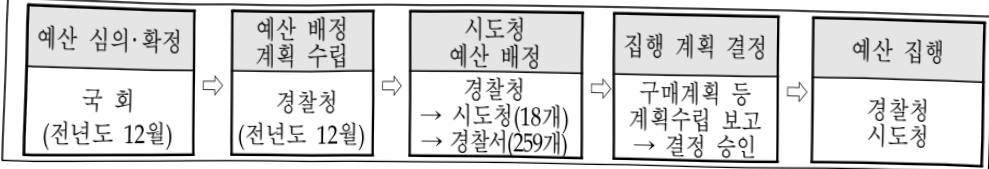

# 형사·교통여성·청소년범죄수사역량강화

**해당 페이지**: PDF 132 ~ 141 쪽 해당

**부처**: 경찰청
**분야**: 공공질서 및 안전
**회계유형**: 일반회계
**2026 확정예산**: 19620.0 백만원
**전년대비 증감률**: -0.2%
**AI 도메인**: 법률/치안

---

<table border=1 style='margin: auto; word-wrap: break-word;'><tr><td style='text-align: center; word-wrap: break-word;'>사 업 명</td></tr><tr><td style='text-align: center; word-wrap: break-word;'>형사·교통·여성청소년범죄 수사역량강화 (1231-313)</td></tr></table>

## □ 사업 코드 정보

<table border=1 style='margin: auto; word-wrap: break-word;'><tr><td style='text-align: center; word-wrap: break-word;'>구분</td><td style='text-align: center; word-wrap: break-word;'>회계</td><td style='text-align: center; word-wrap: break-word;'>소관</td><td style='text-align: center; word-wrap: break-word;'>실국(기관)</td><td style='text-align: center; word-wrap: break-word;'>계정</td><td style='text-align: center; word-wrap: break-word;'>분야</td><td style='text-align: center; word-wrap: break-word;'>부문</td></tr><tr><td style='text-align: center; word-wrap: break-word;'>코드</td><td rowspan="2">일반회계</td><td rowspan="2">경찰청</td><td rowspan="2">형사국</td><td rowspan="2"></td><td style='text-align: center; word-wrap: break-word;'>020</td><td style='text-align: center; word-wrap: break-word;'>023</td></tr><tr><td style='text-align: center; word-wrap: break-word;'>명칭</td><td style='text-align: center; word-wrap: break-word;'>공공질서및안전</td><td style='text-align: center; word-wrap: break-word;'>경찰</td></tr></table>

<table border=1 style='margin: auto; word-wrap: break-word;'><tr><td style='text-align: center; word-wrap: break-word;'>구분</td><td style='text-align: center; word-wrap: break-word;'>프로그램</td><td style='text-align: center; word-wrap: break-word;'>단위사업</td><td style='text-align: center; word-wrap: break-word;'>세부사업</td></tr><tr><td style='text-align: center; word-wrap: break-word;'>코드</td><td style='text-align: center; word-wrap: break-word;'>1200</td><td style='text-align: center; word-wrap: break-word;'>1231</td><td style='text-align: center; word-wrap: break-word;'>313</td></tr><tr><td style='text-align: center; word-wrap: break-word;'>명칭</td><td style='text-align: center; word-wrap: break-word;'>범죄수사활동</td><td style='text-align: center; word-wrap: break-word;'>수사지원 및 수사역량강화</td><td style='text-align: center; word-wrap: break-word;'>형사·교통·여성청소년범죄 수사역량강화</td></tr></table>

☐ 사업 성격

<table border=1 style='margin: auto; word-wrap: break-word;'><tr><td rowspan="2">신규</td><td rowspan="2">계속</td><td rowspan="2">완료</td><td rowspan="2">예비타당성 실시여부</td><td rowspan="2">총사업비 관리대상</td><td rowspan="2">총액계상 예산사업</td><td style='text-align: center; word-wrap: break-word;'>사업소관 변경정보</td></tr><tr><td style='text-align: center; word-wrap: break-word;'>2025예산 시 소관</td></tr><tr><td style='text-align: center; word-wrap: break-word;'></td><td style='text-align: center; word-wrap: break-word;'>○</td><td style='text-align: center; word-wrap: break-word;'></td><td style='text-align: center; word-wrap: break-word;'></td><td style='text-align: center; word-wrap: break-word;'></td><td style='text-align: center; word-wrap: break-word;'></td><td style='text-align: center; word-wrap: break-word;'></td></tr></table>

□ 사업 지원 형태 및 지원을

<table border=1 style='margin: auto; word-wrap: break-word;'><tr><td style='text-align: center; word-wrap: break-word;'>직접</td><td style='text-align: center; word-wrap: break-word;'>출자</td><td style='text-align: center; word-wrap: break-word;'>출연</td><td style='text-align: center; word-wrap: break-word;'>보조</td><td style='text-align: center; word-wrap: break-word;'>융자</td><td style='text-align: center; word-wrap: break-word;'>국고보조율(%)</td><td style='text-align: center; word-wrap: break-word;'>융자율(%)</td></tr><tr><td style='text-align: center; word-wrap: break-word;'>○</td><td style='text-align: center; word-wrap: break-word;'></td><td style='text-align: center; word-wrap: break-word;'></td><td style='text-align: center; word-wrap: break-word;'></td><td style='text-align: center; word-wrap: break-word;'></td><td style='text-align: center; word-wrap: break-word;'></td><td style='text-align: center; word-wrap: break-word;'></td></tr></table>

## 사업담당자

<table border=1 style='margin: auto; word-wrap: break-word;'><tr><td style='text-align: center; word-wrap: break-word;'>사업명</td><td colspan="2">구분</td></tr><tr><td rowspan="2">형사·교통·여성칭소년범죄수사역량강화</td><td style='text-align: center; word-wrap: break-word;'>소관부처</td><td style='text-align: center; word-wrap: break-word;'>형사국</td></tr><tr><td style='text-align: center; word-wrap: break-word;'>사업시행주체</td><td style='text-align: center; word-wrap: break-word;'>강력범죄수사과</td></tr></table>

---

### 가. 예산 총괄표

(단위: 백만원, %)

<table border=1 style='margin: auto; word-wrap: break-word;'><tr><td rowspan="2">사업명</td><td rowspan="2">2024년 결산</td><td colspan="2">2025년 예산</td><td colspan="2">2026년</td><td rowspan="2">증감(B-A)</td><td rowspan="2">(B-A)/A</td></tr><tr><td style='text-align: center; word-wrap: break-word;'>본예산(A)</td><td style='text-align: center; word-wrap: break-word;'>추경</td><td style='text-align: center; word-wrap: break-word;'>요구</td><td style='text-align: center; word-wrap: break-word;'>조정(B)</td></tr><tr><td style='text-align: center; word-wrap: break-word;'>형사·교통·여성 청소년범죄 수사역량강화</td><td style='text-align: center; word-wrap: break-word;'>24,120</td><td style='text-align: center; word-wrap: break-word;'>19,660</td><td style='text-align: center; word-wrap: break-word;'>19,660</td><td style='text-align: center; word-wrap: break-word;'>21,570</td><td style='text-align: center; word-wrap: break-word;'>19,620</td><td style='text-align: center; word-wrap: break-word;'>△40</td><td style='text-align: center; word-wrap: break-word;'>△0.2</td></tr></table>

□ 내역사업별 예산 내역

(단위:백만원)

<table border=1 style='margin: auto; word-wrap: break-word;'><tr><td rowspan="3"></td><td colspan="5">2024</td><td colspan="7">2025(2025.11월말)</td><td rowspan="3">2026예산</td></tr><tr><td rowspan="2">예산액(추경)</td><td rowspan="2">예산현액</td><td rowspan="2">집행액[삼첩액]</td><td rowspan="2">이월액</td><td rowspan="2">불용액</td><td rowspan="2">본예산</td><td rowspan="2">예산현액</td><td rowspan="2">집행액[삼첩액]</td><td colspan="2">전년도 이월액제외</td><td rowspan="2">이월예산액</td><td rowspan="2">불용예산액</td></tr><tr><td style='text-align: center; word-wrap: break-word;'>예산현액</td><td style='text-align: center; word-wrap: break-word;'>집행액[삼첩액]</td></tr><tr><td style='text-align: center; word-wrap: break-word;'>ㅇ기능별 분류(합계)</td><td style='text-align: center; word-wrap: break-word;'>24,120</td><td style='text-align: center; word-wrap: break-word;'>24,117</td><td style='text-align: center; word-wrap: break-word;'>22,623</td><td style='text-align: center; word-wrap: break-word;'>105</td><td style='text-align: center; word-wrap: break-word;'>1,389</td><td style='text-align: center; word-wrap: break-word;'>19,660</td><td style='text-align: center; word-wrap: break-word;'>19,745</td><td style='text-align: center; word-wrap: break-word;'>13,629</td><td style='text-align: center; word-wrap: break-word;'>19,660</td><td style='text-align: center; word-wrap: break-word;'>13,524</td><td style='text-align: center; word-wrap: break-word;'>-</td><td style='text-align: center; word-wrap: break-word;'>-</td><td style='text-align: center; word-wrap: break-word;'>19,620</td></tr><tr><td style='text-align: center; word-wrap: break-word;'>·형사활동 지원</td><td style='text-align: center; word-wrap: break-word;'>4,269</td><td style='text-align: center; word-wrap: break-word;'>4,551</td><td style='text-align: center; word-wrap: break-word;'>4,260</td><td style='text-align: center; word-wrap: break-word;'>-</td><td style='text-align: center; word-wrap: break-word;'>332</td><td style='text-align: center; word-wrap: break-word;'>2,078</td><td style='text-align: center; word-wrap: break-word;'>2,078</td><td style='text-align: center; word-wrap: break-word;'>1,404</td><td style='text-align: center; word-wrap: break-word;'>2,078</td><td style='text-align: center; word-wrap: break-word;'>1,404</td><td style='text-align: center; word-wrap: break-word;'>-</td><td style='text-align: center; word-wrap: break-word;'>-</td><td style='text-align: center; word-wrap: break-word;'>2,891</td></tr><tr><td style='text-align: center; word-wrap: break-word;'>·사회적약자대상범죄전담수사팀역량강화</td><td style='text-align: center; word-wrap: break-word;'>3,774</td><td style='text-align: center; word-wrap: break-word;'>3,884</td><td style='text-align: center; word-wrap: break-word;'>3,665</td><td style='text-align: center; word-wrap: break-word;'>-</td><td style='text-align: center; word-wrap: break-word;'>222</td><td style='text-align: center; word-wrap: break-word;'>3,776</td><td style='text-align: center; word-wrap: break-word;'>3,776</td><td style='text-align: center; word-wrap: break-word;'>3,068</td><td style='text-align: center; word-wrap: break-word;'>3,776</td><td style='text-align: center; word-wrap: break-word;'>3,068</td><td style='text-align: center; word-wrap: break-word;'>-</td><td style='text-align: center; word-wrap: break-word;'>-</td><td style='text-align: center; word-wrap: break-word;'>2,095</td></tr><tr><td style='text-align: center; word-wrap: break-word;'>·성범죄 신상정보 등록 대상자 관리</td><td style='text-align: center; word-wrap: break-word;'>1,720</td><td style='text-align: center; word-wrap: break-word;'>1,720</td><td style='text-align: center; word-wrap: break-word;'>1,580</td><td style='text-align: center; word-wrap: break-word;'>-</td><td style='text-align: center; word-wrap: break-word;'>140</td><td style='text-align: center; word-wrap: break-word;'>2,598</td><td style='text-align: center; word-wrap: break-word;'>2,598</td><td style='text-align: center; word-wrap: break-word;'>-</td><td style='text-align: center; word-wrap: break-word;'>2,598</td><td style='text-align: center; word-wrap: break-word;'>-</td><td style='text-align: center; word-wrap: break-word;'>-</td><td style='text-align: center; word-wrap: break-word;'>-</td><td style='text-align: center; word-wrap: break-word;'>2,332</td></tr><tr><td style='text-align: center; word-wrap: break-word;'>·사회적약자대상범죄 피해자 지원</td><td style='text-align: center; word-wrap: break-word;'>2,725</td><td style='text-align: center; word-wrap: break-word;'>2,725</td><td style='text-align: center; word-wrap: break-word;'>2,720</td><td style='text-align: center; word-wrap: break-word;'>-</td><td style='text-align: center; word-wrap: break-word;'>5</td><td style='text-align: center; word-wrap: break-word;'>2,598</td><td style='text-align: center; word-wrap: break-word;'>2,598</td><td style='text-align: center; word-wrap: break-word;'>1,682</td><td style='text-align: center; word-wrap: break-word;'>2,598</td><td style='text-align: center; word-wrap: break-word;'>1,682</td><td style='text-align: center; word-wrap: break-word;'>-</td><td style='text-align: center; word-wrap: break-word;'>-</td><td style='text-align: center; word-wrap: break-word;'>2,332</td></tr><tr><td style='text-align: center; word-wrap: break-word;'>·조직범죄 수사활동 지원</td><td style='text-align: center; word-wrap: break-word;'>3,769</td><td style='text-align: center; word-wrap: break-word;'>3,766</td><td style='text-align: center; word-wrap: break-word;'>3,594</td><td style='text-align: center; word-wrap: break-word;'>105</td><td style='text-align: center; word-wrap: break-word;'>67</td><td style='text-align: center; word-wrap: break-word;'>8,364</td><td style='text-align: center; word-wrap: break-word;'>8,469</td><td style='text-align: center; word-wrap: break-word;'>5,055</td><td style='text-align: center; word-wrap: break-word;'>8,364</td><td style='text-align: center; word-wrap: break-word;'>4,950</td><td style='text-align: center; word-wrap: break-word;'>-</td><td style='text-align: center; word-wrap: break-word;'>-</td><td style='text-align: center; word-wrap: break-word;'>9,458</td></tr><tr><td style='text-align: center; word-wrap: break-word;'>·과학분석을 통한 정밀한 교통사고조사</td><td style='text-align: center; word-wrap: break-word;'>2,909</td><td style='text-align: center; word-wrap: break-word;'>2,909</td><td style='text-align: center; word-wrap: break-word;'>2,824</td><td style='text-align: center; word-wrap: break-word;'>-</td><td style='text-align: center; word-wrap: break-word;'>85</td><td style='text-align: center; word-wrap: break-word;'>1,680</td><td style='text-align: center; word-wrap: break-word;'>1,680</td><td style='text-align: center; word-wrap: break-word;'>1,366</td><td style='text-align: center; word-wrap: break-word;'>1,680</td><td style='text-align: center; word-wrap: break-word;'>1,366</td><td style='text-align: center; word-wrap: break-word;'>-</td><td style='text-align: center; word-wrap: break-word;'>-</td><td style='text-align: center; word-wrap: break-word;'>1,680</td></tr><tr><td style='text-align: center; word-wrap: break-word;'>·교통사고조사 운영</td><td style='text-align: center; word-wrap: break-word;'>4,954</td><td style='text-align: center; word-wrap: break-word;'>4,562</td><td style='text-align: center; word-wrap: break-word;'>3,980</td><td style='text-align: center; word-wrap: break-word;'>-</td><td style='text-align: center; word-wrap: break-word;'>538</td><td style='text-align: center; word-wrap: break-word;'>1,164</td><td style='text-align: center; word-wrap: break-word;'>1,164</td><td style='text-align: center; word-wrap: break-word;'>1,054</td><td style='text-align: center; word-wrap: break-word;'>1,164</td><td style='text-align: center; word-wrap: break-word;'>1,054</td><td style='text-align: center; word-wrap: break-word;'>-</td><td style='text-align: center; word-wrap: break-word;'>-</td><td style='text-align: center; word-wrap: break-word;'>1,164</td></tr></table>

---

### 나. 사업설명자료

## 1 ) 사업목적·내용

① (형사활동지원) 형사활동 지원으로 강절도 등 서민생활 침해 민생범죄 및 살인·공중 협박·이상동기 범죄 등 사회적 불안을 야기하는 강력범죄 근절

② (사회적약자 대상 범죄 전담 여청수사팀 역량강화) 여성·아동 등 사회적 약자를 대상으로한 성폭력·가정폭력·스토킹 등 범죄 대응력 강화를 위한 수사활동 지원

③ (사회적약자 대상 범죄피해자 지원) 성폭력피해자 조사 시 진술분석 전문가·속기사 참여 등 사회적약자 대상 피해자에 대한 수사활동 지원

④ (마약조직피성 범죄수사활동 지원) 마약범죄 근절을 위한 첨단 수사장비 지원 및 시스템 구축, 외국인 범죄 및 피싱범죄 수사 지원으로 조직범죄 수사활동 지원

⑤ (과학분석을 통한 정밀한 교통사고 조사) 급속히 변화하는 교통환경에 맞는 체계적·전문적 교육, 교통사고 분석장비 구입 등 교통사고 분석 능력 제고

⑥(교통사고조사운영)공정한 사고처리를 위한 현장 수사장비 지원으로 교통수사역량 강화

## 2 ) 사업개요

## □ 사업근거 및 추진경위

① 법령상 근거 조항 적시

-형사소송법 제195조(검사와 사법경찰관의 관계 등)

- 경찰관직무집행법 제2조(직무의 범위)

- 성폭력 범죄의 처벌 등에 관한 특례법 제29조(수사 및 재판절차에서의 배려)

- 성폭력 범죄의 처벌 등에 관한 특례법 제30조(영상물의 촬영·보존 등)

· 성폭력 범죄의 처벌 등에 관한 특례법 제3조(전문가 의견 조회)

- 성폭력 범죄의 처벌 등에 관한 특례법 제36조(진술조련인의 수사과정 참여)

-아동·청소년의 성보호에 관한 법률 제25조(수사 및 재판 절차에서의 배려)

- 아동·청소년의 성보호에 관한 법률 제26조(영상물의 촬영·보존 등)

- 성폭력방지 및 피해자보호 등에 관한 법률 제18조(피해자를 위한 통합지원센터의 설치·운영)

## ② 추진경위

- '21. 5. 110대 국정과제 '69. 국민이 안심하는 생활안전 확보'

- '21. 1. 국가수사본부 형사국 신설로, 기존 수사국(형사)·생안국(여청수사)·외사국(국제수사)·교통국(교통조사) 인력 이관

- '24. 2. 형사국으로 기존 수사국(피싱) 인력 이관, 공조수사계 신설

- △사회적 약자 대상 현장 수사활동 지원 △적법절차 준수 및 인권보호를 위한 수사장비 도입 △수사제도 개선 등 추진으로 형사·교통·여성청소년범죄 수사역량 강화 및 치안서비스·국민 체감 안전도 제고

---

## □ 주요내용

① 사업규모

- 종사업비 : 해당 없음

- 사업기간 : 계속

-최근 5년간 투입된 사업비

<table border=1 style='margin: auto; word-wrap: break-word;'><tr><td style='text-align: center; word-wrap: break-word;'>연도</td><td style='text-align: center; word-wrap: break-word;'>2022</td><td style='text-align: center; word-wrap: break-word;'>2023</td><td style='text-align: center; word-wrap: break-word;'>2024</td><td style='text-align: center; word-wrap: break-word;'>2025</td><td style='text-align: center; word-wrap: break-word;'>2026</td></tr><tr><td style='text-align: center; word-wrap: break-word;'>사업비</td><td style='text-align: center; word-wrap: break-word;'>24,230</td><td style='text-align: center; word-wrap: break-word;'>26,191</td><td style='text-align: center; word-wrap: break-word;'>24,120</td><td style='text-align: center; word-wrap: break-word;'>19,660</td><td style='text-align: center; word-wrap: break-word;'>19,620</td></tr></table>

- 기타 : 해당 없음

② 사업추진체계

- 사업시행방법 : 직접수행

- 사업시행주체 : 경찰청

-사업 수혜자 : 국민(사회적 약자 등)

- 보조, 옵자, 출연, 출자 등의 경우 보조·옵자 등 지원 비율 및 법적근거 : 해당 없음

---

## 3 ) 2026년도 예산 산출 근거

### ☐ 형사활동지원 : (2025 본예산) 2,078백만원 → (2026 예산) 2,891백만원, 39.1%

## ①형사기동대 운영지원

: (2025 본예산) 840백만원 → (2026) 853백만원, 13백만원 증액

- (요구) 청사관리 및 수사장비·소모성물품 구매 등 형사기동대 수사활동 지원

- (산출) 840백만원

## ② 변사사건 보호장비

:(2025 본예산) 255백만원 → (2026) 355백만원, 100백만원 증액

- (요구) 변사사건 처리 시에 사용하는 장비 및 소모품 구매비용으로써 ▲마스크 ▲보호복 ▲니트릴 장갑 ▲신발 커버 ▲일회용고글 ▲물티슈 등 구매, 구매물품 단가 현실화 및 변사건수 증가로 인한 증액 요구

- (산출) 355백만원

## ③ 미제 살인사건 DB시스템 유지보수

: (2025 본예산) 65백만원 → (2026) 65백만원, 전년동

- (요구) 미제 살인사건 DB시스템의 원활한 운용을 위한 관리 및 유지보수

- (산출) 65백만원

## ④ 실종수색 상황관리 시스템 유지보수

: (2025 본예산) 58백만원 → (2026) 58백만원, 전년동

- (요구) 실종수색 상황관리 시스템의 원활한 운용을 위한 관리 및 유지보수

- (산출) 58백만원

## ⑤ CCTV 영상분석 프로그램

## : (2025 본예산) 860백만원 → (2026) 1,560백만원, 700백만원 증액

- (요구) 안면정보 추출·피의자 특정·동선 추적 등 기능의 영상분석 프로그램을 보급하여 피의자 검거를 위한 수사활동 지원, 강력범죄에 대한 범국민 치안서비스 품질 제고를 위한 경찰서 형사팀 보급 필요

- (산출) 1,560백만원

□ 사회적약자대상 범죄전담 여청수사팀 역량강화 : (2025 본예산) 3,776백만원 → (2026 예산) 2,095백만원, △44.5%

## ① 여청수사관 교육경비

:(2025 본예산) 222백만원 → (2026) 222백만원, 전년동

- (요구) 여청수사는 물적 증거확보가 어려워 초기 수사가 중요하고, 2차 피해 방지를 위한 수사관의 태도·화법에 대한 교육이 필요하며, 최근 관련 법률「스토킹처벌법」、「성폭력처벌법」개정 등 급변하는 여건에 적절히 대응하기 위하여 다양한 교육 필요

- (산출) 222백만원

## ② 진술녹화실 개선

: (2025 본예산) 379백만원 → (2026) 0백만원, 순감

※ 수사인권담당관실로 사업 이관에 따른 감액

---

## ③ 여청수사 증거관리 물품 구매

: (2025 본예산) 514백만원 → (2026) 514백만원, 전년동

- (요구) 성폭력·아동학대는 암수성과 밀실성으로 인해 혐의 구증을 위한 세심한 증거물 확보·관리·활용을 위한 △아동학대 새별 저장장치 △성폭력범죄 DNA 시료 보관·채취를 위한 키트(KIT) 확보가 필수적 - (산출) 514백만원

④ 여청수사차량 112신고 시스템 운영

: (2025 본예산) 177백만원 → (2026) 159백만원, 18백만원 감액

- (요구) 여청수사차량 112신고 대응을 위한 태블릿PC 공공요금 지원

- (산출) 159백만원

## ⑤ 스토킹범죄 수사용 차량임차

⑤ :

: (2025 본예산) 1,884백만원 → (2026) 0백만원, 순감

※ 예산의 효율적인 운영을 위해 임차료 1,520백만원 미래치안정책국 이관, 유류비 364백만원 슈감

## ⑥ 아동학대 영상분석요약 프로그램

:(2025 본예산) 600백만원 → (2026) 1,200백만원, 600백만원 증액

- (요구) 집단보육시설 아동학대 사건 지속 증가로 감정분석 등을 통해 아동학대 장면을 찾아내고 영상을 축약하는 프로그램을 보급, 보육시설 내 아동학대 사건은 시도청별 균등(전체 아동학대 범죄의 13.7%~30.5% 차지) 하여 순시도청 보급이 필요

- (산출) 1,200백만원

□ 사회적약자대상범죄 피해자 지원 : (2025 본예산) 2,598백만원 → (2026 예산) 2,332백만원, △10.2%

① AI 음성인식 기술활용 피해조서 작성시스템

: (2025 본예산) 319백만원 → (2026) 0백만원, 순감

- (요구) 차세대KICS 연계를 통해 KICS 차 하나의 기능으로 구현되어 통폐합, 사업목적 달성에 따른 순감

## ② 성폭력·아동학대 피해조사 진술분석전문가 참여

② 양욕력·아웅력대 피해조사 진술문적전문가 삼여

: (2025 본예산) 1,299백만원 → (2026) 1,299백만원, 전년동

- (요구) 성폭력 피해조사 벽 전문가를 참여시켜 아동·장애인의 발달 및 심리특성, 성폭력 피해 증후 등에 대한 전문성이 부족한 수사관·재판관에게 전문가 의견을 제공

* 성폭력범죄의 처벌 등에 관한 특례법 제33조(전문가의 의견조회)

- (산출) 1,299백만원

## ③ 성폭력·아동학대 피해조사 속기사 참여

: (2025 본예산) 980백만원 → (2026) 1,033백만원, 53백만원 증액

- (요구) 성복력·아동학대 피해자 진술녹화 시 외부 모니터링실에서 피해자 행동, 표정 등 비언어적인 부분도 속기하는 속기사를 배치, 수사과정에서 수사관이 피해자와 라포형성에 집중할 수 있도록 지원, 인건비 상승을 반영한 계약단가 증액 요구

- (산출) 1,033백만원

---

☐ 마약조직피싱범죄수사활동 지원 : (2025 본예산) 8,364백만원 → (2026 예산) 9,458백만원, 13.1%

☐ 과학분석을 통한 정밀한 교통사고 조사 : (2025 본예산) 1,680백만원 → (2026 예산) 1,680백만원, 전년동

## ① 교통수사 전문성강화

: (2025 본예산) 534백만원 → (2026) 534백만원, 전년동

- (요구) 교통수사 전문성 제고를 위한 △과학분석장비 보급 △사용법 교육 △장비 운영비 등 지원을 통해 정밀한 교통사고조사 인프라 구축

- (산출) 534백만원

② 교통조사 폴리그래프

: (2025 본예산) 240백만원 → (2026) 240백만원, 전년동

- (요구) 내용연수 경과한 폴리그래프 장비 교체 및 검사실 운영비 지원

- (산출) 240백만원

③ 교통사고 과학분석 장비 구입

: (2025 본예산) 906백만원 → (2026) 906백만원, 전년동

- (요구) ▲과학분석장비 유지보수비용 ▲프로그램 통신비 ▲노후장비 교체 비용 등

- (산출) 906백만원

□ 교통사고조사 운영 : (2025 본예산) 1,164백만원 → (2026 예산) 1,164백만원, 전년동

① 사고당사자 물목권리보상 상와

: (2025 본예산) 28백만원 → (2026) 28백만원, 전년동

- (요구) 교통사고 수사결과에 대한 불복절차인 2차 재조사, 3차 민간심의위원회 제도운영 경비 지원

- (산출) 28백만원

: (2025 본예산) 460백만원 → (2026) 460백만원, 전년동

- (요구) 교통조사관 현장조사 시 사용하는 라텍스 장갑 및 목격자 플래카드, 현장 초동조치 장비 등 소모성 물품구입 및 책자인쇄 예산

- (산출) 460백만원

③ 교통사고 현장장비 보급

 : (2025 본예산) 128백만원 → (2026) 128백만원, 전년동

- (요구) 신속한 교통사고 관련 증거확보 및 출동경찰관의 2차사고 방지 등 안전확보에 필요한 장비를 현장출동 경찰차(지역경찰, 교통외근)에 보급

- (산출) 128백만원

④ 교통조사활동 지원

: (2025 본예산) 548백만원 → (2026) 548백만원, 전년동

- (요구) 교통사고 조사 시 ⊳ 증거물 국과수 감정 ⊳ 교통조사 자문 등 수사활동 지원

- (산출) 548백만원

## 4 ) 사업효과

□ 사업영향, 산출물 성과지표 등

① 2022~2026년도 성과계획서 상 성과지표 및 최근 5년간 성과 달성도

---

<table border=1 style='margin: auto; word-wrap: break-word;'><tr><td style='text-align: center; word-wrap: break-word;'>성과지표</td><td style='text-align: center; word-wrap: break-word;'>구분</td><td style='text-align: center; word-wrap: break-word;'>2022</td><td style='text-align: center; word-wrap: break-word;'>2023</td><td style='text-align: center; word-wrap: break-word;'>2024</td><td style='text-align: center; word-wrap: break-word;'>2025</td><td style='text-align: center; word-wrap: break-word;'>2026</td><td style='text-align: center; word-wrap: break-word;'>2026 목표치산출근거</td><td style='text-align: center; word-wrap: break-word;'>측정산식(또는 측정방법)</td><td style='text-align: center; word-wrap: break-word;'>자료수집방법(또는 자료출처)</td></tr><tr><td rowspan="3">형사범 검거율(단위: %)</td><td style='text-align: center; word-wrap: break-word;'>목표</td><td style='text-align: center; word-wrap: break-word;'>78.4</td><td style='text-align: center; word-wrap: break-word;'>78.1</td><td style='text-align: center; word-wrap: break-word;'>77.6</td><td style='text-align: center; word-wrap: break-word;'>78.0</td><td style='text-align: center; word-wrap: break-word;'>78.4</td><td rowspan="3">22~24년 평균대비 0.2% 증가한 목표치설정</td><td rowspan="2">(강력·성·교통범죄 검거건수)/(강력·성·교통범죄 발생건수)×100·강력범죄살인 감도 절도 폭력)</td><td rowspan="3">범죄통계시스템</td></tr><tr><td style='text-align: center; word-wrap: break-word;'>실적</td><td style='text-align: center; word-wrap: break-word;'>77.0</td><td style='text-align: center; word-wrap: break-word;'>79.4</td><td style='text-align: center; word-wrap: break-word;'>81.4</td><td style='text-align: center; word-wrap: break-word;'>-</td><td style='text-align: center; word-wrap: break-word;'>-</td></tr><tr><td style='text-align: center; word-wrap: break-word;'>달성도</td><td style='text-align: center; word-wrap: break-word;'>98.2</td><td style='text-align: center; word-wrap: break-word;'>101.6</td><td style='text-align: center; word-wrap: break-word;'>104.9</td><td style='text-align: center; word-wrap: break-word;'>-</td><td style='text-align: center; word-wrap: break-word;'>-</td><td style='text-align: center; word-wrap: break-word;'>교통범죄(특가범상 도주치시상)</td></tr><tr><td rowspan="3">마약사범 검거인원(단위: %)</td><td style='text-align: center; word-wrap: break-word;'>목표</td><td style='text-align: center; word-wrap: break-word;'>12,331</td><td style='text-align: center; word-wrap: break-word;'>10,732</td><td style='text-align: center; word-wrap: break-word;'>12,093</td><td style='text-align: center; word-wrap: break-word;'>13,746</td><td style='text-align: center; word-wrap: break-word;'>12,311</td><td rowspan="3">22~24년 평균대비 1% 증가한 목표치설정</td><td rowspan="3">연간 마약사범 검거인원</td><td rowspan="3">범죄통계시스템</td></tr><tr><td style='text-align: center; word-wrap: break-word;'>실적</td><td style='text-align: center; word-wrap: break-word;'>12,387</td><td style='text-align: center; word-wrap: break-word;'>17,817</td><td style='text-align: center; word-wrap: break-word;'>13,512</td><td style='text-align: center; word-wrap: break-word;'>-</td><td style='text-align: center; word-wrap: break-word;'>-</td></tr><tr><td style='text-align: center; word-wrap: break-word;'>달성도</td><td style='text-align: center; word-wrap: break-word;'>100.4</td><td style='text-align: center; word-wrap: break-word;'>166.0</td><td style='text-align: center; word-wrap: break-word;'>111.7</td><td style='text-align: center; word-wrap: break-word;'>-</td><td style='text-align: center; word-wrap: break-word;'>-</td></tr></table>

## ② 성과지표 이외의 연도별 사업추진 경과 및 실적

<table border=1 style='margin: auto; word-wrap: break-word;'><tr><td rowspan="2">구분</td><td colspan="2">살인</td><td colspan="2">강도</td><td colspan="2">강간·강제추행</td><td colspan="2">절도</td><td colspan="2">폭력</td></tr><tr><td style='text-align: center; word-wrap: break-word;'>발생</td><td style='text-align: center; word-wrap: break-word;'>검거울</td><td style='text-align: center; word-wrap: break-word;'>발생</td><td style='text-align: center; word-wrap: break-word;'>검거울</td><td style='text-align: center; word-wrap: break-word;'>발생</td><td style='text-align: center; word-wrap: break-word;'>검거울</td><td style='text-align: center; word-wrap: break-word;'>발생</td><td style='text-align: center; word-wrap: break-word;'>검거울</td><td style='text-align: center; word-wrap: break-word;'>발생</td><td style='text-align: center; word-wrap: break-word;'>검거울</td></tr><tr><td style='text-align: center; word-wrap: break-word;'>2020</td><td style='text-align: center; word-wrap: break-word;'>720</td><td style='text-align: center; word-wrap: break-word;'>97.4</td><td style='text-align: center; word-wrap: break-word;'>662</td><td style='text-align: center; word-wrap: break-word;'>99.1</td><td style='text-align: center; word-wrap: break-word;'>21,702</td><td style='text-align: center; word-wrap: break-word;'>97.0</td><td style='text-align: center; word-wrap: break-word;'>179,315</td><td style='text-align: center; word-wrap: break-word;'>62.0</td><td style='text-align: center; word-wrap: break-word;'>265,148</td><td style='text-align: center; word-wrap: break-word;'>86.8</td></tr><tr><td style='text-align: center; word-wrap: break-word;'>2021</td><td style='text-align: center; word-wrap: break-word;'>652</td><td style='text-align: center; word-wrap: break-word;'>97.4</td><td style='text-align: center; word-wrap: break-word;'>495</td><td style='text-align: center; word-wrap: break-word;'>98.4</td><td style='text-align: center; word-wrap: break-word;'>20,269</td><td style='text-align: center; word-wrap: break-word;'>94.8</td><td style='text-align: center; word-wrap: break-word;'>166,251</td><td style='text-align: center; word-wrap: break-word;'>62.5</td><td style='text-align: center; word-wrap: break-word;'>232,018</td><td style='text-align: center; word-wrap: break-word;'>86.3</td></tr><tr><td style='text-align: center; word-wrap: break-word;'>2022</td><td style='text-align: center; word-wrap: break-word;'>689</td><td style='text-align: center; word-wrap: break-word;'>96.8</td><td style='text-align: center; word-wrap: break-word;'>514</td><td style='text-align: center; word-wrap: break-word;'>98.4</td><td style='text-align: center; word-wrap: break-word;'>22,582</td><td style='text-align: center; word-wrap: break-word;'>93.9</td><td style='text-align: center; word-wrap: break-word;'>182,141</td><td style='text-align: center; word-wrap: break-word;'>62.4</td><td style='text-align: center; word-wrap: break-word;'>244,697</td><td style='text-align: center; word-wrap: break-word;'>85.5</td></tr><tr><td style='text-align: center; word-wrap: break-word;'>2023</td><td style='text-align: center; word-wrap: break-word;'>777</td><td style='text-align: center; word-wrap: break-word;'>96.7</td><td style='text-align: center; word-wrap: break-word;'>571</td><td style='text-align: center; word-wrap: break-word;'>99.1</td><td style='text-align: center; word-wrap: break-word;'>22,504</td><td style='text-align: center; word-wrap: break-word;'>95.7</td><td style='text-align: center; word-wrap: break-word;'>189,607</td><td style='text-align: center; word-wrap: break-word;'>66.9</td><td style='text-align: center; word-wrap: break-word;'>234,516</td><td style='text-align: center; word-wrap: break-word;'>87.2</td></tr><tr><td style='text-align: center; word-wrap: break-word;'>2024</td><td style='text-align: center; word-wrap: break-word;'>779</td><td style='text-align: center; word-wrap: break-word;'>97.9</td><td style='text-align: center; word-wrap: break-word;'>457</td><td style='text-align: center; word-wrap: break-word;'>99.0</td><td style='text-align: center; word-wrap: break-word;'>21,330</td><td style='text-align: center; word-wrap: break-word;'>96.1</td><td style='text-align: center; word-wrap: break-word;'>183,809</td><td style='text-align: center; word-wrap: break-word;'>66.9</td><td style='text-align: center; word-wrap: break-word;'>220,005</td><td style='text-align: center; word-wrap: break-word;'>87.3</td></tr></table>

## ③ 향후('26년도 이후) 기대효과

- 형사·여청수사·마약 수사활동에 AI를 활용한 시스템(프로그램)을 도입·활용함으로써 수사 효율성 증대 및 수사역량 강화를 통한 대국민 치안서비스 품질 제고

- 성폭력 등 피해자 지원 내실화를 통해 2차 피해 방지 및 사회적 약자보호 체계 강화

- 통제배달·가상자산 이용 등 지능화되는 마약·피싱 등 조직범죄에 대응하기 위한 최신 수사

- 장비 도입 등으로 수사 역량 강화 및 검거율 제고

## 5 ) 타당성조사 및 예비타당성조사 시행여부 및 결과 요지 : 해당 없음

## 6 ) 총사업비 대상사업 여부 및 내역 : 해당 없음

## 7 ) 사업 집행절차

---

### 다. 최근 4년간 결산내역

## 1 ) 결산표

☐ 부처 결산내역

(단위:백만원,%)

<table border=1 style='margin: auto; word-wrap: break-word;'><tr><td rowspan="2">연도</td><td colspan="3">예산액</td><td rowspan="2">전년도 이월액</td><td rowspan="2">이-전용 등</td><td rowspan="2">예비비</td><td rowspan="2">예산 현액(B)</td><td rowspan="2">집행액(C)</td><td rowspan="2">집행률(C/A)</td><td rowspan="2">집행률(C/B)</td><td rowspan="2">다음연도 이월액</td><td rowspan="2">불용액</td></tr><tr><td style='text-align: center; word-wrap: break-word;'>본예산 중감액</td><td style='text-align: center; word-wrap: break-word;'>추경 중감액</td><td style='text-align: center; word-wrap: break-word;'>추경(A)</td></tr><tr><td style='text-align: center; word-wrap: break-word;'>2022</td><td style='text-align: center; word-wrap: break-word;'>24,705</td><td style='text-align: center; word-wrap: break-word;'>△475</td><td style='text-align: center; word-wrap: break-word;'>24,230</td><td style='text-align: center; word-wrap: break-word;'>911</td><td style='text-align: center; word-wrap: break-word;'>△13</td><td style='text-align: center; word-wrap: break-word;'>-</td><td style='text-align: center; word-wrap: break-word;'>25,128</td><td style='text-align: center; word-wrap: break-word;'>22,710</td><td style='text-align: center; word-wrap: break-word;'>93.7</td><td style='text-align: center; word-wrap: break-word;'>90.4</td><td style='text-align: center; word-wrap: break-word;'>72</td><td style='text-align: center; word-wrap: break-word;'>2,361</td></tr><tr><td style='text-align: center; word-wrap: break-word;'>2023</td><td style='text-align: center; word-wrap: break-word;'>26,191</td><td style='text-align: center; word-wrap: break-word;'>-</td><td style='text-align: center; word-wrap: break-word;'>26,191</td><td style='text-align: center; word-wrap: break-word;'>72</td><td style='text-align: center; word-wrap: break-word;'>△751</td><td style='text-align: center; word-wrap: break-word;'>-</td><td style='text-align: center; word-wrap: break-word;'>25,512</td><td style='text-align: center; word-wrap: break-word;'>24,240</td><td style='text-align: center; word-wrap: break-word;'>92.0</td><td style='text-align: center; word-wrap: break-word;'>95.0</td><td style='text-align: center; word-wrap: break-word;'>-</td><td style='text-align: center; word-wrap: break-word;'>1,272</td></tr><tr><td style='text-align: center; word-wrap: break-word;'>2024</td><td style='text-align: center; word-wrap: break-word;'>24,120</td><td style='text-align: center; word-wrap: break-word;'>-</td><td style='text-align: center; word-wrap: break-word;'>24,120</td><td style='text-align: center; word-wrap: break-word;'>-</td><td style='text-align: center; word-wrap: break-word;'>△3</td><td style='text-align: center; word-wrap: break-word;'>-</td><td style='text-align: center; word-wrap: break-word;'>24,117</td><td style='text-align: center; word-wrap: break-word;'>13,841</td><td style='text-align: center; word-wrap: break-word;'>57.3</td><td style='text-align: center; word-wrap: break-word;'>57.3</td><td style='text-align: center; word-wrap: break-word;'>105</td><td style='text-align: center; word-wrap: break-word;'>-</td></tr><tr><td style='text-align: center; word-wrap: break-word;'>2025</td><td style='text-align: center; word-wrap: break-word;'>19,660</td><td style='text-align: center; word-wrap: break-word;'>-</td><td style='text-align: center; word-wrap: break-word;'>19,660</td><td style='text-align: center; word-wrap: break-word;'>105</td><td style='text-align: center; word-wrap: break-word;'>△20</td><td style='text-align: center; word-wrap: break-word;'>-</td><td style='text-align: center; word-wrap: break-word;'>19,745</td><td style='text-align: center; word-wrap: break-word;'>13,629</td><td style='text-align: center; word-wrap: break-word;'>69.3</td><td style='text-align: center; word-wrap: break-word;'>71.0</td><td style='text-align: center; word-wrap: break-word;'>-</td><td style='text-align: center; word-wrap: break-word;'>49</td></tr></table>

□출연·보조사업 등 실집행내역 : 해당없음

## 2 ) 주요 결산사항

□2022~2025년 결산사항

<table border=1 style='margin: auto; word-wrap: break-word;'><tr><td style='text-align: center; word-wrap: break-word;'>2022</td><td style='text-align: center; word-wrap: break-word;'>- 내역변경(13백만원) : 형소법 개정에 따른 사건기록량 증가로 사건기록보관실 구축을 위해 설계비 13백만원 내역변경(형사국→수사기획) - 이월(72백만원) : 코로나19로 인한 원단수급 지연으로 교통조사관 형광점퍼·조끼 제작 72백만원 이월 - 불용(2,361백만원) 코로나19로 교육·회의·건축 등이 불가함에 따라 일반수용비·여비·공사비·용역비 등 2,361백만원 불용</td></tr><tr><td style='text-align: center; word-wrap: break-word;'>2023</td><td style='text-align: center; word-wrap: break-word;'>- 내역변경(13백만원) : 코로나19 조치 완화에 따른 여비수요 증가로 특근매식비 751백만원 내역변경(형사국→수사기획) - 불용(1,272백만원) : 초과근무 감독 강화로 초과근무 감소 및 특근매식비 집행 부진으로 339백만원 불용, 진술분석전문가 법적 근거 미비로 전문가 참여 저조하여 195백만원 불용, 스토킹 차량 임차소요 감소 및 국제유가변동 등으로 인한 유류비 119백만원 불용, 낙찰차액 발생 및 관서별 집행잔액 619백만원 불용</td></tr><tr><td style='text-align: center; word-wrap: break-word;'>2024</td><td style='text-align: center; word-wrap: break-word;'>- 내역변경(3백만원) : ISCR 행사 지원을 위해 3백만원 내역변경(형사국→수사국) - 이월(105백만원) : 마약사범 조회추적시스템 고도화 사업, 정부지침 변경으로 설계 지연되어 105백만원 이월 - 불용(1,389백만원) : 형사기동대 사무환경 조성 낙찰차액 및 집행잔액 발생으로 332백만원 불용 / 신고 및 사건발생 수 감소에 따른 여청수사차량 임차비 집행 부진으로 222백만원 불용 / 성범죄 신상정보등록 대상자 관리 여비 집행부진으로 140백만원 불용, 낙찰차액 발생 및 관서별 집행잔액 590백만원 불용</td></tr><tr><td style='text-align: center; word-wrap: break-word;'>2025</td><td style='text-align: center; word-wrap: break-word;'>- 세목변경(99백만원) 진술분석전문가 교육의 효과성 향상을 위해 교육방식을 내부교육에서 전문기관 위탁교육(일반용역비)으로 세목변경 - 내역변경(20백만원) 대통령 선거상황실 운영을 위해 지능·경제범죄 수사역량강화(1231-312)로 내역변경 - 세목변경(77백만원) 전기통신금융사기통합대응단 출범에 따라 소모품 구매 등을 위해 피싱범죄예방 경고문자발송 공공요금을 일반수용비로 세목변경 - 내역변경(553백만원) 금융거래정보조회 통보비용 예산 소진으로 수사지원(1231-311)으로 내역변경</td></tr></table>

---

□ 2025년 계획변경 세부내역

<table border=1 style='margin: auto; word-wrap: break-word;'><tr><td style='text-align: center; word-wrap: break-word;'>구분(날짜)</td><td style='text-align: center; word-wrap: break-word;'>내역사업</td><td style='text-align: center; word-wrap: break-word;'>목</td><td style='text-align: center; word-wrap: break-word;'>세목</td><td style='text-align: center; word-wrap: break-word;'>금액</td><td style='text-align: center; word-wrap: break-word;'>계획변경 사유</td></tr><tr><td style='text-align: center; word-wrap: break-word;'>자체변경(2025.2.10.)</td><td style='text-align: center; word-wrap: break-word;'>사회적약자대상 범죄 피해자지원</td><td style='text-align: center; word-wrap: break-word;'>210</td><td style='text-align: center; word-wrap: break-word;'>01</td><td style='text-align: center; word-wrap: break-word;'>99</td><td style='text-align: center; word-wrap: break-word;'>진술분석전문가 교육의 효과성 향상을 위해 교육방식을 내부교육에서 전문기관 위탁교육(일반용역비)으로 세목변경</td></tr><tr><td style='text-align: center; word-wrap: break-word;'>자체변경(2025.5.7.)</td><td style='text-align: center; word-wrap: break-word;'>형사교통여성청소년 범죄수사역량강화</td><td style='text-align: center; word-wrap: break-word;'>210</td><td style='text-align: center; word-wrap: break-word;'>01</td><td style='text-align: center; word-wrap: break-word;'>20</td><td style='text-align: center; word-wrap: break-word;'>선거상황실 운영을 위해 지능·경제범죄 수사역량강화(1231-312)로 내역변경</td></tr><tr><td colspan="4">함 계</td><td style='text-align: center; word-wrap: break-word;'>119</td><td style='text-align: center; word-wrap: break-word;'></td></tr></table>

---

### 원본 PDF 크롭 이미지

