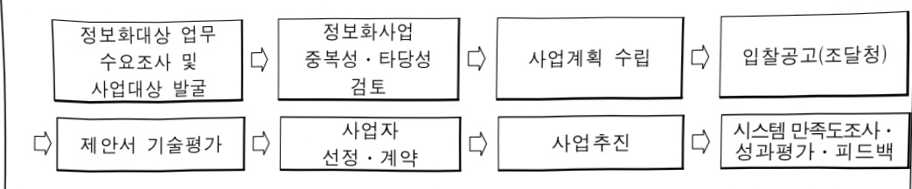

# 고용노동행정(정보화)

**해당 페이지**: PDF 142 ~ 152 쪽 해당

**부처**: 고용노동부
**분야**: 사회복지
**회계유형**: 일반회계
**2026 확정예산**: 2038.0 백만원
**전년대비 증감률**: None%
**AI 도메인**: 데이터, 보안/사이버, 통신/네트워크

---

<table border=1 style='margin: auto; word-wrap: break-word;'><tr><td style='text-align: center; word-wrap: break-word;'>사 업 명</td></tr><tr><td style='text-align: center; word-wrap: break-word;'>(95) 고용노동행정(정보화)(7034-500)</td></tr></table>

□ 사업 코드 정보

<table border=1 style='margin: auto; word-wrap: break-word;'><tr><td style='text-align: center; word-wrap: break-word;'>구분</td><td style='text-align: center; word-wrap: break-word;'>회계</td><td style='text-align: center; word-wrap: break-word;'>소관</td><td style='text-align: center; word-wrap: break-word;'>실국(기관)</td><td style='text-align: center; word-wrap: break-word;'>계정</td><td style='text-align: center; word-wrap: break-word;'>분야</td><td style='text-align: center; word-wrap: break-word;'>부문</td></tr><tr><td style='text-align: center; word-wrap: break-word;'>코드</td><td rowspan="2">일반회계</td><td rowspan="2">고용노동부</td><td style='text-align: center; word-wrap: break-word;'>기획조정실</td><td rowspan="2">0</td><td style='text-align: center; word-wrap: break-word;'>080</td><td style='text-align: center; word-wrap: break-word;'>086</td></tr><tr><td style='text-align: center; word-wrap: break-word;'>명칭</td><td style='text-align: center; word-wrap: break-word;'>정책기획관</td><td style='text-align: center; word-wrap: break-word;'>사회복지</td><td style='text-align: center; word-wrap: break-word;'>노동</td></tr></table>

<table border=1 style='margin: auto; word-wrap: break-word;'><tr><td style='text-align: center; word-wrap: break-word;'>구분</td><td style='text-align: center; word-wrap: break-word;'>프로그램</td><td style='text-align: center; word-wrap: break-word;'>단위사업</td><td style='text-align: center; word-wrap: break-word;'>세부사업</td></tr><tr><td style='text-align: center; word-wrap: break-word;'>코드</td><td style='text-align: center; word-wrap: break-word;'>7000</td><td style='text-align: center; word-wrap: break-word;'>7034</td><td style='text-align: center; word-wrap: break-word;'>500</td></tr><tr><td style='text-align: center; word-wrap: break-word;'>명칭</td><td style='text-align: center; word-wrap: break-word;'>고용노동행정지원</td><td style='text-align: center; word-wrap: break-word;'>고용노동행정정보화</td><td style='text-align: center; word-wrap: break-word;'>고용노동행정(정보화)</td></tr></table>

□ 사업 성격

<table border=1 style='margin: auto; word-wrap: break-word;'><tr><td rowspan="2">신규</td><td rowspan="2">계속</td><td rowspan="2">완료</td><td rowspan="2">예비타당성 실시여부</td><td rowspan="2">총사업비 관리대상</td><td rowspan="2">총액계상 예산사업</td><td style='text-align: center; word-wrap: break-word;'>사업소관 변경정보</td></tr><tr><td style='text-align: center; word-wrap: break-word;'>2025예산 시 소관</td></tr><tr><td style='text-align: center; word-wrap: break-word;'></td><td style='text-align: center; word-wrap: break-word;'>○</td><td style='text-align: center; word-wrap: break-word;'></td><td style='text-align: center; word-wrap: break-word;'></td><td style='text-align: center; word-wrap: break-word;'></td><td style='text-align: center; word-wrap: break-word;'></td><td style='text-align: center; word-wrap: break-word;'></td></tr></table>

□ 사업 지원 형태 및 지원을

<table border=1 style='margin: auto; word-wrap: break-word;'><tr><td style='text-align: center; word-wrap: break-word;'>직접</td><td style='text-align: center; word-wrap: break-word;'>출자</td><td style='text-align: center; word-wrap: break-word;'>출연</td><td style='text-align: center; word-wrap: break-word;'>보조</td><td style='text-align: center; word-wrap: break-word;'>융자</td><td style='text-align: center; word-wrap: break-word;'>국고보조율(%)</td><td style='text-align: center; word-wrap: break-word;'>융자율(%)</td></tr><tr><td style='text-align: center; word-wrap: break-word;'>○</td><td style='text-align: center; word-wrap: break-word;'></td><td style='text-align: center; word-wrap: break-word;'></td><td style='text-align: center; word-wrap: break-word;'></td><td style='text-align: center; word-wrap: break-word;'></td><td style='text-align: center; word-wrap: break-word;'></td><td style='text-align: center; word-wrap: break-word;'></td></tr></table>

□ 사업 소관부처 및 시행주체

<table border=1 style='margin: auto; word-wrap: break-word;'><tr><td style='text-align: center; word-wrap: break-word;'>사업명</td><td colspan="2">구분</td></tr><tr><td rowspan="4">고용노동행정(정보화)</td><td rowspan="3">소관부처</td><td style='text-align: center; word-wrap: break-word;'>실·국·과(팀)</td></tr><tr><td style='text-align: center; word-wrap: break-word;'>정책기획관</td></tr><tr><td style='text-align: center; word-wrap: break-word;'>지능정보화기획팀</td></tr><tr><td style='text-align: center; word-wrap: break-word;'></td><td style='text-align: center; word-wrap: break-word;'></td></tr></table>

### 가. 예산 총괄표

(단위: 백만원, %)

<table border=1 style='margin: auto; word-wrap: break-word;'><tr><td rowspan="2">사업명</td><td rowspan="2">2024년 결산</td><td rowspan="2">2025년 예산 본예산(A)</td><td colspan="2">2026년 예산</td><td rowspan="2">증감 (B-A)</td><td rowspan="2">(B-A)/A</td></tr><tr><td style='text-align: center; word-wrap: break-word;'>정부안</td><td style='text-align: center; word-wrap: break-word;'>확정(B)</td></tr><tr><td style='text-align: center; word-wrap: break-word;'>고용노동행정(정보화)</td><td style='text-align: center; word-wrap: break-word;'>22,378</td><td style='text-align: center; word-wrap: break-word;'>21,701</td><td style='text-align: center; word-wrap: break-word;'>23,739</td><td style='text-align: center; word-wrap: break-word;'>23,739</td><td style='text-align: center; word-wrap: break-word;'>2,038</td><td style='text-align: center; word-wrap: break-word;'>9.4</td></tr></table>

---

□ 기능별(내역사업별) 예산 내역

(단위:백만원)

<table border=1 style='margin: auto; word-wrap: break-word;'><tr><td rowspan="2"></td><td colspan="5">2024</td><td colspan="5">2025(2025.12월말)</td><td rowspan="2">2026예산</td></tr><tr><td style='text-align: center; word-wrap: break-word;'>예산액(추정)</td><td style='text-align: center; word-wrap: break-word;'>예산현액</td><td style='text-align: center; word-wrap: break-word;'>집행액</td><td style='text-align: center; word-wrap: break-word;'>이월액</td><td style='text-align: center; word-wrap: break-word;'>불용액</td><td style='text-align: center; word-wrap: break-word;'>본예산</td><td style='text-align: center; word-wrap: break-word;'>예산현액</td><td style='text-align: center; word-wrap: break-word;'>집행액</td><td style='text-align: center; word-wrap: break-word;'>이월액</td><td style='text-align: center; word-wrap: break-word;'>불용액</td></tr><tr><td style='text-align: center; word-wrap: break-word;'>ㅇ 기능별 분류(합제)</td><td style='text-align: center; word-wrap: break-word;'>22,139</td><td style='text-align: center; word-wrap: break-word;'>22,542</td><td style='text-align: center; word-wrap: break-word;'>22,378</td><td style='text-align: center; word-wrap: break-word;'>0</td><td style='text-align: center; word-wrap: break-word;'>164</td><td style='text-align: center; word-wrap: break-word;'>21,701</td><td style='text-align: center; word-wrap: break-word;'>21,756</td><td style='text-align: center; word-wrap: break-word;'>21,620</td><td style='text-align: center; word-wrap: break-word;'>17</td><td style='text-align: center; word-wrap: break-word;'>119</td><td style='text-align: center; word-wrap: break-word;'>23,739</td></tr><tr><td style='text-align: center; word-wrap: break-word;'>① 정보시스템 구축</td><td style='text-align: center; word-wrap: break-word;'>1,523</td><td style='text-align: center; word-wrap: break-word;'>2,295</td><td style='text-align: center; word-wrap: break-word;'>2,287</td><td style='text-align: center; word-wrap: break-word;'>0</td><td style='text-align: center; word-wrap: break-word;'>8</td><td style='text-align: center; word-wrap: break-word;'>588</td><td style='text-align: center; word-wrap: break-word;'>666</td><td style='text-align: center; word-wrap: break-word;'>639</td><td style='text-align: center; word-wrap: break-word;'>17</td><td style='text-align: center; word-wrap: break-word;'>10</td><td style='text-align: center; word-wrap: break-word;'>847</td></tr><tr><td style='text-align: center; word-wrap: break-word;'>· 정보보안솔루션 및 보안장비 추가 교체</td><td style='text-align: center; word-wrap: break-word;'>236</td><td style='text-align: center; word-wrap: break-word;'>236</td><td style='text-align: center; word-wrap: break-word;'>236</td><td style='text-align: center; word-wrap: break-word;'>0</td><td style='text-align: center; word-wrap: break-word;'>0</td><td style='text-align: center; word-wrap: break-word;'>73</td><td style='text-align: center; word-wrap: break-word;'>73</td><td style='text-align: center; word-wrap: break-word;'>73</td><td style='text-align: center; word-wrap: break-word;'>0</td><td style='text-align: center; word-wrap: break-word;'>0</td><td style='text-align: center; word-wrap: break-word;'>73</td></tr><tr><td style='text-align: center; word-wrap: break-word;'>· 노사누리 상습체불사업주 관리시스템 구축</td><td style='text-align: center; word-wrap: break-word;'>0</td><td style='text-align: center; word-wrap: break-word;'>0</td><td style='text-align: center; word-wrap: break-word;'>0</td><td style='text-align: center; word-wrap: break-word;'>0</td><td style='text-align: center; word-wrap: break-word;'>0</td><td style='text-align: center; word-wrap: break-word;'>0</td><td style='text-align: center; word-wrap: break-word;'>0</td><td style='text-align: center; word-wrap: break-word;'>0</td><td style='text-align: center; word-wrap: break-word;'>0</td><td style='text-align: center; word-wrap: break-word;'>0</td><td style='text-align: center; word-wrap: break-word;'>446</td></tr><tr><td style='text-align: center; word-wrap: break-word;'>· 스마트노사누리 구축</td><td style='text-align: center; word-wrap: break-word;'>1,125</td><td style='text-align: center; word-wrap: break-word;'>1,771</td><td style='text-align: center; word-wrap: break-word;'>1,763</td><td style='text-align: center; word-wrap: break-word;'>0</td><td style='text-align: center; word-wrap: break-word;'>7</td><td style='text-align: center; word-wrap: break-word;'>0</td><td style='text-align: center; word-wrap: break-word;'>0</td><td style='text-align: center; word-wrap: break-word;'>0</td><td style='text-align: center; word-wrap: break-word;'>0</td><td style='text-align: center; word-wrap: break-word;'>0</td><td style='text-align: center; word-wrap: break-word;'>210</td></tr><tr><td style='text-align: center; word-wrap: break-word;'>· 고용부 정보화 관리수준 강화</td><td style='text-align: center; word-wrap: break-word;'>81</td><td style='text-align: center; word-wrap: break-word;'>80</td><td style='text-align: center; word-wrap: break-word;'>80</td><td style='text-align: center; word-wrap: break-word;'>0</td><td style='text-align: center; word-wrap: break-word;'>1</td><td style='text-align: center; word-wrap: break-word;'>81</td><td style='text-align: center; word-wrap: break-word;'>81</td><td style='text-align: center; word-wrap: break-word;'>81</td><td style='text-align: center; word-wrap: break-word;'>0</td><td style='text-align: center; word-wrap: break-word;'>0</td><td style='text-align: center; word-wrap: break-word;'>81</td></tr><tr><td style='text-align: center; word-wrap: break-word;'>· 홈페이지 개편</td><td style='text-align: center; word-wrap: break-word;'>0</td><td style='text-align: center; word-wrap: break-word;'>117</td><td style='text-align: center; word-wrap: break-word;'>117</td><td style='text-align: center; word-wrap: break-word;'>0</td><td style='text-align: center; word-wrap: break-word;'>0</td><td style='text-align: center; word-wrap: break-word;'>0</td><td style='text-align: center; word-wrap: break-word;'>0</td><td style='text-align: center; word-wrap: break-word;'>0</td><td style='text-align: center; word-wrap: break-word;'>0</td><td style='text-align: center; word-wrap: break-word;'>0</td><td style='text-align: center; word-wrap: break-word;'>0</td></tr><tr><td style='text-align: center; word-wrap: break-word;'>· 웹사이트 품질진단</td><td style='text-align: center; word-wrap: break-word;'>20</td><td style='text-align: center; word-wrap: break-word;'>20</td><td style='text-align: center; word-wrap: break-word;'>20</td><td style='text-align: center; word-wrap: break-word;'>0</td><td style='text-align: center; word-wrap: break-word;'>0</td><td style='text-align: center; word-wrap: break-word;'>20</td><td style='text-align: center; word-wrap: break-word;'>20</td><td style='text-align: center; word-wrap: break-word;'>20</td><td style='text-align: center; word-wrap: break-word;'>0</td><td style='text-align: center; word-wrap: break-word;'>0</td><td style='text-align: center; word-wrap: break-word;'>20</td></tr><tr><td style='text-align: center; word-wrap: break-word;'>· 정보화사업 평가 및 만족도조사</td><td style='text-align: center; word-wrap: break-word;'>17</td><td style='text-align: center; word-wrap: break-word;'>17</td><td style='text-align: center; word-wrap: break-word;'>17</td><td style='text-align: center; word-wrap: break-word;'>0</td><td style='text-align: center; word-wrap: break-word;'>0</td><td style='text-align: center; word-wrap: break-word;'>17</td><td style='text-align: center; word-wrap: break-word;'>17</td><td style='text-align: center; word-wrap: break-word;'>0</td><td style='text-align: center; word-wrap: break-word;'>17</td><td style='text-align: center; word-wrap: break-word;'>0</td><td style='text-align: center; word-wrap: break-word;'>17</td></tr><tr><td style='text-align: center; word-wrap: break-word;'>· 과태료 · 이행강제금 정수관리시스템 개선</td><td style='text-align: center; word-wrap: break-word;'>0</td><td style='text-align: center; word-wrap: break-word;'>0</td><td style='text-align: center; word-wrap: break-word;'>0</td><td style='text-align: center; word-wrap: break-word;'>0</td><td style='text-align: center; word-wrap: break-word;'>0</td><td style='text-align: center; word-wrap: break-word;'>397</td><td style='text-align: center; word-wrap: break-word;'>397</td><td style='text-align: center; word-wrap: break-word;'>387</td><td style='text-align: center; word-wrap: break-word;'>0</td><td style='text-align: center; word-wrap: break-word;'>10</td><td style='text-align: center; word-wrap: break-word;'>0</td></tr><tr><td style='text-align: center; word-wrap: break-word;'>· 전산실 무정전전원장치 교체</td><td style='text-align: center; word-wrap: break-word;'>44</td><td style='text-align: center; word-wrap: break-word;'>44</td><td style='text-align: center; word-wrap: break-word;'>44</td><td style='text-align: center; word-wrap: break-word;'>0</td><td style='text-align: center; word-wrap: break-word;'>0</td><td style='text-align: center; word-wrap: break-word;'>0</td><td style='text-align: center; word-wrap: break-word;'>0</td><td style='text-align: center; word-wrap: break-word;'>0</td><td style='text-align: center; word-wrap: break-word;'>0</td><td style='text-align: center; word-wrap: break-word;'>0</td><td style='text-align: center; word-wrap: break-word;'>0</td></tr><tr><td style='text-align: center; word-wrap: break-word;'>· 데이터 품질관리 출무선 도입(이월)</td><td style='text-align: center; word-wrap: break-word;'>0</td><td style='text-align: center; word-wrap: break-word;'>10</td><td style='text-align: center; word-wrap: break-word;'>10</td><td style='text-align: center; word-wrap: break-word;'>0</td><td style='text-align: center; word-wrap: break-word;'>0</td><td style='text-align: center; word-wrap: break-word;'>0</td><td style='text-align: center; word-wrap: break-word;'>0</td><td style='text-align: center; word-wrap: break-word;'>0</td><td style='text-align: center; word-wrap: break-word;'>0</td><td style='text-align: center; word-wrap: break-word;'>0</td><td style='text-align: center; word-wrap: break-word;'>0</td></tr><tr><td style='text-align: center; word-wrap: break-word;'>· 국정지원 화재복구</td><td style='text-align: center; word-wrap: break-word;'>0</td><td style='text-align: center; word-wrap: break-word;'>0</td><td style='text-align: center; word-wrap: break-word;'>0</td><td style='text-align: center; word-wrap: break-word;'>0</td><td style='text-align: center; word-wrap: break-word;'>0</td><td style='text-align: center; word-wrap: break-word;'>0</td><td style='text-align: center; word-wrap: break-word;'>78</td><td style='text-align: center; word-wrap: break-word;'>78</td><td style='text-align: center; word-wrap: break-word;'>0</td><td style='text-align: center; word-wrap: break-word;'>0</td><td style='text-align: center; word-wrap: break-word;'>0</td></tr><tr><td style='text-align: center; word-wrap: break-word;'>②정보시스템 유지보수</td><td style='text-align: center; word-wrap: break-word;'>3,942</td><td style='text-align: center; word-wrap: break-word;'>3,716</td><td style='text-align: center; word-wrap: break-word;'>3,671</td><td style='text-align: center; word-wrap: break-word;'>0</td><td style='text-align: center; word-wrap: break-word;'>45</td><td style='text-align: center; word-wrap: break-word;'>4,591</td><td style='text-align: center; word-wrap: break-word;'>4,568</td><td style='text-align: center; word-wrap: break-word;'>4,515</td><td style='text-align: center; word-wrap: break-word;'>0</td><td style='text-align: center; word-wrap: break-word;'>53</td><td style='text-align: center; word-wrap: break-word;'>5,041</td></tr><tr><td style='text-align: center; word-wrap: break-word;'>③사이버안전센터 운영</td><td style='text-align: center; word-wrap: break-word;'>1,811</td><td style='text-align: center; word-wrap: break-word;'>1,811</td><td style='text-align: center; word-wrap: break-word;'>1,804</td><td style='text-align: center; word-wrap: break-word;'>0</td><td style='text-align: center; word-wrap: break-word;'>7</td><td style='text-align: center; word-wrap: break-word;'>1,811</td><td style='text-align: center; word-wrap: break-word;'>1,811</td><td style='text-align: center; word-wrap: break-word;'>1,809</td><td style='text-align: center; word-wrap: break-word;'>0</td><td style='text-align: center; word-wrap: break-word;'>2</td><td style='text-align: center; word-wrap: break-word;'>1,811</td></tr><tr><td style='text-align: center; word-wrap: break-word;'>④전산장비 및 SW 구매</td><td style='text-align: center; word-wrap: break-word;'>2,132</td><td style='text-align: center; word-wrap: break-word;'>2,132</td><td style='text-align: center; word-wrap: break-word;'>2,132</td><td style='text-align: center; word-wrap: break-word;'>0</td><td style='text-align: center; word-wrap: break-word;'>0</td><td style='text-align: center; word-wrap: break-word;'>2,161</td><td style='text-align: center; word-wrap: break-word;'>2,161</td><td style='text-align: center; word-wrap: break-word;'>2,161</td><td style='text-align: center; word-wrap: break-word;'>0</td><td style='text-align: center; word-wrap: break-word;'>0</td><td style='text-align: center; word-wrap: break-word;'>1,623</td></tr><tr><td style='text-align: center; word-wrap: break-word;'>⑤정보시스템 운영</td><td style='text-align: center; word-wrap: break-word;'>12,731</td><td style='text-align: center; word-wrap: break-word;'>12,588</td><td style='text-align: center; word-wrap: break-word;'>12,484</td><td style='text-align: center; word-wrap: break-word;'>0</td><td style='text-align: center; word-wrap: break-word;'>104</td><td style='text-align: center; word-wrap: break-word;'>12,550</td><td style='text-align: center; word-wrap: break-word;'>12,550</td><td style='text-align: center; word-wrap: break-word;'>12,496</td><td style='text-align: center; word-wrap: break-word;'>0</td><td style='text-align: center; word-wrap: break-word;'>54</td><td style='text-align: center; word-wrap: break-word;'>12,450</td></tr><tr><td style='text-align: center; word-wrap: break-word;'>⑥AI노동법 상담</td><td style='text-align: center; word-wrap: break-word;'>0</td><td style='text-align: center; word-wrap: break-word;'>0</td><td style='text-align: center; word-wrap: break-word;'>0</td><td style='text-align: center; word-wrap: break-word;'>0</td><td style='text-align: center; word-wrap: break-word;'>0</td><td style='text-align: center; word-wrap: break-word;'>0</td><td style='text-align: center; word-wrap: break-word;'>0</td><td style='text-align: center; word-wrap: break-word;'>0</td><td style='text-align: center; word-wrap: break-word;'>0</td><td style='text-align: center; word-wrap: break-word;'>0</td><td style='text-align: center; word-wrap: break-word;'>1,967</td></tr></table>

---

### 나. 사업설명자료

## 1 ) 사업목적·내용

- (세부사업명) 홈페이지, 전자민원, 내부업무 포털, 근로감독행정 등 고용노동정보시스템 구축·운영하여 안정적인 서비스 제공하는 한편 고용노동부 본부, 지방고용노동지청(48개), 위원회(15개), 고객상담센터 및 산하기관의 정보통신망을 구축·운영함으로써 고용노동행정의 효율화를 도모하고 대국민 서비스 강화

(정보시스템 구축) 직원에게 업무정보와 소통공간을 제공하는 포털, 대국민 홈페이지 및 전자민원 시스템 운영, 데이터 개방 및 데이터기반행정 활성화 지원

(정보시스템 유지보수) 노동부 전산자산(정보시스템·통신망·전산장비 등) 유지관리 위탁 운영

(사이버안전센터 운영) 노동부 및 12개 산하기관이 보유한 보안장비 및 웹사이트에 대한 보안관제를 위해 전문 보안업체에 위탁·운영

· (전산장비·SW 구매) 전산장비(PC, 모니터, 프린터) 및 업무용SW 구매

(정보시스템 운영) 전산장비 구매 임차료, 통신회선료, 정보화사업 추진 운영비

·(AI노동법 상담)국민의 노동법 질문에 맞춤형 답변 제공 등

## 2 ) 사업개요

☐ 사업근거 및 추진경위

① 법령상 근거 및 조항 적시 : 「지능정보화 기본법」 및 「전자정부법」 등에 따라

행정기관은 전자정부 구현을 위하여 적극 노력하도록 규정

지능정보화 기본법 제4조(국가·지방자치단체 등의 책무) ① 국가와 지방자치단체는 이 법의 목적과 기본원칙을 고려하여 지능정보사회를 구현하기 위한 시책을 강구하여야 한다.

<table border=1 style='margin: auto; word-wrap: break-word;'><tr><td style='text-align: center; word-wrap: break-word;'>지능정보화 기본법 제4조(국가·지방자치단체 등의 책무) ① 국가와 지방자치단체는 이 법의 목적과 기본원칙을 고려하여 지능정보사회를 구현하기 위한 시책을 강구하여야 한다.</td></tr><tr><td style='text-align: center; word-wrap: break-word;'>제64조(재원의 조달) ① 국가기관과 지방자치단체는 이 법에서 정한 시책의 추진을 위하여 필요한 재원을 확보하도록 노력하여야 한다.</td></tr><tr><td style='text-align: center; word-wrap: break-word;'>전자정부법 제4조(전자정부의 원칙) ① 행정기관등은 전자정부의 구현·운영 및 발전을 추진할 때 다음 각 호의 사항을 우선적으로 고려하고 이에 필요한 대책을 마련하여야 한다.</td></tr><tr><td style='text-align: center; word-wrap: break-word;'>1. 대민서비스의 전자화 및 국민편익의 증진</td></tr><tr><td style='text-align: center; word-wrap: break-word;'>2. 행정업무의 혁신 및 생산성·효율성의 향상</td></tr><tr><td style='text-align: center; word-wrap: break-word;'>3. 정보시스템의 안전성·신뢰성의 확보</td></tr><tr><td style='text-align: center; word-wrap: break-word;'>4. 개인정보 및 사생활의 보호</td></tr><tr><td style='text-align: center; word-wrap: break-word;'>5. 행정정보의 공개 및 공동이용의 확대</td></tr><tr><td style='text-align: center; word-wrap: break-word;'>제9조(방문에 의하지 아니하는 민원처리) ① 행정기관등의 장은 민원인이 해당 기관을 직접 방문하지 아니하고도 민원사항 등을 처리할 수 있도록 관계 법령의 개선, 필요한 시설 및 시스템의 구축 등 제반 여건을 마련하여야 한다.</td></tr><tr><td style='text-align: center; word-wrap: break-word;'>클라우드컴퓨팅 발전 및 이용자 보호에 관한 법률 제3조(국가 등의 책무) ① 국가와 지방자치단체는 클라우드컴퓨팅의 발전 및 이용 촉진, 클라우드컴퓨팅서비스의 안전한 이용 환경 조성 등에 필요한 시책을 마련하여야 한다.</td></tr><tr><td style='text-align: center; word-wrap: break-word;'>개인정보보호법 제5조(국가 등의 책무) ① 국가와 지방자치단체는 개인정보의 목적 외 수집, 오용·남용 및</td></tr></table>

제64조(재원의 조달) ① 국가기관과 지방자치단체는 이 법에서 정한 시책의 추진을 위하여 필요한 재원을 확보하도록 노력하여야 한다.

전자정부법 제4조(전자정부의 원칙) ① 행정기관등은 전자정부의 구현·운영 및 발전을 추진할 때 다음각 호의 사항을 우선적으로 고려하고 이에 필요한 대책을 마련하여야 한다.

1. 대민서비스의 전자화 및 국민편익의 증진

2. 행정업무의 혁신 및 생산성·효율성의 향상

3. 정보시스템의 안전성·신뢰성의 확보

4. 개인정보 및 사생활의 보호

5. 행정정보의 공개 및 공동이용의 확대

제9조(방문에 의하지 아니하는 민원처리) ① 행정기관등의 장은 민원인이 해당 기관을 직접 방문하지 아니하고도 민원사항 등을 처리할 수 있도록 관계 법령의 개선, 필요한 시설 및 시스템의 구축 등 제반 여건을 마련하여야 한다.

클라우드컴퓨팅 발전 및 이용자 보호에 관한 법률 제3조(국가 등의 책무) ① 국가와 지방자치단체는 클라우드컴퓨팅의 발전 및 이용 촉진, 클라우드컴퓨팅서비스의 안전한 이용 환경 조성 등에 필요한 시책을 마련하여야 한다.

개인정보보호법 제5조(국가 등의 책무) ① 국가와 지방자치단체는 개인정보의 목적 외 수집, 오용·남용 및

---

무분별한 감시·추적 등에 따른 폐해를 방지하여 인간의 존엄과 개인의 사생활 보호를 도모하기 위한 시책을 강구하여야 한다.

공공데이터의 제공 및 이용 활성화에 관한 법률 제3조(기본원칙) ① 공공기관은 누구든지 공공데이터를 편리하게 이용할 수 있도록 노력하여야 하며, 이용권의 보편적 확대를 위하여 필요한 조치를 취하여야 한다.

데이터기반행정 활성화에 관한 법률 제3조(국가 등의 책무) ① 국가 및 지방자치단체는 데이터기반행정을 활성화하기 위한 시책을 수립하고, 그 추진에 필요한 행정적·기술적·재정적 조치를 마련하여야 한다.

동법 시행령 제16조(데이터관리체계의 구축 및 운영 등) ① 공공기관의 장은 법 제16조제1항에 따라 데이터에 대한 메타데이터 및 데이터관계도를 체계적으로 관리하기 위하여 정보시스템을 구축운영할 수 있다.

② 추진경위 - 사업 시작년도, 추진배경, 부처별 중점과제, 대통령 공약사항 등

<table border=1 style='margin: auto; word-wrap: break-word;'><tr><td style='text-align: center; word-wrap: break-word;'>연도</td><td style='text-align: center; word-wrap: break-word;'>추진 내용</td></tr><tr><td style='text-align: center; word-wrap: break-word;'>&#x27;86.~&#x27;00.</td><td style='text-align: center; word-wrap: break-word;'>고용보험·취업알선 등 정보시스템 구축, 고용보험 정보통신망 및 노동부 행정정보통신망 통합</td></tr><tr><td style='text-align: center; word-wrap: break-word;'>&#x27;01.~&#x27;10.</td><td style='text-align: center; word-wrap: break-word;'>전자문서 및 전자민원시스템 구축, 노동부 및 산하단체 정보통신망 통합, 노동부 및 산하단체 지식관리센터(KMC), 인터넷방송시스템, PKMS시스템 구축, 전자민원시스템 개선사업 추진, 산하단체 정보화수준 평가, 사업장정보관리시스템 및 노동부 홈페이지 개편 등 추진</td></tr><tr><td style='text-align: center; word-wrap: break-word;'>&#x27;11.~&#x27;20.</td><td style='text-align: center; word-wrap: break-word;'>「고용노동 사이버안전센터」를 개소하고, 감사정보관리, 모바일 다우리, 개인정보 접속이력 관리 시스템 구축, 고용부 전 기관 인터넷 전화기 보급 노사누리·형사사법공통시스템(KICS) 연계 및 산업안전보건법 전부개정 사항 반영, 고용노동관련 민원 웹사이트 ONE-ID 서비스 실시, 네트워크 이중화를 통한 서비스 안정성 제고, 과태료관리 시스템·노사마루 이행강제금 기능 연계 및 납부대상자 과태료 조회 기능 강화, 소속기관 망분리, 사이버안전센터 지능형 위협 탐지 기능 구축, 개인정보 관리 통제체계 강화</td></tr><tr><td style='text-align: center; word-wrap: break-word;'>&#x27;21.~&#x27;25.</td><td style='text-align: center; word-wrap: break-word;'>노사누리 신고사건 처리 기능 개발, 스마트 노사누리 정보화전략계획(ISP) 수립, 홈페이지 클라우드 이관, 전자민원시스템 본인인증수단(간편인증, 금융인증서, 디지털원패스) 적용, 스마트 노사누리 구축 (근로감독업무 처리기능 재구축, 노동포털 구축, 노후장비 교체), 정보 시스템 클라우드 이관, 사이버안전센터 보안관제시스템 고도화, 비대면 영상회의시스템 구축,</td></tr></table>

□ 주요내용

① 사업규모

- 총사업비 : 해당없음

- 사업기간 : 1985년 ~ 계속

- 최근 5년 간 투입된 사업비

<table border=1 style='margin: auto; word-wrap: break-word;'><tr><td style='text-align: center; word-wrap: break-word;'>闰五</td><td style='text-align: center; word-wrap: break-word;'>2022</td><td style='text-align: center; word-wrap: break-word;'>2023</td><td style='text-align: center; word-wrap: break-word;'>2024</td><td style='text-align: center; word-wrap: break-word;'>2025</td><td style='text-align: center; word-wrap: break-word;'>2026</td></tr><tr><td style='text-align: center; word-wrap: break-word;'>사업비</td><td style='text-align: center; word-wrap: break-word;'>28,926</td><td style='text-align: center; word-wrap: break-word;'>24,869</td><td style='text-align: center; word-wrap: break-word;'>22,139</td><td style='text-align: center; word-wrap: break-word;'>21,701</td><td style='text-align: center; word-wrap: break-word;'>23,739</td></tr></table>

- 기타: 해당없음

② 사업추진체계

- 사업시행방법 : 직접수행

- 사업시행주체 : 고용노동부

-사업 수혜자 : 국민, 고용노동부 직원

- 보조, 융자, 출연, 출자 등의 경우 보조·융자 등 지원 비율 및 법적근거 : 해당없음

---

02025년도 예산 및 2026년도 예산 산출 세부내역 비교

<table border=1 style='margin: auto; word-wrap: break-word;'><tr><td colspan="3">2025년 예산</td><td colspan="3">2026년 예산</td></tr><tr><td style='text-align: center; word-wrap: break-word;'>예산</td><td style='text-align: center; word-wrap: break-word;'>산출내역</td><td style='text-align: center; word-wrap: break-word;'>예산</td><td style='text-align: center; word-wrap: break-word;'>산출내역</td><td colspan="2">비고</td></tr><tr><td rowspan="42">21,701</td><td style='text-align: center; word-wrap: break-word;'>☐ 정보시스템 구축 588</td><td rowspan="38">23,739</td><td style='text-align: center; word-wrap: break-word;'>☐ 정보시스템 구축 847</td><td colspan="2">증 259</td></tr><tr><td style='text-align: center; word-wrap: break-word;'>☐ 정보보안솔루션 및 보안장비 추가 교체 73</td><td style='text-align: center; word-wrap: break-word;'>☐ 정보보안솔루션 및 보안장비 추가 교체 73</td><td colspan="2">-</td></tr><tr><td style='text-align: center; word-wrap: break-word;'>☐ 정보보호 및 개인정보보호 관리수준 강화 81</td><td style='text-align: center; word-wrap: break-word;'>☐ 정보보호 및 개인정보보호 관리수준 강화 81</td><td colspan="2">-</td></tr><tr><td style='text-align: center; word-wrap: break-word;'>☐ 웹사이트 품질진단 20</td><td style='text-align: center; word-wrap: break-word;'>☐ 웹사이트 품질진단 20</td><td colspan="2">-</td></tr><tr><td style='text-align: center; word-wrap: break-word;'>☐ 정보화사업 만족도 조사 17</td><td style='text-align: center; word-wrap: break-word;'>☐ 정보화사업 만족도 조사 17</td><td colspan="2">-</td></tr><tr><td style='text-align: center; word-wrap: break-word;'>-</td><td style='text-align: center; word-wrap: break-word;'>☐ 노사리상철혈사업주 관리사님 구축 446</td><td colspan="2">순 증</td></tr><tr><td style='text-align: center; word-wrap: break-word;'>-</td><td style='text-align: center; word-wrap: break-word;'>☐ 스마트 노사누리 구축 210</td><td colspan="2">순 증</td></tr><tr><td style='text-align: center; word-wrap: break-word;'>☐ 과태료이행강제금 징수관리시스템 개선 397</td><td style='text-align: center; word-wrap: break-word;'>-</td><td colspan="2">순 감</td></tr><tr><td style='text-align: center; word-wrap: break-word;'>☐ 정보시스템 유지보수 4,591</td><td style='text-align: center; word-wrap: break-word;'>☐ 정보시스템 유지보수 5,041</td><td colspan="2">증 450</td></tr><tr><td style='text-align: center; word-wrap: break-word;'>☐ 개발SW 유지보수 915</td><td style='text-align: center; word-wrap: break-word;'>☐ 개발SW 유지보수 915</td><td colspan="2">-</td></tr><tr><td style='text-align: center; word-wrap: break-word;'>☐ 스마트 노사누리 유지관리비 980</td><td style='text-align: center; word-wrap: break-word;'>☐ 스마트 노사누리 유지관리비 1,061</td><td colspan="2">증 81</td></tr><tr><td style='text-align: center; word-wrap: break-word;'>☐ PC, 프린터 유지보수 352</td><td style='text-align: center; word-wrap: break-word;'>☐ PC, 프린터 유지보수 349</td><td colspan="2">감 3</td></tr><tr><td style='text-align: center; word-wrap: break-word;'>☐ HW 유지보수 399</td><td style='text-align: center; word-wrap: break-word;'>☐ HW 유지보수 484</td><td colspan="2">증 85</td></tr><tr><td style='text-align: center; word-wrap: break-word;'>☐ 8,462배만원 × 4.7%</td><td style='text-align: center; word-wrap: break-word;'>☐ 8,303배만원 × 4.7% + 79배만원 × 6.0% + 1,112배만원 × 8.0%</td><td colspan="2">-</td></tr><tr><td style='text-align: center; word-wrap: break-word;'>☐ 상용SW 유지보수 1,725</td><td style='text-align: center; word-wrap: break-word;'>☐ 상용SW 유지보수 1,992</td><td colspan="2">증 267</td></tr><tr><td style='text-align: center; word-wrap: break-word;'>☐ 15,420배만원 × 11.18%</td><td style='text-align: center; word-wrap: break-word;'>☐ 15,817배만원 × 11.18%</td><td colspan="2">-</td></tr><tr><td style='text-align: center; word-wrap: break-word;'>☐ PC:프린터 유지보수 공무직 인건비 220</td><td style='text-align: center; word-wrap: break-word;'>☐ PC:프린터 유지보수 공무직 인건비 240</td><td colspan="2">증 20</td></tr><tr><td style='text-align: center; word-wrap: break-word;'>☐ 임금 182, 복리후생 3, 고용부담 35</td><td style='text-align: center; word-wrap: break-word;'>☐ 임금 198, 복리후생 3, 고용부담 39</td><td colspan="2">-</td></tr><tr><td style='text-align: center; word-wrap: break-word;'>☐ 사이버안전센터 운영 1,811</td><td style='text-align: center; word-wrap: break-word;'>☐ 사이버안전센터 운영 1,811</td><td colspan="2">-</td></tr><tr><td style='text-align: center; word-wrap: break-word;'>☐ 위탁운영 인건비: 1,811</td><td style='text-align: center; word-wrap: break-word;'>☐ 위탁운영 인건비 1,811</td><td colspan="2">-</td></tr><tr><td style='text-align: center; word-wrap: break-word;'>☐ 18명(PM 1, 관제기획운영 1, 보안관제 9, 웹진단 4, 사고대응 3)</td><td style='text-align: center; word-wrap: break-word;'>☐ 18명(PM 1, 관제기획운영 1, 보안관제 9, 웹진단 4, 사고대응 3)</td><td colspan="2">-</td></tr><tr><td style='text-align: center; word-wrap: break-word;'>☐ 전산장비 및 SW구매 2,161</td><td style='text-align: center; word-wrap: break-word;'>☐ 전산장비 및 SW구매 1,623</td><td colspan="2">감 538</td></tr><tr><td style='text-align: center; word-wrap: break-word;'>☐ PC, 프린터 구매 1,004</td><td style='text-align: center; word-wrap: break-word;'>☐ PC, 프린터 구매 428</td><td colspan="2">감 576</td></tr><tr><td style='text-align: center; word-wrap: break-word;'>☐ PC 임차 109만원×3,670대 216</td><td style='text-align: center; word-wrap: break-word;'>☐ PC 임차 110만원×6,549대 389</td><td colspan="2">증 173</td></tr><tr><td style='text-align: center; word-wrap: break-word;'>☐ 프린터 임차 51만원×1,080대 30</td><td style='text-align: center; word-wrap: break-word;'>☐ 프린터 임차 67만원×1,080대 39</td><td colspan="2">증 9</td></tr><tr><td style='text-align: center; word-wrap: break-word;'>☐ PC 자산 109만원×616대 671</td><td style='text-align: center; word-wrap: break-word;'>-</td><td colspan="2">순 감</td></tr><tr><td style='text-align: center; word-wrap: break-word;'>☐ 프린터 자산 51만원×170대 87</td><td style='text-align: center; word-wrap: break-word;'>-</td><td colspan="2">순 감</td></tr><tr><td style='text-align: center; word-wrap: break-word;'>☐ 사무용SW 구매 1,157</td><td style='text-align: center; word-wrap: break-word;'>☐ 사무용SW 구매 1,195</td><td colspan="2">증 38</td></tr><tr><td style='text-align: center; word-wrap: break-word;'>☐ 한컴오피스 87.6천원×2,957본 259</td><td style='text-align: center; word-wrap: break-word;'>☐ 한컴오피스 100.6천원×2,952본 297</td><td colspan="2">증 38</td></tr><tr><td style='text-align: center; word-wrap: break-word;'>☐ MS오피스 247.5천원×2,000본 524</td><td style='text-align: center; word-wrap: break-word;'>☐ MS오피스 247.5천원×2,000본 524</td><td colspan="2">-</td></tr><tr><td style='text-align: center; word-wrap: break-word;'>☐ 백신(내부) 17.5천원×7,000본 123</td><td style='text-align: center; word-wrap: break-word;'>☐ 백신(내부) 17.5천원×7,000본 123</td><td colspan="2">-</td></tr><tr><td style='text-align: center; word-wrap: break-word;'>☐ 백신(외부) 25.2천원×9,600본 242</td><td style='text-align: center; word-wrap: break-word;'>☐ 백신(외부) 25.2천원×9,600본 242</td><td colspan="2">-</td></tr><tr><td style='text-align: center; word-wrap: break-word;'>☐ 기록물관리 백신(서버용) 9</td><td style='text-align: center; word-wrap: break-word;'>☐ 기록물관리 백신(서버용) 9</td><td colspan="2">-</td></tr><tr><td style='text-align: center; word-wrap: break-word;'>☐ 정보시스템 운영 12,550</td><td style='text-align: center; word-wrap: break-word;'>☐ 정보시스템 운영 12,450</td><td colspan="2">감 100</td></tr><tr><td style='text-align: center; word-wrap: break-word;'>☐ 기존 리스계약 임차료 6,211</td><td style='text-align: center; word-wrap: break-word;'>☐ 기존 리스계약 임차료 6,163</td><td colspan="2">감 48</td></tr><tr><td style='text-align: center; word-wrap: break-word;'>☐ 회선사용료 6,090</td><td style='text-align: center; word-wrap: break-word;'>☐ 회선사용료 6,038</td><td colspan="2">감 52</td></tr><tr><td style='text-align: center; word-wrap: break-word;'>☐ 수용비 등 기타 운영비 249</td><td style='text-align: center; word-wrap: break-word;'>☐ 수용비 등 기타 운영비 249</td><td colspan="2">-</td></tr><tr><td style='text-align: center; word-wrap: break-word;'>☐ 수용비 221백 매뉴비 9백 국내외 9백 국외 016백 업무주비 4백</td><td style='text-align: center; word-wrap: break-word;'>☐ 수용비 221백 매뉴비 9백 국내외 9백 국외 016백 업무주비 4백</td><td colspan="2">-</td></tr><tr><td style='text-align: center; word-wrap: break-word;'>☐ AI노동법 상담 1,967</td><td style='text-align: center; word-wrap: break-word;'>☐ AI노동법 상담 1,967</td><td style='text-align: center; word-wrap: break-word;'>☐ AI노동법 상담 1,967</td><td colspan="2">순 증</td></tr><tr><td style='text-align: center; word-wrap: break-word;'>☐ 전문작업비 808</td><td style='text-align: center; word-wrap: break-word;'>☐ 전문작업비 808</td><td style='text-align: center; word-wrap: break-word;'>☐ 전문작업비 808</td><td colspan="2">순 증</td></tr><tr><td style='text-align: center; word-wrap: break-word;'>☐ AI API 이용료 367</td><td style='text-align: center; word-wrap: break-word;'>☐ AI API 이용료 367</td><td style='text-align: center; word-wrap: break-word;'>☐ AI API 이용료 367</td><td colspan="2">순 증</td></tr><tr><td style='text-align: center; word-wrap: break-word;'>☐ GPU 임차료 792</td><td style='text-align: center; word-wrap: break-word;'>☐ GPU 임차료 792</td><td style='text-align: center; word-wrap: break-word;'>☐ GPU 임차료 792</td><td colspan="2">순 증</td></tr></table>

---

## [1] 정보시스템 구축: (25) 588 → (26) 847백만원(중 259백만원)

□ (변동내역) 신규사업 및 기존사업 종료 등으로 259백만원 중액

① 노사누리 상습체를 사업주 관리 시스템 구축 446백만원(순증)

② 스마트 노사누리 기능 추가 210백만원(순중)

③ 정보보안솔루션 및 보안장비 추가 교체 73백만원(전년동)

④ 정보보호 및 개인정보보호 관리수준 강화 81백만원(전년동)

⑤ 웹사이트 품질진단 20백만원(전년동)

⑥ 정보화사업 만족도 조사 17백만원(전년동)

⑦ 과태료·이행강제금 징수관리시스템 개선 사업종료 △397백만원

## - (변동요인)

① 노사누리 상습체를 사업주 관리 시스템 구축(446백만원): 임금체를 신고사건 처리 및 상습체를 사업주 선정을 위해 근로복지공단에서 피해근로자의 월보수액을 연계하는 업무프로세스 신설 및 경제적 제재(신용제재, 정부지원 제한, 공공입찰 불이익)을 위해 상습체를 사업주의 정보제공을 위한 오픈API 개발

② 스마트 노사누리 기능 추가(210백만원): 형사절차전자문서법 시행('24.10.)에 따라 '26. 9월부터 특별사법경찰관의 사건기록을 대검찰청에 전자문서로 송치할 수 있도록 기능 개발

③ 정보보안솔루션 및 보안장비 교체(73백만원): 제품 기술지원 종료(Eos)되는 보안장비 및 보안소프트웨어의 하드웨어 장애 및 신규 보안 취약점 발생 등에 대처하기 위해 교체(감 163백만원)

④ 정보보호 및 개인정보보호 관리수준 강화(81백만원): 고용노동부 업무망과 인터넷망 분리('18~20년), 국가융합망 전환('22년) 등으로 네트워크·정보보안 인프라가 증가하면서 정보보호 및 개인정보보호 관리체계의 재설계 필요 및 정보보안 관리실태 점검 대응 지원

⑤ 웹사이트 품질진단(20백만원): 모든 국민이 차별없이 우리 부 홈페이지 내 공공정보를 이용할 수 있도록 품질관리 진단 수행

⑥ 정보화사업 만족도 조사(17백만원): 정보시스템 평가 및 만족도를 조사하여 그 결과를 성과관리 및 시스템 개선방안 도출에 활용

⑦ 과태료·이행강제금 징수관리시스템 개선(△397백만원): 대국민 모바일 전자고지 도입 및 과태료 부과내역 조회 서비스 신설로 대민 편의성 제고와 업무 처리 절차 간소화 통해 과태료 징수율 제고

## ② 정보시스템 유지보수: (25) 4,591 → (26) 5,041 백만원(증 450 백만원)

- (변동내역) '24년 SW 기술자 평균임금 반영 및 유지보수 전산장비 반영

① 개발 SW 유지보수 915(전년동)

② 스마트 노사누리 유지관리비 980→1,061백만원(+81백만원)

③ PC · 프린터 유지보수 352→349백만원(△3백만원)

④ HW 유지보수 399→484백만원(85백만원)

⑤ 상용SW 유지보수 1,725→1,992백만원(+267백만원)

⑥ 전산장비 유지보수 공무직근로자 처우개선

- (변동요인)

① 개발SW 유지보수(915백만원): 공통 정보시스템의 유지보수비용을 위한 예산(전년동)

② 스마트 노사누리 유지관리비(1,061백만원): 스마트노사누리 구축 사업(2·3차) 유지관리 비용 반영(증 81백만원)

③ PC, 프린터 유지보수(349백만원): 내용연수 도과한 PC의 유지보수대상 제외로 예산 감액(감 3백만원)

④HW 유지보수(484백만원) '24년 도입 전산장비 반영 및 불용처리한 2장비의 유지보수대상제외(증 85백만원)

⑤상용SW 유지보수(1,992백만원): '24년 솔루션 도입분 반영 및 미사용 SW의 유지보수대상 제외(중 267백만원)

⑥ PC·프린터 유지보수 공무직근로자(전산지원관) 인건비(240백만원)

---

<table border=1 style='margin: auto; word-wrap: break-word;'><tr><td style='text-align: center; word-wrap: break-word;'>상용임금(110-03) : - 기본급 : - 명절상여금 : - 급식비 : - 월차/초과수당 :</td><td style='text-align: center; word-wrap: break-word;'>181,620천원 164,418천원 14,754천원 8,400천원 10,762천원</td><td style='text-align: center; word-wrap: break-word;'>13,111원 × 209h × 12월 × 5명 2,459,000원 × 1.2 × 5명 140,000원 × 12월 × 5명 2,152,406 × 5명</td></tr><tr><td style='text-align: center; word-wrap: break-word;'>복리후생비(210-12) : 고용부담금(320-09) : - 고용부담금 : - 퇴직금 :</td><td style='text-align: center; word-wrap: break-word;'>2,500천원 35,507천원 22,264천원 16,529천원</td><td style='text-align: center; word-wrap: break-word;'>500,000원 × 5명 198,428천원 × 11.22% 198,428천원 × 8.33%</td></tr></table>

## 3 사이버안전센터 운영: (25, '26) 1,811(전년동)

- (추진내용) 고용부 및 산하기관 정보시스템 대상 사이버 테러 및 해킹위험 대비 24시간 365일 보안관제 및 침해대응

- (변동내역) 전년동

## [4] 전산장비·소프트웨어 구매: (25) 2,161 → (26) 1,623 백만원(감 538 백만원)

- (변동내역) ① 업무용 전산장비 구매 1004 → 428백만원 (감 576백만원)

② 사무용 소프트웨어 구매 1,157 → 1,195백만원(증 38백만원)

- (변동요인) 한컴오피스 단가 상승분 반영

* 한컴오피스: ('25.) 단가 87,600원 → ('26.) 단가 100,600원

## [5] 정보시스템 운영:('25) 12,550→('26) 12,450백만원(감 100백만원)

- (변동내역) ① 리스계약 임차료 6,211→6,163백만원(감 48백만원)

②통신회선료 6,090→6,038백만원(감 52백만원)

③기타 운영비 249(전년동)

## - (변동요인)

①'20년도 리스계약 종료(~25.12월)로 인한 임차료 자연감소 및 '25년도 리스계약 예정 2전 반영

- 기존 리스계약 임차료: (25) 6,211 → (26) 6,163 백만원(감 48 백만원)

②본부·소속기관 통신회선 공공요금

- 통신회선 공공요금: (25) 6,090 → (26) 6,038 백만원(감 52 백만원)

<table border=1 style='margin: auto; word-wrap: break-word;'><tr><td rowspan="2">속도(bps)</td><td rowspan="2">회선 수</td><td colspan="2">공공요금(천원, 부가세 포함)</td><td rowspan="2">비고</td></tr><tr><td style='text-align: center; word-wrap: break-word;'>단가</td><td style='text-align: center; word-wrap: break-word;'>연간 요금</td></tr><tr><td style='text-align: center; word-wrap: break-word;'>5M</td><td style='text-align: center; word-wrap: break-word;'>390</td><td style='text-align: center; word-wrap: break-word;'>166</td><td style='text-align: center; word-wrap: break-word;'>779,215</td><td rowspan="9">·7개 고용센터 별관 폐쇄에 따른 통신회선 감소</td></tr><tr><td style='text-align: center; word-wrap: break-word;'>10M</td><td style='text-align: center; word-wrap: break-word;'>181</td><td style='text-align: center; word-wrap: break-word;'>223</td><td style='text-align: center; word-wrap: break-word;'>485,440</td></tr><tr><td style='text-align: center; word-wrap: break-word;'>20M</td><td style='text-align: center; word-wrap: break-word;'>21</td><td style='text-align: center; word-wrap: break-word;'>285</td><td style='text-align: center; word-wrap: break-word;'>71,946</td></tr><tr><td style='text-align: center; word-wrap: break-word;'>30M</td><td style='text-align: center; word-wrap: break-word;'>379</td><td style='text-align: center; word-wrap: break-word;'>377</td><td style='text-align: center; word-wrap: break-word;'>1,748,575</td></tr><tr><td style='text-align: center; word-wrap: break-word;'>50M</td><td style='text-align: center; word-wrap: break-word;'>379</td><td style='text-align: center; word-wrap: break-word;'>452</td><td style='text-align: center; word-wrap: break-word;'>2,085,115</td></tr><tr><td style='text-align: center; word-wrap: break-word;'>100M</td><td style='text-align: center; word-wrap: break-word;'>29</td><td style='text-align: center; word-wrap: break-word;'>511</td><td style='text-align: center; word-wrap: break-word;'>178,002</td></tr><tr><td style='text-align: center; word-wrap: break-word;'>155M</td><td style='text-align: center; word-wrap: break-word;'>13</td><td style='text-align: center; word-wrap: break-word;'>671</td><td style='text-align: center; word-wrap: break-word;'>104,754</td></tr><tr><td style='text-align: center; word-wrap: break-word;'>300M</td><td style='text-align: center; word-wrap: break-word;'>1</td><td style='text-align: center; word-wrap: break-word;'>844</td><td style='text-align: center; word-wrap: break-word;'>10,134</td></tr><tr><td style='text-align: center; word-wrap: break-word;'>소계</td><td style='text-align: center; word-wrap: break-word;'>1,393</td><td style='text-align: center; word-wrap: break-word;'></td><td style='text-align: center; word-wrap: break-word;'>5,463,181</td></tr><tr><td colspan="2">기타요금</td><td style='text-align: center; word-wrap: break-word;'></td><td style='text-align: center; word-wrap: break-word;'>574,381</td><td style='text-align: center; word-wrap: break-word;'>(전자팩스, 온나라 팩스, SMS, 카카오톡 알림 등)</td></tr><tr><td colspan="3">함 계</td><td style='text-align: center; word-wrap: break-word;'>6,037,562</td><td style='text-align: center; word-wrap: break-word;'></td></tr></table>

## 6 AI노동법 상담: (26) 1,967백만원(순중)

- (변동내역) ① AI API이용료 367백만원(질문1회 165원 × 81.78만회 사용(고객상담센터

실업급여 챗봇 사용통계 근거로 추정) × 2.47배 x VAT포함 1.1배)

②GPU 임차료 792백만원(월 이용료 60백만원(NVIDIA H100 80GB 16장,

VAT 포함,최저가 제공 협상) x 12개월) ③ 전문작업비 808백만원

---

- (변동요인) 국민의 노동법 접근성을 제고함으로써 노동행정 패러다임을 사후대응에서 사전예방으로 전환하는 데 기여하고, 상담 결과를 바탕으로 임금체불 진정 접수 등 행정서비스까지 연결하는 플랫폼 역할로도 기능할 수 있는 AI 노동법 상담 서비스 제공

## 4 ) 사업효과

□ 사업영향, 산출물 성과지표 등

① 2022~2026년도 성과계획서 상 성과지표 및 최근 5년간 성과 달성도

<table border=1 style='margin: auto; word-wrap: break-word;'><tr><td style='text-align: center; word-wrap: break-word;'>성과지표</td><td style='text-align: center; word-wrap: break-word;'>구분</td><td style='text-align: center; word-wrap: break-word;'>2022</td><td style='text-align: center; word-wrap: break-word;'>2023</td><td style='text-align: center; word-wrap: break-word;'>2024</td><td style='text-align: center; word-wrap: break-word;'>2025</td><td style='text-align: center; word-wrap: break-word;'>2026</td><td style='text-align: center; word-wrap: break-word;'>2026 목표치산출근거</td><td style='text-align: center; word-wrap: break-word;'>측정산식(또는 측정방법)</td><td style='text-align: center; word-wrap: break-word;'>자료수집방법(또는 자료출처)</td></tr><tr><td rowspan="3">내부만족도(점)</td><td style='text-align: center; word-wrap: break-word;'>목표</td><td style='text-align: center; word-wrap: break-word;'></td><td style='text-align: center; word-wrap: break-word;'></td><td style='text-align: center; word-wrap: break-word;'></td><td style='text-align: center; word-wrap: break-word;'></td><td style='text-align: center; word-wrap: break-word;'></td><td style='text-align: center; word-wrap: break-word;'></td><td rowspan="3">내부직원 대상정보시스템만족도 조사</td><td rowspan="3">내부 시스템이용자 대상설문조사</td></tr><tr><td style='text-align: center; word-wrap: break-word;'>실적</td><td style='text-align: center; word-wrap: break-word;'></td><td style='text-align: center; word-wrap: break-word;'></td><td style='text-align: center; word-wrap: break-word;'></td><td style='text-align: center; word-wrap: break-word;'></td><td style='text-align: center; word-wrap: break-word;'></td><td style='text-align: center; word-wrap: break-word;'></td></tr><tr><td style='text-align: center; word-wrap: break-word;'>달성도</td><td style='text-align: center; word-wrap: break-word;'></td><td style='text-align: center; word-wrap: break-word;'></td><td style='text-align: center; word-wrap: break-word;'></td><td style='text-align: center; word-wrap: break-word;'></td><td style='text-align: center; word-wrap: break-word;'></td><td style='text-align: center; word-wrap: break-word;'></td></tr><tr><td rowspan="3">홈페이지 이용자만족도(점)</td><td style='text-align: center; word-wrap: break-word;'>목표</td><td style='text-align: center; word-wrap: break-word;'></td><td style='text-align: center; word-wrap: break-word;'></td><td style='text-align: center; word-wrap: break-word;'></td><td style='text-align: center; word-wrap: break-word;'></td><td style='text-align: center; word-wrap: break-word;'></td><td style='text-align: center; word-wrap: break-word;'></td><td rowspan="3">홈페이지이용자만족도 조사</td><td rowspan="3">홈페이지이용자 대상설문조사</td></tr><tr><td style='text-align: center; word-wrap: break-word;'>실적</td><td style='text-align: center; word-wrap: break-word;'></td><td style='text-align: center; word-wrap: break-word;'></td><td style='text-align: center; word-wrap: break-word;'></td><td style='text-align: center; word-wrap: break-word;'></td><td style='text-align: center; word-wrap: break-word;'></td><td style='text-align: center; word-wrap: break-word;'></td></tr><tr><td style='text-align: center; word-wrap: break-word;'>달성도</td><td style='text-align: center; word-wrap: break-word;'></td><td style='text-align: center; word-wrap: break-word;'></td><td style='text-align: center; word-wrap: break-word;'></td><td style='text-align: center; word-wrap: break-word;'></td><td style='text-align: center; word-wrap: break-word;'></td><td style='text-align: center; word-wrap: break-word;'></td></tr><tr><td rowspan="3">정보보호수준달성율(%)</td><td style='text-align: center; word-wrap: break-word;'>목표</td><td style='text-align: center; word-wrap: break-word;'></td><td style='text-align: center; word-wrap: break-word;'></td><td style='text-align: center; word-wrap: break-word;'></td><td style='text-align: center; word-wrap: break-word;'></td><td style='text-align: center; word-wrap: break-word;'></td><td style='text-align: center; word-wrap: break-word;'></td><td rowspan="3">내부직원해킹메일대응훈련결과보고서</td><td rowspan="3">해킹메일대응훈련결과보고서</td></tr><tr><td style='text-align: center; word-wrap: break-word;'>실적</td><td style='text-align: center; word-wrap: break-word;'></td><td style='text-align: center; word-wrap: break-word;'></td><td style='text-align: center; word-wrap: break-word;'></td><td style='text-align: center; word-wrap: break-word;'></td><td style='text-align: center; word-wrap: break-word;'></td><td style='text-align: center; word-wrap: break-word;'></td></tr><tr><td style='text-align: center; word-wrap: break-word;'>달성도</td><td style='text-align: center; word-wrap: break-word;'></td><td style='text-align: center; word-wrap: break-word;'></td><td style='text-align: center; word-wrap: break-word;'></td><td style='text-align: center; word-wrap: break-word;'></td><td style='text-align: center; word-wrap: break-word;'></td><td style='text-align: center; word-wrap: break-word;'></td></tr></table>

② 성과지표 이외의 연도별 사업추진 경과 및 실적

<table border=1 style='margin: auto; word-wrap: break-word;'><tr><td style='text-align: center; word-wrap: break-word;'>2022</td><td style='text-align: center; word-wrap: break-word;'>· 행정정보 시스템 만족도 조사 : 73.4점 · 대국민 홈페이지 만족도 조사 : 75.8점</td></tr><tr><td style='text-align: center; word-wrap: break-word;'>2023</td><td style='text-align: center; word-wrap: break-word;'>· 행정정보 시스템 만족도 조사 : 62.3점 · 대국민 홈페이지 만족도 조사 : 70.0점</td></tr><tr><td style='text-align: center; word-wrap: break-word;'>2024</td><td style='text-align: center; word-wrap: break-word;'>· 행정정보 시스템 만족도 조사 : 70.4점 · 대국민 홈페이지 만족도 조사 : 81.7점</td></tr><tr><td style='text-align: center; word-wrap: break-word;'>2025</td><td style='text-align: center; word-wrap: break-word;'>· 행정정보 시스템 만족도 조사 : 만족도 조사 예정 · 대국민 홈페이지 만족도 조사 : 만족도 조사 예정</td></tr></table>

③향후(2026년도 이후)기대효과

○ 고용노동행정업무의 효율화 제고 및 대국민 서비스 향상

- 비대면·온라인 방식의 대국민 노동행정 포털 사이트 구축 및 모바일 현장조사·감독

업무 혁신 구현

- 정보시스템 통·폐합을 통한 안정적인 운영체계 마련

○ 정보보안 및 개인정보보호 강화

- 네트워크 전반에 대한 보안취약점 점검하여 안전한 정보시스템 사용환경 구축

- 사이버안전센터 지능협 위협 대응체계 구축 등을 통해 악성코드 피해 사전 방어

© 데이터 품질관리 강화 및 데이터기반행정 활성화 추진

- 우리부 보유 데이터의 효율적인 관리를 통해 체계적인 품질 수준 향상으로 대

내외 서비스 신뢰도 향상에 기여

---

5) 타당성조사 및 예비타당성조사 시행여부 및 결과 요지 : 해당없음

6) 총사업비 대상사업 여부 및 내역 : 해당없음

7) 사업 집행절차

## 8 ) 각종 평가

1) 국회(예결위, 상임위, 예정처, 국정감사 포함) 지적

(국정감사, '23년) 산하기관에서 신종 해킹 방식으로 개인정보 유축 사고가 발생하였는바, 고용노동부도 신종 해킹에 대응할 수 있도록 개인정보 유출 방지를 위한 보안 점검을 추진할 것(조치) 고용노동부·산하기관 대상으로 긴급 보안점검 및 조치를 실시하고, 고용노동사이버안전센터 보안관제시스템을 고도화하여 자동화된 대응 체계 구축

### 다.최근 4년간 결산내역

## 1 ) 결산표

☐ 부처 결산내역

(단위: 백만원, %)

<table border=1 style='margin: auto; word-wrap: break-word;'><tr><td rowspan="2">연도</td><td colspan="3">예산액</td><td rowspan="2">예산 현액(B)</td><td rowspan="2">집행액(C)</td><td rowspan="2">집행률(C/A)</td><td rowspan="2">집행률(C/B)</td><td rowspan="2">다음연도 이월액</td><td rowspan="2">불용액</td></tr><tr><td style='text-align: center; word-wrap: break-word;'>본예산</td><td style='text-align: center; word-wrap: break-word;'>추경 중감액</td><td style='text-align: center; word-wrap: break-word;'>추경(A)</td></tr><tr><td style='text-align: center; word-wrap: break-word;'>2022</td><td style='text-align: center; word-wrap: break-word;'>28,926</td><td style='text-align: center; word-wrap: break-word;'>0</td><td style='text-align: center; word-wrap: break-word;'>28,926</td><td style='text-align: center; word-wrap: break-word;'>29,698</td><td style='text-align: center; word-wrap: break-word;'>28,009</td><td style='text-align: center; word-wrap: break-word;'>96.8</td><td style='text-align: center; word-wrap: break-word;'>94.3</td><td style='text-align: center; word-wrap: break-word;'>1,542</td><td style='text-align: center; word-wrap: break-word;'>147</td></tr><tr><td style='text-align: center; word-wrap: break-word;'>2023</td><td style='text-align: center; word-wrap: break-word;'>24,869</td><td style='text-align: center; word-wrap: break-word;'>0</td><td style='text-align: center; word-wrap: break-word;'>24,869</td><td style='text-align: center; word-wrap: break-word;'>26,411</td><td style='text-align: center; word-wrap: break-word;'>25,205</td><td style='text-align: center; word-wrap: break-word;'>101.3</td><td style='text-align: center; word-wrap: break-word;'>95.4</td><td style='text-align: center; word-wrap: break-word;'>772</td><td style='text-align: center; word-wrap: break-word;'>434</td></tr><tr><td style='text-align: center; word-wrap: break-word;'>2024</td><td style='text-align: center; word-wrap: break-word;'>22,139</td><td style='text-align: center; word-wrap: break-word;'>0</td><td style='text-align: center; word-wrap: break-word;'>22,139</td><td style='text-align: center; word-wrap: break-word;'>22,542</td><td style='text-align: center; word-wrap: break-word;'>22,378</td><td style='text-align: center; word-wrap: break-word;'>101</td><td style='text-align: center; word-wrap: break-word;'>99.3</td><td style='text-align: center; word-wrap: break-word;'>-</td><td style='text-align: center; word-wrap: break-word;'>164</td></tr><tr><td style='text-align: center; word-wrap: break-word;'>2025</td><td style='text-align: center; word-wrap: break-word;'>21,701</td><td style='text-align: center; word-wrap: break-word;'>0</td><td style='text-align: center; word-wrap: break-word;'>21,701</td><td style='text-align: center; word-wrap: break-word;'>21,756</td><td style='text-align: center; word-wrap: break-word;'>21,620</td><td style='text-align: center; word-wrap: break-word;'>99.6</td><td style='text-align: center; word-wrap: break-word;'>99.4</td><td style='text-align: center; word-wrap: break-word;'>17</td><td style='text-align: center; word-wrap: break-word;'>119</td></tr></table>

---

## 2 ) 주요 결산사항

□ 2022~2025년 결산 주요 지적사항 및 시정요구사항

□ 과거 연도(2022~2024) 결산 상 특이사항

<table border=1 style='margin: auto; word-wrap: break-word;'><tr><td style='text-align: center; word-wrap: break-word;'>2022</td><td colspan="5">○ 이·전용 등 상세내역(단위: 백만원)</td></tr></table>

(단위:백만원)

---

<table border=1 style='margin: auto; word-wrap: break-word;'><tr><td rowspan="2">구분</td><td colspan="2">~에서</td><td rowspan="2">금액</td><td colspan="2">~으로</td><td rowspan="2">이.전용 등 사유</td></tr><tr><td style='text-align: center; word-wrap: break-word;'>세부사업 명(단위사업-세부사업)</td><td style='text-align: center; word-wrap: break-word;'>목-세목코드</td><td style='text-align: center; word-wrap: break-word;'>세부사업 명(단위사업-세부사업)</td><td style='text-align: center; word-wrap: break-word;'>목-세목코드</td></tr><tr><td style='text-align: center; word-wrap: break-word;'>조정</td><td style='text-align: center; word-wrap: break-word;'>고용노동행정(정보화)(7034-500)</td><td style='text-align: center; word-wrap: break-word;'>220-02</td><td style='text-align: center; word-wrap: break-word;'>3</td><td style='text-align: center; word-wrap: break-word;'>고용노동행정(정보화)(7034-500)</td><td style='text-align: center; word-wrap: break-word;'>220-01</td><td style='text-align: center; word-wrap: break-word;'>국내여비 부족으로 세목 조정</td></tr><tr><td style='text-align: center; word-wrap: break-word;'>조정</td><td style='text-align: center; word-wrap: break-word;'>고용노동행정(정보화)(7034-500)</td><td style='text-align: center; word-wrap: break-word;'>220-02</td><td style='text-align: center; word-wrap: break-word;'>3</td><td style='text-align: center; word-wrap: break-word;'>고용노동행정(정보화)(7034-500)</td><td style='text-align: center; word-wrap: break-word;'>220-01</td><td style='text-align: center; word-wrap: break-word;'>국내여비 부족으로 세목 조정</td></tr><tr><td style='text-align: center; word-wrap: break-word;'>전용</td><td style='text-align: center; word-wrap: break-word;'>고용노동행정(정보화)(7034-500)</td><td style='text-align: center; word-wrap: break-word;'>220-02210-07210-15</td><td style='text-align: center; word-wrap: break-word;'>42101226</td><td style='text-align: center; word-wrap: break-word;'>본부인건비(7011-100)</td><td style='text-align: center; word-wrap: break-word;'>110-01</td><td style='text-align: center; word-wrap: break-word;'>공무원 인건비 부족으로 기재부 승인 전용</td></tr><tr><td colspan="7">○ 이월액 : 해당사항 없음○ 불용액 : 164백만원- 공공요금 등 기타 집행 잔액: 164백만원</td></tr></table>

□2025년 이·전용 등 세부내역

(단위:백만원)

<table border=1 style='margin: auto; word-wrap: break-word;'><tr><td rowspan="2">구분(날짜)</td><td colspan="2">~에서</td><td rowspan="2">금액</td><td colspan="2">~으로</td><td rowspan="2">이·전용 등 사유</td></tr><tr><td style='text-align: center; word-wrap: break-word;'>세부사업 명(사업코드)</td><td style='text-align: center; word-wrap: break-word;'>목-세목코드</td><td style='text-align: center; word-wrap: break-word;'>세부사업 명(사업코드)</td><td style='text-align: center; word-wrap: break-word;'>목-세목코드</td></tr><tr><td style='text-align: center; word-wrap: break-word;'>조정(‘25.3.31.)(‘25.5.12.)(‘25.7.10.)(‘25.8.28.)(‘25.10.20.)(‘25.11.24.)(‘25.11.24.)(‘25.11.24.)(‘25.11.24.)(‘25.11.24.)(‘25.11.24.)(‘25.11.24.)(‘25.11.24.)(‘25.11.24.)(‘25.11.24.)(‘25.11.24.)(‘25.11.24.)(‘25.11.24.)(‘25.11.24.)(‘25.11.24.)(‘25.11.24.)(‘25.11.24.)(‘25.11.24.)(‘25.11.24.)(‘25.11.24.)(‘25.11.24.)(‘25.11.24.)(‘25.11.24.)(‘25.11.24.)(‘25.11.24.)(‘25.11.24.)(‘25.11.24.)(‘25.11.24.)(‘25.11.24.)(‘25.11.24.)(‘25.11.24.)(‘25.11.24.)(‘25.11.24.)(‘25.11.24.)(‘25.11.24.)(‘25.11.24.)(‘25.11.24.)(‘25.11.24.)(‘25.11.24.)(‘25.11.24.)(‘25.11.24.)(‘25.11.24.)(‘25.11.24.)(‘25.11.24.)(‘25.11.24.)(‘25.11.24.)(‘25.11.24.)(‘25.11.24.)(‘25.11.24.)(‘25.11.24.)(‘25.11.24.)(‘25.11.24.)(‘25.11.24.)(‘25.11.24.)(‘25.11.24.)(‘25.11.24.)(‘25.11.24.)(‘25.11.24.)(‘25.11.24.)(‘25.11.24.)(‘25.11.24.)(‘25.11.24.)(‘25.11.24.)(‘25.11.24.)(‘25.11.24.)(‘25.11.24.)(‘25.11.24.)(‘25.11.24.)(‘25.11.24.)(‘25.11.24.)(‘25.11.24.)(‘25.11.24.)(‘25.11.24.)(‘25.11.24.)(‘25.11.24.)(‘25.11.24.)(‘25.11.24.)(‘25.11.24.)(‘25.11.24.)(‘25.11.24.)(‘25.11.24.)(‘25.11.24.)(‘25.11.24.)(‘25.11.24.)(‘25.11.24.)(‘25.11.24.)(‘25.11.24.)(‘25.11.24.)(‘25.11.24.)(‘25.11.24.)(‘25.11.24.)(‘25.11.24.)(‘25.11.24.)(‘25.11.24.)(‘25.11.24.)(‘25.11.24.)(‘25.11.24.)(‘25.11.24.)(‘25.11.24.)(‘25.11.24.)(‘25.11.24.)(‘25.11.24.)(‘25.11.24.)(‘25.11.24.)(‘25.11.24.)(‘25.11.24.)(‘25.11.24.)(‘25.11.24.)(‘25.11.24.)(‘25.11.24.)(‘25.11.24.)(‘25.11.24.)(‘25.11.24.)(‘25.11.24.)(‘25.11.24.)(‘25.11.24.)(‘25.11.24.)(‘25.11.24.)(‘25.11.24.)(‘25.11.24.)(‘25.11.24.)(‘25.11.24.)(‘25.11.24.)(‘25.11.24.)(‘25.11.24.)(‘25.11.24.)(‘25.11.24.)(‘25.11.24.)(‘25.11.24.)(‘25.11.24.)(‘25.11.24.)(‘25.11.24.)(‘25.11.24.)(‘25.11.24.)(‘25.11.24.)(‘25.11.24.)(‘25.11.24.)(‘25.11.24.)(‘25.11.24.)(‘25.11.24.)(‘25.11.24.)(‘25.11.24.)(‘25.11.24.)(‘25.11.24.)(‘25.11.24.)(‘25.11.24.)(‘25.11.24.)(‘25.11.24.)(‘25.11.24.)(‘25.11.24.)(‘25.11.24.)(‘25.11.24.)(‘25.11.24.)(‘25.11.24.)(‘25.11.24.)(‘25.11.24.)(‘25.11.24.)(‘25.11.24.)(‘25.11.24.)(‘25.11.24.)(‘25.11.24.)(‘25.11.24.)(‘25.11.24.)(‘25.11.24.)(‘25.11.24.)(‘25.11.24.)(‘25.11.24.)(‘25.11.24.)(‘25.11.24.)(‘25.11.24.)(‘25.11.24.)(‘25.11.24.)(‘25.11.24.)(‘25.11.24.)(‘25.11.24.)(‘25.11.24.)(‘25.11.24.)(‘25.11.24.)(‘25.11.24.)(‘25.11.24.)(‘25.11.24.)(‘25.11.24.)(‘25.11.24.)(‘25.11.24.)(‘25.11.24.)(‘25.11.24.)(‘25.11.24.)(‘25.11.24.)(‘25.11.24.)(‘25.11.24.)(‘25.11.24.)(‘25.11.24.)(‘25.11.24.)(‘25.11.24.)(‘25.11.24.)(‘25.11.24.)(‘25.11.24.)(‘25.11.24.)(‘25.11.24.)(‘25.11.24.)(‘25.11.24.)(‘25.11.24.)(‘25.11.24.)(‘25.11.24.)(‘25.11.24.)(‘25.11.24.)(‘25.11.24.)(‘25.11.24.)(‘25.11.24.)(‘25.11.24.)(‘25.11.24.)(‘25.11.24.)(‘25.11.24.)(‘25.11.24.)(‘25.11.24.)(‘25.11.24.)(‘25.11.24.)(‘25.11.24.)(‘25.11.24.)(‘25.11.24.)(‘25.11.24.)(‘25.11.24.)(‘25.11.24.)(‘25.11.24.)(‘25.11.24.)(‘25.11.24.)(‘25.11.24.)(‘25.11.24.)(‘25.11.24.)(‘25.11.24.)(‘25.11.24.)(‘25.11.24.)(‘25.11.24.)(‘25.11.24.)(‘25.11.24.)(‘25.11.24.)(‘25.11.24.)(‘25.11.24.)(‘25.11.24.)(‘25.11.24.)(‘25.11.24.)(‘25.11.24.)(‘25.11.24.)(‘25.11.24.)(‘25.11.24.)(‘25.11.24.)(‘25.11.24.)(‘25.11.24.)(‘25.11.24.)(‘25.11.24.)(‘25.11.24.)(‘25.11.24.)(‘25.11.24.)(‘25.11.24.)(‘25.11.24.)(‘25.11.24.)(‘25.11.24.)(‘25.11.24.)(‘25.11.24.)(‘25.11.24.)(‘25.11.24.)(‘25.11.24.)(‘25.11.24.)(‘25.11.24.)(‘25.11.24.)(‘25.11.24.)(‘25.11.24.)(‘25.11.24.)(‘25.11.24.)(‘25.11.24.)(‘25.11.24.)(‘25.11.24.)(‘25.11.24.)(‘25.11.24.)(‘25.11.24.)(‘25.11.24.)(‘25.11.24.)(‘25.11.24.)(‘25.11.24.)(‘25.11.24.)(‘25.11.24.)(‘25.11.24.)(‘25.11.24.)(‘25.11.24.)(‘25.11.24.)(‘25.11.24.)(‘25.11.24.)(‘25.11.24.)(‘25.11.24.)(‘25.11.24.)(‘25.11.24.)(‘25.11.24.)(‘25.11.24.)(‘25.11.24.)(‘25.11.24.)(‘25.11.24.)(‘25.11.24.)(‘25.11.24.)(‘25.11.24.)(‘25.11.24.)(‘25.11.24.)(‘25.11.24.)(‘25.11.24.)(‘25.11.24.)(‘25.11.24.)(‘25.11.24.)(‘25.11.24.)(‘25.11.24.)(‘25.11.24.)(‘25.11.24.)(‘25.11.24.)(‘25.11.24.)(‘25.11.24.)(‘25.11.24.)(‘25.11.24.)(‘25.11.24.)(‘25.11.24.)(‘25.11.24.)(‘25.11.24.)(‘25.11.24.)(‘25.11.24.)(‘25.11.24.)(‘25.11.24.)(‘25.11.24.)(‘25.11.24.)(‘25.11.24.)(‘25.11.24.)(‘25.11.24.)(‘25.11.24.)(‘25.11.24.)(‘25.11.24.)(‘25.11.24.)(‘25.11.24.)(‘25.11.24.)(‘25.11.24.)(‘25.11.24.)(‘25.11.24.)(‘25.11.24.)(‘25.11.24.)(‘25.11.24.)(‘25.11.24.)(‘25.11.24.)(‘25.11.24.)(‘25.11.24.)(‘25.11.24.)(‘25.11.24.)(‘25.11.24.)(‘25.11.24.)(‘25.11.24.)(‘25.11.24.)(‘25.11.24.)(‘25.11.24.)(‘25.11.24.)(‘25.11.24.)(‘25.11.24.)(‘25.11.24.)(‘25.11.24.)(‘25.11.24.)(‘25.11.24.)(‘25.11.24.)(‘25.</td><td style='text-align: center; word-wrap: break-word;'></td><td style='text-align: center; word-wrap: break-word;'></td><td style='text-align: center; word-wrap: break-word;'></td><td style='text-align: center; word-wrap: break-word;'></td><td style='text-align: center; word-wrap: break-word;'></td><td style='text-align: center; word-wrap: break-word;'></td></tr></table>

---

### 원본 PDF 크롭 이미지

