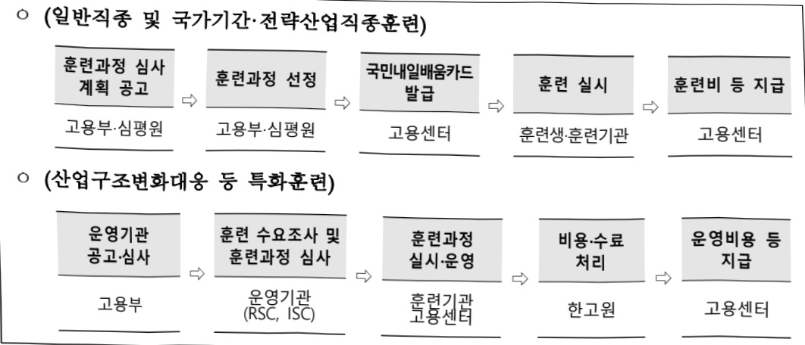

# 내일배움카드(고보)

**해당 페이지**: PDF 153 ~ 161 쪽 해당

**부처**: 고용노동부
**분야**: 사회복지
**회계유형**: 기금
**2026 확정예산**: 508979.0 백만원
**전년대비 증감률**: -15.6%
**AI 도메인**: 교육/인재

---

### 가.지출계획 총괄표

(단위: 백만원, %)

<table border=1 style='margin: auto; word-wrap: break-word;'><tr><td rowspan="2">목명</td><td rowspan="2">2024년 결산</td><td colspan="2">2025년 계획</td><td colspan="2">2026년 계획</td><td rowspan="2">중감 (B-A)</td><td rowspan="2">(B-A)/A</td></tr><tr><td style='text-align: center; word-wrap: break-word;'>당초(A)</td><td style='text-align: center; word-wrap: break-word;'>수정</td><td style='text-align: center; word-wrap: break-word;'>정부안</td><td style='text-align: center; word-wrap: break-word;'>확정(B)</td></tr><tr><td style='text-align: center; word-wrap: break-word;'>내일배움카 드(고보)</td><td style='text-align: center; word-wrap: break-word;'>571,022</td><td style='text-align: center; word-wrap: break-word;'>603,198</td><td style='text-align: center; word-wrap: break-word;'>603,198</td><td style='text-align: center; word-wrap: break-word;'>508,979</td><td style='text-align: center; word-wrap: break-word;'>508,979</td><td style='text-align: center; word-wrap: break-word;'>△94,219</td><td style='text-align: center; word-wrap: break-word;'>△15.6</td></tr></table>

□ 기능별(내역사업별) 계획 내역

(단위:백만원)

<table border=1 style='margin: auto; word-wrap: break-word;'><tr><td rowspan="3"></td><td colspan="5">2024</td><td colspan="6">2025(2025.12월말)</td><td rowspan="3">2026계획</td></tr><tr><td rowspan="2">계획액(수정)</td><td rowspan="2">계획현액</td><td rowspan="2">집행액</td><td rowspan="2">이월액</td><td rowspan="2">불용액</td><td colspan="2">계획액</td><td rowspan="2">계획현액</td><td rowspan="2">집행액</td><td rowspan="2">이월액</td><td rowspan="2">불용액</td></tr><tr><td style='text-align: center; word-wrap: break-word;'>당초</td><td style='text-align: center; word-wrap: break-word;'>수정</td></tr><tr><td style='text-align: center; word-wrap: break-word;'>○ 기능별 분류(합계)</td><td style='text-align: center; word-wrap: break-word;'>734,204</td><td style='text-align: center; word-wrap: break-word;'>721,374</td><td style='text-align: center; word-wrap: break-word;'>571,022</td><td style='text-align: center; word-wrap: break-word;'>-</td><td style='text-align: center; word-wrap: break-word;'>150,352</td><td style='text-align: center; word-wrap: break-word;'>603,198</td><td style='text-align: center; word-wrap: break-word;'>603,198</td><td style='text-align: center; word-wrap: break-word;'>603,198</td><td style='text-align: center; word-wrap: break-word;'>553,372</td><td style='text-align: center; word-wrap: break-word;'>37</td><td style='text-align: center; word-wrap: break-word;'>49,789</td><td style='text-align: center; word-wrap: break-word;'>508,979</td></tr><tr><td style='text-align: center; word-wrap: break-word;'>· 일반직종훈련</td><td style='text-align: center; word-wrap: break-word;'>331,239</td><td style='text-align: center; word-wrap: break-word;'>331,239</td><td style='text-align: center; word-wrap: break-word;'>296,553</td><td style='text-align: center; word-wrap: break-word;'>-</td><td style='text-align: center; word-wrap: break-word;'>34,686</td><td style='text-align: center; word-wrap: break-word;'>332,890</td><td style='text-align: center; word-wrap: break-word;'>332,890</td><td style='text-align: center; word-wrap: break-word;'>332,890</td><td style='text-align: center; word-wrap: break-word;'>284,980</td><td style='text-align: center; word-wrap: break-word;'>-</td><td style='text-align: center; word-wrap: break-word;'>47,910</td><td style='text-align: center; word-wrap: break-word;'>266,039</td></tr><tr><td style='text-align: center; word-wrap: break-word;'>· 국가기간· 전략산업직종훈련</td><td style='text-align: center; word-wrap: break-word;'>325,960</td><td style='text-align: center; word-wrap: break-word;'>313,098</td><td style='text-align: center; word-wrap: break-word;'>198,572</td><td style='text-align: center; word-wrap: break-word;'>-</td><td style='text-align: center; word-wrap: break-word;'>114,526</td><td style='text-align: center; word-wrap: break-word;'>205,160</td><td style='text-align: center; word-wrap: break-word;'>205,160</td><td style='text-align: center; word-wrap: break-word;'>191,160</td><td style='text-align: center; word-wrap: break-word;'>189,718</td><td style='text-align: center; word-wrap: break-word;'>-</td><td style='text-align: center; word-wrap: break-word;'>1,442</td><td style='text-align: center; word-wrap: break-word;'>159,995</td></tr><tr><td style='text-align: center; word-wrap: break-word;'>· 산업구조변화대응등 특화훈련</td><td style='text-align: center; word-wrap: break-word;'>75,960</td><td style='text-align: center; word-wrap: break-word;'>75,960</td><td style='text-align: center; word-wrap: break-word;'>74,904</td><td style='text-align: center; word-wrap: break-word;'>-</td><td style='text-align: center; word-wrap: break-word;'>1,056</td><td style='text-align: center; word-wrap: break-word;'>64,103</td><td style='text-align: center; word-wrap: break-word;'>64,103</td><td style='text-align: center; word-wrap: break-word;'>78,103</td><td style='text-align: center; word-wrap: break-word;'>77,741</td><td style='text-align: center; word-wrap: break-word;'>-</td><td style='text-align: center; word-wrap: break-word;'>362</td><td style='text-align: center; word-wrap: break-word;'>82,122</td></tr><tr><td style='text-align: center; word-wrap: break-word;'>· 운영비 등</td><td style='text-align: center; word-wrap: break-word;'>1,045</td><td style='text-align: center; word-wrap: break-word;'>1,077</td><td style='text-align: center; word-wrap: break-word;'>992</td><td style='text-align: center; word-wrap: break-word;'>-</td><td style='text-align: center; word-wrap: break-word;'>85</td><td style='text-align: center; word-wrap: break-word;'>1,045</td><td style='text-align: center; word-wrap: break-word;'>1,045</td><td style='text-align: center; word-wrap: break-word;'>1,045</td><td style='text-align: center; word-wrap: break-word;'>932</td><td style='text-align: center; word-wrap: break-word;'>37</td><td style='text-align: center; word-wrap: break-word;'>76</td><td style='text-align: center; word-wrap: break-word;'>823</td></tr></table>

### 나.사업설명자료

## 1 ) 사업목적·내용

- (일반직중 훈련) 급격한 기술발전에 적응하고 노동시장 변화에 대응하는 사회안전망차원에서 생애에 걸친 역량개발 향상 등을 위해 국민 스스로 직업능력개발훈련을 실시할 수 있도록 훈련비 등 지원

- (국가기간·전략산업직종 훈련) 금속, 동력, 전기, 전자 등 우리나라 중요 산업분야에서 부족하거나 새로운 수요가 예상되는 직종에 대한 직업능력개발훈련을 실시하여 기업에서 필요로 하는 기술·기능인력 양성·공급

- (산업구조변화대응 등 특화훈련) 산업구조 변화 및 고용위기 등으로 어려움을 겪고 있는 재직자, 자영업자 등의 고용유지, 이·전직을 신속히 지원하고 인력양성이 필요한 산업계의 인력수급을 활성화하기 위해 현장 수요 반영 훈련을 수시 공급하고 훈련비 등 지원

---

## 2 ) 사업개요

□ 사업근거 및 추진경위

① 법령상 근거 및 조항: 「국민 평생 직업능력개발법」 제12조, 제15조, 제17조 및 제18조

제12조(직업능력개발훈련 지원 등) ① 국가와 지방자치단체는 국민의 고용창출, 고용촉진 및 고용안정을 위하여 직업능력개발훈련을 실시하거나 직업능력개발훈련을 받는 사람에게 비용을 지원할 수 있다. 이 경우 제3조제4항 각 호에 해당하는 사람에 대하여는 우선적으로 지원될 수 있도록 하여야 한다.

② 제1항에 따라 실시하는 직업능력개발훈련의 대상, 훈련과정의 요건, 훈련수당, 그 밖에 직업능력개발훈련에 필요한 사항은 대통령령으로 정한다.

제15조(국가기간·전략산업직종에 대한 직업능력개발훈련의 실시) ① 국가와 지방자치단체는 다음 각 호의 직종(이하 “국가기간·전략산업직종”이라 한다)에 대한 원활한 인력수급을 위하여 필요한 직업능력개발훈련을 실시할 수 있다.

1. 국가경제의 기간(基념)이 되는 산업 중 인력이 부족한 직종

2. 정보통신산업·자동차산업 등 국가전략산업 중 인력이 부족한 직종

3. 그 밖에 산업현장의 인력수요 증대에 따라 인력을 양성할 필요가 있다고 고용노동부

장관이 고시하는 직종

② 국가기간 · 전략산업직종의 선정기준 및 절차, 훈련대상, 훈련과정의 요건, 훈련수당, 그 밖에 직업능력개발훈련에 필요한 사항은 대통령령으로 정한다.

제17조(근로자의 자율적 직업능력개발 지원) ① 고용노동부장관은 재직 중인 근로자의 자율적인 직업능력개발을 지원하기 위하여 근로자에게 다음 각 호의 비용을 지원하거나 융자할 수 있다.

1. 제19조에 따라 고용노동부장관의 인정을 받은 직업능력개발훈련과정의 수강 비용

2.「고등교육법」에 따른 전문대학 또는 이와 같은 수준 이상의 학력이 인정되는 교육과정의 수업료 및 그 밖의 납부금

3. 그 밖에 제1호 및 제2호의 비용에 준하는 비용으로서 대통령령으로 정하는 비용

② 고용노동부장관은 제1항에 따른 지원 또는 융자를 하는 경우에 다음 각 호의 근로자를 우대할 수 있다.

1. 대통령령으로 정하는 기준에 해당하는 기업에 고용된 근로자

2. 제3조제4항제9호 또는 제10호에 따른 근로자 중 대통령령으로 정하는 근로자

③ 제1항과 제2항에 따른 지원 또는 융자의 요건 · 내용 · 절차 · 수준 및 우대 지원에 필요한 사항은 대통령령으로 정한다.

제18조(직업능력개발계좌의 발급 및 운영) ① 고용노동부장관은 제12조 및 제17조에 따라 국민의 자율적 직업능력개발을 지원하기 위하여 직업능력개발훈련 비용을 지원하는 계좌(이하

---

“직업능력개발계좌”라 한다)를 발급하고 이들의 직업능력개발에 관한 이력을 종합적으로 관리하는 제도를 운영할 수 있다.

② 고용노동부장관은 직업능력개발계좌를 발급받은 국민이 직업능력개발계좌를 활용하여 필요한 직업능력개발훈련을 받을 수 있도록 다음 각 호의 사항을 실시하여야 한다.

1. 직업능력개발계좌에서 훈련 비용이 지급되는 직업능력개발훈련과정(이하 "계좌적합 훈련과정"이라 한다)에 대한 정보 제공

2. 직업능력개발 진단 및 상담

③ 고용노동부장관은 직업능력개발계좌를 발급받은 국민에게 직업·진로상담 및 경력개발을 지원할 수 있다.

④ 제1항 및 제2항에 따른 직업능력개발계좌의 발급, 계좌적합훈련과정의 정보 제공, 직업능력개발 진단 및 상담, 그 밖에 직업능력개발계좌제도의 운영에 필요한 사항은 대통령령으로 정한다.

② 추진경위

<일반직종 훈련>

- '98년 실업자의 (재)취업을 촉진하고자 취·창업훈련 및 고학력 미취업자 대상 취업 유명분야 훈련 실시

- '08.9월 공급자 중심의 기존 직업훈련체계를 수요자 중심으로 전환하고자 직업능력 개발계좌제 도입

- '11년 계좌제 훈련 전면 실시(물량배정방식 실업자훈련 폐지)

- '15년 직업능력개발계좌제와 국가기간·전략산업직종훈련 운영방식 통합

- '20년 실업자·근로자 내일배움카드 제도를 국민내일배움카드로 통합

<국가기간·전략산업직종훈련>

- '84년 신체장애자, 생활보호대상자 및 비진학 청소년 등 취약계층 대상 직업훈련 실시

- '97년 실업대책 및 인력부족직종 양성 사업의 일환으로 전환

- '11년 민간우선선정직종훈련과 대한상의우선선정직종훈련 통합 및 명칭 변경

(→국가기간·전략산업직종훈련)

- '15년 직업능력계좌제와 운영방식 및 실시규정 등 통합

<산업구조변화대응 등 특화훈련>

- '22년 종사자 및 산업계 등의 산업환경 변화 등에 따라 고용유지, 이·전직 등을 위해 희망하는 훈련수요에 기반한 훈련과정 실시

---

## □ 주요내용

① 사업규모

- 종사업비 : 해당 없음

- 사업기간 : '97년~계속

- 최근 5년 간 투입된 사업비(예산액기준, 추경편성한 연도에는 추경포함)

<table border=1 style='margin: auto; word-wrap: break-word;'><tr><td style='text-align: center; word-wrap: break-word;'>闰五</td><td style='text-align: center; word-wrap: break-word;'>2022</td><td style='text-align: center; word-wrap: break-word;'>2023</td><td style='text-align: center; word-wrap: break-word;'>2024</td><td style='text-align: center; word-wrap: break-word;'>2025</td><td style='text-align: center; word-wrap: break-word;'>2026</td></tr><tr><td style='text-align: center; word-wrap: break-word;'>사업비</td><td style='text-align: center; word-wrap: break-word;'>798,296</td><td style='text-align: center; word-wrap: break-word;'>887,312</td><td style='text-align: center; word-wrap: break-word;'>734,204</td><td style='text-align: center; word-wrap: break-word;'>603,198</td><td style='text-align: center; word-wrap: break-word;'>508,979</td></tr></table>

- 기타: '25년 훈련규모 638,500명

② 사업추진체계

- 사업시행방법 : 직접수행

-사업시행주체:고용노동부(지방고용노동관서)

- 사업 수혜자 : 15세 이상의 실업자, 영세자영업자, 특수형태근로종사자 등

- 보조, 융자, 출연, 출자 등의 경우 보조·융자 등 지원 비율 및 법적근거 : 해당없음

## 3 ) 2026년도 계획 산출 근거

① 일반직종 훈련

: (2025 당초 계획) 332,890백만원 → (2026 계획) 266,039백만원, 66,851백만원 감액

- (요구) AI 융복합 과정 신설(56,400명, 훈련비 NCS 단가 110% 적용)

- (산출) 훈련비 및 훈련장려금 266,039백만원

2025년도 계획 및 2026년도 계획 산출 세부내역 비교

<table border=1 style='margin: auto; word-wrap: break-word;'><tr><td colspan="2">2025년 계획</td><td colspan="2">2026년 계획</td></tr><tr><td style='text-align: center; word-wrap: break-word;'>예산</td><td style='text-align: center; word-wrap: break-word;'>산출내역</td><td style='text-align: center; word-wrap: break-word;'>예산</td><td style='text-align: center; word-wrap: break-word;'>산출내역</td></tr><tr><td style='text-align: center; word-wrap: break-word;'>332,890</td><td style='text-align: center; word-wrap: break-word;'>○ 보험금(320-04) : 332,890백만원가. 일반직종 훈련(실업자) 훈련비, 훈련장려금(273,376,000천원) • (348,000명 × 520천 원 × 1.3) + (104,000명 × 319천 원 × 1.1) + (24,000명 × 55천 원 × 1.3) = 273,376,000천원 • 조정재원(△82,000천원) 나. 일반직종훈련(재직자) 훈련비, 훈련장려금(59,514,000천원) • (239,000명 × 180천 원 × 1.3) + (12,000명 × 230천 원 × 1.3) = 59,514,000천원</td><td style='text-align: center; word-wrap: break-word;'>266,039</td><td style='text-align: center; word-wrap: break-word;'>○ 보험금(320-04) : 266,039백만원 - 훈련비 및 훈련장려금(266,039,000천원) • 564,000명 × 472천 원 = 266,208,000천원 • 조정재원(△169,000천원)</td></tr></table>

② 국가기간·전략산업직종 훈련

: (2025 당초 계획) 205,160백만원 → (2026 계획) 159,995백만원, 45,165백만원 감액

- (요구)

☐ 자부담 10% 부과

25년 실집행 추이 및 KDT 중복 직종 해소 반영하여 목표인원 감소(31,500명→25,500명)

© 훈련장려금 전년동(月 200천원) 및 뿌리산업직종훈련 특별훈련수당(수도권 10만원, 비수도권 20만원,

---

인구감소지역 30만원) 반영

- (산출) 훈련비 및 훈련장려금 등 159,995백만원

°2025년도 계획 및 2026년도 계획 산출 세부내역 비교

<table border=1 style='margin: auto; word-wrap: break-word;'><tr><td colspan="2">2025년 계획</td><td colspan="2">2026년 계획</td></tr><tr><td style='text-align: center; word-wrap: break-word;'>예산</td><td style='text-align: center; word-wrap: break-word;'>산출내역</td><td style='text-align: center; word-wrap: break-word;'>예산</td><td style='text-align: center; word-wrap: break-word;'>산출내역</td></tr><tr><td style='text-align: center; word-wrap: break-word;'>205,160</td><td style='text-align: center; word-wrap: break-word;'>기타보전금(310-04) : 205,160백만원</td><td style='text-align: center; word-wrap: break-word;'>기타보전금(310-04) : 159,995백만원가. 훈련비(125,899,000천원)  ·(훈련비) 25,500명 × 4,937천원 = 125,893,500천원가. 훈련비, 훈련장려금(205,160천원)  ·(훈련비) 31,500명 × 5,479천원 = 172,588,500천원  ·(훈련장려금) 31,500명 × 1,100천원 × 0.94 = 32,571,000천원나. 조정재원(500천원)</td><td style='text-align: center; word-wrap: break-word;'>159,995나. 훈련장려금 및 특별훈련수당(34,096,000천원)  ·(훈련장려금 및 특별훈련수당) 25,500명 × 1,337천원 = 34,093,500천원  ·(조정재원) 2,500천원</td></tr></table>

③산업구조변화대응 등 특화훈련

: (2025 당초 계획) 64,103백만원 → (2026 계획) 82,122백만원, 18,019백만원 증액

- (요구)

⑦ 자부담 10% 부과

ⓘ AI 전환 대응 과정 신설(4,000명, 단가 등 지급 요건은 육성산업직종과 동일)

© 훈련장려금 인상(月 116 → 200천원) 및 육성산업직종훈련 특별훈련수당(수도권 10만원, 비수도권 20만원, 인구감소지역 30만원) 반영

- (산출) 훈련비 및 훈련장려금 79,722백만원

  운영비 2,400백만원(△200백만원)

2025년도 계획 및 2026년도 계획 산출 세부내역 비교

<table border=1 style='margin: auto; word-wrap: break-word;'><tr><td colspan="2">2025년 계획</td><td colspan="2">2026년 계획</td></tr><tr><td style='text-align: center; word-wrap: break-word;'>예산</td><td style='text-align: center; word-wrap: break-word;'>산출내역</td><td style='text-align: center; word-wrap: break-word;'>예산</td><td style='text-align: center; word-wrap: break-word;'>산출내역</td></tr><tr><td rowspan="4">64,103</td><td style='text-align: center; word-wrap: break-word;'>○ 일반용역비(210-14): 2,600백만원
  · 지역별·산업별 인적자원개발위원회 10개소×260,000천원
  =2,600,000천원</td><td rowspan="4">82,122</td><td style='text-align: center; word-wrap: break-word;'>○ 일반용역비(210-14): 2,400백만원
  · 지역별·산업별 인적자원개발위원회 10개소×240,000천원
  =2,400,000천원</td></tr><tr><td style='text-align: center; word-wrap: break-word;'>○ 기타보전금(310-04): 61,503백만원</td><td style='text-align: center; word-wrap: break-word;'>○ 기타보전금(310-04): 79,722백만원</td></tr><tr><td style='text-align: center; word-wrap: break-word;'>가. 훈련비, 훈련장려금(61,497,000천원)
  · (훈련비) 20,000명×2,654천원=53,077,000천원
  · (훈련장려금, 특별훈련수당) 20,000명×421천원=8,420,000천원</td><td style='text-align: center; word-wrap: break-word;'>가. 훈련비(63,574,000천원)
  · (훈련비) 24,000명×2,649천원=63,576,000천원
  · (조정재원) △2,000천원</td></tr><tr><td style='text-align: center; word-wrap: break-word;'>나. 조정재원(6,000천원)</td><td style='text-align: center; word-wrap: break-word;'>나. 훈련장려금 및 특별훈련수당(16,148,000천원)
  · (훈련장려금 및 특별훈련수당) 24,000명×673천원=16,152,000천원
  · (조정재원) △4,000천원</td></tr></table>

④ 운영비

: (2025 당초 계획) 1,045백만원 → (2026 계획) 823백만원, 222백만원 감액

- (요구) 정책연구비 예산 감액(250→28백만원) 반영, 국내여비, 사업추진비 등 일부 세목 예산 조정

- (산출) 운영비 823백만원

2025년도 계획 및 2026년도 계획 산출 세부내역 비교

<table border=1 style='margin: auto; word-wrap: break-word;'><tr><td colspan="2">2025년 계획</td><td colspan="2">2026년 계획</td></tr><tr><td style='text-align: center; word-wrap: break-word;'>예산</td><td style='text-align: center; word-wrap: break-word;'>산출내역</td><td style='text-align: center; word-wrap: break-word;'>예산</td><td style='text-align: center; word-wrap: break-word;'>산출내역</td></tr><tr><td style='text-align: center; word-wrap: break-word;'>1,045</td><td style='text-align: center; word-wrap: break-word;'>○ 일반수용비(210-01): 460백만원
○ 국내여비(220-01): 65백만원
○ 사업추진비(240-01): 28백만원
○ 관서업무추진비(240-02): 46백만원
○ 정책연구비(260-02): 250백만원
○ 공사비(420-03): 96백만원
○ 자산취득비(430-01): 100백만원</td><td style='text-align: center; word-wrap: break-word;'>823</td><td style='text-align: center; word-wrap: break-word;'>○ 일반수용비(210-01): 466백만원
○ 국내여비(220-01): 62백만원
○ 사업추진비(240-01): 27백만원
○ 관서업무추진비(240-02): 44백만원
○ 정책연구비(260-02): 28백만원
○ 공사비(420-03): 96백만원
○ 자산취득비(430-01): 100백만원</td></tr></table>

---

## 4 ) 사업효과

□ 사업영향, 산출물 성과지표 등

① 2022~2026년도 성과계획서 상 성과지표 및 최근 5년간 성과 달성도

<table border=1 style='margin: auto; word-wrap: break-word;'><tr><td style='text-align: center; word-wrap: break-word;'>성과지표</td><td style='text-align: center; word-wrap: break-word;'>구분</td><td style='text-align: center; word-wrap: break-word;'>2022</td><td style='text-align: center; word-wrap: break-word;'>2023</td><td style='text-align: center; word-wrap: break-word;'>2024</td><td style='text-align: center; word-wrap: break-word;'>2025</td><td style='text-align: center; word-wrap: break-word;'>2026</td><td style='text-align: center; word-wrap: break-word;'>2026 목표치산출근거</td><td style='text-align: center; word-wrap: break-word;'>측정산식(또는 측정방법)</td><td style='text-align: center; word-wrap: break-word;'>자료수집방법(또는 자료출처)</td></tr><tr><td rowspan="3">K-Digital Training 수료율(단위: %)</td><td style='text-align: center; word-wrap: break-word;'>목표</td><td style='text-align: center; word-wrap: break-word;'>88.0</td><td style='text-align: center; word-wrap: break-word;'>(삭제)</td><td style='text-align: center; word-wrap: break-word;'>(삭제)</td><td style='text-align: center; word-wrap: break-word;'>(삭제)</td><td style='text-align: center; word-wrap: break-word;'>(삭제)</td><td rowspan="3">-</td><td rowspan="3">-</td><td rowspan="3">-</td></tr><tr><td style='text-align: center; word-wrap: break-word;'>실적</td><td style='text-align: center; word-wrap: break-word;'>89.7</td><td style='text-align: center; word-wrap: break-word;'>-</td><td style='text-align: center; word-wrap: break-word;'>-</td><td style='text-align: center; word-wrap: break-word;'>-</td><td style='text-align: center; word-wrap: break-word;'>-</td></tr><tr><td style='text-align: center; word-wrap: break-word;'>달성도</td><td style='text-align: center; word-wrap: break-word;'>101.9</td><td style='text-align: center; word-wrap: break-word;'>-</td><td style='text-align: center; word-wrap: break-word;'>-</td><td style='text-align: center; word-wrap: break-word;'>-</td><td style='text-align: center; word-wrap: break-word;'>-</td></tr><tr><td rowspan="3">일학습병행학습근로자수(단위: 명)</td><td style='text-align: center; word-wrap: break-word;'>목표</td><td style='text-align: center; word-wrap: break-word;'>130,000</td><td style='text-align: center; word-wrap: break-word;'>(삭제)</td><td style='text-align: center; word-wrap: break-word;'>(삭제)</td><td style='text-align: center; word-wrap: break-word;'>(삭제)</td><td style='text-align: center; word-wrap: break-word;'>(삭제)</td><td rowspan="3">-</td><td rowspan="3">-</td><td rowspan="3">-</td></tr><tr><td style='text-align: center; word-wrap: break-word;'>실적</td><td style='text-align: center; word-wrap: break-word;'>132,005</td><td style='text-align: center; word-wrap: break-word;'>-</td><td style='text-align: center; word-wrap: break-word;'>-</td><td style='text-align: center; word-wrap: break-word;'>-</td><td style='text-align: center; word-wrap: break-word;'>-</td></tr><tr><td style='text-align: center; word-wrap: break-word;'>달성도</td><td style='text-align: center; word-wrap: break-word;'>101.5</td><td style='text-align: center; word-wrap: break-word;'>-</td><td style='text-align: center; word-wrap: break-word;'>-</td><td style='text-align: center; word-wrap: break-word;'>-</td><td style='text-align: center; word-wrap: break-word;'>-</td></tr><tr><td rowspan="3">K-Digital Training 취업률(단위: %)</td><td style='text-align: center; word-wrap: break-word;'>목표</td><td style='text-align: center; word-wrap: break-word;'>(신규)</td><td style='text-align: center; word-wrap: break-word;'>68.2</td><td style='text-align: center; word-wrap: break-word;'>(삭제)</td><td style='text-align: center; word-wrap: break-word;'>(삭제)</td><td style='text-align: center; word-wrap: break-word;'>(삭제)</td><td rowspan="3">-</td><td rowspan="3">-</td><td rowspan="3">-</td></tr><tr><td style='text-align: center; word-wrap: break-word;'>실적</td><td style='text-align: center; word-wrap: break-word;'>-</td><td style='text-align: center; word-wrap: break-word;'>57.5</td><td style='text-align: center; word-wrap: break-word;'>-</td><td style='text-align: center; word-wrap: break-word;'>-</td><td style='text-align: center; word-wrap: break-word;'>-</td></tr><tr><td style='text-align: center; word-wrap: break-word;'>달성도</td><td style='text-align: center; word-wrap: break-word;'>-</td><td style='text-align: center; word-wrap: break-word;'>84.3</td><td style='text-align: center; word-wrap: break-word;'>-</td><td style='text-align: center; word-wrap: break-word;'>-</td><td style='text-align: center; word-wrap: break-word;'>-</td></tr><tr><td rowspan="3">폴리텍하이테크과정취업률(단위: %)</td><td style='text-align: center; word-wrap: break-word;'>목표</td><td style='text-align: center; word-wrap: break-word;'>73.0</td><td style='text-align: center; word-wrap: break-word;'>80.3</td><td style='text-align: center; word-wrap: break-word;'>(삭제)</td><td style='text-align: center; word-wrap: break-word;'>(삭제)</td><td style='text-align: center; word-wrap: break-word;'>(삭제)</td><td rowspan="3">-</td><td rowspan="3">-</td><td rowspan="3">-</td></tr><tr><td style='text-align: center; word-wrap: break-word;'>실적</td><td style='text-align: center; word-wrap: break-word;'>81.7</td><td style='text-align: center; word-wrap: break-word;'>80.1</td><td style='text-align: center; word-wrap: break-word;'>-</td><td style='text-align: center; word-wrap: break-word;'>-</td><td style='text-align: center; word-wrap: break-word;'>-</td></tr><tr><td style='text-align: center; word-wrap: break-word;'>달성도</td><td style='text-align: center; word-wrap: break-word;'>111.9</td><td style='text-align: center; word-wrap: break-word;'>99.8</td><td style='text-align: center; word-wrap: break-word;'>-</td><td style='text-align: center; word-wrap: break-word;'>-</td><td style='text-align: center; word-wrap: break-word;'>-</td></tr><tr><td rowspan="3">일학습병행학습근로자수료율(단위: %)</td><td style='text-align: center; word-wrap: break-word;'>목표</td><td style='text-align: center; word-wrap: break-word;'>(신규)</td><td style='text-align: center; word-wrap: break-word;'>78.2</td><td style='text-align: center; word-wrap: break-word;'>(삭제)</td><td style='text-align: center; word-wrap: break-word;'>(삭제)</td><td style='text-align: center; word-wrap: break-word;'>(삭제)</td><td rowspan="3">-</td><td rowspan="3">-</td><td rowspan="3">-</td></tr><tr><td style='text-align: center; word-wrap: break-word;'>실적</td><td style='text-align: center; word-wrap: break-word;'>-</td><td style='text-align: center; word-wrap: break-word;'>78.6</td><td style='text-align: center; word-wrap: break-word;'>-</td><td style='text-align: center; word-wrap: break-word;'>-</td><td style='text-align: center; word-wrap: break-word;'>-</td></tr><tr><td style='text-align: center; word-wrap: break-word;'>달성도</td><td style='text-align: center; word-wrap: break-word;'>-</td><td style='text-align: center; word-wrap: break-word;'>99.7</td><td style='text-align: center; word-wrap: break-word;'>-</td><td style='text-align: center; word-wrap: break-word;'>-</td><td style='text-align: center; word-wrap: break-word;'>-</td></tr><tr><td rowspan="3">국민내일배움카드훈련인원(단위: 명)</td><td style='text-align: center; word-wrap: break-word;'>목표</td><td style='text-align: center; word-wrap: break-word;'>(신규)</td><td style='text-align: center; word-wrap: break-word;'>(신규)</td><td style='text-align: center; word-wrap: break-word;'>786,000</td><td style='text-align: center; word-wrap: break-word;'>690,258</td><td style='text-align: center; word-wrap: break-word;'>(삭제)</td><td rowspan="3">-</td><td rowspan="3">-</td><td rowspan="3">-</td></tr><tr><td style='text-align: center; word-wrap: break-word;'>실적</td><td style='text-align: center; word-wrap: break-word;'>-</td><td style='text-align: center; word-wrap: break-word;'>-</td><td style='text-align: center; word-wrap: break-word;'>664,955</td><td style='text-align: center; word-wrap: break-word;'>-</td><td style='text-align: center; word-wrap: break-word;'>-</td></tr><tr><td style='text-align: center; word-wrap: break-word;'>달성도</td><td style='text-align: center; word-wrap: break-word;'>-</td><td style='text-align: center; word-wrap: break-word;'>-</td><td style='text-align: center; word-wrap: break-word;'>84.5</td><td style='text-align: center; word-wrap: break-word;'>-</td><td style='text-align: center; word-wrap: break-word;'>-</td></tr><tr><td rowspan="3">훈련 양성률(단위: %)</td><td style='text-align: center; word-wrap: break-word;'>목표</td><td style='text-align: center; word-wrap: break-word;'>(신규)</td><td style='text-align: center; word-wrap: break-word;'>(신규)</td><td style='text-align: center; word-wrap: break-word;'>(신규)</td><td style='text-align: center; word-wrap: break-word;'>(신규)</td><td style='text-align: center; word-wrap: break-word;'>89.3</td><td rowspan="3">최근 3년 실적평균치**(22) 88.8(23) 89.7(24) 89.5</td><td rowspan="3">(내일배움카드 수료인원/훈련실시인원) × 08(가중치)+(폴리텍 훈련 수료인원/훈련실시인원) × 02(가중치)</td><td rowspan="3">전수조사(한국고용정보원 및 한국폴리텍대학)</td></tr><tr><td style='text-align: center; word-wrap: break-word;'>실적</td><td style='text-align: center; word-wrap: break-word;'>-</td><td style='text-align: center; word-wrap: break-word;'>-</td><td style='text-align: center; word-wrap: break-word;'>-</td><td style='text-align: center; word-wrap: break-word;'>-</td><td style='text-align: center; word-wrap: break-word;'>-</td></tr><tr><td style='text-align: center; word-wrap: break-word;'>달성도</td><td style='text-align: center; word-wrap: break-word;'>-</td><td style='text-align: center; word-wrap: break-word;'>-</td><td style='text-align: center; word-wrap: break-word;'>-</td><td style='text-align: center; word-wrap: break-word;'>-</td><td style='text-align: center; word-wrap: break-word;'>-</td></tr></table>

② 성과지표 이외의 연도별 사업추진 경과 및 실적

<table border=1 style='margin: auto; word-wrap: break-word;'><tr><td style='text-align: center; word-wrap: break-word;'>2022</td><td style='text-align: center; word-wrap: break-word;'>실시인원 869,944명, 829,591백만원 지원</td></tr><tr><td style='text-align: center; word-wrap: break-word;'>2023</td><td style='text-align: center; word-wrap: break-word;'>실시인원 804,936명, 655,434백만원 지원</td></tr><tr><td style='text-align: center; word-wrap: break-word;'>2024</td><td style='text-align: center; word-wrap: break-word;'>실시인원 645,858명, 571,022백만원 지원</td></tr><tr><td style='text-align: center; word-wrap: break-word;'>2025</td><td style='text-align: center; word-wrap: break-word;'>실시인원 568,329명(2025.11월말 기준), 553,372백만원 지원(2025.12월말 기준 잠정)</td></tr></table>

---

③ 향후(2026년도 이후) 기대효과

- 산업구조, 노동시장 변화에 따른 이·전직 수요 등을 종합적으로 고려하여 직업훈련 수요에 반영하고 다양한 훈련과정을 공급하여 국민의 고용안정과 노동이동, 생애에 걸친 직업능력개발 등에 기여

5) 타당성조사 및 예비타당성조사 시행여부 및 결과 요지 : 해당 없음

6) 총사업비 대상사업 여부 및 내역 : 해당 없음

## 7 ) 사업 집행절차

## ° (일반직종 및 국가기간·전략산업직종훈련)

훈련과정 심사

계획 공고

훈련과정 선정

고용부·심평원

고용부·심평원

국민내일배움카드

발급

훈련 실시

고용센터

훈련비 등 지급

훈련생·훈련기관

° (산업구조변화대응 등 특화훈련)

고용센터

운영기관

공고·심사

고용부

훈련 수요조사 및

훈련과정 심사

운영기관(RSC, ISC)

훈련과정

실시·운영

훈련기관

고용센터

비용·수료

처리

한고원

운영비용 등

지급

고용센터

## 8 ) 각종 평가

1) 국회(예결위, 상임위, 예정처, 국정감사 포함) 지적

○ 산업구조변화대응 등 특화훈련은 지역 현장에 맞는 훈련과정 공급 및 우수사례 공유 등 사업 집행 개선방안 마련하고, 지역인적자원개발위원회에 대한 성과평가 실시 후 환류체계를 마련할 것(예결위, '22년 결산)

국가기간·전략산업직종 훈련의 적정 목표 설정 및 경쟁력 강화방안 마련(예결위, '23년 결산)

국가기간·전략산업직종 훈련의 물류직종 직업훈련 현장실습장 관리·감독 방안

마련 필요(국정감사, '23년)

국가기간·전략산업직종훈련 사업과 KDT 사업 간 중복해소 방안 마련하여 효율적 예산 집행이 이루어질 수 있도록 할 것(예결위, '24년 결산)

2) 대외공개 평가: 해당 없음

3) 자체평가: 해당 없음

---

### 다. 최근 4년간 결산내역

## 1 ) 결산표

☐ 부처 결산내역

(단위: 백만원, %)

<table border=1 style='margin: auto; word-wrap: break-word;'><tr><td rowspan="2">연도</td><td colspan="3">계획액</td><td rowspan="2">계획현액(B)</td><td rowspan="2">집행액(C)</td><td rowspan="2">집행률(C/A)</td><td rowspan="2">집행률(C/B)</td><td rowspan="2">다음연도이월액</td><td rowspan="2">불용액</td></tr><tr><td style='text-align: center; word-wrap: break-word;'>당초</td><td style='text-align: center; word-wrap: break-word;'>중감액</td><td style='text-align: center; word-wrap: break-word;'>수정(A)</td></tr><tr><td style='text-align: center; word-wrap: break-word;'>2022</td><td style='text-align: center; word-wrap: break-word;'>798,296</td><td style='text-align: center; word-wrap: break-word;'>40,000</td><td style='text-align: center; word-wrap: break-word;'>838,296</td><td style='text-align: center; word-wrap: break-word;'>838,426</td><td style='text-align: center; word-wrap: break-word;'>755,679</td><td style='text-align: center; word-wrap: break-word;'>90.1</td><td style='text-align: center; word-wrap: break-word;'>90.1</td><td style='text-align: center; word-wrap: break-word;'>76</td><td style='text-align: center; word-wrap: break-word;'>82,670</td></tr><tr><td style='text-align: center; word-wrap: break-word;'>2023</td><td style='text-align: center; word-wrap: break-word;'>887,312</td><td style='text-align: center; word-wrap: break-word;'>-</td><td style='text-align: center; word-wrap: break-word;'>887,312</td><td style='text-align: center; word-wrap: break-word;'>887,388</td><td style='text-align: center; word-wrap: break-word;'>655,434</td><td style='text-align: center; word-wrap: break-word;'>73.9</td><td style='text-align: center; word-wrap: break-word;'>73.9</td><td style='text-align: center; word-wrap: break-word;'>32</td><td style='text-align: center; word-wrap: break-word;'>231,922</td></tr><tr><td style='text-align: center; word-wrap: break-word;'>2024</td><td style='text-align: center; word-wrap: break-word;'>734,204</td><td style='text-align: center; word-wrap: break-word;'>△12,862</td><td style='text-align: center; word-wrap: break-word;'>721,342</td><td style='text-align: center; word-wrap: break-word;'>721,374</td><td style='text-align: center; word-wrap: break-word;'>571,022</td><td style='text-align: center; word-wrap: break-word;'>79.2</td><td style='text-align: center; word-wrap: break-word;'>79.2</td><td style='text-align: center; word-wrap: break-word;'>-</td><td style='text-align: center; word-wrap: break-word;'>150,352</td></tr><tr><td style='text-align: center; word-wrap: break-word;'>2025</td><td style='text-align: center; word-wrap: break-word;'>603,198</td><td style='text-align: center; word-wrap: break-word;'>-</td><td style='text-align: center; word-wrap: break-word;'>603,198</td><td style='text-align: center; word-wrap: break-word;'>603,198</td><td style='text-align: center; word-wrap: break-word;'>553,372</td><td style='text-align: center; word-wrap: break-word;'>91.7</td><td style='text-align: center; word-wrap: break-word;'>91.7</td><td style='text-align: center; word-wrap: break-word;'>37</td><td style='text-align: center; word-wrap: break-word;'>49,789</td></tr></table>

## 2 ) 주요 결산사항

□ 2022~2025년 결산사항

<table border=1 style='margin: auto; word-wrap: break-word;'><tr><td style='text-align: center; word-wrap: break-word;'>2022</td><td style='text-align: center; word-wrap: break-word;'>- (이월) 용역계약이 익년도 종료되어 일반연구비 76백만원 이월
- (불용) 산업구조변화대응 등 특화훈련은 ‘22년 신규사업으로 지역현장에 맞는 훈련과정을 신설하는 것이 사업의 핵심적인 사항이다 보니 훈련수요 선별 등 훈련과정 기반을 새롭게 만드는 과정에서 사업이 지체됨</td></tr><tr><td style='text-align: center; word-wrap: break-word;'>2023</td><td style='text-align: center; word-wrap: break-word;'>- (이월) 용역계약이 익년도 종료되어 일반연구비 32백만원 이월
- (불용) 훈련기간이 장기과정인 국가기간·전략산업직종 훈련 참여 저조로 인한 불용 발생</td></tr><tr><td style='text-align: center; word-wrap: break-word;'>2024</td><td style='text-align: center; word-wrap: break-word;'>- (불용) 훈련기간이 장기과정인 국가기간·전략산업직종 훈련 참여 저조로 인한 불용 발생</td></tr><tr><td style='text-align: center; word-wrap: break-word;'>2025</td><td style='text-align: center; word-wrap: break-word;'>- 해당 없음</td></tr></table>

2025년 계획변경 세부내역 : 해당 없음

---

<table border=1 style='margin: auto; word-wrap: break-word;'><tr><td style='text-align: center; word-wrap: break-word;'>사 업 명</td></tr><tr><td style='text-align: center; word-wrap: break-word;'>가. (23) 내 일 배 움카드(일반)(1131-300)</td></tr></table>

□ 사업 코드 정보

<table border=1 style='margin: auto; word-wrap: break-word;'><tr><td style='text-align: center; word-wrap: break-word;'>구분</td><td style='text-align: center; word-wrap: break-word;'>회계</td><td style='text-align: center; word-wrap: break-word;'>소관</td><td style='text-align: center; word-wrap: break-word;'>실국(기관)</td><td style='text-align: center; word-wrap: break-word;'>계정</td><td style='text-align: center; word-wrap: break-word;'>분야</td><td style='text-align: center; word-wrap: break-word;'>부문</td></tr><tr><td style='text-align: center; word-wrap: break-word;'>코드</td><td rowspan="2">일반회계</td><td rowspan="2">고용노동부</td><td rowspan="2">직업능력정책국</td><td rowspan="2">-</td><td style='text-align: center; word-wrap: break-word;'>080</td><td style='text-align: center; word-wrap: break-word;'>08D</td></tr><tr><td style='text-align: center; word-wrap: break-word;'>명칭</td><td style='text-align: center; word-wrap: break-word;'>사회복지</td><td style='text-align: center; word-wrap: break-word;'>고용</td></tr></table>

<table border=1 style='margin: auto; word-wrap: break-word;'><tr><td style='text-align: center; word-wrap: break-word;'>구분</td><td style='text-align: center; word-wrap: break-word;'>프로그램</td><td style='text-align: center; word-wrap: break-word;'>단위사업</td><td style='text-align: center; word-wrap: break-word;'>세부사업</td></tr><tr><td style='text-align: center; word-wrap: break-word;'>코드</td><td style='text-align: center; word-wrap: break-word;'>1100</td><td style='text-align: center; word-wrap: break-word;'>1131</td><td style='text-align: center; word-wrap: break-word;'>300</td></tr><tr><td style='text-align: center; word-wrap: break-word;'>명칭</td><td style='text-align: center; word-wrap: break-word;'>직업능력개발</td><td style='text-align: center; word-wrap: break-word;'>실업자등능력개발지원</td><td style='text-align: center; word-wrap: break-word;'>내일배움카드(일반)</td></tr></table>

□ 사업 성격

<table border=1 style='margin: auto; word-wrap: break-word;'><tr><td rowspan="2">신규</td><td rowspan="2">계속</td><td rowspan="2">완료</td><td rowspan="2">예비타당성 실시여부</td><td rowspan="2">총사업비 관리대상</td><td rowspan="2">총액계상 예산사업</td><td style='text-align: center; word-wrap: break-word;'>사업소관 변경정보</td></tr><tr><td style='text-align: center; word-wrap: break-word;'>2025예산 시 소관</td></tr><tr><td style='text-align: center; word-wrap: break-word;'></td><td style='text-align: center; word-wrap: break-word;'>○</td><td style='text-align: center; word-wrap: break-word;'></td><td style='text-align: center; word-wrap: break-word;'></td><td style='text-align: center; word-wrap: break-word;'></td><td style='text-align: center; word-wrap: break-word;'></td><td style='text-align: center; word-wrap: break-word;'></td></tr></table>

□ 사업 지원 형태 및 지원을

<table border=1 style='margin: auto; word-wrap: break-word;'><tr><td style='text-align: center; word-wrap: break-word;'>직접</td><td style='text-align: center; word-wrap: break-word;'>출자</td><td style='text-align: center; word-wrap: break-word;'>출연</td><td style='text-align: center; word-wrap: break-word;'>보조</td><td style='text-align: center; word-wrap: break-word;'>융자</td><td style='text-align: center; word-wrap: break-word;'>국고보조율(%)</td><td style='text-align: center; word-wrap: break-word;'>융자율(%)</td></tr><tr><td style='text-align: center; word-wrap: break-word;'>0</td><td style='text-align: center; word-wrap: break-word;'></td><td style='text-align: center; word-wrap: break-word;'></td><td style='text-align: center; word-wrap: break-word;'></td><td style='text-align: center; word-wrap: break-word;'></td><td style='text-align: center; word-wrap: break-word;'></td><td style='text-align: center; word-wrap: break-word;'></td></tr></table>

□ 사업 소관부처 및 시행주체

<table border=1 style='margin: auto; word-wrap: break-word;'><tr><td style='text-align: center; word-wrap: break-word;'>사업명</td><td colspan="2">구분</td></tr><tr><td rowspan="3">K-하이테크 플러스 사업 (첨단산업·디지털 핵심 실무인재 양성훈련)</td><td rowspan="3">소관부처</td><td style='text-align: center; word-wrap: break-word;'>실·국·과(팀)</td></tr><tr><td style='text-align: center; word-wrap: break-word;'>직업능력정책국</td></tr><tr><td style='text-align: center; word-wrap: break-word;'>인적자원개발과</td></tr><tr><td rowspan="3">K-하이테크 플러스 사업 (첨단산업·디지털 기초역량훈련)</td><td rowspan="3">소관부처</td><td style='text-align: center; word-wrap: break-word;'>실·국·과(팀)</td></tr><tr><td style='text-align: center; word-wrap: break-word;'>직업능력정책국</td></tr><tr><td style='text-align: center; word-wrap: break-word;'>인적자원개발과</td></tr><tr><td rowspan="3">돌봄서비스 훈련</td><td rowspan="3">소관부처</td><td style='text-align: center; word-wrap: break-word;'>실·국·과(팀)</td></tr><tr><td style='text-align: center; word-wrap: break-word;'>직업능력정책국</td></tr><tr><td style='text-align: center; word-wrap: break-word;'>인적자원개발과</td></tr><tr><td rowspan="3">일반고 특화훈련</td><td rowspan="3">소관부처</td><td style='text-align: center; word-wrap: break-word;'>실·국·과(팀)</td></tr><tr><td style='text-align: center; word-wrap: break-word;'>직업능력정책국</td></tr><tr><td style='text-align: center; word-wrap: break-word;'>인적자원개발과</td></tr></table>

---

### 원본 PDF 크롭 이미지

