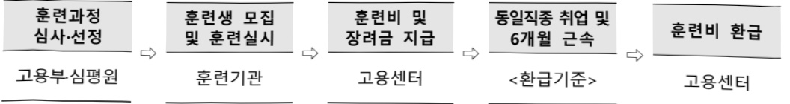
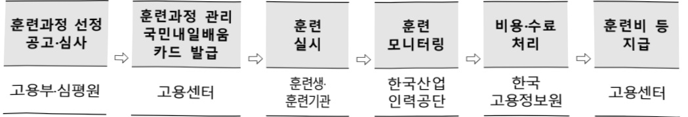

# 내일배움카드(일반)

**해당 페이지**: PDF 162 ~ 171 쪽 해당

**부처**: 고용노동부
**분야**: 사회복지
**회계유형**: 일반회계
**2026 확정예산**: 627325.0 백만원
**전년대비 증감률**: 8.1%
**AI 도메인**: 교육/인재

---

### 가. 예산 총괄표

(단위: 백만원, %)

<table border=1 style='margin: auto; word-wrap: break-word;'><tr><td rowspan="2">사업명</td><td style='text-align: center; word-wrap: break-word;'>2024년</td><td colspan="2">2025년 예산</td><td colspan="2">2026년 예산</td><td rowspan="2">중감(B-A)</td><td rowspan="2">(B-A)/A</td></tr><tr><td style='text-align: center; word-wrap: break-word;'>결산</td><td style='text-align: center; word-wrap: break-word;'>본예산(A)</td><td style='text-align: center; word-wrap: break-word;'>추경</td><td style='text-align: center; word-wrap: break-word;'>정부안</td><td style='text-align: center; word-wrap: break-word;'>확정(B)</td></tr><tr><td style='text-align: center; word-wrap: break-word;'>내일배움카드(일반)</td><td style='text-align: center; word-wrap: break-word;'>577,838</td><td style='text-align: center; word-wrap: break-word;'>580,161</td><td style='text-align: center; word-wrap: break-word;'>596,161</td><td style='text-align: center; word-wrap: break-word;'>627,325</td><td style='text-align: center; word-wrap: break-word;'>627,325</td><td style='text-align: center; word-wrap: break-word;'>47,164</td><td style='text-align: center; word-wrap: break-word;'>8.1</td></tr></table>

□ 기능별(내역사업별) 예산 내역

(단위:백만원)

<table border=1 style='margin: auto; word-wrap: break-word;'><tr><td rowspan="2"></td><td colspan="5">2024</td><td colspan="5">2025(2025.12월말)</td><td rowspan="2">2026예산</td></tr><tr><td style='text-align: center; word-wrap: break-word;'>예산액(추경)</td><td style='text-align: center; word-wrap: break-word;'>예산현액</td><td style='text-align: center; word-wrap: break-word;'>집행액</td><td style='text-align: center; word-wrap: break-word;'>이월액</td><td style='text-align: center; word-wrap: break-word;'>불용액</td><td style='text-align: center; word-wrap: break-word;'>본예산</td><td style='text-align: center; word-wrap: break-word;'>예산현액</td><td style='text-align: center; word-wrap: break-word;'>집행액</td><td style='text-align: center; word-wrap: break-word;'>이월액</td><td style='text-align: center; word-wrap: break-word;'>불용액</td></tr><tr><td style='text-align: center; word-wrap: break-word;'>○ 기능별 분류(합계)</td><td style='text-align: center; word-wrap: break-word;'>584,906</td><td style='text-align: center; word-wrap: break-word;'>591,270</td><td style='text-align: center; word-wrap: break-word;'>577,838</td><td style='text-align: center; word-wrap: break-word;'>-</td><td style='text-align: center; word-wrap: break-word;'>13,432</td><td style='text-align: center; word-wrap: break-word;'>580,161</td><td style='text-align: center; word-wrap: break-word;'>596,161</td><td style='text-align: center; word-wrap: break-word;'>593,909</td><td style='text-align: center; word-wrap: break-word;'>38</td><td style='text-align: center; word-wrap: break-word;'>2,214</td><td style='text-align: center; word-wrap: break-word;'>627,325</td></tr><tr><td style='text-align: center; word-wrap: break-word;'>• K-하이테크 플러스사업</td><td style='text-align: center; word-wrap: break-word;'>-</td><td style='text-align: center; word-wrap: break-word;'>-</td><td style='text-align: center; word-wrap: break-word;'>-</td><td style='text-align: center; word-wrap: break-word;'>-</td><td style='text-align: center; word-wrap: break-word;'>-</td><td style='text-align: center; word-wrap: break-word;'>498,116</td><td style='text-align: center; word-wrap: break-word;'>497,616</td><td style='text-align: center; word-wrap: break-word;'>496,590</td><td style='text-align: center; word-wrap: break-word;'>-</td><td style='text-align: center; word-wrap: break-word;'>1,026</td><td style='text-align: center; word-wrap: break-word;'>541,313</td></tr><tr><td style='text-align: center; word-wrap: break-word;'>• 첨단산업·디지털핵심 실무인재양성훈련</td><td style='text-align: center; word-wrap: break-word;'>473,188</td><td style='text-align: center; word-wrap: break-word;'>475,688</td><td style='text-align: center; word-wrap: break-word;'>475,499</td><td style='text-align: center; word-wrap: break-word;'>-</td><td style='text-align: center; word-wrap: break-word;'>189</td><td style='text-align: center; word-wrap: break-word;'>478,116</td><td style='text-align: center; word-wrap: break-word;'>477,616</td><td style='text-align: center; word-wrap: break-word;'>477,065</td><td style='text-align: center; word-wrap: break-word;'>-</td><td style='text-align: center; word-wrap: break-word;'>551</td><td style='text-align: center; word-wrap: break-word;'>521,313</td></tr><tr><td style='text-align: center; word-wrap: break-word;'>• 첨단산업·디지털기초역량훈련</td><td style='text-align: center; word-wrap: break-word;'>-</td><td style='text-align: center; word-wrap: break-word;'>-</td><td style='text-align: center; word-wrap: break-word;'>-</td><td style='text-align: center; word-wrap: break-word;'>-</td><td style='text-align: center; word-wrap: break-word;'>-</td><td style='text-align: center; word-wrap: break-word;'>20,000</td><td style='text-align: center; word-wrap: break-word;'>20,000</td><td style='text-align: center; word-wrap: break-word;'>19,525</td><td style='text-align: center; word-wrap: break-word;'>-</td><td style='text-align: center; word-wrap: break-word;'>475</td><td style='text-align: center; word-wrap: break-word;'>20,000</td></tr><tr><td style='text-align: center; word-wrap: break-word;'>• 돌봄서비스 훈련</td><td style='text-align: center; word-wrap: break-word;'>35,000</td><td style='text-align: center; word-wrap: break-word;'>27,000</td><td style='text-align: center; word-wrap: break-word;'>15,707</td><td style='text-align: center; word-wrap: break-word;'>-</td><td style='text-align: center; word-wrap: break-word;'>11,293</td><td style='text-align: center; word-wrap: break-word;'>33,100</td><td style='text-align: center; word-wrap: break-word;'>33,600</td><td style='text-align: center; word-wrap: break-word;'>33,566</td><td style='text-align: center; word-wrap: break-word;'>-</td><td style='text-align: center; word-wrap: break-word;'>34</td><td style='text-align: center; word-wrap: break-word;'>29,440</td></tr><tr><td style='text-align: center; word-wrap: break-word;'>• 일반고 특화훈련</td><td style='text-align: center; word-wrap: break-word;'>49,230</td><td style='text-align: center; word-wrap: break-word;'>49,230</td><td style='text-align: center; word-wrap: break-word;'>48,818</td><td style='text-align: center; word-wrap: break-word;'>-</td><td style='text-align: center; word-wrap: break-word;'>412</td><td style='text-align: center; word-wrap: break-word;'>45,557</td><td style='text-align: center; word-wrap: break-word;'>61,557</td><td style='text-align: center; word-wrap: break-word;'>60,627</td><td style='text-align: center; word-wrap: break-word;'>-</td><td style='text-align: center; word-wrap: break-word;'>930</td><td style='text-align: center; word-wrap: break-word;'>55,383</td></tr><tr><td style='text-align: center; word-wrap: break-word;'>• 평생크레딧</td><td style='text-align: center; word-wrap: break-word;'>25,000</td><td style='text-align: center; word-wrap: break-word;'>32,117</td><td style='text-align: center; word-wrap: break-word;'>31,576</td><td style='text-align: center; word-wrap: break-word;'>-</td><td style='text-align: center; word-wrap: break-word;'>541</td><td style='text-align: center; word-wrap: break-word;'>-</td><td style='text-align: center; word-wrap: break-word;'>-</td><td style='text-align: center; word-wrap: break-word;'>-</td><td style='text-align: center; word-wrap: break-word;'>-</td><td style='text-align: center; word-wrap: break-word;'>-</td><td style='text-align: center; word-wrap: break-word;'>-</td></tr><tr><td style='text-align: center; word-wrap: break-word;'>• 플랫폼 종사자특화훈련</td><td style='text-align: center; word-wrap: break-word;'>-</td><td style='text-align: center; word-wrap: break-word;'>4,447</td><td style='text-align: center; word-wrap: break-word;'>3,959</td><td style='text-align: center; word-wrap: break-word;'>-</td><td style='text-align: center; word-wrap: break-word;'>488</td><td style='text-align: center; word-wrap: break-word;'>-</td><td style='text-align: center; word-wrap: break-word;'>-</td><td style='text-align: center; word-wrap: break-word;'>-</td><td style='text-align: center; word-wrap: break-word;'>-</td><td style='text-align: center; word-wrap: break-word;'>-</td><td style='text-align: center; word-wrap: break-word;'>-</td></tr><tr><td style='text-align: center; word-wrap: break-word;'>• 신기술 인력수급분석 지원</td><td style='text-align: center; word-wrap: break-word;'>1,000</td><td style='text-align: center; word-wrap: break-word;'>1,300</td><td style='text-align: center; word-wrap: break-word;'>1,300</td><td style='text-align: center; word-wrap: break-word;'>-</td><td style='text-align: center; word-wrap: break-word;'>-</td><td style='text-align: center; word-wrap: break-word;'>900</td><td style='text-align: center; word-wrap: break-word;'>900</td><td style='text-align: center; word-wrap: break-word;'>900</td><td style='text-align: center; word-wrap: break-word;'>-</td><td style='text-align: center; word-wrap: break-word;'>-</td><td style='text-align: center; word-wrap: break-word;'>-</td></tr><tr><td style='text-align: center; word-wrap: break-word;'>• 운영비 등</td><td style='text-align: center; word-wrap: break-word;'>1,488</td><td style='text-align: center; word-wrap: break-word;'>1,488</td><td style='text-align: center; word-wrap: break-word;'>979</td><td style='text-align: center; word-wrap: break-word;'>-</td><td style='text-align: center; word-wrap: break-word;'>509</td><td style='text-align: center; word-wrap: break-word;'>2,488</td><td style='text-align: center; word-wrap: break-word;'>2,488</td><td style='text-align: center; word-wrap: break-word;'>2,226</td><td style='text-align: center; word-wrap: break-word;'>38</td><td style='text-align: center; word-wrap: break-word;'>224</td><td style='text-align: center; word-wrap: break-word;'>1,189</td></tr></table>

### 나.사업설명자료

## 1 ) 사업목적·내용

- (K-하이테크 플러스 사업 내 첨단산업·디지털 핵심 실무인재 양성훈련) 민간 혁신훈련기관, 신기술 분야 선도기업, 대학 등을 통해 첨단산업·디지털 분야 핵심 실무인재를 양성할 수 있도록 훈련비 등 지원

- (K-하이테크 플러스 사업 내 첨단산업·디지털 기초역량훈련) 노동시장 참여자가 디지털 역

량 부족으로 노동시장 진입·적응에 어려움을 겪지 않도록 디지털 기초훈련 지원

- (돌봄서비스 훈련) 노인돌봄, 보육 등 중앙정부의 정책적·제도적으로 양성이 필요한 분야에 대하여 특화훈련을 신설하여 체계적 관리

---

- (일반고 특화훈련) 취업을 희망하는 일반고 3학년 재학생의 직업능력개발훈련 기회

학대 및 노동시장 진입 촉진할 수 있도록 훈련비 등 지원

## 2 ) 사업개요

☐ 사업근거 및 추진경위

① 법령상 근거 : 「국민 평생 직업능력개발법」 제12조, 제15조, 제17조 및 제18조

<table border=1 style='margin: auto; word-wrap: break-word;'><tr><td style='text-align: center; word-wrap: break-word;'>제12조(직업능력개발훈련 지원 등) ① 국가와 지방자치단체는 국민의 고용착출, 고용촉진 및 고용안정을 위하여 직업능력개발훈련을 실시하거나 직업능력개발훈련을 받는 사람에게 비용을 지원할 수 있다. 이 경우 제3조제4항 각 호에 해당하는 사람에 대하여는 우선적으로 지원될 수 있도록 하여야 한다.</td></tr><tr><td style='text-align: center; word-wrap: break-word;'>② 제1항에 따라 실시하는 직업능력개발훈련의 대상, 훈련과정의 요건, 훈련수당, 그 밖에 직업능력개발훈련에 필요한 사항은 대통령령으로 정한다.</td></tr><tr><td style='text-align: center; word-wrap: break-word;'>제15조(국가기간·전략산업직종에 대한 직업능력개발훈련의 실시) ① 국가와 지방자치단체는 다음 각 호의 직종(이하 “국가기간·전략산업직종”이라 한다)에 대한 원활한 인력수급을 위하여 필요한 직업능력개발훈련을 실시할 수 있다.</td></tr><tr><td style='text-align: center; word-wrap: break-word;'>1. 국가경제의 기간(基취)이 되는 산업 중 인력이 부족한 직종</td></tr><tr><td style='text-align: center; word-wrap: break-word;'>2. 정보통신산업·자동차산업 등 국가전략산업 중 인력이 부족한 직종</td></tr><tr><td style='text-align: center; word-wrap: break-word;'>3. 그 밖에 산업현장의 인력수요 중대에 따라 인력을 양성할 필요가 있다고 고용노동부 장관이 고시하는 직종</td></tr><tr><td style='text-align: center; word-wrap: break-word;'>② 국가기간·전략산업직종의 선정기준 및 절차, 훈련대상, 훈련과정의 요건, 훈련수당, 그 밖에 직업능력개발훈련에 필요한 사항은 대통령령으로 정한다.</td></tr><tr><td style='text-align: center; word-wrap: break-word;'>제17조(근로자의 자율적 직업능력개발 지원) ① 고용노동부장관은 재직 중인 근로자의 자율적인 직업능력개발을 지원하기 위하여 근로자에게 다음 각 호의 비용을 지원하거나 융자할 수 있다.</td></tr><tr><td style='text-align: center; word-wrap: break-word;'>1. 제19조에 따라 고용노동부장관의 인정을 받은 직업능력개발훈련과정의 수강 비용</td></tr><tr><td style='text-align: center; word-wrap: break-word;'>2. 「고등교육법」에 따른 전문대학 또는 이와 같은 수준 이상의 학력이 인정되는 교육과정의 수업료 및 그 밖의 납부금</td></tr><tr><td style='text-align: center; word-wrap: break-word;'>3. 그 밖에 제1호 및 제2호의 비용에 준하는 비용으로서 대통령령으로 정하는 비용</td></tr><tr><td style='text-align: center; word-wrap: break-word;'>② 고용노동부장관은 제1항에 따른 지원 또는 융자를 하는 경우에 다음 각 호의 근로자를 우대할 수 있다.</td></tr><tr><td style='text-align: center; word-wrap: break-word;'>1. 대통령령으로 정하는 기준에 해당하는 기업에 고용된 근로자</td></tr><tr><td style='text-align: center; word-wrap: break-word;'>2. 제3조제4항제9호 또는 제10호에 따른 근로자 중 대통령령으로 정하는 근로자</td></tr><tr><td style='text-align: center; word-wrap: break-word;'>③ 제1항과 제2항에 따른 지원 또는 융자의 요건·내용·절차·수준 및 우대 지원에 필요한 사항은 대통령령으로 정한다.</td></tr><tr><td style='text-align: center; word-wrap: break-word;'>제18조(직업능력개발계좌의 발급 및 운영) ① 고용노동부장관은 제12조 및 제17조에 따라 국민의 자율적 직업능력개발을 지원하기 위하여 직업능력개발훈련 비용을 지원하는 계좌(이하 “직업능력개발계좌”라 한다)를 발급하고 이들의 직업능력개발에 관한 이력을 종합적으로 관리하는 제도를 운영할 수 있다.</td></tr></table>

제12조(직업능력개발훈련 지원 등) ① 국가와 지방자치단체는 국민의 고용창출, 고용촉진 및 고용안정을 위하여 직업능력개발훈련을 실시하거나 직업능력개발훈련을 받는 사람에게 비용을 지원할 수 있다. 이 경우 제3조제4항 각 호에 해당하는 사람에 대하여는 우선적으로 지원될 수 있도록 하여야 한다.

② 제1항에 따라 실시하는 직업능력개발훈련의 대상, 훈련과정의 요건, 훈련수당, 그 밖에 직업능력개발훈련에 필요한 사항은 대통령령으로 정한다.

제15조(국가기간·전략산업직종에 대한 직업능력개발훈련의 실시) ① 국가와 지방자치단체는 다음 각 호의 직종(이하 “국가기간·전략산업직종”이라 한다)에 대한 원활한 인력수급을 위하여 필요한 직업능력개발훈련을 실시할 수 있다.

1. 국가경제의 기간(基축)이 되는 산업 중 인력이 부족한 직종

2. 정보통신산업·자동차산업 등 국가전략산업 중 인력이 부족한 직종

3. 그 밖에 산업현장의 인력수요 증대에 따라 인력을 양성할 필요가 있다고 고용노동부 장관이 고시하는 직종

② 국가기간·전략산업직종의 선정기준 및 절차, 훈련대상, 훈련과정의 요건, 훈련수당, 그 밖에 직업능력개발훈련에 필요한 사항은 대통령령으로 정한다.

제17조(근로자의 자율적 직업능력개발 지원) ① 고용노동부장관은 재직 중인 근로자의 자율적인 직업능력개발을 지원하기 위하여 근로자에게 다음 각 호의 비용을 지원하거나 융자할 수 있다.

1. 제19조에 따라 고용노동부장관의 인정을 받은 직업능력개발훈련과정의 수강 비용

2. 「고등교육법」에 따른 전문대학 또는 이와 같은 수준 이상의 학력이 인정되는 교육과정의 수업료 및 그 밖의 납부금

3. 그 밖에 제1호 및 제2호의 비용에 준하는 비용으로서 대통령령으로 정하는 비용

② 고용노동부장관은 제1항에 따른 지원 또는 융자를 하는 경우에 다음 각 호의 근로자를 우대할 수 있다.

1. 대통령령으로 정하는 기준에 해당하는 기업에 고용된 근로자

2. 제3조제4항제9호 또는 제10호에 따른 근로자 중 대통령령으로 정하는 근로자

③ 제1항과 제2항에 따른 지원 또는 융자의 요건 · 내용 · 절차 · 수준 및 우대 지원에 필요한 사항은 대통령령으로 정한다.

제18조(직업능력개발계좌의 발급 및 운영) ① 고용노동부장관은 제12조 및 제17조에 따라 국민의 자율적 직업능력개발을 지원하기 위하여 직업능력개발훈련 비용을 지원하는 계좌(이하 “직업능력개발계좌”라 한다)를 발급하고 이들의 직업능력개발에 관한 이력을 종합적으로 관리하는 제도를 운영할 수 있다.

---

② 고용노동부장관은 직업능력개발계좌를 발급받은 국민이 직업능력개발계좌를 활용하여 필요한 직업능력개발훈련을 받을 수 있도록 다음 각 호의 사항을 실시하여야 한다.

1. 직업능력개발계좌에서 훈련 비용이 지급되는 직업능력개발훈련과정(이하 “계좌적합 훈련과정”이라 한다)에 대한 정보 제공

2. 직업능력개발 진단 및 상담

③ 고용노동부장관은 직업능력개발계좌를 발급받은 국민에게 직업·진로상담 및 경력개발을 지원할 수 있다.

④ 제1항 및 제2항에 따른 직업능력개발계좌의 발급, 계좌적합훈련과정의 정보 제공, 직업능력개발 진단 및 상담, 그 밖에 직업능력개발계좌제도의 운영에 필요한 사항은 대통령령으로 정한다.

② 추진경위

°98년 실업자의 (재)취업을 촉진하고자 취·창업훈련 및 고학력 미취업자 대상 취업유망분야 훈련 실시

°08.9월 공급자 중심의 기존 직업훈련체계를 수요자 중심으로 전환하고자 직업

능력개발계좌제 도입

몰량배정방식 실업자훈련

• 공급자(정부, 훈련기관) 중심

• 고용센터 훈련상담 미실시

• 배정물량에 따라 훈련기관에서 훈련생

모집·실시

° '11년 계좌제 훈련 전면 실시(물량배정방식 실업자훈련 폐지)

°'15년 직업능력개발계좌제와 국가기간·전략산업직종훈련 운영방식 통합

° '20년 국민내일배움카드 도입 → 실업자등능력개발지원(일반회계), 전직실업자 등능력개발지원(고보기금), 근로자능력개발지원(고보기금) 사업 간 통·폐합

°21년 디지털 핵심 실무인재 양성훈련 본사업 시행

o '22년 「K-디지털 크레딧」(고보기금)을「평생크레딧」(일반회계)으로 이관 및 사업 확대·개편

## □ 주요내용

① 사업규모

- 총사업비 : 해당 없음

- 사업기간 : '98년 ~ 계속

- 최근 5년 간 투입된 사업비(예산액기준, 추경편성한 연도에는 추경포함)

<table border=1 style='margin: auto; word-wrap: break-word;'><tr><td style='text-align: center; word-wrap: break-word;'>$ \underline{\text{所}} $</td><td style='text-align: center; word-wrap: break-word;'>2022</td><td style='text-align: center; word-wrap: break-word;'>2023</td><td style='text-align: center; word-wrap: break-word;'>2024</td><td style='text-align: center; word-wrap: break-word;'>2025</td><td style='text-align: center; word-wrap: break-word;'>2026</td></tr><tr><td style='text-align: center; word-wrap: break-word;'>$ \underline{\text{人}} $</td><td style='text-align: center; word-wrap: break-word;'>426,290</td><td style='text-align: center; word-wrap: break-word;'>518,815</td><td style='text-align: center; word-wrap: break-word;'>584,906</td><td style='text-align: center; word-wrap: break-word;'>580,161</td><td style='text-align: center; word-wrap: break-word;'>627,325</td></tr></table>

- 기타: '25년 훈련규모 206,905명

---

② 사업추진체계

- 사업시행방법 : 직접수행

-사업시행주체:고용노동부(지방고용노동관서)

- 사업 수혜자 : 국민내일배움카드를 발급받은 모든 국민

- 보조, 융자, 출연, 출자 등의 경우 보조·융자 등 지원 비율 및 법적근거: 해당 없음

3) 2026년도 예산 산출 근거

① K-하이테크 플러스 사업

첨단산업·디지털 핵심 실무인재 양성훈련

: (2025 예산) 478,116백만원 → (2026 예산) 521,313백만원, 43,197백만원 증액

- (요구) 훈련비 자부담 부과 및 훈련장려금 개편, AI 훈련 강화를 위한 지원 규모 확대

⑦ 자부담 10% 부과(AI과정 제외)

☐ 훈련장려금 인상(月 116 → 200천원), AI과정 및 선도기업 특별훈련수당 차등 지급

AI과정(수도권 20만원, 비수도권 40만원, 인구감소지역 60만원), 선도기업 등(수도권 10만원, 비수도권 20만원, 인구감소지역 30만원)

- (산출)

⑦ 훈련비, 훈련장려금 등 : 520,353백만원(49,500명×10,512천원)

☐ 운영비 : 960백만원(16개 기관×60,000천원)

2025년도 예산 및 2026년도 예산 산출 세부내역 비교

<table border=1 style='margin: auto; word-wrap: break-word;'><tr><td colspan="2">2025년 예산</td><td colspan="2">2026년 예산</td></tr><tr><td style='text-align: center; word-wrap: break-word;'>예산</td><td style='text-align: center; word-wrap: break-word;'>산출내역</td><td style='text-align: center; word-wrap: break-word;'>예산</td><td style='text-align: center; word-wrap: break-word;'>산출내역</td></tr><tr><td style='text-align: center; word-wrap: break-word;'>478,166</td><td style='text-align: center; word-wrap: break-word;'>○ 기타보전금(310-04): 476,906백만원가. 훈련비, 훈련수당(훈련장려금·특별훈련수당) 476,906,000천원· 45,125명×10,569천원=47,926,125천원· 조정재원(△20,125천원)○ 일반용역비(210-04): 1,260백만원가. 운영비 1,260,000천원· 21개 기관×60,000천원=1,260,000천원</td><td style='text-align: center; word-wrap: break-word;'>521,313</td><td style='text-align: center; word-wrap: break-word;'>○ 기타보전금(310-04): 520,353백만원가. 훈련비, 훈련수당(훈련장려금·특별훈련수당) 520,353,000천원· 49,500명×10,512천원=520,353,000천원나. 조정재원(9,000천원)○ 일반용역비(210-04): 960백만원가. 운영비 960,000천원· 16개 기관×60,000천원=960,000천원</td></tr></table>

첨단산업·디지털 기초역량훈련

: (2025 예산) 20,000백만원 → (2026 예산) 20,000백만원, 전년동

- (요구) 첨단산업·디지털 핵심 실무인재 양성훈련에 참여하고자 하는 비전공자 등을 위한 기초·예비 과정을 원격으로 제공

- (산출) 훈련비 등 20,000백만원

2025년도 예산 및 2026년도 예산 산출 세부내역 비교

<table border=1 style='margin: auto; word-wrap: break-word;'><tr><td colspan="2">2025년 예산</td><td colspan="2">2026년 예산</td></tr><tr><td style='text-align: center; word-wrap: break-word;'>예산</td><td style='text-align: center; word-wrap: break-word;'>산출내역</td><td style='text-align: center; word-wrap: break-word;'>예산</td><td style='text-align: center; word-wrap: break-word;'>산출내역</td></tr><tr><td style='text-align: center; word-wrap: break-word;'>20,000</td><td style='text-align: center; word-wrap: break-word;'>가. 훈련비 20,000,000천원
· 66,600명×300천원=19,980,000천원</td><td style='text-align: center; word-wrap: break-word;'>20,000</td><td style='text-align: center; word-wrap: break-word;'>가. 훈련비 20,000,000천원
· 66,600명×300천원=19,980,000천원</td></tr></table>

---

<table border=1 style='margin: auto; word-wrap: break-word;'><tr><td colspan="2">2025년 예산</td><td colspan="2">2026년 예산</td></tr><tr><td style='text-align: center; word-wrap: break-word;'>예산</td><td style='text-align: center; word-wrap: break-word;'>산출내역</td><td style='text-align: center; word-wrap: break-word;'>예산</td><td style='text-align: center; word-wrap: break-word;'>산출내역</td></tr><tr><td style='text-align: center; word-wrap: break-word;'></td><td style='text-align: center; word-wrap: break-word;'>·조정재원(20,000천원)</td><td style='text-align: center; word-wrap: break-word;'></td><td style='text-align: center; word-wrap: break-word;'>·조정재원(20,000천원)</td></tr></table>

② 돌봄서비스 훈련

: (2025 예산) 33,100백만원 → (2026 예산) 29,440백만원, 3,660백만원 감액

- (요구) 노인돌봄, 보육 등 중앙정부의 제도적 양성이 필요한 돌봄서비스 분야에 대한 체계적 인력 양성을 위한 훈련 공급

* 훈련비 및 훈련장려금 전년동, 훈련인원 목표 인원 감소 (90,000명→80,000명)

- (산출) 훈련비 및 훈련장려금(훈련비 환급 포함) 29,440백만원

2025년도 예산 및 2026년도 예산 산출 세부내역 비교

<table border=1 style='margin: auto; word-wrap: break-word;'><tr><td colspan="2">2025년 예산</td><td colspan="2">2026년 예산</td></tr><tr><td style='text-align: center; word-wrap: break-word;'>예산</td><td style='text-align: center; word-wrap: break-word;'>산출내역</td><td style='text-align: center; word-wrap: break-word;'>예산</td><td style='text-align: center; word-wrap: break-word;'>산출내역</td></tr><tr><td rowspan="2">33,100</td><td style='text-align: center; word-wrap: break-word;'>○ 기타보전금(310-04) : 33,100백만원</td><td rowspan="2">29,440</td><td style='text-align: center; word-wrap: break-word;'>○ 기타보전금(310-04) : 29,440백만원</td></tr><tr><td style='text-align: center; word-wrap: break-word;'>가. 훈련비 및 훈련장려금 등 33,100,000천원
• 훈련비 21,797,000천원(환급금 포함)
• 훈련장려금 11,303백만원</td><td style='text-align: center; word-wrap: break-word;'>가. 훈련비 및 훈련장려금 (환급금 포함) : 29,440,000천원
• 368천원 × 80,000명 = 29,440,000천원</td></tr></table>

③ 일반고 특화훈련

(2025 본예산) 45,557백만원 → (제2회 추경) 61,557백만원 → (2026 요구) 55,383백만원, 9,826백만원 증액

- (요구) 비진학 일반고 재학생의 원활한 훈련지원을 위해 예산 요구

* 훈련비 및 훈련장려금 전년동, 훈련인원 증가(5,180명 → 6,300명)

- (산출) 훈련비 42,783백만원

훈련장려금 12,600백만원

2025년도 추가경정예산 및 2026년도 예산 산출 세부내역 비교

<table border=1 style='margin: auto; word-wrap: break-word;'><tr><td colspan="2">2025년 제2회 추가경정예산</td><td colspan="2">2026년 예산</td></tr><tr><td style='text-align: center; word-wrap: break-word;'>예산</td><td style='text-align: center; word-wrap: break-word;'>산출내역</td><td style='text-align: center; word-wrap: break-word;'>예산</td><td style='text-align: center; word-wrap: break-word;'>산출내역</td></tr><tr><td rowspan="3">61,557</td><td style='text-align: center; word-wrap: break-word;'>○ 기타보전금(310-04) 61,557백만원
: 45,557백만원(분예산)+16,000백만원(추경)</td><td rowspan="3">55,383</td><td rowspan="3">○ 기타보전금(310-04) : 55,383백만원
가. 훈련비(42,783,300천원)
· 6,300명×6,791천원=42,783,300천원
· 조정재원(△300천원)</td></tr><tr><td style='text-align: center; word-wrap: break-word;'>나. 훈련장려금(10,360백만원)
· 5,180명×2,000천원=10,360,000천원
· 조정재원(20,000천원)</td></tr><tr><td style='text-align: center; word-wrap: break-word;'>다. 제2회 추가경정예산(16,000,000천원)</td></tr></table>

## ④ 운영비

: (2025 예산) 2,488백만원 → (2026 예산) 1,189백만원, 1,299백만원 감액

- (요구) 정책연구비 예산 감액(350→50백만원) 및 일부 세목 예산 조정

2025년도 예산 및 2026년도 예산 산출 세부내역 비교

<table border=1 style='margin: auto; word-wrap: break-word;'><tr><td colspan="2">2025년 예산</td><td colspan="2">2026년 예산</td></tr><tr><td style='text-align: center; word-wrap: break-word;'>예산</td><td style='text-align: center; word-wrap: break-word;'>산출내역</td><td style='text-align: center; word-wrap: break-word;'>예산</td><td style='text-align: center; word-wrap: break-word;'>산출내역</td></tr><tr><td style='text-align: center; word-wrap: break-word;'>2,488</td><td style='text-align: center; word-wrap: break-word;'>○ 일반수용비(210-01) : 507백만원
○ 특근매식비(210-05) : 55백만원
○ 임차료(210-07) : 20백만원
○ 일반용역비(210-14) : 314백만원</td><td style='text-align: center; word-wrap: break-word;'>1,189</td><td style='text-align: center; word-wrap: break-word;'>○ 일반수용비(210-01) : 508백만원
○ 특근매식비(210-05) : 55백만원
○ 임차료(210-07) : 20백만원
○ 일반용역비(210-14) : 314백만원</td></tr></table>

---

<table border=1 style='margin: auto; word-wrap: break-word;'><tr><td colspan="2">2025년 예산</td><td colspan="2">2026년 예산</td></tr><tr><td style='text-align: center; word-wrap: break-word;'>예산</td><td style='text-align: center; word-wrap: break-word;'>산출내역</td><td style='text-align: center; word-wrap: break-word;'>예산</td><td style='text-align: center; word-wrap: break-word;'>산출내역</td></tr><tr><td style='text-align: center; word-wrap: break-word;'></td><td style='text-align: center; word-wrap: break-word;'>○ 국내여비(220-01): 55백만원
○ 사업추진비(240-01): 48백만원
○ 일반연구비(260-01): 350백만원
○ 포상금(310-03): 50백만원
○ 사업출연금(350-02): 1,000백만원
○ 공사비(420-03): 29백만원
○ 자산취득비(430-01): 60백만원</td><td style='text-align: center; word-wrap: break-word;'>○ 국내여비(220-01): 55백만원
○ 사업추진비(240-01): 48백만원
○ 일반연구비(260-01): 50백만원
○ 포상금(310-03): 50백만원
○ 공사비(420-03): 29백만원
○ 자산취득비(430-01): 60백만원</td><td style='text-align: center; word-wrap: break-word;'></td></tr></table>

## 4 ) 사업효과

□ 사업영향, 산출물 성과지표 등

① 2022~2026년도 성과계획서 상 성과지표 및 최근 5년간 성과 달성도

<table border=1 style='margin: auto; word-wrap: break-word;'><tr><td style='text-align: center; word-wrap: break-word;'>성과지표</td><td style='text-align: center; word-wrap: break-word;'>구분</td><td style='text-align: center; word-wrap: break-word;'>2022</td><td style='text-align: center; word-wrap: break-word;'>2023</td><td style='text-align: center; word-wrap: break-word;'>2024</td><td style='text-align: center; word-wrap: break-word;'>2025</td><td style='text-align: center; word-wrap: break-word;'>2026</td><td style='text-align: center; word-wrap: break-word;'>2026 목표치산출근거</td><td style='text-align: center; word-wrap: break-word;'>측정산식(또는 측정방법)</td><td style='text-align: center; word-wrap: break-word;'>자료수집방법(또는 자료출처)</td></tr><tr><td rowspan="3">K-Digital Training 수료율(단위: %)</td><td style='text-align: center; word-wrap: break-word;'>목표</td><td style='text-align: center; word-wrap: break-word;'>88.0</td><td style='text-align: center; word-wrap: break-word;'>(삭제)</td><td style='text-align: center; word-wrap: break-word;'>(삭제)</td><td style='text-align: center; word-wrap: break-word;'>(삭제)</td><td style='text-align: center; word-wrap: break-word;'>(삭제)</td><td rowspan="3">-</td><td rowspan="3">-</td><td rowspan="3">-</td></tr><tr><td style='text-align: center; word-wrap: break-word;'>실적</td><td style='text-align: center; word-wrap: break-word;'>89.7</td><td style='text-align: center; word-wrap: break-word;'>-</td><td style='text-align: center; word-wrap: break-word;'>-</td><td style='text-align: center; word-wrap: break-word;'>-</td><td style='text-align: center; word-wrap: break-word;'>-</td></tr><tr><td style='text-align: center; word-wrap: break-word;'>달성도</td><td style='text-align: center; word-wrap: break-word;'>101.9</td><td style='text-align: center; word-wrap: break-word;'>-</td><td style='text-align: center; word-wrap: break-word;'>-</td><td style='text-align: center; word-wrap: break-word;'>-</td><td style='text-align: center; word-wrap: break-word;'>-</td></tr><tr><td rowspan="3">일학습병행학습근로자수(단위: 명)</td><td style='text-align: center; word-wrap: break-word;'>목표</td><td style='text-align: center; word-wrap: break-word;'>130,000</td><td style='text-align: center; word-wrap: break-word;'>(삭제)</td><td style='text-align: center; word-wrap: break-word;'>(삭제)</td><td style='text-align: center; word-wrap: break-word;'>(삭제)</td><td style='text-align: center; word-wrap: break-word;'>(삭제)</td><td rowspan="3">-</td><td rowspan="3">-</td><td rowspan="3">-</td></tr><tr><td style='text-align: center; word-wrap: break-word;'>실적</td><td style='text-align: center; word-wrap: break-word;'>132,005</td><td style='text-align: center; word-wrap: break-word;'>-</td><td style='text-align: center; word-wrap: break-word;'>-</td><td style='text-align: center; word-wrap: break-word;'>-</td><td style='text-align: center; word-wrap: break-word;'>-</td></tr><tr><td style='text-align: center; word-wrap: break-word;'>달성도</td><td style='text-align: center; word-wrap: break-word;'>101.5</td><td style='text-align: center; word-wrap: break-word;'>-</td><td style='text-align: center; word-wrap: break-word;'>-</td><td style='text-align: center; word-wrap: break-word;'>-</td><td style='text-align: center; word-wrap: break-word;'>-</td></tr><tr><td rowspan="3">K-Digital Training 취업률(단위: %)</td><td style='text-align: center; word-wrap: break-word;'>목표</td><td style='text-align: center; word-wrap: break-word;'>(신규)</td><td style='text-align: center; word-wrap: break-word;'>68.2</td><td style='text-align: center; word-wrap: break-word;'>(삭제)</td><td style='text-align: center; word-wrap: break-word;'>(삭제)</td><td style='text-align: center; word-wrap: break-word;'>(삭제)</td><td rowspan="3">-</td><td rowspan="3">-</td><td rowspan="3">-</td></tr><tr><td style='text-align: center; word-wrap: break-word;'>실적</td><td style='text-align: center; word-wrap: break-word;'>-</td><td style='text-align: center; word-wrap: break-word;'>57.5</td><td style='text-align: center; word-wrap: break-word;'>-</td><td style='text-align: center; word-wrap: break-word;'>-</td><td style='text-align: center; word-wrap: break-word;'>-</td></tr><tr><td style='text-align: center; word-wrap: break-word;'>달성도</td><td style='text-align: center; word-wrap: break-word;'>-</td><td style='text-align: center; word-wrap: break-word;'>84.3</td><td style='text-align: center; word-wrap: break-word;'>-</td><td style='text-align: center; word-wrap: break-word;'>-</td><td style='text-align: center; word-wrap: break-word;'>-</td></tr><tr><td rowspan="3">폴리텍하이테크과정취업률(단위: %)</td><td style='text-align: center; word-wrap: break-word;'>목표</td><td style='text-align: center; word-wrap: break-word;'>73.0</td><td style='text-align: center; word-wrap: break-word;'>80.3</td><td style='text-align: center; word-wrap: break-word;'>(삭제)</td><td style='text-align: center; word-wrap: break-word;'>(삭제)</td><td style='text-align: center; word-wrap: break-word;'>(삭제)</td><td rowspan="3">-</td><td rowspan="3">-</td><td rowspan="3">-</td></tr><tr><td style='text-align: center; word-wrap: break-word;'>실적</td><td style='text-align: center; word-wrap: break-word;'>81.7</td><td style='text-align: center; word-wrap: break-word;'>80.1</td><td style='text-align: center; word-wrap: break-word;'>-</td><td style='text-align: center; word-wrap: break-word;'>-</td><td style='text-align: center; word-wrap: break-word;'>-</td></tr><tr><td style='text-align: center; word-wrap: break-word;'>달성도</td><td style='text-align: center; word-wrap: break-word;'>111.9</td><td style='text-align: center; word-wrap: break-word;'>99.8</td><td style='text-align: center; word-wrap: break-word;'>-</td><td style='text-align: center; word-wrap: break-word;'>-</td><td style='text-align: center; word-wrap: break-word;'>-</td></tr><tr><td rowspan="3">일학습병행학습근로자수료율(단위: %)</td><td style='text-align: center; word-wrap: break-word;'>목표</td><td style='text-align: center; word-wrap: break-word;'>(신규)</td><td style='text-align: center; word-wrap: break-word;'>78.2</td><td style='text-align: center; word-wrap: break-word;'>(삭제)</td><td style='text-align: center; word-wrap: break-word;'>(삭제)</td><td style='text-align: center; word-wrap: break-word;'>(삭제)</td><td rowspan="3">-</td><td rowspan="3">-</td><td rowspan="3">-</td></tr><tr><td style='text-align: center; word-wrap: break-word;'>실적</td><td style='text-align: center; word-wrap: break-word;'>-</td><td style='text-align: center; word-wrap: break-word;'>78.6</td><td style='text-align: center; word-wrap: break-word;'>-</td><td style='text-align: center; word-wrap: break-word;'>-</td><td style='text-align: center; word-wrap: break-word;'>-</td></tr><tr><td style='text-align: center; word-wrap: break-word;'>달성도</td><td style='text-align: center; word-wrap: break-word;'>-</td><td style='text-align: center; word-wrap: break-word;'>99.7</td><td style='text-align: center; word-wrap: break-word;'>-</td><td style='text-align: center; word-wrap: break-word;'>-</td><td style='text-align: center; word-wrap: break-word;'>-</td></tr><tr><td rowspan="3">국민내일배움카드훈련인원(단위: 명)</td><td style='text-align: center; word-wrap: break-word;'>목표</td><td style='text-align: center; word-wrap: break-word;'>(신규)</td><td style='text-align: center; word-wrap: break-word;'>(신규)</td><td style='text-align: center; word-wrap: break-word;'>786,000</td><td style='text-align: center; word-wrap: break-word;'>690,258</td><td style='text-align: center; word-wrap: break-word;'>(삭제)</td><td rowspan="3">-</td><td rowspan="3">-</td><td rowspan="3">-</td></tr><tr><td style='text-align: center; word-wrap: break-word;'>실적</td><td style='text-align: center; word-wrap: break-word;'>-</td><td style='text-align: center; word-wrap: break-word;'>-</td><td style='text-align: center; word-wrap: break-word;'>664,955</td><td style='text-align: center; word-wrap: break-word;'>-</td><td style='text-align: center; word-wrap: break-word;'>-</td></tr><tr><td style='text-align: center; word-wrap: break-word;'>달성도</td><td style='text-align: center; word-wrap: break-word;'>-</td><td style='text-align: center; word-wrap: break-word;'>-</td><td style='text-align: center; word-wrap: break-word;'>84.5</td><td style='text-align: center; word-wrap: break-word;'>-</td><td style='text-align: center; word-wrap: break-word;'>-</td></tr><tr><td rowspan="3">훈련 양성률(단위: %)</td><td style='text-align: center; word-wrap: break-word;'>목표</td><td style='text-align: center; word-wrap: break-word;'>(신규)</td><td style='text-align: center; word-wrap: break-word;'>(신규)</td><td style='text-align: center; word-wrap: break-word;'>(신규)</td><td style='text-align: center; word-wrap: break-word;'>(신규)</td><td style='text-align: center; word-wrap: break-word;'>89.3</td><td rowspan="3">최근 3년 실적평균치**(22) 88.8(23) 89.7(24) 89.5</td><td rowspan="3">(내일배움카드 수료인원/훈련실시인원) × 08(기증치)+(폴리텍 훈련 수료인원/훈련실시인원) × 02(기증치)</td><td rowspan="3">전수조사(한국고용정보원 및 한국폴리텍대학)</td></tr><tr><td style='text-align: center; word-wrap: break-word;'>실적</td><td style='text-align: center; word-wrap: break-word;'>-</td><td style='text-align: center; word-wrap: break-word;'>-</td><td style='text-align: center; word-wrap: break-word;'>-</td><td style='text-align: center; word-wrap: break-word;'>-</td><td style='text-align: center; word-wrap: break-word;'>-</td></tr><tr><td style='text-align: center; word-wrap: break-word;'>달성도</td><td style='text-align: center; word-wrap: break-word;'>-</td><td style='text-align: center; word-wrap: break-word;'>-</td><td style='text-align: center; word-wrap: break-word;'>-</td><td style='text-align: center; word-wrap: break-word;'>-</td><td style='text-align: center; word-wrap: break-word;'>-</td></tr></table>

---

<table border=1 style='margin: auto; word-wrap: break-word;'><tr><td style='text-align: center; word-wrap: break-word;'>2022</td><td style='text-align: center; word-wrap: break-word;'>· 실시인원 44,550명, 322,799백만원 지원</td></tr><tr><td style='text-align: center; word-wrap: break-word;'>2023</td><td style='text-align: center; word-wrap: break-word;'>· 실시인원 270,005명, 460,033백만원 지원</td></tr><tr><td style='text-align: center; word-wrap: break-word;'>2024</td><td style='text-align: center; word-wrap: break-word;'>· 실시인원 208,456명, 577,838백만원 지원</td></tr><tr><td style='text-align: center; word-wrap: break-word;'>2025</td><td style='text-align: center; word-wrap: break-word;'>· 실시인원 184,343명(2025.11월말 기준), 593,909백만원 지원</td></tr></table>

③향후(2026년도 이후)기대효과

- 신기술 분야 훈련 확대 및 개인의 생애에 걸쳐 훈련이력을 직접 관리하는 평생

직업능력개발체계 구축

5) 타당성조사 및 예비타당성조사 시행여부 및 결과 요지 : 해당 없음

6) 총사업비 대상사업 여부 및 내역 : 해당 없음

## 7 ) 사업 집행절차

(K-하이테크 플러스 사업 내 첨단산업·디지털 기초역량훈련) 훈련과정 선정 →

훈련생의 국민내일배움카드 발급 및 훈련참여 → 훈련비 등 지급

(돌봄서비스 훈련) 노인 돌봄, 보육 등 중앙정부의 정책적·제도적으로 양성이 필요한 분야에 대하여 특화훈련을 신설하여 훈련비 등 지원

(일반고 특화훈련) 비진학 일반고 재학생을 대상으로 한 훈련수요 조사 결과에

따라 적합훈련과정 선정 및 훈련비 등 지원

<table border=1 style='margin: auto; word-wrap: break-word;'><tr><td colspan="5">ㅇ (일반고 특화훈련) 비진학 일반고 재학생을 대상으로 한 훈련수요 조사 결과에 따라 적합훈련과정 선정 및 훈련비 등 지원</td></tr><tr><td style='text-align: center; word-wrap: break-word;'>재학생 대상 훈련수요 조사</td><td style='text-align: center; word-wrap: break-word;'>적합훈련과정 심사·선정</td><td style='text-align: center; word-wrap: break-word;'>훈련생 모집·배정</td><td style='text-align: center; word-wrap: break-word;'>훈련과정 운영</td><td style='text-align: center; word-wrap: break-word;'>훈련비 등 정산·지급</td></tr><tr><td style='text-align: center; word-wrap: break-word;'>시·도 교육청</td><td style='text-align: center; word-wrap: break-word;'>고용부·심평원</td><td style='text-align: center; word-wrap: break-word;'>시·도 교육청</td><td style='text-align: center; word-wrap: break-word;'>훈련기관</td><td style='text-align: center; word-wrap: break-word;'>고용노동부</td></tr></table>

---

## 8 ) 각종 평가

1) 국회(예결위, 상임위, 예정처, 국정감사 포함) 지적

O K-디지털 트레이닝 사업의 집행 여건을 고려하지 않은 채 예산을 편성하는 사례나

훈련기관 선정이 지연되어 집행률이 저조한 문제가 재발하지 않도록 주의하고,

동 사업의 참여 저조 원인을 파악할 것(예결위, '22결산)

○ K-디지털 트레이닝 훈련참가율 제고 방안을 마련할 것(예결위, '22결산)

O K-디지털 트레이닝 사업의 신속한 훈련과정 공급을 위한 방안을 마련하고 계획

인원을 체계적으로 설정할 것(예결위, '22결산)

° 예산 편성 시 사업내용에 대한 면밀한 검토를 통해 적정 금액을 반영하고, 예산을 함부로 과다편성한 후 전용하는 사례가 발생하지 않도록 주의할 것(예결위, '22결산)

○ K-디지털 기초역량훈련 예산상 지원대상과 지원단가를 산정할 때 연내 집행 가능한 인원과 집행단가를 기준으로 예산을 편성하고, 사업 참여자가 후속 교육과 연계 교육에 참여하는 비율이 저조하지 않도록 주의할 것(예결위, '22결산)

° 첨단산업·디지털 핵심 실무인재 양성훈련 사업의 예정된 훈련과정 미개설 방지 및 실시율 제고 방안 마련(예결위, '23결산)

0 일반고 특화훈련 학교 유형별 사업참여자 등 실적 관리 및 수요조사 체계화 (예결위, '23결산)

° 첨단산업 디지털 핵심 실무인재 양성훈련 사업 수료생의 취업률 하락의 원인을 면밀히 분석하고, 이에 대응할 취업률 제고 방안 마련할 것(예결위, '24결산)

o 돌봄서비스 훈련 사업의 훈련 수요를 면밀하고 체계적으로 분석하여 효율적인 예산집행을 도모할 것(예결위, '24결산)

0 돌봄서비스 훈련 사업의 목표 인원 및 선부담률을 합리적으로 재설정하고, 취업 연계성 강화, 관계부처와의 협력을 통해 훈련 참여율과 동일 직종 취업률을 높일 것 (예결위, '24결산)

○ 부정행위 신고 활성화를 위해 홍보 등 제도개선하여 포상금 집행실적이 제고될 수 있도록 노력할 것(예결위, '24결산)

2) 대외공개 평가: 해당 없음

3) 자체평가: 해당 없음

---

### 다. 최근 4년간 결산내역

## 1 ) 결산표

☐ 부처 결산내역

(단위: 백만원, %)

<table border=1 style='margin: auto; word-wrap: break-word;'><tr><td rowspan="2">연도</td><td colspan="3">예산액</td><td rowspan="2">예산 현액(B)</td><td rowspan="2">집행액(C)</td><td rowspan="2">집행률(C/A)</td><td rowspan="2">집행률(C/B)</td><td rowspan="2">다음연도 이월액</td><td rowspan="2">불용액</td></tr><tr><td style='text-align: center; word-wrap: break-word;'>본예산</td><td style='text-align: center; word-wrap: break-word;'>추경 중감액</td><td style='text-align: center; word-wrap: break-word;'>추경(A)</td></tr><tr><td style='text-align: center; word-wrap: break-word;'>2022</td><td style='text-align: center; word-wrap: break-word;'>426,294</td><td style='text-align: center; word-wrap: break-word;'>△4</td><td style='text-align: center; word-wrap: break-word;'>426,290</td><td style='text-align: center; word-wrap: break-word;'>425,071</td><td style='text-align: center; word-wrap: break-word;'>322,799</td><td style='text-align: center; word-wrap: break-word;'>75.7</td><td style='text-align: center; word-wrap: break-word;'>75.9</td><td style='text-align: center; word-wrap: break-word;'>228</td><td style='text-align: center; word-wrap: break-word;'>102,044</td></tr><tr><td style='text-align: center; word-wrap: break-word;'>2023</td><td style='text-align: center; word-wrap: break-word;'>518,815</td><td style='text-align: center; word-wrap: break-word;'>-</td><td style='text-align: center; word-wrap: break-word;'>518,815</td><td style='text-align: center; word-wrap: break-word;'>519,043</td><td style='text-align: center; word-wrap: break-word;'>460,033</td><td style='text-align: center; word-wrap: break-word;'>88.6</td><td style='text-align: center; word-wrap: break-word;'>88.6</td><td style='text-align: center; word-wrap: break-word;'>6,364</td><td style='text-align: center; word-wrap: break-word;'>52,646</td></tr><tr><td style='text-align: center; word-wrap: break-word;'>2024</td><td style='text-align: center; word-wrap: break-word;'>584,906</td><td style='text-align: center; word-wrap: break-word;'>-</td><td style='text-align: center; word-wrap: break-word;'>584,906</td><td style='text-align: center; word-wrap: break-word;'>591,270</td><td style='text-align: center; word-wrap: break-word;'>577,838</td><td style='text-align: center; word-wrap: break-word;'>98.8</td><td style='text-align: center; word-wrap: break-word;'>97.7</td><td style='text-align: center; word-wrap: break-word;'>-</td><td style='text-align: center; word-wrap: break-word;'>13,432</td></tr><tr><td style='text-align: center; word-wrap: break-word;'>2025</td><td style='text-align: center; word-wrap: break-word;'>580,161</td><td style='text-align: center; word-wrap: break-word;'>1,600</td><td style='text-align: center; word-wrap: break-word;'>596,161</td><td style='text-align: center; word-wrap: break-word;'>596,161</td><td style='text-align: center; word-wrap: break-word;'>593,909</td><td style='text-align: center; word-wrap: break-word;'>99.7</td><td style='text-align: center; word-wrap: break-word;'>99.7</td><td style='text-align: center; word-wrap: break-word;'>38</td><td style='text-align: center; word-wrap: break-word;'>2,214</td></tr></table>

## 2 ) 주요 결산사항

□ 2022~2025년 결산 주요 지적사항 및 시정요구사항

<table border=1 style='margin: auto; word-wrap: break-word;'><tr><td style='text-align: center; word-wrap: break-word;'>2022</td><td style='text-align: center; word-wrap: break-word;'>- (추경 편성 사유) 감액추경, 경상경비 지출구조 조정 필요- (불용 사유) ①디지털 해심 실무인재 양성훈련 훈련의 목표 달성을 위해 훈련과정의 조기확보가 필요했으나, 수차례 과정 공모에도 불구하고 연초 충분한 훈련규모를 확보하지 못하여 예산 불용 발생 ②평생크레딧 K-디지털 기초역량훈련 및 신규사업인 중장년 새출발 카운슬링은 인지도 부족 및 훈련과 비용 지급 사이의 시차 발생 등으로 집행 부진</td></tr><tr><td style='text-align: center; word-wrap: break-word;'>2023</td><td style='text-align: center; word-wrap: break-word;'>- (불용 사유) 첨단산업·디지털 핵심 실무인재 양성훈련에서 확보한 과정 중 일부 미개설·미운영으로 불용액 발생</td></tr><tr><td style='text-align: center; word-wrap: break-word;'>2024</td><td style='text-align: center; word-wrap: break-word;'>- (불용 사유) 돌봄서비스 훈련 자부담 환급 등 제도개편에 따른 불용 발생</td></tr><tr><td style='text-align: center; word-wrap: break-word;'>2025</td><td style='text-align: center; word-wrap: break-word;'>- (추경 편성 사유) 일반고 특화훈련 훈련인원 증가에 따른 증액 추경</td></tr></table>

□ 2025년 이·전용 등 세부내역: 해당없음

---

<table border=1 style='margin: auto; word-wrap: break-word;'><tr><td style='text-align: center; word-wrap: break-word;'>사 업 명</td></tr><tr><td style='text-align: center; word-wrap: break-word;'>(100) 노동위원회정보화운영(정보화)(7039-502)</td></tr></table>

□ 사업 코드 정보

<table border=1 style='margin: auto; word-wrap: break-word;'><tr><td style='text-align: center; word-wrap: break-word;'>구분</td><td style='text-align: center; word-wrap: break-word;'>회계</td><td style='text-align: center; word-wrap: break-word;'>소관</td><td style='text-align: center; word-wrap: break-word;'>실국(기관)</td><td style='text-align: center; word-wrap: break-word;'>계정</td><td style='text-align: center; word-wrap: break-word;'>분야</td><td style='text-align: center; word-wrap: break-word;'>부문</td></tr><tr><td style='text-align: center; word-wrap: break-word;'>코드</td><td rowspan="2">일반회계</td><td rowspan="2">고용노동부</td><td rowspan="2">노동위원회</td><td rowspan="2"></td><td style='text-align: center; word-wrap: break-word;'>080</td><td style='text-align: center; word-wrap: break-word;'>08F</td></tr><tr><td style='text-align: center; word-wrap: break-word;'>명칭</td><td style='text-align: center; word-wrap: break-word;'>사회복지</td><td style='text-align: center; word-wrap: break-word;'>고용노동일반</td></tr></table>

<table border=1 style='margin: auto; word-wrap: break-word;'><tr><td style='text-align: center; word-wrap: break-word;'>구분</td><td style='text-align: center; word-wrap: break-word;'>프로그램</td><td style='text-align: center; word-wrap: break-word;'>단위사업</td><td style='text-align: center; word-wrap: break-word;'>세부사업</td></tr><tr><td style='text-align: center; word-wrap: break-word;'>코드</td><td style='text-align: center; word-wrap: break-word;'>7000</td><td style='text-align: center; word-wrap: break-word;'>7039</td><td style='text-align: center; word-wrap: break-word;'>502</td></tr><tr><td style='text-align: center; word-wrap: break-word;'>명칭</td><td style='text-align: center; word-wrap: break-word;'>고용노동행정지원</td><td style='text-align: center; word-wrap: break-word;'>노동위원회운영</td><td style='text-align: center; word-wrap: break-word;'>노동위원회정보화운영(정보화)</td></tr></table>

☐ 사업 성격

<table border=1 style='margin: auto; word-wrap: break-word;'><tr><td rowspan="2">신규</td><td rowspan="2">계속</td><td rowspan="2">완료</td><td rowspan="2">예비타당성 실시여부</td><td rowspan="2">총사업비 관리대상</td><td rowspan="2">총액계상 예산사업</td><td style='text-align: center; word-wrap: break-word;'>사업소관 변경정보</td></tr><tr><td style='text-align: center; word-wrap: break-word;'>2025예산 시 소관</td></tr><tr><td style='text-align: center; word-wrap: break-word;'></td><td style='text-align: center; word-wrap: break-word;'>○</td><td style='text-align: center; word-wrap: break-word;'></td><td style='text-align: center; word-wrap: break-word;'></td><td style='text-align: center; word-wrap: break-word;'></td><td style='text-align: center; word-wrap: break-word;'></td><td style='text-align: center; word-wrap: break-word;'></td></tr></table>

□ 사업 지원 형태 및 지원율

<table border=1 style='margin: auto; word-wrap: break-word;'><tr><td style='text-align: center; word-wrap: break-word;'>직접</td><td style='text-align: center; word-wrap: break-word;'>출자</td><td style='text-align: center; word-wrap: break-word;'>출연</td><td style='text-align: center; word-wrap: break-word;'>보조</td><td style='text-align: center; word-wrap: break-word;'>융자</td><td style='text-align: center; word-wrap: break-word;'>국고보조율(%)</td><td style='text-align: center; word-wrap: break-word;'>융자율(%)</td></tr><tr><td style='text-align: center; word-wrap: break-word;'>○</td><td style='text-align: center; word-wrap: break-word;'></td><td style='text-align: center; word-wrap: break-word;'></td><td style='text-align: center; word-wrap: break-word;'></td><td style='text-align: center; word-wrap: break-word;'></td><td style='text-align: center; word-wrap: break-word;'></td><td style='text-align: center; word-wrap: break-word;'></td></tr></table>

□ 사업 소관부처 및 시행주체

<table border=1 style='margin: auto; word-wrap: break-word;'><tr><td style='text-align: center; word-wrap: break-word;'>사업명</td><td colspan="2">구분</td></tr><tr><td rowspan="4">노동위원회정보화운영(정보화)</td><td rowspan="3">소관부처</td><td style='text-align: center; word-wrap: break-word;'>실·국·과(팀)</td></tr><tr><td style='text-align: center; word-wrap: break-word;'>중앙노동위원회</td></tr><tr><td style='text-align: center; word-wrap: break-word;'>기획총괄과</td></tr><tr><td style='text-align: center; word-wrap: break-word;'>사업시행주체</td><td style='text-align: center; word-wrap: break-word;'>-</td></tr></table>

### 가. 예산 총괄표

(단위:백만원,%)

<table border=1 style='margin: auto; word-wrap: break-word;'><tr><td rowspan="2">사업명</td><td rowspan="2">2024년 결산</td><td colspan="2">2025년 예산</td><td colspan="2">2026년 예산</td><td rowspan="2">증감 (B-A)</td><td rowspan="2">(B-A)/A</td></tr><tr><td style='text-align: center; word-wrap: break-word;'>본예산(A)</td><td style='text-align: center; word-wrap: break-word;'>추경</td><td style='text-align: center; word-wrap: break-word;'>정부안</td><td style='text-align: center; word-wrap: break-word;'>확정(B)</td></tr><tr><td style='text-align: center; word-wrap: break-word;'>노동위원회 정보화운영(정보화)</td><td style='text-align: center; word-wrap: break-word;'>1,456</td><td style='text-align: center; word-wrap: break-word;'>7,276</td><td style='text-align: center; word-wrap: break-word;'>7,276</td><td style='text-align: center; word-wrap: break-word;'>5,626</td><td style='text-align: center; word-wrap: break-word;'>2,959</td><td style='text-align: center; word-wrap: break-word;'>△4,317</td><td style='text-align: center; word-wrap: break-word;'>△59.3</td></tr></table>

---

### 원본 PDF 크롭 이미지

