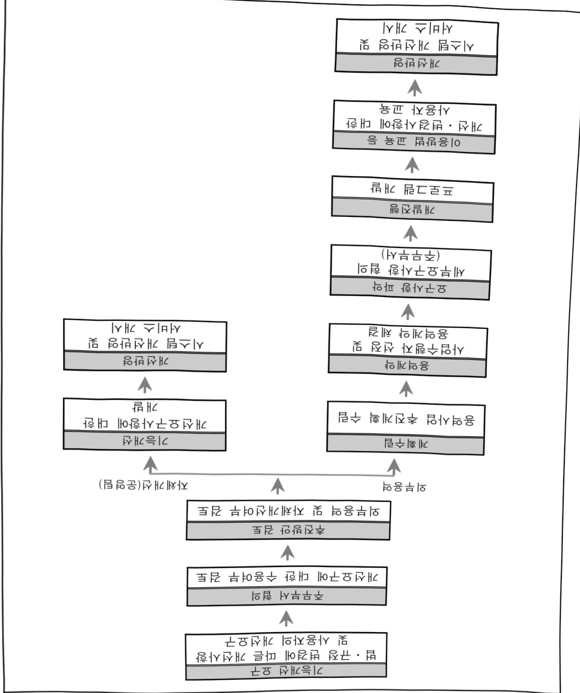

# 노동위원회정보화운영(정보화)

**해당 페이지**: PDF 172 ~ 177 쪽 해당

**부처**: 고용노동부
**분야**: 사회복지
**회계유형**: 일반회계
**2026 확정예산**: 2959.0 백만원
**전년대비 증감률**: -59.3%
**AI 도메인**: 행정/전자정부

---

## □ 기능별(내역사업별) 예산 내역

(단위:백만원)

<table border=1 style='margin: auto; word-wrap: break-word;'><tr><td rowspan="2"></td><td colspan="5">2024</td><td colspan="5">2025(25.12월말)</td><td rowspan="2">2026예산</td></tr><tr><td style='text-align: center; word-wrap: break-word;'>예산액(추경)</td><td style='text-align: center; word-wrap: break-word;'>예산현액</td><td style='text-align: center; word-wrap: break-word;'>집행액</td><td style='text-align: center; word-wrap: break-word;'>이월액</td><td style='text-align: center; word-wrap: break-word;'>불용액</td><td style='text-align: center; word-wrap: break-word;'>분예산</td><td style='text-align: center; word-wrap: break-word;'>예산현액</td><td style='text-align: center; word-wrap: break-word;'>집행액</td><td style='text-align: center; word-wrap: break-word;'>이월액</td><td style='text-align: center; word-wrap: break-word;'>불용액</td></tr><tr><td style='text-align: center; word-wrap: break-word;'>○ 기능별 분류(합계)</td><td style='text-align: center; word-wrap: break-word;'>1,187</td><td style='text-align: center; word-wrap: break-word;'>1,498</td><td style='text-align: center; word-wrap: break-word;'>1,456</td><td style='text-align: center; word-wrap: break-word;'>0</td><td style='text-align: center; word-wrap: break-word;'>41</td><td style='text-align: center; word-wrap: break-word;'>7,276</td><td style='text-align: center; word-wrap: break-word;'>7,276</td><td style='text-align: center; word-wrap: break-word;'>4,603</td><td style='text-align: center; word-wrap: break-word;'>2,648</td><td style='text-align: center; word-wrap: break-word;'>25</td><td style='text-align: center; word-wrap: break-word;'>2,959</td></tr><tr><td style='text-align: center; word-wrap: break-word;'>• 정보시스템운영유지보수</td><td style='text-align: center; word-wrap: break-word;'>539</td><td style='text-align: center; word-wrap: break-word;'>539</td><td style='text-align: center; word-wrap: break-word;'>513</td><td style='text-align: center; word-wrap: break-word;'>0</td><td style='text-align: center; word-wrap: break-word;'>26</td><td style='text-align: center; word-wrap: break-word;'>539</td><td style='text-align: center; word-wrap: break-word;'>539</td><td style='text-align: center; word-wrap: break-word;'>537</td><td style='text-align: center; word-wrap: break-word;'>0</td><td style='text-align: center; word-wrap: break-word;'>2</td><td style='text-align: center; word-wrap: break-word;'>665</td></tr><tr><td style='text-align: center; word-wrap: break-word;'>• 정보시스템 기능개선</td><td style='text-align: center; word-wrap: break-word;'>-</td><td style='text-align: center; word-wrap: break-word;'>311</td><td style='text-align: center; word-wrap: break-word;'>311</td><td style='text-align: center; word-wrap: break-word;'>0</td><td style='text-align: center; word-wrap: break-word;'>0</td><td style='text-align: center; word-wrap: break-word;'>-</td><td style='text-align: center; word-wrap: break-word;'>-</td><td style='text-align: center; word-wrap: break-word;'>-</td><td style='text-align: center; word-wrap: break-word;'>-</td><td style='text-align: center; word-wrap: break-word;'>-</td><td style='text-align: center; word-wrap: break-word;'>-</td></tr><tr><td style='text-align: center; word-wrap: break-word;'>• 원격영상심문회의시스템구축</td><td style='text-align: center; word-wrap: break-word;'>413</td><td style='text-align: center; word-wrap: break-word;'>413</td><td style='text-align: center; word-wrap: break-word;'>403</td><td style='text-align: center; word-wrap: break-word;'>0</td><td style='text-align: center; word-wrap: break-word;'>10</td><td style='text-align: center; word-wrap: break-word;'>506</td><td style='text-align: center; word-wrap: break-word;'>506</td><td style='text-align: center; word-wrap: break-word;'>484</td><td style='text-align: center; word-wrap: break-word;'>0</td><td style='text-align: center; word-wrap: break-word;'>23</td><td style='text-align: center; word-wrap: break-word;'>506</td></tr><tr><td style='text-align: center; word-wrap: break-word;'>• 정보화전략계획수립</td><td style='text-align: center; word-wrap: break-word;'>235</td><td style='text-align: center; word-wrap: break-word;'>235</td><td style='text-align: center; word-wrap: break-word;'>230</td><td style='text-align: center; word-wrap: break-word;'>0</td><td style='text-align: center; word-wrap: break-word;'>5</td><td style='text-align: center; word-wrap: break-word;'>-</td><td style='text-align: center; word-wrap: break-word;'>-</td><td style='text-align: center; word-wrap: break-word;'>-</td><td style='text-align: center; word-wrap: break-word;'>-</td><td style='text-align: center; word-wrap: break-word;'>-</td><td style='text-align: center; word-wrap: break-word;'>-</td></tr><tr><td style='text-align: center; word-wrap: break-word;'>• 디지털노동위원회 구축</td><td style='text-align: center; word-wrap: break-word;'>-</td><td style='text-align: center; word-wrap: break-word;'>-</td><td style='text-align: center; word-wrap: break-word;'>-</td><td style='text-align: center; word-wrap: break-word;'>-</td><td style='text-align: center; word-wrap: break-word;'>-</td><td style='text-align: center; word-wrap: break-word;'>6,231</td><td style='text-align: center; word-wrap: break-word;'>6,231</td><td style='text-align: center; word-wrap: break-word;'>3,582</td><td style='text-align: center; word-wrap: break-word;'>2,648</td><td style='text-align: center; word-wrap: break-word;'>-</td><td style='text-align: center; word-wrap: break-word;'>1,788</td></tr></table>

### 나. 사업설명자료

## 1 ) 사업목적·내용

- 조정·심판업무의 정보화를 지속적으로 추진하고 정보시스템을 안정적으로 운영함으로써

업무처리의 효율성 제고

## 2 ) 사업개요

## ☐ 사업근거 및 추진경위

① 법령상 근거 및 조항 적시

- 노동위원회법, 노동조합및노동관계조정법, 근로기준법, 전자정부법, 국가정보화기본법 등

② 추진경위

- 노사마루시스템 등 구축('02년)

- 노사마루시스템 재구축('05년)

·기존 조정·심판DB시스템을 개편하여 전산시스템을 통해 조정·심판사건을 처리하고 통계를 작성할 수 있도록 시스템 재구축

-전자심판위원회 시스템 등 구축('06년)

·부의 안을 전자화하여 전자심판위원회 운영, 지방노동위원회 홈페이지 개발

- 노사마루시스템 추가업무 개발('07년)

·차별시정, 이행강제금 및 금전보상제, 조정전 지원 등 신규업무 처리프로그램 개발

·노동판례 및 판정·판결DB구축을 통한 정보검색기능 제공

---

- 디지털회의녹음 및 전자사건철관리시스템 구축('08년)

·조정·심판회의내용을전자적으로기록·관리할수있는디지털회의녹음시스템구축

- 복수노조업무 전산처리 프로그램 개발('11년)

- 정보시스템 보강 및 보안솔루션 도입('12년)

노후 서버 교체 및 개인정보보호 강화를 위한 암호화솔루션 도입 등 보안강화

- 검색서버 이전 구축 및 조직도 연계체계 등 기능 개선('13년)

· 검색서버 이전 구축 및 검색프로그램 수정 개발, 조직도 연계체계 개선 등

- 판정서 품질 향상을 위한 확정절차 개선('15년)

·판정서 작성 및 사건처리결과 알림 프로그램 변경

·공익위원 판정서 검토 프로그램 개발

- 홈페이지를 반응형 웹으로 재구축('16년)

- 도로명주소 연계 및 위원노사마루 등 개선('17년)

- 관리자용 업무처리현황 및 질적 분석 자료 입력 등 개선('18년)

- 노사마루시스템 전면개편 (19년)

-위원노사마루시스템 기능개선('20년)

- 홈페이지 망분리·기능개선 및 이행강제금 데이터 이관('21년)

- 노후장비교체 및 구축사업('22년)

- 노동위원회 홈페이지 통·폐합 및 내부 정보시스템 기능개선 등('23년)

- 디지털노동위원회 ISP 및 노동위원회 원격영상회의시스템 확대구축 등('24년)

- 노동위원회 정보시스템 운영유지보수, 디지털노동위원회 1차구축 및 노동위원회 원격영상회의시스템 확대구축 등('25년)

## □주요내용

① 사업규모

- 총사업비(해당되는 경우에만 기재) : 해당없음

- 사업기간 : '02년~계속

- 최근 5년 간 투입된 사업비(예산액기준, 추경편성한 연도에는 추경포함)

(단위:백만원)

<table border=1 style='margin: auto; word-wrap: break-word;'><tr><td style='text-align: center; word-wrap: break-word;'>$ \underline{\text{闻}} $</td><td style='text-align: center; word-wrap: break-word;'>2022</td><td style='text-align: center; word-wrap: break-word;'>2023</td><td style='text-align: center; word-wrap: break-word;'>2024</td><td style='text-align: center; word-wrap: break-word;'>2025</td><td style='text-align: center; word-wrap: break-word;'>2026</td></tr><tr><td style='text-align: center; word-wrap: break-word;'>$ \underline{\text{사업비}} $</td><td style='text-align: center; word-wrap: break-word;'>1,965</td><td style='text-align: center; word-wrap: break-word;'>1,453</td><td style='text-align: center; word-wrap: break-word;'>1,187</td><td style='text-align: center; word-wrap: break-word;'>7,276</td><td style='text-align: center; word-wrap: break-word;'>2,959</td></tr></table>

② 사업추진체계

- 사업시행방법 : 직접수행

- 사업시행주체 : 중앙노동위원회

- 사업수혜자: 근로자, 노동조합 및 사업주, 노동위원회 위원 및 조사관

- 보조, 융자, 출연, 출자 등의 경우 보조 · 융자 등 지원 비율 및 법적근거: 해당없음

---

3) 2026년도 예산 산출 근거

□ 노동위원회정보화운영 : 7,276백만원('25년) → 2,959백만원('26년)

<table border=1 style='margin: auto; word-wrap: break-word;'><tr><td style='text-align: center; word-wrap: break-word;'>☐ 노동위원회정보화운영: 7,276백만원(&#x27;25년) → 2,959백만원(&#x27;26년)</td></tr><tr><td style='text-align: center; word-wrap: break-word;'>① 정보시스템 운영·유지보수 등: 539백만원(&#x27;25년)→ 665백만원(&#x27;26년)</td></tr><tr><td style='text-align: center; word-wrap: break-word;'>- (일반수용비) 15백만원(&#x27;25년)→ 15백만원(&#x27;26년)</td></tr><tr><td style='text-align: center; word-wrap: break-word;'>- (공공요금 및 제세) 9백만원(&#x27;25년)→ 4백만원(&#x27;26년)</td></tr><tr><td style='text-align: center; word-wrap: break-word;'>- (시설장비유지비) 470백만원(&#x27;25년)→ 646백만원(&#x27;26년)</td></tr><tr><td style='text-align: center; word-wrap: break-word;'>- (임차료) 50백만원(&#x27;25년)→ 순감</td></tr><tr><td style='text-align: center; word-wrap: break-word;'>② 원격영상심문회의시스템구축: 506백만원(&#x27;25년)→ 506백만원(&#x27;26년)</td></tr><tr><td style='text-align: center; word-wrap: break-word;'>- (자산취득비) 506백만원(&#x27;25년) → 506백만원(&#x27;26년)</td></tr><tr><td style='text-align: center; word-wrap: break-word;'>③ 디지털노동위원회 구축: 6,231백만원(&#x27;25년, 1차)→ 1,788백만원(&#x27;26년, 2차)</td></tr><tr><td style='text-align: center; word-wrap: break-word;'>- (일반연구비) 4,279백만원(&#x27;25년, 1차)→ 1,182백만원(&#x27;26년, 2차)</td></tr><tr><td style='text-align: center; word-wrap: break-word;'>- (자산취득비) 1,952백만원(&#x27;25년, 1차)→ 606백만원(&#x27;26년, 2차)</td></tr></table>

② 원격영상심문회의시스템구축: 506백만원('25년)→ 506백만원('26년)

- (자산취득비) 506백만원('25년) → 506백만원('26년)

③ 디지털노동위원회 구축: 6,231백만원('25년, 1차)→ 1,788백만원('26년, 2차)

- (일반연구비) 4,279백만원('25년, 1차)→ 1,182백만원('26년, 2차)

- (자산취득비) 1,952백만원('25년, 1차)→ 606백만원('26년, 2차)

## 4 ) 사업효과

□ 사업영향, 산출물 성과지표 등

① 2022~2026년도 성과계획서 상 성과지표 및 최근 5년간 성과 달성도: 해당없음

② 성과지표 이외의 연도별 사업추진 경과 및 실적

<table border=1 style='margin: auto; word-wrap: break-word;'><tr><td style='text-align: center; word-wrap: break-word;'>2022</td><td style='text-align: center; word-wrap: break-word;'>○ 1,706백만원(노동위원회정보화운영 지출총액) - 노후장비 교체 및 구축사업 - 법개정사항(채용상 성차별 등) 시스템 반영</td></tr><tr><td style='text-align: center; word-wrap: break-word;'>2023</td><td style='text-align: center; word-wrap: break-word;'>○ 1,303백만원(노동위원회정보화운영 지출총액) - 노동위원회 홈페이지 통·폐합 및 내부정보시스템 기능 개선 - 노동위원회 원격영상심문회의시스템 구축(2개소)</td></tr><tr><td style='text-align: center; word-wrap: break-word;'>2024</td><td style='text-align: center; word-wrap: break-word;'>○ 1,456백만원(노동위원회정보화운영 지출총액) - 노동위원회 원격영상심문회의시스템 확대구축(3개소) - 디지털노동위원회 정보화전략계획수립</td></tr><tr><td style='text-align: center; word-wrap: break-word;'>2025</td><td style='text-align: center; word-wrap: break-word;'>○ 4,603백만원(노동위원회정보화운영 지출총액) - 노동위원회 정보시스템 유지보수, 디지털위원회 1차 구축</td></tr></table>

③ 향후(2026년도 이후) 기대효과

- 정보시스템 기능 개선, 디지털 노동위원회 구축 등을 통해 내·외부 고객 서비스

강화와 조정·심판 업무의 효율적인 처리 지원

5) 타당성조사 및 예비타당성조사 시행여부 및 결과 요지: 해당없음

---

---

## 8 ) 각종 평가

<table border=1 style='margin: auto; word-wrap: break-word;'><tr><td style='text-align: center; word-wrap: break-word;'>1) 국회(예결위, 상임위, 예정처, 국정감사 포함) 지적: 해당없음</td></tr><tr><td style='text-align: center; word-wrap: break-word;'>2) 대외공개 평가: 해당없음</td></tr><tr><td style='text-align: center; word-wrap: break-word;'>3) 자체평가: 해당없음</td></tr></table>

1) 국회(예결위, 상임위, 예정처, 국정감사 포함) 지적: 해당없음

2) 대외공개 평가: 해당없음

3) 자체평가: 해당없음

### 다. 최근 4년간 결산내역

1) 결산표

☐ 부처 결산내역

(단위: 백만원, %)

<table border=1 style='margin: auto; word-wrap: break-word;'><tr><td rowspan="2">연도</td><td colspan="3">예산액</td><td rowspan="2">예산 현액(B)</td><td rowspan="2">집행액(C)</td><td rowspan="2">집행률(C/A)</td><td rowspan="2">집행률(C/B)</td><td rowspan="2">다음연도 이월액</td><td rowspan="2">불용액</td></tr><tr><td style='text-align: center; word-wrap: break-word;'>본예산</td><td style='text-align: center; word-wrap: break-word;'>추경 중감액</td><td style='text-align: center; word-wrap: break-word;'>추경(A)</td></tr><tr><td style='text-align: center; word-wrap: break-word;'>2022</td><td style='text-align: center; word-wrap: break-word;'>1,965</td><td style='text-align: center; word-wrap: break-word;'>0</td><td style='text-align: center; word-wrap: break-word;'>1,965</td><td style='text-align: center; word-wrap: break-word;'>1,984</td><td style='text-align: center; word-wrap: break-word;'>1,706</td><td style='text-align: center; word-wrap: break-word;'>86.8</td><td style='text-align: center; word-wrap: break-word;'>86.0</td><td style='text-align: center; word-wrap: break-word;'>187</td><td style='text-align: center; word-wrap: break-word;'>91</td></tr><tr><td style='text-align: center; word-wrap: break-word;'>2023</td><td style='text-align: center; word-wrap: break-word;'>1,453</td><td style='text-align: center; word-wrap: break-word;'>0</td><td style='text-align: center; word-wrap: break-word;'>1,453</td><td style='text-align: center; word-wrap: break-word;'>1,640</td><td style='text-align: center; word-wrap: break-word;'>1,303</td><td style='text-align: center; word-wrap: break-word;'>89.6</td><td style='text-align: center; word-wrap: break-word;'>79.4</td><td style='text-align: center; word-wrap: break-word;'>311</td><td style='text-align: center; word-wrap: break-word;'>26</td></tr><tr><td style='text-align: center; word-wrap: break-word;'>2024</td><td style='text-align: center; word-wrap: break-word;'>1,187</td><td style='text-align: center; word-wrap: break-word;'>0</td><td style='text-align: center; word-wrap: break-word;'>1,187</td><td style='text-align: center; word-wrap: break-word;'>1,498</td><td style='text-align: center; word-wrap: break-word;'>1,498</td><td style='text-align: center; word-wrap: break-word;'>122.6</td><td style='text-align: center; word-wrap: break-word;'>97.1</td><td style='text-align: center; word-wrap: break-word;'>0</td><td style='text-align: center; word-wrap: break-word;'>41</td></tr><tr><td style='text-align: center; word-wrap: break-word;'>2025</td><td style='text-align: center; word-wrap: break-word;'>7,276</td><td style='text-align: center; word-wrap: break-word;'>0</td><td style='text-align: center; word-wrap: break-word;'>7,276</td><td style='text-align: center; word-wrap: break-word;'>7,276</td><td style='text-align: center; word-wrap: break-word;'>4,603</td><td style='text-align: center; word-wrap: break-word;'>63.3</td><td style='text-align: center; word-wrap: break-word;'>63.3</td><td style='text-align: center; word-wrap: break-word;'>2,648</td><td style='text-align: center; word-wrap: break-word;'>25</td></tr></table>

## 2 ) 주요 결산사항

□ 2022~2025년 결산 주요 지적사항 및 시정요구사항

<table border=1 style='margin: auto; word-wrap: break-word;'><tr><td style='text-align: center; word-wrap: break-word;'>2022</td><td style='text-align: center; word-wrap: break-word;'>○ 이 · 전용 내역 - 자산취득비 부족으로 전용(증 19백만원), 공공요금 부족으로 세목조정(8백만원), 일반수용비 부족으로 세목조정(3백만원) ○ 불용내역: 집행잔액 91백만원</td></tr><tr><td style='text-align: center; word-wrap: break-word;'>2023</td><td style='text-align: center; word-wrap: break-word;'>○ 이 · 전용 내역 - 일반연구비 부족으로 임차료에서 전용(증 15백만원), 일반수용비 부족으로 세목조정(19백만원), 공공요금 부족으로 세목조정(6백만원) ○ 불용내역: 2023년 입찰차액 등 집행잔액 26백만원, 사업 기간(23.7.~24.1.) 미종료 이월 311백만원</td></tr><tr><td style='text-align: center; word-wrap: break-word;'>2024</td><td style='text-align: center; word-wrap: break-word;'>○ 이 · 전용 내역 - 일반수용비 부족으로 임차료에서 세목조정(47백만원), 공공요금 부족으로 임차료에서 세목조정(3백만원) ○ 불용내역: 입찰차액 등 집행잔액 41백만원</td></tr><tr><td style='text-align: center; word-wrap: break-word;'>2025</td><td style='text-align: center; word-wrap: break-word;'>○ 이 · 전용 내역 - 일반수용비 부족으로 임차료에서 세목조정(47백만원), 공공요금 부족으로 임차료에서 세목조정(5백만원) ○ 불용내역: 입찰차액 등 집행잔액 25백만원, 디지털노동위원회구축 사업기간 미종료로 이월 2,648백만원</td></tr></table>

□2025년 이·전용 등 세부내역: 해당없음

---

<table border=1 style='margin: auto; word-wrap: break-word;'><tr><td style='text-align: center; word-wrap: break-word;'>사 업 명</td></tr><tr><td style='text-align: center; word-wrap: break-word;'>(22) 디지털 기반의 고용서비스 인프라 지원(정보화)(1075-303)</td></tr></table>

□ 사업 코드 정보

<table border=1 style='margin: auto; word-wrap: break-word;'><tr><td style='text-align: center; word-wrap: break-word;'>구분</td><td style='text-align: center; word-wrap: break-word;'>회계</td><td style='text-align: center; word-wrap: break-word;'>소관</td><td style='text-align: center; word-wrap: break-word;'>실국(기관)</td><td style='text-align: center; word-wrap: break-word;'>계정</td><td style='text-align: center; word-wrap: break-word;'>분야</td><td style='text-align: center; word-wrap: break-word;'>부문</td></tr><tr><td style='text-align: center; word-wrap: break-word;'>코드</td><td rowspan="2">일반회계</td><td rowspan="2">고용노동부</td><td rowspan="2">고용지원정책관</td><td rowspan="2"></td><td style='text-align: center; word-wrap: break-word;'>080</td><td style='text-align: center; word-wrap: break-word;'>08D</td></tr><tr><td style='text-align: center; word-wrap: break-word;'>명칭</td><td style='text-align: center; word-wrap: break-word;'>사회복지</td><td style='text-align: center; word-wrap: break-word;'>고용</td></tr></table>

<table border=1 style='margin: auto; word-wrap: break-word;'><tr><td style='text-align: center; word-wrap: break-word;'>구분</td><td style='text-align: center; word-wrap: break-word;'>프로그램</td><td style='text-align: center; word-wrap: break-word;'>단위사업</td><td style='text-align: center; word-wrap: break-word;'>세부사업</td></tr><tr><td style='text-align: center; word-wrap: break-word;'>코드</td><td style='text-align: center; word-wrap: break-word;'>1000</td><td style='text-align: center; word-wrap: break-word;'>1075</td><td style='text-align: center; word-wrap: break-word;'>303</td></tr><tr><td style='text-align: center; word-wrap: break-word;'>명칭</td><td style='text-align: center; word-wrap: break-word;'>고용창출</td><td style='text-align: center; word-wrap: break-word;'>국가일자리정보플랫폼 구축·운영(정보화)</td><td style='text-align: center; word-wrap: break-word;'>디지털 기반의 고용서비스 인프라 지원(정보화)</td></tr></table>

☐ 사업 성격

<table border=1 style='margin: auto; word-wrap: break-word;'><tr><td rowspan="2">신규</td><td rowspan="2">계속</td><td rowspan="2">완료</td><td rowspan="2">예비타당성 실시여부</td><td rowspan="2">총사업비 관리대상</td><td rowspan="2">총액계상 예산사업</td><td style='text-align: center; word-wrap: break-word;'>사업소관 변경정보</td></tr><tr><td style='text-align: center; word-wrap: break-word;'>2025예산 시 소관</td></tr><tr><td style='text-align: center; word-wrap: break-word;'></td><td style='text-align: center; word-wrap: break-word;'>○</td><td style='text-align: center; word-wrap: break-word;'></td><td style='text-align: center; word-wrap: break-word;'></td><td style='text-align: center; word-wrap: break-word;'></td><td style='text-align: center; word-wrap: break-word;'></td><td style='text-align: center; word-wrap: break-word;'></td></tr></table>

□ 사업 지원 형태 및 지원을

<table border=1 style='margin: auto; word-wrap: break-word;'><tr><td style='text-align: center; word-wrap: break-word;'>직접</td><td style='text-align: center; word-wrap: break-word;'>출자</td><td style='text-align: center; word-wrap: break-word;'>출연</td><td style='text-align: center; word-wrap: break-word;'>보조</td><td style='text-align: center; word-wrap: break-word;'>융자</td><td style='text-align: center; word-wrap: break-word;'>국고보조율(%)</td><td style='text-align: center; word-wrap: break-word;'>융자율(%)</td></tr><tr><td style='text-align: center; word-wrap: break-word;'></td><td style='text-align: center; word-wrap: break-word;'></td><td style='text-align: center; word-wrap: break-word;'>○</td><td style='text-align: center; word-wrap: break-word;'></td><td style='text-align: center; word-wrap: break-word;'></td><td style='text-align: center; word-wrap: break-word;'></td><td style='text-align: center; word-wrap: break-word;'></td></tr></table>

## □ 사업 소관부처 및 시행주체

<table border=1 style='margin: auto; word-wrap: break-word;'><tr><td style='text-align: center; word-wrap: break-word;'>사업명</td><td colspan="2">구분</td></tr><tr><td style='text-align: center; word-wrap: break-word;'>디지털 기반의 고용서비스 인프라 지원 (정보화)</td><td style='text-align: center; word-wrap: break-word;'>소관부처</td><td style='text-align: center; word-wrap: break-word;'>실·국·과(팀) 고용정책실 고용지원정책관 고용서비스기반과</td></tr><tr><td style='text-align: center; word-wrap: break-word;'>고용24 대민포털 운영 및 유지관리</td><td rowspan="2">사업시행주체</td><td rowspan="2">한국고용정보원</td></tr><tr><td style='text-align: center; word-wrap: break-word;'>고용행정 통합포털 운영 및 유지관리</td></tr></table>

---

### 원본 PDF 크롭 이미지

