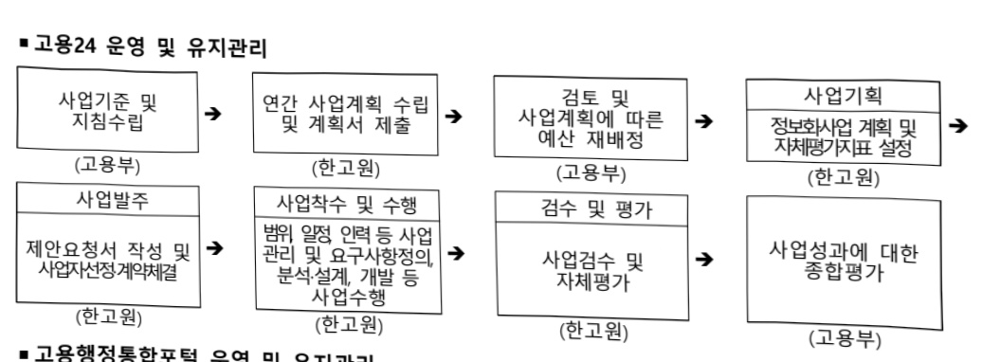
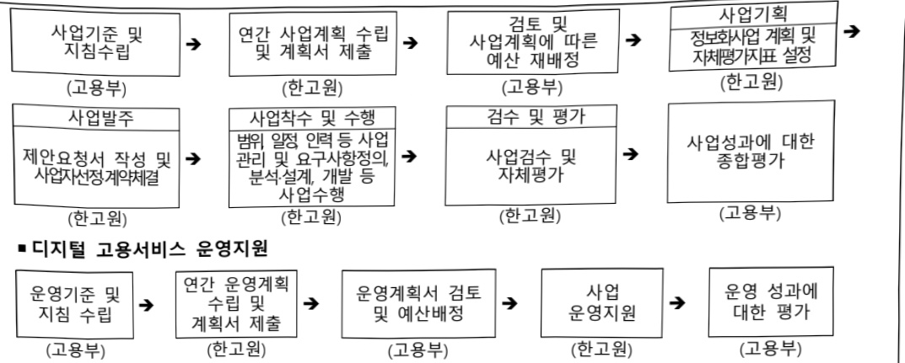

# 디지털 기반의 고용서비스 인프라 지원(정보화)

**해당 페이지**: PDF 178 ~ 189 쪽 해당

**부처**: 고용노동부
**분야**: 사회복지
**회계유형**: 일반회계
**2026 확정예산**: 7523.0 백만원
**전년대비 증감률**: 24.4%
**AI 도메인**: 데이터

---

<table border=1 style='margin: auto; word-wrap: break-word;'><tr><td style='text-align: center; word-wrap: break-word;'>사 업 명</td></tr><tr><td style='text-align: center; word-wrap: break-word;'>(22) 디지털 기반의 고용서비스 인프라 지원(정보화)(1075-303)</td></tr></table>

□ 사업 코드 정보

<table border=1 style='margin: auto; word-wrap: break-word;'><tr><td style='text-align: center; word-wrap: break-word;'>구분</td><td style='text-align: center; word-wrap: break-word;'>회계</td><td style='text-align: center; word-wrap: break-word;'>소관</td><td style='text-align: center; word-wrap: break-word;'>실국(기관)</td><td style='text-align: center; word-wrap: break-word;'>계정</td><td style='text-align: center; word-wrap: break-word;'>분야</td><td style='text-align: center; word-wrap: break-word;'>부문</td></tr><tr><td style='text-align: center; word-wrap: break-word;'>코드</td><td rowspan="2">일반회계</td><td rowspan="2">고용노동부</td><td rowspan="2">고용지원정책관</td><td rowspan="2"></td><td style='text-align: center; word-wrap: break-word;'>080</td><td style='text-align: center; word-wrap: break-word;'>08D</td></tr><tr><td style='text-align: center; word-wrap: break-word;'>명칭</td><td style='text-align: center; word-wrap: break-word;'>사회복지</td><td style='text-align: center; word-wrap: break-word;'>고용</td></tr></table>

<table border=1 style='margin: auto; word-wrap: break-word;'><tr><td style='text-align: center; word-wrap: break-word;'>구분</td><td style='text-align: center; word-wrap: break-word;'>프로그램</td><td style='text-align: center; word-wrap: break-word;'>단위사업</td><td style='text-align: center; word-wrap: break-word;'>세부사업</td></tr><tr><td style='text-align: center; word-wrap: break-word;'>코드</td><td style='text-align: center; word-wrap: break-word;'>1000</td><td style='text-align: center; word-wrap: break-word;'>1075</td><td style='text-align: center; word-wrap: break-word;'>303</td></tr><tr><td style='text-align: center; word-wrap: break-word;'>명칭</td><td style='text-align: center; word-wrap: break-word;'>고용창출</td><td style='text-align: center; word-wrap: break-word;'>국가일자리정보플랫폼 구축·운영(정보화)</td><td style='text-align: center; word-wrap: break-word;'>디지털 기반의 고용서비스 인프라 지원(정보화)</td></tr></table>

☐ 사업 성격

<table border=1 style='margin: auto; word-wrap: break-word;'><tr><td rowspan="2">신규</td><td rowspan="2">계속</td><td rowspan="2">완료</td><td rowspan="2">예비타당성 실시여부</td><td rowspan="2">총사업비 관리대상</td><td rowspan="2">총액계상 예산사업</td><td style='text-align: center; word-wrap: break-word;'>사업소관 변경정보</td></tr><tr><td style='text-align: center; word-wrap: break-word;'>2025예산 시 소관</td></tr><tr><td style='text-align: center; word-wrap: break-word;'></td><td style='text-align: center; word-wrap: break-word;'>○</td><td style='text-align: center; word-wrap: break-word;'></td><td style='text-align: center; word-wrap: break-word;'></td><td style='text-align: center; word-wrap: break-word;'></td><td style='text-align: center; word-wrap: break-word;'></td><td style='text-align: center; word-wrap: break-word;'></td></tr></table>

□ 사업 지원 형태 및 지원을

<table border=1 style='margin: auto; word-wrap: break-word;'><tr><td style='text-align: center; word-wrap: break-word;'>직접</td><td style='text-align: center; word-wrap: break-word;'>출자</td><td style='text-align: center; word-wrap: break-word;'>출연</td><td style='text-align: center; word-wrap: break-word;'>보조</td><td style='text-align: center; word-wrap: break-word;'>융자</td><td style='text-align: center; word-wrap: break-word;'>국고보조율(%)</td><td style='text-align: center; word-wrap: break-word;'>융자율(%)</td></tr><tr><td style='text-align: center; word-wrap: break-word;'></td><td style='text-align: center; word-wrap: break-word;'></td><td style='text-align: center; word-wrap: break-word;'>○</td><td style='text-align: center; word-wrap: break-word;'></td><td style='text-align: center; word-wrap: break-word;'></td><td style='text-align: center; word-wrap: break-word;'></td><td style='text-align: center; word-wrap: break-word;'></td></tr></table>

## □ 사업 소관부처 및 시행주체

<table border=1 style='margin: auto; word-wrap: break-word;'><tr><td style='text-align: center; word-wrap: break-word;'>사업명</td><td colspan="2">구분</td></tr><tr><td style='text-align: center; word-wrap: break-word;'>디지털 기반의 고용서비스 인프라 지원 (정보화)</td><td style='text-align: center; word-wrap: break-word;'>소관부처</td><td style='text-align: center; word-wrap: break-word;'>실·국·과(팀) 고용정책실 고용지원정책관 고용서비스기반과</td></tr><tr><td style='text-align: center; word-wrap: break-word;'>고용24 대민포털 운영 및 유지관리</td><td rowspan="2">사업시행주체</td><td rowspan="2">한국고용정보원</td></tr><tr><td style='text-align: center; word-wrap: break-word;'>고용행정 통합포털 운영 및 유지관리</td></tr></table>

---

### 가.예산 총괄표

(단위: 백만원, %)

<table border=1 style='margin: auto; word-wrap: break-word;'><tr><td rowspan="2">사업명</td><td rowspan="2">2024년 결산</td><td colspan="2">2025년 예산</td><td colspan="2">2026년 예산</td><td rowspan="2">중감(B-A)</td><td rowspan="2">(B-A)/A</td></tr><tr><td style='text-align: center; word-wrap: break-word;'>본예산(A)</td><td style='text-align: center; word-wrap: break-word;'>추경</td><td style='text-align: center; word-wrap: break-word;'>정부안</td><td style='text-align: center; word-wrap: break-word;'>확정(B)</td></tr><tr><td style='text-align: center; word-wrap: break-word;'>디지털 기반의 고용서비스 인프라 지원 (정보화)</td><td style='text-align: center; word-wrap: break-word;'>5,714</td><td style='text-align: center; word-wrap: break-word;'>6,047</td><td style='text-align: center; word-wrap: break-word;'>6,047</td><td style='text-align: center; word-wrap: break-word;'>7,523</td><td style='text-align: center; word-wrap: break-word;'>7,523</td><td style='text-align: center; word-wrap: break-word;'>1,476</td><td style='text-align: center; word-wrap: break-word;'>24.4</td></tr></table>

□ 기능별(내역사업별) 예산 내역

(단위:백만원)

<table border=1 style='margin: auto; word-wrap: break-word;'><tr><td rowspan="2"></td><td colspan="5">2024</td><td colspan="5">2025(2025.12월말)</td><td rowspan="2">2026예산</td></tr><tr><td style='text-align: center; word-wrap: break-word;'>예산액(추경)</td><td style='text-align: center; word-wrap: break-word;'>예산현액</td><td style='text-align: center; word-wrap: break-word;'>집행액</td><td style='text-align: center; word-wrap: break-word;'>이월액</td><td style='text-align: center; word-wrap: break-word;'>불용액</td><td style='text-align: center; word-wrap: break-word;'>본예산</td><td style='text-align: center; word-wrap: break-word;'>예산현액</td><td style='text-align: center; word-wrap: break-word;'>집행액</td><td style='text-align: center; word-wrap: break-word;'>이월액</td><td style='text-align: center; word-wrap: break-word;'>불용액</td></tr><tr><td style='text-align: center; word-wrap: break-word;'>○ 기능별 분류(합계)</td><td style='text-align: center; word-wrap: break-word;'>5,714</td><td style='text-align: center; word-wrap: break-word;'>5,714</td><td style='text-align: center; word-wrap: break-word;'>5,714</td><td style='text-align: center; word-wrap: break-word;'>-</td><td style='text-align: center; word-wrap: break-word;'>-</td><td style='text-align: center; word-wrap: break-word;'>6,047</td><td style='text-align: center; word-wrap: break-word;'>6,047</td><td style='text-align: center; word-wrap: break-word;'>6,047</td><td style='text-align: center; word-wrap: break-word;'>-</td><td style='text-align: center; word-wrap: break-word;'>-</td><td style='text-align: center; word-wrap: break-word;'>7,523</td></tr><tr><td style='text-align: center; word-wrap: break-word;'>• 고용24 대민포털 운영 및 유지관리</td><td style='text-align: center; word-wrap: break-word;'>1,562</td><td style='text-align: center; word-wrap: break-word;'>1,562</td><td style='text-align: center; word-wrap: break-word;'>1,562</td><td style='text-align: center; word-wrap: break-word;'>-</td><td style='text-align: center; word-wrap: break-word;'>-</td><td style='text-align: center; word-wrap: break-word;'>1,671</td><td style='text-align: center; word-wrap: break-word;'>1,671</td><td style='text-align: center; word-wrap: break-word;'>1,671</td><td style='text-align: center; word-wrap: break-word;'>-</td><td style='text-align: center; word-wrap: break-word;'>-</td><td style='text-align: center; word-wrap: break-word;'>2,712</td></tr><tr><td style='text-align: center; word-wrap: break-word;'>• 고용행정 통합포털 운영 및 유지관리</td><td style='text-align: center; word-wrap: break-word;'>1,406</td><td style='text-align: center; word-wrap: break-word;'>1,406</td><td style='text-align: center; word-wrap: break-word;'>1,406</td><td style='text-align: center; word-wrap: break-word;'>-</td><td style='text-align: center; word-wrap: break-word;'>-</td><td style='text-align: center; word-wrap: break-word;'>1,354</td><td style='text-align: center; word-wrap: break-word;'>1,354</td><td style='text-align: center; word-wrap: break-word;'>1,354</td><td style='text-align: center; word-wrap: break-word;'>-</td><td style='text-align: center; word-wrap: break-word;'>-</td><td style='text-align: center; word-wrap: break-word;'>1,484</td></tr><tr><td style='text-align: center; word-wrap: break-word;'>• 디지털 고용서비스 운영지원</td><td style='text-align: center; word-wrap: break-word;'>2,746</td><td style='text-align: center; word-wrap: break-word;'>2,746</td><td style='text-align: center; word-wrap: break-word;'>2,746</td><td style='text-align: center; word-wrap: break-word;'>-</td><td style='text-align: center; word-wrap: break-word;'>-</td><td style='text-align: center; word-wrap: break-word;'>3,022</td><td style='text-align: center; word-wrap: break-word;'>3,022</td><td style='text-align: center; word-wrap: break-word;'>3,022</td><td style='text-align: center; word-wrap: break-word;'>-</td><td style='text-align: center; word-wrap: break-word;'>-</td><td style='text-align: center; word-wrap: break-word;'>3,327</td></tr></table>

### 나.사업설명자료

## 1 ) 사업목적·내용

- (고용24 대민포털 운영 및 유지관리) ① 고용관련 제도에 대한 종합적인 정보제공

②민원신청 및 수혜이력 서비스 단일화 ③고용서비스에 대한 비대면·디지털화 지원

④통합데이터 기반 개인·기업 맞춤서비스 고용통합서비스 제공

- (고용행정 통합포털 운영 및 유지관리) ①5대 주요 고용행정서비스를 통합·효율성이

향상된 행정서비스 제공 ②업무효율성 향상을 위한 각종 솔루션 적용 및 서비스 운영

③정책수립부터 집행, 검증까지 정책의 라이프사이클을 관리하는 프로세스 운영관리 등

고용행정통합포털 서비스 제공

---

## 2 ) 사업개요

## □ 사업근거 및 추진경위

① 법령상 근거 및 조항 적시

- 고용정책기본법 제15조(고용·직업정보의 수집·관리)

## 제15조(고용·직업 정보의 수집·관리)

① 고용노동부장관은 근로자와 기업에 대한 고용서비스 향상과 노동시장의 효율성 제고를 위하여 다음 각 호의 고용·직업에 관한 정보(이하 “고용·직업 정보”라 한다)를 수집·관리하여야 한다.

- 고용정책기본법 제15조의2(고용정보시스템의 구축·운영)

## 제15조의2(고용정보시스템의 구축·운영)

① 고용노농부장관은 제15조제1항의 업무를 효율적으로 수행하기 위하여 같은 항 각 호의 고용·직업 정보를 대상으로 하는 전자정보시스템(이하 “고용정보시스템”)을 구축·운영할 수 있다.

- 고용정책기본법 제18조(한국고용정보원의 설립)

## 제18조(한국고용정보원의 설립)

①고용정보의 수집·제공과 직업에 관한 조사 연구 등 제40조에 따라 위탁받은 업무와 그 밖에 고용지원에 관한 업무를 효율적으로 수행하기 위하여 한국고용정보원을 설립한다.

## - 고용정책기본법 제40조(위탁)

## 제40조(위탁)

① 이 법에 따른 고용노동부장관의 업무 중 다음 각 호의 업무는 제18조에 따른 한국고용정보원에 위탁할 수 있다.

1. 제15조에 따른 고용·직업 정보의 수집·관리 등에 관한 업무

2. 제15조의2에 따른 고용정보시스템의 구축·운영 등에 관한 업무

3. 제15조의5에 따른 통합정보전산망의 구축·운영 등에 관한 업무

## ② 추진경위

- (공공취업지원서비스 확충) 고용정보시스템의 통합정보 플랫폼을 통해 수요자 맞춤형 서비스 제공

- (한국관 뉴딜) 개인에 맞춤형 고용서비스를 추천·제공할 수 있도록 개인정보(경력·

훈련·자격 등)를 통합·디지털화

- (2021년 하반기 경제정책방향) 기존 정보망으로 분산 제공되던 온라인 고용서비스를 통합·일원화한 ‘고용24’ 정보시스템 구축 추진

- (2021년) 고용통합서비스 제공을 위한 고용24 구축방안 수립 ISP 사업('21.3.~11.)

- (2022년) 차세대 디지털 고용서비스 플랫폼 고용24 구축사업 추진('22.10.~'23.12.)

- (2023년) 차세대 디지털 고용서비스 플랫폼 고용24(3단계) 표준API 구축사업 추진('23.5.~'24.2.)

- (2024년) 고용24 모바일 앱 서비스 개시(시범)(‘24.5.)

---

- (2024년) 고용24 대민포털 정식서비스 개시('24.9.)

- (2025년) 행안부 Any-ID 로그인 연계('25.6)

□ 주요내용

① 사업규모

- 총사업비 : 해당없음

- 사업기간 : '21 ~ 계속

- 최근 5년 간 투입된 사업비

<table border=1 style='margin: auto; word-wrap: break-word;'><tr><td style='text-align: center; word-wrap: break-word;'>$ \underline{\text{所}} $</td><td style='text-align: center; word-wrap: break-word;'>2022</td><td style='text-align: center; word-wrap: break-word;'>2023</td><td style='text-align: center; word-wrap: break-word;'>2024</td><td style='text-align: center; word-wrap: break-word;'>2025</td><td style='text-align: center; word-wrap: break-word;'>2026</td></tr><tr><td style='text-align: center; word-wrap: break-word;'>$ \underline{\text{사업비}} $</td><td style='text-align: center; word-wrap: break-word;'>18,942</td><td style='text-align: center; word-wrap: break-word;'>5,218</td><td style='text-align: center; word-wrap: break-word;'>5,714</td><td style='text-align: center; word-wrap: break-word;'>6,047</td><td style='text-align: center; word-wrap: break-word;'>7,523</td></tr></table>

- 기타: 통합고용 민원 시스템 '고용24' 및 '고용행정통합포털' 운영

② 사업추진체계

- 사업시행방법 : 출연

- 사업시행주체 : 한국고용정보원

- 사업 수혜자 : 구직자, 청소년, 실업자, 구인업체, 진로지도담당자 등 전국민

- 보조, 융자, 출연, 출자 등의 경우 보조·융자 등 지원 비율 및 법적근거

<table border=1 style='margin: auto; word-wrap: break-word;'><tr><td style='text-align: center; word-wrap: break-word;'>내역사업명</td><td style='text-align: center; word-wrap: break-word;'>구분</td><td style='text-align: center; word-wrap: break-word;'>피보조·피출연 등 기관명</td><td style='text-align: center; word-wrap: break-word;'>지원 금액 (2026예산)</td><td style='text-align: center; word-wrap: break-word;'>지원 비율(%)</td><td style='text-align: center; word-wrap: break-word;'>보조율 법적근거 (해당 조항)</td></tr><tr><td style='text-align: center; word-wrap: break-word;'>디지털 기반의 고용서비스 인프라 지원 (정보화)</td><td style='text-align: center; word-wrap: break-word;'>출연</td><td style='text-align: center; word-wrap: break-word;'>한국고용 정보원</td><td style='text-align: center; word-wrap: break-word;'>7,523</td><td style='text-align: center; word-wrap: break-word;'>100%</td><td style='text-align: center; word-wrap: break-word;'>고용정책기본법 제18조제5항 및 제40조(위탁)</td></tr></table>

## 3 ) 2026년도 예산 산출 근거

□ 디지털 기반의 고용서비스 인프라 지원

:(2025 예산) 6,047백만원 → (2026 예산) 7,523백만원, 1,476백만원 증액

① 고용24 대민포털 운영 및 유지관리

:(2025 예산) 1,671백만원 → (2026 예산) 2,712백만원, 1,041백만원 증액

## - (요구)

■고용24 운영

* (고용24 대민포털 유지관리) 취업알선, 고용보험, 직업훈련, 고용허가, 국민취업 등 고용분야 민원신청·신고 통합 서비스 유지관리, 일자리·훈련·제도 검색, 정보제공 서비스 유지관리, 행정기관 및 공공기관 정보시스템 구축 운영 지침에 따른 '디지털 정부서비스 UI/UX 가이드라인'(24.2)' 단계적 적용

·고용24 대민포털 고도화 및 서비스 확대

---

(상담 예약관리시스템) 사용자의 경험을 고려하여 편리하고 체계적인 고객상담 관리를 위한 온라인 상담예약 시스템 구축(민원인의 지속적인 요청 사항)

## - (산출)

고용24 대민포털 유지관리 : (25) 1,671 → (26) 2,276백만원(+605백만원)

(1) 기 개발된 대민포털의 안정적 유지는 물론 다양한 고객의견을 서비스 운영에 반영

① (필요성) 다수의 차세대 국가정보망 오픈 차질(NEIS('23년, 교육부), 복지로('22년, 복지부) 등)에도 불구하고 '24년 고용24 대민포털 조기 안착 성공, 서비스에 대한 품질과 사용의 편의성 지원 등 수요자 관점에서 지속적인 관리가 필요한 사항

→ 고봉24는 현재('25.7월) 일생균 방문수 373%('24.3월 대비), 회원수 53.5%('24.3월 대비) 지속적 증가 추세,

민원인의 다양한 요구사항에 대응하기 위해 고도화 필요

* 고용24 일평균 방문수: ('24.3월) 22.3만 → ('24.12월) 64.8만 → ('25.7월) 105.4만

* 고용24 누적 회원수: ('24.3월) 762만 → ('24.12월) 1,023만 → ('25.7월) 1,170만

②(기대효과)사용자 간담회,VoC 등을 통해 요청하는 프로그램 개선 요구사항을 검토 후 신속히 서비스에 반영함으로써 구직자의 취업률 향상 및 구인기업의 인력수급 문제 해결에 기여

③(변동사항)

○ 고용24 대민포털 운영 :('25) 1,397 →('26) 2,276백만원(+879백만원)

- (FP) '25년 18,151.9 → '26년 23,623.1(+5,471.2)

- (FP 단가) '25년 553,114원 → '26년 605,784원(+52,670원)

- (요율) '25년 10.05% → '26년 12.0%(+1.95%p)

디지털 플랫폼 정부 API 연계서비스 구축 : (25) 274백만원 → (26) 0원(순감)

* 개발SW 유지관리(고용24 대민포털 유지관리) : 2,276백만원

<table border=1 style='margin: auto; word-wrap: break-word;'><tr><td style='text-align: center; word-wrap: break-word;'>계산식</td><td style='text-align: center; word-wrap: break-word;'>유지관리 대상 소프트웨어의 재산정된 개발비 × 유지관리 요율(10~15%) + 직접경비</td></tr><tr><td style='text-align: center; word-wrap: break-word;'>합계(VAT별도)</td><td style='text-align: center; word-wrap: break-word;'>17,242,501,985원 × 12% + 0 = 2,069,100,238원</td></tr><tr><td style='text-align: center; word-wrap: break-word;'>총액(VAT포함)</td><td style='text-align: center; word-wrap: break-word;'>2,276,010,000원</td></tr></table>

고용24 대민포털 고도화 및 서비스 확대 : ('25) 0→('26) 436백만원(순증)

(1) 상담 예약관리시스템

① (필요성 및 시급성) 현재 고용센터는 내방자가 직접 방문하여야만 상담이 가능하여 접근성 및 편의성이 현저하 낮고 코로나19 이후에도 비대면 화상상담과 예약상담 요구가 많음에도 상담 예약 관리시스템 부재로 민원인의 불만이 높음

② (기대효과) 실시간 온라인 상담예약시스템이 도입되면 민원인의 접근성 향상과 상담 대기 시간 감소가 예상되며 또한 상담사 개인 스케줄링 관리로 예약 중복 누락방지로 행정부담은 감소되어 상담업무의 효율성 제고

③(변동사항)

○ 상담예약시스템 : (25) 0 → (26) 90백만원(순증)

- (총 투입공수) '25년 0M/M → '26년 3.25M/M(순증)

※ 총 투입공수 : 투입인원 X 투입기간 X 투입률

※ '25년 SW기술자 평균임금 적용

○ HW/SW 구매비 : (25) 0 → (26) 346백만원(순증)

*일반용역비(상담예약시스템) : 90백만원

---

<table border=1 style='margin: auto; word-wrap: break-word;'><tr><td colspan="4">산출 근거</td><td rowspan="2">금액(원)</td></tr><tr><td style='text-align: center; word-wrap: break-word;'>구 분</td><td style='text-align: center; word-wrap: break-word;'>평균임금</td><td style='text-align: center; word-wrap: break-word;'>투입공수(MM)</td><td style='text-align: center; word-wrap: break-word;'>투입률</td></tr><tr><td style='text-align: center; word-wrap: break-word;'>상담예약시스템</td><td style='text-align: center; word-wrap: break-word;'>직무별 평균임금</td><td style='text-align: center; word-wrap: break-word;'>3.25</td><td style='text-align: center; word-wrap: break-word;'>직무별 투입공수</td><td style='text-align: center; word-wrap: break-word;'>27,972,539</td></tr><tr><td colspan="4">직접인건비 합계</td><td style='text-align: center; word-wrap: break-word;'>27,972,539</td></tr><tr><td colspan="4">제경비(직접인건비의 144%)</td><td style='text-align: center; word-wrap: break-word;'>40,280,457</td></tr><tr><td colspan="4">기술료(직접인건비+제경비)의 20%</td><td style='text-align: center; word-wrap: break-word;'>13,650,599</td></tr><tr><td colspan="4">합계(VAT별도)</td><td style='text-align: center; word-wrap: break-word;'>81,903,595</td></tr><tr><td colspan="4">합계(VAT포함)</td><td style='text-align: center; word-wrap: break-word;'>90,093,954</td></tr></table>

*HW/SW구매비:346백만원

<table border=1 style='margin: auto; word-wrap: break-word;'><tr><td style='text-align: center; word-wrap: break-word;'>구분</td><td style='text-align: center; word-wrap: break-word;'>용도</td><td style='text-align: center; word-wrap: break-word;'>대수</td><td style='text-align: center; word-wrap: break-word;'>단가</td><td style='text-align: center; word-wrap: break-word;'>금액</td></tr><tr><td rowspan="3">HW</td><td style='text-align: center; word-wrap: break-word;'>HCI 서버 증설</td><td style='text-align: center; word-wrap: break-word;'>1</td><td style='text-align: center; word-wrap: break-word;'>100,000,000</td><td style='text-align: center; word-wrap: break-word;'>100,000,000</td></tr><tr><td style='text-align: center; word-wrap: break-word;'>스위치 증설</td><td style='text-align: center; word-wrap: break-word;'>1</td><td style='text-align: center; word-wrap: break-word;'>17,000,000</td><td style='text-align: center; word-wrap: break-word;'>17,000,000</td></tr><tr><td colspan="3">소 계</td><td style='text-align: center; word-wrap: break-word;'>117,000,000</td></tr><tr><td rowspan="3">SW</td><td style='text-align: center; word-wrap: break-word;'>서버보안</td><td style='text-align: center; word-wrap: break-word;'>2</td><td style='text-align: center; word-wrap: break-word;'>3,000,000</td><td style='text-align: center; word-wrap: break-word;'>6,000,000</td></tr><tr><td style='text-align: center; word-wrap: break-word;'>채팅상담 솔루션</td><td style='text-align: center; word-wrap: break-word;'>1</td><td style='text-align: center; word-wrap: break-word;'>192,000,000</td><td style='text-align: center; word-wrap: break-word;'>192,000,000</td></tr><tr><td colspan="3">소 계</td><td style='text-align: center; word-wrap: break-word;'>198,000,000</td></tr><tr><td colspan="4">합계</td><td style='text-align: center; word-wrap: break-word;'>315,000,000</td></tr><tr><td colspan="4">부가세</td><td style='text-align: center; word-wrap: break-word;'>31,500,000</td></tr><tr><td colspan="4">총 계(부가세 포함)</td><td style='text-align: center; word-wrap: break-word;'>346,500,000</td></tr></table>

## ② 고용행정통합포털 운영 및 유지관리

:(2025 예산)1,354백만원→(2026 예산)1,484백만원,130백만원 증액

## - (요구)

·고용행정통합포털 안정적 운영

* (고용행정통합포럼 유지관리) 취업알선, 고용보험, 직업훈련, 고용허가, 국민취업지원 등 고용관련 정책과 서비스를 제공하는 고용서비스기관(고용센터, 자치단체, 민간위탁기관 등)의 업무를 지원하는 행정처리 시스템 유지관리 비용

* (유관기관 취업지원서비스 통합) 워크투게더(장애인공단), 중장년내일센터(노사발전재단), 고용복지플러스(고용부) 등 고용관련 정보망을 고용행정통합포럼로 일원화하기 위한 비용

## - (산출)

·고용행정통합포털 안정적 운영 :('25) 1,354 →('26) 1,484백만원(130백만원 증)

(1) 개별 운영 중인 취업지원시스템 고용행정통합포털로 통합 확대

① (필요성) 고용행정통합포털 구축 당시 제한된 예산 내에서 우선순위를 고려하여 중요도가 낮은 시스템은 고용행정통합포털로 통합하지 않고 개별 운영 중

*통합하지 못한 유사서비스(워크투게더, 숭상년내일센터, 고용복지플러스 등)

→ 정부의 3~4등급 시스템 통폐합 정책에 따라 유사서비스를 제공하는 시스템은 폐지하고 클라우드 기반의 고용행정통합포털로 단계적 통합 추진

②(기대효과) 개별 시스템에서 처리했던 업무를 하나의 시스템에서 처리할수 있어 업무효율성이 향상되고 시스템별 구매했던 정보자원(SW,라이선스)의 비용도 절감

## ③(변동사항)

○ 고용행정 통합포털 유지관리 : ('25) 1,354 → ('26) 1,484백만원(+130백만원)

- (FP) '25년 17,603.5 → '26년 15,407.7(△2,195.8)

- (FP 단가) '25년 553,114원 → '26년 605,784원(+52,670원)

---

- (요율) '25년 10.50% → '26년 12.00%(+1.5%p)

*개발SW 유지관리(고용행정 통합포털 유지관리) : 1,484백만원

<table border=1 style='margin: auto; word-wrap: break-word;'><tr><td style='text-align: center; word-wrap: break-word;'>계산식</td><td style='text-align: center; word-wrap: break-word;'>유지관리 대상 소프트웨어의 재산정된 개발비 × 유지관리 요율(10~15%) + 직접경비</td></tr><tr><td style='text-align: center; word-wrap: break-word;'>합계(VAT별도)</td><td style='text-align: center; word-wrap: break-word;'>11,246,081,075원 × 12.00% + 0 = 1,349,529,729원</td></tr><tr><td style='text-align: center; word-wrap: break-word;'>총액(VAT포함)</td><td style='text-align: center; word-wrap: break-word;'>1,484,482,000원</td></tr></table>

③디지털 고용서비스 운영지원

:(2025 예산) 3,022백만원 → (2026 예산) 3,327백만원, 305백만원 증액

- (요구)

도입장비 임차료 및 유지보수료

*HW/SW 임차료 및 도입장비 유지보수료, 클라우드 시스템 SW 사용권 등 시스템 운영비 반영

본인인증 및 정보 알림 서비스

* 고용24 신규회원 가입의 본인인증 및 민원신청 정보 알림 SMS 비용

■고용24 대민 서비스 콜센터(전산 문의) 위탁운영비

정보화사업 감리용억 및 조달청 수수료, 웹사이트 품질관리 등 운영성 경비

- (산출)

도입장비 임차료 및 유지보수료 : ('25) 1,982 → ('26) 2,287백만원(+305백만원)

(1) 장비 임차

① (필요성) 장비 노후화 및 기술변화에 대응하여 주기적으로 장비를 최신화하고 최신 장비 도입으로 행정처리 속도와 정확성 향상에 필요

②(기대효과)최신 장비 도입으로 인한 국가고용전산망의 안정적 운영

③(변동사항)

○ 장비 임차 : ('25) 1,091 → ('26) 603백만원(△488백만원)

※'21년 도입 장비 리스계약 만기에 따른 감액

* 장비 임차료 : 603백만원

(단위 :원)

<table border=1 style='margin: auto; word-wrap: break-word;'><tr><td style='text-align: center; word-wrap: break-word;'>구분</td><td style='text-align: center; word-wrap: break-word;'>2024년</td><td style='text-align: center; word-wrap: break-word;'>2025년</td><td style='text-align: center; word-wrap: break-word;'>2026년</td></tr><tr><td style='text-align: center; word-wrap: break-word;'>임차료</td><td style='text-align: center; word-wrap: break-word;'>1,091,000,000</td><td style='text-align: center; word-wrap: break-word;'>1,091,000,000</td><td style='text-align: center; word-wrap: break-word;'>603,200,000</td></tr><tr><td style='text-align: center; word-wrap: break-word;'>합계</td><td style='text-align: center; word-wrap: break-word;'>1,091,000,000</td><td style='text-align: center; word-wrap: break-word;'>1,091,000,000</td><td style='text-align: center; word-wrap: break-word;'>603,200,000</td></tr></table>

(2) 시스템 유지보수

(필요성) HW의 권장 유지보수 요율인 6~8% 중 7%로 적용, 상용SW 권장 유지보수 요율인 12~20% 중 12%로 적용

② (기대효과) 상애 발생 대비 사전점검 및 기술지원, 안정적인 부품 수급, 업무 연속성 확보

③(변동사항)

○ 시스템 유지보수 : ('25) 551 → ('26) 1,111백만원(+560백만원)

* 시스템 유지보수료 : 1,111 백만원

<table border=1 style='margin: auto; word-wrap: break-word;'><tr><td style='text-align: center; word-wrap: break-word;'>구분</td><td style='text-align: center; word-wrap: break-word;'>도입비</td><td style='text-align: center; word-wrap: break-word;'>요율</td><td style='text-align: center; word-wrap: break-word;'>요율적용예산</td></tr><tr><td style='text-align: center; word-wrap: break-word;'>HW</td><td style='text-align: center; word-wrap: break-word;'>3,499,289,900</td><td style='text-align: center; word-wrap: break-word;'>7%</td><td style='text-align: center; word-wrap: break-word;'>244,950,293</td></tr><tr><td style='text-align: center; word-wrap: break-word;'>SW</td><td style='text-align: center; word-wrap: break-word;'>7,220,793,460</td><td style='text-align: center; word-wrap: break-word;'>12%</td><td style='text-align: center; word-wrap: break-word;'>866,495,215</td></tr><tr><td style='text-align: center; word-wrap: break-word;'>계</td><td style='text-align: center; word-wrap: break-word;'>10,720,083,360</td><td style='text-align: center; word-wrap: break-word;'></td><td style='text-align: center; word-wrap: break-word;'>1,111,445,508</td></tr></table>

(3) 시스템SW 유지관리

①(필요성)WEB, WAS, DB 등 서버 운영을 위한 필수 OS, 미들웨어 SW 사용료 필요

② (기대효과) 보안패치, 업그레이드 등 안정적인 기술지원

---

③(변동사항)

○ 시스템SW 유지관리 : ('25) 340 → ('26) 573백만원(+233백만원)

* 클라우드 SW 유지관리 : 573백만원

<table border=1 style='margin: auto; word-wrap: break-word;'><tr><td style='text-align: center; word-wrap: break-word;'>구분</td><td style='text-align: center; word-wrap: break-word;'>설명</td><td style='text-align: center; word-wrap: break-word;'>단가</td><td style='text-align: center; word-wrap: break-word;'>개수</td><td style='text-align: center; word-wrap: break-word;'>금액(단위 원)</td></tr><tr><td rowspan="5">시스템SW 사용권</td><td rowspan="2">[MM0232248] 16Core Standard | per core Red Hat JBoss Web Server, 16-Core Standard Subscription[MM0290056] 64Core Standard | per core Red Hat JBoss Web Server, 64-Core Standard Subscription</td><td style='text-align: center; word-wrap: break-word;'>3,600,000</td><td style='text-align: center; word-wrap: break-word;'>1</td><td style='text-align: center; word-wrap: break-word;'>3,600,000</td></tr><tr><td style='text-align: center; word-wrap: break-word;'>12,800,000</td><td style='text-align: center; word-wrap: break-word;'>1</td><td style='text-align: center; word-wrap: break-word;'>12,800,000</td></tr><tr><td style='text-align: center; word-wrap: break-word;'>Redhat Enterprise Linux for Server_Standard(1yr Sub)</td><td style='text-align: center; word-wrap: break-word;'>43,560,000</td><td style='text-align: center; word-wrap: break-word;'>1</td><td style='text-align: center; word-wrap: break-word;'>43,560,000</td></tr><tr><td style='text-align: center; word-wrap: break-word;'>VMware vSphere 8 Foundation(680 Core)</td><td style='text-align: center; word-wrap: break-word;'>403,040,000</td><td style='text-align: center; word-wrap: break-word;'>1</td><td style='text-align: center; word-wrap: break-word;'>403,040,000</td></tr><tr><td style='text-align: center; word-wrap: break-word;'>VMware vSAN(36TB)</td><td style='text-align: center; word-wrap: break-word;'>31,680,000</td><td style='text-align: center; word-wrap: break-word;'>1</td><td style='text-align: center; word-wrap: break-word;'>31,680,000</td></tr><tr><td style='text-align: center; word-wrap: break-word;'>기능SW 사용권</td><td style='text-align: center; word-wrap: break-word;'>RPA 운영 소프트웨어</td><td style='text-align: center; word-wrap: break-word;'>78,540,000</td><td style='text-align: center; word-wrap: break-word;'>1</td><td style='text-align: center; word-wrap: break-word;'>78,540,000</td></tr><tr><td colspan="4">계</td><td style='text-align: center; word-wrap: break-word;'>573,220,000</td></tr></table>

본인인증 및 알림 서비스 : ('25) 886 → ('26) 886백만원(전년동)

(4) 본인인증 및 알림 서비스

①(필요성) 고용24 신규회원 가입 및 기본정보 변경 시 소요되는 본인인증 비용 반영, 민원처리 단계별(신청, 처리중, 보완, 처리완료 등)로 알림서비스 제공 확대

②(기대효과)민원신청 단계별 알림서비스 원활한 운영

③(변동사항)

○ 고용24 본인인증 서비스 사용료 : ('25) 644 → ('26) 644백만원(전년동)

○ 민원신청 단계별 알림서비스 확대 : (25) 242 → (26) 242백만원(전년동)

·기타 운영비 : (25) 154 → (26) 154백만원(전년동)

(6) 디지털 기반의 고용서비스 인프라 지원 운영비

① (필요성) 사업의 품질 확보 및 공정성 및 투명성 확보, 행정안전부 지침 등 관련 법령과 기준에 따라 감리 비용 요구, 안정적인 웹사이트 품질 제공을 위한 품질 진단 금액 필요

②(기대효과)공공사업의 법적 안정성과 신뢰성 향상,정보화사업의 품질과 완성도 향상

③(변동사항)

○ 정보화사업 감리용역 및 조달청 수수료 : ('25) 104 → ('26) 104백만원(전년동)

* 고용24대민포털안정적운영 개발SW유지관리(2,276백만원), 고용24대민포털고도화 및 서비스확대 개발SW유지관리비(436백만원), 고용행정통합포털안정적운영 개발SW유지관리비(1,484백만원)

○ 웹사이트 관리 : (25) 50 → (26) 50백만원(전년동)

02025년도 예산 및 2026년도 예산 산출 세부내역 비교

<table border=1 style='margin: auto; word-wrap: break-word;'><tr><td colspan="2">2025년 예산</td><td colspan="3">2026년 예산</td></tr><tr><td style='text-align: center; word-wrap: break-word;'>예산</td><td style='text-align: center; word-wrap: break-word;'>산출내역</td><td style='text-align: center; word-wrap: break-word;'>예산</td><td colspan="2">산출내역</td></tr><tr><td style='text-align: center; word-wrap: break-word;'>6,047</td><td style='text-align: center; word-wrap: break-word;'>○ 사업출연금(350-02): 6,047,000천원
1. 고용24 대민포털 운영 및 유지관리
가 고용24 대민포털 안정적 운영
백만원
• 개발 SW 유지관리
• SW 개발비</td><td style='text-align: center; word-wrap: break-word;'>1,671,000천원</td><td style='text-align: center; word-wrap: break-word;'>○ 사업출연금(350-02): 7,523,000천원
7,523
백만원
가 고용24 대민포털 운영 및 유지관리
2,712,000천원
2,276,000천원
• 개발 SW 유지관리
0.12요음x17,242백만원
x1.1부가세</td><td style='text-align: center; word-wrap: break-word;'>2,276,000천원</td></tr></table>

---

<table border=1 style='margin: auto; word-wrap: break-word;'><tr><td rowspan="2">예산</td><td colspan="2">2025년 예산</td><td colspan="3">2026년 예산</td></tr><tr><td colspan="2">산출내역</td><td style='text-align: center; word-wrap: break-word;'>예산</td><td colspan="2">산출내역</td></tr><tr><td rowspan="16"></td><td style='text-align: center; word-wrap: break-word;'></td><td style='text-align: center; word-wrap: break-word;'></td><td style='text-align: center; word-wrap: break-word;'></td><td style='text-align: center; word-wrap: break-word;'>나 고용24대만포털 고도화 및 서비스 확대</td><td style='text-align: center; word-wrap: break-word;'>436,000천원</td></tr><tr><td style='text-align: center; word-wrap: break-word;'>2. 고용행정통합포털 운영 및 유지관리</td><td style='text-align: center; word-wrap: break-word;'>1,354,000천원</td><td style='text-align: center; word-wrap: break-word;'></td><td style='text-align: center; word-wrap: break-word;'>SW개발비</td><td style='text-align: center; word-wrap: break-word;'>325MM25.201매만원</td></tr><tr><td style='text-align: center; word-wrap: break-word;'>가 고용행정통합포털 안정적 운영</td><td style='text-align: center; word-wrap: break-word;'>1,354,000천원</td><td style='text-align: center; word-wrap: break-word;'></td><td style='text-align: center; word-wrap: break-word;'>HW/SW 구매비</td><td style='text-align: center; word-wrap: break-word;'>314.5배만원×1.1부가세 346,000천원</td></tr><tr><td rowspan="2">·개발 SW 유지관리</td><td rowspan="2">0.10495요율×11,731 백만원×1.1부가세</td><td rowspan="2">1,354,000천원</td><td style='text-align: center; word-wrap: break-word;'>2. 고용행정통합포털 운영 및 유지관리</td><td style='text-align: center; word-wrap: break-word;'>1,484,000천원</td></tr><tr><td style='text-align: center; word-wrap: break-word;'>가 고용행정통합포털 안정적 운영</td><td style='text-align: center; word-wrap: break-word;'>1,484,000천원</td></tr><tr><td style='text-align: center; word-wrap: break-word;'>3. 디지털고용서비스 운영지원</td><td style='text-align: center; word-wrap: break-word;'>3,022,000천원</td><td style='text-align: center; word-wrap: break-word;'></td><td style='text-align: center; word-wrap: break-word;'>개발 SW 유지관리</td><td style='text-align: center; word-wrap: break-word;'>0.12요율×11,246배만 원×1.1부가세</td></tr><tr><td style='text-align: center; word-wrap: break-word;'>가 도입장비 임자료 및 유지보수료</td><td style='text-align: center; word-wrap: break-word;'>1,982,000천원</td><td style='text-align: center; word-wrap: break-word;'></td><td style='text-align: center; word-wrap: break-word;'></td><td style='text-align: center; word-wrap: break-word;'></td></tr><tr><td style='text-align: center; word-wrap: break-word;'>·임차료</td><td style='text-align: center; word-wrap: break-word;'>1회×1,091배만원</td><td style='text-align: center; word-wrap: break-word;'>1,091,000천원</td><td style='text-align: center; word-wrap: break-word;'>3. 디지털고용서비스 운영지원</td><td style='text-align: center; word-wrap: break-word;'>3,327,000천원</td></tr><tr><td style='text-align: center; word-wrap: break-word;'>·시스템 유지보수료</td><td style='text-align: center; word-wrap: break-word;'>0.0522요율×10,565배만 원</td><td style='text-align: center; word-wrap: break-word;'>551,000천원</td><td style='text-align: center; word-wrap: break-word;'>가 도입장비 유지관리 및 임차료</td><td style='text-align: center; word-wrap: break-word;'>2,287,000천원</td></tr><tr><td style='text-align: center; word-wrap: break-word;'>·시스템SW 유지관리</td><td style='text-align: center; word-wrap: break-word;'>1회×340배만원</td><td style='text-align: center; word-wrap: break-word;'>340,000천원</td><td style='text-align: center; word-wrap: break-word;'>·임차료</td><td style='text-align: center; word-wrap: break-word;'>1회×603배만원</td></tr><tr><td style='text-align: center; word-wrap: break-word;'>나 본인인증 및 알림서비스</td><td style='text-align: center; word-wrap: break-word;'>886,000천원</td><td style='text-align: center; word-wrap: break-word;'></td><td style='text-align: center; word-wrap: break-word;'>·시스템 유지보수료</td><td style='text-align: center; word-wrap: break-word;'>0.1036요율×10,720배만원×1,111,000천원</td></tr><tr><td style='text-align: center; word-wrap: break-word;'>·일반수용비</td><td style='text-align: center; word-wrap: break-word;'>12개월×73.8배만원</td><td style='text-align: center; word-wrap: break-word;'>886,000천원</td><td style='text-align: center; word-wrap: break-word;'>·시스템SW 유지관리</td><td style='text-align: center; word-wrap: break-word;'>1회×573배만원</td></tr><tr><td style='text-align: center; word-wrap: break-word;'>다. 기타운영비</td><td style='text-align: center; word-wrap: break-word;'>154,000천원</td><td style='text-align: center; word-wrap: break-word;'></td><td style='text-align: center; word-wrap: break-word;'>나 본인인증 및 알림서비스</td><td style='text-align: center; word-wrap: break-word;'>886,000천원</td></tr><tr><td rowspan="3">·일반수용비</td><td rowspan="3">1회×154배만원</td><td rowspan="3">154,000천원</td><td style='text-align: center; word-wrap: break-word;'>·일반수용비</td><td style='text-align: center; word-wrap: break-word;'>12개월×73.8배만원</td></tr><tr><td style='text-align: center; word-wrap: break-word;'>다. 기타운영비</td><td style='text-align: center; word-wrap: break-word;'>154,000천원</td></tr><tr><td style='text-align: center; word-wrap: break-word;'>·일반수용비</td><td style='text-align: center; word-wrap: break-word;'>1회×154배만원</td></tr></table>

---

## 4 ) 사업효과

☐ 사업영향, 산출물 성과지표 등

① 2022~2026년도 성과계획서 상 성과지표 및 최근 5년간 성과 달성도

<table border=1 style='margin: auto; word-wrap: break-word;'><tr><td style='text-align: center; word-wrap: break-word;'>성과지표</td><td style='text-align: center; word-wrap: break-word;'>구분</td><td style='text-align: center; word-wrap: break-word;'>2022</td><td style='text-align: center; word-wrap: break-word;'>2023</td><td style='text-align: center; word-wrap: break-word;'>2024</td><td style='text-align: center; word-wrap: break-word;'>2025</td><td style='text-align: center; word-wrap: break-word;'>2026</td><td style='text-align: center; word-wrap: break-word;'>2026 목표치산출근거</td><td style='text-align: center; word-wrap: break-word;'>측정산식(또는 측정방법)</td><td style='text-align: center; word-wrap: break-word;'>자료수집방법(또는 자료출처)</td></tr><tr><td rowspan="3">15~64세 고용률(%)</td><td style='text-align: center; word-wrap: break-word;'>목표</td><td style='text-align: center; word-wrap: break-word;'>66.4</td><td style='text-align: center; word-wrap: break-word;'>68.0</td><td style='text-align: center; word-wrap: break-word;'>69.0</td><td style='text-align: center; word-wrap: break-word;'>69.5</td><td style='text-align: center; word-wrap: break-word;'>70.0</td><td rowspan="3">최근 3년간 평균실적 및 증감률 등을 종합적으로 고려하여 설정</td><td rowspan="3">(만15~64세 취업자수 / 만15~64세 인구) *100</td><td rowspan="3">통계청</td></tr><tr><td style='text-align: center; word-wrap: break-word;'>실적</td><td style='text-align: center; word-wrap: break-word;'>68.5</td><td style='text-align: center; word-wrap: break-word;'>69.2</td><td style='text-align: center; word-wrap: break-word;'>69.5</td><td style='text-align: center; word-wrap: break-word;'>-</td><td style='text-align: center; word-wrap: break-word;'>-</td></tr><tr><td style='text-align: center; word-wrap: break-word;'>달성도</td><td style='text-align: center; word-wrap: break-word;'>103.2</td><td style='text-align: center; word-wrap: break-word;'>101.8</td><td style='text-align: center; word-wrap: break-word;'>100.7</td><td style='text-align: center; word-wrap: break-word;'>-</td><td style='text-align: center; word-wrap: break-word;'>-</td></tr><tr><td rowspan="3">청년(15~29세) 경제활동참가율(%)</td><td style='text-align: center; word-wrap: break-word;'>목표</td><td style='text-align: center; word-wrap: break-word;'>-</td><td style='text-align: center; word-wrap: break-word;'>-</td><td style='text-align: center; word-wrap: break-word;'>-</td><td style='text-align: center; word-wrap: break-word;'>-</td><td style='text-align: center; word-wrap: break-word;'>48.5</td><td rowspan="3">최근 5년간 평균실적 및 변동 추세를 종합적으로 고려하여 설정</td><td rowspan="3">(만15~29세 경제활동인구 수 / 만15~29세 인구) *100</td><td rowspan="3">통계청</td></tr><tr><td style='text-align: center; word-wrap: break-word;'>실적</td><td style='text-align: center; word-wrap: break-word;'>-</td><td style='text-align: center; word-wrap: break-word;'>-</td><td style='text-align: center; word-wrap: break-word;'>-</td><td style='text-align: center; word-wrap: break-word;'>-</td><td style='text-align: center; word-wrap: break-word;'>-</td></tr><tr><td style='text-align: center; word-wrap: break-word;'>달성도</td><td style='text-align: center; word-wrap: break-word;'>-</td><td style='text-align: center; word-wrap: break-word;'>-</td><td style='text-align: center; word-wrap: break-word;'>-</td><td style='text-align: center; word-wrap: break-word;'>-</td><td style='text-align: center; word-wrap: break-word;'>-</td></tr><tr><td rowspan="3">상용직 근로자비율(%)</td><td style='text-align: center; word-wrap: break-word;'>목표</td><td style='text-align: center; word-wrap: break-word;'>69.8</td><td style='text-align: center; word-wrap: break-word;'>71.4</td><td style='text-align: center; word-wrap: break-word;'>-</td><td style='text-align: center; word-wrap: break-word;'>-</td><td style='text-align: center; word-wrap: break-word;'>-</td><td rowspan="3">-</td><td rowspan="3">상용근로자 수 / 임금 근로자 수 *100</td><td rowspan="3">통계청</td></tr><tr><td style='text-align: center; word-wrap: break-word;'>실적</td><td style='text-align: center; word-wrap: break-word;'>73.0</td><td style='text-align: center; word-wrap: break-word;'>74.1</td><td style='text-align: center; word-wrap: break-word;'>-</td><td style='text-align: center; word-wrap: break-word;'>-</td><td style='text-align: center; word-wrap: break-word;'>-</td></tr><tr><td style='text-align: center; word-wrap: break-word;'>달성도</td><td style='text-align: center; word-wrap: break-word;'>104.5</td><td style='text-align: center; word-wrap: break-word;'>103.8</td><td style='text-align: center; word-wrap: break-word;'>-</td><td style='text-align: center; word-wrap: break-word;'>-</td><td style='text-align: center; word-wrap: break-word;'>-</td></tr><tr><td rowspan="3">청년고용률(%)</td><td style='text-align: center; word-wrap: break-word;'>목표</td><td style='text-align: center; word-wrap: break-word;'>42.5</td><td style='text-align: center; word-wrap: break-word;'>43.8</td><td style='text-align: center; word-wrap: break-word;'>-</td><td style='text-align: center; word-wrap: break-word;'>-</td><td style='text-align: center; word-wrap: break-word;'>-</td><td rowspan="3">-</td><td rowspan="3">(청년취업자 / 청년층 인구)*100</td><td rowspan="3">통계청</td></tr><tr><td style='text-align: center; word-wrap: break-word;'>실적</td><td style='text-align: center; word-wrap: break-word;'>46.6</td><td style='text-align: center; word-wrap: break-word;'>46.5</td><td style='text-align: center; word-wrap: break-word;'>-</td><td style='text-align: center; word-wrap: break-word;'>-</td><td style='text-align: center; word-wrap: break-word;'>-</td></tr><tr><td style='text-align: center; word-wrap: break-word;'>달성도</td><td style='text-align: center; word-wrap: break-word;'>109.6</td><td style='text-align: center; word-wrap: break-word;'>106.2</td><td style='text-align: center; word-wrap: break-word;'>-</td><td style='text-align: center; word-wrap: break-word;'>-</td><td style='text-align: center; word-wrap: break-word;'>-</td></tr><tr><td rowspan="3">청년공제 가입자의 2년 이상 고용(공제) 유지율(%)</td><td style='text-align: center; word-wrap: break-word;'>목표</td><td style='text-align: center; word-wrap: break-word;'>63.1</td><td style='text-align: center; word-wrap: break-word;'>68.0</td><td style='text-align: center; word-wrap: break-word;'>-</td><td style='text-align: center; word-wrap: break-word;'>-</td><td style='text-align: center; word-wrap: break-word;'>-</td><td rowspan="3">-</td><td rowspan="3">(t-2)년 청년공제 가입자 중 2년 이상 유지자수 (만기자 포함) / (t-2)년 청년공제 가입인원(철회·취소 제외)*100, t·당해연도</td><td rowspan="3">청년층고용보 협피보험자 전수조사/중소벤처 기업진흥공단</td></tr><tr><td style='text-align: center; word-wrap: break-word;'>실적</td><td style='text-align: center; word-wrap: break-word;'>69.7</td><td style='text-align: center; word-wrap: break-word;'>64.6</td><td style='text-align: center; word-wrap: break-word;'>-</td><td style='text-align: center; word-wrap: break-word;'>-</td><td style='text-align: center; word-wrap: break-word;'>-</td></tr><tr><td style='text-align: center; word-wrap: break-word;'>달성도</td><td style='text-align: center; word-wrap: break-word;'>110.4</td><td style='text-align: center; word-wrap: break-word;'>95.0</td><td style='text-align: center; word-wrap: break-word;'>-</td><td style='text-align: center; word-wrap: break-word;'>-</td><td style='text-align: center; word-wrap: break-word;'>-</td></tr></table>

② 성과지표 이외의 연도별 사업추진 경과 및 실적

<table border=1 style='margin: auto; word-wrap: break-word;'><tr><td style='text-align: center; word-wrap: break-word;'>2022</td><td style='text-align: center; word-wrap: break-word;'>- 차세대 디지털 고용서비스 플랫폼 고용24 구축 사업 추진 중(&#x27;22.8)</td></tr><tr><td style='text-align: center; word-wrap: break-word;'>2023</td><td style='text-align: center; word-wrap: break-word;'>- 고용24 시범 서비스 실시(&#x27;23.12)</td></tr><tr><td style='text-align: center; word-wrap: break-word;'>2024</td><td style='text-align: center; word-wrap: break-word;'>- 고용24 정식 서비스 오픈(&#x27;24.9)</td></tr><tr><td style='text-align: center; word-wrap: break-word;'>2025</td><td style='text-align: center; word-wrap: break-word;'>- 행안부 Any-ID 로그인 연계(&#x27;25.6)</td></tr></table>

③향후(2026년도 이후)기대효과

## o 대국민 측면

- (민원인 접근성 향상) 정부기관 방문 등을 통한 별도의 증빙서류 발급없이 온라인으로 편리하게 민원을 신청하고, 신속하게 제공받을 수 있음

- (민원서비스 편의성 향상) 지원금 선제 추천으로 민원인은 지원금 탐색, 요건

충족여부 판단 등에 소요되는 시간도 단축

---

- (개인별 맞춤형 서비스 제공) 대국민 생애주기 지원 및 대상별 종합일괄(One-Stop)

서비스 제공으로 만족도 증대

## °업무담당자 측면

- (행정업무 효율화) 기존 시스템의 정보연계단절로 인한 정보검색 등 복잡한 행정업무를 단순화하고, 업무처리에 필요한 정보의 실시간화로 정보접근성 강화를 통한 효율성 극대화

- (고객정보 통합제공) 고객접접 및 지원이력을 통합 제공함으로써 고객응대 시

일관성 및 효율성 제고

- (업무처리 담당자) 지원금 요건 판단, 정보 입력 등 단순 업무 감축으로 취업

지원 상담 등 본연 업무에 집중

- (긴급상황 대응) 고용서비스의 비대면·온라인화 지원으로 코로나19 등 팬데믹

재발 시 대응 능력 강화

## 0 정책입안자 측면

- (재정 효과성 중대) 기존 및 신규 지원사업 용어, 검토항목 표준화를 통한 유사 사업군 내 중복지원 가능성을 줄이고 누락 방지대상 확대 등 관리를 통한 재정관리 효과성 증가

- (제도 효율 연계분석) 고객정보활용 강화로 제도 및 지원사업의 세부적 개선 기회 확대

5)타당성조사 및 예비타당성조사 시행여부 및 결과 요지:해당없음

## 6 ) 총사업비 대상사업 여부 및 내역 : 해당없음

## 7 ) 사업 집행절차

■고용행정통합포털 운영 및 유지관리

---

## 8 ) 각종 평가

1) 국회(예결위, 상임위, 예정처, 국정감사 포함) 지적 : 해당없음

2) 대외공개 평가 : 해당없음

3) '25년 재정사업 자율평가('24년 성과) : 보통

### 다. 최근 4년간 결산내역

## 1 ) 결산표

☐ 부처 결산내역

(단위: 백만원, %)

<table border=1 style='margin: auto; word-wrap: break-word;'><tr><td rowspan="2">연도</td><td colspan="3">예산액</td><td rowspan="2">예산현액(B)</td><td rowspan="2">집행액(C)</td><td rowspan="2">집행률(C/A)</td><td rowspan="2">집행률(C/B)</td><td rowspan="2">다음연도이월액</td><td rowspan="2">불용액</td></tr><tr><td style='text-align: center; word-wrap: break-word;'>본예산</td><td style='text-align: center; word-wrap: break-word;'>추경증감액</td><td style='text-align: center; word-wrap: break-word;'>추경(A)</td></tr><tr><td style='text-align: center; word-wrap: break-word;'>2022</td><td style='text-align: center; word-wrap: break-word;'>18,942</td><td style='text-align: center; word-wrap: break-word;'>-</td><td style='text-align: center; word-wrap: break-word;'>18,942</td><td style='text-align: center; word-wrap: break-word;'>18,942</td><td style='text-align: center; word-wrap: break-word;'>18,942</td><td style='text-align: center; word-wrap: break-word;'>100</td><td style='text-align: center; word-wrap: break-word;'>100</td><td style='text-align: center; word-wrap: break-word;'>-</td><td style='text-align: center; word-wrap: break-word;'>-</td></tr><tr><td style='text-align: center; word-wrap: break-word;'>2023</td><td style='text-align: center; word-wrap: break-word;'>5,218</td><td style='text-align: center; word-wrap: break-word;'>-</td><td style='text-align: center; word-wrap: break-word;'>5,218</td><td style='text-align: center; word-wrap: break-word;'>5,218</td><td style='text-align: center; word-wrap: break-word;'>5,218</td><td style='text-align: center; word-wrap: break-word;'>100</td><td style='text-align: center; word-wrap: break-word;'>100</td><td style='text-align: center; word-wrap: break-word;'>-</td><td style='text-align: center; word-wrap: break-word;'>-</td></tr><tr><td style='text-align: center; word-wrap: break-word;'>2024</td><td style='text-align: center; word-wrap: break-word;'>5,714</td><td style='text-align: center; word-wrap: break-word;'>-</td><td style='text-align: center; word-wrap: break-word;'>5,714</td><td style='text-align: center; word-wrap: break-word;'>5,714</td><td style='text-align: center; word-wrap: break-word;'>5,714</td><td style='text-align: center; word-wrap: break-word;'>100</td><td style='text-align: center; word-wrap: break-word;'>100</td><td style='text-align: center; word-wrap: break-word;'>-</td><td style='text-align: center; word-wrap: break-word;'>-</td></tr><tr><td style='text-align: center; word-wrap: break-word;'>2025</td><td style='text-align: center; word-wrap: break-word;'>6,047</td><td style='text-align: center; word-wrap: break-word;'>-</td><td style='text-align: center; word-wrap: break-word;'>6,047</td><td style='text-align: center; word-wrap: break-word;'>6,047</td><td style='text-align: center; word-wrap: break-word;'>6,047</td><td style='text-align: center; word-wrap: break-word;'>100</td><td style='text-align: center; word-wrap: break-word;'>100</td><td style='text-align: center; word-wrap: break-word;'>-</td><td style='text-align: center; word-wrap: break-word;'>-</td></tr></table>

## 2 ) 주요 결산사항

□ 2022~2025년 결산 주요 지적사항 및 시정요구사항 : 해당없음

□2025년 이·전용 등 세부내역 : 해당없음

---

### 원본 PDF 크롭 이미지

