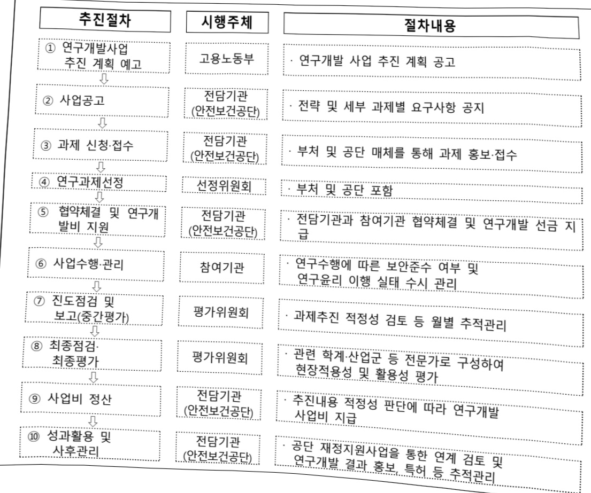
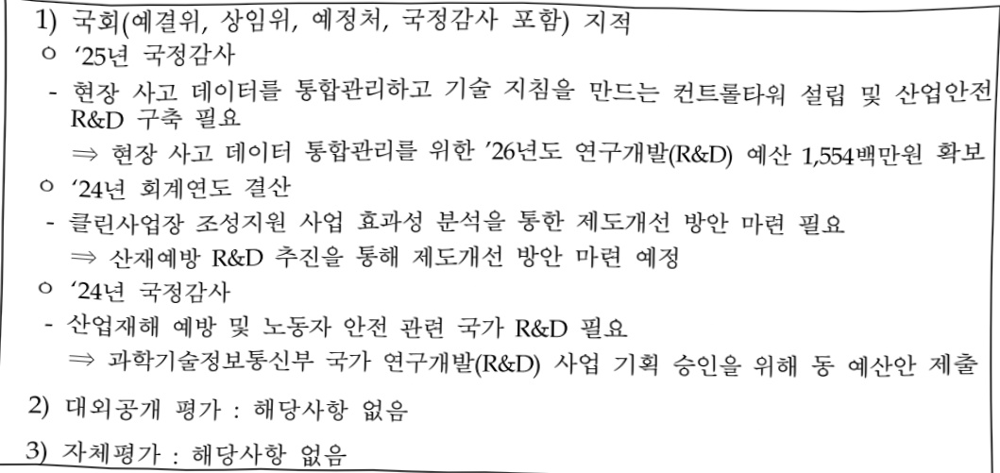

# 미래환경변화 대응 산업안전보건 연구개발(R&D)

**해당 페이지**: PDF 190 ~ 195 쪽 해당

**부처**: 고용노동부
**분야**: 사회복지
**회계유형**: 기금
**2026 확정예산**: 1554.0 백만원
**전년대비 증감률**: None%
**AI 도메인**: 데이터

---

<table border=1 style='margin: auto; word-wrap: break-word;'><tr><td style='text-align: center; word-wrap: break-word;'>사 업 명</td></tr><tr><td style='text-align: center; word-wrap: break-word;'>(23) 미래환경변화대응 산업안전보건 연구개발(R&amp;D)(4155-361)</td></tr></table>

□ 사업 코드 정보

<table border=1 style='margin: auto; word-wrap: break-word;'><tr><td style='text-align: center; word-wrap: break-word;'>구분</td><td style='text-align: center; word-wrap: break-word;'>기금</td><td style='text-align: center; word-wrap: break-word;'>소관</td><td style='text-align: center; word-wrap: break-word;'>실국(기관)</td><td style='text-align: center; word-wrap: break-word;'>계정</td><td style='text-align: center; word-wrap: break-word;'>분야</td><td style='text-align: center; word-wrap: break-word;'>부문</td></tr><tr><td style='text-align: center; word-wrap: break-word;'>코드</td><td style='text-align: center; word-wrap: break-word;'>산업재해보상</td><td rowspan="2">고용노동부</td><td style='text-align: center; word-wrap: break-word;'>산업안전</td><td rowspan="2">사회복지</td><td rowspan="2">080</td><td style='text-align: center; word-wrap: break-word;'>08E</td></tr><tr><td style='text-align: center; word-wrap: break-word;'>명칭</td><td style='text-align: center; word-wrap: break-word;'>보험및예방기금</td><td style='text-align: center; word-wrap: break-word;'>예방정책관</td><td style='text-align: center; word-wrap: break-word;'>노동</td></tr></table>

<table border=1 style='margin: auto; word-wrap: break-word;'><tr><td style='text-align: center; word-wrap: break-word;'>구분</td><td style='text-align: center; word-wrap: break-word;'>프로그램</td><td style='text-align: center; word-wrap: break-word;'>단위사업</td><td style='text-align: center; word-wrap: break-word;'>세부사업</td></tr><tr><td style='text-align: center; word-wrap: break-word;'>코드</td><td style='text-align: center; word-wrap: break-word;'>4100</td><td style='text-align: center; word-wrap: break-word;'>4155</td><td style='text-align: center; word-wrap: break-word;'>361</td></tr><tr><td style='text-align: center; word-wrap: break-word;'>명칭</td><td style='text-align: center; word-wrap: break-word;'>산업재해예방</td><td style='text-align: center; word-wrap: break-word;'>안전보건기반조성</td><td style='text-align: center; word-wrap: break-word;'>미래환경변화대응산업안전보건연구개발(R&amp;D)</td></tr></table>

☐ 사업 성격

<table border=1 style='margin: auto; word-wrap: break-word;'><tr><td rowspan="2">신규</td><td rowspan="2">계속</td><td rowspan="2">완료</td><td style='text-align: center; word-wrap: break-word;'>예비타당성</td><td style='text-align: center; word-wrap: break-word;'>총사업비</td><td style='text-align: center; word-wrap: break-word;'>총액계상</td><td style='text-align: center; word-wrap: break-word;'>사업소관 변경정보</td></tr><tr><td style='text-align: center; word-wrap: break-word;'>실시여부</td><td style='text-align: center; word-wrap: break-word;'>관리대상</td><td style='text-align: center; word-wrap: break-word;'>예산사업</td><td style='text-align: center; word-wrap: break-word;'>2025예산 시 소관</td></tr><tr><td style='text-align: center; word-wrap: break-word;'></td><td style='text-align: center; word-wrap: break-word;'>○</td><td style='text-align: center; word-wrap: break-word;'></td><td style='text-align: center; word-wrap: break-word;'></td><td style='text-align: center; word-wrap: break-word;'></td><td style='text-align: center; word-wrap: break-word;'></td><td style='text-align: center; word-wrap: break-word;'></td></tr></table>

□ 사업 지원 형태 및 지원을

<table border=1 style='margin: auto; word-wrap: break-word;'><tr><td style='text-align: center; word-wrap: break-word;'>직접</td><td style='text-align: center; word-wrap: break-word;'>출자</td><td style='text-align: center; word-wrap: break-word;'>출연</td><td style='text-align: center; word-wrap: break-word;'>보조</td><td style='text-align: center; word-wrap: break-word;'>융자</td><td style='text-align: center; word-wrap: break-word;'>국고보조율(%)</td><td style='text-align: center; word-wrap: break-word;'>융자율(%)</td></tr><tr><td style='text-align: center; word-wrap: break-word;'></td><td style='text-align: center; word-wrap: break-word;'></td><td style='text-align: center; word-wrap: break-word;'>○</td><td style='text-align: center; word-wrap: break-word;'></td><td style='text-align: center; word-wrap: break-word;'></td><td style='text-align: center; word-wrap: break-word;'></td><td style='text-align: center; word-wrap: break-word;'></td></tr></table>

## □ 사업 소관부처 및 시행주체

<table border=1 style='margin: auto; word-wrap: break-word;'><tr><td style='text-align: center; word-wrap: break-word;'>사업명</td><td colspan="2">구분</td></tr><tr><td rowspan="4">데이터 기반 산재 예방·대응 지원체계 구축</td><td rowspan="3">소관부처</td><td style='text-align: center; word-wrap: break-word;'>실·국·과(팀)</td></tr><tr><td style='text-align: center; word-wrap: break-word;'>산업안전예방정책관</td></tr><tr><td style='text-align: center; word-wrap: break-word;'>산업안전정책과</td></tr><tr><td style='text-align: center; word-wrap: break-word;'>사업시행주체</td><td style='text-align: center; word-wrap: break-word;'>한국산업안전보건공단</td></tr></table>

---

### 가.지출계획 총괄표

(단위: 백만원, %)

<table border=1 style='margin: auto; word-wrap: break-word;'><tr><td rowspan="2">목명</td><td rowspan="2">2024년 곁산</td><td colspan="2">2025년 계획</td><td colspan="2">2026년 계획</td><td rowspan="2">중감 (B-A)</td><td rowspan="2">(B-A)/A</td></tr><tr><td style='text-align: center; word-wrap: break-word;'>당초(A)</td><td style='text-align: center; word-wrap: break-word;'>수정</td><td style='text-align: center; word-wrap: break-word;'>정부안</td><td style='text-align: center; word-wrap: break-word;'>확정(B)</td></tr><tr><td style='text-align: center; word-wrap: break-word;'>데이터 기반 산재 예방·대응 지원체계 구축</td><td style='text-align: center; word-wrap: break-word;'>-</td><td style='text-align: center; word-wrap: break-word;'>-</td><td style='text-align: center; word-wrap: break-word;'>-</td><td style='text-align: center; word-wrap: break-word;'>1,554</td><td style='text-align: center; word-wrap: break-word;'>1,554</td><td style='text-align: center; word-wrap: break-word;'>1,554</td><td style='text-align: center; word-wrap: break-word;'>순응</td></tr></table>

□ 기능별(내역사업별) 계획 내역

(단위:백만원)

<table border=1 style='margin: auto; word-wrap: break-word;'><tr><td rowspan="3"></td><td colspan="5">2024</td><td colspan="6">2025(2025.12월말)</td><td rowspan="3">2026 계획</td></tr><tr><td rowspan="2">계획액 (수정)</td><td rowspan="2">계획 현액</td><td rowspan="2">집행액</td><td rowspan="2">이윌액</td><td rowspan="2">불용액</td><td colspan="2">계획액</td><td rowspan="2">계획 현액</td><td rowspan="2">집행액</td><td rowspan="2">이윌액</td><td rowspan="2">불용액</td></tr><tr><td style='text-align: center; word-wrap: break-word;'>당초</td><td style='text-align: center; word-wrap: break-word;'>수정</td></tr><tr><td style='text-align: center; word-wrap: break-word;'>○ 기능별 분류(합계)</td><td style='text-align: center; word-wrap: break-word;'>-</td><td style='text-align: center; word-wrap: break-word;'>-</td><td style='text-align: center; word-wrap: break-word;'>-</td><td style='text-align: center; word-wrap: break-word;'>-</td><td style='text-align: center; word-wrap: break-word;'>-</td><td style='text-align: center; word-wrap: break-word;'>-</td><td style='text-align: center; word-wrap: break-word;'>-</td><td style='text-align: center; word-wrap: break-word;'>-</td><td style='text-align: center; word-wrap: break-word;'>-</td><td style='text-align: center; word-wrap: break-word;'>-</td><td style='text-align: center; word-wrap: break-word;'>-</td><td style='text-align: center; word-wrap: break-word;'>1,554</td></tr><tr><td style='text-align: center; word-wrap: break-word;'>• 데이터 기반 산재 예방·대응 지원체계 구축</td><td style='text-align: center; word-wrap: break-word;'>-</td><td style='text-align: center; word-wrap: break-word;'>-</td><td style='text-align: center; word-wrap: break-word;'>-</td><td style='text-align: center; word-wrap: break-word;'>-</td><td style='text-align: center; word-wrap: break-word;'>-</td><td style='text-align: center; word-wrap: break-word;'>-</td><td style='text-align: center; word-wrap: break-word;'>-</td><td style='text-align: center; word-wrap: break-word;'>-</td><td style='text-align: center; word-wrap: break-word;'>-</td><td style='text-align: center; word-wrap: break-word;'>-</td><td style='text-align: center; word-wrap: break-word;'>-</td><td style='text-align: center; word-wrap: break-word;'>1,554</td></tr></table>

### 나. 사업설명자료

## 1 ) 사업목적·내용

- (데이터 기반 산재 예방·대응 지원체계 구축) 산업안전보건 데이터의 산업적, 기술적, 정책적 활용도 제고를 위한 데이터 관리·운영 체계 고도화가 필요함에 따라 산업안전보건 데이터 통합 및 표준화를 위한 프레임워크 개발 및 데이터 정제 등 품질관리 방안 수립 연구

## 2 ) 사업개요

## ☐ 사업근거 및 추진경위

①법령상근거

- 산업안전보건법 제4조(정부의 책무) ① 정부는 이 법의 목적을 달성하기 위하여 다음 각 호의 사항을 성실히 이행할 책무를 진다.

1. 산업 안전 및 보건 정책의 수립 및 집행

2.산업재해 예방 지원 및 지도

3.「근로기준법」 제76조의 2에 따른 직장 내 괴롭힘 예방을 위한 조치기준 마련, 지도 및 지원

4. 사업주의 자율적인 산업 안전 및 보건 경영체제 확립을 위한 지원

5. 산업 안전 및 보건에 관한 의식을 북돋우기 위한 홍보·교육 등 안전문화 확산 추진

6. 산업 안전 및 보건에 관한 기술의 연구·개발 및 시설의 설치·운영

7.산업재해에 관한 조사 및 통계의 유지·관리

8. 산업 안전 및 보건 관련 단체 등에 대한 지원 및 지도·감독

---

9. 그 밖에 노무를 제공하는 자의 안전 및 건강의 보호·증진

② 정부는 제1항 각 호의 사항을 효율적으로 수행하기 위하여 「한국산업안전보건공단법」에 따른 한국산업안전보건공단(이하 "공단"이라 한다), 그 밖의 관련 단체 및 연구기관에 행정적 · 재정적 지원을 할 수 있다.

- 산업안전보건법 시행령 제3조(산업재해 예방을 위한 시책 마련) 고용노동부장관은 법 제4조제1항제2호에 따른 산업재해 예방 지원 및 지도를 위하여 산업재해 예방기법의 연구 및 보급, 안전·보건 기술의 지원 및 교육에 관한 시책을 마련해야 한다.

- 중대재해 처벌 등에 관한 법률 제16조 (정부의 사업주 등에 대한 지원 및 보고)

① 정부는 중대재해를 예방하여 시민과 종사자의 안전과 건강을 확보하기 위하여 다음 각 호의 사항을 이행하여야 한다.

1. 중대재해의 종합적인 예방대책의 수립·시행과 발생원인 분석

2. 사업주, 법인 및 기관의 안전보건관리체계 구축을 위한 지원

3. 사업주, 법인 및 기관의 중대재해 예방을 위한 기술 지원 및 지도

4. 이 법의 목적 달성을 위한 교육 및 홍보의 시행

② 정부는 사업주, 법인 및 기관에 대하여 유해 · 위험 시설의 개선과 보호 장비의 구매, 종사자 건강진단 및 관리 등 중대재해 예방사업에 소요되는 비용의 전부 또는 일부를 예산의 범위에서 지원할 수 있다.

## □ 주요내용

① 사업규모

- 총사업비 : (26~30) 370억원

- 사업기간 : '26.4. ~ 계속

-최근 5년 간 투입된 사업비

<table border=1 style='margin: auto; word-wrap: break-word;'><tr><td style='text-align: center; word-wrap: break-word;'>연도</td><td style='text-align: center; word-wrap: break-word;'>2022</td><td style='text-align: center; word-wrap: break-word;'>2023</td><td style='text-align: center; word-wrap: break-word;'>2024</td><td style='text-align: center; word-wrap: break-word;'>2025</td><td style='text-align: center; word-wrap: break-word;'>2026</td></tr><tr><td style='text-align: center; word-wrap: break-word;'>사업비</td><td style='text-align: center; word-wrap: break-word;'>-</td><td style='text-align: center; word-wrap: break-word;'>-</td><td style='text-align: center; word-wrap: break-word;'>-</td><td style='text-align: center; word-wrap: break-word;'>-</td><td style='text-align: center; word-wrap: break-word;'>1,554</td></tr></table>

② 사업추진체계

- 사업시행방법 : 출연

-사업시행주체:한국산업안전보건공단

- 사업 수혜자 : 산재보험가입 사업주 및 근로자

- 보조, 융자, 출연, 출자 등의 경우 보조·융자 등 지원 비율 및 법적근거

<table border=1 style='margin: auto; word-wrap: break-word;'><tr><td style='text-align: center; word-wrap: break-word;'>내역사업명</td><td style='text-align: center; word-wrap: break-word;'>구분</td><td style='text-align: center; word-wrap: break-word;'>피보조·피출연 등 기관명</td><td style='text-align: center; word-wrap: break-word;'>지원 금액 (2026계획)</td><td style='text-align: center; word-wrap: break-word;'>지원 비율(%)</td><td style='text-align: center; word-wrap: break-word;'>보조율 법적근거 (해당 조항)</td></tr><tr><td style='text-align: center; word-wrap: break-word;'>데이터기반 신제 예방·대응 지원체계 구축</td><td style='text-align: center; word-wrap: break-word;'>출연</td><td style='text-align: center; word-wrap: break-word;'>한국산업 안전보건 공단</td><td style='text-align: center; word-wrap: break-word;'>1,554</td><td style='text-align: center; word-wrap: break-word;'>100%</td><td style='text-align: center; word-wrap: break-word;'>산업재해보상보험법 제95조, 제96조</td></tr></table>

---

## 3 ) 2026년도 계획 산출 근거

<table border=1 style='margin: auto; word-wrap: break-word;'><tr><td style='text-align: center; word-wrap: break-word;'>구 분</td><td style='text-align: center; word-wrap: break-word;'>2025년 계획</td><td style='text-align: center; word-wrap: break-word;'>2026년 계획</td></tr><tr><td style='text-align: center; word-wrap: break-word;'>☐ 미래환경변화대응 산업안전보건 연구개발(R&amp;D)</td><td style='text-align: center; word-wrap: break-word;'>-</td><td style='text-align: center; word-wrap: break-word;'>1,554</td></tr><tr><td style='text-align: center; word-wrap: break-word;'>(1) 데이터 기반 산재 예방·대응 지원 체계 구축</td><td style='text-align: center; word-wrap: break-word;'>-</td><td style='text-align: center; word-wrap: break-word;'>1,554 · 데이터 기반 산재 예방·대응 지원체계 구축 1,500 (연구개발비) 1개과제×2,000백만원 ×9/12개월=1,500백만원 · 연구기획평가 54 (기획평가관리비) 54백만원</td></tr></table>

4) 사업효과

□ 사업영향, 산출물 성과지표 등

2026~2029년도 성과계획서 상 성과지표 및 최근 3년간 성과 달성도

- 동 사업은 '26년 신규사업으로 2022~2026년도 성과가 도출되지 않았으며, '26년 이후 사업의 목적과 맞는 성과지표 설정

<table border=1 style='margin: auto; word-wrap: break-word;'><tr><td style='text-align: center; word-wrap: break-word;'>성과지표</td><td style='text-align: center; word-wrap: break-word;'>구분</td><td style='text-align: center; word-wrap: break-word;'>2026</td><td style='text-align: center; word-wrap: break-word;'>2027</td><td style='text-align: center; word-wrap: break-word;'>2028</td><td style='text-align: center; word-wrap: break-word;'>2029</td><td style='text-align: center; word-wrap: break-word;'>2026목표치산출근거</td><td style='text-align: center; word-wrap: break-word;'>측정산식(또는 측정방법)</td><td style='text-align: center; word-wrap: break-word;'>자료수집방법(또는 자료출처)</td></tr><tr><td rowspan="3">데이터 활용서비스 만족도(단위: 점)</td><td style='text-align: center; word-wrap: break-word;'>목표</td><td style='text-align: center; word-wrap: break-word;'>-</td><td style='text-align: center; word-wrap: break-word;'>-</td><td style='text-align: center; word-wrap: break-word;'>70.6</td><td style='text-align: center; word-wrap: break-word;'>72.7</td><td rowspan="3">유사조사결과연구데이터 수요자만족도 평균 점수 기준 매년 3%를 상향한 목표치 설정*다부처 국가생명 연구자원 선진화 사업(과기정통부)</td><td rowspan="3">리커트 척도 5구간 척도로 조사하며, 100점 만점으로 환산하여 산출</td><td rowspan="3">설문조사</td></tr><tr><td style='text-align: center; word-wrap: break-word;'>실적</td><td style='text-align: center; word-wrap: break-word;'>-</td><td style='text-align: center; word-wrap: break-word;'>-</td><td style='text-align: center; word-wrap: break-word;'>-</td><td style='text-align: center; word-wrap: break-word;'>-</td></tr><tr><td style='text-align: center; word-wrap: break-word;'>달성도</td><td style='text-align: center; word-wrap: break-word;'>-</td><td style='text-align: center; word-wrap: break-word;'>-</td><td style='text-align: center; word-wrap: break-word;'>-</td><td style='text-align: center; word-wrap: break-word;'>-</td></tr><tr><td rowspan="3">정책 채택률(단위: %)</td><td style='text-align: center; word-wrap: break-word;'>목표</td><td style='text-align: center; word-wrap: break-word;'>-</td><td style='text-align: center; word-wrap: break-word;'>-</td><td style='text-align: center; word-wrap: break-word;'>-</td><td style='text-align: center; word-wrap: break-word;'>50</td><td rowspan="3">동 성과지표는 유사서업‘융복합신기술제품안전기술지원사업’(산업부)의 ‘22~23년 성과 평균 22.65% 대비 도전적 목표치로 50% 설정</td><td rowspan="3">(개발완료된 인증기준(인, 표준 모델)안 중제·개정 고시 및 표준 채택 누계수 ÷ 개발완료 인증기준(인) 및 표준 모델(인) 누계수)×100</td><td rowspan="3">인증기준(인 및 표준 모델)안 중 고시완료 또는 국내외 표준으로 채택된 기준(인) 확인</td></tr><tr><td style='text-align: center; word-wrap: break-word;'>실적</td><td style='text-align: center; word-wrap: break-word;'>-</td><td style='text-align: center; word-wrap: break-word;'>-</td><td style='text-align: center; word-wrap: break-word;'>-</td><td style='text-align: center; word-wrap: break-word;'>-</td></tr><tr><td style='text-align: center; word-wrap: break-word;'>달성도</td><td style='text-align: center; word-wrap: break-word;'>-</td><td style='text-align: center; word-wrap: break-word;'>-</td><td style='text-align: center; word-wrap: break-word;'>-</td><td style='text-align: center; word-wrap: break-word;'>-</td></tr><tr><td rowspan="3">등록특허 K-PEG 등급(단위: 점)</td><td style='text-align: center; word-wrap: break-word;'>목표</td><td style='text-align: center; word-wrap: break-word;'>-</td><td style='text-align: center; word-wrap: break-word;'>-</td><td style='text-align: center; word-wrap: break-word;'>3.23</td><td style='text-align: center; word-wrap: break-word;'>3.33</td><td rowspan="3">‘재난안전산업기술사업화 지원’(행안부) 사업의 2024년도 목표치를 기준으로 매년 3%를 상향한 도전적 목표치 설정</td><td rowspan="3">K-PEG 등급 ÷ 특허등록건수</td><td rowspan="3">특허등록증 및 특허평가보고서</td></tr><tr><td style='text-align: center; word-wrap: break-word;'>실적</td><td style='text-align: center; word-wrap: break-word;'>-</td><td style='text-align: center; word-wrap: break-word;'>-</td><td style='text-align: center; word-wrap: break-word;'>-</td><td style='text-align: center; word-wrap: break-word;'>-</td></tr><tr><td style='text-align: center; word-wrap: break-word;'>달성도</td><td style='text-align: center; word-wrap: break-word;'>-</td><td style='text-align: center; word-wrap: break-word;'>-</td><td style='text-align: center; word-wrap: break-word;'>-</td><td style='text-align: center; word-wrap: break-word;'>-</td></tr><tr><td rowspan="3">산업현장 활용도(단위: %)</td><td style='text-align: center; word-wrap: break-word;'>목표</td><td style='text-align: center; word-wrap: break-word;'>-</td><td style='text-align: center; word-wrap: break-word;'>-</td><td style='text-align: center; word-wrap: break-word;'>-</td><td style='text-align: center; word-wrap: break-word;'>50</td><td rowspan="3">동 사업 개발 기술은 안전보건과 관련된 공공기술이며 기술의 산업현장 도입은 ‘사업화 성공’이 전체가 되어야 하는 점을 감안하여 공공기술의 사업화 성공률 34.7%* 대비 매우 도전적 목표치로 50% 설정*성과활용현황조사를 척보고서(산업부, 2021.09.)</td><td rowspan="3">(현장 도입 건수 ÷ 종료과제 누적 건수) × 100</td><td rowspan="3">제품/시스템 등 도입 확약서(계약서), 현장실사</td></tr><tr><td style='text-align: center; word-wrap: break-word;'>실적</td><td style='text-align: center; word-wrap: break-word;'>-</td><td style='text-align: center; word-wrap: break-word;'>-</td><td style='text-align: center; word-wrap: break-word;'>-</td><td style='text-align: center; word-wrap: break-word;'>-</td></tr><tr><td style='text-align: center; word-wrap: break-word;'>달성도</td><td style='text-align: center; word-wrap: break-word;'>-</td><td style='text-align: center; word-wrap: break-word;'>-</td><td style='text-align: center; word-wrap: break-word;'>-</td><td style='text-align: center; word-wrap: break-word;'>-</td></tr></table>

---

② 성과지표 이외의 연도별 사업추진 경과 및 실적 : 해당사항 없음

③향후(2026년도 이후)기대효과

- 고유데이터 인프라 구축과 첨단기술을 통한 자동화 시스템 개발을 통해 산재예방

정책 및 제도 추진의 과학적 근거를 제공

5) 타당성조사 및 예비타당성조사 시행여부 : 해당사항 없음

6) 총사업비 대상사업 여부 및 내역

## □ 총사업비 정보

<table border=1 style='margin: auto; word-wrap: break-word;'><tr><td style='text-align: center; word-wrap: break-word;'>연도</td><td style='text-align: center; word-wrap: break-word;'>사업기간</td><td style='text-align: center; word-wrap: break-word;'>2022까지 기투자액</td><td style='text-align: center; word-wrap: break-word;'>2023</td><td style='text-align: center; word-wrap: break-word;'>2024</td><td style='text-align: center; word-wrap: break-word;'>2025</td><td style='text-align: center; word-wrap: break-word;'>2026</td><td style='text-align: center; word-wrap: break-word;'>2027이후 투자계획</td><td style='text-align: center; word-wrap: break-word;'>계</td></tr><tr><td style='text-align: center; word-wrap: break-word;'>사업비</td><td style='text-align: center; word-wrap: break-word;'>2026~2030</td><td style='text-align: center; word-wrap: break-word;'>-</td><td style='text-align: center; word-wrap: break-word;'>-</td><td style='text-align: center; word-wrap: break-word;'>-</td><td style='text-align: center; word-wrap: break-word;'>-</td><td style='text-align: center; word-wrap: break-word;'>16</td><td style='text-align: center; word-wrap: break-word;'>354</td><td style='text-align: center; word-wrap: break-word;'></td></tr></table>

(단위: 억원)

## 7 ) 사업 집행절차

---

## 8 ) 각종 평가

### 다. 최근 4년간 결산내역 : 해당사항 없음

---

### 원본 PDF 크롭 이미지

