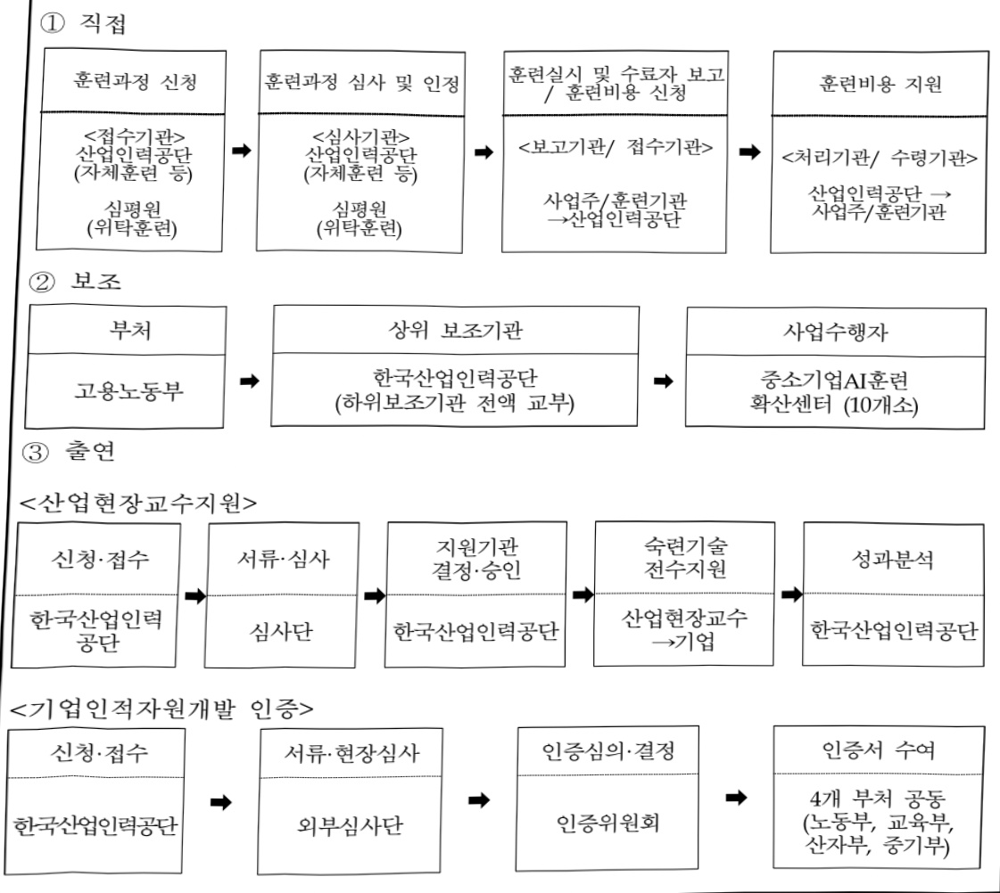

# 사업주직업훈련지원금

**해당 페이지**: PDF 196 ~ 204 쪽 해당

**부처**: 고용노동부
**분야**: 사회복지
**회계유형**: 기금
**2026 확정예산**: 249668.0 백만원
**전년대비 증감률**: -17.0%
**AI 도메인**: 교육/인재

---

□ 기능별(내역사업별) 계획 내역

(단위:백만원)

<table border=1 style='margin: auto; word-wrap: break-word;'><tr><td rowspan="3"></td><td colspan="5">2024</td><td colspan="6">2025(2025.12월말)</td><td rowspan="3">2026 계획</td></tr><tr><td rowspan="2">계획액(수정)</td><td rowspan="2">계획현액</td><td rowspan="2">집행액</td><td rowspan="2">이월액</td><td rowspan="2">불용액</td><td colspan="2">계획액</td><td rowspan="2">계획현액</td><td rowspan="2">집행액</td><td rowspan="2">이월액</td><td rowspan="2">불용액</td></tr><tr><td style='text-align: center; word-wrap: break-word;'>당초</td><td style='text-align: center; word-wrap: break-word;'>수정</td></tr><tr><td style='text-align: center; word-wrap: break-word;'>○ 기능별 분류(함께)</td><td style='text-align: center; word-wrap: break-word;'>369,690</td><td style='text-align: center; word-wrap: break-word;'>369,690</td><td style='text-align: center; word-wrap: break-word;'>368,023</td><td style='text-align: center; word-wrap: break-word;'>-</td><td style='text-align: center; word-wrap: break-word;'>1,667</td><td style='text-align: center; word-wrap: break-word;'>300,670</td><td style='text-align: center; word-wrap: break-word;'>300,670</td><td style='text-align: center; word-wrap: break-word;'>300,670</td><td style='text-align: center; word-wrap: break-word;'>292,423</td><td style='text-align: center; word-wrap: break-word;'>-</td><td style='text-align: center; word-wrap: break-word;'>8,247</td><td style='text-align: center; word-wrap: break-word;'>249,668</td></tr><tr><td style='text-align: center; word-wrap: break-word;'>· 일반훈련</td><td style='text-align: center; word-wrap: break-word;'>321,584</td><td style='text-align: center; word-wrap: break-word;'>321,584</td><td style='text-align: center; word-wrap: break-word;'>321,253</td><td style='text-align: center; word-wrap: break-word;'>-</td><td style='text-align: center; word-wrap: break-word;'>331</td><td style='text-align: center; word-wrap: break-word;'>195,424</td><td style='text-align: center; word-wrap: break-word;'>211,351</td><td style='text-align: center; word-wrap: break-word;'>211,351</td><td style='text-align: center; word-wrap: break-word;'>206,861</td><td style='text-align: center; word-wrap: break-word;'>-</td><td style='text-align: center; word-wrap: break-word;'>4,490</td><td style='text-align: center; word-wrap: break-word;'>210,237</td></tr><tr><td style='text-align: center; word-wrap: break-word;'>· 혁신형 기업훈련</td><td style='text-align: center; word-wrap: break-word;'>-</td><td style='text-align: center; word-wrap: break-word;'>-</td><td style='text-align: center; word-wrap: break-word;'>-</td><td style='text-align: center; word-wrap: break-word;'>-</td><td style='text-align: center; word-wrap: break-word;'>-</td><td style='text-align: center; word-wrap: break-word;'>51,867</td><td style='text-align: center; word-wrap: break-word;'>38,867</td><td style='text-align: center; word-wrap: break-word;'>38,867</td><td style='text-align: center; word-wrap: break-word;'>35,534</td><td style='text-align: center; word-wrap: break-word;'>-</td><td style='text-align: center; word-wrap: break-word;'>3,333</td><td style='text-align: center; word-wrap: break-word;'>-</td></tr><tr><td style='text-align: center; word-wrap: break-word;'>· 현장맞춤형체계적훈련</td><td style='text-align: center; word-wrap: break-word;'>27,271</td><td style='text-align: center; word-wrap: break-word;'>27,271</td><td style='text-align: center; word-wrap: break-word;'>26,185</td><td style='text-align: center; word-wrap: break-word;'>-</td><td style='text-align: center; word-wrap: break-word;'>1,086</td><td style='text-align: center; word-wrap: break-word;'>32,706</td><td style='text-align: center; word-wrap: break-word;'>29,279</td><td style='text-align: center; word-wrap: break-word;'>29,279</td><td style='text-align: center; word-wrap: break-word;'>29,055</td><td style='text-align: center; word-wrap: break-word;'>-</td><td style='text-align: center; word-wrap: break-word;'>224</td><td style='text-align: center; word-wrap: break-word;'>35,899</td></tr><tr><td style='text-align: center; word-wrap: break-word;'>· 지역산업맞춤형훈련</td><td style='text-align: center; word-wrap: break-word;'>19,203</td><td style='text-align: center; word-wrap: break-word;'>19,203</td><td style='text-align: center; word-wrap: break-word;'>19,203</td><td style='text-align: center; word-wrap: break-word;'>-</td><td style='text-align: center; word-wrap: break-word;'>-</td><td style='text-align: center; word-wrap: break-word;'>19,041</td><td style='text-align: center; word-wrap: break-word;'>19,541</td><td style='text-align: center; word-wrap: break-word;'>19,541</td><td style='text-align: center; word-wrap: break-word;'>19,446</td><td style='text-align: center; word-wrap: break-word;'>-</td><td style='text-align: center; word-wrap: break-word;'>95</td><td style='text-align: center; word-wrap: break-word;'>-</td></tr><tr><td style='text-align: center; word-wrap: break-word;'>· 운영비</td><td style='text-align: center; word-wrap: break-word;'>1,632</td><td style='text-align: center; word-wrap: break-word;'>1,632</td><td style='text-align: center; word-wrap: break-word;'>1,382</td><td style='text-align: center; word-wrap: break-word;'>-</td><td style='text-align: center; word-wrap: break-word;'>250</td><td style='text-align: center; word-wrap: break-word;'>1,632</td><td style='text-align: center; word-wrap: break-word;'>1,632</td><td style='text-align: center; word-wrap: break-word;'>1,632</td><td style='text-align: center; word-wrap: break-word;'>1,527</td><td style='text-align: center; word-wrap: break-word;'>-</td><td style='text-align: center; word-wrap: break-word;'>105</td><td style='text-align: center; word-wrap: break-word;'>3,532</td></tr></table>

### 나. 사업설명자료

## 1 ) 사업목적·내용

- (사업주직업훈련지원금) 사업주가 재직근로자, 채용예정자 등을 대상으로 직업능력 개발훈련을 실시할 경우 소요비용 일부를 지원

- (일반훈련) 훈련과정을 인정받아 노동자 등을 대상으로 직업능력개발훈련을 실시할 경우 기업 규모별로 훈련에 소요된 비용 지원

* 기업훈련 절차 및 지원체계 개선으로 기업의 편의성을 제공하고 최신 온라인 훈련 제공 등 양질의 기업훈련을 지원

- (현장맞춤형체계적훈련) 중소기업 훈련컨설팅(능력개발전담주치의, 중소기업AI훈련확산센터 등)을 통한 기업 맞춤형 훈련프로그램 개발·실시 지원, 민간주치의 육성, 행정 지원 등 중소기업의 체계적인 직무훈련 지원 서비스

## 2 ) 사업개요

## ☐ 사업근거 및 추진경위

① 법령상 근거 및 조항 적시

- 고용보험법 제27조, 제31조, 같은 법 시행령 제41조 및 제52조, 국민 평생 직업능력 개발법 제20조, 제24조, 같은 법 시행령 제22조, 사업주 직업능력개발훈련 지원규정, 중소기업 직업능력개발 지원사업 실시규정(고시)

## ② 추진경위

- '95.7. 고용보험법 시행령에 근거 마련

- '05.7. 사업주 수요가 많은 단기훈련 지원 확대(3일 20시간 이상→중소기업 1일 8시간 이상, 대기업 2일 16시간 이상, 근로자 직업능력개발법 시행령 개정)

---

- '17.12. 중소기업훈련지원센터 설치, 중소기업 고숙련·신기술훈련(고급훈련) 지원 확대(NCS 100% → 300%), 중소기업 체계적 현장훈련 지원 근거 등 규정 등 신설

- '19.1. 공통법정훈련(개인정보보호, 성희롱예방교육 등) 지원 중단, 법정직무훈련 지원을 인하, 과다 공급과정 지원을 인하 등 재정 효율화 시행

- '19. 자체훈련과 위탁훈련을 혼합하여 훈련 시 지원금 지급기준(집체훈련 수료인원이 전체 훈련실시 인원의 10분의 10 이상인 경우 지원) 등 신설

- '22.1. 최소훈련시간 단축(중소기업 1일 8시간 이상, 대기업 2일 16시간 이상→기업규모와 관계 없이 4시간 이상, 국민 평생 직업능력 개발법 시행령 개정)

- '22. 下. 기업직업훈련 혁신 및 활성화 방안으로 3대 혁신 사업(기업직업훈련카드, 폐기지구독형 원격훈련, 자체훈련 탄력운영제) 및 능력개발전담주치의 운영 시범 도입

- '25.1. 기업의 실제 훈련수요를 반영할 수 있도록 절차는 줄이고, 훈련품질은 높인

혁신형 기업훈련(기업훈련 탄력운영제, 중소기업 근로자주도 훈련, 최신원격훈련)'을 신규 도입

□ 주요내용

① 사업규모

- 총사업비 : 해당없음

- 사업기간 : '95년 ~ 계속

- 최근 5년 간 투입된 사업비(예산액기준, 추경편성한 연도에는 추경포함)

<table border=1 style='margin: auto; word-wrap: break-word;'><tr><td style='text-align: center; word-wrap: break-word;'>연도</td><td style='text-align: center; word-wrap: break-word;'>2022</td><td style='text-align: center; word-wrap: break-word;'>2023</td><td style='text-align: center; word-wrap: break-word;'>2024</td><td style='text-align: center; word-wrap: break-word;'>2025</td><td style='text-align: center; word-wrap: break-word;'>2026</td></tr><tr><td style='text-align: center; word-wrap: break-word;'>사업비</td><td style='text-align: center; word-wrap: break-word;'>274,429백만원</td><td style='text-align: center; word-wrap: break-word;'>303,030백만원</td><td style='text-align: center; word-wrap: break-word;'>356,828백만원</td><td style='text-align: center; word-wrap: break-word;'>300,670백만원</td><td style='text-align: center; word-wrap: break-word;'>249,668백만원</td></tr></table>

② 사업추진체계

- 사업시행방법 : 직접수행, 보조, 출연

- 사업시행주체 : 고용노동부(한국산업인력공단)

- 사업 수혜자 : 고용보험 가입 사업주

- 보조, 융자, 출연, 출자 등의 경우 보조·융자 등 지원 비율 및 법적근거

<table border=1 style='margin: auto; word-wrap: break-word;'><tr><td style='text-align: center; word-wrap: break-word;'>내역사업명</td><td style='text-align: center; word-wrap: break-word;'>구분</td><td style='text-align: center; word-wrap: break-word;'>피보조·피출연 등 기관명</td><td style='text-align: center; word-wrap: break-word;'>지원 금액 (2026계획)</td><td style='text-align: center; word-wrap: break-word;'>지원 비율(%)</td><td style='text-align: center; word-wrap: break-word;'>보조율 법적근거 (해당 조항)</td></tr><tr><td rowspan="2">현장맞춤형 체계적훈련</td><td style='text-align: center; word-wrap: break-word;'>보조</td><td style='text-align: center; word-wrap: break-word;'>한국산업 인력공단</td><td style='text-align: center; word-wrap: break-word;'>4,230백만원</td><td style='text-align: center; word-wrap: break-word;'>100.0</td><td style='text-align: center; word-wrap: break-word;'>중소기업 직업능력개발 지원사업 실시규정(고시) 제3조 3항, 제11조</td></tr><tr><td style='text-align: center; word-wrap: break-word;'>출연</td><td style='text-align: center; word-wrap: break-word;'>한국산업 인력공단</td><td style='text-align: center; word-wrap: break-word;'>5,139백만원</td><td style='text-align: center; word-wrap: break-word;'>100.0</td><td style='text-align: center; word-wrap: break-word;'>한국산업인력공단법 제14조</td></tr></table>

---

## 3 ) 2026년도 계획 산출 근거

### □ 사업주직업훈련지원금: ('25) 300,670 → ('26) 249,668백만원 <△51,002백만원, 17.0% 감>

- 기업수요를 반영한 다양한 훈련서비스 공급과 중소기업 AI훈련 지원확대 등을 통한 기업

직업훈련 활성화 필요, (국정과제92) 인구 변동, 디지털 변화, 기후위기에 대응하는 노동대전환

* 컨소시엄공동훈련센터에서 실시하는 훈련비는 국가인적자원개발컨소시엄 사업으로 이관(631억)

### (1) 일반훈련: ('25) 195,424 → ('26) 210,237백만원 <14,813백만원, 7.6% 증>

① 일반직무훈련: 129,973백만원

- (요구) 재직근로자 등의 훈련을 위해 자체위탁 및 집체원격훈련 방식의 일반직무훈련을 지원

- (산출내역) 916,435명×121,870원 + 248,195명×73,680원 <△12,819백만원 >

↓ 기업의 자체훈련 활성화를 위해 행정절차를 간소화한 탄력운영제를 내역이동하여 편성

② 유급휴가훈련: 15,864백만원

- (요구) 5일 이상의 유급휴가를 주고 20시간 이상 훈련을 실시하여 숙련인력 양성지원 필요

- (산출내역) 11,453명×1,385,140원 <△12,968백만원 >

③ 중소기업재직근로자 지원: 42,420백만원

- (요구) 재직자 직무능력 향상에 필요한 훈련과정을 기업훈련 여건 및 수요에 맞게 자유롭게 수강할 수 있도록 훈련비 지원을 강화한 동 사업 확대

* AI분야(기초과정 및 융합과정 등) 및 비수도권 우대

- (산출내역) 1만개소×1,160천원 + 1만개소×1,732천원 + 10만명×135천원 <+30,820

  백만원 >

④ 최신원격훈련: 21,980백만원

- (요구) 훈련시장에서 수요가 높은 훈련기관(민간혁신기관, 대기업)이 보유한 고품질 원격 훈련 콘텐츠를 우선지원대상기업 근로자들이 자유롭게 선택하여 수강할 수 있도록 지원

- (산출내역) 157,000명×140천원 <전년 동>

### (2) 현장맞춤형 체계적훈련: (25) 32,706 → (26) 35,899백만원 <3,193백만원, 9.8% 증>

①체계적현장훈련:16,100백만원

- (요구) 기업 현장의 개선과제를 문제해결 방식으로 구성하여 훈련과정을 개발하고, 실무중심의 문제 해결 훈련을 통해 직무역량 개발지원

- (산출내역) 2,300개소×7백만원 <전년 동>

② 능력개발전담주치의: 5,730백만원

---

- (요구) 기업DB를 활용하여 AI 훈련이 미흡한 기업을 발굴하고, 훈련에 시간 투자가 어려운 중소기업 찾아가는 훈련 컨설팅 확대를 위해 관련 운영비 증액

- (산출내역) 운영비 (20개소×204.7백만원 + 12개소×113백만원) + 기업진단관리시스템 유지관리비 280백만원 <+1,355백만원>

↓ 능력개발전담주치의 확대(20→32개소, 추가 12개소는 기존 20개 부서 운영 단가의 55% 산정)

③ 중소기업AI훈련확산센터: 8,930백만원

- (요구) 중소기업의 AI 훈련 확산을 위해 지역별 전문기관 선정 → AI분야 등 역량있는 전문인력을 민간주치의로 선발·육성하여 중소기업 AI역량진단·훈련체계 수립 및 AI+PBL훈련 과정 개발 지원

- (산출내역) 10개센터×273백만원 + 2천개소×750천원 + 600개소×7,830천원 <+7,565백만원>

* 기존 중소기업훈련지원센터를 '중소기업AI훈련확산센터'로 명칭 변경, 확대(5→10)개소)·개편

④ 기업인적자원개발인증: 739백만원

- (요구) 인적자원개발 및 관리 우수기관에 대해 인증 수여 및 각종 혜택(감독 면제, 가점 부여 등) 제공 유지

- (산출내역) 123개소×6,010천원 <전년 동>

⑤산업현장교수지원:4,400백만원

- (요구) 기술애로로 어려움을 섞는 중소기업에 업무 노하우 및 기술 전수를 통한 기술

경쟁력 향상제고

- (산출내역) 1천개소×4,400천원 <△1,500백만원>

  → 기업별 총 지원시간을 40시간 내외로 축소

### (3) 운영비 : (25) 1,632 → (26) 3,532백만원 <1,900백만원, 116.4% 증>

- (요구) 사업주훈련 성과관리, 사업수행을 위한 기본경비 등 운영비, 사업주훈련 업무 프로세스

(과정 적정성 심사, 비용 지급 등)에 AI 도입

- (산출내역) 1,632백만원(사업운영비) + 1,900백만원(1식 x 시스템개발비 1,540백만원 + 1식 x 하드웨어 비용 360백만원)

2025년도 계획 및 2026년도 계획 산출 세부내역 비교

<table border=1 style='margin: auto; word-wrap: break-word;'><tr><td rowspan="2">예산</td><td style='text-align: center; word-wrap: break-word;'>&#x27;25년 계획</td><td colspan="2">&#x27;26년 계획</td></tr><tr><td style='text-align: center; word-wrap: break-word;'>산출내역</td><td style='text-align: center; word-wrap: break-word;'>예산</td><td style='text-align: center; word-wrap: break-word;'>산출내역</td></tr><tr><td style='text-align: center; word-wrap: break-word;'>300,670</td><td style='text-align: center; word-wrap: break-word;'>• 보험금(320-04): 286,659백만원가. 일반훈련(195,424백만원) • 일반직무훈련 673,106명 × 123천원 + 5만명 × 1,200천원 = 142,792백만원 • 장기유급휴가훈련 8,000명 × 3,604천원 = 28,832백만원 • 기업직업훈련카드: 1만개소 × 2,380천원 = 23,800백만원</td><td style='text-align: center; word-wrap: break-word;'>249,668</td><td style='text-align: center; word-wrap: break-word;'>• 보험금(320-04): 231,037백만원가. 일반훈련(210,237백만원) • 일반직무훈련 916,435명×121,870원 + 248,195명×73,680원 = 129,973백만원 • 유급휴가훈련 11,453명×1,385,140원 = 15,864백만원 • 중소기업재직근로자지원: 1만개소×1,160천원 + 1만개소</td></tr></table>

---

<table border=1 style='margin: auto; word-wrap: break-word;'><tr><td colspan="2">&#x27;25년 계획</td><td colspan="2">&#x27;26년 계획</td></tr><tr><td style='text-align: center; word-wrap: break-word;'>예산</td><td style='text-align: center; word-wrap: break-word;'>산출내역</td><td style='text-align: center; word-wrap: break-word;'>예산</td><td style='text-align: center; word-wrap: break-word;'>산출내역</td></tr><tr><td style='text-align: center; word-wrap: break-word;'></td><td style='text-align: center; word-wrap: break-word;'>나. 혁신형 기업훈련(51,867백만원)• 탄력운영제: 153,672명 × 119천원 = 18,287백만원• 중소기업재직근로자지원 1만110000 × 1,160백만원• 최신원격훈련: 157,000명 × 140천원 = 21,980백만원다. 현장맞춤형체계적훈련(20,327백만원)• 체계적현장훈련: 2,300개소 × 7백만원 = 16,100백만원• 빈일자리재직청년기술연수: 650명 × 6,503천원 = 4,227백만원라. 지역·산업맞춤형훈련(19,041백만원)• 지역·산업맞춤형: 45,336명 × 420천원 = 19,041백만원○ 민간경상보조(320-01) : 1,365백만원가. 현장맞춤형체계적훈련(1,365백만원)• 중소기업훈련지원센타: 5개소 × 273백만원 = 1,365백만원○ 일반용역비(210-14) : 6,007백만원가. 운영비(1,632백만원)• 운영비(1,005백만원) + 직업훈련성과관리(627백만원)나. 현장맞춤형체계적훈련(4,375백만원)• 능력개발전담주치의: 20개소 × 204.7백만원 + 280백만원= 4,375백만원○ 출연금(350-02) : 6,639백만원가. 기업인적자원개발인증: 123개소 × 6,010천원 = 739백만원나. 산업현장교수지원: 1천개소 × 5,900천원 = 5,900백만원</td><td style='text-align: center; word-wrap: break-word;'>예산</td><td style='text-align: center; word-wrap: break-word;'>×1,732천원 + 10만명×135천원 = 42,420백만원• 최신원격훈련: 157,000명 × 140천원 = 21,980백만원나. 현장맞춤형체계적훈련(20,800백만원)• 체계적현장훈련: 2,300개소 × 7백만원 = 16,100백만원• 중소기업AI훈련확산센타: 600개소 × 7,830천원 = 4,700백만원○ 민간경상보조(320-01) : 4,230백만원가. 현장맞춤형체계적훈련(4,230백만원)• 중소기업AI훈련확산센타: 10개센타×273백만원 + 2천개소 ×750천원 = 4,230백만원○ 일반용역비(210-14) : 9,262백만원가. 운영비(3,532백만원)• 운영비 등(1,632백만원) + 훈련과정심사 AI시스템도입(1,900백만원) = 3,532백만원나. 현장맞춤형체계적훈련(5,730백만원)• 능력개발전담주치의 20개소×204.7백만원 + 12개소×113백만원 + 280백만원 = 5,730백만원○ 출연금(350-02) : 5,139백만원가. 기업인적자원개발인증: 123개소 × 6,010천원 = 739백만원나. 산업현장교수지원: 1천개소 × 4,400천원 = 4,400백만원</td></tr></table>

## 4 ) 사업효과

□ 사업영향, 산출물 성과지표 등

① 2022~2026년도 성과계획서 상 성과지표 및 최근 5년간 성과 달성도

<table border=1 style='margin: auto; word-wrap: break-word;'><tr><td style='text-align: center; word-wrap: break-word;'>성과지표</td><td style='text-align: center; word-wrap: break-word;'>구분</td><td style='text-align: center; word-wrap: break-word;'>2022</td><td style='text-align: center; word-wrap: break-word;'>2023</td><td style='text-align: center; word-wrap: break-word;'>2024</td><td style='text-align: center; word-wrap: break-word;'>2025</td><td style='text-align: center; word-wrap: break-word;'>2026</td><td style='text-align: center; word-wrap: break-word;'>2026 목표치산출근거</td><td style='text-align: center; word-wrap: break-word;'>측정산식(또는 측정방법)</td><td style='text-align: center; word-wrap: break-word;'>자료수집방법(또는 자료출처)</td></tr><tr><td rowspan="3">K-Digital Training 수료율(단위: %)</td><td style='text-align: center; word-wrap: break-word;'>목표</td><td style='text-align: center; word-wrap: break-word;'>88.0</td><td style='text-align: center; word-wrap: break-word;'>(삭제)</td><td style='text-align: center; word-wrap: break-word;'>(삭제)</td><td style='text-align: center; word-wrap: break-word;'>(삭제)</td><td style='text-align: center; word-wrap: break-word;'>(삭제)</td><td rowspan="3">-</td><td rowspan="3">-</td><td rowspan="3">-</td></tr><tr><td style='text-align: center; word-wrap: break-word;'>실적</td><td style='text-align: center; word-wrap: break-word;'>89.7</td><td style='text-align: center; word-wrap: break-word;'>-</td><td style='text-align: center; word-wrap: break-word;'>-</td><td style='text-align: center; word-wrap: break-word;'>-</td><td style='text-align: center; word-wrap: break-word;'>-</td></tr><tr><td style='text-align: center; word-wrap: break-word;'>달성도</td><td style='text-align: center; word-wrap: break-word;'>101.9</td><td style='text-align: center; word-wrap: break-word;'>-</td><td style='text-align: center; word-wrap: break-word;'>-</td><td style='text-align: center; word-wrap: break-word;'>-</td><td style='text-align: center; word-wrap: break-word;'>-</td></tr><tr><td rowspan="3">일학습병행학습근로자수(단위: 명)</td><td style='text-align: center; word-wrap: break-word;'>목표</td><td style='text-align: center; word-wrap: break-word;'>130,000</td><td style='text-align: center; word-wrap: break-word;'>(삭제)</td><td style='text-align: center; word-wrap: break-word;'>(삭제)</td><td style='text-align: center; word-wrap: break-word;'>(삭제)</td><td style='text-align: center; word-wrap: break-word;'>(삭제)</td><td rowspan="3">-</td><td rowspan="3">-</td><td rowspan="3">-</td></tr><tr><td style='text-align: center; word-wrap: break-word;'>실적</td><td style='text-align: center; word-wrap: break-word;'>132,005</td><td style='text-align: center; word-wrap: break-word;'>-</td><td style='text-align: center; word-wrap: break-word;'>-</td><td style='text-align: center; word-wrap: break-word;'>-</td><td style='text-align: center; word-wrap: break-word;'>-</td></tr><tr><td style='text-align: center; word-wrap: break-word;'>달성도</td><td style='text-align: center; word-wrap: break-word;'>101.5</td><td style='text-align: center; word-wrap: break-word;'>-</td><td style='text-align: center; word-wrap: break-word;'>-</td><td style='text-align: center; word-wrap: break-word;'>-</td><td style='text-align: center; word-wrap: break-word;'>-</td></tr><tr><td rowspan="3">K-Digital Training 취업률(단위: %)</td><td style='text-align: center; word-wrap: break-word;'>목표</td><td style='text-align: center; word-wrap: break-word;'>(신규)</td><td style='text-align: center; word-wrap: break-word;'>68.2</td><td style='text-align: center; word-wrap: break-word;'>(삭제)</td><td style='text-align: center; word-wrap: break-word;'>(삭제)</td><td style='text-align: center; word-wrap: break-word;'>(삭제)</td><td rowspan="3">-</td><td rowspan="3">-</td><td rowspan="3">-</td></tr><tr><td style='text-align: center; word-wrap: break-word;'>실적</td><td style='text-align: center; word-wrap: break-word;'>-</td><td style='text-align: center; word-wrap: break-word;'>57.5</td><td style='text-align: center; word-wrap: break-word;'>-</td><td style='text-align: center; word-wrap: break-word;'>-</td><td style='text-align: center; word-wrap: break-word;'>-</td></tr><tr><td style='text-align: center; word-wrap: break-word;'>달성도</td><td style='text-align: center; word-wrap: break-word;'>-</td><td style='text-align: center; word-wrap: break-word;'>84.3</td><td style='text-align: center; word-wrap: break-word;'>-</td><td style='text-align: center; word-wrap: break-word;'>-</td><td style='text-align: center; word-wrap: break-word;'>-</td></tr></table>

---

<table border=1 style='margin: auto; word-wrap: break-word;'><tr><td style='text-align: center; word-wrap: break-word;'>성과지표</td><td style='text-align: center; word-wrap: break-word;'>구분</td><td style='text-align: center; word-wrap: break-word;'>2022</td><td style='text-align: center; word-wrap: break-word;'>2023</td><td style='text-align: center; word-wrap: break-word;'>2024</td><td style='text-align: center; word-wrap: break-word;'>2025</td><td style='text-align: center; word-wrap: break-word;'>2026</td><td style='text-align: center; word-wrap: break-word;'>2026 목표치산출근거</td><td style='text-align: center; word-wrap: break-word;'>측정산식(또는 측정방법)</td><td style='text-align: center; word-wrap: break-word;'>자료수집방법(또는 자료출처)</td></tr><tr><td rowspan="3">폴리텍하이테크과정취업률(단위: %)</td><td style='text-align: center; word-wrap: break-word;'>목표</td><td style='text-align: center; word-wrap: break-word;'>73.0</td><td style='text-align: center; word-wrap: break-word;'>80.3</td><td style='text-align: center; word-wrap: break-word;'>(삭제)</td><td style='text-align: center; word-wrap: break-word;'>(삭제)</td><td style='text-align: center; word-wrap: break-word;'>(삭제)</td><td rowspan="3">-</td><td rowspan="3">-</td><td rowspan="3">-</td></tr><tr><td style='text-align: center; word-wrap: break-word;'>실적</td><td style='text-align: center; word-wrap: break-word;'>81.7</td><td style='text-align: center; word-wrap: break-word;'>80.1</td><td style='text-align: center; word-wrap: break-word;'>-</td><td style='text-align: center; word-wrap: break-word;'>-</td><td style='text-align: center; word-wrap: break-word;'>-</td></tr><tr><td style='text-align: center; word-wrap: break-word;'>달성도</td><td style='text-align: center; word-wrap: break-word;'>111.9</td><td style='text-align: center; word-wrap: break-word;'>99.8</td><td style='text-align: center; word-wrap: break-word;'>-</td><td style='text-align: center; word-wrap: break-word;'>-</td><td style='text-align: center; word-wrap: break-word;'>-</td></tr><tr><td rowspan="3">일학습병행학습근로자수료율(단위: %)</td><td style='text-align: center; word-wrap: break-word;'>목표</td><td style='text-align: center; word-wrap: break-word;'>(신규)</td><td style='text-align: center; word-wrap: break-word;'>78.2</td><td style='text-align: center; word-wrap: break-word;'>(삭제)</td><td style='text-align: center; word-wrap: break-word;'>(삭제)</td><td style='text-align: center; word-wrap: break-word;'>(삭제)</td><td rowspan="3">-</td><td rowspan="3">-</td><td rowspan="3">-</td></tr><tr><td style='text-align: center; word-wrap: break-word;'>실적</td><td style='text-align: center; word-wrap: break-word;'>-</td><td style='text-align: center; word-wrap: break-word;'>78.6</td><td style='text-align: center; word-wrap: break-word;'>-</td><td style='text-align: center; word-wrap: break-word;'>-</td><td style='text-align: center; word-wrap: break-word;'>-</td></tr><tr><td style='text-align: center; word-wrap: break-word;'>달성도</td><td style='text-align: center; word-wrap: break-word;'>-</td><td style='text-align: center; word-wrap: break-word;'>99.7</td><td style='text-align: center; word-wrap: break-word;'>-</td><td style='text-align: center; word-wrap: break-word;'>-</td><td style='text-align: center; word-wrap: break-word;'>-</td></tr><tr><td rowspan="3">국민내일배움카드훈련인원(단위: 명)</td><td style='text-align: center; word-wrap: break-word;'>목표</td><td style='text-align: center; word-wrap: break-word;'>(신규)</td><td style='text-align: center; word-wrap: break-word;'>(신규)</td><td style='text-align: center; word-wrap: break-word;'>786,000</td><td style='text-align: center; word-wrap: break-word;'>690,258</td><td style='text-align: center; word-wrap: break-word;'>(삭제)</td><td rowspan="3">-</td><td rowspan="3">-</td><td rowspan="3">-</td></tr><tr><td style='text-align: center; word-wrap: break-word;'>실적</td><td style='text-align: center; word-wrap: break-word;'>-</td><td style='text-align: center; word-wrap: break-word;'>-</td><td style='text-align: center; word-wrap: break-word;'>664,955</td><td style='text-align: center; word-wrap: break-word;'>-</td><td style='text-align: center; word-wrap: break-word;'>-</td></tr><tr><td style='text-align: center; word-wrap: break-word;'>달성도</td><td style='text-align: center; word-wrap: break-word;'>-</td><td style='text-align: center; word-wrap: break-word;'>-</td><td style='text-align: center; word-wrap: break-word;'>84.5</td><td style='text-align: center; word-wrap: break-word;'>-</td><td style='text-align: center; word-wrap: break-word;'>-</td></tr><tr><td rowspan="3">훈련 양성률(단위: %)</td><td style='text-align: center; word-wrap: break-word;'>목표</td><td style='text-align: center; word-wrap: break-word;'>(신규)</td><td style='text-align: center; word-wrap: break-word;'>(신규)</td><td style='text-align: center; word-wrap: break-word;'>(신규)</td><td style='text-align: center; word-wrap: break-word;'>(신규)</td><td style='text-align: center; word-wrap: break-word;'>89.3</td><td rowspan="3">최근 3년 실적평균치**(22) 88.8(23) 89.7(24) 89.5</td><td rowspan="3">(내일배움카드 수료인원/훈련실산인원)×08(가중) + (폴리텍 훈련 수료인원/훈련실산인원)×02(가중)</td><td rowspan="3">전수조사(한국고용정보원 및 한국폴리텍대학)</td></tr><tr><td style='text-align: center; word-wrap: break-word;'>실적</td><td style='text-align: center; word-wrap: break-word;'>-</td><td style='text-align: center; word-wrap: break-word;'>-</td><td style='text-align: center; word-wrap: break-word;'>-</td><td style='text-align: center; word-wrap: break-word;'>-</td><td style='text-align: center; word-wrap: break-word;'>-</td></tr><tr><td style='text-align: center; word-wrap: break-word;'>달성도</td><td style='text-align: center; word-wrap: break-word;'>-</td><td style='text-align: center; word-wrap: break-word;'>-</td><td style='text-align: center; word-wrap: break-word;'>-</td><td style='text-align: center; word-wrap: break-word;'>-</td><td style='text-align: center; word-wrap: break-word;'>-</td></tr></table>

② 성과지표 이외의 연도별 사업추진 경과 및 실적

<table border=1 style='margin: auto; word-wrap: break-word;'><tr><td style='text-align: center; word-wrap: break-word;'>2022</td><td style='text-align: center; word-wrap: break-word;'>(훈련 실시) 2,890천명, (지원 금액) 303,279백만원</td></tr><tr><td style='text-align: center; word-wrap: break-word;'>2023</td><td style='text-align: center; word-wrap: break-word;'>(훈련 실시) 2,764천명, (지원 금액) 398,366백만원</td></tr><tr><td style='text-align: center; word-wrap: break-word;'>2024</td><td style='text-align: center; word-wrap: break-word;'>(훈련 실시) 2,148천명, (지원 금액) 368,023백만원</td></tr><tr><td style='text-align: center; word-wrap: break-word;'>2025</td><td style='text-align: center; word-wrap: break-word;'>(훈련 실시) 1,896천명, (지원 금액) 292,423백만원</td></tr></table>

## ③향후(2026년도 이후)기대효과

- 4차 산업혁명, 디지털전환 등 환경변화에 대응하기 위해, 현장맞춤형 훈련지원 강화 및 기업의 훈련자율성 강화를 통한 근로자 직무능력 향상 및 기업경쟁력 제고

- AI 활용역량이 기업의 경쟁력이 되고 있으나, 중소기업은 그 필요성은 알면서도

인력부족 및 당면한 현업 등으로 개별기업 대응에 한계 $\Rightarrow$ 중소기업의 AI훈련에

대한 정부지원 확대 필요

---

5) 타당성조사 및 예비타당성조사 시행여부 및 결과 요지 : 해당사항 없음

6) 총사업비 대상사업 여부 및 내역 : 해당사항 없음

## 7 ) 사업 집행절차

---

## 8 ) 각종 평가

1) 국회(예결위, 상임위, 예정처, 국정감사 포함) 지적

- 외국인력(E-9) 특화훈련의 현실적인 목표인원 설정 및 집행 제고 방안 마련 필요

(환노위, 24결산)

2) 대외공개 평가: 해당 없음

3) 자체평가: 해당 없음

### 다.최근 4년간 결산내역

1) 결산표

☐ 부처 결산내역

(단위: 백만원, %)

<table border=1 style='margin: auto; word-wrap: break-word;'><tr><td rowspan="2">연도</td><td colspan="3">계획액</td><td rowspan="2">계획현액(B)</td><td rowspan="2">집행액(C)</td><td rowspan="2">집행클(C/A)</td><td rowspan="2">집행클(C/B)</td><td rowspan="2">다음연도이월액</td><td rowspan="2">불용액</td></tr><tr><td style='text-align: center; word-wrap: break-word;'>당초</td><td style='text-align: center; word-wrap: break-word;'>증감액</td><td style='text-align: center; word-wrap: break-word;'>수정(A)</td></tr><tr><td style='text-align: center; word-wrap: break-word;'>2022</td><td style='text-align: center; word-wrap: break-word;'>274,429</td><td style='text-align: center; word-wrap: break-word;'>29,288</td><td style='text-align: center; word-wrap: break-word;'>303,717</td><td style='text-align: center; word-wrap: break-word;'>303,717</td><td style='text-align: center; word-wrap: break-word;'>303,279</td><td style='text-align: center; word-wrap: break-word;'>99.9</td><td style='text-align: center; word-wrap: break-word;'>99.9</td><td style='text-align: center; word-wrap: break-word;'>-</td><td style='text-align: center; word-wrap: break-word;'>438</td></tr><tr><td style='text-align: center; word-wrap: break-word;'>2023</td><td style='text-align: center; word-wrap: break-word;'>303,030</td><td style='text-align: center; word-wrap: break-word;'>98,375</td><td style='text-align: center; word-wrap: break-word;'>401,405</td><td style='text-align: center; word-wrap: break-word;'>401,405</td><td style='text-align: center; word-wrap: break-word;'>398,365</td><td style='text-align: center; word-wrap: break-word;'>99.2</td><td style='text-align: center; word-wrap: break-word;'>99.2</td><td style='text-align: center; word-wrap: break-word;'>-</td><td style='text-align: center; word-wrap: break-word;'>3,040</td></tr><tr><td style='text-align: center; word-wrap: break-word;'>2024</td><td style='text-align: center; word-wrap: break-word;'>356,828</td><td style='text-align: center; word-wrap: break-word;'>12,862</td><td style='text-align: center; word-wrap: break-word;'>369,690</td><td style='text-align: center; word-wrap: break-word;'>369,690</td><td style='text-align: center; word-wrap: break-word;'>368,023</td><td style='text-align: center; word-wrap: break-word;'>99.5</td><td style='text-align: center; word-wrap: break-word;'>99.5</td><td style='text-align: center; word-wrap: break-word;'>-</td><td style='text-align: center; word-wrap: break-word;'>1,667</td></tr><tr><td style='text-align: center; word-wrap: break-word;'>2025</td><td style='text-align: center; word-wrap: break-word;'>300,670</td><td style='text-align: center; word-wrap: break-word;'>-</td><td style='text-align: center; word-wrap: break-word;'>300,670</td><td style='text-align: center; word-wrap: break-word;'>300,670</td><td style='text-align: center; word-wrap: break-word;'>292,423</td><td style='text-align: center; word-wrap: break-word;'>97.3</td><td style='text-align: center; word-wrap: break-word;'>97.3</td><td style='text-align: center; word-wrap: break-word;'>-</td><td style='text-align: center; word-wrap: break-word;'>8,247</td></tr></table>

## 2 ) 주요 결산사항

□ 2022~2025년 결산사항

<table border=1 style='margin: auto; word-wrap: break-word;'><tr><td style='text-align: center; word-wrap: break-word;'>2022</td><td style='text-align: center; word-wrap: break-word;'>- 훈련 참여인원 증가 등에 따른 계획변경 +29,288백만원
* 불용사유: 훈련비 잔액(99.9% 집행)</td></tr><tr><td style='text-align: center; word-wrap: break-word;'>2023</td><td style='text-align: center; word-wrap: break-word;'>- 훈련 참여인원 증가 등에 따른 계획변경 +98,375백만원
* ①(보험금) 체계적현장훈련의 훈련비 잔액(高 단가의 신기술특화훈련 참여 비중이 낮음) 발생, ②(일반용역비) 능력개발전담주치의 컨설팅 체계 개편이 다소 늦어져 집행 부진</td></tr><tr><td style='text-align: center; word-wrap: break-word;'>2024</td><td style='text-align: center; word-wrap: break-word;'>- 훈련 참여인원 증가 등에 따른 계획변경 +12,862백만원
* ①(보험금) 체계적현장훈련 과정개발비 절감(‘표준개발(AI) 추천’ 활용)으로 잔액 발생, ②(일반용역비) 능력개발전담주치의 컨설팅 지원금 및 일반운영비 잔액 발생</td></tr><tr><td style='text-align: center; word-wrap: break-word;'>2025</td><td style='text-align: center; word-wrap: break-word;'>- 불용사유: 훈련비 잔액(97.3% 집행)</td></tr></table>

□ 2025년 계획변경 세부내역 : 해당없음

---

<table border=1 style='margin: auto; word-wrap: break-word;'><tr><td style='text-align: center; word-wrap: break-word;'>사 업 명</td></tr><tr><td style='text-align: center; word-wrap: break-word;'>(21) 일자리정보플랫폼 기반 AI 고용서비스 지원(정보화)(1075-302)</td></tr></table>

□ 사업 코드 정보

<table border=1 style='margin: auto; word-wrap: break-word;'><tr><td style='text-align: center; word-wrap: break-word;'>구분</td><td style='text-align: center; word-wrap: break-word;'>회계</td><td style='text-align: center; word-wrap: break-word;'>소관</td><td style='text-align: center; word-wrap: break-word;'>실국(기관)</td><td style='text-align: center; word-wrap: break-word;'>계정</td><td style='text-align: center; word-wrap: break-word;'>분야</td><td style='text-align: center; word-wrap: break-word;'>부문</td></tr><tr><td style='text-align: center; word-wrap: break-word;'>코드</td><td rowspan="2">일반회계</td><td rowspan="2">고용노동부</td><td rowspan="2">고용지원정책관</td><td rowspan="2"></td><td style='text-align: center; word-wrap: break-word;'>080</td><td style='text-align: center; word-wrap: break-word;'>08D</td></tr><tr><td style='text-align: center; word-wrap: break-word;'>명칭</td><td style='text-align: center; word-wrap: break-word;'>사회복지</td><td style='text-align: center; word-wrap: break-word;'>고용</td></tr></table>

<table border=1 style='margin: auto; word-wrap: break-word;'><tr><td style='text-align: center; word-wrap: break-word;'>구분</td><td style='text-align: center; word-wrap: break-word;'>프로그램</td><td style='text-align: center; word-wrap: break-word;'>단위사업</td><td style='text-align: center; word-wrap: break-word;'>세부사업</td></tr><tr><td style='text-align: center; word-wrap: break-word;'>코드</td><td style='text-align: center; word-wrap: break-word;'>1000</td><td style='text-align: center; word-wrap: break-word;'>1075</td><td style='text-align: center; word-wrap: break-word;'>302</td></tr><tr><td style='text-align: center; word-wrap: break-word;'>명칭</td><td style='text-align: center; word-wrap: break-word;'>고용창출</td><td style='text-align: center; word-wrap: break-word;'>국가일자리정보플랫폼 구축·운영(정보화)</td><td style='text-align: center; word-wrap: break-word;'>일자리정보플랫폼 기반 AI 고용서비스 지원(정보화)</td></tr></table>

□ 사업 성격

<table border=1 style='margin: auto; word-wrap: break-word;'><tr><td rowspan="2">신규</td><td rowspan="2">계속</td><td rowspan="2">완료</td><td rowspan="2">예비타당성 실시여부</td><td rowspan="2">총사업비 관리대상</td><td rowspan="2">총액계상 예산사업</td><td style='text-align: center; word-wrap: break-word;'>사업소관 변경정보</td></tr><tr><td style='text-align: center; word-wrap: break-word;'>2025예산 시 소관</td></tr><tr><td style='text-align: center; word-wrap: break-word;'></td><td style='text-align: center; word-wrap: break-word;'>O</td><td style='text-align: center; word-wrap: break-word;'></td><td style='text-align: center; word-wrap: break-word;'></td><td style='text-align: center; word-wrap: break-word;'></td><td style='text-align: center; word-wrap: break-word;'></td><td style='text-align: center; word-wrap: break-word;'></td></tr></table>

□ 사업 지원 형태 및 지원율

<table border=1 style='margin: auto; word-wrap: break-word;'><tr><td style='text-align: center; word-wrap: break-word;'>직접</td><td style='text-align: center; word-wrap: break-word;'>출자</td><td style='text-align: center; word-wrap: break-word;'>출연</td><td style='text-align: center; word-wrap: break-word;'>보조</td><td style='text-align: center; word-wrap: break-word;'>융자</td><td style='text-align: center; word-wrap: break-word;'>국고보조율(%)</td><td style='text-align: center; word-wrap: break-word;'>융자율(%)</td></tr><tr><td style='text-align: center; word-wrap: break-word;'></td><td style='text-align: center; word-wrap: break-word;'></td><td style='text-align: center; word-wrap: break-word;'>O</td><td style='text-align: center; word-wrap: break-word;'></td><td style='text-align: center; word-wrap: break-word;'></td><td style='text-align: center; word-wrap: break-word;'></td><td style='text-align: center; word-wrap: break-word;'></td></tr></table>

## □ 사업 소관부처 및 시행주체

<table border=1 style='margin: auto; word-wrap: break-word;'><tr><td style='text-align: center; word-wrap: break-word;'>사업명</td><td colspan="2">구분</td></tr><tr><td rowspan="3">일자리정보플랫폼 기반 AI 고용서비스 지원(정보화)</td><td rowspan="3">소관부처</td><td style='text-align: center; word-wrap: break-word;'>실·국·과(팀)</td></tr><tr><td style='text-align: center; word-wrap: break-word;'>고용정책실 고용지원정책관</td></tr><tr><td style='text-align: center; word-wrap: break-word;'>고용서비스기반과</td></tr><tr><td style='text-align: center; word-wrap: break-word;'>국기일자리정보플랫폼 운영 및 유지관리</td><td rowspan="3">사업시행주체</td><td rowspan="3">한국고용정보원</td></tr><tr><td style='text-align: center; word-wrap: break-word;'>AI서비스 운영 및 유지관리</td></tr><tr><td style='text-align: center; word-wrap: break-word;'>온돌로지센터 운영 및 유지관리</td></tr></table>

---

### 원본 PDF 크롭 이미지

