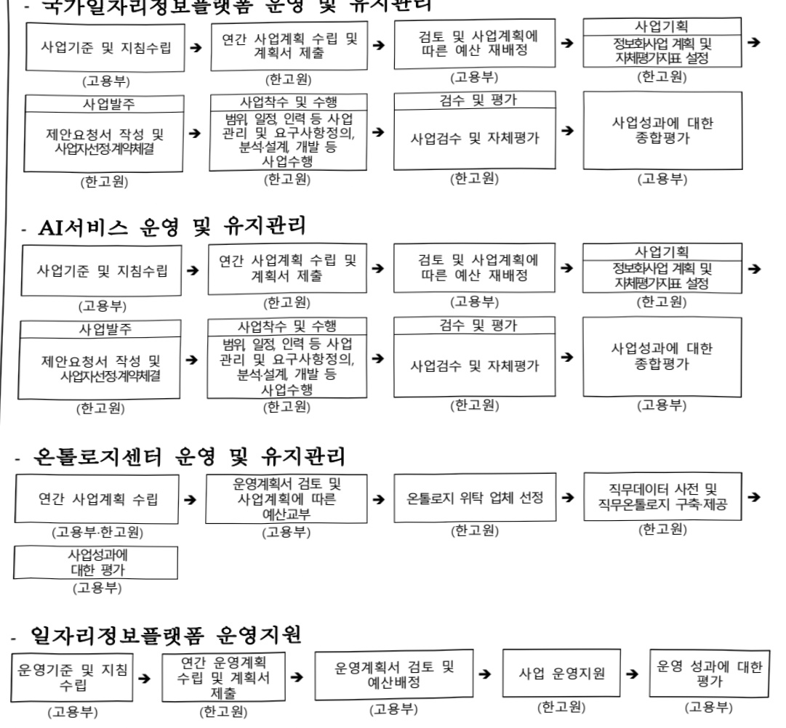

# 일자리정보플랫폼 기반 AI 고용서비스 지원(정보화)

**해당 페이지**: PDF 205 ~ 221 쪽 해당

**부처**: 고용노동부
**분야**: 사회복지
**회계유형**: 일반회계
**2026 확정예산**: 11101.0 백만원
**전년대비 증감률**: 47.9%
**AI 도메인**: 데이터

---

<table border=1 style='margin: auto; word-wrap: break-word;'><tr><td style='text-align: center; word-wrap: break-word;'>사 업 명</td></tr><tr><td style='text-align: center; word-wrap: break-word;'>(21) 일자리정보플랫폼 기반 AI 고용서비스 지원(정보화)(1075-302)</td></tr></table>

□ 사업 코드 정보

<table border=1 style='margin: auto; word-wrap: break-word;'><tr><td style='text-align: center; word-wrap: break-word;'>구분</td><td style='text-align: center; word-wrap: break-word;'>회계</td><td style='text-align: center; word-wrap: break-word;'>소관</td><td style='text-align: center; word-wrap: break-word;'>실국(기관)</td><td style='text-align: center; word-wrap: break-word;'>계정</td><td style='text-align: center; word-wrap: break-word;'>분야</td><td style='text-align: center; word-wrap: break-word;'>부문</td></tr><tr><td style='text-align: center; word-wrap: break-word;'>코드</td><td rowspan="2">일반회계</td><td rowspan="2">고용노동부</td><td rowspan="2">고용지원정책관</td><td rowspan="2"></td><td style='text-align: center; word-wrap: break-word;'>080</td><td style='text-align: center; word-wrap: break-word;'>08D</td></tr><tr><td style='text-align: center; word-wrap: break-word;'>명칭</td><td style='text-align: center; word-wrap: break-word;'>사회복지</td><td style='text-align: center; word-wrap: break-word;'>고용</td></tr></table>

<table border=1 style='margin: auto; word-wrap: break-word;'><tr><td style='text-align: center; word-wrap: break-word;'>구분</td><td style='text-align: center; word-wrap: break-word;'>프로그램</td><td style='text-align: center; word-wrap: break-word;'>단위사업</td><td style='text-align: center; word-wrap: break-word;'>세부사업</td></tr><tr><td style='text-align: center; word-wrap: break-word;'>코드</td><td style='text-align: center; word-wrap: break-word;'>1000</td><td style='text-align: center; word-wrap: break-word;'>1075</td><td style='text-align: center; word-wrap: break-word;'>302</td></tr><tr><td style='text-align: center; word-wrap: break-word;'>명칭</td><td style='text-align: center; word-wrap: break-word;'>고용창출</td><td style='text-align: center; word-wrap: break-word;'>국가일자리정보플랫폼 구축·운영(정보화)</td><td style='text-align: center; word-wrap: break-word;'>일자리정보플랫폼 기반 AI 고용서비스 지원(정보화)</td></tr></table>

□ 사업 성격

<table border=1 style='margin: auto; word-wrap: break-word;'><tr><td rowspan="2">신규</td><td rowspan="2">계속</td><td rowspan="2">완료</td><td rowspan="2">예비타당성 실시여부</td><td rowspan="2">총사업비 관리대상</td><td rowspan="2">총액계상 예산사업</td><td style='text-align: center; word-wrap: break-word;'>사업소관 변경정보</td></tr><tr><td style='text-align: center; word-wrap: break-word;'>2025예산 시 소관</td></tr><tr><td style='text-align: center; word-wrap: break-word;'></td><td style='text-align: center; word-wrap: break-word;'>O</td><td style='text-align: center; word-wrap: break-word;'></td><td style='text-align: center; word-wrap: break-word;'></td><td style='text-align: center; word-wrap: break-word;'></td><td style='text-align: center; word-wrap: break-word;'></td><td style='text-align: center; word-wrap: break-word;'></td></tr></table>

□ 사업 지원 형태 및 지원율

<table border=1 style='margin: auto; word-wrap: break-word;'><tr><td style='text-align: center; word-wrap: break-word;'>직접</td><td style='text-align: center; word-wrap: break-word;'>출자</td><td style='text-align: center; word-wrap: break-word;'>출연</td><td style='text-align: center; word-wrap: break-word;'>보조</td><td style='text-align: center; word-wrap: break-word;'>융자</td><td style='text-align: center; word-wrap: break-word;'>국고보조율(%)</td><td style='text-align: center; word-wrap: break-word;'>융자율(%)</td></tr><tr><td style='text-align: center; word-wrap: break-word;'></td><td style='text-align: center; word-wrap: break-word;'></td><td style='text-align: center; word-wrap: break-word;'>O</td><td style='text-align: center; word-wrap: break-word;'></td><td style='text-align: center; word-wrap: break-word;'></td><td style='text-align: center; word-wrap: break-word;'></td><td style='text-align: center; word-wrap: break-word;'></td></tr></table>

## □ 사업 소관부처 및 시행주체

<table border=1 style='margin: auto; word-wrap: break-word;'><tr><td style='text-align: center; word-wrap: break-word;'>사업명</td><td colspan="2">구분</td></tr><tr><td rowspan="3">일자리정보플랫폼 기반 AI 고용서비스 지원(정보화)</td><td rowspan="3">소관부처</td><td style='text-align: center; word-wrap: break-word;'>실·국·과(팀)</td></tr><tr><td style='text-align: center; word-wrap: break-word;'>고용정책실 고용지원정책관</td></tr><tr><td style='text-align: center; word-wrap: break-word;'>고용서비스기반과</td></tr><tr><td style='text-align: center; word-wrap: break-word;'>국기일자리정보플랫폼 운영 및 유지관리</td><td rowspan="3">사업시행주체</td><td rowspan="3">한국고용정보원</td></tr><tr><td style='text-align: center; word-wrap: break-word;'>AI서비스 운영 및 유지관리</td></tr><tr><td style='text-align: center; word-wrap: break-word;'>온돌로지센터 운영 및 유지관리</td></tr></table>

---

### 가.예산 총괄표

(단위: 백만원, %)

<table border=1 style='margin: auto; word-wrap: break-word;'><tr><td rowspan="2">사업명</td><td rowspan="2">2024년 결산</td><td colspan="2">2025년 예산</td><td colspan="2">2026년 예산</td><td rowspan="2">증감 (B-A)</td><td rowspan="2">(B-A)/A</td></tr><tr><td style='text-align: center; word-wrap: break-word;'>본예산(A)</td><td style='text-align: center; word-wrap: break-word;'>추경</td><td style='text-align: center; word-wrap: break-word;'>정부안</td><td style='text-align: center; word-wrap: break-word;'>확정(B)</td></tr><tr><td style='text-align: center; word-wrap: break-word;'>일자리정보플랫폼 기반 AI 고용서비스 지원</td><td style='text-align: center; word-wrap: break-word;'>8,216</td><td style='text-align: center; word-wrap: break-word;'>7,507</td><td style='text-align: center; word-wrap: break-word;'>7,507</td><td style='text-align: center; word-wrap: break-word;'>9,601</td><td style='text-align: center; word-wrap: break-word;'>11,101</td><td style='text-align: center; word-wrap: break-word;'>3,594</td><td style='text-align: center; word-wrap: break-word;'>47.9</td></tr></table>

□ 기능별(내역사업별) 예산 내역

(단위:백만원)

<table border=1 style='margin: auto; word-wrap: break-word;'><tr><td rowspan="2"></td><td colspan="5">2024</td><td colspan="5">2025(2025.12월말)</td><td rowspan="2">2026예산</td></tr><tr><td style='text-align: center; word-wrap: break-word;'>예산액(추경)</td><td style='text-align: center; word-wrap: break-word;'>예산현액</td><td style='text-align: center; word-wrap: break-word;'>집행액</td><td style='text-align: center; word-wrap: break-word;'>이월액</td><td style='text-align: center; word-wrap: break-word;'>불용액</td><td style='text-align: center; word-wrap: break-word;'>분예산</td><td style='text-align: center; word-wrap: break-word;'>예산현액</td><td style='text-align: center; word-wrap: break-word;'>집행액</td><td style='text-align: center; word-wrap: break-word;'>이월액</td><td style='text-align: center; word-wrap: break-word;'>불용액</td></tr><tr><td style='text-align: center; word-wrap: break-word;'>○ 기능별 분류(합계)</td><td style='text-align: center; word-wrap: break-word;'>8,216</td><td style='text-align: center; word-wrap: break-word;'>8,216</td><td style='text-align: center; word-wrap: break-word;'>8,216</td><td style='text-align: center; word-wrap: break-word;'>-</td><td style='text-align: center; word-wrap: break-word;'>-</td><td style='text-align: center; word-wrap: break-word;'>7,507</td><td style='text-align: center; word-wrap: break-word;'>7,507</td><td style='text-align: center; word-wrap: break-word;'>7,507</td><td style='text-align: center; word-wrap: break-word;'>-</td><td style='text-align: center; word-wrap: break-word;'>-</td><td style='text-align: center; word-wrap: break-word;'>11,101</td></tr><tr><td style='text-align: center; word-wrap: break-word;'>· 국가일자리정보플랫폼 운영 및 유지관리</td><td style='text-align: center; word-wrap: break-word;'>2,047</td><td style='text-align: center; word-wrap: break-word;'>2,047</td><td style='text-align: center; word-wrap: break-word;'>2,047</td><td style='text-align: center; word-wrap: break-word;'>-</td><td style='text-align: center; word-wrap: break-word;'>-</td><td style='text-align: center; word-wrap: break-word;'>2,136</td><td style='text-align: center; word-wrap: break-word;'>2,136</td><td style='text-align: center; word-wrap: break-word;'>2,136</td><td style='text-align: center; word-wrap: break-word;'>-</td><td style='text-align: center; word-wrap: break-word;'>-</td><td style='text-align: center; word-wrap: break-word;'>2,136</td></tr><tr><td style='text-align: center; word-wrap: break-word;'>· AI서비스 운영 및 유지관리</td><td style='text-align: center; word-wrap: break-word;'>599</td><td style='text-align: center; word-wrap: break-word;'>599</td><td style='text-align: center; word-wrap: break-word;'>599</td><td style='text-align: center; word-wrap: break-word;'>-</td><td style='text-align: center; word-wrap: break-word;'>-</td><td style='text-align: center; word-wrap: break-word;'>617</td><td style='text-align: center; word-wrap: break-word;'>617</td><td style='text-align: center; word-wrap: break-word;'>617</td><td style='text-align: center; word-wrap: break-word;'>-</td><td style='text-align: center; word-wrap: break-word;'>-</td><td style='text-align: center; word-wrap: break-word;'>5,356</td></tr><tr><td style='text-align: center; word-wrap: break-word;'>· 은틀로지센터 운영 및 유지관리</td><td style='text-align: center; word-wrap: break-word;'>1,411</td><td style='text-align: center; word-wrap: break-word;'>1,411</td><td style='text-align: center; word-wrap: break-word;'>1,411</td><td style='text-align: center; word-wrap: break-word;'>-</td><td style='text-align: center; word-wrap: break-word;'>-</td><td style='text-align: center; word-wrap: break-word;'>1,411</td><td style='text-align: center; word-wrap: break-word;'>1,411</td><td style='text-align: center; word-wrap: break-word;'>1,411</td><td style='text-align: center; word-wrap: break-word;'>-</td><td style='text-align: center; word-wrap: break-word;'>-</td><td style='text-align: center; word-wrap: break-word;'>1,411</td></tr><tr><td style='text-align: center; word-wrap: break-word;'>· 일자리정보플랫폼 운영지원</td><td style='text-align: center; word-wrap: break-word;'>4,159</td><td style='text-align: center; word-wrap: break-word;'>4,159</td><td style='text-align: center; word-wrap: break-word;'>4,159</td><td style='text-align: center; word-wrap: break-word;'>-</td><td style='text-align: center; word-wrap: break-word;'>-</td><td style='text-align: center; word-wrap: break-word;'>3,343</td><td style='text-align: center; word-wrap: break-word;'>3,343</td><td style='text-align: center; word-wrap: break-word;'>3,343</td><td style='text-align: center; word-wrap: break-word;'>-</td><td style='text-align: center; word-wrap: break-word;'>-</td><td style='text-align: center; word-wrap: break-word;'>2,198</td></tr></table>

### 나.사업설명자료

## 1 ) 사업목적·내용

- (일자리정보플랫폼 기반 AI 고용서비스 지원) 개별 고용전산망에 분산된 일자리 관련 정보 및 외부 연계 데이터를 통합·구축한 국가일자리정보플랫폼을 기반으로 정책 수립을 위한 데이터 분석 지원 및 맞춤형 디지털 고용서비스를 구축·제공

- (국가일자리정보플랫폼 운영 및 유지관리) 각 고용전산망과 외부기관에 분산된 일자리 관련 정보를 통합·표준화하여 관리하는 ①MDB(Master DataBase)*, ②구직정보·훈련·고용이력 등 개인 및 사업장 단위로 통합 정보를 조회하는 시스템(바로원), ③고용·노동 데이터 분석을 위한 통합DW, ④데이터 표준 및 품질 관리 시스템, ⑤이부기관과 메시지를 연결하는 일자리 등이 요역

5외부기관과 데이터를 연계하는 인프라 등의 운영·관리

* 워크넷, 고용보험, HRD-Net 등 개별 시스템별 데이터를 '개인·기업·서비스' 기준으로 통합·표준화하여 구축한 기준정보

- (AI서비스 운영 및 유지관리) 구직자·기업 간 일자리 미스매치를 해소하고 국민의

---

손 생애경력 설계 등을 지원하기 위해 ①AI 기반 개인·기업 맞춤형 고용서비스를 구축·제공하고 고용 행정업무 효율성 제고 및 공공 고용서비스의 품질과 상담역량 강화를 위한 ②AI 행정지원 서비스 구축

- (온돌로지센터 운영 및 유지관리) 직무역량 분석 등 맞춤형 AI 고용서비스 제공 기반인 ①직무온돌로지*의 구축·운영·관리 및 ②신규 AI 고용서비스 발굴, 개념검증 (PoC) 업무 등을 위탁

* 컴퓨터가 이력서나 구인공고를 해석하고, 알맞은 직무역량을 도출할 수 있도록 도와주는 일종의 컴퓨터 언어 사전

- (일자리정보플랫폼 운영지원) 일자리정보플랫폼 및 AI서비스 제공을 위한 각종

SW/HW의 유지보수 및 솔루션 도입

## 2 ) 사업개요

## □ 사업근거 및 추진경위

① 법령상 근거 및 조항 적시

- 고용정책기본법 제15조(고용·직업정보의 수집·관리)

## 제15조(고용·직업 정보의 수집·관리)

① 고용노동부장관은 근로자와 기업에 대한 고용서비스 향상과 노동시장의 효율성 제고를 위하여 다음 각 호의 고용·직업에 관한 정보(이하 “고용·직업 정보”라 한다)를 수집·관리하여야 한다.

- 고용정책기본법 제15조의2(고용정보시스템의 구축·운영)

## 제15조의2(고용정보시스템의 구축·운영)

① 고용노동부장관은 제15조제1항의 업무를 효율적으로 수행하기 위하여 같은 항 각 호의 고용·직업 정보를 대상으로 하는 전자정보시스템(이하 “고용정보시스템”)을 구축·운영할 수 있다.

-고용정책기본법 제18조(한국고용정보원의 설립)

## 제18조(한국고용정보원의 설립)

①고용정보의 수십·제공과 직업에 관한 조사 연구 등 제40조에 따라 위탁받은 업무와 그 밖에 고용지원에 관한 업무를 효율적으로 수행하기 위하여 한국고용정보원을 설립한다.

## - 고용정책기본법 제40조(위탁)

## 제40조(위탁)

① 이 법에 따른 고용노동부장관의 업무 중 다음 각 호의 업무는 제18조에 따른 한국고용정보원에 위탁할 수 있다.

1. 제15조에 따른 고용·직업 정보의 수집·관리 등에 관한 업무

2. 제15조의2에 따른 고용정보시스템의 구축·운영 등에 관한 업무

3. 제15조의5에 따른 통합정보전산망의 구축·운영 등에 관한 업무

## ② 추진경위

- '18.1 ~ : 머신러닝기반의 일자리매칭시스템 구축 ISP 추진

- '18.12: 기업사업장, 개인, 서비스에 대한 마스터 DB 구축 및 서비스 개시

---

- '19.3: 국가일자리정보플랫폼 구축 ISP 완료

- '19.7: 국가일자리플랫폼 기반의 AI 고용서비'

(머신러닝 기반 일자리매칭 시스템 구축, 국가일자리정보 기반 바로원시스템

재구축 및 통합연계허브 구축)(19.7~20.7)

- '20.6: 국가일자리플랫폼 기반의 데이터포탈관리시스템 구축('20.6~'20.12)

- '20.8: 머신러닝 기반 일자리매칭 시스템 2차 구축('20.8~'21.7)

- '20.9: 국가일자리정보플랫폼(고용·노동 통합 DW, 데이터공동이용시스템 구축)('20.9~'21.9)

- '21.9: 취업지원제도시스템, 고용·노동 통합DW시스템 등 신규(재구축) 시스템의 표준적용

- '21.9: 데이터프로파일링 통계자료 구축

- '21.9: 지능형 직업상담지원(잡케어) 서비스 구축

- '21.12: 고용노동 통합 DW 및 고용노동데이터분석시스템 구축

- '22.12: 대국민용 잡케어 서비스 시범실시

- '23.3: 대국민용 잡케어 서비스 전면오픈

- '23.7: 고용노동데이터분석시스템 대국민 서비스 개시

- '24.6: 일자리정책관리시스템, 데이터관리포털, DQ, META 개편

- '24.6: 고용행정포털 고용안정지원금 구축에 따른 지원금 DW 개편

- '24.12: 고용AI 과제 시범 적용(구인공고 작성, 구인공고 검증)

- '25.1: 고용AI 과제 확대 적용(취업확률모델, 직업훈련 추천)

- '25.7: 공공데이터 및 데이터기반행정 운영위원회 및 TF 운영

- '25.11: AI 고용상담 시범 적용(고용24 행정 실업급여)

## □ 주요내용

① 사업규모

- 총사업비 : 해당없음

- 사업기간 : '19년 ~ 계속

- 최근 5년 간 투입된 사업비

<table border=1 style='margin: auto; word-wrap: break-word;'><tr><td style='text-align: center; word-wrap: break-word;'>연도</td><td style='text-align: center; word-wrap: break-word;'>2022</td><td style='text-align: center; word-wrap: break-word;'>2023</td><td style='text-align: center; word-wrap: break-word;'>2024</td><td style='text-align: center; word-wrap: break-word;'>2025</td><td style='text-align: center; word-wrap: break-word;'>2026</td></tr><tr><td style='text-align: center; word-wrap: break-word;'>사업비</td><td style='text-align: center; word-wrap: break-word;'>8,431</td><td style='text-align: center; word-wrap: break-word;'>7,853</td><td style='text-align: center; word-wrap: break-word;'>8,216</td><td style='text-align: center; word-wrap: break-word;'>7,507</td><td style='text-align: center; word-wrap: break-word;'>11,101</td></tr></table>

- 기타: 국가일자리정보플랫폼, AI서비스, 온톨로지센터 운영 및 유지관리

② 사업추진체계

- 사업시행방법 : 출연

- 사업시행주체 : 한국고용정보원

- 사업 수혜자 : 구직자, 재직자, 청소년 등 전국민, 구인업체, 진로지도담당자 등

---

- 보조, 융자, 출연, 출자 등의 경우 보조·융자 등 지원 비율 및 법적근거

<table border=1 style='margin: auto; word-wrap: break-word;'><tr><td style='text-align: center; word-wrap: break-word;'>내역사업명</td><td style='text-align: center; word-wrap: break-word;'>구분</td><td style='text-align: center; word-wrap: break-word;'>피보조·피출연 등 기관명</td><td style='text-align: center; word-wrap: break-word;'>지원 금액 (2026예산)</td><td style='text-align: center; word-wrap: break-word;'>지원 비율(%)</td><td style='text-align: center; word-wrap: break-word;'>보조율 법적근거 (해당 조항)</td></tr><tr><td style='text-align: center; word-wrap: break-word;'>일자리정보 플랫폼 기반 AI고용서비스 지원(정보화)</td><td style='text-align: center; word-wrap: break-word;'>출연</td><td style='text-align: center; word-wrap: break-word;'>한국고용 정보원</td><td style='text-align: center; word-wrap: break-word;'>11,101</td><td style='text-align: center; word-wrap: break-word;'>100</td><td style='text-align: center; word-wrap: break-word;'>고용정책기본법 제18조 (한국고용정보원의 설립) 및 제40조(위탁)</td></tr></table>

## 3 ) 2026년도 예산 산출 근거

□ 일자리정보플랫폼 기반 AI고용서비스 지원

:(2025예산)7,507백만원→(2026예산)11,101백만원,3,594백만원증액

① 국가일자리정보플랫폼 운영 및 유지관리

:(2025 예산) 2,136 백만원 → (2026 예산) 2,136 백만원, 전년 동

- (요구)

(국가일자리정보플랫폼 운영) MDB, 통합연계허브 운영, 바로원시스템, 고용행정통합DW, 고용행정데이터분석시스템, 데이터관리포털 운영, SW 기술자 평균임금 증가분 반영

## - (산출)

▪ MDB 운영 : (25) 301 → (26) 301 백만원(전년동)

(1) 결합 데이터셋의 지속적 발굴

① (찰요성) 행성저리에 국한된 난편석 성보로 인하여 정책 수립 목적 활용 및 적용 한계. 구직도약 패키지 등 정책사업평가 연구과제 수행과 고용24 성과분석을 위한 결합 데이터셋에 대한 대내외 요구 증가 (23년 데이터셋 243종 → '24년 299종)

② (기대효과) 연구과제 지원 및 고용정책담당자 데이터리터러시를 위한 데이터기반체계 구축. 국민이 사용가능한 다양한 융합·결합 데이터셋을 통해 민간경제 활성화 및 공공데이터의 개방·활용 강화 * (24년 고용노동 공공데이터 공모전 수상작 '잡생각(JOB THINKING)' → 범정부 공공데이터 활용 창업 경진대회 최우수상 수상)

③(변동사항)

○ MDB 운영 : (25) 301 → (26) 301 백만원(전년동)

* 일반용역비(MDB 유지관리) : 301백만원

<table border=1 style='margin: auto; word-wrap: break-word;'><tr><td colspan="4">산출 근거</td><td rowspan="2">금액(원)</td></tr><tr><td style='text-align: center; word-wrap: break-word;'>구 분</td><td style='text-align: center; word-wrap: break-word;'>평균임금</td><td style='text-align: center; word-wrap: break-word;'>투입공수(MM)</td><td style='text-align: center; word-wrap: break-word;'>투입률</td></tr><tr><td style='text-align: center; word-wrap: break-word;'>MDB 유지관리 등</td><td style='text-align: center; word-wrap: break-word;'>7,751,183</td><td style='text-align: center; word-wrap: break-word;'>12.09</td><td style='text-align: center; word-wrap: break-word;'>100%</td><td style='text-align: center; word-wrap: break-word;'>93,711,802</td></tr><tr><td colspan="4">직접인건비 합계</td><td style='text-align: center; word-wrap: break-word;'>93,711,802</td></tr><tr><td colspan="4">제경비(직접인건비의 144%)</td><td style='text-align: center; word-wrap: break-word;'>134,944,996</td></tr><tr><td colspan="4">기술료(직접인건비+제경비)의 20%</td><td style='text-align: center; word-wrap: break-word;'>45,731,360</td></tr><tr><td colspan="4">합계(VAT별도)</td><td style='text-align: center; word-wrap: break-word;'>274,388,158</td></tr><tr><td colspan="4">합계(VAT포함)</td><td style='text-align: center; word-wrap: break-word;'>301,826,973</td></tr></table>

통합연계허브 운영 : ('25) 225 → ('26) 225백만원(전년동)

(2) 연계 기관 및 연계 항목의 지속적 증가

① (필요성) 고용24의 민원신청 편의를 위한 다양한 기관과의 추가적 서비스 연계 필요('23년 60개 기관 1,140종 서비스 → '25년 61개 기관 1,176종 서비스)

---

② (기대효과) 지속적인 연계 추가로 국민의 민원신청 편의를 제공하며 추가적 서류 제출·검증에 소요되는 비용 감축 등

③(변동사항)

○데이터연계관리시스템 운영 :('25)103→('26)103백만원(전년동)

O 통합연계허브관리 : (25) 122 → (26) 122백만원(전년동)

*개발SW유지관리(데이터연계관리시스템 유지관리):103백만원

<table border=1 style='margin: auto; word-wrap: break-word;'><tr><td style='text-align: center; word-wrap: break-word;'>계산식</td><td style='text-align: center; word-wrap: break-word;'>유지관리 대상 소프트웨어의 재산정된 개발비 × 유지관리 요율(10~15%) + 직접경비</td></tr><tr><td style='text-align: center; word-wrap: break-word;'>합계(VAT별도)</td><td style='text-align: center; word-wrap: break-word;'>857,459,331 원 × 11.00% + 0 = 94,320,526 원</td></tr><tr><td style='text-align: center; word-wrap: break-word;'>합계(VAT포함)</td><td style='text-align: center; word-wrap: break-word;'>103,752,579 원</td></tr></table>

*일반용역비(통합연계허브관리):122백만원

<table border=1 style='margin: auto; word-wrap: break-word;'><tr><td colspan="4">산출 근거</td><td rowspan="2">금액(원)</td></tr><tr><td style='text-align: center; word-wrap: break-word;'>구 분</td><td style='text-align: center; word-wrap: break-word;'>평균임금</td><td style='text-align: center; word-wrap: break-word;'>투입공수(MM)</td><td style='text-align: center; word-wrap: break-word;'>투입률</td></tr><tr><td style='text-align: center; word-wrap: break-word;'>통합연계HUB 관리</td><td style='text-align: center; word-wrap: break-word;'>6,943,457</td><td style='text-align: center; word-wrap: break-word;'>5.5</td><td style='text-align: center; word-wrap: break-word;'>100%</td><td style='text-align: center; word-wrap: break-word;'>38,189,014</td></tr><tr><td colspan="4">직접 인건비 합계</td><td style='text-align: center; word-wrap: break-word;'>38,189,014</td></tr><tr><td colspan="4">제경비(직접인건비의 144%)</td><td style='text-align: center; word-wrap: break-word;'>54,992,179</td></tr><tr><td colspan="4">기술료(직접인건비+제경비)의 20%</td><td style='text-align: center; word-wrap: break-word;'>18,636,239</td></tr><tr><td colspan="4">합계(VAT별도)</td><td style='text-align: center; word-wrap: break-word;'>111,817,432</td></tr><tr><td colspan="4">합계(VAT포함)</td><td style='text-align: center; word-wrap: break-word;'>122,999,175</td></tr></table>

바로원시스템 운영 :('25) 287→('26) 287백만원(전년동)

(3) 국가 핵심시스템(2등급)에 부합하는 서비스 안전성 확보

(1) (벨요성) 고봉관련 모는 성보방에서 지원금 지급시 사선에 지원요건 확인을 위해 활용해야 하는 중요시스템(2등급)임에도 유지관리 비용이 적게 산정됨

* 고용24 서비스 개시로 바로원 사용량이 증가하여 부하로 장애가 간헐적 발생, 2013년에 도입된 노후화 뒤 서버의 증설에 제약이 있어 재구축을 위한 행안부 커설틴 사연에 신청

→ 바로원은 행안부 클라우드 네이티브 전환 컨설팅 사업에 선정되어(25.3월) 행안부에서 컨설팅 사업이 진행중임에 따라 컨설팅 결과가 나오면 2027년에 재구축 예산을 요구할 예정 따라서, 2026년에는 전년 수준의 유지관리 비용만 요구

②(기대효과)바로원은 정부의 지침을 준수한 클라우드 기반으로 재구축하여 2등급 정보망에 부합하는 안정적인 서비스 제공

③(변동사항)

○ 바로원시스템 운영 :('25) 287→('26) 287백만원(전년동)

* 개발SW 유지관리(바로원시스템 유지관리) : 287백만원

<table border=1 style='margin: auto; word-wrap: break-word;'><tr><td style='text-align: center; word-wrap: break-word;'>계산식</td><td style='text-align: center; word-wrap: break-word;'>유지관리 대상 소프트웨어의 재산정된 개발비 × 유지관리 요율(10~15%) + 직접경비</td></tr><tr><td style='text-align: center; word-wrap: break-word;'>합계(VAT별 도)</td><td style='text-align: center; word-wrap: break-word;'>1,826,240,978원 × 14.28% + 0 = 260,787,212원</td></tr><tr><td style='text-align: center; word-wrap: break-word;'>합계(VAT포함)</td><td style='text-align: center; word-wrap: break-word;'>286,865,933원</td></tr></table>

■ 고용행정통합DW 운영 : ('25) 713 → ('26) 713백만원(전년동)

(4) 고용행정데이터 관리를 위한 기능을 안정적으로 유지하고 업무시스템 제도 확대·개편에 따른 고용행정데이터 운영 및 유지보수

①(필요성) 고용보험, HRD-NET 등 국가고용전산망 업무 시스템의 제도 확대·개편에 따른 시스템 변경 시 DW에 적기 반영하여 업무시스템과 동일한 기준의 정확한 통계 제공 필요

②(기대효과) 고용부 및 고용센터 업무 지원, 연구자료 활용, 각종 고용정책 발굴 지원

③(변동사항)

---

○ 고용행정 통합 DW 운영 : (25) 713 → (26) 713백만원(전년동)

*개발SW 유지관리(고용행정통합DW 유지관리) : 713백만원

<table border=1 style='margin: auto; word-wrap: break-word;'><tr><td style='text-align: center; word-wrap: break-word;'>계산식</td><td style='text-align: center; word-wrap: break-word;'>유지관리 대상 소프트웨어의 재산정된 개발비 × 유지관리 요율(10~15%) + 직접경비</td></tr><tr><td style='text-align: center; word-wrap: break-word;'>합계(VAT별도)</td><td style='text-align: center; word-wrap: break-word;'>5,168,184,049원 × 12.55% + 0 = 648,607,098원</td></tr><tr><td style='text-align: center; word-wrap: break-word;'>합계(VAT포함)</td><td style='text-align: center; word-wrap: break-word;'>713,467,808원</td></tr></table>

고용행정데이터분석시스템 운영 :('25) 271→('26) 271백만원(전년동)

(5) 신규 데이터셋 추가 발굴 및 안정적인 분석환경 제공

① (필요성) 고용행정데이터 활용 활성화 지원을 위한 개방 데이터셋 추가 구축 및 사용편의성 제고를 통해 고용동향 및 정책과제 등 다양한 연구분석 지원, 각종 SW 라이선스 관리를 통해 안전한 데이터 분석 환경 제공을 위해 필요

②(기대효과)민간연구활동활성화,안정적인분석환경제공

③(변동사항)

○ 고용행정데이터분석시스템 운영 : ('25) 127 → ('26) 127백만원(전년동)

○ 데이터 분석 라이센스 갱신 : (25) 144 → (26) 144백만원(전년동)

*일반용역비(고용노동데이터분석시스템 유지관리) : 127백만원

<table border=1 style='margin: auto; word-wrap: break-word;'><tr><td colspan="4">산출 근거</td><td rowspan="2">금액(원)</td></tr><tr><td style='text-align: center; word-wrap: break-word;'>구 분</td><td style='text-align: center; word-wrap: break-word;'>평균임금</td><td style='text-align: center; word-wrap: break-word;'>투입공수(MM)</td><td style='text-align: center; word-wrap: break-word;'>투입률</td></tr><tr><td style='text-align: center; word-wrap: break-word;'>포털 및 분석시스템 유지관리 등</td><td style='text-align: center; word-wrap: break-word;'>직무별 평균임금</td><td style='text-align: center; word-wrap: break-word;'>5.75</td><td style='text-align: center; word-wrap: break-word;'>직무별 투입공수</td><td style='text-align: center; word-wrap: break-word;'>39,588,066</td></tr><tr><td colspan="4">직접인건비 합계</td><td style='text-align: center; word-wrap: break-word;'>39,588,066</td></tr><tr><td colspan="4">제경비(직접인건비의 144%)</td><td style='text-align: center; word-wrap: break-word;'>57,006,814</td></tr><tr><td colspan="4">기술료(직접인건비+제경비)의 20%</td><td style='text-align: center; word-wrap: break-word;'>19,318,976</td></tr><tr><td colspan="4">합계(VAT별도)</td><td style='text-align: center; word-wrap: break-word;'>115,913,856</td></tr><tr><td colspan="4">합계(VAT포함)</td><td style='text-align: center; word-wrap: break-word;'>127,505,242</td></tr></table>

SW 구매비(데이터 분석 라이센스 갱신) : 144백만원

<table border=1 style='margin: auto; word-wrap: break-word;'><tr><td style='text-align: center; word-wrap: break-word;'>구 분</td><td style='text-align: center; word-wrap: break-word;'>상 세</td><td style='text-align: center; word-wrap: break-word;'>수 량</td><td style='text-align: center; word-wrap: break-word;'>단 가</td><td style='text-align: center; word-wrap: break-word;'>금 액</td></tr><tr><td style='text-align: center; word-wrap: break-word;'>분석솔루션</td><td style='text-align: center; word-wrap: break-word;'>SAS(Unix 24 Core)</td><td style='text-align: center; word-wrap: break-word;'>1</td><td style='text-align: center; word-wrap: break-word;'>97,477,600</td><td style='text-align: center; word-wrap: break-word;'>97,477,600</td></tr><tr><td style='text-align: center; word-wrap: break-word;'>분석솔루션(동시접속자 10USER)</td><td style='text-align: center; word-wrap: break-word;'>STATA 연구분석(1EA)</td><td style='text-align: center; word-wrap: break-word;'>1</td><td style='text-align: center; word-wrap: break-word;'>28,600,000</td><td style='text-align: center; word-wrap: break-word;'>28,600,000</td></tr><tr><td style='text-align: center; word-wrap: break-word;'>분석환경 OS</td><td style='text-align: center; word-wrap: break-word;'>Windows 10 VDA (100EA)</td><td style='text-align: center; word-wrap: break-word;'>1</td><td style='text-align: center; word-wrap: break-word;'>18,700,000</td><td style='text-align: center; word-wrap: break-word;'>18,700,000</td></tr><tr><td colspan="4">합계(VAT 포함)</td><td style='text-align: center; word-wrap: break-word;'>144,777,600</td></tr></table>

■ 데이터관리포털, 표준·품질관리시스템 운영 : ('25) 339 → ('26) 339백만원(전년동)

(6) 전사적 표준·품질관리 솔루션 도입 및 공공데이터 개방체계 구축

① (필요성) 전사적 표준·품질 관리 및 공공데이터포털에 개방된 오픈API의 관리

② (기대효과) 지속적, 일원화된 표준화품질관리 프로세스를 통해 국가고용전산망 데이터 품질 향상, 공공데이터포털 오픈API 관리시스템 구축을 통해 공공데이터 활용성 향상

③(변동사항)

○ 데이터관리포털 및 표준·품질관리시스템 운영 : ('25) 339 → ('26) 339백만원(전년동)

* 일반용역비(데이터관리포털 및 표준·품질관리시스템 유지관리) : 339백만원

---

<table border=1 style='margin: auto; word-wrap: break-word;'><tr><td colspan="4">산출 근거</td><td rowspan="2">금액(원)</td></tr><tr><td style='text-align: center; word-wrap: break-word;'>구분</td><td style='text-align: center; word-wrap: break-word;'>평균임금</td><td style='text-align: center; word-wrap: break-word;'>투입공수(MM)</td><td style='text-align: center; word-wrap: break-word;'>투입률</td></tr><tr><td style='text-align: center; word-wrap: break-word;'>데이관리 시스템 개발 등</td><td style='text-align: center; word-wrap: break-word;'>직무별 평균임금</td><td style='text-align: center; word-wrap: break-word;'>14.65</td><td style='text-align: center; word-wrap: break-word;'>직무별 투입공수</td><td style='text-align: center; word-wrap: break-word;'>105,477,571</td></tr><tr><td colspan="4">직접인건비 합계</td><td style='text-align: center; word-wrap: break-word;'>105,477,571</td></tr><tr><td colspan="4">제경비(직접인건비의 144%)</td><td style='text-align: center; word-wrap: break-word;'>151,887,702</td></tr><tr><td colspan="4">기술료(직접인건비+제경비)의 20%</td><td style='text-align: center; word-wrap: break-word;'>51,473,055</td></tr><tr><td colspan="4">합계(VAT별도)</td><td style='text-align: center; word-wrap: break-word;'>308,838,328</td></tr><tr><td colspan="4">합계(VAT포함)</td><td style='text-align: center; word-wrap: break-word;'>339,722,161</td></tr></table>

② AI서비스 운영 및 유지관리

:(2025 예산) 617백만원 → (2026 예산) 5,356백만원, 4,739백만원 증액

- (요구)

일자리매칭시스템 운영

* 국정과제의 충실한 이행, AI 고용서비스 로드맵의 단계적 수행 및 국민 경력개발 설계 지원을 위한 잡퀸어 경력 로드맵 개발, 시장정보 개발, 일자리 추천 알고리즘 개선 및 AI인프라 확충 추진

- 연관 국정과제 : (국정96) 통합과 성장의 혁신적 일자리정책

신규 AI 고용서비스 개발 및 운영

* AI 고용서비스 로드맵 관련 인공지능 기반 개인, 기업 맞춤형 구직(잡케어+), 구인 서비스(펌케어) 구현 및 인공지능(AI) 기반 민원·행정 서비스 구축

## - (산출)

일자리매칭시스템 운영 :('25) 617 →('26) 617백만원(전년동)

(1) 잡케어 경력개발 정보 구축

① (필요성) '디지털고용서비스고도화' 국정과제 관련 고용정책 서비스를 적극적으로 지원하기 위해, 개인 생애 단계별 직업선택과 경력개발 지원을 AI기반으로 고도화하여 대국민 맞춤형 고용서비스를 지원

* 해외 사례 : 핀란드 정부의 오로라 AI 프로그램 및 생애 이벤트 시나리오별 서비스

② (기대효과) 직무능력에 기반한 일자리, 자격, 훈련 등을 추천하여 개인별 맞춤형 경력개발 로드맵 수립을 지원하고, 고용센터 등 취업알선기관의 직업상담 업무를 보완

③(변동사항)

○ 잡케어 경력개발정보 개발 : (25) 268 → (26) 268백만원(전년동)

○ 잡케어 유지관리 : (25) 58 → (26) 58백만원(전년동)

*일반용역비(잡케어 경력개발정보 개발) : 268백만원

<table border=1 style='margin: auto; word-wrap: break-word;'><tr><td colspan="4">산출 근거</td><td rowspan="2">금액(원)</td></tr><tr><td style='text-align: center; word-wrap: break-word;'>구 분</td><td style='text-align: center; word-wrap: break-word;'>평균임금</td><td style='text-align: center; word-wrap: break-word;'>투입공수(MM)</td><td style='text-align: center; word-wrap: break-word;'>투입률</td></tr><tr><td style='text-align: center; word-wrap: break-word;'>경력개발정보 개발</td><td style='text-align: center; word-wrap: break-word;'>직무별 평균임금</td><td style='text-align: center; word-wrap: break-word;'>9.66</td><td style='text-align: center; word-wrap: break-word;'>직무별 투입공수</td><td style='text-align: center; word-wrap: break-word;'>83,459,570</td></tr><tr><td colspan="4">직접인건비 합계</td><td style='text-align: center; word-wrap: break-word;'>83,459,570</td></tr><tr><td colspan="4">제경비(직접인건비의 144%)</td><td style='text-align: center; word-wrap: break-word;'>120,181,780</td></tr><tr><td colspan="4">기술료(직접인건비+제경비)의 20%</td><td style='text-align: center; word-wrap: break-word;'>40,728,270</td></tr><tr><td colspan="4">합계(VAT별도)</td><td style='text-align: center; word-wrap: break-word;'>244,369,620</td></tr><tr><td colspan="4">합계(VAT포함)</td><td style='text-align: center; word-wrap: break-word;'>268,806,582</td></tr></table>

* 개발SW 유지관리(잡케어 유지관리) : 58백만원

<table border=1 style='margin: auto; word-wrap: break-word;'><tr><td style='text-align: center; word-wrap: break-word;'>계산식</td><td style='text-align: center; word-wrap: break-word;'>유지관리 대상 소프트웨어의 재산정된 개발비 × 유지관리 요율(10~15%) + 직접경비</td></tr><tr><td style='text-align: center; word-wrap: break-word;'>함계(VAT별도)</td><td style='text-align: center; word-wrap: break-word;'>414,483,769원 × 12.9% + 0 = 53,468,406원</td></tr><tr><td style='text-align: center; word-wrap: break-word;'>함계(VAT포함)</td><td style='text-align: center; word-wrap: break-word;'>58,815,247원</td></tr></table>

(2) 추천 알고리즘 개선 및 유지관리

①(필요성) 구식자들을 대상으로 워크넷, 취업지원/고용안정 전산망을 통해 일·훈련·자격 및 각종 정책,

---

기업, 심리검사 등의 정보를 정교하게 추천하기 위한 알고리즘을 개선·강화하고 서비스 수요자 의견을 신속히 반영

* 해외 사례 : SkillSync 솔루션의 기계학습 기반 맞춤형 일자리 추천시스템, LinkedIn의 개인화된 일자리 추천 시스템

②(기대효과) 지속적인 추천정보 품질 향상, 추천 일자리정보의 이용편의성 및 일자리 품질 제고

③(변동사항)

○ 추천알고리즘 개선 및 유지관리 : ('25) 256 → ('26) 256백만원(전년동)

*일반용역비(추천알고리즘 개선 및 유지관리) : 256백만원

<table border=1 style='margin: auto; word-wrap: break-word;'><tr><td colspan="4">산출 근거</td><td rowspan="2">금액(원)</td></tr><tr><td style='text-align: center; word-wrap: break-word;'>구 분</td><td style='text-align: center; word-wrap: break-word;'>평균임금</td><td style='text-align: center; word-wrap: break-word;'>투입공수(MM)</td><td style='text-align: center; word-wrap: break-word;'>투입률</td></tr><tr><td style='text-align: center; word-wrap: break-word;'>일지리 추천 알고리즘 개선 및 유지</td><td style='text-align: center; word-wrap: break-word;'>직무별 평균임금</td><td style='text-align: center; word-wrap: break-word;'>10.26</td><td style='text-align: center; word-wrap: break-word;'>직무별 투입공수</td><td style='text-align: center; word-wrap: break-word;'>79,527,138</td></tr><tr><td colspan="4">직접인건비 합계</td><td style='text-align: center; word-wrap: break-word;'>79,527,138</td></tr><tr><td colspan="4">제경비(직접인건비의 144%)</td><td style='text-align: center; word-wrap: break-word;'>114,519,078</td></tr><tr><td colspan="4">기술료(직접인건비+제경비)의 20%</td><td style='text-align: center; word-wrap: break-word;'>38,809,243</td></tr><tr><td colspan="4">합계(VAT별도)</td><td style='text-align: center; word-wrap: break-word;'>232,855,459</td></tr><tr><td colspan="4">합계(VAT포함)</td><td style='text-align: center; word-wrap: break-word;'>256,141,005</td></tr></table>

(3) 직무데이터 모니터링시스템 유지관리

① (필요성) 직무 데이터 사전 구축을 위한 단계별 모니터링 기능 개선 필요

* 해외 사례 : 유럽 직업안전보건청의 스마트 디지털 모니터링 시스템

② (기대효과) 데이터 수집, 키워드 추출, 형태소 분석 등 직무데이터사전 구축 단계별 모니터링 강화로 직무데이터 품질 향상

③(변동사항)

○ 직무데이터 모니터링시스템 유지관리 : ('25) 35 → ('26) 35백만원(전년동)

* 개발SW 유지관리(직무데이터 모니터링시스템 유지관리) : 35백만원

<table border=1 style='margin: auto; word-wrap: break-word;'><tr><td style='text-align: center; word-wrap: break-word;'>계산식</td><td style='text-align: center; word-wrap: break-word;'>유지관리 대상 소프트웨어의 재산정된 개발비 × 유지관리 요율(10~15%) + 직접경비</td></tr><tr><td style='text-align: center; word-wrap: break-word;'>합계(VAT별도)</td><td style='text-align: center; word-wrap: break-word;'>259,351,658원 × 12.50% + 0 = 32,418,957원</td></tr><tr><td style='text-align: center; word-wrap: break-word;'>합계(VAT포함)</td><td style='text-align: center; word-wrap: break-word;'>35,660,853원</td></tr></table>

■ 신규 AI 고용서비스 개발 및 운영 : ('25) 0 → ('26) 4,739백만원(순증)

(1) 신규 AI 고용서비스 개발

① (필요성 및 시급성) '24년 구인·구직 등 국민체감 효과가 매우 높은 서비스 중심의 'AI 고용서비스 시범과제 7종'을 선정하여 단계적으로 개발 추진 중이나, 안정적인 대국민 서비스를 위해 지속적 신규 서비스 프로토타입 개발, 개념검증·보완 필요

*

해외 사례 : 벨기에 플랑드르 공공서비스(VDAB)의 다양한 AI기반 도구 개발

②(기대효과) AI·빅데이터 기술 기반의 디지털 고용서비스 고도화 추진 공공분야 AI 기술 내재화 및 확산

③(변동사항)

○ 신규 AI 고용서비스 개발 및 운영 : ('25) 0 → ('26) 2,744백만원(순증)

- (총 투입공수) '26년 95.44M/M(순증)

※ 총 투입공수 : 투입인원 X 투입기간 X 투입률, '25년 SW기술자 평균임금 적용

*일반용역비(신규 AI고용서비스 개발 및 운영) : 2,744백만원

---

산출 근거

<table border=1 style='margin: auto; word-wrap: break-word;'><tr><td colspan="4">산출 근거</td><td rowspan="2">금액(원)</td></tr><tr><td style='text-align: center; word-wrap: break-word;'>구분</td><td style='text-align: center; word-wrap: break-word;'>평균임금</td><td style='text-align: center; word-wrap: break-word;'>투입공수(MM)</td><td style='text-align: center; word-wrap: break-word;'>투입률</td></tr><tr><td style='text-align: center; word-wrap: break-word;'>신규 AI 고용서비스 개발</td><td style='text-align: center; word-wrap: break-word;'>직무별 평균임금</td><td style='text-align: center; word-wrap: break-word;'>116.56</td><td style='text-align: center; word-wrap: break-word;'>직무별 투입공수</td><td style='text-align: center; word-wrap: break-word;'>852,104,602</td></tr><tr><td colspan="4">직접인건비 합계</td><td style='text-align: center; word-wrap: break-word;'>852,104,602</td></tr><tr><td colspan="4">제경비(직접인건비의 144%)</td><td style='text-align: center; word-wrap: break-word;'>1,227,030,628</td></tr><tr><td colspan="4">기술료(직접인건비+제경비)의 20%</td><td style='text-align: center; word-wrap: break-word;'>415,827,046</td></tr><tr><td colspan="4">합계(VAT별도)</td><td style='text-align: center; word-wrap: break-word;'>2,494,962,276</td></tr><tr><td colspan="4">합계(VAT포함)</td><td style='text-align: center; word-wrap: break-word;'>2,744,458,504</td></tr></table>

(2) AI 인프라 확충

① (필요성 및 시급성) 증가하는 고용AI 추진 과제 수행을 위해 고사양 데이터 분석 및 추론, 연산작업 수행에 적합한 GPU 자원이 요구되고 있는 상황에서, 급변하는 AI기술과 대용량 데이터 처리로 인해 기존 장비 활용의 어려움으로 AI 인프라 확충이 시급

② (기대효과) 부족한 AI 인프라 자원 확충으로 대국민 및 상담사에게 지속적인 고용AI 서비스를 제공하고 안정적인 운영을 도모

③(변동사항)

○ GPU 장비 임대 비용 : (25) 0 → (26) 1,195백만원(순증)

○HCI 클라우드 서버 등 HW/SW 도입 비용 : ('25) 0 → ('26) 800백만원(순증)

*임차료(GPU 장비):1,195백만원

<table border=1 style='margin: auto; word-wrap: break-word;'><tr><td style='text-align: center; word-wrap: break-word;'>구 분</td><td style='text-align: center; word-wrap: break-word;'>용도</td><td style='text-align: center; word-wrap: break-word;'>금액(원)</td></tr><tr><td style='text-align: center; word-wrap: break-word;'>HW</td><td style='text-align: center; word-wrap: break-word;'>GPU 장비 임대</td><td style='text-align: center; word-wrap: break-word;'>1,195,000,000</td></tr><tr><td colspan="2">합계(VAT포함)</td><td style='text-align: center; word-wrap: break-word;'>1,195,000,000</td></tr></table>

* HW/SW 구매비(HCI 클라우드 서버 등) : 800백만원

<table border=1 style='margin: auto; word-wrap: break-word;'><tr><td style='text-align: center; word-wrap: break-word;'>구분</td><td style='text-align: center; word-wrap: break-word;'>용도</td><td style='text-align: center; word-wrap: break-word;'>금액(원)</td></tr><tr><td style='text-align: center; word-wrap: break-word;'>HW</td><td style='text-align: center; word-wrap: break-word;'>HCI 클라우드 서버 도입</td><td style='text-align: center; word-wrap: break-word;'>200,000,000</td></tr><tr><td style='text-align: center; word-wrap: break-word;'>SW</td><td style='text-align: center; word-wrap: break-word;'>서버 및 보안 관련 솔루션</td><td style='text-align: center; word-wrap: break-word;'>600,000,000</td></tr><tr><td colspan="2">함께(VAT포함)</td><td style='text-align: center; word-wrap: break-word;'>800,000,000</td></tr></table>

③ 온톨로지센터 운영 및 유지관리

:(2025 예산) 1,411백만원 → (2026 예산) 1,411백만원, 전년동

- (요구)

AI 고용서비스 로드맵 수행과제와 일자리매칭 서비스 등 기존 AI 서비스를 충실히 지원하기 위해 지속적인 직무 관련 데이터 수집기관 확대 및 새로운 고용서비스 혁신방안 발굴 추진

- (산출)

▪ 온톨로지센터 운영 : (25) 1,411 → (26) 1,411백만원(전년동)

(1) 온톨로지센터 위탁운영

① (필요성) 직무 중심의 일자리매칭과 상담서비스 등 국민 개인별 정교한 맞춤 서비스를 제공하기 위해 구축된 직무 데이터사전을 지속적으로 현행화하고, 이를 활용한 고용서비스 혁신방안 발굴 추진

② (기대효과) 직무 데이터 구축 프로세스 성능, 직무 온돌로지 품질 및 매칭률 향상으로 잡퀴어 서비스 및 고용서비스 만족도 향상 도모하고 고품질의 고용 데이터 개방 지원

○ 온돌로지센터 운영 : ('25) 1,411 → ('26) 1,411 백마원/전녀동

*위탁운영비(온톨로지센터 운영) : 1,411백만원

<table border=1 style='margin: auto; word-wrap: break-word;'><tr><td colspan="2">구분</td><td style='text-align: center; word-wrap: break-word;'>책임연구원</td><td style='text-align: center; word-wrap: break-word;'>연구원</td><td style='text-align: center; word-wrap: break-word;'>연구보조원</td><td style='text-align: center; word-wrap: break-word;'>보조원</td></tr><tr><td rowspan="3">직접 인건비 (A)</td><td style='text-align: center; word-wrap: break-word;'>단가(윌, 100%)</td><td style='text-align: center; word-wrap: break-word;'>7,411,808</td><td style='text-align: center; word-wrap: break-word;'>5,683,276</td><td style='text-align: center; word-wrap: break-word;'>3,799,078</td><td style='text-align: center; word-wrap: break-word;'>2,849,404</td></tr><tr><td style='text-align: center; word-wrap: break-word;'>투입인원</td><td style='text-align: center; word-wrap: break-word;'>1</td><td style='text-align: center; word-wrap: break-word;'>6</td><td style='text-align: center; word-wrap: break-word;'>7</td><td style='text-align: center; word-wrap: break-word;'>6</td></tr><tr><td style='text-align: center; word-wrap: break-word;'>투입개월</td><td style='text-align: center; word-wrap: break-word;'>11.3</td><td style='text-align: center; word-wrap: break-word;'>12</td><td style='text-align: center; word-wrap: break-word;'>12</td><td style='text-align: center; word-wrap: break-word;'>11</td></tr></table>

---

<table border=1 style='margin: auto; word-wrap: break-word;'><tr><td style='text-align: center; word-wrap: break-word;'></td><td style='text-align: center; word-wrap: break-word;'>소계(단가x인원x개월)</td><td style='text-align: center; word-wrap: break-word;'>83,753,430</td><td style='text-align: center; word-wrap: break-word;'>409,195,872</td><td style='text-align: center; word-wrap: break-word;'>319,122,552</td><td style='text-align: center; word-wrap: break-word;'>188,060,664</td></tr><tr><td colspan="2">재경비(B)(직접인건비x10%)</td><td style='text-align: center; word-wrap: break-word;'>8,375,343</td><td style='text-align: center; word-wrap: break-word;'>40,919,587</td><td style='text-align: center; word-wrap: break-word;'>31,912,255</td><td style='text-align: center; word-wrap: break-word;'>18,806,066</td></tr><tr><td colspan="2">소계(C=A+B)</td><td style='text-align: center; word-wrap: break-word;'>92,128,773</td><td style='text-align: center; word-wrap: break-word;'>450,115,459</td><td style='text-align: center; word-wrap: break-word;'>351,034,807</td><td style='text-align: center; word-wrap: break-word;'>206,866,730</td></tr><tr><td colspan="2">일반관리비(D)소계(C)x6%</td><td style='text-align: center; word-wrap: break-word;'>5,527,726</td><td style='text-align: center; word-wrap: break-word;'>27,006,928</td><td style='text-align: center; word-wrap: break-word;'>21,062,088</td><td style='text-align: center; word-wrap: break-word;'>12,412,004</td></tr><tr><td colspan="2">이윤(E)(C+D)x10%)</td><td style='text-align: center; word-wrap: break-word;'>9,765,650</td><td style='text-align: center; word-wrap: break-word;'>47,712,239</td><td style='text-align: center; word-wrap: break-word;'>37,209,690</td><td style='text-align: center; word-wrap: break-word;'>21,927,873</td></tr><tr><td colspan="2">합계(부가세제외)(C+D+E)</td><td style='text-align: center; word-wrap: break-word;'>107,422,150</td><td style='text-align: center; word-wrap: break-word;'>524,834,625</td><td style='text-align: center; word-wrap: break-word;'>409,306,585</td><td style='text-align: center; word-wrap: break-word;'>241,206,608</td></tr><tr><td colspan="2">부가세(10%)</td><td style='text-align: center; word-wrap: break-word;'>10,742,215</td><td style='text-align: center; word-wrap: break-word;'>52,483,463</td><td style='text-align: center; word-wrap: break-word;'>40,930,659</td><td style='text-align: center; word-wrap: break-word;'>24,120,661</td></tr><tr><td colspan="2">합계(부가세포함)</td><td style='text-align: center; word-wrap: break-word;'>118,164,365</td><td style='text-align: center; word-wrap: break-word;'>577,318,088</td><td style='text-align: center; word-wrap: break-word;'>450,237,244</td><td style='text-align: center; word-wrap: break-word;'>265,327,268</td></tr><tr><td colspan="2">총 합계</td><td colspan="4">1,411,046,965</td></tr></table>

(학술연구용역 인건비 기준단가('25)를 기준(계약예규 예정가격작성기준 제26조 제2항), 1개월을 22일로 산정)

## ④일자리정보플랫폼 운영지원

:(2025 예산) 3,343백만원 → (2026 예산) 2,198백만원, 1,145백만원 감액

- (요구)

도입장비 임차료 및 유지보수료 요구

* 도입장비 임차료 : '20년 도입 장비 리스계약 만기에 따른 감액 및 금리 인상분 반영

시스템 및 SW 라이센스 유지관리비 요구

■ 정보화 사업 감리용역 및 조달 수수료 등 기타 운영비 요구

- (산출)

장비 임차료 : (25) 1,921 → (26) 287백만원(△1,634백만원)

(1) 장비 임차

① (필요성) 장비 노후화 및 기술변화에 대응하여 주기적으로 장비를 최신화 하고 최신 장비 도입으로 행정처리 속도와 정확성 향상에 필요

②(기대효과)최신 장비 도입으로 인한 국가고용전산망의 안정적 운영

③(변동사항)

○ 장비 임차료: (25) 1,921 → (26) 287백만원(△1,634백만원)

※ '20년 도입 장비 리스계약 만기에 따른 감액

*장비 임차료 : 287백만원

<table border=1 style='margin: auto; word-wrap: break-word;'><tr><td style='text-align: center; word-wrap: break-word;'>구분</td><td style='text-align: center; word-wrap: break-word;'>2024년</td><td style='text-align: center; word-wrap: break-word;'>2025년</td><td style='text-align: center; word-wrap: break-word;'>2026년</td></tr><tr><td style='text-align: center; word-wrap: break-word;'>임차료</td><td style='text-align: center; word-wrap: break-word;'>3,281,000,000</td><td style='text-align: center; word-wrap: break-word;'>1,920,217,228</td><td style='text-align: center; word-wrap: break-word;'>287,427,288</td></tr><tr><td style='text-align: center; word-wrap: break-word;'>합계</td><td style='text-align: center; word-wrap: break-word;'>3,281,000,000</td><td style='text-align: center; word-wrap: break-word;'>1,920,217,228</td><td style='text-align: center; word-wrap: break-word;'>287,427,228</td></tr></table>

시스템 유지보수료 : ('25) 853 → ('26) 1,158백만원(+305백만원)

(2) 시스템 유지보수

(필요성) HW의 권장 유지보수 요율인 6~8% 중 7%로 적용, 상용SW 권장 유지보수 요율인 12~20% 중 12%로 적용

② (기대효과) 장애 발생 대비 사전점검 및 기술지원, 안정적인 부품 수급

③(변동사항)

○ 시스템 유지보수: ('25) 853 → ('26) 1,158백만원(+305백만원)

* 시스템 유지보수료

---

<table border=1 style='margin: auto; word-wrap: break-word;'><tr><td style='text-align: center; word-wrap: break-word;'>구분</td><td style='text-align: center; word-wrap: break-word;'>도입비</td><td style='text-align: center; word-wrap: break-word;'>요율</td><td style='text-align: center; word-wrap: break-word;'>요율적용예산</td></tr><tr><td style='text-align: center; word-wrap: break-word;'>HW</td><td style='text-align: center; word-wrap: break-word;'>7,839,000,000</td><td style='text-align: center; word-wrap: break-word;'>7%</td><td style='text-align: center; word-wrap: break-word;'>549,000,000</td></tr><tr><td style='text-align: center; word-wrap: break-word;'>SW</td><td style='text-align: center; word-wrap: break-word;'>5,074,000,000</td><td style='text-align: center; word-wrap: break-word;'>12%</td><td style='text-align: center; word-wrap: break-word;'>609,000,000</td></tr><tr><td style='text-align: center; word-wrap: break-word;'>계</td><td style='text-align: center; word-wrap: break-word;'>12,913,000,000</td><td style='text-align: center; word-wrap: break-word;'></td><td style='text-align: center; word-wrap: break-word;'>1,158,000,000</td></tr></table>

일자리플랫폼 SW 라이센스 유지관리 : ('25) 234 → ('26) 418백만원(+184백만원)

(3) SW 라이센스 유지관리

①(필요성) 브로드컴의 VMware 인수 후 영구라이선스 판매 중단 및 서브스크립션 기반 라이선스로 전환함에 따라 '26년부터 VMware 구독 라이선스 추가 및 라이선스 비용 상승 반영 (184백만원)

② (기대효과) AI 일자리매칭시스템 구축 2차 사업에서 최초 VMware 클러스터를 구성하여 활용하여,

향후 안정적인 운영 및 패치/보안 등 기술지원 기대

③(변동사항)

SW 라이센스 유지관리 : (25) 234 → (26) 418백만원(+184백만원)

SW 라이센스 유지관리 : 418백만원

<table border=1 style='margin: auto; word-wrap: break-word;'><tr><td style='text-align: center; word-wrap: break-word;'>구분</td><td style='text-align: center; word-wrap: break-word;'>설명</td><td style='text-align: center; word-wrap: break-word;'>단가</td><td style='text-align: center; word-wrap: break-word;'>개수</td><td style='text-align: center; word-wrap: break-word;'>금액(원)</td></tr><tr><td rowspan="7">시스템SW 사용권</td><td style='text-align: center; word-wrap: break-word;'>OS(RHEL) (16EA)</td><td style='text-align: center; word-wrap: break-word;'>34,287,360</td><td style='text-align: center; word-wrap: break-word;'>1</td><td style='text-align: center; word-wrap: break-word;'>34,287,360</td></tr><tr><td style='text-align: center; word-wrap: break-word;'>OS(RHEL) Virtual Datacenters (9EA)</td><td style='text-align: center; word-wrap: break-word;'>59,148,360</td><td style='text-align: center; word-wrap: break-word;'>1</td><td style='text-align: center; word-wrap: break-word;'>59,148,360</td></tr><tr><td style='text-align: center; word-wrap: break-word;'>WAS(JBoss WAS 16Core) (3EA)</td><td style='text-align: center; word-wrap: break-word;'>63,986,040</td><td style='text-align: center; word-wrap: break-word;'>1</td><td style='text-align: center; word-wrap: break-word;'>63,986,040</td></tr><tr><td style='text-align: center; word-wrap: break-word;'>WAS(JBoss WAS 64Core) (1EA)</td><td style='text-align: center; word-wrap: break-word;'>76,787,880</td><td style='text-align: center; word-wrap: break-word;'>1</td><td style='text-align: center; word-wrap: break-word;'>76,787,880</td></tr><tr><td style='text-align: center; word-wrap: break-word;'>WEB(JBoss 16Core) (1EA)</td><td style='text-align: center; word-wrap: break-word;'>4,001,160</td><td style='text-align: center; word-wrap: break-word;'>1</td><td style='text-align: center; word-wrap: break-word;'>4,001,160</td></tr><tr><td style='text-align: center; word-wrap: break-word;'>VMware vSphere 8 (9노드)</td><td style='text-align: center; word-wrap: break-word;'>158,400,000</td><td style='text-align: center; word-wrap: break-word;'>1</td><td style='text-align: center; word-wrap: break-word;'>158,400,000</td></tr><tr><td style='text-align: center; word-wrap: break-word;'>DBMS(MariaDB)</td><td style='text-align: center; word-wrap: break-word;'>21,600,000</td><td style='text-align: center; word-wrap: break-word;'>1</td><td style='text-align: center; word-wrap: break-word;'>21,600,000</td></tr><tr><td colspan="4">합계(VAT포함)</td><td style='text-align: center; word-wrap: break-word;'>418,210,800</td></tr></table>

기타 운영비 : (25) 335 → (26) 335백만원(전년동)

(4) 일자리정보플랫폼 기반 AI고용서비스 지원 운영비

① (필요성) 사업의 품질 확보 및 공정성 및 투명성 확보, 행정안전부 지침 등 관련 법령과 기준에 따라 감리가 필수적으로 요구됨.

②(기대효과)공공사업의 법적 안정성과 신뢰성 향상,정보화사업의 품질과 완성도 향상

③(변동사항)

○ 감리용역비 및 조달수수료 : ('25) 335 → ('26) 335백만원(전년동)

※ 감리용역비 및 조달수수료 부족분에 대해서는 낙찰차액 활용

④(대상 사업)

* MDB운영 일반용역비(301백만원), 통합연계허브운영 개발SW유지관리(225백만원), 바로원시스템 운영 개발SW유지관리(287백만원), 고용행정통합DW운영 개발SW유지관리(713백만원), 고용행정데이터분석시스템 운영 일반용역비(271백만원), 데이터관리포털 운영 일반용역비(339백만원), 일자리매칭시스템 운영 개발SW유지관리(617백만원), 신규 AI고용서비스 개발 일반용역비 및 임차료(3,239백만원), 온톨로지(데이터센터) 운영 (1,411백만원)

2025년도 예산 및 2026년도 예산 산출 세부내역 비교

<table border=1 style='margin: auto; word-wrap: break-word;'><tr><td colspan="2">2025년 예산</td><td colspan="2">2026년 예산</td></tr><tr><td style='text-align: center; word-wrap: break-word;'>예산</td><td style='text-align: center; word-wrap: break-word;'>산촌내역</td><td style='text-align: center; word-wrap: break-word;'>예산</td><td style='text-align: center; word-wrap: break-word;'>산촌내역</td></tr><tr><td style='text-align: center; word-wrap: break-word;'>7,507</td><td style='text-align: center; word-wrap: break-word;'>○ 사업출연금(350-02): 7,507,000천원</td><td style='text-align: center; word-wrap: break-word;'>11,101</td><td style='text-align: center; word-wrap: break-word;'>○ 사업출연금(350-02): 11,101,000천원</td></tr><tr><td style='text-align: center; word-wrap: break-word;'>백만원</td><td style='text-align: center; word-wrap: break-word;'>1. 국가일자리정보플랫폼 운영 및 유지관리</td><td style='text-align: center; word-wrap: break-word;'>2,136,000천원</td><td style='text-align: center; word-wrap: break-word;'>백만원</td></tr></table>

---

<table border=1 style='margin: auto; word-wrap: break-word;'><tr><td colspan="3">2025년 예산</td><td colspan="3">2026년 예산</td></tr><tr><td style='text-align: center; word-wrap: break-word;'>예산</td><td colspan="2">산출내역</td><td style='text-align: center; word-wrap: break-word;'>예산</td><td colspan="2">산출내역</td></tr><tr><td rowspan="34"></td><td style='text-align: center; word-wrap: break-word;'>가. MDB 운영</td><td style='text-align: center; word-wrap: break-word;'>301,000천원</td><td style='text-align: center; word-wrap: break-word;'>1. 국가일자리정보플랫폼 운영 및 유지관리</td><td colspan="2">2,136,000천원</td></tr><tr><td style='text-align: center; word-wrap: break-word;'>· 일반용역비</td><td style='text-align: center; word-wrap: break-word;'>9.55MMx28.65백만원</td><td style='text-align: center; word-wrap: break-word;'>301,000천원</td><td style='text-align: center; word-wrap: break-word;'>가. MDB 운영</td><td style='text-align: center; word-wrap: break-word;'>301,000천원</td></tr><tr><td style='text-align: center; word-wrap: break-word;'>나. 통합연계허브 운영</td><td style='text-align: center; word-wrap: break-word;'>x1.1부가세</td><td style='text-align: center; word-wrap: break-word;'>225,000천원</td><td style='text-align: center; word-wrap: break-word;'>· 일반용역비</td><td style='text-align: center; word-wrap: break-word;'>12.09MMx22.663백만원x1.1부가세</td></tr><tr><td style='text-align: center; word-wrap: break-word;'>· 개발 SW 유지관리</td><td style='text-align: center; word-wrap: break-word;'>0.11요율x847.5백만원</td><td style='text-align: center; word-wrap: break-word;'>103,000천원</td><td style='text-align: center; word-wrap: break-word;'>나. 통합연계허브 운영</td><td style='text-align: center; word-wrap: break-word;'>225,000천원</td></tr><tr><td style='text-align: center; word-wrap: break-word;'>· 일반용역비</td><td style='text-align: center; word-wrap: break-word;'>x1.1부가세</td><td style='text-align: center; word-wrap: break-word;'>122,000천원</td><td style='text-align: center; word-wrap: break-word;'>· 개발 SW 유지관리</td><td style='text-align: center; word-wrap: break-word;'>0.11요율x851.2397백만원x1.1부가세</td></tr><tr><td style='text-align: center; word-wrap: break-word;'>다. 바로원시스템 운영</td><td style='text-align: center; word-wrap: break-word;'>x1.1부가세</td><td style='text-align: center; word-wrap: break-word;'>287,000천원</td><td style='text-align: center; word-wrap: break-word;'>· 일반용역비</td><td style='text-align: center; word-wrap: break-word;'>5.5MMx20.2백만원x1.1부가세</td></tr><tr><td style='text-align: center; word-wrap: break-word;'>· 개발 SW 유지관리</td><td style='text-align: center; word-wrap: break-word;'>0.1425요 율x1,829</td><td style='text-align: center; word-wrap: break-word;'>287,000천원</td><td style='text-align: center; word-wrap: break-word;'>다. 바로원시스템 운영</td><td style='text-align: center; word-wrap: break-word;'>287,000천원</td></tr><tr><td style='text-align: center; word-wrap: break-word;'>라. 고용행정통합DW 운영</td><td style='text-align: center; word-wrap: break-word;'>백만원x1.1부가세</td><td style='text-align: center; word-wrap: break-word;'>713,000천원</td><td style='text-align: center; word-wrap: break-word;'>· 개발 SW 유지관리</td><td style='text-align: center; word-wrap: break-word;'>0.1428요율x1,826백만원x1.1부가세</td></tr><tr><td style='text-align: center; word-wrap: break-word;'>· 개발 SW 유지관리</td><td style='text-align: center; word-wrap: break-word;'>0.1225요 율x5,288</td><td style='text-align: center; word-wrap: break-word;'>713,000천원</td><td style='text-align: center; word-wrap: break-word;'>라. 고용행정통합DW 운영</td><td style='text-align: center; word-wrap: break-word;'>713,000천원</td></tr><tr><td style='text-align: center; word-wrap: break-word;'>마. 고용행정데이터분석시스템 운영</td><td style='text-align: center; word-wrap: break-word;'>백만원x1.1부가세</td><td style='text-align: center; word-wrap: break-word;'>271,000천원</td><td style='text-align: center; word-wrap: break-word;'>· 개발 SW 유지관리</td><td style='text-align: center; word-wrap: break-word;'>0.1255요 율x5,164.8 백만원x1.1부가세</td></tr><tr><td style='text-align: center; word-wrap: break-word;'>· 일반용역비</td><td style='text-align: center; word-wrap: break-word;'>5.52MMx20.92백만원</td><td style='text-align: center; word-wrap: break-word;'>127,000천원</td><td style='text-align: center; word-wrap: break-word;'>마. 고용행정데이터분석시스템 운영</td><td style='text-align: center; word-wrap: break-word;'>271,000천원</td></tr><tr><td style='text-align: center; word-wrap: break-word;'>· SW라이센스객신비</td><td style='text-align: center; word-wrap: break-word;'>x1.1부가세</td><td style='text-align: center; word-wrap: break-word;'>144,000천원</td><td style='text-align: center; word-wrap: break-word;'>· 일반용역비</td><td style='text-align: center; word-wrap: break-word;'>5.75MMx20.079백만원x1.1부가세</td></tr><tr><td style='text-align: center; word-wrap: break-word;'>바. 데이터관리포털 운영</td><td style='text-align: center; word-wrap: break-word;'>1회x144백만원</td><td style='text-align: center; word-wrap: break-word;'>339,000천원</td><td style='text-align: center; word-wrap: break-word;'>· SW구매비</td><td style='text-align: center; word-wrap: break-word;'>1회x144백만원</td></tr><tr><td rowspan="2">· 일반용역비</td><td style='text-align: center; word-wrap: break-word;'>12.92MMx23.82백만원</td><td rowspan="2">339,000천원</td><td style='text-align: center; word-wrap: break-word;'>바. 데이터관리포털 운영</td><td style='text-align: center; word-wrap: break-word;'>339,000천원</td></tr><tr><td style='text-align: center; word-wrap: break-word;'>x1.1부가세</td><td style='text-align: center; word-wrap: break-word;'>· 일반용역비</td><td style='text-align: center; word-wrap: break-word;'>14.65MMx21.05백만원x1.1부가세</td></tr><tr><td style='text-align: center; word-wrap: break-word;'>2. AI서비스 운영 및 유지관리</td><td style='text-align: center; word-wrap: break-word;'>617,000천원</td><td colspan="2">2. AI서비스 운영 및 유지관리</td><td style='text-align: center; word-wrap: break-word;'>5,356,000천원</td></tr><tr><td style='text-align: center; word-wrap: break-word;'>가. 일자리매칭시스템 운영</td><td style='text-align: center; word-wrap: break-word;'>617,000천원</td><td colspan="2">가. 일자리매칭시스템 운영</td><td style='text-align: center; word-wrap: break-word;'>617,000천원</td></tr><tr><td style='text-align: center; word-wrap: break-word;'>· 일반용역비</td><td style='text-align: center; word-wrap: break-word;'>21MMx22.68백만원</td><td style='text-align: center; word-wrap: break-word;'>524,000천원</td><td style='text-align: center; word-wrap: break-word;'>· 일반용역비</td><td style='text-align: center; word-wrap: break-word;'>19.92MMx23.9백만원x1.1부가세</td></tr><tr><td rowspan="2">· 개발 SW 유지관리</td><td style='text-align: center; word-wrap: break-word;'>0.11975요율x706백만원</td><td rowspan="2">93,000천원</td><td style='text-align: center; word-wrap: break-word;'>· 개발 SW 유지관리</td><td style='text-align: center; word-wrap: break-word;'>0.125요율x673.84백만원x1.1부가세</td></tr><tr><td style='text-align: center; word-wrap: break-word;'>x1.1부가세</td><td style='text-align: center; word-wrap: break-word;'>나. 신규AI고용서비스 개발</td><td style='text-align: center; word-wrap: break-word;'>4,739,000천원</td></tr><tr><td style='text-align: center; word-wrap: break-word;'>3. 온돌로지(데이터센터) 운영</td><td style='text-align: center; word-wrap: break-word;'>1,411,000천원</td><td style='text-align: center; word-wrap: break-word;'>· 일반용역비</td><td style='text-align: center; word-wrap: break-word;'>116.56MMx21.4백만원x1.1부가세</td><td style='text-align: center; word-wrap: break-word;'>2,744,000천원</td></tr><tr><td rowspan="2">가. 온돌로지 센터 운영</td><td rowspan="2">1,411,000천원</td><td style='text-align: center; word-wrap: break-word;'>· GPU장비 임자료</td><td style='text-align: center; word-wrap: break-word;'>1회x1,195백만원</td><td style='text-align: center; word-wrap: break-word;'>1,195,000천원</td></tr><tr><td style='text-align: center; word-wrap: break-word;'>· HW/SW 구매비</td><td style='text-align: center; word-wrap: break-word;'>1회x800백만원</td><td style='text-align: center; word-wrap: break-word;'>800,000천원</td></tr><tr><td rowspan="2">· 일반용역비</td><td style='text-align: center; word-wrap: break-word;'>15MMx85.52백만원</td><td rowspan="2">1,411,000천원</td><td style='text-align: center; word-wrap: break-word;'>3. 온돌로지(데이터센터) 운영</td><td style='text-align: center; word-wrap: break-word;'>1,411,000천원</td></tr><tr><td style='text-align: center; word-wrap: break-word;'>x1.1부가세</td><td style='text-align: center; word-wrap: break-word;'>가. 온돌로지 센터 운영</td><td style='text-align: center; word-wrap: break-word;'>1,411,000천원</td></tr><tr><td style='text-align: center; word-wrap: break-word;'>4. 일자리정보플랫폼 운영지원</td><td style='text-align: center; word-wrap: break-word;'>3,343,000천원</td><td style='text-align: center; word-wrap: break-word;'>· 일반용역비</td><td style='text-align: center; word-wrap: break-word;'>20MMx64.136백만원x1.1부가세</td><td style='text-align: center; word-wrap: break-word;'>1,411,000천원</td></tr><tr><td style='text-align: center; word-wrap: break-word;'>가. 도입장비 유지관리 및 임자료</td><td style='text-align: center; word-wrap: break-word;'>3,008,000천원</td><td colspan="2">4. 일자리정보플랫폼 운영지원</td><td style='text-align: center; word-wrap: break-word;'>2,198,000천원</td></tr><tr><td style='text-align: center; word-wrap: break-word;'>· 임자료</td><td style='text-align: center; word-wrap: break-word;'>1회x1,921백만원</td><td style='text-align: center; word-wrap: break-word;'>1,921,000천원</td><td style='text-align: center; word-wrap: break-word;'>가. 도입장비 유지관리 및 임자료</td><td style='text-align: center; word-wrap: break-word;'>1,863,000천원</td></tr><tr><td style='text-align: center; word-wrap: break-word;'>· 시스템 유지보수료</td><td style='text-align: center; word-wrap: break-word;'>0.0661요율x1,2904.69 백만원</td><td style='text-align: center; word-wrap: break-word;'>853,000천원</td><td style='text-align: center; word-wrap: break-word;'>· 임자료</td><td style='text-align: center; word-wrap: break-word;'>287,000천원</td></tr><tr><td style='text-align: center; word-wrap: break-word;'>· 시스템SW 유지관리</td><td style='text-align: center; word-wrap: break-word;'>1회x234백만원</td><td style='text-align: center; word-wrap: break-word;'>234,000천원</td><td style='text-align: center; word-wrap: break-word;'>· 시스템 유지보수료</td><td style='text-align: center; word-wrap: break-word;'>0.095요율x12,190백만원</td></tr><tr><td style='text-align: center; word-wrap: break-word;'>나. 기타 운영비</td><td rowspan="4">1회x335백만원</td><td style='text-align: center; word-wrap: break-word;'>335,000천원</td><td style='text-align: center; word-wrap: break-word;'>· 시스템SW 유지관리</td><td style='text-align: center; word-wrap: break-word;'>1,158,000천원</td></tr><tr><td rowspan="3">· 일반수용비</td><td rowspan="3">335,000천원</td><td style='text-align: center; word-wrap: break-word;'>나. 기타 운영비</td><td style='text-align: center; word-wrap: break-word;'>418,000천원</td></tr><tr><td style='text-align: center; word-wrap: break-word;'>· 일반수용비</td><td style='text-align: center; word-wrap: break-word;'>335,000천원</td></tr><tr><td style='text-align: center; word-wrap: break-word;'>1회x335백만원</td><td style='text-align: center; word-wrap: break-word;'>335,000천원</td></tr></table>

---

## 4 ) 사업효과

☐ 사업영향, 산출물 성과지표 등

① 2022~2026년도 성과계획서 상 성과지표 및 최근 5년간 성과 달성도

<table border=1 style='margin: auto; word-wrap: break-word;'><tr><td style='text-align: center; word-wrap: break-word;'>성과지표</td><td style='text-align: center; word-wrap: break-word;'>구분</td><td style='text-align: center; word-wrap: break-word;'>2022</td><td style='text-align: center; word-wrap: break-word;'>2023</td><td style='text-align: center; word-wrap: break-word;'>2024</td><td style='text-align: center; word-wrap: break-word;'>2025</td><td style='text-align: center; word-wrap: break-word;'>2026</td><td style='text-align: center; word-wrap: break-word;'>2026 목표치산출근거</td><td style='text-align: center; word-wrap: break-word;'>측정산식(또는 측정방법)</td><td style='text-align: center; word-wrap: break-word;'>자료수집방법(또는 자료출처)</td></tr><tr><td rowspan="3">15~64세 고용률(%)</td><td style='text-align: center; word-wrap: break-word;'>목표</td><td style='text-align: center; word-wrap: break-word;'>66.4</td><td style='text-align: center; word-wrap: break-word;'>68.0</td><td style='text-align: center; word-wrap: break-word;'>69.0</td><td style='text-align: center; word-wrap: break-word;'>69.5</td><td style='text-align: center; word-wrap: break-word;'>70.0</td><td rowspan="3">최근 3년간 평균실적 및 증감률 등을 종합적으로 고려하여 설정</td><td rowspan="3">(만15~64세 취업자수 / 만15~64세 인구) *100</td><td rowspan="3">통계청</td></tr><tr><td style='text-align: center; word-wrap: break-word;'>실적</td><td style='text-align: center; word-wrap: break-word;'>68.5</td><td style='text-align: center; word-wrap: break-word;'>69.2</td><td style='text-align: center; word-wrap: break-word;'>69.5</td><td style='text-align: center; word-wrap: break-word;'>-</td><td style='text-align: center; word-wrap: break-word;'>-</td></tr><tr><td style='text-align: center; word-wrap: break-word;'>달성도</td><td style='text-align: center; word-wrap: break-word;'>103.2</td><td style='text-align: center; word-wrap: break-word;'>101.8</td><td style='text-align: center; word-wrap: break-word;'>100.7</td><td style='text-align: center; word-wrap: break-word;'>-</td><td style='text-align: center; word-wrap: break-word;'>-</td></tr><tr><td rowspan="3">청년(15~29세) 경제활동참가율(%)</td><td style='text-align: center; word-wrap: break-word;'>목표</td><td style='text-align: center; word-wrap: break-word;'>-</td><td style='text-align: center; word-wrap: break-word;'>-</td><td style='text-align: center; word-wrap: break-word;'>-</td><td style='text-align: center; word-wrap: break-word;'>-</td><td style='text-align: center; word-wrap: break-word;'>48.5</td><td rowspan="3">최근 5년간 평균실적 및 변동 추세를 종합적으로 고려하여 설정</td><td rowspan="3">(만15~29세 경제활동인구 수 / 만15~29세 인구) *100</td><td rowspan="3">통계청</td></tr><tr><td style='text-align: center; word-wrap: break-word;'>실적</td><td style='text-align: center; word-wrap: break-word;'>-</td><td style='text-align: center; word-wrap: break-word;'>-</td><td style='text-align: center; word-wrap: break-word;'>-</td><td style='text-align: center; word-wrap: break-word;'>-</td><td style='text-align: center; word-wrap: break-word;'>-</td></tr><tr><td style='text-align: center; word-wrap: break-word;'>달성도</td><td style='text-align: center; word-wrap: break-word;'>-</td><td style='text-align: center; word-wrap: break-word;'>-</td><td style='text-align: center; word-wrap: break-word;'>-</td><td style='text-align: center; word-wrap: break-word;'>-</td><td style='text-align: center; word-wrap: break-word;'>-</td></tr><tr><td rowspan="3">상용직 근로자비율(%)</td><td style='text-align: center; word-wrap: break-word;'>목표</td><td style='text-align: center; word-wrap: break-word;'>69.8</td><td style='text-align: center; word-wrap: break-word;'>71.4</td><td style='text-align: center; word-wrap: break-word;'>-</td><td style='text-align: center; word-wrap: break-word;'>-</td><td style='text-align: center; word-wrap: break-word;'>-</td><td rowspan="3">-</td><td rowspan="3">상용근로자 수 / 임금 근로자 수 *100</td><td rowspan="3">통계청</td></tr><tr><td style='text-align: center; word-wrap: break-word;'>실적</td><td style='text-align: center; word-wrap: break-word;'>73.0</td><td style='text-align: center; word-wrap: break-word;'>74.1</td><td style='text-align: center; word-wrap: break-word;'>-</td><td style='text-align: center; word-wrap: break-word;'>-</td><td style='text-align: center; word-wrap: break-word;'>-</td></tr><tr><td style='text-align: center; word-wrap: break-word;'>달성도</td><td style='text-align: center; word-wrap: break-word;'>104.5</td><td style='text-align: center; word-wrap: break-word;'>103.8</td><td style='text-align: center; word-wrap: break-word;'>-</td><td style='text-align: center; word-wrap: break-word;'>-</td><td style='text-align: center; word-wrap: break-word;'>-</td></tr><tr><td rowspan="3">청년고용률(%)</td><td style='text-align: center; word-wrap: break-word;'>목표</td><td style='text-align: center; word-wrap: break-word;'>42.5</td><td style='text-align: center; word-wrap: break-word;'>43.8</td><td style='text-align: center; word-wrap: break-word;'>-</td><td style='text-align: center; word-wrap: break-word;'>-</td><td style='text-align: center; word-wrap: break-word;'>-</td><td rowspan="3">-</td><td rowspan="3">(청년취업자 / 청년층 인구)*100</td><td rowspan="3">통계청</td></tr><tr><td style='text-align: center; word-wrap: break-word;'>실적</td><td style='text-align: center; word-wrap: break-word;'>46.6</td><td style='text-align: center; word-wrap: break-word;'>46.5</td><td style='text-align: center; word-wrap: break-word;'>-</td><td style='text-align: center; word-wrap: break-word;'>-</td><td style='text-align: center; word-wrap: break-word;'>-</td></tr><tr><td style='text-align: center; word-wrap: break-word;'>달성도</td><td style='text-align: center; word-wrap: break-word;'>109.6</td><td style='text-align: center; word-wrap: break-word;'>106.2</td><td style='text-align: center; word-wrap: break-word;'>-</td><td style='text-align: center; word-wrap: break-word;'>-</td><td style='text-align: center; word-wrap: break-word;'>-</td></tr><tr><td rowspan="3">청년공제 가입자의 2년 이상 고용(공제) 유지율(%)</td><td style='text-align: center; word-wrap: break-word;'>목표</td><td style='text-align: center; word-wrap: break-word;'>63.1</td><td style='text-align: center; word-wrap: break-word;'>68.0</td><td style='text-align: center; word-wrap: break-word;'>-</td><td style='text-align: center; word-wrap: break-word;'>-</td><td style='text-align: center; word-wrap: break-word;'>-</td><td rowspan="3">-</td><td rowspan="3">(t-2)년 청년공제 가입자 중 2년 이상 유지자수 (만기자 포함) / (t-2)년 청년공제 가입인원(철회·취소제외)*100, t:당해연도</td><td rowspan="3">청년층고용보험피보험자 전수조사/중소 벤처 기업진흥공단</td></tr><tr><td style='text-align: center; word-wrap: break-word;'>실적</td><td style='text-align: center; word-wrap: break-word;'>69.7</td><td style='text-align: center; word-wrap: break-word;'>64.6</td><td style='text-align: center; word-wrap: break-word;'>-</td><td style='text-align: center; word-wrap: break-word;'>-</td><td style='text-align: center; word-wrap: break-word;'>-</td></tr><tr><td style='text-align: center; word-wrap: break-word;'>달성도</td><td style='text-align: center; word-wrap: break-word;'>110.4</td><td style='text-align: center; word-wrap: break-word;'>95.0</td><td style='text-align: center; word-wrap: break-word;'>-</td><td style='text-align: center; word-wrap: break-word;'>-</td><td style='text-align: center; word-wrap: break-word;'>-</td></tr></table>

---

② 성과지표 이외의 연도별 사업추진 경과 및 실적

<table border=1 style='margin: auto; word-wrap: break-word;'><tr><td style='text-align: center; word-wrap: break-word;'>2022</td><td style='text-align: center; word-wrap: break-word;'>- 국가일자리플랫폼(MDB) 및 통합연계 허브, 바로원 운영- 데이터포털, 고용정보통합분석시스템, 고용노동데이터 공동이용시스템 운영- 머신러닝기반 일자리 매칭 시스템 운영</td></tr><tr><td style='text-align: center; word-wrap: break-word;'>2023</td><td style='text-align: center; word-wrap: break-word;'>- 대국민 잡퀴어 서비스</td></tr><tr><td style='text-align: center; word-wrap: break-word;'>2024</td><td style='text-align: center; word-wrap: break-word;'>- 일자리정책관리시스템, 데이터관리포털, DQ, META 개편- 고용행정포털 고용안정지원금 구축에 따른 지원금 DW 개편</td></tr><tr><td style='text-align: center; word-wrap: break-word;'>2025</td><td style='text-align: center; word-wrap: break-word;'>- 상담용 잡퀴어 ui/ux 전면개편- 고용24 행정 실업급여관련 AI 고용상담 시범 적용</td></tr></table>

## ③향후(2026년도 이후) 기대효과

- (통합적 고용서비스 창출) 플랫폼 기반의 다양한 통합적 고용서비스 창출 가능

- (효과적인 정책수립 지원) 고용·노동 통합 DW를 활용한 정책분석 고도화 및 연구

활성화 지원

- (행정업무 효율화) 시스템의 단절성으로 인한 정보검색 등 행정업무처리의 중복 최소화 및 필요정보 즉시 제공으로 인한 정보 접근성 강화로 업무효율성 증대, 고객 접접 및 지원 이력을 통합 제공함으로써 고객 응대 시 일관성 및 효율성 제고, 고객 정보 활용 강화로 제도 및 지원사업의 세부적 개선 기회 확대

- (시스템 운영 효율화) 계정·권한관리의 통합 및 체계 일원화로 운영의 편리성 및 효율성 강화, 시스템별 Silo적 인프라 운영이 통합되어 IT자원의 효율화 및 보안성 강화

- (핵심정보 생산·개방) 고용정책 및 전략수립을 위한 고객(기업·개인), 고용현황,

근로조건 등 공통된 기준의 핵심정보를 생산 → 공유·개방함으로써 고용정보

생태계 조성에 기여

- 직무역량 중심 일자리 매칭 서비스로 일자리 미스매치 완화 및 직무역량 중심 의사소통 원활화로 직무역량 기반 채용 확산, 직무데이터 기반 지능형 고용서비스 기반 확보

- (지능형 진로지도 상담서비스 제공) 고용복지+센터 상담사에게 구직자의 직무역량을

중심으로 진로지도를 할 수 있도록 상담 지원 서비스 구축

- (대국민 서비스 향상) 대국민 생애주기 지원 및 대상별 종합일괄(One-Stop) 서비스 제공으로 만족도 증대, MDB 기반 고객분석역량 확보로 행정 서비스 다양화를 실현하여 대국민 신뢰도 향상, 고용노동 데이터 공유채널 통합 및 일원화로 인해 고용노동 데이터 활성화

---

5) 타당성조사 및 예비타당성조사 시행여부 및 결과 요지 : 해당없음

6) 총사업비 대상사업 여부 및 내역 : 해당없음

7) 사업 집행절차

---

## 8 ) 각종 평가

1) 국회(예결위, 상임위, 예정처, 국정감사 포함) 지적: 해당 없음

2) 대외공개 평가: 해당 없음

3) 자체평가: '25년 재정사업 자율평가('24년 성과) 보통

### 다. 최근 4년간 결산내역

## 1 ) 결산표

☐ 부처 결산내역

(단위: 백만원, %)

<table border=1 style='margin: auto; word-wrap: break-word;'><tr><td rowspan="2">연도</td><td colspan="3">예산액</td><td rowspan="2">예산현액(B)</td><td rowspan="2">집행액(C)</td><td rowspan="2">집행률(C/A)</td><td rowspan="2">집행률(C/B)</td><td rowspan="2">다음연도이월액</td><td rowspan="2">불용액</td></tr><tr><td style='text-align: center; word-wrap: break-word;'>본예산</td><td style='text-align: center; word-wrap: break-word;'>추경중감액</td><td style='text-align: center; word-wrap: break-word;'>추경(A)</td></tr><tr><td style='text-align: center; word-wrap: break-word;'>2022</td><td style='text-align: center; word-wrap: break-word;'>8,431</td><td style='text-align: center; word-wrap: break-word;'>-</td><td style='text-align: center; word-wrap: break-word;'>8,431</td><td style='text-align: center; word-wrap: break-word;'>8,431</td><td style='text-align: center; word-wrap: break-word;'>8,431</td><td style='text-align: center; word-wrap: break-word;'>100</td><td style='text-align: center; word-wrap: break-word;'>100</td><td style='text-align: center; word-wrap: break-word;'>-</td><td style='text-align: center; word-wrap: break-word;'>-</td></tr><tr><td style='text-align: center; word-wrap: break-word;'>2023</td><td style='text-align: center; word-wrap: break-word;'>7,853</td><td style='text-align: center; word-wrap: break-word;'>-</td><td style='text-align: center; word-wrap: break-word;'>7,853</td><td style='text-align: center; word-wrap: break-word;'>7,853</td><td style='text-align: center; word-wrap: break-word;'>7,853</td><td style='text-align: center; word-wrap: break-word;'>100</td><td style='text-align: center; word-wrap: break-word;'>100</td><td style='text-align: center; word-wrap: break-word;'>-</td><td style='text-align: center; word-wrap: break-word;'>-</td></tr><tr><td style='text-align: center; word-wrap: break-word;'>2024</td><td style='text-align: center; word-wrap: break-word;'>8,216</td><td style='text-align: center; word-wrap: break-word;'>-</td><td style='text-align: center; word-wrap: break-word;'>8,216</td><td style='text-align: center; word-wrap: break-word;'>8,216</td><td style='text-align: center; word-wrap: break-word;'>8,216</td><td style='text-align: center; word-wrap: break-word;'>100</td><td style='text-align: center; word-wrap: break-word;'>100</td><td style='text-align: center; word-wrap: break-word;'>-</td><td style='text-align: center; word-wrap: break-word;'>-</td></tr><tr><td style='text-align: center; word-wrap: break-word;'>2025</td><td style='text-align: center; word-wrap: break-word;'>7,507</td><td style='text-align: center; word-wrap: break-word;'>-</td><td style='text-align: center; word-wrap: break-word;'>7,507</td><td style='text-align: center; word-wrap: break-word;'>7,507</td><td style='text-align: center; word-wrap: break-word;'>7,507</td><td style='text-align: center; word-wrap: break-word;'>100</td><td style='text-align: center; word-wrap: break-word;'>100</td><td style='text-align: center; word-wrap: break-word;'>-</td><td style='text-align: center; word-wrap: break-word;'>-</td></tr></table>

## 2 ) 주요 결산사항

2022~2025년 결산 주요 지적사항 및 시정요구사항

<table border=1 style='margin: auto; word-wrap: break-word;'><tr><td style='text-align: center; word-wrap: break-word;'>2022</td><td style='text-align: center; word-wrap: break-word;'>- 해당없음</td></tr><tr><td style='text-align: center; word-wrap: break-word;'>2023</td><td style='text-align: center; word-wrap: break-word;'>- 해당없음</td></tr><tr><td style='text-align: center; word-wrap: break-word;'>2024</td><td style='text-align: center; word-wrap: break-word;'>- 해당없음</td></tr><tr><td style='text-align: center; word-wrap: break-word;'>2025</td><td style='text-align: center; word-wrap: break-word;'>- 해당없음</td></tr></table>

□ 2025년 이·전용 등 세부내역 : 해당없음

---

### 원본 PDF 크롭 이미지

