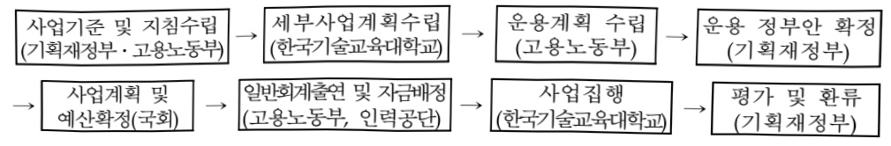

# 직업능력개발담당자양성 및 훈련매체개발

**해당 페이지**: PDF 222 ~ 233 쪽 해당

**부처**: 고용노동부
**분야**: 사회복지
**회계유형**: 일반회계
**2026 확정예산**: 82080.0 백만원
**전년대비 증감률**: 8.3%
**AI 도메인**: 교육/인재

---

<table border=1 style='margin: auto; word-wrap: break-word;'><tr><td style='text-align: center; word-wrap: break-word;'>사 업 명</td></tr><tr><td style='text-align: center; word-wrap: break-word;'>(30) 직업능력개발담당자양성 및 훈련매체개발(1136-300)</td></tr></table>

□ 사업 코드 정보

<table border=1 style='margin: auto; word-wrap: break-word;'><tr><td style='text-align: center; word-wrap: break-word;'>구분</td><td style='text-align: center; word-wrap: break-word;'>회계</td><td style='text-align: center; word-wrap: break-word;'>소관</td><td style='text-align: center; word-wrap: break-word;'>실국(기관)</td><td style='text-align: center; word-wrap: break-word;'>계정</td><td style='text-align: center; word-wrap: break-word;'>분야</td><td style='text-align: center; word-wrap: break-word;'>부문</td></tr><tr><td style='text-align: center; word-wrap: break-word;'>코드</td><td rowspan="2">일반회계</td><td rowspan="2">고용노동부</td><td rowspan="2">직업능력정책국</td><td rowspan="2"></td><td style='text-align: center; word-wrap: break-word;'>080</td><td style='text-align: center; word-wrap: break-word;'>08D</td></tr><tr><td style='text-align: center; word-wrap: break-word;'>명칭</td><td style='text-align: center; word-wrap: break-word;'>사회복지</td><td style='text-align: center; word-wrap: break-word;'>고용</td></tr></table>

<table border=1 style='margin: auto; word-wrap: break-word;'><tr><td style='text-align: center; word-wrap: break-word;'>구분</td><td style='text-align: center; word-wrap: break-word;'>프로그램</td><td style='text-align: center; word-wrap: break-word;'>단위사업</td><td style='text-align: center; word-wrap: break-word;'>세부사업</td></tr><tr><td style='text-align: center; word-wrap: break-word;'>코드</td><td style='text-align: center; word-wrap: break-word;'>1100</td><td style='text-align: center; word-wrap: break-word;'>1136</td><td style='text-align: center; word-wrap: break-word;'>300</td></tr><tr><td style='text-align: center; word-wrap: break-word;'>명칭</td><td style='text-align: center; word-wrap: break-word;'>직업능력개발</td><td style='text-align: center; word-wrap: break-word;'>한국기술교육대학교출연</td><td style='text-align: center; word-wrap: break-word;'>직업능력개발담당자양성 및 훈련매체개발</td></tr></table>

☐ 사업 성격

<table border=1 style='margin: auto; word-wrap: break-word;'><tr><td rowspan="2">신규</td><td rowspan="2">계속</td><td rowspan="2">완료</td><td rowspan="2">예비타당성실시여부</td><td rowspan="2">총사업비관리대상</td><td rowspan="2">총액계상예산사업</td><td style='text-align: center; word-wrap: break-word;'>사업소관 변경정보</td></tr><tr><td style='text-align: center; word-wrap: break-word;'>2025예산 시 소관</td></tr><tr><td style='text-align: center; word-wrap: break-word;'></td><td style='text-align: center; word-wrap: break-word;'>O</td><td style='text-align: center; word-wrap: break-word;'></td><td style='text-align: center; word-wrap: break-word;'></td><td style='text-align: center; word-wrap: break-word;'></td><td style='text-align: center; word-wrap: break-word;'></td><td style='text-align: center; word-wrap: break-word;'></td></tr></table>

□ 사업 지원 형태 및 지원을

<table border=1 style='margin: auto; word-wrap: break-word;'><tr><td style='text-align: center; word-wrap: break-word;'>직접</td><td style='text-align: center; word-wrap: break-word;'>출자</td><td style='text-align: center; word-wrap: break-word;'>출연</td><td style='text-align: center; word-wrap: break-word;'>보조</td><td style='text-align: center; word-wrap: break-word;'>융자</td><td style='text-align: center; word-wrap: break-word;'>국고보조율(%)</td><td style='text-align: center; word-wrap: break-word;'>융자율(%)</td></tr><tr><td style='text-align: center; word-wrap: break-word;'></td><td style='text-align: center; word-wrap: break-word;'></td><td style='text-align: center; word-wrap: break-word;'>O</td><td style='text-align: center; word-wrap: break-word;'></td><td style='text-align: center; word-wrap: break-word;'></td><td style='text-align: center; word-wrap: break-word;'></td><td style='text-align: center; word-wrap: break-word;'></td></tr></table>

□ 사업 소관부처 및 시행주체

<table border=1 style='margin: auto; word-wrap: break-word;'><tr><td style='text-align: center; word-wrap: break-word;'>사업명</td><td colspan="2">구분</td></tr><tr><td rowspan="4">직업훈련 교원 및 HRD 담당자 양성</td><td rowspan="3">소관부처</td><td style='text-align: center; word-wrap: break-word;'>실·국·과(팀)</td></tr><tr><td style='text-align: center; word-wrap: break-word;'>직업능력정책국</td></tr><tr><td style='text-align: center; word-wrap: break-word;'>직업능력정책과</td></tr><tr><td style='text-align: center; word-wrap: break-word;'>사업시행주체</td><td style='text-align: center; word-wrap: break-word;'>한국기술교육대학교</td></tr><tr><td rowspan="4">직업훈련교원 재·향상연수</td><td rowspan="3">소관부처</td><td style='text-align: center; word-wrap: break-word;'>실·국·과(팀)</td></tr><tr><td style='text-align: center; word-wrap: break-word;'>직업능력정책국</td></tr><tr><td style='text-align: center; word-wrap: break-word;'>인적자원개발과</td></tr><tr><td style='text-align: center; word-wrap: break-word;'>사업시행주체</td><td style='text-align: center; word-wrap: break-word;'>한국기술교육대학교</td></tr><tr><td rowspan="4">평생능력개발온라인훈련사업</td><td rowspan="3">소관부처</td><td style='text-align: center; word-wrap: break-word;'>실·국·과(팀)</td></tr><tr><td style='text-align: center; word-wrap: break-word;'>직업능력정책국</td></tr><tr><td style='text-align: center; word-wrap: break-word;'>직업능력정책과</td></tr><tr><td style='text-align: center; word-wrap: break-word;'>사업시행주체</td><td style='text-align: center; word-wrap: break-word;'>한국기술교육대학교</td></tr></table>

---

### 가.예산 총괄표

(단위: 백만원, %)

<table border=1 style='margin: auto; word-wrap: break-word;'><tr><td rowspan="2">사업명</td><td rowspan="2">2024년 결산</td><td colspan="2">2025년 예산</td><td colspan="2">2026년 예산</td><td rowspan="2">증감(B-A)</td><td rowspan="2">(B-A)/A</td></tr><tr><td style='text-align: center; word-wrap: break-word;'>본예산(A)</td><td style='text-align: center; word-wrap: break-word;'>추경</td><td style='text-align: center; word-wrap: break-word;'>정부안</td><td style='text-align: center; word-wrap: break-word;'>확정(B)</td></tr><tr><td style='text-align: center; word-wrap: break-word;'>직업능력개발담당자양성 및 훈련체계발</td><td style='text-align: center; word-wrap: break-word;'>75,138</td><td style='text-align: center; word-wrap: break-word;'>75,778</td><td style='text-align: center; word-wrap: break-word;'>75,778</td><td style='text-align: center; word-wrap: break-word;'>78,970</td><td style='text-align: center; word-wrap: break-word;'>82,080</td><td style='text-align: center; word-wrap: break-word;'>6,302</td><td style='text-align: center; word-wrap: break-word;'>8.3</td></tr></table>

□ 기능별(내역사업별) 예산 내역

(단위:백만원)

<table border=1 style='margin: auto; word-wrap: break-word;'><tr><td rowspan="2"></td><td colspan="5">2024</td><td colspan="5">2025(2025.12월말)</td><td rowspan="2">2026예산</td></tr><tr><td style='text-align: center; word-wrap: break-word;'>예산액(추경)</td><td style='text-align: center; word-wrap: break-word;'>예산현액</td><td style='text-align: center; word-wrap: break-word;'>집행액</td><td style='text-align: center; word-wrap: break-word;'>이월액</td><td style='text-align: center; word-wrap: break-word;'>불용액</td><td style='text-align: center; word-wrap: break-word;'>본예산</td><td style='text-align: center; word-wrap: break-word;'>예산현액</td><td style='text-align: center; word-wrap: break-word;'>집행액</td><td style='text-align: center; word-wrap: break-word;'>이월액</td><td style='text-align: center; word-wrap: break-word;'>불용액</td></tr><tr><td style='text-align: center; word-wrap: break-word;'>○ 기능별 분류(합계)</td><td style='text-align: center; word-wrap: break-word;'>75,138</td><td style='text-align: center; word-wrap: break-word;'>75,138</td><td style='text-align: center; word-wrap: break-word;'>75,138</td><td style='text-align: center; word-wrap: break-word;'>-</td><td style='text-align: center; word-wrap: break-word;'>-</td><td style='text-align: center; word-wrap: break-word;'>75,778</td><td style='text-align: center; word-wrap: break-word;'>75,778</td><td style='text-align: center; word-wrap: break-word;'>75,778</td><td style='text-align: center; word-wrap: break-word;'>-</td><td style='text-align: center; word-wrap: break-word;'>-</td><td style='text-align: center; word-wrap: break-word;'>82,080</td></tr><tr><td style='text-align: center; word-wrap: break-word;'>· 직업훈련교원 및 HRD담당자양성</td><td style='text-align: center; word-wrap: break-word;'>22,795</td><td style='text-align: center; word-wrap: break-word;'>22,795</td><td style='text-align: center; word-wrap: break-word;'>22,795</td><td style='text-align: center; word-wrap: break-word;'>-</td><td style='text-align: center; word-wrap: break-word;'>-</td><td style='text-align: center; word-wrap: break-word;'>23,207</td><td style='text-align: center; word-wrap: break-word;'>23,207</td><td style='text-align: center; word-wrap: break-word;'>23,207</td><td style='text-align: center; word-wrap: break-word;'>-</td><td style='text-align: center; word-wrap: break-word;'>-</td><td style='text-align: center; word-wrap: break-word;'>23,527</td></tr><tr><td style='text-align: center; word-wrap: break-word;'>· 직업훈련교원재·향상연수</td><td style='text-align: center; word-wrap: break-word;'>23,645</td><td style='text-align: center; word-wrap: break-word;'>23,645</td><td style='text-align: center; word-wrap: break-word;'>23,645</td><td style='text-align: center; word-wrap: break-word;'>-</td><td style='text-align: center; word-wrap: break-word;'>-</td><td style='text-align: center; word-wrap: break-word;'>23,690</td><td style='text-align: center; word-wrap: break-word;'>23,690</td><td style='text-align: center; word-wrap: break-word;'>23,690</td><td style='text-align: center; word-wrap: break-word;'>-</td><td style='text-align: center; word-wrap: break-word;'>-</td><td style='text-align: center; word-wrap: break-word;'>27,980</td></tr><tr><td style='text-align: center; word-wrap: break-word;'>· 평생능력개발온라인훈련사업</td><td style='text-align: center; word-wrap: break-word;'>28,698</td><td style='text-align: center; word-wrap: break-word;'>28,698</td><td style='text-align: center; word-wrap: break-word;'>28,698</td><td style='text-align: center; word-wrap: break-word;'>-</td><td style='text-align: center; word-wrap: break-word;'>-</td><td style='text-align: center; word-wrap: break-word;'>28,881</td><td style='text-align: center; word-wrap: break-word;'>28,881</td><td style='text-align: center; word-wrap: break-word;'>28,881</td><td style='text-align: center; word-wrap: break-word;'>-</td><td style='text-align: center; word-wrap: break-word;'>-</td><td style='text-align: center; word-wrap: break-word;'>30,573</td></tr></table>

### 나.사업설명자료

## 1 ) 사업목적·내용

- (직업능력개발담당자양성 및 훈련매체개발) 국가산업발전의 핵심 역할을 수행하는 고급 기술·기능인력의 직업능력개발(교육훈련)을 담당할 우수 직업능력개발담당자(훈련교사, 실천공학기술자(기업현장교사), 인력개발담당자 등) 양성 및 재·향상훈련과 첨단훈련매체를 활용한 전국민 평생직업능력개발 체제 구축

- (직업훈련교원 및 HRD담당자 양성) 직업능력개발담당자 및 전문가, 기업연계형 현장 실습 운영을 통한 직업능력개발 담당자(훈련교사, 실천공학기술자, 인력개발담당자) 양성

- (식업훈련교원 재·향상연수) 직업훈련교사 및 담당자의 직무능력 향상, 신기술개발 연수, 첨단신산업분야 인력양성 등 훈련교원 양성 및 재교육 과정

- (평생능력개발 온라인훈련사업) 근로자, 구직자 등 전국민의 평생직업능력개발을 위한 온라인 훈련콘텐츠 개발 및 보급

---

## 2 ) 사업개요

□ 사업근거 및 추진경위

① 법령상 근거 및 조항 적시

- 「국민 평생 직업능력 개발법」 제27조, 제33조, 제36조, 제37조, 제52조의2,

- 「국민 평생 직업능력 개발법 시행령」 제2조, 제28조, 제28조의2, 제29조

제27조(공공직업훈련시설의 설치 등) ① 국가, 지방자치단체 또는 공공단체는 공공직업훈련시설을 설치·운영할 수 있다. 이 경우 국가 또는 지방자치단체가 공공직업훈련시설을 설치하려는 때에는 고용노동부장관과 협의하여야 하며, 공공단체가 공공직업훈련시설을 설치하려는 때에는 고용노동부 장관의 승인을 받아야 한다.

제33조(직업능력개발훈련교사 등) ① 직업능력개발훈련교사나 그 밖에 해당 분야에 전문지식이 있는 사람 등으로서 대통령령으로 정하는 사람(이하 “직업능력개발훈련교사등”이라 한다)은 직업능력개발훈련을 위하여 훈련생을 가르칠 수 있다.

제36조(직업능력개발훈련교사의 양성) ① 국가, 지방자치단체, 공공단체 또는 고용노동부장관이 고시하는 법인·단체는 직업능력개발훈련교사 양성을 위한 훈련과정을 설치·운영할 수 있다. 이 경우 국가 및 지방자치단체가 아닌 자가 훈련과정을 설치·운영하려면 고용노동부장관의 승인을 받아야 한다. (이하 생략)

제37조(직업능력개발훈련교사등의 능력개발) ① 고용노동부장관은 직업능력개발훈련교사등의 능력개발을 위하여 직업능력개발사업을 할 수 있다.

② 다음 각 호의 훈련 또는 훈련과정에서 가르치는 직업능력개발훈련교사등은 제1항에 따른 직업능력개발사업으로서 고용노동부장관이 실시하는 보수(補修)교육을 정기적으로 받아야 한다.

1. 제16조에 따라 국가 또는 지방자치단체로부터 위탁받아 실시하는 직업능력개발훈련

2. 제19조에 따라 고용노동부장관으로부터 인정받는 직업능력개발훈련과정 및 계좌적합훈련과정

3. 제24조에 따라 고용노동부장관으로부터 인정받는 제20조제1항제1호의 근로자 직업능력개발훈련과정(사업주로부터 위탁받아 실시하는 훈련과정에 한정한다)

③ 고용노동부장관은 직업능력개발훈련교사등의 능력개발을 위한 직업능력개발사업을 하는 자에게 필요한 비용을 지원하거나 융자할 수 있다.

④ 제1항부터 제3항까지에 따른 보수교육 등 사업의 내용·방법 및 기준, 지원의 요건·내용·절차 및 수준에 관하여 필요한 사항은 대통령령으로 정한다.

제52조2(기술교육대학의 설립·운영) ① 「한국산업인력공단법」에 따른 한국산업인력 공단은 직업능력개발훈련교사 등의 양성 및 직무능력향상훈련, 그 밖에 근로자에 대한 직업능력개발훈련 지원 등을 위하여 교육부 장관의 인가를 받아 「사립학교법」에 따른 대학(이하 “기술교육대학”이라 한다)을 설립·운영할 수 있다.

② 제 1항에 따른 기술교육대학의 사업을 다음 각 호와 같다

1. 직업능력개발훈련교사·실천공학기술자·인력개발담당자의 양성 및 직무능력향상훈련사업

2. 직업능력개발훈련 및 공학교육에 관한 선도모형의 개발·운영 및 보급사업

3. 근로자 등에 대한 원격훈련사업

4. 중소기업기술지도 및 창업보육센터 운영 등 산학협력사업

5. 다른 법령에서 담당하도록 되어 있거나 고용노동부장관, 다른 중앙행정기관의

장, 지방자치단체의 장 또는 사업주 등이 위탁하는 사업

---

## (시행령)제2조(직업능력개발훈련시설을 설치할 수 있는 공공단체의 범위)

「국민 평생 직업능력 개발법」 제2조제3호가목에서 “대통령령으로 정하는 공공단체”란 다음 각 호와 같다.

1.「한국산업인력공단법」에 따른 한국산업인력공단(한국산업인력공단이 출연하여 설립한 학교법인을 포함한다)

(시행령)제28조(직업능력개발훈련교사의 자격 취득) ① 직업능력개발훈련교사는 1급

2급 및 3급으로 구분한다.

② 법 제33조제2항에서 “제36조에 따른 직업능력개발훈련교사 양성을 위한 훈련과 정을 수료하는 등 대통령령으로 정하는 기준”이란 별표 2와 같다.

③ 고용노동부장관은 별표 2에 따른 직업능력개발훈련교사 자격기준 충족 여부에 대하여 법 제52조의2에 따라 설립된 기술교육대학(이하 “기술교육대학”이라 한다)의 의견을 들을 수 있다.

④ 법 제33조에 따른 직업능력개발훈련교사 자격증의 발급절차 등에 관한 사항은 고용노동부령으로 정한다.

(시행령)제28조의2(직업능력개발훈련교사등의 보수교육) ① 범 제33조제1항에 따른 직업능력개발훈련교사등(이하 “직업능력개발훈련교사등”이라 한다)은 법 제37조제2항에 따라 다음 각 호의 어느 하나에 해당하는 내용의 보수교육(이하 “보수교육”이라 한다)을 받아야 한다.

1. 훈련직종에 관한 전문지식 및 기술

2. 훈련과정에 대한 교수 기법

3. 훈련생에 대한 지도 및 상담

4. 훈련성과 및 훈련생에 대한 평가

5. 그 밖에 직업능력개발훈련교사등의 능력개발을 위하여 고용노동부장관이 정하여 고시하는 사항

② 직업능력개발훈련교사등은 매년 보수교육을 받아야 하며, 그 보수교육의 시간은 24시간의 범위에서 고용노동부장관이 고시로 정한다.

③ 고용노동부장관은 직업능력개발훈련교사등의 보수교육 실시 결과를 범 제7조의 2제4호에 따른 직업능력개발훈련과정에 대한 심사 등 성과관리를 위한 업무에 반영할 수 있다.

④ 제1항부터 제3항까지에서 규정한 사항 외에 보수교육의 방법 및 운영 등에 필요한 세부사항은 고용노동부장관이 정하여 고시한다.

(시행령)제29조(직업능력개발훈련교사의 능력개발 지원) ①고용노동부장관은 법 제37조제3항에 따라 같은 조 제1항 및 제2항에 따른 직업능력개발훈련교사의 능력개발을 위한 사업으로서 다음 각 호의 사업을 직접 실시하거나 이를 실시하는 자에게 그 실시에 필요한 비용을 지원하거나 융자할 수 있다.

1. 교육훈련사업

2. 훈련매체, 훈련과정, 훈련방법 등의 개발·보급사업

3. 국제교류 및 국제협력사업

4. 조사·연구사업

-「한국산업인력공단법」 제6조, 제26조

---

제6조(사업) 공단의 사업은 다음 각 호와 같다.

4. 직업능력개발훈련교사와 인적자원 개발 전문가 등의 양성·관리를 위한 「사립학교법」에 따른 학교의 설립·운영 지원

제26조(산하기관) ① 공단은 제6조의 사업을 효율적으로 수행하기 위하여 공단 산하에 「사립학교법」에 따른 학교 또는 「국민 평생 직업능력 개발법」에 따른 기능대학(학교법인을 포함한다), 그 밖에 필요한 기관(이하 "산하기관"이라 한다)을 둘 수 있다.

② 추진경위 - 사업 시작년도, 추진배경, 부처별 중점과제, 대통령 공약사항 등

- '92. 3월 한국기술교육대학교 설립(직업훈련교사 양성 목적 대학교)

- '95. 7월 고용보험법 제정 동법에 근거한 직업능력개발사업이 시행됨으로써 종전의 직업훈련기본법에 의한 사업주의 직업훈련의무제도 폐지

- '98년 직업훈련기본법 폐지. 고용보험법에 의한 직업훈련 촉진 사업을 위하여 근로자직업훈련촉진법 제정하고 지원재원을 일반회계와 고용보험법에 의한 고용보험기금으로 지원하도록 규정

- '99년 직업훈련촉진기금 폐지로 피보험자 등의 위탁·훈련사업비와 교육지원비는 고용보험기금에서 지원하고 기관운영비와 경상비는 일반회계에서 지원 등

- '19년부터 고용보험기금에서 일반회계로 이관

- '20년부터 직업능력개발훈련교사등의 보수교육 실시

## □ 주요내용

① 사업규모

- 총사업비(해당되는 경우에만 기재) : 해당 없음

- 사업기간 : 1992년 ~ 계속

-최근 5년 간 투입된 사업비(예산액기준, 추경편성한 연도에는 추경포함)

<table border=1 style='margin: auto; word-wrap: break-word;'><tr><td style='text-align: center; word-wrap: break-word;'>$ \underline{\text{所}} $</td><td style='text-align: center; word-wrap: break-word;'>2022</td><td style='text-align: center; word-wrap: break-word;'>2023</td><td style='text-align: center; word-wrap: break-word;'>2024</td><td style='text-align: center; word-wrap: break-word;'>2025</td><td style='text-align: center; word-wrap: break-word;'>2026</td></tr><tr><td style='text-align: center; word-wrap: break-word;'>$ \underline{\text{사업}} $</td><td style='text-align: center; word-wrap: break-word;'>86,560</td><td style='text-align: center; word-wrap: break-word;'>80,226</td><td style='text-align: center; word-wrap: break-word;'>75,138</td><td style='text-align: center; word-wrap: break-word;'>75,778</td><td style='text-align: center; word-wrap: break-word;'>82,080</td></tr></table>

- 기타: 해당 없음

② 사업추진체계

- 사업시행방법 : 출연

-사업시행주체:한국기술교육대학교

- 사업 수혜자 : 학부생(직업능력개발담당자) 및 대학원생(직업능력개발전문가),

직업능력개발훈련교사, 직업능력개발기관, 재직 근로자 등

- 보조, 융자, 출연, 출자 등의 경우 보조·융자 등 지원 비율 및 법적근거

---

<table border=1 style='margin: auto; word-wrap: break-word;'><tr><td style='text-align: center; word-wrap: break-word;'>내역사업명</td><td style='text-align: center; word-wrap: break-word;'>구분</td><td style='text-align: center; word-wrap: break-word;'>피보조·피출연 등 기관명</td><td style='text-align: center; word-wrap: break-word;'>지원 금액 (2026예산)</td><td style='text-align: center; word-wrap: break-word;'>지원 비율(%)</td><td style='text-align: center; word-wrap: break-word;'>보조율 법적근거 (해당 조항)</td></tr><tr><td style='text-align: center; word-wrap: break-word;'>직업훈련 교원 및 HRD 담당자 양성</td><td rowspan="3">출연</td><td rowspan="3">한국기술 교육 대학교</td><td style='text-align: center; word-wrap: break-word;'>23,527</td><td rowspan="3">100.0</td><td rowspan="3">- 국민 평생 직업능력 개발법 제11조의2~3 - 국민 평생 직업능력 개발법 제52조의2</td></tr><tr><td style='text-align: center; word-wrap: break-word;'>직업훈련교원 재·향상연수</td><td style='text-align: center; word-wrap: break-word;'>27,980</td></tr><tr><td style='text-align: center; word-wrap: break-word;'>평생능력개발 온라인 훈련사업</td><td style='text-align: center; word-wrap: break-word;'>30,573</td></tr></table>

---

3) 2026년도 예산 산출 근거

□ 직업능력개발담당자양성 및 훈련매체개발 : (2025 예산) 75,778백만원 → (2026 예산) 82,080백만원, +6,302백만원

① 직업훈련교원 및 HRD담당자양성

: (2025 예산) 23,207백만원 → (2026 예산) 23,527백만원, +320백만원

- (요구) 직업능력개발담당자 및 전문가 양성을 위한 필수소요 요구, 공무직 및 산학교원 인건비 처우개선비

- (산출) 직업능력개발담당자 및 전문가 양성 15,969백만원

기업연계형 현장실습제도(IPP) 2,021백만원

학부(과) 교과과정 개편 및 4년제 대학용 NCS 교육과정 개발 운영 722백만원

글로벌 TVET 프로그램 운영 203백만원

학부과실험실습장비비 4,612백만원

② 직업훈련교원 재·향상연수

: (2025 예산) 23,690백만원 → (2026 예산) 27,980백만원, +4,290백만원

- (요구) 식업훈련교사 양성 및 직업훈련교·강사의 교육역량 제고를 위한 법제화 된 의무 보수교육 운영비, 교직향상교육 물량 축소(45,000명→40,327명), 전공분야 AI 보수교육 5천명 단가 인상(30만원→77만원), 직업훈련교·강사 대상의 AI 특화 인재 500명 양성, 공무직 인건비 처우개선비

- (산출) 직업훈련교원 교직향상교육 10,237백만원

    직업훈련교원 전공향상교육 10,490백만원

    교육원 실험실습 장비비 2,483백만원

    직업훈련 신교수법 개발 1,500백만원

K-DT 강사 아카데미 500백만원

AI 특화 인재양성 2,770백만원

③ 평생능력개발온라인 훈련사업

: (2025 예산) 28,881 백만원 → (2026 예산) 30,573 백만원, +1,692 백만원

- (요구) 전 국민의 온라인 기반 직업훈련 활성화를 위한 필수소요, STEP LMS 보급 확대(60개소), AI 접목 STEP 고도화 ISP 수립, 디지털트뷰 휴런과정(1개 부야) 개방·운영 고문지 이건비

- (산출) 온·오프라인 연계 평생학습체제 구축·운영 2,572백만원

온라인훈련 운영 1,500백만원

온라인훈련 콘텐츠 개발 19,300백만원

평생능력개발온라인훈련사업 전문인력 인건비 3,001백만원

온라인훈련 장비비 1,600백만원

에듀테크 기반 직업훈련 Test-Bed 및 확산 1,840백만원

디지털트윈 훈련과정 개발·운영 760백만원

2025년도 예산 및 2026년도 예산 산출 세부내역 비교

<table border=1 style='margin: auto; word-wrap: break-word;'><tr><td rowspan="2">예산</td><td colspan="2">2025년 예산</td><td colspan="2">2026년 예산</td></tr><tr><td colspan="2">산출내역</td><td style='text-align: center; word-wrap: break-word;'>예산</td><td style='text-align: center; word-wrap: break-word;'>산출내역</td></tr><tr><td rowspan="2">75,778</td><td colspan="2">○ 사업출연금(350-02) : 75,778백만원</td><td colspan="2">○ 사업출연금(350-02) : 82,080백만원</td></tr><tr><td style='text-align: center; word-wrap: break-word;'>①직업훈련교원 및 HRD담당자양성 23,207백만원가. 직업능력개발 담당자 양성 (15,669백만원) • 학부(과) 및 대학원 양성비 3,830명×4,091천원나. 기업연계형 현장실습제도(IPP) (2,006백만원) • 380명×5,278.9천원다. 학부(과) 교육과정 개편 (413백만원) • 3전공×4과목×19,500천원 • 4차 산업혁명 관련 11과목×16.3백만원라. 4년제 대학용 NCS 교육과정 개발 운영 (309백만원) • 25전공×12.4백만원마. 글로벌 TVET 프로그램 운영 (198백만원)</td><td style='text-align: center; word-wrap: break-word;'>82,080</td><td style='text-align: center; word-wrap: break-word;'>①직업훈련교원 및 HRD담당자양성 23,527백만원가. 직업능력개발 담당자 양성 (15,969백만원) • 학부(과) 및 대학원 양성비 3,830명×4,169천원나. 기업연계형 현장실습제도(IPP) (2,021백만원) • 380명×5,278.9천원다. 학부(과) 교육과정 개편 (413백만원) • 3전공×4과목×19,500천원 • 4차 산업혁명 관련 11과목×16.3백만원라. 4년제 대학용 NCS 교육과정 개발 운영 (309백만원) • 25전공×12.4백만원마. 글로벌 TVET 프로그램 운영 (203백만원)</td><td style='text-align: center; word-wrap: break-word;'>2026년 예산</td></tr></table>

---

<table border=1 style='margin: auto; word-wrap: break-word;'><tr><td colspan="2">2025년 예산</td><td colspan="2">2026년 예산</td></tr><tr><td style='text-align: center; word-wrap: break-word;'>예산</td><td style='text-align: center; word-wrap: break-word;'>산출내역</td><td style='text-align: center; word-wrap: break-word;'>예산</td><td style='text-align: center; word-wrap: break-word;'>산출내역</td></tr><tr><td rowspan="2"></td><td style='text-align: center; word-wrap: break-word;'>· 국제 컨퍼런스(TVET-CAMPUS)×90백만원
· 한-ILO(국제노동기구) 교류프로그램 운영×108백만원
· 학부과실점첨실숭정비비 (4,612백만원)
· 학부(8학부19전공) 및 대학원(10학과20전공)×4,612백만원</td><td style='text-align: center; word-wrap: break-word;'></td><td style='text-align: center; word-wrap: break-word;'>· 국제 컨퍼런스(TVET-CAMPUS)×90백만원
· 한-ILO(국제노동기구) 교류프로그램 운영×113백만원
· 학부과실점첨실숭정비비 (4,612백만원)
· 학부(8학부19전공) 및 대학원(10학과20전공)×4,612백만원</td></tr><tr><td style='text-align: center; word-wrap: break-word;'>② 직업훈련교원 재·향상연수 23,690백만원
가· 직업훈련교원 교직향상교육 (11,214백만원)
· 교직훈련과정 1,200명×0.564백만원 = 676백만원
· 신중년 과정 500명×0.982백만원 = 491백만원
· 향상훈련 과정 200명×0.79백만원 = 158백만원
· 교직보수교육 이수 45,000명×0.214백만원 = 9,630백만원
· 스타훈련교사 선발 10명×2.5백만원 = 25백만원
· 연수사업운영비 12월×19.5백만원 = 23백만원
나· 직업훈련교원 전공향상교육 (7,993백만원)
· 전공분야 보수교육 15,000명×0.3백만원 = 4,500백만원
· 연수사업운영비(신기술) 12월×36.25백만원 = 435백만원
· 연수사업운영비(침단신산업) 12월×122.6백만원 = 1,471백만원
· 직업계고교원원장기술연수 750명×1.55백만원 = 1,163백만원
· 과정평가형 자격운영 컨설팅 5개교×59백만원 = 295백만원
· 해외 전문가 초빙 8명×13.88백만원 = 111백만원
· 교원 신기술향상 훈련 3명×6백만원 = 18백만원</td><td style='text-align: center; word-wrap: break-word;'>② 직업훈련교원 재·향상연수 27,980백만원
가· 직업훈련교원 교직향상교육 (10,237백만원)
· 교직훈련과정 1,200명×0.564백만원 = 676백만원
· 신중년 과정 500명×0.982백만원 = 491백만원
· 향상훈련 과정 200명×0.79백만원 = 158백만원
· 교직보수교육 이수 40,327명×0.214백만원 = 8,630백만원
· 스타훈련교사 선발 10명×2.5백만원 = 25백만원
· 연수사업운영비 12월×21.4백만원 = 257백만원
나· 직업훈련교원 전공향상교육 (10,490백만원)
· 전공분야 보수교육 10,000명×0.3백만원 = 3,000백만원
· 전공분야 보수교육 5,000명×0.77백만원 = 3,850백만원
· 연수사업운영비(신기술) 12월×36.25백만원 = 435백만원
· 연수사업운영비(침단신산업) 12월×122.6백만원 = 1,471백만원
· 직업계고교원원장기술연수 750명×1.55백만원 = 1,163백만원
· 과정평가형 자격운영 컨설팅 5개교×59백만원 = 295백만원
· 해외 전문가 초빙 8명×13.88백만원 = 111백만원
· 과정평가형 자격운영 컨설팅 5개교×59백만원 = 295백만원
· 해외 전문가 초빙 8명×13.88백만원 = 111백만원
· 교원 신기술향상 훈련 3명×6백만원 = 18백만원
나· 교육원 실험실습 장비비 (2,483백만원)
· 노후교체 장비 148점×6.76백만원 = 1,000백만원
· 신기술 장비 447점×3.32백만원 = 1,483백만원
· 직업훈련신교수법 개발 (1,500백만원)
· 14분야×107.14백만원 = 1,500백만원
· K-DT 강사 아카데미 운영 (500백만원)
· 연수운영 50명×1개 직종×9백만원 = 450백만원
· 클라우드 교육장비 1식×50백만원 = 50백만원</td><td style='text-align: center; word-wrap: break-word;'>· 교원 신기술향상 훈련 3명×6백만원 = 18백만원
다· 교육원 실험실습 장비비 (2,483백만원)
· 노후교체 장비 148점×6.76백만원 = 1,000백만원
· 신기술 장비 447점×3.32백만원 = 1,483백만원
· 직업훈련신교수법 개발 (1,500백만원)
· 14분야×107.14백만원 = 1,500백만원
· K-DT 강사 아카데미 운영 (500백만원)
· 연수운영 50명×1개 직종×9백만원 = 450백만원
· 클라우드 교육장비 1식×50백만원 = 50백만원
· AI 특화 인재양성 (2,770백만원)
· 교육과정운영비 500명×3백만원 = 1,500백만원
· AI 학습분석실 구축 7실×181.4백만원 = 1,270백만원
③ 평생능력개발온라인 훈련사업 28,881백만원
가· 온·오프라인 연계 평생학습체제 구축운영 (2,341백만원)
· (풀뜻품 구축) STEP 유지보수 등 2,011백만원
· (풀뜻품 운영 및 훼삭) STEP 운영 등 330백만원
나· 온라인 훈련 운영 (1,500백만원)
· 13.4만명×11,200원
다· 온라인 훈련 큰텐츠 개발 (19,300백만원)
· (이러닝 큰텐츠) 320×50백만원
· (가상훈련 큰텐츠) 15×220백만원
· 평생능력개발온라인훈련사업 전문인력 인건비 (2,900백만원)
· 54명×53.7백만원
· 평생능력개발온라인훈련 장비비 (1,000백만원)
· 서버 장비 4ea×250백만원
사· 애듀테크 기반 직업훈련 Test-Bed 및 확산 (1,840백만원)
· (메타버스 큰텐츠 개발) 3종×200백만원
· (직업훈련 전용 메타버스를맺품 구축) 1식×480백만원
· (3D 스캔볼류 스튜디오 구축·운영) 1식×300백만원
· (메타버스 기반 훈련 운영) 18회×20백만원
· (교수·학습 모델 고도화 연구) 1과제×100백만원
· (메타버스 큰텐츠 개발) 3종×200백만원
· (3D 스캔볼류 스튜디오 구축·운영) 1식×300백만원
· (메타버스 기반 훈련 운영) 18회×20백만원
· (교수·학습 모델 고도화 연구) 1과제×100백만원
· 1개 분야×760백만원
· (메타버스 큰텐츠 개발) 3종×200백만원
· (3D 스캔볼류 스튜디오 구축·운영) 1식×480백만원
· (메타버스 기반 훈련 운영) 18회×20백만원
· (교수·학습 모델 고도화 연구) 1과제×100백만원
· 1개 분야×760백만원</td></tr></table>

---

## 4 ) 사업효과

☐ 사업영향, 산출물 성과지표 등

① 2022~2026년도 성과계획서 상 성과지표 및 최근 5년간 성과 달성도

<table border=1 style='margin: auto; word-wrap: break-word;'><tr><td style='text-align: center; word-wrap: break-word;'>성과지표</td><td style='text-align: center; word-wrap: break-word;'>구분</td><td style='text-align: center; word-wrap: break-word;'>2022</td><td style='text-align: center; word-wrap: break-word;'>2023</td><td style='text-align: center; word-wrap: break-word;'>2024</td><td style='text-align: center; word-wrap: break-word;'>2025</td><td style='text-align: center; word-wrap: break-word;'>2026</td><td style='text-align: center; word-wrap: break-word;'>2026 목표치산출근거</td><td style='text-align: center; word-wrap: break-word;'>측정산식(또는 측정방법)</td><td style='text-align: center; word-wrap: break-word;'>자료수집방법(또는 자료출처)</td></tr><tr><td rowspan="3">K-Digital Training 수료율(단위: %)</td><td style='text-align: center; word-wrap: break-word;'>목표</td><td style='text-align: center; word-wrap: break-word;'>88.0</td><td style='text-align: center; word-wrap: break-word;'>(삭제)</td><td style='text-align: center; word-wrap: break-word;'>(삭제)</td><td style='text-align: center; word-wrap: break-word;'>(삭제)</td><td style='text-align: center; word-wrap: break-word;'>(삭제)</td><td rowspan="3">-</td><td rowspan="3">-</td><td rowspan="3">-</td></tr><tr><td style='text-align: center; word-wrap: break-word;'>실적</td><td style='text-align: center; word-wrap: break-word;'>89.7</td><td style='text-align: center; word-wrap: break-word;'>-</td><td style='text-align: center; word-wrap: break-word;'>-</td><td style='text-align: center; word-wrap: break-word;'>-</td><td style='text-align: center; word-wrap: break-word;'>-</td></tr><tr><td style='text-align: center; word-wrap: break-word;'>달성도</td><td style='text-align: center; word-wrap: break-word;'>101.9</td><td style='text-align: center; word-wrap: break-word;'>-</td><td style='text-align: center; word-wrap: break-word;'>-</td><td style='text-align: center; word-wrap: break-word;'>-</td><td style='text-align: center; word-wrap: break-word;'>-</td></tr><tr><td rowspan="3">일학습병행학습근로자수(단위: 명)</td><td style='text-align: center; word-wrap: break-word;'>목표</td><td style='text-align: center; word-wrap: break-word;'>130,000</td><td style='text-align: center; word-wrap: break-word;'>(삭제)</td><td style='text-align: center; word-wrap: break-word;'>(삭제)</td><td style='text-align: center; word-wrap: break-word;'>(삭제)</td><td style='text-align: center; word-wrap: break-word;'>(삭제)</td><td rowspan="3">-</td><td rowspan="3">-</td><td rowspan="3">-</td></tr><tr><td style='text-align: center; word-wrap: break-word;'>실적</td><td style='text-align: center; word-wrap: break-word;'>132,005</td><td style='text-align: center; word-wrap: break-word;'>-</td><td style='text-align: center; word-wrap: break-word;'>-</td><td style='text-align: center; word-wrap: break-word;'>-</td><td style='text-align: center; word-wrap: break-word;'>-</td></tr><tr><td style='text-align: center; word-wrap: break-word;'>달성도</td><td style='text-align: center; word-wrap: break-word;'>101.5</td><td style='text-align: center; word-wrap: break-word;'>-</td><td style='text-align: center; word-wrap: break-word;'>-</td><td style='text-align: center; word-wrap: break-word;'>-</td><td style='text-align: center; word-wrap: break-word;'>-</td></tr><tr><td rowspan="3">K-Digital Training 취업률(단위: %)</td><td style='text-align: center; word-wrap: break-word;'>목표</td><td style='text-align: center; word-wrap: break-word;'>(신규)</td><td style='text-align: center; word-wrap: break-word;'>68.2</td><td style='text-align: center; word-wrap: break-word;'>(삭제)</td><td style='text-align: center; word-wrap: break-word;'>(삭제)</td><td style='text-align: center; word-wrap: break-word;'>(삭제)</td><td rowspan="3">-</td><td rowspan="3">-</td><td rowspan="3">-</td></tr><tr><td style='text-align: center; word-wrap: break-word;'>실적</td><td style='text-align: center; word-wrap: break-word;'>-</td><td style='text-align: center; word-wrap: break-word;'>57.5</td><td style='text-align: center; word-wrap: break-word;'>-</td><td style='text-align: center; word-wrap: break-word;'>-</td><td style='text-align: center; word-wrap: break-word;'>-</td></tr><tr><td style='text-align: center; word-wrap: break-word;'>달성도</td><td style='text-align: center; word-wrap: break-word;'>-</td><td style='text-align: center; word-wrap: break-word;'>84.3</td><td style='text-align: center; word-wrap: break-word;'>-</td><td style='text-align: center; word-wrap: break-word;'>-</td><td style='text-align: center; word-wrap: break-word;'>-</td></tr><tr><td rowspan="3">폴리텍하이테크과정취업률(단위: %)</td><td style='text-align: center; word-wrap: break-word;'>목표</td><td style='text-align: center; word-wrap: break-word;'>73.0</td><td style='text-align: center; word-wrap: break-word;'>80.3</td><td style='text-align: center; word-wrap: break-word;'>(삭제)</td><td style='text-align: center; word-wrap: break-word;'>(삭제)</td><td style='text-align: center; word-wrap: break-word;'>(삭제)</td><td rowspan="3">-</td><td rowspan="3">-</td><td rowspan="3">-</td></tr><tr><td style='text-align: center; word-wrap: break-word;'>실적</td><td style='text-align: center; word-wrap: break-word;'>81.7</td><td style='text-align: center; word-wrap: break-word;'>80.1</td><td style='text-align: center; word-wrap: break-word;'>-</td><td style='text-align: center; word-wrap: break-word;'>-</td><td style='text-align: center; word-wrap: break-word;'>-</td></tr><tr><td style='text-align: center; word-wrap: break-word;'>달성도</td><td style='text-align: center; word-wrap: break-word;'>111.9</td><td style='text-align: center; word-wrap: break-word;'>99.8</td><td style='text-align: center; word-wrap: break-word;'>-</td><td style='text-align: center; word-wrap: break-word;'>-</td><td style='text-align: center; word-wrap: break-word;'>-</td></tr><tr><td rowspan="3">일학습병행학습근로자수료율(단위: %)</td><td style='text-align: center; word-wrap: break-word;'>목표</td><td style='text-align: center; word-wrap: break-word;'>(신규)</td><td style='text-align: center; word-wrap: break-word;'>78.2</td><td style='text-align: center; word-wrap: break-word;'>(삭제)</td><td style='text-align: center; word-wrap: break-word;'>(삭제)</td><td style='text-align: center; word-wrap: break-word;'>(삭제)</td><td rowspan="3">-</td><td rowspan="3">-</td><td rowspan="3">-</td></tr><tr><td style='text-align: center; word-wrap: break-word;'>실적</td><td style='text-align: center; word-wrap: break-word;'>-</td><td style='text-align: center; word-wrap: break-word;'>78.6</td><td style='text-align: center; word-wrap: break-word;'>-</td><td style='text-align: center; word-wrap: break-word;'>-</td><td style='text-align: center; word-wrap: break-word;'>-</td></tr><tr><td style='text-align: center; word-wrap: break-word;'>달성도</td><td style='text-align: center; word-wrap: break-word;'>-</td><td style='text-align: center; word-wrap: break-word;'>99.7</td><td style='text-align: center; word-wrap: break-word;'>-</td><td style='text-align: center; word-wrap: break-word;'>-</td><td style='text-align: center; word-wrap: break-word;'>-</td></tr><tr><td rowspan="3">국민내일배움카드훈련인원(단위: 명)</td><td style='text-align: center; word-wrap: break-word;'>목표</td><td style='text-align: center; word-wrap: break-word;'>(신규)</td><td style='text-align: center; word-wrap: break-word;'>(신규)</td><td style='text-align: center; word-wrap: break-word;'>786,000</td><td style='text-align: center; word-wrap: break-word;'>690,258</td><td style='text-align: center; word-wrap: break-word;'>(삭제)</td><td rowspan="3">-</td><td rowspan="3">-</td><td rowspan="3">-</td></tr><tr><td style='text-align: center; word-wrap: break-word;'>실적</td><td style='text-align: center; word-wrap: break-word;'>-</td><td style='text-align: center; word-wrap: break-word;'>-</td><td style='text-align: center; word-wrap: break-word;'>664,955</td><td style='text-align: center; word-wrap: break-word;'>-</td><td style='text-align: center; word-wrap: break-word;'>-</td></tr><tr><td style='text-align: center; word-wrap: break-word;'>달성도</td><td style='text-align: center; word-wrap: break-word;'>-</td><td style='text-align: center; word-wrap: break-word;'>-</td><td style='text-align: center; word-wrap: break-word;'>84.5</td><td style='text-align: center; word-wrap: break-word;'>-</td><td style='text-align: center; word-wrap: break-word;'>-</td></tr><tr><td rowspan="3">훈련 양성률(단위: %)</td><td style='text-align: center; word-wrap: break-word;'>목표</td><td style='text-align: center; word-wrap: break-word;'>(신규)</td><td style='text-align: center; word-wrap: break-word;'>(신규)</td><td style='text-align: center; word-wrap: break-word;'>(신규)</td><td style='text-align: center; word-wrap: break-word;'>(신규)</td><td style='text-align: center; word-wrap: break-word;'>89.3</td><td rowspan="3">최근 3년 실적평균치**(22) 88.8(23) 89.7(24) 89.5</td><td rowspan="3">(1)훈련기도 수료인원/훈련실시인원×0.8(기증차)+(훈련훈련수료인원/훈련실시인원×0.2(기증차)</td><td rowspan="3">전수조사(한국고용정보원 및 한국폴리텍대학)</td></tr><tr><td style='text-align: center; word-wrap: break-word;'>실적</td><td style='text-align: center; word-wrap: break-word;'>-</td><td style='text-align: center; word-wrap: break-word;'>-</td><td style='text-align: center; word-wrap: break-word;'>-</td><td style='text-align: center; word-wrap: break-word;'>-</td><td style='text-align: center; word-wrap: break-word;'>-</td></tr><tr><td style='text-align: center; word-wrap: break-word;'>달성도</td><td style='text-align: center; word-wrap: break-word;'>-</td><td style='text-align: center; word-wrap: break-word;'>-</td><td style='text-align: center; word-wrap: break-word;'>-</td><td style='text-align: center; word-wrap: break-word;'>-</td><td style='text-align: center; word-wrap: break-word;'>-</td></tr></table>

---

② 성과지표 이외의 연도별 사업추진 경과 및 실적

<table border=1 style='margin: auto; word-wrap: break-word;'><tr><td style='text-align: center; word-wrap: break-word;'>2022</td><td style='text-align: center; word-wrap: break-word;'>- 한국대학평가원 3주기 대학기관평가인증 취득(5개 평가영역 평가준거 모두 만족 - &#x27;22년 중앙일보 대학평가 교육중심대학 1위(14년 연속) - &#x27;22년 산업계 관점 대학평가 &#x27;정보통신공학전공&#x27; 최우수 - [정규 양성과정] 4,698명(학부 4,133명 + 대학원 565명) - [재·향상 연수] 91,822명(교직향상 70,500명, 전공향상 21,322명) - [온라인훈련] 225,900명, 훈련콘텐츠 430과정 개발(이러닝 400+VT 30) 등</td></tr><tr><td style='text-align: center; word-wrap: break-word;'>2023</td><td style='text-align: center; word-wrap: break-word;'>- 취업률 80.3%(교육부 공시기준, 졸업생 500명 이상 4년제 대학 중 2위) - &#x27;23년 중앙일보 대학평가 &#x27;학생교육 우수대학 평가&#x27; 1위 - &#x27;23년 공공기관 고객만족도(기재부 주관) &#x27;우수 등급(85.6점)&#x27; - [정규 양성과정] 4,681명(학부 4,111명 + 대학원 570명) - [재·향상 연수] 83,010명(교직향상 60,656명, 전공향상 22,231명, KDT 123명) - [온라인훈련] 238,561명, 훈련콘텐츠 421과정 개발(이러닝 400+VT15+메타버스6) 등</td></tr><tr><td style='text-align: center; word-wrap: break-word;'>2024</td><td style='text-align: center; word-wrap: break-word;'>- 취업률 80.1%(교육부 공시기준, 졸업생 500명 이상 4년제 대학 중 3위) - 전국 4년제 “지방 소재 대학 중 수시 경쟁률 상위 10위권 이내(8.94:1)” - &#x27;24년 국민권익위 &quot;종합 청렴도 2년 연속 2등급&quot;(평가분류기관 중 최고 등급) - [정규 양성과정] 4,785명(학부 4,215명 + 대학원 570명) - [재·향상 연수] 80,718명(교직향상 56,092명, 전공향상 24,477명, KDT 149명) - [온라인훈련] 260,336명, 훈련콘텐츠 342과정 개발(이러닝 321+VT15+메타버스6) 등</td></tr><tr><td style='text-align: center; word-wrap: break-word;'>2025</td><td style='text-align: center; word-wrap: break-word;'>- 2026학년도 수시모집 경쟁률 “대전·세종·충청권 4년제 대학 최고(11.2:1)” - 특허청 “캠퍼스 특허 유니버시아드 대회” 대통령상(연속 2회) 등 수상 - [정규 양성과정] 4,737명(학부 4,157명 + 대학원 580명) - [재·향상 연수] 64,948명(교직향상 40,756명, 전공향상 24,101명, KDT 91명) - [온라인훈련] 249,439명, 훈련콘텐츠 338과정 개발(이러닝 320+VT15+메타버스3) 등</td></tr></table>

③향후(2026년도 이후)기대효과

- 우수 직업능력개발담당자 및 전문가 양성(연간 3,830명(정원)) 양성을 통해 고도

산업사회에서 필요로 하는 고급기술·기능인력의 안정적 공급에 기여

- 훈련교·강사의 보수교육(전공, 교직) 추진(연 55,327명) 및 직업훈련교사(연 1,900명), KDT 훈련교강사(50명), AI 특화 인재(500명)를 양성하여 직업훈련교원의 교육역량 강화를 통한 직업능력개발훈련 질 제고에 기여

- 공공 온라인직업훈련플랫폼 STEP 고도화 및 공공콘텐츠 개발(이러닝 320개, VT 15개, 메타버스 3개)을 통하여 전국민의 평생직업능력개발 기회(연간 265,000명)를 확대 제공하고, 민간 직업훈련기관 등의 훈련방식 도입 지원 등 직업 훈련 선진화 기여

5) 타당성조사 및 예비타당성조사 시행여부 및 결과 요지 : 해당 없음

6) 총사업비 대상사업 여부 및 내역 : 해당 없음

---

## 7 ) 사업 집행절차

- 사업집행절차 : 정부에서 직업능력개발훈련교사, 학습지도능력을 갖춘 실천공학기술자 및 인력개발담당자 양성사업을 한국기술교육대학교에 위탁실시하고, 재원은 정부에서 한국산업인력공단을 통하여 학교법인에 재출연

-사업추진 흐름도

## 8 ) 각종 평가

1) 국회(예결위, 상임위, 예정처, 국정감사 포함) 지적

- 가상훈련에 필요한 장비 확충 등을 위한 추가 예산 확보방안과 장비의 공동 활용을 위한 인프라 지원 방안 마련(환노위,'22결산)

- 스마트 직업훈련 플랫폼이 보다 많은 강의 정보를 수강자에게 제공할 수 있도록 하고 맞춤형 훈련 추천 서비스를 고도화하는 등 개선방안을 마련할 것(예정처,'23결산)

2) 대외공개 평가 : 해당없음

3) 자체평가 : 해당없음

### 다.최근 4년간 결산내역

## 1 ) 결산표

☐ 부처 결산내역

(단위: 백만원, %)

<table border=1 style='margin: auto; word-wrap: break-word;'><tr><td rowspan="2">연도</td><td colspan="3">예산액</td><td rowspan="2">예산현액(B)</td><td rowspan="2">집행액(C)</td><td rowspan="2">집행률(C/A)</td><td rowspan="2">집행률(C/B)</td><td rowspan="2">다음연도이월액</td><td rowspan="2">불용액</td></tr><tr><td style='text-align: center; word-wrap: break-word;'>본예산</td><td style='text-align: center; word-wrap: break-word;'>추경증감액</td><td style='text-align: center; word-wrap: break-word;'>추경(A)</td></tr><tr><td style='text-align: center; word-wrap: break-word;'>2022</td><td style='text-align: center; word-wrap: break-word;'>86,560</td><td style='text-align: center; word-wrap: break-word;'>-</td><td style='text-align: center; word-wrap: break-word;'>86,560</td><td style='text-align: center; word-wrap: break-word;'>86,560</td><td style='text-align: center; word-wrap: break-word;'>86,560</td><td style='text-align: center; word-wrap: break-word;'>100.0</td><td style='text-align: center; word-wrap: break-word;'>100.0</td><td style='text-align: center; word-wrap: break-word;'>-</td><td style='text-align: center; word-wrap: break-word;'>-</td></tr><tr><td style='text-align: center; word-wrap: break-word;'>2023</td><td style='text-align: center; word-wrap: break-word;'>80,226</td><td style='text-align: center; word-wrap: break-word;'>-</td><td style='text-align: center; word-wrap: break-word;'>80,226</td><td style='text-align: center; word-wrap: break-word;'>80,226</td><td style='text-align: center; word-wrap: break-word;'>80,226</td><td style='text-align: center; word-wrap: break-word;'>100.0</td><td style='text-align: center; word-wrap: break-word;'>100.0</td><td style='text-align: center; word-wrap: break-word;'>-</td><td style='text-align: center; word-wrap: break-word;'>-</td></tr><tr><td style='text-align: center; word-wrap: break-word;'>2024</td><td style='text-align: center; word-wrap: break-word;'>75,138</td><td style='text-align: center; word-wrap: break-word;'>-</td><td style='text-align: center; word-wrap: break-word;'>75,138</td><td style='text-align: center; word-wrap: break-word;'>75,138</td><td style='text-align: center; word-wrap: break-word;'>75,138</td><td style='text-align: center; word-wrap: break-word;'>100.0</td><td style='text-align: center; word-wrap: break-word;'>100.0</td><td style='text-align: center; word-wrap: break-word;'>-</td><td style='text-align: center; word-wrap: break-word;'>-</td></tr><tr><td style='text-align: center; word-wrap: break-word;'>2025</td><td style='text-align: center; word-wrap: break-word;'>75,778</td><td style='text-align: center; word-wrap: break-word;'>-</td><td style='text-align: center; word-wrap: break-word;'>75,778</td><td style='text-align: center; word-wrap: break-word;'>75,778</td><td style='text-align: center; word-wrap: break-word;'>75,778</td><td style='text-align: center; word-wrap: break-word;'>100.0</td><td style='text-align: center; word-wrap: break-word;'>100.0</td><td style='text-align: center; word-wrap: break-word;'>-</td><td style='text-align: center; word-wrap: break-word;'>-</td></tr></table>

---

## 2 ) 주요 결산사항

□ 2022~2025년 결산 주요 지적사항 및 시정요구사항

<table border=1 style='margin: auto; word-wrap: break-word;'><tr><td style='text-align: center; word-wrap: break-word;'>2022</td><td style='text-align: center; word-wrap: break-word;'>- 특이사항 없음
- 실집행 불용사유: 구매예산 낙찰차액 및 사업비 절감운용 등 일부예산 불용</td></tr><tr><td style='text-align: center; word-wrap: break-word;'>2023</td><td style='text-align: center; word-wrap: break-word;'>- 특이사항 없음
- 실집행 불용사유: 구매예산 낙찰차액 및 사업비 절감운용 등 일부예산 불용</td></tr><tr><td style='text-align: center; word-wrap: break-word;'>2024</td><td style='text-align: center; word-wrap: break-word;'>- 특이사항 없음
- 실집행 불용사유: 구매예산 낙찰차액 및 사업비 절감운용 등 일부예산 불용</td></tr><tr><td style='text-align: center; word-wrap: break-word;'>2025</td><td style='text-align: center; word-wrap: break-word;'>- 특이사항 없음
- 「고등교육법」에 따라 회계기간을 3월 ~ 익년 2월말로 운영 중</td></tr></table>

□ 2025년 이·전용 등 세부내역 : 해당 없음

---

### 원본 PDF 크롭 이미지

