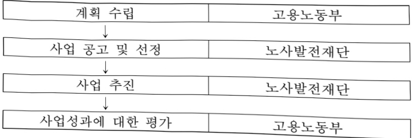
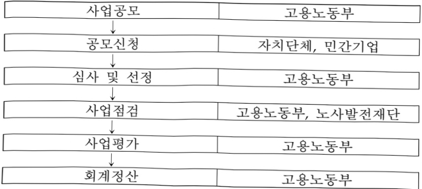
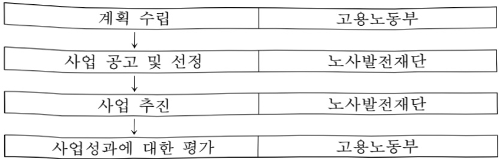
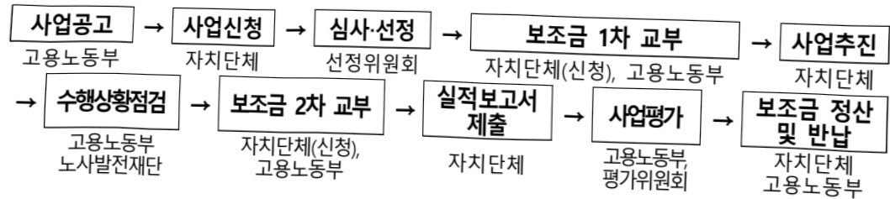
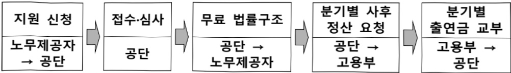
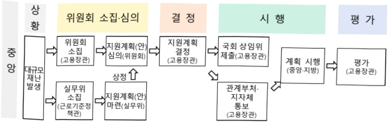
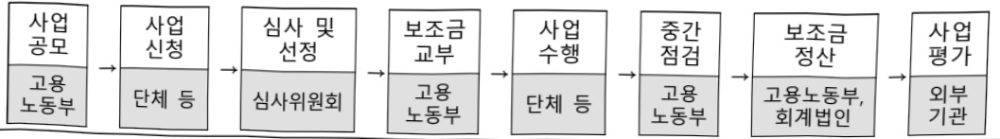

# 취약노동자지원

**해당 페이지**: PDF 247 ~ 259 쪽 해당

**부처**: 고용노동부
**분야**: 보건·복지·고용
**회계유형**: 일반회계
**2026 확정예산**: 25345.0 백만원
**전년대비 증감률**: None%
**AI 도메인**: 기타

---

<table border=1 style='margin: auto; word-wrap: break-word;'><tr><td rowspan="2"></td><td style='text-align: center; word-wrap: break-word;'></td><td style='text-align: center; word-wrap: break-word;'></td></tr><tr><td style='text-align: center; word-wrap: break-word;'>사업시행주체</td><td style='text-align: center; word-wrap: break-word;'></td></tr><tr><td rowspan="2">노무제공자 미수금 회수 지원</td><td style='text-align: center; word-wrap: break-word;'>소관부처</td><td style='text-align: center; word-wrap: break-word;'>실·국·과(팀) 노동정책실 노동정책관 노무제공자지원과</td></tr><tr><td style='text-align: center; word-wrap: break-word;'>사업시행주체</td><td style='text-align: center; word-wrap: break-word;'></td></tr><tr><td rowspan="2">취약노동자 일터개선 지원</td><td style='text-align: center; word-wrap: break-word;'>소관부처</td><td style='text-align: center; word-wrap: break-word;'>실·국·과(팀) 노동정책실 노동정책관 노무제공자지원과</td></tr><tr><td style='text-align: center; word-wrap: break-word;'>사업시행주체</td><td style='text-align: center; word-wrap: break-word;'></td></tr><tr><td rowspan="2">노동단체 및 노사관계 비영리법인 지원</td><td style='text-align: center; word-wrap: break-word;'>소관부처</td><td style='text-align: center; word-wrap: break-word;'>실·국·과(팀) 노동정책실 노사협력정책관 노사협력정책과</td></tr><tr><td style='text-align: center; word-wrap: break-word;'>사업시행주체</td><td style='text-align: center; word-wrap: break-word;'></td></tr><tr><td rowspan="2">취약노동자 보호</td><td style='text-align: center; word-wrap: break-word;'>소관부처</td><td style='text-align: center; word-wrap: break-word;'>실·국·과(팀) 노동정책실 노동정책관 노동행정인공 지능혁신과</td></tr><tr><td style='text-align: center; word-wrap: break-word;'>사업시행주체</td><td style='text-align: center; word-wrap: break-word;'></td></tr><tr><td rowspan="2">취약노동자 보호</td><td style='text-align: center; word-wrap: break-word;'>소관부처</td><td style='text-align: center; word-wrap: break-word;'>실·국·과(팀) 노동정책실 노동정책관 노동정책총괄과</td></tr><tr><td style='text-align: center; word-wrap: break-word;'>사업시행주체</td><td style='text-align: center; word-wrap: break-word;'></td></tr><tr><td rowspan="2">취약노동자 보호</td><td style='text-align: center; word-wrap: break-word;'>소관부처</td><td style='text-align: center; word-wrap: break-word;'>실·국·과(팀) 노동정책실 노사협력정책관 노사협력정책과</td></tr><tr><td style='text-align: center; word-wrap: break-word;'>사업시행주체</td><td style='text-align: center; word-wrap: break-word;'></td></tr><tr><td rowspan="2">취약노동자 보호</td><td style='text-align: center; word-wrap: break-word;'>소관부처</td><td style='text-align: center; word-wrap: break-word;'>실·국·과(팀) 노동정책실 근로기준정책관 고용차별개선과</td></tr><tr><td style='text-align: center; word-wrap: break-word;'>사업시행주체</td><td style='text-align: center; word-wrap: break-word;'></td></tr><tr><td rowspan="2">취약노동자 보호</td><td style='text-align: center; word-wrap: break-word;'>소관부처</td><td style='text-align: center; word-wrap: break-word;'>실·국·과(팀) 노동정책실 근로기준정책관 근로기준정책과</td></tr><tr><td style='text-align: center; word-wrap: break-word;'>사업시행주체</td><td style='text-align: center; word-wrap: break-word;'></td></tr></table>

---

### 가. 예산 총괄표

(단위: 백만원, %)

<table border=1 style='margin: auto; word-wrap: break-word;'><tr><td rowspan="2">사업명</td><td rowspan="2">2024년 결산</td><td colspan="2">2025년 예산</td><td colspan="2">2026년 예산</td><td rowspan="2">증감 (B-A)</td><td rowspan="2">(B-A)/A</td></tr><tr><td style='text-align: center; word-wrap: break-word;'>본예산(A)</td><td style='text-align: center; word-wrap: break-word;'>추경</td><td style='text-align: center; word-wrap: break-word;'>정부안</td><td style='text-align: center; word-wrap: break-word;'>확정(B)</td></tr><tr><td style='text-align: center; word-wrap: break-word;'>취약노동자지원</td><td style='text-align: center; word-wrap: break-word;'>-</td><td style='text-align: center; word-wrap: break-word;'>15,989</td><td style='text-align: center; word-wrap: break-word;'>15,989</td><td style='text-align: center; word-wrap: break-word;'>14,795</td><td style='text-align: center; word-wrap: break-word;'>25,345</td><td style='text-align: center; word-wrap: break-word;'>9,356</td><td style='text-align: center; word-wrap: break-word;'>58.5%</td></tr></table>

□ 기능별(내역사업별) 예산 내역

(단위:백만원)

<table border=1 style='margin: auto; word-wrap: break-word;'><tr><td rowspan="2"></td><td colspan="5">2024</td><td colspan="5">2025(2025.12월말)</td><td rowspan="2">2026예산</td></tr><tr><td style='text-align: center; word-wrap: break-word;'>예산액(추정)</td><td style='text-align: center; word-wrap: break-word;'>예산현액</td><td style='text-align: center; word-wrap: break-word;'>집행액</td><td style='text-align: center; word-wrap: break-word;'>이월액</td><td style='text-align: center; word-wrap: break-word;'>불용액</td><td style='text-align: center; word-wrap: break-word;'>본예산</td><td style='text-align: center; word-wrap: break-word;'>예산현액</td><td style='text-align: center; word-wrap: break-word;'>집행액</td><td style='text-align: center; word-wrap: break-word;'>이월액</td><td style='text-align: center; word-wrap: break-word;'>불용액</td></tr><tr><td style='text-align: center; word-wrap: break-word;'>○ 기능별 분류(합계)</td><td style='text-align: center; word-wrap: break-word;'>-</td><td style='text-align: center; word-wrap: break-word;'>-</td><td style='text-align: center; word-wrap: break-word;'>-</td><td style='text-align: center; word-wrap: break-word;'>-</td><td style='text-align: center; word-wrap: break-word;'>-</td><td style='text-align: center; word-wrap: break-word;'>15,989</td><td style='text-align: center; word-wrap: break-word;'>15,989</td><td style='text-align: center; word-wrap: break-word;'>13,431</td><td style='text-align: center; word-wrap: break-word;'>6</td><td style='text-align: center; word-wrap: break-word;'>2,550</td><td style='text-align: center; word-wrap: break-word;'>25,345</td></tr><tr><td style='text-align: center; word-wrap: break-word;'>• 취약노동자참여·소통 활성화 지원</td><td style='text-align: center; word-wrap: break-word;'>-</td><td style='text-align: center; word-wrap: break-word;'>-</td><td style='text-align: center; word-wrap: break-word;'>-</td><td style='text-align: center; word-wrap: break-word;'>-</td><td style='text-align: center; word-wrap: break-word;'>-</td><td style='text-align: center; word-wrap: break-word;'>4,446</td><td style='text-align: center; word-wrap: break-word;'>4,446</td><td style='text-align: center; word-wrap: break-word;'>4,446</td><td style='text-align: center; word-wrap: break-word;'>-</td><td style='text-align: center; word-wrap: break-word;'>-</td><td style='text-align: center; word-wrap: break-word;'>2,248</td></tr><tr><td style='text-align: center; word-wrap: break-word;'>• 현장밀착형취약노동자 권의 보호</td><td style='text-align: center; word-wrap: break-word;'>-</td><td style='text-align: center; word-wrap: break-word;'>-</td><td style='text-align: center; word-wrap: break-word;'>-</td><td style='text-align: center; word-wrap: break-word;'>-</td><td style='text-align: center; word-wrap: break-word;'>-</td><td style='text-align: center; word-wrap: break-word;'>-</td><td style='text-align: center; word-wrap: break-word;'>-</td><td style='text-align: center; word-wrap: break-word;'>-</td><td style='text-align: center; word-wrap: break-word;'>-</td><td style='text-align: center; word-wrap: break-word;'>-</td><td style='text-align: center; word-wrap: break-word;'>1,325</td></tr><tr><td style='text-align: center; word-wrap: break-word;'>• 노무제공자 미수금회수 지원</td><td style='text-align: center; word-wrap: break-word;'>-</td><td style='text-align: center; word-wrap: break-word;'>-</td><td style='text-align: center; word-wrap: break-word;'>-</td><td style='text-align: center; word-wrap: break-word;'>-</td><td style='text-align: center; word-wrap: break-word;'>-</td><td style='text-align: center; word-wrap: break-word;'>-</td><td style='text-align: center; word-wrap: break-word;'>-</td><td style='text-align: center; word-wrap: break-word;'>-</td><td style='text-align: center; word-wrap: break-word;'>-</td><td style='text-align: center; word-wrap: break-word;'>-</td><td style='text-align: center; word-wrap: break-word;'>200</td></tr><tr><td style='text-align: center; word-wrap: break-word;'>• 취약노동자일터개선 지원</td><td style='text-align: center; word-wrap: break-word;'>-</td><td style='text-align: center; word-wrap: break-word;'>-</td><td style='text-align: center; word-wrap: break-word;'>-</td><td style='text-align: center; word-wrap: break-word;'>-</td><td style='text-align: center; word-wrap: break-word;'>-</td><td style='text-align: center; word-wrap: break-word;'>2,063</td><td style='text-align: center; word-wrap: break-word;'>2,063</td><td style='text-align: center; word-wrap: break-word;'>1,879</td><td style='text-align: center; word-wrap: break-word;'>6</td><td style='text-align: center; word-wrap: break-word;'>178</td><td style='text-align: center; word-wrap: break-word;'>2,500</td></tr><tr><td style='text-align: center; word-wrap: break-word;'>• 취약노동자 상생복지지원</td><td style='text-align: center; word-wrap: break-word;'>-</td><td style='text-align: center; word-wrap: break-word;'>-</td><td style='text-align: center; word-wrap: break-word;'>-</td><td style='text-align: center; word-wrap: break-word;'>-</td><td style='text-align: center; word-wrap: break-word;'>-</td><td style='text-align: center; word-wrap: break-word;'>6,632</td><td style='text-align: center; word-wrap: break-word;'>6,632</td><td style='text-align: center; word-wrap: break-word;'>4,277</td><td style='text-align: center; word-wrap: break-word;'>-</td><td style='text-align: center; word-wrap: break-word;'>2,355</td><td style='text-align: center; word-wrap: break-word;'>-</td></tr><tr><td style='text-align: center; word-wrap: break-word;'>• 취약노동자 보호</td><td style='text-align: center; word-wrap: break-word;'>-</td><td style='text-align: center; word-wrap: break-word;'>-</td><td style='text-align: center; word-wrap: break-word;'>-</td><td style='text-align: center; word-wrap: break-word;'>-</td><td style='text-align: center; word-wrap: break-word;'>-</td><td style='text-align: center; word-wrap: break-word;'>2,848</td><td style='text-align: center; word-wrap: break-word;'>2,848</td><td style='text-align: center; word-wrap: break-word;'>2,829</td><td style='text-align: center; word-wrap: break-word;'>-</td><td style='text-align: center; word-wrap: break-word;'>17</td><td style='text-align: center; word-wrap: break-word;'>3,292</td></tr><tr><td style='text-align: center; word-wrap: break-word;'>• 노동단체 및 노사관계비영리법인 지원</td><td style='text-align: center; word-wrap: break-word;'>-</td><td style='text-align: center; word-wrap: break-word;'>-</td><td style='text-align: center; word-wrap: break-word;'>-</td><td style='text-align: center; word-wrap: break-word;'>-</td><td style='text-align: center; word-wrap: break-word;'>-</td><td style='text-align: center; word-wrap: break-word;'>-</td><td style='text-align: center; word-wrap: break-word;'>-</td><td style='text-align: center; word-wrap: break-word;'>-</td><td style='text-align: center; word-wrap: break-word;'>-</td><td style='text-align: center; word-wrap: break-word;'>-</td><td style='text-align: center; word-wrap: break-word;'>15,780</td></tr></table>

### 나. 사업설명자료

## 1 ) 사업목적·내용

☐ 특고, 플랫폼, 프리랜서 등 현행 노동관계법의 충분한 보호를 받지 못하는 권리 밖 노동자의 권익 보호를 위한 사업 추진

- (취약노동자 참여·소통 활성화 지원) 이음센터, 타운홀 미팅을 통해 권리 밖 노동자의 권익 보호를 위한 상담·교육, 현장소통, 정책의제 발굴 등 다양한 프로그램 지원

(근로자 이음센터 운영) 전통적 노동자를 대상으로 서비스를 제공하는 지방노동관서와 달리 특고·플랫폼·프리랜서 등에 대한 특화된 고충 해결 및 교육, 고용 노동정책 연계를 수행, '26년부터는 민간 노동센터 역량 강화 및 네트워크 형성 병행

---

(취약노동자 타운홀 미팅) 특고·플랫폼·프리랜서 등 취약노동자가 직접 참여하는 지역·직종별 타운홀 미팅을 개최하여 현장의 니즈를 정책에 반영하는 프로그램

- (현장밀착형 취약노동자 권의 보호) 노동권의 상담·교육에 대한 전문성과 접근성을 갖춘 현장 밀착형 지원기구로 권리 밖 노동자의 권의 보호를 위한 최일선 기관 지원

- (노무제공자 미수금 회수 지원) 근로기준법상 근로자와 달리 보증보험 지원 등 체불 구제제도가 미흡한 특고·플랫폼 종사자, 프리랜서 등을 위해 미수금 분쟁 관련 무료 법률 구조 지원 실시 (법률구조공단 수행)

- (취약노동자 일터개선 지원) 취약노동자 권익 보호를 위해 노무제공자 등을 대상으로 쉽터 설치 및 복지 물품·서비스 지원을 위한 일터개선 지원사업 운영

## - (취약노동자 보호)

(AI 기반 영세사업장 노동법 준수 자율점검) 사업주·인사담당자가 웹사이트 상에서 AI와 대화를 통해 근로계약서, 임금명세서 작성·교부 의무, 최저임금 등 기초 노동질서를 지키고 있는지 스스로 점검할 수 있는 AI 서비스 개발·실증·시범운영

(영세사업장 인사노무관리체계 구축지원) 규모가 영세하여 노동법 준수율이 낮은 소규모 사업장이 HR 플랫폼을 이용하여 인사 관리 역량을 갖추도록 지원하여 취약노동자 보호 강화

(취약노동자 교육 및 법률구조상담 지원) 취약노동자 교육·상담·법률구조지원

사업을 추진하고자 하는 지방자치단체 등에 소요되는 사업 비용 일부 지원

(비정규직 근로조건 보호 지원) 비정규직 근로자의 근로조건 개선과 차별 해소를 위하여 비정규직에 대한 차별시정, 파견법 준수 등 지도·점검, 정책연구 등 실시

(필수업무종사자 보호·지원) 필수업무 지정 및 종사자 보호·지원에 관한 법률

제정·시행(21년)에 따라 지원계획 수립, 실태조사 및 평가 등 국가의 책무 이행

- (노동단체 및 노사관계 비영리법인 지원) 협력적 노사관계 구축 및 취약노동자 권익 보호 등을 위해 노동단체, 노사관계 비영리법인이 수행하는 정책개발, 교육·상담 등 다양한 사업 비용 일부 지원

## 2 ) 사업개요

## ☐ 사업근거 및 추진경위

① 법령상 근거 및 조항 적시

## ○ 취약노동자 참여·소통 활성화 지원

-「노사관계 발전 지원에 관한 범률」제2조(국가의 책무) 국가는 노사의 자치가 강화되고 노사협력적 관계가 정착·발전될 수 있도록 다음 각호의 노사관계 발전을 위한 시책을 수립·시행하여야 한다.

1. 노사관계 발전 종합대책 수립에 관한 사항,

2. 노사정 협력 활성화 지원에 관한 사항,

3. 노사관계 발전을 위한 조사·연구 및 교육·컨설팅에 관한 사항,

---

4. 사업장의 고용·임금체계 개선 등 작업장 혁신 지원에 관한 사항,

5. 노동단체 및 노사관계 비영리법인 지원에 관한 사항,

6. 노사협력 우수기관·단체 또는 유공자 포상 등 노사협력 증진을 위한 프로그램 지원에 관한 사항,

7. 노사관계 선진화를 위한 홍보·캠페인에 관한 사항,

8. 그 밖의 노사관계 발전 지원에 관한 사항

- 「노사관계 발전 지원에 관한 법률」 제3조(지방자치단체의 책무 등) ① 지방자치단체는 제2조 각 호에 따른 국가의 시책에 적극 협조하고, 해당 지방자치단체 관할 지역의 근로자, 사용자 및 주민과 지방자치단체 간 협력 활성화를 위하여 노력하여야 한다.

② 국가는 지역 노사민정 간 협력증진을 위하여 필요한 사항을 지원할 수 있다.

③ 국가는 지방자치단체별로 지역 노사민정 간 협력 활성화 및 상생의 노사관계 구축 등 성과를 평가하여 우수 지방자치단체에 대하여 표창수여, 포상금 지급 등의 우대조치를 할 수 있다.

④ 지역 노사민정 협력증진을 위한 국가와 지방자치단체의 지원 등에 필요한 사항은 대통령령으로 정한다.

- 「노사관계 발전 지원에 관한 법률」제9조(노사관계발전 사업의 촉진) 국가는 예산의 범위에서 제2조 각 호의 사업을 노동단체 및 노사관계 비영리법인에 위탁·보조할 수 있다.

## ○ 노무제공자 미수금 회수 지원

-「법률구조법」제4조, 제21조, 제24조(공단의 재원)

## ○ 취약노동자 보호(비정규직 근로조건 보호 지원)

- 「기간제 및 단시간근로자 보호 등에 관한 법률」 제1조(목적) 이 법은 기간제근로자 및 단시간근로자에 대한 불합리한 차별을 시정하고 기간제근로자 및 단시간근로자의 근로조건 보호를 강화함으로써 노동시장의 건전한 발전에 이바지함을 목적으로 하다.

- 「과견근로자 보호 등에 관한 법률」 제1조(목적) 이 법은 근로자과견사업의 적정한 운영을 기하고 과견근로자의 근로조건 등에 관한 기준을 확립함으로써 과견근로자의 고용안정과 복지증진에 이바지하고 인력수급을 원활하게 함을 목적으로 한다.

-「과견근로자 보호 등에 관한 법률」제36조(지도·조언등) 고용노동부장관은 이 법의 시행을 위하여 필요하다고 인정할 때에는 과견사업주 및 사용사업주에 대하여 근로자과견사업의 적정한 운영 또는 적정한 과견근로를 확보하는데 필요한 지도 및 조언을 할 수 있다.

## ○ 취약노동자 보호(필수업무 종사자 보호 지원)

-「필수업무 지정 및 종사자 보호 · 지원에 관한 법률」제12조(실태조사 및 평가) ①

---

고용노동부장관은 지원계획에 반영하기 위하여 대통령령으로 정하는 바에 따라 재난상황에 따른 필수업무의 현황, 필수업무 종사자의 근무환경 및 처우수준 등을 파악하기 위한 실태조사를 실시하여야 한다.

## ○ 노동단체 및 노사관계 비영리법인 지원

-「노사관계 발전 지원에 관한 법률」제2조(국가의 책무) 국가는 노사의 자치가 강화되고 노사협력적 관계가 정착·발전될 수 있도록 다음 각호의 노사관계 발전을 위한 시책을 수립·시행하여야 한다.

1. 노사관계 발전 종합대책 수립에 관한 사항

2. 노사정 협력 활성화 지원에 관한 사항

3. 노사관계 발전을 위한 조사·연구 및 교육·컨설팅에 관한 사항

4. 사업장의 고용·임금체계 개선 등 작업장 혁신 지원에 관한 사항

5. 노동단체 및 노사관계 비영리법인 지원에 관한 사항

6. 노사협력 우수기관·단체 또는 유공자 포상 등 노사협력 증진을 위한 프로그램 지원에 관한 사항

7. 노사관계 선진화를 위한 홍보·캠페인에 관한 사항

8. 그 밖의 노사관계 발전 지원에 관한 사항

-「노사관계 발전 지원에 관한 법률 제9조(노사관계발전 사업의 촉진) 국가는 예산의 범위에서 제2조 각 호의 사업을 노동단체 및 노사관계 비영리법인에 위탁·보조할 수 있다.

② 추진경위 - 사업 시작년도, 추진배경, 부처별 중점과제, 대통령 공약사항 등

## ○ 취약노동자 참여·소통 활성화 지원

'24. "상생협력 확산지원" 세부사업 내의 내역사업으로 신규 편성

(내역사업명: 취약근로자 참여 커뮤니티 구축 및 활성화 지원)

## ○ 노동단체 및 노사관계 비영리법인 지원

'02.~05. 한국노총('76년~)에 노조간부교육, 상담, 정책개발, 국제교류활동 등에 소요되는 비용의 일부 지원, 민주노총에 건물임차료를 일부 지원

'06. 공모·심사를 통해 지원 대상 선정 및 사업비 중심 지원

·'24. 보조금 개편에 따라 사업 폐지

26.협력적 노사관계 구축 및 취약노동자 권익보호 등을 위해 사업 복원

## ○ 취약노동자 보호(비정규직 근로조건 보호 지원)

'01.7. 노사정위원회 비정규직 근로자 대책 특별위원회 구성, 비정규직 관련 논의

'07.6. 비정규직보호법를 하위법령 공포, '07.7.1 비정규직보호법 시행

'09. 노사정위 비정규직 대책위원회 [비정규직 입법 효과 평가체계 구축 관련 합의문] 채택

· '11.9. 차별 해소, 사회안전망 확충 등 「비정규직 종합대책」 발표

---

'12. 고용노동부장관 시정요구권 도입, 차별시정 신청기간 연장(3→6개월), 불법과견' 즉시 고용의무 발생 법개정(활 볼볼과견 2년 초과 시 고용의무)

·'14.9. 확정된 차별시정명령의 효력 확대 등 법개정

17.10. 비정규직 감축 및 차별해소를 위해 비정규직 로드맵 발표

· '17.12. 비정규직 TF 운영

20.1. 민간 자율적 고용구조 개선 활성화 위한 고용구조개선 지원단 운영

20.11. 기간제근로자 고용안정 및 근로조건 보호 가이드라인 개정안 발표

23.12. '기간제·단시간·파견근로자 차별 예방 및 자율 개선 가이드라인' 제정

## ○ 취약노동자 보호(필수업무 종사자 보호 지원)

21.05.18. 필수업무 지정 및 종사자 보호·지원에 관한 법률 제정

'21.11.19. 필수업무 지정 및 종사자 보호·지원에 관한 법률 시행령 제정·시행

22.1. 필수업무 지정 및 종사자 지원위원회 구성

· '22.7. 산불재난에 대한 필수업무 종사자 지원계획 수립

'22.~'23. 「필수업무 업무매뉴얼」 제작·배포

## □ 주요내용

① 사업규모 : 해당없음

② 사업추진체계

- 사업시행방법 : 직접수행, 보조 등

- 사업시행주체 : 고용노동부 등

-사업 수혜자 : 취약노동자

- 보조, 융자, 출연, 출자 등의 경우 보조·융자 등 지원 비율 및 법적근거

---

<table border=1 style='margin: auto; word-wrap: break-word;'><tr><td style='text-align: center; word-wrap: break-word;'>내역사업명</td><td style='text-align: center; word-wrap: break-word;'>구분</td><td style='text-align: center; word-wrap: break-word;'>피보조·피출연 등 기관명</td><td style='text-align: center; word-wrap: break-word;'>지원 금액 (2026예산)</td><td style='text-align: center; word-wrap: break-word;'>지원 비율(%)</td><td style='text-align: center; word-wrap: break-word;'>보조율 법적근거 (해당 조항)</td></tr><tr><td rowspan="2">취약노동자 일터개선 지원</td><td style='text-align: center; word-wrap: break-word;'>보조</td><td style='text-align: center; word-wrap: break-word;'>지자체</td><td style='text-align: center; word-wrap: break-word;'>1,521백만원</td><td style='text-align: center; word-wrap: break-word;'>70%</td><td style='text-align: center; word-wrap: break-word;'>보조금 관리에 관한 법률 제9조 제1항</td></tr><tr><td style='text-align: center; word-wrap: break-word;'>보조</td><td style='text-align: center; word-wrap: break-word;'>기업 등</td><td style='text-align: center; word-wrap: break-word;'>374백만원</td><td style='text-align: center; word-wrap: break-word;'>50%</td><td style='text-align: center; word-wrap: break-word;'>보조금 관리에 관한 법률 제9조 제1항</td></tr><tr><td style='text-align: center; word-wrap: break-word;'>노무제공자 미수금 회수 지원</td><td style='text-align: center; word-wrap: break-word;'>출연</td><td style='text-align: center; word-wrap: break-word;'>대한법률 구조공단</td><td style='text-align: center; word-wrap: break-word;'>200백만원</td><td style='text-align: center; word-wrap: break-word;'>100%</td><td style='text-align: center; word-wrap: break-word;'>법률구조법 제4조, 제21조, 제24조</td></tr><tr><td rowspan="4">노동단체 및 비영리 법인 지원</td><td style='text-align: center; word-wrap: break-word;'>보조</td><td style='text-align: center; word-wrap: break-word;'>노동단체</td><td style='text-align: center; word-wrap: break-word;'>3,680백만원</td><td style='text-align: center; word-wrap: break-word;'>85%</td><td style='text-align: center; word-wrap: break-word;'>보조금 관리에 관한 법률 제9조 제1항</td></tr><tr><td style='text-align: center; word-wrap: break-word;'>보조</td><td style='text-align: center; word-wrap: break-word;'>비영리법인</td><td style='text-align: center; word-wrap: break-word;'>1,800백만원</td><td style='text-align: center; word-wrap: break-word;'>85%</td><td style='text-align: center; word-wrap: break-word;'>보조금 관리에 관한 법률 제9조 제1항</td></tr><tr><td style='text-align: center; word-wrap: break-word;'>보조</td><td style='text-align: center; word-wrap: break-word;'>한국노총</td><td style='text-align: center; word-wrap: break-word;'>5,100백만원</td><td style='text-align: center; word-wrap: break-word;'>100%</td><td style='text-align: center; word-wrap: break-word;'>보조금 관리에 관한 법률 제9조 제1항</td></tr><tr><td style='text-align: center; word-wrap: break-word;'>보조</td><td style='text-align: center; word-wrap: break-word;'>민주노총</td><td style='text-align: center; word-wrap: break-word;'>5,100백만원</td><td style='text-align: center; word-wrap: break-word;'>100%</td><td style='text-align: center; word-wrap: break-word;'>보조금 관리에 관한 법률 제9조 제1항</td></tr><tr><td rowspan="2">취약노동자 보호</td><td style='text-align: center; word-wrap: break-word;'>보조</td><td style='text-align: center; word-wrap: break-word;'>기업</td><td style='text-align: center; word-wrap: break-word;'>900백만원</td><td style='text-align: center; word-wrap: break-word;'>100%</td><td style='text-align: center; word-wrap: break-word;'>보조금 관리에 관한 법률 제9조 제1항</td></tr><tr><td style='text-align: center; word-wrap: break-word;'>보조</td><td style='text-align: center; word-wrap: break-word;'>지자체</td><td style='text-align: center; word-wrap: break-word;'>1,060백만원</td><td style='text-align: center; word-wrap: break-word;'>70%~90%</td><td style='text-align: center; word-wrap: break-word;'>보조금 관리에 관한 법률 제9조 제1항</td></tr></table>

## 3 ) 2026년도 예산 산출 근거

① 취약노동자 참여·소통 활성화 지원 : (2025) 4,446백만원 → (2026) 2,248백만원, △2,198백만원

- (요구) 전통적 노동자를 대상으로 서비스를 제공하는 지방노동관서와 달리 특고·플랫폼·프리랜서 등에 대한 특화된 고충 해결 및 교육, 고용노동정책 연계를 수행하는 근로자 이음센터 운영 비용, 취약노동자들의 소통·의견수렴을 위한 타운홀미팅 운영 비용 등 요구

- (산출) ① 근로자 이음센터 운영 1,950백만원

② 취약노동자 타운홀 미팅 운영 298백만원

② 현장밀착형 취약노동자 권익 보호 : (2026 예산) 1,325백만원, 순증

- (요구) 전통적 근로관계가 아닌 권리 밖 노동자의 권익 보호를 위하여, 노동법 상담, 분쟁 예방부터 권리 구제 및 각종 정부 정책 연계까지 원스톱 서비스를 제공할 민간 노동센터 지원 비용 등 요구

- (산출) 민간 노동센터 활성화 지원 1,325백만원

③ 노무제공자 미수금 회수 지원 : (2026 예산) 200백만원, 순증

- (요구) 특고·플랫폼 종사자, 프리랜서 등 노무제공자 보수 미지급 등 법적 권리구제의 사각지대를 해소하기 위한 미수금 회수 법률구조 비용 요구

- (산출) 출연금 200백만원

④ 취약노동자 일터개선 지원 : (2025) 2,063백만원 → (2026) 2,500백만원, +437백만원

- (요구) 취약노동자 권익 보호를 위해 노무제공자 등을 대상으로 쉼터 설치 및 복지 물품·서비스 지원을 위한 일터개선 지원사업 운영, 노무제공자 등 취약노동자 국내외 실태조사·연구 및 전문가 자문 강화

- (산출) ① 취약노동자 일터개선 사업 보조 1,925백만원

② 취약노동자 실태조사·연구 550백만원

③ 취약노동자 전문가 자문회의 25백만원

---

⑤ 취약노동자 보호 : (2025) 2,848백만원 → (2026) 3,292백만원, +444백만원

- (요구) AI 기반 영세사업장 노동법 준수 자율점검, 취약노동자 보호를 위한 영세사업장 인사노무관리체계 구축 지원, 취약노동자 교육 및 법률구조상담 지원, 비정규직 근로조건 보호 지원 및 필수업무종사자 보호 지원

- (산출)

① AI 기반 영세사업장 노동법 준수 자율점 844백만원

: AI 이용료(148백만원) + GPU 등 임차료(360백만원) + 전문작업비(236백만원) + 기타경비(100백만원)

②영세사업장 인사노무관리체계 구축지원 930백만원

: HR 플랫폼 이용 지원금 900백만원(500개소×1개소 최대 이용료 180만원), 운영비 30백만원

③ 취약노동자 교육 및 법률구조상담 지원 1,100백만

: 지자체경상보조 1,060백만원, 운영지원 용역비 40백만원

④ 비정규직 근로조건 보호지원 378백만원

: 비정규직 근로감독 활동(지방관서) 등 운영경비 378백만원

⑤ 필수업무종사자 보호·지원 40백만원

: 필수업무 종사자 실태조사 40백만원

⑤ 노동단체 및 노사관계 비영리법인 지원 : (2026 예산) 15,780백만원, 순증

- (요구) 협력적 노사관계 구축 및 취약노동자 권익보호 등을 위해 노동단체, 노사관계 비영리법인이 수행하는 정책개발, 교육·상담 등 다양한 사업 비용 일부 지원

- (산출)

① 노동단체 지원 3,730백만원

민간경상보조 3,680백만원(92백만원×40개소), 일반용역비 50백만원

② 노사관계 비영리법인 지원 1,850백만원

민간경상보조 1,800백만원(60백만원×30개소), 일반용역비 50백만원

③ 한국노총 중앙근로자복지센터 시설개선 지원 민간자본보조 5,100백만원

④민주노총 임차보증금 지원 민간자본보조 5,100백만원

2025년도 예산 및 2026년도 예산 산출 세부내역 비교

<table border=1 style='margin: auto; word-wrap: break-word;'><tr><td rowspan="2">예산</td><td colspan="2">2025년 예산</td><td colspan="2">2026년 예산</td><td style='text-align: center; word-wrap: break-word;'></td></tr><tr><td colspan="2">산출내역</td><td style='text-align: center; word-wrap: break-word;'>예산</td><td style='text-align: center; word-wrap: break-word;'>산출내역</td><td style='text-align: center; word-wrap: break-word;'></td></tr><tr><td style='text-align: center; word-wrap: break-word;'>15,989</td><td style='text-align: center; word-wrap: break-word;'>○ 노동약자 참여·소통 활성화 지원 : 4,446백만원 - 근로자 이음센터 인력·시설 운영비 1,556백만원(10개소) - 이음센터 악 분정조정협의회 신설 235백만원 - 조정위원 수당 및 운영비 85백만원(100회) - 화해 성공수당 150백만원(50회) - 이음센터 악 특화프로그램 신설 2,277백만원 - 노무제공자 케어 프로그램 305백만원(10회×10개소) - 일반근로자 특화 프로그램 160백만원(40회×10개소) - 참여형 프로그램 112백만원(40회×7개소) - 스텝업 프로그램 500백만원(350명) - 노동약자 유관단체 협업 교육상담 프로그램 1,200백만원(교육상담 10,000건, 법률구조지원 400건) - 이음센터 홍보비 80백만원 - 노동약자 타운홀 미팅 298백만원(4회) - 노동약자 일터개선 지원 : 2,063백만원 - 노동약자 일터개선 사업 보조 1,838백만원 - 지자체경상보조 1,189백만원(35개소) - 민간경상보조 649백만원(10개소) - 노동약자 실태조사·연구 200백만원 - 노동약자 전문가 자문기구 25백만원 - 위원회 수당 24백만원(20만×10인×12회) - 운영비 1백만원</td><td style='text-align: center; word-wrap: break-word;'>14,795</td><td style='text-align: center; word-wrap: break-word;'>○ 취약노동자 참여·소통 활성화 지원 : 2,248백만원 - 근로자 이음센터 인력·시설 운영비 1,550백만원(10개소) - 노무제공자 특화 교육프로그램 운영 320백만원(50회×10개소) - 근로자 이음센터 홍보비 80백만원 - 취약노동자 타운홀 미팅 298백만원(4회) - 현장밀착형 취약노동자 권익 보호 : 1,325백만원 - 민간 노동센터 활성화 지원 1,325백만원 - 민간 노동센터 상담사 교육 75백만원(2.5백만원×30개소) - 노동센터 간 네트워크 구축 1,050백만원(35백만원×30개소) - 운영비 200백만원</td><td style='text-align: center; word-wrap: break-word;'>○ 노무제공자 미수금 회수 지원 : 200백만원 - 출연금 200백만원(40만원×500건) - 취약노동자 일터개선 지원 : 2,500백만원 - 취약노동자 일터개선 사업 보조 1,925백만원 - 지자체경상보조 1,521백만원(30개소) - 민간경상보조 374백만원(6개소) - 현장소통·점검 등 용역비 30백만원 - 취약노동자 실태조사·연구 550백만원 - 취약노동자 전문가 자문기구 25백만원 - 위원회 수당 24백만원(20만×10인×12회) - 운영비 1백만원</td><td style='text-align: center; word-wrap: break-word;'>○ 노무제공자 미수금 회수 지원 : 2,063백만원 - 출연금 200백만원(40만원×500건) - 민간경상보조 649백만원(10개소) - 민간경상보조 374백만원(6개소) - 현장소통·점검 등 용역비 30백만원 - 취약노동자 실태조사·연구 550백만원 - 위원회 수당 24백만원(20만×10인×12회) - 운영비 1백만원</td></tr></table>

---

<table border=1 style='margin: auto; word-wrap: break-word;'><tr><td rowspan="2">예산</td><td colspan="2">2025년 예산</td><td colspan="2">2026년 예산</td></tr><tr><td style='text-align: center; word-wrap: break-word;'>산출내역</td><td style='text-align: center; word-wrap: break-word;'>예산</td><td colspan="2">산출내역</td></tr><tr><td style='text-align: center; word-wrap: break-word;'></td><td style='text-align: center; word-wrap: break-word;'>○ 노동약자 상생 복지지원: 6,632백만원- 업종별 상생 복지지원 보조금 6,532백만원(4개 업종)- 운영비 1백만원○ 불법·부당 노동관행 등 개선 지원: 2,848백만원- 영세사업장 HR 플랫폼 이용 지원 930백만원- 영세사업장 HR 플랫폼 이용 지원금 900백만원(500개소)- 운영비 30백만원- 노동약자 교육 및 법률구조상담 지원 1,500백만원- 지자체경상보조 1,460백만원(20개소)- 운영지원 용역비 40백만원- 비정규직 근로조건 보호지원 378백만원- 비정규직 근로감독 활동(지방관서) 등 운영경비 378백만원- 필수업무종사자 보호·지원 40백만원</td><td style='text-align: center; word-wrap: break-word;'>예산</td><td style='text-align: center; word-wrap: break-word;'>○ 취약노동자 보호: 3,292백만원- AI 기반 영세사업장 노동법 준수 자율점검 844백만원· AI 이용료 148백만원· GPU 등 임자료 360백만원· 전문작업비 236백만원· 기타경비 100백만원- 영세사업장 인사노무관리체계 구축 지원 930백만원· 영세사업장 HR 플랫폼 이용 지원금 900백만원(500개소)- 운영비 30백만원- 취약노동자 교육 및 법률구조상담 지원 1,100백만원· 지자체경상보조 1,060백만원(15개소)- 운영지원 용역비 40백만원- 비정규직 근로조건 보호지원 378백만원- 필수업무종사자 보호·지원 40백만원- 필수업무종사자 보호·지원 3,680백만원(40개소)- 노동단체 경상보조 1,800백만원(30개소)- 운영지원 용역비 100백만원- 한국노총 중앙근로자복지센터 시설개선 지원 5,100백만원- 민주노총 임자보증금 지원 5,100백만원</td><td style='text-align: center; word-wrap: break-word;'></td></tr></table>

## 4 ) 사업효과

☐ 사업영향, 산출물 성과지표 등

① 2022~2026년도 성과계획서 상 성과지표 및 최근 5년간 성과 달성도

<table border=1 style='margin: auto; word-wrap: break-word;'><tr><td style='text-align: center; word-wrap: break-word;'>성과지표</td><td style='text-align: center; word-wrap: break-word;'>구분</td><td style='text-align: center; word-wrap: break-word;'>2022</td><td style='text-align: center; word-wrap: break-word;'>2023</td><td style='text-align: center; word-wrap: break-word;'>2024</td><td style='text-align: center; word-wrap: break-word;'>2025</td><td style='text-align: center; word-wrap: break-word;'>2026</td><td style='text-align: center; word-wrap: break-word;'>2026 목표치산출근거</td><td style='text-align: center; word-wrap: break-word;'>측정산시(또는 측정방법)</td><td style='text-align: center; word-wrap: break-word;'>자료수집방법(또는 자료출처)</td></tr><tr><td rowspan="3">일터혁신실태조사(점)</td><td style='text-align: center; word-wrap: break-word;'>목표</td><td style='text-align: center; word-wrap: break-word;'>-</td><td style='text-align: center; word-wrap: break-word;'>-</td><td style='text-align: center; word-wrap: break-word;'>55.5</td><td style='text-align: center; word-wrap: break-word;'>55.6</td><td style='text-align: center; word-wrap: break-word;'>55.7</td><td rowspan="3">&#x27;25년 목표(55.6)대비 0.1점상향 설정</td><td rowspan="3">설문조사를 통해 관련 항목을 점수로 하여 100점만점으로 환산</td><td rowspan="3">외부 전문 연구기관</td></tr><tr><td style='text-align: center; word-wrap: break-word;'>실적</td><td style='text-align: center; word-wrap: break-word;'>-</td><td style='text-align: center; word-wrap: break-word;'>-</td><td style='text-align: center; word-wrap: break-word;'>55.9</td><td style='text-align: center; word-wrap: break-word;'>54.5</td><td style='text-align: center; word-wrap: break-word;'>-</td></tr><tr><td style='text-align: center; word-wrap: break-word;'>달성도</td><td style='text-align: center; word-wrap: break-word;'>-</td><td style='text-align: center; word-wrap: break-word;'>-</td><td style='text-align: center; word-wrap: break-word;'>100.7</td><td style='text-align: center; word-wrap: break-word;'>98.0</td><td style='text-align: center; word-wrap: break-word;'>-</td></tr></table>

---

② 성과지표 이외의 연도별 사업추진 경과 및 실적

<table border=1 style='margin: auto; word-wrap: break-word;'><tr><td style='text-align: center; word-wrap: break-word;'>2022</td><td style='text-align: center; word-wrap: break-word;'>- 과견·사내하도급 사업장 근로감독을 통한 비정규직 제도의 적정 운영 지도 - 비정규직 중가 업종 중심 기간제 쪼개기·차별 감독 규모 확대* 추진 * (&#x27;21년) 430개소 → (&#x27;22년) 1,150개소</td></tr><tr><td style='text-align: center; word-wrap: break-word;'>2023</td><td style='text-align: center; word-wrap: break-word;'>- 과견·사내하도급 사업장 근로감독을 통한 비정규직 근로자 보호 제도의 적정 운영 지도(465개소 감독 실시) - 기간제 등 비정규직 불합리한 차별 해소를 위한 차별 감독 705개소 실시</td></tr><tr><td style='text-align: center; word-wrap: break-word;'>2024</td><td style='text-align: center; word-wrap: break-word;'>- 기간제 등 비정규직 불합리한 차별 해소를 위한 릴레이 차별 감독 실시 * ①저축은행 등, ②확정된 차별 시정명령 사업장 등, ③식품제조업, ④차별 의명신고 사업장 - 산단지역 내 제조업체 등 비정규직 사용 사업장 과견법 준수 감독 실시 - 비정규직 차별 의명신고센터 운영(7월)</td></tr><tr><td style='text-align: center; word-wrap: break-word;'>2025</td><td style='text-align: center; word-wrap: break-word;'>- 근로자 이음센터 10개소 운영 - 자치단체의 경우 수혜대상을 영세소규모사업장근로자까지 확대하여 취약 노동자 일터개선 지원사업 실시 - 기간제, 단시간, 과견 등 비정규직 근로자의 근로조건 보호를 위한 감독 (550개소 예정) 실시 - 비정규직 근로감독관 직무 능력 향상을 위한 직무교육 실시(집합, 2회)</td></tr></table>

③향후(2026년도 이후) 기대효과 :

- 권리 밖 노동자의 실질적 권익 보호 + 모든 일하는 사람의 노동권 보장에 기여

5) 타당성조사 및 예비타당성조사 시행여부 및 결과 요지 : 해당없음

6) 총사업비 대상사업 여부 및 내역 : 해당없음

## 7 ) 사업 집행절차

·근로자 이음센터

·현장밀착형 취약노동자 보호

---

· 노무제공자 미수금 회수 지원(안)

·취약노동자 일터개선 지원사업

·영세사업장 인사노무관리체계 구축지원

- 고용노동부 → HR 플랫폼 → 영세사업장

· 취약노동자 교육 및 법률구조상담 지원

·필수업무 종사자 보호·지원

---

## <재난시 필수업무 종사자 보호·지원 절차 >

· 노동단체 및 노사관계 비영리법인 지원

## 8 ) 각종 평가

1) 국회(예결위, 상임위, 예정처, 국정감사 포함) 지적

2) 대외공개 평가

3) 자체평가

### 다. 최근 4년간 결산내역 : 해당없음

---

<table border=1 style='margin: auto; word-wrap: break-word;'><tr><td style='text-align: center; word-wrap: break-word;'>사 업 명</td></tr><tr><td style='text-align: center; word-wrap: break-word;'>(339) 4대 지역외 AX 대전환 기획(4231-301)</td></tr></table>

□ 사업 코드 정보

<table border=1 style='margin: auto; word-wrap: break-word;'><tr><td style='text-align: center; word-wrap: break-word;'>구분</td><td style='text-align: center; word-wrap: break-word;'>기금</td><td style='text-align: center; word-wrap: break-word;'>소관</td><td style='text-align: center; word-wrap: break-word;'>실국(기관)</td><td style='text-align: center; word-wrap: break-word;'>계정</td><td style='text-align: center; word-wrap: break-word;'>분야</td><td style='text-align: center; word-wrap: break-word;'>부문</td></tr><tr><td style='text-align: center; word-wrap: break-word;'>코드</td><td rowspan="2">일반회계</td><td rowspan="2">과학기술정보통신부</td><td rowspan="2">소프트웨어정책관</td><td rowspan="2">-</td><td style='text-align: center; word-wrap: break-word;'>130</td><td style='text-align: center; word-wrap: break-word;'>133</td></tr><tr><td style='text-align: center; word-wrap: break-word;'>명칭</td><td style='text-align: center; word-wrap: break-word;'>통신</td><td style='text-align: center; word-wrap: break-word;'>정보통신</td></tr></table>

<table border=1 style='margin: auto; word-wrap: break-word;'><tr><td style='text-align: center; word-wrap: break-word;'>구분</td><td style='text-align: center; word-wrap: break-word;'>프로그램</td><td style='text-align: center; word-wrap: break-word;'>단위사업</td><td style='text-align: center; word-wrap: break-word;'>세부사업</td></tr><tr><td style='text-align: center; word-wrap: break-word;'>코드</td><td style='text-align: center; word-wrap: break-word;'>4200</td><td style='text-align: center; word-wrap: break-word;'>4231</td><td style='text-align: center; word-wrap: break-word;'>301</td></tr><tr><td style='text-align: center; word-wrap: break-word;'>명칭</td><td style='text-align: center; word-wrap: break-word;'>지역경제활성화</td><td style='text-align: center; word-wrap: break-word;'>광역경제권산업경쟁력강화</td><td style='text-align: center; word-wrap: break-word;'>4대 지역의 AX 대전환 기획</td></tr></table>

□ 사업 성격 (공통요구자료 Ⅱ-1 작성유의사항 4. 참조, 해당하는 사항에 “○” 표시)

<table border=1 style='margin: auto; word-wrap: break-word;'><tr><td rowspan="2">신규</td><td rowspan="2">계속</td><td rowspan="2">완료</td><td rowspan="2">예비타당성 실시여부</td><td rowspan="2">총사업비 관리대상</td><td rowspan="2">총액계상 예산사업</td><td style='text-align: center; word-wrap: break-word;'>사업소관 변경정보</td></tr><tr><td style='text-align: center; word-wrap: break-word;'>2025예산 시 소관</td></tr><tr><td style='text-align: center; word-wrap: break-word;'>O</td><td style='text-align: center; word-wrap: break-word;'></td><td style='text-align: center; word-wrap: break-word;'></td><td style='text-align: center; word-wrap: break-word;'></td><td style='text-align: center; word-wrap: break-word;'></td><td style='text-align: center; word-wrap: break-word;'></td><td style='text-align: center; word-wrap: break-word;'></td></tr></table>

사업 지원 형태 및 지원을 (최소한 한 개는 반드시 선택하시오. 해당사항에 O 표시)

<table border=1 style='margin: auto; word-wrap: break-word;'><tr><td style='text-align: center; word-wrap: break-word;'>직접</td><td style='text-align: center; word-wrap: break-word;'>출자</td><td style='text-align: center; word-wrap: break-word;'>출연</td><td style='text-align: center; word-wrap: break-word;'>보조</td><td style='text-align: center; word-wrap: break-word;'>융자</td><td style='text-align: center; word-wrap: break-word;'>국고보조율(%)</td><td style='text-align: center; word-wrap: break-word;'>융자율(%)</td></tr><tr><td style='text-align: center; word-wrap: break-word;'></td><td style='text-align: center; word-wrap: break-word;'></td><td style='text-align: center; word-wrap: break-word;'>0</td><td style='text-align: center; word-wrap: break-word;'></td><td style='text-align: center; word-wrap: break-word;'></td><td style='text-align: center; word-wrap: break-word;'></td><td style='text-align: center; word-wrap: break-word;'></td></tr></table>

## □ 사업 소관부처 및 시행주체

<table border=1 style='margin: auto; word-wrap: break-word;'><tr><td style='text-align: center; word-wrap: break-word;'>사업명</td><td colspan="2">구분</td></tr><tr><td rowspan="3">4대 지역외AX 대전환기획</td><td rowspan="2">소관부처</td><td style='text-align: center; word-wrap: break-word;'>소프트웨어정책관</td></tr><tr><td style='text-align: center; word-wrap: break-word;'>소프트웨어산업과</td></tr><tr><td style='text-align: center; word-wrap: break-word;'>사업시행주체</td><td style='text-align: center; word-wrap: break-word;'>정보통신산업진흥원</td></tr></table>

---

### 원본 PDF 크롭 이미지

