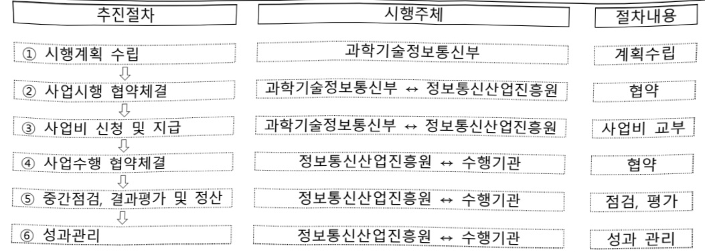

# 4대지역외 AX 대전환 기획

**해당 페이지**: PDF 260 ~ 265 쪽 해당

**부처**: 과학기술정보통신부
**분야**: 통신
**회계유형**: 일반회계
**2026 확정예산**: 2500.0 백만원
**전년대비 증감률**: None%
**AI 도메인**: 디지털전환(AX)

---

### 가.지출계획 총괄표

(단위: 백만원, %)

<table border=1 style='margin: auto; word-wrap: break-word;'><tr><td rowspan="2">사업명</td><td rowspan="2">2024년 결산</td><td colspan="2">2025년 예산</td><td colspan="2">2026년 예산</td><td rowspan="2">증감(B-A)</td><td rowspan="2">(B-A)/A</td></tr><tr><td style='text-align: center; word-wrap: break-word;'>본예산</td><td style='text-align: center; word-wrap: break-word;'>추경*(A)</td><td style='text-align: center; word-wrap: break-word;'>요구안</td><td style='text-align: center; word-wrap: break-word;'>본예산(B)</td></tr><tr><td style='text-align: center; word-wrap: break-word;'>4대 지역외AX 대전환 기획</td><td style='text-align: center; word-wrap: break-word;'>-</td><td style='text-align: center; word-wrap: break-word;'>-</td><td style='text-align: center; word-wrap: break-word;'>-</td><td style='text-align: center; word-wrap: break-word;'>2,500</td><td style='text-align: center; word-wrap: break-word;'>2,500</td><td style='text-align: center; word-wrap: break-word;'>2,500</td><td style='text-align: center; word-wrap: break-word;'>순증</td></tr></table>

* 추경: 추경증감액을 포함한 최종 예산액을 기재

## □ 기능별(내역사업별) 계획 내역

(단위:백만원)

<table border=1 style='margin: auto; word-wrap: break-word;'><tr><td rowspan="2"></td><td colspan="5">2024</td><td colspan="5">2025</td><td rowspan="2">2026 계획</td></tr><tr><td style='text-align: center; word-wrap: break-word;'>계획의(추경)</td><td style='text-align: center; word-wrap: break-word;'>계획현액</td><td style='text-align: center; word-wrap: break-word;'>집행액</td><td style='text-align: center; word-wrap: break-word;'>이월액</td><td style='text-align: center; word-wrap: break-word;'>불용액</td><td style='text-align: center; word-wrap: break-word;'>계획의(추경)</td><td style='text-align: center; word-wrap: break-word;'>계획현액</td><td style='text-align: center; word-wrap: break-word;'>집행액</td><td style='text-align: center; word-wrap: break-word;'>이월액</td><td style='text-align: center; word-wrap: break-word;'>불용액</td></tr><tr><td style='text-align: center; word-wrap: break-word;'>○ 기능별 분류(합계)</td><td style='text-align: center; word-wrap: break-word;'>-</td><td style='text-align: center; word-wrap: break-word;'>-</td><td style='text-align: center; word-wrap: break-word;'>-</td><td style='text-align: center; word-wrap: break-word;'>-</td><td style='text-align: center; word-wrap: break-word;'>-</td><td style='text-align: center; word-wrap: break-word;'>-</td><td style='text-align: center; word-wrap: break-word;'>-</td><td style='text-align: center; word-wrap: break-word;'>-</td><td style='text-align: center; word-wrap: break-word;'>-</td><td style='text-align: center; word-wrap: break-word;'>-</td><td style='text-align: center; word-wrap: break-word;'>2,500</td></tr><tr><td rowspan="2">• 5극, 충남권AX 대전환• 3특, 강원권 등AX 대전환</td><td style='text-align: center; word-wrap: break-word;'>-</td><td style='text-align: center; word-wrap: break-word;'>-</td><td style='text-align: center; word-wrap: break-word;'>-</td><td style='text-align: center; word-wrap: break-word;'>-</td><td style='text-align: center; word-wrap: break-word;'>-</td><td style='text-align: center; word-wrap: break-word;'>-</td><td style='text-align: center; word-wrap: break-word;'>-</td><td style='text-align: center; word-wrap: break-word;'>-</td><td style='text-align: center; word-wrap: break-word;'>-</td><td style='text-align: center; word-wrap: break-word;'>-</td><td style='text-align: center; word-wrap: break-word;'>1,000</td></tr><tr><td style='text-align: center; word-wrap: break-word;'>-</td><td style='text-align: center; word-wrap: break-word;'>-</td><td style='text-align: center; word-wrap: break-word;'>-</td><td style='text-align: center; word-wrap: break-word;'>-</td><td style='text-align: center; word-wrap: break-word;'>-</td><td style='text-align: center; word-wrap: break-word;'>-</td><td style='text-align: center; word-wrap: break-word;'>-</td><td style='text-align: center; word-wrap: break-word;'>-</td><td style='text-align: center; word-wrap: break-word;'>-</td><td style='text-align: center; word-wrap: break-word;'>-</td><td style='text-align: center; word-wrap: break-word;'>1,500</td></tr></table>

### 나.사업설명자료

## 1 ) 사업목적·내용

- (사업목적) 5극 3특 권역 중심으로 인공지능 기반의 산업 혁신과 지역 경쟁력 강화를 위한 AX 대전환 실현을 통해 국가군형 발전 기틀 마련

- (사업내용) 5극 3특권역별* 특화 산업·기업 및 지역수요를 분석하고, AX 대전환 로드맵 수립, 투자계획 및 정책적·경제적·기술적 타당성 분석 등 사업 기획

* 5극(충남권), 3특(강원 원주 등, 제주)

## 2 ) 사업개요

사업근거 및 추진경위

① 법령상 근거 조항 적시

- 소프트웨어 진흥법 제8조(소프트웨어산업 진흥 전담기관 등) ① 과학기술정보통 신부장관은 소프트웨어산업의 진흥·발전을 효율적으로 지원하기 위하여 「정

---

보통신산업 진흥법 제26조에 따른 정보통신산업진흥원을 소프트웨어산업 진흥 전담기관으로 지정한다.

- 소프트웨어 진흥법 제9조(지역별 소프트웨어산업 진흥) ① 과학기술정보통신부 장관은 지역별 특성에 기반한 소프트웨어산업 진흥을 지원하고 지역 산업과의 융합을 촉진하여야 한다.

- 정보통신산업 진흥법 제3조(국가 및 지방자치단체의 책무) ① 국가는 정보통신산업의 진흥에 필요한 종합적인 시책을 수립하여 시행하고 이에 필요한 재원확보 방안을 마련하여야 한다. ② 지방자치단체는 국가의 시책과 지역적 특성을 고려하여 정보통신기술을 기반으로 정보통신산업의 진흥에 필요한 시책을 마련하여야 한다.

- 정보통신산업 진흥법 제28조(재원 등) ① 정부는 예산 또는 기금의 범위에서 산업진흥원의 설립 및 운영에 필요한 경비의 전부 또는 일부를 출연하거나 보조할 수 있다.

- 지방자치분권 및 지역군형발전에 관한 특별법 제14조(지역 산업 육성 및 일자리 창출 등 지역경제 활성화 촉진) ④ 국가와 지방자치단체는 지역 산업의 육성과 지역경제의 활성화를 위하여 지역의 일자리 창출과 투자 유치활동 지원, 정보통신 진흥 및 지역 특성에 맞는 중소기업의 창업 여건 개선 등에 관한 시책을 추진하여야 한다.

## ② 추진경위

- (25.8) 국정과제 21. 세계에서 AI를 가장 잘 쓰는 나라 구현 '지역 AI 전환지원'

- (25.9) 53 극

- (25.12) 과기정통부 '26년 업무계획

---

## 주요내용

① 사업규모

- 총사업비(해당되는 경우에만 기재) : 해당없음

- 사업기간 : '26년

- 최근 5년 간 투입된 사업비(예산액기준, 추경편성한 연도에는 추경포함)

<table border=1 style='margin: auto; word-wrap: break-word;'><tr><td style='text-align: center; word-wrap: break-word;'>연도</td><td style='text-align: center; word-wrap: break-word;'>2022</td><td style='text-align: center; word-wrap: break-word;'>2023</td><td style='text-align: center; word-wrap: break-word;'>2024</td><td style='text-align: center; word-wrap: break-word;'>2025</td><td style='text-align: center; word-wrap: break-word;'>2026</td></tr><tr><td style='text-align: center; word-wrap: break-word;'>사업비</td><td style='text-align: center; word-wrap: break-word;'>-</td><td style='text-align: center; word-wrap: break-word;'>-</td><td style='text-align: center; word-wrap: break-word;'>-</td><td style='text-align: center; word-wrap: break-word;'>-</td><td style='text-align: center; word-wrap: break-word;'>2,500</td></tr></table>

② 사업추진체계

- 사업시행방법 : 출연

- 사업시행주체 : 정보통신산업진흥원

- 사업 수혜자 :국내 ICT/AI 산학연, 지자체 등

- 보조, 융자, 출연, 출자 등의 경우 보조·융자 등 지원 비율 및 법적근거

<table border=1 style='margin: auto; word-wrap: break-word;'><tr><td style='text-align: center; word-wrap: break-word;'>내역사업명</td><td style='text-align: center; word-wrap: break-word;'>구분</td><td style='text-align: center; word-wrap: break-word;'>피보조·피출연 등 기관명</td><td style='text-align: center; word-wrap: break-word;'>지원 금액 (2026계획)</td><td style='text-align: center; word-wrap: break-word;'>지원 비율(%)</td><td style='text-align: center; word-wrap: break-word;'>보조율 법적근거 (해당 조항)</td></tr><tr><td style='text-align: center; word-wrap: break-word;'>5극, 충남권 AX 대전환</td><td style='text-align: center; word-wrap: break-word;'>출연</td><td style='text-align: center; word-wrap: break-word;'>정보통신 산업진흥원</td><td style='text-align: center; word-wrap: break-word;'>1,000백만원</td><td style='text-align: center; word-wrap: break-word;'>100</td><td style='text-align: center; word-wrap: break-word;'>정보통신산업 진흥법 제28조(재원 등)</td></tr><tr><td style='text-align: center; word-wrap: break-word;'>3특, 강원권 등 AX 대전환</td><td style='text-align: center; word-wrap: break-word;'>출연</td><td style='text-align: center; word-wrap: break-word;'>정보통신 산업진흥원</td><td style='text-align: center; word-wrap: break-word;'>1,500백만원</td><td style='text-align: center; word-wrap: break-word;'>100</td><td style='text-align: center; word-wrap: break-word;'>정보통신산업 진흥법 제28조(재원 등)</td></tr></table>

## 3 ) 2026년도 계획 산출 근거

□ 4대 지역외 AX 대전환 기획 : (2025) 0백만원 → (2026 예산안) 2,500백만원, +2,500백만원(전년대비 순종)

① 5극, 충남권 AX 대전환 기획 : (2025)0백만원 → (2026 예산안) 1,000백만원, 1,000백만원 증액

- (요구) 5극 3특 중심 지역 AX 전환이라는 국정과제 실현을 위해 충남권 AX 프로젝트 추진을 위한 사전기획 예산 요구

- (산출) 충남권 AX 대전환 프로젝트 기획 : 1,000백만원 = 1식 × 1,000백만원

② 3특, 강원권 등 AX 대전환 : (2025)0백만원 → (2026 예산안) 1,500백만원 1,500백만원 증액

- (요구) 5극 3특 중심 지역 AX 전환이라는 국정과제 실현을 위해 강원권 및 제주 AX 프로젝트 추진을 위한 사전기획 예산 요구

- (산출) 강원권(원주 등) AX 대전환 프로젝트 기획 : 1,000백만원 = 1식 × 1,000백만원

제주 AX 대전환 프로젝트 기획 : 500백만원 = 1식 × 500백만원

---

## 4 ) 사업효과

□ 사업영향, 산출물 성과지표 등

① 2022~2026년도 성과계획서 상 성과지표 및 최근 5년간 성과 달성도

<table border=1 style='margin: auto; word-wrap: break-word;'><tr><td style='text-align: center; word-wrap: break-word;'>성과지표</td><td style='text-align: center; word-wrap: break-word;'>구분</td><td style='text-align: center; word-wrap: break-word;'>2022</td><td style='text-align: center; word-wrap: break-word;'>2023</td><td style='text-align: center; word-wrap: break-word;'>2024</td><td style='text-align: center; word-wrap: break-word;'>2025</td><td style='text-align: center; word-wrap: break-word;'>2026</td><td style='text-align: center; word-wrap: break-word;'>2026 목표치산출근거</td><td style='text-align: center; word-wrap: break-word;'>측정산식(또는 측정방법)</td><td rowspan="2">자료수집방법(또는 자료출처)</td></tr><tr><td style='text-align: center; word-wrap: break-word;'>권역별AX 대전환프로젝트 기획(단위: 건)</td><td style='text-align: center; word-wrap: break-word;'>목표실적달성도</td><td style='text-align: center; word-wrap: break-word;'>-</td><td style='text-align: center; word-wrap: break-word;'>-</td><td style='text-align: center; word-wrap: break-word;'>-</td><td style='text-align: center; word-wrap: break-word;'>-</td><td style='text-align: center; word-wrap: break-word;'>3(충남권, 강원권, 제주권) 대형AX 프로젝트 추진을 위한 사전 기획</td><td style='text-align: center; word-wrap: break-word;'>3개 권역별수요, 경제성·정책성 등을 종합 분석한 사업 기획보고서 건수</td><td style='text-align: center; word-wrap: break-word;'>기획보고서 등</td></tr></table>

② 성과지표 이외의 연도별 사업추진 경과 및 실적 : 해당없음

③ 향후(2026년도 이후) 기대효과

° 권역별 지역 산업 특성에 기반한 맞춤형 AX 전환 전략 수립으로 타 권역과 차별화된 성장모델 창출을 통해 5극 3특 지역군형성장 정책 실효성 제고

5) 타당성조사 및 예비타당성조사 시행여부 및 결과 요지 : 해당없음

6) 총사업비 대상사업 정보 : 해당없음

---

## 7 ) 사업 집행절차

<table border=1 style='margin: auto; word-wrap: break-word;'><tr><td colspan="5"></td></tr><tr><td colspan="5">&lt;5ㄱ, 충남권 AX 대전환&gt;</td></tr><tr><td style='text-align: center; word-wrap: break-word;'>부처</td><td style='text-align: center; word-wrap: break-word;'></td><td style='text-align: center; word-wrap: break-word;'>피출연·피보조기관</td><td style='text-align: center; word-wrap: break-word;'></td><td style='text-align: center; word-wrap: break-word;'>간접보조사업자·사업수행자</td></tr><tr><td style='text-align: center; word-wrap: break-word;'>과학기술정보통신부(1,000백만원)</td><td style='text-align: center; word-wrap: break-word;'>=&gt;(1,000백만원)</td><td style='text-align: center; word-wrap: break-word;'>정보통신산업진흥원(50백만원)</td><td style='text-align: center; word-wrap: break-word;'>=&gt;(950백만원)</td><td style='text-align: center; word-wrap: break-word;'>지역SW산업진흥기관(충남 등)</td></tr><tr><td colspan="5">&lt;3톡, 강원권 등 AX 대전환&gt;</td></tr><tr><td style='text-align: center; word-wrap: break-word;'>부처</td><td style='text-align: center; word-wrap: break-word;'></td><td style='text-align: center; word-wrap: break-word;'>피출연·피보조기관</td><td style='text-align: center; word-wrap: break-word;'></td><td style='text-align: center; word-wrap: break-word;'>간접보조사업자·사업수행자</td></tr><tr><td style='text-align: center; word-wrap: break-word;'>과학기술정보통신부(1,500백만원)</td><td style='text-align: center; word-wrap: break-word;'>=&gt;(1,500백만원)</td><td style='text-align: center; word-wrap: break-word;'>정보통신산업진흥원(75백만원)</td><td style='text-align: center; word-wrap: break-word;'>=&gt;(1,425백만원)</td><td style='text-align: center; word-wrap: break-word;'>지역SW산업진흥기관(강원, 제주 등)</td></tr></table>

<5극, 충남권 AX 대전환>

<3특, 강원권 등 AX 대전환>

## 8 ) 각종 평가 : 해당없음

### 다. 최근 4년간 결산내역 : 해당없음

---

<table border=1 style='margin: auto; word-wrap: break-word;'><tr><td style='text-align: center; word-wrap: break-word;'>사 업 명</td></tr><tr><td style='text-align: center; word-wrap: break-word;'>(322) AGI 준비 프로젝트 (2602-365)</td></tr></table>

사업 코드 정보

<table border=1 style='margin: auto; word-wrap: break-word;'><tr><td style='text-align: center; word-wrap: break-word;'>구분</td><td style='text-align: center; word-wrap: break-word;'>회계</td><td style='text-align: center; word-wrap: break-word;'>소관</td><td style='text-align: center; word-wrap: break-word;'>실국(기관)</td><td style='text-align: center; word-wrap: break-word;'>계정</td><td style='text-align: center; word-wrap: break-word;'>분야</td><td style='text-align: center; word-wrap: break-word;'>부문</td></tr><tr><td style='text-align: center; word-wrap: break-word;'>코드</td><td rowspan="2">일반회계</td><td rowspan="2">과학기술정보통신부</td><td rowspan="2">안공지능정책기혁관</td><td rowspan="2">0</td><td style='text-align: center; word-wrap: break-word;'>130</td><td style='text-align: center; word-wrap: break-word;'>133</td></tr><tr><td style='text-align: center; word-wrap: break-word;'>명칭</td><td style='text-align: center; word-wrap: break-word;'>통신</td><td style='text-align: center; word-wrap: break-word;'>정보통신</td></tr></table>

<table border=1 style='margin: auto; word-wrap: break-word;'><tr><td style='text-align: center; word-wrap: break-word;'>구분</td><td style='text-align: center; word-wrap: break-word;'>프로그램</td><td style='text-align: center; word-wrap: break-word;'>단위사업</td><td style='text-align: center; word-wrap: break-word;'>세부사업</td></tr><tr><td style='text-align: center; word-wrap: break-word;'>코드</td><td style='text-align: center; word-wrap: break-word;'>2600</td><td style='text-align: center; word-wrap: break-word;'>2602</td><td style='text-align: center; word-wrap: break-word;'>365</td></tr><tr><td style='text-align: center; word-wrap: break-word;'>명칭</td><td style='text-align: center; word-wrap: break-word;'>인공지능데이터진흥</td><td style='text-align: center; word-wrap: break-word;'>AI경쟁력강화</td><td style='text-align: center; word-wrap: break-word;'>AGI 준비 프로젝트</td></tr></table>

사업 성격 (공통요구자료 1-1 작성유의사항 4. 참조, 해당하는 사항에 “0” 표시)

<table border=1 style='margin: auto; word-wrap: break-word;'><tr><td rowspan="2">신규</td><td rowspan="2">계속</td><td rowspan="2">완료</td><td rowspan="2">예비타당성 실시여부</td><td rowspan="2">총사업비 관리대상</td><td rowspan="2">총액계상 예산사업</td><td style='text-align: center; word-wrap: break-word;'>사업소관 변경정보</td></tr><tr><td style='text-align: center; word-wrap: break-word;'>2025예산 시 소관</td></tr><tr><td style='text-align: center; word-wrap: break-word;'>O</td><td style='text-align: center; word-wrap: break-word;'></td><td style='text-align: center; word-wrap: break-word;'></td><td style='text-align: center; word-wrap: break-word;'></td><td style='text-align: center; word-wrap: break-word;'></td><td style='text-align: center; word-wrap: break-word;'></td><td style='text-align: center; word-wrap: break-word;'></td></tr></table>

사업 지원 형태 및 지원을 (최소한 한 개는 반드시 선택하시오. 해당사항에 0 표시)

<table border=1 style='margin: auto; word-wrap: break-word;'><tr><td style='text-align: center; word-wrap: break-word;'>직접</td><td style='text-align: center; word-wrap: break-word;'>출자</td><td style='text-align: center; word-wrap: break-word;'>출연</td><td style='text-align: center; word-wrap: break-word;'>보조</td><td style='text-align: center; word-wrap: break-word;'>융자</td><td style='text-align: center; word-wrap: break-word;'>국고보조율(%)</td><td style='text-align: center; word-wrap: break-word;'>융자율(%)</td></tr><tr><td style='text-align: center; word-wrap: break-word;'></td><td style='text-align: center; word-wrap: break-word;'>O</td><td style='text-align: center; word-wrap: break-word;'></td><td style='text-align: center; word-wrap: break-word;'></td><td style='text-align: center; word-wrap: break-word;'></td><td style='text-align: center; word-wrap: break-word;'></td><td style='text-align: center; word-wrap: break-word;'></td></tr></table>

사업 소관부처 및 시행주체

<table border=1 style='margin: auto; word-wrap: break-word;'><tr><td style='text-align: center; word-wrap: break-word;'>사업명</td><td colspan="2">구분</td></tr><tr><td style='text-align: center; word-wrap: break-word;'>AGI 준비 프로젝트</td><td style='text-align: center; word-wrap: break-word;'>소관부처</td><td style='text-align: center; word-wrap: break-word;'>인공지능정책실 인공지능정책기획관 디지털인재양성과</td></tr></table>

---

### 원본 PDF 크롭 이미지

