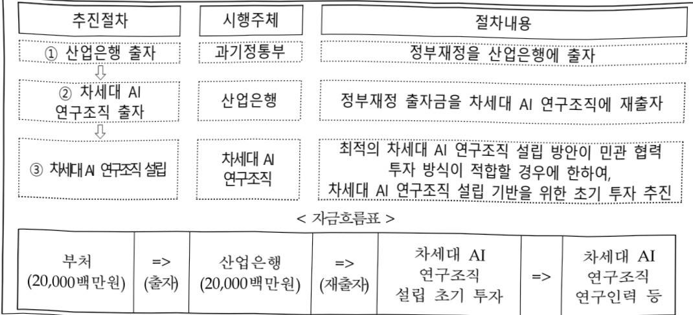

# AGI 준비 프로젝트

**해당 페이지**: PDF 266 ~ 272 쪽 해당

**부처**: 과학기술정보통신부
**분야**: 통신
**회계유형**: 일반회계
**2026 확정예산**: 20000.0 백만원
**전년대비 증감률**: None%
**AI 도메인**: LLM/언어모델

---

<table border=1 style='margin: auto; word-wrap: break-word;'><tr><td style='text-align: center; word-wrap: break-word;'>사 업 명</td></tr><tr><td style='text-align: center; word-wrap: break-word;'>(322) AGI 준비 프로젝트 (2602-365)</td></tr></table>

사업 코드 정보

<table border=1 style='margin: auto; word-wrap: break-word;'><tr><td style='text-align: center; word-wrap: break-word;'>구분</td><td style='text-align: center; word-wrap: break-word;'>회계</td><td style='text-align: center; word-wrap: break-word;'>소관</td><td style='text-align: center; word-wrap: break-word;'>실국(기관)</td><td style='text-align: center; word-wrap: break-word;'>계정</td><td style='text-align: center; word-wrap: break-word;'>분야</td><td style='text-align: center; word-wrap: break-word;'>부문</td></tr><tr><td style='text-align: center; word-wrap: break-word;'>코드</td><td rowspan="2">일반회계</td><td rowspan="2">과학기술정보통신부</td><td rowspan="2">안공지능정책기혁관</td><td rowspan="2">0</td><td style='text-align: center; word-wrap: break-word;'>130</td><td style='text-align: center; word-wrap: break-word;'>133</td></tr><tr><td style='text-align: center; word-wrap: break-word;'>명칭</td><td style='text-align: center; word-wrap: break-word;'>통신</td><td style='text-align: center; word-wrap: break-word;'>정보통신</td></tr></table>

<table border=1 style='margin: auto; word-wrap: break-word;'><tr><td style='text-align: center; word-wrap: break-word;'>구분</td><td style='text-align: center; word-wrap: break-word;'>프로그램</td><td style='text-align: center; word-wrap: break-word;'>단위사업</td><td style='text-align: center; word-wrap: break-word;'>세부사업</td></tr><tr><td style='text-align: center; word-wrap: break-word;'>코드</td><td style='text-align: center; word-wrap: break-word;'>2600</td><td style='text-align: center; word-wrap: break-word;'>2602</td><td style='text-align: center; word-wrap: break-word;'>365</td></tr><tr><td style='text-align: center; word-wrap: break-word;'>명칭</td><td style='text-align: center; word-wrap: break-word;'>인공지능데이터진흥</td><td style='text-align: center; word-wrap: break-word;'>AI경쟁력강화</td><td style='text-align: center; word-wrap: break-word;'>AGI 준비 프로젝트</td></tr></table>

사업 성격 (공통요구자료 1-1 작성유의사항 4. 참조, 해당하는 사항에 “0” 표시)

<table border=1 style='margin: auto; word-wrap: break-word;'><tr><td rowspan="2">신규</td><td rowspan="2">계속</td><td rowspan="2">완료</td><td rowspan="2">예비타당성 실시여부</td><td rowspan="2">총사업비 관리대상</td><td rowspan="2">총액계상 예산사업</td><td style='text-align: center; word-wrap: break-word;'>사업소관 변경정보</td></tr><tr><td style='text-align: center; word-wrap: break-word;'>2025예산 시 소관</td></tr><tr><td style='text-align: center; word-wrap: break-word;'>O</td><td style='text-align: center; word-wrap: break-word;'></td><td style='text-align: center; word-wrap: break-word;'></td><td style='text-align: center; word-wrap: break-word;'></td><td style='text-align: center; word-wrap: break-word;'></td><td style='text-align: center; word-wrap: break-word;'></td><td style='text-align: center; word-wrap: break-word;'></td></tr></table>

사업 지원 형태 및 지원을 (최소한 한 개는 반드시 선택하시오. 해당사항에 0 표시)

<table border=1 style='margin: auto; word-wrap: break-word;'><tr><td style='text-align: center; word-wrap: break-word;'>직접</td><td style='text-align: center; word-wrap: break-word;'>출자</td><td style='text-align: center; word-wrap: break-word;'>출연</td><td style='text-align: center; word-wrap: break-word;'>보조</td><td style='text-align: center; word-wrap: break-word;'>융자</td><td style='text-align: center; word-wrap: break-word;'>국고보조율(%)</td><td style='text-align: center; word-wrap: break-word;'>융자율(%)</td></tr><tr><td style='text-align: center; word-wrap: break-word;'></td><td style='text-align: center; word-wrap: break-word;'>O</td><td style='text-align: center; word-wrap: break-word;'></td><td style='text-align: center; word-wrap: break-word;'></td><td style='text-align: center; word-wrap: break-word;'></td><td style='text-align: center; word-wrap: break-word;'></td><td style='text-align: center; word-wrap: break-word;'></td></tr></table>

사업 소관부처 및 시행주체

<table border=1 style='margin: auto; word-wrap: break-word;'><tr><td style='text-align: center; word-wrap: break-word;'>사업명</td><td colspan="2">구분</td></tr><tr><td style='text-align: center; word-wrap: break-word;'>AGI 준비 프로젝트</td><td style='text-align: center; word-wrap: break-word;'>소관부처</td><td style='text-align: center; word-wrap: break-word;'>인공지능정책실 인공지능정책기획관 디지털인재양성과</td></tr></table>

---

### 가. 예산 총괄표

(단위: 백만원, %)

<table border=1 style='margin: auto; word-wrap: break-word;'><tr><td rowspan="2">사업명</td><td rowspan="2">2024년 결산</td><td colspan="2">2025년 예산</td><td colspan="2">2026년 예산</td><td rowspan="2">증감(B-A)</td><td rowspan="2">(B-A)/A</td></tr><tr><td style='text-align: center; word-wrap: break-word;'>본예산</td><td style='text-align: center; word-wrap: break-word;'>추경*(A)</td><td style='text-align: center; word-wrap: break-word;'>요구안</td><td style='text-align: center; word-wrap: break-word;'>본예산(B)</td></tr><tr><td style='text-align: center; word-wrap: break-word;'>AGI 준비 프로젝트</td><td style='text-align: center; word-wrap: break-word;'>-</td><td style='text-align: center; word-wrap: break-word;'>-</td><td style='text-align: center; word-wrap: break-word;'>-</td><td style='text-align: center; word-wrap: break-word;'>20,000</td><td style='text-align: center; word-wrap: break-word;'>20,000</td><td style='text-align: center; word-wrap: break-word;'>순증</td><td style='text-align: center; word-wrap: break-word;'>순증</td></tr></table>

□ 기능별(내역사업별) 예산 내역

(단위:백만원)

<table border=1 style='margin: auto; word-wrap: break-word;'><tr><td rowspan="2"></td><td colspan="5">2024</td><td colspan="5">2025</td><td rowspan="2">2026 倉寧</td></tr><tr><td style='text-align: center; word-wrap: break-word;'>倉寧劵 (奉検)</td><td style='text-align: center; word-wrap: break-word;'>倉寧劵 倉寧劵</td><td style='text-align: center; word-wrap: break-word;'>倉寧劵 倉寧劵</td><td style='text-align: center; word-wrap: break-word;'>倉寧劵 倉寧劵</td><td style='text-align: center; word-wrap: break-word;'>倉寧劵 倉寧劵</td><td style='text-align: center; word-wrap: break-word;'>倉寧劵 倉寧劵</td><td style='text-align: center; word-wrap: break-word;'>倉寧劵 倉寧劵</td><td style='text-align: center; word-wrap: break-word;'>倉寧劵 倉寧劵</td><td style='text-align: center; word-wrap: break-word;'>倉寧劵 倉寧劵</td><td style='text-align: center; word-wrap: break-word;'>倉寧劵 倉寧劵</td></tr><tr><td style='text-align: center; word-wrap: break-word;'>○ 기능별 분류(합계)</td><td style='text-align: center; word-wrap: break-word;'>-</td><td style='text-align: center; word-wrap: break-word;'>-</td><td style='text-align: center; word-wrap: break-word;'>-</td><td style='text-align: center; word-wrap: break-word;'>-</td><td style='text-align: center; word-wrap: break-word;'>-</td><td style='text-align: center; word-wrap: break-word;'>-</td><td style='text-align: center; word-wrap: break-word;'>-</td><td style='text-align: center; word-wrap: break-word;'>-</td><td style='text-align: center; word-wrap: break-word;'>-</td><td style='text-align: center; word-wrap: break-word;'>-</td><td style='text-align: center; word-wrap: break-word;'>20,000</td></tr><tr><td style='text-align: center; word-wrap: break-word;'>• ACI 준비 프로젝트</td><td style='text-align: center; word-wrap: break-word;'>-</td><td style='text-align: center; word-wrap: break-word;'>-</td><td style='text-align: center; word-wrap: break-word;'>-</td><td style='text-align: center; word-wrap: break-word;'>-</td><td style='text-align: center; word-wrap: break-word;'>-</td><td style='text-align: center; word-wrap: break-word;'>-</td><td style='text-align: center; word-wrap: break-word;'>-</td><td style='text-align: center; word-wrap: break-word;'>-</td><td style='text-align: center; word-wrap: break-word;'>-</td><td style='text-align: center; word-wrap: break-word;'>-</td><td style='text-align: center; word-wrap: break-word;'>20,000</td></tr></table>

### 나. 사업설명자료

## 1 ) 사업목적·내용

- (AGI 순비 프로젝트) 최적의 차세대 AI 연구조직 설립 방안 기획·도출하여, 민·관 협력 투자 방식의 차세대 AI 연구조직 설립이 적합할 경우에 한하여, 연구조직 설립 기반 초기 투자 추진 · AGI 기술선점의 중요성·시급성을 감안하여, 기획 내용 등에 근거한 속도감 있는 차세대 AI 연구조직 출범을 위해 관련 예산(안) 마련·요구

---

## 2 ) 사업개요

## 사업근거 및 추진경위

① 법령상 근거 및 조항 적시

- 인공지능 발전과 신뢰 기반 조성 등에 관한 기본법 제13조(인공지능 기술개발 및 안전한 이용 지원)

제13조(인공지능 기술개발 및 안전한 이용 지원) ① 정부는 인공지능기술 개발 활성화를 위하여 다음 각 호의 사업을 지원할 수 있다.

1. 국내외 인공지능기술 동향·수준 및 관련 제도의 조사

2. 인공지능기술의 연구·개발, 시험 및 평가 또는 개발된 기술의 활용

3. 인공지능기술 확산, 인공지능기술 협력 · 이전 등 기술의 실용화 및 사업화 지원

4. 인공지능기술의 구현을 위한 정보의 원활한 유통 및 산학협력

5. 그 밖에 인공지능기술의 개발 및 연구 · 조사와 관련하여 대통령령으로 정하는 사업

## - 과학기술 기본법 제15조(기초연구의 진흥)

제15조(기초연구의 진흥) 정부는 과학기술혁신의 바탕이 되는 기초연구를 진흥시키기 위하여 대학과 정부가 출연하는 연구기관의 연구 및 상호 연계·협력을 활성화하고 안정적인 연구비를 지원하는 등 종합적인 시책을 세우고 추진하여야 한다.

- 정보통신 진흥 및 융합 활성화 등에 관한 특별법 제32조(정보통신융합 등 기술서비스 개발 등의 지원)

제32조(정보통신융합등 기술·서비스 개발 등의 지원) ① 과학기술정보통신부장관은 다른 산업 및 서비스 등에 정보통신의 접목을 통하여 생산성과 가치를 높일 수 있도록 노력하여야 한다.

② 과학기술정보통신부장관은 정보통신융합등 기술·서비스의 개발을 촉진하기 위하여 다음 각 호의 사업을 추진할 수 있다.

1. 정보통신융합등 기술·서비스 관련 연구개발 사업

2. 제1호에 따라 추진되는 과제에 대한 기획·평가·관리

3. 국가·지방자치단체, 대학·정부출연연구기관, 민간 등이 보유한 정보통신융합등 기술의 거래 등 기술이전을 위한 중개·알선 지원

4. 정보통신융합등 기술에 대한 평가 및 평가 기법의 개발·보급

5. 정보통신융합등 기술의 기술이전·사업화에 관한 통계조사·연구 등 관련 정보의 수집·분석·제공

③ 과학기술정보통신부장관은 제2항 각 호의 사업을 추진하기 위하여 법인인 전담기관을 설립하거나 법인·단체에 위탁·운영할 수 있으며, 필요한 비용의 전부 또는 일부를 예산의 범위에서 출연 또는 보조할 수 있다.

## -한국산업은행법 제18조제1항(업무)

<table border=1 style='margin: auto; word-wrap: break-word;'><tr><td style='text-align: center; word-wrap: break-word;'>제18조(업무) ① 한국산업은행은 제1조의 목적을 달성하기 위하여 다음 각 호의 분야에 자금을 공급한다.</td></tr><tr><td style='text-align: center; word-wrap: break-word;'>1. 산업의 개발 • 육성</td></tr><tr><td style='text-align: center; word-wrap: break-word;'>2. 중소기업의 육성</td></tr><tr><td style='text-align: center; word-wrap: break-word;'>3. 사회기반시설의 확충 및 지역개발</td></tr><tr><td style='text-align: center; word-wrap: break-word;'>4. 에너지 및 자원의 개발</td></tr><tr><td style='text-align: center; word-wrap: break-word;'>5. 기업 • 산업의 해외진출</td></tr><tr><td style='text-align: center; word-wrap: break-word;'>6. 기업구조조정</td></tr><tr><td style='text-align: center; word-wrap: break-word;'>7. 정부가 업무위탁이 필요하다고 인정하는 분야</td></tr><tr><td style='text-align: center; word-wrap: break-word;'>8. 그 밖에 신성장동력산업 육성과 지속가능한 성장 촉진 등 금융산업 및 국민경제의 발전을 위하여 자금의 공급이 필요한 분야</td></tr></table>

---

## ② 추진경위

: 이재명 정부 국정과제 22번 「초격차 AI 선도기술·인재 확보 - 국가AI연구소 육성」

^1-바도체 이니셔티브('24.4월)

9대 기술혁신 과제 - ① 인간처럼 인지·행동·성장하는 차세대 범용(AGI) 개발

- 국가AI전략 정책방향('24.9월)

기술·인프라 - ③ AI 핵심·원천기술개발 확충

- AI컴퓨팅인프라 확충을 통한 국가AI역량강화방안('25.2월)

□ [장기] LLM을 넘어 차세대 AI 원천기술 확보
ㅇ 제조, 바이오, 금융 등 산업 특화형 에이전틱AI 기술을 확보하고 선도모델 구축
뒷 국내외 실증 등 응용서비스로 확산
※ 팬 생성형 AI 기반 에이전틱 AI와 달리, 실세계 적용가능한 행동형 에이전틱 AI 기술확보에 중점

- '26년 국가연구개발 투자방향 및 기준('25.3., 국가과학기술자문회의)

0 과학기술 혁신으로 새로운 성장동력 확보

- (신기술 도전) AGI, 포스트 트랜스포머 등 새로운 AI 접근방식과 현세대 AI 한계 극복을 위한 초경량, 고성능 모델 등 도전적 원천 연구에 투자 대폭 확대

---

## 주요내용

① 사업규모

- 총사업비 : 해당없음

- 사업기간 : '26

- 최근 5년 간 투입된 사업비(예산액기준, 추경편성한 연도에는 추경포함)

<table border=1 style='margin: auto; word-wrap: break-word;'><tr><td style='text-align: center; word-wrap: break-word;'>연도</td><td style='text-align: center; word-wrap: break-word;'>2022</td><td style='text-align: center; word-wrap: break-word;'>2023</td><td style='text-align: center; word-wrap: break-word;'>2024</td><td style='text-align: center; word-wrap: break-word;'>2025</td><td style='text-align: center; word-wrap: break-word;'>2026</td></tr><tr><td style='text-align: center; word-wrap: break-word;'>사업비</td><td style='text-align: center; word-wrap: break-word;'>-</td><td style='text-align: center; word-wrap: break-word;'>-</td><td style='text-align: center; word-wrap: break-word;'>-</td><td style='text-align: center; word-wrap: break-word;'>-</td><td style='text-align: center; word-wrap: break-word;'>20,000</td></tr></table>

- 기타: 해당없음

② 사업추진체계

- 사업시행방법 : 출자

- 사업시행주체 : 한국산업은행 경유출자 등을 통해 차세대 AI 연구조직 초기 투자

- 사업 수혜자 : 기업, 대학, 연구소 등

- 보조, 융자, 출연, 출자 등의 경우 보조 · 융자 등 지원 비율 및 법적근거

<table border=1 style='margin: auto; word-wrap: break-word;'><tr><td style='text-align: center; word-wrap: break-word;'>내역사업명</td><td style='text-align: center; word-wrap: break-word;'>구분</td><td style='text-align: center; word-wrap: break-word;'>피보조·피출연 등 기관명</td><td style='text-align: center; word-wrap: break-word;'>지원 금액 (2026예산안)</td><td style='text-align: center; word-wrap: break-word;'>지원 비율(%)</td><td style='text-align: center; word-wrap: break-word;'>보조율 법적근거 (해당 조항)</td></tr><tr><td style='text-align: center; word-wrap: break-word;'>AGI 준비 프로젝트</td><td style='text-align: center; word-wrap: break-word;'>출자</td><td style='text-align: center; word-wrap: break-word;'>한국 산업은행 등</td><td style='text-align: center; word-wrap: break-word;'>20,000</td><td style='text-align: center; word-wrap: break-word;'>100</td><td style='text-align: center; word-wrap: break-word;'>정보통신 진흥 및 융합 활성화 등에 관한 특별법 제32조 3항 한국산업은행법 제18조제1항(업무)</td></tr></table>

## 3 ) 2026년도 예산 산출 근거

ㅇ 민관 협력 방식의 차세대 AI 연구조직 설립이 적합할 경우에 한하여, 초기 투자

등으로 연구조직 기반 설립 출자 지원 (20,000 백만원)

(신규) 초기투자 : 1식 x 20,000 백만원

---

## 4 ) 사업효과

사업영향,산출물 성과지표 등

① 2022~2026년도 성과계획서 상 성과지표 및 최근 5년간 성과 달성도

<table border=1 style='margin: auto; word-wrap: break-word;'><tr><td style='text-align: center; word-wrap: break-word;'>성과지표</td><td style='text-align: center; word-wrap: break-word;'>구분</td><td style='text-align: center; word-wrap: break-word;'>2022</td><td style='text-align: center; word-wrap: break-word;'>2023</td><td style='text-align: center; word-wrap: break-word;'>2024</td><td style='text-align: center; word-wrap: break-word;'>2025</td><td style='text-align: center; word-wrap: break-word;'>2026</td><td style='text-align: center; word-wrap: break-word;'>2026 목표치산출근거</td><td style='text-align: center; word-wrap: break-word;'>측정산시(또는 측정방법)</td><td style='text-align: center; word-wrap: break-word;'>자료수집방법(또는 자료출처)</td></tr><tr><td rowspan="3">최적의 차세대 AI 연구조직</td><td style='text-align: center; word-wrap: break-word;'>목표</td><td style='text-align: center; word-wrap: break-word;'>-</td><td style='text-align: center; word-wrap: break-word;'>-</td><td style='text-align: center; word-wrap: break-word;'>-</td><td style='text-align: center; word-wrap: break-word;'>-</td><td style='text-align: center; word-wrap: break-word;'>100</td><td style='text-align: center; word-wrap: break-word;'>26년 단년도 사업으로</td><td style='text-align: center; word-wrap: break-word;'>기획보고서 기반 차세대 AI 연구조직 설립 방안</td><td rowspan="3">기획보고서 기반 차세대 AI 연구조직 설립 방안 도출</td></tr><tr><td style='text-align: center; word-wrap: break-word;'>실적</td><td style='text-align: center; word-wrap: break-word;'>-</td><td style='text-align: center; word-wrap: break-word;'>-</td><td style='text-align: center; word-wrap: break-word;'>-</td><td style='text-align: center; word-wrap: break-word;'>-</td><td style='text-align: center; word-wrap: break-word;'>-</td><td rowspan="2">최적의 차세대 AI 연구조직 설립 방안 도출</td><td rowspan="2">기획보고서 기반 차세대 AI 연구조직 설립 방안 도출</td></tr><tr><td style='text-align: center; word-wrap: break-word;'>달성도</td><td style='text-align: center; word-wrap: break-word;'>-</td><td style='text-align: center; word-wrap: break-word;'>-</td><td style='text-align: center; word-wrap: break-word;'>-</td><td style='text-align: center; word-wrap: break-word;'>-</td><td style='text-align: center; word-wrap: break-word;'>-</td></tr></table>

※ 초기 투자 방식의 출자금 지원 단년도 사업으로 사업 시작년차에 변동가능

② 성과지표 이외의 연도별 사업추진 경과 및 실적 : 해당없음

③향후(2026년도 이후)기대효과

- 세계적 수준의 국내 연구진 역량을 집약하여, 혁신적 AI 연구에 과감히 도전, 실질 성과를 낼 수 있는 “차세대 AI 연구조직” 추진

* 고착된 우리나라 AI 기술수준의 새로운 도약(퀀텀점프)을 위해서는 새로운 AI R&D 방식·체계 도입에 대한 고민과 실행이 필요한 시점

5) 타당성조사 및 예비타당성조사 시행여부 및 결과 요지 : 해당없음

6) 총사업비 대상사업 정보 : 해당없음

---

## 7 ) 사업 집행절차

## 8 ) 각종 평가

1) 국회(예결위, 상임위, 예정처, 국정감사 포함) 지적
- 차세대 AI 연구조직의 구체적인 설립 방안 보완 필요(예정처·예결위·과방위, '26년 예산안')
2) 대외공개 평가 : 해당없음
3) 자체평가 : 해당없음

### 다. 최근 4년간 결산내역 : 해당없음

---

### 원본 PDF 크롭 이미지

