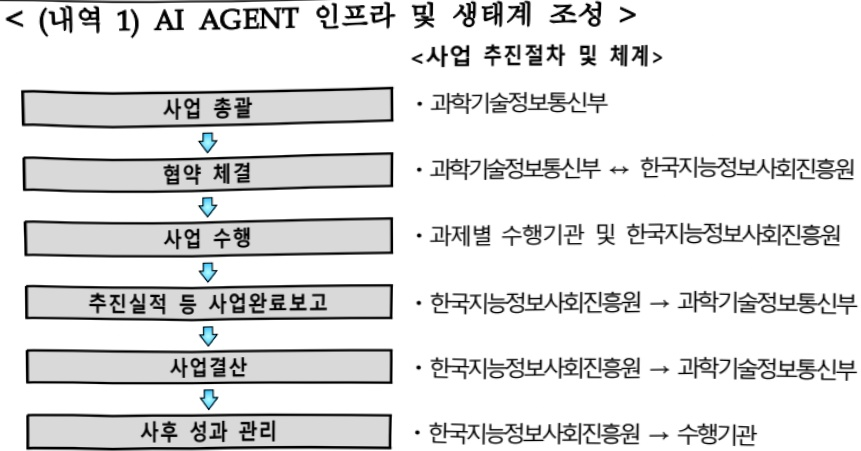
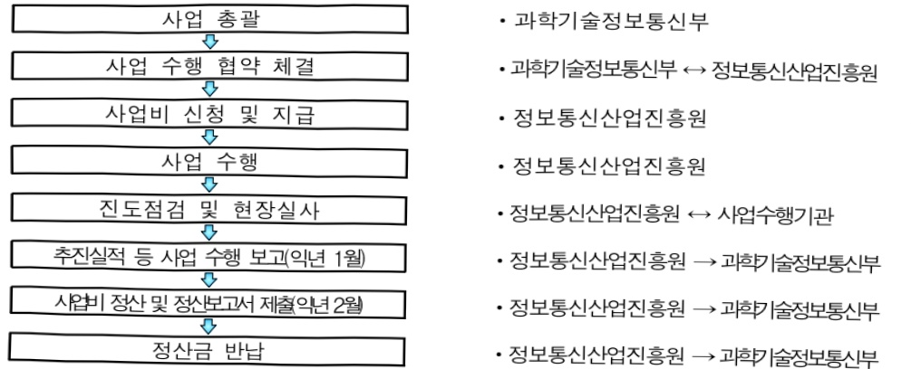
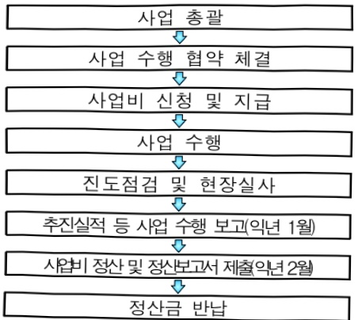

# AI AGENT 선도 국가 사업

**해당 페이지**: PDF 273 ~ 279 쪽 해당

**부처**: 과학기술정보통신부
**분야**: 통신
**회계유형**: 일반회계
**2026 확정예산**: 20000.0 백만원
**전년대비 증감률**: None%
**AI 도메인**: LLM/언어모델

---

<table border=1 style='margin: auto; word-wrap: break-word;'><tr><td style='text-align: center; word-wrap: break-word;'>사 업 명</td></tr><tr><td style='text-align: center; word-wrap: break-word;'>(324) AI AGENT 선도 국가 사업 (2602-367)</td></tr></table>

사업 코드 정보

<table border=1 style='margin: auto; word-wrap: break-word;'><tr><td style='text-align: center; word-wrap: break-word;'>구분</td><td style='text-align: center; word-wrap: break-word;'>회계</td><td style='text-align: center; word-wrap: break-word;'>소관</td><td style='text-align: center; word-wrap: break-word;'>실국(기관)</td><td style='text-align: center; word-wrap: break-word;'>계정</td><td style='text-align: center; word-wrap: break-word;'>분야</td><td style='text-align: center; word-wrap: break-word;'>부문</td></tr><tr><td style='text-align: center; word-wrap: break-word;'>코드</td><td rowspan="2">일반회계</td><td rowspan="2">과학기술정보통신부</td><td rowspan="2">인공지능정책기획관</td><td rowspan="2">0</td><td style='text-align: center; word-wrap: break-word;'>130</td><td style='text-align: center; word-wrap: break-word;'>133</td></tr><tr><td style='text-align: center; word-wrap: break-word;'>명칭</td><td style='text-align: center; word-wrap: break-word;'>통신</td><td style='text-align: center; word-wrap: break-word;'>정보통신</td></tr></table>

<table border=1 style='margin: auto; word-wrap: break-word;'><tr><td style='text-align: center; word-wrap: break-word;'>구분</td><td style='text-align: center; word-wrap: break-word;'>프로그램</td><td style='text-align: center; word-wrap: break-word;'>단위사업</td><td style='text-align: center; word-wrap: break-word;'>세부사업</td></tr><tr><td style='text-align: center; word-wrap: break-word;'>코드</td><td style='text-align: center; word-wrap: break-word;'>2600</td><td style='text-align: center; word-wrap: break-word;'>2602</td><td style='text-align: center; word-wrap: break-word;'>367</td></tr><tr><td style='text-align: center; word-wrap: break-word;'>명칭</td><td style='text-align: center; word-wrap: break-word;'>인공지능데이터진흥</td><td style='text-align: center; word-wrap: break-word;'>AI경쟁력강화</td><td style='text-align: center; word-wrap: break-word;'>AI AGENT 선도 국가 사업</td></tr></table>

□ 사업 성격 (공통요구자료 Ⅱ-1 작성유의사항 4. 참조, 해당하는 사항에 “○” 표시)

<table border=1 style='margin: auto; word-wrap: break-word;'><tr><td style='text-align: center; word-wrap: break-word;'>신규</td><td style='text-align: center; word-wrap: break-word;'>계속</td><td style='text-align: center; word-wrap: break-word;'>완료</td><td style='text-align: center; word-wrap: break-word;'>예비타당성 실시여부</td><td style='text-align: center; word-wrap: break-word;'>총사업비 관리대상</td><td style='text-align: center; word-wrap: break-word;'>총액계상 예산사업</td><td style='text-align: center; word-wrap: break-word;'>사업소관 변경정보 2025예산 시 소관</td></tr><tr><td style='text-align: center; word-wrap: break-word;'>O</td><td style='text-align: center; word-wrap: break-word;'></td><td style='text-align: center; word-wrap: break-word;'></td><td style='text-align: center; word-wrap: break-word;'></td><td style='text-align: center; word-wrap: break-word;'></td><td style='text-align: center; word-wrap: break-word;'></td><td style='text-align: center; word-wrap: break-word;'></td></tr></table>

사업지원형태 및 지원을(최소한 한 개는 반드시 선택하시오. 해당사항에 O 표시)

<table border=1 style='margin: auto; word-wrap: break-word;'><tr><td style='text-align: center; word-wrap: break-word;'>직접</td><td style='text-align: center; word-wrap: break-word;'>출자</td><td style='text-align: center; word-wrap: break-word;'>출연</td><td style='text-align: center; word-wrap: break-word;'>보조</td><td style='text-align: center; word-wrap: break-word;'>융자</td><td style='text-align: center; word-wrap: break-word;'>국고보조율(%)</td><td style='text-align: center; word-wrap: break-word;'>융자율(%)</td></tr><tr><td style='text-align: center; word-wrap: break-word;'></td><td style='text-align: center; word-wrap: break-word;'></td><td style='text-align: center; word-wrap: break-word;'>O</td><td style='text-align: center; word-wrap: break-word;'></td><td style='text-align: center; word-wrap: break-word;'></td><td style='text-align: center; word-wrap: break-word;'></td><td style='text-align: center; word-wrap: break-word;'></td></tr></table>

## □사업 소관부처 및 시행주체

<table border=1 style='margin: auto; word-wrap: break-word;'><tr><td style='text-align: center; word-wrap: break-word;'>사업명</td><td colspan="2">구분</td></tr><tr><td rowspan="2">AI AGENT 인프라 및 생태계 조성</td><td style='text-align: center; word-wrap: break-word;'>소관부처</td><td style='text-align: center; word-wrap: break-word;'>인공지능정책실 인공지능정책기획관 디지털인재양성과</td></tr><tr><td style='text-align: center; word-wrap: break-word;'>사업시행주체</td><td style='text-align: center; word-wrap: break-word;'>한국지능정보사회진흥원</td></tr><tr><td rowspan="2">AI AGENT 융합·확산 지원</td><td style='text-align: center; word-wrap: break-word;'>소관부처</td><td style='text-align: center; word-wrap: break-word;'>인공지능정책실 인공지능정책기획관 디지털인재양성과</td></tr><tr><td style='text-align: center; word-wrap: break-word;'>사업시행주체</td><td style='text-align: center; word-wrap: break-word;'>정보통신산업진흥원</td></tr></table>

---

### 가. 예산 총괄표

(단위: 백만원, %)

<table border=1 style='margin: auto; word-wrap: break-word;'><tr><td rowspan="2">사업명</td><td rowspan="2">2024년 결산</td><td colspan="2">2025년 예산</td><td colspan="2">2026년 예산</td><td rowspan="2">증감(B-A)</td><td rowspan="2">(B-A)/A</td></tr><tr><td style='text-align: center; word-wrap: break-word;'>본예산</td><td style='text-align: center; word-wrap: break-word;'>추경*(A)</td><td style='text-align: center; word-wrap: break-word;'>요구안</td><td style='text-align: center; word-wrap: break-word;'>본예산(B)</td></tr><tr><td style='text-align: center; word-wrap: break-word;'>AI AGENT 선도 국가 사업</td><td style='text-align: center; word-wrap: break-word;'>-</td><td style='text-align: center; word-wrap: break-word;'>-</td><td style='text-align: center; word-wrap: break-word;'>-</td><td style='text-align: center; word-wrap: break-word;'>20,000</td><td style='text-align: center; word-wrap: break-word;'>20,000</td><td style='text-align: center; word-wrap: break-word;'>순증</td><td style='text-align: center; word-wrap: break-word;'>순증</td></tr></table>

□ 기능별(내역사업별) 예산 내역

(단위:백만원)

<table border=1 style='margin: auto; word-wrap: break-word;'><tr><td rowspan="2"></td><td colspan="5">2024</td><td colspan="5">2025</td><td rowspan="2">2026 예산</td></tr><tr><td style='text-align: center; word-wrap: break-word;'>예산액 (추경)</td><td style='text-align: center; word-wrap: break-word;'>예산 현액</td><td style='text-align: center; word-wrap: break-word;'>집행액</td><td style='text-align: center; word-wrap: break-word;'>이월액</td><td style='text-align: center; word-wrap: break-word;'>불용액</td><td style='text-align: center; word-wrap: break-word;'>예산액 (추경)</td><td style='text-align: center; word-wrap: break-word;'>예산 현액</td><td style='text-align: center; word-wrap: break-word;'>집행액</td><td style='text-align: center; word-wrap: break-word;'>이월액</td><td style='text-align: center; word-wrap: break-word;'>불용액</td></tr><tr><td style='text-align: center; word-wrap: break-word;'>○ 기능별 분류(합계)</td><td style='text-align: center; word-wrap: break-word;'>-</td><td style='text-align: center; word-wrap: break-word;'>-</td><td style='text-align: center; word-wrap: break-word;'>-</td><td style='text-align: center; word-wrap: break-word;'>-</td><td style='text-align: center; word-wrap: break-word;'>-</td><td style='text-align: center; word-wrap: break-word;'>-</td><td style='text-align: center; word-wrap: break-word;'>-</td><td style='text-align: center; word-wrap: break-word;'>-</td><td style='text-align: center; word-wrap: break-word;'>-</td><td style='text-align: center; word-wrap: break-word;'>-</td><td style='text-align: center; word-wrap: break-word;'>20,000</td></tr><tr><td rowspan="2">• AI AGENT 인프라 및 생태계 조성 • AI AGENT 융합· 확산 지원</td><td style='text-align: center; word-wrap: break-word;'>-</td><td style='text-align: center; word-wrap: break-word;'>-</td><td style='text-align: center; word-wrap: break-word;'>-</td><td style='text-align: center; word-wrap: break-word;'>-</td><td style='text-align: center; word-wrap: break-word;'>-</td><td style='text-align: center; word-wrap: break-word;'>-</td><td style='text-align: center; word-wrap: break-word;'>-</td><td style='text-align: center; word-wrap: break-word;'>-</td><td style='text-align: center; word-wrap: break-word;'>-</td><td style='text-align: center; word-wrap: break-word;'>-</td><td style='text-align: center; word-wrap: break-word;'>10,000</td></tr><tr><td style='text-align: center; word-wrap: break-word;'>-</td><td style='text-align: center; word-wrap: break-word;'>-</td><td style='text-align: center; word-wrap: break-word;'>-</td><td style='text-align: center; word-wrap: break-word;'>-</td><td style='text-align: center; word-wrap: break-word;'>-</td><td style='text-align: center; word-wrap: break-word;'>-</td><td style='text-align: center; word-wrap: break-word;'>-</td><td style='text-align: center; word-wrap: break-word;'>-</td><td style='text-align: center; word-wrap: break-word;'>-</td><td style='text-align: center; word-wrap: break-word;'>-</td><td style='text-align: center; word-wrap: break-word;'>10,000</td></tr></table>

### 나.사업설명자료

## 1 ) 사업목적·내용

- (AI AGENT 선도 국가 사업) AI 에이전트가 필요한 도구를 자율적으로 실행할 수 있는 기술 인프라 기반을 마련하고, 서비스 실증을 통해 AI 에이전트 생태계 조성

(AI AGENT 인프라 및 생태계 조성) AI 에이전트 실행에 필요한 도구를 수요 기반으로 개발, 보안·신뢰 기반으로 개방·유통하여 AI 에이전트 실행 인프라 기반 조성

(AI AGENT 융합·확산 지원) 개발 역량을 보유한 중소기업 등을 대상으로 산업/현장의 필요에 따른 맞춤형 AI 에이전트 서비스 개발·실증 지원

---

## 2 ) 사업개요

사업근거 및 추진경위

① 법령상 근거 및 조항 적시

(지능정보화기본법) 제14조(공공지능정보화의 추진), 제16조(민간 분야 지능정보화의 지원), 제17조(민간 기관 등과의 협력), 제18조(지능정보화의 민간 확산), 제32조(선도사업의 추진과 지원)

제12조(한국지능정보사회진흥원의 설립) ① 과학기술정보통신부장관과 행정안전부장관은 지능정보사회 관련 정책의 개발과 국가기관등의 지능정보사회 시책 및 지능정보화 사업의 추진 등을 지원하기 위하여 한국지능정보사회진흥원(이하 "지능정보사회원"이라 한다)을 설립한다.(이하 생략)

제14조(공공지능정보화의 추진) ① 국가기관등은 공공서비스의 지능정보화를 도모하고 국민 편의 증진 등을 위하여 행정, 보건, 사회복지, 교육, 문화, 환경, 교통, 물류, 과학기술, 재난안전, 치안, 국방, 에너지 등 소관 업무에 대한 지능정보화(이하 "공공지능정보화"라 한다)를 추진하여야 한다.

제16조(민간 분야 지능정보화의 지원) ① 정부는 산업·금융·의료 등 민간 분야의 생산성 향상, 부가가치 창출, 국민생활의 균등한 향상, 국가경쟁력 확보 등을 위하여 기업의 지능정보화 및 초연결지능정보통신기반의 구축·이용 등 민간 분야의 지능정보화에 필요한 사항을 지원할 수 있다.

제17조(민간기관 등과의 협력) ① 국가기관등은 공공지능정보화 및 지역지능정보화를 추진할 때 민간투자를 적극 유치하고, 관련 민간사업자와 민간사업자단체에 필요한 지원을 할 수 있다.

제18조(지능정보회의 민간 확산) ① 정부는 공공분야의 지능정보회를 통하여 정보통신 및 지능정보기술 관련 산업의 조기 구축을 도모하고, 사회 각 분야에서 이용을 활성화할 수 있도록 필요한 시책을 마련하여야 한다.

제32조(선도사업의 추진과 지원) ① 정부는 사회 각 분야에 지능정보기술 및 지능정보서비스의 이용을 활성화하거나 지능정보기술과 다른 기술을 접목하기 위하여 선도적으로 시범 적용하는 사업(이하 "선도사업"이라 한다)을 적극적으로 추진하여야 한다. ② 정부는 선도사업이 효율적으로 추진될 수 있도록 행정적·재정적·기술적 지원 등 필요한 지원을 할 수 있다.

## o(정보통신산업진흥법)제27조(사업)

제27조(사업)산업진흥원은다음각호의사업을한다.

2. 전문인력 양성

3. 정보통신산업 육성·발전 및 지원시설 등 기반조성사업

4. 정보통신기업의 창업·성장 등의 지원

5. 정보통신산업 발전을 위한 유통시장 활성화와 마케팅 지원

7. 정보통신기술의 융합·활용에 관한 사업

8. 정보통신산업 관련 국제교류·협력 및 해외진출의 지원

0 (정보통신진흥및융합활성화등에관한특별법) 제32조(정보통신융합등 기술서비스 개발 등의 지원)

제32조(정보통신융합등 기술·서비스 개발 등의 지원) ① 과학기술정보통신부장관은 다른 산업 및 서비스 등에 정보통신의 접목을 통하여 생산성과 가치를 높일 수 있도록 노력하여야 한다.

---

## ② 추진경위

o'22.12.~23.3월 :초거대AI 기업 릴레이간담회

-초거대AI 기업 간담회('22.12~23.3, 네이버, 카카오, LG AI 연구원, KT, SKT 등)

-챗GPT 대응 장관-전문가 토론회('23.2),디지털 국정과제 현장 간담회('23.2)

- 제3차 '인공지능 최고위 전략대화' 개최('23.3)

* 네이버, LG AI, SKT, KT, 카카오 등 초거대 AI 개발 기업 / 루닛, 뤼튼, 스캘터랩스 등 AI 스타트업 / 서울대·KAIST 등 학계 등 다양한 의견 수렴 추진

o'23.1.:인공지능 일상화 및 산업 고도화 계획

- 인공지능을 국가 전반으로 확산하고 AI산업의 실질적 성과를 창출하기 위한 10대 프로젝트 추진

o '23.4. :초거대 AI 경쟁력 강화 방안' 발표

- 창작 등 민간 5대 전문영역 초거대 AI 플래그십 프로젝트 추진

0 '23.4. : 소프트웨어 진흥 전략 발표

0 (제3차 국가인공지능위원회) AI컴퓨팅인프라 확충을 통한 국가 AI역량 강화 방안('25.2, 관계부처 합동)

- AI컴퓨팅 인프라 확충을 통해 개발된 우리 AI모델이 시장에 안착할 수 있도록 선도프로젝트 추진 및 국가 AI전환 가속화

0(국정과제 21-3)지역·산업 전반의 AX 대전환('25.8)

## □ 주요내용

① 사업규모

- 총사업비(해당되는 경우에만 기재) : 해당없음

- 사업기간 : '26년~'30년

- 최근 5년 간 투입된 사업비(예산액기준, 추경편성한 연도에는 추경포함)

<table border=1 style='margin: auto; word-wrap: break-word;'><tr><td style='text-align: center; word-wrap: break-word;'>연도</td><td style='text-align: center; word-wrap: break-word;'>2022</td><td style='text-align: center; word-wrap: break-word;'>2023</td><td style='text-align: center; word-wrap: break-word;'>2024</td><td style='text-align: center; word-wrap: break-word;'>2025</td><td style='text-align: center; word-wrap: break-word;'>2026</td></tr><tr><td style='text-align: center; word-wrap: break-word;'>사업비</td><td style='text-align: center; word-wrap: break-word;'>-</td><td style='text-align: center; word-wrap: break-word;'>-</td><td style='text-align: center; word-wrap: break-word;'>-</td><td style='text-align: center; word-wrap: break-word;'>-</td><td style='text-align: center; word-wrap: break-word;'>20,000</td></tr></table>

-기타: 해당없음

② 사업추진체계

- 사업시행방법 : 출연

- 사업시행주체 : 한국지능정보사회진흥원, 정보통신산업진흥원

-사업 수혜자 : AI·데이터 전문기업 등

- 보조, 융자, 출연, 출자 등의 경우 보조·융자 등 지원 비율 및 법적근거

<table border=1 style='margin: auto; word-wrap: break-word;'><tr><td style='text-align: center; word-wrap: break-word;'>내역사업명</td><td style='text-align: center; word-wrap: break-word;'>구분</td><td style='text-align: center; word-wrap: break-word;'>피보조·피출연 등 기관명</td><td style='text-align: center; word-wrap: break-word;'>지원 금액 (2026예산안)</td><td style='text-align: center; word-wrap: break-word;'>지원 비율(%)</td><td style='text-align: center; word-wrap: break-word;'>보조율 법적근거 (해당 조항)</td></tr><tr><td style='text-align: center; word-wrap: break-word;'>AI AGENT 인프라 및 생태계 조성</td><td style='text-align: center; word-wrap: break-word;'>출연</td><td style='text-align: center; word-wrap: break-word;'>한국지능정보 사회진흥원</td><td style='text-align: center; word-wrap: break-word;'>10,000백만</td><td style='text-align: center; word-wrap: break-word;'>50%</td><td style='text-align: center; word-wrap: break-word;'>지능정보화기본법 제12조 (한국지능정보사회진흥원의 설립)</td></tr><tr><td style='text-align: center; word-wrap: break-word;'>AI AGENT 융합 확산 지원</td><td style='text-align: center; word-wrap: break-word;'>출연</td><td style='text-align: center; word-wrap: break-word;'>정보통신산업 진흥원</td><td style='text-align: center; word-wrap: break-word;'>10,000백만</td><td style='text-align: center; word-wrap: break-word;'>50%</td><td style='text-align: center; word-wrap: break-word;'>정보통신산업진흥법 제27조(사업), 정보통신 진흥 및 융합 활성화 등에 대한 특별법 제32조</td></tr></table>

---

## 3 ) 2026년도 예산 산출 근거

가. AI AGENT 인프라 및 생태계 조성(10,000백만원)

<table border=1 style='margin: auto; word-wrap: break-word;'><tr><td style='text-align: center; word-wrap: break-word;'>가. AI AGENT 인프라 및 생태계 조성(10,000백만원)</td></tr><tr><td style='text-align: center; word-wrap: break-word;'>· AI 에이전트 서비스 유통기반 마련 = 4,000백만원</td></tr><tr><td style='text-align: center; word-wrap: break-word;'>· AI 에이전트 서비스 개발·개방 = 4,000백만원</td></tr><tr><td style='text-align: center; word-wrap: break-word;'>· AI AGENT 기술·인프라 신뢰성 검증 = 2,000백만원</td></tr><tr><td style='text-align: center; word-wrap: break-word;'>※ 세부 단가는 민간 수요 및 대내외 상황 변화에 따라 변동 가능</td></tr><tr><td style='text-align: center; word-wrap: break-word;'>나. AI AGENT 융합·확산 지원(10,000백만원)</td></tr><tr><td style='text-align: center; word-wrap: break-word;'>· AI AGENT 융합·확산 지원 8개 서비스 × 1,250백만원 = 10,000백만원</td></tr><tr><td style='text-align: center; word-wrap: break-word;'>※ 추후 서비스별 지원 예산 규모는 분야별 세부 특성에 따라 변동 가능</td></tr></table>

· AI 에이전트 서비스 유통기반 마련 = 4,000백만원

· AI 에이전트 서비스 개발·개방 = 4,000백만원

· AI AGENT 기술·인프라 신뢰성 검증 = 2,000백만원

※ 세부 단가는 민간 수요 및 대내외 상황 변화에 따라 변동 가능

나. AI AGENT 융합·확산 지원(10,000백만원)

AI AGENT 융합·확산 지원 8개 서비스 × 1,250백만원 = 10,000백만원

※ 추후 서비스별 지원 예산 규모는 분야별 세부 특성에 따라 변동 가능

## 4 ) 사업효과

☐ 사업영향, 산출물 성과지표 등

① 2022~2026년도 성과계획서 상 성과지표 및 최근 5년간 성과 달성도

<table border=1 style='margin: auto; word-wrap: break-word;'><tr><td style='text-align: center; word-wrap: break-word;'>성과지표</td><td style='text-align: center; word-wrap: break-word;'>구분</td><td style='text-align: center; word-wrap: break-word;'>2022</td><td style='text-align: center; word-wrap: break-word;'>2023</td><td style='text-align: center; word-wrap: break-word;'>2024</td><td style='text-align: center; word-wrap: break-word;'>2025</td><td style='text-align: center; word-wrap: break-word;'>2026</td><td style='text-align: center; word-wrap: break-word;'>2026 목표치산출근거</td><td style='text-align: center; word-wrap: break-word;'>측정산식(또는 측정방법)</td><td style='text-align: center; word-wrap: break-word;'>자료수집방법(또는 자료출처)</td></tr><tr><td rowspan="3">유통체계AI AGENT서비스 등록 건수(단위: 건)</td><td style='text-align: center; word-wrap: break-word;'>목표</td><td style='text-align: center; word-wrap: break-word;'>-</td><td style='text-align: center; word-wrap: break-word;'>-</td><td style='text-align: center; word-wrap: break-word;'>-</td><td style='text-align: center; word-wrap: break-word;'>-</td><td style='text-align: center; word-wrap: break-word;'>8</td><td rowspan="3">신규 지표임을 고려하여 목표치 설정</td><td rowspan="3">유통체계(유통마켓)에 등록된 AI 에이전트 서비스 건수</td><td rowspan="6">사업 결과보고서 등</td></tr><tr><td style='text-align: center; word-wrap: break-word;'>실적</td><td style='text-align: center; word-wrap: break-word;'>-</td><td style='text-align: center; word-wrap: break-word;'>-</td><td style='text-align: center; word-wrap: break-word;'>-</td><td style='text-align: center; word-wrap: break-word;'>-</td><td style='text-align: center; word-wrap: break-word;'>-</td></tr><tr><td style='text-align: center; word-wrap: break-word;'>달성도</td><td style='text-align: center; word-wrap: break-word;'>-</td><td style='text-align: center; word-wrap: break-word;'>-</td><td style='text-align: center; word-wrap: break-word;'>-</td><td style='text-align: center; word-wrap: break-word;'>-</td><td style='text-align: center; word-wrap: break-word;'>-</td></tr><tr><td rowspan="3">AI AGENT개발·실증사업화 성과(단위: %)</td><td style='text-align: center; word-wrap: break-word;'>목표</td><td style='text-align: center; word-wrap: break-word;'>-</td><td style='text-align: center; word-wrap: break-word;'>-</td><td style='text-align: center; word-wrap: break-word;'>-</td><td style='text-align: center; word-wrap: break-word;'>25</td><td style='text-align: center; word-wrap: break-word;'>신규 지표임을 고려하여 목표치 설정</td><td rowspan="3">사업화 및 기술개발 성공 과제 수/총 지원과제수</td><td rowspan="3">사업 결과보고서 등</td></tr><tr><td style='text-align: center; word-wrap: break-word;'>실적</td><td style='text-align: center; word-wrap: break-word;'>-</td><td style='text-align: center; word-wrap: break-word;'>-</td><td style='text-align: center; word-wrap: break-word;'>-</td><td style='text-align: center; word-wrap: break-word;'>-</td><td style='text-align: center; word-wrap: break-word;'>-</td></tr><tr><td style='text-align: center; word-wrap: break-word;'>달성도</td><td style='text-align: center; word-wrap: break-word;'>-</td><td style='text-align: center; word-wrap: break-word;'>-</td><td style='text-align: center; word-wrap: break-word;'>-</td><td style='text-align: center; word-wrap: break-word;'>-</td><td style='text-align: center; word-wrap: break-word;'>-</td></tr></table>

② 성과지표 이외의 연도별 사업추진 경과 및 실적 : 해당없음

③ 향후(2026년도 이후) 기대효과

- AI 에이전트 실행에 필요한 AI 에이전트 유통체계 등을 수요 기반으로 개발·개방하여, 안전하고 신뢰성 있는 실행 기술 인프라를 마련함으로써 국가 차원의 AI 에이전트 경쟁력과 기술 자립도를 선도적으로 확보

-산업 도메인 특화 및 현장적용 혁신적 AI 에이전트 서비스 실증을 통해 AI 산업

기반 강화 및 국민 편의 제고

5) 타당성조사 및 예비타당성조사 시행여부 및 결과 요지 : 해당없음

6) 총사업비 대상사업 정보 : 해당없음

---

## 7 ) 사업 집행절차

<table border=1 style='margin: auto; word-wrap: break-word;'><tr><td style='text-align: center; word-wrap: break-word;'>부처</td><td style='text-align: center; word-wrap: break-word;'></td><td style='text-align: center; word-wrap: break-word;'>피출연·피보조 기관</td><td style='text-align: center; word-wrap: break-word;'></td><td style='text-align: center; word-wrap: break-word;'>간접보조사업자·사업수행자</td></tr><tr><td style='text-align: center; word-wrap: break-word;'>과학기술정보통신부 (10,000백만원)</td><td style='text-align: center; word-wrap: break-word;'>=&gt; (10,000백만원)</td><td style='text-align: center; word-wrap: break-word;'>한국지능정보사회진흥원 (720백만원)</td><td style='text-align: center; word-wrap: break-word;'>=&gt; (9,280백만원)</td><td style='text-align: center; word-wrap: break-word;'>AI기업 등 컨소시엄 (9,280백만원)</td></tr></table>

## < (내역 2) AI AGENT 융합·확산 지원 >

·과학기술정보통신부

·과학기술정보통신부→정보통신산업진흥원

·정보통신산업진흥원

·정보통신산업진흥원

<table border=1 style='margin: auto; word-wrap: break-word;'><tr><td style='text-align: center; word-wrap: break-word;'>부처</td><td style='text-align: center; word-wrap: break-word;'></td><td style='text-align: center; word-wrap: break-word;'>피출연·피보조 기관</td><td style='text-align: center; word-wrap: break-word;'></td><td style='text-align: center; word-wrap: break-word;'>간접보조사업자·사업수행자</td></tr><tr><td style='text-align: center; word-wrap: break-word;'>과학기술정보통신부(10,000백만원)</td><td style='text-align: center; word-wrap: break-word;'>=&gt;(10,000백만원)</td><td style='text-align: center; word-wrap: break-word;'>정보통신산업진흥원(720백만원)</td><td style='text-align: center; word-wrap: break-word;'>=&gt;(9,280백만원)</td><td style='text-align: center; word-wrap: break-word;'>AI 기업 등 컨소시엄(9,280백만원)</td></tr></table>

---

## 8 ) 각종 평가

1) 국회(예결위, 상임위, 예정처, 국정감사 포함) 지적
- 예비타당성조사 또는 사업계획 적정성 검토 실시 검토 필요(예정처, 26예산안)
- 민간 참여 의사 확인 및 사업목표 등 보완 필요(과방위, 26예산안)
2) 대외공개 평가 : 해당사항 없음
3) 자체평가 : 해당사항 없음

### 다. 최근 4년간 결산내역 : 해당없음

---

### 원본 PDF 크롭 이미지

