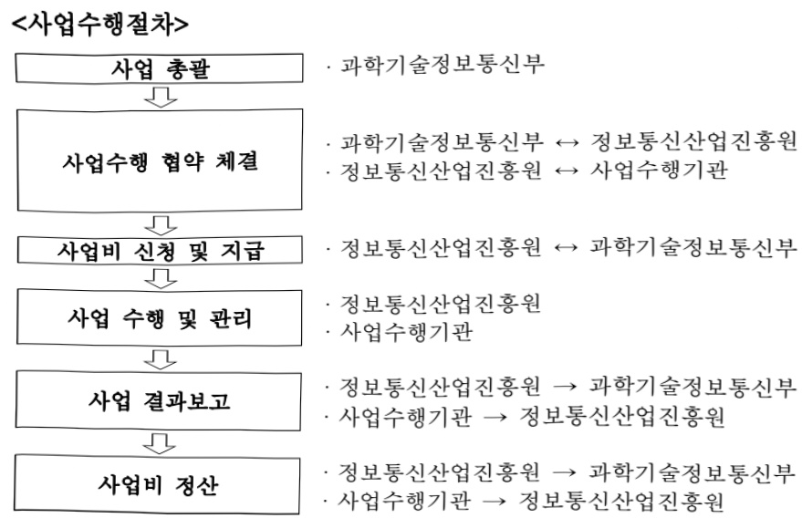

# AI 공간 컴퓨팅 창업 생태계 활성화

**해당 페이지**: PDF 280 ~ 287 쪽 해당

**부처**: 과학기술정보통신부
**분야**: 통신
**회계유형**: 일반회계
**2026 확정예산**: 1500.0 백만원
**전년대비 증감률**: None%
**AI 도메인**: 로봇

---

<table border=1 style='margin: auto; word-wrap: break-word;'><tr><td style='text-align: center; word-wrap: break-word;'>사 업 명</td></tr><tr><td style='text-align: center; word-wrap: break-word;'>(323) AI·공간컴퓨팅 창업 생태계 활성화 (2602-366)</td></tr></table>

사업 코드 정보

<table border=1 style='margin: auto; word-wrap: break-word;'><tr><td style='text-align: center; word-wrap: break-word;'>구분</td><td style='text-align: center; word-wrap: break-word;'>회계</td><td style='text-align: center; word-wrap: break-word;'>소관</td><td style='text-align: center; word-wrap: break-word;'>실국(기관)</td><td style='text-align: center; word-wrap: break-word;'>계정</td><td style='text-align: center; word-wrap: break-word;'>분야</td><td style='text-align: center; word-wrap: break-word;'>부문</td></tr><tr><td style='text-align: center; word-wrap: break-word;'>코드</td><td rowspan="2">일반회계</td><td rowspan="2">과학기술정보통신부</td><td rowspan="2">소프트웨어정책관</td><td rowspan="2">-</td><td style='text-align: center; word-wrap: break-word;'>130</td><td style='text-align: center; word-wrap: break-word;'>133</td></tr><tr><td style='text-align: center; word-wrap: break-word;'>명칭</td><td style='text-align: center; word-wrap: break-word;'>통신</td><td style='text-align: center; word-wrap: break-word;'>정보통신</td></tr></table>

<table border=1 style='margin: auto; word-wrap: break-word;'><tr><td style='text-align: center; word-wrap: break-word;'>구분</td><td style='text-align: center; word-wrap: break-word;'>프로그램</td><td style='text-align: center; word-wrap: break-word;'>단위사업</td><td style='text-align: center; word-wrap: break-word;'>세부사업</td></tr><tr><td style='text-align: center; word-wrap: break-word;'>코드</td><td style='text-align: center; word-wrap: break-word;'>2600</td><td style='text-align: center; word-wrap: break-word;'>2602</td><td style='text-align: center; word-wrap: break-word;'>366</td></tr><tr><td style='text-align: center; word-wrap: break-word;'>명칭</td><td style='text-align: center; word-wrap: break-word;'>인공지능데이터진흥</td><td style='text-align: center; word-wrap: break-word;'>AI경쟁력강화(일반)</td><td style='text-align: center; word-wrap: break-word;'>AI·공간컴퓨팅 창업 생태계 활성화</td></tr></table>

<table border=1 style='margin: auto; word-wrap: break-word;'><tr><td colspan="6">☐ 사업 성격 (공통요구자료 II-1 작성유의사항 4. 참조, 해당하는 사항에 “○” 표시)</td></tr><tr><td style='text-align: center; word-wrap: break-word;'>신규 계속</td><td style='text-align: center; word-wrap: break-word;'>완료</td><td style='text-align: center; word-wrap: break-word;'>예비타당성 실시여부</td><td style='text-align: center; word-wrap: break-word;'>총사업비 관리대상</td><td style='text-align: center; word-wrap: break-word;'>총액계상 예산사업</td><td style='text-align: center; word-wrap: break-word;'>사업소관 변경정보 2025예산 시 소관</td></tr><tr><td style='text-align: center; word-wrap: break-word;'>☐</td><td style='text-align: center; word-wrap: break-word;'></td><td style='text-align: center; word-wrap: break-word;'></td><td style='text-align: center; word-wrap: break-word;'></td><td style='text-align: center; word-wrap: break-word;'></td><td style='text-align: center; word-wrap: break-word;'></td></tr></table>

사업지원형태 및지원을(최소한한개는반드시선택하시오.해당사항에O표시)

<table border=1 style='margin: auto; word-wrap: break-word;'><tr><td style='text-align: center; word-wrap: break-word;'>직접</td><td style='text-align: center; word-wrap: break-word;'>출자</td><td style='text-align: center; word-wrap: break-word;'>출연</td><td style='text-align: center; word-wrap: break-word;'>보조</td><td style='text-align: center; word-wrap: break-word;'>융자</td><td style='text-align: center; word-wrap: break-word;'>국고보조율(%)</td><td style='text-align: center; word-wrap: break-word;'>융자율(%)</td></tr><tr><td style='text-align: center; word-wrap: break-word;'></td><td style='text-align: center; word-wrap: break-word;'></td><td style='text-align: center; word-wrap: break-word;'>○</td><td style='text-align: center; word-wrap: break-word;'></td><td style='text-align: center; word-wrap: break-word;'></td><td style='text-align: center; word-wrap: break-word;'></td><td style='text-align: center; word-wrap: break-word;'></td></tr></table>

□ 사업 소관부처 및 시행주체

<table border=1 style='margin: auto; word-wrap: break-word;'><tr><td style='text-align: center; word-wrap: break-word;'>사업명</td><td colspan="2">구분</td></tr><tr><td rowspan="3">AI·공간컴퓨팅 창업 생태계 활성화</td><td rowspan="2">소관부처</td><td style='text-align: center; word-wrap: break-word;'>정보통신정책실 소프트웨어정책관</td></tr><tr><td style='text-align: center; word-wrap: break-word;'>디지털콘텐츠과</td></tr><tr><td style='text-align: center; word-wrap: break-word;'>사업시행주체</td><td style='text-align: center; word-wrap: break-word;'>정보통신산업진흥원</td></tr></table>

---

### 가. 예산 총괄표

(단위: 백만원, %)

<table border=1 style='margin: auto; word-wrap: break-word;'><tr><td rowspan="2">사업명</td><td rowspan="2">2024년 결산</td><td colspan="2">2025년 예산</td><td colspan="2">2026년 예산</td><td rowspan="2">증감(B-A)</td><td rowspan="2">(B-A)/A</td></tr><tr><td style='text-align: center; word-wrap: break-word;'>본예산</td><td style='text-align: center; word-wrap: break-word;'>추경 $ ^{*} $(A)</td><td style='text-align: center; word-wrap: break-word;'>요구안</td><td style='text-align: center; word-wrap: break-word;'>본예산(B)</td></tr><tr><td style='text-align: center; word-wrap: break-word;'>AI·공간AI·공간컴퓨팅 창업 생태계 활성화</td><td style='text-align: center; word-wrap: break-word;'>-</td><td style='text-align: center; word-wrap: break-word;'>-</td><td style='text-align: center; word-wrap: break-word;'>-</td><td style='text-align: center; word-wrap: break-word;'>1,500</td><td style='text-align: center; word-wrap: break-word;'>1,500</td><td style='text-align: center; word-wrap: break-word;'>1,500</td><td style='text-align: center; word-wrap: break-word;'>순증</td></tr></table>

□ 기능별(내역사업별) 예산 내역

(단위:백만원)

<table border=1 style='margin: auto; word-wrap: break-word;'><tr><td rowspan="2"></td><td colspan="5">2024</td><td colspan="5">2025</td><td rowspan="2">2026 예산</td></tr><tr><td style='text-align: center; word-wrap: break-word;'>예산액(추경)</td><td style='text-align: center; word-wrap: break-word;'>예산 현액</td><td style='text-align: center; word-wrap: break-word;'>집행액</td><td style='text-align: center; word-wrap: break-word;'>이월액</td><td style='text-align: center; word-wrap: break-word;'>불용액</td><td style='text-align: center; word-wrap: break-word;'>예산액(추경)</td><td style='text-align: center; word-wrap: break-word;'>예산 현액</td><td style='text-align: center; word-wrap: break-word;'>집행액</td><td style='text-align: center; word-wrap: break-word;'>이월액</td><td style='text-align: center; word-wrap: break-word;'>불용액</td></tr><tr><td style='text-align: center; word-wrap: break-word;'>○ 기능별 분류(합계)</td><td style='text-align: center; word-wrap: break-word;'>-</td><td style='text-align: center; word-wrap: break-word;'>-</td><td style='text-align: center; word-wrap: break-word;'>-</td><td style='text-align: center; word-wrap: break-word;'>-</td><td style='text-align: center; word-wrap: break-word;'>-</td><td style='text-align: center; word-wrap: break-word;'>-</td><td style='text-align: center; word-wrap: break-word;'>-</td><td style='text-align: center; word-wrap: break-word;'>-</td><td style='text-align: center; word-wrap: break-word;'>-</td><td style='text-align: center; word-wrap: break-word;'>-</td><td style='text-align: center; word-wrap: break-word;'>1,500</td></tr><tr><td style='text-align: center; word-wrap: break-word;'>• 로봇 기반 공간 컴퓨팅 창업지원</td><td style='text-align: center; word-wrap: break-word;'>-</td><td style='text-align: center; word-wrap: break-word;'>-</td><td style='text-align: center; word-wrap: break-word;'>-</td><td style='text-align: center; word-wrap: break-word;'>-</td><td style='text-align: center; word-wrap: break-word;'>-</td><td style='text-align: center; word-wrap: break-word;'>-</td><td style='text-align: center; word-wrap: break-word;'>-</td><td style='text-align: center; word-wrap: break-word;'>-</td><td style='text-align: center; word-wrap: break-word;'>-</td><td style='text-align: center; word-wrap: break-word;'>-</td><td style='text-align: center; word-wrap: break-word;'>1,500</td></tr></table>

---

### 나. 사업설명자료

## 1 ) 사업목적·내용

□ (AI·공간컴퓨팅 창업 생태계 활성화) AI·공간컴퓨팅 산업의 기술창업 도전 활성화와 초기 창업기업의 안정적 성장 지원을 통한 기술집약 산업의 지속 가능한 기술창업 생태계 조성

- (로봇 기반 공간컴퓨팅 창업지원) 예비·초기 창업기업 대상 로봇 기반 신서비스 발굴 및

맞춤형 프로그램 운영을 통한 지역 창업 생태계 활성화

## 2 ) 사업개요

□ 사업근거 및 추진경위

① 법령상 근거 및 조항 적시

- 「정보통신 진흥 및 융합 활성화 등에 관한 특별법」 제21조, 제32조

제21조(디지털콘텐츠의 진흥과 활성화) ① 정부는 디지털콘텐츠 제작자의 창의성을 높이고, 유망 디지털콘텐츠가 창작·유통·이용될 수 있는 환경을 조성하여야 하며, 관련 산업의 경쟁력을 강화하기 위하여 노력하여야 한다.

② 정부는 디지털콘텐츠의 진흥 및 활성화를 위하여 다음 각 호의 사업을 추진할 수 있다.

1. 디지털콘텐츠의 제작 및 유통 지원

2. 디지털콘텐츠 관련 지역협력 및 시범사업

3. 디지털콘텐츠 인프라 구축 지원

4. 디지털콘텐츠 관련 전문인력 양성 지원

5. 디지털콘텐츠 진흥 및 활성화를 위한 정책연구 사업

6. 그 밖에 디지털콘텐츠 진흥 및 활성화를 위하여 대통령령으로 정하는 사항

③ 정부는 제2항 각 호의 사업을 효율적으로 추진하기 위하여 전담기관을 지정할 수 있으며, 필요한 비용의 전부 또는 일부를 보조할 수 있다.

④ 제2항에 따른 지원 사업 및 제3항에 따른 전담기관의 지정 등에 필요한 사항은 대통령령으로 정한다.

제32조(정보통신융합등 기술·서비스 개발 등의 지원) ① 과학기술정보통신부장관은 다른 산업 및 서비스 등에 정보통신의 접목을 통하여 생산성과 가치를 높일 수 있도록 노력하여야 한다. <개정 2017. 7. 26.>

② 과학기술정보통신부장관은 정보통신융합등 기술·서비스의 개발을 촉진하기 위하여 다음 각 호의 사업을 추진할 수 있다. <개정 2017. 7. 26.>

1. 정보통신융합등 기술·서비스 관련 연구개발 사업

2. 제1호에 따라 추진되는 과제에 대한 기획·평가·관리

3. 국가·지방자치단체, 대학·정부출연연구기관, 민간 등이 보유한 정보통신융합등 기술의 거래 등 기술이전을 위한 중개·알선 지원

4. 정보통신융합등 기술에 대한 평가 및 평가 기법의 개발·보급

5. 정보통신융합등 기술의 기술이전·사업화에 관한 통계조사·연구 등 관련 정보의 수집·분석·제공

6. 정보통신융합등 기술의 기술이전 후 상용화 연구개발 지원

7. 정보통신융합등 기술의 기술사업화 전문인력 양성

8. 정보통신융합등 기술의 기술거래·사업화 촉진을 위한 정보시스템 구축·활용

9. 지식재산권 등 정보통신융합등 기술 관련 연구성과물의 관리·홍보·활용

10. 정보통신융합등 기술·서비스의 수준조사 등 정책연구 사업

---

11.정보통신융합등 기술·서비스 관련 시범사업

12. 그 밖에 정보통신기술진흥을 위하여 필요한 사업

③ 과학기술정보통신부장관은 제2항 각 호의 사업을 추진하기 위하여 법인인 전담기관을 설립하거나 법인·단체에 위탁·운영할 수 있으며, 필요한 비용의 전부 또는 일부를 예산의 범위에서 출연 또는 보조할 수 있다. <개정 2017. 7. 26.>

④ 중앙행정기관의 장 및 지방자치단체의 장은 제2항 각 호의 사업을 제3항에 따른 전담기관으로 하여금 수행하게 하고, 그에 소요되는 비용의 전부 또는 일부를 지원할 수 있다.

⑤ 제3항에 따른 전담기관에 관하여 이 법에서 정한 것을 제외하고는「민법」중 재단법인에 관한 규정을 준용하며, 전담기관의 운영 및 제2항 각 호의 업무수행에 필요한 사항은 대통령령으로 정한다.

## -「정보통신산업진흥법」제26조, 제27조

제27조(사업)산업진흥원은 다음 각 호의 사업을 한다.<개정 2011.7.25.,2012.6.1.,2020.6.9.>

1. 정보통신산업 정책연구 및 정책수립 지원

2. 전문인력 양성

3. 정보통신산업 육성 · 발전 및 지원시설 등 기반조성사업

4. 정보통신기업의 창업·성장 등의 지원

5. 정보통신산업 발전을 위한 유통시장 활성화와 마케팅 지원

6. 정보통신산업 동향분석, 통계작성, 정보 유통, 서비스 등에 관한 사업

7. 정보통신기술의 융합·활용에 관한 사업

8. 정보통신산업 관련 국제교류·협력 및 해외진출의 지원

9. 정보통신산업 관련 출판·홍보

10.「소프트웨어 진흥법」제2조제2호에 따른 소프트웨어산업에 관한 다음 각 목의 사업

가. 소프트웨어 기술진흥을 위한 정책 및 제도의 조사·연구

나. 소프트웨어사업자의 품질관리능력 및 전문성 향상에 필요한 사업

11. 삭제 <2015. 6. 22.>

12.「이러닝(전자학습)산업 발전 및 이러닝 활용 촉진에 관한 법률」에 따른 이러닝산업의 발전에 필요한 기술개발 및 표준화 연구

13. 이 법 또는 다른 법령에서 산업진흥원의 업무로 정하거나 산업진흥원에 위탁한 사업

14. 그 밖에 산업진흥원의 설립 목적을 달성하는 데 필요한 사업으로서 대통령령으로 정하는 사업

## -「가상융합산업 진흥법」제7조, 제11조, 제12조, 제17조, 제20조, 제21조, 제31조

제7조(재원의 확보) 과학기술정보통신부장관은 가상융합산업 진흥을 위하여 예산, 「방송통신발전기본법」 제24조에 따른 방송통신발전기금 및 「정보통신산업 진흥법」 제41조에 따른 정보통신진흥기금으로 관련 사업을 지원할 수 있다.

제11조(기술개발의 촉진) ① 정부는 가상융합기술의 개발과 발전을 촉진하기 위하여 다음 각 호의 사업을 추진할 수 있다.

1. 국내외 가상융합기술 동향·수준 및 관련 제도의 조사

2. 가상융합기술의 연구·개발, 시험 및 평가

3. 가상융합기술 협력·이전 등 기술의 실용화

4. 가상융합기술 정보의 원활한 유통

5. 그 밖에 가상융합기술 개발을 위하여 필요한 사업

② 정부는 제1항에 따른 사업을 효율적으로 추진하기 위하여 필요한 때에는 제17조에 따른 전담기관이나 관련 기관 또는 단체에 제1항 각 호의 사업을 위탁할 수 있다.

③ 정부 및 지방자치단체는 제2항에 따라 사업을 위탁받은 자에게 예산의 범위에서 해당 사업의 수행에 필요한 비용의 전부 또는 일부를 지원할 수 있다.

---

④ 제2항에 따라 위탁하는 업무의 범위, 위탁기관의 선정 방법 및 절차 등에 필요한 시행은 대통령령으로 정한다.

제12조(연구개발기반의 조성) ① 정부는 가상융합산업 관련 연구·개발의 촉진을 위하여 인력·시설·기자재·지금 및 정보 등의 활용을 위한 제도적 기반을 구축하도록 노력하여야 한다.

② 정부는 가상융합산업 관련 연구·개발을 추진하는 자에 대하여 연구·개발에 소요되는 비용의 전부 또는 일부를 지원할 수 있다.

제17조(전담기관의 지정·운영) ① 과학기술정보통신부장관은 가상융합산업 진흥에 관한 정책을 효율적으로 추진하기 위하여 전담기관(이하 "전담기관"이라 한다)을 지정할 수 있다.

② 전담기관은 다음 각 호의 사업을 수행한다.

1. 가상융합산업 관련 통계 및 정보의 분석·제공·공유

2. 가상융합산업 발굴, 기획 및 지원

3. 가상융합산업 관련 시범사업, 실증사업, 법·제도 개선 지원

4. 가상융합산업 관련 해외 진출 및 국제협력 지원

5. 제19조에 따른 가상융합산업지원센터의 관리·감독

6.그 밖에 대통령령으로 정하는 사업

③ 과학기술정보통신부장관은 예산,「방송통신발전 기본법」제24조에 따른 방송통신발전기금 및「정보통신산업진흥법」제41조에 따른 정보통신진흥기금에서 전담기관의 운영 및 제2항 각 호의 사업을 수행하는 데 필요한 경비를 출연 또는 보조할 수 있다.

④과학기술정보통신부장관은 전담기관이 다음 각 호의 어느 하나에 해당하는 경우 그 지정을 취소할 수 있다.

다만, 제1호에 해당하면 그 지정을 취소하여야 한다.

1. 거짓이나 그 밖의 부정한 방법으로 지정을 받은 경우

2. 제5항에 따른 지정요건을 충족할 수 없게 된 경우

3. 그 밖에 전담기관으로서의 업무를 수행하는 것이 현저히 부당하게 된 경우

⑤ 그 밖에 전담기관의 지정요건, 지정, 지정취소 및 지원 등에 필요한 사항은 대통령령으로 정한다.

제20조(가상융합사업자에 대한 지원) ① 정부 및 지방자치단체는 가상융합산업 진흥을 위하여 가상융합사업자에 대하여 다음 각 호의 행정적·재정적 지원을 할 수 있다.

1. 가상융합기술 또는 가상융합서비스등의 개발 지원 및 연구·개발 성과의 확산

2. 장비·시설 등의 공동 사용

3. 가상융합기술 또는 가상융합서비스등의 사업화 지원

4. 그 밖에 가상융합산업 진흥을 위하여 대통령령으로 정하는 사항

제21조(가상융합산업 지원사업) 중앙행정기관의 장 및 지방자치단체의 장은 가상융합산업 진흥을 위하여 다음 각 호의 사업을 시행할 수 있다.

1.연구 사업

2. 활성화 기반 조성 및 제도 개선 사업

3. 호환성, 상호운용성 확보 및 연계 사업

4.기존 서비스 등의 가상융합서비스등으로의 전환 지원 사업

5.그밖에 가상융합산업 진흥을 위하여 필요한 사업

제31조(건전한 가상융합세계 생태계의 조성 등) ① 정부는 이용자의 권익을 보호하고 건전한 가상융합세계 생태계의 조성 및 유지를 위하여 노력하여야 한다.

② 가상융합사업자는 건전한 가상융합세계 생태계의 조성 및 유지를 위하여 성별, 정치, 경제, 사회, 문화 등과 관련된 부당한 차별적 콘텐츠의 제작, 유통, 배포, 게시, 전시, 복제, 전송 등을 하지 아니하도록 노력하여야 한다.

다만, 「저작권법」에 따른 온라인서비스제공자에 해당하는 가상융합사업자의 경우에는 이러한 노력이「저작권법」제102조제3항에 따른 모니터링이나 조사를 목적으로 하여서는 아니 된다.

③ 매출액, 이용자 수 등이 대통령령으로 정하는 기준에 해당하는 가상융합 플랫폼 사업자는 법령 및 약관·운영정책 등의 위반과 관련된 이용자와 가상융합 플랫폼 사업자 사이 또는 이용자들 사이의 분쟁을 해결하기 위한 절차를 마련하여야 한다.

④ 가상융합 플랫폼 사업자는 플랫폼을 투명하고 공정하게 운영하여야 하며, 이용자를 부당하게 차별하여 취급하지 아니하도록 노력하여야 한다.

⑤ 가상융합 플랫폼 사업자는 플랫폼의 품질·성능 및 정보보호·보안 수준을 향상시키고, 호환성, 상호운용성 및 서비스의 지속가능성을 확보하기 위하여 노력하여야 한다.

---

## ② 추진경위

- '17년 7월 : 국정운영 5개년 계획 100대 국정과제 '소프트웨어 강국, ICT 르네상스로

4차 산업 선도 기반 구축 발표

- '18년 12월 : '콘텐츠산업 경쟁력강화 핵심전략 발표(관계부처, 국정현안점검조정회의)

- '19년 12월 : 실감콘텐츠산업 활성화 전략 발표(과기정통부)

20년 6월 : 실감콘텐츠 인재양성 추진계획 발표(과기정통부, 정보통신전략위)

20년 11월 : 가상융합경제 발전전략 발표(과기정통부, 국정현안점검조정회의)

- '22년 01월 : 메타버스 신산업 선도전략 발표(제53차 경제중대본 회의)

- '22년 05월 : 110대 국정과제 '77-4 메타버스 경제 활성화' 발표

- '24년 02월 : 「가상융합산업 진흥법」 제정

- '26년 01월 : AI·공간컴퓨팅 창업 생태계 활성화 사업 착수

## 주요내용

① 사업규모

- 총사업비(해당되는 경우에만 기재) : 해당없음

- 사업기간 : '26년 ~ 계속

- 최근 5년 간 투입된 사업비(예산액기준, 추경편성한 연도에는 추경포함)

<table border=1 style='margin: auto; word-wrap: break-word;'><tr><td style='text-align: center; word-wrap: break-word;'>$ \underline{\text{所}} $</td><td style='text-align: center; word-wrap: break-word;'>2022</td><td style='text-align: center; word-wrap: break-word;'>2023</td><td style='text-align: center; word-wrap: break-word;'>2024</td><td style='text-align: center; word-wrap: break-word;'>2025</td><td style='text-align: center; word-wrap: break-word;'>2026(所)</td></tr><tr><td style='text-align: center; word-wrap: break-word;'>$ \underline{\text{人}} $</td><td style='text-align: center; word-wrap: break-word;'>-</td><td style='text-align: center; word-wrap: break-word;'>-</td><td style='text-align: center; word-wrap: break-word;'>-</td><td style='text-align: center; word-wrap: break-word;'>-</td><td style='text-align: center; word-wrap: break-word;'>1,500</td></tr></table>

## ② 사업추진체계

- 사업시행방법 : 출연

- 사업시행주체 : 정보통신산업진흥원

- 사업 수혜자 : AI·공간컴퓨팅 산업 분야 초기 창업 기업 및 구직자, 일반국민 등

- 보조, 융자, 출연, 출자 등의 경우 보조·융자 등 지원 비율 및 법적근거

<table border=1 style='margin: auto; word-wrap: break-word;'><tr><td style='text-align: center; word-wrap: break-word;'>내역사업명</td><td style='text-align: center; word-wrap: break-word;'>구분</td><td style='text-align: center; word-wrap: break-word;'>피보조·피출연 등 기관명</td><td style='text-align: center; word-wrap: break-word;'>지원 금액 (2026예산안)</td><td style='text-align: center; word-wrap: break-word;'>지원 비율(%)</td><td style='text-align: center; word-wrap: break-word;'>보조율 법적근거 (해당 조항)</td></tr><tr><td style='text-align: center; word-wrap: break-word;'>로봇기반 공간컴퓨팅 창업지원</td><td style='text-align: center; word-wrap: break-word;'>출연</td><td style='text-align: center; word-wrap: break-word;'>정보통신 산업진흥원</td><td style='text-align: center; word-wrap: break-word;'>1,500</td><td style='text-align: center; word-wrap: break-word;'>100</td><td style='text-align: center; word-wrap: break-word;'>가상융합산업 진흥법 제7조, 제17조 정보통신산업 진흥법 제27조, 제28조 정보통신 진흥 및 융합 활성화 등에 관한 특별법 제21조</td></tr></table>

---

## 3 ) 2026년도 예산 산출 근거

① 로봇 기반 공간컴퓨팅 창업지원 : 1,500백만원

- (요구) 산업 인프라 붕괴와 지역 소멸 위기를 겪는 지방 산업 현장 경쟁력 제고를 위해, 생산공정·재고관리·노인 돌봄 등 다양한 분야의 로봇 기반 신산업 창출과 창업 활성화에 1,500백만원 요구

- (산출) 지역 초기창업 기업지원(200백만원×6개), 지역 예비창업 지원(50백만원×6개)

※ 가상용합산업 진흥 인프라 구축 지자체 출연기관 등(국비:지방비=7:3 매칭)

## 4 ) 사업효과

☐ 사업영향, 산출물 성과지표 등

① 2022~2026년도 성과계획서 상 성과지표 및 최근 5년간 성과 달성도

<table border=1 style='margin: auto; word-wrap: break-word;'><tr><td style='text-align: center; word-wrap: break-word;'>성과지표</td><td style='text-align: center; word-wrap: break-word;'>구분</td><td style='text-align: center; word-wrap: break-word;'>2022</td><td style='text-align: center; word-wrap: break-word;'>2023</td><td style='text-align: center; word-wrap: break-word;'>2024</td><td style='text-align: center; word-wrap: break-word;'>2025</td><td style='text-align: center; word-wrap: break-word;'>2026</td><td style='text-align: center; word-wrap: break-word;'>2026 목표치산출근거</td><td style='text-align: center; word-wrap: break-word;'>측정산식(또는 측정방법)</td><td style='text-align: center; word-wrap: break-word;'>자료수집방법(또는 자료출처)</td></tr><tr><td rowspan="3">콘텐츠·서비스상용화 건수(단위: 건)</td><td style='text-align: center; word-wrap: break-word;'>목표</td><td style='text-align: center; word-wrap: break-word;'>-</td><td style='text-align: center; word-wrap: break-word;'>-</td><td style='text-align: center; word-wrap: break-word;'>-</td><td style='text-align: center; word-wrap: break-word;'>-</td><td style='text-align: center; word-wrap: break-word;'>6</td><td rowspan="3">초기 창업기업 수를 고려하여 산정</td><td rowspan="3">당해연도개발완료 및 매출발생</td><td rowspan="3">결과보고서</td></tr><tr><td style='text-align: center; word-wrap: break-word;'>실적</td><td style='text-align: center; word-wrap: break-word;'>-</td><td style='text-align: center; word-wrap: break-word;'>-</td><td style='text-align: center; word-wrap: break-word;'>-</td><td style='text-align: center; word-wrap: break-word;'>-</td><td style='text-align: center; word-wrap: break-word;'></td></tr><tr><td style='text-align: center; word-wrap: break-word;'>달성도</td><td style='text-align: center; word-wrap: break-word;'>-</td><td style='text-align: center; word-wrap: break-word;'>-</td><td style='text-align: center; word-wrap: break-word;'>-</td><td style='text-align: center; word-wrap: break-word;'>-</td><td style='text-align: center; word-wrap: break-word;'></td></tr><tr><td rowspan="3">창업 건수(단위: 건)</td><td style='text-align: center; word-wrap: break-word;'>목표</td><td style='text-align: center; word-wrap: break-word;'>-</td><td style='text-align: center; word-wrap: break-word;'>-</td><td style='text-align: center; word-wrap: break-word;'>-</td><td style='text-align: center; word-wrap: break-word;'>-</td><td style='text-align: center; word-wrap: break-word;'>3</td><td rowspan="3">예비창업프로그램수료팀 수를 고려하여 산정</td><td rowspan="3">창업 발생건수</td><td rowspan="3">결과보고서</td></tr><tr><td style='text-align: center; word-wrap: break-word;'>실적</td><td style='text-align: center; word-wrap: break-word;'>-</td><td style='text-align: center; word-wrap: break-word;'>-</td><td style='text-align: center; word-wrap: break-word;'>-</td><td style='text-align: center; word-wrap: break-word;'>-</td><td style='text-align: center; word-wrap: break-word;'></td></tr><tr><td style='text-align: center; word-wrap: break-word;'>달성도</td><td style='text-align: center; word-wrap: break-word;'>-</td><td style='text-align: center; word-wrap: break-word;'>-</td><td style='text-align: center; word-wrap: break-word;'>-</td><td style='text-align: center; word-wrap: break-word;'>-</td><td style='text-align: center; word-wrap: break-word;'></td></tr></table>

② 성과지표 이외의 연도별 사업추진 경과 및 실적: 해당없음

③ 향후(2026년도 이후) 기대효과

- AI·공간컴퓨팅 스타트업 육성을 통해 IT, 콘텐츠, 서비스 등 다양한 분야의 취업

획대 및 고용창출에 기여

- 초기 창업기업의 투자 유치 및 민간 벤처캐피털 참여 확대를 기반으로 민간 주도의 투자 활성화 유도

5) 타당성조사 및 예비타당성조사 시행여부 및 결과 요지 : 해당없음

6) 총사업비 대상사업 여부 및 내역 : 해당없음

---

## 7 ) 사업 집행절차

## <사업수행절차>

## <사업 시행체계>

<table border=1 style='margin: auto; word-wrap: break-word;'><tr><td style='text-align: center; word-wrap: break-word;'>부처</td><td style='text-align: center; word-wrap: break-word;'></td><td style='text-align: center; word-wrap: break-word;'>피출연·피보조기관</td><td style='text-align: center; word-wrap: break-word;'></td><td style='text-align: center; word-wrap: break-word;'>간접보조사업자·사업수행자</td></tr><tr><td style='text-align: center; word-wrap: break-word;'>과학기술정보통신부(1,500백만원)</td><td style='text-align: center; word-wrap: break-word;'>=&gt;(1,500백만원)</td><td style='text-align: center; word-wrap: break-word;'>정보통신산업진흥원(90백만원)</td><td style='text-align: center; word-wrap: break-word;'>=&gt;(1,410백만원)</td><td style='text-align: center; word-wrap: break-word;'>사업수행기관 등</td></tr></table>

## 8 ) 각종 평가: 해당없음

### 다. 최근 4년간 결산내역: 해당없음

---

### 원본 PDF 크롭 이미지

