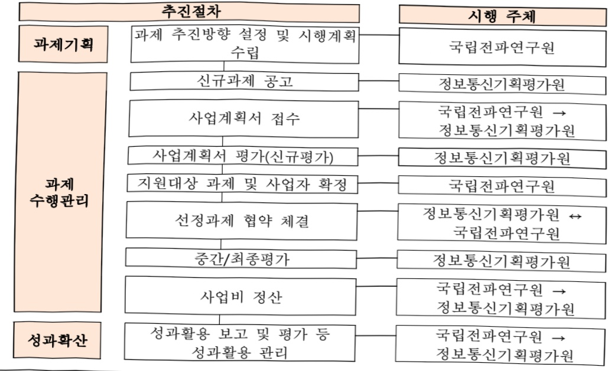

# AI 기반 주파수 간섭분석 및 전파 예측기술 개발(R&D)

**해당 페이지**: PDF 302 ~ 309 쪽 해당

**부처**: 과학기술정보통신부
**분야**: 통신
**회계유형**: 일반회계
**2026 확정예산**: 3670.0 백만원
**전년대비 증감률**: 267.0%
**AI 도메인**: 교통/모빌리티, 통신/네트워크, 디지털전환(AX)

---

### 가. 예산 총괄표

(단위: 백만원, %)

<table border=1 style='margin: auto; word-wrap: break-word;'><tr><td rowspan="2">사업명</td><td rowspan="2">2024년 결산</td><td colspan="2">2025년 예산</td><td colspan="2">2026년</td><td rowspan="2">증감(B-A)</td><td rowspan="2">(B-A)/A</td></tr><tr><td style='text-align: center; word-wrap: break-word;'>본예산</td><td style='text-align: center; word-wrap: break-word;'>추경(A)</td><td style='text-align: center; word-wrap: break-word;'>요구안</td><td style='text-align: center; word-wrap: break-word;'>본예산(B)</td></tr><tr><td style='text-align: center; word-wrap: break-word;'>AI 기반 주파수 간섭분석 및 전파 예측기술 개발(R&amp;D)</td><td style='text-align: center; word-wrap: break-word;'>-</td><td style='text-align: center; word-wrap: break-word;'>1,000</td><td style='text-align: center; word-wrap: break-word;'>1,000</td><td style='text-align: center; word-wrap: break-word;'>3,070</td><td style='text-align: center; word-wrap: break-word;'>3,670</td><td style='text-align: center; word-wrap: break-word;'>2,670</td><td style='text-align: center; word-wrap: break-word;'>267</td></tr></table>

□ 기능별(내역사업별) 예산 내역

(단위:백만원)

<table border=1 style='margin: auto; word-wrap: break-word;'><tr><td rowspan="2"></td><td colspan="5">2024</td><td colspan="5">2025</td><td rowspan="2">2026예산</td></tr><tr><td style='text-align: center; word-wrap: break-word;'>예산액(추정)</td><td style='text-align: center; word-wrap: break-word;'>예산현액</td><td style='text-align: center; word-wrap: break-word;'>집행액</td><td style='text-align: center; word-wrap: break-word;'>이월액</td><td style='text-align: center; word-wrap: break-word;'>불용액</td><td style='text-align: center; word-wrap: break-word;'>예산액(추정)</td><td style='text-align: center; word-wrap: break-word;'>예산현액</td><td style='text-align: center; word-wrap: break-word;'>집행액</td><td style='text-align: center; word-wrap: break-word;'>이월액</td><td style='text-align: center; word-wrap: break-word;'>불용액</td></tr><tr><td style='text-align: center; word-wrap: break-word;'>○ 기능별 분류(합계)</td><td style='text-align: center; word-wrap: break-word;'>-</td><td style='text-align: center; word-wrap: break-word;'>-</td><td style='text-align: center; word-wrap: break-word;'>-</td><td style='text-align: center; word-wrap: break-word;'>-</td><td style='text-align: center; word-wrap: break-word;'>-</td><td style='text-align: center; word-wrap: break-word;'>1,000</td><td style='text-align: center; word-wrap: break-word;'>1,000</td><td style='text-align: center; word-wrap: break-word;'>996</td><td style='text-align: center; word-wrap: break-word;'>-</td><td style='text-align: center; word-wrap: break-word;'>4</td><td style='text-align: center; word-wrap: break-word;'>3,670</td></tr><tr><td rowspan="2">• AI 기반 차세대 주파수 간섭분석 기술 개발 • 차세대 모빌리티 고속통신 전파예측 기술 연구</td><td style='text-align: center; word-wrap: break-word;'>-</td><td style='text-align: center; word-wrap: break-word;'>-</td><td style='text-align: center; word-wrap: break-word;'>-</td><td style='text-align: center; word-wrap: break-word;'>-</td><td style='text-align: center; word-wrap: break-word;'>-</td><td style='text-align: center; word-wrap: break-word;'>1,000</td><td style='text-align: center; word-wrap: break-word;'>1,000</td><td style='text-align: center; word-wrap: break-word;'>996</td><td style='text-align: center; word-wrap: break-word;'>-</td><td style='text-align: center; word-wrap: break-word;'>4</td><td style='text-align: center; word-wrap: break-word;'>1,920</td></tr><tr><td style='text-align: center; word-wrap: break-word;'>-</td><td style='text-align: center; word-wrap: break-word;'>-</td><td style='text-align: center; word-wrap: break-word;'>-</td><td style='text-align: center; word-wrap: break-word;'>-</td><td style='text-align: center; word-wrap: break-word;'>-</td><td style='text-align: center; word-wrap: break-word;'>-</td><td style='text-align: center; word-wrap: break-word;'>-</td><td style='text-align: center; word-wrap: break-word;'>-</td><td style='text-align: center; word-wrap: break-word;'>-</td><td style='text-align: center; word-wrap: break-word;'>-</td><td style='text-align: center; word-wrap: break-word;'>1,750</td></tr></table>

### 나. 사업설명자료

## 1 ) 사업목적·내용

- (AI 기반 주파수 간섭분석 및 전파 예측기술 개발) 실 전파환경의 주파수 특성을

정확하게 반영하는 AI 기반의 주파수 간섭분석 및 예측기술을 개발하여 최적화된

주파수 자원을 효율적으로 공급하는 디지털 주파수 관리 패러다임 변화를 주도

· (AI 기반 차세대 주파수 간섭분석 기술 개발) 차세대 전파기반 융합 신산업의 활성화에 필수인 고품질 주파수를 적시·적량 공급하기 위해 AI 기반으로 실 전파 환경을 반영한 주파수 간섭분석 기술 개발

(차세대 모빌리티 고속통신 전파예측 기술 연구) 자율주행 자동차, UAM 등 융합

서비스와 연계된 '3차원 배치 및 이동성'을 특징으로 하는 새로운 개념의 전파환경

도래에 따라, 3차원 이동체 환경에 대한 AI 기반 전파 경로손실 예측기술 개발

---

## 2 ) 사업개요

□ 사업근거 및 추진경위

① 법령상 근거 및 조항 적시

## 0 전파법 제5조(전파자원의 확보)

- (1) 과학기술정보통신부 장관은 전과자원을 확보하기 위하여 다음 각 호의 시책을 마련하고 시행하여야 하며, 그 시행에 필요한 지원방안을 마련하여야 한다.

2. 이용 중인 주파수의 이용효율 향상

2의2. 주파수 공동사용기술 개발

## ○ 전파법 제6조(전파자원 이용효율의 개선)

- (1) 과학기술정보통신부 장관은 전과자원의 공평하고 효율적인 이용을 촉진하기 위하여 필요하면 다음 각 호의 사항을 시행하여야 한다.

3. 새로운 기술방식으로의 전환

4. 주파수의 공동사용

## ○ 전파법 제6조의3(주파수 공동사용)

- ① 과학기술정보통신부 장관은 주과수할당, 주과수지정, 주과수 사용승인을 받은 자에게 주과수의 전부 또는 일부를 주과수 공동사용에 제공하도록 할 수 있다. 다만, 제6조의4에 따라 방송사업을 위하여 이용하는 주과수에 대해서는 방송통신위원회와 합의하여야 한다.

② 과학기술정보통신부장관은 주과수 공동사용의 범위와 조건, 절차, 방법 등에 관한 기준을 정하여 고시한다. 다만, 제6조의4에 따라 방송사업을 위하여 이용하는 주과수에 대해서는 방송통신위원회와 합의하여야 한다.

## ○ 전파법 제61조(전파연구)

- ① 과학기술정보통신부장관은 전파이용을 촉진하고 보호하기 위하여 필요한 연구를 수행하여야 한다.

② 제1항에 따라 수행하는 연구는 다음 각 호와 같다.

2. 전파의 전파(傳播) 분석 및 주파수할당 기법의 연구

## o 전파법 제62조(기술개발의 촉진)

- ① 과학기술정보통신부장관은 전과산업과 방송기기산업의 기반 조성에 필요한 기술의 연구 개발 및 활용을 촉진하기 위하여 다음 각 호의 사항을 추진하여야 한다.

4. 산업계·학계 및 연구계의 공동연구·개발

5. 그 밖에 기술개발을 위하여 필요한 사항

② 추진경위 - 사업 시작년도, 추진배경, 부처별 중점과제, 대통령 공약사항 등

- 2021.1 월, 「2021년 디지털뉴딜 실행계획」 발표

·데이터·네트워크·인공지능 등 찬성

---

- 2021.1월,「21년 전파진흥시행계획」수립

- 2024.1월, K-ICT 스펙트럼 플랜, “디지털 심화시대, 주파수를 가장 잘 이용하는 국가”

· 전 대역 이동통신 주파수의 이용효율 제고 및 디지털 혁신을 가속화하는 신 이동

통신 주파수 공급체계 마련

·산업·공공 전 분야의 주파수 수요 다변화에 신속히 대응할 수 있도록 주파수

이용체계 혁신 및 주파수 혼·간섭 최소화

- 2024.2월, 「2024년 과기정통부 주요정책 추진계획」"인공지능·디지털 대전환 선도"

글로벌 AI 기술 주도권 확보 및 AI와 디지털 신기술 융합 선도프로젝트를 통한

新시장 창출

· AI·디지털 분야 글로벌 규범 논의 주도 및 글로벌 시장 주도권 확보를 추진

- (대통령 공약 및 국정과제 연관성)

(공약 B-2-1-2) AI 시대, 차세대 첨단기술 개발과 투자를 강화하겠습니다.

(경제 2-2, 세계에서 AI를 가장 잘 쓰는『AI 기본사회』실현) 주파수 간섭분석 및 스펙트럼 관리(주파수 할당, 지정 등)에 AI 도입하여 최적화된 디지털 주파수 관리기술 개발

(경제 2-2-3, AI 활용 확대를 통한 전 산업·지역 AI 확산) 실 전과환경을 분석하고 전과 전달 특성을 정확하게 예측하는 AI 기술을 개발하여 전과기반 산업 육성 및 국제표준 선도

## □주요내용

① 사업규모

- 총사업비(해당되는 경우에만 기재) : 해당없음

- 사업기간 : '25 ~ '29년(5년)

-최근 5년 간 투입된 사업비(예산액기준, 추경편성한 연도에는 추경포함)

<table border=1 style='margin: auto; word-wrap: break-word;'><tr><td style='text-align: center; word-wrap: break-word;'>연도</td><td style='text-align: center; word-wrap: break-word;'>2022</td><td style='text-align: center; word-wrap: break-word;'>2023</td><td style='text-align: center; word-wrap: break-word;'>2024</td><td style='text-align: center; word-wrap: break-word;'>2025</td><td style='text-align: center; word-wrap: break-word;'>2026</td></tr><tr><td style='text-align: center; word-wrap: break-word;'>사업비</td><td style='text-align: center; word-wrap: break-word;'>-</td><td style='text-align: center; word-wrap: break-word;'>-</td><td style='text-align: center; word-wrap: break-word;'>-</td><td style='text-align: center; word-wrap: break-word;'>1,000</td><td style='text-align: center; word-wrap: break-word;'>3,670</td></tr></table>

-기타:해당없음

② 사업추진체계

- 사업시행방법 : 직접수행, 출연

-사업시행주체:과학기술정보통신부 국립전파연구원,정보통신기획평가원

- 사업 수혜자 : 방송·통신 등 전과 관련 민간업체

- 보조, 융자, 출연, 출자 등의 경우 보조·융자 등 지원 비율 및 법적근거

---

<table border=1 style='margin: auto; word-wrap: break-word;'><tr><td style='text-align: center; word-wrap: break-word;'>내역사업명</td><td style='text-align: center; word-wrap: break-word;'>구분</td><td style='text-align: center; word-wrap: break-word;'>피보조·피출연 등 기관명</td><td style='text-align: center; word-wrap: break-word;'>지원 금액 (2026예산안)</td><td style='text-align: center; word-wrap: break-word;'>지원 비율(%)</td><td style='text-align: center; word-wrap: break-word;'>보조율 법적근거 (해당 조항)</td></tr><tr><td style='text-align: center; word-wrap: break-word;'>AI 기반 차세대 주파수 간섭분석 기술개발</td><td style='text-align: center; word-wrap: break-word;'>출연</td><td style='text-align: center; word-wrap: break-word;'>정보통신 기획평가원</td><td style='text-align: center; word-wrap: break-word;'>1,870</td><td style='text-align: center; word-wrap: break-word;'>100</td><td rowspan="2">국가연구개발혁신법 제22조제3항 정보통신 진흥 및 융합 활성화 등에 관한 특별법 제32조제3항</td></tr><tr><td style='text-align: center; word-wrap: break-word;'>차세대 모빌리티 고속통신 전파예측 기술 연구</td><td style='text-align: center; word-wrap: break-word;'>출연</td><td style='text-align: center; word-wrap: break-word;'>정보통신 기획평가원</td><td style='text-align: center; word-wrap: break-word;'>1,750</td><td style='text-align: center; word-wrap: break-word;'>100</td></tr></table>

## 3 ) 2026년도 예산 산출 근거

① AI 기반 차세대 주파수 간섭분석 기술 개발 : 1,920백만원

- AI 전파 클러터 및 주파수 간섭분석 기술개발 : 1,270백만원

·(산출) (계속) 1개 x 1,270백만원 x 12/12개월 = 1,270백만원

- 전파 매질 한계극복 전파모델 개발 : 600백만원

· (산출) (신규) 1개 x 800백만원 x 9/12개월 = 600백만원

· 차세대 전파 응용기술 ITU-R 국제표준 분석 : 50백만원

· (산출) (계속) 1개 x 50백만원 x 12/12개월 = 50백만원

② 차세대 모빌리티 고속통신 전파예측 기술 연구 1,750백만원 (순증)

- AI 기반 이동체 환경 전파채널 모델 개발 : 1,750백만원

· (산출) (신규) 1개 × 2,333백만원 × 9/12개월 = 1,750백만원

## 4 ) 사업효과

□ 사업영향, 산출물 성과지표 등

① 2022~2026년도 성과계획서 상 성과지표 및 최근 5년간 성과 달성도

<table border=1 style='margin: auto; word-wrap: break-word;'><tr><td style='text-align: center; word-wrap: break-word;'>성과지표</td><td style='text-align: center; word-wrap: break-word;'>구분</td><td style='text-align: center; word-wrap: break-word;'>2022</td><td style='text-align: center; word-wrap: break-word;'>2023</td><td style='text-align: center; word-wrap: break-word;'>2024</td><td style='text-align: center; word-wrap: break-word;'>2025</td><td style='text-align: center; word-wrap: break-word;'>2026</td><td style='text-align: center; word-wrap: break-word;'>2026 목표치산출근거</td><td style='text-align: center; word-wrap: break-word;'>측정산식(또는 측정방법)</td><td style='text-align: center; word-wrap: break-word;'>자료수집방법(또는 자료출처)</td></tr><tr><td rowspan="3">표준화된 순위보정 영향력 지수(단위: 점)</td><td style='text-align: center; word-wrap: break-word;'>목표</td><td style='text-align: center; word-wrap: break-word;'>신규</td><td style='text-align: center; word-wrap: break-word;'>신규</td><td style='text-align: center; word-wrap: break-word;'>신규</td><td style='text-align: center; word-wrap: break-word;'>68.9</td><td style='text-align: center; word-wrap: break-word;'>70</td><td rowspan="3">최근 3년(21~23년)간“차세대 통신” 분야ள링F 지수 평균지수(68)를 25년 목표치로 설정하고 이후 매년 3% 증가를 반영하여 상향하는 목표치 설정</td><td rowspan="3">표준화된 순위보정 영향력 지수(mmLF) =  $ \frac{(N \times \frac{n}{n_F} - 1)}{N - 1} \times 100 $ ※ N: 해당 분야 내 학술지수 mlF: 순위보정 영향력 지수</td><td rowspan="3">NTIS</td></tr><tr><td style='text-align: center; word-wrap: break-word;'>실적</td><td style='text-align: center; word-wrap: break-word;'>신규</td><td style='text-align: center; word-wrap: break-word;'>신규</td><td style='text-align: center; word-wrap: break-word;'>신규</td><td style='text-align: center; word-wrap: break-word;'>-</td><td style='text-align: center; word-wrap: break-word;'>-</td></tr><tr><td style='text-align: center; word-wrap: break-word;'>달성도</td><td style='text-align: center; word-wrap: break-word;'>신규</td><td style='text-align: center; word-wrap: break-word;'>신규</td><td style='text-align: center; word-wrap: break-word;'>신규</td><td style='text-align: center; word-wrap: break-word;'>-</td><td style='text-align: center; word-wrap: break-word;'>-</td></tr></table>

---

<table border=1 style='margin: auto; word-wrap: break-word;'><tr><td rowspan="3">AI 기반 전파 특성 예측기술 정확도 (단위: dB)</td><td style='text-align: center; word-wrap: break-word;'>목표</td><td style='text-align: center; word-wrap: break-word;'>신규</td><td style='text-align: center; word-wrap: break-word;'>신규</td><td style='text-align: center; word-wrap: break-word;'>신규</td><td style='text-align: center; word-wrap: break-word;'>9.5</td><td style='text-align: center; word-wrap: break-word;'>8.5</td><td rowspan="3">특정 지형에서 전파를 측정 가능한 측정 경로를 따라 전파에 측정화도를 계산 목표치를 ‘전파예측 정확도’로 정당화하고 연차별로 예측 성능이 향상되도록 설정</td><td rowspan="3">예측 정확도(dB)는 실측값 대비 예측값의 RMSE(root mean square error)를 기준으로 함. RMSE =  $ \sqrt{\frac{1}{n}\sum_{i=1}^{n}(b_i - \mu)^2} $</td><td rowspan="3">외부 평가협의체를 구성하여 전파예측 모델 정확도 평가</td><td rowspan="3"></td></tr><tr><td style='text-align: center; word-wrap: break-word;'>실적</td><td style='text-align: center; word-wrap: break-word;'>신규</td><td style='text-align: center; word-wrap: break-word;'>신규</td><td style='text-align: center; word-wrap: break-word;'>신규</td><td style='text-align: center; word-wrap: break-word;'>-</td><td style='text-align: center; word-wrap: break-word;'>-</td></tr><tr><td style='text-align: center; word-wrap: break-word;'>달성도</td><td style='text-align: center; word-wrap: break-word;'>신규</td><td style='text-align: center; word-wrap: break-word;'>신규</td><td style='text-align: center; word-wrap: break-word;'>신규</td><td style='text-align: center; word-wrap: break-word;'>-</td><td style='text-align: center; word-wrap: break-word;'>-</td></tr><tr><td rowspan="3">전파 클러터 분석 AI 적용 및 주파수 간섭분석 기술 국제표준화 (단위: 전수)</td><td style='text-align: center; word-wrap: break-word;'>목표</td><td style='text-align: center; word-wrap: break-word;'>신규</td><td style='text-align: center; word-wrap: break-word;'>신규</td><td style='text-align: center; word-wrap: break-word;'>신규</td><td style='text-align: center; word-wrap: break-word;'>-</td><td style='text-align: center; word-wrap: break-word;'>3</td><td rowspan="3">과기정통부 타 사업(정보통신방송표준개발지원) 예산 1억원당 국제표준 채택 건수가 0.2건(16년 276억 원 대비 54건)인 점을 고려하여 ‘연도별 의장 보고서채택 목표지원성’·동 사업 5년간 예산 규모(총 628억원) 고려하여 국제표준 채택 목표치를 5년간 총 13건으로 설정</td><td rowspan="3">국제전기통신연합(ITU-R) 전파전달(SG3) 분야 의장 보고서 채택 건수</td><td rowspan="3">국제전기통신연합(ITU) 전파전달분야 의장보고서</td><td rowspan="3"></td></tr><tr><td style='text-align: center; word-wrap: break-word;'>실적</td><td style='text-align: center; word-wrap: break-word;'>신규</td><td style='text-align: center; word-wrap: break-word;'>신규</td><td style='text-align: center; word-wrap: break-word;'>신규</td><td style='text-align: center; word-wrap: break-word;'>-</td><td style='text-align: center; word-wrap: break-word;'>-</td></tr><tr><td style='text-align: center; word-wrap: break-word;'>달성도</td><td style='text-align: center; word-wrap: break-word;'>신규</td><td style='text-align: center; word-wrap: break-word;'>신규</td><td style='text-align: center; word-wrap: break-word;'>신규</td><td style='text-align: center; word-wrap: break-word;'>-</td><td style='text-align: center; word-wrap: break-word;'>-</td></tr></table>

② 성과지표 이외의 연도별 사업추진 경과 및 실적

<table border=1 style='margin: auto; word-wrap: break-word;'><tr><td style='text-align: center; word-wrap: break-word;'>2022</td><td style='text-align: center; word-wrap: break-word;'>해당없음</td></tr><tr><td style='text-align: center; word-wrap: break-word;'>2023</td><td style='text-align: center; word-wrap: break-word;'>해당없음</td></tr><tr><td style='text-align: center; word-wrap: break-word;'>2024</td><td style='text-align: center; word-wrap: break-word;'>해당없음</td></tr><tr><td style='text-align: center; word-wrap: break-word;'>2025</td><td style='text-align: center; word-wrap: break-word;'>사업수행기관 선정(4월) 및 전과특성 학습데이터 확보를 위한 시험 측정</td></tr></table>

## ③ 향후(2026년도 이후) 기대효과

- 차세대 무선 신산업의 활성화에 요구되는 적량의 고품질 주파수를 적기에 공급할 수 있는 AI 기반의 스펙트럼 관리체계 도입 선도

- AI 기반 주파수 간섭분석을 통하여 간섭이 최소화된 주파수를 공급하여 무선 데이터 통신 서비스 보급 확대 및 효율적인 주파수 이용 도모

- AI 전파에 측 기술을 주파수 간섭분석 실무에 적용하여 전파 분야 AI 활용에 대한 세계적인 기술 우위 확보 및 국제표준화 주도

## 5 ) 타당성조사 및 예비타당성조사 시행여부 및 결과 요지 : 해당없음

6) 총사업비 대상사업 정보 : 해당없음

---

## 7 ) 사업 집행절차

○ AI 기반 차세대 주파수 간섭분석 기술 개발

<table border=1 style='margin: auto; word-wrap: break-word;'><tr><td style='text-align: center; word-wrap: break-word;'>부처</td><td style='text-align: center; word-wrap: break-word;'></td><td style='text-align: center; word-wrap: break-word;'>피출연기관</td><td style='text-align: center; word-wrap: break-word;'></td><td style='text-align: center; word-wrap: break-word;'>사업수행자</td></tr><tr><td style='text-align: center; word-wrap: break-word;'>국립전파연구원</td><td style='text-align: center; word-wrap: break-word;'>=&gt; (1,870백만원)</td><td style='text-align: center; word-wrap: break-word;'>정보통신기획평가원(IITP)</td><td style='text-align: center; word-wrap: break-word;'>=&gt; (1,870백만원)</td><td style='text-align: center; word-wrap: break-word;'>서강대, KAIST, HCT, TA엔지니어링</td></tr><tr><td style='text-align: center; word-wrap: break-word;'>국립전파연구원</td><td colspan="3">=&gt; (50백만원)</td><td style='text-align: center; word-wrap: break-word;'>국립전파연구원 (직접수행)</td></tr></table>

o 차세대 모빌리티 고속통신 전파예측 기술 연구

<table border=1 style='margin: auto; word-wrap: break-word;'><tr><td style='text-align: center; word-wrap: break-word;'>부처</td><td style='text-align: center; word-wrap: break-word;'></td><td style='text-align: center; word-wrap: break-word;'>피출연기관</td><td style='text-align: center; word-wrap: break-word;'></td><td style='text-align: center; word-wrap: break-word;'>사업수행자</td></tr><tr><td style='text-align: center; word-wrap: break-word;'>국립전파연구원</td><td style='text-align: center; word-wrap: break-word;'>=&gt; (1,750백만원)</td><td style='text-align: center; word-wrap: break-word;'>정보통신기획평가원(IITP)</td><td style='text-align: center; word-wrap: break-word;'>=&gt; (1,750백만원)</td><td style='text-align: center; word-wrap: break-word;'>미정</td></tr></table>

o 사업 추진체계

## 8 ) 각종 평가

1) 국회(예결위, 상임위, 예정처, 국정감사 포함) 지적 : 해당없음

2) 대외공개 평가 : 해당없음

3) 자체평가 : 해당없음

---

### 다. 최근 4년간 결산내역

## 1 ) 결산표

☐ 부처 결산내역

(단위: 백만원, %)

<table border=1 style='margin: auto; word-wrap: break-word;'><tr><td rowspan="2">연도</td><td colspan="3">예산액</td><td rowspan="2">예산현액(A)</td><td rowspan="2">집행액(B)</td><td rowspan="2">집행률(B/A)</td><td rowspan="2">다음연도이월액</td><td rowspan="2">불용액</td></tr><tr><td style='text-align: center; word-wrap: break-word;'>본예산</td><td style='text-align: center; word-wrap: break-word;'>추경중감액</td><td style='text-align: center; word-wrap: break-word;'>추경</td></tr><tr><td style='text-align: center; word-wrap: break-word;'>2022</td><td style='text-align: center; word-wrap: break-word;'>-</td><td style='text-align: center; word-wrap: break-word;'>-</td><td style='text-align: center; word-wrap: break-word;'>-</td><td style='text-align: center; word-wrap: break-word;'>-</td><td style='text-align: center; word-wrap: break-word;'>-</td><td style='text-align: center; word-wrap: break-word;'>-</td><td style='text-align: center; word-wrap: break-word;'>-</td><td style='text-align: center; word-wrap: break-word;'>-</td></tr><tr><td style='text-align: center; word-wrap: break-word;'>2023</td><td style='text-align: center; word-wrap: break-word;'>-</td><td style='text-align: center; word-wrap: break-word;'>-</td><td style='text-align: center; word-wrap: break-word;'>-</td><td style='text-align: center; word-wrap: break-word;'>-</td><td style='text-align: center; word-wrap: break-word;'>-</td><td style='text-align: center; word-wrap: break-word;'>-</td><td style='text-align: center; word-wrap: break-word;'>-</td><td style='text-align: center; word-wrap: break-word;'>-</td></tr><tr><td style='text-align: center; word-wrap: break-word;'>2024</td><td style='text-align: center; word-wrap: break-word;'>-</td><td style='text-align: center; word-wrap: break-word;'>-</td><td style='text-align: center; word-wrap: break-word;'>-</td><td style='text-align: center; word-wrap: break-word;'>-</td><td style='text-align: center; word-wrap: break-word;'>-</td><td style='text-align: center; word-wrap: break-word;'>-</td><td style='text-align: center; word-wrap: break-word;'>-</td><td style='text-align: center; word-wrap: break-word;'>-</td></tr><tr><td style='text-align: center; word-wrap: break-word;'>2025</td><td style='text-align: center; word-wrap: break-word;'>1,000</td><td style='text-align: center; word-wrap: break-word;'>-</td><td style='text-align: center; word-wrap: break-word;'>1,000</td><td style='text-align: center; word-wrap: break-word;'>1,000</td><td style='text-align: center; word-wrap: break-word;'>996</td><td style='text-align: center; word-wrap: break-word;'>99.6</td><td style='text-align: center; word-wrap: break-word;'>-</td><td style='text-align: center; word-wrap: break-word;'>4</td></tr></table>

## 2 ) 주요 결산사항

□ 2022~2025년 결산 주요 지적사항 및 시정요구사항

<table border=1 style='margin: auto; word-wrap: break-word;'><tr><td style='text-align: center; word-wrap: break-word;'>2022</td><td style='text-align: center; word-wrap: break-word;'>- 해당없음</td></tr><tr><td style='text-align: center; word-wrap: break-word;'>2023</td><td style='text-align: center; word-wrap: break-word;'>- 해당없음</td></tr><tr><td style='text-align: center; word-wrap: break-word;'>2024</td><td style='text-align: center; word-wrap: break-word;'>- 해당없음</td></tr><tr><td style='text-align: center; word-wrap: break-word;'>2025</td><td style='text-align: center; word-wrap: break-word;'>- 불용 사유 : 집행잔액(4백만원)</td></tr></table>

2025년 이·전용 등 세부내역 : 해당없음

---

<table border=1 style='margin: auto; word-wrap: break-word;'><tr><td style='text-align: center; word-wrap: break-word;'>사 업 명</td></tr><tr><td style='text-align: center; word-wrap: break-word;'>(326) AI반도체 실증지원 (2603-311)</td></tr></table>

사업 코드 정보

<table border=1 style='margin: auto; word-wrap: break-word;'><tr><td style='text-align: center; word-wrap: break-word;'>구분</td><td style='text-align: center; word-wrap: break-word;'>회계</td><td style='text-align: center; word-wrap: break-word;'>소관</td><td style='text-align: center; word-wrap: break-word;'>실국(기관)</td><td style='text-align: center; word-wrap: break-word;'>계정</td><td style='text-align: center; word-wrap: break-word;'>분야</td><td style='text-align: center; word-wrap: break-word;'>부문</td></tr><tr><td style='text-align: center; word-wrap: break-word;'>코드</td><td rowspan="2">일반회계</td><td style='text-align: center; word-wrap: break-word;'>과학기술</td><td rowspan="2">정보통신</td><td rowspan="2">산업정책관</td><td style='text-align: center; word-wrap: break-word;'>130</td><td style='text-align: center; word-wrap: break-word;'>133</td></tr><tr><td style='text-align: center; word-wrap: break-word;'>명칭</td><td style='text-align: center; word-wrap: break-word;'>정보통신부</td><td style='text-align: center; word-wrap: break-word;'>통신</td><td style='text-align: center; word-wrap: break-word;'>정보통신</td></tr></table>

<table border=1 style='margin: auto; word-wrap: break-word;'><tr><td style='text-align: center; word-wrap: break-word;'>구분</td><td style='text-align: center; word-wrap: break-word;'>프로그램</td><td style='text-align: center; word-wrap: break-word;'>단위사업</td><td style='text-align: center; word-wrap: break-word;'>세부사업</td></tr><tr><td style='text-align: center; word-wrap: break-word;'>코드</td><td style='text-align: center; word-wrap: break-word;'>2600</td><td style='text-align: center; word-wrap: break-word;'>2603</td><td style='text-align: center; word-wrap: break-word;'>311</td></tr><tr><td style='text-align: center; word-wrap: break-word;'>명칭</td><td style='text-align: center; word-wrap: break-word;'>인공지능데이터진흥</td><td style='text-align: center; word-wrap: break-word;'>AI반도체경쟁력강화(일반)</td><td style='text-align: center; word-wrap: break-word;'>AI반도체실증지원</td></tr></table>

<table border=1 style='margin: auto; word-wrap: break-word;'><tr><td rowspan="2">신규</td><td rowspan="2">계속</td><td rowspan="2">완료</td><td rowspan="2">예비타당성 실시여부</td><td rowspan="2">총사업비 관리대상</td><td rowspan="2">총액계상 예산사업</td><td style='text-align: center; word-wrap: break-word;'>사업소관 변경정보</td></tr><tr><td style='text-align: center; word-wrap: break-word;'>2025예산 시 소관</td></tr><tr><td style='text-align: center; word-wrap: break-word;'></td><td style='text-align: center; word-wrap: break-word;'>☐</td><td style='text-align: center; word-wrap: break-word;'></td><td style='text-align: center; word-wrap: break-word;'></td><td style='text-align: center; word-wrap: break-word;'></td><td style='text-align: center; word-wrap: break-word;'></td><td style='text-align: center; word-wrap: break-word;'></td></tr></table>

사업 지원 형태 및 지원을 (최소한 한 개는 반드시 선택하시오. 해당사항에 0 표시)

<table border=1 style='margin: auto; word-wrap: break-word;'><tr><td style='text-align: center; word-wrap: break-word;'>직접</td><td style='text-align: center; word-wrap: break-word;'>출자</td><td style='text-align: center; word-wrap: break-word;'>출연</td><td style='text-align: center; word-wrap: break-word;'>보조</td><td style='text-align: center; word-wrap: break-word;'>융자</td><td style='text-align: center; word-wrap: break-word;'>국고보조율(%)</td><td style='text-align: center; word-wrap: break-word;'>융자율(%)</td></tr><tr><td style='text-align: center; word-wrap: break-word;'></td><td style='text-align: center; word-wrap: break-word;'></td><td style='text-align: center; word-wrap: break-word;'>○</td><td style='text-align: center; word-wrap: break-word;'></td><td style='text-align: center; word-wrap: break-word;'></td><td style='text-align: center; word-wrap: break-word;'></td><td style='text-align: center; word-wrap: break-word;'></td></tr></table>

## 사업 소관부처 및 시행주체

<table border=1 style='margin: auto; word-wrap: break-word;'><tr><td style='text-align: center; word-wrap: break-word;'>사업명</td><td colspan="2">구분</td></tr><tr><td rowspan="3">AI반도체 응용실증지원</td><td rowspan="2">소관부처</td><td style='text-align: center; word-wrap: break-word;'>정보통신정책실 정보통신산업정책관</td></tr><tr><td style='text-align: center; word-wrap: break-word;'>정보통신방송기술정책과</td></tr><tr><td style='text-align: center; word-wrap: break-word;'>사업시행주체</td><td style='text-align: center; word-wrap: break-word;'>정보통신산업진흥원</td></tr><tr><td rowspan="3">온디바이스 AI 서비스 실증·확산</td><td rowspan="2">소관부처</td><td style='text-align: center; word-wrap: break-word;'>정보통신정책실 정보통신산업정책관</td></tr><tr><td style='text-align: center; word-wrap: break-word;'>디바이스AX혁신팀</td></tr><tr><td style='text-align: center; word-wrap: break-word;'>사업시행주체</td><td style='text-align: center; word-wrap: break-word;'>정보통신산업진흥원</td></tr></table>

---

### 원본 PDF 크롭 이미지

