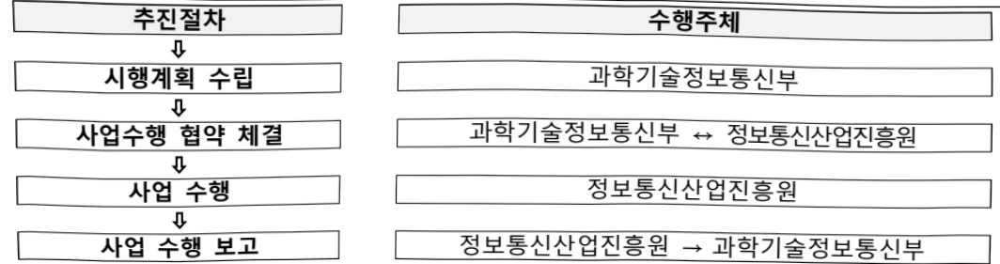

# AI 반도체 실증 지원

**해당 페이지**: PDF 310 ~ 320 쪽 해당

**부처**: 과학기술정보통신부
**분야**: 통신
**회계유형**: 일반회계
**2026 확정예산**: 113370.0 백만원
**전년대비 증감률**: None%
**AI 도메인**: AI반도체, 데이터, 디지털전환(AX), 피지컬AI/디바이스

---

<table border=1 style='margin: auto; word-wrap: break-word;'><tr><td rowspan="3">국산AI반도체조기상용화지원(AI컴퓨팅실증인프라고도화,AI반도체사업화적시지원)</td><td rowspan="2">소관부처</td><td style='text-align: center; word-wrap: break-word;'>정보통신정책실정보통신산업정책관</td></tr><tr><td style='text-align: center; word-wrap: break-word;'>정보통신방송기술정책과</td></tr><tr><td style='text-align: center; word-wrap: break-word;'>사업시행주체</td><td style='text-align: center; word-wrap: break-word;'>정보통신산업진흥원</td></tr><tr><td rowspan="3">국산AI반도체조기상용화지원(국산AI반도체기반AX대야스개발·실증)</td><td rowspan="2">소관부처</td><td style='text-align: center; word-wrap: break-word;'>정보통신정책실정보통신산업정책관</td></tr><tr><td style='text-align: center; word-wrap: break-word;'>디바이스AX혁신팀</td></tr><tr><td style='text-align: center; word-wrap: break-word;'>사업시행주체</td><td style='text-align: center; word-wrap: break-word;'>정보통신산업진흥원</td></tr><tr><td rowspan="3">AX실증지원</td><td rowspan="2">소관부처</td><td style='text-align: center; word-wrap: break-word;'>정보통신정책실정보통신산업정책관</td></tr><tr><td style='text-align: center; word-wrap: break-word;'>정보통신방송기술정책과</td></tr><tr><td style='text-align: center; word-wrap: break-word;'>사업시행주체</td><td style='text-align: center; word-wrap: break-word;'>정보통신산업진흥원</td></tr></table>

### 가. 예산 총괄표

(단위: 백만원, %)

<table border=1 style='margin: auto; word-wrap: break-word;'><tr><td rowspan="2">사업명</td><td rowspan="2">2024년 결산</td><td colspan="2">2025년 예산</td><td colspan="2">2026년 예산</td><td rowspan="2">증감(B-A)</td><td rowspan="2">(B-A)/A</td></tr><tr><td style='text-align: center; word-wrap: break-word;'>본예산</td><td style='text-align: center; word-wrap: break-word;'>추경*(A)</td><td style='text-align: center; word-wrap: break-word;'>요구안</td><td style='text-align: center; word-wrap: break-word;'>본예산(B)</td></tr><tr><td style='text-align: center; word-wrap: break-word;'>AI반도체실증지원</td><td style='text-align: center; word-wrap: break-word;'>18,813</td><td style='text-align: center; word-wrap: break-word;'>24,370</td><td style='text-align: center; word-wrap: break-word;'>98,370</td><td style='text-align: center; word-wrap: break-word;'>102,370</td><td style='text-align: center; word-wrap: break-word;'>113,370</td><td style='text-align: center; word-wrap: break-word;'>15,000</td><td style='text-align: center; word-wrap: break-word;'>15.2%</td></tr></table>

* 추경: 추경증감액을 포함한 최종 예산액을 기재

## 기능별(내역사업별) 예산 내역

(단위:백만원)

<table border=1 style='margin: auto; word-wrap: break-word;'><tr><td rowspan="2"></td><td colspan="5">2024</td><td colspan="5">2025</td><td rowspan="2">2026 예산</td></tr><tr><td style='text-align: center; word-wrap: break-word;'>예산액(추경)</td><td style='text-align: center; word-wrap: break-word;'>예산현액</td><td style='text-align: center; word-wrap: break-word;'>집행액</td><td style='text-align: center; word-wrap: break-word;'>이월액</td><td style='text-align: center; word-wrap: break-word;'>불용액</td><td style='text-align: center; word-wrap: break-word;'>예산액(추경)</td><td style='text-align: center; word-wrap: break-word;'>예산현액</td><td style='text-align: center; word-wrap: break-word;'>집행액</td><td style='text-align: center; word-wrap: break-word;'>이월액</td><td style='text-align: center; word-wrap: break-word;'>불용액</td></tr><tr><td style='text-align: center; word-wrap: break-word;'>○ 기능별 분류(합계)</td><td style='text-align: center; word-wrap: break-word;'></td><td style='text-align: center; word-wrap: break-word;'></td><td style='text-align: center; word-wrap: break-word;'></td><td style='text-align: center; word-wrap: break-word;'></td><td style='text-align: center; word-wrap: break-word;'></td><td style='text-align: center; word-wrap: break-word;'>98,370</td><td style='text-align: center; word-wrap: break-word;'>98,370</td><td style='text-align: center; word-wrap: break-word;'>98,370</td><td style='text-align: center; word-wrap: break-word;'>-</td><td style='text-align: center; word-wrap: break-word;'>-</td><td style='text-align: center; word-wrap: break-word;'>113,370</td></tr><tr><td style='text-align: center; word-wrap: break-word;'>• AI반도체 응용실증지원</td><td style='text-align: center; word-wrap: break-word;'>8,813</td><td style='text-align: center; word-wrap: break-word;'>8,813</td><td style='text-align: center; word-wrap: break-word;'>8,813</td><td style='text-align: center; word-wrap: break-word;'>-</td><td style='text-align: center; word-wrap: break-word;'>-</td><td style='text-align: center; word-wrap: break-word;'>9,370</td><td style='text-align: center; word-wrap: break-word;'>9,370</td><td style='text-align: center; word-wrap: break-word;'>9,370</td><td style='text-align: center; word-wrap: break-word;'>-</td><td style='text-align: center; word-wrap: break-word;'>-</td><td style='text-align: center; word-wrap: break-word;'>4,685</td></tr><tr><td style='text-align: center; word-wrap: break-word;'>• AI반도체 Farm</td><td style='text-align: center; word-wrap: break-word;'>7,000</td><td style='text-align: center; word-wrap: break-word;'>7,000</td><td style='text-align: center; word-wrap: break-word;'>7,000</td><td style='text-align: center; word-wrap: break-word;'>-</td><td style='text-align: center; word-wrap: break-word;'>-</td><td style='text-align: center; word-wrap: break-word;'>6,000</td><td style='text-align: center; word-wrap: break-word;'>6,000</td><td style='text-align: center; word-wrap: break-word;'>6,000</td><td style='text-align: center; word-wrap: break-word;'>-</td><td style='text-align: center; word-wrap: break-word;'>-</td><td style='text-align: center; word-wrap: break-word;'>-</td></tr></table>

---

<table border=1 style='margin: auto; word-wrap: break-word;'><tr><td rowspan="2"></td><td colspan="5">2024</td><td colspan="5">2025</td><td rowspan="2">2026예산</td></tr><tr><td style='text-align: center; word-wrap: break-word;'>예산액(추경)</td><td style='text-align: center; word-wrap: break-word;'>예산현액</td><td style='text-align: center; word-wrap: break-word;'>집행액</td><td style='text-align: center; word-wrap: break-word;'>이월액</td><td style='text-align: center; word-wrap: break-word;'>불용액</td><td style='text-align: center; word-wrap: break-word;'>예산액(추경)</td><td style='text-align: center; word-wrap: break-word;'>예산현액</td><td style='text-align: center; word-wrap: break-word;'>집행액</td><td style='text-align: center; word-wrap: break-word;'>이월액</td><td style='text-align: center; word-wrap: break-word;'>불용액</td></tr><tr><td style='text-align: center; word-wrap: break-word;'>구축 및 실증</td><td rowspan="2">3,000</td><td rowspan="2">3,000</td><td rowspan="2">3,000</td><td rowspan="2">-</td><td rowspan="2">-</td><td rowspan="2">-</td><td rowspan="2">-</td><td rowspan="2">-</td><td rowspan="2">-</td><td rowspan="2">-</td><td rowspan="2">-</td></tr><tr><td style='text-align: center; word-wrap: break-word;'>· AI반도체 기술인재공급 플랫폼</td></tr><tr><td style='text-align: center; word-wrap: break-word;'>· 온디바이스 AI 서비스 실증 확산</td><td style='text-align: center; word-wrap: break-word;'>-</td><td style='text-align: center; word-wrap: break-word;'>-</td><td style='text-align: center; word-wrap: break-word;'>-</td><td style='text-align: center; word-wrap: break-word;'>-</td><td style='text-align: center; word-wrap: break-word;'>-</td><td style='text-align: center; word-wrap: break-word;'>9,000</td><td style='text-align: center; word-wrap: break-word;'>9,000</td><td style='text-align: center; word-wrap: break-word;'>9,000</td><td style='text-align: center; word-wrap: break-word;'>-</td><td style='text-align: center; word-wrap: break-word;'>-</td><td style='text-align: center; word-wrap: break-word;'>24,000</td></tr><tr><td style='text-align: center; word-wrap: break-word;'>· 국산 AI반도체 조기상용화 지원</td><td style='text-align: center; word-wrap: break-word;'>-</td><td style='text-align: center; word-wrap: break-word;'>-</td><td style='text-align: center; word-wrap: break-word;'>-</td><td style='text-align: center; word-wrap: break-word;'>-</td><td style='text-align: center; word-wrap: break-word;'>-</td><td style='text-align: center; word-wrap: break-word;'>40,000</td><td style='text-align: center; word-wrap: break-word;'>40,000</td><td style='text-align: center; word-wrap: break-word;'>40,000</td><td style='text-align: center; word-wrap: break-word;'>-</td><td style='text-align: center; word-wrap: break-word;'>-</td><td style='text-align: center; word-wrap: break-word;'>68,685</td></tr><tr><td style='text-align: center; word-wrap: break-word;'>①AI컴퓨팅 실증 인프라 고도화</td><td style='text-align: center; word-wrap: break-word;'>-</td><td style='text-align: center; word-wrap: break-word;'>-</td><td style='text-align: center; word-wrap: break-word;'>-</td><td style='text-align: center; word-wrap: break-word;'>-</td><td style='text-align: center; word-wrap: break-word;'>-</td><td style='text-align: center; word-wrap: break-word;'>12,000</td><td style='text-align: center; word-wrap: break-word;'>12,000</td><td style='text-align: center; word-wrap: break-word;'>12,000</td><td style='text-align: center; word-wrap: break-word;'>-</td><td style='text-align: center; word-wrap: break-word;'>-</td><td style='text-align: center; word-wrap: break-word;'>16,000</td></tr><tr><td style='text-align: center; word-wrap: break-word;'>②국산 AI반도체 기반 AX다마스개발실증</td><td style='text-align: center; word-wrap: break-word;'>-</td><td style='text-align: center; word-wrap: break-word;'>-</td><td style='text-align: center; word-wrap: break-word;'>-</td><td style='text-align: center; word-wrap: break-word;'>-</td><td style='text-align: center; word-wrap: break-word;'>-</td><td style='text-align: center; word-wrap: break-word;'>6,000</td><td style='text-align: center; word-wrap: break-word;'>6,000</td><td style='text-align: center; word-wrap: break-word;'>6,000</td><td style='text-align: center; word-wrap: break-word;'>-</td><td style='text-align: center; word-wrap: break-word;'>-</td><td style='text-align: center; word-wrap: break-word;'>22,685</td></tr><tr><td style='text-align: center; word-wrap: break-word;'>③AI반도체 사업화 적시 지원</td><td style='text-align: center; word-wrap: break-word;'>-</td><td style='text-align: center; word-wrap: break-word;'>-</td><td style='text-align: center; word-wrap: break-word;'>-</td><td style='text-align: center; word-wrap: break-word;'>-</td><td style='text-align: center; word-wrap: break-word;'>-</td><td style='text-align: center; word-wrap: break-word;'>22,000</td><td style='text-align: center; word-wrap: break-word;'>22,000</td><td style='text-align: center; word-wrap: break-word;'>22,000</td><td style='text-align: center; word-wrap: break-word;'>-</td><td style='text-align: center; word-wrap: break-word;'>-</td><td style='text-align: center; word-wrap: break-word;'>30,000</td></tr><tr><td style='text-align: center; word-wrap: break-word;'>· AX 실증지원</td><td style='text-align: center; word-wrap: break-word;'>-</td><td style='text-align: center; word-wrap: break-word;'>-</td><td style='text-align: center; word-wrap: break-word;'>-</td><td style='text-align: center; word-wrap: break-word;'>-</td><td style='text-align: center; word-wrap: break-word;'>-</td><td style='text-align: center; word-wrap: break-word;'>4,000</td><td style='text-align: center; word-wrap: break-word;'>4,000</td><td style='text-align: center; word-wrap: break-word;'>4,000</td><td style='text-align: center; word-wrap: break-word;'>-</td><td style='text-align: center; word-wrap: break-word;'>-</td><td style='text-align: center; word-wrap: break-word;'>16,000</td></tr><tr><td style='text-align: center; word-wrap: break-word;'>· AI반도체 최적화 설계지원</td><td style='text-align: center; word-wrap: break-word;'>-</td><td style='text-align: center; word-wrap: break-word;'>-</td><td style='text-align: center; word-wrap: break-word;'>-</td><td style='text-align: center; word-wrap: break-word;'>-</td><td style='text-align: center; word-wrap: break-word;'>-</td><td style='text-align: center; word-wrap: break-word;'>30,000</td><td style='text-align: center; word-wrap: break-word;'>30,000</td><td style='text-align: center; word-wrap: break-word;'>30,000</td><td style='text-align: center; word-wrap: break-word;'>-</td><td style='text-align: center; word-wrap: break-word;'>-</td><td style='text-align: center; word-wrap: break-word;'>-</td></tr></table>

### 나. 사업설명자료

## 1 ) 사업목적·내용

- (AI반도체 실증 지원) AI데이터센터·온디바이스 AI 등 주요 수요 분야와 연계한 실증 및 사업화 지원을 통한 국산 AI반도체 조기상용화 지원

- (AI반도체 응용실증지원) 국산 AI반도체(서버용·엣지용)에 다양한 AI서비스를 적용하여, 비공개 기능·성능 테스트 및 AI반도체 실증을 통한 레퍼런스 확보 지원

- (온디바이스 AI 서비스 실증·확산) 온디바이스 AI 서비스 공공분야 대규모 선도 적용을 통한 효과성 검증 및 실증 성과 공유로 서비스 확산 등 온디바이스 AI 생태계 활성화

- (국산AI반도체 조기상용화 지원) 기존 소규모·기술검증 중심의 실증 지원을 넘어, 국산AI반도체의 시장 경쟁력 강화 및 조기 상용화를 뒷받침하는 대규모 실증 및 수요창출 중점 지원

- (AX 실증지원) 기 상용화된 다양한 AI서비스 및 디바이스를 국산 AI반도체를 통해 구동하고 상용제품化 지원

## 2 ) 사업개요

## 사업근거 및 추진경위

① 법령상 근거 및 조항 적시

---

- 정보통신 진흥 및 융합 활성화 등에 관한 특별법 제32조(정보통신융합 등 기술·서비스 개발 등의 지원)

제32조(정보통신융합등 기술·서비스 개발 등의 지원) ① 과학기술정보통신부장관은 다른 산업 및 서비스 등에 정보통신의 접목을 통하여 생산성과 가치를 높일 수 있도록 노력하여야 한다.

② 과학기술정보통신부장관은 정보통신융합등 기술·서비스의 개발을 촉진하기 위하여 다음 각 호의 사업을 추진할 수 있다.

1. 정보통신융합등 기술·서비스 관련 연구개발 사업

2. 제1호에 따라 추진되는 과제에 대한 기획·평가·관리

3. 국가·지방자치단체, 대학·정부출연연구기관, 민간 등이 보유한 정보통신융합등 기술의 거래 등 기술이전을 위한 중개·알선 지원

4. 정보통신융합등 기술에 대한 평가 및 평가 기법의 개발·보급

5. 정보통신융합등 기술의 기술이전·사업화에 관한 통계조사·연구 등 관련 정보의 수집·분석·제공

6. 정보통신융합등 기술의 기술이전 후 상용화 연구개발 지원

7. 정보통신융합등 기술의 기술사업화 전문인력 양성

8. 정보통신융합등 기술의 기술거래·사업화 촉진을 위한 정보시스템 구축·활용

9. 지식재산권 등 정보통신융합등 기술 관련 연구성과물의 관리·홍보·활용

10. 정보통신융합등 기술·서비스의 수준조사 등 정책연구 사업

11. 정보통신융합등 기술·서비스 관련 시범사업

12. 그 밖에 정보통신기술진흥을 위하여 필요한 사업

③ 과학기술성모동신부상관는 세2항 각 호의 사업을 추진하기 위하여 법인인 전담기관을 설립하거나 법인·단체에 위탁·운영할 수 있으며, 필요한 비용의 전부 또는 일부를 예산의 범위에서 출연 또는 보조할 수 있다.

④ 중앙행정기관의 장 및 지방자치단체의 장은 제2항 각 호의 사업을 제3항에 따른 전담기관으로 하여금 수행하게 하고, 그에 소요되는 비용의 전부 또는 일부를 지원할 수 있다.

(5) 세3양에 따는 선남기관에 관하여 이 법에서 성한 것을 제외하고는 ‘민법’ 중 재단법인에 관한 규정을 준용하며, 전담기관의 운영 및 제2항 각 호의 업무수행에 필요한 사항은 대통령령으로 정한다.

② 추진경위 - 사업 시작년도, 추진배경, 부처별 중점과제, 대통령 공약사항 등

- 인공지능 반도체 산업 발전전략('20.10, 관계부처합동)

- 제2회 인공지능 최고위 전략대화('22.1, 과학기술정보통신부)

- 인공지능 반도체 경쟁력 강화방안('22.1)

- 인공지능 반도체 산업성장 지원대책('22.6, 과학기술정보통신부)

- AI반도체 스케일업 네트워크 발대식('22.9, 과학기술정보통신부)

- 국산 AI반도체를 활용한 K-클라우드 추진 방안('22.12, 과학기술정보통신부)

- 12대 핵심재정사업 성과관리 대상사업 선정('23.1, 기획재정부)

- 新성장 4.0 전략 추진계획('23.2.20, 관계부처합동)

* 전략 2-1 '내 삶 속의 디지털'을 위한 다양한 AI 서비스·제품 실현에서 AI 반도체는 핵심 인프라

---

- 국민과 함께하는 민생토론회-민생을 살찌우는 반도체 산업('24.1, 대통령 주재)

- 반도체 현안점검 회의('24.4, 대통령 주재)

「AI반도체 이니셔티브」과기전문회의 전원회의 심의·의결('24.4, 관계부처합동)

- (국정과제 22-4) 차세대 AI반도체(NPU, PIM 등) 기술 선점 및 산업 생태계 조성

주요내용

① 사업규모

- 총사업비 : 해당없음

- 사업기간 : '21~계속

- 최근 5년 간 투입된 사업비(예산액기준, 추경편성한 연도에는 추경포함)

<table border=1 style='margin: auto; word-wrap: break-word;'><tr><td style='text-align: center; word-wrap: break-word;'>$ \underline{\text{焼成}} $</td><td style='text-align: center; word-wrap: break-word;'>2022</td><td style='text-align: center; word-wrap: break-word;'>2023</td><td style='text-align: center; word-wrap: break-word;'>2024</td><td style='text-align: center; word-wrap: break-word;'>2025</td><td style='text-align: center; word-wrap: break-word;'>2026</td></tr><tr><td style='text-align: center; word-wrap: break-word;'>$ \underline{\text{사업비}} $</td><td style='text-align: center; word-wrap: break-word;'>4,127</td><td style='text-align: center; word-wrap: break-word;'>12,504</td><td style='text-align: center; word-wrap: break-word;'>18,813</td><td style='text-align: center; word-wrap: break-word;'>98,370</td><td style='text-align: center; word-wrap: break-word;'>113,370</td></tr></table>

-기타: 해당없음

② 사업추진체계

- 사업시행방법 : 출연

- 사업시행주체 : 정보통신산업진흥원(NIPA)

- 사업 수혜자 : 기업, 대학, 연구소 등

- 보조, 융자, 출연, 출자 등의 경우 보조·융자 등 지원 비율 및 법적근거

<table border=1 style='margin: auto; word-wrap: break-word;'><tr><td style='text-align: center; word-wrap: break-word;'>내역사업명</td><td style='text-align: center; word-wrap: break-word;'>구분</td><td style='text-align: center; word-wrap: break-word;'>피보조·피출연 등 기관명</td><td style='text-align: center; word-wrap: break-word;'>지원 금액 (2026예산)</td><td style='text-align: center; word-wrap: break-word;'>지원 비율(%)</td><td style='text-align: center; word-wrap: break-word;'>보조율 법적근거 (해당 조항)</td></tr><tr><td style='text-align: center; word-wrap: break-word;'>AI반도체 응용 실증지원</td><td style='text-align: center; word-wrap: break-word;'>출연</td><td style='text-align: center; word-wrap: break-word;'>정보통신 산업진흥원</td><td style='text-align: center; word-wrap: break-word;'>4,685</td><td style='text-align: center; word-wrap: break-word;'>100</td><td style='text-align: center; word-wrap: break-word;'>정보통신 진흥 및 융합 활성화 등에 관한 특별법 제32조 3항</td></tr><tr><td style='text-align: center; word-wrap: break-word;'>온디바이스 AI 서비스 실증·확산</td><td style='text-align: center; word-wrap: break-word;'>출연</td><td style='text-align: center; word-wrap: break-word;'>정보통신 산업진흥원</td><td style='text-align: center; word-wrap: break-word;'>24,000</td><td style='text-align: center; word-wrap: break-word;'>100</td><td style='text-align: center; word-wrap: break-word;'>정보통신 진흥 및 융합 활성화 등에 관한 특별법 제32조 3항</td></tr><tr><td style='text-align: center; word-wrap: break-word;'>국산AI반도체 조기상용화 지원</td><td style='text-align: center; word-wrap: break-word;'>출연</td><td style='text-align: center; word-wrap: break-word;'>정보통신 산업진흥원</td><td style='text-align: center; word-wrap: break-word;'>68,685</td><td style='text-align: center; word-wrap: break-word;'>100</td><td style='text-align: center; word-wrap: break-word;'>정보통신 진흥 및 융합 활성화 등에 관한 특별법 제32조 3항</td></tr><tr><td style='text-align: center; word-wrap: break-word;'>AX 실증지원</td><td style='text-align: center; word-wrap: break-word;'>출연</td><td style='text-align: center; word-wrap: break-word;'>정보통신 산업진흥원</td><td style='text-align: center; word-wrap: break-word;'>16,000</td><td style='text-align: center; word-wrap: break-word;'>100</td><td style='text-align: center; word-wrap: break-word;'>정보통신 진흥 및 융합 활성화 등에 관한 특별법 제32조 3항</td></tr></table>

---

① AI반도체 응용실증지원(4,685백만원)

· (계속) AI반도체 응용실증지원 5개 과제 × 937백만원 = 4,685백만원

② 온디바이스 AI 서비스 실증 확산(24,000백만원)

· (계속) 온디바이스 AI 서비스 실증·확산 3개 과제 × 3,000백만원 = 9,000백만원

· (신규) 온디바이스 AI 서비스 실증·확산 5개 과제 × 3,000백만원 = 15,000백만원

③ 국산AI반도체 조기상용화 지원

- (산출)

가. AI컴퓨팅 실증 인프라 고도화(16,000백만원)

· NPU 인프라(HW/SW) 구축: 서버(2PF) 30대 × 400백만원 = 12,000백만원

· 기반시설 등 운영·관리(2,000백만원)

· 실증 500백만원 × 4개 = 2,000백만원

나. 국산 AI반도체 기반 AX 디바이스 개발·실증(22,685백만원)

(정규트랙)

· (계속) 2,000백만원 × 6식 = 12,000백만원

· (신규) 2,000백만원 × 3식 = 6,000백만원

(미니트랙)

· (신규) 937백만원 × 5식 = 4,685백만원

다. AI반도체 사업화 적시 지원(30,000백만원)

· 설계SW(2,000백만원)

· 제품 제작(21,500백만원)

· 검증(6,500백만원)

④ AX 실증지원(16,000백만원)

- (산출) 1개 과제 × 4건 실증 × 4,000 백만원 = 16,000백만원

## 4 ) 사업효과

☐ 사업영향, 산출물 성과지표 등

① 2022~2026년도 성과계획서 상 성과지표 및 최근 5년간 성과 달성도

<table border=1 style='margin: auto; word-wrap: break-word;'><tr><td style='text-align: center; word-wrap: break-word;'>성과지표</td><td style='text-align: center; word-wrap: break-word;'>구분</td><td style='text-align: center; word-wrap: break-word;'>2022</td><td style='text-align: center; word-wrap: break-word;'>2023</td><td style='text-align: center; word-wrap: break-word;'>2024</td><td style='text-align: center; word-wrap: break-word;'>2025</td><td style='text-align: center; word-wrap: break-word;'>2026</td><td style='text-align: center; word-wrap: break-word;'>2026 목표치산출근거</td><td style='text-align: center; word-wrap: break-word;'>측정산식(또는 측정방법)</td><td style='text-align: center; word-wrap: break-word;'>자료수집방법(또는 자료출처)</td></tr><tr><td rowspan="3">AI반도체실증 건수(단위:건)</td><td style='text-align: center; word-wrap: break-word;'>목표</td><td style='text-align: center; word-wrap: break-word;'>4</td><td style='text-align: center; word-wrap: break-word;'>8</td><td style='text-align: center; word-wrap: break-word;'>11</td><td style='text-align: center; word-wrap: break-word;'>10</td><td style='text-align: center; word-wrap: break-word;'>10</td><td rowspan="3">당해연도지원과제 수를 고려하여 설정</td><td rowspan="3">지원과제실증지원 건수</td><td rowspan="3">사업성과 보고서</td></tr><tr><td style='text-align: center; word-wrap: break-word;'>실적</td><td style='text-align: center; word-wrap: break-word;'>4</td><td style='text-align: center; word-wrap: break-word;'>8</td><td style='text-align: center; word-wrap: break-word;'>11</td><td style='text-align: center; word-wrap: break-word;'>10</td><td style='text-align: center; word-wrap: break-word;'>-</td></tr><tr><td style='text-align: center; word-wrap: break-word;'>달성도</td><td style='text-align: center; word-wrap: break-word;'>100</td><td style='text-align: center; word-wrap: break-word;'>100</td><td style='text-align: center; word-wrap: break-word;'>100</td><td style='text-align: center; word-wrap: break-word;'>100</td><td style='text-align: center; word-wrap: break-word;'>-</td></tr><tr><td rowspan="3">응용서비스정확도(단위:%)</td><td style='text-align: center; word-wrap: break-word;'>목표</td><td style='text-align: center; word-wrap: break-word;'>97</td><td style='text-align: center; word-wrap: break-word;'>98</td><td style='text-align: center; word-wrap: break-word;'>99</td><td style='text-align: center; word-wrap: break-word;'>99</td><td style='text-align: center; word-wrap: break-word;'>99</td><td rowspan="3">과제별 제시목표 정확도 평균(외부검증기관 검증 통과 기준)</td><td rowspan="3">AI응용서비스별 정확도 평균</td><td rowspan="3">사업성과 보고서</td></tr><tr><td style='text-align: center; word-wrap: break-word;'>실적</td><td style='text-align: center; word-wrap: break-word;'>99</td><td style='text-align: center; word-wrap: break-word;'>100</td><td style='text-align: center; word-wrap: break-word;'>104.9</td><td style='text-align: center; word-wrap: break-word;'>101.1</td><td style='text-align: center; word-wrap: break-word;'>-</td></tr><tr><td style='text-align: center; word-wrap: break-word;'>달성도</td><td style='text-align: center; word-wrap: break-word;'>102</td><td style='text-align: center; word-wrap: break-word;'>102</td><td style='text-align: center; word-wrap: break-word;'>106</td><td style='text-align: center; word-wrap: break-word;'>102</td><td style='text-align: center; word-wrap: break-word;'>-</td></tr><tr><td rowspan="3">국산 AI반도체제품 개발성공률(단위:%)</td><td style='text-align: center; word-wrap: break-word;'>목표</td><td style='text-align: center; word-wrap: break-word;'>-</td><td style='text-align: center; word-wrap: break-word;'>-</td><td style='text-align: center; word-wrap: break-word;'>-</td><td style='text-align: center; word-wrap: break-word;'>-</td><td style='text-align: center; word-wrap: break-word;'>50</td><td rowspan="3">개발 초기단계에 상용 AI반도체 수준성능을 확보하는 지표임을 고려하여 설정</td><td rowspan="2">사업화 가능한 수준의 국산 NIU 제품 수</td><td rowspan="3">공인시험기관 검증결과서</td></tr><tr><td style='text-align: center; word-wrap: break-word;'>실적</td><td style='text-align: center; word-wrap: break-word;'>-</td><td style='text-align: center; word-wrap: break-word;'>-</td><td style='text-align: center; word-wrap: break-word;'>-</td><td style='text-align: center; word-wrap: break-word;'>-</td><td style='text-align: center; word-wrap: break-word;'>-</td></tr><tr><td style='text-align: center; word-wrap: break-word;'>달성도</td><td style='text-align: center; word-wrap: break-word;'>-</td><td style='text-align: center; word-wrap: break-word;'>-</td><td style='text-align: center; word-wrap: break-word;'>-</td><td style='text-align: center; word-wrap: break-word;'>-</td><td style='text-align: center; word-wrap: break-word;'>-</td><td style='text-align: center; word-wrap: break-word;'>전체 사업화 지원 건수</td></tr><tr><td style='text-align: center; word-wrap: break-word;'>온디바이스</td><td style='text-align: center; word-wrap: break-word;'>목표</td><td style='text-align: center; word-wrap: break-word;'>-</td><td style='text-align: center; word-wrap: break-word;'>-</td><td style='text-align: center; word-wrap: break-word;'>-</td><td style='text-align: center; word-wrap: break-word;'>3</td><td style='text-align: center; word-wrap: break-word;'>8</td><td style='text-align: center; word-wrap: break-word;'>당해연도지원과제</td><td style='text-align: center; word-wrap: break-word;'>지원과제</td><td style='text-align: center; word-wrap: break-word;'>사업성과</td></tr></table>

---

<table border=1 style='margin: auto; word-wrap: break-word;'><tr><td rowspan="2">서비스 실증·확산 실증 건수 (단위:건)</td><td style='text-align: center; word-wrap: break-word;'>실적</td><td style='text-align: center; word-wrap: break-word;'>-</td><td style='text-align: center; word-wrap: break-word;'>-</td><td style='text-align: center; word-wrap: break-word;'>-</td><td style='text-align: center; word-wrap: break-word;'>3</td><td style='text-align: center; word-wrap: break-word;'>-</td><td rowspan="2">지원과제 수를 고려하여 설정</td><td rowspan="2">실증지원 건수</td><td rowspan="2">보고서, 검증결과서 등</td></tr><tr><td style='text-align: center; word-wrap: break-word;'>달성도</td><td style='text-align: center; word-wrap: break-word;'>-</td><td style='text-align: center; word-wrap: break-word;'>-</td><td style='text-align: center; word-wrap: break-word;'>-</td><td style='text-align: center; word-wrap: break-word;'>100</td><td style='text-align: center; word-wrap: break-word;'>-</td></tr><tr><td rowspan="3">국산AI반도체 적용 디바이스 개발·실증 건수 (단위:개)</td><td style='text-align: center; word-wrap: break-word;'>목표</td><td style='text-align: center; word-wrap: break-word;'>-</td><td style='text-align: center; word-wrap: break-word;'>-</td><td style='text-align: center; word-wrap: break-word;'>-</td><td style='text-align: center; word-wrap: break-word;'>6</td><td style='text-align: center; word-wrap: break-word;'>9</td><td rowspan="3">당해연도 지원과제 수를 고려하여 설정</td><td rowspan="3">개발·실증 AX디바이스 건수</td><td rowspan="3">사업성과 보고서</td></tr><tr><td style='text-align: center; word-wrap: break-word;'>실적</td><td style='text-align: center; word-wrap: break-word;'>-</td><td style='text-align: center; word-wrap: break-word;'>-</td><td style='text-align: center; word-wrap: break-word;'>-</td><td style='text-align: center; word-wrap: break-word;'>6</td><td style='text-align: center; word-wrap: break-word;'>-</td></tr><tr><td style='text-align: center; word-wrap: break-word;'>달성도</td><td style='text-align: center; word-wrap: break-word;'>-</td><td style='text-align: center; word-wrap: break-word;'>-</td><td style='text-align: center; word-wrap: break-word;'>-</td><td style='text-align: center; word-wrap: break-word;'>100</td><td style='text-align: center; word-wrap: break-word;'>-</td></tr></table>

② 성과지표 이외의 연도별 사업추진 경과 및 실적

<table border=1 style='margin: auto; word-wrap: break-word;'><tr><td style='text-align: center; word-wrap: break-word;'>① 서버용·엣지용 국산 AI반도체에 다양한 산업분야의 AI응용서비스를 적용한 실증· 검증을 통해 국산 AI반도체(4개) 실증 레퍼런스 확보- (서버·제품) AI반도체 개발사와 응용서비스 기업이 국산 AI반도체 시범 서버 구축 및 시제품을 개발하여 응용서비스를 적용할 수 있도록 실증 환경 구축 지원* 총 4개 과제(AI반도체 4종, 서버용 3/엣지용 1) - (응용서비스) 국산 AI반도체 기반 서버·제품에서 구현할 AI응용서비스(총 10종)*를 실증 환경에 적용하여 국산 AI반도체의 상용화 개선사항 및 가능성 확인* 콘텐츠 화질 개선, 패션검색, 포즈 추정, 주차관제, 종이문서 디지털화 등- (검증) 실증 결과에 대한 제3자 검증* 의무화를 통해 실증 실효성 및 결과물의 신뢰성 제고, 글로벌 벤치마크(MLPerf)를 통한 국내 AI반도체 성능 우수성 검증 및 우수사례 확보*** 한국인정기구(KOLSA)에 등록된 시험기관 활용** SAPEON X220 : MLPerf 성능테스트에서 ‘상용화 완료(Available)’ 등급 획득② AI반도체 초기 시장 진출 등 확산 방안 마련- 국산 인공지능 반도체 대형 테스트베드 구축을 위한 국산 NPU FARM 구축, 광주 AI집적단지 국산 AI반도체 도입 등- 유망 핵심 서비스(지능형 관제, 무인 이동체 등) 중심 제품·서비스 실증, 공공분야 (부처, 지자체 등) 사업(CCTV, 스마트 시티 등)에 도입 등* 인공지능 반도체 최고위 전략대화(22.6) 안건 ‘인공지능반도체 산업성장지원대책’ 제언- 유망 핵심 서비스(지능형 관제, 무인 이동체 등) 중심 제품·서비스 실증, 공공분야 (부처, 지자체 등) 사업(CCTV, 스마트 시티 등)에 도입 등* 인공지능 반도체 최고위 전략대화(22.6) 안건 ‘인공지능반도체 산업성장지원대책’ 제언- 국산AI반도체 고도화, AI반도체용 SW개발, 데이터센터 실증 및 AI 서비스 제공 등 인공지능 반도체를 활용한 K-클라우드 생태계 조성* 인공지능 반도체 최고위 전략대화(22.12) 안건 ‘K클라우드 사업 추진 방안’ 등③ 국내 AI반도체 기업 해외 수요 발굴 등 시장 진출 지원- 한·배 디지털전환 포럼(22.10.12, 하노이) 행사 제품 전시, 기술 소개, 비즈니스 매칭 지원(남품계약 1건, NDA 체결 1건)* 국내 참가기업 퓨리오사AI 등 4개사, 베트남 기업 Viettel 등 18개사) 국내 AI반도체 초기 수요 시장 창출과 생태계 조성을 위한 AI반도체 수요자, 공급자 및 연구자 간 협력 네트워크 구축*- 총 4개 분과(관제, 의료, 메타버스, 국방) 운영, 분과회의 16회 개최(수요·공급기업 등 46개), 총 14개 협력 과제 발굴* AI반도체스케일업 네트워크 발족(&#x27;22.9.30)- ‘AI반도체 스케일업 네트워크’ 운영 성과를 기반으로 차년도에 ‘K·클라우드 얼라이언스’로 확대 개편</td></tr></table>

---

<table border=1 style='margin: auto; word-wrap: break-word;'><tr><td style='text-align: center; word-wrap: break-word;'>2023</td><td style='text-align: center; word-wrap: break-word;'>① AI반도체 응용실증 지원 사업 과제 선정 및 지원 - (대상) 총 8개 과제(계속 2개, 신규 6개 과제) * 서버, 엣지용 AI반도체 실증 규모 확대 및 시장수요를 반영한 AI응용서비스 실증 종점 지원 - (실증 대상) 이상행동 감지, 도시 교통관제, 부정맥 예측, 자율주행 순찰 및 주차 관리, 반도체 웨이퍼 오류구분, 해안경계감시 등 응용서비스 실증 ② AI반도체 Farm 구축 및 실증 사업 과제 선정 및 지원 - (대상) 1개 전소시업(주관: 네이버클라우드, 참여: 케이티클라우드, 엔에이치엔클라우드) - (인프라 구축) ~&#x27;25년 19.95PF (&#x27;23년 1PF 규모 초기 구축 및 인프라설계) - (AI응용(시법) 서비스) &#x27;25년 4건&#x27; (23년 관제 분야 1건 추진예정) - NPU괜 활용도 증대를 위한 전소시업 기업 참여(7건) ③ AI반도체 인식 확산, 해외 수출 교두보 마련 등 산업 기반 확대 - 과기정통부 장관 주재로 산학연이 망라된 AI반도체 최고위 전략대화 개최(상반기 6.26, 하반기 12월 예정) 및 국내 AI반도체 발전방향 논의 - 과기정통부 수출개척단 일환으로 두바이 GITEX(&#x27;23.10.15~18) 행사에 국내 AI반도체 전시, 기술 소개, 비즈니스 매칭 등 지원 * 국내 AI반도체 4개사 참여 예정 ④ 국내 AI반도체 공급자 및 수요자간 협력 네트워크 확대로 초기 시장 창출 및 생태계 강화 - 총 6개 분과(드론, 로봇, 국방, 수출, 교육, 표준화) 운영, 분과회의 24회 개최예정(수요·공급기업 등 76개), 총 10여개 과제 발굴 * 국내 AI반도체기업, CSP, 수요기업, 연구기관 등 76개 기관(&#x27;22년 대비 30여개사 증가)으로 구성된 K-클라우드 얼라이언스 킥오프 및 (&#x27;23.2.17)</td></tr><tr><td style='text-align: center; word-wrap: break-word;'>2024</td><td style='text-align: center; word-wrap: break-word;'>① AI반도체 응용실증 지원 사업 과제 선정 및 지원 - (대상) 총 11개 과제(계속 6개, 신규 5개 과제) - (실증 분야) 드론, 로봇, 국방, 차량·모바일, 안전·관제, 보건·의료 등 * AI응용서비스 수요 분야에 대한 실증 지원으로 AI반도체 실증 레퍼런스 확보 ② AI반도체 Farm 구축 및 실증 사업 과제 선정 및 지원 - (대상) 1개 전소시업(주관: 네이버클라우드, 참여: 케이티클라우드, 엔에이치엔클라우드) - (인프라 구축) ~&#x27;25년 약 20PF (&#x27;24년 초기 구축 추진 및 클라우드 플랫폼개발) - (AI응용(시법) 서비스) &#x27;24년 국산 NPU기반 클라우드 환경 서비스 실증 4건 - NPU괜 활용도 증대를 위한 전소시업 기업 참여(10건) ③ 국내 AI반도체 기업 해외 수요 발굴 등 시장 진출 지원 - 과기정통부 수출개척단 일환으로 두바이 GITEX·Expand North Star(&#x27;24년10월) 행사에 국내 AI반도체 전시 및 비즈니스 매칭 등 지원, 한·배 디지털전환 포럼(&#x27;24년11월, 베트남 하노이) 행사 전시, 기술 소개, 비즈니스 매칭 지원 * 국내 AI반도체 6개사 참여 예정 ④ 국내 AI반도체 공급자 및 수요자간 협력 네트워크 강화로 시장 확대 및 생태계 강화 - K·클라우드 얼라이언스 전체 간담회, 6개 분과(데이터센터, 하이브리드AI, 기술인재, 산학협력, 수출, 국방)운영 및 신규 수요 발굴 * AI반도체 팬리스, SW·HW, 클라우드차, AI모델·서비스기업 등 AI반도체 가치사슬 강화 ⑤ 제1회 AI반도체 기술인재 선발대회 운영 및 수요기업·우수인재 채용연계 지원 - (대상) 운영기관 1개, 수요기업 10개 - (대화 분야) 모바일·켓지, 서버, 설계 등</td></tr><tr><td style='text-align: center; word-wrap: break-word;'>2025</td><td style='text-align: center; word-wrap: break-word;'>① AI반도체 응용실증 지원 사업 과제 선정 및 지원 - (대상) 총 10개 과제(계속 5개, 신규 5개 과제)</td></tr></table>

---

<table border=1 style='margin: auto; word-wrap: break-word;'><tr><td style='text-align: center; word-wrap: break-word;'></td><td style='text-align: center; word-wrap: break-word;'>- (실증 분야) 국방, 안전·관제, 보건·의료, 지식서비스, 교육 등* AI응용서비스 수요 분야에 대한 실증 지원으로 AI반도체 실증 레퍼런스 확보② AI반도체 Farm 구축 및 실증 사업 과제 선정 및 지원- (대상) 1개 컨소시엄(주관: 네이버클라우드, 참여: 케이티클라우드, 엔에이치엔클라우드) - (인프라 구축) ~&#x27;25년 약 20PF (&#x27;24년 초기 구축 추진 및 클라우드 플랫폼개발) - (AI응용(시범) 서비스) &#x27;25년 국산 NPU기반 클라우드 환경 서비스 실증 4건- NPU팜 활용도 증대를 위한 컨소시엄 기업 참여(10건)③ 공공분야 대규모 온디바이스 AI 서비스 실증 확산을 위한 과제 선정 및 지원- (대상) 부산정보산업진흥원 컨소시엄, 경북테크노파크 컨소시엄, 포항테크노파크 컨소시엄- AI CCTV, 드론, 로봇 등 지역 특화 온디바이스 AI 서비스 실증 3건 지원④ AI반도체 사업화 적시지원 사업 과제 선정 및 지원- 고비용 AI반도체 설계SW 지원(바우처) 15개기업 선정 지원- 시제품 제작 지원 10개 과제 선정지원- 양산품 제작 지원 3개 과제 선정지원- AI반도체 검증체계 구축 지원- 설계 검증장비 활용지원⑤ 국산 NPU 기반 AI서비스 지원- 기 상용화된 AI서비스 국산 NPU 실증(4건)⑥ AI반도체 최적화 설계지원 과제 선정 및 지원(2차 추정)  - (대상) 총 20개 과제(AI모델 맞춤형 설계지원(10개), AI반도체 설계 IP 활용 지원(10개))  * 국산 NPU가 다양한 AI모델에 최적화될 수 있도록 AI모델 맞춤형 설계 지원 및 설계에 필요한 IP 활용 지원을 통한 중·소 AI반도체 최적화 설계 중점 지원- AI모델 맞춤형 설계지원 10개 과제 선정지원- AI반도체 설계 IP 활용 지원 10개 과제 선정지원※ 국가공인시험인증기관을 통한 제3자 시험검증(20개 과제)</td></tr></table>

③ 향후(2026년도 이후) 기대효과

- (AI반도체 응용실증지원) 초기 단계에 있는 서버·옛지용 국내 AI반도체 기업에게 기술 등의 실증 기회를 제공함으로써 시장 진출을 위한 레퍼런스 확보 기회 제공

- (온디바이스 AI 서비스 실증·확산) 온디바이스 AI 서비스 공공분야 대규모 선도 적용을 통한 효과성 검증 및 실증 성과 공유로 서비스 확산 등 온디바이스 AI 생태계 활성화

- (국산AI반도체 조기상용화 지원) 국산 AI반도체의 대규모 실증 확대를 통해 수요 창출

- (AX실증지원) 외산 GPU를 대체할 수 있는 국산 AI반도체의 자립도 제고 및 국산

NPU 기반 AI 서비스 생태계 확장

5) 타당성조사 및 예비타당성조사 시행여부 및 결과 요지 : 해당없음

6) 총사업비 대상사업 정보 : 해당없음

---

## 7 ) 사업 집행절차

## - AI반도체 응용실증지원

<table border=1 style='margin: auto; word-wrap: break-word;'><tr><td style='text-align: center; word-wrap: break-word;'>부처</td><td style='text-align: center; word-wrap: break-word;'></td><td style='text-align: center; word-wrap: break-word;'>피출연·피보조기관</td><td style='text-align: center; word-wrap: break-word;'></td><td style='text-align: center; word-wrap: break-word;'>간접보조사업자·사업수행자</td></tr><tr><td style='text-align: center; word-wrap: break-word;'>과기정통부 (4,685백만원)</td><td style='text-align: center; word-wrap: break-word;'>=&gt; (4,685백만원)</td><td style='text-align: center; word-wrap: break-word;'>정보통산산업진흥원 (140백만원)</td><td style='text-align: center; word-wrap: break-word;'>=&gt; (4,545백만원)</td><td style='text-align: center; word-wrap: break-word;'>AI반도체 관련 5개 전소시엄 (기업·연구소 등)</td></tr></table>

- 온디바이스 AI 서비스 실증.확산 내역사업

<table border=1 style='margin: auto; word-wrap: break-word;'><tr><td style='text-align: center; word-wrap: break-word;'>부처</td><td style='text-align: center; word-wrap: break-word;'></td><td style='text-align: center; word-wrap: break-word;'>피출연·피보조기관</td><td style='text-align: center; word-wrap: break-word;'></td><td style='text-align: center; word-wrap: break-word;'>간접보조사업자·사업수행자</td></tr><tr><td style='text-align: center; word-wrap: break-word;'>과기정통부(24,000백만원)</td><td style='text-align: center; word-wrap: break-word;'>=&gt;(24,000백만원)</td><td style='text-align: center; word-wrap: break-word;'>정보통신산업진흥원(720백만원)</td><td style='text-align: center; word-wrap: break-word;'>=&gt;(23,280백만원)</td><td style='text-align: center; word-wrap: break-word;'>온대이스AI 서비스실증확산 과제 수행기관기업 등</td></tr></table>

-국산AI반도체 조기상용화 지원

<table border=1 style='margin: auto; word-wrap: break-word;'><tr><td style='text-align: center; word-wrap: break-word;'>부처</td><td style='text-align: center; word-wrap: break-word;'></td><td style='text-align: center; word-wrap: break-word;'>피출연·피보조기관</td><td style='text-align: center; word-wrap: break-word;'></td><td style='text-align: center; word-wrap: break-word;'>간접보조사업자·사업수행자</td></tr><tr><td style='text-align: center; word-wrap: break-word;'>과기정통부(68,685백만원)</td><td style='text-align: center; word-wrap: break-word;'>=&gt;(68,685백만원)</td><td style='text-align: center; word-wrap: break-word;'>정보통신산업진흥원(2,440백만원)</td><td style='text-align: center; word-wrap: break-word;'>=&gt;(66,245백만원)</td><td style='text-align: center; word-wrap: break-word;'>AI반도체 관련과제 컨소시엄 및정책지정기관</td></tr></table>

## -AX실증지원

<table border=1 style='margin: auto; word-wrap: break-word;'><tr><td style='text-align: center; word-wrap: break-word;'>부처</td><td style='text-align: center; word-wrap: break-word;'></td><td style='text-align: center; word-wrap: break-word;'>피출연·피보조기관</td><td style='text-align: center; word-wrap: break-word;'></td><td style='text-align: center; word-wrap: break-word;'>간접보조사업자·사업수행자</td></tr><tr><td style='text-align: center; word-wrap: break-word;'>과기정통부(16,000백만원)</td><td style='text-align: center; word-wrap: break-word;'>=&gt;(16,000백만원)</td><td style='text-align: center; word-wrap: break-word;'>정보통신산업진흥원(240백만원)</td><td style='text-align: center; word-wrap: break-word;'>=&gt;(15,760백만원)</td><td style='text-align: center; word-wrap: break-word;'>AI반도체 관련과제 운영기관</td></tr></table>

## 8 ) 각종 평가

1) 「국가재정법」제85조의8제1항에 따른 재정사업자율평가 결과에 대한 기획재정부의 상위평가(심층평가) 결과

- 2021년도 재정사업자율평가 : 보통/90.6

- 2022년도 재정사업자율평가 : 보통/86.7

- 2024년도 재정사업자율평가 : 보통/81.2

---

### 다. 최근 4년간 결산내역

## 1 ) 결산표

☐ 부처 결산내역

(단위: 백만원, %)

<table border=1 style='margin: auto; word-wrap: break-word;'><tr><td rowspan="2">연도</td><td colspan="3">예산액</td><td rowspan="2">예산현액(A)</td><td rowspan="2">집행액(B)</td><td rowspan="2">집행률(B/A)</td><td rowspan="2">다음연도이월액</td><td rowspan="2">불용액</td></tr><tr><td style='text-align: center; word-wrap: break-word;'>본예산</td><td style='text-align: center; word-wrap: break-word;'>추경중감액</td><td style='text-align: center; word-wrap: break-word;'>추경</td></tr><tr><td style='text-align: center; word-wrap: break-word;'>2022</td><td style='text-align: center; word-wrap: break-word;'>4,127</td><td style='text-align: center; word-wrap: break-word;'>-</td><td style='text-align: center; word-wrap: break-word;'>4,127</td><td style='text-align: center; word-wrap: break-word;'>4,127</td><td style='text-align: center; word-wrap: break-word;'>4,127</td><td style='text-align: center; word-wrap: break-word;'>100.0</td><td style='text-align: center; word-wrap: break-word;'>-</td><td style='text-align: center; word-wrap: break-word;'>-</td></tr><tr><td style='text-align: center; word-wrap: break-word;'>2023</td><td style='text-align: center; word-wrap: break-word;'>12,504</td><td style='text-align: center; word-wrap: break-word;'>-</td><td style='text-align: center; word-wrap: break-word;'>12,504</td><td style='text-align: center; word-wrap: break-word;'>12,504</td><td style='text-align: center; word-wrap: break-word;'>12,504</td><td style='text-align: center; word-wrap: break-word;'>100.0</td><td style='text-align: center; word-wrap: break-word;'>-</td><td style='text-align: center; word-wrap: break-word;'>-</td></tr><tr><td style='text-align: center; word-wrap: break-word;'>2024</td><td style='text-align: center; word-wrap: break-word;'>18,813</td><td style='text-align: center; word-wrap: break-word;'>-</td><td style='text-align: center; word-wrap: break-word;'>18,813</td><td style='text-align: center; word-wrap: break-word;'>18,813</td><td style='text-align: center; word-wrap: break-word;'>18,813</td><td style='text-align: center; word-wrap: break-word;'>100.0</td><td style='text-align: center; word-wrap: break-word;'>-</td><td style='text-align: center; word-wrap: break-word;'>-</td></tr><tr><td style='text-align: center; word-wrap: break-word;'>2025</td><td style='text-align: center; word-wrap: break-word;'>24,370</td><td style='text-align: center; word-wrap: break-word;'>74,000</td><td style='text-align: center; word-wrap: break-word;'>98,370</td><td style='text-align: center; word-wrap: break-word;'>98,370</td><td style='text-align: center; word-wrap: break-word;'>98,370</td><td style='text-align: center; word-wrap: break-word;'>100.0</td><td style='text-align: center; word-wrap: break-word;'>-</td><td style='text-align: center; word-wrap: break-word;'>-</td></tr></table>

## 2 ) 주요 결산사항

2022~2025년 결산 주요사항 : 해당없음

2025년 이·전용 등 세부내역 : 해당없음

---

<table border=1 style='margin: auto; word-wrap: break-word;'><tr><td style='text-align: center; word-wrap: break-word;'>사 업 명</td></tr><tr><td style='text-align: center; word-wrap: break-word;'>(333) AI반도체 지원플랫폼 (2603-324)</td></tr></table>

사업 코드 정보

<table border=1 style='margin: auto; word-wrap: break-word;'><tr><td style='text-align: center; word-wrap: break-word;'>구분</td><td style='text-align: center; word-wrap: break-word;'>회계</td><td style='text-align: center; word-wrap: break-word;'>소관</td><td style='text-align: center; word-wrap: break-word;'>실국(기관)</td><td style='text-align: center; word-wrap: break-word;'>계정</td><td style='text-align: center; word-wrap: break-word;'>분야</td><td style='text-align: center; word-wrap: break-word;'>부문</td></tr><tr><td style='text-align: center; word-wrap: break-word;'>코드</td><td rowspan="2">일반회계</td><td style='text-align: center; word-wrap: break-word;'>과학기술</td><td style='text-align: center; word-wrap: break-word;'>정보통신</td><td rowspan="2"></td><td style='text-align: center; word-wrap: break-word;'>130</td><td style='text-align: center; word-wrap: break-word;'>133</td></tr><tr><td style='text-align: center; word-wrap: break-word;'>명칭</td><td style='text-align: center; word-wrap: break-word;'>정보통신부</td><td style='text-align: center; word-wrap: break-word;'>산업정책관</td><td style='text-align: center; word-wrap: break-word;'>통신</td><td style='text-align: center; word-wrap: break-word;'>정보통신</td></tr></table>

<table border=1 style='margin: auto; word-wrap: break-word;'><tr><td style='text-align: center; word-wrap: break-word;'>구분</td><td style='text-align: center; word-wrap: break-word;'>프로그램</td><td style='text-align: center; word-wrap: break-word;'>단위사업</td><td style='text-align: center; word-wrap: break-word;'>세부사업</td></tr><tr><td style='text-align: center; word-wrap: break-word;'>코드</td><td style='text-align: center; word-wrap: break-word;'>2600</td><td style='text-align: center; word-wrap: break-word;'>2603</td><td style='text-align: center; word-wrap: break-word;'>324</td></tr><tr><td style='text-align: center; word-wrap: break-word;'>명칭</td><td style='text-align: center; word-wrap: break-word;'>인공지능데이터진흥</td><td style='text-align: center; word-wrap: break-word;'>AI반도체경쟁력강화(일반)</td><td style='text-align: center; word-wrap: break-word;'>AI반도체 지원플랫폼</td></tr></table>

사업 성격 (공통요구자료 II-1 작성유의사항 4. 참조, 해당하는 사항에 “○” 표시)

<table border=1 style='margin: auto; word-wrap: break-word;'><tr><td rowspan="2">신규</td><td rowspan="2">계속</td><td rowspan="2">완료</td><td rowspan="2">예비타당성 실시여부</td><td rowspan="2">총사업비 관리대상</td><td rowspan="2">총액계상 예산사업</td><td style='text-align: center; word-wrap: break-word;'>사업소관 변경정보</td></tr><tr><td style='text-align: center; word-wrap: break-word;'>2025예산 시 소관</td></tr><tr><td style='text-align: center; word-wrap: break-word;'></td><td style='text-align: center; word-wrap: break-word;'>○</td><td style='text-align: center; word-wrap: break-word;'></td><td style='text-align: center; word-wrap: break-word;'></td><td style='text-align: center; word-wrap: break-word;'></td><td style='text-align: center; word-wrap: break-word;'></td><td style='text-align: center; word-wrap: break-word;'></td></tr></table>

사업 지원 형태 및 지원을 (최소한 한 개는 반드시 선택하시오. 해당사항에 O 표시)

<table border=1 style='margin: auto; word-wrap: break-word;'><tr><td style='text-align: center; word-wrap: break-word;'>직접</td><td style='text-align: center; word-wrap: break-word;'>출자</td><td style='text-align: center; word-wrap: break-word;'>출연</td><td style='text-align: center; word-wrap: break-word;'>보조</td><td style='text-align: center; word-wrap: break-word;'>융자</td><td style='text-align: center; word-wrap: break-word;'>국고보조율(%)</td><td style='text-align: center; word-wrap: break-word;'>융자율(%)</td></tr><tr><td style='text-align: center; word-wrap: break-word;'></td><td style='text-align: center; word-wrap: break-word;'></td><td style='text-align: center; word-wrap: break-word;'>○</td><td style='text-align: center; word-wrap: break-word;'></td><td style='text-align: center; word-wrap: break-word;'></td><td style='text-align: center; word-wrap: break-word;'></td><td style='text-align: center; word-wrap: break-word;'></td></tr></table>

## 사업 소관부처 및 시행주체

<table border=1 style='margin: auto; word-wrap: break-word;'><tr><td style='text-align: center; word-wrap: break-word;'>사업명</td><td colspan="2">구분</td></tr><tr><td rowspan="3">AI반도체기술인재공급플랫폼</td><td rowspan="2">소관부처</td><td style='text-align: center; word-wrap: break-word;'>정보통신정책실정보통신산업정책관</td></tr><tr><td style='text-align: center; word-wrap: break-word;'>정보통신방송기술정책과</td></tr><tr><td style='text-align: center; word-wrap: break-word;'>사업시행주체</td><td style='text-align: center; word-wrap: break-word;'>정보통신산업진흥원</td></tr></table>

---

### 원본 PDF 크롭 이미지

