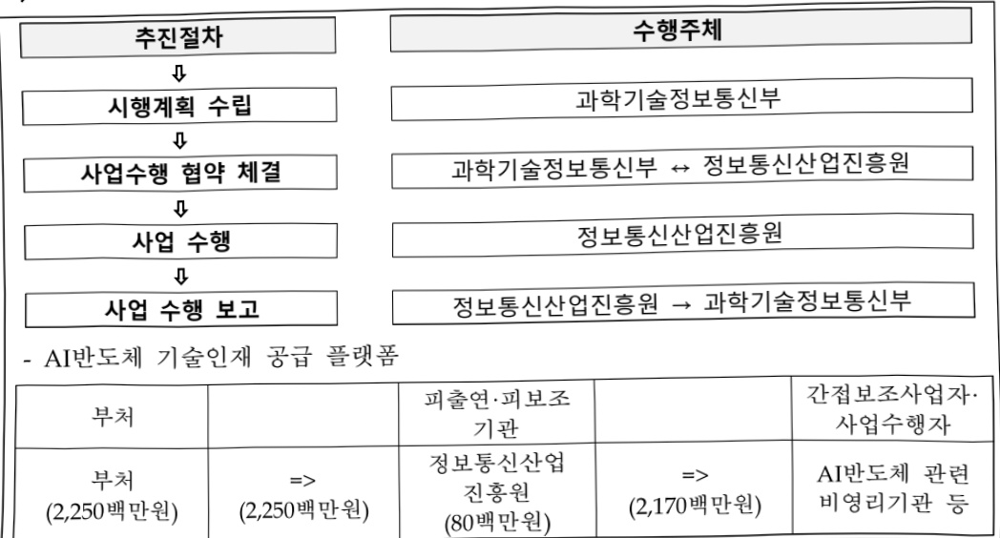

# AI 반도체 지원플랫폼

**해당 페이지**: PDF 321 ~ 326 쪽 해당

**부처**: 과학기술정보통신부
**분야**: 통신
**회계유형**: 일반회계
**2026 확정예산**: 2250.0 백만원
**전년대비 증감률**: -35.7%
**AI 도메인**: AI반도체

---

<table border=1 style='margin: auto; word-wrap: break-word;'><tr><td style='text-align: center; word-wrap: break-word;'>사 업 명</td></tr><tr><td style='text-align: center; word-wrap: break-word;'>(333) AI반도체 지원플랫폼 (2603-324)</td></tr></table>

사업 코드 정보

<table border=1 style='margin: auto; word-wrap: break-word;'><tr><td style='text-align: center; word-wrap: break-word;'>구분</td><td style='text-align: center; word-wrap: break-word;'>회계</td><td style='text-align: center; word-wrap: break-word;'>소관</td><td style='text-align: center; word-wrap: break-word;'>실국(기관)</td><td style='text-align: center; word-wrap: break-word;'>계정</td><td style='text-align: center; word-wrap: break-word;'>분야</td><td style='text-align: center; word-wrap: break-word;'>부문</td></tr><tr><td style='text-align: center; word-wrap: break-word;'>코드</td><td rowspan="2">일반회계</td><td style='text-align: center; word-wrap: break-word;'>과학기술</td><td style='text-align: center; word-wrap: break-word;'>정보통신</td><td rowspan="2"></td><td style='text-align: center; word-wrap: break-word;'>130</td><td style='text-align: center; word-wrap: break-word;'>133</td></tr><tr><td style='text-align: center; word-wrap: break-word;'>명칭</td><td style='text-align: center; word-wrap: break-word;'>정보통신부</td><td style='text-align: center; word-wrap: break-word;'>산업정책관</td><td style='text-align: center; word-wrap: break-word;'>통신</td><td style='text-align: center; word-wrap: break-word;'>정보통신</td></tr></table>

<table border=1 style='margin: auto; word-wrap: break-word;'><tr><td style='text-align: center; word-wrap: break-word;'>구분</td><td style='text-align: center; word-wrap: break-word;'>프로그램</td><td style='text-align: center; word-wrap: break-word;'>단위사업</td><td style='text-align: center; word-wrap: break-word;'>세부사업</td></tr><tr><td style='text-align: center; word-wrap: break-word;'>코드</td><td style='text-align: center; word-wrap: break-word;'>2600</td><td style='text-align: center; word-wrap: break-word;'>2603</td><td style='text-align: center; word-wrap: break-word;'>324</td></tr><tr><td style='text-align: center; word-wrap: break-word;'>명칭</td><td style='text-align: center; word-wrap: break-word;'>인공지능데이터진흥</td><td style='text-align: center; word-wrap: break-word;'>AI반도체경쟁력강화(일반)</td><td style='text-align: center; word-wrap: break-word;'>AI반도체 지원플랫폼</td></tr></table>

사업 성격 (공통요구자료 II-1 작성유의사항 4. 참조, 해당하는 사항에 “○” 표시)

<table border=1 style='margin: auto; word-wrap: break-word;'><tr><td rowspan="2">신규</td><td rowspan="2">계속</td><td rowspan="2">완료</td><td rowspan="2">예비타당성 실시여부</td><td rowspan="2">총사업비 관리대상</td><td rowspan="2">총액계상 예산사업</td><td style='text-align: center; word-wrap: break-word;'>사업소관 변경정보</td></tr><tr><td style='text-align: center; word-wrap: break-word;'>2025예산 시 소관</td></tr><tr><td style='text-align: center; word-wrap: break-word;'></td><td style='text-align: center; word-wrap: break-word;'>○</td><td style='text-align: center; word-wrap: break-word;'></td><td style='text-align: center; word-wrap: break-word;'></td><td style='text-align: center; word-wrap: break-word;'></td><td style='text-align: center; word-wrap: break-word;'></td><td style='text-align: center; word-wrap: break-word;'></td></tr></table>

사업 지원 형태 및 지원을 (최소한 한 개는 반드시 선택하시오. 해당사항에 O 표시)

<table border=1 style='margin: auto; word-wrap: break-word;'><tr><td style='text-align: center; word-wrap: break-word;'>직접</td><td style='text-align: center; word-wrap: break-word;'>출자</td><td style='text-align: center; word-wrap: break-word;'>출연</td><td style='text-align: center; word-wrap: break-word;'>보조</td><td style='text-align: center; word-wrap: break-word;'>융자</td><td style='text-align: center; word-wrap: break-word;'>국고보조율(%)</td><td style='text-align: center; word-wrap: break-word;'>융자율(%)</td></tr><tr><td style='text-align: center; word-wrap: break-word;'></td><td style='text-align: center; word-wrap: break-word;'></td><td style='text-align: center; word-wrap: break-word;'>○</td><td style='text-align: center; word-wrap: break-word;'></td><td style='text-align: center; word-wrap: break-word;'></td><td style='text-align: center; word-wrap: break-word;'></td><td style='text-align: center; word-wrap: break-word;'></td></tr></table>

## 사업 소관부처 및 시행주체

<table border=1 style='margin: auto; word-wrap: break-word;'><tr><td style='text-align: center; word-wrap: break-word;'>사업명</td><td colspan="2">구분</td></tr><tr><td rowspan="3">AI반도체기술인재공급플랫폼</td><td rowspan="2">소관부처</td><td style='text-align: center; word-wrap: break-word;'>정보통신정책실정보통신산업정책관</td></tr><tr><td style='text-align: center; word-wrap: break-word;'>정보통신방송기술정책과</td></tr><tr><td style='text-align: center; word-wrap: break-word;'>사업시행주체</td><td style='text-align: center; word-wrap: break-word;'>정보통신산업진흥원</td></tr></table>

---

### 가. 예산 총괄표

(단위: 백만원, %)

<table border=1 style='margin: auto; word-wrap: break-word;'><tr><td rowspan="2">사업명</td><td rowspan="2">2024년 결산</td><td colspan="2">2025년 예산</td><td colspan="2">2026년 예산</td><td rowspan="2">증감 (B-A)</td><td rowspan="2">(B-A)/A</td></tr><tr><td style='text-align: center; word-wrap: break-word;'>본예산</td><td style='text-align: center; word-wrap: break-word;'>추경 $ ^{*} $(A)</td><td style='text-align: center; word-wrap: break-word;'>요구안</td><td style='text-align: center; word-wrap: break-word;'>본예산(B)</td></tr><tr><td style='text-align: center; word-wrap: break-word;'>AI반도체 지원플랫폼</td><td style='text-align: center; word-wrap: break-word;'>-</td><td style='text-align: center; word-wrap: break-word;'>3,500</td><td style='text-align: center; word-wrap: break-word;'>3,500</td><td style='text-align: center; word-wrap: break-word;'>2,250</td><td style='text-align: center; word-wrap: break-word;'>2,250</td><td style='text-align: center; word-wrap: break-word;'>△1,250</td><td style='text-align: center; word-wrap: break-word;'>△35.7</td></tr></table>

* 추경: 추경증감액을 포함한 최종 예산액을 기재

□ 기능별(내역사업별) 예산 내역

(단위:백만원)

<table border=1 style='margin: auto; word-wrap: break-word;'><tr><td rowspan="2"></td><td colspan="5">2024</td><td colspan="5">2025</td><td rowspan="2">2026 倉冫</td></tr><tr><td style='text-align: center; word-wrap: break-word;'>倉冫倉(倉)</td><td style='text-align: center; word-wrap: break-word;'>倉冫倉(倉)</td><td style='text-align: center; word-wrap: break-word;'>倉冫倉(倉)</td><td style='text-align: center; word-wrap: break-word;'>倉冫倉(倉)</td><td style='text-align: center; word-wrap: break-word;'>倉冫倉(倉)</td><td style='text-align: center; word-wrap: break-word;'>倉冫倉(倉)</td><td style='text-align: center; word-wrap: break-word;'>倉冫倉(倉)</td><td style='text-align: center; word-wrap: break-word;'>倉冫倉(倉)</td><td style='text-align: center; word-wrap: break-word;'>倉冫倉(倉)</td><td style='text-align: center; word-wrap: break-word;'>倉冫倉(倉)</td></tr><tr><td style='text-align: center; word-wrap: break-word;'>○ 기능별 분류(함계)</td><td style='text-align: center; word-wrap: break-word;'>-</td><td style='text-align: center; word-wrap: break-word;'>-</td><td style='text-align: center; word-wrap: break-word;'>-</td><td style='text-align: center; word-wrap: break-word;'>-</td><td style='text-align: center; word-wrap: break-word;'>-</td><td style='text-align: center; word-wrap: break-word;'>3,500</td><td style='text-align: center; word-wrap: break-word;'>3,500</td><td style='text-align: center; word-wrap: break-word;'>3,500</td><td style='text-align: center; word-wrap: break-word;'>-</td><td style='text-align: center; word-wrap: break-word;'>-</td><td style='text-align: center; word-wrap: break-word;'>2,250</td></tr><tr><td style='text-align: center; word-wrap: break-word;'>· AI반도체 기술인제 공급 플랫폼</td><td style='text-align: center; word-wrap: break-word;'>-</td><td style='text-align: center; word-wrap: break-word;'>-</td><td style='text-align: center; word-wrap: break-word;'>-</td><td style='text-align: center; word-wrap: break-word;'>-</td><td style='text-align: center; word-wrap: break-word;'>-</td><td style='text-align: center; word-wrap: break-word;'>3,500</td><td style='text-align: center; word-wrap: break-word;'>3,500</td><td style='text-align: center; word-wrap: break-word;'>3,500</td><td style='text-align: center; word-wrap: break-word;'>-</td><td style='text-align: center; word-wrap: break-word;'>-</td><td style='text-align: center; word-wrap: break-word;'>2,250</td></tr></table>

### 나. 사업설명자료

## 1 ) 사업목적·내용

- (AI반도체 기술인재 공급 플랫폼) 국내 AI반도체 관련 기업이 당면하고 있는 AI반도체 기술 및 인력난 극복을 위해 국내·외 인재 공급체계를 구축하여 AI반도체 기업이 즉시 활용 가능한 인력을 지원

## 2 ) 사업개요

## 사업근거 및 추진경위

① 법령상 근거 및 조항 적시

- 정보통신 진흥 및 융합 활성화 등에 관한 특별법 제32조(정보통신융합 등 기술·서비스 개발 등의 지원)

제32조(정보통신융합등 기술·서비스 개발 등의 지원) ① 과학기술정보통신부장관은 다른 산업 및 서비스 등에 정보통신의 접목을 통하여 생산성과 가치를 높일 수 있도록 노력하여야 한다.

② 과학기술정보통신부장관은 정보통신융합등 기술·서비스의 개발을 촉진하기 위하여 다음 각 호의 사업을 추진할 수 있다.

---

<table border=1 style='margin: auto; word-wrap: break-word;'><tr><td style='text-align: center; word-wrap: break-word;'>1. 정보통신융합등 기술·서비스 관련 연구개발 사업</td></tr><tr><td style='text-align: center; word-wrap: break-word;'>2. 제1호에 따라 추진되는 과제에 대한 기획·평가·관리</td></tr><tr><td style='text-align: center; word-wrap: break-word;'>3. 국가·지방자치단체, 대학·정부출연연구기관, 민간 등이 보유한 정보통신융합등 기술의 거래 등 기술이전을 위한 중개·알선 지원</td></tr><tr><td style='text-align: center; word-wrap: break-word;'>4. 정보통신융합등 기술에 대한 평가 및 평가 기법의 개발·보급</td></tr><tr><td style='text-align: center; word-wrap: break-word;'>5. 정보통신융합등 기술의 기술이전·사업화에 관한 통계조사·연구 등 관련 정보의 수집·분석·제공</td></tr><tr><td style='text-align: center; word-wrap: break-word;'>6. 정보통신융합등 기술의 기술이전 후 상용화 연구개발 지원</td></tr><tr><td style='text-align: center; word-wrap: break-word;'>7. 정보통신융합등 기술의 기술사업화 전문인력 양성</td></tr><tr><td style='text-align: center; word-wrap: break-word;'>8. 정보통신융합등 기술의 기술거래·사업화 촉진을 위한 정보시스템 구축·활용</td></tr><tr><td style='text-align: center; word-wrap: break-word;'>9. 지식재산권 등 정보통신융합등 기술 관련 연구성과물의 관리·홍보·활용</td></tr><tr><td style='text-align: center; word-wrap: break-word;'>10. 정보통신융합등 기술·서비스의 수준조사 등 정책연구 사업</td></tr><tr><td style='text-align: center; word-wrap: break-word;'>11. 정보통신융합등 기술·서비스 관련 시범사업</td></tr><tr><td style='text-align: center; word-wrap: break-word;'>12. 그 밖에 정보통신기술진흥을 위하여 필요한 사업</td></tr><tr><td style='text-align: center; word-wrap: break-word;'>③ 과학기술정보통신부장관은 제2항 각 호의 사업을 추진하기 위하여 법인인 전담기관을 설립하거나 법인·단체에 위탁·운영할 수 있으며, 필요한 비용의 전부 또는 일부를 예산의 범위에서 출연 또는 보조할 수 있다.</td></tr><tr><td style='text-align: center; word-wrap: break-word;'>④ 중앙행정기관의 장 및 지방자치단체의 장은 제2항 각 호의 사업을 제3항에 따른 전담기관으로 하여금 수행하게 하고, 그에 소요되는 비용의 전부 또는 일부를 지원할 수 있다.</td></tr><tr><td style='text-align: center; word-wrap: break-word;'>⑤ 제3항에 따른 전담기관에 관하여 이 법에서 정한 것을 제외하고는「민법」 중 재단법인에 관한 규정을 준용하며, 전담기관의 운영 및 제2항 각 호의 업무수행에 필요한 사항은 대통령령으로 정한다.</td></tr></table>

② 추진경위 - 사업 시작년도, 추진배경, 부처별 중점과제, 대통령 공약사항 등

- 국민과 함께하는 민생토론회-민생을 살찌우는 반도체 산업('24.1)

- 반도체 현안점검 회의('24.4, 대통령 주재)

- 「AI반도체 이니셔티브」 과기전문회의 전원회의 심의·의결('24.4)

- (국정과제 22-4) 차세대 AI반도체(NPU, PIM 등) 기술 선점 및 산업 생태계 조성

---

## 주요내용

① 사업규모

- 총사업비 : 해당없음

- 사업기간 : '25 ~ '27

- 최근 5년 간 투입된 사업비(예산액기준, 추경편성한 연도에는 추경포함)

<table border=1 style='margin: auto; word-wrap: break-word;'><tr><td style='text-align: center; word-wrap: break-word;'>2022</td><td style='text-align: center; word-wrap: break-word;'>2023</td><td style='text-align: center; word-wrap: break-word;'>2024</td><td style='text-align: center; word-wrap: break-word;'>2025</td><td style='text-align: center; word-wrap: break-word;'>2026</td></tr><tr><td style='text-align: center; word-wrap: break-word;'>-</td><td style='text-align: center; word-wrap: break-word;'>-</td><td style='text-align: center; word-wrap: break-word;'>-</td><td style='text-align: center; word-wrap: break-word;'>3,500</td><td style='text-align: center; word-wrap: break-word;'>2,250</td></tr></table>

- 기타: 해당없음

② 사업추진체계

- 사업시행방법 : 출연

- 사업시행주체 : 정보통신산업진흥원

- 사업 수혜자 : AI반도체 관련 시업 및 국내·외 AI반도체 분야의 고급인력 및 전문가 등

- 보조, 융자, 출연, 출자 등의 경우 보조·융자 등 지원 비율 및 법적근거

<table border=1 style='margin: auto; word-wrap: break-word;'><tr><td style='text-align: center; word-wrap: break-word;'>내역사업명</td><td style='text-align: center; word-wrap: break-word;'>구분</td><td style='text-align: center; word-wrap: break-word;'>피보조·피출연 등 기관명</td><td style='text-align: center; word-wrap: break-word;'>지원 금액 (2026예산)</td><td style='text-align: center; word-wrap: break-word;'>지원 비율(%)</td><td style='text-align: center; word-wrap: break-word;'>보조율 법적근거 (해당 조항)</td></tr><tr><td style='text-align: center; word-wrap: break-word;'>AI반도체 기술인재 공급 플랫폼</td><td style='text-align: center; word-wrap: break-word;'>출연</td><td style='text-align: center; word-wrap: break-word;'>정보통신 산업진흥원</td><td style='text-align: center; word-wrap: break-word;'>2,250</td><td style='text-align: center; word-wrap: break-word;'>100</td><td style='text-align: center; word-wrap: break-word;'>정보통신 진흥 및 융합 활성화 등에 관한 특별법 제32조 3항</td></tr></table>

## 3 ) 2026년도 예산 산출 근거

<table border=1 style='margin: auto; word-wrap: break-word;'><tr><td style='text-align: center; word-wrap: break-word;'>① AI반도체 기술인재 공급 플랫폼(2,250백만원)</td></tr></table>

## 4 ) 사업효과

사업영향, 산출물 성과지표 등

① 2022~2026년도 성과계획서 상 성과지표 및 최근 5년간 성과 달성도

<table border=1 style='margin: auto; word-wrap: break-word;'><tr><td style='text-align: center; word-wrap: break-word;'>성과지표</td><td style='text-align: center; word-wrap: break-word;'>구분</td><td style='text-align: center; word-wrap: break-word;'>2022</td><td style='text-align: center; word-wrap: break-word;'>2023</td><td style='text-align: center; word-wrap: break-word;'>2024</td><td style='text-align: center; word-wrap: break-word;'>2025</td><td style='text-align: center; word-wrap: break-word;'>2026</td><td style='text-align: center; word-wrap: break-word;'>2026 목표치산출근거</td><td style='text-align: center; word-wrap: break-word;'>측정산식(또는 측정방법)</td><td style='text-align: center; word-wrap: break-word;'>자료수집방법(또는 자료출처)</td></tr><tr><td rowspan="3">수요기업만족도(단위:점)</td><td style='text-align: center; word-wrap: break-word;'>목표</td><td style='text-align: center; word-wrap: break-word;'>-</td><td style='text-align: center; word-wrap: break-word;'>-</td><td style='text-align: center; word-wrap: break-word;'>-</td><td style='text-align: center; word-wrap: break-word;'>70</td><td style='text-align: center; word-wrap: break-word;'>77</td><td rowspan="3">작년도 목표의 110%를 반영하여 목표치 설정</td><td rowspan="3">수요기업담당자 대상설문조사</td><td rowspan="3">설문조사, 결과보고서</td></tr><tr><td style='text-align: center; word-wrap: break-word;'>실적</td><td style='text-align: center; word-wrap: break-word;'>-</td><td style='text-align: center; word-wrap: break-word;'>-</td><td style='text-align: center; word-wrap: break-word;'>-</td><td style='text-align: center; word-wrap: break-word;'>86.8</td><td style='text-align: center; word-wrap: break-word;'>-</td></tr><tr><td style='text-align: center; word-wrap: break-word;'>달성도</td><td style='text-align: center; word-wrap: break-word;'>-</td><td style='text-align: center; word-wrap: break-word;'>-</td><td style='text-align: center; word-wrap: break-word;'>-</td><td style='text-align: center; word-wrap: break-word;'>124%</td><td style='text-align: center; word-wrap: break-word;'>-</td></tr></table>

② 성과지표 이외의 연도별 사업추진 경과 및 실적

---

<table border=1 style='margin: auto; word-wrap: break-word;'><tr><td rowspan="3">2025</td><td style='text-align: center; word-wrap: break-word;'>○ 2025년 AI칩 콘(제2회 AI반도체 기술인재 선발대회) 운영 및 검증플랫폼 구축 등 - (대상) 운영기관 1개, 수요기업 9개, 30개팀 88명 - (대회 분야) AI반도체 설계, 활용, 응용 분야</td></tr><tr><td style='text-align: center; word-wrap: break-word;'>○ 2025년 AI칩 캠프 운영을 통한 우수인재 역량진단 등 지원 - 상, 하반기 2회 진행하여, 총 199명 참가하여 AI반도체 인재들의 역량향상 지원 및 수요기업 과의 채용연계 지원</td></tr><tr><td style='text-align: center; word-wrap: break-word;'>○ 수요기업-우수인재 채용연계 지원 - &#x27;24년도 수요기업 10개 대상 채용연계 추진하여 채용연계 167건, 채용확정 61건&#x27;(25.12월 기준), &#x27;25년 수요기업 대상 채용 진행중</td></tr></table>

③향후(2026년도 이후)기대효과

- 기업 맞춤형 인재 채용 연계 지원하여 국내 AI반도체 기업의 글로벌 기술 경쟁력 확보 및 인력난 해소

## 5 ) 타당성조사 및 예비타당성조사 시행여부 및 결과 요지 : 해당없음

6) 총사업비 대상사업 정보 : 해당없음

7) 사업 집행절차

<table border=1 style='margin: auto; word-wrap: break-word;'><tr><td style='text-align: center; word-wrap: break-word;'>부처</td><td style='text-align: center; word-wrap: break-word;'></td><td style='text-align: center; word-wrap: break-word;'>피출연·피보조기관</td><td style='text-align: center; word-wrap: break-word;'></td><td style='text-align: center; word-wrap: break-word;'>간접보조사업자·사업수행자</td></tr><tr><td style='text-align: center; word-wrap: break-word;'>부처(2,250백만원)</td><td style='text-align: center; word-wrap: break-word;'>=&gt;(2,250백만원)</td><td style='text-align: center; word-wrap: break-word;'>정보통신산업 진흥원(80백만원)</td><td style='text-align: center; word-wrap: break-word;'>=&gt;(2,170백만원)</td><td style='text-align: center; word-wrap: break-word;'>AI반도체 관련 비영리기관 등</td></tr></table>

## 8 ) 각종 평가 : 해당없음

---

### 다. 최근 4년간 결산내역

## 1 ) 결산표

☐ 부처 결산내역

(단위: 백만원, %)

<table border=1 style='margin: auto; word-wrap: break-word;'><tr><td rowspan="2">闰도</td><td colspan="3">예산액</td><td rowspan="2">예산현액(A)</td><td rowspan="2">집행액(B)</td><td rowspan="2">집행률(B/A)</td><td rowspan="2">다음연도이월액</td><td rowspan="2">불용액</td></tr><tr><td style='text-align: center; word-wrap: break-word;'>본예산</td><td style='text-align: center; word-wrap: break-word;'>추경증감액</td><td style='text-align: center; word-wrap: break-word;'>추경</td></tr><tr><td style='text-align: center; word-wrap: break-word;'>2022</td><td style='text-align: center; word-wrap: break-word;'>-</td><td style='text-align: center; word-wrap: break-word;'>-</td><td style='text-align: center; word-wrap: break-word;'>-</td><td style='text-align: center; word-wrap: break-word;'>-</td><td style='text-align: center; word-wrap: break-word;'>-</td><td style='text-align: center; word-wrap: break-word;'>-</td><td style='text-align: center; word-wrap: break-word;'>-</td><td style='text-align: center; word-wrap: break-word;'>-</td></tr><tr><td style='text-align: center; word-wrap: break-word;'>2023</td><td style='text-align: center; word-wrap: break-word;'>-</td><td style='text-align: center; word-wrap: break-word;'>-</td><td style='text-align: center; word-wrap: break-word;'>-</td><td style='text-align: center; word-wrap: break-word;'>-</td><td style='text-align: center; word-wrap: break-word;'>-</td><td style='text-align: center; word-wrap: break-word;'>-</td><td style='text-align: center; word-wrap: break-word;'>-</td><td style='text-align: center; word-wrap: break-word;'>-</td></tr><tr><td style='text-align: center; word-wrap: break-word;'>2024</td><td style='text-align: center; word-wrap: break-word;'>-</td><td style='text-align: center; word-wrap: break-word;'>-</td><td style='text-align: center; word-wrap: break-word;'>-</td><td style='text-align: center; word-wrap: break-word;'>-</td><td style='text-align: center; word-wrap: break-word;'>-</td><td style='text-align: center; word-wrap: break-word;'>-</td><td style='text-align: center; word-wrap: break-word;'>-</td><td style='text-align: center; word-wrap: break-word;'>-</td></tr><tr><td style='text-align: center; word-wrap: break-word;'>2025</td><td style='text-align: center; word-wrap: break-word;'>3,500</td><td style='text-align: center; word-wrap: break-word;'>-</td><td style='text-align: center; word-wrap: break-word;'>3,500</td><td style='text-align: center; word-wrap: break-word;'>3,500</td><td style='text-align: center; word-wrap: break-word;'>3,500</td><td style='text-align: center; word-wrap: break-word;'>100</td><td style='text-align: center; word-wrap: break-word;'>-</td><td style='text-align: center; word-wrap: break-word;'>-</td></tr></table>

## 2 ) 주요 결산사항

2022~2025년 결산 주요사항 : 해당없음

□ 2025년 이·전용 등 세부내역 : 해당없음

---

### 원본 PDF 크롭 이미지

