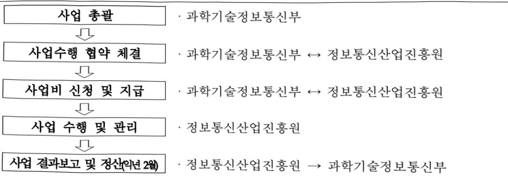

# AI 분야 오픈소스 생태계 조성

**해당 페이지**: PDF 327 ~ 332 쪽 해당

**부처**: 과학기술정보통신부
**분야**: 통신
**회계유형**: 일반회계
**2026 확정예산**: 11000.0 백만원
**전년대비 증감률**: 100.0%
**AI 도메인**: LLM/언어모델

---

<table border=1 style='margin: auto; word-wrap: break-word;'><tr><td style='text-align: center; word-wrap: break-word;'>사 업 명</td></tr><tr><td style='text-align: center; word-wrap: break-word;'>(219) AI 분야 오픈소스 생태계 조성 (2232-329)</td></tr></table>

□ 사업 코드 정보

<table border=1 style='margin: auto; word-wrap: break-word;'><tr><td style='text-align: center; word-wrap: break-word;'>구분</td><td style='text-align: center; word-wrap: break-word;'>회계</td><td style='text-align: center; word-wrap: break-word;'>소관</td><td style='text-align: center; word-wrap: break-word;'>실국(기관)</td><td style='text-align: center; word-wrap: break-word;'>계정</td><td style='text-align: center; word-wrap: break-word;'>분야</td><td style='text-align: center; word-wrap: break-word;'>부문</td></tr><tr><td style='text-align: center; word-wrap: break-word;'>코드 명칭</td><td style='text-align: center; word-wrap: break-word;'>일반회계</td><td style='text-align: center; word-wrap: break-word;'>과학기술 정보통신부</td><td style='text-align: center; word-wrap: break-word;'>정보통신정책실 소프트웨어정책관</td><td style='text-align: center; word-wrap: break-word;'></td><td style='text-align: center; word-wrap: break-word;'>130 통신</td><td style='text-align: center; word-wrap: break-word;'>133 정보통신</td></tr></table>

<table border=1 style='margin: auto; word-wrap: break-word;'><tr><td style='text-align: center; word-wrap: break-word;'>구분</td><td style='text-align: center; word-wrap: break-word;'>프로그램</td><td style='text-align: center; word-wrap: break-word;'>단위사업</td><td style='text-align: center; word-wrap: break-word;'>세부사업</td></tr><tr><td style='text-align: center; word-wrap: break-word;'>코드</td><td style='text-align: center; word-wrap: break-word;'>2200</td><td style='text-align: center; word-wrap: break-word;'>2232</td><td style='text-align: center; word-wrap: break-word;'>329</td></tr><tr><td style='text-align: center; word-wrap: break-word;'>명칭</td><td style='text-align: center; word-wrap: break-word;'>SW산업진흥</td><td style='text-align: center; word-wrap: break-word;'>SW융합인력양성</td><td style='text-align: center; word-wrap: break-word;'>AI 분야 오픈소스 생태계 조성</td></tr></table>

□ 사업 성격 (공통요구자료 Ⅱ-1 작성유의사항 4. 참조, 해당하는 사항에 “○” 표시)

<table border=1 style='margin: auto; word-wrap: break-word;'><tr><td style='text-align: center; word-wrap: break-word;'>신규</td><td style='text-align: center; word-wrap: break-word;'>계속</td><td style='text-align: center; word-wrap: break-word;'>완료</td><td style='text-align: center; word-wrap: break-word;'>예비타당성실시여부</td><td style='text-align: center; word-wrap: break-word;'>총사업비관리대상</td><td style='text-align: center; word-wrap: break-word;'>총액계상예산사업</td><td style='text-align: center; word-wrap: break-word;'>사업소관 변경정보</td></tr><tr><td style='text-align: center; word-wrap: break-word;'>○</td><td style='text-align: center; word-wrap: break-word;'></td><td style='text-align: center; word-wrap: break-word;'></td><td style='text-align: center; word-wrap: break-word;'></td><td style='text-align: center; word-wrap: break-word;'></td><td style='text-align: center; word-wrap: break-word;'></td><td style='text-align: center; word-wrap: break-word;'></td></tr></table>

□ 사업 지원 형태 및 지원을 (최소한 한 개는 반드시 선택하시오. 해당사항에 O 표시)

<table border=1 style='margin: auto; word-wrap: break-word;'><tr><td style='text-align: center; word-wrap: break-word;'>직접</td><td style='text-align: center; word-wrap: break-word;'>출자</td><td style='text-align: center; word-wrap: break-word;'>출연</td><td style='text-align: center; word-wrap: break-word;'>보조</td><td style='text-align: center; word-wrap: break-word;'>융자</td><td style='text-align: center; word-wrap: break-word;'>국고보조율(%)</td><td style='text-align: center; word-wrap: break-word;'>융자율(%)</td></tr><tr><td style='text-align: center; word-wrap: break-word;'></td><td style='text-align: center; word-wrap: break-word;'></td><td style='text-align: center; word-wrap: break-word;'>○</td><td style='text-align: center; word-wrap: break-word;'></td><td style='text-align: center; word-wrap: break-word;'></td><td style='text-align: center; word-wrap: break-word;'></td><td style='text-align: center; word-wrap: break-word;'></td></tr></table>

## 사업담당자

<table border=1 style='margin: auto; word-wrap: break-word;'><tr><td style='text-align: center; word-wrap: break-word;'>사업명</td><td colspan="2">구분</td></tr><tr><td rowspan="3">AI 분야 오픈소스 생태계 조성</td><td rowspan="2">소관부처</td><td style='text-align: center; word-wrap: break-word;'>정보통신정책실·소프트웨어정책관</td></tr><tr><td style='text-align: center; word-wrap: break-word;'>소프트웨어산업과</td></tr><tr><td style='text-align: center; word-wrap: break-word;'>사업시행주체</td><td style='text-align: center; word-wrap: break-word;'>정보통신산업진흥원</td></tr></table>

---

### 가. 예산 총괄표

(단위: 백만원, %)

<table border=1 style='margin: auto; word-wrap: break-word;'><tr><td rowspan="2">사업명</td><td rowspan="2">2024년 결산</td><td colspan="2">2025년 예산</td><td colspan="2">2026년 예산</td><td rowspan="2">증감 (B-A)</td><td rowspan="2">(B-A)/A</td></tr><tr><td style='text-align: center; word-wrap: break-word;'>본예산</td><td style='text-align: center; word-wrap: break-word;'>$ \text{추경}^\ast(A) $</td><td style='text-align: center; word-wrap: break-word;'>요구안</td><td style='text-align: center; word-wrap: break-word;'>$ \text{본예산}(B) $</td></tr><tr><td style='text-align: center; word-wrap: break-word;'>AI 분야 오픈소스 생태계 조성</td><td style='text-align: center; word-wrap: break-word;'>-</td><td style='text-align: center; word-wrap: break-word;'>-</td><td style='text-align: center; word-wrap: break-word;'>-</td><td style='text-align: center; word-wrap: break-word;'>11,000</td><td style='text-align: center; word-wrap: break-word;'>11,000</td><td style='text-align: center; word-wrap: break-word;'>11,000</td><td style='text-align: center; word-wrap: break-word;'>100.0</td></tr></table>

□ 기능별(내역사업별) 예산 내역

(단위:백만원)

<table border=1 style='margin: auto; word-wrap: break-word;'><tr><td rowspan="2"></td><td colspan="5">2024</td><td colspan="7">2025(2025.12.11)</td></tr><tr><td style='text-align: center; word-wrap: break-word;'>예산액(추정)</td><td style='text-align: center; word-wrap: break-word;'>예산현액</td><td style='text-align: center; word-wrap: break-word;'>집행액[실집행액]</td><td style='text-align: center; word-wrap: break-word;'>이월액</td><td style='text-align: center; word-wrap: break-word;'>불용액</td><td style='text-align: center; word-wrap: break-word;'>본예산</td><td style='text-align: center; word-wrap: break-word;'>예산현액</td><td style='text-align: center; word-wrap: break-word;'>집행액[실집행액]</td><td colspan="2">전년도 이월액제외</td><td style='text-align: center; word-wrap: break-word;'>이월액예상액</td><td style='text-align: center; word-wrap: break-word;'>불용예상액</td></tr><tr><td style='text-align: center; word-wrap: break-word;'>○ 기능별 분류(합계)</td><td style='text-align: center; word-wrap: break-word;'>-</td><td style='text-align: center; word-wrap: break-word;'>-</td><td style='text-align: center; word-wrap: break-word;'>-</td><td style='text-align: center; word-wrap: break-word;'>-</td><td style='text-align: center; word-wrap: break-word;'>-</td><td style='text-align: center; word-wrap: break-word;'>-</td><td style='text-align: center; word-wrap: break-word;'>-</td><td style='text-align: center; word-wrap: break-word;'>-</td><td style='text-align: center; word-wrap: break-word;'>-</td><td style='text-align: center; word-wrap: break-word;'>-</td><td style='text-align: center; word-wrap: break-word;'>-</td><td style='text-align: center; word-wrap: break-word;'>11,000</td></tr><tr><td style='text-align: center; word-wrap: break-word;'>• 오픈소스 AI-SW 활용 지원</td><td style='text-align: center; word-wrap: break-word;'>-</td><td style='text-align: center; word-wrap: break-word;'>-</td><td style='text-align: center; word-wrap: break-word;'>-</td><td style='text-align: center; word-wrap: break-word;'>-</td><td style='text-align: center; word-wrap: break-word;'>-</td><td style='text-align: center; word-wrap: break-word;'>-</td><td style='text-align: center; word-wrap: break-word;'>-</td><td style='text-align: center; word-wrap: break-word;'>-</td><td style='text-align: center; word-wrap: break-word;'>-</td><td style='text-align: center; word-wrap: break-word;'>-</td><td style='text-align: center; word-wrap: break-word;'>-</td><td style='text-align: center; word-wrap: break-word;'>10,000</td></tr><tr><td style='text-align: center; word-wrap: break-word;'>• 오픈소스 AI-SW 커뮤니티 활성화</td><td style='text-align: center; word-wrap: break-word;'>-</td><td style='text-align: center; word-wrap: break-word;'>-</td><td style='text-align: center; word-wrap: break-word;'>-</td><td style='text-align: center; word-wrap: break-word;'>-</td><td style='text-align: center; word-wrap: break-word;'>-</td><td style='text-align: center; word-wrap: break-word;'>-</td><td style='text-align: center; word-wrap: break-word;'>-</td><td style='text-align: center; word-wrap: break-word;'>-</td><td style='text-align: center; word-wrap: break-word;'>-</td><td style='text-align: center; word-wrap: break-word;'>-</td><td style='text-align: center; word-wrap: break-word;'>-</td><td style='text-align: center; word-wrap: break-word;'>1,000</td></tr></table>

### 나.사업설명자료

## 1 ) 사업목적·내용

- (사업목적) AI 분야 오픈소스 활용 기업 성장 및 인재 양성을 통한 개방형 AI 생태계 구축 및 글로벌 산업 경쟁력 강화

- (오픈소스 AI·SW 활용 지원) AI 분야 오픈소스(SW, LLM 등)를 활용한 제품·서비스 개발·사업화 및 컨설팅(라이선스 검증, 기술, 품질 관리 등) 지원

- (오픈소스 AI·SW 커뮤니티 활성화) AI 분야 오픈소스 생태계 글로벌 리더급 개발자

육성 관련 인재 양성 프로그램 운영 및 커뮤니티 활성화 등 지원

## 2 ) 사업개요

## □ 사업근거 및 추진경위

① 법령상 근거 및 조항

-정보통신산업진흥법(제26조, 제27조, 제28조)

---

제26조(정보통신산업진흥원의 설립 등) ① 정보통신산업을 효율적으로 지원하기 위하여 정보통신산업진흥원(이하 "산업진흥원"이라 한다)을 설립한다.
제27조(사업) 산업진흥원은 다음 각 호의 사업을 한다.
1. 정보통신산업 정책연구 및 정책수립 지원
2. 전문인력 양성
3. 정보통신산업 육성 · 발전 및 지원시설 등 기반조성사업
4. 정보통신기업의 창업 · 성장 등의 지원
5. 정보통신산업 발전을 위한 유통시장 활성화와 마케팅 지원
6. 정보통신산업 동향분석, 통계작성, 정보 유통, 서비스 등에 관한 사업
7. 정보통신기술의 융합 · 활용에 관한 사업
8. 정보통신산업 관련 국제교류 · 협력 및 해외진출의 지원
9. 정보통신산업 관련 출판 · 홍보
10. 「소프트웨어 진흥법」 제2조제2호에 따른 소프트웨어산업에 관한 다음 각 목의 사업
가. 소프트웨어 기술진흥을 위한 정책 및 제도의 조사 · 연구
나. 소프트웨어사업자의 품질관리능력 및 전문성 향상에 필요한 사업
13. 이 법 또는 다른 법령에서 산업진흥원의 업무로 정하거나 산업진흥원에 위탁한 사업
제28조(재원 등) ① 정부는 예산 또는 기금의 범위에서 산업진흥원의 설립, 시설, 운영 및 사업 추진 등에 필요한 경비의 전부 또는 일부를 출연할 수 있다.
② 산업진흥원은 제26조제1항에 따른 목적을 달성하는 데 필요한 경비를 조달하기 위하여 과학기술정보통신부장관의 승인을 받아 수익사업을 할 수 있다.
⑤ 국가나 지방자치단체는 산업진흥원의 설립 및 운영을 위하여 필요할 때에는 국유 · 공유재산을 산업진흥원에 무상으로 대여할 수 있다.

-소프트웨어진흥법(제8조, 제28조)

제8조(소프트웨어산업 진흥 전담기관 등) ① 과학기술정보통신부장관은 소프트웨어산업의 진흥·발전을 효율적으로 지원하기 위하여「정보통신산업 진흥법」 제26조에 따른 정보통신산업진흥원을 소프트웨어산업 진흥 전담기관으로 지정한다.

제28조(소프트웨어융합 촉진) ① 정부는 관계 법령에 따라 소프트웨어융합을 활성화하여 다른 산업 분야의 혁신을 촉진하고 경쟁력을 강화할 수 있도록 노력하여야 한다.

② 과학기술정보통신부정관은 소프트웨어융합을 촉진하기 위하여 시범사업을 하거나 연구개발 및 수출 등을 지원할 수 있다

## ② 추진경위

- 제21대 대통령선거 정책공약집('25.6월)

□ 2. 성장 – AI 등 신산업 집중 육성 - 인공지능 대전환(AX)을 통해 AI 3강으로 도약하겠습니다

○ (인공지능 생태계의 핵심 기술 및 기반 확보) 거대언어모델(LLM):소규모언어모델 연구개발 및 사업화 지원

□ 2. 성장 – AI 등 신산업 집중 육성 - SW 新강국으로 도약하기 위한 발판을 마련하겠습니다

○ (IT-SW 新기술 융합 가속화) 공개SW(OSS, Open Source Software) 기반 IT-SW융합기술 혁신

- 이재명정부 123대 국정과제(21. 세계에서 AI를 가장 잘 쓰는 나라 구현)

---

## 주요내용

① 사업규모

- 총사업비(해당되는 경우에만 기재) : 해당없음

- 사업기간 : 2026년 ~ 계속

- 최근 5년 간 투입된 사업비(예산액기준, 추경편성한 연도에는 추경포함)

<table border=1 style='margin: auto; word-wrap: break-word;'><tr><td style='text-align: center; word-wrap: break-word;'>연도</td><td style='text-align: center; word-wrap: break-word;'>2022</td><td style='text-align: center; word-wrap: break-word;'>2023</td><td style='text-align: center; word-wrap: break-word;'>2024</td><td style='text-align: center; word-wrap: break-word;'>2025</td><td style='text-align: center; word-wrap: break-word;'>2026</td></tr><tr><td style='text-align: center; word-wrap: break-word;'>사업비</td><td style='text-align: center; word-wrap: break-word;'>-</td><td style='text-align: center; word-wrap: break-word;'>-</td><td style='text-align: center; word-wrap: break-word;'>-</td><td style='text-align: center; word-wrap: break-word;'>-</td><td style='text-align: center; word-wrap: break-word;'>11,000</td></tr></table>

-기타: 해당없음

② 사업추진체계

- 사업시행방법 : 출연

- 사업시행주체 : 정보통신산업진흥원

- 사업 수혜자 : 오픈소스 활용 IT·SW 기업, 커뮤니티 및 개발자 등

- 보조, 융자, 출연, 출자 등의 경우 보조 · 융자 등 지원 비율 및 법적근거

<table border=1 style='margin: auto; word-wrap: break-word;'><tr><td style='text-align: center; word-wrap: break-word;'>내역사업명</td><td style='text-align: center; word-wrap: break-word;'>구분</td><td style='text-align: center; word-wrap: break-word;'>피보조·피출연 등 기관명</td><td style='text-align: center; word-wrap: break-word;'>지원 금액 (2026예산)</td><td style='text-align: center; word-wrap: break-word;'>지원 비율(%)</td><td style='text-align: center; word-wrap: break-word;'>보조율 법적근거 (해당 조항)</td></tr><tr><td style='text-align: center; word-wrap: break-word;'>오픈소스 AI·SW 활용 지원</td><td rowspan="2">출연</td><td rowspan="2">정보통신 산업진흥원</td><td style='text-align: center; word-wrap: break-word;'>10,000백만원</td><td rowspan="2">100%</td><td rowspan="2">정보통신산업진흥법 제26조, 27조, 제28조</td></tr><tr><td style='text-align: center; word-wrap: break-word;'>오픈소스 AI·SW 커뮤니티 활성화</td><td style='text-align: center; word-wrap: break-word;'>1,000백만원</td></tr></table>

## 3 ) 2026년도 예산 산출 근거

① 오픈소스 AI·SW 활용 지원

:(2025 예산) 0백만원 → (2026 예산) 10,000백만원, 순증

- (요구) AI 분야 오픈소스(SW, LLM 등)를 활용한 제품·서비스 개발·사업화 및 컨설팅(라이선스 검증, 기술, 품질 관리 등) 지원 10,000백만원 요구

- (산출) 오픈소스 AI·SW 활용 지원 10,000백만원 = 10건 x 1,000백만원

② 오픈소스 AI·SW 커뮤니티 활성화

:(2025 예산) 0백만원 → (2026 예산) 1,000백만원, 순증

- (요구) AI 분야 오픈소스 기술을 보유한 핵심 인재 양성 프로그램 운영 및 커뮤니티 활성화 지원 1,000백만원 요구

- (산출) 인재양성(멘토링, 맞춤형 인재양성 프로그램, 성과공유회 등) 700백만원

커뮤니티 활성화(개발인프라 및 국내·외 네트워킹 활동 등) 300백만원

---

## 4 ) 사업효과

☐ 사업영향, 산출물 성과지표 등

①2022~2026년도 성과계획서 상 성과지표 및 최근 5년간 성과 달성도

<table border=1 style='margin: auto; word-wrap: break-word;'><tr><td style='text-align: center; word-wrap: break-word;'>성과지표</td><td style='text-align: center; word-wrap: break-word;'>구분</td><td style='text-align: center; word-wrap: break-word;'>2022</td><td style='text-align: center; word-wrap: break-word;'>2023</td><td style='text-align: center; word-wrap: break-word;'>2024</td><td style='text-align: center; word-wrap: break-word;'>2025</td><td style='text-align: center; word-wrap: break-word;'>2026</td><td style='text-align: center; word-wrap: break-word;'>2026 목표치산출근거</td><td style='text-align: center; word-wrap: break-word;'>측정산식(또는 측정방법)</td><td style='text-align: center; word-wrap: break-word;'>자료수집방법(또는 자료출처)</td></tr><tr><td rowspan="3">오픈소스 AI·SW 활용 제품·서비스 개발·사업화 건수 (단위: 건)</td><td style='text-align: center; word-wrap: break-word;'>목표</td><td style='text-align: center; word-wrap: break-word;'>-</td><td style='text-align: center; word-wrap: break-word;'>-</td><td style='text-align: center; word-wrap: break-word;'>-</td><td style='text-align: center; word-wrap: break-word;'>-</td><td style='text-align: center; word-wrap: break-word;'>10</td><td rowspan="3">&#x27;26년 지원규모(10개 과제)와 과제별 특성을 고려하여 목표량 설정</td><td rowspan="3">과제별 연차평가를 통해 성공 관정을 받은 과제 건수</td><td rowspan="3">결과보고서, 과제 평가 결과 등</td></tr><tr><td style='text-align: center; word-wrap: break-word;'>실적</td><td style='text-align: center; word-wrap: break-word;'>-</td><td style='text-align: center; word-wrap: break-word;'>-</td><td style='text-align: center; word-wrap: break-word;'>-</td><td style='text-align: center; word-wrap: break-word;'>-</td><td style='text-align: center; word-wrap: break-word;'>-</td></tr><tr><td style='text-align: center; word-wrap: break-word;'>달성도</td><td style='text-align: center; word-wrap: break-word;'>-</td><td style='text-align: center; word-wrap: break-word;'>-</td><td style='text-align: center; word-wrap: break-word;'>-</td><td style='text-align: center; word-wrap: break-word;'>-</td><td style='text-align: center; word-wrap: break-word;'>-</td></tr><tr><td rowspan="3">오픈소스 AI·SW 커뮤니티 활성화 사업 참여자 만족도 (단위: 점)</td><td style='text-align: center; word-wrap: break-word;'>목표</td><td style='text-align: center; word-wrap: break-word;'>-</td><td style='text-align: center; word-wrap: break-word;'>-</td><td style='text-align: center; word-wrap: break-word;'>-</td><td style='text-align: center; word-wrap: break-word;'>-</td><td style='text-align: center; word-wrap: break-word;'>80</td><td rowspan="3">&#x27;26년도 신규 성과지표로 &#x27;만족(80점 이상)&#x27; 등급 이상을 상쾌하는 목표치로 설정</td><td rowspan="3">°조사대상: 오픈소스 AI·SW 커뮤니티 활성화 사업 참여자 만족도 전반적 만족도 등 측정 5점 척도 방식</td><td rowspan="3">사업 참여자 만족도 설문조사 결과</td></tr><tr><td style='text-align: center; word-wrap: break-word;'>실적</td><td style='text-align: center; word-wrap: break-word;'>-</td><td style='text-align: center; word-wrap: break-word;'>-</td><td style='text-align: center; word-wrap: break-word;'>-</td><td style='text-align: center; word-wrap: break-word;'>-</td><td style='text-align: center; word-wrap: break-word;'>-</td></tr><tr><td style='text-align: center; word-wrap: break-word;'>달성도</td><td style='text-align: center; word-wrap: break-word;'>-</td><td style='text-align: center; word-wrap: break-word;'>-</td><td style='text-align: center; word-wrap: break-word;'>-</td><td style='text-align: center; word-wrap: break-word;'>-</td><td style='text-align: center; word-wrap: break-word;'>-</td></tr></table>

② 성과지표 이외의 연도별 사업추진 경과 및 실적 : 해당없음

③향후(2026년도 이후)기대효과

- AI 모델뿐 아니라 인프라·데이터·프레임워크 등 전 주기에서 오픈소스 활용 기업 연 10개 이상 발굴·지원으로 AI 산업의 기술자립성 및 경쟁력 강화

- 산업 내 수요가 높은 글로벌 수준의 실전형 오픈소스 AI·SW 핵심 인력 연 250명

이상 양성, 개발자 중심의 지속가능한 AI·SW 생태계 및 기술 리더십 확보

5) 타당성조사 및 예비타당성조사 시행여부 및 결과 요지 : 해당없음

6) 총사업비 대상사업 정보 : 해당없음

7) 사업 집행절차

사업 결과보고 및 정산(의년 2월) 정보통신산업진흥원 → 과학기술정보통신부

- 오픈소스 AI·SW 활용 지원

<table border=1 style='margin: auto; word-wrap: break-word;'><tr><td style='text-align: center; word-wrap: break-word;'>부처</td><td style='text-align: center; word-wrap: break-word;'></td><td style='text-align: center; word-wrap: break-word;'>피출연·피보조기관</td><td style='text-align: center; word-wrap: break-word;'></td><td style='text-align: center; word-wrap: break-word;'>간접보조사업자·사업수행자</td></tr><tr><td style='text-align: center; word-wrap: break-word;'>과기정통부(10,000백만원)</td><td style='text-align: center; word-wrap: break-word;'>=&gt;(10,000백만원)</td><td style='text-align: center; word-wrap: break-word;'>정보통신산업진흥원(800백만원)</td><td style='text-align: center; word-wrap: break-word;'>=&gt;(9,200백만원)</td><td style='text-align: center; word-wrap: break-word;'>오픈소스 활용IT·SW 기업 등</td></tr></table>

---

<table border=1 style='margin: auto; word-wrap: break-word;'><tr><td style='text-align: center; word-wrap: break-word;'>부처</td><td style='text-align: center; word-wrap: break-word;'></td><td style='text-align: center; word-wrap: break-word;'>피출연·피보조기관</td><td style='text-align: center; word-wrap: break-word;'>-</td><td style='text-align: center; word-wrap: break-word;'>-</td></tr><tr><td style='text-align: center; word-wrap: break-word;'>과기정통부(1,000백만원)</td><td style='text-align: center; word-wrap: break-word;'>=&gt;(1,000백만원)</td><td style='text-align: center; word-wrap: break-word;'>정보통신산업진흥원(1,000백만원)</td><td style='text-align: center; word-wrap: break-word;'>-</td><td style='text-align: center; word-wrap: break-word;'>-</td></tr></table>

8) 각종 평가 : 해당없음

다.최근 4년간 결산내역:해당없음

---

### 원본 PDF 크롭 이미지

