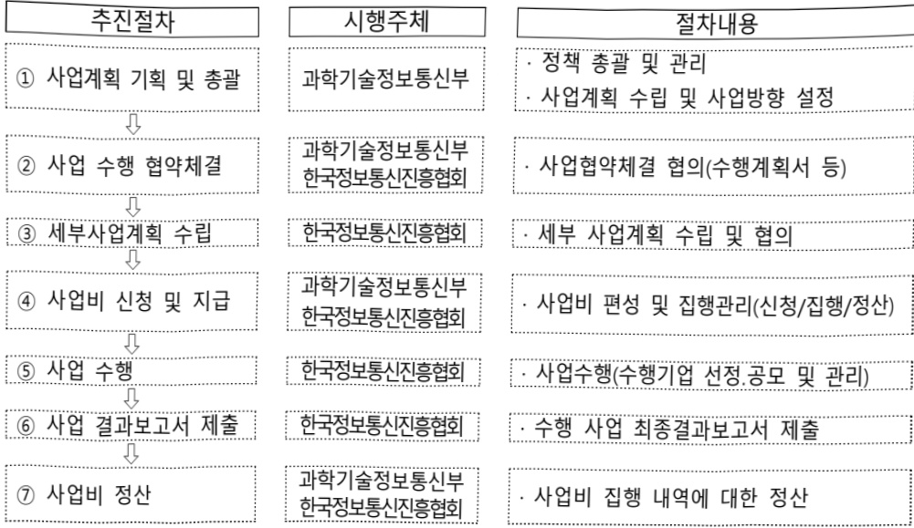

# AI 융합 OTT 글로벌 진출 확산 지원

**해당 페이지**: PDF 333 ~ 340 쪽 해당

**부처**: 과학기술정보통신부
**분야**: 통신
**회계유형**: 일반회계
**2026 확정예산**: 1200.0 백만원
**전년대비 증감률**: -85.0%
**AI 도메인**: 문화/콘텐츠, 디지털전환(AX)

---

### 가. 예산 총괄표

(단위: 백만원, %)

<table border=1 style='margin: auto; word-wrap: break-word;'><tr><td rowspan="2">사업명</td><td rowspan="2">2024년 결산</td><td colspan="2">2025년 예산</td><td colspan="2">2026년 예산</td><td rowspan="2">증감(B-A)</td><td rowspan="2">(B-A)/A</td></tr><tr><td style='text-align: center; word-wrap: break-word;'>본예산</td><td style='text-align: center; word-wrap: break-word;'>추경*(A)</td><td style='text-align: center; word-wrap: break-word;'>요구안</td><td style='text-align: center; word-wrap: break-word;'>본예산(B)</td></tr><tr><td style='text-align: center; word-wrap: break-word;'>AI 융합 OTT 글로벌 진출 확산 지원</td><td style='text-align: center; word-wrap: break-word;'>-</td><td style='text-align: center; word-wrap: break-word;'>-</td><td style='text-align: center; word-wrap: break-word;'>8,000</td><td style='text-align: center; word-wrap: break-word;'>-</td><td style='text-align: center; word-wrap: break-word;'>1,200</td><td style='text-align: center; word-wrap: break-word;'>△6,800</td><td style='text-align: center; word-wrap: break-word;'>△85.0</td></tr></table>

□ 기능별(내역사업별) 예산 내역

(단위:백만원)

<table border=1 style='margin: auto; word-wrap: break-word;'><tr><td rowspan="2"></td><td colspan="5">2024</td><td colspan="5">2025</td><td style='text-align: center; word-wrap: break-word;'>2026 叁</td></tr><tr><td style='text-align: center; word-wrap: break-word;'>叁叁叁(叁佟)</td><td style='text-align: center; word-wrap: break-word;'>叁叁叁叁叁叁叁叁叁叁叁叁叁叁叁叁叁叁叁叁叁叁叁叁叁叁叁叁叁叁叁叁叁叁叁叁叁叁叁叁叁叁叁叁叁叁叁叁叁叁叁叁叁叁叁叁叁叁叁叁叁叁叁叁叁叁叁叁叁叁叁叁叁叁叁叁叁叁叁叁叁叁叁叁叁叁叁叁叁叁叁叁叁叁叁叁叁叁叁叁叁叁叁叁叁叁叁叁叁叁叁叁叁叁叁叁叁叁叁叁叁叁叁叁叁叁叁叁叁叁叁叁叁叁叁叁叁叁叁叁叁叁叁叁叁叁叁叁叁叁叁叁叁叁叁叁叁叁叁叁叁叁叁叁叁叁叁叁叁叁叁叁叁叁叁叁叁叁叁叁叁叁叁叁叁叁叁叁叁叁叁叁叁叁叁叁叁叁叁叁叁叁叁叁叁叁叁叁叁叁叁叁叁叁叁叁叁叁叁叁叁叁叁叁叁叁叁叁叁叁叁叁叁叁叁叁叁叁叁叁叁叁叁叁叁叁叁叁叁叁叁叁叁叁叁叁叁叁叁叁叁叁叁叁叁叁叁叁叁叁叁叁叁叁叁叁叁叁叁叁叁叁叁叁叁叁叁叁叁叁叁叁叁叁叁叁叁叁叁叁叁叁叁叁叁叁叁叁叁叁叁叁叁叁叁叁叁叁叁叁叁叁叁叁叁叁叁叁叁叁叁叁叁叁叁叁叁叁叁叁叁叁叁叁叁叁叁叁叁叁叁叁叁叁叁叁叁叁叁叁叁叁叁叁叁叁叁叁叁叁叁叁叁叁叁叁叁叁叁叁叁叁叁叁叁叁叁叁叁叁叁叁叁叁叁叁叁叁叁叁叁叁叁叁叁叁叁叁叁叁叁叁叁叁叁叁叁叁叁叁叁叁叁叁叁叁叁叁叁叁叁叁叁叁叁叁叁叁叁叁叁叁叁叁叁叁叁叁叁叁叁叁叁叁叁叁叁叁叁叁叁叁叁叁叁叁叁叁叁叁叁叁叁叁叁叁叁叁叁叁叁叁叁叁叁叁叁叁叁叁叁叁叁叁叁叁叁叁叁叁叁叁叁叁叁叁叁叁叁叁叁叁叁叁叁叁叁叁叁叁叁叁叁叁叁叁叁叁叁叁叁叁叁叁叁叁叁叁叁叁叁叁叁叁叁叁叁叁叁叁叁叁叁叁叁叁叁叁叁叁叁叁叁叁叁叁叁叁叁叁叁叁叁叁叁叁叁叁叁叁叁叁叁叁叁叁叁叁叁叁叁叁叁叁叁叁叁叁叁叁叁叁叁叁叁叁叁叁叁叁叁叁叁叁叁叁叁叁叁叁叁叁叁叁叁叁叁叁叁叁叁叁叁叁叁叁叁叁叁叁叁叁叁叁叁叁叁叁叁叁叁叁叁叁叁叁叁叁叁叁叁叁叁叁叁叁叁叁叁叁叁叁叁叁叁叁叁叁叁叁叁叁叁叁叁叁叁叁叁叁叁叁叁叁叁叁叁叁叁叁叁叁叁叁叁叁叁叁叁叁叁叁叁叁叁叁叁叁叁叁叁叁叁叁叁叁叁叁叁叁叁叁叁叁叁叁叁叁叁叁叁叁叁叁叁叁叁叁叁叁叁叁叁叁叁叁叁叁叁叁叁叁叁叁叁叁叁叁叁叁叁叁叁叁叁叁叁叁叁叁叁叁叁叁叁叁叁叁叁叁叁叁叁叁叁叁叁叁叁叁叁叁叁叁叁叁叁叁叁叁叁叁叁叁叁叁叁叁叁叁叁叁叁叁叁叁叁叁叁叁叁叁叁叁叁叁叁叁叁叁叁叁叁叁叁叁叁叁叁叁叁叁叁叁叁叁叁叁叁叁叁叁叁叁叁叁叁叁叁叁叁叁叁叁叁叁叁叁叁叁叁叁叁叁叁叁叁叁叁叁叁叁叁叁叁叁叁叁叁叁叁叁叁叁叁叁叁叁叁叁叁叁叁叁叁叁叁叁叁叁叁叁叁叁叁叁叁叁叁叁叁叁叁叁叁叁叁叁叁叁叁叁叁叁叁叁叁叁叁叁叁叁叁叁叁叁叁叁叁叁叁叁叁叁叁叁叁叁叁叁叁叁叁叁叁叁叁叁叁叁叁叁叁叁叁叁叁叁叁叁叁叁叁叁叁叁叁叁叁叁叁叁叁叁叁叁叁叁叁叁叁叁叁叁叁叁叁叁叁叁叁叁叁叁叁叁叁叁叁叁叁叁叁叁叁叁叁叁叁叁叁叁叁叁叁叁叁叁叁叁叁叁叁叁叁叁叁叁叁叁叁叁叁叁叁叁叁叁叁叁叁叁叁叁叁叁叁叁叁叁叁叁叁叁叁叁叁叁叁叁叁叁叁叁叁叁叁叁叁叁叁叁叁叁叁叁叁叁叁叁叁叁叁叁叁叁叁叁叁叁叁叁叁叁叁叁叁叁叁叁叁叁叁叁叁叁叁叁叁叁叁叁叁叁叁叁叁叁叁叁叁叁叁叁叁叁叁叁叁叁叁叁叁叁叁叁叁叁叁叁叁叁叁叁叁叁叁叁叁叁叁叁叁叁叁叁叁叁叁叁叁叁叁叁叁叁叁叁叁叁叁叁叁叁叁叁叁叁叁叁叁叁叁叁叁叁叁叁叁叁叁叁叁叁叁叁叁叁叁叁叁叁叁叁叁叁叁叁叁叁叁叁叁叁叁叁叁叁叁叁叁叁叁叁叁叁叁叁叁叁叁叁叁叁叁叁叁叁叁叁叁叁叁叁叁叁叁叁叁叁叁叁叁叁叁叁叁叁叁叁叁叁叁叁叁叁叁叁叁叁叁叁叁叁叁叁叁叁叁叁叁叁叁叁叁叁叁叁叁叁叁叁叁叁叁叁叁叁叁叁叁叁叁叁叁叁叁叁叁叁叁叁叁叁叁叁叁叁叁</td><td style='text-align: center; word-wrap: break-word;'></td><td style='text-align: center; word-wrap: break-word;'></td><td style='text-align: center; word-wrap: break-word;'></td><td style='text-align: center; word-wrap: break-word;'></td><td style='text-align: center; word-wrap: break-word;'></td><td style='text-align: center; word-wrap: break-word;'></td><td style='text-align: center; word-wrap: break-word;'></td><td style='text-align: center; word-wrap: break-word;'></td><td style='text-align: center; word-wrap: break-word;'></td></tr></table>

### 나.사업설명자료

## 1 ) 사업목적·내용

- (AI 융합 OTT 글로벌 진출 확산 지원) 글로벌 미디어 플랫폼으로 급부상한 "FAST" 시장 진출을 위해 'AI기업+플랫폼 기업(스마트TV)+스트리밍 기업'이 연합하여 해외진출 확산

*FAST(광고 기반 무료 스트리밍 TV): Free Ad-supported Streaming Tv

· 우리나라 FAST 플랫폼(전 세계 6억대 이상 보급)을 기반으로 글로벌 K-FAST에 송출되는 스트리밍서비스의 AI 더빙 특화 현지화 지원을 통한 K-채널 글로벌 확산

* 고품질 AI 더빙 + AI 화질개선 + AI 음원제거·생성 등 현지화 종합 지원

## 2 ) 사업개요

## ☐ 사업근거 및 추진경위

① 법령상 근거 및 조항 적시

-방송통신발전 기본법 제7조(방송통신의 발전을 위한 시책 수립)

---

① 과학기술정보통신부장관 또는 방송통신위원회는 공공복리의 증진과 방송통신의 발전을 위하여 필요한 기본적이고 종합적인 국가의 시책을 마련하여야 한다.

- 방송통신발전 기본법 제12조

① 정부는 방송통신콘텐츠가 다양한 방송통신매체를 통하여 유통·활용 또는 수출될 수 있도록 지원할 수 있다.

- 방송통신발전 기본법 제15조(한국정보통신진흥협회)

① 정보통신서비스 제공자 및 정보통신망과 관련된 사업을 경영하는 자는 정보통신의 발전을 위하여 대통령령으로 정하는 바에 따라 과학기술정보통신부장관의 인가를 받아 한국정보통신진흥협회(이하 "진흥협회"라 한다)를 설립할 수 있다.

④ 정부는 진흥협회의 사업수행을 위하여 필요하면 예산의 범위에서 보조금을 지급할 수 있다.

- 인공지능 발전과 신뢰 기반 조성등에 관한 기본법 제19조(인공지능 융합의 촉진)

① 정부는 인공지능산업과 그 밖의 산업 간 융합을 촉진하고 전 분야에서 인공지능 활용을 활성화하기 위하여 필요한 시책을 수립하여 추진하여야 한다.

- 정보통신 진흥 및 융합활성화 등에 관한 특별법 제21조(디지털콘텐츠의 진흥과 활성화)

① 정부는 디지털콘텐츠 제작자의 창의성을 높이고, 유망 디지털콘텐츠가 창작 · 유통 · 이용될 수 있는 환경을 조성하여야 하며, 관련 산업의 경쟁력을 강화하기 위하여 노력하여야 한다.

② 정부는 디지털콘텐츠의 진흥 및 활성화를 위하여 다음 각 호의 사업을 추진할 수 있다.

1. 디지털콘텐츠의 제작 및 유통 지원

③ 정부는 제2항 각 호의 사업을 효율적으로 추진하기 위하여 전담기관을 지정할 수 있으며, 필요한 비용의 전부 또는 일부를 보조할 수 있다.

④ 제2항에 따른 지원 사업 및 제3항에 따른 전담기관의 지정 등에 필요한 사항은 대통령령으로 정한다.

- 정보통신 진흥 및 융합활성화 등에 관한 특별법 제32조(정보통신융합 등 기술서비스 개발 등의 지원)

① 과학기술정보통신부장관은 다른 산업 및 서비스 등에 정보통신의 접목을 통하여 생산성과 가치를 높일 수 있도록 노력하여야 한다.

② 과학기술정보통신부장관은 정보통신융합등 기술·서비스의 개발을 촉진하기 위하여 다음

각 호의 사업을 추진할 수 있다.

11. 정보통신융합등 기술·서비스 관련 시범사업

12. 그 밖에 정보통신기술진흥을 위하여 필요한 사업

③ 과학기술정보통신부장관은 제2항 각 호의 사업을 추진하기 위하여 법인인 전담기관을 설립하거나 법인·단체에 위탁·운영할 수 있으며, 필요한 비용의 전부 또는 일부를 예산의 범위에서 출연 또는 보조할 수 있다.

-정보통신 진흥 및 융합활성화 등에 관한 특별법 시행령 제27조(디지털콘텐츠의 진흥과 활성화 사업 등)

① 법 제21조제3항에 따른 디지털콘텐츠의 진흥 및 활성화 사업의 전담기관으로 지정받을 수 있는 자는 다음 각 호와 같다.

6. 「방송통신발전 기본법」 제15조에 따른 한국정보통신진흥협회

---

## ② 추진경위

## < 주요정책 >

- (24.3) 미디어·콘텐츠 산업융합 발전방안(관계부처 합동)

→ 가전사+OTT 협업형 K-채널 서비스 확대 추진

- (24.12) K-OTT 산업 글로벌 경쟁력 강화 전략(과기정통부)

→ K-FAST 글로벌 확산을 위한 K-채널 확대, 융합 프로젝트 등 추진

- (25.1월) 2025년 경제정책방향(관계부처 합동)

→유망 디지털 서비스인 FAST 육성 및 민관 협력체계 구축

- (25.2월) AI컴퓨팅 인프라 확충을 통한 국가 AI 역량강화 방안(관계부처 합동)

→ AI 활용 K-미디어 현지화 추진

- (25.3월) 신성장 4.0 15대 프로젝트 2025년 추진계획(관계부처 합동)

→ K-FAST 글로벌 확산을 위한 민관 협력체계 구축 및 K-채널 확대 추진

- (25.9월) 국정과제 108-2(디지털·미디어 산업 경쟁력 강화 지원) 반영

→ K-플랫폼의 해외진출을 지원하기 위한 우리플랫폼(OTT·FAST) 기반 K-채널 해외확산 지원

## <추진경위>

- (24.3월) K-FAST 확산을 위한 업계 간담회

- (24.4) K-FAST 산업 연관 기업 대상 설문조사 등 의견수렴 실시

- (24.5) K-FAST 활성화를 위한 국회 토론회 참여

-(244분) K-FAST 협력체계 구축 및 지원 정책 발굴 등을 위한 사업자 간담회

-(25.4월) K-FAST 글로벌 확산을 위한 민·관 협력체계 구축(글로벌 K-FAST 얼라이언스 출범)

-(25.7) AI 더빙 특화 K-FAST 확산 지원 사업 수행기관 선정 및 20개 K-채널 구축 추진

- (25.11) K-FAST의 글로벌 확산을 위한 '글로벌 K-FAST 북미 쇼케이스' 개최

---

## 주요내용

① 사업규모

- 총사업비(해당되는 경우에만 기재) : 해당없음

- 사업기간 : '25~'28년

- 최근 5년 간 투입된 사업비(예산액기준, 추경편성한 연도에는 추경포함)

<table border=1 style='margin: auto; word-wrap: break-word;'><tr><td style='text-align: center; word-wrap: break-word;'>$ \underline{\text{연도}} $</td><td style='text-align: center; word-wrap: break-word;'>2022</td><td style='text-align: center; word-wrap: break-word;'>2023</td><td style='text-align: center; word-wrap: break-word;'>2024</td><td style='text-align: center; word-wrap: break-word;'>2025</td><td style='text-align: center; word-wrap: break-word;'>2026</td></tr><tr><td style='text-align: center; word-wrap: break-word;'>$ \underline{\text{사업비}} $</td><td style='text-align: center; word-wrap: break-word;'>-</td><td style='text-align: center; word-wrap: break-word;'>-</td><td style='text-align: center; word-wrap: break-word;'>-</td><td style='text-align: center; word-wrap: break-word;'>8,000</td><td style='text-align: center; word-wrap: break-word;'>1,200</td></tr></table>

② 사업추진체계

- 사업시행방법 : 민간경상보조

- 사업시행주체 : 한국정보통신진흥협회

- 사업 수혜자 : AI 더빙 등 미디어 현지화 기술 기업 등

- 보조, 융자, 출연, 출자 등의 경우 보조·융자 등 지원 비율 및 법적근거

<table border=1 style='margin: auto; word-wrap: break-word;'><tr><td style='text-align: center; word-wrap: break-word;'>내역사업명</td><td style='text-align: center; word-wrap: break-word;'>구분</td><td style='text-align: center; word-wrap: break-word;'>피보조·피출연 등 기관명</td><td style='text-align: center; word-wrap: break-word;'>지원 금액 (2026예산)</td><td style='text-align: center; word-wrap: break-word;'>지원 비율(%)</td><td style='text-align: center; word-wrap: break-word;'>보조율 법적근거 (해당 조항)</td></tr><tr><td style='text-align: center; word-wrap: break-word;'>AI 융합 OTT 글로벌 진출 확산 지원</td><td style='text-align: center; word-wrap: break-word;'>보조</td><td style='text-align: center; word-wrap: break-word;'>한국 정보통신 진흥협회</td><td style='text-align: center; word-wrap: break-word;'>1,200</td><td style='text-align: center; word-wrap: break-word;'>100</td><td style='text-align: center; word-wrap: break-word;'>- 방송통신발전기본법 제7조, 제12조, 제15조 - 인공지능 발전과 신뢰 기반 조성등에 관한 기본법 제19조 - 정보통신 진흥 및 융합 활성화 등에 관한 특별법 제21조, 제32조 및 같은 법 시행령 제27조</td></tr></table>

## 3 ) 2026년도 예산 산출 근거

□ AI 융합 OTT 글로벌 진출 확산 지원 : (2025 제1회 추경) 8,000백만원 → (2026 예산안) 1,200백만원, 6,800백만원 감액

- (요구) 전 세계 6억 대 국내 스마트TV에 탑재된 K-FAST 플랫폼을 기반으로 K-채널 해외 확산 및 기술 축적 가속화를 위한 AI 현지화(더빙·화질개선 등) 종합 지원

- (산출) 북미, 중남미, 유럽을 넘어 중동 등 신시장 공략을 위한 AI 더빙 언어 확대(아랍어 등) 및 더빙 비율을 상향(20% →25%)한 K-채널 확산 1,200백만원

· K-채널 구축 : 4개 × 300백만원 = 1,200백만원

---

## 4 ) 사업효과

① 2022~2026년도 성과계획서 상 성과지표 및 최근 5년간 성과 달성도

<table border=1 style='margin: auto; word-wrap: break-word;'><tr><td style='text-align: center; word-wrap: break-word;'>성과지표</td><td style='text-align: center; word-wrap: break-word;'>구분</td><td style='text-align: center; word-wrap: break-word;'>2022</td><td style='text-align: center; word-wrap: break-word;'>2023</td><td style='text-align: center; word-wrap: break-word;'>2024</td><td style='text-align: center; word-wrap: break-word;'>2025</td><td style='text-align: center; word-wrap: break-word;'>2026</td><td style='text-align: center; word-wrap: break-word;'>2026 목표치산출근거</td><td style='text-align: center; word-wrap: break-word;'>측정산식(또는 측정방법)</td><td style='text-align: center; word-wrap: break-word;'>자료수집방법(또는 자료출처)</td></tr><tr><td rowspan="3">K-미디어· 큰텐츠 해외진출 수 (단위: 개)</td><td style='text-align: center; word-wrap: break-word;'>목표</td><td style='text-align: center; word-wrap: break-word;'>-</td><td style='text-align: center; word-wrap: break-word;'>-</td><td style='text-align: center; word-wrap: break-word;'>-</td><td style='text-align: center; word-wrap: break-word;'>4,000</td><td style='text-align: center; word-wrap: break-word;'>800</td><td rowspan="3">지원과제 및 예산안 규모를 고려하여 목표설정</td><td rowspan="3">K-FAST 지원 채널에 송출된 미디어·큰텐츠 규모의 총합</td><td rowspan="3">사업결과보고서</td></tr><tr><td style='text-align: center; word-wrap: break-word;'>실적</td><td style='text-align: center; word-wrap: break-word;'>-</td><td style='text-align: center; word-wrap: break-word;'>-</td><td style='text-align: center; word-wrap: break-word;'>-</td><td style='text-align: center; word-wrap: break-word;'>-</td><td style='text-align: center; word-wrap: break-word;'>-</td></tr><tr><td style='text-align: center; word-wrap: break-word;'>달성도</td><td style='text-align: center; word-wrap: break-word;'>-</td><td style='text-align: center; word-wrap: break-word;'>-</td><td style='text-align: center; word-wrap: break-word;'>-</td><td style='text-align: center; word-wrap: break-word;'>-</td><td style='text-align: center; word-wrap: break-word;'>-</td></tr></table>

② 성과지표 이외의 연도별 사업추진 경과 및 실적

<table border=1 style='margin: auto; word-wrap: break-word;'><tr><td style='text-align: center; word-wrap: break-word;'>2022</td><td style='text-align: center; word-wrap: break-word;'>해당없음</td></tr><tr><td style='text-align: center; word-wrap: break-word;'>2023</td><td style='text-align: center; word-wrap: break-word;'>해당없음</td></tr><tr><td style='text-align: center; word-wrap: break-word;'>2024</td><td style='text-align: center; word-wrap: break-word;'>해당없음</td></tr><tr><td style='text-align: center; word-wrap: break-word;'>2025</td><td style='text-align: center; word-wrap: break-word;'>- 국제 스트리밍 페스티벌, K-FAST 광고 비즈니스 및업 개최(8월) · AI 더빙 특화 K-FAST 채널 소개, 스트리밍-광고사간 파트너십 강화 등 - 글로벌 K-FAST 북미 쇼케이스 개최(11월) · K-FAST 플랫폼 및 채널 소개, 글로벌 파트너십 강화, 현지 기업과의 비즈니스 상담(25건) 등</td></tr></table>

③ 향후(2026년도 이후) 기대효과 : 국내 FAST 플랫폼을 기반으로 국내 스트리밍 서비스의 글로벌 유통망 확대 및 AI 미디어 기술 고도화 촉진

5) 타당성조사 및 예비타당성조사 시행여부 및 결과 요지 : 해당없음

6) 종사업비 대상사업 여부 및 내역 : 해당없음

---

## 7 ) 사업 집행절차

- 절차도(도표, 그래프, 그림 등)를 도식하고, 단계별로 적용 법령 및 규정·지침을

함께 표시

- 내역사업 각각에 대해 작성

- 상세히 작성 요망

<작성례> - 000000

<table border=1 style='margin: auto; word-wrap: break-word;'><tr><td style='text-align: center; word-wrap: break-word;'>부처</td><td style='text-align: center; word-wrap: break-word;'></td><td style='text-align: center; word-wrap: break-word;'>피출연·피보조기관</td><td style='text-align: center; word-wrap: break-word;'></td><td style='text-align: center; word-wrap: break-word;'>간접보조사업자·사업수행자</td></tr><tr><td style='text-align: center; word-wrap: break-word;'>부처(예산액)</td><td style='text-align: center; word-wrap: break-word;'>=&gt;(교부액)</td><td style='text-align: center; word-wrap: break-word;'>000진흥원(직접지출액)</td><td style='text-align: center; word-wrap: break-word;'>=&gt;(교부액)</td><td style='text-align: center; word-wrap: break-word;'>000연구원외 5개 기관</td></tr><tr><td rowspan="2">(작성례)부처(10,000백만원)</td><td style='text-align: center; word-wrap: break-word;'>=&gt;(2,000백만원)</td><td style='text-align: center; word-wrap: break-word;'>000진흥원(50백만원)</td><td style='text-align: center; word-wrap: break-word;'>=&gt;(1,950백만원)</td><td style='text-align: center; word-wrap: break-word;'>000펀드</td></tr><tr><td style='text-align: center; word-wrap: break-word;'>=&gt;(8,000백만원)</td><td style='text-align: center; word-wrap: break-word;'>000진흥원(100백만원)</td><td style='text-align: center; word-wrap: break-word;'>=&gt;(7,900백만원)</td><td style='text-align: center; word-wrap: break-word;'>000연구원외 5개 기관</td></tr></table>

8) 각종 평가 : 해당없음

---

### 다. 최근 4년간 결산내역

## 1 ) 결산표

☐ 부처 결산내역

(단위: 백만원, %)

<table border=1 style='margin: auto; word-wrap: break-word;'><tr><td rowspan="2">연도</td><td colspan="3">예산액</td><td rowspan="2">예산현액(A)</td><td rowspan="2">집행액(B)</td><td rowspan="2">집행률(B/A)</td><td rowspan="2">다음연도이월액</td><td rowspan="2">불용액</td></tr><tr><td style='text-align: center; word-wrap: break-word;'>본예산</td><td style='text-align: center; word-wrap: break-word;'>추경중감액</td><td style='text-align: center; word-wrap: break-word;'>추경</td></tr><tr><td style='text-align: center; word-wrap: break-word;'>2022</td><td style='text-align: center; word-wrap: break-word;'>-</td><td style='text-align: center; word-wrap: break-word;'>-</td><td style='text-align: center; word-wrap: break-word;'>-</td><td style='text-align: center; word-wrap: break-word;'>-</td><td style='text-align: center; word-wrap: break-word;'>-</td><td style='text-align: center; word-wrap: break-word;'>-</td><td style='text-align: center; word-wrap: break-word;'>-</td><td style='text-align: center; word-wrap: break-word;'>-</td></tr><tr><td style='text-align: center; word-wrap: break-word;'>2023</td><td style='text-align: center; word-wrap: break-word;'>-</td><td style='text-align: center; word-wrap: break-word;'>-</td><td style='text-align: center; word-wrap: break-word;'>-</td><td style='text-align: center; word-wrap: break-word;'>-</td><td style='text-align: center; word-wrap: break-word;'>-</td><td style='text-align: center; word-wrap: break-word;'>-</td><td style='text-align: center; word-wrap: break-word;'>-</td><td style='text-align: center; word-wrap: break-word;'>-</td></tr><tr><td style='text-align: center; word-wrap: break-word;'>2024</td><td style='text-align: center; word-wrap: break-word;'>-</td><td style='text-align: center; word-wrap: break-word;'>-</td><td style='text-align: center; word-wrap: break-word;'>-</td><td style='text-align: center; word-wrap: break-word;'>-</td><td style='text-align: center; word-wrap: break-word;'>-</td><td style='text-align: center; word-wrap: break-word;'>-</td><td style='text-align: center; word-wrap: break-word;'>-</td><td style='text-align: center; word-wrap: break-word;'>-</td></tr><tr><td style='text-align: center; word-wrap: break-word;'>2025</td><td style='text-align: center; word-wrap: break-word;'>-</td><td style='text-align: center; word-wrap: break-word;'>8,000</td><td style='text-align: center; word-wrap: break-word;'>8,000</td><td style='text-align: center; word-wrap: break-word;'>8,000</td><td style='text-align: center; word-wrap: break-word;'>8,000</td><td style='text-align: center; word-wrap: break-word;'>100</td><td style='text-align: center; word-wrap: break-word;'>-</td><td style='text-align: center; word-wrap: break-word;'>-</td></tr></table>

2) 주요 결산사항 : 해당없음

---

<table border=1 style='margin: auto; word-wrap: break-word;'><tr><td colspan="2">사 업 명</td></tr><tr><td colspan="2">(66) AI+S&amp;T 혁신 기술개발(R&amp;D) (1159-445)</td></tr></table>

사업 코드 정보

<table border=1 style='margin: auto; word-wrap: break-word;'><tr><td style='text-align: center; word-wrap: break-word;'>구분</td><td style='text-align: center; word-wrap: break-word;'>회계</td><td style='text-align: center; word-wrap: break-word;'>소관</td><td style='text-align: center; word-wrap: break-word;'>실국(기관)</td><td style='text-align: center; word-wrap: break-word;'>계정</td><td style='text-align: center; word-wrap: break-word;'>분야</td><td style='text-align: center; word-wrap: break-word;'>부문</td></tr><tr><td style='text-align: center; word-wrap: break-word;'>코드</td><td rowspan="2">일반회계</td><td rowspan="2">과학기술정보통신부</td><td rowspan="2">연구개발정책실기초원천연구정책관</td><td rowspan="2"></td><td style='text-align: center; word-wrap: break-word;'>150</td><td style='text-align: center; word-wrap: break-word;'>155</td></tr><tr><td style='text-align: center; word-wrap: break-word;'>명칭</td><td style='text-align: center; word-wrap: break-word;'>과학기술</td><td style='text-align: center; word-wrap: break-word;'>과학기술연구개발</td></tr></table>

<table border=1 style='margin: auto; word-wrap: break-word;'><tr><td style='text-align: center; word-wrap: break-word;'>구분</td><td style='text-align: center; word-wrap: break-word;'>프로그램</td><td style='text-align: center; word-wrap: break-word;'>단위사업</td><td style='text-align: center; word-wrap: break-word;'>세부사업</td></tr><tr><td style='text-align: center; word-wrap: break-word;'>코드</td><td style='text-align: center; word-wrap: break-word;'>1100</td><td style='text-align: center; word-wrap: break-word;'>1159</td><td style='text-align: center; word-wrap: break-word;'>445</td></tr><tr><td style='text-align: center; word-wrap: break-word;'>명칭</td><td style='text-align: center; word-wrap: break-word;'>미래유망원천기술개발</td><td style='text-align: center; word-wrap: break-word;'>차세대정보·컴퓨팅기술개발</td><td style='text-align: center; word-wrap: break-word;'>AI+S&amp;T혁신기술개발(R&amp;D)</td></tr></table>

□ 사업 성격 (공통요구자료 Ⅱ-1 작성유의사항 4. 참조, 해당하는 사항에 “○” 표시)

<table border=1 style='margin: auto; word-wrap: break-word;'><tr><td rowspan="2">신규</td><td rowspan="2">계속</td><td rowspan="2">완료</td><td rowspan="2">예비타당성 실시여부</td><td rowspan="2">총사업비 관리대상</td><td rowspan="2">총액계상 예산사업</td><td style='text-align: center; word-wrap: break-word;'>사업소관 변경정보</td></tr><tr><td style='text-align: center; word-wrap: break-word;'>2025예산 시 소관</td></tr><tr><td style='text-align: center; word-wrap: break-word;'>☐</td><td style='text-align: center; word-wrap: break-word;'></td><td style='text-align: center; word-wrap: break-word;'></td><td style='text-align: center; word-wrap: break-word;'></td><td style='text-align: center; word-wrap: break-word;'></td><td style='text-align: center; word-wrap: break-word;'></td><td style='text-align: center; word-wrap: break-word;'></td></tr></table>

사업 지원 형태 및 지원을 (최소한 한 개는 반드시 선택하시오. 해당사항에 O 표시)

<table border=1 style='margin: auto; word-wrap: break-word;'><tr><td style='text-align: center; word-wrap: break-word;'>직접</td><td style='text-align: center; word-wrap: break-word;'>출자</td><td style='text-align: center; word-wrap: break-word;'>출연</td><td style='text-align: center; word-wrap: break-word;'>보조</td><td style='text-align: center; word-wrap: break-word;'>융자</td><td style='text-align: center; word-wrap: break-word;'>국고보조율(%)</td><td style='text-align: center; word-wrap: break-word;'>융자율(%)</td></tr><tr><td style='text-align: center; word-wrap: break-word;'></td><td style='text-align: center; word-wrap: break-word;'></td><td style='text-align: center; word-wrap: break-word;'>○</td><td style='text-align: center; word-wrap: break-word;'></td><td style='text-align: center; word-wrap: break-word;'></td><td style='text-align: center; word-wrap: break-word;'></td><td style='text-align: center; word-wrap: break-word;'></td></tr></table>

□ 사업 소관부처 및 시행주체

<table border=1 style='margin: auto; word-wrap: break-word;'><tr><td style='text-align: center; word-wrap: break-word;'>사업명</td><td colspan="2">구분</td></tr><tr><td rowspan="3">AI+S&amp;T혁신기술개발(R&amp;D)</td><td rowspan="2">소관부처</td><td style='text-align: center; word-wrap: break-word;'>연구개발정책실기초원천연구정책관</td></tr><tr><td style='text-align: center; word-wrap: break-word;'>원천기술과(과학기술AI확산팀)</td></tr><tr><td style='text-align: center; word-wrap: break-word;'>사업시행주체</td><td style='text-align: center; word-wrap: break-word;'>한국연구재단</td></tr></table>

### 가. 예산 총괄표

(단위:백만원,%)

<table border=1 style='margin: auto; word-wrap: break-word;'><tr><td rowspan="2">사업명</td><td rowspan="2">2024년 결산</td><td colspan="2">2025년 예산</td><td colspan="2">2026년 예산</td><td rowspan="2">증감(B-A)</td><td rowspan="2">(B-A)/A</td></tr><tr><td style='text-align: center; word-wrap: break-word;'>본예산</td><td style='text-align: center; word-wrap: break-word;'>추경*(A)</td><td style='text-align: center; word-wrap: break-word;'>요구안</td><td style='text-align: center; word-wrap: break-word;'>본예산(B)</td></tr><tr><td style='text-align: center; word-wrap: break-word;'>AI+S&amp;T혁신기술개발(R&amp;D)</td><td style='text-align: center; word-wrap: break-word;'>-</td><td style='text-align: center; word-wrap: break-word;'>-</td><td style='text-align: center; word-wrap: break-word;'>-</td><td style='text-align: center; word-wrap: break-word;'>4,500</td><td style='text-align: center; word-wrap: break-word;'>4,500</td><td style='text-align: center; word-wrap: break-word;'>4,500</td><td style='text-align: center; word-wrap: break-word;'>순증</td></tr></table>

---

### 원본 PDF 크롭 이미지

