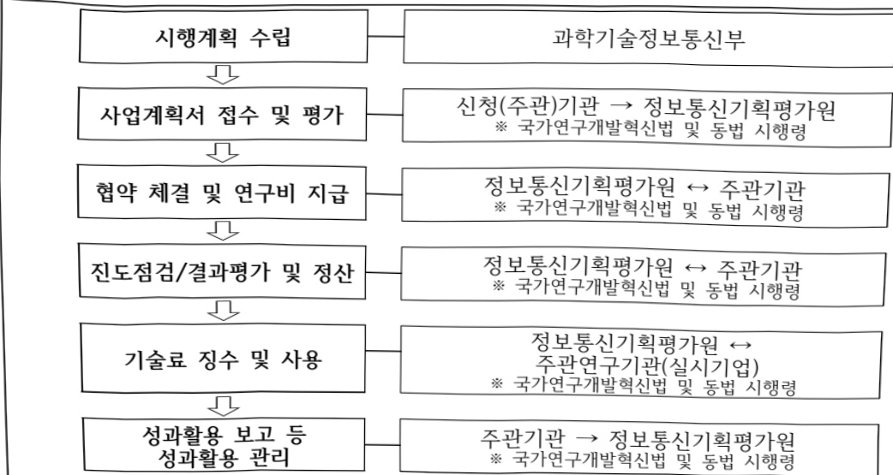

# AI-RAN 글로벌 선도 프로젝트(R&D)

**해당 페이지**: PDF 347 ~ 352 쪽 해당

**부처**: 과학기술정보통신부
**분야**: 통신
**회계유형**: 일반회계
**2026 확정예산**: 9000.0 백만원
**전년대비 증감률**: None%
**AI 도메인**: 교육/인재, 통신/네트워크

---

### 가. 예산 총괄표

(단위: 백만원, %)

<table border=1 style='margin: auto; word-wrap: break-word;'><tr><td rowspan="2">사업명</td><td rowspan="2">2024년 결산</td><td colspan="2">2025년 예산</td><td colspan="2">2026년 예산</td><td rowspan="2" colspan="2">증감(B-A)</td></tr><tr><td style='text-align: center; word-wrap: break-word;'>본예산</td><td style='text-align: center; word-wrap: break-word;'>추경*(A)</td><td style='text-align: center; word-wrap: break-word;'>요구안</td><td colspan="3">본예산(B)</td></tr><tr><td style='text-align: center; word-wrap: break-word;'>AI-RAN 글로벌 선도 프로젝트(R&amp;D)</td><td style='text-align: center; word-wrap: break-word;'>-</td><td style='text-align: center; word-wrap: break-word;'>-</td><td style='text-align: center; word-wrap: break-word;'>-</td><td style='text-align: center; word-wrap: break-word;'>9,000</td><td style='text-align: center; word-wrap: break-word;'>9,000</td><td style='text-align: center; word-wrap: break-word;'>9,000</td><td style='text-align: center; word-wrap: break-word;'>순증</td></tr></table>

□ 기능별(내역사업별) 예산 내역

(단위:백만원)

<table border=1 style='margin: auto; word-wrap: break-word;'><tr><td rowspan="2"></td><td colspan="5">2024</td><td colspan="5">2025</td><td rowspan="2">2026 예산</td></tr><tr><td style='text-align: center; word-wrap: break-word;'>예산액 (추경)</td><td style='text-align: center; word-wrap: break-word;'>예산 현액</td><td style='text-align: center; word-wrap: break-word;'>집행액</td><td style='text-align: center; word-wrap: break-word;'>이월액</td><td style='text-align: center; word-wrap: break-word;'>불용액</td><td style='text-align: center; word-wrap: break-word;'>예산액 (추경)</td><td style='text-align: center; word-wrap: break-word;'>예산 현액</td><td style='text-align: center; word-wrap: break-word;'>집행액</td><td style='text-align: center; word-wrap: break-word;'>이월액</td><td style='text-align: center; word-wrap: break-word;'>불용액</td></tr><tr><td style='text-align: center; word-wrap: break-word;'>○ 기능별 분류(합계)</td><td style='text-align: center; word-wrap: break-word;'>-</td><td style='text-align: center; word-wrap: break-word;'>-</td><td style='text-align: center; word-wrap: break-word;'>-</td><td style='text-align: center; word-wrap: break-word;'>-</td><td style='text-align: center; word-wrap: break-word;'>-</td><td style='text-align: center; word-wrap: break-word;'>-</td><td style='text-align: center; word-wrap: break-word;'>-</td><td style='text-align: center; word-wrap: break-word;'>-</td><td style='text-align: center; word-wrap: break-word;'>-</td><td style='text-align: center; word-wrap: break-word;'>-</td><td style='text-align: center; word-wrap: break-word;'>9,000</td></tr><tr><td style='text-align: center; word-wrap: break-word;'>• AI-RAN 글로벌 선도 프로젝트 (R&amp;D)</td><td style='text-align: center; word-wrap: break-word;'>-</td><td style='text-align: center; word-wrap: break-word;'>-</td><td style='text-align: center; word-wrap: break-word;'>-</td><td style='text-align: center; word-wrap: break-word;'>-</td><td style='text-align: center; word-wrap: break-word;'>-</td><td style='text-align: center; word-wrap: break-word;'>-</td><td style='text-align: center; word-wrap: break-word;'>-</td><td style='text-align: center; word-wrap: break-word;'>-</td><td style='text-align: center; word-wrap: break-word;'>-</td><td style='text-align: center; word-wrap: break-word;'>-</td><td style='text-align: center; word-wrap: break-word;'>9,000</td></tr></table>

### 나. 사업설명자료

## 1 ) 사업목적·내용

0 글로벌 AI-RAN 시장 주도권 선점을 위해 한-미 협력 기반, 6G 상용화 이전까지 AI-RAN 연구 플랫폼을 통해 오픈랜 장비에 AI 기능을 탑재하여 AI-RAN 기술 경쟁력을 확보

- (AI-RAN 글로벌 선도 프로젝트) AI-RAN 기술 개발을 위해 학습에 필요한 네트워크 환경 데이터를 확보하고 AI 학습·추론을 적용하여 기지국 최적화·고도화를 선제적으로 연구 가능한 플랫폼* 구축

* AI-RAN 연구 플랫폼: AI-RAN 가상 네트워크 연구 플랫폼 + 실증망 통합 시스템

---

## 2 ) 사업개요

사업근거 및 추진경위

① 법령상 근거 및 조항 적시

- 과학기술기본법 제11조(국가연구개발사업의 추진)

제11조(국가연구개발사업의 추진)

① 중앙행정기관의 장은 기본계획에 따라 맡은 분야의 국가연구개발사업과 그 시책을 세워 추진하여야 한다.

## - 정보통신 진흥 및 융합 활성화 등에 관한 특별법 제14조, 제31조, 제32조, 제39조

제14조(정보통신 네트워크의 고도화)

① 과학기술정보통신부장관은 정보통신 진흥 및 유합 활성화를 위하여 정보통신 네트워크의 고도화를 지속적으로 추진하여야 한다.

제31조(국제협력 및 글로벌협의체 운영 등)

① 과학기술정보통신부장관은 정보통신 진흥 및 유합 활성화를 위하여 필요한 관련 국제 동향을 파악하고 국제협력을 추진하여야 한다.

② 과학기술정보통신부장관은 제1항에 따른 국제협력을 추진하기 위하여 다음 각 호의 업무를 할 수 있다.

3. 정보통신융합등 관련 국제표준화와 국제공동연구·개발사업 등의 지원

제32조(정보통신융합등 기술·서비스 개발 등의 지원)

① 과학기술정보통신부장관은 다른 산업 및 서비스 등에 정보통신의 접목을 통하여 생산성과 가치를 높일 수 있도록 노력하여야 한다.

② 과학기술정보통신부장관은 정보통신 융합 등 기술·서비스의 개발을 촉진하기 위하여 다음 각 호의 사업을 추진할 수 있다.

1. 정보통신융합등 기술·서비스 관련 연구개발 사업

제39조(재원마련)

과학기술정보통신부장관은 정보통신 진흥 및 융합 활성화를 위하여 「방송통신발전 기본법」

제24조에 따른 방송통신발전기금 및 「정보통신산업 진흥법」 제41조에 따른 정보통신진흥 기금을 사용할 수 있다.

- 국정과제(20번) 관련

## [국정과제 20] AI 3대 강국 도약을 위한『AI고속도로』 구축

° 6G, 위성통신 등 AI 핵심 통신 네트워크 상용화

② 추진경위

°(22.5) 정부 110대 국정과제 발표(75.초격차 전략기술 육성으로 과학기술 G5 도약, 78. 세계 최고의 네트워크 구축 및 디지털 혁신 가속화)

°(22.12) 제5차 과학기술기본계획(23~27) (12대 국가전략기술 중 ‘차세대 통신’에 해당)

°(23.2) 비상경제장관회의「K-Network 2030」 전략 발표

°(24.2) 국가과학기술자문회의 산하 제5회 국가전략기술 특별위원회 '차세대통신 등 5개 분야 임무중심 전략로드맵' 의결

° (25.3) : 글로벌 R&D 플래그십 제2차 신규 프로젝트로 선정

°(25.5): [국정과제 경2-1] AI 3대 강국 도약을 위한『AI고속도로』 구축

° (25.12) 제2회 과학기술관계장관회의「Hyper AI네트워크 전략」발표

---

## 주요내용

① 사업규모

- 총사업비 : 해당 없음

- 사업기간 : '26년 ~ '30년 (총 5년)

- 최근 5년 간 투입된 사업비

<table border=1 style='margin: auto; word-wrap: break-word;'><tr><td style='text-align: center; word-wrap: break-word;'>$ \underline{\text{笹}} $</td><td style='text-align: center; word-wrap: break-word;'>2022</td><td style='text-align: center; word-wrap: break-word;'>2023</td><td style='text-align: center; word-wrap: break-word;'>2024</td><td style='text-align: center; word-wrap: break-word;'>2025</td><td style='text-align: center; word-wrap: break-word;'>2026</td></tr><tr><td style='text-align: center; word-wrap: break-word;'>$ \underline{\text{사업비}} $</td><td style='text-align: center; word-wrap: break-word;'>-</td><td style='text-align: center; word-wrap: break-word;'>-</td><td style='text-align: center; word-wrap: break-word;'>-</td><td style='text-align: center; word-wrap: break-word;'>-</td><td style='text-align: center; word-wrap: break-word;'>9,000</td></tr></table>

- 기타: 해당 없음

② 사업추진체계

- 사업시행방법 : 출연

- 사업시행주체 : 정보통신기획평가원

- 사업 수혜자 : 기업, 대학, 정부 출연연구기관·특정연구기관 등

- 보조, 융자, 출연, 출자 등의 경우 보조·융자 등 지원 비율 및 법적근거

<table border=1 style='margin: auto; word-wrap: break-word;'><tr><td style='text-align: center; word-wrap: break-word;'>내역사업명</td><td style='text-align: center; word-wrap: break-word;'>구분</td><td style='text-align: center; word-wrap: break-word;'>피보조·피출연 등 기관명</td><td style='text-align: center; word-wrap: break-word;'>지원 금액 (2026예산)</td><td style='text-align: center; word-wrap: break-word;'>지원 비율(%)</td><td style='text-align: center; word-wrap: break-word;'>보조율 법적근거 (해당 조항)</td></tr><tr><td style='text-align: center; word-wrap: break-word;'>AI-RAN 글로벌 선도 프로젝트</td><td style='text-align: center; word-wrap: break-word;'>출연</td><td style='text-align: center; word-wrap: break-word;'>정보통신 기획 평가원</td><td style='text-align: center; word-wrap: break-word;'>9,000</td><td style='text-align: center; word-wrap: break-word;'>100%</td><td style='text-align: center; word-wrap: break-word;'>정보통신융합 및 활성화 등에 관한 특별법 제32조, 동법 시행령 제35조</td></tr></table>

## 3 ) 2026년도 예산 산출 근거

□ AI-RAN 글로벌 선도 프로젝트 : (2025 본예산) 0백만원 → (2026 요구) 9,000백만원, 신규

① AI-RAN 글로벌 선도 프로젝트 : (2025 본예산) 0백만원 → (2026 요구) 9,000백만원, 신규

① AI-RAN 글로벌 선도 프로젝트 : (2025 본예산) 0백만원

- (요구) (AI-RAN 연구 플랫폼) 단말·기지국에서 발생하는 대규모 데이터*를 확보, 이를 활용한 AI 모델 개발과 실제 환경에 적용·검증·고도화 할 수 있는 연구 환경 구축을 위한 9,000백만원 요구

* 무선환경, 이동성, 시스템동작, 트래픽, 각종 성능평가지표 등

- (산출) (신규) 9,000백만원 = 1개 과제 × 12,000백만원 × 9/12개월

ㅇ 2025년도 예산 및 2026년도 예산 산출 세부내역 비교

<table border=1 style='margin: auto; word-wrap: break-word;'><tr><td colspan="2">2025년 분예산</td><td colspan="2">2026년 예산</td></tr><tr><td style='text-align: center; word-wrap: break-word;'>예산</td><td style='text-align: center; word-wrap: break-word;'>산출내역</td><td style='text-align: center; word-wrap: break-word;'>예산</td><td style='text-align: center; word-wrap: break-word;'>산출내역</td></tr><tr><td style='text-align: center; word-wrap: break-word;'>-</td><td style='text-align: center; word-wrap: break-word;'>-</td><td style='text-align: center; word-wrap: break-word;'>9,000</td><td style='text-align: center; word-wrap: break-word;'>&lt; AI-RAN 글로벌 선도 프로젝트 &gt; 신규 - (신규) 9,000백만원 = 1개 과제 × 12,000백만원 × 9/12개월</td></tr></table>

## 4 ) 사업효과

---

## □ 사업영향, 산출물 성과지표 등

① 2022~2026년도 성과계획서 상 성과지표 및 최근 5년간 성과 달성도

<table border=1 style='margin: auto; word-wrap: break-word;'><tr><td style='text-align: center; word-wrap: break-word;'>성과지표</td><td style='text-align: center; word-wrap: break-word;'>구분</td><td style='text-align: center; word-wrap: break-word;'>2022</td><td style='text-align: center; word-wrap: break-word;'>2023</td><td style='text-align: center; word-wrap: break-word;'>2024</td><td style='text-align: center; word-wrap: break-word;'>2025</td><td style='text-align: center; word-wrap: break-word;'>2026</td><td style='text-align: center; word-wrap: break-word;'>2026목표치산출근거</td><td style='text-align: center; word-wrap: break-word;'>측정산시(또는 측정방법)</td><td style='text-align: center; word-wrap: break-word;'>자료수집방법(또는 자료출처)</td></tr><tr><td style='text-align: center; word-wrap: break-word;'>논문의표준화된순위보정영향력</td><td style='text-align: center; word-wrap: break-word;'>목표</td><td style='text-align: center; word-wrap: break-word;'>-</td><td style='text-align: center; word-wrap: break-word;'>-</td><td style='text-align: center; word-wrap: break-word;'>-</td><td style='text-align: center; word-wrap: break-word;'>신규</td><td style='text-align: center; word-wrap: break-word;'>67.27</td><td rowspan="2">&#x27;26년도 목표가신규지표임을 감안하여기존 ICTR&amp;D기술개발사업 최근3년간 실적치의 평균치67.27점을 목표치로설정함(이후, 연차별 1% 상향)</td><td rowspan="2">$  \Sigma  $논문(mrnIF*)÷논문건수*표준화된순위보정 영향력지수= $  \frac{(N \times \frac{mrnIF_j - 1)}{N - 1} \times 100}  $</td><td rowspan="2">NTIS,JCR</td></tr><tr><td style='text-align: center; word-wrap: break-word;'>지수(mrnIF)(단위: 점)</td><td style='text-align: center; word-wrap: break-word;'>달성도</td><td style='text-align: center; word-wrap: break-word;'>-</td><td style='text-align: center; word-wrap: break-word;'>-</td><td style='text-align: center; word-wrap: break-word;'>-</td><td style='text-align: center; word-wrap: break-word;'>-</td><td style='text-align: center; word-wrap: break-word;'>-</td></tr><tr><td rowspan="3">등록특허등급(SMART)지수(단위: 점)</td><td style='text-align: center; word-wrap: break-word;'>목표</td><td style='text-align: center; word-wrap: break-word;'>-</td><td style='text-align: center; word-wrap: break-word;'>-</td><td style='text-align: center; word-wrap: break-word;'>-</td><td style='text-align: center; word-wrap: break-word;'>신규</td><td style='text-align: center; word-wrap: break-word;'>4.22</td><td rowspan="3">&#x27;26년도 목표가신규지표임을 감안하여기존 ICTR&amp;D기술개발사업 최근3년간 실적치의 평균치4.22점을 목표치로설정함(이후, 연차별 1% 상향)</td><td rowspan="3">$  \Sigma  $(Ai x Bi) /  $  \Sigma  $Bi(Ai : 특허등급별가중치,Bi : 등급별특허성과 건수)</td><td rowspan="3">NTIS,한국발명진흥회(SMART)</td></tr><tr><td style='text-align: center; word-wrap: break-word;'>실적</td><td style='text-align: center; word-wrap: break-word;'>-</td><td style='text-align: center; word-wrap: break-word;'>-</td><td style='text-align: center; word-wrap: break-word;'>-</td><td style='text-align: center; word-wrap: break-word;'>-</td><td style='text-align: center; word-wrap: break-word;'>-</td></tr><tr><td style='text-align: center; word-wrap: break-word;'>달성도</td><td style='text-align: center; word-wrap: break-word;'>-</td><td style='text-align: center; word-wrap: break-word;'>-</td><td style='text-align: center; word-wrap: break-word;'>-</td><td style='text-align: center; word-wrap: break-word;'>-</td><td style='text-align: center; word-wrap: break-word;'>-</td></tr><tr><td rowspan="3">정부출연금10억원당특허등록건수(단위: 건)</td><td style='text-align: center; word-wrap: break-word;'>목표</td><td style='text-align: center; word-wrap: break-word;'>-</td><td style='text-align: center; word-wrap: break-word;'>-</td><td style='text-align: center; word-wrap: break-word;'>-</td><td style='text-align: center; word-wrap: break-word;'>신규</td><td style='text-align: center; word-wrap: break-word;'>2.32</td><td rowspan="3">&#x27;26년도 목표가신규지표임을 감안하여기존 ICTR&amp;D기술개발사업 최근3년간 실적치의 평균치2.32점을 목표치로설정함(이후, 연차별 1% 상향치 설정)</td><td rowspan="3">10×특허등록(국내+국외)건수/당해사업비(억원)</td><td rowspan="3">NTIS,성과보고서</td></tr><tr><td style='text-align: center; word-wrap: break-word;'>실적</td><td style='text-align: center; word-wrap: break-word;'>-</td><td style='text-align: center; word-wrap: break-word;'>-</td><td style='text-align: center; word-wrap: break-word;'>-</td><td style='text-align: center; word-wrap: break-word;'>-</td><td style='text-align: center; word-wrap: break-word;'>-</td></tr><tr><td style='text-align: center; word-wrap: break-word;'>달성도</td><td style='text-align: center; word-wrap: break-word;'>-</td><td style='text-align: center; word-wrap: break-word;'>-</td><td style='text-align: center; word-wrap: break-word;'>-</td><td style='text-align: center; word-wrap: break-word;'>-</td><td style='text-align: center; word-wrap: break-word;'>-</td></tr></table>

② 성과지표 이외의 연도별 사업추진 경과 및 실적 : 해당 없음

③ 향후(2026년도 이후) 기대효과

o (경제/사회적 파급효과)

- 침체되었던 국내 네트워크 장비산업에 새로운 활력을 제공, 글로벌 시장 패러다임 변화에 대응과 함께 새로운 경제적 기회를 획득

- 한국형 '풀스택(full-stack) AI 네트워크' 산업 생태계를 조성하여, AI 중심 공급망 재편에 대응하고 네트워크 분야 강소기업 육성

-통신서비스와 AI 산업의 융합으로 새로운 부가가치를 창출하고, 이를 통해 AI 네트워크

투자가 활성화되는 선순환 구조 확립

°(직·간접적 고용, 일자리 창출, 인력양성 파급효과)

- AI-RAN 연구 플랫폼을 통해 연구 네트워크를 확장하고, 이동통신-AI·SW간 융합인재 양성을 통해 미래 네트워크 기술력 확보

## 5 ) 타당성조사 및 예비타당성조사 시행여부 및 결과 요지 : 해당 없음

---

6) 총사업비 대상사업 정보 : 해당 없음

7) 사업 집행절차

- AI-RAN 글로벌 선도 프로젝트

<table border=1 style='margin: auto; word-wrap: break-word;'><tr><td style='text-align: center; word-wrap: break-word;'>부처</td><td style='text-align: center; word-wrap: break-word;'></td><td style='text-align: center; word-wrap: break-word;'>피출연·피보조기관</td><td style='text-align: center; word-wrap: break-word;'></td><td style='text-align: center; word-wrap: break-word;'>간접보조사업자·사업수행자</td></tr><tr><td style='text-align: center; word-wrap: break-word;'>과학기술정보통신부(9,000백만원)</td><td style='text-align: center; word-wrap: break-word;'>↔(9,000백만원)</td><td style='text-align: center; word-wrap: break-word;'>정보통신기획평가원</td><td style='text-align: center; word-wrap: break-word;'>↔(9,000백만원)</td><td style='text-align: center; word-wrap: break-word;'>산·학·연·기타</td></tr></table>

8) 각종 평가 : 해당 없음

다. 최근 4년간 결산내역 : 해당 없음

---

<table border=1 style='margin: auto; word-wrap: break-word;'><tr><td style='text-align: center; word-wrap: break-word;'>사 업 명</td></tr><tr><td style='text-align: center; word-wrap: break-word;'>(30) AI-네이티브 첨단바이오 자율실험실(R&amp;D) (1138-486)</td></tr></table>

사업 코드 정보

<table border=1 style='margin: auto; word-wrap: break-word;'><tr><td style='text-align: center; word-wrap: break-word;'>구분</td><td style='text-align: center; word-wrap: break-word;'>회계</td><td style='text-align: center; word-wrap: break-word;'>소관</td><td style='text-align: center; word-wrap: break-word;'>실국(기관)</td><td style='text-align: center; word-wrap: break-word;'>계정</td><td style='text-align: center; word-wrap: break-word;'>분야</td><td style='text-align: center; word-wrap: break-word;'>부문</td></tr><tr><td style='text-align: center; word-wrap: break-word;'>코드</td><td rowspan="2">일반회계</td><td rowspan="2">과학기술정보통신부</td><td rowspan="2">연구개발정책실미래전략기술정책관</td><td rowspan="2">-</td><td style='text-align: center; word-wrap: break-word;'>150</td><td style='text-align: center; word-wrap: break-word;'>155</td></tr><tr><td style='text-align: center; word-wrap: break-word;'>명칭</td><td style='text-align: center; word-wrap: break-word;'>과학기술</td><td style='text-align: center; word-wrap: break-word;'>과학기술연구개발</td></tr></table>

<table border=1 style='margin: auto; word-wrap: break-word;'><tr><td style='text-align: center; word-wrap: break-word;'>구분</td><td style='text-align: center; word-wrap: break-word;'>프로그램</td><td style='text-align: center; word-wrap: break-word;'>단위사업</td><td style='text-align: center; word-wrap: break-word;'>세부사업</td></tr><tr><td style='text-align: center; word-wrap: break-word;'>코드</td><td style='text-align: center; word-wrap: break-word;'>1100</td><td style='text-align: center; word-wrap: break-word;'>1138</td><td style='text-align: center; word-wrap: break-word;'>486</td></tr><tr><td style='text-align: center; word-wrap: break-word;'>명칭</td><td style='text-align: center; word-wrap: break-word;'>미래유망원천기술개발</td><td style='text-align: center; word-wrap: break-word;'>바이오·의료기술개발</td><td style='text-align: center; word-wrap: break-word;'>AI-네이티브 첨단바이오 자율실험실(R&amp;D)</td></tr></table>

☐ 사업 성격

<table border=1 style='margin: auto; word-wrap: break-word;'><tr><td rowspan="2">신규</td><td rowspan="2">계속</td><td rowspan="2">완료</td><td style='text-align: center; word-wrap: break-word;'>예비타당성</td><td style='text-align: center; word-wrap: break-word;'>총사업비</td><td style='text-align: center; word-wrap: break-word;'>총액계상</td><td style='text-align: center; word-wrap: break-word;'>사업소관 변경정보</td></tr><tr><td style='text-align: center; word-wrap: break-word;'>실시여부</td><td style='text-align: center; word-wrap: break-word;'>관리대상</td><td style='text-align: center; word-wrap: break-word;'>예산사업</td><td style='text-align: center; word-wrap: break-word;'>2025예산 시 소관</td></tr><tr><td style='text-align: center; word-wrap: break-word;'>O</td><td style='text-align: center; word-wrap: break-word;'></td><td style='text-align: center; word-wrap: break-word;'></td><td style='text-align: center; word-wrap: break-word;'></td><td style='text-align: center; word-wrap: break-word;'></td><td style='text-align: center; word-wrap: break-word;'></td><td style='text-align: center; word-wrap: break-word;'></td></tr></table>

□ 사업 지원 형태 및 지원율

<table border=1 style='margin: auto; word-wrap: break-word;'><tr><td style='text-align: center; word-wrap: break-word;'>직접</td><td style='text-align: center; word-wrap: break-word;'>출자</td><td style='text-align: center; word-wrap: break-word;'>출연</td><td style='text-align: center; word-wrap: break-word;'>보조</td><td style='text-align: center; word-wrap: break-word;'>융자</td><td style='text-align: center; word-wrap: break-word;'>국고보조율(%)</td><td style='text-align: center; word-wrap: break-word;'>융자율(%)</td></tr><tr><td style='text-align: center; word-wrap: break-word;'></td><td style='text-align: center; word-wrap: break-word;'></td><td style='text-align: center; word-wrap: break-word;'>O</td><td style='text-align: center; word-wrap: break-word;'></td><td style='text-align: center; word-wrap: break-word;'></td><td style='text-align: center; word-wrap: break-word;'></td><td style='text-align: center; word-wrap: break-word;'></td></tr></table>

□ 사업 소관부처 및 시행주체

<table border=1 style='margin: auto; word-wrap: break-word;'><tr><td style='text-align: center; word-wrap: break-word;'>사업명</td><td colspan="2">구분</td></tr><tr><td rowspan="3">예) A 내역사업</td><td rowspan="2">소관부처</td><td style='text-align: center; word-wrap: break-word;'>연구개발정책실 미래전략기술정책관</td></tr><tr><td style='text-align: center; word-wrap: break-word;'>첨단바이오기술과</td></tr><tr><td style='text-align: center; word-wrap: break-word;'>사업시행주체</td><td style='text-align: center; word-wrap: break-word;'>한국연구재단</td></tr></table>

---

### 원본 PDF 크롭 이미지

