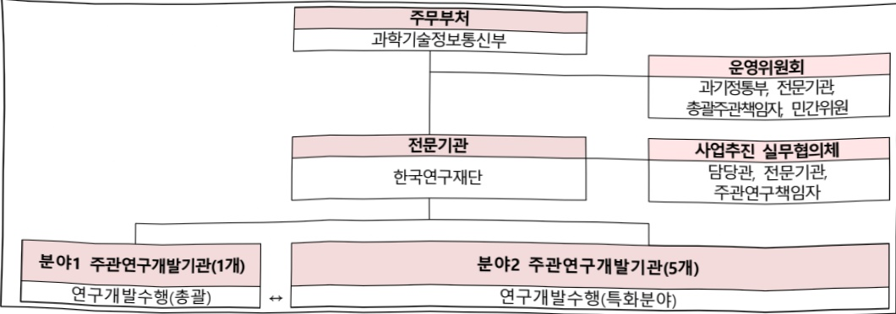

# AI-네이티브 첨단바이오 자율실험실(R&D)

**해당 페이지**: PDF 353 ~ 358 쪽 해당

**부처**: 과학기술정보통신부
**분야**: 과학기술
**회계유형**: 일반회계
**2026 확정예산**: 13500.0 백만원
**전년대비 증감률**: None%
**AI 도메인**: 로봇, 디지털전환(AX)

---

<table border=1 style='margin: auto; word-wrap: break-word;'><tr><td style='text-align: center; word-wrap: break-word;'>사 업 명</td></tr><tr><td style='text-align: center; word-wrap: break-word;'>(30) AI-네이티브 첨단바이오 자율실험실(R&amp;D) (1138-486)</td></tr></table>

사업 코드 정보

<table border=1 style='margin: auto; word-wrap: break-word;'><tr><td style='text-align: center; word-wrap: break-word;'>구분</td><td style='text-align: center; word-wrap: break-word;'>회계</td><td style='text-align: center; word-wrap: break-word;'>소관</td><td style='text-align: center; word-wrap: break-word;'>실국(기관)</td><td style='text-align: center; word-wrap: break-word;'>계정</td><td style='text-align: center; word-wrap: break-word;'>분야</td><td style='text-align: center; word-wrap: break-word;'>부문</td></tr><tr><td style='text-align: center; word-wrap: break-word;'>코드</td><td rowspan="2">일반회계</td><td rowspan="2">과학기술정보통신부</td><td rowspan="2">연구개발정책실미래전략기술정책관</td><td rowspan="2">-</td><td style='text-align: center; word-wrap: break-word;'>150</td><td style='text-align: center; word-wrap: break-word;'>155</td></tr><tr><td style='text-align: center; word-wrap: break-word;'>명칭</td><td style='text-align: center; word-wrap: break-word;'>과학기술</td><td style='text-align: center; word-wrap: break-word;'>과학기술연구개발</td></tr></table>

<table border=1 style='margin: auto; word-wrap: break-word;'><tr><td style='text-align: center; word-wrap: break-word;'>구분</td><td style='text-align: center; word-wrap: break-word;'>프로그램</td><td style='text-align: center; word-wrap: break-word;'>단위사업</td><td style='text-align: center; word-wrap: break-word;'>세부사업</td></tr><tr><td style='text-align: center; word-wrap: break-word;'>코드</td><td style='text-align: center; word-wrap: break-word;'>1100</td><td style='text-align: center; word-wrap: break-word;'>1138</td><td style='text-align: center; word-wrap: break-word;'>486</td></tr><tr><td style='text-align: center; word-wrap: break-word;'>명칭</td><td style='text-align: center; word-wrap: break-word;'>미래유망원천기술개발</td><td style='text-align: center; word-wrap: break-word;'>바이오·의료기술개발</td><td style='text-align: center; word-wrap: break-word;'>AI-네이티브 첨단바이오 자율실험실(R&amp;D)</td></tr></table>

☐ 사업 성격

<table border=1 style='margin: auto; word-wrap: break-word;'><tr><td rowspan="2">신규</td><td rowspan="2">계속</td><td rowspan="2">완료</td><td style='text-align: center; word-wrap: break-word;'>예비타당성</td><td style='text-align: center; word-wrap: break-word;'>총사업비</td><td style='text-align: center; word-wrap: break-word;'>총액계상</td><td style='text-align: center; word-wrap: break-word;'>사업소관 변경정보</td></tr><tr><td style='text-align: center; word-wrap: break-word;'>실시여부</td><td style='text-align: center; word-wrap: break-word;'>관리대상</td><td style='text-align: center; word-wrap: break-word;'>예산사업</td><td style='text-align: center; word-wrap: break-word;'>2025예산 시 소관</td></tr><tr><td style='text-align: center; word-wrap: break-word;'>O</td><td style='text-align: center; word-wrap: break-word;'></td><td style='text-align: center; word-wrap: break-word;'></td><td style='text-align: center; word-wrap: break-word;'></td><td style='text-align: center; word-wrap: break-word;'></td><td style='text-align: center; word-wrap: break-word;'></td><td style='text-align: center; word-wrap: break-word;'></td></tr></table>

□ 사업 지원 형태 및 지원율

<table border=1 style='margin: auto; word-wrap: break-word;'><tr><td style='text-align: center; word-wrap: break-word;'>직접</td><td style='text-align: center; word-wrap: break-word;'>출자</td><td style='text-align: center; word-wrap: break-word;'>출연</td><td style='text-align: center; word-wrap: break-word;'>보조</td><td style='text-align: center; word-wrap: break-word;'>융자</td><td style='text-align: center; word-wrap: break-word;'>국고보조율(%)</td><td style='text-align: center; word-wrap: break-word;'>융자율(%)</td></tr><tr><td style='text-align: center; word-wrap: break-word;'></td><td style='text-align: center; word-wrap: break-word;'></td><td style='text-align: center; word-wrap: break-word;'>O</td><td style='text-align: center; word-wrap: break-word;'></td><td style='text-align: center; word-wrap: break-word;'></td><td style='text-align: center; word-wrap: break-word;'></td><td style='text-align: center; word-wrap: break-word;'></td></tr></table>

□ 사업 소관부처 및 시행주체

<table border=1 style='margin: auto; word-wrap: break-word;'><tr><td style='text-align: center; word-wrap: break-word;'>사업명</td><td colspan="2">구분</td></tr><tr><td rowspan="3">예) A 내역사업</td><td rowspan="2">소관부처</td><td style='text-align: center; word-wrap: break-word;'>연구개발정책실 미래전략기술정책관</td></tr><tr><td style='text-align: center; word-wrap: break-word;'>첨단바이오기술과</td></tr><tr><td style='text-align: center; word-wrap: break-word;'>사업시행주체</td><td style='text-align: center; word-wrap: break-word;'>한국연구재단</td></tr></table>

---

### 가. 예산 총괄표

(단위: 백만원, %)

<table border=1 style='margin: auto; word-wrap: break-word;'><tr><td rowspan="2">사업명</td><td rowspan="2">2024년 결산</td><td colspan="2">2025년 예산</td><td colspan="2">2026년 예산</td><td rowspan="2">증감(B-A)</td><td rowspan="2">(B-A)/A</td></tr><tr><td style='text-align: center; word-wrap: break-word;'>본예산</td><td style='text-align: center; word-wrap: break-word;'>추경(A)</td><td style='text-align: center; word-wrap: break-word;'>요구안</td><td style='text-align: center; word-wrap: break-word;'>본예산(B)</td></tr><tr><td style='text-align: center; word-wrap: break-word;'>AI-네이티브첨단바이오자율실험실(R&amp;D)</td><td style='text-align: center; word-wrap: break-word;'>-</td><td style='text-align: center; word-wrap: break-word;'>-</td><td style='text-align: center; word-wrap: break-word;'>-</td><td style='text-align: center; word-wrap: break-word;'>13,500</td><td style='text-align: center; word-wrap: break-word;'>13,500</td><td style='text-align: center; word-wrap: break-word;'>13,500</td><td style='text-align: center; word-wrap: break-word;'>순증</td></tr></table>

□ 기능별(내역사업별) 예산 내역

(단위:백만원)

<table border=1 style='margin: auto; word-wrap: break-word;'><tr><td rowspan="2"></td><td colspan="5">2024</td><td colspan="5">2025</td><td rowspan="2">2026 倉塗</td></tr><tr><td style='text-align: center; word-wrap: break-word;'>倉塗廃 (専倉)</td><td style='text-align: center; word-wrap: break-word;'>倉塗廃</td><td style='text-align: center; word-wrap: break-word;'>倉塗廃</td><td style='text-align: center; word-wrap: break-word;'>倉塗廃</td><td style='text-align: center; word-wrap: break-word;'>倉塗廃</td><td style='text-align: center; word-wrap: break-word;'>倉塗廃 (専倉)</td><td style='text-align: center; word-wrap: break-word;'>倉塗廃</td><td style='text-align: center; word-wrap: break-word;'>倉塗廃</td><td style='text-align: center; word-wrap: break-word;'>倉塗廃</td><td style='text-align: center; word-wrap: break-word;'>倉塗廃</td></tr><tr><td style='text-align: center; word-wrap: break-word;'>○ 기능별 분류(합계)</td><td style='text-align: center; word-wrap: break-word;'>-</td><td style='text-align: center; word-wrap: break-word;'>-</td><td style='text-align: center; word-wrap: break-word;'>-</td><td style='text-align: center; word-wrap: break-word;'>-</td><td style='text-align: center; word-wrap: break-word;'>-</td><td style='text-align: center; word-wrap: break-word;'>-</td><td style='text-align: center; word-wrap: break-word;'>-</td><td style='text-align: center; word-wrap: break-word;'>-</td><td style='text-align: center; word-wrap: break-word;'>-</td><td style='text-align: center; word-wrap: break-word;'>-</td><td style='text-align: center; word-wrap: break-word;'>13,500</td></tr><tr><td style='text-align: center; word-wrap: break-word;'>• 첨단바이오 자율실 협실 구축 및 실증</td><td style='text-align: center; word-wrap: break-word;'>-</td><td style='text-align: center; word-wrap: break-word;'>-</td><td style='text-align: center; word-wrap: break-word;'>-</td><td style='text-align: center; word-wrap: break-word;'>-</td><td style='text-align: center; word-wrap: break-word;'>-</td><td style='text-align: center; word-wrap: break-word;'>-</td><td style='text-align: center; word-wrap: break-word;'>-</td><td style='text-align: center; word-wrap: break-word;'>-</td><td style='text-align: center; word-wrap: break-word;'>-</td><td style='text-align: center; word-wrap: break-word;'>-</td><td style='text-align: center; word-wrap: break-word;'>13,500</td></tr></table>

### 나. 사업설명자료

## 1 ) 사업목적·내용

- (AI-네이티브 첨단바이오 자율실험실) 기존 노동집약적으로 운영되는 첨단바이오 실험실의 AX(AI 전환)을 실현하기 위해, AI 및 로봇 기술을 실험·연구 프로세스에 적용 - (첨단바이오 자율실험실 구축 및 실증) 범용(1개. 총괄) 및 특화분야(5개)

① (분야1-총괄) 첨단바이오 범용 1개 자율실험실 구축 및 플랫폼 통합시스템화

② (분야2) 첨단바이오 특화분야별 5개 자율실험실 구축 및 플랫폼 통합시스템화

## 2 ) 사업개요

사업근거 및 추진경위

① 법령상 근거 및 조항 적시

- 과학기술기본법 제11조(국가연구개발사업의 추진)

0 제11조(국가연구개발사업의 추진) ① 중앙행정기관의 장은 기본계획에 따라 맡은 분야의 국가 연구개발사업과 그 시책을 세워 추진하여야 한다.

---

- 과학기술기본법 제17조(협동·융합연구개발의 추진)

☐ 제17조(협동·융합연구개발의 추진) ① 정부는 기업, 교육기관, 연구기관 및 과학기술 관련 기관·단체 간 또는 이들 상호간의 협동연구개발을 촉진하고 북돋우기 위한 시책을 세우고 추진하여야 한다.

② 정부는 민·군 간의 협동연구개발을 장려하고 민·군 기술협력을 촉진하기 위한 시책을 세우고 추진하여야 한다.

③ 과학기술정보통신부장관은 국가적으로 중요한 연구개발과제의 협동·융합연구개발을 위하여 필요하다고 인정하면 관련 기관의 장의 요청에 따라 협동·융합연구개발 관련 기관 간에 과학기술인이 서로 교류하는 것을 권고하거나 알선할 수 있다.

④ 정부는 신기술 상호간 또는 신기술과 학문·문화·예술 및 산업 간의 융합연구개발을 촉진하기 위한 시책을 세우고 추진하여야 한다.

-생명공학육성법 제11조(연구개발사업의 추진)

0 제11조(연구개발사업의 추진) ① 정부는 이 법의 목적을 효율적으로 달성하기 위하여 생명공학 연구 및 기술개발을 위한 연구개발사업을 실시하여야 한다.

-생명공학육성법 제12조(공동·육복합연구의 촉진 등)

제12조(공동·유복합연구의 촉진 등) ① 정부는 생명공학연구 및 기술개발의 효율적 육성을 위하여 학계·연구기관·의료기관 및 산업계 간의 공동·유복합연구를 촉진하여야 한다.

② 추진경위

0 추진경과

- 2024. 3-4월 첨단바이오 스마트랩 사전기획* *특정기술수요조사기반

- 2024. 8-10월 AI바이오 로드맵 전문가 기술수요조사 수요 반영 업데이트

- 2025. 2월 차세대바이오단 주도 기획 보고서 작업 착수

- 2025. 4월 기획보고서 수립 완료

0 국정과제

- (21번) 세계에서 AI를 가장 잘 쓰는 나라 구현

- (28번) 세계를 선도할 넥스트(NEXT) 전략기술 육성

□ 주요내용

① 사업규모

- 총사업비 : 495억원

- 사업기간 : 2026~2028

-최근 5년 간 투입된 사업비(예산액기준, 추경편성한 연도에는 추경포함)

<table border=1 style='margin: auto; word-wrap: break-word;'><tr><td style='text-align: center; word-wrap: break-word;'>$ \underline{\text{角}} $</td><td style='text-align: center; word-wrap: break-word;'>2022</td><td style='text-align: center; word-wrap: break-word;'>2023</td><td style='text-align: center; word-wrap: break-word;'>2024</td><td style='text-align: center; word-wrap: break-word;'>2025</td><td style='text-align: center; word-wrap: break-word;'>2026</td></tr><tr><td style='text-align: center; word-wrap: break-word;'>$ \underline{\text{사업}} $</td><td style='text-align: center; word-wrap: break-word;'>-</td><td style='text-align: center; word-wrap: break-word;'>-</td><td style='text-align: center; word-wrap: break-word;'>-</td><td style='text-align: center; word-wrap: break-word;'>-</td><td style='text-align: center; word-wrap: break-word;'>13,500</td></tr></table>

---

## ② 사업추진체계

- 사업시행방법 : 출연

- 사업시행주체 : 한국연구재단

- 사업 수혜자 : 바이오 실험실(대학 또는 연구소 또는 기업), 로봇·마이크로칩 기업(대학·연구소도 가능), AI·IT 기업 등 산학연 컨소시엄으로 구성

- 보조, 융자, 출연, 출자 등의 경우 보조·융자 등 지원 비율 및 법적근거

<table border=1 style='margin: auto; word-wrap: break-word;'><tr><td style='text-align: center; word-wrap: break-word;'>내역사업명</td><td style='text-align: center; word-wrap: break-word;'>구분</td><td style='text-align: center; word-wrap: break-word;'>피보조·피출연 등 기관명</td><td style='text-align: center; word-wrap: break-word;'>지원 금액 (2026예산)</td><td style='text-align: center; word-wrap: break-word;'>지원 비율(%)</td><td style='text-align: center; word-wrap: break-word;'>보조율 법적근거 (해당 조항)</td></tr><tr><td style='text-align: center; word-wrap: break-word;'>침단바이오 자율실험실 구축 및 실증</td><td style='text-align: center; word-wrap: break-word;'>출연</td><td style='text-align: center; word-wrap: break-word;'>한국연구 재단</td><td style='text-align: center; word-wrap: break-word;'>13,500</td><td style='text-align: center; word-wrap: break-word;'>100</td><td style='text-align: center; word-wrap: break-word;'>기초연구진흥 및 기술개발지원에 관한 법률 제14조</td></tr></table>

## 3 ) 2026년도 예산 산출 근거

① 첨단바이오 자율실험실 구축 및 실증

:(26)13,500백만원,순증

- (분야1-총괄) 첨단바이오 범용 1개 자율실험실 구축 및 플랫폼 통합시스템화

- (분야2) 첨단바이오 특화분야별 5개 자율실험실 구축 및 플랫폼 통합시스템화

- (산출) (신규) 6개×3,000백만원×9/12개월=13,500백만원

## 4 ) 사업효과

☐ 사업영향, 산출물 성과지표 등

① 2022~2026년도 성과계획서 상 성과지표 및 최근 5년간 성과 달성도

<table border=1 style='margin: auto; word-wrap: break-word;'><tr><td style='text-align: center; word-wrap: break-word;'>성과지표</td><td style='text-align: center; word-wrap: break-word;'>구분</td><td style='text-align: center; word-wrap: break-word;'>2022</td><td style='text-align: center; word-wrap: break-word;'>2023</td><td style='text-align: center; word-wrap: break-word;'>2024</td><td style='text-align: center; word-wrap: break-word;'>2025</td><td style='text-align: center; word-wrap: break-word;'>2026</td><td style='text-align: center; word-wrap: break-word;'>2026 목표치산출근거</td><td style='text-align: center; word-wrap: break-word;'>측정산식(또는 측정방법)</td><td style='text-align: center; word-wrap: break-word;'>자료수집방법(또는 자료출처)</td></tr><tr><td rowspan="3">원천기술 특허출원 및 등록수</td><td style='text-align: center; word-wrap: break-word;'>목표</td><td style='text-align: center; word-wrap: break-word;'>-</td><td style='text-align: center; word-wrap: break-word;'>-</td><td style='text-align: center; word-wrap: break-word;'>-</td><td style='text-align: center; word-wrap: break-word;'></td><td style='text-align: center; word-wrap: break-word;'>신규</td><td rowspan="3">-현재 기술 수준(추후 성과목표지표신규수립 예정)</td><td rowspan="3">SMART5 혹은 K-PEG 기준분석</td><td rowspan="3">특허 분석</td></tr><tr><td style='text-align: center; word-wrap: break-word;'>실적</td><td style='text-align: center; word-wrap: break-word;'>-</td><td style='text-align: center; word-wrap: break-word;'>-</td><td style='text-align: center; word-wrap: break-word;'>-</td><td style='text-align: center; word-wrap: break-word;'>-</td><td style='text-align: center; word-wrap: break-word;'>-</td></tr><tr><td style='text-align: center; word-wrap: break-word;'>달성도</td><td style='text-align: center; word-wrap: break-word;'>-</td><td style='text-align: center; word-wrap: break-word;'>-</td><td style='text-align: center; word-wrap: break-word;'>-</td><td style='text-align: center; word-wrap: break-word;'>-</td><td style='text-align: center; word-wrap: break-word;'>-</td></tr><tr><td rowspan="3">스마트 범용바이오 실험설계를 위한 AI 기술 개발</td><td style='text-align: center; word-wrap: break-word;'>목표</td><td style='text-align: center; word-wrap: break-word;'>-</td><td style='text-align: center; word-wrap: break-word;'>-</td><td style='text-align: center; word-wrap: break-word;'>-</td><td style='text-align: center; word-wrap: break-word;'>-</td><td style='text-align: center; word-wrap: break-word;'>신규</td><td rowspan="3">현재 기술 수준(추후 성과목표지표신규수립 예정)</td><td rowspan="3">AI agent 기반 구현(자율지표)</td><td rowspan="3">논문 및 관련분야 다수 전문가의 평가</td></tr><tr><td style='text-align: center; word-wrap: break-word;'>실적</td><td style='text-align: center; word-wrap: break-word;'>-</td><td style='text-align: center; word-wrap: break-word;'>-</td><td style='text-align: center; word-wrap: break-word;'>-</td><td style='text-align: center; word-wrap: break-word;'>-</td><td style='text-align: center; word-wrap: break-word;'>-</td></tr><tr><td style='text-align: center; word-wrap: break-word;'>달성도</td><td style='text-align: center; word-wrap: break-word;'>-</td><td style='text-align: center; word-wrap: break-word;'>-</td><td style='text-align: center; word-wrap: break-word;'>-</td><td style='text-align: center; word-wrap: break-word;'>-</td><td style='text-align: center; word-wrap: break-word;'>-</td></tr></table>

---

<table border=1 style='margin: auto; word-wrap: break-word;'><tr><td style='text-align: center; word-wrap: break-word;'>성과지표</td><td style='text-align: center; word-wrap: break-word;'>구분</td><td style='text-align: center; word-wrap: break-word;'>2022</td><td style='text-align: center; word-wrap: break-word;'>2023</td><td style='text-align: center; word-wrap: break-word;'>2024</td><td style='text-align: center; word-wrap: break-word;'>2025</td><td style='text-align: center; word-wrap: break-word;'>2026</td><td style='text-align: center; word-wrap: break-word;'>2026 목표치산출근거</td><td style='text-align: center; word-wrap: break-word;'>측정산식(또는 측정방법)</td><td style='text-align: center; word-wrap: break-word;'>자료수집방법(또는 자료출처)</td></tr><tr><td style='text-align: center; word-wrap: break-word;'>분야별자율실험실플랫폼(자동화/범용성)</td><td style='text-align: center; word-wrap: break-word;'>목표실적달성도</td><td style='text-align: center; word-wrap: break-word;'>-</td><td style='text-align: center; word-wrap: break-word;'>-</td><td style='text-align: center; word-wrap: break-word;'>-</td><td style='text-align: center; word-wrap: break-word;'></td><td style='text-align: center; word-wrap: break-word;'>신규</td><td style='text-align: center; word-wrap: break-word;'>-현재 기술 수준(자율실험실 자동화 A1-A5, 범용성 G1-G5 로드맵 달성도)</td><td style='text-align: center; word-wrap: break-word;'>논문 및관련분야 다수전문가의 평가</td><td style='text-align: center; word-wrap: break-word;'>논문 및관련분야 다수전문가의 평가</td></tr><tr><td style='text-align: center; word-wrap: break-word;'>분야별자율실험실효율성(범용구간 해소)</td><td style='text-align: center; word-wrap: break-word;'>목표실적달성도</td><td style='text-align: center; word-wrap: break-word;'>-</td><td style='text-align: center; word-wrap: break-word;'>-</td><td style='text-align: center; word-wrap: break-word;'>-</td><td style='text-align: center; word-wrap: break-word;'></td><td style='text-align: center; word-wrap: break-word;'>신규</td><td style='text-align: center; word-wrap: break-word;'>-현재 소요 시간(범용구간 시간h 단축율 %)</td><td style='text-align: center; word-wrap: break-word;'>분야별자율실험실 범용구간 소요시간 변화(△h=h-h&#x27;)보고서 평가</td><td style='text-align: center; word-wrap: break-word;'>분야별자율실험실 범용구간 소요시간 변화(△h=h-h&#x27;)보고서 평가</td></tr><tr><td style='text-align: center; word-wrap: break-word;'>SCI 논문의표준화된순위보정영향력지수(mrnIF) 평균</td><td style='text-align: center; word-wrap: break-word;'>목표실적달성도</td><td style='text-align: center; word-wrap: break-word;'>-</td><td style='text-align: center; word-wrap: break-word;'>-</td><td style='text-align: center; word-wrap: break-word;'>-</td><td style='text-align: center; word-wrap: break-word;'>신규</td><td style='text-align: center; word-wrap: break-word;'>-현재 원천기술 수준(추후 성과목표지표 신규수립 예정)</td><td style='text-align: center; word-wrap: break-word;'>∑(개별 SCI 논문계재저널 의 mrnIF) / 총 SCI 논문계재 건수</td><td style='text-align: center; word-wrap: break-word;'>발표 논문기준 계산</td><td style='text-align: center; word-wrap: break-word;'>발표 논문기준 계산</td></tr></table>

② 성과지표 이외의 연도별 사업추진 경과 및 실적 : 해당없음

③향후(2026년도 이후) 기대효과 :

- 핵심 반복수행 구간의 병목 프로세스 해결 및 연구 실험시간 단축 달성

- 첨단바이오 세부분야의 자율실험실 플랫폼 6개(통합플랫폼 포함) 이상 확보, 자율실험실 통합시스템 자동화 A1, G2(범용) 및 A2, G1(특화분야) 레벨 달성

- 침단바이오 실험의 병목 프로세스를 극복하고, 개별 연구실 수준에서 AI 전환(AX)을 실현하기 위한 AI·로보틱스 기반의 워크플로 등 자율실험실 워쳐기술 개발

## 5 ) 타당성조사 및 예비타당성조사 시행여부 및 결과 요지 : 해당없음

□ 시행하지 않은 경우 그 이유를 적시

6) 총사업비 대상사업 정보 : 해당없음

---

## 7 ) 사업 집행절차

8) 각종 평가 : 해당없음

다. 최근 4년간 결산내역 : 해당없음

---

### 원본 PDF 크롭 이미지

