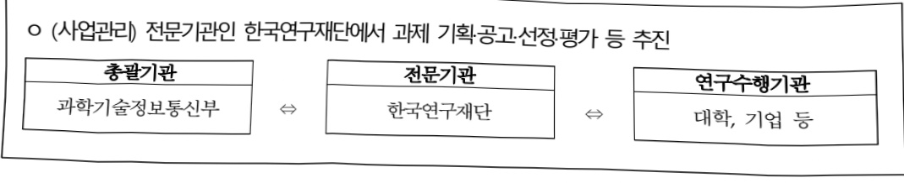

# AIxBio 혁신 연구거점 조성 시범사업(R&D)

**해당 페이지**: PDF 359 ~ 364 쪽 해당

**부처**: 과학기술정보통신부
**분야**: 과학기술
**회계유형**: 일반회계
**2026 확정예산**: 10200.0 백만원
**전년대비 증감률**: None%
**AI 도메인**: 의료/바이오

---

<table border=1 style='margin: auto; word-wrap: break-word;'><tr><td style='text-align: center; word-wrap: break-word;'>사 업 명</td></tr><tr><td style='text-align: center; word-wrap: break-word;'>(36) AIXBio 혁신 연구거점 조성 시범사업(R&amp;D) (1138-502)</td></tr></table>

□ 사업 코드 정보

<table border=1 style='margin: auto; word-wrap: break-word;'><tr><td style='text-align: center; word-wrap: break-word;'>구분</td><td style='text-align: center; word-wrap: break-word;'>회계</td><td style='text-align: center; word-wrap: break-word;'>소관</td><td style='text-align: center; word-wrap: break-word;'>실국(기관)</td><td style='text-align: center; word-wrap: break-word;'>계정</td><td style='text-align: center; word-wrap: break-word;'>분야</td><td style='text-align: center; word-wrap: break-word;'>부문</td></tr><tr><td style='text-align: center; word-wrap: break-word;'>코드</td><td rowspan="2">일반회계</td><td rowspan="2">과학기술정보통신부</td><td rowspan="2">연구개발정책실미래전략기술정책관</td><td rowspan="2"></td><td style='text-align: center; word-wrap: break-word;'>150</td><td style='text-align: center; word-wrap: break-word;'>155</td></tr><tr><td style='text-align: center; word-wrap: break-word;'>명칭</td><td style='text-align: center; word-wrap: break-word;'>과학기술</td><td style='text-align: center; word-wrap: break-word;'>과학기술연구개발</td></tr></table>

<table border=1 style='margin: auto; word-wrap: break-word;'><tr><td style='text-align: center; word-wrap: break-word;'>구분</td><td style='text-align: center; word-wrap: break-word;'>프로그램</td><td style='text-align: center; word-wrap: break-word;'>단위사업</td><td style='text-align: center; word-wrap: break-word;'>세부사업</td></tr><tr><td style='text-align: center; word-wrap: break-word;'>코드</td><td style='text-align: center; word-wrap: break-word;'>1100</td><td style='text-align: center; word-wrap: break-word;'>1138</td><td style='text-align: center; word-wrap: break-word;'>502</td></tr><tr><td style='text-align: center; word-wrap: break-word;'>명칭</td><td style='text-align: center; word-wrap: break-word;'>미래유망원천기술개발</td><td style='text-align: center; word-wrap: break-word;'>바이오·의료기술개발</td><td style='text-align: center; word-wrap: break-word;'>AIxBio 혁신 연구거점 조성 시범사업(R&amp;D)</td></tr></table>

☐ 사업 성격

<table border=1 style='margin: auto; word-wrap: break-word;'><tr><td rowspan="2">신규</td><td rowspan="2">계속</td><td rowspan="2">완료</td><td style='text-align: center; word-wrap: break-word;'>예비타당성</td><td style='text-align: center; word-wrap: break-word;'>총사업비</td><td style='text-align: center; word-wrap: break-word;'>총액계상</td><td style='text-align: center; word-wrap: break-word;'>사업소관 변경정보</td></tr><tr><td style='text-align: center; word-wrap: break-word;'>실시여부</td><td style='text-align: center; word-wrap: break-word;'>관리대상</td><td style='text-align: center; word-wrap: break-word;'>예산사업</td><td style='text-align: center; word-wrap: break-word;'>2025예산 시 소관</td></tr><tr><td style='text-align: center; word-wrap: break-word;'>O</td><td style='text-align: center; word-wrap: break-word;'></td><td style='text-align: center; word-wrap: break-word;'></td><td style='text-align: center; word-wrap: break-word;'></td><td style='text-align: center; word-wrap: break-word;'></td><td style='text-align: center; word-wrap: break-word;'></td><td style='text-align: center; word-wrap: break-word;'></td></tr></table>

□ 사업 지원 형태 및 지원을

<table border=1 style='margin: auto; word-wrap: break-word;'><tr><td style='text-align: center; word-wrap: break-word;'>직접</td><td style='text-align: center; word-wrap: break-word;'>출자</td><td style='text-align: center; word-wrap: break-word;'>출연</td><td style='text-align: center; word-wrap: break-word;'>보조</td><td style='text-align: center; word-wrap: break-word;'>융자</td><td style='text-align: center; word-wrap: break-word;'>국고보조율(%)</td><td style='text-align: center; word-wrap: break-word;'>융자율(%)</td></tr><tr><td style='text-align: center; word-wrap: break-word;'></td><td style='text-align: center; word-wrap: break-word;'></td><td style='text-align: center; word-wrap: break-word;'>O</td><td style='text-align: center; word-wrap: break-word;'></td><td style='text-align: center; word-wrap: break-word;'></td><td style='text-align: center; word-wrap: break-word;'></td><td style='text-align: center; word-wrap: break-word;'></td></tr></table>

□사업 소관부처 및 시행주체

<table border=1 style='margin: auto; word-wrap: break-word;'><tr><td style='text-align: center; word-wrap: break-word;'>사업명</td><td colspan="2">구분</td></tr><tr><td rowspan="3">AIxBio 혁신연구거점 조성시범사업(R&amp;D)</td><td rowspan="2">소관부처</td><td style='text-align: center; word-wrap: break-word;'>연구개발정책실미래전략기술정책관</td></tr><tr><td style='text-align: center; word-wrap: break-word;'>첨단바이오기술과</td></tr><tr><td style='text-align: center; word-wrap: break-word;'>사업시행주체</td><td style='text-align: center; word-wrap: break-word;'>한국연구재단</td></tr></table>

---

### 가. 예산 총괄표

(단위: 백만원, %)

<table border=1 style='margin: auto; word-wrap: break-word;'><tr><td rowspan="2">사업명</td><td rowspan="2">2024년 결산</td><td colspan="2">2025년 예산</td><td colspan="2">2026년 예산</td><td rowspan="2">증감(B-A)</td><td rowspan="2">(B-A)/A</td></tr><tr><td style='text-align: center; word-wrap: break-word;'>본예산</td><td style='text-align: center; word-wrap: break-word;'>추경(A)</td><td style='text-align: center; word-wrap: break-word;'>요구안</td><td style='text-align: center; word-wrap: break-word;'>본예산(B)</td></tr><tr><td style='text-align: center; word-wrap: break-word;'>AIXBio 혁신연구거점 조성시범사업(R&amp;D)</td><td style='text-align: center; word-wrap: break-word;'>-</td><td style='text-align: center; word-wrap: break-word;'>-</td><td style='text-align: center; word-wrap: break-word;'>-</td><td style='text-align: center; word-wrap: break-word;'>10,200</td><td style='text-align: center; word-wrap: break-word;'>10,200</td><td style='text-align: center; word-wrap: break-word;'>10,200</td><td style='text-align: center; word-wrap: break-word;'>순증</td></tr></table>

□ 기능별(내역사업별) 예산 내역

(단위:백만원)

<table border=1 style='margin: auto; word-wrap: break-word;'><tr><td rowspan="2"></td><td colspan="5">2024</td><td colspan="5">2025</td><td rowspan="2">2026 예산</td></tr><tr><td style='text-align: center; word-wrap: break-word;'>예산액 (추정)</td><td style='text-align: center; word-wrap: break-word;'>예산 현액</td><td style='text-align: center; word-wrap: break-word;'>집행액</td><td style='text-align: center; word-wrap: break-word;'>이월액</td><td style='text-align: center; word-wrap: break-word;'>불용액</td><td style='text-align: center; word-wrap: break-word;'>예산액 (추정)</td><td style='text-align: center; word-wrap: break-word;'>예산 현액</td><td style='text-align: center; word-wrap: break-word;'>집행액</td><td style='text-align: center; word-wrap: break-word;'>이월액</td><td style='text-align: center; word-wrap: break-word;'>불용액</td></tr><tr><td style='text-align: center; word-wrap: break-word;'>○ 기능별 분류(합계)</td><td style='text-align: center; word-wrap: break-word;'>-</td><td style='text-align: center; word-wrap: break-word;'>-</td><td style='text-align: center; word-wrap: break-word;'>-</td><td style='text-align: center; word-wrap: break-word;'>-</td><td style='text-align: center; word-wrap: break-word;'>-</td><td style='text-align: center; word-wrap: break-word;'>-</td><td style='text-align: center; word-wrap: break-word;'>-</td><td style='text-align: center; word-wrap: break-word;'>-</td><td style='text-align: center; word-wrap: break-word;'>-</td><td style='text-align: center; word-wrap: break-word;'>-</td><td style='text-align: center; word-wrap: break-word;'>10,200</td></tr><tr><td style='text-align: center; word-wrap: break-word;'>• AI 바이오 혁신 연구거점 구축</td><td style='text-align: center; word-wrap: break-word;'>-</td><td style='text-align: center; word-wrap: break-word;'>-</td><td style='text-align: center; word-wrap: break-word;'>-</td><td style='text-align: center; word-wrap: break-word;'>-</td><td style='text-align: center; word-wrap: break-word;'>-</td><td style='text-align: center; word-wrap: break-word;'>-</td><td style='text-align: center; word-wrap: break-word;'>-</td><td style='text-align: center; word-wrap: break-word;'>-</td><td style='text-align: center; word-wrap: break-word;'>-</td><td style='text-align: center; word-wrap: break-word;'>-</td><td style='text-align: center; word-wrap: break-word;'>10,200</td></tr></table>

### 나.사업설명자료

## 1 ) 사업목적·내용

o (AIxBio 혁신 연구거점 조성 시범사업) AI 바이오 분야의 기술축적·인재양성·산업확산이 유기적으로 연결되는 선순환 생태계를 조성하기 위한 국가차원의 AI 바이오 혁신 거점 시범 조성

- (AI바이오 혁신 연구거점 구축) AI 바이오 분야의 기술 축적·인재양성·산업확산이 유기적으로 연결되는 선순환 생태계를 조성하기 위한 국가차원의 AI 바이오 혁신 거점 육성 지원

## 2 ) 사업개요

## □ 사업근거 및 추진경위

① 법령상 근거 및 조항 적시

- 「과학기술기본법」 제11조(국가연구개발사업의 추진)

<table border=1 style='margin: auto; word-wrap: break-word;'><tr><td style='text-align: center; word-wrap: break-word;'>○ 제11조(국가연구개발사업의 추진) ① 중앙행정기관의 장은 기본계획에 따라 맡은 분야의 국가 연구개발사업과 그 시책을 세워 추진하여야 한다.</td></tr></table>

---

-「생명공학육성법」 제11조(연구개발사업의 추진)

○ 제11조(연구개발사업의 추진) ① 정부는 이 법의 목적을 효율적으로 달성하기 위하여 생명공학 연구 및 기술개발을 위한 연구개발사업을 실시하여야 한다.

## ② 추진경위

0 글로벌 바이오경쟁의 핵심은 '데이터'와 '인공지능'으로 급속히 이동 중

AI는 유전체·단백체 등 복잡한 바이오데이터를 통합·분석하는 도구에서, 이제는 생명현상의 구조와 기능을 예측·설계·검증하는 주도적 역할까지 빠르게 진화

※ 알파폴드(딥마인드社)는 AI를 통한 단백질 3차원 구조를 정확히 예측하고,

BioNeMo(NVIDIA社)는 DNA 등 생체분자의 생성·해석을 위한 AI 플랫폼 서비스화

0 미국 등 주요국은 AI 바이오 융합연구를 거점화하여 지속가능한 연구 생태계 조성과 글로벌 확산전략을 추진 중

※ [미국] ① Arc Institute: 장기 자율 연구를 통한 암 등 복잡질환 탐구

② Chen Zukerberg Institute(CZI): 단일세포기반 AI 벼츄얼세포 개발

[영국] Rosalind Franklin Institute: AI·이미징 중심의 융합기술 개발 허브

0 국내에서도 일부 거점형 융합연구 모델*을 시도하고 있으나, 인프라·인재 확보,

데이터 접근성, 안정적 성과 창출 등에 한계가 존재하며, 단일 대학 중심의 운영

으로 산업 연계 및 기술 확산 기능 미흡

* (예) 서울대 바이오인공지능연구단 : 자연과학, 의학 등 다양한 연구진이 협력하고 자체 GPU 조성하고 대규모 데이터처리와 고성능 연산 지원

o 국정과제 21번, “세계에서 AI를 가장 잘 쓰는 나라 구현” 및 국정과제 28번,

“세계를 선도할 넥스트(NEXT) 전략기술 육성” 달성에 필수적

## 주요내용

① 사업규모

- 총사업비 : 494억원

- 사업기간 : 2026년~2030년

- 최근 5년 간 투입된 사업비(예산액기준, 추경편성한 연도에는 추경포함)

<table border=1 style='margin: auto; word-wrap: break-word;'><tr><td style='text-align: center; word-wrap: break-word;'>연도</td><td style='text-align: center; word-wrap: break-word;'>2022</td><td style='text-align: center; word-wrap: break-word;'>2023</td><td style='text-align: center; word-wrap: break-word;'>2024</td><td style='text-align: center; word-wrap: break-word;'>2025</td><td style='text-align: center; word-wrap: break-word;'>2026</td></tr><tr><td style='text-align: center; word-wrap: break-word;'>사업비</td><td style='text-align: center; word-wrap: break-word;'>-</td><td style='text-align: center; word-wrap: break-word;'>-</td><td style='text-align: center; word-wrap: break-word;'>-</td><td style='text-align: center; word-wrap: break-word;'>-</td><td style='text-align: center; word-wrap: break-word;'>10,200</td></tr></table>

---

## ② 사업추진체계

- 사업시행방법 : 출연

- 사업시행주체 : 한국연구재단

- 사업 수혜자 : 과제별 상이(대학, 국·공립연구소, 정부출연연 등)

- 보조, 융자, 출연, 출자 등의 경우 보조·융자 등 지원 비율 및 법적근거

<table border=1 style='margin: auto; word-wrap: break-word;'><tr><td style='text-align: center; word-wrap: break-word;'>내역사업명</td><td style='text-align: center; word-wrap: break-word;'>구분</td><td style='text-align: center; word-wrap: break-word;'>피보조·피출연 등 기관명</td><td style='text-align: center; word-wrap: break-word;'>지원 금액 (2026예산)</td><td style='text-align: center; word-wrap: break-word;'>지원 비율(%)</td><td style='text-align: center; word-wrap: break-word;'>보조율 법적근거 (해당 조항)</td></tr><tr><td style='text-align: center; word-wrap: break-word;'>AI바이오혁신 연구거점 구축</td><td style='text-align: center; word-wrap: break-word;'>출연</td><td style='text-align: center; word-wrap: break-word;'>한국연구재단</td><td style='text-align: center; word-wrap: break-word;'>10,200</td><td style='text-align: center; word-wrap: break-word;'>100</td><td style='text-align: center; word-wrap: break-word;'>기초연구진흥 및 기술개발지원에 관한 법률 제14조</td></tr></table>

## 3 ) 2026년도 예산 산출 근거

① AlxBio 혁신 연구거점 구축

:(26)10,200백만원

- AI 바이오 분야의 기술 축적·인재양성·산업확산이 유기적으로 연결되는 선순환 생태계를 조성하기 위한 국가차원의 AI·바이오 혁신 거점 육성 지원

- (산출) (신규, 혁신거점 1개소 구축 지원) 1개×13,200백만원×9/12개월 = 9,900백만원

(신규, ISP 수립) 1개×300백만원×12/12개월 = 300백만원

## 4 ) 사업효과

☐ 사업영향, 산출물 성과지표 등

① 2022~2026년도 성과계획서 상 성과지표 및 최근 5년간 성과 달성도

<table border=1 style='margin: auto; word-wrap: break-word;'><tr><td style='text-align: center; word-wrap: break-word;'>성과지표</td><td style='text-align: center; word-wrap: break-word;'>구분</td><td style='text-align: center; word-wrap: break-word;'>2022</td><td style='text-align: center; word-wrap: break-word;'>2023</td><td style='text-align: center; word-wrap: break-word;'>2024</td><td style='text-align: center; word-wrap: break-word;'>2025</td><td style='text-align: center; word-wrap: break-word;'>2026</td><td style='text-align: center; word-wrap: break-word;'>2026 목표치산출근거</td><td style='text-align: center; word-wrap: break-word;'>측정산식(또는 측정방법)</td><td style='text-align: center; word-wrap: break-word;'>자료수집방법(또는 자료출처)</td></tr><tr><td rowspan="3">SCI 논문의표준화된순위보정영향력지수(mrnIF)</td><td style='text-align: center; word-wrap: break-word;'>목표</td><td style='text-align: center; word-wrap: break-word;'>-</td><td style='text-align: center; word-wrap: break-word;'>-</td><td style='text-align: center; word-wrap: break-word;'>-</td><td style='text-align: center; word-wrap: break-word;'>-</td><td style='text-align: center; word-wrap: break-word;'>신규현재 기술 수준(추후 성과목표지표신규수립 예정)</td><td rowspan="3">∑(개별 SCI 논문)개 재 저 널 의 mrnIF) / 총 SCI 논문)계재 건수</td><td rowspan="3">IRIS성과관리시스템 및 NTIS 성과조사</td><td rowspan="3"></td></tr><tr><td style='text-align: center; word-wrap: break-word;'>실적</td><td style='text-align: center; word-wrap: break-word;'>-</td><td style='text-align: center; word-wrap: break-word;'>-</td><td style='text-align: center; word-wrap: break-word;'>-</td><td style='text-align: center; word-wrap: break-word;'>-</td><td style='text-align: center; word-wrap: break-word;'>-</td></tr><tr><td style='text-align: center; word-wrap: break-word;'>달성도</td><td style='text-align: center; word-wrap: break-word;'>-</td><td style='text-align: center; word-wrap: break-word;'>-</td><td style='text-align: center; word-wrap: break-word;'>-</td><td style='text-align: center; word-wrap: break-word;'>-</td><td style='text-align: center; word-wrap: break-word;'>-</td></tr><tr><td rowspan="3">글로벌 수준AI모델(건)</td><td style='text-align: center; word-wrap: break-word;'>목표</td><td style='text-align: center; word-wrap: break-word;'>-</td><td style='text-align: center; word-wrap: break-word;'>-</td><td style='text-align: center; word-wrap: break-word;'>-</td><td style='text-align: center; word-wrap: break-word;'>-</td><td style='text-align: center; word-wrap: break-word;'>신규현재 기술 수준(추후 성과목표지표신규수립 예정)</td><td rowspan="3">SCIE 분야별상위 10% 이내 또는 탑티어학술대회 발표 또는 피인용 100회 이상 AI 모델 수</td><td rowspan="3">IRIS성과관리시스템 및 NTIS 성과조사</td><td rowspan="3"></td></tr><tr><td style='text-align: center; word-wrap: break-word;'>실적</td><td style='text-align: center; word-wrap: break-word;'>-</td><td style='text-align: center; word-wrap: break-word;'>-</td><td style='text-align: center; word-wrap: break-word;'>-</td><td style='text-align: center; word-wrap: break-word;'>-</td><td style='text-align: center; word-wrap: break-word;'>-</td></tr><tr><td style='text-align: center; word-wrap: break-word;'>달성도</td><td style='text-align: center; word-wrap: break-word;'>-</td><td style='text-align: center; word-wrap: break-word;'>-</td><td style='text-align: center; word-wrap: break-word;'>-</td><td style='text-align: center; word-wrap: break-word;'>-</td><td style='text-align: center; word-wrap: break-word;'>-</td></tr></table>

---

<table border=1 style='margin: auto; word-wrap: break-word;'><tr><td style='text-align: center; word-wrap: break-word;'>성과지표</td><td style='text-align: center; word-wrap: break-word;'>구분</td><td style='text-align: center; word-wrap: break-word;'>2022</td><td style='text-align: center; word-wrap: break-word;'>2023</td><td style='text-align: center; word-wrap: break-word;'>2024</td><td style='text-align: center; word-wrap: break-word;'>2025</td><td style='text-align: center; word-wrap: break-word;'>2026</td><td style='text-align: center; word-wrap: break-word;'>2026 목표치산출근거</td><td style='text-align: center; word-wrap: break-word;'>측정산식(또는 측정방법)</td><td style='text-align: center; word-wrap: break-word;'>자료수집방법(또는 자료출처)</td></tr><tr><td rowspan="3">석박사급 융합인재 양성수(명)</td><td style='text-align: center; word-wrap: break-word;'>목표</td><td style='text-align: center; word-wrap: break-word;'>-</td><td style='text-align: center; word-wrap: break-word;'>-</td><td style='text-align: center; word-wrap: break-word;'>-</td><td style='text-align: center; word-wrap: break-word;'>-</td><td style='text-align: center; word-wrap: break-word;'>신규</td><td rowspan="3">현재 기술 수준(추후 성과목표지표신규수립 예정)</td><td rowspan="3">공동지도학위프로그램 참여 또는 융합 교육 프로그램 이수 연구자 수</td><td rowspan="3">IRIS 성과관리시스템 및 NTIS 성과조사</td></tr><tr><td style='text-align: center; word-wrap: break-word;'>실적</td><td style='text-align: center; word-wrap: break-word;'>-</td><td style='text-align: center; word-wrap: break-word;'>-</td><td style='text-align: center; word-wrap: break-word;'>-</td><td style='text-align: center; word-wrap: break-word;'>-</td><td style='text-align: center; word-wrap: break-word;'>-</td></tr><tr><td style='text-align: center; word-wrap: break-word;'>달성도</td><td style='text-align: center; word-wrap: break-word;'>-</td><td style='text-align: center; word-wrap: break-word;'>-</td><td style='text-align: center; word-wrap: break-word;'>-</td><td style='text-align: center; word-wrap: break-word;'>-</td><td style='text-align: center; word-wrap: break-word;'>-</td></tr><tr><td rowspan="3">H200급 GPU 인프라(개)</td><td style='text-align: center; word-wrap: break-word;'>목표</td><td style='text-align: center; word-wrap: break-word;'>-</td><td style='text-align: center; word-wrap: break-word;'>-</td><td style='text-align: center; word-wrap: break-word;'>-</td><td style='text-align: center; word-wrap: break-word;'>-</td><td style='text-align: center; word-wrap: break-word;'>신규</td><td rowspan="3">현재 기술 수준(추후 성과목표지표신규수립 예정)</td><td rowspan="3">H200급 GPU 이상 수준의 GPU 연산 능력 확보 및 활용가능한 관련 시스템 구축량</td><td rowspan="3">IRIS 성과관리시스템 및 NTIS 성과조사</td></tr><tr><td style='text-align: center; word-wrap: break-word;'>실적</td><td style='text-align: center; word-wrap: break-word;'>-</td><td style='text-align: center; word-wrap: break-word;'>-</td><td style='text-align: center; word-wrap: break-word;'>-</td><td style='text-align: center; word-wrap: break-word;'>-</td><td style='text-align: center; word-wrap: break-word;'>-</td></tr><tr><td style='text-align: center; word-wrap: break-word;'>달성도</td><td style='text-align: center; word-wrap: break-word;'>-</td><td style='text-align: center; word-wrap: break-word;'>-</td><td style='text-align: center; word-wrap: break-word;'>-</td><td style='text-align: center; word-wrap: break-word;'>-</td><td style='text-align: center; word-wrap: break-word;'>-</td></tr><tr><td rowspan="3">후보물질 도출(건)</td><td style='text-align: center; word-wrap: break-word;'>목표</td><td style='text-align: center; word-wrap: break-word;'>-</td><td style='text-align: center; word-wrap: break-word;'>-</td><td style='text-align: center; word-wrap: break-word;'>-</td><td style='text-align: center; word-wrap: break-word;'>-</td><td style='text-align: center; word-wrap: break-word;'>신규</td><td rowspan="3">현재 기술 수준(추후 성과목표지표신규수립 예정)</td><td rowspan="3">구축된 가상실험실 및 고속검증 인프라기반 합성신약 후보물질 도출 건수</td><td rowspan="3">IRIS 성과관리시스템 및 NTIS 성과조사</td></tr><tr><td style='text-align: center; word-wrap: break-word;'>실적</td><td style='text-align: center; word-wrap: break-word;'>-</td><td style='text-align: center; word-wrap: break-word;'>-</td><td style='text-align: center; word-wrap: break-word;'>-</td><td style='text-align: center; word-wrap: break-word;'>-</td><td style='text-align: center; word-wrap: break-word;'>-</td></tr><tr><td style='text-align: center; word-wrap: break-word;'>달성도</td><td style='text-align: center; word-wrap: break-word;'>-</td><td style='text-align: center; word-wrap: break-word;'>-</td><td style='text-align: center; word-wrap: break-word;'>-</td><td style='text-align: center; word-wrap: break-word;'>-</td><td style='text-align: center; word-wrap: break-word;'>-</td></tr></table>

② 성과지표 이외의 연도별 사업추진 경과 및 실적 : 해당없음

③ 향후(2026년도 이후) 기대효과 :

- 글로벌 수준*의 8개 AI모델 개발

* SCIE 논문 상위 10%이내 또는 Top tier 국제학술대회 발표 또는 피인용횟수 100회 이상

- 석박사급 융합인재 양성수: AI-바이오 석박사급 융합인재 누계 50명*이상 양성

*수요근거 대학/정출연/기업 향후 5년이내 박사급 인력(전임교원 연구교수, 박사후연구원 책임/선임연구원) 50명이상 필요, 정출연/바이오기업 석사급 실무 연구인력 150명이상 필요 (수요의 50% 양성)

- 거점(주관기관)의 GPU 컴퓨팅 인프라 구축 H200급 GPU: 대규모 AI바이오 모델 개발을 위한 GPU 컴퓨팅 인프라 (누계H200급 96개) 구축 및 AI 학습용, 검증용 데이터 누계 512Tb 구축

- 신약 선도물질 16건 및 후보물질 8건 도출

5) 타당성조사 및 예비타당성조사 시행여부 및 결과 요지 : 해당없음

6) 총사업비 대상사업 정보 : 해당없음

---

7) 사업 집행절차

(사업관리) 전문기관인 한국연구재단에서 과제 기획공고·선정·평가 등 추진

8) 각종 평가 : 해당없음

다. 최근 4년간 결산내역 : 해당없음

---

### 원본 PDF 크롭 이미지

