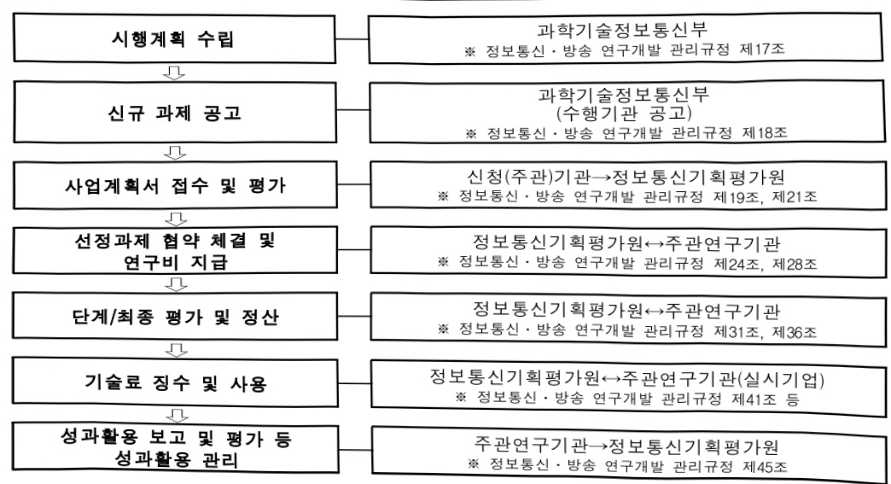

# AI·블록체인 융합 기반 자율형 고신뢰 핵심기술 개발(R…

**해당 페이지**: PDF 372 ~ 379 쪽 해당

**부처**: 과학기술정보통신부
**분야**: 통신
**회계유형**: 일반회계
**2026 확정예산**: 3246.0 백만원
**전년대비 증감률**: None%
**AI 도메인**: LLM/언어모델

---

### 가.예산안 총괄표

(단위: 백만원, %)

<table border=1 style='margin: auto; word-wrap: break-word;'><tr><td rowspan="2">사업명</td><td rowspan="2">2024년 결산</td><td colspan="2">2025년 예산</td><td colspan="2">2026년 예산</td><td rowspan="2">중감 (B-A)</td><td rowspan="2">(B-A)/A</td></tr><tr><td style='text-align: center; word-wrap: break-word;'>본예산</td><td style='text-align: center; word-wrap: break-word;'>추경(A)</td><td style='text-align: center; word-wrap: break-word;'>요구안</td><td style='text-align: center; word-wrap: break-word;'>본예산(B)</td></tr><tr><td style='text-align: center; word-wrap: break-word;'>AI·블록체인융합 기반자율형고신퇴 핵심기술개발(R&amp;D)</td><td style='text-align: center; word-wrap: break-word;'></td><td style='text-align: center; word-wrap: break-word;'>-</td><td style='text-align: center; word-wrap: break-word;'>-</td><td style='text-align: center; word-wrap: break-word;'>2,000</td><td style='text-align: center; word-wrap: break-word;'>3,246</td><td style='text-align: center; word-wrap: break-word;'>3,246</td><td style='text-align: center; word-wrap: break-word;'>순증</td></tr></table>

□ 기능별(내역사업별) 예산 내역

(단위:백만원)

<table border=1 style='margin: auto; word-wrap: break-word;'><tr><td rowspan="2"></td><td colspan="5">2024</td><td colspan="5">2025</td><td rowspan="2">2026 叁</td></tr><tr><td style='text-align: center; word-wrap: break-word;'>叁</td><td style='text-align: center; word-wrap: break-word;'>叁</td><td style='text-align: center; word-wrap: break-word;'>叁</td><td style='text-align: center; word-wrap: break-word;'>叁</td><td style='text-align: center; word-wrap: break-word;'>叁</td><td style='text-align: center; word-wrap: break-word;'>叁</td><td style='text-align: center; word-wrap: break-word;'>叁</td><td style='text-align: center; word-wrap: break-word;'>叁</td><td style='text-align: center; word-wrap: break-word;'>叁</td><td style='text-align: center; word-wrap: break-word;'>叁</td></tr><tr><td style='text-align: center; word-wrap: break-word;'>○ 기능별 분류(합계)</td><td style='text-align: center; word-wrap: break-word;'>-</td><td style='text-align: center; word-wrap: break-word;'>-</td><td style='text-align: center; word-wrap: break-word;'>-</td><td style='text-align: center; word-wrap: break-word;'>-</td><td style='text-align: center; word-wrap: break-word;'>-</td><td style='text-align: center; word-wrap: break-word;'>-</td><td style='text-align: center; word-wrap: break-word;'>-</td><td style='text-align: center; word-wrap: break-word;'>-</td><td style='text-align: center; word-wrap: break-word;'>-</td><td style='text-align: center; word-wrap: break-word;'>-</td><td style='text-align: center; word-wrap: break-word;'>3,246</td></tr><tr><td style='text-align: center; word-wrap: break-word;'>· AI· 블록체인 융합 기반 자율형 고신퇴 핵심기술 개발</td><td style='text-align: center; word-wrap: break-word;'>-</td><td style='text-align: center; word-wrap: break-word;'>-</td><td style='text-align: center; word-wrap: break-word;'>-</td><td style='text-align: center; word-wrap: break-word;'>-</td><td style='text-align: center; word-wrap: break-word;'>-</td><td style='text-align: center; word-wrap: break-word;'>-</td><td style='text-align: center; word-wrap: break-word;'>-</td><td style='text-align: center; word-wrap: break-word;'>-</td><td style='text-align: center; word-wrap: break-word;'>-</td><td style='text-align: center; word-wrap: break-word;'>-</td><td style='text-align: center; word-wrap: break-word;'>3,246</td></tr></table>

### 나. 사업설명자료

1) 사업목적·내용

o AI-블록체인 융합 기반 고신뢰 디지털 인프라를 구현하여 블록체인의 투명성과 검증 기능을 통해 보다 안전하고 자율적인 분산형 AI 생태계 구현

2) 사업개요

□ 사업근거 및 추진경위

① 법령상 근거 및 조항

- 정보통신산업진흥법 제7조(정보통신기술진흥 시행계획)

정보통신산업진흥법 제7조(정보통신기술진흥 시행계획) ① 과학기술정보통신부장관은 정보통신기술의 진흥을 위하여 진흥계획에 따라 다음 각 호의 사항이 포함된 정보통신기술진흥 시행계획을 매년 수립·시행하여야 한다.

3. 정보통신기술의 연구개발 및 다른 기술과의 결합 및 융합 촉진에 관한 사항

② 과학기술정보통신부장관은 제1항에 따른 사항을 효율적으로 추진하기 위하여 필요하면 대통령령으로 정하는 바에 따라 정보통신기술의 개발 및 정보통신산업의 진흥과 관련된 연구기관 및 단체로 하여금 이를 대행하게 할 수 있으며 이에 드는 비용을 지원할 수 있다.

---

- 정보통신 진흥 및 융합 활성화 등에 관한 특별법 제32조(정보통신융합등 기술·서비스 개발 등의 지원)

정보통신 진흥 및 융합 활성화 등에 관한 특별법 제32조(정보통신융합등 기술·서비스개발 등의 지원) ① 과학기술정보통신부장관은 다른 산업 및 서비스 등에 정보통신의 접목을 통하여 생산성과 가치를 높일 수 있도록 노력하여야 한다.

② 과학기술정보통신부장관은 정보통신융합등 기술·서비스의 개발을 촉진하기 위하여 다음 각 호의 사업을 추진할 수 있다.

1. 정보통신융합등 기술·서비스 관련 연구개발 사업

2. 제1호에 따라 추진되는 과제에 대한 기획·평가·관리

③ 과학기술정보통신부장관은 제2항 각 호의 사업을 추진하기 위하여 법인인 전담기관을 설립하거나 법인·단체에 위탁·운영할 수 있으며, 필요한 비용의 전부 또는 일부를 예산의 범위에서 출연 또는 보조할 수 있다.

- 과학기술기본법 제17조(협동·융합연구개발의 촉진) 및 제24조의6(과학기술을 활용한 사회문제의 해결)

과학기술기본법 제17조(협동·융합연구개발의 촉진) ①정부는 기업, 교육기관, 연구기관 및 과학기술 관련 기관·단체 간 또는 이들 상호간의 협동연구개발을 촉진하고 북돋우기 위한 시책을 세우고 추진하여야 한다.

과학기술기본법 제24조의6(과학기술을 활용한 사회문제의 해결)

① 과학기술정보통신부장관은 법 제16조의6제1항에 따라 과학기술을 활용한 사회문제를 해결하기 위하여 5년마다 관계 중앙행정기관의 관련 시책과 사업 등을 종합한 과학기술기반 사회문제해결종합계획(이하 “종합계획”이라 한다)을 세우고 국가과학기술자문회의의 심의를 거쳐 확정하여야 한다. <개정 2017. 7. 26., 2018. 4. 17.>

## ② 추진경위

- 「블록체인 산업 진흥전략」 수립 (관계부처 합동, '22.11월)

□ 신산업 발굴을 위한 블록체인 융합기술개발 추진(과기정통부)

○ (타산업과 융합) 블록체인의 한계를 극복하는 핵심 기술과 新산업 발굴을 위한

융합기술개발로 선도국과의 기술격차 해소

- (ICT융합) 블록체인 특징인 전력소모·통신지연 등의 약점을 보완하기 위한 타

ICT기술의 장점을 융합하여 고도화 추진

- (산업융합) 가상사회에서의 경제활동으로 가치창출하는 디지털 신뢰 확보 가능한

기술개발 추진

□ 웹3 시대 선도를 위한 블록체인 핵심 인프라 구축(관계부처)

○ 웹3 시대 블록체인 디지털 신뢰 생태계 조성을 위한 산업 생태계 기반 강화, 시장

활성화, 기술경쟁력 확보 등 추진

- 국민 체감형 대형 프로젝트 발굴과 법·제도 정비, 공공서비스 개발을 위한 표준·개

발 도구 마련, 산업고도화를 위한 핵심 기술개발과 검증 지원

-「디지털 권리장전」수립 (과기정통부 등 관계부처 합동, '23.9월)

---

□ (공정한 접근과 기회의 균등)

○ 데이터, 디지털 저작물 등의 디지털 자산이 정당한 법적 정책적 보호를 받는 ‘디지털 자산의 보호’, 디지털 격차 해소를 위한 ‘디지털 리터러시 향상’

※ 공정경쟁의 촉진, 디지털 자산의 보호, 디지털 리터러시 향상, 데이터 접근 보장, 사회 안전망 강화

□ (안전하고 신뢰할 수 있는 디지털 사회)

○ 디지털 공동번영사회의 전제가 되는 안전과 신뢰 확보를 위해 디지털 위험이 체계적 시스템을 통해 관리

※ 디지털 위험 대응, 디지털 프라이버시 보호, 건전한 디지털 환경 조성

□ (디지털 플랫폼 정부)

○ 국민 맞춤형 서비스 및 데이터 칸막이 해소, AI·데이터 육성, 개인정보 국민 권리 강화 등 비전 및 핵심추진과제 등

□ (디지털 권리장전)

○ 디지털 환경에서의 권리 보장, 공정한 접근과 기회의 균등, 안전과 신뢰를 확보할 수 있는 디지털 혁신 등

- 2025년도 국가연구개발 투자 방향 및 기준(안)(과기정통부, '24.3월)

□ (미디어·콘텐츠) 디지털 콘텐츠 활성화 및 국·내외 산업 확대를 위한 미디어·콘텐츠 분야 범용 기술 확보 및 핵심 기술 개발 지속 지원

○ AI, IoT, 블록체인 등 다양한 기술 융합을 통해 전주기적(기획·창작·제작·서비스·저작권·플랫폼) 지원 등 창작 활성화를 위한 지속 지원

* 생성형 AI 침해 판별 및 창작 지원 기술 개발, 미디어 워크플로우 개선 기술 등

□ (사이버보안) 디지털전환·AI확산 등 변화에 따른 사이버보안 중요성 증대에 맞추어 정보보호 원천기술 및 산업간 융합기술 등 투자 확대

○ 융합신기술사이버침해 사전 억지를 위한 능동 대응 기술 및 디지털전환 등에 따른 공급망 보안 대응을 위한 신산업·융합 보호기술 개발

□ (新기술 융합·활용 촉진) 기후위기, 인구구조변화 등 당면한 사회문제 해결과 국민 삶의 질 향상을 위해 디지털 신기술 융합·활용 추진

○ 사회·산업 전반의 디지털전환 견인을 위한 데이터·클라우드, 정보보호 등 지능화·융합 기반기술 확보를 통해 S W 산업생태계 강화

※ 소프트웨어 진흥전략('23.4), 데이터 경제 활성화 추진과제('23.11)

□ (사이버보안) 인공지능·클라우드 등 활용·확산에 따른 보안 분야 핵심기술 경쟁력 확보 및 주요 현안 공동 대응을 위해 국내외 R&D주체 간협력 강화

○ 인공지능 기반 보안기술 개발 네트워크·클라우드 등 ICT 핵심인프라 플랫폼 데이터 보호 강화

※ 사이버위험에 대해 AI기반 분석을 통한 탐지, 생성형 보안 AI 언어모델 활용 등

### - 제1차 국가전략기술 육성 기본계획('24.8월)

☐ 제1차 국가전략기술 육성기본계획(24-28) 12대 분야별 세부 정책 방향

☐ 9. 사이버보안 정책투자방향 찬 산업·가상융합 보안

(블록체인 기반 분산자율형 고신뢰 환경 기술개발)

### 정부 123대 국정과제('25.9월)

---

48. 디지털자산 생태계 구축

ㅇ디지털자산 생태계 정비를 통한 산업육성기반 마련

- 디지털자산 규율체계 마련 및 블록체인 산업경쟁력 강화를 위한 혁신 로드맵 수립

- 디지털자산·블록체인 혁신 기업·서비스 줄현을 위한 선도 서비스 발굴, 블록체인 융합 기술개발 및 기업 성장지원 강화

- 민간 중심의 실증사업 발굴, 규제 간소화 등 블록체인 특구 실효성 제고

23-3. AI 오남용 대응 등 AI 윤리·안전·신뢰 확보 기반 조성

○ AI 학습·활용 과정에서 사용자 주권을 보호하고, 데이터 이력 관리를 통해 위·변조 방지 및 고신뢰를 보장하는 블록체인·AI 융합 기술개발 추진(26~)

- '블록체인 산업 경쟁력 강화 전략(안)'(혁신로드맵) 마련('26.1월)

□ (주요내용) 블록체인·AI 융합 핵심기술 개발 추진

0 블록체인(탈중앙성, 불변성, 투명성)과 AI(업무 자동화, 효율성 향상 등)의 상호보완적

특성·강점을 응합하는 핵심기술 개발 → 금융, 의료 등 파급력이 높은 AI 데이터·모델을

위한 신뢰 기반 디지털 인프라 구축 기술 확보 및 새로운 가치·서비스 창출

□ 주요내용

① 사업규모

- 총사업비 : 해당없음

- 사업기간 : '26~'29년

-최근 5년 간 투입된 사업비(예산액기준, 추경편성한 연도에는 추경포함)

<table border=1 style='margin: auto; word-wrap: break-word;'><tr><td style='text-align: center; word-wrap: break-word;'>$ \underline{\text{所}} $</td><td style='text-align: center; word-wrap: break-word;'>2022</td><td style='text-align: center; word-wrap: break-word;'>2023</td><td style='text-align: center; word-wrap: break-word;'>2024</td><td style='text-align: center; word-wrap: break-word;'>2025</td><td style='text-align: center; word-wrap: break-word;'>2026</td></tr><tr><td style='text-align: center; word-wrap: break-word;'>$ \underline{\text{人}} $</td><td style='text-align: center; word-wrap: break-word;'>-</td><td style='text-align: center; word-wrap: break-word;'>-</td><td style='text-align: center; word-wrap: break-word;'>-</td><td style='text-align: center; word-wrap: break-word;'>-</td><td style='text-align: center; word-wrap: break-word;'>3,246</td></tr></table>

② 사업추진체계

- 사업시행방법 : 출연

- 사업시행주체 : 정보통신기획평가원

- 사업 수혜자 : 대학, 연구소, ICT기업 등

- 보조, 융자, 출연, 출자 등의 경우 보조·융자 등 지원 비율 및 법적근거

<table border=1 style='margin: auto; word-wrap: break-word;'><tr><td style='text-align: center; word-wrap: break-word;'>내역사업명</td><td style='text-align: center; word-wrap: break-word;'>구분</td><td style='text-align: center; word-wrap: break-word;'>피보조·피출연 등 기관명</td><td style='text-align: center; word-wrap: break-word;'>지원 금액 (2026예산)</td><td style='text-align: center; word-wrap: break-word;'>지원 비율(%)</td><td style='text-align: center; word-wrap: break-word;'>보조율 법적근거 (해당 조항)</td></tr><tr><td style='text-align: center; word-wrap: break-word;'>AI·블록체인 융합 기반 자율형 고신뢰 핵심기술 개발</td><td style='text-align: center; word-wrap: break-word;'>출연</td><td style='text-align: center; word-wrap: break-word;'>정보통신 기획평가원</td><td style='text-align: center; word-wrap: break-word;'>3,246</td><td style='text-align: center; word-wrap: break-word;'>100.0</td><td style='text-align: center; word-wrap: break-word;'>정보통신 진흥 및 융합 활성화 등에 관한 특별법 제32조</td></tr></table>

---

## 3 ) 2026년도 예산 산출 근거

□ AI·블록체인 융합 기반 자율형 고신뢰 핵심기술 개발(R&D) : (2026) 3,246백만원, 순증

① AI·블록체인 융합 기반 자율형 고신뢰 핵심기술 개발 : (2026) 3,246백만원, 순증

- (요구) 블록체인과 AI 기술을 융합하여, ① AI 기술의 신뢰성 확보 및 AI 산업 활성화를 지원하고, ② 기존 블록체인 성능 및 안전성 강화 기술개발을 위한 예산 필요

- (산출) (신규) 3개 과제 × 1,442.6백만원 × 9/12개월 = 3,246백만원

## 4 ) 사업효과

□ 사업영향, 산출불 성과지표 능

①2022~2026년도 성과계획서 상 성과지표 및 최근 5년간 성과 달성도

<table border=1 style='margin: auto; word-wrap: break-word;'><tr><td style='text-align: center; word-wrap: break-word;'>성과지표</td><td style='text-align: center; word-wrap: break-word;'>구분</td><td style='text-align: center; word-wrap: break-word;'>2022</td><td style='text-align: center; word-wrap: break-word;'>2023</td><td style='text-align: center; word-wrap: break-word;'>2024</td><td style='text-align: center; word-wrap: break-word;'>2025</td><td style='text-align: center; word-wrap: break-word;'>2026</td><td style='text-align: center; word-wrap: break-word;'>2026 목표치산출근거</td><td style='text-align: center; word-wrap: break-word;'>측정산식(또는 측정방법)</td><td style='text-align: center; word-wrap: break-word;'>자료수집방법(또는 자료출처)</td></tr><tr><td rowspan="3">특허건수(단위: 건)</td><td style='text-align: center; word-wrap: break-word;'>목표</td><td style='text-align: center; word-wrap: break-word;'>-</td><td style='text-align: center; word-wrap: break-word;'>-</td><td style='text-align: center; word-wrap: break-word;'>-</td><td style='text-align: center; word-wrap: break-word;'>-</td><td style='text-align: center; word-wrap: break-word;'>0.9</td><td rowspan="3">선행 유사사업성과지표 참고하여 설정</td><td rowspan="3">∑ 당해연도 특허출원·등록건수(건) / 당해연도 예산액(10억원)</td><td rowspan="3">NTIS 자료(한국발명진흥회)</td></tr><tr><td style='text-align: center; word-wrap: break-word;'>실적</td><td style='text-align: center; word-wrap: break-word;'>-</td><td style='text-align: center; word-wrap: break-word;'>-</td><td style='text-align: center; word-wrap: break-word;'>-</td><td style='text-align: center; word-wrap: break-word;'>-</td><td style='text-align: center; word-wrap: break-word;'>-</td></tr><tr><td style='text-align: center; word-wrap: break-word;'>달성도</td><td style='text-align: center; word-wrap: break-word;'>-</td><td style='text-align: center; word-wrap: break-word;'>-</td><td style='text-align: center; word-wrap: break-word;'>-</td><td style='text-align: center; word-wrap: break-word;'>-</td><td style='text-align: center; word-wrap: break-word;'>-</td></tr><tr><td rowspan="3">특허등급(SMART) 지수(단위: 점)</td><td style='text-align: center; word-wrap: break-word;'>목표</td><td style='text-align: center; word-wrap: break-word;'>-</td><td style='text-align: center; word-wrap: break-word;'>-</td><td style='text-align: center; word-wrap: break-word;'>-</td><td style='text-align: center; word-wrap: break-word;'>-</td><td style='text-align: center; word-wrap: break-word;'>-</td><td rowspan="3">선행 유사사업성과지표 참고하여 설정</td><td rowspan="3">∑(Ai x Bi) /∑BiAi : 특허등급별 가중치, Bi : 등급별 특허성과 건수</td><td rowspan="3">NTIS 자료(한국발명진흥회)</td></tr><tr><td style='text-align: center; word-wrap: break-word;'>실적</td><td style='text-align: center; word-wrap: break-word;'>-</td><td style='text-align: center; word-wrap: break-word;'>-</td><td style='text-align: center; word-wrap: break-word;'>-</td><td style='text-align: center; word-wrap: break-word;'>-</td><td style='text-align: center; word-wrap: break-word;'>-</td></tr><tr><td style='text-align: center; word-wrap: break-word;'>달성도</td><td style='text-align: center; word-wrap: break-word;'>-</td><td style='text-align: center; word-wrap: break-word;'>-</td><td style='text-align: center; word-wrap: break-word;'>-</td><td style='text-align: center; word-wrap: break-word;'>-</td><td style='text-align: center; word-wrap: break-word;'>-</td></tr><tr><td rowspan="3">기술이전 실적(단위: 억원/10억원)</td><td style='text-align: center; word-wrap: break-word;'>목표</td><td style='text-align: center; word-wrap: break-word;'>-</td><td style='text-align: center; word-wrap: break-word;'>-</td><td style='text-align: center; word-wrap: break-word;'>-</td><td style='text-align: center; word-wrap: break-word;'>-</td><td style='text-align: center; word-wrap: break-word;'>-</td><td rowspan="3">선행 유사사업성과지표 참고하여 설정</td><td rowspan="3">∑당해연도 기술이전 금액(억원) / 당해연도 예산액(10억원)</td><td rowspan="3">NTIS 자료(성과분석보고서)</td></tr><tr><td style='text-align: center; word-wrap: break-word;'>실적</td><td style='text-align: center; word-wrap: break-word;'>-</td><td style='text-align: center; word-wrap: break-word;'>-</td><td style='text-align: center; word-wrap: break-word;'>-</td><td style='text-align: center; word-wrap: break-word;'>-</td><td style='text-align: center; word-wrap: break-word;'>-</td></tr><tr><td style='text-align: center; word-wrap: break-word;'>달성도</td><td style='text-align: center; word-wrap: break-word;'>-</td><td style='text-align: center; word-wrap: break-word;'>-</td><td style='text-align: center; word-wrap: break-word;'>-</td><td style='text-align: center; word-wrap: break-word;'>-</td><td style='text-align: center; word-wrap: break-word;'>-</td></tr></table>

※ ‘특허등급(SMART) 지수’ 및 ‘기술이전 실적 지표’의 경우, ‘27년부터 성과목표 설정

② 성과지표 이외의 연도별 사업추진 경과 및 실적 : 해당없음

③향후(2026년도 이후)기대효과

0 기술적 파급효과

- (데이터 신뢰성 및 주권 확보) AI 모델 사용 데이터의 투명성 확보 기술을 개발하고,

데이터 생산자에 대한 공정 기여도 산정 체계 확보

- (탈중앙화된 AI 기술 확보) DAI(Decentralized AI) 기술개발 추진으로 데이터

집중화 및 컴퓨팅 자원 소모 문제 해결 기술 선제적 확보

- (AI 기반 블록체인 고도화) 블록체인에 AI 적용하여 블록체인 확정성·성능 개선, 스마트계약 자동화 · 최적화, AI 기반 트랜젝션 품질 보장 기술 확보

---

## 0 경제적 파급효과

- (데이터 경제 활성화) 데이터 신뢰성이 높아지면 AI 학습 및 분석 결과의 품질이

향상되어 데이터 활용 가치 증가 및 데이터 활용 혁신 촉진

- (데이터 기여도 산정체계 확보) 데이터 생산자의 소유권 확보 및 직접 데이터 거래 비즈니스 가능한 기반 제공으로 데이터 거래 활성화

- (글로벌 데이터 시장 경쟁력 강화) 신뢰 기반 데이터 경제 모델 구축에 따른 글로벌 데이터 유통 시장에서의 국내 기업 해외 진출 기회 확대

0 사회적 효과

- (신뢰 기반 디지털 경제 촉진) 데이터 신뢰성 보장 블록체인 기술 활용으로 AI의 공정성과 투명성을 높이고, 신뢰할 수 있는 디지털 경제환경 조성

- (디지털 격차 해소 및 공정한 데이터 경제 조성) 특정 기업의 데이터 독점 문제를

완화하여 데이터 경제의 민주화와 디지털 포용성 강화

## 5 ) 타당성조사 및 예비타당성조사 시행여부 및 결과 요지 : 해당없음

## 6 ) 총사업비 대상사업 여부 및 내역 : 해당없음

## 7 ) 사업 집행절차

---

-AI·블록체인 융합기반 자율형 고신뢰 핵심 기술개발

<table border=1 style='margin: auto; word-wrap: break-word;'><tr><td style='text-align: center; word-wrap: break-word;'>부처</td><td style='text-align: center; word-wrap: break-word;'></td><td style='text-align: center; word-wrap: break-word;'>피출연·피보조기관</td><td style='text-align: center; word-wrap: break-word;'></td><td style='text-align: center; word-wrap: break-word;'>간접보조사업자·사업수행자</td></tr><tr><td style='text-align: center; word-wrap: break-word;'>과학기술정보통신부(3,246백만원)</td><td style='text-align: center; word-wrap: break-word;'>=&gt;(3,246백만원)</td><td style='text-align: center; word-wrap: break-word;'>정보통신기획평가원</td><td style='text-align: center; word-wrap: break-word;'>=&gt;(3,246백만원)</td><td style='text-align: center; word-wrap: break-word;'>대학, 연구소, ICT기업 등</td></tr></table>

## 8 ) 각종 평가

1) 국회('24년 국정감사) 지적

- 과기정통부는 블록체인 관련 예산이 삭감되고 있는데 블록체인 산업 육성을 위해 노력할 것 → 정부지원사업 구조개편 및 지출효율화를 통해 사업효과성 제고 추진

다. 최근 4년간 결산내역 : 해당없음

---

<table border=1 style='margin: auto; word-wrap: break-word;'><tr><td style='text-align: center; word-wrap: break-word;'>사 업 명</td></tr><tr><td style='text-align: center; word-wrap: break-word;'>(145) AI기반 개방형 자율 디지털트윈 핵심기술개발 (2033-396)</td></tr></table>

□ 사업 코드 정보

<table border=1 style='margin: auto; word-wrap: break-word;'><tr><td style='text-align: center; word-wrap: break-word;'>구분</td><td style='text-align: center; word-wrap: break-word;'>회계</td><td style='text-align: center; word-wrap: break-word;'>소관</td><td style='text-align: center; word-wrap: break-word;'>실국(기관)</td><td style='text-align: center; word-wrap: break-word;'>계정</td><td style='text-align: center; word-wrap: break-word;'>분야</td><td style='text-align: center; word-wrap: break-word;'>부문</td></tr><tr><td style='text-align: center; word-wrap: break-word;'>코드</td><td rowspan="2">일반회계</td><td rowspan="2">과학기술정보통신부</td><td rowspan="2">정보통신정책관</td><td rowspan="2"></td><td style='text-align: center; word-wrap: break-word;'>130</td><td style='text-align: center; word-wrap: break-word;'>133</td></tr><tr><td style='text-align: center; word-wrap: break-word;'>명칭</td><td style='text-align: center; word-wrap: break-word;'>통신</td><td style='text-align: center; word-wrap: break-word;'>정보통신</td></tr></table>

<table border=1 style='margin: auto; word-wrap: break-word;'><tr><td style='text-align: center; word-wrap: break-word;'>구분</td><td style='text-align: center; word-wrap: break-word;'>프로그램</td><td style='text-align: center; word-wrap: break-word;'>단위사업</td><td style='text-align: center; word-wrap: break-word;'>세부사업</td></tr><tr><td style='text-align: center; word-wrap: break-word;'>코드</td><td style='text-align: center; word-wrap: break-word;'>2000</td><td style='text-align: center; word-wrap: break-word;'>2033</td><td style='text-align: center; word-wrap: break-word;'>396</td></tr><tr><td style='text-align: center; word-wrap: break-word;'>명칭</td><td style='text-align: center; word-wrap: break-word;'>인터넷융합산업</td><td style='text-align: center; word-wrap: break-word;'>스마트화산업기반확충(일반)</td><td style='text-align: center; word-wrap: break-word;'>AI기반개방형자율디지털트런핵심 기술개발(R&amp;D)</td></tr></table>

<table border=1 style='margin: auto; word-wrap: break-word;'><tr><td colspan="6">☐ 사업 성격 (공통요구자료 II-1 작성유의사항 4. 참조, 해당하는 사항에 “○” 표시)</td></tr><tr><td style='text-align: center; word-wrap: break-word;'>신규 계속</td><td style='text-align: center; word-wrap: break-word;'>완료</td><td style='text-align: center; word-wrap: break-word;'>예비타당성 실시여부</td><td style='text-align: center; word-wrap: break-word;'>총사업비 관리대상</td><td style='text-align: center; word-wrap: break-word;'>총액계상 예산사업</td><td style='text-align: center; word-wrap: break-word;'>사업소관 변경정보 2025예산 시 소관</td></tr><tr><td style='text-align: center; word-wrap: break-word;'>☐</td><td style='text-align: center; word-wrap: break-word;'></td><td style='text-align: center; word-wrap: break-word;'></td><td style='text-align: center; word-wrap: break-word;'></td><td style='text-align: center; word-wrap: break-word;'></td><td style='text-align: center; word-wrap: break-word;'></td></tr></table>

사업지원형태 및 지원을(최소한 한 개는 반드시 선택하시오. 해당사항에 O 표시)

<table border=1 style='margin: auto; word-wrap: break-word;'><tr><td style='text-align: center; word-wrap: break-word;'>직접</td><td style='text-align: center; word-wrap: break-word;'>출자</td><td style='text-align: center; word-wrap: break-word;'>출연</td><td style='text-align: center; word-wrap: break-word;'>보조</td><td style='text-align: center; word-wrap: break-word;'>융자</td><td style='text-align: center; word-wrap: break-word;'>국고보조율(%)</td><td style='text-align: center; word-wrap: break-word;'>융자율(%)</td></tr><tr><td style='text-align: center; word-wrap: break-word;'></td><td style='text-align: center; word-wrap: break-word;'></td><td style='text-align: center; word-wrap: break-word;'>○</td><td style='text-align: center; word-wrap: break-word;'></td><td style='text-align: center; word-wrap: break-word;'></td><td style='text-align: center; word-wrap: break-word;'></td><td style='text-align: center; word-wrap: break-word;'></td></tr></table>

## □ 사업 소관부처 및 시행주체

<table border=1 style='margin: auto; word-wrap: break-word;'><tr><td style='text-align: center; word-wrap: break-word;'>사업명</td><td colspan="2">구분</td></tr><tr><td rowspan="3">AI기반개방형자율디지털트렌핵심기술개발</td><td rowspan="2">소관부처</td><td style='text-align: center; word-wrap: break-word;'>정보통신정책실 소프트웨어정책관</td></tr><tr><td style='text-align: center; word-wrap: break-word;'>디지털콘텐츠과</td></tr><tr><td style='text-align: center; word-wrap: break-word;'>사업시행주체</td><td style='text-align: center; word-wrap: break-word;'>정보통신기획평가원</td></tr></table>

---

### 원본 PDF 크롭 이미지

