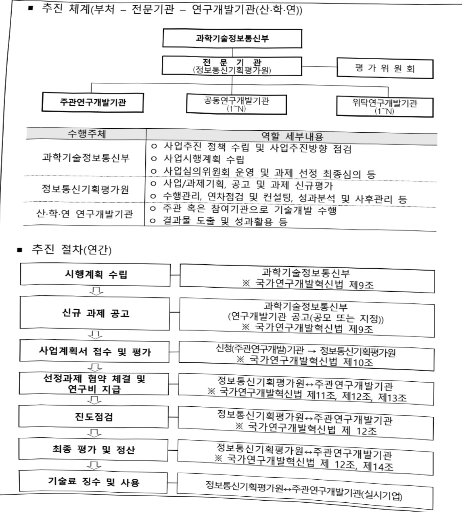
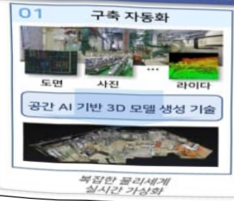
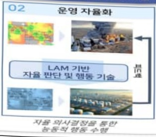
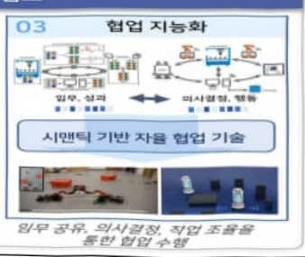

# AI기반 개방형 자율 디지털트윈 핵심기술 개발(R&D)

**해당 페이지**: PDF 380 ~ 387 쪽 해당

**부처**: 과학기술정보통신부
**분야**: 통신
**회계유형**: 일반회계
**2026 확정예산**: 6600.0 백만원
**전년대비 증감률**: None%
**AI 도메인**: 건설/스마트시티

---

### 가.예산 총괄표

(단위: 백만원, %)

<table border=1 style='margin: auto; word-wrap: break-word;'><tr><td rowspan="2">사업명</td><td rowspan="2">2024년 결산</td><td colspan="2">2025년 예산</td><td colspan="2">2026년 예산</td><td rowspan="2" colspan="2">증감(B-A)</td></tr><tr><td style='text-align: center; word-wrap: break-word;'>본예산</td><td style='text-align: center; word-wrap: break-word;'>추경*(A)</td><td style='text-align: center; word-wrap: break-word;'>요구안</td><td colspan="3">본예산(B)</td></tr><tr><td style='text-align: center; word-wrap: break-word;'>AI기반개방형자율디지털트런핵심기술개발</td><td style='text-align: center; word-wrap: break-word;'>-</td><td style='text-align: center; word-wrap: break-word;'>-</td><td style='text-align: center; word-wrap: break-word;'>-</td><td style='text-align: center; word-wrap: break-word;'>6,600</td><td style='text-align: center; word-wrap: break-word;'>6,600</td><td style='text-align: center; word-wrap: break-word;'>순증</td><td style='text-align: center; word-wrap: break-word;'>순증</td></tr></table>

□ 기능별(내역사업별) 예산 내역

(단위:백만원)

<table border=1 style='margin: auto; word-wrap: break-word;'><tr><td rowspan="2"></td><td colspan="5">2024</td><td colspan="5">2025</td><td rowspan="2">2026예산</td></tr><tr><td style='text-align: center; word-wrap: break-word;'>예산액(추정)</td><td style='text-align: center; word-wrap: break-word;'>예산현액</td><td style='text-align: center; word-wrap: break-word;'>집행액</td><td style='text-align: center; word-wrap: break-word;'>이월액</td><td style='text-align: center; word-wrap: break-word;'>불용액</td><td style='text-align: center; word-wrap: break-word;'>예산액(추정)</td><td style='text-align: center; word-wrap: break-word;'>예산현액</td><td style='text-align: center; word-wrap: break-word;'>집행액</td><td style='text-align: center; word-wrap: break-word;'>이월액</td><td style='text-align: center; word-wrap: break-word;'>불용액</td></tr><tr><td style='text-align: center; word-wrap: break-word;'>○ 기능별 분류(합계)</td><td style='text-align: center; word-wrap: break-word;'>-</td><td style='text-align: center; word-wrap: break-word;'>-</td><td style='text-align: center; word-wrap: break-word;'>-</td><td style='text-align: center; word-wrap: break-word;'>-</td><td style='text-align: center; word-wrap: break-word;'>-</td><td style='text-align: center; word-wrap: break-word;'>-</td><td style='text-align: center; word-wrap: break-word;'>-</td><td style='text-align: center; word-wrap: break-word;'>-</td><td style='text-align: center; word-wrap: break-word;'>-</td><td style='text-align: center; word-wrap: break-word;'>-</td><td style='text-align: center; word-wrap: break-word;'>6,600</td></tr><tr><td style='text-align: center; word-wrap: break-word;'>• AI기반개방형자율디지털트렌핵심기술개발</td><td style='text-align: center; word-wrap: break-word;'>-</td><td style='text-align: center; word-wrap: break-word;'>-</td><td style='text-align: center; word-wrap: break-word;'>-</td><td style='text-align: center; word-wrap: break-word;'>-</td><td style='text-align: center; word-wrap: break-word;'>-</td><td style='text-align: center; word-wrap: break-word;'>-</td><td style='text-align: center; word-wrap: break-word;'>-</td><td style='text-align: center; word-wrap: break-word;'>-</td><td style='text-align: center; word-wrap: break-word;'>-</td><td style='text-align: center; word-wrap: break-word;'>-</td><td style='text-align: center; word-wrap: break-word;'>6,600</td></tr></table>

### 나. 사업설명자료

## 1 ) 사업목적·내용

- (AI기만개방형자율디지털트윈핵심기술개발) 산업 환경의 디지털트윈 도입 및 구축 단계를 자동화하고, AI를 통해 실 현장의 운영·대응은 물론 현장 간 연계·협업이 가능한 자율 디지털트윈 핵심기술 확보

(구축자동화) 다양한 객체와 프로세스를 표현하는 멀티모달 인공지능 기반 디지털

트윈 모델 자동 생성 및 갱신기술 개발

(운영자율화) 복잡한 상황에서 능동적으로 문제를 인식하고 해결해 나가는 거대 행동

인공지능 기반 동적 프로세스 최적화기술 개발

(협업지능화) 디지털산업 환경 내 다른 디지털트런과 정보를 교환하고 작업을 연계,

조율하는 디지털트런 자율 협업기술 개발

---

## 2 ) 사업개요

## □ 사업근거 및 추진경위

① 법령상 근거 및 조항

- 정보통신산업진흥법 제7조(정보통신기술진흥 시행계획)

정보통신산업진흥법 제7조(정보통신기술진흥 시행계획) ① 과학기술정보통신부장관은 정보통신기술의 진흥을 위하여 진흥계획에 따라 다음 각 호의 사항이 포함된 정보통신기술진흥 시행계획을 매년 수립·시행하여야 한다.

3. 정보통신기술의 연구개발 및 다른 기술과의 결합 및 융합 촉진에 관한 사항

② 과학기술정보통신부장관은 제1항에 따른 사항을 효율적으로 추진하기 위하여 필요하면 대통령령으로 정하는 바에 따라 정보통신기술의 개발 및 정보통신산업의 진흥과 관련된 연구기관 및 단체로 하여금 이를 대행하게 할 수 있으며 이에 드는 비용을 지원할 수 있다.

- 정보통신 진흥 및 융합 활성화 등에 관한 특별법 제32조(정보통신융합등 기술·서비스 개발 등의 지원)

## 정보통신 진흥 및 융합 활성화 등에 관한 특별법 제32조(정보통신융합등 기술·서비스 개발

등의 지원) ① 과학기술정보통신부장관은 다른 산업 및 서비스 등에 정보통신의 접목을 통하여 생산성과 가치를 높일 수 있도록 노력하여야 한다.

② 과학기술정보통신부장관은 정보통신융합등 기술·서비스의 개발을 촉진하기 위하여 다음 각호의 사업을 추진할 수 있다.

1. 정보통신융합등 기술·서비스 관련 연구개발 사업

2. 제1호에 따라 추진되는 과제에 대한 기획·평가·관리

③ 과학기술정보통신부장관은 제2항 각 호의 사업을 추진하기 위하여 법인인 전담기관을 설립하거나 법인·단체에 위탁·운영할 수 있으며, 필요한 비용의 전부 또는 일부를 예산의 범위에서 출연 또는 보조할 수 있다.

## ② 추진경위

- (24.7) 관계부처합동 디지털트윈 코리아 전략 발표

'IV. 글로벌 선도기술 확보'를 위한 디지털트런 핵심 요소기술개발, 선도형 고도화 기술개발, 확산 기술개발 등

- (‘24.8) ICT R&D 기술로드맵 2030(2025~2030) 수립

·디지털트런 기술분야의 동향 및 전망을 소개하고, AI 연계 융복합 전략 제시

- (25.1~): 사업 기획위원회 운영

· 구축자동화, 운영자율화, 협업지능화 등 3개 기술분야로 구분하여, 산·학·연

전문가로 구성된 사업 기획위원회 운영를 통해 사업 추진방향 수립

□ 주요내용

① 사업규모

- 총사업비 : 해당없음

- 사업기간 : '26 ~ '29

---

-최근 5년 간 투입된 사업비

<table border=1 style='margin: auto; word-wrap: break-word;'><tr><td style='text-align: center; word-wrap: break-word;'>연도</td><td style='text-align: center; word-wrap: break-word;'>2022</td><td style='text-align: center; word-wrap: break-word;'>2023</td><td style='text-align: center; word-wrap: break-word;'>2024</td><td style='text-align: center; word-wrap: break-word;'>2025</td><td style='text-align: center; word-wrap: break-word;'>2026(완)</td></tr><tr><td style='text-align: center; word-wrap: break-word;'>사업비</td><td style='text-align: center; word-wrap: break-word;'>-</td><td style='text-align: center; word-wrap: break-word;'>-</td><td style='text-align: center; word-wrap: break-word;'>-</td><td style='text-align: center; word-wrap: break-word;'>-</td><td style='text-align: center; word-wrap: break-word;'>6,600</td></tr></table>

-기타:해당없음

② 사업추진체계

- 사업시행방법 : 출연

- 사업시행주체 : 정보통신기획평가원

-사업 수혜자 : 대학, 기업, 출연연 등

- 보조, 융자, 출연, 출자 등의 경우 보조·융자 등 지원 비율 및 법적근거

<table border=1 style='margin: auto; word-wrap: break-word;'><tr><td style='text-align: center; word-wrap: break-word;'>내역사업명</td><td style='text-align: center; word-wrap: break-word;'>구분</td><td style='text-align: center; word-wrap: break-word;'>피보조·피출연 등 기관명</td><td style='text-align: center; word-wrap: break-word;'>지원 금액 (2026예산안)</td><td style='text-align: center; word-wrap: break-word;'>지원 비율(%)</td><td style='text-align: center; word-wrap: break-word;'>보조율 법적근거 (해당 조항)</td></tr><tr><td style='text-align: center; word-wrap: break-word;'>AI기반개방형자율디지털트윈핵심기술개발</td><td style='text-align: center; word-wrap: break-word;'>출연</td><td style='text-align: center; word-wrap: break-word;'>정보통신기획평가원</td><td style='text-align: center; word-wrap: break-word;'>6,600</td><td style='text-align: center; word-wrap: break-word;'>100</td><td style='text-align: center; word-wrap: break-word;'>「정보통신 진흥 및 융합 활성화 등에 관한 특별법」제32조(정보통신융합등기술·서비스 개발 등의 지원) 제3항</td></tr></table>

---

## 3 ) 2026년도 예산안 산출 근거

□ AI기반개방형자율디지털트원핵심기술개발 : (26) 6,600백만원, 순증

- (요구) 산업 전반의 디지털 전환을 가속화하고 미래 기술 기반의 성장 동력을 확보하는 자율 디지털트런 핵심기술 개발을 위한 예산지원 요구

* 단일 디지털트런 구축 및 다중 디지털트런 간 연합 및 자율화를 위해 구축자동화 - 운영자율화 - 협업지능화로 중점 추진 분야 구성

- (산출) (신규) 4개 과제 × 2,200백만원 × 9/12개월 = 6,600백만원

## 4 ) 사업효과

□ 사업영향, 산출물 성과지표 등

① 2022~2026년도 성과계획서 상 성과지표 및 최근 5년간 성과 달성도

<table border=1 style='margin: auto; word-wrap: break-word;'><tr><td style='text-align: center; word-wrap: break-word;'>성과지표</td><td style='text-align: center; word-wrap: break-word;'>구분</td><td style='text-align: center; word-wrap: break-word;'>2022</td><td style='text-align: center; word-wrap: break-word;'>2023</td><td style='text-align: center; word-wrap: break-word;'>2024</td><td style='text-align: center; word-wrap: break-word;'>2025</td><td style='text-align: center; word-wrap: break-word;'>2026</td><td style='text-align: center; word-wrap: break-word;'>2026 목표치산출근거</td><td style='text-align: center; word-wrap: break-word;'>측정산식(또는 측정방법)</td><td style='text-align: center; word-wrap: break-word;'>자료수집방법(또는 자료출처)</td></tr><tr><td rowspan="3">표준화된순위보정영향력지수(mrnIF)(단위: 점)</td><td style='text-align: center; word-wrap: break-word;'>목표</td><td style='text-align: center; word-wrap: break-word;'>-</td><td style='text-align: center; word-wrap: break-word;'>-</td><td style='text-align: center; word-wrap: break-word;'>-</td><td style='text-align: center; word-wrap: break-word;'>-</td><td style='text-align: center; word-wrap: break-word;'>신규</td><td rowspan="3">유사사업 실적치기반으로 설정</td><td rowspan="3">표준화된순위보정영향력지수(mrnIF) =  $ \frac{(N \times rnIF) - 1}{N - 1} \times 100 $</td><td rowspan="3">IRIS/SIMS</td></tr><tr><td style='text-align: center; word-wrap: break-word;'>실적</td><td style='text-align: center; word-wrap: break-word;'>-</td><td style='text-align: center; word-wrap: break-word;'>-</td><td style='text-align: center; word-wrap: break-word;'>-</td><td style='text-align: center; word-wrap: break-word;'>-</td><td style='text-align: center; word-wrap: break-word;'></td></tr><tr><td style='text-align: center; word-wrap: break-word;'>달성도</td><td style='text-align: center; word-wrap: break-word;'>-</td><td style='text-align: center; word-wrap: break-word;'>-</td><td style='text-align: center; word-wrap: break-word;'>-</td><td style='text-align: center; word-wrap: break-word;'>-</td><td style='text-align: center; word-wrap: break-word;'></td></tr><tr><td rowspan="3">특허등급지수(SMART)(단위: 점)</td><td style='text-align: center; word-wrap: break-word;'>목표</td><td style='text-align: center; word-wrap: break-word;'>-</td><td style='text-align: center; word-wrap: break-word;'>-</td><td style='text-align: center; word-wrap: break-word;'>-</td><td style='text-align: center; word-wrap: break-word;'>-</td><td style='text-align: center; word-wrap: break-word;'>신규</td><td rowspan="3">유사사업 실적치기반으로 설정</td><td rowspan="3">$ \sum(Ai \times Bi)/\sum Bi $Ai : 특허등급별가중치,Bi : 등급별특허성과 건수</td><td rowspan="3">IRIS/SIMS(한국발명진흥회)</td></tr><tr><td style='text-align: center; word-wrap: break-word;'>실적</td><td style='text-align: center; word-wrap: break-word;'>-</td><td style='text-align: center; word-wrap: break-word;'>-</td><td style='text-align: center; word-wrap: break-word;'>-</td><td style='text-align: center; word-wrap: break-word;'>-</td><td style='text-align: center; word-wrap: break-word;'></td></tr><tr><td style='text-align: center; word-wrap: break-word;'>달성도</td><td style='text-align: center; word-wrap: break-word;'>-</td><td style='text-align: center; word-wrap: break-word;'>-</td><td style='text-align: center; word-wrap: break-word;'>-</td><td style='text-align: center; word-wrap: break-word;'>-</td><td style='text-align: center; word-wrap: break-word;'></td></tr><tr><td rowspan="3">표준화기고서채택 또는표준안채택(국내, 국제)(단위: 건)</td><td style='text-align: center; word-wrap: break-word;'>목표</td><td style='text-align: center; word-wrap: break-word;'>-</td><td style='text-align: center; word-wrap: break-word;'>-</td><td style='text-align: center; word-wrap: break-word;'>-</td><td style='text-align: center; word-wrap: break-word;'>-</td><td style='text-align: center; word-wrap: break-word;'>신규</td><td rowspan="3">과제당 매년각 1건씩 설정</td><td rowspan="3">표준화기고서채택 또는 표준안채택 건수 =  $ \sum(\text{과제별 국내외기고 또는 채택 건수}) $</td><td rowspan="3">IRIS/SIMS(성과분석보고서)</td></tr><tr><td style='text-align: center; word-wrap: break-word;'>실적</td><td style='text-align: center; word-wrap: break-word;'>-</td><td style='text-align: center; word-wrap: break-word;'>-</td><td style='text-align: center; word-wrap: break-word;'>-</td><td style='text-align: center; word-wrap: break-word;'>-</td><td style='text-align: center; word-wrap: break-word;'></td></tr><tr><td style='text-align: center; word-wrap: break-word;'>달성도</td><td style='text-align: center; word-wrap: break-word;'>-</td><td style='text-align: center; word-wrap: break-word;'>-</td><td style='text-align: center; word-wrap: break-word;'>-</td><td style='text-align: center; word-wrap: break-word;'>-</td><td style='text-align: center; word-wrap: break-word;'></td></tr></table>

② 성과지표 이외의 연도별 사업추진 경과 및 실적 : 해당없음

③향후(2026년도 이후)기대효과

- (기술) 자율·지능형 디지털 트런 기술 경쟁력 확보 및 차세대 기술 자립으로 글로벌 경쟁력 강화

- (산업) 자율 디지털트윈을 통해 설비 최적화, 공정 자동화, 품질 예측 등 생산성 혁신 지원

- (정부) 자율 디지털트윈으로 도시개발, 기후 대응 등 정부 정책 실행 전 시뮬레이션을 통해 정책 실패 예방 및 정량적 타당성 확보 등 과학적 행정 실현에 기여

---

5) 타당성조사 및 예비타당성조사 시행여부 및 결과 요지 : 해당없음

6) 총사업비 대상사업 여부 및 내역 : 해당없음

## 7 ) 사업 집행절차

▪ 추진 절차(연간)

---

<table border=1 style='margin: auto; word-wrap: break-word;'><tr><td style='text-align: center; word-wrap: break-word;'></td><td style='text-align: center; word-wrap: break-word;'></td><td style='text-align: center; word-wrap: break-word;'>※ 국가연구개발혁신법 제18조</td></tr><tr><td style='text-align: center; word-wrap: break-word;'>☐ 성과활용 보고 및 평가 등 성과활용 관리</td><td colspan="2">☐ 주관연구개발기관→정보통신기획평가원 ※ 국가연구개발혁신법 제16조, 제17조</td></tr></table>

▪ 예산 집행 흐름도('26년 기준)

<table border=1 style='margin: auto; word-wrap: break-word;'><tr><td style='text-align: center; word-wrap: break-word;'>부처</td><td style='text-align: center; word-wrap: break-word;'></td><td style='text-align: center; word-wrap: break-word;'>피출연·피보조기관</td><td style='text-align: center; word-wrap: break-word;'></td><td style='text-align: center; word-wrap: break-word;'>사업수행자</td></tr><tr><td style='text-align: center; word-wrap: break-word;'>과학기술정보통신부(6,600백만원)</td><td style='text-align: center; word-wrap: break-word;'>=&gt;(6,600백만원)</td><td style='text-align: center; word-wrap: break-word;'>정보통신기획평가원(6,600백만원)</td><td style='text-align: center; word-wrap: break-word;'>=&gt;(6,600백만원)</td><td style='text-align: center; word-wrap: break-word;'>대학·기업·출연연등 수행기관</td></tr></table>

## 8 ) 중기재정계획 상 연도별 투자계획 및 추진경과

(단위: 백만원)

<table border=1 style='margin: auto; word-wrap: break-word;'><tr><td style='text-align: center; word-wrap: break-word;'>$  \text{중기}  $ 재정계획</td><td style='text-align: center; word-wrap: break-word;'>2024</td><td style='text-align: center; word-wrap: break-word;'>2025</td><td style='text-align: center; word-wrap: break-word;'>2026</td><td style='text-align: center; word-wrap: break-word;'>2027</td><td style='text-align: center; word-wrap: break-word;'>2028</td><td style='text-align: center; word-wrap: break-word;'>2029</td></tr><tr><td style='text-align: center; word-wrap: break-word;'>2024~2028</td><td style='text-align: center; word-wrap: break-word;'>-</td><td style='text-align: center; word-wrap: break-word;'>-</td><td style='text-align: center; word-wrap: break-word;'>-</td><td style='text-align: center; word-wrap: break-word;'>-</td><td style='text-align: center; word-wrap: break-word;'>-</td><td style='text-align: center; word-wrap: break-word;'>☑</td></tr><tr><td style='text-align: center; word-wrap: break-word;'>2025~2029</td><td style='text-align: center; word-wrap: break-word;'>☑</td><td style='text-align: center; word-wrap: break-word;'>-</td><td style='text-align: center; word-wrap: break-word;'>6,600</td><td style='text-align: center; word-wrap: break-word;'>11,800</td><td style='text-align: center; word-wrap: break-word;'>12,800</td><td style='text-align: center; word-wrap: break-word;'>4,000</td></tr></table>

9) 최근 3년간 동 사업에 대한 주요 외부지적사항 및 평가, 문제점 및 대책 : 해당없음

## 10 ) 향후 추진방향 및 추진계획

<table border=1 style='margin: auto; word-wrap: break-word;'><tr><td style='text-align: center; word-wrap: break-word;'>[중점투자 분야 및 기술]</td></tr><tr><td style='text-align: center; word-wrap: break-word;'>○ (목표) 산업 환경의 디지털트런 도입 및 구축 단계를 자동화하고, AI를 통해 실현장의 운영·대응 및 현장 간 연계·협업이 가능한 자율 디지털트런 핵심기술 확보 - (구축자동화) 다양한 객체와 프로세스를 표현하는 멀티모달 인공지능 기반 디지털 트런 모델 자동 생성 및 갱신기술 개발</td></tr><tr><td style='text-align: center; word-wrap: break-word;'>- (운영자율화) 복잡한 상황에서 능동적으로 문제를 인식하고 해결해 나가는 거대 행동 인공지능 기반 동적 프로세스 최적화기술 개발</td></tr><tr><td style='text-align: center; word-wrap: break-word;'>- (협업지능화) 디지털산업 환경 내 다른 디지털트런과 정보를 교환하고 작업을 연계, 조율하는 디지털트런 자율 협업기술 개발</td></tr></table>

---

자율형 디지털 트윈 사업 기술 개발 개념도

11) 해당사업에 대한 각종 사업평가의 결과 : 해당없음

12) 해당사업에 대한 부처 자체평가의 결과 : 해당없음

13) 부처 건의사항 : 해당없음

### 다. 최근 4년간 결산내역

1) 결산표 : 해당없음

2) 주요 결산사항 : 해당없음

---

<table border=1 style='margin: auto; word-wrap: break-word;'><tr><td style='text-align: center; word-wrap: break-word;'>사 업 명</td></tr><tr><td style='text-align: center; word-wrap: break-word;'>(304) AI기반 맞춤형 케어서비스 융합선도(R&amp;D) (2601-385)</td></tr></table>

사업 코드 정보

<table border=1 style='margin: auto; word-wrap: break-word;'><tr><td style='text-align: center; word-wrap: break-word;'>구분</td><td style='text-align: center; word-wrap: break-word;'>회계</td><td style='text-align: center; word-wrap: break-word;'>소관</td><td style='text-align: center; word-wrap: break-word;'>실국(기관)</td><td style='text-align: center; word-wrap: break-word;'>계정</td><td style='text-align: center; word-wrap: break-word;'>분야</td><td style='text-align: center; word-wrap: break-word;'>부문</td></tr><tr><td style='text-align: center; word-wrap: break-word;'>코드</td><td rowspan="2">일반회계</td><td rowspan="2">과학기술정보통신부</td><td rowspan="2">안공지능정책기획관</td><td rowspan="2">0</td><td style='text-align: center; word-wrap: break-word;'>130</td><td style='text-align: center; word-wrap: break-word;'>133</td></tr><tr><td style='text-align: center; word-wrap: break-word;'>명칭</td><td style='text-align: center; word-wrap: break-word;'>통신</td><td style='text-align: center; word-wrap: break-word;'>정보통신</td></tr></table>

<table border=1 style='margin: auto; word-wrap: break-word;'><tr><td style='text-align: center; word-wrap: break-word;'>구분</td><td style='text-align: center; word-wrap: break-word;'>프로그램</td><td style='text-align: center; word-wrap: break-word;'>단위사업</td><td style='text-align: center; word-wrap: break-word;'>세부사업</td></tr><tr><td style='text-align: center; word-wrap: break-word;'>코드</td><td style='text-align: center; word-wrap: break-word;'>2600</td><td style='text-align: center; word-wrap: break-word;'>2601</td><td style='text-align: center; word-wrap: break-word;'>385</td></tr><tr><td style='text-align: center; word-wrap: break-word;'>명칭</td><td style='text-align: center; word-wrap: break-word;'>인공지능데이터진흥</td><td style='text-align: center; word-wrap: break-word;'>AI기술개발(일반)</td><td style='text-align: center; word-wrap: break-word;'>AI기반 맞춤형 케어서비스 융합선도</td></tr></table>

<table border=1 style='margin: auto; word-wrap: break-word;'><tr><td colspan="6">☐ 사업 성격 (공통요구자료 II-1 작성유의사항 4. 참조, 해당하는 사항에 “○” 표시)</td></tr><tr><td rowspan="2">신규 계속</td><td rowspan="2">완료</td><td rowspan="2">예비타당성 실시여부</td><td rowspan="2">총사업비 관리대상</td><td rowspan="2">총액계상 예산사업</td><td style='text-align: center; word-wrap: break-word;'>사업소관 변경정보</td></tr><tr><td style='text-align: center; word-wrap: break-word;'>2025예산 시 소관</td></tr><tr><td style='text-align: center; word-wrap: break-word;'></td><td style='text-align: center; word-wrap: break-word;'>O</td><td style='text-align: center; word-wrap: break-word;'></td><td style='text-align: center; word-wrap: break-word;'></td><td style='text-align: center; word-wrap: break-word;'></td><td style='text-align: center; word-wrap: break-word;'></td></tr></table>

사업지원형태 및지원을(최소한개는반드시선택하시오.해당사항에O표시)

<table border=1 style='margin: auto; word-wrap: break-word;'><tr><td style='text-align: center; word-wrap: break-word;'>직접</td><td style='text-align: center; word-wrap: break-word;'>출자</td><td style='text-align: center; word-wrap: break-word;'>출연</td><td style='text-align: center; word-wrap: break-word;'>보조</td><td style='text-align: center; word-wrap: break-word;'>융자</td><td style='text-align: center; word-wrap: break-word;'>국고보조율(%)</td><td style='text-align: center; word-wrap: break-word;'>융자율(%)</td></tr><tr><td style='text-align: center; word-wrap: break-word;'></td><td style='text-align: center; word-wrap: break-word;'></td><td style='text-align: center; word-wrap: break-word;'>O</td><td style='text-align: center; word-wrap: break-word;'></td><td style='text-align: center; word-wrap: break-word;'></td><td style='text-align: center; word-wrap: break-word;'></td><td style='text-align: center; word-wrap: break-word;'></td></tr></table>

## □ 사업 소관부처 및 시행주체

<table border=1 style='margin: auto; word-wrap: break-word;'><tr><td style='text-align: center; word-wrap: break-word;'>사업명</td><td colspan="2">구분</td></tr><tr><td rowspan="2">AI기반 생애 전주기 맞춤형 잘병 예방서비스 개발·실증 내역사업</td><td style='text-align: center; word-wrap: break-word;'>소관부처</td><td style='text-align: center; word-wrap: break-word;'>인공지능정책실 인공지능정책기획관 인공지능융합팀</td></tr><tr><td style='text-align: center; word-wrap: break-word;'>사업시행주체</td><td style='text-align: center; word-wrap: break-word;'>정보통신기획평가원</td></tr></table>

---

### 원본 PDF 크롭 이미지

