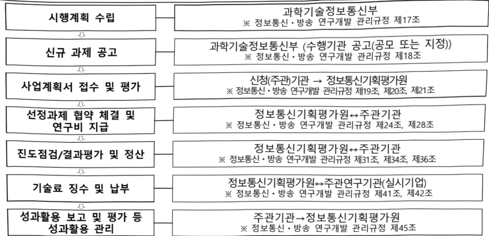

# AI기반 맞춤형 케어서비스 융합선도(R&D)

**해당 페이지**: PDF 388 ~ 393 쪽 해당

**부처**: 과학기술정보통신부
**분야**: 통신
**회계유형**: 일반회계
**2026 확정예산**: 3000.0 백만원
**전년대비 증감률**: None%
**AI 도메인**: 의료/바이오

---

### 가. 예산 총괄표

(단위: 백만원, %)

<table border=1 style='margin: auto; word-wrap: break-word;'><tr><td rowspan="2">사업명</td><td rowspan="2">2024년 결산</td><td colspan="2">2025년 예산</td><td colspan="2">2026년 예산</td><td rowspan="2">증감(B-A)</td><td rowspan="2">(B-A)/A</td></tr><tr><td style='text-align: center; word-wrap: break-word;'>본예산</td><td style='text-align: center; word-wrap: break-word;'>추경*(A)</td><td style='text-align: center; word-wrap: break-word;'>요구안</td><td style='text-align: center; word-wrap: break-word;'>본예산(B)</td></tr><tr><td style='text-align: center; word-wrap: break-word;'>AI기반 맞춤형 케이서비스</td><td rowspan="2">-</td><td rowspan="2">3,000</td><td rowspan="2">3,000</td><td rowspan="2">3,000</td><td rowspan="2">3,000</td><td rowspan="2">-</td><td rowspan="2">-</td></tr><tr><td style='text-align: center; word-wrap: break-word;'>융합선도(R&amp;D)</td></tr></table>

*추경: 추경증감액을 포함한 최종 예산액을 기재

□ 기능별(내역사업별) 예산 내역

(단위:백만원)

<table border=1 style='margin: auto; word-wrap: break-word;'><tr><td rowspan="2"></td><td colspan="5">2024</td><td colspan="5">2025</td><td rowspan="2">2026예산</td></tr><tr><td style='text-align: center; word-wrap: break-word;'>예산의(추경)</td><td style='text-align: center; word-wrap: break-word;'>예산현액</td><td style='text-align: center; word-wrap: break-word;'>집행액</td><td style='text-align: center; word-wrap: break-word;'>이월액</td><td style='text-align: center; word-wrap: break-word;'>불용액</td><td style='text-align: center; word-wrap: break-word;'>예산의(추경)</td><td style='text-align: center; word-wrap: break-word;'>예산현액</td><td style='text-align: center; word-wrap: break-word;'>집행액</td><td style='text-align: center; word-wrap: break-word;'>이월액</td><td style='text-align: center; word-wrap: break-word;'>불용액</td></tr><tr><td style='text-align: center; word-wrap: break-word;'>○ 기능별 분류(합계)</td><td style='text-align: center; word-wrap: break-word;'>-</td><td style='text-align: center; word-wrap: break-word;'>-</td><td style='text-align: center; word-wrap: break-word;'>-</td><td style='text-align: center; word-wrap: break-word;'>-</td><td style='text-align: center; word-wrap: break-word;'>-</td><td style='text-align: center; word-wrap: break-word;'>3,000</td><td style='text-align: center; word-wrap: break-word;'>3,000</td><td style='text-align: center; word-wrap: break-word;'>3,000</td><td style='text-align: center; word-wrap: break-word;'>3,000</td><td style='text-align: center; word-wrap: break-word;'>3,000</td><td style='text-align: center; word-wrap: break-word;'>-</td></tr><tr><td style='text-align: center; word-wrap: break-word;'>• AI기반생애전주기맞춤형질병예방서비스개발·실증</td><td style='text-align: center; word-wrap: break-word;'>-</td><td style='text-align: center; word-wrap: break-word;'>-</td><td style='text-align: center; word-wrap: break-word;'>-</td><td style='text-align: center; word-wrap: break-word;'>-</td><td style='text-align: center; word-wrap: break-word;'>-</td><td style='text-align: center; word-wrap: break-word;'>3,000</td><td style='text-align: center; word-wrap: break-word;'>3,000</td><td style='text-align: center; word-wrap: break-word;'>3,000</td><td style='text-align: center; word-wrap: break-word;'>3,000</td><td style='text-align: center; word-wrap: break-word;'>3,000</td><td style='text-align: center; word-wrap: break-word;'>-</td></tr></table>

### 나.사업설명자료

1) 사업목적·내용

- 선상섬신기독 능 의료데이터, 라이프로그, 유전체 등의 정보를 AI를 통해 복합적으로 학습하여 질병 위험 가능성을 예측하고, 적정 예방 정보 등을 맞춤형으로 제공하는 선제적 서비스 개발·실증

## 2 ) 사업개요

사업근거 및 추진경위

① 법령상 근거 및 조항

<table border=1 style='margin: auto; word-wrap: break-word;'><tr><td rowspan="3">지원근거</td><td style='text-align: center; word-wrap: break-word;'>ㅇ 과학기술기본법 제11조(국가연구개발사업의 추진)</td></tr><tr><td style='text-align: center; word-wrap: break-word;'>제11조(국가연구개발사업의 추진) ① 중앙행정기관의 장은 기본계획에 따라 맡은 분야의 국가연구개발사업과 그 시책을 세워 추진하여야 한다.</td></tr><tr><td style='text-align: center; word-wrap: break-word;'>ㅇ 정보통신 진흥 및 융합 활성화 등에 관한 특별법 제32조(정보통신융합등</td></tr></table>

---

## 기술·서비스 개발 등의 지원)

<table border=1 style='margin: auto; word-wrap: break-word;'><tr><td style='text-align: center; word-wrap: break-word;'>제32조(정보통신융합등 기술·서비스 개발 등의 지원) ① 과학기술정보통신부장관은 다른 산업 및 서비스 등에 정보통신의 접목을 통하여 생산성과 가치를 높일 수 있도록 노력하여야 한다. ② 과학기술정보통신부장관은 정보통신융합등 기술·서비스의 개발을 촉진하기 위하여 다음 각 호의 사업을 추진할 수 있다.</td></tr><tr><td style='text-align: center; word-wrap: break-word;'>1. 정보통신융합 등 기술·서비스 관련 연구개발 사업</td></tr><tr><td style='text-align: center; word-wrap: break-word;'>2. 제1호에 따라 추진되는 과제에 대한 기획·평가·관리</td></tr><tr><td style='text-align: center; word-wrap: break-word;'>③ 과학기술정보통신부장관은 제2항 각 호의 사업을 추진하기 위하여 법인인 전담기관을 설립하거나 법인·단체에 위탁·운영할 수 있으며, 필요한 비용의 전부 또는 일부를 예산의 범위에서 출연 또는 보조할 수 있다.</td></tr></table>

## ② 추진경위

o 대한민국 디지털 전략 발표('22.9월, 관계부처합동')

"국민과 함께 세계 모범이 되는 디지털 강국 대한민국 실현"

② 충분한 디지털 자원 확보

- (융합) 국민 일상 속 'AI 융합시대 본격화'

o'新성장 4.0 전략' 추진계획 발표('22.12월, 기획재정부)

(新일상:Digital Everywhere) 의료 AI-SW 적용·확산 등 AI제품·서비스 개발 보급

#### o 비상경제장관회의 "新성장 4.0 전략 로드맵" 발표('23.2월)

### 2. [新일상]Digital Everywhere

6 (내 삶 속의 디지털) ② AI 일상화 프로젝트 추진

(AI활용) 돌봄, 교육, 의료 등 국민 실생활에 인공지능 도입

- (AI 일상화) 민상문제·사회현안 해결을 위해 AI제품·서비스를 보급하는 '전국민 AI 일상화 프로젝트' 추진

- (AI서비스 혁신) 챗GPT와 같은 혁신적인 AI 서비스의 개발을 촉진하기 위한 제도기반 및 지원체계 구축

o '초거대AI 경쟁력 강화방안' 발표('23.4월, 관계부처 합동)

▶초거대AI 경쟁력을 강화하고 미래 전략산업으로 육성하기 위한 정책과제 추진

- 1) 초거대AI 개발·고도화를 지원하는 기술·산업 인프라 확충, 2) 민간·공공 초거대 AI 융합 등 초거대 AI 혁신 생태계 조성, 3) 범국가 AI혁신 제도·문화 정착

o '첨단산업 글로벌 클러스터 육성방안' 발표('23.6월, 관계부처합동)

▶ V. 바이오 분야 클러스터 육성·활성화 방안

·(디지털바이오 인프라 조성) 7대 R&D 선도프로젝트 추진

0 '첨단산업 글로벌 클러스터 육성방안' 후속조치 계획 발표('23.9월, 관계부처합동)

▶ IV 바이오 클러스터 생태계 지원 후속조치

· 기존 한계를 뛰어넘는 R&D 성공사례 창출을 위해 7대 선도프로젝트* 추진

* ①향제신약 AI, ②닥터앤서 3.0, ③한국인 노화시계, ④마이닥터24, ⑤마음건강앱,

⑥DeepFold, ⑦NeuroTalk

o 전국민 AI일상화 실행계획('23.9월, 관계부처합동)

• AI를 국민의 삶 전반에 전방위적으로 확산하고, 디지털 모범국가의 탄탄한 기초로서 범부처 AI 일상화 실행계획 수립

2) AI 내재화로 산업·일터를 혁신하겠습니다.

- (2-1) 민간 전문영역 초거대 AI 용합 선도

* (건강) 의료보건 서비스 품질제고 - 의료기관 대상 클라우드 병원정보시스템 질환진단 AI도입 지원

---

## 주요내용

① 사업규모

- 총사업비(해당되는 경우에만 기재) : 해당 없음

- 사업기간 : '25년 ~ '28년

- 최근 5년 간 투입된 사업비(예산액기준, 추경편성한 연도에는 추경포함)

<table border=1 style='margin: auto; word-wrap: break-word;'><tr><td style='text-align: center; word-wrap: break-word;'>$ \underline{\text{所}} $</td><td style='text-align: center; word-wrap: break-word;'>2022</td><td style='text-align: center; word-wrap: break-word;'>2023</td><td style='text-align: center; word-wrap: break-word;'>2024</td><td style='text-align: center; word-wrap: break-word;'>2025</td><td style='text-align: center; word-wrap: break-word;'>2026</td></tr><tr><td style='text-align: center; word-wrap: break-word;'>$ \underline{\text{사업비}} $</td><td style='text-align: center; word-wrap: break-word;'>-</td><td style='text-align: center; word-wrap: break-word;'>-</td><td style='text-align: center; word-wrap: break-word;'></td><td style='text-align: center; word-wrap: break-word;'>3,000</td><td style='text-align: center; word-wrap: break-word;'>3,000</td></tr></table>

- 기타: '26년도 총 2개 과제 규모 지원

② 사업추진체계

- 사업시행방법 : 출연

- 사업시행주체 : 정보통신기획평가원

- 사업 수혜자 : 산, 학, 연, 병원, 기타 등

- 보조, 융자, 출연, 출자 등의 경우 보조·융자 등 지원 비율 및 법적근거

<table border=1 style='margin: auto; word-wrap: break-word;'><tr><td style='text-align: center; word-wrap: break-word;'>내역사업명</td><td style='text-align: center; word-wrap: break-word;'>구분</td><td style='text-align: center; word-wrap: break-word;'>피보조·피출연 등 기관명</td><td style='text-align: center; word-wrap: break-word;'>지원 금액 (2026예산)</td><td style='text-align: center; word-wrap: break-word;'>지원 비율(%)</td><td style='text-align: center; word-wrap: break-word;'>보조율 법적근거 (해당 조항)</td></tr><tr><td style='text-align: center; word-wrap: break-word;'>AI기반 생애전주기 맞춤형 질병예방 서비스 개발·실증</td><td style='text-align: center; word-wrap: break-word;'>출연</td><td style='text-align: center; word-wrap: break-word;'>정보통신 기획평가원</td><td style='text-align: center; word-wrap: break-word;'>3,000</td><td style='text-align: center; word-wrap: break-word;'>정액 (정부출연금의 75%이내)</td><td style='text-align: center; word-wrap: break-word;'>과학기술기본법 제11조, 정보통신 진흥 및 융합 활성화 등에 관한 특별법 제32조</td></tr></table>

## 3 ) 2026년도 예산 산출 근거

○ 연구개발활동비(360-05):3,000백만원

가. AI기반 생애전주기 맞춤형 질병 예방 서비스 개발·실증

(3,000백만원)

(계속)2개 과제 x 2,000백만원 x 9/12개월 = 3,000백만원

---

## 4 ) 사업효과

□ 사업영향, 산출물 성과지표 등

① 2022~2026년도 성과계획서 상 성과지표 및 최근 5년간 성과 달성도

<table border=1 style='margin: auto; word-wrap: break-word;'><tr><td style='text-align: center; word-wrap: break-word;'>성과지표</td><td style='text-align: center; word-wrap: break-word;'>구분</td><td style='text-align: center; word-wrap: break-word;'>2022</td><td style='text-align: center; word-wrap: break-word;'>2023</td><td style='text-align: center; word-wrap: break-word;'>2024</td><td style='text-align: center; word-wrap: break-word;'>2025</td><td style='text-align: center; word-wrap: break-word;'>2026</td><td style='text-align: center; word-wrap: break-word;'>2026 목표치산출근거</td><td style='text-align: center; word-wrap: break-word;'>측정산식(또는 측정방법)</td><td style='text-align: center; word-wrap: break-word;'>자료수집방법(또는 자료출처)</td></tr><tr><td rowspan="3">학습데이터수집·가공(단위:전)</td><td style='text-align: center; word-wrap: break-word;'>목표</td><td style='text-align: center; word-wrap: break-word;'>-</td><td style='text-align: center; word-wrap: break-word;'>-</td><td style='text-align: center; word-wrap: break-word;'>-</td><td style='text-align: center; word-wrap: break-word;'>5,000</td><td style='text-align: center; word-wrap: break-word;'>5,500</td><td rowspan="3">복합 데이터수집·가공누계를 목표로 설정 * 전년 대비 10% 상승률을 적용</td><td rowspan="3">학습데이터수집·가공수누계</td><td rowspan="3">사업결과보고서</td></tr><tr><td style='text-align: center; word-wrap: break-word;'>실적</td><td style='text-align: center; word-wrap: break-word;'>-</td><td style='text-align: center; word-wrap: break-word;'>-</td><td style='text-align: center; word-wrap: break-word;'>-</td><td style='text-align: center; word-wrap: break-word;'>-</td><td style='text-align: center; word-wrap: break-word;'>-</td></tr><tr><td style='text-align: center; word-wrap: break-word;'>달성도</td><td style='text-align: center; word-wrap: break-word;'>-</td><td style='text-align: center; word-wrap: break-word;'>-</td><td style='text-align: center; word-wrap: break-word;'>-</td><td style='text-align: center; word-wrap: break-word;'>-</td><td style='text-align: center; word-wrap: break-word;'>-</td></tr></table>

② 성과지표 이외의 연도별 사업추진 경과 및 실적

<table border=1 style='margin: auto; word-wrap: break-word;'><tr><td style='text-align: center; word-wrap: break-word;'>2025</td><td style='text-align: center; word-wrap: break-word;'>• 건강인의 맞춤 라이프코칭을 위한 폐놈 데이터 기반 AI 정밀 건강예측 및 건강 관리 AI 에이전트 기술개발 - 심혈관질환(CAD), 당뇨(DM), 골관절염(OA), 요통(LBP), 유방암, 대사성 간질환, 고혈압 등 건강 위험도 예측 모델 개발을 위한 보편적 건강상태에 대한 폐놈 데이터셋 구축 및 건강 위험도 예측 AI 모델 구현</td></tr></table>

③향후(2026년도 이후)기대효과

o 국민 불편 해소와 편의 증진

- AI·데이터 기반의 의료 진단 기술 발전, 안정적 네트워크 등 디지털 기술 환경

변화에 따라 국민들이 체감할 수 있는 서재적 서비스 개발 기대

0 건강수명 연장을 위한 발병 예방을 통한 의료비 절감

- 조고령사회(65세 이상 인구 비율 20%이상) 진입에 따른, 의료수요·의료비 급증 문제에 대한 해법의 하나로 발생 예방에 기여

5) 타당성조사 및 예비타당성조사 시행여부 및 결과 요지 : 해당 없음

6) 총사업비 대상사업 정보 : 해당 없음

## 7 ) 사업 집행절차

<table border=1 style='margin: auto; word-wrap: break-word;'><tr><td style='text-align: center; word-wrap: break-word;'>&lt;사업시행절차&gt;</td></tr></table>

---

- AI기반 맞춤형 케어서비스 융합선도(R&D)

<table border=1 style='margin: auto; word-wrap: break-word;'><tr><td style='text-align: center; word-wrap: break-word;'>부처</td><td style='text-align: center; word-wrap: break-word;'></td><td style='text-align: center; word-wrap: break-word;'>피출연·피보조기관</td><td style='text-align: center; word-wrap: break-word;'></td><td style='text-align: center; word-wrap: break-word;'>간접보조사업자·사업수행자</td></tr><tr><td style='text-align: center; word-wrap: break-word;'>과학기술정보통신부(3,000백만원)</td><td style='text-align: center; word-wrap: break-word;'>=&gt;(3,000백만원)</td><td style='text-align: center; word-wrap: break-word;'>정보통신기획평가원(-백만원)</td><td style='text-align: center; word-wrap: break-word;'>=&gt;(3,000백만원)</td><td style='text-align: center; word-wrap: break-word;'>대학, 기업, 연구소, 병원 등</td></tr></table>

## 8 ) 각종 평가 : 해당 없음

### 다.최근 4년간 결산내역

## 1 ) 결산표

☐ 부처 결산내역

(단위: 백만원, %)

<table border=1 style='margin: auto; word-wrap: break-word;'><tr><td rowspan="2">연도</td><td colspan="3">예산액</td><td style='text-align: center; word-wrap: break-word;'>예산현액</td><td style='text-align: center; word-wrap: break-word;'>집행액</td><td style='text-align: center; word-wrap: break-word;'>집행률</td><td style='text-align: center; word-wrap: break-word;'>다음연도</td><td rowspan="2">불용액</td></tr><tr><td style='text-align: center; word-wrap: break-word;'>본예산</td><td style='text-align: center; word-wrap: break-word;'>추경증감액</td><td style='text-align: center; word-wrap: break-word;'>추경</td><td style='text-align: center; word-wrap: break-word;'>(A)</td><td style='text-align: center; word-wrap: break-word;'>(B)</td><td style='text-align: center; word-wrap: break-word;'>(B/A)</td><td style='text-align: center; word-wrap: break-word;'>이월액</td></tr><tr><td style='text-align: center; word-wrap: break-word;'>2025</td><td style='text-align: center; word-wrap: break-word;'>3,000</td><td style='text-align: center; word-wrap: break-word;'>-</td><td style='text-align: center; word-wrap: break-word;'>3,000</td><td style='text-align: center; word-wrap: break-word;'>3,000</td><td style='text-align: center; word-wrap: break-word;'>3,000</td><td style='text-align: center; word-wrap: break-word;'>100</td><td style='text-align: center; word-wrap: break-word;'>-</td><td style='text-align: center; word-wrap: break-word;'>-</td></tr></table>

## 2 ) 주요 결산사항

□ 2022~2025년 결산 주요사항 : 해당 없음

□ 2025년 이·전용 등 세부내역 : 해당 없음

---

<table border=1 style='margin: auto; word-wrap: break-word;'><tr><td style='text-align: center; word-wrap: break-word;'>사 업 명</td></tr><tr><td style='text-align: center; word-wrap: break-word;'>(147) AI기반안전관리분야디지털트원선도 (2033-404)</td></tr></table>

사업 코드 정보

<table border=1 style='margin: auto; word-wrap: break-word;'><tr><td style='text-align: center; word-wrap: break-word;'>구분</td><td style='text-align: center; word-wrap: break-word;'>회계</td><td style='text-align: center; word-wrap: break-word;'>소관</td><td style='text-align: center; word-wrap: break-word;'>실국(기관)</td><td style='text-align: center; word-wrap: break-word;'>계정</td><td style='text-align: center; word-wrap: break-word;'>분야</td><td style='text-align: center; word-wrap: break-word;'>부문</td></tr><tr><td style='text-align: center; word-wrap: break-word;'>코드</td><td rowspan="2">일반회계</td><td rowspan="2">과학기술정보통신부</td><td rowspan="2">소프트웨어정책관</td><td rowspan="2"></td><td style='text-align: center; word-wrap: break-word;'>130</td><td style='text-align: center; word-wrap: break-word;'>133</td></tr><tr><td style='text-align: center; word-wrap: break-word;'>명칭</td><td style='text-align: center; word-wrap: break-word;'>기타</td><td style='text-align: center; word-wrap: break-word;'>공공질서·안전</td></tr></table>

<table border=1 style='margin: auto; word-wrap: break-word;'><tr><td style='text-align: center; word-wrap: break-word;'>구분</td><td style='text-align: center; word-wrap: break-word;'>프로그램</td><td style='text-align: center; word-wrap: break-word;'>단위사업</td><td style='text-align: center; word-wrap: break-word;'>세부사업</td></tr><tr><td style='text-align: center; word-wrap: break-word;'>코드</td><td style='text-align: center; word-wrap: break-word;'>2000</td><td style='text-align: center; word-wrap: break-word;'>2033</td><td style='text-align: center; word-wrap: break-word;'>404</td></tr><tr><td style='text-align: center; word-wrap: break-word;'>명칭</td><td style='text-align: center; word-wrap: break-word;'>인터넷융합사업</td><td style='text-align: center; word-wrap: break-word;'>스마트화산업기반확충(일반)</td><td style='text-align: center; word-wrap: break-word;'>AI기반안전관리분야 디지털트런선도</td></tr></table>

□ 사업 성격 (공통요구자료 II-1 작성유의사항 4. 참조, 해당하는 사항에 “○” 표시)

<table border=1 style='margin: auto; word-wrap: break-word;'><tr><td rowspan="2">신규</td><td rowspan="2">계속</td><td rowspan="2">완료</td><td rowspan="2">예비타당성 실시여부</td><td rowspan="2">총사업비 관리대상</td><td rowspan="2">총액계상 예산사업</td><td style='text-align: center; word-wrap: break-word;'>사업소관 변경정보</td></tr><tr><td style='text-align: center; word-wrap: break-word;'>2025예산 시 소관</td></tr><tr><td style='text-align: center; word-wrap: break-word;'>○</td><td style='text-align: center; word-wrap: break-word;'></td><td style='text-align: center; word-wrap: break-word;'></td><td style='text-align: center; word-wrap: break-word;'></td><td style='text-align: center; word-wrap: break-word;'></td><td style='text-align: center; word-wrap: break-word;'></td><td style='text-align: center; word-wrap: break-word;'></td></tr></table>

□ 사업 지원 형태 및 지원을 (최소한 한 개는 반드시 선택하시오. 해당사항에 O 표시)

<table border=1 style='margin: auto; word-wrap: break-word;'><tr><td style='text-align: center; word-wrap: break-word;'>직접</td><td style='text-align: center; word-wrap: break-word;'>출자</td><td style='text-align: center; word-wrap: break-word;'>출연</td><td style='text-align: center; word-wrap: break-word;'>보조</td><td style='text-align: center; word-wrap: break-word;'>융자</td><td style='text-align: center; word-wrap: break-word;'>국고보조율(%)</td><td style='text-align: center; word-wrap: break-word;'>융자율(%)</td></tr><tr><td style='text-align: center; word-wrap: break-word;'></td><td style='text-align: center; word-wrap: break-word;'></td><td style='text-align: center; word-wrap: break-word;'>○</td><td style='text-align: center; word-wrap: break-word;'></td><td style='text-align: center; word-wrap: break-word;'></td><td style='text-align: center; word-wrap: break-word;'></td><td style='text-align: center; word-wrap: break-word;'></td></tr></table>

## □ 사업 소관부처 및 시행주체

<table border=1 style='margin: auto; word-wrap: break-word;'><tr><td style='text-align: center; word-wrap: break-word;'>사업명</td><td colspan="2">구분</td></tr><tr><td rowspan="3">AI기반안전관리분야디지털 트렌선도</td><td rowspan="2">소관부처</td><td style='text-align: center; word-wrap: break-word;'>정보통신정책실소프트웨어정책관</td></tr><tr><td style='text-align: center; word-wrap: break-word;'>디지털콘텐츠과</td></tr><tr><td style='text-align: center; word-wrap: break-word;'>사업시행주체</td><td style='text-align: center; word-wrap: break-word;'>한국지능정보사회진흥원</td></tr></table>

---

### 원본 PDF 크롭 이미지

