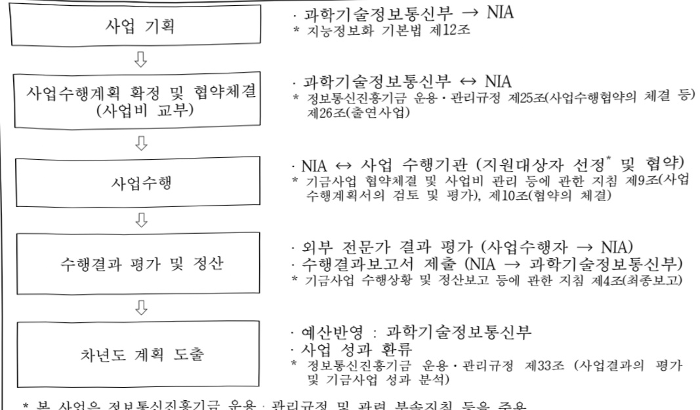

# AI기반 안전 관리분야 디지털 트윈 선도

**해당 페이지**: PDF 394 ~ 398 쪽 해당

**부처**: 과학기술정보통신부
**분야**: 기타
**회계유형**: 일반회계
**2026 확정예산**: 6000.0 백만원
**전년대비 증감률**: None%
**AI 도메인**: 건설/스마트시티

---

<table border=1 style='margin: auto; word-wrap: break-word;'><tr><td style='text-align: center; word-wrap: break-word;'>사 업 명</td></tr><tr><td style='text-align: center; word-wrap: break-word;'>(147) AI기반안전관리분야디지털트원선도 (2033-404)</td></tr></table>

사업 코드 정보

<table border=1 style='margin: auto; word-wrap: break-word;'><tr><td style='text-align: center; word-wrap: break-word;'>구분</td><td style='text-align: center; word-wrap: break-word;'>회계</td><td style='text-align: center; word-wrap: break-word;'>소관</td><td style='text-align: center; word-wrap: break-word;'>실국(기관)</td><td style='text-align: center; word-wrap: break-word;'>계정</td><td style='text-align: center; word-wrap: break-word;'>분야</td><td style='text-align: center; word-wrap: break-word;'>부문</td></tr><tr><td style='text-align: center; word-wrap: break-word;'>코드</td><td rowspan="2">일반회계</td><td rowspan="2">과학기술정보통신부</td><td rowspan="2">소프트웨어정책관</td><td rowspan="2"></td><td style='text-align: center; word-wrap: break-word;'>130</td><td style='text-align: center; word-wrap: break-word;'>133</td></tr><tr><td style='text-align: center; word-wrap: break-word;'>명칭</td><td style='text-align: center; word-wrap: break-word;'>기타</td><td style='text-align: center; word-wrap: break-word;'>공공질서·안전</td></tr></table>

<table border=1 style='margin: auto; word-wrap: break-word;'><tr><td style='text-align: center; word-wrap: break-word;'>구분</td><td style='text-align: center; word-wrap: break-word;'>프로그램</td><td style='text-align: center; word-wrap: break-word;'>단위사업</td><td style='text-align: center; word-wrap: break-word;'>세부사업</td></tr><tr><td style='text-align: center; word-wrap: break-word;'>코드</td><td style='text-align: center; word-wrap: break-word;'>2000</td><td style='text-align: center; word-wrap: break-word;'>2033</td><td style='text-align: center; word-wrap: break-word;'>404</td></tr><tr><td style='text-align: center; word-wrap: break-word;'>명칭</td><td style='text-align: center; word-wrap: break-word;'>인터넷융합사업</td><td style='text-align: center; word-wrap: break-word;'>스마트화산업기반확충(일반)</td><td style='text-align: center; word-wrap: break-word;'>AI기반안전관리분야 디지털트런선도</td></tr></table>

□ 사업 성격 (공통요구자료 II-1 작성유의사항 4. 참조, 해당하는 사항에 “○” 표시)

<table border=1 style='margin: auto; word-wrap: break-word;'><tr><td rowspan="2">신규</td><td rowspan="2">계속</td><td rowspan="2">완료</td><td rowspan="2">예비타당성 실시여부</td><td rowspan="2">총사업비 관리대상</td><td rowspan="2">총액계상 예산사업</td><td style='text-align: center; word-wrap: break-word;'>사업소관 변경정보</td></tr><tr><td style='text-align: center; word-wrap: break-word;'>2025예산 시 소관</td></tr><tr><td style='text-align: center; word-wrap: break-word;'>○</td><td style='text-align: center; word-wrap: break-word;'></td><td style='text-align: center; word-wrap: break-word;'></td><td style='text-align: center; word-wrap: break-word;'></td><td style='text-align: center; word-wrap: break-word;'></td><td style='text-align: center; word-wrap: break-word;'></td><td style='text-align: center; word-wrap: break-word;'></td></tr></table>

□ 사업 지원 형태 및 지원을 (최소한 한 개는 반드시 선택하시오. 해당사항에 O 표시)

<table border=1 style='margin: auto; word-wrap: break-word;'><tr><td style='text-align: center; word-wrap: break-word;'>직접</td><td style='text-align: center; word-wrap: break-word;'>출자</td><td style='text-align: center; word-wrap: break-word;'>출연</td><td style='text-align: center; word-wrap: break-word;'>보조</td><td style='text-align: center; word-wrap: break-word;'>융자</td><td style='text-align: center; word-wrap: break-word;'>국고보조율(%)</td><td style='text-align: center; word-wrap: break-word;'>융자율(%)</td></tr><tr><td style='text-align: center; word-wrap: break-word;'></td><td style='text-align: center; word-wrap: break-word;'></td><td style='text-align: center; word-wrap: break-word;'>○</td><td style='text-align: center; word-wrap: break-word;'></td><td style='text-align: center; word-wrap: break-word;'></td><td style='text-align: center; word-wrap: break-word;'></td><td style='text-align: center; word-wrap: break-word;'></td></tr></table>

## □ 사업 소관부처 및 시행주체

<table border=1 style='margin: auto; word-wrap: break-word;'><tr><td style='text-align: center; word-wrap: break-word;'>사업명</td><td colspan="2">구분</td></tr><tr><td rowspan="3">AI기반안전관리분야디지털 트렌선도</td><td rowspan="2">소관부처</td><td style='text-align: center; word-wrap: break-word;'>정보통신정책실소프트웨어정책관</td></tr><tr><td style='text-align: center; word-wrap: break-word;'>디지털콘텐츠과</td></tr><tr><td style='text-align: center; word-wrap: break-word;'>사업시행주체</td><td style='text-align: center; word-wrap: break-word;'>한국지능정보사회진흥원</td></tr></table>

---

### 가. 예산 총괄표

(단위: 백만원, %)

<table border=1 style='margin: auto; word-wrap: break-word;'><tr><td rowspan="2">사업명</td><td rowspan="2">2024년 결산</td><td colspan="2">2025년 예산</td><td colspan="2">2026년 예산</td><td rowspan="2">증감(B-A)</td><td rowspan="2">(B-A)/A</td></tr><tr><td style='text-align: center; word-wrap: break-word;'>본예산</td><td style='text-align: center; word-wrap: break-word;'>추경*(A)</td><td style='text-align: center; word-wrap: break-word;'>요구안</td><td style='text-align: center; word-wrap: break-word;'>본예산(B)</td></tr><tr><td style='text-align: center; word-wrap: break-word;'>AI기반안전관리분야디지털트렌션도</td><td style='text-align: center; word-wrap: break-word;'>-</td><td style='text-align: center; word-wrap: break-word;'>-</td><td style='text-align: center; word-wrap: break-word;'>-</td><td style='text-align: center; word-wrap: break-word;'>6,000</td><td style='text-align: center; word-wrap: break-word;'>6,000</td><td style='text-align: center; word-wrap: break-word;'>순증</td><td style='text-align: center; word-wrap: break-word;'>순증</td></tr></table>

□ 기능별(내역사업별) 예산 내역

(단위: 백만원)

<table border=1 style='margin: auto; word-wrap: break-word;'><tr><td rowspan="2"></td><td colspan="5">2024</td><td colspan="5">2025</td><td rowspan="2">2026 예산</td></tr><tr><td style='text-align: center; word-wrap: break-word;'>예산액(추정)</td><td style='text-align: center; word-wrap: break-word;'>예산현액</td><td style='text-align: center; word-wrap: break-word;'>집행액</td><td style='text-align: center; word-wrap: break-word;'>이월액</td><td style='text-align: center; word-wrap: break-word;'>불용액</td><td style='text-align: center; word-wrap: break-word;'>예산액(추정)</td><td style='text-align: center; word-wrap: break-word;'>예산현액</td><td style='text-align: center; word-wrap: break-word;'>집행액</td><td style='text-align: center; word-wrap: break-word;'>이월액</td><td style='text-align: center; word-wrap: break-word;'>불용액</td></tr><tr><td style='text-align: center; word-wrap: break-word;'>○ 기능별 분류(합계)</td><td style='text-align: center; word-wrap: break-word;'>-</td><td style='text-align: center; word-wrap: break-word;'>-</td><td style='text-align: center; word-wrap: break-word;'>-</td><td style='text-align: center; word-wrap: break-word;'>-</td><td style='text-align: center; word-wrap: break-word;'>-</td><td style='text-align: center; word-wrap: break-word;'>-</td><td style='text-align: center; word-wrap: break-word;'>-</td><td style='text-align: center; word-wrap: break-word;'>-</td><td style='text-align: center; word-wrap: break-word;'>-</td><td style='text-align: center; word-wrap: break-word;'>-</td><td style='text-align: center; word-wrap: break-word;'>-</td></tr><tr><td style='text-align: center; word-wrap: break-word;'>• AI기반안전관리 분야디지털트렌션도</td><td style='text-align: center; word-wrap: break-word;'>-</td><td style='text-align: center; word-wrap: break-word;'>-</td><td style='text-align: center; word-wrap: break-word;'>-</td><td style='text-align: center; word-wrap: break-word;'>-</td><td style='text-align: center; word-wrap: break-word;'>-</td><td style='text-align: center; word-wrap: break-word;'>-</td><td style='text-align: center; word-wrap: break-word;'>-</td><td style='text-align: center; word-wrap: break-word;'>-</td><td style='text-align: center; word-wrap: break-word;'>-</td><td style='text-align: center; word-wrap: break-word;'>-</td><td style='text-align: center; word-wrap: break-word;'>-</td></tr></table>

### 나. 사업설명자료

## 1 ) 사업목적·내용

- (AI기반안전관리분야디지털트런트) 국민 안전 제고를 위해 질병·생활·산업 안전 분야의 사전 예측·예방이 가능한 AI·디지털 트런트 서비스 개발·실증 지원

- 연실과 농기화된 가상환경에서 데이터 및 센싱값을 기반으로 예측, 시뮬레이션하여 위험 요소 사전 조치 및 통합 안전관리 체계 구축

## 2 ) 사업개요

## 사업근거 및 추진경위

- 지능정보화 기본법 제12조(한국지능정보사회진흥원의 설립)

- 지능정보화 기본법 제30조(지능정보서비스의 이용촉진)

- 지능정보화 기본법 제32조(선도사업의 추진과 지원)

- 정보통신산업 진흥법 제21조(정보통신망 응용서비스의 개발촉진 등)

- 정보통신 진흥 및 융합 활성화 등에 관한 특별법 제32조(정보통신 등 기술·서비스 개발 등의 지원)

---

## ② 추진경위

- 2023.1 : 국가안전시스템개편 중합대책 수립「디지털 플랫폼 기반 과학적 재난안전 관리 추진」(행정안전부)

- 2024.7 : 디지털 트런 코리아 전략 '3-2 국민 안전 강화' (디지털플랫폼정부위원회)

- 2025.8 : 이재명정부 국정운영 5개년 계획, ⌈(23) 안전과 책임 기반의 ‘AI 기본사회’ 실현」(국정운영위원회)

## 주요내용

① 사업규모

- 사업기간 : 2026년~계속

- 최근 5년 간 투입된 사업비(예산액기준, 추경편성한 연도에는 추경포함)

<table border=1 style='margin: auto; word-wrap: break-word;'><tr><td style='text-align: center; word-wrap: break-word;'>연도</td><td style='text-align: center; word-wrap: break-word;'>2022</td><td style='text-align: center; word-wrap: break-word;'>2023</td><td style='text-align: center; word-wrap: break-word;'>2024</td><td style='text-align: center; word-wrap: break-word;'>2025</td><td style='text-align: center; word-wrap: break-word;'>2026</td></tr><tr><td style='text-align: center; word-wrap: break-word;'>사업비</td><td style='text-align: center; word-wrap: break-word;'></td><td style='text-align: center; word-wrap: break-word;'></td><td style='text-align: center; word-wrap: break-word;'></td><td style='text-align: center; word-wrap: break-word;'></td><td style='text-align: center; word-wrap: break-word;'>6,000백만원</td></tr></table>

② 사업추진체계

- 사업시행방법 : 출연

- 사업시행주체 : 한국지능정보사회진흥원

- 사업 수혜자 : 지자체, 공공기관, 산업체 및 AI, 디지털 트런 기업 등

- 보조, 융자, 출연, 출자 등의 경우 보조·융자 등 지원 비율 및 법적근거

<table border=1 style='margin: auto; word-wrap: break-word;'><tr><td style='text-align: center; word-wrap: break-word;'>내역사업명</td><td style='text-align: center; word-wrap: break-word;'>구분</td><td style='text-align: center; word-wrap: break-word;'>피보조·피출연 등 기관명</td><td style='text-align: center; word-wrap: break-word;'>지원 금액 (2026예산)</td><td style='text-align: center; word-wrap: break-word;'>지원 비율(%)</td><td style='text-align: center; word-wrap: break-word;'>보조율 법적근거 (해당 조항)</td></tr><tr><td style='text-align: center; word-wrap: break-word;'>AI기반안전 관리분야 디지털트렌션도</td><td style='text-align: center; word-wrap: break-word;'>출연</td><td style='text-align: center; word-wrap: break-word;'>한국지능 정보사회 진흥원</td><td style='text-align: center; word-wrap: break-word;'>6,000</td><td style='text-align: center; word-wrap: break-word;'>100%</td><td style='text-align: center; word-wrap: break-word;'>지능정보화 기본법 제12조 8 국가기관등의 지능정보화 사업 추진 및 평가 지원</td></tr></table>

## 3 ) 2026년도 예산 산출 근거

① AI기반 안전관리 분야 디지털 트윈 선도

- (산출) 서비스당 1,000백만원 x 6개 서비스(질병·산업·생활안전 총 6개 과제)

*실증 사업 규모에 따라, 연간 10명 내외의 전문 인력 투입 기준 인건비·장비도입비 등을 고려하여 서비스당 단가 산출

---

## 4 ) 사업효과

☐ 사업영향, 산출물 성과지표 등

① 2022~2026년도 성과계획서 상 성과지표 및 최근 5년간 성과 달성도

<table border=1 style='margin: auto; word-wrap: break-word;'><tr><td style='text-align: center; word-wrap: break-word;'>성과지표</td><td style='text-align: center; word-wrap: break-word;'>구분</td><td style='text-align: center; word-wrap: break-word;'>2022</td><td style='text-align: center; word-wrap: break-word;'>2023</td><td style='text-align: center; word-wrap: break-word;'>2024</td><td style='text-align: center; word-wrap: break-word;'>2025</td><td style='text-align: center; word-wrap: break-word;'>2026</td><td style='text-align: center; word-wrap: break-word;'>2026 목표치산출근거</td><td style='text-align: center; word-wrap: break-word;'>측정산식(또는 측정방법)</td><td style='text-align: center; word-wrap: break-word;'>자료수집방법(또는 자료출처)</td></tr><tr><td rowspan="3">신규서비스발굴(단위: 건)</td><td style='text-align: center; word-wrap: break-word;'>목표</td><td style='text-align: center; word-wrap: break-word;'></td><td style='text-align: center; word-wrap: break-word;'></td><td style='text-align: center; word-wrap: break-word;'></td><td style='text-align: center; word-wrap: break-word;'></td><td style='text-align: center; word-wrap: break-word;'>6</td><td rowspan="3">3개 분야총 6건 구축</td><td rowspan="3">AI안전트원신규 서비스전체 개발 수</td><td rowspan="3">사업결과보고서</td></tr><tr><td style='text-align: center; word-wrap: break-word;'>실적</td><td style='text-align: center; word-wrap: break-word;'></td><td style='text-align: center; word-wrap: break-word;'></td><td style='text-align: center; word-wrap: break-word;'></td><td style='text-align: center; word-wrap: break-word;'></td><td style='text-align: center; word-wrap: break-word;'>-</td></tr><tr><td style='text-align: center; word-wrap: break-word;'>달성도</td><td style='text-align: center; word-wrap: break-word;'></td><td style='text-align: center; word-wrap: break-word;'></td><td style='text-align: center; word-wrap: break-word;'></td><td style='text-align: center; word-wrap: break-word;'></td><td style='text-align: center; word-wrap: break-word;'>-</td></tr></table>

② 성과지표 이외의 연도별 사업추진 경과 및 실적

·해당없음

③향후(2026년도 이후)기대효과

(질병안전) 가축·환경·인류 감염병 조기 탐지 및 확산 예측으로 방역 대응력 강화

(생활안전) 실시간 모니터링 기반 예측으로 안전사고 예방 및 안전 사각지대 해소

(산업안전) 현장 사고 예측·사전 경고 조치로 작업자 생명 보호 및 안전체계 마련

## 5 ) 타당성조사 및 예비타당성조사 시행여부 및 결과 요지

국가재정법 제38조 6. 「재난 및 안전관리기본법」 제3조제1호에 따른 재난(이하 "재난"이라 한다)복구 지원, 시설 안전성 확보, 보건 · 식품 안전 문제 등으로 시급한 추진이 필요한 사업으로 해당 없음

## 6 ) 총사업비 대상사업 정보

-해당없음

---

## 7 )사업 집행절차

·과학기술정보통신부 → NIA

*지능정보화기본법제12조

·과학기술정보통신부 ↔ NIA

* 정보통신진흥기금 운용·관리규정 제25조(사업수행협약의 체결 등) 제26조(출연사업)

·NIA ↔ 사업 수행기관 (지원대상자 선정 및 협약)

* 본 사업은 정보통신진흥기금 운용·관리규정 및 관련 부속지침 등을 준용

- AI기반 안전분야 관리 디지털 트런 선도 내역사업

<table border=1 style='margin: auto; word-wrap: break-word;'><tr><td style='text-align: center; word-wrap: break-word;'>부처</td><td style='text-align: center; word-wrap: break-word;'></td><td style='text-align: center; word-wrap: break-word;'>피출연·피보조기관</td><td style='text-align: center; word-wrap: break-word;'></td><td style='text-align: center; word-wrap: break-word;'>간접보조사업자·사업수행자</td></tr><tr><td style='text-align: center; word-wrap: break-word;'>과학기술정보통신부(6,000백만원)</td><td style='text-align: center; word-wrap: break-word;'>=&gt;(6,000백만원)</td><td style='text-align: center; word-wrap: break-word;'>한국지능정보사회진흥원(420백만원)</td><td style='text-align: center; word-wrap: break-word;'>=&gt;(5,580백만원)</td><td style='text-align: center; word-wrap: break-word;'>&#x27;26년 공모·선정사업 수행자</td></tr></table>

8) 각종 평가

1)국회(예결위, 상임위, 예정처, 국정감사 포함) 지적 : 해당없음

2) 대외공개 평가 : 해당없음

3) 자체평가 : 해당없음

### 다.최근 4년간 결산내역

## 1 ) 결산표

☐ 부처 결산내역 : 해당없음

## 2 ) 주요 결산사항

□2022~2025년 결산 주요사항:해당없음

□ 2025년 이·전용 등 세부내역 : 해당없음

---

### 원본 PDF 크롭 이미지

