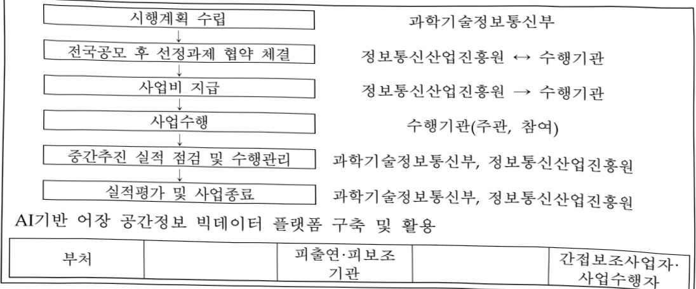

# AI기반 어장 공간정보 빅데이터 플랫폼 구축 및 활용

**해당 페이지**: PDF 399 ~ 404 쪽 해당

**부처**: 과학기술정보통신부
**분야**: 산업·중소기업 및 에너지
**회계유형**: 지역균형발전 특별회계
**2026 확정예산**: 2385.0 백만원
**전년대비 증감률**: -10.0%
**AI 도메인**: 데이터

---

### 가.예산 총괄표

(단위: 백만원, %)

<table border=1 style='margin: auto; word-wrap: break-word;'><tr><td rowspan="2">사업명</td><td rowspan="2">2024년 결산</td><td colspan="2">2025년 예산</td><td colspan="2">2026년 예산</td><td rowspan="2">중감(B-A)</td><td rowspan="2">(B-A)/A</td></tr><tr><td style='text-align: center; word-wrap: break-word;'>본예산</td><td style='text-align: center; word-wrap: break-word;'>추경(A)</td><td style='text-align: center; word-wrap: break-word;'>요구안</td><td style='text-align: center; word-wrap: break-word;'>본예산(B)</td></tr><tr><td style='text-align: center; word-wrap: break-word;'>AI기반 어장 공간정보 빅데이터 플랫폼 구축 및 활용</td><td style='text-align: center; word-wrap: break-word;'>3,500</td><td style='text-align: center; word-wrap: break-word;'>2,650</td><td style='text-align: center; word-wrap: break-word;'>2,650</td><td style='text-align: center; word-wrap: break-word;'>2,385</td><td style='text-align: center; word-wrap: break-word;'>2,385</td><td style='text-align: center; word-wrap: break-word;'>△265</td><td style='text-align: center; word-wrap: break-word;'>△10</td></tr></table>

□ 기능별(내역사업별) 예산 내역

(단위:백만원)

<table border=1 style='margin: auto; word-wrap: break-word;'><tr><td rowspan="2"></td><td colspan="5">2024</td><td colspan="5">2025</td><td rowspan="2">2026예산</td></tr><tr><td style='text-align: center; word-wrap: break-word;'>예산액(추경)</td><td style='text-align: center; word-wrap: break-word;'>예산현액</td><td style='text-align: center; word-wrap: break-word;'>집행액</td><td style='text-align: center; word-wrap: break-word;'>이월액</td><td style='text-align: center; word-wrap: break-word;'>불용액</td><td style='text-align: center; word-wrap: break-word;'>예산액(추경)</td><td style='text-align: center; word-wrap: break-word;'>예산현액</td><td style='text-align: center; word-wrap: break-word;'>집행액</td><td style='text-align: center; word-wrap: break-word;'>이월액</td><td style='text-align: center; word-wrap: break-word;'>불용액</td></tr><tr><td style='text-align: center; word-wrap: break-word;'>○ 기능별 분류(합계)</td><td style='text-align: center; word-wrap: break-word;'>3,500</td><td style='text-align: center; word-wrap: break-word;'>3,500</td><td style='text-align: center; word-wrap: break-word;'>3,500[3,497]</td><td style='text-align: center; word-wrap: break-word;'>-</td><td style='text-align: center; word-wrap: break-word;'>-</td><td style='text-align: center; word-wrap: break-word;'>2,650</td><td style='text-align: center; word-wrap: break-word;'>2,650</td><td style='text-align: center; word-wrap: break-word;'>2,650[2,638]</td><td style='text-align: center; word-wrap: break-word;'></td><td style='text-align: center; word-wrap: break-word;'></td><td style='text-align: center; word-wrap: break-word;'>-</td></tr><tr><td style='text-align: center; word-wrap: break-word;'>· AI기반 어장 공간정보 빅데이터 플랫폼 구축 및 활용</td><td style='text-align: center; word-wrap: break-word;'>3,500</td><td style='text-align: center; word-wrap: break-word;'>3,500</td><td style='text-align: center; word-wrap: break-word;'>3,500[3,497]</td><td style='text-align: center; word-wrap: break-word;'>-</td><td style='text-align: center; word-wrap: break-word;'>-</td><td style='text-align: center; word-wrap: break-word;'>2,650</td><td style='text-align: center; word-wrap: break-word;'>2,650</td><td style='text-align: center; word-wrap: break-word;'>2,650[2,638]</td><td style='text-align: center; word-wrap: break-word;'></td><td style='text-align: center; word-wrap: break-word;'></td><td style='text-align: center; word-wrap: break-word;'>-</td></tr></table>

### 나. 사업설명자료

## 1 ) 사업목적·내용

(사업목적) 수산양식 데이터의 통합과 분석·학습을 통한 데이터 플랫폼 구축 및 AI기반 생육 시뮬레이션, 의사결정지원 서비스 등 AI기반의 국내 수산양식산업의 디지털화 지원

(사업내용) 김·전복 등 국내 양식 산업 비중이 높은 품종을 대상으로 빅데이터 플랫폼 및 AI 서비스를 구축하고 해상양식 현장을 통해 실증 추진

## 2 ) 사업개요

□ 사업근거 및 추진경위

① 법령상 근거 조항 적시

- 지방자치분권 및 지역군형발전에 관한 특별법 제14조(지역 산업 육성 및 일자리 창출 등 지역경제 활성화 촉진) ④ 국가와 지방자치단체는 지역 산업의 육성과 지역경제의 활성화를 위하여 지역의 일자리 창출과 투자 유치활동 지원, 정보통신 진흥 및 지역 특성에 맞는 중소기업의 창업 여건 개선 등에 관한 시책을 추진하여야 한다.

---

○ 소프트웨어 진흥법 제8조(소프트웨어산업 진흥 전담기관 등) ① 과학기술정보통신부장관은 소프트웨어산업의 진흥·발전을 효율적으로 지원하기 위하여「정보통신산업 진흥법」 제26조에 따른 정보통신산업진흥원을 소프트웨어산업 진흥 전담기관으로 지정한다.

○소프트웨어 진흥법 제9조(지역별 소프트웨어산업 진흥) ① 과학기술정보통신부장관은 지역별 특성에 기반한 소프트웨어산업 진흥을 지원하고 지역 산업과의 융합을 촉진하여야 한다.

② 과학기술정보통신부장관은 제1항에 따른 업무를 효과적으로 시행하기 위하여 대통령령으로 정하는 요건을 갖춘 기관을 지역별 소프트웨어산업 진흥기관(이하 이 조에서 “지역산업진흥기관”이라 한다)으로 지정하여 업무를 위탁할 수 있다.

○ 정보통신산업 진흥법 제3조(국가 및 지방자치단체의 책무) ① 국가는 정보통신산업의 진흥에 필요한 종합적인 시책을 수립하여 시행하고 이에 필요한 재원확보 방안을 마련하여야 한다. ② 지방자치단체는 국가의 시책과 지역적 특성을 고려하여 정보통신기술을 기반으로 정보통신산업의 진흥에 필요한 시책을 마련하여야 한다.

0 정보통신산업 진흥법 제28조(재원 등) ① 정부는 예산 또는 기금의 범위에서 산업진흥원의 설립 및 운영에 필요한 경비의 전부 또는 일부를 출연하거나 보조할 수 있다.

② 추진경위

-지방 디지털 경쟁력 강화방안 발표(관계부처 합동, '23.10월)

2. 디지털 기반 지방 경제·사회 혁신

1 지방 먹거리 산업의 디지털 전환 가속화

(디지털 서비스 활용 촉진) 지방 제조현장, 농·축수산, 소상공인 등에 디지털 서비스 보급·확산 및 활용 역량 강화

- 이재명 정부 국정기획위원회 국민보고대회 123대 국정과제 발표('25.8월)

전략 1. AI 3대 강국도약

21. 세계에서 AI를 가장 잘쓰는 나라 구현

□ 주요내용

① 사업규모

- 총사업비(해당되는 경우에만 기재) : 해당없음

- 사업기간 : '24 ~ '28년(5년간)

- 최근 5년 간 투입된 사업비(예산액기준, 추경편성한 연도에는 추경포함)

<table border=1 style='margin: auto; word-wrap: break-word;'><tr><td style='text-align: center; word-wrap: break-word;'>$ \underline{\text{연도}} $</td><td style='text-align: center; word-wrap: break-word;'>2022</td><td style='text-align: center; word-wrap: break-word;'>2023</td><td style='text-align: center; word-wrap: break-word;'>2024</td><td style='text-align: center; word-wrap: break-word;'>2025</td><td style='text-align: center; word-wrap: break-word;'>2026</td></tr><tr><td style='text-align: center; word-wrap: break-word;'>사업비</td><td style='text-align: center; word-wrap: break-word;'>-</td><td style='text-align: center; word-wrap: break-word;'>-</td><td style='text-align: center; word-wrap: break-word;'>3,500</td><td style='text-align: center; word-wrap: break-word;'>2,650</td><td style='text-align: center; word-wrap: break-word;'>2,385</td></tr></table>

-기타:해당없음

② 사업추진체계

- 사업시행방법 : 출연

- 사업시행주체 : 정보통신사업진흥원

- 사업 수혜자 : 지역SW산업진흥기관, SW·ICT·해양수산 분야 중소기업,

대학·연구기관 컨소시엄

---

- 보조, 융자, 출연, 출자 등의 경우 보조·융자 등 지원 비율 및 법적근거

<table border=1 style='margin: auto; word-wrap: break-word;'><tr><td style='text-align: center; word-wrap: break-word;'>내역사업명</td><td style='text-align: center; word-wrap: break-word;'>구분</td><td style='text-align: center; word-wrap: break-word;'>피보조·피출연 등 기관명</td><td style='text-align: center; word-wrap: break-word;'>지원 금액 (2026예산)</td><td style='text-align: center; word-wrap: break-word;'>지원 비율(%)</td><td style='text-align: center; word-wrap: break-word;'>보조율 법적근거 (해당 조항)</td></tr><tr><td style='text-align: center; word-wrap: break-word;'>AI기반 어장 공간정보 빅데이터 플랫폼 구축 및 활용</td><td style='text-align: center; word-wrap: break-word;'>출연</td><td style='text-align: center; word-wrap: break-word;'>정보통신 산업진흥원</td><td style='text-align: center; word-wrap: break-word;'>2,385백만원</td><td style='text-align: center; word-wrap: break-word;'>100</td><td style='text-align: center; word-wrap: break-word;'>정보통신산업 진흥법 제28조(재원 등)</td></tr></table>

## 3 ) 2026년도 예산안 산출 근거

① AI기반 어장 공간정보 빅데이터 플랫폼 구축 및 활용

:(25)2,650백만원→(26요구)2,385백만원,△265백만원감액

- (요구) 수산양식 지능형 플랫폼, AI 예측 모델, 의사결정지원 시스템 개발 및 데이터 활용 응용 서비스의 본격 구현을 위한 AI기반 수산양식 플랫폼 개발·실증 지원 예산

- (산출) AI기반 어장 공간정보 빅데이터 플랫폼 구축 및 활용 지원 1개 지역 x 2,385백만원

ㅇ 2025년도 예산 및 2026년도 예산안 산출 세부내역 비교

<table border=1 style='margin: auto; word-wrap: break-word;'><tr><td colspan="2">&#x27;25년 예산</td><td colspan="2">&#x27;26년 예산</td></tr><tr><td style='text-align: center; word-wrap: break-word;'>예산</td><td style='text-align: center; word-wrap: break-word;'>산줄내역</td><td style='text-align: center; word-wrap: break-word;'>예산</td><td style='text-align: center; word-wrap: break-word;'>산줄내역</td></tr><tr><td rowspan="2">2,650 백만원</td><td style='text-align: center; word-wrap: break-word;'>○ 사업출연금(350-02) : 2,650백만원</td><td colspan="2">○ 사업출연금(350-02) : 2,385백만원</td></tr><tr><td style='text-align: center; word-wrap: break-word;'>가. AI기반 여장공간정보 빅데이터 플랫폼 구축 및 활용 (2,650백만원) • AI기반 여장공간정보 빅데이터 플랫폼 구축 및 활용 : 1개 지역 x 2,650백만원 = 2,650백만원</td><td style='text-align: center; word-wrap: break-word;'>2,385 백만원</td><td style='text-align: center; word-wrap: break-word;'>가. AI기반 여장공간정보 빅데이터 플랫폼 구축 및 활용 (2,385백만원) • AI기반 여장공간정보 빅데이터 플랫폼 구축 및 활용 : 1개 지역 x 2,385백만원 = 2,385백만원</td></tr></table>

## 4 ) 사업효과

☐ 사업영향, 산출물 성과지표 등

① 2022~2026년도 성과계획서 상 성과지표 및 최근 5년간 성과 달성도

<table border=1 style='margin: auto; word-wrap: break-word;'><tr><td style='text-align: center; word-wrap: break-word;'>성과지표</td><td style='text-align: center; word-wrap: break-word;'>구분</td><td style='text-align: center; word-wrap: break-word;'>2022</td><td style='text-align: center; word-wrap: break-word;'>2023</td><td style='text-align: center; word-wrap: break-word;'>2024</td><td style='text-align: center; word-wrap: break-word;'>2025</td><td style='text-align: center; word-wrap: break-word;'>2026</td><td style='text-align: center; word-wrap: break-word;'>2026 목표치산출근거</td><td style='text-align: center; word-wrap: break-word;'>측정산식(또는 측정방법)</td><td style='text-align: center; word-wrap: break-word;'>자료수집방법(또는 자료출처)</td></tr><tr><td rowspan="3">신규 고용실적(단위:명/10억원)</td><td style='text-align: center; word-wrap: break-word;'>목표</td><td style='text-align: center; word-wrap: break-word;'>-</td><td style='text-align: center; word-wrap: break-word;'>-</td><td style='text-align: center; word-wrap: break-word;'>8</td><td style='text-align: center; word-wrap: break-word;'>8.1</td><td style='text-align: center; word-wrap: break-word;'>8.2</td><td rowspan="3">SW산업의 고용위발계수(7.4) 보다 높은 초기목표(8명)를 도전적으로 설정하고 매년개선</td><td rowspan="3">수행기관의 직접고용인력수 / 정부지원예산 10억원</td><td rowspan="3">고용보험, 가입증명원, 결과보고서</td></tr><tr><td style='text-align: center; word-wrap: break-word;'>실적</td><td style='text-align: center; word-wrap: break-word;'>-</td><td style='text-align: center; word-wrap: break-word;'>-</td><td style='text-align: center; word-wrap: break-word;'>9.7</td><td style='text-align: center; word-wrap: break-word;'>8.1</td><td style='text-align: center; word-wrap: break-word;'></td></tr><tr><td style='text-align: center; word-wrap: break-word;'>달성도</td><td style='text-align: center; word-wrap: break-word;'>-</td><td style='text-align: center; word-wrap: break-word;'>-</td><td style='text-align: center; word-wrap: break-word;'>121%</td><td style='text-align: center; word-wrap: break-word;'>100%</td><td style='text-align: center; word-wrap: break-word;'></td></tr></table>

---

② 성과지표 이외의 연도별 사업추진 경과 및 실적

<table border=1 style='margin: auto; word-wrap: break-word;'><tr><td rowspan="2">2024</td><td style='text-align: center; word-wrap: break-word;'>&lt;AI기반 어장 공간정보 빅데이터 플랫폼 구축 및 활용 설계&gt;</td></tr><tr><td style='text-align: center; word-wrap: break-word;'>o 빅데이터 플랫폼 요구사항 분석·설계, 어장정보 데이터 분석, 수산양식 의사결정 지원 서비스를 위한 AI 모델 설계 등 어장 공간정보 빅데이터 플랫폼 구축을 위한 분석·설계 추진</td></tr><tr><td rowspan="2">2025</td><td style='text-align: center; word-wrap: break-word;'>&lt;AI기반 어장 공간정보 빅데이터 플랫폼 구축 및 활용 고도화&gt;</td></tr><tr><td style='text-align: center; word-wrap: break-word;'>o 빅데이터 플랫폼 요구사항 분석·설계, 어장정보 데이터 분석, 수산양식 의사결정 지원 서비스를 위한 AI 모델 설계 등 어장 공간정보 빅데이터 플랫폼 구축을 위한 분석·설계 추진 고도화 및 확산 등</td></tr></table>

③향후(2026년도 이후)기대효과

o 수산·양식산업의 디지털 전환 촉진, 수산양식 수리·환경 데이터 분석 서비스 등

새로운 비즈니스 모델, 창업 활성화로 인공지능 융합 생태계 확장

o 수산·양식 정보, 어장공간의 효율적 이용을 통한 생산량 증가, 위험예측, 조기

대응 통한 수산양식산업의 안정적 성장에 기여

## 5 ) 타당성조사 및 예비타당성조사 시행여부 및 결과 요지 : 해당없음

6) 총사업비 대상사업 여부 및 내역 : 해당없음

## 7 ) 사업 집행절차

---

<table border=1 style='margin: auto; word-wrap: break-word;'><tr><td style='text-align: center; word-wrap: break-word;'>과학기술정보통신부 (2,385백만원)</td><td style='text-align: center; word-wrap: break-word;'>=&gt; (2,385백만원)</td><td style='text-align: center; word-wrap: break-word;'>정보통신산업진흥원 (180백만원)</td><td style='text-align: center; word-wrap: break-word;'>=&gt; (2,205백만원)</td><td style='text-align: center; word-wrap: break-word;'>1개 지역SW산업 진흥기관 포함 전소시엄</td></tr></table>

## 8 ) 각종 평가

o '24년 지역균형발전사업 중합평가 : 80점(1차년도 사업 등급 미부여)

### 다. 최근 4년간 결산내역

## 1 ) 결산표

☐ 부처 결산내역

(단위: 백만원, %)

<table border=1 style='margin: auto; word-wrap: break-word;'><tr><td rowspan="2">연도</td><td colspan="3">예산액</td><td style='text-align: center; word-wrap: break-word;'>예산현액</td><td style='text-align: center; word-wrap: break-word;'>집행액</td><td style='text-align: center; word-wrap: break-word;'>집행률</td><td style='text-align: center; word-wrap: break-word;'>다음연도</td><td rowspan="2">불용액</td></tr><tr><td style='text-align: center; word-wrap: break-word;'>본예산</td><td style='text-align: center; word-wrap: break-word;'>추경 중감액</td><td style='text-align: center; word-wrap: break-word;'>추경</td><td style='text-align: center; word-wrap: break-word;'>(A)</td><td style='text-align: center; word-wrap: break-word;'>(B)</td><td style='text-align: center; word-wrap: break-word;'>(B/A)</td><td style='text-align: center; word-wrap: break-word;'>이월액</td></tr><tr><td style='text-align: center; word-wrap: break-word;'>2024</td><td style='text-align: center; word-wrap: break-word;'>3,500</td><td style='text-align: center; word-wrap: break-word;'>-</td><td style='text-align: center; word-wrap: break-word;'>3,500</td><td style='text-align: center; word-wrap: break-word;'>3,500</td><td style='text-align: center; word-wrap: break-word;'>3,500</td><td style='text-align: center; word-wrap: break-word;'>100</td><td style='text-align: center; word-wrap: break-word;'>-</td><td style='text-align: center; word-wrap: break-word;'>-</td></tr><tr><td style='text-align: center; word-wrap: break-word;'>2025</td><td style='text-align: center; word-wrap: break-word;'>2,650</td><td style='text-align: center; word-wrap: break-word;'>-</td><td style='text-align: center; word-wrap: break-word;'>2,650</td><td style='text-align: center; word-wrap: break-word;'>2,650</td><td style='text-align: center; word-wrap: break-word;'>2,650</td><td style='text-align: center; word-wrap: break-word;'>100</td><td style='text-align: center; word-wrap: break-word;'>-</td><td style='text-align: center; word-wrap: break-word;'>-</td></tr></table>

2) 주요 결산사항 : 해당없음

---

<table border=1 style='margin: auto; word-wrap: break-word;'><tr><td style='text-align: center; word-wrap: break-word;'>사 업 명</td></tr><tr><td style='text-align: center; word-wrap: break-word;'>(268) AI 기반 침해대응체계 구축(2332-323)</td></tr></table>

☐ 사업 코드 정보

<table border=1 style='margin: auto; word-wrap: break-word;'><tr><td style='text-align: center; word-wrap: break-word;'>구분</td><td style='text-align: center; word-wrap: break-word;'>회계</td><td style='text-align: center; word-wrap: break-word;'>소관</td><td style='text-align: center; word-wrap: break-word;'>실국(기관)</td><td style='text-align: center; word-wrap: break-word;'>계정</td><td style='text-align: center; word-wrap: break-word;'>분야</td><td style='text-align: center; word-wrap: break-word;'>부문</td></tr><tr><td style='text-align: center; word-wrap: break-word;'>코드</td><td rowspan="2">일반회계</td><td style='text-align: center; word-wrap: break-word;'>과학기술</td><td style='text-align: center; word-wrap: break-word;'>정보보호</td><td rowspan="2"></td><td style='text-align: center; word-wrap: break-word;'>130</td><td style='text-align: center; word-wrap: break-word;'>133</td></tr><tr><td style='text-align: center; word-wrap: break-word;'>명칭</td><td style='text-align: center; word-wrap: break-word;'>정보통신부</td><td style='text-align: center; word-wrap: break-word;'>네트워크정책실</td><td style='text-align: center; word-wrap: break-word;'>통신</td><td style='text-align: center; word-wrap: break-word;'>정보통신</td></tr></table>

<table border=1 style='margin: auto; word-wrap: break-word;'><tr><td style='text-align: center; word-wrap: break-word;'>구분</td><td style='text-align: center; word-wrap: break-word;'>프로그램</td><td style='text-align: center; word-wrap: break-word;'>단위사업</td><td style='text-align: center; word-wrap: break-word;'>세부사업</td></tr><tr><td style='text-align: center; word-wrap: break-word;'>코드</td><td style='text-align: center; word-wrap: break-word;'>2300</td><td style='text-align: center; word-wrap: break-word;'>2332</td><td style='text-align: center; word-wrap: break-word;'>324</td></tr><tr><td style='text-align: center; word-wrap: break-word;'>명칭</td><td style='text-align: center; word-wrap: break-word;'>정보보호및활용</td><td style='text-align: center; word-wrap: break-word;'>정보보안대응체계구축</td><td style='text-align: center; word-wrap: break-word;'>AI 기반 침해대응체계 구축</td></tr></table>

<table border=1 style='margin: auto; word-wrap: break-word;'><tr><td colspan="6">☐ 사업 성격 (공통요구자료 II-1 작성유의사항 4. 참조, 해당하는 사항에 “○” 표시)</td></tr><tr><td style='text-align: center; word-wrap: break-word;'>신규 계속</td><td style='text-align: center; word-wrap: break-word;'>완료</td><td style='text-align: center; word-wrap: break-word;'>예비타당성 실시여부</td><td style='text-align: center; word-wrap: break-word;'>총사업비 관리대상</td><td style='text-align: center; word-wrap: break-word;'>총액계상 예산사업</td><td style='text-align: center; word-wrap: break-word;'>사업소관 변경정보 2025예산 시 소관</td></tr><tr><td style='text-align: center; word-wrap: break-word;'></td><td style='text-align: center; word-wrap: break-word;'>○</td><td style='text-align: center; word-wrap: break-word;'></td><td style='text-align: center; word-wrap: break-word;'></td><td style='text-align: center; word-wrap: break-word;'></td><td style='text-align: center; word-wrap: break-word;'></td></tr></table>

사업지원형태 및 지원을(최소한 한 개는 반드시 선택하시오. 해당사항에 O 표시)

<table border=1 style='margin: auto; word-wrap: break-word;'><tr><td style='text-align: center; word-wrap: break-word;'>직접</td><td style='text-align: center; word-wrap: break-word;'>출자</td><td style='text-align: center; word-wrap: break-word;'>출연</td><td style='text-align: center; word-wrap: break-word;'>보조</td><td style='text-align: center; word-wrap: break-word;'>융자</td><td style='text-align: center; word-wrap: break-word;'>국고보조율(%)</td><td style='text-align: center; word-wrap: break-word;'>융자율(%)</td></tr><tr><td style='text-align: center; word-wrap: break-word;'></td><td style='text-align: center; word-wrap: break-word;'></td><td style='text-align: center; word-wrap: break-word;'>0</td><td style='text-align: center; word-wrap: break-word;'></td><td style='text-align: center; word-wrap: break-word;'></td><td style='text-align: center; word-wrap: break-word;'></td><td style='text-align: center; word-wrap: break-word;'></td></tr></table>

## 사업 소관부처 및 시행주체

<table border=1 style='margin: auto; word-wrap: break-word;'><tr><td style='text-align: center; word-wrap: break-word;'>사업명</td><td colspan="2">구분</td></tr><tr><td rowspan="2">AI 기반 침해대응체계 구축</td><td style='text-align: center; word-wrap: break-word;'>소관부처</td><td style='text-align: center; word-wrap: break-word;'>정보보호네트워크정책실 정보보호네트워크정책관 사이버침해조사팀</td></tr><tr><td style='text-align: center; word-wrap: break-word;'>사업시행주체</td><td style='text-align: center; word-wrap: break-word;'>한국인터넷진흥원</td></tr></table>

---

### 원본 PDF 크롭 이미지

