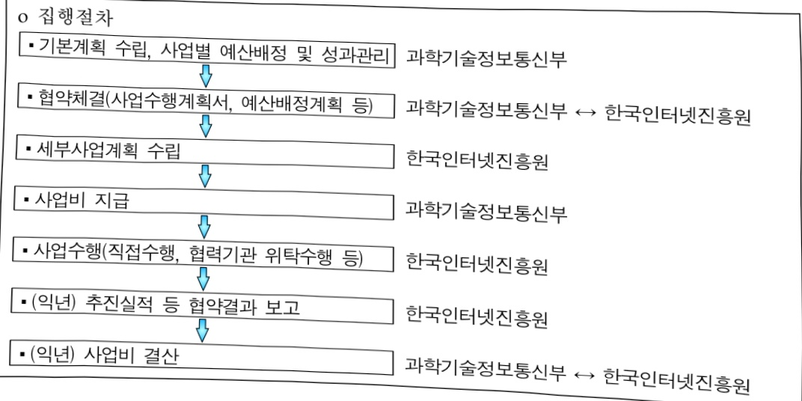

# AI기반 침해대응체계 구축(C-Brain)

**해당 페이지**: PDF 405 ~ 409 쪽 해당

**부처**: 과학기술정보통신부
**분야**: 통신
**회계유형**: 일반회계
**2026 확정예산**: 15000.0 백만원
**전년대비 증감률**: 200.0%
**AI 도메인**: LLM/언어모델, 보안/사이버

---

<table border=1 style='margin: auto; word-wrap: break-word;'><tr><td style='text-align: center; word-wrap: break-word;'>사 업 명</td></tr><tr><td style='text-align: center; word-wrap: break-word;'>(268) AI 기반 침해대응체계 구축(2332-323)</td></tr></table>

☐ 사업 코드 정보

<table border=1 style='margin: auto; word-wrap: break-word;'><tr><td style='text-align: center; word-wrap: break-word;'>구분</td><td style='text-align: center; word-wrap: break-word;'>회계</td><td style='text-align: center; word-wrap: break-word;'>소관</td><td style='text-align: center; word-wrap: break-word;'>실국(기관)</td><td style='text-align: center; word-wrap: break-word;'>계정</td><td style='text-align: center; word-wrap: break-word;'>분야</td><td style='text-align: center; word-wrap: break-word;'>부문</td></tr><tr><td style='text-align: center; word-wrap: break-word;'>코드</td><td rowspan="2">일반회계</td><td style='text-align: center; word-wrap: break-word;'>과학기술</td><td style='text-align: center; word-wrap: break-word;'>정보보호</td><td rowspan="2"></td><td style='text-align: center; word-wrap: break-word;'>130</td><td style='text-align: center; word-wrap: break-word;'>133</td></tr><tr><td style='text-align: center; word-wrap: break-word;'>명칭</td><td style='text-align: center; word-wrap: break-word;'>정보통신부</td><td style='text-align: center; word-wrap: break-word;'>네트워크정책실</td><td style='text-align: center; word-wrap: break-word;'>통신</td><td style='text-align: center; word-wrap: break-word;'>정보통신</td></tr></table>

<table border=1 style='margin: auto; word-wrap: break-word;'><tr><td style='text-align: center; word-wrap: break-word;'>구분</td><td style='text-align: center; word-wrap: break-word;'>프로그램</td><td style='text-align: center; word-wrap: break-word;'>단위사업</td><td style='text-align: center; word-wrap: break-word;'>세부사업</td></tr><tr><td style='text-align: center; word-wrap: break-word;'>코드</td><td style='text-align: center; word-wrap: break-word;'>2300</td><td style='text-align: center; word-wrap: break-word;'>2332</td><td style='text-align: center; word-wrap: break-word;'>324</td></tr><tr><td style='text-align: center; word-wrap: break-word;'>명칭</td><td style='text-align: center; word-wrap: break-word;'>정보보호및활용</td><td style='text-align: center; word-wrap: break-word;'>정보보안대응체계구축</td><td style='text-align: center; word-wrap: break-word;'>AI 기반 침해대응체계 구축</td></tr></table>

<table border=1 style='margin: auto; word-wrap: break-word;'><tr><td colspan="6">☐ 사업 성격 (공통요구자료 II-1 작성유의사항 4. 참조, 해당하는 사항에 “○” 표시)</td></tr><tr><td style='text-align: center; word-wrap: break-word;'>신규 계속</td><td style='text-align: center; word-wrap: break-word;'>완료</td><td style='text-align: center; word-wrap: break-word;'>예비타당성 실시여부</td><td style='text-align: center; word-wrap: break-word;'>총사업비 관리대상</td><td style='text-align: center; word-wrap: break-word;'>총액계상 예산사업</td><td style='text-align: center; word-wrap: break-word;'>사업소관 변경정보 2025예산 시 소관</td></tr><tr><td style='text-align: center; word-wrap: break-word;'></td><td style='text-align: center; word-wrap: break-word;'>○</td><td style='text-align: center; word-wrap: break-word;'></td><td style='text-align: center; word-wrap: break-word;'></td><td style='text-align: center; word-wrap: break-word;'></td><td style='text-align: center; word-wrap: break-word;'></td></tr></table>

사업지원형태 및 지원을(최소한 한 개는 반드시 선택하시오. 해당사항에 O 표시)

<table border=1 style='margin: auto; word-wrap: break-word;'><tr><td style='text-align: center; word-wrap: break-word;'>직접</td><td style='text-align: center; word-wrap: break-word;'>출자</td><td style='text-align: center; word-wrap: break-word;'>출연</td><td style='text-align: center; word-wrap: break-word;'>보조</td><td style='text-align: center; word-wrap: break-word;'>융자</td><td style='text-align: center; word-wrap: break-word;'>국고보조율(%)</td><td style='text-align: center; word-wrap: break-word;'>융자율(%)</td></tr><tr><td style='text-align: center; word-wrap: break-word;'></td><td style='text-align: center; word-wrap: break-word;'></td><td style='text-align: center; word-wrap: break-word;'>0</td><td style='text-align: center; word-wrap: break-word;'></td><td style='text-align: center; word-wrap: break-word;'></td><td style='text-align: center; word-wrap: break-word;'></td><td style='text-align: center; word-wrap: break-word;'></td></tr></table>

## 사업 소관부처 및 시행주체

<table border=1 style='margin: auto; word-wrap: break-word;'><tr><td style='text-align: center; word-wrap: break-word;'>사업명</td><td colspan="2">구분</td></tr><tr><td rowspan="2">AI 기반 침해대응체계 구축</td><td style='text-align: center; word-wrap: break-word;'>소관부처</td><td style='text-align: center; word-wrap: break-word;'>정보보호네트워크정책실 정보보호네트워크정책관 사이버침해조사팀</td></tr><tr><td style='text-align: center; word-wrap: break-word;'>사업시행주체</td><td style='text-align: center; word-wrap: break-word;'>한국인터넷진흥원</td></tr></table>

---

### 가.예산 총괄표

(단위: 백만원, %)

<table border=1 style='margin: auto; word-wrap: break-word;'><tr><td rowspan="2">사업명</td><td rowspan="2">2024년 결산</td><td colspan="2">2025년 예산</td><td colspan="2">2026년 예산</td><td rowspan="2">증감(B-A)</td><td rowspan="2">(B-A)/A</td></tr><tr><td style='text-align: center; word-wrap: break-word;'>본예산</td><td style='text-align: center; word-wrap: break-word;'>추경*(A)</td><td style='text-align: center; word-wrap: break-word;'>요구안</td><td style='text-align: center; word-wrap: break-word;'>본예산(B)</td></tr><tr><td style='text-align: center; word-wrap: break-word;'>AI 기반 침해대응체계 구축</td><td style='text-align: center; word-wrap: break-word;'>-</td><td style='text-align: center; word-wrap: break-word;'>-</td><td style='text-align: center; word-wrap: break-word;'>5,000</td><td style='text-align: center; word-wrap: break-word;'>15,000</td><td style='text-align: center; word-wrap: break-word;'>15,000</td><td style='text-align: center; word-wrap: break-word;'>10,000</td><td style='text-align: center; word-wrap: break-word;'>200</td></tr></table>

*추경: 추경증감액을 포함한 최종 예산액을 기재

## □ 기능별(내역사업별) 예산 내역

(단위:백만원)

<table border=1 style='margin: auto; word-wrap: break-word;'><tr><td rowspan="2"></td><td colspan="5">2024</td><td colspan="5">2025</td><td rowspan="2">2026 倉塗</td></tr><tr><td style='text-align: center; word-wrap: break-word;'>倉塗効 (専倉)</td><td style='text-align: center; word-wrap: break-word;'>倉塗効</td><td style='text-align: center; word-wrap: break-word;'>倉塗効</td><td style='text-align: center; word-wrap: break-word;'>倉塗効</td><td style='text-align: center; word-wrap: break-word;'>倉塗効</td><td style='text-align: center; word-wrap: break-word;'>倉塗効</td><td style='text-align: center; word-wrap: break-word;'>倉塗効</td><td style='text-align: center; word-wrap: break-word;'>倉塗効</td><td style='text-align: center; word-wrap: break-word;'>倉塗効</td><td style='text-align: center; word-wrap: break-word;'>倉塗効</td></tr><tr><td style='text-align: center; word-wrap: break-word;'>○ 기능별 분류(합계)</td><td style='text-align: center; word-wrap: break-word;'>-</td><td style='text-align: center; word-wrap: break-word;'>-</td><td style='text-align: center; word-wrap: break-word;'>-</td><td style='text-align: center; word-wrap: break-word;'>-</td><td style='text-align: center; word-wrap: break-word;'>-</td><td style='text-align: center; word-wrap: break-word;'>5,000</td><td style='text-align: center; word-wrap: break-word;'>5,000</td><td style='text-align: center; word-wrap: break-word;'>5,000</td><td style='text-align: center; word-wrap: break-word;'>-</td><td style='text-align: center; word-wrap: break-word;'>-</td><td style='text-align: center; word-wrap: break-word;'>15,000</td></tr><tr><td style='text-align: center; word-wrap: break-word;'>• AI 기반 집해대응체계 구축·운영</td><td style='text-align: center; word-wrap: break-word;'>-</td><td style='text-align: center; word-wrap: break-word;'>-</td><td style='text-align: center; word-wrap: break-word;'>-</td><td style='text-align: center; word-wrap: break-word;'>-</td><td style='text-align: center; word-wrap: break-word;'>-</td><td style='text-align: center; word-wrap: break-word;'>5,000</td><td style='text-align: center; word-wrap: break-word;'>5,000</td><td style='text-align: center; word-wrap: break-word;'>5,000</td><td style='text-align: center; word-wrap: break-word;'>-</td><td style='text-align: center; word-wrap: break-word;'>-</td><td style='text-align: center; word-wrap: break-word;'>15,000</td></tr></table>

### 나.사업설명자료

## 1 ) 사업목적·내용

0 정보통신분야 침해사고 대응 업무절차에 생성형 AI를 도입하여 사고대응 프로세스를 최적화·자동화함으로써 사고분석·대응 시간 단축 및 국민 피해 최소화

- (AI 기반 침해대응체계 구축·운영) 침해사고 신속 대응 및 분석 자동화를 위해 생성형 AI기반 침해대응체계(C-Brain) 구축·운영

## 2 ) 사업개요

## ☐ 사업근거 및 추진경위

① 법령상 근거 및 조항 적시 : 정보통신망 이용촉진 및 정보보호 등에 관한 법률 제48조의2(침해사고의 대응 등), 제48조의3(침해사고의 신고 등), 제48조의4(침해사고의 원인분석 등), 제48조의5(정보통신망연결기기등 관련 침해사고의 대응 등), 제52조(한국인터넷진흥원)

---

## ② 추진경위

- 침해사고 지속적으로 증가하는 가운데 AI 기술을 악용한 지능화·자동화된 사이버 공격이 확산됨에 따라, 침해사고 증가에 대비한 대응체계 강화 필요

- SKT 침해사고 원인분석 결과 및 조치방안(과기정통부, '25.7월)

-「KT, LGU+ 침해사고 원인분석 결과 및 조치방안」(과기정통부, '25.12월)

- 이재명 정부 공약(1-3-15) 사이버 위협으로부터 안전한 나라를 만들겠습니다.

- 국정과제 23. 국민의 안전과 보편적 삶의 질 제고를 위한 'AI 기본사회' 실현

## 주요내용

① 사업규모 : 해당 없음

② 사업추진체계

- 사업시행방법 : 출연

- 사업시행주체 : 한국인터넷진흥원

- 사업 수혜자 : 정보통신서비스 제공자 및 이용자(일반국민)

- 보조, 융자, 출연, 출자 등의 경우 보조·융자 등 지원 비율 및 법적근거

<table border=1 style='margin: auto; word-wrap: break-word;'><tr><td style='text-align: center; word-wrap: break-word;'>내역사업명</td><td style='text-align: center; word-wrap: break-word;'>구분</td><td style='text-align: center; word-wrap: break-word;'>피보조·피출연 등 기관명</td><td style='text-align: center; word-wrap: break-word;'>지원 금액 (2026예산)</td><td style='text-align: center; word-wrap: break-word;'>지원 비율(%)</td><td style='text-align: center; word-wrap: break-word;'>보조율 법적근거 (해당 조항)</td></tr><tr><td style='text-align: center; word-wrap: break-word;'>AI 기반 침해대응체계 구축·운영</td><td style='text-align: center; word-wrap: break-word;'>출연</td><td style='text-align: center; word-wrap: break-word;'>한국인터넷 진흥원</td><td style='text-align: center; word-wrap: break-word;'>15,000</td><td style='text-align: center; word-wrap: break-word;'>100</td><td style='text-align: center; word-wrap: break-word;'>정보통신망 이용촉진 및 정보보호 등에 관한 법률 제48조의2(침해사고의 대응 등), 제48조의3(침해사고의 신고 등), 제48조의4(침해사고의 원인분석 등), 제48조의5(정보통신망연결기기등 관련 침해사고의 대응 등), 제52조(한국인터넷진흥원)</td></tr></table>

## 3 ) 2026년도 예산 산출 근거

(내역사업) AI 기반 침해대응체계 구축·운영(침해대응 특화 모델 개발, 운영 인프라 구성 등) 15,000백만원

## 4 ) 사업효과

사업영향, 산출물 성과지표 등

---

①2022~2026년도 성과계획서 상 성과지표 및 최근 5년간 성과 달성도

<table border=1 style='margin: auto; word-wrap: break-word;'><tr><td style='text-align: center; word-wrap: break-word;'>성과지표</td><td style='text-align: center; word-wrap: break-word;'>구분</td><td style='text-align: center; word-wrap: break-word;'>2022</td><td style='text-align: center; word-wrap: break-word;'>2023</td><td style='text-align: center; word-wrap: break-word;'>2024</td><td style='text-align: center; word-wrap: break-word;'>2025</td><td style='text-align: center; word-wrap: break-word;'>2026</td><td style='text-align: center; word-wrap: break-word;'>2026 목표치산출근거</td><td style='text-align: center; word-wrap: break-word;'>측정산식(또는 측정방법)</td><td style='text-align: center; word-wrap: break-word;'>자료수집방법(또는 자료출처)</td></tr><tr><td rowspan="3">AI 기반침해대응 정보처리·분석정확도(단위: %)</td><td style='text-align: center; word-wrap: break-word;'>목표</td><td style='text-align: center; word-wrap: break-word;'>-</td><td style='text-align: center; word-wrap: break-word;'>-</td><td style='text-align: center; word-wrap: break-word;'>-</td><td style='text-align: center; word-wrap: break-word;'>70</td><td style='text-align: center; word-wrap: break-word;'>75</td><td rowspan="3">추진사업실증에 따른목표치 산출</td><td rowspan="3">AI 기반 침해대응정보 처리분석정보 건수/AI 기반침해대응 처리분석총 건수 × 100</td><td rowspan="3">한국인터넷진흥원(AI 기반침해대응체계 플랫폼)</td></tr><tr><td style='text-align: center; word-wrap: break-word;'>실적</td><td style='text-align: center; word-wrap: break-word;'>-</td><td style='text-align: center; word-wrap: break-word;'>-</td><td style='text-align: center; word-wrap: break-word;'>-</td><td style='text-align: center; word-wrap: break-word;'>73</td><td style='text-align: center; word-wrap: break-word;'>-</td></tr><tr><td style='text-align: center; word-wrap: break-word;'>달성도</td><td style='text-align: center; word-wrap: break-word;'>-</td><td style='text-align: center; word-wrap: break-word;'>-</td><td style='text-align: center; word-wrap: break-word;'>-</td><td style='text-align: center; word-wrap: break-word;'>104</td><td style='text-align: center; word-wrap: break-word;'>-</td></tr></table>

※ 2025년 2차 추경 반영 신규사업

② 성과지표 이외의 연도별 사업추진 경과 및 실적

<table border=1 style='margin: auto; word-wrap: break-word;'><tr><td style='text-align: center; word-wrap: break-word;'>2022</td><td style='text-align: center; word-wrap: break-word;'>ㅇ 해당 없음</td></tr><tr><td style='text-align: center; word-wrap: break-word;'>2023</td><td style='text-align: center; word-wrap: break-word;'>ㅇ 해당 없음</td></tr><tr><td style='text-align: center; word-wrap: break-word;'>2024</td><td style='text-align: center; word-wrap: break-word;'>ㅇ 해당 없음</td></tr><tr><td style='text-align: center; word-wrap: break-word;'>2025</td><td style='text-align: center; word-wrap: break-word;'>ㅇ AI 기반 침해대응체계(C-Brain) 구축 마스터플랜 수립
ㅇ AI 기반 침해대응체계(C-Brain) 초기 모델 설계 및 실효성 검증</td></tr></table>

③향후(2026년도 이후)기대효과

- 사이버 침해대응 업무절차에 생성형 AI를 도입하여 증가하는 사고에 보다 신속하고,

정확하며, 신뢰성 있는 사고 대응체계 마련

5) 타당성조사 및 예비타당성조사 시행여부 및 결과 요지 : 해당 없음

6) 총사업비 대상사업 정보 : 해당 없음

7) 사업 집행절차

---

- AI 기반 침해대응체계 구축·운영

<table border=1 style='margin: auto; word-wrap: break-word;'><tr><td style='text-align: center; word-wrap: break-word;'>부처</td><td style='text-align: center; word-wrap: break-word;'></td><td style='text-align: center; word-wrap: break-word;'>피출연·피보조기관</td><td style='text-align: center; word-wrap: break-word;'></td><td style='text-align: center; word-wrap: break-word;'>간접보조사업자·사업수행자</td></tr><tr><td style='text-align: center; word-wrap: break-word;'>과학기술정보통신부(15,000백만원)</td><td style='text-align: center; word-wrap: break-word;'>=&gt;(15,000백만원)</td><td style='text-align: center; word-wrap: break-word;'>한국인터넷진흥원(15,000백만원)</td><td style='text-align: center; word-wrap: break-word;'>-</td><td style='text-align: center; word-wrap: break-word;'>-</td></tr></table>

8) 각종 평가 : 해당 없음

### 다. 최근 4년간 결산내역

1) 결산표

☐ 부처 결산내역

(단위: 백만원, %)

<table border=1 style='margin: auto; word-wrap: break-word;'><tr><td rowspan="2">闰도</td><td colspan="3">예산액</td><td rowspan="2">예산현액(A)</td><td rowspan="2">집행액(B)</td><td rowspan="2">집행률(B/A)</td><td rowspan="2">다음연도이월액</td><td rowspan="2">불용액</td></tr><tr><td style='text-align: center; word-wrap: break-word;'>본예산</td><td style='text-align: center; word-wrap: break-word;'>추경증감액</td><td style='text-align: center; word-wrap: break-word;'>추경</td></tr><tr><td style='text-align: center; word-wrap: break-word;'>2022</td><td style='text-align: center; word-wrap: break-word;'>-</td><td style='text-align: center; word-wrap: break-word;'>-</td><td style='text-align: center; word-wrap: break-word;'>-</td><td style='text-align: center; word-wrap: break-word;'>-</td><td style='text-align: center; word-wrap: break-word;'>-</td><td style='text-align: center; word-wrap: break-word;'>-</td><td style='text-align: center; word-wrap: break-word;'>-</td><td style='text-align: center; word-wrap: break-word;'>-</td></tr><tr><td style='text-align: center; word-wrap: break-word;'>2023</td><td style='text-align: center; word-wrap: break-word;'>-</td><td style='text-align: center; word-wrap: break-word;'>-</td><td style='text-align: center; word-wrap: break-word;'>-</td><td style='text-align: center; word-wrap: break-word;'>-</td><td style='text-align: center; word-wrap: break-word;'>-</td><td style='text-align: center; word-wrap: break-word;'>-</td><td style='text-align: center; word-wrap: break-word;'>-</td><td style='text-align: center; word-wrap: break-word;'>-</td></tr><tr><td style='text-align: center; word-wrap: break-word;'>2024</td><td style='text-align: center; word-wrap: break-word;'>-</td><td style='text-align: center; word-wrap: break-word;'>-</td><td style='text-align: center; word-wrap: break-word;'>-</td><td style='text-align: center; word-wrap: break-word;'>-</td><td style='text-align: center; word-wrap: break-word;'>-</td><td style='text-align: center; word-wrap: break-word;'>-</td><td style='text-align: center; word-wrap: break-word;'>-</td><td style='text-align: center; word-wrap: break-word;'>-</td></tr><tr><td style='text-align: center; word-wrap: break-word;'>2025</td><td style='text-align: center; word-wrap: break-word;'>-</td><td style='text-align: center; word-wrap: break-word;'>5,000</td><td style='text-align: center; word-wrap: break-word;'>5,000</td><td style='text-align: center; word-wrap: break-word;'>5,000</td><td style='text-align: center; word-wrap: break-word;'>5,000</td><td style='text-align: center; word-wrap: break-word;'>100</td><td style='text-align: center; word-wrap: break-word;'>-</td><td style='text-align: center; word-wrap: break-word;'>-</td></tr></table>

## 2 ) 주요 결산사항

□ 2022~2025년 결산 주요사항

<table border=1 style='margin: auto; word-wrap: break-word;'><tr><td style='text-align: center; word-wrap: break-word;'>2022</td><td style='text-align: center; word-wrap: break-word;'>- 해당 없음</td></tr><tr><td style='text-align: center; word-wrap: break-word;'>2023</td><td style='text-align: center; word-wrap: break-word;'>- 해당 없음</td></tr><tr><td style='text-align: center; word-wrap: break-word;'>2024</td><td style='text-align: center; word-wrap: break-word;'>- 해당 없음</td></tr><tr><td style='text-align: center; word-wrap: break-word;'>2025</td><td style='text-align: center; word-wrap: break-word;'>- 추경 편성 사유 · 증가하는 침해사고 대비 신속·정확한 대응을 위해 침해대응 시스템에 AI 도입 요구 반영</td></tr></table>

□ 2025년 이·전용 등 세부내역 : 해당 없음

---

### 원본 PDF 크롭 이미지

