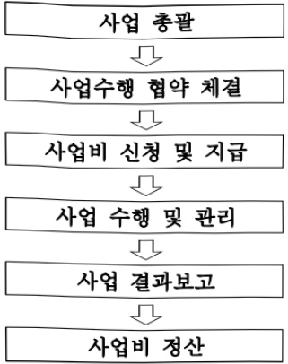

# AI기반가상융합산업육성

**해당 페이지**: PDF 410 ~ 416 쪽 해당

**부처**: 과학기술정보통신부
**분야**: 통신
**회계유형**: 기금
**2026 확정예산**: 4500.0 백만원
**전년대비 증감률**: 100.0%
**AI 도메인**: 문화/콘텐츠

---

### 가.지출계획 총괄표

(단위: 백만원, %)

<table border=1 style='margin: auto; word-wrap: break-word;'><tr><td rowspan="2">사업명</td><td rowspan="2">2024년 결산</td><td colspan="2">2025년 예산</td><td colspan="2">2026년 예산</td><td rowspan="2">증감(B-A)</td><td rowspan="2">(B-A)/A</td></tr><tr><td style='text-align: center; word-wrap: break-word;'>본예산</td><td style='text-align: center; word-wrap: break-word;'>추경*(A)</td><td style='text-align: center; word-wrap: break-word;'>요구안</td><td style='text-align: center; word-wrap: break-word;'>본예산(B)</td></tr><tr><td style='text-align: center; word-wrap: break-word;'>AI기반가상용합산업육성</td><td style='text-align: center; word-wrap: break-word;'>-</td><td style='text-align: center; word-wrap: break-word;'>-</td><td style='text-align: center; word-wrap: break-word;'>-</td><td style='text-align: center; word-wrap: break-word;'>4,500</td><td style='text-align: center; word-wrap: break-word;'>4,500</td><td style='text-align: center; word-wrap: break-word;'>4,500</td><td style='text-align: center; word-wrap: break-word;'>100</td></tr></table>

* 추경: 추경증감액을 포함한 최종 예산액을 기재

□ 기능별(내역사업별) 계획 내역

(단위:백만원)

<table border=1 style='margin: auto; word-wrap: break-word;'><tr><td rowspan="2"></td><td colspan="5">2024</td><td colspan="5">2025</td><td rowspan="2">2026 계획</td></tr><tr><td style='text-align: center; word-wrap: break-word;'>계획액(추경)</td><td style='text-align: center; word-wrap: break-word;'>계획현액</td><td style='text-align: center; word-wrap: break-word;'>집행액</td><td style='text-align: center; word-wrap: break-word;'>이월액</td><td style='text-align: center; word-wrap: break-word;'>불용액</td><td style='text-align: center; word-wrap: break-word;'>계획액(추경)</td><td style='text-align: center; word-wrap: break-word;'>계획현액</td><td style='text-align: center; word-wrap: break-word;'>집행액</td><td style='text-align: center; word-wrap: break-word;'>이월액</td><td style='text-align: center; word-wrap: break-word;'>불용액</td></tr><tr><td style='text-align: center; word-wrap: break-word;'>○ 기능별 분류(합계)</td><td style='text-align: center; word-wrap: break-word;'>-</td><td style='text-align: center; word-wrap: break-word;'>-</td><td style='text-align: center; word-wrap: break-word;'>-</td><td style='text-align: center; word-wrap: break-word;'>-</td><td style='text-align: center; word-wrap: break-word;'>-</td><td style='text-align: center; word-wrap: break-word;'>-</td><td style='text-align: center; word-wrap: break-word;'>-</td><td style='text-align: center; word-wrap: break-word;'>-</td><td style='text-align: center; word-wrap: break-word;'>-</td><td style='text-align: center; word-wrap: break-word;'>-</td><td style='text-align: center; word-wrap: break-word;'>4,500</td></tr><tr><td rowspan="2">• AI가상융합산업혁신프로젝트• AI가상융합사회기반혁신프로젝트</td><td style='text-align: center; word-wrap: break-word;'>-</td><td style='text-align: center; word-wrap: break-word;'>-</td><td style='text-align: center; word-wrap: break-word;'>-</td><td style='text-align: center; word-wrap: break-word;'>-</td><td style='text-align: center; word-wrap: break-word;'>-</td><td style='text-align: center; word-wrap: break-word;'>-</td><td style='text-align: center; word-wrap: break-word;'>-</td><td style='text-align: center; word-wrap: break-word;'>-</td><td style='text-align: center; word-wrap: break-word;'>-</td><td style='text-align: center; word-wrap: break-word;'>-</td><td style='text-align: center; word-wrap: break-word;'>2,250</td></tr><tr><td style='text-align: center; word-wrap: break-word;'>-</td><td style='text-align: center; word-wrap: break-word;'>-</td><td style='text-align: center; word-wrap: break-word;'>-</td><td style='text-align: center; word-wrap: break-word;'>-</td><td style='text-align: center; word-wrap: break-word;'>-</td><td style='text-align: center; word-wrap: break-word;'>-</td><td style='text-align: center; word-wrap: break-word;'>-</td><td style='text-align: center; word-wrap: break-word;'>-</td><td style='text-align: center; word-wrap: break-word;'>-</td><td style='text-align: center; word-wrap: break-word;'>-</td><td style='text-align: center; word-wrap: break-word;'>2,250</td></tr></table>

### 나. 사업설명자료

## 1 ) 사업목적·내용

- (AI기반가상융합산업육성) AI와 가상융합기술을 접목한 AI 서비스 개발 및 실증

지원을 통해 정보 체득 및 의사결정 과정을 혁신하는 선도 사례 창출

* '가상융합기술'은 이용자의 오감을 가상공간으로 확장하거나 현실공간과 혼합하여 인간과 디지털 정보 간 상호작용을 가능하게 하는 기술(「가상융합산업진흥법」상 정의)

- (AI가상융합 산업혁신 프로젝트) 생산·물류공간의 최적화·효율화로 생산성·부가가치 제고 및 시간·비용 절감이 가능한 산업혁신 AI가상융합서비스 개발·실증 지원

- (AI가상융합 사회기반혁신 프로젝트) AI의 편의성과 가상융합기술의 실감성을 결합하여 일상을 혁신하는 생활밀착형 AI가상융합서비스 개발·실증 지원

---

## 2 ) 사업개요

□ 사업근거 및 추진경위

① 법령상 근거 및 조항

- 가상융합산업 진흥법 제11조, 제12조, 제17조, 제20조, 제21조, 제31조

-「정보통신산업진흥법」제26조, 제27조

제26조(정보통신산업진흥원의 설립 등) ① 정보통신산업을 효율적으로 지원하기 위하여 정보통신산업진흥원(이하 "산업진흥원"이라 한다)을 설립한다.

② 산업진흥원은 법인으로 하다

③ 산업진흥원은 제27조 각 호의 사업수행을 위하여 정관으로 정하는 바에 따라 지역사무소 및 부설기관을 둘 수 있다.제27조(상용소프트웨어 활용촉진) 국가기관 등의 장은 상용소프트웨어 활용 촉진과 유지관리 비용을 포함한 적정한 대가산정을 위하여 노력하여야 한다.

제27조(사업)산업진흥원은 다음 각 호의 사업을 한다. <개정 2011. 7. 25., 2012. 6. 1., 2020. 6. 9.>

1. 정보통신산업 정책연구 및 정책수립 지원

2. 전문인력 양성

3. 정보통신산업 육성·발전 및 지원시설 등 기반조성사업

4. 정보통신기업의 창업·성장 등의 지원

5. 정보통신산업 발전을 위한 유통시장 활성화와 마케팅 지원

6. 정보통신산업 동향분석, 통계작성, 정보 유통, 서비스 등에 관한 사업

7. 정보통신기술의 융합·활용에 관한 사업

8. 정보통신산업 관련 국제교류·협력 및 해외진출의 지원

9. 정보통신산업 관련 출판·홍보

10.「소프트웨어 진흥법」제2조제2호에 따른 소프트웨어산업에 관한 다음 각 목의 사업

가. 소프트웨어 기술진흥을 위한 정책 및 제도의 조사·연구

나. 소프트웨어사업자의 품질관리능력 및 전문성 향상에 필요한 사업

11. 삭제 <2015. 6. 22.>

12. 「이러닝(전자학습)산업 발전 및 이러닝 활용 촉진에 관한 법률」에 따른 이러닝산업의 발전에 필요한 기술개발 및 표준화 연구

13. 이 법 또는 다른 법령에서 산업진흥원의 업무로 정하거나 산업진흥원에 위탁한 사업

14. 그 밖에 산업진흥원의 설립 목적을 달성하는 데 필요한 사업으로서 대통령령으로 정하는 사업

-「정보통신 진흥 및 융합 활성화 등에 관한 특별법」제21조, 제32조

제21조(디지털콘텐츠의 진흥과 활성화) ① 정부는 디지털콘텐츠 제작자의 창의성을 높이고, 유망

디지털콘텐츠가 창작·유통·이용될 수 있는 환경을 조성하여야 하며, 관련 산업의 경쟁력을 강화

하기 위하여 노력하여야 한다.

② 정부는 디지털콘텐츠의 진흥 및 활성화를 위하여 다음 각 호의 사업을 추진할 수 있다.

1. 디지털콘텐츠의 제작 및 유통 지원

2. 디지털콘텐츠 관련 지역협력 및 시범사업

3. 디지털콘텐츠 인프라 구축 지원

4. 디지털콘텐츠 관련 전문인력 양성 지원

5. 디지털콘텐츠 진흥 및 활성화를 위한 정책연구 사업

6. 그 밖에 디지털콘텐츠 진흥 및 활성화를 위하여 대통령령으로 정하는 사항

③ 정부는 제2항 각 호의 사업을 효율적으로 추진하기 위하여 전담기관을 지정할 수 있으며, 필요

한 비용의 전부 또는 일부를 보조할 수 있다.

④ 제2항에 따른 지원 사업 및 제3항에 따른 전담기관의 지정 등에 필요한 사항은 대통령령으로

---

정한다.

제32조(정보통신융합등 기술·서비스 개발 등의 지원) ① 과학기술정보통신부장관은 다른 산업 및 서비스 등에 정보통신의 접목을 통하여 생산성과 가치를 높일 수 있도록 노력하여야 한다. <개정 2017. 7. 26.>

② 과학기술정보통신부장관은 정보통신융합등 기술·서비스의 개발을 촉진하기 위하여 다음 각 호의 사업을 추진할 수 있다. <개정 2017. 7. 26.>

1. 정보통신융합등 기술·서비스 관련 연구개발 사업

2. 제1호에 따라 추진되는 과제에 대한 기획·평가·관리

3.국가·지방자치단체,대학·정부출연연구기관,민간 등이 보유한 정보통신융합등 기술의 거래

등 기술이전을 위한 중개·알선 지원

4. 정보통신융합등 기술에 대한 평가 및 평가 기법의 개발·보급

5. 정보통신융합등 기술의 기술이전·사업화에 관한 통계조사·연구 등 관련 정보의 수집·분석·제공

6. 정보통신융합등 기술의 기술이전 후 상용화 연구개발 지원

7. 정보통신융합등 기술의 기술사업화 전문인력 양성

8. 정보통신융합등 기술의 기술거래·사업화 측진을 위한 정보시스템 구축·활용

9.지식재산권 등 정보통신융합등 기술 관련 연구성과물의 관리·홍보·활용

10. 정보통신융합등 기술·서비스의 수준조사 등 정책연구 사업

11.정보통신융합등 기술·서비스 관련 시범사업

12. 그 밖에 정보통신기술진흥을 위하여 필요한 사업

③ 과학기술정보통신부장관은 제2항 각 호의 사업을 추진하기 위하여 법인인 전담기관을 설립하거나 법인·단체에 위탁·운영할 수 있으며, 필요한 비용의 전부 또는 일부를 예산의 범위에서 출연 또는 보조할 수 있다. <개정 2017. 7. 26.>

④ 중앙행정기관의 장 및 지방자치단체의 장은 제2항 각 호의 사업을 제3항에 따른 전담기관으로 하여금 수행하게 하고, 그에 소요되는 비용의 전부 또는 일부를 지원할 수 있다.

⑤ 제3항에 따른 전담기관에 관하여 이 법에서 정한 것을 제외하고는「민법」중 재단법인에 관한 규정을 준용하며, 전담기관의 운영 및 제2항 각 호의 업무수행에 필요한 사항은 대통령령으로 정한다.

② 추진경위 - 사업 시작년도, 추진배경, 부처별 중점과제 등

- '02년 07월: 온라인디지털콘텐츠산업발전법 시행

- '03년 02월: 온라인디지털콘텐츠산업발전기본계획(2003~2005)수립

- '06년 07월: 정통부, 문화부 공동'IT와 문화의 융합을 통한 콘텐츠 경쟁력 강화방안 수립(대통령보고)

- '08년 10월: '차세대 융합형콘텐츠 육성전략' 발표

- '10년 01월: '글로벌 진출을 위한 CG산업 육성계획' 발표

- '10년 04월: 미래위, 지경부, 방통위 공동' 콘텐츠마다어3D신업 발전전략 발표(대통령 주제 국가고용전략회의)

- '10년 05월: '3D콘텐츠산업 육성계획' 발표

- '10년 05월: 새로운 미래 성장동력 창출을 위해 '방송통신 미래서비스 10대 전략' 발표

- '10년 06월: '콘텐츠산업 진흥법' 제정

- '10년 12월: '콘텐츠산업 진흥법' 시행령 및 시행규칙 공포

- '11년 05월: 2011년 범부처 '콘텐츠산업 진흥 기본계획' 발표

- '11년 11월: 콘텐츠산업진흥위원회 '스마트콘텐츠산업육성전략' 발표

- '13년 07월: 미래부-문화부 '콘텐츠산업 진흥 기본계획' 발표

- '13년 08월: '정보통신 진흥 및 융합 활성화 등에 관한 특별법' 제정·시행

---

- '13년 11월: 미래부-문화부' 스마트콘텐츠산업육성전략' 발표

- '14년 05월: '정보통신 진흥 및 융합 활성화 기본계획' 수립 발표

- '15년 05월: 'K-ICT 디지털콘텐츠 산업 육성계획' 발표

※ 5대 핵심기술로 컴퓨터그래픽, 가상현실, 홀로그램, 오감 인터랙션, 유통 기술 제시

- '15년 10월: 'K-ICT 컴퓨터그래픽(CG) 산업 육성계획' 발표(제19차 경제관계장관회의)

- '18년 12월: '콘텐츠산업 경쟁력강화 핵심전략' 발표(관계부처, 국정현안점검조정회의)

- '19년 04월: '5G+전략 발표(실감콘텐츠가 5대 핵심서비스 분야로 선정)

- '19년 10월: 실감콘텐츠산업활성화 전략 수립(관계부처 합동)

- '20년 04월: 한국판 뉴딜 추진 발표(대통령 주재 제5차 비상경제회의)

- '20년 05월: 한국판 뉴딜 추진 3대 중점 프로젝트(비대면산업육성) 발표

- '20년 11월: 비대면 경제활성화 방안 발표(관계부처)

- '20년 12월: 가상융합경제발전전략 발표(현안점검조정회의)

- '22년 01월: 메타버스 신산업 선도 전략 수립(제53차 비상경제중대본회의)

- '22년 09월 : '대한민국 디지털 전략' 발표(제8차 비상경제 민생회의)

- '24년 02월 : '가상융합산업진흥법' 제정

## 주요내용

① 사업규모

- 총사업비 : 해당없음

- 사업기간 : 신규

- 최근 5년 간 투입된 사업비(예산액기준, 추경편성한 연도에는 추경포함)

<table border=1 style='margin: auto; word-wrap: break-word;'><tr><td style='text-align: center; word-wrap: break-word;'>2022</td><td style='text-align: center; word-wrap: break-word;'>2023</td><td style='text-align: center; word-wrap: break-word;'>2024</td><td style='text-align: center; word-wrap: break-word;'>2025</td><td style='text-align: center; word-wrap: break-word;'>2026</td></tr><tr><td style='text-align: center; word-wrap: break-word;'>2022</td><td style='text-align: center; word-wrap: break-word;'>2023</td><td style='text-align: center; word-wrap: break-word;'>2024</td><td style='text-align: center; word-wrap: break-word;'>2025</td><td style='text-align: center; word-wrap: break-word;'>2026</td></tr><tr><td style='text-align: center; word-wrap: break-word;'>2022</td><td style='text-align: center; word-wrap: break-word;'>2023</td><td style='text-align: center; word-wrap: break-word;'>202</td><td style='text-align: center; word-wrap: break-word;'></td><td style='text-align: center; word-wrap: break-word;'></td></tr></table>

-기타 해당없음

② 사업추진체계

- 사업시행방법 : 출연

- 사업시행주체 : 정보통신산업진흥원

- 사업 수혜자 : AI, 가상융합 분야 기업과 종사자 및 구직자, 일반 국민 등

- 보조, 융자, 출연, 출자 등의 경우 보조·융자 등 지원 비율 및 법적근거

---

<table border=1 style='margin: auto; word-wrap: break-word;'><tr><td style='text-align: center; word-wrap: break-word;'>내역사업명</td><td style='text-align: center; word-wrap: break-word;'>구분</td><td style='text-align: center; word-wrap: break-word;'>피보조·피출연 등 기관명</td><td style='text-align: center; word-wrap: break-word;'>지원 금액 (2026계획안)</td><td style='text-align: center; word-wrap: break-word;'>지원 비율(%)</td><td style='text-align: center; word-wrap: break-word;'>보조율 법적근거 (해당 조항)</td></tr><tr><td style='text-align: center; word-wrap: break-word;'>AI가상융합산업혁신프로젝트</td><td style='text-align: center; word-wrap: break-word;'>출연</td><td style='text-align: center; word-wrap: break-word;'>정보통신산업진흥원</td><td style='text-align: center; word-wrap: break-word;'>2,250</td><td style='text-align: center; word-wrap: break-word;'>100</td><td rowspan="2">가상융합산업진흥법 제11조, 제12조, 제17조, 제20조, 제31조 정보통신산업진응법 제26조, 제27조 정보통신 진흥 및 융합 활성화 등에 관한 특별법 제26조, 제32조</td></tr><tr><td style='text-align: center; word-wrap: break-word;'>AI가상융합사회기반혁신프로젝트</td><td style='text-align: center; word-wrap: break-word;'>출연</td><td style='text-align: center; word-wrap: break-word;'>정보통신산업진흥원</td><td style='text-align: center; word-wrap: break-word;'>2,250</td><td style='text-align: center; word-wrap: break-word;'>100</td></tr></table>

## 3 ) 2026년도 계획 산출 근거

① AI가상융합산업혁신프로젝트 : 2,250백만원, 신규

- (요구) AI기반의 정보분석·시뮬레이션과 가상융합기술 기반의 실감 가시화·원격 협업 등을 통해 대규모 생산·제조 환경, 물류 공정을 최적화·효율화하여 시간과 비용 절감

- (산출) (26) 705백만원×3건=2,250백만원

② AI가상융합사회기반혁신프로젝트 : 2,250백만원, 신규

- (요구) 사용자 수변의 불리석·사회적 환경을 AI기반으로 분석하고 맞춤형 정보를 제공함으로써 의료·교육 등 사회 서비스, 장애인·노약자의 일상보조 및 사회활동 지원 서비스, 업무보조 서비스 등을 구현하여 국민 편의 제고 - (산출) (26) 750백만원×3건=2,250백만원

## 4 ) 사업효과

☐ 사업영향, 산출물 성과지표 등

① 2022~2026년도 성과계획서 상 성과지표 및 최근 5년간 성과 달성도

<table border=1 style='margin: auto; word-wrap: break-word;'><tr><td style='text-align: center; word-wrap: break-word;'>성과지표</td><td style='text-align: center; word-wrap: break-word;'>구분</td><td style='text-align: center; word-wrap: break-word;'>2022</td><td style='text-align: center; word-wrap: break-word;'>2023</td><td style='text-align: center; word-wrap: break-word;'>2024</td><td style='text-align: center; word-wrap: break-word;'>2025</td><td style='text-align: center; word-wrap: break-word;'>2026</td><td style='text-align: center; word-wrap: break-word;'>2026 목표치산출근거</td><td style='text-align: center; word-wrap: break-word;'>측정산식(또는 측정방법)</td><td style='text-align: center; word-wrap: break-word;'>자료수집방법(또는 자료출처)</td></tr><tr><td rowspan="3">지원과제 수요기관 만족도 (단위:%)</td><td style='text-align: center; word-wrap: break-word;'>목표</td><td style='text-align: center; word-wrap: break-word;'>-</td><td style='text-align: center; word-wrap: break-word;'>-</td><td style='text-align: center; word-wrap: break-word;'>-</td><td style='text-align: center; word-wrap: break-word;'>-</td><td style='text-align: center; word-wrap: break-word;'>80</td><td rowspan="3">신규지표(매년 전년대비 5% 상향)</td><td rowspan="3">과제별 만족도 설문조사(응답 점수/100) 결과 평균</td><td rowspan="3">수요처 대상 만족도 설문 실시</td></tr><tr><td style='text-align: center; word-wrap: break-word;'>실적</td><td style='text-align: center; word-wrap: break-word;'>-</td><td style='text-align: center; word-wrap: break-word;'>-</td><td style='text-align: center; word-wrap: break-word;'>-</td><td style='text-align: center; word-wrap: break-word;'>-</td><td style='text-align: center; word-wrap: break-word;'>-</td></tr><tr><td style='text-align: center; word-wrap: break-word;'>달성도</td><td style='text-align: center; word-wrap: break-word;'>-</td><td style='text-align: center; word-wrap: break-word;'>-</td><td style='text-align: center; word-wrap: break-word;'>-</td><td style='text-align: center; word-wrap: break-word;'>-</td><td style='text-align: center; word-wrap: break-word;'>-</td></tr><tr><td rowspan="3">지원과제 상용화 (단위:건)</td><td style='text-align: center; word-wrap: break-word;'>목표</td><td style='text-align: center; word-wrap: break-word;'>-</td><td style='text-align: center; word-wrap: break-word;'>-</td><td style='text-align: center; word-wrap: break-word;'>-</td><td style='text-align: center; word-wrap: break-word;'>-</td><td style='text-align: center; word-wrap: break-word;'>6</td><td rowspan="3">신규지표(매년 전년대비 5% 상향)</td><td rowspan="3">당해연도 지원과제의 상용화 건수</td><td rowspan="3">매출계약서 등</td></tr><tr><td style='text-align: center; word-wrap: break-word;'>실적</td><td style='text-align: center; word-wrap: break-word;'>-</td><td style='text-align: center; word-wrap: break-word;'>-</td><td style='text-align: center; word-wrap: break-word;'>-</td><td style='text-align: center; word-wrap: break-word;'>-</td><td style='text-align: center; word-wrap: break-word;'>-</td></tr><tr><td style='text-align: center; word-wrap: break-word;'>달성도</td><td style='text-align: center; word-wrap: break-word;'>-</td><td style='text-align: center; word-wrap: break-word;'>-</td><td style='text-align: center; word-wrap: break-word;'>-</td><td style='text-align: center; word-wrap: break-word;'>-</td><td style='text-align: center; word-wrap: break-word;'>-</td></tr></table>

② 성과지표 이외의 연도별 사업추진 경과 및 실적 : 해당없음

③ 향후(2026년도 이후) 기대효과

- (AI가상융합 산업혁신 프로젝트) 글로벌 경쟁이 치열한 주력산업, 지역 특화산업,

물류산업 등에 AI+가상융합기술을 적용하여 국내 산업경쟁력 및 부가가치 고도화

---

- (AI가상융합 사회기반혁신 프로젝트) AI+가상융합기술로 복잡·다양해지는 일상 속 사회문제를 해결하고, 대국민 삶의 질과 편의성·효용성 극대화

5) 타당성조사 및 예비타당성조사 시행여부 및 결과 요지 : 해당없음

6) 총사업비 대상사업 정보 : 해당없음

7) 사업 집행절차

<사업 시행절차>

·과학기술정보통신부

* 방송통신발전기금 운용·관리규정 제2조(적용범위)

· 과학기술정보통신부 ↔ 정보통신산업진흥원

*방송통신발전기금 운용·관리규정 제25조(사업수행협약의 체결 등)

· 정보통신산업진흥원 ↔ 한국방송통신전파진흥원

* 방송통신발전기금 운용·관리규정 제26조(출연사업)

·정보통신산업진흥원

* 기금사업 협약체결 및 사업비 관리 등에 관한 지침 제14조(사업비의 관리) 등

·정보통신산업진흥원→과학기술정보통신부

* 방송통신발전기금 운용·관리규정 제32조(수행상황 보고)

·정보통신산업진흥원

* 기금사업 수행상황 및 정산 보고 등에 관한 지침 제 5조(정산보고)

<AI가상융합 산업혁신 프로젝트 내역사업>

<table border=1 style='margin: auto; word-wrap: break-word;'><tr><td style='text-align: center; word-wrap: break-word;'>부처</td><td style='text-align: center; word-wrap: break-word;'></td><td style='text-align: center; word-wrap: break-word;'>피출연·피보조기관</td><td style='text-align: center; word-wrap: break-word;'></td><td style='text-align: center; word-wrap: break-word;'>간접보조사업자·사업수행자</td></tr><tr><td style='text-align: center; word-wrap: break-word;'>과학기술정보통신부(2,250백만원)</td><td style='text-align: center; word-wrap: break-word;'>=&gt;(2,250백만원)</td><td style='text-align: center; word-wrap: break-word;'>정보통신산업진흥원(150백만원)</td><td style='text-align: center; word-wrap: break-word;'>=&gt;(2,100백만원)</td><td style='text-align: center; word-wrap: break-word;'>사업수행기관 등</td></tr></table>

<AI가상융합 사회기반혁신 프로젝트 내역사업>

<table border=1 style='margin: auto; word-wrap: break-word;'><tr><td style='text-align: center; word-wrap: break-word;'>부처</td><td style='text-align: center; word-wrap: break-word;'></td><td style='text-align: center; word-wrap: break-word;'>피출연·피보조기관</td><td style='text-align: center; word-wrap: break-word;'></td><td style='text-align: center; word-wrap: break-word;'>간접보조사업자·사업수행자</td></tr><tr><td style='text-align: center; word-wrap: break-word;'>과학기술정보통신부(2,250백만원)</td><td style='text-align: center; word-wrap: break-word;'>=&gt;(2,250백만원)</td><td style='text-align: center; word-wrap: break-word;'>정보통신산업진흥원(150백만원)</td><td style='text-align: center; word-wrap: break-word;'>=&gt;(2,100백만원)</td><td style='text-align: center; word-wrap: break-word;'>사업수행기관 등</td></tr></table>

## 8 ) 각종 평가 : 해당없음(26년 신규)

### 다.최근 4년간 결산내역 : 해당없음('26년 신규)

---

<table border=1 style='margin: auto; word-wrap: break-word;'><tr><td style='text-align: center; word-wrap: break-word;'>사 업 명</td></tr><tr><td style='text-align: center; word-wrap: break-word;'>(164) AI기반 개방형 5G-A 융합서비스 테스트베드 구축운영(R&amp;D) (2132-374)</td></tr></table>

## □ 사업 코드 정보

<table border=1 style='margin: auto; word-wrap: break-word;'><tr><td style='text-align: center; word-wrap: break-word;'>구분</td><td style='text-align: center; word-wrap: break-word;'>회계</td><td style='text-align: center; word-wrap: break-word;'>소관</td><td style='text-align: center; word-wrap: break-word;'>실국(기관)</td><td style='text-align: center; word-wrap: break-word;'>계정</td><td style='text-align: center; word-wrap: break-word;'>분야</td><td style='text-align: center; word-wrap: break-word;'>부문</td></tr><tr><td style='text-align: center; word-wrap: break-word;'>코드</td><td rowspan="2">일반회계</td><td rowspan="2">과학기술정보통신부</td><td rowspan="2">정보보호네트워크정책관</td><td rowspan="2">-</td><td style='text-align: center; word-wrap: break-word;'>130</td><td style='text-align: center; word-wrap: break-word;'>133</td></tr><tr><td style='text-align: center; word-wrap: break-word;'>명칭</td><td style='text-align: center; word-wrap: break-word;'>통신</td><td style='text-align: center; word-wrap: break-word;'>정보통신</td></tr></table>

<table border=1 style='margin: auto; word-wrap: break-word;'><tr><td style='text-align: center; word-wrap: break-word;'>구분</td><td style='text-align: center; word-wrap: break-word;'>프로그램</td><td style='text-align: center; word-wrap: break-word;'>단위사업</td><td style='text-align: center; word-wrap: break-word;'>세부사업</td></tr><tr><td style='text-align: center; word-wrap: break-word;'>코드</td><td style='text-align: center; word-wrap: break-word;'>2100</td><td style='text-align: center; word-wrap: break-word;'>2132</td><td style='text-align: center; word-wrap: break-word;'>374</td></tr><tr><td style='text-align: center; word-wrap: break-word;'>명칭</td><td style='text-align: center; word-wrap: break-word;'>정보통신융합산업</td><td style='text-align: center; word-wrap: break-word;'>콘텐츠디바이스기술개발(일반)</td><td style='text-align: center; word-wrap: break-word;'>AI기반 개방형 5G-A 융합서비스 테스트베드 구축운영(R&amp;D)</td></tr></table>

<table border=1 style='margin: auto; word-wrap: break-word;'><tr><td colspan="6">☐ 사업 성격 (공통요구자료 Ⅱ-1 작성유의사항 4. 참조, 해당하는 사항에 “○” 표시)</td></tr><tr><td rowspan="2">신규 계속 완료</td><td rowspan="2">예비타당성 실시여부</td><td rowspan="2">총사업비 관리대상</td><td rowspan="2">총액계상 예산사업</td><td colspan="2">사업소관 변경정보</td></tr><tr><td colspan="2">2025예산 시 소관</td></tr><tr><td style='text-align: center; word-wrap: break-word;'></td><td style='text-align: center; word-wrap: break-word;'></td><td style='text-align: center; word-wrap: break-word;'></td><td style='text-align: center; word-wrap: break-word;'></td><td colspan="2"></td></tr></table>

☐ 사업 지원 형태 및 지원을 (최소한 한 개는 반드시 선택하시오. 해당사항에 O 표시)

<table border=1 style='margin: auto; word-wrap: break-word;'><tr><td style='text-align: center; word-wrap: break-word;'>직접</td><td style='text-align: center; word-wrap: break-word;'>출자</td><td style='text-align: center; word-wrap: break-word;'>출연</td><td style='text-align: center; word-wrap: break-word;'>보조</td><td style='text-align: center; word-wrap: break-word;'>융자</td><td style='text-align: center; word-wrap: break-word;'>국고보조율(%)</td><td style='text-align: center; word-wrap: break-word;'>융자율(%)</td></tr><tr><td style='text-align: center; word-wrap: break-word;'></td><td style='text-align: center; word-wrap: break-word;'></td><td style='text-align: center; word-wrap: break-word;'>O</td><td style='text-align: center; word-wrap: break-word;'></td><td style='text-align: center; word-wrap: break-word;'></td><td style='text-align: center; word-wrap: break-word;'></td><td style='text-align: center; word-wrap: break-word;'></td></tr></table>

## ☐ 사업 소관부처 및 시행주체

<table border=1 style='margin: auto; word-wrap: break-word;'><tr><td style='text-align: center; word-wrap: break-word;'>사업명</td><td colspan="2">구분</td></tr><tr><td rowspan="3">AI기반 개방형 5G-A 융합서비스 테스트베드 구축운영</td><td rowspan="2">소관부처</td><td style='text-align: center; word-wrap: break-word;'>정보보호네트워크정책실 정보보호네트워크정책관</td></tr><tr><td style='text-align: center; word-wrap: break-word;'>네트워크정책과</td></tr><tr><td style='text-align: center; word-wrap: break-word;'>사업시행주체</td><td style='text-align: center; word-wrap: break-word;'>정보통신기획평가원</td></tr></table>

---

### 원본 PDF 크롭 이미지

