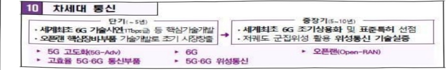
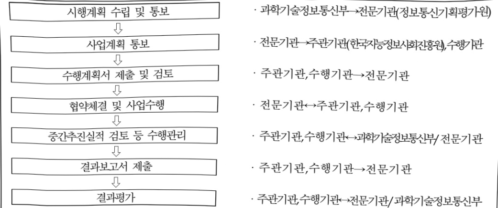

# AI기반개방형5G-A융합서비스테스트베드구축운영(R&D)

**해당 페이지**: PDF 417 ~ 422 쪽 해당

**부처**: 과학기술정보통신부
**분야**: 통신
**회계유형**: 일반회계
**2026 확정예산**: 7000.0 백만원
**전년대비 증감률**: 100.0%
**AI 도메인**: 통신/네트워크

---

<table border=1 style='margin: auto; word-wrap: break-word;'><tr><td style='text-align: center; word-wrap: break-word;'>사 업 명</td></tr><tr><td style='text-align: center; word-wrap: break-word;'>(164) AI기반 개방형 5G-A 융합서비스 테스트베드 구축운영(R&amp;D) (2132-374)</td></tr></table>

## □ 사업 코드 정보

<table border=1 style='margin: auto; word-wrap: break-word;'><tr><td style='text-align: center; word-wrap: break-word;'>구분</td><td style='text-align: center; word-wrap: break-word;'>회계</td><td style='text-align: center; word-wrap: break-word;'>소관</td><td style='text-align: center; word-wrap: break-word;'>실국(기관)</td><td style='text-align: center; word-wrap: break-word;'>계정</td><td style='text-align: center; word-wrap: break-word;'>분야</td><td style='text-align: center; word-wrap: break-word;'>부문</td></tr><tr><td style='text-align: center; word-wrap: break-word;'>코드</td><td rowspan="2">일반회계</td><td rowspan="2">과학기술정보통신부</td><td rowspan="2">정보보호네트워크정책관</td><td rowspan="2">-</td><td style='text-align: center; word-wrap: break-word;'>130</td><td style='text-align: center; word-wrap: break-word;'>133</td></tr><tr><td style='text-align: center; word-wrap: break-word;'>명칭</td><td style='text-align: center; word-wrap: break-word;'>통신</td><td style='text-align: center; word-wrap: break-word;'>정보통신</td></tr></table>

<table border=1 style='margin: auto; word-wrap: break-word;'><tr><td style='text-align: center; word-wrap: break-word;'>구분</td><td style='text-align: center; word-wrap: break-word;'>프로그램</td><td style='text-align: center; word-wrap: break-word;'>단위사업</td><td style='text-align: center; word-wrap: break-word;'>세부사업</td></tr><tr><td style='text-align: center; word-wrap: break-word;'>코드</td><td style='text-align: center; word-wrap: break-word;'>2100</td><td style='text-align: center; word-wrap: break-word;'>2132</td><td style='text-align: center; word-wrap: break-word;'>374</td></tr><tr><td style='text-align: center; word-wrap: break-word;'>명칭</td><td style='text-align: center; word-wrap: break-word;'>정보통신융합산업</td><td style='text-align: center; word-wrap: break-word;'>콘텐츠디바이스기술개발(일반)</td><td style='text-align: center; word-wrap: break-word;'>AI기반 개방형 5G-A 융합서비스 테스트베드 구축운영(R&amp;D)</td></tr></table>

<table border=1 style='margin: auto; word-wrap: break-word;'><tr><td colspan="6">☐ 사업 성격 (공통요구자료 Ⅱ-1 작성유의사항 4. 참조, 해당하는 사항에 “○” 표시)</td></tr><tr><td rowspan="2">신규 계속 완료</td><td rowspan="2">예비타당성 실시여부</td><td rowspan="2">총사업비 관리대상</td><td rowspan="2">총액계상 예산사업</td><td colspan="2">사업소관 변경정보</td></tr><tr><td colspan="2">2025예산 시 소관</td></tr><tr><td style='text-align: center; word-wrap: break-word;'></td><td style='text-align: center; word-wrap: break-word;'></td><td style='text-align: center; word-wrap: break-word;'></td><td style='text-align: center; word-wrap: break-word;'></td><td colspan="2"></td></tr></table>

☐ 사업 지원 형태 및 지원을 (최소한 한 개는 반드시 선택하시오. 해당사항에 O 표시)

<table border=1 style='margin: auto; word-wrap: break-word;'><tr><td style='text-align: center; word-wrap: break-word;'>직접</td><td style='text-align: center; word-wrap: break-word;'>출자</td><td style='text-align: center; word-wrap: break-word;'>출연</td><td style='text-align: center; word-wrap: break-word;'>보조</td><td style='text-align: center; word-wrap: break-word;'>융자</td><td style='text-align: center; word-wrap: break-word;'>국고보조율(%)</td><td style='text-align: center; word-wrap: break-word;'>융자율(%)</td></tr><tr><td style='text-align: center; word-wrap: break-word;'></td><td style='text-align: center; word-wrap: break-word;'></td><td style='text-align: center; word-wrap: break-word;'>O</td><td style='text-align: center; word-wrap: break-word;'></td><td style='text-align: center; word-wrap: break-word;'></td><td style='text-align: center; word-wrap: break-word;'></td><td style='text-align: center; word-wrap: break-word;'></td></tr></table>

## ☐ 사업 소관부처 및 시행주체

<table border=1 style='margin: auto; word-wrap: break-word;'><tr><td style='text-align: center; word-wrap: break-word;'>사업명</td><td colspan="2">구분</td></tr><tr><td rowspan="3">AI기반 개방형 5G-A 융합서비스 테스트베드 구축운영</td><td rowspan="2">소관부처</td><td style='text-align: center; word-wrap: break-word;'>정보보호네트워크정책실 정보보호네트워크정책관</td></tr><tr><td style='text-align: center; word-wrap: break-word;'>네트워크정책과</td></tr><tr><td style='text-align: center; word-wrap: break-word;'>사업시행주체</td><td style='text-align: center; word-wrap: break-word;'>정보통신기획평가원</td></tr></table>

---

### 가.예산 총괄표

(단위: 백만원, %)

<table border=1 style='margin: auto; word-wrap: break-word;'><tr><td rowspan="2">사업명</td><td rowspan="2">2024년 결산</td><td colspan="2">2025년 예산</td><td colspan="2">2026년 예산</td><td rowspan="2">증감(B-A)</td><td rowspan="2">(B-A)/A</td></tr><tr><td style='text-align: center; word-wrap: break-word;'>본예산</td><td style='text-align: center; word-wrap: break-word;'>추경*(A)</td><td style='text-align: center; word-wrap: break-word;'>요구안</td><td style='text-align: center; word-wrap: break-word;'>본예산(B)</td></tr><tr><td style='text-align: center; word-wrap: break-word;'>AI기반 개방형 5G-A 융합서비스 테스트베드 구축운영</td><td style='text-align: center; word-wrap: break-word;'>2,000</td><td style='text-align: center; word-wrap: break-word;'>3,500</td><td style='text-align: center; word-wrap: break-word;'>3,500</td><td style='text-align: center; word-wrap: break-word;'>7,000</td><td style='text-align: center; word-wrap: break-word;'>7,000</td><td style='text-align: center; word-wrap: break-word;'>3,500</td><td style='text-align: center; word-wrap: break-word;'>100</td></tr></table>

*추경: 추경증감액을 포함한 최종 예산액을 기재

## □ 기능별(내역사업별) 예산 내역

(단위:백만원)

<table border=1 style='margin: auto; word-wrap: break-word;'><tr><td rowspan="2"></td><td colspan="5">2024</td><td colspan="5">2025</td><td rowspan="2">2026예산</td></tr><tr><td style='text-align: center; word-wrap: break-word;'>예산액(추경)</td><td style='text-align: center; word-wrap: break-word;'>예산현액</td><td style='text-align: center; word-wrap: break-word;'>집행액</td><td style='text-align: center; word-wrap: break-word;'>이월액</td><td style='text-align: center; word-wrap: break-word;'>불용액</td><td style='text-align: center; word-wrap: break-word;'>예산액(추경)</td><td style='text-align: center; word-wrap: break-word;'>예산현액</td><td style='text-align: center; word-wrap: break-word;'>집행액</td><td style='text-align: center; word-wrap: break-word;'>이월액</td><td style='text-align: center; word-wrap: break-word;'>불용액</td></tr><tr><td style='text-align: center; word-wrap: break-word;'>○ 기능별 분류(합계)</td><td style='text-align: center; word-wrap: break-word;'>2,000</td><td style='text-align: center; word-wrap: break-word;'>2,000</td><td style='text-align: center; word-wrap: break-word;'>2,000</td><td style='text-align: center; word-wrap: break-word;'>-</td><td style='text-align: center; word-wrap: break-word;'>-</td><td style='text-align: center; word-wrap: break-word;'>3,500</td><td style='text-align: center; word-wrap: break-word;'>3,500</td><td style='text-align: center; word-wrap: break-word;'>3,500</td><td style='text-align: center; word-wrap: break-word;'>-</td><td style='text-align: center; word-wrap: break-word;'>-</td><td style='text-align: center; word-wrap: break-word;'>7,000</td></tr><tr><td style='text-align: center; word-wrap: break-word;'>• AI기반개방형5G-A용합서비스테스트베드구축운영(R&amp;D)</td><td style='text-align: center; word-wrap: break-word;'>2,000</td><td style='text-align: center; word-wrap: break-word;'>2,000</td><td style='text-align: center; word-wrap: break-word;'>2,000</td><td style='text-align: center; word-wrap: break-word;'>-</td><td style='text-align: center; word-wrap: break-word;'>-</td><td style='text-align: center; word-wrap: break-word;'>3,500</td><td style='text-align: center; word-wrap: break-word;'>3,500</td><td style='text-align: center; word-wrap: break-word;'>3,500</td><td style='text-align: center; word-wrap: break-word;'>-</td><td style='text-align: center; word-wrap: break-word;'>-</td><td style='text-align: center; word-wrap: break-word;'>7,000</td></tr></table>

### 나.사업설명자료

## 1 ) 사업목적·내용

o (AI기반 개방형 5G-A 융합서비스 테스트베드 구축운영(R&D))

- 차세대 네트워크 기술 발전에 따라 테스트베드 운영·고도화를 통해 국내 무선통신 기술 경쟁력을 강화하고, 장비·단말·융합서비스 등 글로벌 시장 선점 도모

- 상용망 수준의 5G-A 테스트베드에서 학계 및 연구계, 중소·벤처기업의 무선통신 분야 장비·단말·융합서비스 대상 기술개발·시험검증 등 수행 지원

## 2 ) 사업개요

## ☐ 사업근거 및 추진경위

① 법령상 근거 및 조항 적시

- '정보통신 진흥 및 융합 활성화 등에 관한 특별법' 제14조, 제19조, 제32조

---

0 제14조(정보통신 네트워크의 고도화) ① 과학기술정보통신부장관은 정보통신 진흥 및 융합 활성화를 위하여 정보통신 네트워크의 고도화를 지속적으로 추진하여야 한다.

0 제19조(유망 정보통신융합등 기술·서비스 등의 사업화 지원) ① 과학기술정보통신부장관은 제15조에 따라 과학기술정보통신부장관이 고시하는 유망 정보통신융합등 기술·서비스 등에 대하여 사업화에 필요한 지원을 할 수 있다.

0 제32조(정보통신융합등 기술·서비스 개발 등의 지원) ① 과학기술정보통신부장관은 다른 산업 및 서비스 등에 정보통신의 접목을 통하여 생산성과 가치를 높일 수 있도록 노력하여야 한다.

-‘지능정보화기본법’제35조

o 제35조(국가지능망의 관리) ① 과학기술정보통신부장관은 국가재정으로 공공기관과 대통령령으로 정하는 비영리기관이 이용하는 초연결지능정보통신망을 구축·관리하거나 제39조에 따라 지정된 전담기관으로 하여금 구축·관리하게 할 수 있다.

-정보통신·방송연구개발관리규정 제3조

o 제3조(적용범위) 이 규정을 적용하는 사업은 다음 각 호에 해당하는 사업을 말한다.

12. 그 밖에 과학기술정보통신부 소관법률 중 장관이 ICT 분야의 기술개발, 인력양성, 표준화 및 기반조성사업 등을 촉진하기 위하여 필요하다고 인정하는 사업

-국정과제(20번) 관련

[국정과제 20] AI 3대 강국 도약을 위한『AI고속도로』 구축

② 추진경위 - 사업 시작년도, 추진배경, 부처별 중점과제, 대통령 공약사항 등

- '19.4 월 : 혁신성장 실현을 위한 5G+ 전략('19.4) 2-2(5G 시험·실증 인프라 구축)

- '21.1월 : 전국기반 5G 융합서비스 테스트베드 구축 완료(4개 지역거점)

- '21.1월 : 5G 특화망 전략(5G+ 전략위원회)

- '21.12월 : 국가 필수전략기술 선정 및 육성·보호 전략 발표(5G/6G 외 총 10개 선정)

- '22.12월 : 제5차 과학기술기본계획('23~'27) (12대 국가전략기술 중 '차세대 통신')

·12대 국가전략기술 중 '차세대 통신'에 해당

'23. 2월 : K-Network 2030 전략

---

비전

<table border=1 style='margin: auto; word-wrap: break-word;'><tr><td style='text-align: center; word-wrap: break-word;'>세계 최고 6G 기술력</td><td style='text-align: center; word-wrap: break-word;'>SW 기반 네트워크 혁신</td><td style='text-align: center; word-wrap: break-word;'>네트워크 공급망 강화</td></tr><tr><td style='text-align: center; word-wrap: break-word;'>[ 6G 표준·특허 30% 확보 ]</td><td style='text-align: center; word-wrap: break-word;'>[ 오픈랜·SW 기반</td><td style='text-align: center; word-wrap: break-word;'>[ 6G·앙자·위성·백분망</td></tr><tr><td style='text-align: center; word-wrap: break-word;'>[ 26년 Pre-6G 기술 시연 ]</td><td style='text-align: center; word-wrap: break-word;'>글로벌 강소기업 20개 육성 ]</td><td style='text-align: center; word-wrap: break-word;'>핵심 부품 독자 기술력 확보 ]</td></tr></table>

① 5G 표준특허 점유율 25.9%(2위) (중국 26.8% 1위) → 6G 30%(1위 목표)

② 글로벌 강소기업(매출액 1천억원 이하, 수출 500만불 이상) 현재 10개 → 20개

③ 네트워크 핵심부품 외산 의존 → 6G, 양자, 백본망 등 주요 부품 독자 기술 확보

- '25. 8월 : 국정기획위원회 국민보고대회 정부 123대 국정과제(안) 발표(20. AI 3대 강국 도약을 위한『AI고속도로』 구축)

- '25. 12월 : Hyper AI네트워크 전략 발표('AI고속도로 완성'과 'AI G3 강국 도약'을 뒷받침하는 네트워크 종합 전략)

□ 주요내용

① 사업규모

- 총사업비(해당되는 경우에만 기재) : 해당 없음

- 사업기간 : 2024~2027

-최근 5년 간 투입된 사업비(예산액기준, 추경편성한 연도에는 추경포함)

(단위:백만원)

<table border=1 style='margin: auto; word-wrap: break-word;'><tr><td style='text-align: center; word-wrap: break-word;'>연도</td><td style='text-align: center; word-wrap: break-word;'>2022</td><td style='text-align: center; word-wrap: break-word;'>2023</td><td style='text-align: center; word-wrap: break-word;'>2024</td><td style='text-align: center; word-wrap: break-word;'>2025</td><td style='text-align: center; word-wrap: break-word;'>2026</td></tr><tr><td style='text-align: center; word-wrap: break-word;'>사업비</td><td style='text-align: center; word-wrap: break-word;'>-</td><td style='text-align: center; word-wrap: break-word;'>-</td><td style='text-align: center; word-wrap: break-word;'>2,000</td><td style='text-align: center; word-wrap: break-word;'>3,500</td><td style='text-align: center; word-wrap: break-word;'>7,000</td></tr></table>

-기타:해당 없음

② 사업추진체계

-사업시행방법:출연

-사업시행주체:(전문기관)정보통신기획평가원,(주관기관)한국지능정보사회진흥원

- 사업 수혜자 : 무선통신 네트워크 관련 산·학·연

- 보조, 융자, 출연, 출자 등의 경우 보조·융자 등 지원 비율 및 법적근거

<table border=1 style='margin: auto; word-wrap: break-word;'><tr><td style='text-align: center; word-wrap: break-word;'>내역사업명</td><td style='text-align: center; word-wrap: break-word;'>구분</td><td style='text-align: center; word-wrap: break-word;'>피보조·피출연 등 기관명</td><td style='text-align: center; word-wrap: break-word;'>지원 금액 (2026예산)</td><td style='text-align: center; word-wrap: break-word;'>지원 비율(%)</td><td style='text-align: center; word-wrap: break-word;'>보조율 법적근거 (해당 조항)</td></tr><tr><td style='text-align: center; word-wrap: break-word;'>AI기반 개방형 5G-A 융합서비스 테스트베드 구축운영</td><td style='text-align: center; word-wrap: break-word;'>출연</td><td style='text-align: center; word-wrap: break-word;'>정보통신 기획평가원</td><td style='text-align: center; word-wrap: break-word;'>7,000</td><td style='text-align: center; word-wrap: break-word;'>100</td><td style='text-align: center; word-wrap: break-word;'>- 정보통신진흥및융합활성화등에관한특별법 제32조(정보통신융합등기술·서비스개발 등의지원) - 한국연구재단법 제11조(출연금)</td></tr></table>

---

## 3 ) 2026년도 예산 산출 근거

□ AI기반 개방형 5G-A 융합서비스 테스트베드 구축운영 : 7,000백만원

① 5G-A 테스트베드 운영 : 3,300백만원

② 5G-A 테스트베드 고도화 : 3,500백만원

③ AI 기반 네트워크 관리서비스 개발·제공 : 200백만원

## 4 ) 사업효과

☐ 사업영향, 산출물 성과지표 등

①2022~2026년도 성과계획서 상 성과지표 및 최근 5년간 성과 달성도

<table border=1 style='margin: auto; word-wrap: break-word;'><tr><td style='text-align: center; word-wrap: break-word;'>성과지표</td><td style='text-align: center; word-wrap: break-word;'>구분</td><td style='text-align: center; word-wrap: break-word;'>2022</td><td style='text-align: center; word-wrap: break-word;'>2023</td><td style='text-align: center; word-wrap: break-word;'>2024</td><td style='text-align: center; word-wrap: break-word;'>2025</td><td style='text-align: center; word-wrap: break-word;'>2026</td><td style='text-align: center; word-wrap: break-word;'>2026 목표치산출근거</td><td style='text-align: center; word-wrap: break-word;'>측정산식(또는 측정방법)</td><td style='text-align: center; word-wrap: break-word;'>자료수집방법(또는 자료출처)</td></tr><tr><td rowspan="3">투입예산10억원 당시협성적서 발급(단위: 건)</td><td style='text-align: center; word-wrap: break-word;'>목표</td><td style='text-align: center; word-wrap: break-word;'>-</td><td style='text-align: center; word-wrap: break-word;'>-</td><td style='text-align: center; word-wrap: break-word;'>2</td><td style='text-align: center; word-wrap: break-word;'>2</td><td style='text-align: center; word-wrap: break-word;'>3</td><td rowspan="3">&#x27;20~&#x27;23년 성과평균(약3건)에서 하향 조정하고 기업의 활용 활성화가 예상되는 3년 차부터는 매년 목표치를 1건씩 상향</td><td rowspan="3">∑(시험성적서 발급건수)/당해 연도 예산×10</td><td rowspan="3">시험성적서/사업 연차보고서</td></tr><tr><td style='text-align: center; word-wrap: break-word;'>실적</td><td style='text-align: center; word-wrap: break-word;'>-</td><td style='text-align: center; word-wrap: break-word;'>-</td><td style='text-align: center; word-wrap: break-word;'>11.5</td><td style='text-align: center; word-wrap: break-word;'>-</td><td style='text-align: center; word-wrap: break-word;'>-</td></tr><tr><td style='text-align: center; word-wrap: break-word;'>달성도</td><td style='text-align: center; word-wrap: break-word;'>-</td><td style='text-align: center; word-wrap: break-word;'>-</td><td style='text-align: center; word-wrap: break-word;'>575</td><td style='text-align: center; word-wrap: break-word;'>-</td><td style='text-align: center; word-wrap: break-word;'>-</td></tr><tr><td rowspan="3">수혜자 만족도(단위: 점)</td><td style='text-align: center; word-wrap: break-word;'>목표</td><td style='text-align: center; word-wrap: break-word;'>-</td><td style='text-align: center; word-wrap: break-word;'>-</td><td style='text-align: center; word-wrap: break-word;'>81</td><td style='text-align: center; word-wrap: break-word;'>85</td><td style='text-align: center; word-wrap: break-word;'>88</td><td rowspan="3">81점에서 &#x27;27년까지 90점 달성을 목표(약 11% 증가)</td><td rowspan="3">만족도 설문을 통해 조사된 점수(100점 환산)의 평균</td><td rowspan="3">설문조사/사업 연차보고서</td></tr><tr><td style='text-align: center; word-wrap: break-word;'>실적</td><td style='text-align: center; word-wrap: break-word;'>-</td><td style='text-align: center; word-wrap: break-word;'>-</td><td style='text-align: center; word-wrap: break-word;'>95.6</td><td style='text-align: center; word-wrap: break-word;'>-</td><td style='text-align: center; word-wrap: break-word;'>-</td></tr><tr><td style='text-align: center; word-wrap: break-word;'>달성도</td><td style='text-align: center; word-wrap: break-word;'>-</td><td style='text-align: center; word-wrap: break-word;'>-</td><td style='text-align: center; word-wrap: break-word;'>118</td><td style='text-align: center; word-wrap: break-word;'>-</td><td style='text-align: center; word-wrap: break-word;'>-</td></tr></table>

② 성과지표 이외의 연도별 사업추진 경과 및 실적

<table border=1 style='margin: auto; word-wrap: break-word;'><tr><td style='text-align: center; word-wrap: break-word;'>2024</td><td style='text-align: center; word-wrap: break-word;'>전국 4대 거점(판교, 대전, 광주, 대구) 5G-A 융합서비스 테스트베드를 구축·운영하여 국내 중소·벤처 기업 등 기술지원 및 시험·검증(226건) 등을 지원하고, 공인시험기관을 통한 시험성적서 발급(23건) 완료</td></tr><tr><td style='text-align: center; word-wrap: break-word;'>2025</td><td style='text-align: center; word-wrap: break-word;'>전국 4대 거점(판교, 대전, 광주, 대구) 5G-A 융합서비스 테스트베드를 구축·운영하여 국내 중소·벤처 기업 등 기술지원 및 시험·검증(170건) 등을 지원하고, 공인시험기관을 통한 시험성적서 발급(35건) 완료</td></tr></table>

③향후(2026년도 이후)기대효과 :

o 국내 무선 네트워크 장비 산업의 기술·제품 경쟁력 향상 지원

- 국내 중소·벤처기업의 제품 개발기간 단축(3.6개월) 및 품질향상(19.8%)* 효과를 통한 무선통신 분야 장비·단말·융합서비스 상용화 촉진 및 산업 활성화 기여

* 평균 제품 개발기간 단축 13.2개월→ 9.6개월 / 평균 품질향상 효과 65.1%→ 84.8%

5) 타당성조사 및 예비타당성조사 시행여부 및 결과 요지 : 해당 없음

6) 총사업비 대상사업 정보 : 해당 없음

---

## 7 ) 사업 집행절차

<작성례>- AI기반 개방형 5G-A 융합서비스 테스트베드 구축운영

<table border=1 style='margin: auto; word-wrap: break-word;'><tr><td style='text-align: center; word-wrap: break-word;'>부처</td><td style='text-align: center; word-wrap: break-word;'></td><td style='text-align: center; word-wrap: break-word;'>피출연·피보조기관</td><td style='text-align: center; word-wrap: break-word;'></td><td style='text-align: center; word-wrap: break-word;'>간접보조사업자·사업수행자</td></tr><tr><td style='text-align: center; word-wrap: break-word;'>과학기술정보통신부(3,500백만원)</td><td style='text-align: center; word-wrap: break-word;'>=&gt;(3,500백만원)</td><td style='text-align: center; word-wrap: break-word;'>정보통신기획평가원(-)</td><td style='text-align: center; word-wrap: break-word;'>=&gt;(3,500백만원)</td><td style='text-align: center; word-wrap: break-word;'>한국지능정보사회진흥원 외 4개 기관</td></tr></table>

8) 각종 평가 : 해당 없음

### 다.최근 4년간 결산내역

1) 결산표

☐ 부처 결산내역

(단위: 백만원, %)

<table border=1 style='margin: auto; word-wrap: break-word;'><tr><td rowspan="2">연도</td><td colspan="3">예산액</td><td rowspan="2">예산현액(A)</td><td rowspan="2">집행액(B)</td><td rowspan="2">집행률(B/A)</td><td rowspan="2">다음연도이월액</td><td rowspan="2">불용액</td></tr><tr><td style='text-align: center; word-wrap: break-word;'>본예산</td><td style='text-align: center; word-wrap: break-word;'>추경중감액</td><td style='text-align: center; word-wrap: break-word;'>추경</td></tr><tr><td style='text-align: center; word-wrap: break-word;'>2022</td><td style='text-align: center; word-wrap: break-word;'>-</td><td style='text-align: center; word-wrap: break-word;'>-</td><td style='text-align: center; word-wrap: break-word;'>-</td><td style='text-align: center; word-wrap: break-word;'>-</td><td style='text-align: center; word-wrap: break-word;'>-</td><td style='text-align: center; word-wrap: break-word;'>-</td><td style='text-align: center; word-wrap: break-word;'>-</td><td style='text-align: center; word-wrap: break-word;'>-</td></tr><tr><td style='text-align: center; word-wrap: break-word;'>2023</td><td style='text-align: center; word-wrap: break-word;'>-</td><td style='text-align: center; word-wrap: break-word;'>-</td><td style='text-align: center; word-wrap: break-word;'>-</td><td style='text-align: center; word-wrap: break-word;'>-</td><td style='text-align: center; word-wrap: break-word;'>-</td><td style='text-align: center; word-wrap: break-word;'>-</td><td style='text-align: center; word-wrap: break-word;'>-</td><td style='text-align: center; word-wrap: break-word;'>-</td></tr><tr><td style='text-align: center; word-wrap: break-word;'>2024</td><td style='text-align: center; word-wrap: break-word;'>2,000</td><td style='text-align: center; word-wrap: break-word;'>-</td><td style='text-align: center; word-wrap: break-word;'>-</td><td style='text-align: center; word-wrap: break-word;'>2,000</td><td style='text-align: center; word-wrap: break-word;'>2,000</td><td style='text-align: center; word-wrap: break-word;'>100</td><td style='text-align: center; word-wrap: break-word;'>-</td><td style='text-align: center; word-wrap: break-word;'>-</td></tr><tr><td style='text-align: center; word-wrap: break-word;'>2025</td><td style='text-align: center; word-wrap: break-word;'>3,500</td><td style='text-align: center; word-wrap: break-word;'>-</td><td style='text-align: center; word-wrap: break-word;'>-</td><td style='text-align: center; word-wrap: break-word;'>3,500</td><td style='text-align: center; word-wrap: break-word;'>3,500</td><td style='text-align: center; word-wrap: break-word;'>100</td><td style='text-align: center; word-wrap: break-word;'>-</td><td style='text-align: center; word-wrap: break-word;'>-</td></tr></table>

## 2 ) 주요 결산사항

□ 2022~2025년 결산 주요사항 : 해당 없음

□ 2025년 이·전용 등 세부내역 : 해당 없음

---

### 원본 PDF 크롭 이미지

