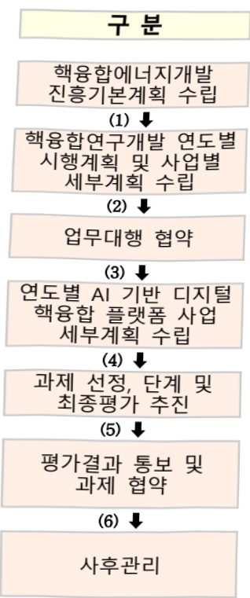

# AI기반디지털가상핵융합로플랫폼개발사업(R&D)

**해당 페이지**: PDF 423 ~ 429 쪽 해당

**부처**: 과학기술정보통신부
**분야**: 과학기술
**회계유형**: 일반회계
**2026 확정예산**: 4500.0 백만원
**전년대비 증감률**: None%
**AI 도메인**: 에너지

---

### 가. 예산 총괄표

(단위: 백만원, %)

<table border=1 style='margin: auto; word-wrap: break-word;'><tr><td rowspan="2">사업명</td><td rowspan="2">2024년 결산</td><td colspan="2">2025년 예산</td><td colspan="2">2026년 예산</td><td rowspan="2">증감(B-A)</td><td rowspan="2">(B-A)/A</td></tr><tr><td style='text-align: center; word-wrap: break-word;'>본예산</td><td style='text-align: center; word-wrap: break-word;'>추경(A)</td><td style='text-align: center; word-wrap: break-word;'>요구안</td><td style='text-align: center; word-wrap: break-word;'>본예산(B)</td></tr><tr><td style='text-align: center; word-wrap: break-word;'>AI기반디지털가상 핵융합플랫폼개발 사업(R&amp;D)</td><td style='text-align: center; word-wrap: break-word;'>-</td><td style='text-align: center; word-wrap: break-word;'>-</td><td style='text-align: center; word-wrap: break-word;'>-</td><td style='text-align: center; word-wrap: break-word;'>4,500</td><td style='text-align: center; word-wrap: break-word;'>4,500</td><td style='text-align: center; word-wrap: break-word;'>4,500</td><td style='text-align: center; word-wrap: break-word;'>순증</td></tr></table>

□ 기능별(내역사업별) 예산 내역

(단위:백만원)

<table border=1 style='margin: auto; word-wrap: break-word;'><tr><td rowspan="3"></td><td colspan="5">2024</td><td colspan="7">2025</td><td rowspan="3">2026예산</td></tr><tr><td rowspan="2">예산액(추경)</td><td rowspan="2">예산현액</td><td rowspan="2">집행액</td><td rowspan="2">이월액</td><td rowspan="2">불용액</td><td rowspan="2">예산액(추경)</td><td rowspan="2">예산현액</td><td rowspan="2">집행액</td><td colspan="2">이월액</td><td rowspan="2">불용액</td><td rowspan="2">불용예상액</td></tr><tr><td style='text-align: center; word-wrap: break-word;'>예산현액</td><td style='text-align: center; word-wrap: break-word;'>집행액[실집행액]</td></tr><tr><td style='text-align: center; word-wrap: break-word;'>○ 기능별 분류(합계)</td><td style='text-align: center; word-wrap: break-word;'>-</td><td style='text-align: center; word-wrap: break-word;'>-</td><td style='text-align: center; word-wrap: break-word;'>-</td><td style='text-align: center; word-wrap: break-word;'>-</td><td style='text-align: center; word-wrap: break-word;'>-</td><td style='text-align: center; word-wrap: break-word;'>-</td><td style='text-align: center; word-wrap: break-word;'>-</td><td style='text-align: center; word-wrap: break-word;'>-</td><td style='text-align: center; word-wrap: break-word;'>-</td><td style='text-align: center; word-wrap: break-word;'>-</td><td style='text-align: center; word-wrap: break-word;'>-</td><td style='text-align: center; word-wrap: break-word;'>-</td><td style='text-align: center; word-wrap: break-word;'>4,500</td></tr><tr><td style='text-align: center; word-wrap: break-word;'>· 확장형 가상 핵융 합로 플랫폼 구현 · AI 기반 분석·제어 모듈개발</td><td style='text-align: center; word-wrap: break-word;'>-</td><td style='text-align: center; word-wrap: break-word;'>-</td><td style='text-align: center; word-wrap: break-word;'>-</td><td style='text-align: center; word-wrap: break-word;'>-</td><td style='text-align: center; word-wrap: break-word;'>-</td><td style='text-align: center; word-wrap: break-word;'>-</td><td style='text-align: center; word-wrap: break-word;'>-</td><td style='text-align: center; word-wrap: break-word;'>-</td><td style='text-align: center; word-wrap: break-word;'>-</td><td style='text-align: center; word-wrap: break-word;'>-</td><td style='text-align: center; word-wrap: break-word;'>-</td><td style='text-align: center; word-wrap: break-word;'>-</td><td style='text-align: center; word-wrap: break-word;'>2,000</td></tr><tr><td style='text-align: center; word-wrap: break-word;'>○ 비목별 분류(합계)</td><td style='text-align: center; word-wrap: break-word;'>-</td><td style='text-align: center; word-wrap: break-word;'>-</td><td style='text-align: center; word-wrap: break-word;'>-</td><td style='text-align: center; word-wrap: break-word;'>-</td><td style='text-align: center; word-wrap: break-word;'>-</td><td style='text-align: center; word-wrap: break-word;'>-</td><td style='text-align: center; word-wrap: break-word;'>-</td><td style='text-align: center; word-wrap: break-word;'>-</td><td style='text-align: center; word-wrap: break-word;'>-</td><td style='text-align: center; word-wrap: break-word;'>-</td><td style='text-align: center; word-wrap: break-word;'>-</td><td style='text-align: center; word-wrap: break-word;'>-</td><td style='text-align: center; word-wrap: break-word;'>2,500</td></tr><tr><td style='text-align: center; word-wrap: break-word;'>· 연 구 활 동 비 등 (360-05)</td><td style='text-align: center; word-wrap: break-word;'>-</td><td style='text-align: center; word-wrap: break-word;'>-</td><td style='text-align: center; word-wrap: break-word;'>-</td><td style='text-align: center; word-wrap: break-word;'>-</td><td style='text-align: center; word-wrap: break-word;'>-</td><td style='text-align: center; word-wrap: break-word;'>-</td><td style='text-align: center; word-wrap: break-word;'>-</td><td style='text-align: center; word-wrap: break-word;'>-</td><td style='text-align: center; word-wrap: break-word;'>-</td><td style='text-align: center; word-wrap: break-word;'>-</td><td style='text-align: center; word-wrap: break-word;'>-</td><td style='text-align: center; word-wrap: break-word;'>-</td><td style='text-align: center; word-wrap: break-word;'>4,500</td></tr><tr><td style='text-align: center; word-wrap: break-word;'>○ 기능·비목별 분류(합계)</td><td style='text-align: center; word-wrap: break-word;'>-</td><td style='text-align: center; word-wrap: break-word;'>-</td><td style='text-align: center; word-wrap: break-word;'>-</td><td style='text-align: center; word-wrap: break-word;'>-</td><td style='text-align: center; word-wrap: break-word;'>-</td><td style='text-align: center; word-wrap: break-word;'>-</td><td style='text-align: center; word-wrap: break-word;'>-</td><td style='text-align: center; word-wrap: break-word;'>-</td><td style='text-align: center; word-wrap: break-word;'>-</td><td style='text-align: center; word-wrap: break-word;'>-</td><td style='text-align: center; word-wrap: break-word;'>-</td><td style='text-align: center; word-wrap: break-word;'>-</td><td style='text-align: center; word-wrap: break-word;'>4,500</td></tr><tr><td rowspan="4">· 확장형 가상 핵융 합로 플랫폼 구현 · 연 구 활 동 비 등 (360-05) · AI 기반 분석·제어 모듈개발 · 연 구 활 동 비 등 (360-05)</td><td rowspan="4">-</td><td rowspan="4">-</td><td rowspan="4">-</td><td rowspan="4">-</td><td rowspan="4">-</td><td rowspan="4">-</td><td rowspan="4">-</td><td rowspan="4">-</td><td rowspan="4">-</td><td rowspan="4">-</td><td rowspan="4">-</td><td rowspan="4">-</td><td style='text-align: center; word-wrap: break-word;'>2,000</td></tr><tr><td style='text-align: center; word-wrap: break-word;'>2,000</td></tr><tr><td style='text-align: center; word-wrap: break-word;'>2,500</td></tr><tr><td style='text-align: center; word-wrap: break-word;'>2,500</td></tr></table>

---

## 1 ) 사업목적·내용

- (AI기반 디지털 가상 핵융합로 플랫폼 개발사업) 세계 최초 범용적 디지털 가상 핵융합로 플랫폼 구현을 통해 최근 급격하게 성장하고 있는 글로벌 핵융합로 건설·운영 시장 선도 및 부가가치 창출

- (1내역, 확장형 가상 핵융합로 플랫폼 구현) 최신 디지털 기술 접목 확장형 가상 핵융합로(Virtual Fusion Reactor) 플랫폼 개발

- (2내역, AI 기반 분석·제어 모듈 개발) 핵융합로 상태 자동 분석 제어를 위한 AI 기술 개발 및 KSTAR 고속제어 기술 개발

## 2 ) 사업개요

## □ 사업근거 및 추진경위

① 법령상 근거 및 조항 적시 : 핵융합에너지개발진흥법 제8조(핵융합에너지 연구개발사업의 추진)

② 추진경위

- '06.12 : 핵융합에너지개발진흥법 제정(법률20262호)

- '21.12 : 제4차 핵융합에너지개발진흥기본계획(과기정통부)

- '24.07 : 핵융합에너지 실현 가속화 전략(과기정통부)

## □ 주요내용

① 사업규모

- 총사업비(해당되는 경우에만 기재) : 해당 없음

- 사업기간 : '26~'30

- 최근 5년 간 투입된 사업비(예산액기준, 추경편성한 연도에는 추경포함)

<table border=1 style='margin: auto; word-wrap: break-word;'><tr><td style='text-align: center; word-wrap: break-word;'>$ \underline{\text{角}} $</td><td style='text-align: center; word-wrap: break-word;'>2022</td><td style='text-align: center; word-wrap: break-word;'>2023</td><td style='text-align: center; word-wrap: break-word;'>2024</td><td style='text-align: center; word-wrap: break-word;'>2025</td><td style='text-align: center; word-wrap: break-word;'>2026</td></tr><tr><td style='text-align: center; word-wrap: break-word;'>$ \underline{\text{사업비}} $</td><td style='text-align: center; word-wrap: break-word;'>-</td><td style='text-align: center; word-wrap: break-word;'>-</td><td style='text-align: center; word-wrap: break-word;'>-</td><td style='text-align: center; word-wrap: break-word;'>-</td><td style='text-align: center; word-wrap: break-word;'>4,500</td></tr></table>

-기타: 해당 없음

② 사업추진체계

- 사업시행방법 : 출연

-사업시행주체:과학기술정보통신부,한국연구재단

- 사업 수혜자 : 산업체, 대학, 출연(연)

- 보조, 융자, 출연, 출자 등의 경우 보조·융자 등 지원 비율 및 법적근거

---

<table border=1 style='margin: auto; word-wrap: break-word;'><tr><td style='text-align: center; word-wrap: break-word;'>내역사업명</td><td style='text-align: center; word-wrap: break-word;'>구분</td><td style='text-align: center; word-wrap: break-word;'>피보조·피출연 등 기관명</td><td style='text-align: center; word-wrap: break-word;'>지원 금액 (2026예산)</td><td style='text-align: center; word-wrap: break-word;'>지원 비율(%)</td><td style='text-align: center; word-wrap: break-word;'>보조율 법적근거 (해당 조항)</td></tr><tr><td style='text-align: center; word-wrap: break-word;'>확장형 가상 핵융합로 플랫폼 구현</td><td style='text-align: center; word-wrap: break-word;'>출연</td><td style='text-align: center; word-wrap: break-word;'>한국연구 재단</td><td style='text-align: center; word-wrap: break-word;'>2,000</td><td style='text-align: center; word-wrap: break-word;'>100</td><td style='text-align: center; word-wrap: break-word;'>핵융합에너지개발진흥법 제8조(핵융합에너지 연구개발사업의 추진)</td></tr><tr><td style='text-align: center; word-wrap: break-word;'>AI 기반 분석·제어 모듈개발</td><td style='text-align: center; word-wrap: break-word;'>출연</td><td style='text-align: center; word-wrap: break-word;'>한국연구 재단</td><td style='text-align: center; word-wrap: break-word;'>2,500</td><td style='text-align: center; word-wrap: break-word;'>100</td><td style='text-align: center; word-wrap: break-word;'>핵융합에너지개발진흥법 제8조(핵융합에너지 연구개발사업의 추진)</td></tr></table>

## 3 ) 2026년도 예산 산출 근거

① (1내역) 확장형 가상 핵융합로 플랫폼 구현 : ('25) 0백만원 → ('26) 2,000백만원, 신규 - (산출) 2개(신규) x 1,333백만원 x 9/12개월 = 2,000백만원

② (2내역) AI 기반 분석·제어 모듈 개발 : ('25) 0백만원 → ('26) 2,500백만원, 신규

- (산출) 3개(신규) x 1,111백만원 x 9/12개월 = 2,500백만원

## 4 ) 사업효과

□ 사업영향,산출물 성과지표 등

① 2022~2026년도 성과계획서 상 성과지표 및 최근 5년간 성과 달성도

<table border=1 style='margin: auto; word-wrap: break-word;'><tr><td style='text-align: center; word-wrap: break-word;'>성과지표</td><td style='text-align: center; word-wrap: break-word;'>구분</td><td style='text-align: center; word-wrap: break-word;'>2022</td><td style='text-align: center; word-wrap: break-word;'>2023</td><td style='text-align: center; word-wrap: break-word;'>2024</td><td style='text-align: center; word-wrap: break-word;'>2025</td><td style='text-align: center; word-wrap: break-word;'>2026</td><td style='text-align: center; word-wrap: break-word;'>2026 목표치산출근거</td><td style='text-align: center; word-wrap: break-word;'>측정산식(또는 측정방법)</td><td style='text-align: center; word-wrap: break-word;'>자료수집방법(또는 자료출처)</td></tr><tr><td rowspan="3">AI 취적화 가능설계 요소 수(단위: 건)</td><td style='text-align: center; word-wrap: break-word;'>목표</td><td style='text-align: center; word-wrap: break-word;'>-</td><td style='text-align: center; word-wrap: break-word;'>-</td><td style='text-align: center; word-wrap: break-word;'>-</td><td style='text-align: center; word-wrap: break-word;'>(신규)</td><td style='text-align: center; word-wrap: break-word;'>2</td><td rowspan="3">연도별 기술개발목표에 따라 초기목표 산출</td><td rowspan="3">AI 설계 기능을 취적 설계 도출 후에 섬돌을 준 설계와 비교하여 취적해 검증</td><td rowspan="3">연차보고서 실적 검토</td></tr><tr><td style='text-align: center; word-wrap: break-word;'>실적</td><td style='text-align: center; word-wrap: break-word;'>-</td><td style='text-align: center; word-wrap: break-word;'>-</td><td style='text-align: center; word-wrap: break-word;'>-</td><td style='text-align: center; word-wrap: break-word;'>-</td><td style='text-align: center; word-wrap: break-word;'>-</td></tr><tr><td style='text-align: center; word-wrap: break-word;'>달성도</td><td style='text-align: center; word-wrap: break-word;'>-</td><td style='text-align: center; word-wrap: break-word;'>-</td><td style='text-align: center; word-wrap: break-word;'>-</td><td style='text-align: center; word-wrap: break-word;'>-</td><td style='text-align: center; word-wrap: break-word;'>-</td></tr><tr><td rowspan="3">논문/특허(단위: 건)</td><td style='text-align: center; word-wrap: break-word;'>목표</td><td style='text-align: center; word-wrap: break-word;'>-</td><td style='text-align: center; word-wrap: break-word;'>-</td><td style='text-align: center; word-wrap: break-word;'>-</td><td style='text-align: center; word-wrap: break-word;'>(신규)</td><td style='text-align: center; word-wrap: break-word;'>20/4</td><td rowspan="3">타 유사사업의 성과목표를 고려하여, 초기목표 산출</td><td rowspan="3">mnrf 지수 70 이상 논문 편, 특허 및 지재권 출원 건수</td><td rowspan="3">연차보고서 실적 검토</td></tr><tr><td style='text-align: center; word-wrap: break-word;'>실적</td><td style='text-align: center; word-wrap: break-word;'>-</td><td style='text-align: center; word-wrap: break-word;'>-</td><td style='text-align: center; word-wrap: break-word;'>-</td><td style='text-align: center; word-wrap: break-word;'>-</td><td style='text-align: center; word-wrap: break-word;'>-</td></tr><tr><td style='text-align: center; word-wrap: break-word;'>달성도</td><td style='text-align: center; word-wrap: break-word;'>-</td><td style='text-align: center; word-wrap: break-word;'>-</td><td style='text-align: center; word-wrap: break-word;'>-</td><td style='text-align: center; word-wrap: break-word;'>-</td><td style='text-align: center; word-wrap: break-word;'>-</td></tr></table>

---

② 성과지표 이외의 연도별 사업추진 경과 및 실적 : 해당 없음

③ 향후(2026년도 이후) 기대효과

- 디지털 가상 핵융합로 플랫폼 구현 및 최적설계 기술개발로 핵융합로 설계기간 단축(10년→5년)을 통한 '30년대 핵융합에너지 전력생산 가속화 기여

- AI 기반 핵협회로 자율·최적제어기술 개발 및 KSTAR 활용 검증을 통해 글로벌 핵협회로 운전시장 선점 및 수출기반 확보

- 핵융합로 최적 자율제어 기술을 통해 자율 주행, 휴머노이드, 대형 플랜트 등 산업 전반을 위한 차세대 AI 기술개발 및 국가적 AI 대전환 국정과제 달성

* 동 사업의 핵융합로 최적·자율제어 기술은 LLM(Large Language Models)과 같은 분절된 정보를 다루는 평면적 AI 기술을 넘어 3차원 물리환경과 상호 작용할 수 있는 차세대 AI 기술

5) 타당성조사 및 예비타당성조사 시행여부 및 결과 요지 : 해당 없음

6) 총사업비 대상사업 여부 및 내역 : 해당 없음

---

## 7 ) 사업 집행절차

## 주요내용

중장기 핵융합연구개발 추진전략 등

사업별 목표, 당해연도 추진계획, 사업비 배분 등

■당해년도 사업 업무대행 협약 추진

연차별 사업계획서(선정, 단계, 최종평가 등) 작성

☑ 추진실적 및 사업계획 등 평가

☑ 평가결과에 따라 제재 및 연구비 조정

평가결과 및 신청서 수정·보완사항 통보

평가의견을 반영하여 과제 협약

단계/최종평가

연구성과 조사·분석·확산

연구비 정산, 기술료 징수 등

## 주 체

과기정통부

(국가핵융합위원회)

과기정통부

(국가핵융합위원회,

사업추진위원회)

과기정통부 ↔ 전문기관

과기정통부,

전문기관

전문기관

전문기관 →

과제연구자

전문기관

<table border=1 style='margin: auto; word-wrap: break-word;'><tr><td style='text-align: center; word-wrap: break-word;'>부처</td><td style='text-align: center; word-wrap: break-word;'></td><td style='text-align: center; word-wrap: break-word;'>피출연·피보조기관</td><td style='text-align: center; word-wrap: break-word;'></td><td style='text-align: center; word-wrap: break-word;'>간접보조사업자·사업수행자</td></tr><tr><td style='text-align: center; word-wrap: break-word;'>과학기술정보통신부(4,500백만원)</td><td style='text-align: center; word-wrap: break-word;'>=&gt;(4,500백만원)</td><td style='text-align: center; word-wrap: break-word;'>한국연구재단(-)</td><td style='text-align: center; word-wrap: break-word;'>=&gt;(4,500백만원)</td><td style='text-align: center; word-wrap: break-word;'>산업체, 대학,출연(연) 대상 공모</td></tr></table>

## 8 ) 중기재정계획 상 연도별 투자계획 및 추진경과

(단위:백만원)

<table border=1 style='margin: auto; word-wrap: break-word;'><tr><td style='text-align: center; word-wrap: break-word;'>중기 재정계획</td><td style='text-align: center; word-wrap: break-word;'>2024</td><td style='text-align: center; word-wrap: break-word;'>2025</td><td style='text-align: center; word-wrap: break-word;'>2026</td><td style='text-align: center; word-wrap: break-word;'>2027</td><td style='text-align: center; word-wrap: break-word;'>2028</td><td style='text-align: center; word-wrap: break-word;'>2029</td></tr><tr><td style='text-align: center; word-wrap: break-word;'>2024~2028</td><td style='text-align: center; word-wrap: break-word;'>-</td><td style='text-align: center; word-wrap: break-word;'>-</td><td style='text-align: center; word-wrap: break-word;'>-</td><td style='text-align: center; word-wrap: break-word;'>-</td><td style='text-align: center; word-wrap: break-word;'>-</td><td style='text-align: center; word-wrap: break-word;'>☑</td></tr><tr><td style='text-align: center; word-wrap: break-word;'>2025~2029</td><td style='text-align: center; word-wrap: break-word;'>☑</td><td style='text-align: center; word-wrap: break-word;'>-</td><td style='text-align: center; word-wrap: break-word;'>4,500</td><td style='text-align: center; word-wrap: break-word;'>10,000</td><td style='text-align: center; word-wrap: break-word;'>11,000</td><td style='text-align: center; word-wrap: break-word;'>10,500</td></tr></table>

---

9) 최근 3년간 동 사업에 대한 주요 외부지적사항 및 평가, 문제점 및 대책 : 해당 없음

10)향후 추진방향 및 추진계획 : 해당 없음

11) 해당사업에 대한 각종 사업평가의 결과 : 해당 없음

12) 해당사업에 대한 부처 자체평가의 결과 : 해당 없음

13) 부처 건의사항 : 해당 없음

다. 최근 4년간 결산내역 : 해당 없음

---

<table border=1 style='margin: auto; word-wrap: break-word;'><tr><td style='text-align: center; word-wrap: break-word;'>사 업 명</td></tr><tr><td style='text-align: center; word-wrap: break-word;'>(330) AI반도체기반데이터센터고도화선도기술개발(R&amp;D) (2603-318)</td></tr></table>

☐ 사업 코드 정보

<table border=1 style='margin: auto; word-wrap: break-word;'><tr><td style='text-align: center; word-wrap: break-word;'>구분</td><td style='text-align: center; word-wrap: break-word;'>회계</td><td style='text-align: center; word-wrap: break-word;'>소관</td><td style='text-align: center; word-wrap: break-word;'>실국(기관)</td><td style='text-align: center; word-wrap: break-word;'>계정</td><td style='text-align: center; word-wrap: break-word;'>분야</td><td style='text-align: center; word-wrap: break-word;'>부문</td></tr><tr><td style='text-align: center; word-wrap: break-word;'>코드</td><td rowspan="2">일반회계</td><td style='text-align: center; word-wrap: break-word;'>과학기술</td><td style='text-align: center; word-wrap: break-word;'>정보통신</td><td rowspan="2"></td><td style='text-align: center; word-wrap: break-word;'>130</td><td style='text-align: center; word-wrap: break-word;'>133</td></tr><tr><td style='text-align: center; word-wrap: break-word;'>명칭</td><td style='text-align: center; word-wrap: break-word;'>정보통신부</td><td style='text-align: center; word-wrap: break-word;'>산업정책관</td><td style='text-align: center; word-wrap: break-word;'>통신</td><td style='text-align: center; word-wrap: break-word;'>정보통신</td></tr></table>

<table border=1 style='margin: auto; word-wrap: break-word;'><tr><td style='text-align: center; word-wrap: break-word;'>구분</td><td style='text-align: center; word-wrap: break-word;'>프로그램</td><td style='text-align: center; word-wrap: break-word;'>단위사업</td><td style='text-align: center; word-wrap: break-word;'>세부사업</td></tr><tr><td style='text-align: center; word-wrap: break-word;'>코드</td><td style='text-align: center; word-wrap: break-word;'>2600</td><td style='text-align: center; word-wrap: break-word;'>2603</td><td style='text-align: center; word-wrap: break-word;'>318</td></tr><tr><td style='text-align: center; word-wrap: break-word;'>명칭</td><td style='text-align: center; word-wrap: break-word;'>인공지능데이터진흥</td><td style='text-align: center; word-wrap: break-word;'>AI반도체경쟁력강화(일반)</td><td style='text-align: center; word-wrap: break-word;'>AI반도체기반데이터센터고도화선도기술개발(R&amp;D)</td></tr></table>

<table border=1 style='margin: auto; word-wrap: break-word;'><tr><td colspan="6">☐ 사업 성격 (공통요구자료 II-1 작성유의사항 4. 참조, 해당하는 사항에 “○” 표시)</td></tr><tr><td style='text-align: center; word-wrap: break-word;'>신규 계속</td><td style='text-align: center; word-wrap: break-word;'>완료</td><td style='text-align: center; word-wrap: break-word;'>예비타당성 실시여부</td><td style='text-align: center; word-wrap: break-word;'>총사업비 관리대상</td><td style='text-align: center; word-wrap: break-word;'>총액계상 예산사업</td><td style='text-align: center; word-wrap: break-word;'>사업소관 변경정보 2025예산 시 소관</td></tr><tr><td style='text-align: center; word-wrap: break-word;'></td><td style='text-align: center; word-wrap: break-word;'>○</td><td style='text-align: center; word-wrap: break-word;'></td><td style='text-align: center; word-wrap: break-word;'></td><td style='text-align: center; word-wrap: break-word;'></td><td style='text-align: center; word-wrap: break-word;'></td></tr></table>

사업 지원 형태 및 지원을 (최소한 한 개는 반드시 선택하시오. 해당사항에 O 표시)

<table border=1 style='margin: auto; word-wrap: break-word;'><tr><td style='text-align: center; word-wrap: break-word;'>직접</td><td style='text-align: center; word-wrap: break-word;'>출자</td><td style='text-align: center; word-wrap: break-word;'>출연</td><td style='text-align: center; word-wrap: break-word;'>보조</td><td style='text-align: center; word-wrap: break-word;'>융자</td><td style='text-align: center; word-wrap: break-word;'>국고보조율(%)</td><td style='text-align: center; word-wrap: break-word;'>융자율(%)</td></tr><tr><td style='text-align: center; word-wrap: break-word;'></td><td style='text-align: center; word-wrap: break-word;'></td><td style='text-align: center; word-wrap: break-word;'>○</td><td style='text-align: center; word-wrap: break-word;'></td><td style='text-align: center; word-wrap: break-word;'></td><td style='text-align: center; word-wrap: break-word;'></td><td style='text-align: center; word-wrap: break-word;'></td></tr></table>

## □ 사업 소관부처 및 시행주체

<table border=1 style='margin: auto; word-wrap: break-word;'><tr><td style='text-align: center; word-wrap: break-word;'>사업명</td><td colspan="2">구분</td></tr><tr><td rowspan="3">AI반도체기반데이터센터고도화선도기술개발(R&amp;D)</td><td rowspan="2">소관부처</td><td style='text-align: center; word-wrap: break-word;'>정보통신정책실정보통신산업정책관</td></tr><tr><td style='text-align: center; word-wrap: break-word;'>정보통신방송기술정책과</td></tr><tr><td style='text-align: center; word-wrap: break-word;'>사업시행주체</td><td style='text-align: center; word-wrap: break-word;'>정보통신기획평가원</td></tr></table>

---

### 원본 PDF 크롭 이미지

