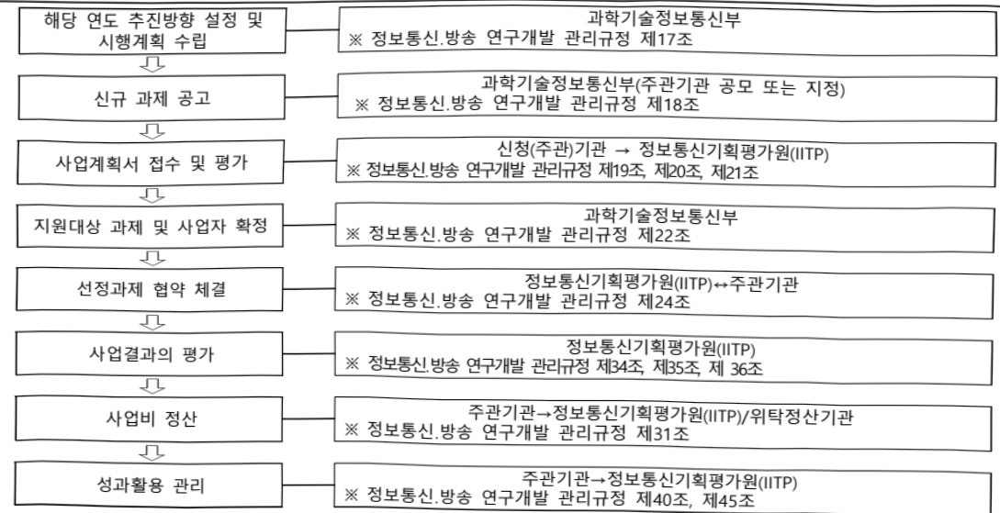

# AI반도체를 활용한 K-클라우드 기술개발(R&D)

**해당 페이지**: PDF 436 ~ 443 쪽 해당

**부처**: 과학기술정보통신부
**분야**: 통신
**회계유형**: 일반회계
**2026 확정예산**: 60751.0 백만원
**전년대비 증감률**: 65.9%
**AI 도메인**: AI반도체, LLM/언어모델, 데이터, 클라우드/컴퓨팅

---

<table border=1 style='margin: auto; word-wrap: break-word;'><tr><td style='text-align: center; word-wrap: break-word;'>사 업 명</td></tr><tr><td style='text-align: center; word-wrap: break-word;'>(331) AI반도체를활용한K-클라우드기술개발 (2603-320)</td></tr></table>

사업 코드 정보

<table border=1 style='margin: auto; word-wrap: break-word;'><tr><td style='text-align: center; word-wrap: break-word;'>구분</td><td style='text-align: center; word-wrap: break-word;'>회계</td><td style='text-align: center; word-wrap: break-word;'>소관</td><td style='text-align: center; word-wrap: break-word;'>실국(기관)</td><td style='text-align: center; word-wrap: break-word;'>계정</td><td style='text-align: center; word-wrap: break-word;'>분야</td><td style='text-align: center; word-wrap: break-word;'>부문</td></tr><tr><td style='text-align: center; word-wrap: break-word;'>코드</td><td rowspan="2">일반회계</td><td style='text-align: center; word-wrap: break-word;'>과학기술</td><td style='text-align: center; word-wrap: break-word;'>정보통신</td><td rowspan="2"></td><td style='text-align: center; word-wrap: break-word;'>130</td><td style='text-align: center; word-wrap: break-word;'>133</td></tr><tr><td style='text-align: center; word-wrap: break-word;'>명칭</td><td style='text-align: center; word-wrap: break-word;'>정보통신부</td><td style='text-align: center; word-wrap: break-word;'>산업정책관</td><td style='text-align: center; word-wrap: break-word;'>통신</td><td style='text-align: center; word-wrap: break-word;'>정보통신</td></tr></table>

<table border=1 style='margin: auto; word-wrap: break-word;'><tr><td style='text-align: center; word-wrap: break-word;'>구분</td><td style='text-align: center; word-wrap: break-word;'>프로그램</td><td style='text-align: center; word-wrap: break-word;'>단위사업</td><td style='text-align: center; word-wrap: break-word;'>세부사업</td></tr><tr><td style='text-align: center; word-wrap: break-word;'>코드</td><td style='text-align: center; word-wrap: break-word;'>2600</td><td style='text-align: center; word-wrap: break-word;'>2603</td><td style='text-align: center; word-wrap: break-word;'>320</td></tr><tr><td style='text-align: center; word-wrap: break-word;'>명칭</td><td style='text-align: center; word-wrap: break-word;'>인공지능데이터진흥</td><td style='text-align: center; word-wrap: break-word;'>AI반도체경쟁력강화(일반)</td><td style='text-align: center; word-wrap: break-word;'>AI반도체를 활용한 K-클라우드 기술개발(R&amp;D)</td></tr></table>

<table border=1 style='margin: auto; word-wrap: break-word;'><tr><td colspan="6">☐ 사업 성격 (공통요구자료 II-1 작성유의사항 4. 참조, 해당하는 사항에 “○” 표시)</td></tr><tr><td style='text-align: center; word-wrap: break-word;'>신규 계속</td><td style='text-align: center; word-wrap: break-word;'>완료</td><td style='text-align: center; word-wrap: break-word;'>예비타당성 실시여부</td><td style='text-align: center; word-wrap: break-word;'>총사업비 관리대상</td><td style='text-align: center; word-wrap: break-word;'>총액계상 예산사업</td><td style='text-align: center; word-wrap: break-word;'>사업소관 변경정보 2025예산 시 소관</td></tr><tr><td style='text-align: center; word-wrap: break-word;'></td><td style='text-align: center; word-wrap: break-word;'>☐</td><td style='text-align: center; word-wrap: break-word;'></td><td style='text-align: center; word-wrap: break-word;'>☐</td><td style='text-align: center; word-wrap: break-word;'></td><td style='text-align: center; word-wrap: break-word;'></td></tr></table>

사업지원형태 및지원을(최소한개는반드시선택하시오.해당사항에O표시)

<table border=1 style='margin: auto; word-wrap: break-word;'><tr><td style='text-align: center; word-wrap: break-word;'>직접</td><td style='text-align: center; word-wrap: break-word;'>출자</td><td style='text-align: center; word-wrap: break-word;'>출연</td><td style='text-align: center; word-wrap: break-word;'>보조</td><td style='text-align: center; word-wrap: break-word;'>융자</td><td style='text-align: center; word-wrap: break-word;'>국고보조율(%)</td><td style='text-align: center; word-wrap: break-word;'>융자율(%)</td></tr><tr><td style='text-align: center; word-wrap: break-word;'></td><td style='text-align: center; word-wrap: break-word;'>O</td><td style='text-align: center; word-wrap: break-word;'></td><td style='text-align: center; word-wrap: break-word;'></td><td style='text-align: center; word-wrap: break-word;'></td><td style='text-align: center; word-wrap: break-word;'></td><td style='text-align: center; word-wrap: break-word;'></td></tr></table>

□ 사업 소관부처 및 시행주체

<table border=1 style='margin: auto; word-wrap: break-word;'><tr><td style='text-align: center; word-wrap: break-word;'>사업명</td><td colspan="2">구분</td></tr><tr><td rowspan="3">AI반도체를 활용한 K-클라우드 기술개발 (R&amp;D)</td><td rowspan="2">소관부처</td><td style='text-align: center; word-wrap: break-word;'>정보통신정책실 정보통신산업정책관</td></tr><tr><td style='text-align: center; word-wrap: break-word;'>정보통신방송기술정책과</td></tr><tr><td style='text-align: center; word-wrap: break-word;'>사업시행주체</td><td style='text-align: center; word-wrap: break-word;'>정보통신기획평가원</td></tr></table>

---

### 가. 예산 총괄표

(단위: 백만원, %)

<table border=1 style='margin: auto; word-wrap: break-word;'><tr><td rowspan="2">사업명</td><td rowspan="2">2024년 결산</td><td colspan="2">2025년 예산</td><td colspan="2">2026년 예산</td><td rowspan="2">중감(B-A)</td><td rowspan="2">(B-A)/A</td></tr><tr><td style='text-align: center; word-wrap: break-word;'>본예산</td><td style='text-align: center; word-wrap: break-word;'>추경*(A)</td><td style='text-align: center; word-wrap: break-word;'>요구안</td><td style='text-align: center; word-wrap: break-word;'>본예산(B)</td></tr><tr><td style='text-align: center; word-wrap: break-word;'>AI반도체를활용한 K-클라우드기술개발</td><td style='text-align: center; word-wrap: break-word;'>-</td><td style='text-align: center; word-wrap: break-word;'>36,620</td><td style='text-align: center; word-wrap: break-word;'>-</td><td style='text-align: center; word-wrap: break-word;'>60,751</td><td style='text-align: center; word-wrap: break-word;'>60,751</td><td style='text-align: center; word-wrap: break-word;'>24,131</td><td style='text-align: center; word-wrap: break-word;'>65.9</td></tr></table>

*추경: 추경증감액을 포함한 최종 예산액을 기재

## □ 기능별(내역사업별) 예산 내역

(단위:백만원)

<table border=1 style='margin: auto; word-wrap: break-word;'><tr><td rowspan="2"></td><td colspan="5">2024</td><td colspan="5">2025</td><td rowspan="2">2026예산</td></tr><tr><td style='text-align: center; word-wrap: break-word;'>예산액(추정)</td><td style='text-align: center; word-wrap: break-word;'>예산현액</td><td style='text-align: center; word-wrap: break-word;'>집행액</td><td style='text-align: center; word-wrap: break-word;'>이월액</td><td style='text-align: center; word-wrap: break-word;'>불용액</td><td style='text-align: center; word-wrap: break-word;'>예산액(추정)</td><td style='text-align: center; word-wrap: break-word;'>예산현액</td><td style='text-align: center; word-wrap: break-word;'>집행액</td><td style='text-align: center; word-wrap: break-word;'>이월액</td><td style='text-align: center; word-wrap: break-word;'>불용액</td></tr><tr><td style='text-align: center; word-wrap: break-word;'>○ 기능별 분류(합계)</td><td style='text-align: center; word-wrap: break-word;'>-</td><td style='text-align: center; word-wrap: break-word;'>-</td><td style='text-align: center; word-wrap: break-word;'>-</td><td style='text-align: center; word-wrap: break-word;'>-</td><td style='text-align: center; word-wrap: break-word;'>-</td><td style='text-align: center; word-wrap: break-word;'>36,620</td><td style='text-align: center; word-wrap: break-word;'>36,620</td><td style='text-align: center; word-wrap: break-word;'>36,620</td><td style='text-align: center; word-wrap: break-word;'>-</td><td style='text-align: center; word-wrap: break-word;'>-</td><td style='text-align: center; word-wrap: break-word;'>60,751</td></tr><tr><td rowspan="4">• AI반도체 데이터센터인프라 및 HW• AI반도체 데이터센터컴퓨팅 SW• AI반도체 특화 클라우드• 사업단 운영비</td><td style='text-align: center; word-wrap: break-word;'>-</td><td style='text-align: center; word-wrap: break-word;'>-</td><td style='text-align: center; word-wrap: break-word;'>-</td><td style='text-align: center; word-wrap: break-word;'>-</td><td style='text-align: center; word-wrap: break-word;'>-</td><td style='text-align: center; word-wrap: break-word;'>10,800</td><td style='text-align: center; word-wrap: break-word;'>10,800</td><td style='text-align: center; word-wrap: break-word;'>10,800</td><td style='text-align: center; word-wrap: break-word;'>-</td><td style='text-align: center; word-wrap: break-word;'>-</td><td style='text-align: center; word-wrap: break-word;'>17,201</td></tr><tr><td style='text-align: center; word-wrap: break-word;'>-</td><td style='text-align: center; word-wrap: break-word;'>-</td><td style='text-align: center; word-wrap: break-word;'>-</td><td style='text-align: center; word-wrap: break-word;'>-</td><td style='text-align: center; word-wrap: break-word;'>-</td><td style='text-align: center; word-wrap: break-word;'>17,000</td><td style='text-align: center; word-wrap: break-word;'>17,000</td><td style='text-align: center; word-wrap: break-word;'>17,000</td><td style='text-align: center; word-wrap: break-word;'>-</td><td style='text-align: center; word-wrap: break-word;'>-</td><td style='text-align: center; word-wrap: break-word;'>27,800</td></tr><tr><td style='text-align: center; word-wrap: break-word;'>-</td><td style='text-align: center; word-wrap: break-word;'>-</td><td style='text-align: center; word-wrap: break-word;'>-</td><td style='text-align: center; word-wrap: break-word;'>-</td><td style='text-align: center; word-wrap: break-word;'>-</td><td style='text-align: center; word-wrap: break-word;'>7,624</td><td style='text-align: center; word-wrap: break-word;'>7,624</td><td style='text-align: center; word-wrap: break-word;'>7,624</td><td style='text-align: center; word-wrap: break-word;'>-</td><td style='text-align: center; word-wrap: break-word;'>-</td><td style='text-align: center; word-wrap: break-word;'>14,017</td></tr><tr><td style='text-align: center; word-wrap: break-word;'>-</td><td style='text-align: center; word-wrap: break-word;'>-</td><td style='text-align: center; word-wrap: break-word;'>-</td><td style='text-align: center; word-wrap: break-word;'>-</td><td style='text-align: center; word-wrap: break-word;'>-</td><td style='text-align: center; word-wrap: break-word;'>1,196</td><td style='text-align: center; word-wrap: break-word;'>1,196</td><td style='text-align: center; word-wrap: break-word;'>1,196</td><td style='text-align: center; word-wrap: break-word;'>-</td><td style='text-align: center; word-wrap: break-word;'>-</td><td style='text-align: center; word-wrap: break-word;'>1,733</td></tr></table>

### 나.사업설명자료

## 1 ) 사업목적·내용

o (AI반도체를 활용한 K-클라우드 기술개발) 국가전략자산인 AI컴퓨팅 인프라 경쟁력 확보를 위해 국산 AI반도체 기반 세계 최고 수준의 AI 컴퓨팅 HW·SW 핵심기술 확보

- (AI반도체 데이터센터 인프라 및 HW) AI반도체(NPU,PIM), 지능형 메모리/스토리지, 고속 인터페이스 등으로 구성된 클라우드 인프라 기술개발

- (AI반도체 데이터센터 컴퓨팅 SW) AI반도체를 활용하여 초거대 AI모델의 추론/학습 및 서빙을 효율적으로 지원하는 단일 시스템 또는 클러스터 컴퓨팅SW 기반 기술개발

- (AI반도체 특화 클라우드) 국산 AI반도체 기반 서버를 클라우드 데이터센터에 적용한 클라우드 아키텍쳐 통합설계, 플랫폼 기술개발 등을 통해 전력 대비 성능이 우수한 클라우드 시스템 개발

---

## 2 ) 사업개요

## □ 사업근거 및 추진경위

① 법령상 근거 및 조항 적시

- 정보통신 진흥 및 융합 활성화 등에 관한 특별법 제32조 등

<table border=1 style='margin: auto; word-wrap: break-word;'><tr><td style='text-align: center; word-wrap: break-word;'>제32조(정보통신융합등 기술·서비스 개발 등의 지원) ① 과학기술정보통신부장관은 다른 산업 및 서비스 등에 정보통신의 접목을 통하여 생산성과 가치를 높일 수 있도록 노력하여야 한다.</td></tr><tr><td style='text-align: center; word-wrap: break-word;'>② 과학기술정보통신부장관은 정보통신융합등 기술·서비스의 개발을 촉진하기 위하여 다음 각 호의 사업을 추진할 수 있다.</td></tr><tr><td style='text-align: center; word-wrap: break-word;'>1. 정보통신융합등 기술·서비스 관련 연구개발 사업</td></tr><tr><td style='text-align: center; word-wrap: break-word;'>2. 제1호에 따라 추진되는 과제에 대한 기획·평가·관리</td></tr><tr><td style='text-align: center; word-wrap: break-word;'>3. 국가·지방자치단체, 대학·정부출연연구기관, 민간 등이 보유한 정보통신융합등 기술의 거래 등 기술이전을 위한 중개·알선 지원</td></tr><tr><td style='text-align: center; word-wrap: break-word;'>4. 정보통신융합등 기술에 대한 평가 및 평가 기법의 개발·보급</td></tr><tr><td style='text-align: center; word-wrap: break-word;'>5. 정보통신융합등 기술의 기술이전·사업화에 관한 통계조사·연구 등 관련 정보의 수집·분석·제공</td></tr><tr><td style='text-align: center; word-wrap: break-word;'>③ 과학기술정보통신부장관은 제2항 각 호의 사업을 추진하기 위하여 법인인 전담기관을 설립하거나 법인·단체에 위탁·운영할 수 있으며, 필요한 비용의 전부 또는 일부를 예산의 범위에서 출연 또는 보조할 수 있다.</td></tr><tr><td style='text-align: center; word-wrap: break-word;'>④ 중앙행정기관의 장 및 지방자치단체의 장은 제2항 각 호의 사업을 제3항에 따른 전담기관으로 하여금 수행하게 하고, 그에 소요되는 비용의 전부 또는 일부를 지원할 수 있다.</td></tr><tr><td style='text-align: center; word-wrap: break-word;'>⑤ 제3항에 따른 전담기관에 관하여 이 법에서 정한 것을 제외하고는「민법」 중 재단법인에 관한 규정을 준용하며, 전담기관의 운영 및 제2항 각 호의 업무수행에 필요한 사항은 대통령령으로 정한다.</td></tr></table>

## ② 추진경위

- 인공지능반도체 산업 발전전략('20.10, 관계부처 합동)

- 신성장 4.0 전략 추진계획('22.12. 관계부처 합동)

* K-클라우드 등을 통해 AI·데이터 활용도를 세계 최고 수준 향상

- 국산 AI반도체를 활용한 K-클라우드 추진방안('22.12, 과기정통부)

* 초고속·저전력 AI반도체 기술력 기반 국내 클라우드 경쟁력을 혁신적으로 개선

- 반도체 메가 클러스터 조성방안('24.1, 관계부처 합동)

- AI-반도체 이니셔티브('24.4, 관계부터 합동)

* AI반도체 고도화와 연계한 데이터센터 기반 저전력·고성능 컴퓨팅 핵심기술 개발, 이에 기반한 범부처 AI서비스 확산(K-클라우드 2.0)

- (국정과제 22-4) 차세대 AI반도체(NPU, PIM 등) 기술 선점 및 산업 생태계 조성

---

## 주요내용

① 사업규모

- 종사업비(해당되는 경우에만 기재) : 4,017.7억원

- 사업기간 : '25~'30

- 최근 5년 간 투입된 사업비(예산액기준, 추경편성한 연도에는 추경포함)

<table border=1 style='margin: auto; word-wrap: break-word;'><tr><td style='text-align: center; word-wrap: break-word;'>$ \underline{\text{연도}} $</td><td style='text-align: center; word-wrap: break-word;'>2022</td><td style='text-align: center; word-wrap: break-word;'>2023</td><td style='text-align: center; word-wrap: break-word;'>2024</td><td style='text-align: center; word-wrap: break-word;'>2025</td><td style='text-align: center; word-wrap: break-word;'>2026</td></tr><tr><td style='text-align: center; word-wrap: break-word;'>$ \underline{\text{사업비}} $</td><td style='text-align: center; word-wrap: break-word;'>-</td><td style='text-align: center; word-wrap: break-word;'>-</td><td style='text-align: center; word-wrap: break-word;'>-</td><td style='text-align: center; word-wrap: break-word;'>36,620</td><td style='text-align: center; word-wrap: break-word;'>60,751</td></tr></table>

② 사업추진체계

- 사업시행방법 : 출연

- 사업시행주체 : 정보통신기획평가원

- 사업 수혜자 : 기업, 대학, 연구소 등

- 보조, 융자, 출연, 출자 등의 경우 보조 · 융자 등 지원 비율 및 법적근거

<table border=1 style='margin: auto; word-wrap: break-word;'><tr><td style='text-align: center; word-wrap: break-word;'>내역사업명</td><td style='text-align: center; word-wrap: break-word;'>구분</td><td style='text-align: center; word-wrap: break-word;'>피보조·피출연 등 기관명</td><td style='text-align: center; word-wrap: break-word;'>지원 금액 (2026예산안)</td><td style='text-align: center; word-wrap: break-word;'>지원 비율(%)</td><td style='text-align: center; word-wrap: break-word;'>보조율 법적근거 (해당 조항)</td></tr><tr><td style='text-align: center; word-wrap: break-word;'>AI반도체 대표센터 인프라 및 HW</td><td style='text-align: center; word-wrap: break-word;'>출연</td><td style='text-align: center; word-wrap: break-word;'>정보통신 기획평가원</td><td style='text-align: center; word-wrap: break-word;'>17,201</td><td rowspan="4">100</td><td rowspan="4">정보통신 진흥 및 융합 활성화 등에 관한 특별법 제32조(정보통신 융합 등 기술·서비스 등의 개발 지원)</td></tr><tr><td style='text-align: center; word-wrap: break-word;'>AI반도체 대표센터 컴퓨팅 SW</td><td style='text-align: center; word-wrap: break-word;'>출연</td><td style='text-align: center; word-wrap: break-word;'>정보통신 기획평가원</td><td style='text-align: center; word-wrap: break-word;'>27,800</td></tr><tr><td style='text-align: center; word-wrap: break-word;'>AI반도체 특화 클라우드</td><td style='text-align: center; word-wrap: break-word;'>출연</td><td style='text-align: center; word-wrap: break-word;'>정보통신 기획평가원</td><td style='text-align: center; word-wrap: break-word;'>14,017</td></tr><tr><td style='text-align: center; word-wrap: break-word;'>사업단운영비</td><td style='text-align: center; word-wrap: break-word;'>출연</td><td style='text-align: center; word-wrap: break-word;'>정보통신 기획평가원</td><td style='text-align: center; word-wrap: break-word;'>1,733</td></tr></table>

## 3 ) 2026년도 예산 산출 근거

① AI반도체 데이터센터 인프라 및 HW (17,201백만원)
- (산출) (신규) 1개 과제 x 3,735백만원 x 9/12개월 = 2,801백만원
(계속) 4개 과제 x 3,600백만원 x 12/12개월 = 14,400백만원
② AI반도체 데이터센터 컴퓨팅 SW (27,800백만원)
- (산출) (신규) 4개 과제 x 1,767백만원 x 9/12개월 = 5,300백만원
(계속) 10개 과제 x 2,250백만원 x 12/12개월 = 22,500백만원
③ AI반도체 특화 클라우드 (14,017백만원)
- (산출) (신규) 2개 과제 x 2,700백만원 x 9/12개월 = 4,050백만원
(계속) 3개 과제 x 3,322백만원 x 12/12개월 = 9,967백만원
④ 사업단 운영비 (1,733백만원)
- (산출) (계속) 1개 x 1,733백만원 = 1,733백만원

---

## 4 ) 사업효과

☐ 사업영향, 산출물 성과지표 등

① 2022~2026년도 성과계획서 상 성과지표 및 최근 5년간 성과 달성도

<table border=1 style='margin: auto; word-wrap: break-word;'><tr><td style='text-align: center; word-wrap: break-word;'>성과지표</td><td style='text-align: center; word-wrap: break-word;'>구분</td><td style='text-align: center; word-wrap: break-word;'>2022</td><td style='text-align: center; word-wrap: break-word;'>2023</td><td style='text-align: center; word-wrap: break-word;'>2024</td><td style='text-align: center; word-wrap: break-word;'>2025</td><td style='text-align: center; word-wrap: break-word;'>2026</td><td style='text-align: center; word-wrap: break-word;'>2026목표치산출근거</td><td style='text-align: center; word-wrap: break-word;'>측정산식(또는 측정방법)</td><td style='text-align: center; word-wrap: break-word;'>자료수집방법(또는 자료출처)</td></tr><tr><td rowspan="3">클러스터시스템의 추론에너지 효율성(단위: %)</td><td style='text-align: center; word-wrap: break-word;'>목표</td><td style='text-align: center; word-wrap: break-word;'>-</td><td style='text-align: center; word-wrap: break-word;'>-</td><td style='text-align: center; word-wrap: break-word;'>-</td><td style='text-align: center; word-wrap: break-word;'>신규</td><td style='text-align: center; word-wrap: break-word;'>100</td><td rowspan="3">클러스터 시스템의 추론 에너지 효율성의 글로벌 경쟁력 확보를 목표 NVIDIA(25.10. 기준 Top 1) 등 상위 성능군을 비교 대상으로 1단계 종료 시점 Top5 수준, 2단계 종료 시점 Top3 수준 달성을 목표로 함</td><td rowspan="3">(측정산식)TopN 대비 상대성능비율(%) = (개발 시스템 성능/ TopN 성능) × 90</td><td rowspan="3">MLCommons M L P e f I n f e r e n c e B e n c h m a r k D a t a c e n t e r</td></tr><tr><td style='text-align: center; word-wrap: break-word;'>실적</td><td style='text-align: center; word-wrap: break-word;'>-</td><td style='text-align: center; word-wrap: break-word;'>-</td><td style='text-align: center; word-wrap: break-word;'>-</td><td style='text-align: center; word-wrap: break-word;'>-</td><td style='text-align: center; word-wrap: break-word;'>-</td></tr><tr><td style='text-align: center; word-wrap: break-word;'>달성도</td><td style='text-align: center; word-wrap: break-word;'>-</td><td style='text-align: center; word-wrap: break-word;'>-</td><td style='text-align: center; word-wrap: break-word;'>-</td><td style='text-align: center; word-wrap: break-word;'>-</td><td style='text-align: center; word-wrap: break-word;'>-</td></tr><tr><td rowspan="3">논문 지수(mmlF, 표준화된 순위보정 영향력 지수, 점)</td><td style='text-align: center; word-wrap: break-word;'>목표</td><td style='text-align: center; word-wrap: break-word;'>-</td><td style='text-align: center; word-wrap: break-word;'>-</td><td style='text-align: center; word-wrap: break-word;'>-</td><td style='text-align: center; word-wrap: break-word;'>66.71</td><td style='text-align: center; word-wrap: break-word;'>68.04</td><td rowspan="3">&lt;24년도 정보통신·방송연구개발사업(기술개발·사업화) 성과·분석 보고서&gt;에 따라, 최근 5년(19~23)간 ICT R&amp;D 사업 논문 mmlF 평균 66.71점을 기준으로 1차년도 목표 설정</td><td rowspan="3">(∑ 논문의 mmlF) / SCI 논문 건수</td><td rowspan="3">NTIS를 통한 SCI, 비SCI 논문 검증 및 JCR에서 제공하는 IF 및 카테고리별 저널 구분 활용</td></tr><tr><td style='text-align: center; word-wrap: break-word;'>실적</td><td style='text-align: center; word-wrap: break-word;'>-</td><td style='text-align: center; word-wrap: break-word;'>-</td><td style='text-align: center; word-wrap: break-word;'>-</td><td style='text-align: center; word-wrap: break-word;'>분석 중</td><td style='text-align: center; word-wrap: break-word;'>-</td></tr><tr><td style='text-align: center; word-wrap: break-word;'>달성도</td><td style='text-align: center; word-wrap: break-word;'>-</td><td style='text-align: center; word-wrap: break-word;'>-</td><td style='text-align: center; word-wrap: break-word;'>-</td><td style='text-align: center; word-wrap: break-word;'>-</td><td style='text-align: center; word-wrap: break-word;'>-</td></tr><tr><td rowspan="3">특허 SMART(단위: 점)</td><td style='text-align: center; word-wrap: break-word;'>목표</td><td style='text-align: center; word-wrap: break-word;'>-</td><td style='text-align: center; word-wrap: break-word;'>-</td><td style='text-align: center; word-wrap: break-word;'>-</td><td style='text-align: center; word-wrap: break-word;'>신규</td><td style='text-align: center; word-wrap: break-word;'>4.12</td><td rowspan="3">&lt;24년도 정보통신·방송연구개발사업(기술개발·사업화) 성과·분석 보고서&gt;에 따라, 최근 5년(19~23)간 ICT R&amp;D 사업 특허 SMART는 평균 4.12점을 이를 기준으로 2차년도 목표 설정</td><td rowspan="3">(∑ 각 특허의 SMART 등급점수) / (국내외 특허 건수)</td><td rowspan="3">한국발명진흥회의 특허분석평가 시스템 인SMART 활용하여 등급점수를 산출</td></tr><tr><td style='text-align: center; word-wrap: break-word;'>실적</td><td style='text-align: center; word-wrap: break-word;'>-</td><td style='text-align: center; word-wrap: break-word;'>-</td><td style='text-align: center; word-wrap: break-word;'>-</td><td style='text-align: center; word-wrap: break-word;'>-</td><td style='text-align: center; word-wrap: break-word;'>-</td></tr><tr><td style='text-align: center; word-wrap: break-word;'>달성도</td><td style='text-align: center; word-wrap: break-word;'>-</td><td style='text-align: center; word-wrap: break-word;'>-</td><td style='text-align: center; word-wrap: break-word;'>-</td><td style='text-align: center; word-wrap: break-word;'>-</td><td style='text-align: center; word-wrap: break-word;'>-</td></tr><tr><td rowspan="3">초거대 AI모델 검증 수(단위: 종)</td><td style='text-align: center; word-wrap: break-word;'>목표</td><td style='text-align: center; word-wrap: break-word;'>-</td><td style='text-align: center; word-wrap: break-word;'>-</td><td style='text-align: center; word-wrap: break-word;'>-</td><td style='text-align: center; word-wrap: break-word;'>신규</td><td style='text-align: center; word-wrap: break-word;'>1</td><td rowspan="3">초거대 AI모델의 실제 구동 및 성능 검증은 국산 AI반도체 기반 클라우드 플랫폼의 기술 수준을 입증하는 핵심 성과임에 따라 지표 설정</td><td rowspan="3">AI반도체 클라우드 플랫폼 환경에서 국산 AI반도체 기반으로 추론 검증이 완료된 모델을 종(수)를 측정</td><td rowspan="3">공인시험기관평가 인증서</td></tr><tr><td style='text-align: center; word-wrap: break-word;'>실적</td><td style='text-align: center; word-wrap: break-word;'>-</td><td style='text-align: center; word-wrap: break-word;'>-</td><td style='text-align: center; word-wrap: break-word;'>-</td><td style='text-align: center; word-wrap: break-word;'>-</td><td style='text-align: center; word-wrap: break-word;'>-</td></tr><tr><td style='text-align: center; word-wrap: break-word;'>달성도</td><td style='text-align: center; word-wrap: break-word;'>-</td><td style='text-align: center; word-wrap: break-word;'>-</td><td style='text-align: center; word-wrap: break-word;'>-</td><td style='text-align: center; word-wrap: break-word;'>-</td><td style='text-align: center; word-wrap: break-word;'>-</td></tr></table>

② 성과지표 이외의 연도별 사업추진 경과 및 실적

<table border=1 style='margin: auto; word-wrap: break-word;'><tr><td style='text-align: center; word-wrap: break-word;'>2025</td><td style='text-align: center; word-wrap: break-word;'>·‘25년 사업 착수·신규 지원과제 17개 선정 및 연구개발 추진</td></tr></table>

---

③ 향후(2026년도 이후) 기대효과

- 국산 AI반도체 기반 AI 데이터센터 HW·SW 핵심기술 확보를 통해 AI반도체-AI 데이터센터-AI서비스까지 이어지는 AI반도체 생태계 활성화

- AI컴퓨팅이 국가전략기술로 인식되는 가운데 AI반도체 기반의 클라우드 시스템 구축을 통해 기술종속 탈피와 AI반도체, 클라우드 분야의 기술적 리더십 확보

## 5 ) 타당성조사 및 예비타당성조사 시행여부 및 결과 요지

- (보고서 제목, 작성자, 작성일) AI반도체를 활용한 K-클라우드 기술개발, KISTEP, '24.8

- (요약내용) 국가 전략자산인 AI 컴퓨팅 인프라 경쟁력 확보를 위해 국산 AI반도체

기반 세계 최고 수준의 클라우드 폴스택* 핵심기술 개발

* 데이터센터 HW·SW, 클라우드 시스템 구축 등(AI반도체는 기존 사업 성과물과 연계하여 활용)

- (결과) B/C 0.608, AHP 0.743

## 6 ) 총사업비 대상사업 여부 및 내역 : 해당없음

---

## 7 ) 사업 집행절차

## - AI반도체 데이터센터 인프라 및 HW

<table border=1 style='margin: auto; word-wrap: break-word;'><tr><td style='text-align: center; word-wrap: break-word;'>부처</td><td style='text-align: center; word-wrap: break-word;'></td><td style='text-align: center; word-wrap: break-word;'>피출연·피보조기관</td><td style='text-align: center; word-wrap: break-word;'></td><td style='text-align: center; word-wrap: break-word;'>간접보조사업자사업수행자</td></tr><tr><td style='text-align: center; word-wrap: break-word;'>부처(17,201백만원)</td><td style='text-align: center; word-wrap: break-word;'>=&gt;(17,201백만원)</td><td style='text-align: center; word-wrap: break-word;'>정보통신기획평가원(-)</td><td style='text-align: center; word-wrap: break-word;'>=&gt;(17,201백만원)</td><td style='text-align: center; word-wrap: break-word;'>AI반도체 관련산·학·연 기관</td></tr></table>

## - AI반도체 데이터센터 컴퓨팅SW

<table border=1 style='margin: auto; word-wrap: break-word;'><tr><td style='text-align: center; word-wrap: break-word;'>부처</td><td style='text-align: center; word-wrap: break-word;'></td><td style='text-align: center; word-wrap: break-word;'>피출연·피보조기관</td><td style='text-align: center; word-wrap: break-word;'></td><td style='text-align: center; word-wrap: break-word;'>간접보조사업자사업수행자</td></tr><tr><td style='text-align: center; word-wrap: break-word;'>부처(27,800백만원)</td><td style='text-align: center; word-wrap: break-word;'>=&gt;(27,800백만원)</td><td style='text-align: center; word-wrap: break-word;'>정보통신기획평가원(-)</td><td style='text-align: center; word-wrap: break-word;'>=&gt;(27,800백만원)</td><td style='text-align: center; word-wrap: break-word;'>AI반도체 관련산·학·연 기관</td></tr></table>

## - AI반도체 특화 클라우드

<table border=1 style='margin: auto; word-wrap: break-word;'><tr><td style='text-align: center; word-wrap: break-word;'>부처</td><td style='text-align: center; word-wrap: break-word;'></td><td style='text-align: center; word-wrap: break-word;'>피출연·피보조기관</td><td style='text-align: center; word-wrap: break-word;'></td><td style='text-align: center; word-wrap: break-word;'>간접보조사업자사업수행자</td></tr><tr><td style='text-align: center; word-wrap: break-word;'>부처(14,017백만원)</td><td style='text-align: center; word-wrap: break-word;'>=&gt;(14,017백만원)</td><td style='text-align: center; word-wrap: break-word;'>정보통산기획평가원(-)</td><td style='text-align: center; word-wrap: break-word;'>=&gt;(14,017백만원)</td><td style='text-align: center; word-wrap: break-word;'>AI반도체 관련산·학·연 기관</td></tr></table>

## -사업단운영비

<table border=1 style='margin: auto; word-wrap: break-word;'><tr><td style='text-align: center; word-wrap: break-word;'>부처</td><td style='text-align: center; word-wrap: break-word;'></td><td style='text-align: center; word-wrap: break-word;'>피출연·피보조기관</td><td style='text-align: center; word-wrap: break-word;'></td><td style='text-align: center; word-wrap: break-word;'>간접보조사업자사업수행자</td></tr><tr><td style='text-align: center; word-wrap: break-word;'>부처(1,733백만원)</td><td style='text-align: center; word-wrap: break-word;'>=&gt;(1,733백만원)</td><td style='text-align: center; word-wrap: break-word;'>정보통신기획평가원(-)</td><td style='text-align: center; word-wrap: break-word;'>=&gt;(1,733백만원)</td><td style='text-align: center; word-wrap: break-word;'>K-클라우드사업단</td></tr></table>

---

## 8 ) 각종 평가 : 해당사항 없음

### 다. 최근 4년간 결산내역

## 1 ) 결산표

☐ 부처 결산내역

(단위: 백만원, %)

<table border=1 style='margin: auto; word-wrap: break-word;'><tr><td rowspan="2">연도</td><td colspan="3">예산액</td><td rowspan="2">예산현액(A)</td><td rowspan="2">집행액(B)</td><td rowspan="2">집행률(B/A)</td><td rowspan="2">다음연도이월액</td><td rowspan="2">불용액</td></tr><tr><td style='text-align: center; word-wrap: break-word;'>본예산</td><td style='text-align: center; word-wrap: break-word;'>추경증감액</td><td style='text-align: center; word-wrap: break-word;'>추경</td></tr><tr><td style='text-align: center; word-wrap: break-word;'>2022</td><td style='text-align: center; word-wrap: break-word;'>-</td><td style='text-align: center; word-wrap: break-word;'>-</td><td style='text-align: center; word-wrap: break-word;'>-</td><td style='text-align: center; word-wrap: break-word;'>-</td><td style='text-align: center; word-wrap: break-word;'>-</td><td style='text-align: center; word-wrap: break-word;'>-</td><td style='text-align: center; word-wrap: break-word;'>-</td><td style='text-align: center; word-wrap: break-word;'>-</td></tr><tr><td style='text-align: center; word-wrap: break-word;'>2023</td><td style='text-align: center; word-wrap: break-word;'>-</td><td style='text-align: center; word-wrap: break-word;'>-</td><td style='text-align: center; word-wrap: break-word;'>-</td><td style='text-align: center; word-wrap: break-word;'>-</td><td style='text-align: center; word-wrap: break-word;'>-</td><td style='text-align: center; word-wrap: break-word;'>-</td><td style='text-align: center; word-wrap: break-word;'>-</td><td style='text-align: center; word-wrap: break-word;'>-</td></tr><tr><td style='text-align: center; word-wrap: break-word;'>2024</td><td style='text-align: center; word-wrap: break-word;'>-</td><td style='text-align: center; word-wrap: break-word;'>-</td><td style='text-align: center; word-wrap: break-word;'>-</td><td style='text-align: center; word-wrap: break-word;'>-</td><td style='text-align: center; word-wrap: break-word;'>-</td><td style='text-align: center; word-wrap: break-word;'>-</td><td style='text-align: center; word-wrap: break-word;'>-</td><td style='text-align: center; word-wrap: break-word;'>-</td></tr><tr><td style='text-align: center; word-wrap: break-word;'>2025</td><td style='text-align: center; word-wrap: break-word;'>36,620</td><td style='text-align: center; word-wrap: break-word;'>-</td><td style='text-align: center; word-wrap: break-word;'>-</td><td style='text-align: center; word-wrap: break-word;'>36,620</td><td style='text-align: center; word-wrap: break-word;'>36,620</td><td style='text-align: center; word-wrap: break-word;'>100</td><td style='text-align: center; word-wrap: break-word;'>-</td><td style='text-align: center; word-wrap: break-word;'>-</td></tr></table>

## 2 ) 주요 결산사항

2022~2025년 결산 주요사항 : 해당사항 없음

2025년 이·전용 등 세부내역 : 해당사항 없음

---

### 원본 PDF 크롭 이미지

