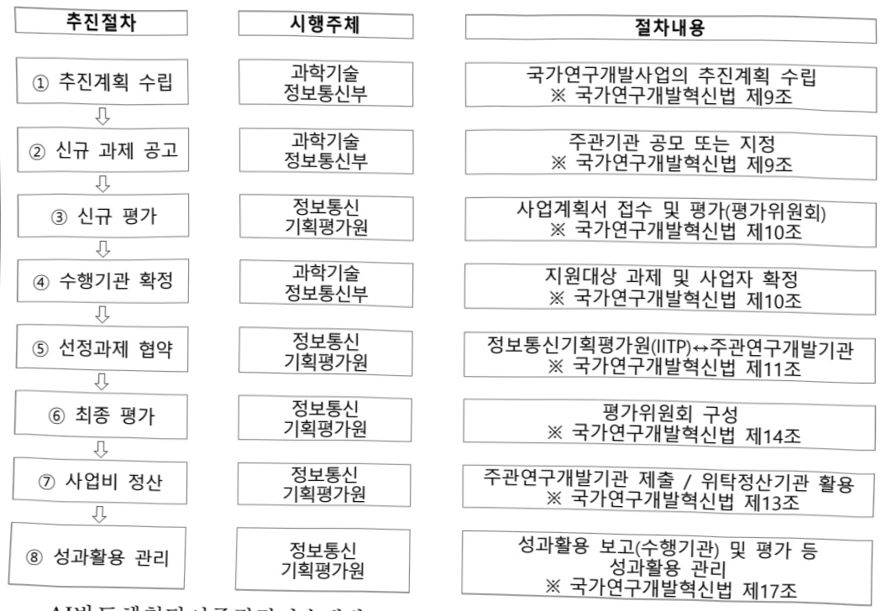

# AI반도체첨단이종집적기술개발(R&D)

**해당 페이지**: PDF 444 ~ 450 쪽 해당

**부처**: 과학기술정보통신부
**분야**: 통신
**회계유형**: 기금
**2026 확정예산**: 7342.0 백만원
**전년대비 증감률**: -11.0%
**AI 도메인**: AI반도체

---

### 가.지출계획 총괄표

(단위: 백만원, %)

<table border=1 style='margin: auto; word-wrap: break-word;'><tr><td rowspan="2">사업명</td><td rowspan="2">2024년 결산</td><td colspan="2">2025년 예산</td><td colspan="2">2026년 예산</td><td rowspan="2">증감(B-A)</td><td rowspan="2">(B-A)/A</td></tr><tr><td style='text-align: center; word-wrap: break-word;'>본예산</td><td style='text-align: center; word-wrap: break-word;'>추경*(A)</td><td style='text-align: center; word-wrap: break-word;'>요구안</td><td style='text-align: center; word-wrap: break-word;'>본예산(B)</td></tr><tr><td style='text-align: center; word-wrap: break-word;'>AI반도체첨단이종집작기술개발(R&amp;D)</td><td style='text-align: center; word-wrap: break-word;'>8,250</td><td style='text-align: center; word-wrap: break-word;'>8,250</td><td style='text-align: center; word-wrap: break-word;'>8,250</td><td style='text-align: center; word-wrap: break-word;'>7,342</td><td style='text-align: center; word-wrap: break-word;'>7,342</td><td style='text-align: center; word-wrap: break-word;'>△908</td><td style='text-align: center; word-wrap: break-word;'>△11.0</td></tr></table>

* 추경: 추경증감액을 포함한 최종 예산액을 기재

## □ 기능별(내역사업별) 계획 내역

(단위:백만원)

<table border=1 style='margin: auto; word-wrap: break-word;'><tr><td rowspan="2"></td><td colspan="5">2024</td><td colspan="5">2025</td><td rowspan="2">2026 계획</td></tr><tr><td style='text-align: center; word-wrap: break-word;'>계획액 (추경)</td><td style='text-align: center; word-wrap: break-word;'>계획 현액</td><td style='text-align: center; word-wrap: break-word;'>집행액</td><td style='text-align: center; word-wrap: break-word;'>이월액</td><td style='text-align: center; word-wrap: break-word;'>불용액</td><td style='text-align: center; word-wrap: break-word;'>계획액 (추경)</td><td style='text-align: center; word-wrap: break-word;'>계획 현액</td><td style='text-align: center; word-wrap: break-word;'>집행액</td><td style='text-align: center; word-wrap: break-word;'>이월액</td><td style='text-align: center; word-wrap: break-word;'>불용액</td></tr><tr><td style='text-align: center; word-wrap: break-word;'>○ 기능별 분류(합계)</td><td style='text-align: center; word-wrap: break-word;'>8,250</td><td style='text-align: center; word-wrap: break-word;'>8,250</td><td style='text-align: center; word-wrap: break-word;'>8,250</td><td style='text-align: center; word-wrap: break-word;'>-</td><td style='text-align: center; word-wrap: break-word;'>-</td><td style='text-align: center; word-wrap: break-word;'>8,250</td><td style='text-align: center; word-wrap: break-word;'>8,250</td><td style='text-align: center; word-wrap: break-word;'>8,250</td><td style='text-align: center; word-wrap: break-word;'>-</td><td style='text-align: center; word-wrap: break-word;'>-</td><td style='text-align: center; word-wrap: break-word;'>7,342</td></tr><tr><td style='text-align: center; word-wrap: break-word;'>• AI반도체첨단 이종집적기술개발</td><td style='text-align: center; word-wrap: break-word;'>8,250</td><td style='text-align: center; word-wrap: break-word;'>8,250</td><td style='text-align: center; word-wrap: break-word;'>8,250</td><td style='text-align: center; word-wrap: break-word;'>-</td><td style='text-align: center; word-wrap: break-word;'>-</td><td style='text-align: center; word-wrap: break-word;'>8,250</td><td style='text-align: center; word-wrap: break-word;'>8,250</td><td style='text-align: center; word-wrap: break-word;'>8,250</td><td style='text-align: center; word-wrap: break-word;'>-</td><td style='text-align: center; word-wrap: break-word;'>-</td><td style='text-align: center; word-wrap: break-word;'>7,342</td></tr></table>

### 나. 사업설명자료

## 1 ) 사업목적·내용

- (AI반도체첨단이종집적기술개발사업) AI반도체 성능 극대화 및 팸리스-파운드리-패키징으로

이어지는 반도체 선순환 생태계 구축을 위한 반도체 이종집적 핵심기술개발

## 2 ) 사업개요

## ☐ 사업근거 및 추진경위

① 법령상 근거 및 조항 적시

- 정보통신 진흥 및 융합 활성화 등에 관한 특별법 제32조

---

제32조(정보통신융합등 기술·서비스 개발 등의 지원) ② 과학기술정보통신부장관은 정보통신융합등

기술·서비스의 개발을 촉진하기 위하여 다음 각 호의 사업을 추진할 수 있다.

1. 정보통신융합등 기술·서비스 관련 연구개발 사업

2. 제1호에 따라 추진되는 과제에 대한 기획·평가·관리

3. 국가·지방자치단체, 대학·정부출연연구기관, 민간 등이 보유한 정보통신융합등 기술의 거래 등 기술이전을 위한 중개·알선 지원

4. 정보통신융합등 기술에 대한 평가 및 평가 기법의 개발·보급

5. 정보통신융합등 기술의 기술이전·사업화에 관한 통계조사·연구 등 관련 정보의 수집·분석·제공

③ 과학기술정보통신부장관은 제2항 각 호의 사업을 추진하기 위하여 법인인 전담기관을 설립하거나 법인·단체에 위탁·운영할 수 있으며, 필요한 비용의 전부 또는 일부를 예산의 범위에서 출연 또는 보조할 수 있다.

② 추진경위

- 4차 산업혁명 대응계획('17.11, 4차산업혁명위원회)

* 4차 산업혁명의 공통기반인 AI·컴퓨팅·로보틱스·데이터 등을 아우르는 지능화 기술의 고도화 추진

-혁신성장동력 추진계획('17.12, 관계부처 합동)

* 13대 혁신성장동력 분야로 '지능형반도체' 선정

- 인공지능(AI) R&D 전략('18.05, 과학기술정보통신부)

* 세계적 수준의 AI 기술력 및 R&D 생태계 확보를 위해 기술개발, 인력양성, 인프라 지원

- 「혁신성장 확산·가속화 전략」('19.8, 관계부처 합동)

* 혁신성장 전략투자 분야로 D.N.A(AI) + BIG3(시스템반도체. 바이오헬스. 미래차) 지성

- 시스템반도체 비전과 전략('19.04, 관계부처합동)

-인공지능 국가전략('19.12, 관계부처합동)

-인공지능반도체 산업 발전전략('20.10, 관계부처합동)

* 인공지능 반도체 선도국가 도약으로 인공지능·종합반도체 강국 실현

- 인공지능 반도체 경쟁력 강화방안('22.1)

-인공지능반도체 산업 성장 지원대책('22.6)

- 국산 AI반도체를 활용한 K-클라우드 추진방안('22.12)

* 초고속·저전력 AI반도체 기술력 기반 국내 클라우드 경쟁력을 혁신적으로 개선

- 국민과 함께하는 민생토론회-민생을 살찌우는 반도체 산업('24.1)

- 반도체 현안점검 회의('24.4, 대통령 주재)

-「AI반도체 이니셔티브」과기전문회의 전원회의 심의·의결('24.4)

- (국정과제 22-4) 차세대 AI반도체(NPU, PIM 등) 기술 선점 및 산업 생태계 조성

---

## 주요내용

① 사업규모

- 총사업비(해당되는 경우에만 기재) : 해당없음

- 사업기간 : '24 ~ '27년

- 최근 5년 간 투입된 사업비(예산액기준, 추경편성한 연도에는 추경포함)

<table border=1 style='margin: auto; word-wrap: break-word;'><tr><td style='text-align: center; word-wrap: break-word;'>$ \underline{\text{焼成}} $</td><td style='text-align: center; word-wrap: break-word;'>2022</td><td style='text-align: center; word-wrap: break-word;'>2023</td><td style='text-align: center; word-wrap: break-word;'>2024</td><td style='text-align: center; word-wrap: break-word;'>2025</td><td style='text-align: center; word-wrap: break-word;'>2026</td></tr><tr><td style='text-align: center; word-wrap: break-word;'>$ \underline{\text{사업비}} $</td><td style='text-align: center; word-wrap: break-word;'>-</td><td style='text-align: center; word-wrap: break-word;'>-</td><td style='text-align: center; word-wrap: break-word;'>8,250</td><td style='text-align: center; word-wrap: break-word;'>8,250</td><td style='text-align: center; word-wrap: break-word;'>7,342</td></tr></table>

-기타: 해당없음

② 사업추진체계

- 사업시행방법 : 출연

- 사업시행주체 : 정보통신기획평가원

- 사업 수혜자 : 기업, 대학, 연구소 등

- 보조, 옵자, 출연, 출자 등의 경우 보조·융자 등 지원 비율 및 법적근거

<table border=1 style='margin: auto; word-wrap: break-word;'><tr><td style='text-align: center; word-wrap: break-word;'>내역사업명</td><td style='text-align: center; word-wrap: break-word;'>구분</td><td style='text-align: center; word-wrap: break-word;'>피보조·피출연 등 기관명</td><td style='text-align: center; word-wrap: break-word;'>지원 금액 (2026계획)</td><td style='text-align: center; word-wrap: break-word;'>지원 비율(%)</td><td style='text-align: center; word-wrap: break-word;'>보조율 법적근거 (해당 조항)</td></tr><tr><td style='text-align: center; word-wrap: break-word;'>AI반도체첨단 이종집적 기술개발</td><td style='text-align: center; word-wrap: break-word;'>출연</td><td style='text-align: center; word-wrap: break-word;'>정보통신 기획평가원</td><td style='text-align: center; word-wrap: break-word;'>7,342</td><td style='text-align: center; word-wrap: break-word;'>100</td><td style='text-align: center; word-wrap: break-word;'>정보통신 진흥 및 융합 활성화 등에 관한 특별법 제32조(정보통신 융합 등 기술·서비스 등의 개발 지원)</td></tr></table>

## 3 )2026년도 계획 산출 근거

○ AI반도체첨단이종집적기술개발(7,342백만원)

- (산출) (계속) 3개 × 2,447.3백만원 × 12/12개월 : 7,342백만원

## 4 ) 사업효과

☐ 사업영향, 산출물 성과지표 등

① 2022~2026년도 성과계획서 상 성과지표 및 최근 5년간 성과 달성도

---

<table border=1 style='margin: auto; word-wrap: break-word;'><tr><td style='text-align: center; word-wrap: break-word;'>2023</td><td style='text-align: center; word-wrap: break-word;'>- 침랫 이종집적 초고성능 AI반도체 개발 등 3개 과제 선정 및 협약 * ICT·융합산업혁신기술개발사업(23년 신규 내역 : 반도체이종집합) 내역사업이 ‘24년 신규 세부사업으로 개편</td></tr><tr><td style='text-align: center; word-wrap: break-word;'>2024</td><td style='text-align: center; word-wrap: break-word;'>- (고성능 침랫 설계) 침단폐기성 침랫 AI반도체 설계 CAD·플로우 및 아키텍처 기반 설계 - (방열 및 저전력 설계) 발열, 온도 시뮬레이션 환경, 정확도 측정, 침랫 간 열전도 고려 방열 아키텍처 - (침랫 인터커넥트 설계) 침랫용 초고속 인터페이스 PHY 설계</td></tr><tr><td style='text-align: center; word-wrap: break-word;'>2025</td><td style='text-align: center; word-wrap: break-word;'>- (고성능 침랫 설계) 침랫 AI반도체를 위한 침랫 반도체 다이 설계 및 침랫 통합 시뮬레이션 - (방열 및 저전력 설계) 침랫 다이의 온도 모델링, 열전도를 고려한 시스템 방열 아키텍처 평가 - (침랫 인터커넥트 설계) 침랫용 초고속 인터페이스 PHY 침 제작 및 성능 검증 후 최적화</td></tr></table>

② 성과지표 이외의 연도별 사업추진 경과 및 실적

<table border=1 style='margin: auto; word-wrap: break-word;'><tr><td style='text-align: center; word-wrap: break-word;'>성과지표</td><td style='text-align: center; word-wrap: break-word;'>구분</td><td style='text-align: center; word-wrap: break-word;'>2022</td><td style='text-align: center; word-wrap: break-word;'>2023</td><td style='text-align: center; word-wrap: break-word;'>2024</td><td style='text-align: center; word-wrap: break-word;'>2025</td><td style='text-align: center; word-wrap: break-word;'>2026</td><td style='text-align: center; word-wrap: break-word;'>2026 목표치산출근거</td><td style='text-align: center; word-wrap: break-word;'>측정산식(또는 측정방법)</td><td style='text-align: center; word-wrap: break-word;'>자료수집방법(또는 자료출처)</td></tr><tr><td rowspan="3">순위보정영향력지수(mrnIF) 평균</td><td style='text-align: center; word-wrap: break-word;'>목표</td><td style='text-align: center; word-wrap: break-word;'>-</td><td style='text-align: center; word-wrap: break-word;'>-</td><td style='text-align: center; word-wrap: break-word;'>60.07</td><td style='text-align: center; word-wrap: break-word;'>61.87</td><td style='text-align: center; word-wrap: break-word;'>63.73</td><td rowspan="3">유사사업21~23년도 실적치평균 설정 후 이후 매년 3%상향</td><td rowspan="3">$ \Sigma(\text{논문} \text{mrnIF}^{*}) / \text{논문전수} $</td><td rowspan="3">NTIS,사업관리시스템등록 논문 원본, JCR DB</td></tr><tr><td style='text-align: center; word-wrap: break-word;'>실적</td><td style='text-align: center; word-wrap: break-word;'>-</td><td style='text-align: center; word-wrap: break-word;'>-</td><td style='text-align: center; word-wrap: break-word;'>집계중</td><td style='text-align: center; word-wrap: break-word;'>-</td><td style='text-align: center; word-wrap: break-word;'>-</td></tr><tr><td style='text-align: center; word-wrap: break-word;'>달성도</td><td style='text-align: center; word-wrap: break-word;'>-</td><td style='text-align: center; word-wrap: break-word;'>-</td><td style='text-align: center; word-wrap: break-word;'></td><td style='text-align: center; word-wrap: break-word;'>-</td><td style='text-align: center; word-wrap: break-word;'>-</td></tr><tr><td rowspan="3">특허(SMART)지수(단위: 점)</td><td style='text-align: center; word-wrap: break-word;'>목표</td><td style='text-align: center; word-wrap: break-word;'>-</td><td style='text-align: center; word-wrap: break-word;'>-</td><td style='text-align: center; word-wrap: break-word;'>-</td><td style='text-align: center; word-wrap: break-word;'>3.84</td><td style='text-align: center; word-wrap: break-word;'>3.92</td><td rowspan="3">유사사업의 3년 실적치평균을 목표치로 설정 후 매년 2% 상향</td><td rowspan="3">$ \Sigma(\text{특허지수}) / \text{특허전수} $</td><td rowspan="3">NTIS,한국발명진흥회,성과분석보고서</td></tr><tr><td style='text-align: center; word-wrap: break-word;'>실적</td><td style='text-align: center; word-wrap: break-word;'>-</td><td style='text-align: center; word-wrap: break-word;'>-</td><td style='text-align: center; word-wrap: break-word;'>-</td><td style='text-align: center; word-wrap: break-word;'>-</td><td style='text-align: center; word-wrap: break-word;'>-</td></tr><tr><td style='text-align: center; word-wrap: break-word;'>달성도</td><td style='text-align: center; word-wrap: break-word;'>-</td><td style='text-align: center; word-wrap: break-word;'>-</td><td style='text-align: center; word-wrap: break-word;'>-</td><td style='text-align: center; word-wrap: break-word;'>-</td><td style='text-align: center; word-wrap: break-word;'>-</td></tr><tr><td rowspan="3">침략 AI반도체성능(단위: TFLOPS)</td><td style='text-align: center; word-wrap: break-word;'>목표</td><td style='text-align: center; word-wrap: break-word;'>-</td><td style='text-align: center; word-wrap: break-word;'>-</td><td style='text-align: center; word-wrap: break-word;'>-</td><td style='text-align: center; word-wrap: break-word;'>128</td><td style='text-align: center; word-wrap: break-word;'>256</td><td rowspan="2">AMD사의 침략AI반도체 침 성능383TFLOPS(FP16)기준 본 사업에서 다이 당128TFLOPS(FP16),4개 다이를 집적하여 512TFLOPS(FP16)목표 설정</td><td rowspan="2">최대성능(Max Performance)을 위한 clock frequency에서 computing에 bound되는 벤치마크소프트웨어를 통해 단위시간 당 FP16 데이터 연산의 양측정</td><td rowspan="2">공인시험성적서</td></tr><tr><td style='text-align: center; word-wrap: break-word;'>실적</td><td style='text-align: center; word-wrap: break-word;'>-</td><td style='text-align: center; word-wrap: break-word;'>-</td><td style='text-align: center; word-wrap: break-word;'>-</td><td style='text-align: center; word-wrap: break-word;'>-</td><td style='text-align: center; word-wrap: break-word;'>-</td></tr><tr><td style='text-align: center; word-wrap: break-word;'>달성도</td><td style='text-align: center; word-wrap: break-word;'>-</td><td style='text-align: center; word-wrap: break-word;'>-</td><td style='text-align: center; word-wrap: break-word;'>-</td><td style='text-align: center; word-wrap: break-word;'>-</td><td style='text-align: center; word-wrap: break-word;'>-</td><td style='text-align: center; word-wrap: break-word;'>Synopsys사의 PrimePower 기준(85%정확도에서 30배 속도 향상), Cadence사의 Joules(85%정확도에서 20배속도 향상)의 스웨보다 높은 성능으로 목표를 설정</td><td style='text-align: center; word-wrap: break-word;'>PrimePower 제품의 시뮬레이션 정확도, 속도 측정 및 결과물의 측정값 비교</td><td style='text-align: center; word-wrap: break-word;'>공인시험성적서, 수요기업 평가</td></tr><tr><td rowspan="3">전력밀도모델링 속도(단위: 배)</td><td style='text-align: center; word-wrap: break-word;'>목표</td><td style='text-align: center; word-wrap: break-word;'>-</td><td style='text-align: center; word-wrap: break-word;'>-</td><td style='text-align: center; word-wrap: break-word;'>-</td><td style='text-align: center; word-wrap: break-word;'>50</td><td style='text-align: center; word-wrap: break-word;'>55</td><td rowspan="2">-</td><td rowspan="2">-</td><td rowspan="2">-</td></tr><tr><td style='text-align: center; word-wrap: break-word;'>실적</td><td style='text-align: center; word-wrap: break-word;'>-</td><td style='text-align: center; word-wrap: break-word;'>-</td><td style='text-align: center; word-wrap: break-word;'>-</td><td style='text-align: center; word-wrap: break-word;'>-</td><td style='text-align: center; word-wrap: break-word;'>-</td></tr><tr><td style='text-align: center; word-wrap: break-word;'>달성도</td><td style='text-align: center; word-wrap: break-word;'>-</td><td style='text-align: center; word-wrap: break-word;'>-</td><td style='text-align: center; word-wrap: break-word;'>-</td><td style='text-align: center; word-wrap: break-word;'>-</td><td style='text-align: center; word-wrap: break-word;'>-</td><td style='text-align: center; word-wrap: break-word;'>-</td><td style='text-align: center; word-wrap: break-word;'>-</td><td style='text-align: center; word-wrap: break-word;'>-</td></tr><tr><td rowspan="3">침략인터페이스대역폭(단위: Gbps/lane)</td><td style='text-align: center; word-wrap: break-word;'>목표</td><td style='text-align: center; word-wrap: break-word;'>-</td><td style='text-align: center; word-wrap: break-word;'>-</td><td style='text-align: center; word-wrap: break-word;'>16</td><td style='text-align: center; word-wrap: break-word;'>16</td><td style='text-align: center; word-wrap: break-word;'>32</td><td rowspan="3">침략 인터페이스표준 - UCIe(Universal Chiplet Interconnect Express) 1.1 규격</td><td rowspan="3">UCIe 1.1 규격</td><td rowspan="3">시뮬레이션 결과, 공인시험성적서</td></tr><tr><td style='text-align: center; word-wrap: break-word;'>실적</td><td style='text-align: center; word-wrap: break-word;'>-</td><td style='text-align: center; word-wrap: break-word;'>-</td><td style='text-align: center; word-wrap: break-word;'>16</td><td style='text-align: center; word-wrap: break-word;'>16</td><td style='text-align: center; word-wrap: break-word;'>-</td></tr><tr><td style='text-align: center; word-wrap: break-word;'>달성도</td><td style='text-align: center; word-wrap: break-word;'>-</td><td style='text-align: center; word-wrap: break-word;'>-</td><td style='text-align: center; word-wrap: break-word;'>100</td><td style='text-align: center; word-wrap: break-word;'>100</td><td style='text-align: center; word-wrap: break-word;'>-</td></tr></table>

---

③ 향후(2026년도 이후) 기대효과 : 개조식으로 작성, 건 별로 계량적 수치 제시

- Near-Memory PIM을 첨단 패키징 기술과 융합하여 반도체 성능 스케일링(Scaling)의 한계를 극복하는 신기술을 확보하여 고성능 AI반도체 개발 확산 기대

- 국내에서 팸리스-과운드리-팸키징으로 이어지는 반도체 선순환 생태계를 구축하는 초석(Seed initiative) 마련

5) 타당성조사 및 예비타당성조사 시행여부 및 결과 요지 : 해당없음

## 6 ) 총사업비 대상사업 여부 및 내역 : 해당없음

## 7 ) 사업 집행절차

- AI반도체첨단이종집적기술개발

<table border=1 style='margin: auto; word-wrap: break-word;'><tr><td style='text-align: center; word-wrap: break-word;'>부처</td><td style='text-align: center; word-wrap: break-word;'></td><td style='text-align: center; word-wrap: break-word;'>피출연·피보조기관</td><td style='text-align: center; word-wrap: break-word;'></td><td style='text-align: center; word-wrap: break-word;'>간접보조사업자·사업수행자</td></tr><tr><td style='text-align: center; word-wrap: break-word;'>부처(7,342백만원)</td><td style='text-align: center; word-wrap: break-word;'>=&gt;(7,342백만원)</td><td style='text-align: center; word-wrap: break-word;'>정보통신기획평가원(-)</td><td style='text-align: center; word-wrap: break-word;'>=&gt;(7,342백만원)</td><td style='text-align: center; word-wrap: break-word;'>AI반도체 관련산학연 기관</td></tr></table>

---

## 8 ) 각종 평가 : 해당없음

### 다. 최근 4년간 결산내역

## 1 ) 결산표

☐ 부처 결산내역

(단위: 백만원, %)

<table border=1 style='margin: auto; word-wrap: break-word;'><tr><td rowspan="2">연도</td><td colspan="3">계획액</td><td rowspan="2">계획현액(A)</td><td rowspan="2">집행액(B)</td><td rowspan="2">집행률(B/A)</td><td rowspan="2">다음연도이월액</td><td rowspan="2">불용액</td></tr><tr><td style='text-align: center; word-wrap: break-word;'>본예산</td><td style='text-align: center; word-wrap: break-word;'>추경중감액</td><td style='text-align: center; word-wrap: break-word;'>추경</td></tr><tr><td style='text-align: center; word-wrap: break-word;'>2024</td><td style='text-align: center; word-wrap: break-word;'>8,250</td><td style='text-align: center; word-wrap: break-word;'>-</td><td style='text-align: center; word-wrap: break-word;'>8,250</td><td style='text-align: center; word-wrap: break-word;'>8,250</td><td style='text-align: center; word-wrap: break-word;'>8,250</td><td style='text-align: center; word-wrap: break-word;'>100</td><td style='text-align: center; word-wrap: break-word;'>100</td><td style='text-align: center; word-wrap: break-word;'>-</td></tr><tr><td style='text-align: center; word-wrap: break-word;'>2025</td><td style='text-align: center; word-wrap: break-word;'>8,250</td><td style='text-align: center; word-wrap: break-word;'>-</td><td style='text-align: center; word-wrap: break-word;'>8,250</td><td style='text-align: center; word-wrap: break-word;'>8,250</td><td style='text-align: center; word-wrap: break-word;'>8,250</td><td style='text-align: center; word-wrap: break-word;'>100</td><td style='text-align: center; word-wrap: break-word;'>100</td><td style='text-align: center; word-wrap: break-word;'>-</td></tr></table>

## 2 ) 주요 결산사항

2022~2025년 결산 주요 지적사항 및 시정요구사항 : 해당없음

2025년 이·전용 등 세부내역 : 해당없음

---

<table border=1 style='margin: auto; word-wrap: break-word;'><tr><td style='text-align: center; word-wrap: break-word;'>사 업 명</td></tr><tr><td style='text-align: center; word-wrap: break-word;'>(40) AI산업육성 (2602-301)</td></tr></table>

☐ 사업 코드 정보

<table border=1 style='margin: auto; word-wrap: break-word;'><tr><td style='text-align: center; word-wrap: break-word;'>구분</td><td style='text-align: center; word-wrap: break-word;'>기금</td><td style='text-align: center; word-wrap: break-word;'>소관</td><td style='text-align: center; word-wrap: break-word;'>실국(기관)</td><td style='text-align: center; word-wrap: break-word;'>계정</td><td style='text-align: center; word-wrap: break-word;'>분야</td><td style='text-align: center; word-wrap: break-word;'>부문</td></tr><tr><td style='text-align: center; word-wrap: break-word;'>코드</td><td style='text-align: center; word-wrap: break-word;'>정보통신</td><td style='text-align: center; word-wrap: break-word;'>과학기술</td><td style='text-align: center; word-wrap: break-word;'>인공지능</td><td rowspan="2"></td><td style='text-align: center; word-wrap: break-word;'>130</td><td style='text-align: center; word-wrap: break-word;'>133</td></tr><tr><td style='text-align: center; word-wrap: break-word;'>명칭</td><td style='text-align: center; word-wrap: break-word;'>진흥기금</td><td style='text-align: center; word-wrap: break-word;'>정보통신부</td><td style='text-align: center; word-wrap: break-word;'>기반정책관</td><td style='text-align: center; word-wrap: break-word;'>통신</td><td style='text-align: center; word-wrap: break-word;'>정보통신</td></tr></table>

<table border=1 style='margin: auto; word-wrap: break-word;'><tr><td style='text-align: center; word-wrap: break-word;'>구분</td><td style='text-align: center; word-wrap: break-word;'>프로그램</td><td style='text-align: center; word-wrap: break-word;'>단위사업</td><td style='text-align: center; word-wrap: break-word;'>세부사업</td></tr><tr><td style='text-align: center; word-wrap: break-word;'>코드</td><td style='text-align: center; word-wrap: break-word;'>2600</td><td style='text-align: center; word-wrap: break-word;'>2602</td><td style='text-align: center; word-wrap: break-word;'>301</td></tr><tr><td style='text-align: center; word-wrap: break-word;'>명칭</td><td style='text-align: center; word-wrap: break-word;'>인공지능데이터진흥</td><td style='text-align: center; word-wrap: break-word;'>AI경쟁력강화(정진)</td><td style='text-align: center; word-wrap: break-word;'>AI산업육성</td></tr></table>

<table border=1 style='margin: auto; word-wrap: break-word;'><tr><td colspan="6">☐ 사업 성격 (공통요구자료 II-1 작성유의사항 4. 참조, 해당하는 사항에 “○” 표시)</td></tr><tr><td style='text-align: center; word-wrap: break-word;'>신규 계속</td><td style='text-align: center; word-wrap: break-word;'>완료</td><td style='text-align: center; word-wrap: break-word;'>예비타당성 실시여부</td><td style='text-align: center; word-wrap: break-word;'>총사업비 관리대상</td><td style='text-align: center; word-wrap: break-word;'>총액계상 예산사업</td><td style='text-align: center; word-wrap: break-word;'>사업소관 변경정보 2025예산 시 소관</td></tr><tr><td style='text-align: center; word-wrap: break-word;'></td><td style='text-align: center; word-wrap: break-word;'>O</td><td style='text-align: center; word-wrap: break-word;'></td><td style='text-align: center; word-wrap: break-word;'></td><td style='text-align: center; word-wrap: break-word;'></td><td style='text-align: center; word-wrap: break-word;'></td></tr></table>

사업지원형태 및지원을(최소한한개는반드시선택하시오.해당사항에O표시)

<table border=1 style='margin: auto; word-wrap: break-word;'><tr><td style='text-align: center; word-wrap: break-word;'>직접</td><td style='text-align: center; word-wrap: break-word;'>출자</td><td style='text-align: center; word-wrap: break-word;'>출연</td><td style='text-align: center; word-wrap: break-word;'>보조</td><td style='text-align: center; word-wrap: break-word;'>융자</td><td style='text-align: center; word-wrap: break-word;'>국고보조율(%)</td><td style='text-align: center; word-wrap: break-word;'>융자율(%)</td></tr><tr><td style='text-align: center; word-wrap: break-word;'></td><td style='text-align: center; word-wrap: break-word;'></td><td style='text-align: center; word-wrap: break-word;'>O</td><td style='text-align: center; word-wrap: break-word;'></td><td style='text-align: center; word-wrap: break-word;'></td><td style='text-align: center; word-wrap: break-word;'></td><td style='text-align: center; word-wrap: break-word;'></td></tr></table>

□ 사업 소관부처 및 시행주체

<table border=1 style='margin: auto; word-wrap: break-word;'><tr><td style='text-align: center; word-wrap: break-word;'>사업명</td><td colspan="2">구분</td></tr><tr><td rowspan="2"></td><td style='text-align: center; word-wrap: break-word;'>소관부처</td><td style='text-align: center; word-wrap: break-word;'></td></tr><tr><td style='text-align: center; word-wrap: break-word;'>사업시행주체</td><td style='text-align: center; word-wrap: break-word;'></td></tr><tr><td rowspan="3">부처협업기반 AI 확산</td><td rowspan="2">소관부처</td><td style='text-align: center; word-wrap: break-word;'>정보통신정책실정보통신정책관</td></tr><tr><td style='text-align: center; word-wrap: break-word;'>디지털사회기획과</td></tr><tr><td style='text-align: center; word-wrap: break-word;'>사업시행주체</td><td style='text-align: center; word-wrap: break-word;'>정보통신산업진흥원</td></tr></table>

---

### 원본 PDF 크롭 이미지

