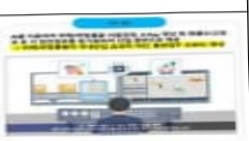

# AI산업육성

**해당 페이지**: PDF 451 ~ 464 쪽 해당

**부처**: 과학기술정보통신부
**분야**: 통신
**회계유형**: 기금
**2026 확정예산**: 21855.0 백만원
**전년대비 증감률**: -71.4%
**AI 도메인**: 디지털전환(AX)

---

### 가.지출계획 총괄표

(단위: 백만원, %)

<table border=1 style='margin: auto; word-wrap: break-word;'><tr><td rowspan="2">목명</td><td style='text-align: center; word-wrap: break-word;'>2024년</td><td colspan="2">2025년 계획</td><td colspan="2">2026년</td><td colspan="2">증감</td></tr><tr><td style='text-align: center; word-wrap: break-word;'>결산</td><td style='text-align: center; word-wrap: break-word;'>당초(A)</td><td style='text-align: center; word-wrap: break-word;'>수정</td><td style='text-align: center; word-wrap: break-word;'>요구안</td><td style='text-align: center; word-wrap: break-word;'>조정안(B)</td><td style='text-align: center; word-wrap: break-word;'>(B-A)</td><td style='text-align: center; word-wrap: break-word;'>(B-A)/A</td></tr><tr><td style='text-align: center; word-wrap: break-word;'>사업출연금</td><td style='text-align: center; word-wrap: break-word;'>87,823</td><td style='text-align: center; word-wrap: break-word;'>76,664</td><td style='text-align: center; word-wrap: break-word;'>100,157</td><td style='text-align: center; word-wrap: break-word;'>21,855</td><td style='text-align: center; word-wrap: break-word;'>21,855</td><td style='text-align: center; word-wrap: break-word;'>△54,809</td><td style='text-align: center; word-wrap: break-word;'>△71.4</td></tr></table>

*25년 사업구조개편으로 부처협업기반AI확산(2602-303)사업이 AI산업생태계지원 내내역(부처협업기반AI확산)사업으로 이관

**26년 사업구조개편으로 AI정책제도지원(AI신뢰성기반조성 일부, AI산업생태계기반마련사업이 디지털질서기반구축및글로벌확산 지원 사업으로 이관

※ 지능정보산업인프라조성사업의 AI산업생태계지원 내역사업인 AI바우처지원, 고성능컴퓨팅지원사업은

'26회계연도부터 타 세부사업(AI통합바우처(2602-336)으로 이관됨에 따라 해당 내역 제외·작성

## □ 기능별(내역사업별), 목별 계획 내역

<table border=1 style='margin: auto; word-wrap: break-word;'><tr><td rowspan="3"></td><td colspan="5">2024</td><td colspan="8">2025(2025.12월말)</td><td rowspan="3">2026 계획안</td></tr><tr><td rowspan="2">계획액(수정)</td><td rowspan="2">계획현액</td><td rowspan="2">집행액[실집행액]</td><td rowspan="2">이월액</td><td rowspan="2">불용액</td><td colspan="2">계획액</td><td rowspan="2">계획현액</td><td rowspan="2">집행액[실집행액]</td><td colspan="2">전년도 이월액제외</td><td rowspan="2">이월예상액</td><td rowspan="2">불용예상액</td></tr><tr><td style='text-align: center; word-wrap: break-word;'>당초</td><td style='text-align: center; word-wrap: break-word;'>수정</td><td style='text-align: center; word-wrap: break-word;'>계획현액</td><td style='text-align: center; word-wrap: break-word;'>집행액[실집행액]</td></tr><tr><td style='text-align: center; word-wrap: break-word;'>○ 기능별 분류(합계)</td><td style='text-align: center; word-wrap: break-word;'>87,823</td><td style='text-align: center; word-wrap: break-word;'>87,823</td><td style='text-align: center; word-wrap: break-word;'>87,823[86,427]</td><td style='text-align: center; word-wrap: break-word;'>-</td><td style='text-align: center; word-wrap: break-word;'>1,396</td><td style='text-align: center; word-wrap: break-word;'>76,664</td><td style='text-align: center; word-wrap: break-word;'>100,157</td><td style='text-align: center; word-wrap: break-word;'>100,157</td><td style='text-align: center; word-wrap: break-word;'>100,157[99,161]</td><td style='text-align: center; word-wrap: break-word;'>100,157</td><td style='text-align: center; word-wrap: break-word;'>100,157[99,161]</td><td style='text-align: center; word-wrap: break-word;'>-</td><td style='text-align: center; word-wrap: break-word;'>-</td><td style='text-align: center; word-wrap: break-word;'>2,1855</td></tr><tr><td style='text-align: center; word-wrap: break-word;'>· AI산업생태계지원</td><td style='text-align: center; word-wrap: break-word;'>79,700</td><td style='text-align: center; word-wrap: break-word;'>79,700</td><td style='text-align: center; word-wrap: break-word;'>79,700[78,724]</td><td style='text-align: center; word-wrap: break-word;'>-</td><td style='text-align: center; word-wrap: break-word;'>976</td><td style='text-align: center; word-wrap: break-word;'>72,785</td><td style='text-align: center; word-wrap: break-word;'>96,278</td><td style='text-align: center; word-wrap: break-word;'>96,278[95,449]</td><td style='text-align: center; word-wrap: break-word;'>96,278</td><td style='text-align: center; word-wrap: break-word;'>96,278[95,449]</td><td style='text-align: center; word-wrap: break-word;'>96,278[95,449]</td><td style='text-align: center; word-wrap: break-word;'>-</td><td style='text-align: center; word-wrap: break-word;'>-</td><td style='text-align: center; word-wrap: break-word;'>20,000</td></tr><tr><td style='text-align: center; word-wrap: break-word;'>· 부처협업기반AI확산</td><td style='text-align: center; word-wrap: break-word;'>24,000</td><td style='text-align: center; word-wrap: break-word;'>24,000</td><td style='text-align: center; word-wrap: break-word;'>24,000[23,482]</td><td style='text-align: center; word-wrap: break-word;'>-</td><td style='text-align: center; word-wrap: break-word;'>518</td><td style='text-align: center; word-wrap: break-word;'>25,360</td><td style='text-align: center; word-wrap: break-word;'>25,360</td><td style='text-align: center; word-wrap: break-word;'>25,360[24,842]</td><td style='text-align: center; word-wrap: break-word;'>25,360[24,842]</td><td style='text-align: center; word-wrap: break-word;'>25,360[24,842]</td><td style='text-align: center; word-wrap: break-word;'>25,360[24,842]</td><td style='text-align: center; word-wrap: break-word;'>-</td><td style='text-align: center; word-wrap: break-word;'>-</td><td style='text-align: center; word-wrap: break-word;'>20,000</td></tr><tr><td style='text-align: center; word-wrap: break-word;'>· AI 바우처 지원</td><td style='text-align: center; word-wrap: break-word;'>42,500</td><td style='text-align: center; word-wrap: break-word;'>42,500</td><td style='text-align: center; word-wrap: break-word;'>42,500[42,150]</td><td style='text-align: center; word-wrap: break-word;'>-</td><td style='text-align: center; word-wrap: break-word;'>350</td><td style='text-align: center; word-wrap: break-word;'>27,625</td><td style='text-align: center; word-wrap: break-word;'>27,625</td><td style='text-align: center; word-wrap: break-word;'>27,625[27,525]</td><td style='text-align: center; word-wrap: break-word;'>27,625[27,525]</td><td style='text-align: center; word-wrap: break-word;'>27,625[27,525]</td><td style='text-align: center; word-wrap: break-word;'>27,625[27,525]</td><td style='text-align: center; word-wrap: break-word;'>-</td><td style='text-align: center; word-wrap: break-word;'>-</td><td style='text-align: center; word-wrap: break-word;'>이관</td></tr><tr><td style='text-align: center; word-wrap: break-word;'>· 고성능 컴퓨팅 지원</td><td style='text-align: center; word-wrap: break-word;'>13,200</td><td style='text-align: center; word-wrap: break-word;'>13,200</td><td style='text-align: center; word-wrap: break-word;'>13,200[13,092]</td><td style='text-align: center; word-wrap: break-word;'>-</td><td style='text-align: center; word-wrap: break-word;'>108</td><td style='text-align: center; word-wrap: break-word;'>19,800</td><td style='text-align: center; word-wrap: break-word;'>43,293</td><td style='text-align: center; word-wrap: break-word;'>43,293[43,082]</td><td style='text-align: center; word-wrap: break-word;'>43,293[43,082]</td><td style='text-align: center; word-wrap: break-word;'>43,293[43,082]</td><td style='text-align: center; word-wrap: break-word;'>43,293[43,082]</td><td style='text-align: center; word-wrap: break-word;'>-</td><td style='text-align: center; word-wrap: break-word;'>-</td><td style='text-align: center; word-wrap: break-word;'>이관</td></tr><tr><td style='text-align: center; word-wrap: break-word;'>· AI정책제도지원</td><td style='text-align: center; word-wrap: break-word;'>6,373</td><td style='text-align: center; word-wrap: break-word;'>6,373</td><td style='text-align: center; word-wrap: break-word;'>6,373[6,214]</td><td style='text-align: center; word-wrap: break-word;'>-</td><td style='text-align: center; word-wrap: break-word;'>159</td><td style='text-align: center; word-wrap: break-word;'>3,879</td><td style='text-align: center; word-wrap: break-word;'>3,879[3,712]</td><td style='text-align: center; word-wrap: break-word;'>3,879[3,712]</td><td style='text-align: center; word-wrap: break-word;'>3,879[3,712]</td><td style='text-align: center; word-wrap: break-word;'>3,879[3,712]</td><td style='text-align: center; word-wrap: break-word;'>3,879[3,712]</td><td style='text-align: center; word-wrap: break-word;'>-</td><td style='text-align: center; word-wrap: break-word;'>-</td><td style='text-align: center; word-wrap: break-word;'>1,855</td></tr><tr><td style='text-align: center; word-wrap: break-word;'>· AI신뢰성기반조성</td><td style='text-align: center; word-wrap: break-word;'>4,973</td><td style='text-align: center; word-wrap: break-word;'>4,973</td><td style='text-align: center; word-wrap: break-word;'>4,973[4,849]</td><td style='text-align: center; word-wrap: break-word;'>-</td><td style='text-align: center; word-wrap: break-word;'>124</td><td style='text-align: center; word-wrap: break-word;'>2,983</td><td style='text-align: center; word-wrap: break-word;'>2,983[2,819]</td><td style='text-align: center; word-wrap: break-word;'>2,983[2,819]</td><td style='text-align: center; word-wrap: break-word;'>2,983[2,819]</td><td style='text-align: center; word-wrap: break-word;'>2,983[2,819]</td><td style='text-align: center; word-wrap: break-word;'>2,983[2,819]</td><td style='text-align: center; word-wrap: break-word;'>-</td><td style='text-align: center; word-wrap: break-word;'>-</td><td style='text-align: center; word-wrap: break-word;'>1,855</td></tr><tr><td style='text-align: center; word-wrap: break-word;'>· AI산업생태계기반마련</td><td style='text-align: center; word-wrap: break-word;'>1,400</td><td style='text-align: center; word-wrap: break-word;'>1,400</td><td style='text-align: center; word-wrap: break-word;'>1,400[1,365]</td><td style='text-align: center; word-wrap: break-word;'>-</td><td style='text-align: center; word-wrap: break-word;'>35</td><td style='text-align: center; word-wrap: break-word;'>896</td><td style='text-align: center; word-wrap: break-word;'>896[893]</td><td style='text-align: center; word-wrap: break-word;'>896[893]</td><td style='text-align: center; word-wrap: break-word;'>896[893]</td><td style='text-align: center; word-wrap: break-word;'>896[893]</td><td style='text-align: center; word-wrap: break-word;'>896[893]</td><td style='text-align: center; word-wrap: break-word;'>-</td><td style='text-align: center; word-wrap: break-word;'>-</td><td style='text-align: center; word-wrap: break-word;'>이관</td></tr><tr><td style='text-align: center; word-wrap: break-word;'>· AI SW 개발환경조성</td><td style='text-align: center; word-wrap: break-word;'>250</td><td style='text-align: center; word-wrap: break-word;'>250</td><td style='text-align: center; word-wrap: break-word;'>250[249]</td><td style='text-align: center; word-wrap: break-word;'>-</td><td style='text-align: center; word-wrap: break-word;'>1</td><td style='text-align: center; word-wrap: break-word;'>-</td><td style='text-align: center; word-wrap: break-word;'>-</td><td style='text-align: center; word-wrap: break-word;'>-</td><td style='text-align: center; word-wrap: break-word;'>-</td><td style='text-align: center; word-wrap: break-word;'>-</td><td style='text-align: center; word-wrap: break-word;'>-</td><td style='text-align: center; word-wrap: break-word;'>-</td><td style='text-align: center; word-wrap: break-word;'>-</td><td style='text-align: center; word-wrap: break-word;'>종료</td></tr><tr><td style='text-align: center; word-wrap: break-word;'>· 민간지능정보서비스 확산</td><td style='text-align: center; word-wrap: break-word;'>1,500</td><td style='text-align: center; word-wrap: break-word;'>1,500</td><td style='text-align: center; word-wrap: break-word;'>1,500[1,240]</td><td style='text-align: center; word-wrap: break-word;'>-</td><td style='text-align: center; word-wrap: break-word;'>260</td><td style='text-align: center; word-wrap: break-word;'>-</td><td style='text-align: center; word-wrap: break-word;'>-</td><td style='text-align: center; word-wrap: break-word;'>-</td><td style='text-align: center; word-wrap: break-word;'>-</td><td style='text-align: center; word-wrap: break-word;'>-</td><td style='text-align: center; word-wrap: break-word;'>-</td><td style='text-align: center; word-wrap: break-word;'>-</td><td style='text-align: center; word-wrap: break-word;'>-</td><td style='text-align: center; word-wrap: break-word;'>종료</td></tr><tr><td style='text-align: center; word-wrap: break-word;'>○ 비목별 분류(합계)</td><td style='text-align: center; word-wrap: break-word;'>87,823</td><td style='text-align: center; word-wrap: break-word;'>87,823</td><td style='text-align: center; word-wrap: break-word;'>87,823[86,427]</td><td style='text-align: center; word-wrap: break-word;'>-</td><td style='text-align: center; word-wrap: break-word;'>1,396</td><td style='text-align: center; word-wrap: break-word;'>76,664</td><td style='text-align: center; word-wrap: break-word;'>100,157</td><td style='text-align: center; word-wrap: break-word;'>100,157[99,161]</td><td style='text-align: center; word-wrap: break-word;'>100,157[99,161]</td><td style='text-align: center; word-wrap: break-word;'>100,157[99,161]</td><td style='text-align: center; word-wrap: break-word;'>100,157[99,161]</td><td style='text-align: center; word-wrap: break-word;'>-</td><td style='text-align: center; word-wrap: break-word;'>-</td><td style='text-align: center; word-wrap: break-word;'>2,1855</td></tr><tr><td style='text-align: center; word-wrap: break-word;'>· 사업출연금(350-02)</td><td style='text-align: center; word-wrap: break-word;'>87,823</td><td style='text-align: center; word-wrap: break-word;'>87,823</td><td style='text-align: center; word-wrap: break-word;'>87,823[86,427]</td><td style='text-align: center; word-wrap: break-word;'>-</td><td style='text-align: center; word-wrap: break-word;'>1,396</td><td style='text-align: center; word-wrap: break-word;'>76,664</td><td style='text-align: center; word-wrap: break-word;'>100,157</td><td style='text-align: center; word-wrap: break-word;'>100,157[99,161]</td><td style='text-align: center; word-wrap: break-word;'>100,157[99,161]</td><td style='text-align: center; word-wrap: break-word;'>100,157[99,161]</td><td style='text-align: center; word-wrap: break-word;'>100,157[99,161]</td><td style='text-align: center; word-wrap: break-word;'>-</td><td style='text-align: center; word-wrap: break-word;'>-</td><td style='text-align: center; word-wrap: break-word;'>2,1855</td></tr></table>

---

### 나. 사업설명자료

## 1 ) 사업목적·내용

° (AI산업육성) 인공지능 기반 디지털 전환 촉진, AI신뢰성 검증체계 마련 및 공공

부문 AI융합 가속화 등을 통한 인공지능 응용서비스 개발 활성화

- (AI산업생태계지원) 인공지능(AI) 응용서비스 개발 활성화를 위해 AI바우처, 고성능 컴퓨팅 지원 및 부처협업 기반 AI솔루션 개발·실증 등을 통한 AI산업 생태계 지원

(부처협업 기반 AI확산) 부처 간 협업을 통해 AI 솔루션·서비스 등을 개발·실증하여 공공부문 AI 도입·확산을 유도하고 AI 기업 경쟁력 강화

- (AI정책제도지원) 지속가능한 AI 산업 발전과 AI 기술의 사회적 수용도 제고를 위해 AI 신뢰성 확보를 지원하고 AI 기술에 대한 사회적 우려(차별·편향 심화, 사생활 침해 등) 해소를 위해 AI 신뢰성 검증

## 2 ) 사업개요

## ☐ 사업근거 및 추진경위

① 법령상 근거 및 조항 적시

- 정보통신산업진흥법 제7조, 제10조, 제21조, 제27조, 제44조

제7조(정보통신기술진흥 시행계획) ① 과학기술정보통신부장관은 정보통신기술의 진흥을 위하여 진흥계획에 따라 다음 각 호의 사항이 포함된 정보통신기술진흥 시행계획을 매년 수립 · 시행하여야 한다.

1. 정보통신기술 수준의 조사, 개발된 정보통신기술의 평가 및 활용에 관한 사항

2. 정보통신기술 관련 정보의 원활한 유통에 관한 사항

3. 정보통신기술의 연구개발 및 다른 기술과의 결합 및 융합 촉진에 관한 사항

4. 정보통신기술의 협력, 지도 및 이전에 관한 사항

5. 정보통신기술에 관한 산학협동 촉진에 관한 사항

6. 전문인력의 양성 및 수급에 관한 사항

7. 정보통신기술의 표준화 및 새로운 정보통신기술의 채택에 관한 사항

8. 정보통신기술을 연구하는 기관 또는 단체의 육성에 관한 사항

9. 정보통신기술의 국제협력에 관한 사항

10. 그 밖에 정보통신기술의 진흥을 위하여 필요한 사항

② 과학기술정보통신부장관은 제1항에 따른 사항을 효율적으로 추진하기 위하여 필요하면 대통령령으로 정하는 바에 따라 정보통신기술의 개발 및 정보통신산업의 진흥과 관련된 연구기관 및 단체로 하여금 이를 대행하게 할 수 있으며 이에 드는 비용을 지원할 수 있다.

③ 제1항에 따른 정보통신기술진흥 시행계획의 수립·시행 등에 필요한 사항은 대통령령으로 정한다

---

<table border=1 style='margin: auto; word-wrap: break-word;'><tr><td style='text-align: center; word-wrap: break-word;'>제10조(정보통신기술 관련 정보의 관리 및 보급) ① 과학기술정보통신부장관은 정보통신산업의 진흥을 위하여 정보통신기술 관련 정보를 체계적·종합적으로 관리·보급하는 방안을 마련하여야 한다.</td></tr><tr><td style='text-align: center; word-wrap: break-word;'>② 과학기술정보통신부장관은 정보통신기술 관련 정보를 체계적·종합적으로 관리하기 위하여 필요하면 관계 행정기관 및 국·공립 연구기관 등에 정보통신기술 관련 정보와 이와 관련된 자료를 요구할 수 있다. 이 경우 요구를 받은 기관의 장은 특별한 사유가 없으면 이에 협조하여야 한다.</td></tr><tr><td style='text-align: center; word-wrap: break-word;'>③ 과학기술정보통신부장관은 정보통신기술 관련 정보를 신속하고 편리하게 이용할 수 있도록 그 보급을 위한 사업을 하여야 한다.</td></tr><tr><td style='text-align: center; word-wrap: break-word;'>④ 제3항에 따라 보급의 대상이 되는 정보통신기술 관련 정보의 세부적인 범위는 대통령령으로 정한다.</td></tr><tr><td style='text-align: center; word-wrap: break-word;'>제21조(정보통신망 응용서비스의 개발촉진 등) ① 정부는 국가기관등이 정보통신망을 활용하여 업무를 효율화·자동화·고도화하는 응용서비스(이하 “정보통신망 응용서비스”라 한다)를 개발·운영하는 경우 해당 기관에 재정 및 기술 등 필요한 지원을 할 수 있다.</td></tr><tr><td style='text-align: center; word-wrap: break-word;'>② 과학기술정보통신부장관은 민간부문에 의한 정보통신망 응용서비스의 개발을 촉진하기 위하여 재정 및 기술 등 필요한 지원을 할 수 있다.</td></tr><tr><td style='text-align: center; word-wrap: break-word;'>제27조(사업) 산업진흥원은 다음 각 호의 사업을 한다.</td></tr><tr><td style='text-align: center; word-wrap: break-word;'>1. 정보통신산업 정책연구 및 정책수립 지원</td></tr><tr><td style='text-align: center; word-wrap: break-word;'>2. 전문인력 양성</td></tr><tr><td style='text-align: center; word-wrap: break-word;'>3. 정보통신산업 육성·발전 및 지원시설 등 기반조성사업</td></tr><tr><td style='text-align: center; word-wrap: break-word;'>4. 정보통신기업의 창업·성장 등의 지원</td></tr><tr><td style='text-align: center; word-wrap: break-word;'>5. 정보통신산업 발전을 위한 유통시장 활성화와 마케팅 지원</td></tr><tr><td style='text-align: center; word-wrap: break-word;'>6. 정보통신산업 동향분석, 통계작성, 정보 유통, 서비스 등에 관한 사업</td></tr><tr><td style='text-align: center; word-wrap: break-word;'>7. 정보통신기술의 융합·활용에 관한 사업</td></tr><tr><td style='text-align: center; word-wrap: break-word;'>8. 정보통신산업 관련 국제교류·협력 및 해외진출의 지원</td></tr><tr><td style='text-align: center; word-wrap: break-word;'>9. 정보통신산업 관련 출판·홍보</td></tr><tr><td style='text-align: center; word-wrap: break-word;'>10. 「소프트웨어 진흥법」 제2조제2호에 따른 소프트웨어산업에 관한 다음 각 목의 사업가. 소프트웨어 기술진흥을 위한 정책 및 제도의 조사·연구</td></tr><tr><td style='text-align: center; word-wrap: break-word;'>나. 소프트웨어사업자의 품질관리능력 및 전문성 향상에 필요한 사업</td></tr><tr><td style='text-align: center; word-wrap: break-word;'>12. 「이러닝(전자학습)산업 발전 및 이러닝 활용 촉진에 관한 법률」에 따른 이러닝산업의 발전에 필요한 기술개발 및 표준화 연구</td></tr><tr><td style='text-align: center; word-wrap: break-word;'>13. 이 법 또는 다른 법령에서 산업진흥원의 업무로 정하거나 산업진흥원에 위탁한 사업</td></tr><tr><td style='text-align: center; word-wrap: break-word;'>14. 그 밖에 산업진흥원의 설립 목적을 달성하는 데 필요한 사업으로서 대통령령으로 정하는 사업</td></tr><tr><td style='text-align: center; word-wrap: break-word;'>제44조(기금의 용도 등) ① 기금은 진흥계획에 따라 시행되는 다음 각 호의 어느 하나에 해당하는 용도에 사용한다.</td></tr><tr><td style='text-align: center; word-wrap: break-word;'>1. 정보통신(전파방송을 포함한다. 이하 이 항에서 같다)에 관한 연구개발사업</td></tr><tr><td style='text-align: center; word-wrap: break-word;'>2. 정보통신 관련 표준의 개발·제정 및 보급사업</td></tr><tr><td style='text-align: center; word-wrap: break-word;'>3. 정보통신 관련 인력의 양성사업</td></tr><tr><td style='text-align: center; word-wrap: break-word;'>4. 제1호부터 제3호까지에 규정된 사업 외에 정보통신산업의 기반조성을 위한 사업</td></tr><tr><td style='text-align: center; word-wrap: break-word;'>5. 삭제&lt;2010. 3. 22.&gt;</td></tr><tr><td style='text-align: center; word-wrap: break-word;'>6. 「전파법」 제7조제5항에 따라 반환하는 주파수할당 대가</td></tr><tr><td style='text-align: center; word-wrap: break-word;'>7. 제1호부터 제4호까지에 규정된 사업의 부대사업</td></tr></table>

---

② 과학기술정보통신부장관은 기금을 사용하는 자가 그 기금을 지출 목적이 아닌 목적으로 사용한 경우에는 목적 외로 지출된 기금을 환수할 수 있다.

<table border=1 style='margin: auto; word-wrap: break-word;'><tr><td style='text-align: center; word-wrap: break-word;'>③ 제2항에 따른 기금의 환수는 국세 체납처분의 예에 따른다. - 정보통신 진흥 및 융합 활성화 등에 관한 특별법 제32조</td></tr><tr><td style='text-align: center; word-wrap: break-word;'>제32조(정보통신융합등 기술·서비스 개발 등의 지원) ① 과학기술정보통신부장관은 다른 산업 및 서비스 등에 정보통신의 접목을 통하여 생산성과 가치를 높일 수 있도록 노력하여야 한다. ② 과학기술정보통신부장관은 정보통신융합등 기술·서비스의 개발을 촉진하기 위하여 다음 각 호의 사업을 추진할 수 있다. 1. 정보통신융합등 기술·서비스 관련 연구개발 사업 2. 제1호에 따라 추진되는 과제에 대한 기획·평가·관리 3. 국가·지방자치단체, 대학·정부출연연구기관, 민간 등이 보유한 정보통신융합등 기술의 거래 등 기술이전을 위한 중개·알선 지원 4. 정보통신융합등 기술에 대한 평가 및 평가 기법의 개발·보급 5. 정보통신융합등 기술의 기술이전·사업화에 관한 통계조사·연구 등 관련 정보의 수집·분석·제공 6. 정보통신융합등 기술의 기술이전 후 상용화 연구개발 지원 7. 정보통신융합등 기술의 기술사업화 전문인력 양성 8. 정보통신융합등 기술의 기술거래·사업화 촉진을 위한 정보시스템 구축·활용 9. 지식재산권 등 정보통신융합등 기술 관련 연구성과물의 관리·홍보·활용 10. 정보통신융합등 기술·서비스의 수준조사 등 정책연구 사업 11. 정보통신융합등 기술·서비스 관련 시범사업 12. 그 밖에 정보통신기술진흥을 위하여 필요한 사업 ③ 과학기술정보통신부장관은 제2항 각 호의 사업을 추진하기 위하여 법인인 전담기관을 설립하거나 법인·단체에 위탁·운영할 수 있으며, 필요한 비용의 전부 또는 일부를 예산의 범위에서 출연 또는 보조할 수 있다. ④ 중앙행정기관의 장 및 지방자치단체의 장은 제2항 각 호의 사업을 제3항에 따른 전담기관으로 하여금 수행하게 하고, 그에 소요되는 비용의 전부 또는 일부를 지원할 수 있다. ⑤ 제3항에 따른 전담기관에 관하여 이 법에서 정한 것을 제외하고는「민법」 중 재단법인에 관한 규정을 준용하며, 전담기관의 운영 및 제2항 각 호의 업무수행에 필요한 사항은 대통령령으로 정한다.</td></tr></table>

② 추진경위

- 지능정보사회 중장기 종합대책('16.12월, 정보통신전략위원회)

·(국가 근간 서비스에 선제적인 지능정보기술 활용) 공공 서비스에 지능정보기술을 선도적으로 적용함으로써 공공서비스의 품질이 향상되고 국민들이 그 혜택을 고루 향유

- 지능정보기술을 활용한 범죄정보 통합 분석 및 적시대응 시스템 구축·운영

- 국민생활의 안전성을 높이고 편의성을 향상시키기 위해 재난, 환경, 에너지 등 다양한 공공서비스에 지능정보기술 활용을 지속적으로 확대

- 4차산업혁명대응계획('17.11월, 4차산업혁명위원회)

---

4차 산업혁명의 잠재력을 조기에 가시화하고 새로운 융합신산업과 일자리를 창출할 수 있도록 산업·사회 전 영역의 지능화 혁신

- (안전) 지능형 CCTV, 인공지능기반 범죄분석 등 범죄·사고 예방 스마트 안전사회 구현 및 지능형 안전산업 선도

기초기술(산업수학·뇌과학·나노·소재 등)을 활용, 지능화 기술(인공지능·컴퓨팅·데이터 등)을 고도화하고 축적된 기술 역량을 바탕으로 융합이 확산되는 선순환 구축

-인공지능 R&D 전략 발표('18.5월, 4차산업혁명위원회)

(대형 프로젝트 추진) 국민 사생활에 직결되는 데이터를 활용한 안전 분야를 중심으로, 비전인식, 상황판단 등 인공지능 핵심시스템을 조기 구축하기 위해 인공지능 대형 프로젝트 추진
(대형 공공특화프로젝트 추진) 언어이해, 비전인식, 상황판단 등 인공지능 핵심기술을 조기 확보하기 위해 인공지능 대형 공공특화프로젝트 추진
- 데이터를 활용한 국방, 의료, 안전 분야를 중심으로 우선 시작하되 환경. 교육, 에너지 등으로 확대

- 인공지능(AI) 국가전략 발표('19.12월, 과학기술정보통신부)

"IT강국을 넘어 AI강국으로!"

• 범정부 역량을 결집하여 인공지능시대 미래 비전과 전략을 담은 'AI국가 전략' 발표

0 공공영역 보유 대규모 데이터를 기반으로 인공지능과 각 산업의 융합을 통해 국민이

체감할 수 있는 대형 성과를 창출하는 프로젝트 추진

- 인공지능 및 각 분야 기업과 협력단체, 주요 부처 등이 참여하여 협업 생태계를 구축

하고, 국내 인공지능 기업들에게 초기 사업기회 제공

- 윤석열정부 110대 국정과제 발표('22.5월, 대통령직인수위원회)

·국정과제 77. 민·관 협력을 통한 디지털 경제 패권국가 실현(초일류 인공지능 국가)

-대한민국 디지털 전략 발표('22.9월, 관계부처합동)

“국민과 함께 세계 모범이 되는 디지털 강국 대한민국 실현”

·뉴욕구상에 담긴 기조와 철학을 반영하여, 5대 전략 19대 세부과제 제시

④ 디지털 혁신으로 국가 전반의 생산성 제고

- 성장과 도약을 위해 디지털 기술이 가져오는 혁신(창조적 파괴)으로 개인·기업·정부 전반의 생산성 제고

-인공지능 일상화 및 산업 고도화 계획(23.1월)

② 공공·산업 AI 전면 융합 프로젝트

· (공공 선도) 사회적 파급효과가 큰 재난안전, 환경, 입법·사법 등 공공부문을 중심으로 AI 융합 선도 과제 확대 추진

- 공공기관·지자체 등에서 보유한 미공개 데이터의 안전한 수집·가공, AI 개발·실증·적용 등 지원

- 전국민 AI 일상화 실행계획(23.9월)

---

"전세계에서 AI를 가장 잘 활용하는 대한민국으로 도약"

· 범부처 역량 결집, AI 일상화의 체계적 추진

AI를 일상·일터·공공에 접목, 체감 가능한 혁신 창조

1 AI로 국민 일상을 풍요롭게 하겠습니다

< 1-1> 사회적 약자 돌봄·배려

2 AI 내재화로 산업·일터를 혁신하겠습니다

3 AI를 가장 잘 사용하는 똑똑한 정부를 만들겠습니다

<3-2> 재난·사고 대응 국민안전 확보

### - AI·디지털 혁신성장 전략(24.4월)

"AI G3 국가 대한민국 도약"

· 일상에 선도적 AI 도입 추진

- (AI활용) 국민생활 편익 극대화 일터·정부 전반의 AI

1 국민 일상 속 AI적용 확산

<주요 추진과제>

2 산업 숲분야 AI 융합·접목 촉진

## □ 주요내용

① 사업규모

- 총사업비 : 해당없음

- 사업기간 : 2022년 ~ 계속

- 최근 5년 간 투입된 사업비(예산액기준, 추경편성한 연도에는 추경포함)

<table border=1 style='margin: auto; word-wrap: break-word;'><tr><td style='text-align: center; word-wrap: break-word;'>연도</td><td style='text-align: center; word-wrap: break-word;'>2022</td><td style='text-align: center; word-wrap: break-word;'>2023</td><td style='text-align: center; word-wrap: break-word;'>2024</td><td style='text-align: center; word-wrap: break-word;'>2025</td><td style='text-align: center; word-wrap: break-word;'>2026</td></tr><tr><td style='text-align: center; word-wrap: break-word;'>사업비</td><td style='text-align: center; word-wrap: break-word;'>3,200</td><td style='text-align: center; word-wrap: break-word;'>8,000</td><td style='text-align: center; word-wrap: break-word;'>24,000</td><td style='text-align: center; word-wrap: break-word;'>25,360</td><td style='text-align: center; word-wrap: break-word;'>20,000</td></tr></table>

*25년 사업구조개편으로 부처협업기반AI확산(2602-303)사업이 AI산업생태계지원 내내역(부처협업기반AI확산)사업으로 이관

② 사업추진체계

- 사업시행방법 : 출연

- 사업시행주체 : 과학기술정보통신부(정보통신산업진흥원)

- 사업수혜자 : 국내 인공지능·ICT 기업 및 기관, 협업부처, 국민 등

- 보조, 융자, 출연, 출자 등의 경우 보조·융자 등 지원 비율 및 법적근거

<table border=1 style='margin: auto; word-wrap: break-word;'><tr><td style='text-align: center; word-wrap: break-word;'>내역사업명</td><td style='text-align: center; word-wrap: break-word;'>구분</td><td style='text-align: center; word-wrap: break-word;'>피보조·피출연 등 기관명</td><td style='text-align: center; word-wrap: break-word;'>지원 금액 (2026계획)</td><td style='text-align: center; word-wrap: break-word;'>지원 비율(%)</td><td style='text-align: center; word-wrap: break-word;'>보조율 법적근거 (해당 조항)</td></tr><tr><td style='text-align: center; word-wrap: break-word;'>부처협업 기반 AI확산</td><td style='text-align: center; word-wrap: break-word;'>출연</td><td style='text-align: center; word-wrap: break-word;'>정보통신 산업 진흥원</td><td style='text-align: center; word-wrap: break-word;'>20,000백만</td><td style='text-align: center; word-wrap: break-word;'>100</td><td style='text-align: center; word-wrap: break-word;'>정보통신산업진흥법 제27조, 정보통신 진흥 및 융합 활성화 등에 관한 특별법 제32조</td></tr></table>

---

## 3 ) 2026년도 계획 산출 근거

A. AI산업생태계 지원 : ('25) 25,360백만원 → ('26요구) 20,000백만원, 5,360백만원 감액

① 부처협업 기반 AI확산 : ('25) 25,360백만원 → ('26요구) 20,000백만원, 5,360백만원 감액

- (요구) 수요부처 데이터·실증환경을 활용한 AI솔루션 개발·실증 과제의 부처 수요를 고려하여 지원규모 조정

- (산출) 종료과제 20개 x 1,000백만원

°2025년도 예산 및 2026년도 예산안 산출 세부내역 비교

<table border=1 style='margin: auto; word-wrap: break-word;'><tr><td colspan="2">25년 예산</td><td colspan="2">26년 예산</td></tr><tr><td style='text-align: center; word-wrap: break-word;'>예산</td><td style='text-align: center; word-wrap: break-word;'>산출내역</td><td style='text-align: center; word-wrap: break-word;'>예산</td><td style='text-align: center; word-wrap: break-word;'>산출내역</td></tr><tr><td style='text-align: center; word-wrap: break-word;'>25,360</td><td style='text-align: center; word-wrap: break-word;'>○ 사업출연금(350-02): 25,360 백만원
가. AI산업생태계 지원
① 부처협업 기반 AI확산(25,360백만원)
- 종료과제 5개 x 700백만원 = 3,500백만원
- 계속과제 10개 x 1186백만원 = 11,860백만원
- 신규과제 10개 x 1000백만원 = 10,000백만원</td><td style='text-align: center; word-wrap: break-word;'>20,000</td><td style='text-align: center; word-wrap: break-word;'>○ 사업출연금(350-02): 200,000 백만원
가. AI산업생태계 지원
① 부처협업 기반 AI확산(20,000백만원)
- 종료과제 20개 x 1,000백만원 = 10,000백만원</td></tr></table>

② AI정책제도지원:(2025 추경)3,879백만원→(2026 계획안)1,855백만원,2,024백만원 감액

※ 추경 해당사항 없음, 'AI신뢰성기반조성' 일부, 'AI산업생태계기반마련' 사이 디지털질서기반구축및글로벌확산지원 사업으로 이관

- (요구) 「AI기본법」본격 시행 예고에 따른 기업의 법제도* 대응 지원 및 AI 신뢰성 확보 기반 마련 필요 감안, '26년 1,855백만원 요구

- (산출) ① AI신뢰성 검·인증 체계 확립 및 고도화 400백만원, ② 민간 AI신뢰성 인증 체계 운영 및 수행 1,050백만원, ③ 민간 AI신뢰성 협의체 운영 405백만원

0 2025년도 계획 및 2026년도 계획안 산출 세부내역 비교

<table border=1 style='margin: auto; word-wrap: break-word;'><tr><td colspan="2">2025년 계획</td><td colspan="2">2026년 계획안</td></tr><tr><td style='text-align: center; word-wrap: break-word;'>예산</td><td style='text-align: center; word-wrap: break-word;'>산출내역</td><td style='text-align: center; word-wrap: break-word;'>예산</td><td style='text-align: center; word-wrap: break-word;'>산출내역</td></tr><tr><td colspan="2">&lt; AI정책 제도지원 3,879백만원 &gt;</td><td colspan="2">AI정책 제도지원 1,855백만원 &gt;</td></tr><tr><td style='text-align: center; word-wrap: break-word;'>제도지원</td><td style='text-align: center; word-wrap: break-word;'>AI정책 - (AI신뢰성 확보기술기반마련) 3개 과제 x 350백만원 = 1,050백만원 - (AI신뢰성 표준화) 1개 과제 x 200백만원 = 200백만원 - (신뢰성 자기검증도구 운영 및 고도화) 1개 과제 x 405백만원 = 405백만원 - (AI신뢰성 인증체계 운영 및 수행) 2개 과제 x 100백만원 = 200백만원 - (인공지능 서비스 사회적 영향평가) 421x 117백만원 = 468백만원 - (AI백제도 기반 조성 및 규율체계 정립) 2개 과제 x 330백만원 = 660백만원 - AI산업생태계기반마련 896백만원 - (AI산업맞춤협실태조사) 2건x200백만원 = 400만원 - (AI통계인프라고도화) 1건x496백만원 = 496만원</td><td style='text-align: center; word-wrap: break-word;'>AI정책 제도지원 1,855백만원 - (AI신뢰성 검인증 체계 확립 및 고도화) 2개 x 200백만원 = 400백만원 - (민간AI신뢰성 인증체계 운영 및 수행) 25개 과제x 30백만원 = 1,050백만원 - (민간AI신뢰성 신뢰성 협의체 운영) 1개 x 405백만원 = 405백만원 - (AI통계인프라고도화) 1건x496백만원 = 496만원</td><td style='text-align: center; word-wrap: break-word;'>AI정책 제도지원 1,855백만원 &gt;</td></tr></table>

---

## 4 ) 사업효과

☐ 사업영향, 산출물 성과지표 등

① 2022~2026년도 성과계획서 상 성과지표 및 최근 5년간 성과 달성도

<table border=1 style='margin: auto; word-wrap: break-word;'><tr><td style='text-align: center; word-wrap: break-word;'>성과지표</td><td style='text-align: center; word-wrap: break-word;'>구분</td><td style='text-align: center; word-wrap: break-word;'>2021</td><td style='text-align: center; word-wrap: break-word;'>2022</td><td style='text-align: center; word-wrap: break-word;'>2023</td><td style='text-align: center; word-wrap: break-word;'>2024</td><td style='text-align: center; word-wrap: break-word;'>2025</td><td style='text-align: center; word-wrap: break-word;'>2026 목표치산출근거</td><td style='text-align: center; word-wrap: break-word;'>측정산시(또는 측정방법)</td><td style='text-align: center; word-wrap: break-word;'>자료수집방법(또는 자료출처)</td></tr><tr><td rowspan="3">지표명: 부처협업 과제를 위한 관계부처협의 건수(단위: 건)</td><td style='text-align: center; word-wrap: break-word;'>목표</td><td style='text-align: center; word-wrap: break-word;'>-</td><td style='text-align: center; word-wrap: break-word;'>10</td><td style='text-align: center; word-wrap: break-word;'>11</td><td style='text-align: center; word-wrap: break-word;'>17</td><td style='text-align: center; word-wrap: break-word;'>-</td><td rowspan="3">협업과제협대에 따라 전년대비 6건 상향</td><td rowspan="3">협업부처 협의 건수</td><td rowspan="3">부처 협의 증빙자료</td></tr><tr><td style='text-align: center; word-wrap: break-word;'>실적</td><td style='text-align: center; word-wrap: break-word;'>-</td><td style='text-align: center; word-wrap: break-word;'>10</td><td style='text-align: center; word-wrap: break-word;'>13</td><td style='text-align: center; word-wrap: break-word;'>23</td><td style='text-align: center; word-wrap: break-word;'>-</td></tr><tr><td style='text-align: center; word-wrap: break-word;'>달성도</td><td style='text-align: center; word-wrap: break-word;'>-</td><td style='text-align: center; word-wrap: break-word;'>100%</td><td style='text-align: center; word-wrap: break-word;'>118%</td><td style='text-align: center; word-wrap: break-word;'>135%</td><td style='text-align: center; word-wrap: break-word;'>-</td></tr><tr><td rowspan="3">지표명: 협업부처만족도(단위: 점)</td><td style='text-align: center; word-wrap: break-word;'>목표</td><td style='text-align: center; word-wrap: break-word;'>-</td><td style='text-align: center; word-wrap: break-word;'>-</td><td style='text-align: center; word-wrap: break-word;'>75</td><td style='text-align: center; word-wrap: break-word;'>80</td><td style='text-align: center; word-wrap: break-word;'>-</td><td rowspan="3">전년 대비 2~5% 향상</td><td rowspan="3">협업부처를 대상으로 평균 만족도 조사</td><td rowspan="3">만족도 설문조사</td></tr><tr><td style='text-align: center; word-wrap: break-word;'>실적</td><td style='text-align: center; word-wrap: break-word;'>-</td><td style='text-align: center; word-wrap: break-word;'>-</td><td style='text-align: center; word-wrap: break-word;'>86.1</td><td style='text-align: center; word-wrap: break-word;'>88.9</td><td style='text-align: center; word-wrap: break-word;'>-</td></tr><tr><td style='text-align: center; word-wrap: break-word;'>달성도</td><td style='text-align: center; word-wrap: break-word;'>-</td><td style='text-align: center; word-wrap: break-word;'>-</td><td style='text-align: center; word-wrap: break-word;'>115%</td><td style='text-align: center; word-wrap: break-word;'>111%</td><td style='text-align: center; word-wrap: break-word;'>-</td></tr><tr><td rowspan="3">지표명: AI솔루션 현장실증·적용 건수(단위: 건)</td><td style='text-align: center; word-wrap: break-word;'>목표</td><td style='text-align: center; word-wrap: break-word;'>-</td><td style='text-align: center; word-wrap: break-word;'>-</td><td style='text-align: center; word-wrap: break-word;'>-</td><td style='text-align: center; word-wrap: break-word;'>2</td><td style='text-align: center; word-wrap: break-word;'>5</td><td rowspan="3">서비스 개발 주기를 고려하여 설정</td><td rowspan="3">∑ 과제별 협업부처 현장 실증·적용한 솔루션 수</td><td rowspan="3">사업 결과보고서</td></tr><tr><td style='text-align: center; word-wrap: break-word;'>실적</td><td style='text-align: center; word-wrap: break-word;'>-</td><td style='text-align: center; word-wrap: break-word;'>-</td><td style='text-align: center; word-wrap: break-word;'>-</td><td style='text-align: center; word-wrap: break-word;'>2</td><td style='text-align: center; word-wrap: break-word;'>5</td></tr><tr><td style='text-align: center; word-wrap: break-word;'>달성도</td><td style='text-align: center; word-wrap: break-word;'>-</td><td style='text-align: center; word-wrap: break-word;'>-</td><td style='text-align: center; word-wrap: break-word;'>-</td><td style='text-align: center; word-wrap: break-word;'>100%</td><td style='text-align: center; word-wrap: break-word;'>100%</td></tr><tr><td rowspan="3">신뢰성 확보지원 및 검인증 만족도(단위: 점)</td><td style='text-align: center; word-wrap: break-word;'>목표</td><td style='text-align: center; word-wrap: break-word;'>65</td><td style='text-align: center; word-wrap: break-word;'>70</td><td style='text-align: center; word-wrap: break-word;'>75</td><td style='text-align: center; word-wrap: break-word;'>80</td><td style='text-align: center; word-wrap: break-word;'>85</td><td rowspan="3">신규지표임을 감안하여 5% 향상</td><td rowspan="3">전설팅 수혜 기업 대상으로 만족도 조사</td><td rowspan="3">대상 기업 담당자 만족도 설문조사</td></tr><tr><td style='text-align: center; word-wrap: break-word;'>실적</td><td style='text-align: center; word-wrap: break-word;'>67.33</td><td style='text-align: center; word-wrap: break-word;'>76.28</td><td style='text-align: center; word-wrap: break-word;'>78.39</td><td style='text-align: center; word-wrap: break-word;'>-</td><td style='text-align: center; word-wrap: break-word;'>-</td></tr><tr><td style='text-align: center; word-wrap: break-word;'>달성도</td><td style='text-align: center; word-wrap: break-word;'>103</td><td style='text-align: center; word-wrap: break-word;'>109</td><td style='text-align: center; word-wrap: break-word;'>104</td><td style='text-align: center; word-wrap: break-word;'>-</td><td style='text-align: center; word-wrap: break-word;'>-</td></tr><tr><td rowspan="3">신뢰성 검인증 건수(단위: 점)</td><td style='text-align: center; word-wrap: break-word;'>목표</td><td style='text-align: center; word-wrap: break-word;'>-</td><td style='text-align: center; word-wrap: break-word;'>-</td><td style='text-align: center; word-wrap: break-word;'>-</td><td style='text-align: center; word-wrap: break-word;'>10</td><td style='text-align: center; word-wrap: break-word;'>15</td><td rowspan="3">민간AI신뢰성 검인증 수행 건수</td><td rowspan="3">검인증 수행 건수</td><td rowspan="3">민간AI신뢰성 검인증 수행</td></tr><tr><td style='text-align: center; word-wrap: break-word;'>실적</td><td style='text-align: center; word-wrap: break-word;'>-</td><td style='text-align: center; word-wrap: break-word;'>-</td><td style='text-align: center; word-wrap: break-word;'>-</td><td style='text-align: center; word-wrap: break-word;'>-</td><td style='text-align: center; word-wrap: break-word;'>-</td></tr><tr><td style='text-align: center; word-wrap: break-word;'>달성도</td><td style='text-align: center; word-wrap: break-word;'>-</td><td style='text-align: center; word-wrap: break-word;'>-</td><td style='text-align: center; word-wrap: break-word;'>-</td><td style='text-align: center; word-wrap: break-word;'>-</td><td style='text-align: center; word-wrap: break-word;'>-</td></tr></table>

② 성과지표 이외의 연도별 사업추진 경과 및 실적

<table border=1 style='margin: auto; word-wrap: break-word;'><tr><td style='text-align: center; word-wrap: break-word;'>2022</td><td style='text-align: center; word-wrap: break-word;'>○ AI융합 유해 화학물질 관독 시스템 구축을 위한 인공지능 전소시업 1개 지원 ○ AI기반 산림해충 방제지원 시스템 구축을 위한 인공지능 전소시업 1개 및 실증, 검증을 위한 위탁기관(한국임업진흥원) 1개 지원</td></tr><tr><td style='text-align: center; word-wrap: break-word;'>2023</td><td style='text-align: center; word-wrap: break-word;'>○ 신규 부처협업 5개 과제를 부처공모를 통해 선정(&#x27;23.2&#x27;) 및 과제별 수행기업 전소시업을 선정(5개)하여 공공부문 AI융합 가속화 및 AI일상화 촉진</td></tr><tr><td style='text-align: center; word-wrap: break-word;'>2024</td><td style='text-align: center; word-wrap: break-word;'>○ 신규 부처협업 10개 과제를 부처공모를 통해 선정(&#x27;24.2&#x27;) 및 과제별 수행기업 전소시업을 선정(10개)하여 공공부문 AI융합 확산 확대 및 AI일상화 강화</td></tr><tr><td style='text-align: center; word-wrap: break-word;'>2025</td><td style='text-align: center; word-wrap: break-word;'>○ 신규 부처협업 10개 과제를 부처공모를 통해 선정(&#x27;25.3&#x27;) 및 과제별 수행기업 전소시업을 선정(10개)하여 공공부문 AI융합 가속화 및 AI일상화 실현</td></tr></table>

③향후('26년도 이후) 기대효과

- (부처협업 기반 AI확산) 국민의 삶과 밀접한 공공부문 서비스에 선도적으로 AI를 융합('25년 기준 25개 과제 지원 중), 성공모델을 확산하여 AI산업 성장을 견인

- (AI정책제도지원) 국내 기업의 AI 신뢰성 기술·절차적 검증을 통한 위험관리 체계 정립 및 법·제도 대응 방안 마련 지원, 민간 주도의 AI 신뢰성 협의체 운영을 통한 산업계의 실현 가능하고 수용력 높은 신뢰성 확보 환경 조성 등

---

5) 타당성조사 및 예비타당성조사 시행여부 및 결과 요지 : 해당없음

6) 총사업비 대상사업 여부 및 내역 : 해당없음

## 7 ) 사업 집행절차

## <사업추진체계>

시행계획 수립

사업수행계획 확정 및 협약체결

사업공모 및 주관기관 선정

·과학기술정보통신부

정보통신진흥기금 운용·관릭규정

·과학기술정보통신부 ↔ 전담기관

과제별 협약체결 및 사업 수행

·전담기관 ↔ 주관기관 선정 및 협약

중간실적 검토 등 수행관리

·전담기관·주관기관 ↔ 사업수행기관(공모 등)

· 전담기관·주관기관 ↔ 사업수행기관

사업비 정산 및 정산금 반납

·전담기관·주관기관 ↔ 사업수행기관

· 전담기관 ↔ 한국방송통신전파진흥원(KCA)

## < 부처협업 기반 AI솔루션 개발·실증 >

<table border=1 style='margin: auto; word-wrap: break-word;'><tr><td style='text-align: center; word-wrap: break-word;'>부처</td><td style='text-align: center; word-wrap: break-word;'></td><td style='text-align: center; word-wrap: break-word;'>피출연·피보조기관</td><td style='text-align: center; word-wrap: break-word;'></td><td style='text-align: center; word-wrap: break-word;'>사업수행기관(기업 등)</td></tr><tr><td style='text-align: center; word-wrap: break-word;'>과학기술정보통신부(20,000백만원)</td><td style='text-align: center; word-wrap: break-word;'>=&gt;(20,000)</td><td style='text-align: center; word-wrap: break-word;'>정보통신산업진흥원(20,000백만원)</td><td style='text-align: center; word-wrap: break-word;'>=&gt;(19,000)</td><td style='text-align: center; word-wrap: break-word;'>AI 기업 등 전소사업 지정위탁기관 등(19,000백만원)</td></tr></table>

## <AI 신뢰성 기반 조성>

<table border=1 style='margin: auto; word-wrap: break-word;'><tr><td style='text-align: center; word-wrap: break-word;'>부처</td><td style='text-align: center; word-wrap: break-word;'></td><td style='text-align: center; word-wrap: break-word;'>피출연·피보조기관</td><td style='text-align: center; word-wrap: break-word;'></td><td style='text-align: center; word-wrap: break-word;'>간접보조사업자사업수행자</td></tr><tr><td style='text-align: center; word-wrap: break-word;'>과학기술정보통신부(1,855백만원)</td><td style='text-align: center; word-wrap: break-word;'>=&gt;(1,855)</td><td style='text-align: center; word-wrap: break-word;'>한국정보통신기술협회(1,855백만원)</td><td style='text-align: center; word-wrap: break-word;'>-</td><td style='text-align: center; word-wrap: break-word;'>직접수행</td></tr></table>

---

## 8 ) 각종 평가

<부처협업 기반 AI 확산>

1) 국회(예결위, 상임위, 예정처, 국정감사 포함) 지적

사업 계획 당시 주요 추진단계별(AI솔루션 개발, 성능평가, 현장실증, 고도화 등)로 관계부처 협의를 추진하기로 합의한 바 있다는 점을 고려할 때, 연말에 협의가 집중되는 일이 재발하지 않도록 협의 실태를 개선할 필요가 있어 보임('22년 과방위 결산)

사업에 필요한 범용적 기술 제공에 집중하고, 부처협업을 강화하여 낭비를 제거하고 효율적인 AI+X사업을 추진할 것

2) 감사원 및 국무총리실 지적 : 해당 없음

3) 자체평가 : 해당 없음

4) 기타 시민단체, 언론 및 민원 : 해당 없음

5) 문제점 지적에 대한 후속조치

○ AI서비스 개발 착수단계 등에서 수요부처의 요구사항 반영을 위해 1,2분기에 부처 간협의를 적극 추진, 연말에 관계부처 협의가 집중되지 않도록 조치하였음

- (부처협의 추진 현황) 1분기 6회, 2분기 4회, 3분기 2회, 4분기 1회

0 과제 선정평가 항목에 ‘AI 서비스의 타 산업분야 융합 가능성’ 및 ‘확산계획의 적절성’ 등을 명시하여 범용성 제고, '24년 신규과제 추진 시 사전 수요조사('23.10.)를 통해 부처 수요를 충분히 반영하고 공모('24.1.)로 선정된 부처 제안과제의 수행기업 공모 시 부처 요구사항을 RFP에 적극 반영하는 등 부처 간 협업을 강화.

<AI정책제도지원>

해당없음

---

### 다. 최근 4년간 결산내역

## 1 ) 결산표

☐ 부처 결산내역

(단위: 백만원, %)

<table border=1 style='margin: auto; word-wrap: break-word;'><tr><td rowspan="2">연도</td><td colspan="3">계획액</td><td rowspan="2">계획현액(A)</td><td rowspan="2">집행액(B)</td><td rowspan="2">집행률(B/A)</td><td rowspan="2">다음연도이월액</td><td rowspan="2">불용액</td></tr><tr><td style='text-align: center; word-wrap: break-word;'>본예산</td><td style='text-align: center; word-wrap: break-word;'>추경증감액</td><td style='text-align: center; word-wrap: break-word;'>추경</td></tr><tr><td style='text-align: center; word-wrap: break-word;'>2022</td><td style='text-align: center; word-wrap: break-word;'>151,178</td><td style='text-align: center; word-wrap: break-word;'>-</td><td style='text-align: center; word-wrap: break-word;'>151,178</td><td style='text-align: center; word-wrap: break-word;'>-</td><td style='text-align: center; word-wrap: break-word;'>157,178</td><td style='text-align: center; word-wrap: break-word;'>146,779</td><td style='text-align: center; word-wrap: break-word;'>100</td><td style='text-align: center; word-wrap: break-word;'>100</td></tr><tr><td style='text-align: center; word-wrap: break-word;'>2023</td><td style='text-align: center; word-wrap: break-word;'>102,973</td><td style='text-align: center; word-wrap: break-word;'>-</td><td style='text-align: center; word-wrap: break-word;'>96,473</td><td style='text-align: center; word-wrap: break-word;'>-</td><td style='text-align: center; word-wrap: break-word;'>96,473</td><td style='text-align: center; word-wrap: break-word;'>95,637</td><td style='text-align: center; word-wrap: break-word;'>100</td><td style='text-align: center; word-wrap: break-word;'>100</td></tr><tr><td style='text-align: center; word-wrap: break-word;'>2024</td><td style='text-align: center; word-wrap: break-word;'>87,823</td><td style='text-align: center; word-wrap: break-word;'>-</td><td style='text-align: center; word-wrap: break-word;'>87,823</td><td style='text-align: center; word-wrap: break-word;'>-</td><td style='text-align: center; word-wrap: break-word;'>87,823</td><td style='text-align: center; word-wrap: break-word;'>87,823</td><td style='text-align: center; word-wrap: break-word;'>100</td><td style='text-align: center; word-wrap: break-word;'>100</td></tr><tr><td style='text-align: center; word-wrap: break-word;'>2025</td><td style='text-align: center; word-wrap: break-word;'>76,664</td><td style='text-align: center; word-wrap: break-word;'>23,493</td><td style='text-align: center; word-wrap: break-word;'>100,157</td><td style='text-align: center; word-wrap: break-word;'>-</td><td style='text-align: center; word-wrap: break-word;'>100,157</td><td style='text-align: center; word-wrap: break-word;'>100,157</td><td style='text-align: center; word-wrap: break-word;'>100</td><td style='text-align: center; word-wrap: break-word;'>100</td></tr></table>

## 2 ) 주요 결산사항

□ 2022~2025년 결산 주요사항

<table border=1 style='margin: auto; word-wrap: break-word;'><tr><td style='text-align: center; word-wrap: break-word;'>2022</td><td style='text-align: center; word-wrap: break-word;'>해당없음</td></tr><tr><td style='text-align: center; word-wrap: break-word;'>2023</td><td style='text-align: center; word-wrap: break-word;'>해당없음</td></tr><tr><td style='text-align: center; word-wrap: break-word;'>2024</td><td style='text-align: center; word-wrap: break-word;'>해당없음</td></tr><tr><td style='text-align: center; word-wrap: break-word;'>2025</td><td style='text-align: center; word-wrap: break-word;'>해당없음</td></tr></table>

□2025년 계획변경 세부내역 : 해당없음

(단위:백만원)

<table border=1 style='margin: auto; word-wrap: break-word;'><tr><td style='text-align: center; word-wrap: break-word;'>구분 (날짜)</td><td style='text-align: center; word-wrap: break-word;'>내역사업</td><td style='text-align: center; word-wrap: break-word;'>목</td><td style='text-align: center; word-wrap: break-word;'>세목</td><td style='text-align: center; word-wrap: break-word;'>금액</td><td style='text-align: center; word-wrap: break-word;'>계획변경 사유</td></tr><tr><td style='text-align: center; word-wrap: break-word;'>(2025.2.1.)</td><td style='text-align: center; word-wrap: break-word;'></td><td style='text-align: center; word-wrap: break-word;'></td><td style='text-align: center; word-wrap: break-word;'></td><td style='text-align: center; word-wrap: break-word;'></td><td style='text-align: center; word-wrap: break-word;'></td></tr><tr><td style='text-align: center; word-wrap: break-word;'>(2025.3.1)</td><td style='text-align: center; word-wrap: break-word;'></td><td style='text-align: center; word-wrap: break-word;'></td><td style='text-align: center; word-wrap: break-word;'></td><td style='text-align: center; word-wrap: break-word;'></td><td style='text-align: center; word-wrap: break-word;'></td></tr><tr><td style='text-align: center; word-wrap: break-word;'>(2025.3.1)</td><td style='text-align: center; word-wrap: break-word;'></td><td style='text-align: center; word-wrap: break-word;'></td><td style='text-align: center; word-wrap: break-word;'></td><td style='text-align: center; word-wrap: break-word;'></td><td style='text-align: center; word-wrap: break-word;'></td></tr><tr><td style='text-align: center; word-wrap: break-word;'></td><td style='text-align: center; word-wrap: break-word;'></td><td style='text-align: center; word-wrap: break-word;'></td><td style='text-align: center; word-wrap: break-word;'></td><td style='text-align: center; word-wrap: break-word;'></td><td style='text-align: center; word-wrap: break-word;'></td></tr><tr><td style='text-align: center; word-wrap: break-word;'></td><td style='text-align: center; word-wrap: break-word;'></td><td style='text-align: center; word-wrap: break-word;'></td><td style='text-align: center; word-wrap: break-word;'></td><td style='text-align: center; word-wrap: break-word;'></td><td style='text-align: center; word-wrap: break-word;'></td></tr><tr><td colspan="4">함 계</td><td style='text-align: center; word-wrap: break-word;'></td><td style='text-align: center; word-wrap: break-word;'></td></tr></table>

---

## 사업 개요

°(목적)국민체감도가높고,사회적파급효과가뛰어난인공지능서비스를부처협력을통해도입·확산하여공공부문AI휴합가속화

○ (주요 내용) 협력(수요)부처에서 보유한 데이터를 안전하게 수집·가공하고, AI 솔루션을 개발, 현장에 실증·적용하여 공공부문 AI확산

- ①부처 공동 기획·추진체계* 마련→②개발 컨소시움 선정→③데이터 분석·가공→④AI모델 개발 →⑤현장 실증·활용 단계로 진행

* 과기정통부 : 데이터 학습 및 AI 개발 지원 / 협력부처 : 데이터 제공 및 실증환경 제공 등

## 주요 성과

○ (공공부문 AI활용 촉진) 사회적 영향력이 큰 공공분야에 AI 솔루션을 선도적으로 적용하여 국민이 AI혜택을 체감하고 공공업무의 효율성 제고 (예시) 관세청 협업 과제 | AI 융합 통관 영상 관리 솔루션 실증('23~'25)

(주요내용) X-ray 데이터에 AI를 융합하여 세관 현장 실증을 통해 위험물품 반입

반출 감시 업무 효율화를 지원하는 AI 솔루션 개발

(기대효과) 국민 안전을 위협하는 위해물품의 자동판독 및 감시를 강화하고 통관 업무를 효율화하여 국민안전과 신속한 통관 서비스를 지원

°(산업 성장) AI기업은 민간에서 활용하기 어려운 공공데이터 학습·AI솔루션 개발을 통해 공공분야 레퍼런스와 기술 경쟁력 확보 등 성장의 기회 제공

<부처협업 기반 AI확산 사업 AI융합 지원과제 현황 >

<table border=1 style='margin: auto; word-wrap: break-word;'><tr><td style='text-align: center; word-wrap: break-word;'>협업부처</td><td style='text-align: center; word-wrap: break-word;'>과제명</td><td style='text-align: center; word-wrap: break-word;'>사업기간</td></tr><tr><td style='text-align: center; word-wrap: break-word;'>국가보훈부</td><td style='text-align: center; word-wrap: break-word;'>AI기반 개인맞춤형 보훈재가복지솔루션 개발 및 실증</td><td style='text-align: center; word-wrap: break-word;'>&#x27;24~26</td></tr><tr><td style='text-align: center; word-wrap: break-word;'>소방청</td><td style='text-align: center; word-wrap: break-word;'>AI기반 드론 인명구조·수색시스템 개발 및 실증</td><td style='text-align: center; word-wrap: break-word;'>&#x27;24~26</td></tr><tr><td style='text-align: center; word-wrap: break-word;'>공정거래위원회</td><td style='text-align: center; word-wrap: break-word;'>AI용합 약관심사플랫폼 개발 및 실증</td><td style='text-align: center; word-wrap: break-word;'>&#x27;24~26</td></tr><tr><td style='text-align: center; word-wrap: break-word;'>보건복지부</td><td style='text-align: center; word-wrap: break-word;'>AI기반 중증 외상 전주기 케어시스템 개발 및 실증</td><td style='text-align: center; word-wrap: break-word;'>&#x27;24~26</td></tr><tr><td style='text-align: center; word-wrap: break-word;'>보건복지부</td><td style='text-align: center; word-wrap: break-word;'>AI용합 특수의료장비 영상품질검사 플랫폼 개발 및 실증</td><td style='text-align: center; word-wrap: break-word;'>&#x27;24~26</td></tr><tr><td style='text-align: center; word-wrap: break-word;'>해양수산부</td><td style='text-align: center; word-wrap: break-word;'>AI기반 마른김 품질 등급 판별 솔루션 개발 및 실증</td><td style='text-align: center; word-wrap: break-word;'>&#x27;24~26</td></tr><tr><td style='text-align: center; word-wrap: break-word;'>국토교통부</td><td style='text-align: center; word-wrap: break-word;'>교통사고 위험도 예측 및 사전예방 솔루션 개발 및 실증</td><td style='text-align: center; word-wrap: break-word;'>&#x27;24~26</td></tr><tr><td style='text-align: center; word-wrap: break-word;'>국토교통부</td><td style='text-align: center; word-wrap: break-word;'>AI기반 국토 변화탐지 솔루션 개발 및 실증</td><td style='text-align: center; word-wrap: break-word;'>&#x27;24~26</td></tr><tr><td style='text-align: center; word-wrap: break-word;'>환경부</td><td style='text-align: center; word-wrap: break-word;'>AI 빛공해 이미지 분석 솔루션 개발 및 실증</td><td style='text-align: center; word-wrap: break-word;'>&#x27;24~26</td></tr><tr><td style='text-align: center; word-wrap: break-word;'>고용노동부</td><td style='text-align: center; word-wrap: break-word;'>AI기반 구인·구직 통합지원 솔루션 개발 및 실증</td><td style='text-align: center; word-wrap: break-word;'>&#x27;24~26</td></tr><tr><td style='text-align: center; word-wrap: break-word;'>행정안전부</td><td style='text-align: center; word-wrap: break-word;'>AI기반 지능형 기록정보 검색 솔루션 개발 및 실증</td><td style='text-align: center; word-wrap: break-word;'>&#x27;25~26</td></tr><tr><td style='text-align: center; word-wrap: break-word;'>국방부</td><td style='text-align: center; word-wrap: break-word;'>AI기반 군인연금 민원대응 및 상담 솔루션 개발 및 실증</td><td style='text-align: center; word-wrap: break-word;'>&#x27;25~26</td></tr><tr><td style='text-align: center; word-wrap: break-word;'>경찰청</td><td style='text-align: center; word-wrap: break-word;'>112 신고접수 지원 AI 플랫폼 및 출동지원 시스템 개발</td><td style='text-align: center; word-wrap: break-word;'>&#x27;25~26</td></tr><tr><td style='text-align: center; word-wrap: break-word;'>여성가족부</td><td style='text-align: center; word-wrap: break-word;'>스마트 아이돌봄 지원 AI 통합솔루션 개발 및 실증</td><td style='text-align: center; word-wrap: break-word;'>&#x27;25~26</td></tr><tr><td style='text-align: center; word-wrap: break-word;'>환경부</td><td style='text-align: center; word-wrap: break-word;'>화학 공정 위험성 예측·진단 AI 솔루션 개발 및 실증</td><td style='text-align: center; word-wrap: break-word;'>&#x27;25~26</td></tr><tr><td style='text-align: center; word-wrap: break-word;'>해양경찰청</td><td style='text-align: center; word-wrap: break-word;'>VLM 기반 연안해역 영상 분석 AI 솔루션 개발 및 실증</td><td style='text-align: center; word-wrap: break-word;'>&#x27;25~26</td></tr><tr><td style='text-align: center; word-wrap: break-word;'>관세청</td><td style='text-align: center; word-wrap: break-word;'>AI기반 전자상거래 안전관리 솔루션 개발 및 실증</td><td style='text-align: center; word-wrap: break-word;'>&#x27;25~26</td></tr><tr><td style='text-align: center; word-wrap: break-word;'>농촌진흥청</td><td style='text-align: center; word-wrap: break-word;'>멀티모달 AI기반 들널단위 노지 정밀농업솔루션 개발 및 실증</td><td style='text-align: center; word-wrap: break-word;'>&#x27;25~26</td></tr><tr><td style='text-align: center; word-wrap: break-word;'>공정거래위원회</td><td style='text-align: center; word-wrap: break-word;'>공정 하도급계약 지원 AI플랫폼 개발 및 실증</td><td style='text-align: center; word-wrap: break-word;'>&#x27;25~26</td></tr><tr><td style='text-align: center; word-wrap: break-word;'>인사혁신처</td><td style='text-align: center; word-wrap: break-word;'>인사업무 AI 어시스턴트 서비스 개발 및 실증</td><td style='text-align: center; word-wrap: break-word;'>&#x27;25~26</td></tr></table>

---

## 참고2

## AI신뢰성 기반조성 사업(TTA)

## ☐ 사업 추진 목적

○ AI 기본법 본격 시행에 따른 안전·신뢰 관련 검인증* 지원을 위해

민간 중심의 검인증 생태계 조성 기반 마련

* AI 기본법 제30조 및 동 시행령 제21조 근거

## □ 사업 핵심 내용

ㅇ 법제도 지원을 위한 민간 자율 검인중 체계를 마련하고 얼라이언스

중심 이행·확산 체계 마련을 통한 민간 중심 신뢰성 확보 활동 활성화

## □ 주요 지원 내용

° (AI 신뢰성 얼라이언스 운영) 민간 중심 정책·거버넌스, 기술·표준, 인증·교육 분과 협의를 위한 운영체계를 강화하고, 웹사이트 운영 및 총회를 통해 정보 확산과 회원 네트워크 확대

°(검·인증 체계 마련 및 기준 고도화) AI 기본법 및 국제표준 기반

평가 항목 재설계와 함께 시험·평가기관 품질관리 체계를 구축하고,

전문 심사원 교육 및 양성을 통해 제도적 기반 정비

(검·인증 생태계 확산 및 기업 지원) 공공·산업계 대상 제도 홍보와 교육을 통해 수요를 발굴하고, 기업별 맞춤형 컨설팅 및 민관 협력

네트워크 연계로 신뢰성 생태계 확장

---

<table border=1 style='margin: auto; word-wrap: break-word;'><tr><td style='text-align: center; word-wrap: break-word;'>사 업 명</td></tr><tr><td style='text-align: center; word-wrap: break-word;'>(266) AI생태계보안내재화핵심기술개발(R&amp;D) (2332-320)</td></tr></table>

☐ 사업 코드 정보

<table border=1 style='margin: auto; word-wrap: break-word;'><tr><td style='text-align: center; word-wrap: break-word;'>구분</td><td style='text-align: center; word-wrap: break-word;'>회계</td><td style='text-align: center; word-wrap: break-word;'>소관</td><td style='text-align: center; word-wrap: break-word;'>실국(기관)</td><td style='text-align: center; word-wrap: break-word;'>계정</td><td style='text-align: center; word-wrap: break-word;'>분야</td><td style='text-align: center; word-wrap: break-word;'>부문</td></tr><tr><td style='text-align: center; word-wrap: break-word;'>코드</td><td rowspan="2">일반</td><td rowspan="2">과학기술정보통신부</td><td rowspan="2">정보보호네트워크정책관</td><td rowspan="2">-</td><td style='text-align: center; word-wrap: break-word;'>130</td><td style='text-align: center; word-wrap: break-word;'>133</td></tr><tr><td style='text-align: center; word-wrap: break-word;'>명칭</td><td style='text-align: center; word-wrap: break-word;'>통신</td><td style='text-align: center; word-wrap: break-word;'>정보통신</td></tr></table>

<table border=1 style='margin: auto; word-wrap: break-word;'><tr><td style='text-align: center; word-wrap: break-word;'>구분</td><td style='text-align: center; word-wrap: break-word;'>프로그램</td><td style='text-align: center; word-wrap: break-word;'>단위사업</td><td style='text-align: center; word-wrap: break-word;'>세부사업</td></tr><tr><td style='text-align: center; word-wrap: break-word;'>코드</td><td style='text-align: center; word-wrap: break-word;'>2300</td><td style='text-align: center; word-wrap: break-word;'>2332</td><td style='text-align: center; word-wrap: break-word;'>320</td></tr><tr><td style='text-align: center; word-wrap: break-word;'>명칭</td><td style='text-align: center; word-wrap: break-word;'>정보보호및활용</td><td style='text-align: center; word-wrap: break-word;'>정보보안대응체계구축</td><td style='text-align: center; word-wrap: break-word;'>AI생태계보안내재화핵심기술개발(R&amp;D)</td></tr></table>

□ 사업 성격 (공통요구자료 II-1 작성유의사항 4. 참조, 해당하는 사항에 “○” 표시)

<table border=1 style='margin: auto; word-wrap: break-word;'><tr><td rowspan="2">신규</td><td rowspan="2">계속</td><td rowspan="2">완료</td><td rowspan="2">예비타당성 실시여부</td><td rowspan="2">총사업비 관리대상</td><td rowspan="2">총액계상 예산사업</td><td style='text-align: center; word-wrap: break-word;'>사업소관 변경정보</td></tr><tr><td style='text-align: center; word-wrap: break-word;'>2025예산 시 소관</td></tr><tr><td style='text-align: center; word-wrap: break-word;'>○</td><td style='text-align: center; word-wrap: break-word;'></td><td style='text-align: center; word-wrap: break-word;'></td><td style='text-align: center; word-wrap: break-word;'></td><td style='text-align: center; word-wrap: break-word;'></td><td style='text-align: center; word-wrap: break-word;'></td><td style='text-align: center; word-wrap: break-word;'></td></tr></table>

사업 지원 형태 및 지원을 (최소한 한 개는 반드시 선택하시오. 해당사항에 O 표시)

<table border=1 style='margin: auto; word-wrap: break-word;'><tr><td style='text-align: center; word-wrap: break-word;'>직접</td><td style='text-align: center; word-wrap: break-word;'>출자</td><td style='text-align: center; word-wrap: break-word;'>출연</td><td style='text-align: center; word-wrap: break-word;'>보조</td><td style='text-align: center; word-wrap: break-word;'>융자</td><td style='text-align: center; word-wrap: break-word;'>국고보조율(%)</td><td style='text-align: center; word-wrap: break-word;'>융자율(%)</td></tr><tr><td style='text-align: center; word-wrap: break-word;'></td><td style='text-align: center; word-wrap: break-word;'></td><td style='text-align: center; word-wrap: break-word;'>○</td><td style='text-align: center; word-wrap: break-word;'></td><td style='text-align: center; word-wrap: break-word;'></td><td style='text-align: center; word-wrap: break-word;'></td><td style='text-align: center; word-wrap: break-word;'></td></tr></table>

□ 사업 소관부처 및 시행주체

<table border=1 style='margin: auto; word-wrap: break-word;'><tr><td style='text-align: center; word-wrap: break-word;'>사업명</td><td colspan="2">구분</td></tr><tr><td rowspan="3">AI생태계보안내재화핵심기술개발(R&amp;D)</td><td rowspan="2">소관부처</td><td style='text-align: center; word-wrap: break-word;'>정보보호네트워크정책관</td></tr><tr><td style='text-align: center; word-wrap: break-word;'>정보보호기획과</td></tr><tr><td style='text-align: center; word-wrap: break-word;'>사업시행주체</td><td style='text-align: center; word-wrap: break-word;'>정보통신기획평가원</td></tr></table>

---

### 원본 PDF 크롭 이미지

