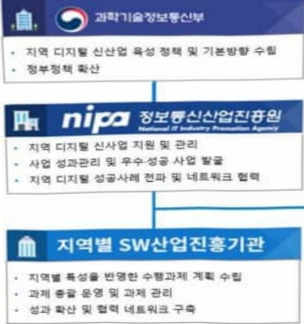
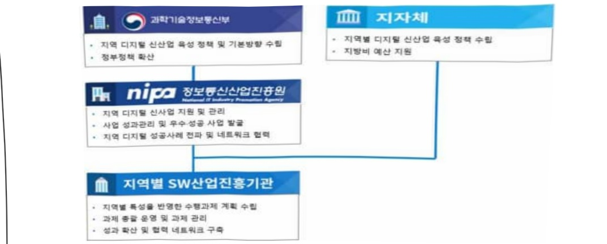

# AI선박 특화 플랫폼 및 애플리케이션 개발·실증

**해당 페이지**: PDF 472 ~ 477 쪽 해당

**부처**: 과학기술정보통신부
**분야**: 통신
**회계유형**: 기금
**2026 확정예산**: 5000.0 백만원
**전년대비 증감률**: None%
**AI 도메인**: 해양/수산, 디지털전환(AX)

---

<table border=1 style='margin: auto; word-wrap: break-word;'><tr><td style='text-align: center; word-wrap: break-word;'>사 업 명</td></tr><tr><td style='text-align: center; word-wrap: break-word;'>(46) AI선박 특화 플랫폼 및 애플리케이션 개발·실증 (4231-301)</td></tr></table>

□ 사업 코드 정보

<table border=1 style='margin: auto; word-wrap: break-word;'><tr><td style='text-align: center; word-wrap: break-word;'>구분</td><td style='text-align: center; word-wrap: break-word;'>기금</td><td style='text-align: center; word-wrap: break-word;'>소관</td><td style='text-align: center; word-wrap: break-word;'>실국(기관)</td><td style='text-align: center; word-wrap: break-word;'>계정</td><td style='text-align: center; word-wrap: break-word;'>분야</td><td style='text-align: center; word-wrap: break-word;'>부문</td></tr><tr><td style='text-align: center; word-wrap: break-word;'>코드</td><td rowspan="2">정진기금</td><td style='text-align: center; word-wrap: break-word;'>과학기술정보</td><td style='text-align: center; word-wrap: break-word;'>소프트웨어정책</td><td rowspan="2">-</td><td style='text-align: center; word-wrap: break-word;'>130</td><td style='text-align: center; word-wrap: break-word;'>133</td></tr><tr><td style='text-align: center; word-wrap: break-word;'>명칭</td><td style='text-align: center; word-wrap: break-word;'>통신부</td><td style='text-align: center; word-wrap: break-word;'>관</td><td style='text-align: center; word-wrap: break-word;'>통신</td><td style='text-align: center; word-wrap: break-word;'>정보통신</td></tr></table>

<table border=1 style='margin: auto; word-wrap: break-word;'><tr><td style='text-align: center; word-wrap: break-word;'>구분</td><td style='text-align: center; word-wrap: break-word;'>프로그램</td><td style='text-align: center; word-wrap: break-word;'>단위사업</td><td style='text-align: center; word-wrap: break-word;'>세부사업</td></tr><tr><td style='text-align: center; word-wrap: break-word;'>코드</td><td style='text-align: center; word-wrap: break-word;'>4200</td><td style='text-align: center; word-wrap: break-word;'>4231</td><td style='text-align: center; word-wrap: break-word;'>301</td></tr><tr><td style='text-align: center; word-wrap: break-word;'>명칭</td><td style='text-align: center; word-wrap: break-word;'>지역경제활성화</td><td style='text-align: center; word-wrap: break-word;'>광역경제권산업경쟁력강화(일반)</td><td style='text-align: center; word-wrap: break-word;'>AI선박 특화 플랫폼 및 애플리케이션 개발·실증</td></tr></table>

<table border=1 style='margin: auto; word-wrap: break-word;'><tr><td colspan="6">☐ 사업 성격 (공통요구자료 II-1 작성유의사항 4. 참조, 해당하는 사항에 “○” 표시)</td></tr><tr><td style='text-align: center; word-wrap: break-word;'>신규 계속</td><td style='text-align: center; word-wrap: break-word;'>완료</td><td style='text-align: center; word-wrap: break-word;'>예비타당성 실시여부</td><td style='text-align: center; word-wrap: break-word;'>총사업비 관리대상</td><td style='text-align: center; word-wrap: break-word;'>총액계상 예산사업</td><td style='text-align: center; word-wrap: break-word;'>사업소관 변경정보 2025예산 시 소관</td></tr><tr><td style='text-align: center; word-wrap: break-word;'>☐</td><td style='text-align: center; word-wrap: break-word;'></td><td style='text-align: center; word-wrap: break-word;'></td><td style='text-align: center; word-wrap: break-word;'></td><td style='text-align: center; word-wrap: break-word;'></td><td style='text-align: center; word-wrap: break-word;'></td></tr></table>

□ 사업 지원 형태 및 지원을 (최소한 한 개는 반드시 선택하시오. 해당사항에 O 표시)

<table border=1 style='margin: auto; word-wrap: break-word;'><tr><td style='text-align: center; word-wrap: break-word;'>직접</td><td style='text-align: center; word-wrap: break-word;'>출자</td><td style='text-align: center; word-wrap: break-word;'>출연</td><td style='text-align: center; word-wrap: break-word;'>보조</td><td style='text-align: center; word-wrap: break-word;'>융자</td><td style='text-align: center; word-wrap: break-word;'>국고보조율(%)</td><td style='text-align: center; word-wrap: break-word;'>융자율(%)</td></tr><tr><td style='text-align: center; word-wrap: break-word;'></td><td style='text-align: center; word-wrap: break-word;'></td><td style='text-align: center; word-wrap: break-word;'>○</td><td style='text-align: center; word-wrap: break-word;'></td><td style='text-align: center; word-wrap: break-word;'></td><td style='text-align: center; word-wrap: break-word;'></td><td style='text-align: center; word-wrap: break-word;'></td></tr></table>

## □사업 소관부처 및 시행주체

<table border=1 style='margin: auto; word-wrap: break-word;'><tr><td style='text-align: center; word-wrap: break-word;'>사업명</td><td colspan="2">구분</td></tr><tr><td rowspan="3">AI선박 특화 플랫폼 및 애플리케이션 개발·실증</td><td rowspan="2">소관부처</td><td style='text-align: center; word-wrap: break-word;'>소프트웨어정책관</td></tr><tr><td style='text-align: center; word-wrap: break-word;'>소프트웨어산업과</td></tr><tr><td style='text-align: center; word-wrap: break-word;'>사업시행주체</td><td style='text-align: center; word-wrap: break-word;'>정보통신산업진흥원</td></tr></table>

---

### 가.지출계획 총괄표

(단위: 백만원, %)

<table border=1 style='margin: auto; word-wrap: break-word;'><tr><td rowspan="2">사업명</td><td rowspan="2">2024년 결산</td><td colspan="2">2025년 예산</td><td colspan="2">2026년 예산</td><td rowspan="2">증감(B-A)</td><td rowspan="2">(B-A)/A</td></tr><tr><td style='text-align: center; word-wrap: break-word;'>본예산</td><td style='text-align: center; word-wrap: break-word;'>추경*(A)</td><td style='text-align: center; word-wrap: break-word;'>요구안</td><td style='text-align: center; word-wrap: break-word;'>본예산(B)</td></tr><tr><td style='text-align: center; word-wrap: break-word;'>AI선박 특화 플랫폼 및 애플리케이션 개발·실증</td><td style='text-align: center; word-wrap: break-word;'>-</td><td style='text-align: center; word-wrap: break-word;'>-</td><td style='text-align: center; word-wrap: break-word;'>-</td><td style='text-align: center; word-wrap: break-word;'>5,000</td><td style='text-align: center; word-wrap: break-word;'>5,000</td><td style='text-align: center; word-wrap: break-word;'>5000</td><td style='text-align: center; word-wrap: break-word;'>순증</td></tr></table>

* 추경: 추경증감액을 포함한 최종 예산액을 기재

## □ 기능별(내역사업별) 계획 내역

(단위: 백만원)

<table border=1 style='margin: auto; word-wrap: break-word;'><tr><td rowspan="2"></td><td colspan="5">2024</td><td colspan="5">2025</td><td rowspan="2">2026 계획</td></tr><tr><td style='text-align: center; word-wrap: break-word;'>계획액(추경)</td><td style='text-align: center; word-wrap: break-word;'>계획현액</td><td style='text-align: center; word-wrap: break-word;'>집행액</td><td style='text-align: center; word-wrap: break-word;'>이월액</td><td style='text-align: center; word-wrap: break-word;'>불용액</td><td style='text-align: center; word-wrap: break-word;'>계획액(추경)</td><td style='text-align: center; word-wrap: break-word;'>계획현액</td><td style='text-align: center; word-wrap: break-word;'>집행액</td><td style='text-align: center; word-wrap: break-word;'>이월액</td><td style='text-align: center; word-wrap: break-word;'>불용액</td></tr><tr><td style='text-align: center; word-wrap: break-word;'>○ 기능별 분류(합계)</td><td style='text-align: center; word-wrap: break-word;'>-</td><td style='text-align: center; word-wrap: break-word;'>-</td><td style='text-align: center; word-wrap: break-word;'>-</td><td style='text-align: center; word-wrap: break-word;'>-</td><td style='text-align: center; word-wrap: break-word;'>-</td><td style='text-align: center; word-wrap: break-word;'>-</td><td style='text-align: center; word-wrap: break-word;'>-</td><td style='text-align: center; word-wrap: break-word;'>-</td><td style='text-align: center; word-wrap: break-word;'>-</td><td style='text-align: center; word-wrap: break-word;'>-</td><td style='text-align: center; word-wrap: break-word;'>5,000</td></tr><tr><td style='text-align: center; word-wrap: break-word;'>• AI선박 특화 플랫폼 및 애플리케이션 개발·실증</td><td style='text-align: center; word-wrap: break-word;'>-</td><td style='text-align: center; word-wrap: break-word;'>-</td><td style='text-align: center; word-wrap: break-word;'>-</td><td style='text-align: center; word-wrap: break-word;'>-</td><td style='text-align: center; word-wrap: break-word;'>-</td><td style='text-align: center; word-wrap: break-word;'>-</td><td style='text-align: center; word-wrap: break-word;'>-</td><td style='text-align: center; word-wrap: break-word;'>-</td><td style='text-align: center; word-wrap: break-word;'>-</td><td style='text-align: center; word-wrap: break-word;'>-</td><td style='text-align: center; word-wrap: break-word;'>5,000</td></tr></table>

### 나. 사업설명자료

## 1 ) 사업목적·내용

- (사업목적) AI선박용 특화 플랫폼과 애플리케이션 구축 및 실증으로 조선·해운

산업의 디지털 전환 촉진과 글로벌 초격차 경쟁력 확보

- (사업내용) AI기반의 선박 중앙집중형 소프트웨어 플랫폼 및 통합 제어·운영 환경을 구축하고, AX솔루션 실 선박 실증을 통한 조선·해운 산업 확산 기반 마련

## 2 ) 사업개요

## 사업근거 및 추진경위

① 법령상 근거 조항 적시

- 소프트웨어진흥법 제3조(국가 및 지방자치단체의 책무), 제9조(지역별 소프트웨어산업 진흥)

---

제3조(국가와 지방자치단체의 책무) 국가와 지방자치단체는 소프트웨어산업을 진흥시키고 국가 전반의 소프트웨어 역량을 강화하는 데 필요한 각종 시책을 수립·시행하여야 한다.

제9조(지역별 소프트웨어산업 진흥)

① 과학기술정보통신부장관은 지역별 특성에 기반한 소프트웨어산업 진흥을 지원하고 지역 산업과의 융합을 촉진하여야 한다.

- 지방자치분권 및 지역군형발전에 관한 특별법 제14조(지역 산업 육성 및 일자리

창출 등 지역경제 활성화 촉진)

① 시·도지사는 관계 중앙행정기관의 장 및 관할 구역의 시·군·구의 시장·군수(광역시의 군수를 포함한다. 이하 같다)·구청장(자치구의 구청장을 말한다. 이하 같다)과 협의하여 해당 시·도의 지역특화산업을 선정할 수 있다. 이 경우 다음 각 호의 사항을 종합적으로 고려하여야 한다.

1. 국가의 성장잠재력과 경제성장에 대한 기여도

2. 지역일자리 창출 및 경쟁력 강화에 미치는 영향

3. 지역의 발전역량을 강화시킬 수 있는 가능성

② 초광역권설정 지방자치단체의 장은 초광역권설정 지방자치단체를 구성하는 지방자치단체의 장 및 관계 중앙행정기관의 장과 협의하여 해당 초광역권의 초광역권산업을 선정할 수 있다. 이 경우 제1항 각 호의 사항을 종합적으로 고려하여야 한다.

③ 국가와 지방자치단체는 지역특화산업과 초광역권산업을 육성하기 위하여 해당 산업의 구조 고도화와 투자 유치 촉진, 집적(集積) 및 기반 확충 등에 관한 시책을 추진하여야 한다.

④ 국가와 지방자치단체는 지역 산업의 육성과 지역경제의 활성화를 위하여 지역의 일자리 창출과 투자 유치활동 지원, 정보통신 진흥 및 지역 특성에 맞는 중소기업의 창업 여건 개선 등에 관한 시책을 추진하여야 한다.

⑤ 제3항에 따른 지역특화산업·초광역권산업 및 제4항에 따른 지역 산업의 육성과 지역경제 활성화 촉진을 위한 시책의 추진 및 추진절차에 관하여 필요한 사항은 대통령령으로 정한다.

-정보통신산업진흥법 제27조(사업),제28조(재원 등)

제27조(사업) 산업진흥원은 다음 각 호의 사업을 한다.

3. 정보통신산업 육성·발전 및 지원시설 등 기반조성사업

4. 정보통신기업의 창업·성장 등의 지원

제28조(재원 등)

① 정부는 예산 또는 기금의 범위에서 산업진흥원의 설립, 시설, 운영 및 사업 추진 등에 필요한 경비의 전부 또는 일부를 출연할 수 있다.

② 추진경위

- 대한민국 진짜성장을 위한 전략('25.6.), 국정기획위원회

- 자율운항(스마트)선박, 친환경 선박 등 미래 선박 분야 경쟁력 강화 및 기술개발 촉진 필요

- 새정부 경제성장전략('25.8.), 관계부처 합동

- AI 대전환에 따른 7대 선도 프로젝트 즉시시행을 통한 기술선도 촉진

* 7대 선도프로젝트 : AI 로봇, AI 지동차, AI 선박, AI 가전, AI 드론, AI 팩토리, AI 반도체

0 새정부 국정과제『AI 3대 강국 도약으로 여는 '모두의 AI' 시대('25.8.)』

- 21. 세계에서 AI를 가장 잘 쓰는 나라 구현

---

## 주요내용

① 사업규모

- 총사업비(해당되는 경우에만 기재) : 해당없음

- 사업기간 : 2026년 ~ 2029년

- 최근 5년 간 투입된 사업비(예산액기준, 추경편성한 연도에는 추경포함)

<table border=1 style='margin: auto; word-wrap: break-word;'><tr><td style='text-align: center; word-wrap: break-word;'>연도</td><td style='text-align: center; word-wrap: break-word;'>2022</td><td style='text-align: center; word-wrap: break-word;'>2023</td><td style='text-align: center; word-wrap: break-word;'>2024</td><td style='text-align: center; word-wrap: break-word;'>2025</td><td style='text-align: center; word-wrap: break-word;'>2026</td></tr><tr><td style='text-align: center; word-wrap: break-word;'>사업비</td><td style='text-align: center; word-wrap: break-word;'>-</td><td style='text-align: center; word-wrap: break-word;'>-</td><td style='text-align: center; word-wrap: break-word;'>-</td><td style='text-align: center; word-wrap: break-word;'>-</td><td style='text-align: center; word-wrap: break-word;'>5,000백만원</td></tr></table>

- 기타: 해당없음

② 사업추진체계

- 사업시행방법 : 출연(국비:지방비=2:1매칭)

- 사업시행주체 : 정보통신산업진흥원

- 사업 수혜자 : ICT·SW·조선해운 분야 기업, 지역SW산업진흥기관, 조선·해운 산업 종사자 등

- 보조, 융자, 출연, 출자 등의 경우 보조 · 융자 등 지원 비율 및 법적근거

<table border=1 style='margin: auto; word-wrap: break-word;'><tr><td style='text-align: center; word-wrap: break-word;'>내역사업명</td><td style='text-align: center; word-wrap: break-word;'>구분</td><td style='text-align: center; word-wrap: break-word;'>피보조·피출연 등 기관명</td><td style='text-align: center; word-wrap: break-word;'>지원 금액 (2026계획)</td><td style='text-align: center; word-wrap: break-word;'>지원 비율(%)</td><td style='text-align: center; word-wrap: break-word;'>보조율 법적근거 (해당 조항)</td></tr><tr><td style='text-align: center; word-wrap: break-word;'>AI선박 특화 플랫폼 및 애플리케이션 개발·실증</td><td style='text-align: center; word-wrap: break-word;'>출연</td><td style='text-align: center; word-wrap: break-word;'>정보통신 산업진흥원</td><td style='text-align: center; word-wrap: break-word;'>5,000</td><td style='text-align: center; word-wrap: break-word;'>100</td><td style='text-align: center; word-wrap: break-word;'>정보통신산업진흥법 제28조(재원 등)</td></tr></table>

## 3 ) 2026년도 계획 산출 근거

① AI선박 특화 플랫폼 및 애플리케이션 개발·실증

:(2025 본예산) 0 → (2026 요구) 5,000백만원, 순증

- (요구) AI선박용 특화 플랫폼 설계 및 통합운영 환경 구축과 선박-육상 연계 AX애플리케이션 개발 및 실운항 선박 검증을 위한 5,000백만원 요구

- (산출) 1개 과제 x 5,000백만원 x 12/12개월 = 5,000백만원

2025년도 예산 및 2026년도 예산안 산출 세부내역 비교

<table border=1 style='margin: auto; word-wrap: break-word;'><tr><td colspan="2">2025년 본예산</td><td colspan="2">2026년 예산안</td></tr><tr><td style='text-align: center; word-wrap: break-word;'>예산</td><td style='text-align: center; word-wrap: break-word;'>산출내역</td><td style='text-align: center; word-wrap: break-word;'>예산</td><td style='text-align: center; word-wrap: break-word;'>산출내역</td></tr><tr><td style='text-align: center; word-wrap: break-word;'>-</td><td style='text-align: center; word-wrap: break-word;'>-</td><td style='text-align: center; word-wrap: break-word;'>5,000</td><td style='text-align: center; word-wrap: break-word;'>○ 사업출연금(350-02): 5,000백만원 - AI선박 특화 플랫폼 및 애플리케이션 개발 실증(5,000백만원) • AI선박용 특화 플랫폼 설계 및 통합 제어·운영 환경 구축 (1식 x 2,600백만원 x 12/12개월 = 2,600백만원) • 선박·육상 연계 AX애플리케이션 개발 및 실운항 선박 검증 기반 조성 (1식 x 2,400백만원 x 12/12개월 = 2,400백만원)</td></tr></table>

---

## 4 ) 사업효과

□ 사업영향, 산출물 성과지표 등

① 2022~2026년도 성과계획서 상 성과지표 및 최근 5년간 성과 달성도

<table border=1 style='margin: auto; word-wrap: break-word;'><tr><td style='text-align: center; word-wrap: break-word;'>성과지표</td><td style='text-align: center; word-wrap: break-word;'>구분</td><td style='text-align: center; word-wrap: break-word;'>2025</td><td style='text-align: center; word-wrap: break-word;'>2026</td><td style='text-align: center; word-wrap: break-word;'>2027</td><td style='text-align: center; word-wrap: break-word;'>2028</td><td style='text-align: center; word-wrap: break-word;'>2029</td><td style='text-align: center; word-wrap: break-word;'>2026 목표치산출근거</td><td style='text-align: center; word-wrap: break-word;'>측정산식(또는 측정방법)</td><td style='text-align: center; word-wrap: break-word;'>자료수집방법(또는 자료출처)</td></tr><tr><td rowspan="3">선박 실증 건수(단위: 척, 누적)</td><td style='text-align: center; word-wrap: break-word;'>목표</td><td style='text-align: center; word-wrap: break-word;'>-</td><td style='text-align: center; word-wrap: break-word;'>(신규)</td><td style='text-align: center; word-wrap: break-word;'>1</td><td style='text-align: center; word-wrap: break-word;'>2</td><td style='text-align: center; word-wrap: break-word;'>3</td><td rowspan="3">선박 적용 및 실운항 실증 계획</td><td rowspan="3">ㅇ 측정방법: 기술 개발물 실증 투입완료 산박 수</td><td rowspan="3">실증 결과보고서, 실운항 검증자료</td></tr><tr><td style='text-align: center; word-wrap: break-word;'>실적</td><td style='text-align: center; word-wrap: break-word;'>-</td><td style='text-align: center; word-wrap: break-word;'>-</td><td style='text-align: center; word-wrap: break-word;'>-</td><td style='text-align: center; word-wrap: break-word;'>-</td><td style='text-align: center; word-wrap: break-word;'>-</td></tr><tr><td style='text-align: center; word-wrap: break-word;'>달성도</td><td style='text-align: center; word-wrap: break-word;'>-</td><td style='text-align: center; word-wrap: break-word;'>-</td><td style='text-align: center; word-wrap: break-word;'>-</td><td style='text-align: center; word-wrap: break-word;'>-</td><td style='text-align: center; word-wrap: break-word;'>-</td></tr><tr><td rowspan="3">조선·해운산업 확산 협력 건수(단위: 건)</td><td style='text-align: center; word-wrap: break-word;'>목표</td><td style='text-align: center; word-wrap: break-word;'>-</td><td style='text-align: center; word-wrap: break-word;'>1</td><td style='text-align: center; word-wrap: break-word;'>2</td><td style='text-align: center; word-wrap: break-word;'>3</td><td style='text-align: center; word-wrap: break-word;'>3</td><td rowspan="3">조선산업 내 AX 확산을 위한 주요 수요기업 및 관련 기관과의 전략적 협력(MOU)을 단계적으로 추진</td><td rowspan="3">ㅇ 측정방법: 플랫폼 및 애플레이션 활용·확산을 위해 체결된 업무협약(MOU) 건수</td><td rowspan="3">업무협약(MOU) 체결문</td></tr><tr><td style='text-align: center; word-wrap: break-word;'>실적</td><td style='text-align: center; word-wrap: break-word;'>-</td><td style='text-align: center; word-wrap: break-word;'>(신규)</td><td style='text-align: center; word-wrap: break-word;'>-</td><td style='text-align: center; word-wrap: break-word;'>-</td><td style='text-align: center; word-wrap: break-word;'>-</td></tr><tr><td style='text-align: center; word-wrap: break-word;'>달성도</td><td style='text-align: center; word-wrap: break-word;'>-</td><td style='text-align: center; word-wrap: break-word;'>(신규)</td><td style='text-align: center; word-wrap: break-word;'>-</td><td style='text-align: center; word-wrap: break-word;'>-</td><td style='text-align: center; word-wrap: break-word;'>-</td></tr></table>

* 선박 실증 건수 지표는 1차년도(26년) 특화 플랫폼 개발 후 2차년도(27년)부터 성과지표 적용

② 성과지표 이외의 연도별 사업추진 경과 및 실적

<table border=1 style='margin: auto; word-wrap: break-word;'><tr><td style='text-align: center; word-wrap: break-word;'>2025</td><td style='text-align: center; word-wrap: break-word;'>조선소, 해운선사 등 산업계 이해관계자 의견수렴 및 신규사업 기획·예산 확보</td></tr></table>

③향후(2026년도 이후)기대효과

- 조선해운 산업의 무인화와 디지털 전환을 기반으로 미래선박 중심의 차세대

조선산업 생태계를 구축하고, 대·중·소 기업의 상생 성장 촉진

- 글로벌 대형 기자재 기업 중심의 제어 시스템 종속구조 견제, 국내 조선해운

산업의 디지털 전환 및 AX선박 표준화 촉진

5) 타당성조사 및 예비타당성조사 시행여부 및 결과 요지 : 해당없음

6) 총사업비 대상사업 정보 : 해당없음

---

## 7 ) 사업 집행절차

씨 지자체

· 지역별 디지털 신산업 육성 정책 수립

<AI선박 특화 플랫폼 및 애플리케이션 개발·실증 >

<table border=1 style='margin: auto; word-wrap: break-word;'><tr><td style='text-align: center; word-wrap: break-word;'>부처</td><td style='text-align: center; word-wrap: break-word;'></td><td style='text-align: center; word-wrap: break-word;'>피출연·피보조기관</td><td style='text-align: center; word-wrap: break-word;'></td><td style='text-align: center; word-wrap: break-word;'>간접보조사업자·사업수행자</td></tr><tr><td style='text-align: center; word-wrap: break-word;'>과학기술정보통신부(5,000백만원)</td><td style='text-align: center; word-wrap: break-word;'>=&gt;(5,000백만원)</td><td style='text-align: center; word-wrap: break-word;'>정보통신산업진흥원(400백만원)</td><td style='text-align: center; word-wrap: break-word;'>=&gt;(4,600백만원)</td><td style='text-align: center; word-wrap: break-word;'>지역SW산업진흥기관 등</td></tr></table>

8) 각종 평가 : 해당없음

다. 최근 4년간 결산내역 : 해당없음

---

### 원본 PDF 크롭 이미지

