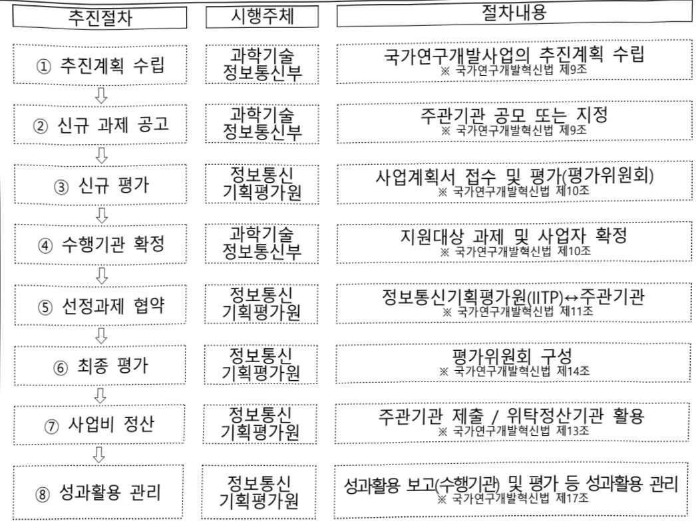

# AI연구용컴퓨팅지원프로젝트(R&D)

**해당 페이지**: PDF 478 ~ 484 쪽 해당

**부처**: 과학기술정보통신부
**분야**: 통신
**회계유형**: 일반회계
**2026 확정예산**: 16000.0 백만원
**전년대비 증감률**: 77.8%
**AI 도메인**: 클라우드/컴퓨팅, 디지털전환(AX)

---

### 가. 예산 총괄표

(단위: 백만원, %)

<table border=1 style='margin: auto; word-wrap: break-word;'><tr><td rowspan="2">사업명</td><td rowspan="2">2024년 결산</td><td colspan="2">2025년 예산</td><td colspan="2">2026년 예산</td><td rowspan="2">증감(B-A)</td><td rowspan="2">(B-A)/A</td></tr><tr><td style='text-align: center; word-wrap: break-word;'>본예산</td><td style='text-align: center; word-wrap: break-word;'>추경*(A)</td><td style='text-align: center; word-wrap: break-word;'>요구안</td><td style='text-align: center; word-wrap: break-word;'>본예산(B)</td></tr><tr><td style='text-align: center; word-wrap: break-word;'>AI연구용 컴퓨팅 지원 프로젝트(R&amp;D)</td><td style='text-align: center; word-wrap: break-word;'>-</td><td style='text-align: center; word-wrap: break-word;'>9,000</td><td style='text-align: center; word-wrap: break-word;'>-</td><td style='text-align: center; word-wrap: break-word;'>16,000</td><td style='text-align: center; word-wrap: break-word;'>16,000</td><td style='text-align: center; word-wrap: break-word;'>7,000</td><td style='text-align: center; word-wrap: break-word;'>77.8</td></tr></table>

*추경: 추경증감액을 포함한 최종 예산액을 기재

□ 기능별(내역사업별) 예산 내역

(단위:백만원)

<table border=1 style='margin: auto; word-wrap: break-word;'><tr><td rowspan="2"></td><td colspan="5">2024</td><td colspan="5">2025</td><td rowspan="2">2026 倉圧</td></tr><tr><td style='text-align: center; word-wrap: break-word;'>倉圧の (専門)</td><td style='text-align: center; word-wrap: break-word;'>倉圧の 専門</td><td style='text-align: center; word-wrap: break-word;'>倉圧の 専門</td><td style='text-align: center; word-wrap: break-word;'>倉圧の 専門</td><td style='text-align: center; word-wrap: break-word;'>倉圧の 専門</td><td style='text-align: center; word-wrap: break-word;'>倉圧の (専門)</td><td style='text-align: center; word-wrap: break-word;'>倉圧の 専門</td><td style='text-align: center; word-wrap: break-word;'>倉圧の 専門</td><td style='text-align: center; word-wrap: break-word;'>倉圧の 専門</td><td style='text-align: center; word-wrap: break-word;'>倉圧の 専門</td></tr><tr><td style='text-align: center; word-wrap: break-word;'>○ 기능별 분류(専門)</td><td style='text-align: center; word-wrap: break-word;'>-</td><td style='text-align: center; word-wrap: break-word;'>-</td><td style='text-align: center; word-wrap: break-word;'>-</td><td style='text-align: center; word-wrap: break-word;'>-</td><td style='text-align: center; word-wrap: break-word;'>-</td><td style='text-align: center; word-wrap: break-word;'>9,000</td><td style='text-align: center; word-wrap: break-word;'>9,000</td><td style='text-align: center; word-wrap: break-word;'>9,000</td><td style='text-align: center; word-wrap: break-word;'>-</td><td style='text-align: center; word-wrap: break-word;'>-</td><td style='text-align: center; word-wrap: break-word;'>16,000</td></tr><tr><td style='text-align: center; word-wrap: break-word;'>・ AI 연구용 검류팅 지원 프로젝트</td><td style='text-align: center; word-wrap: break-word;'>-</td><td style='text-align: center; word-wrap: break-word;'>-</td><td style='text-align: center; word-wrap: break-word;'>-</td><td style='text-align: center; word-wrap: break-word;'>-</td><td style='text-align: center; word-wrap: break-word;'>-</td><td style='text-align: center; word-wrap: break-word;'>9,000</td><td style='text-align: center; word-wrap: break-word;'>9,000</td><td style='text-align: center; word-wrap: break-word;'>9,000</td><td style='text-align: center; word-wrap: break-word;'>-</td><td style='text-align: center; word-wrap: break-word;'>-</td><td style='text-align: center; word-wrap: break-word;'>16,000</td></tr></table>

### 나. 사업설명자료

## 1 ) 사업목적·내용

- (AI연구용 컴퓨팅 지원 프로젝트) AI 및 AI활용 연구를 지원하기 위한 AI 컴퓨팅

자원 제공 및 AI 컴퓨팅 자원의 신속 활용 촉진

## 2 ) 사업개요

□ 사업근거 및 추진경위

① 법령상 근거 및 조항 적시

- 과학기술 기본법 제15조(기초연구의 진흥)

제15조(기초연구의 진흥) 정부는 과학기술혁신의 바탕이 되는 기초연구를 진흥시키기 위하여 대학과 정부가 출연하는 연구기관의 연구 및 상호 연계·협력을 활성화하고 안정적인 연구비를 지원하는 등 종합적인 시책을 세우고 추진하여야 한다.

---

- 정보통신산업 진흥법 제7조(정보통신기술진흥 시행계획)

제7조(정보통신기술진흥 시행계획) ① 과학기술정보통신부장관은 정보통신기술의 진흥을 위하여 진흥계획에 따라 다음 각 호의 사항이 포함된 정보통신기술진흥 시행계획을 매년 수립·시행하여야 한다. (중략)

3. 정보통신기술의 연구개발 및 다른 기술과의 결합 및 융합 촉진에 관한 사항 (이하 생략)

- 정보통신 진흥 및 융합 활성화 등에 관한 특별법 제32조(정보통신융합등 기술·서비스 개발 등의 지원)

제32조(정보통신융합등 기술·서비스 개발 등의 지원) ① 과학기술정보통신부장관은 다른 산업 및 서비스 등에 정보통신의 접목을 통하여 생산성과 가치를 높일 수 있도록 노력하여야 한다.

② 과학기술정보통신부장관은 정보통신융합등 기술·서비스의 개발을 촉진하기 위하여 다음 각 호의 사업을 추진할 수 있다.

1. 정보통신융합등 기술·서비스 관련 연구개발 사업 (이하 생략)

## ② 추진경위

- 인공지능국가전략('19.12월, 혁신성장전략회의)

▶ 차세대 AI 선점

○ 뚜렷한 주도국이 없는 창의적·도전적 차세대 AI 연구에 선제 투자

▶ AI인프라 확충

○ 인공지능 생태계 구축을 위한 AI인프라 확충·과제·일환으로 고성능 컴퓨팅 지원 추진

- 국가과학기술 육성방안('22.10월, 국가과학기술자문회의)

▶ 국가전략기술 육성으로 미래성장과 기술주권 확보

○ 12대 국가전략기술 중 인공지능기술을 통해 세계 최고수준 AI 기술강국 도약

- 인공지능 일상화 및 산업고도화계획('23.1월, 국가데이터정책위원회)

▶ AI를 국가 전반으로 확산하고 실질적 산업성과 창출

○ AI 핵심 10대 프로젝트에 투자, 국민과 혜택을 공유하면서 AI산업·기술 고도화를 추진

- 초거대AI경쟁력 강화방안('23.4월, 관계부처합동)

▶ AI 산업기반과 국내 초거대AI플랫폼 기잔으로 글로벌 시장에서 성과 창출

☐ 초거대 AI 한계돌파를 위한 차세대 미래원천기술 확보

- 2025년 국가연구개발 투자방향 및 기준('24.3월, 국가과학기술자문회의)

(인공지능) 공공·산업 문제해결에 특화된 핵심기술 개발과 차세대 인공지능 원천기술 확보를 위한 지원 확대

ㅇ 대규모 데이터 학습 등에 의존하지 않는 범용적AI(AGI) 등 차세대 인공지능 원천기술 확보를 위한 기술개발 지원 강화

---

- AI-반도체 이니셔티브('24.4월, 관계부처 합동)

▶ (중점 추진과제 3) AI-반도체 산업·연구 혁신 인프라 구축 대

○ (AI컴퓨팅 자원) AI컴퓨팅 자원 일괄 구매를 통한 저렴한 공급, 구독형 AI컴퓨팅 도입 및 제도 개선 등 ‘(가칭)AI for Sciecne’ 추진

- 국가 AI전략('24.9월, 관계부처 합동)

(4대 AI플래그십 프로젝트 1) 국가 AI컴퓨팅 인프라 대폭 확충

○ '30년까지 2EF 이상 : 최신 GPU 보유규모 현재 대비 15이상 확충

- 국가 AI역량 강화방안('25.2월, 국가AI위원회)

▶ AI컴퓨팅 인프라 확충을 통한 국가AI 역량 강화방안 발표

◯ AI 컴퓨팅 수요 대응을 위한 AI 컴퓨팅 지원 가용 확대

- 이재명 정부 123대 국정과제('25.9월, 국무회의)

▶ 세계를 이끄는 혁신경제 전략 1 : AI 3대 강국 도약

○ (20번) AI 3대 강국 도약을 위한 AI고속도로 구축

○ (21번) 세계에서 AI를 가장 잘 쓰는 나라 구현

## □ 주요내용

① 사업규모

- 총사업비(해당되는 경우에만 기재) : 해당 없음

- 사업기간 : '25~'27

-최근 5년 간 투입된 사업비(예산액기준, 추경편성한 연도에는 추경포함)

<table border=1 style='margin: auto; word-wrap: break-word;'><tr><td style='text-align: center; word-wrap: break-word;'>$ \underline{\text{所}} $</td><td style='text-align: center; word-wrap: break-word;'>2022</td><td style='text-align: center; word-wrap: break-word;'>2023</td><td style='text-align: center; word-wrap: break-word;'>2024</td><td style='text-align: center; word-wrap: break-word;'>2025</td><td style='text-align: center; word-wrap: break-word;'>2026</td></tr><tr><td style='text-align: center; word-wrap: break-word;'>$ \underline{\text{사}} $</td><td style='text-align: center; word-wrap: break-word;'>-</td><td style='text-align: center; word-wrap: break-word;'>-</td><td style='text-align: center; word-wrap: break-word;'>-</td><td style='text-align: center; word-wrap: break-word;'>9,000</td><td style='text-align: center; word-wrap: break-word;'>16,000</td></tr></table>

-기타: 해당없음

② 사업추진체계

- 사업시행방법 : 출연

-사업시행주체:정보통신기획평가원(IITP)

- 사업 수혜자 : 대학, 연구소 등 국내인공지능 연구자

- 보조, 융자, 출연, 출자 등의 경우 보조·융자 등 지원 비율 및 법적근거

<table border=1 style='margin: auto; word-wrap: break-word;'><tr><td style='text-align: center; word-wrap: break-word;'>내역사업명</td><td style='text-align: center; word-wrap: break-word;'>구분</td><td style='text-align: center; word-wrap: break-word;'>피보조·피출연 등 기관명</td><td style='text-align: center; word-wrap: break-word;'>지원 금액 (2026예산)</td><td style='text-align: center; word-wrap: break-word;'>지원 비율(%)</td><td style='text-align: center; word-wrap: break-word;'>보조율 법적근거 (해당 조항)</td></tr><tr><td style='text-align: center; word-wrap: break-word;'>AI 연구용 컴퓨팅 지원 프로젝트</td><td style='text-align: center; word-wrap: break-word;'>출연</td><td style='text-align: center; word-wrap: break-word;'>정보통신 기획평가원</td><td style='text-align: center; word-wrap: break-word;'>16,000</td><td style='text-align: center; word-wrap: break-word;'>100% 이내</td><td style='text-align: center; word-wrap: break-word;'>○ 정보통신 진흥 및 융합 활성화 등에 관한 특별법 제32조 ○ 혁신법 제13조 및 동법 시행령 제19조</td></tr></table>

---

## 3 ) 2026년도 예산 산출 근거

<table border=1 style='margin: auto; word-wrap: break-word;'><tr><td style='text-align: center; word-wrap: break-word;'>☐ AI연구용 컴퓨팅 지원 프로젝트 (2026 예산) 16,000백만원 - 고용량:고사양 AI 컴퓨팅 자원 확보 및 국내 연구자 지원 - (산출내역) (신규) 1개 과제 x GPU 약 450장 x 8개월 x 4.4백만원 = 16,000백만원 * GPU 장수 지원 외에 스토리지를 포함한 GPU 활용 기술 및 인프라 지원 금액 포함 ** 상기 편성된 GPU 지원 규모(H100기준)는 CSP 선정 후 협상 결과에 따라 변동 가능</td></tr></table>

## 4 ) 사업효과

☐ 사업영향, 산출물 성과지표 등

①2022~2026년도 성과계획서 상 성과지표 및 최근 5년간 성과 달성도

<table border=1 style='margin: auto; word-wrap: break-word;'><tr><td style='text-align: center; word-wrap: break-word;'>성과지표</td><td style='text-align: center; word-wrap: break-word;'>구분</td><td style='text-align: center; word-wrap: break-word;'>2022</td><td style='text-align: center; word-wrap: break-word;'>2023</td><td style='text-align: center; word-wrap: break-word;'>2024</td><td style='text-align: center; word-wrap: break-word;'>2025</td><td style='text-align: center; word-wrap: break-word;'>2026</td><td style='text-align: center; word-wrap: break-word;'>&#x27;26목표치산출근거</td><td style='text-align: center; word-wrap: break-word;'>측정산식(또는 측정방법)</td><td style='text-align: center; word-wrap: break-word;'>자료수집방법(또는 자료출처)</td></tr><tr><td rowspan="3">AI GPU 지원과제 수 (단위: 건)</td><td style='text-align: center; word-wrap: break-word;'>목표</td><td style='text-align: center; word-wrap: break-word;'>-</td><td style='text-align: center; word-wrap: break-word;'>-</td><td style='text-align: center; word-wrap: break-word;'>-</td><td style='text-align: center; word-wrap: break-word;'>19</td><td style='text-align: center; word-wrap: break-word;'>33</td><td rowspan="3">&#x27;25년 과제 평균 90억원 지원 기준 19건으로 설정후 지원 과제 수는 전년도 예산 기준 대비 증가율에 따라 목표 설정&#x27;（25년대비 &#x27;26년 예산 77%증가, 전년대비 과제수도 77%증가한 33개로 설정）</td><td rowspan="3">AI 컴퓨팅 자원을 지원받는 과제 확정 건수 측정</td><td rowspan="3">성과분석 보고서</td></tr><tr><td style='text-align: center; word-wrap: break-word;'>실적</td><td style='text-align: center; word-wrap: break-word;'>-</td><td style='text-align: center; word-wrap: break-word;'>-</td><td style='text-align: center; word-wrap: break-word;'>-</td><td style='text-align: center; word-wrap: break-word;'>28</td><td style='text-align: center; word-wrap: break-word;'>-</td></tr><tr><td style='text-align: center; word-wrap: break-word;'>달성도</td><td style='text-align: center; word-wrap: break-word;'>-</td><td style='text-align: center; word-wrap: break-word;'>-</td><td style='text-align: center; word-wrap: break-word;'>-</td><td style='text-align: center; word-wrap: break-word;'>147%</td><td style='text-align: center; word-wrap: break-word;'>-</td></tr><tr><td rowspan="3">연구자 만족도 (단위: %)</td><td style='text-align: center; word-wrap: break-word;'>목표</td><td style='text-align: center; word-wrap: break-word;'>-</td><td style='text-align: center; word-wrap: break-word;'>-</td><td style='text-align: center; word-wrap: break-word;'>-</td><td style='text-align: center; word-wrap: break-word;'>70.0</td><td style='text-align: center; word-wrap: break-word;'>73.5</td><td rowspan="3">신규 지표 임을 감안하여 보통 이상의 수준인 70점을 최초 목표치로 설정하고, 매년 전년대비 5%책상향 (단, 향후 실적에 따라 상향록 증감)</td><td rowspan="3">지원연구자 대상 만족도 조사</td><td rowspan="3">설문조사 및 결과 집계·분석</td></tr><tr><td style='text-align: center; word-wrap: break-word;'>실적</td><td style='text-align: center; word-wrap: break-word;'>-</td><td style='text-align: center; word-wrap: break-word;'>-</td><td style='text-align: center; word-wrap: break-word;'>-</td><td style='text-align: center; word-wrap: break-word;'>-</td><td style='text-align: center; word-wrap: break-word;'>-</td></tr><tr><td style='text-align: center; word-wrap: break-word;'>달성도</td><td style='text-align: center; word-wrap: break-word;'>-</td><td style='text-align: center; word-wrap: break-word;'>-</td><td style='text-align: center; word-wrap: break-word;'>-</td><td style='text-align: center; word-wrap: break-word;'>-</td><td style='text-align: center; word-wrap: break-word;'>-</td></tr><tr><td rowspan="3">오픈소스/모델 공개 실적 (단위: 누적건수)</td><td style='text-align: center; word-wrap: break-word;'>목표</td><td style='text-align: center; word-wrap: break-word;'>-</td><td style='text-align: center; word-wrap: break-word;'>-</td><td style='text-align: center; word-wrap: break-word;'>-</td><td style='text-align: center; word-wrap: break-word;'>6</td><td style='text-align: center; word-wrap: break-word;'>10</td><td rowspan="3">신규지표임을 감안하여 매년 고성능 및 혁신적 개발 성과도출목표로 총 지원과제의 30%로 설정하여 오픈소스/모델 출시/배포 (연도별 출시계획 수립/실적점검)</td><td rowspan="3">연도별 오픈소스/모델 출시/배포 성과를 입증할 수 있는 서류 확인</td><td rowspan="3">오픈소스/모델 출시/배포 보고서</td></tr><tr><td style='text-align: center; word-wrap: break-word;'>실적</td><td style='text-align: center; word-wrap: break-word;'>-</td><td style='text-align: center; word-wrap: break-word;'>-</td><td style='text-align: center; word-wrap: break-word;'>-</td><td style='text-align: center; word-wrap: break-word;'>-</td><td style='text-align: center; word-wrap: break-word;'>-</td></tr><tr><td style='text-align: center; word-wrap: break-word;'>달성도</td><td style='text-align: center; word-wrap: break-word;'>-</td><td style='text-align: center; word-wrap: break-word;'>-</td><td style='text-align: center; word-wrap: break-word;'>-</td><td style='text-align: center; word-wrap: break-word;'>-</td><td style='text-align: center; word-wrap: break-word;'>-</td></tr><tr><td rowspan="3">세계 최고 수준(Top-tier) 학술대회 기술논문 발표건수 (단위: 건수)</td><td style='text-align: center; word-wrap: break-word;'>목표</td><td style='text-align: center; word-wrap: break-word;'>-</td><td style='text-align: center; word-wrap: break-word;'>-</td><td style='text-align: center; word-wrap: break-word;'>-</td><td style='text-align: center; word-wrap: break-word;'>2</td><td style='text-align: center; word-wrap: break-word;'>3</td><td rowspan="3">신규지표임을 감안, 혁신연구 지원 대상을 기준으로 세계 최고 수준(Top-tier) 전파런스 준비시점 등을 고려하여 적용 * 매년 과제별 모델 공개 2건 이상</td><td rowspan="3">세계 최고 수준(Top-tier) 전파런스 논문 개재 수</td><td rowspan="3">세계 최고 수준(Top-tier) 전파런스 논문 개재 수</td></tr><tr><td style='text-align: center; word-wrap: break-word;'>실적</td><td style='text-align: center; word-wrap: break-word;'>-</td><td style='text-align: center; word-wrap: break-word;'>-</td><td style='text-align: center; word-wrap: break-word;'>-</td><td style='text-align: center; word-wrap: break-word;'>-</td><td style='text-align: center; word-wrap: break-word;'>-</td></tr><tr><td style='text-align: center; word-wrap: break-word;'>달성도</td><td style='text-align: center; word-wrap: break-word;'>-</td><td style='text-align: center; word-wrap: break-word;'>-</td><td style='text-align: center; word-wrap: break-word;'>-</td><td style='text-align: center; word-wrap: break-word;'>-</td><td style='text-align: center; word-wrap: break-word;'>-</td></tr></table>

② 성과지표 이외의 연도별 사업추진 경과 및 실적

<table border=1 style='margin: auto; word-wrap: break-word;'><tr><td style='text-align: center; word-wrap: break-word;'>2025</td><td style='text-align: center; word-wrap: break-word;'>고성능 컴퓨팅 지원 연구과제 28개 추진</td></tr></table>

③ 향후(2026년도 이후) 기대효과 : 고성능 연산자원이 필요한 AI 연구 분야에 즉시 대응할 수 있으며, 유연한 자원배분 및 할당을 통한 글로벌 수준의 연구 성과 도출 지원

---

5) 타당성조사 및 예비타당성조사 시행여부 및 결과 요지 : 해당 없음

6) 총사업비 대상사업 여부 및 내역 : 해당 없음

7) 사업 집행절차

- AI연구용 컴퓨팅 지원 프로젝트 내역사업

<table border=1 style='margin: auto; word-wrap: break-word;'><tr><td style='text-align: center; word-wrap: break-word;'>부처</td><td style='text-align: center; word-wrap: break-word;'></td><td style='text-align: center; word-wrap: break-word;'>피출연·피보조기관</td><td style='text-align: center; word-wrap: break-word;'></td><td style='text-align: center; word-wrap: break-word;'>간접보조사업자·사업수행자</td></tr><tr><td style='text-align: center; word-wrap: break-word;'>과학기술정보통신부(16,000백만원)</td><td style='text-align: center; word-wrap: break-word;'>=&gt;(16,000백만원)</td><td style='text-align: center; word-wrap: break-word;'>정보통신기획평가원(-)</td><td style='text-align: center; word-wrap: break-word;'>=&gt;(16,000백만원)</td><td style='text-align: center; word-wrap: break-word;'>한국전자기술연구원외 1개 기관</td></tr></table>

8) 각종 평가 : 해당 없음

---

### 다. 최근 4년간 결산내역

## 1 ) 결산표

☐ 부처 결산내역

(단위: 백만원, %)

<table border=1 style='margin: auto; word-wrap: break-word;'><tr><td rowspan="2">연도</td><td colspan="3">예산액</td><td rowspan="2">예산현액(A)</td><td rowspan="2">집행액(B)</td><td rowspan="2">집행를(B/A)</td><td rowspan="2">다음연도이월액</td><td rowspan="2">불용액</td></tr><tr><td style='text-align: center; word-wrap: break-word;'>본예산</td><td style='text-align: center; word-wrap: break-word;'>추경중감액</td><td style='text-align: center; word-wrap: break-word;'>추경</td></tr><tr><td style='text-align: center; word-wrap: break-word;'>2025</td><td style='text-align: center; word-wrap: break-word;'>9,000</td><td style='text-align: center; word-wrap: break-word;'>-</td><td style='text-align: center; word-wrap: break-word;'>-</td><td style='text-align: center; word-wrap: break-word;'>9,000</td><td style='text-align: center; word-wrap: break-word;'>9,000</td><td style='text-align: center; word-wrap: break-word;'>100</td><td style='text-align: center; word-wrap: break-word;'>-</td><td style='text-align: center; word-wrap: break-word;'>-</td></tr></table>

## 2 ) 주요 결산사항

2022~2025년 결산 주요사항 : 해당없음

2025년 이·전용 등 세부내역 : 해당없음

---

<table border=1 style='margin: auto; word-wrap: break-word;'><tr><td style='text-align: center; word-wrap: break-word;'>사 업 명</td></tr><tr><td style='text-align: center; word-wrap: break-word;'>(35) AI융합 지능형 농업 생태계 구축 (2601-408)</td></tr></table>

사업 코드 정보

<table border=1 style='margin: auto; word-wrap: break-word;'><tr><td style='text-align: center; word-wrap: break-word;'>구분</td><td style='text-align: center; word-wrap: break-word;'>회계</td><td style='text-align: center; word-wrap: break-word;'>소관</td><td style='text-align: center; word-wrap: break-word;'>실국(기관)</td><td style='text-align: center; word-wrap: break-word;'>계정</td><td style='text-align: center; word-wrap: break-word;'>분야</td><td style='text-align: center; word-wrap: break-word;'>부문</td></tr><tr><td style='text-align: center; word-wrap: break-word;'>코드</td><td style='text-align: center; word-wrap: break-word;'>지역균형발전</td><td style='text-align: center; word-wrap: break-word;'>과학기술정보</td><td style='text-align: center; word-wrap: break-word;'>인공지능</td><td rowspan="2">지역지원</td><td style='text-align: center; word-wrap: break-word;'>130</td><td style='text-align: center; word-wrap: break-word;'>133</td></tr><tr><td style='text-align: center; word-wrap: break-word;'>명칭</td><td style='text-align: center; word-wrap: break-word;'>특별회계</td><td style='text-align: center; word-wrap: break-word;'>통신부</td><td style='text-align: center; word-wrap: break-word;'>정책기획관</td><td style='text-align: center; word-wrap: break-word;'>통신</td><td style='text-align: center; word-wrap: break-word;'>정보통신</td></tr></table>

<table border=1 style='margin: auto; word-wrap: break-word;'><tr><td style='text-align: center; word-wrap: break-word;'>구분</td><td style='text-align: center; word-wrap: break-word;'>프로그램</td><td style='text-align: center; word-wrap: break-word;'>단위사업</td><td style='text-align: center; word-wrap: break-word;'>세부사업</td></tr><tr><td style='text-align: center; word-wrap: break-word;'>코드</td><td style='text-align: center; word-wrap: break-word;'>2600</td><td style='text-align: center; word-wrap: break-word;'>2601</td><td style='text-align: center; word-wrap: break-word;'>408</td></tr><tr><td style='text-align: center; word-wrap: break-word;'>명칭</td><td style='text-align: center; word-wrap: break-word;'>인공지능데이터진흥</td><td style='text-align: center; word-wrap: break-word;'>AI기술개발(지틀)</td><td style='text-align: center; word-wrap: break-word;'>AI융합 지능형 농업생태계 구축</td></tr></table>

<table border=1 style='margin: auto; word-wrap: break-word;'><tr><td colspan="6">☐ 사업 성격 (공통요구자료 Ⅱ-1 작성유의사항 4. 참조, 해당하는 사항에 “○” 표시)</td></tr><tr><td rowspan="2">신규 계속</td><td rowspan="2">완료</td><td rowspan="2">예비타당성 실시여부</td><td rowspan="2">총사업비 관리대상</td><td rowspan="2">총액계상 예산사업</td><td style='text-align: center; word-wrap: break-word;'>사업소관 변경정보</td></tr><tr><td style='text-align: center; word-wrap: break-word;'>2025예산 시 소관</td></tr><tr><td style='text-align: center; word-wrap: break-word;'></td><td style='text-align: center; word-wrap: break-word;'>○</td><td style='text-align: center; word-wrap: break-word;'></td><td style='text-align: center; word-wrap: break-word;'></td><td style='text-align: center; word-wrap: break-word;'></td><td style='text-align: center; word-wrap: break-word;'></td></tr></table>

□ 사업 지원 형태 및 지원율

<table border=1 style='margin: auto; word-wrap: break-word;'><tr><td style='text-align: center; word-wrap: break-word;'>직접</td><td style='text-align: center; word-wrap: break-word;'>출자</td><td style='text-align: center; word-wrap: break-word;'>출연</td><td style='text-align: center; word-wrap: break-word;'>보조</td><td style='text-align: center; word-wrap: break-word;'>융자</td><td style='text-align: center; word-wrap: break-word;'>국고보조율(%)</td><td style='text-align: center; word-wrap: break-word;'>융자율(%)</td></tr><tr><td style='text-align: center; word-wrap: break-word;'></td><td style='text-align: center; word-wrap: break-word;'></td><td style='text-align: center; word-wrap: break-word;'>○</td><td style='text-align: center; word-wrap: break-word;'></td><td style='text-align: center; word-wrap: break-word;'></td><td style='text-align: center; word-wrap: break-word;'></td><td style='text-align: center; word-wrap: break-word;'></td></tr></table>

□사업 소관부처 및 시행주체

<table border=1 style='margin: auto; word-wrap: break-word;'><tr><td style='text-align: center; word-wrap: break-word;'>사업명</td><td colspan="2">구분</td></tr><tr><td rowspan="3">AI융합 지능형 농업생태계 구축</td><td rowspan="2">소관부처</td><td style='text-align: center; word-wrap: break-word;'>인공지능정책실 인공지능정책기획관</td></tr><tr><td style='text-align: center; word-wrap: break-word;'>디지털인재양성과</td></tr><tr><td style='text-align: center; word-wrap: break-word;'>사업시행주체</td><td style='text-align: center; word-wrap: break-word;'>정보통신산업진흥원</td></tr></table>

---

### 원본 PDF 크롭 이미지

